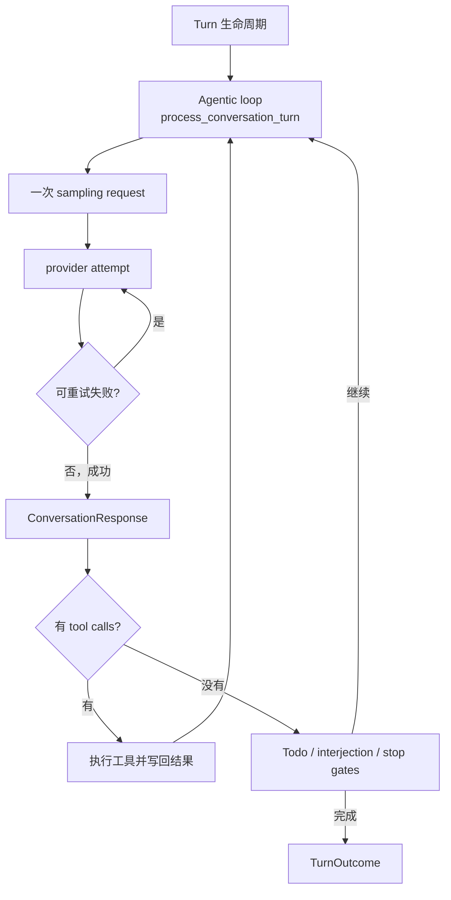
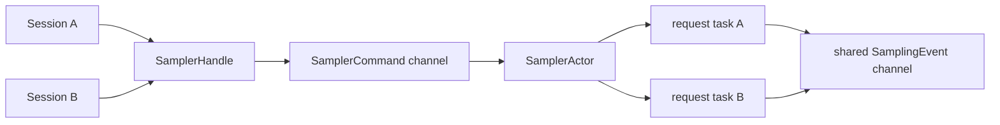

# Sampling、流式响应与 Agentic Loop

## 这篇解决什么问题

本文聚焦一次 turn 内部怎样反复调用模型和工具。重点不是某家 provider 的 HTTP 格式，而是 Grok Build 自己的分层：Session 构造请求，Sampler actor 管理并发请求，per-request task 处理 stream/retry，Session 再把事件转换成客户端更新并决定是否执行工具或结束。

## 三层循环必须分开



三层的停止条件不同：

1. **Provider attempt retry**：网络、限流、空响应等符合 retry policy 时重试同一请求。
2. **Agentic loop**：模型请求工具，工具结果加入历史后重新构造新请求。
3. **Turn**：可能包裹 recovery、stop hook、goal continuation 等更高层行为。

把它们都叫“模型重试”会导致错误的 token、权限和取消理解。

## 核心文件与符号

| 文件 | 符号 | 职责 |
| --- | --- | --- |
| `session/acp_session_impl/turn.rs` | `process_conversation_turn` | agentic loop、请求构造、响应写回、工具分支和终止 gate |
| `session/acp_session_impl/sampler_turn.rs` | `prepare_sampler_for_turn` | 从 session live state 重建并推送 sampler config |
| 同上 | `run_turn_via_sampler` | 提交请求、等待结果、处理 auth/compaction recovery |
| `xai-grok-sampler/src/handle.rs` | `SamplerHandle` | session 使用的 sampler actor 代理 |
| `xai-grok-sampler/src/commands.rs` | `SamplerCommand` | Submit、Cancel、UpdateConfig、查询 active request |
| `xai-grok-sampler/src/actor/mod.rs` | `SamplerActor` | 保存 sampler 全局状态并 spawn per-request task |
| `xai-grok-sampler/src/actor/request_task.rs` | `run_request_task` | 一次 sampling request 的 stream、attempt 和 retry |
| `xai-grok-sampler/src/events.rs` | `SamplingEvent` | stream token、tool delta、retry、失败、完成等事件 |
| `session/acp_session_impl/tool_calls.rs` | `handle_sampling_event` | 把 sampler event 翻译为 ACP/session 更新 |
| 同上 | `execute_tool_calls` / `prepare_tool_call` | 工具预处理、权限和执行结果回流 |

前四个 session 路径相对于 `crates/codegen/xai-grok-shell/src/`；sampler 路径相对于 `crates/codegen/`。

## 第一阶段：每个 turn 先准备模型与工具

`process_conversation_turn` 开始时会：

- 处理 resume 后的模型 metadata；
- 必要时因模型切换触发 compaction；
- 记录 turn 开始时间；
- 调用 `prepare_tool_definitions_timed` 等待/收集工具定义；
- 初始化 turn 内的计数器和 guard。

关键局部状态包括：

| 状态 | 作用 |
| --- | --- |
| `turn_tools_called` | 累积本 turn 调过的工具名称 |
| `tool_turn_count` | 限制或统计工具轮次 |
| `loop_index` | agentic loop 迭代编号 |
| `identical_tool_calls` | 检测重复工具动作造成的 stationarity |
| `todo_gate_fires` | 限制 TodoGate 重新提示次数 |
| `auth_retry_schedule` | 限制 session 级 401 恢复与重提交 |
| `turn_span_totals` | 跨多次模型调用累计 token 和 tool-call presence |
| `structured_output_retries` | 限制 schema 不匹配后的纠正次数 |

这些计数器属于一次 turn，不是 sampler actor 的全局状态。

## 第二阶段：进入 agentic loop

每次 `loop` 开头先发 `LoopStarted`，然后检查重复动作。

### Stationarity 防护

如果连续相同工具调用达到 nudge 阈值，Session 注入提醒，要求模型打破重复；达到 hard-stop 阈值，则返回 `TurnOutcome::StationarityEnded`。

特殊的 `true` no-op 有更低阈值，因为反复运行永远成功但不改变状态的命令，是典型无进展循环。

### 合并 turn 中途的新状态

在每次重新 sampling 前，Session 可能 drain 或注入：

- 用户 interjection；
- skill reminder；
- monitor event；
- memory context；
- MCP reminder；
- two-pass prefire；
- auto compaction。

因此，工具执行到下一次模型调用之间不是简单地“append tool result”，还可能吸收运行过程中发生的新信息。

## 第三阶段：构造 `ConversationRequest`

### 1. 计算本轮工具列表

工具来源可能包括：

- agent/tool bridge 的普通工具定义；
- fork/turn 级 override；
- MCP 工具；
- backend-hosted tools；
- 为 structured output 临时加入的 `StructuredOutput` synthetic tool。

`structured_output` 有两种策略：

- provider backend 原生支持 schema：把 `json_schema` 直接写进请求；
- backend 不支持：临时暴露 `StructuredOutput` 工具，让模型以工具参数返回最终 JSON。

### 2. ChatState 构造请求

Session 调用：

```text
chat_state_handle.build_request(
    effective_tools,
    memory_reminder,
    memory_enabled,
    trace_context,
    session_id,
    request_id,
)
```

ChatState 才是 conversation 的拥有者。它根据当前 system/user/assistant/tool history 和 sampling config 生成 `ConversationRequest`。

随后 Session 补充：

- `x_grok_session_id`；
- turn index；
- agent ID；
- deployment ID；
- native JSON schema；
- hosted tools；
- 经过 task budget clamp 的 `max_output_tokens`。

然后把 phase 更新为 `WaitingForModel` / `Sampling`。

## 第四阶段：把请求交给 Sampler actor

### 1. 每次 turn 前更新 sampler config

`prepare_sampler_for_turn` 从 session 的 live chat state 重建完整 `SamplerConfig`，应用本 turn 的 retry/idle-timeout 等选择，然后调用：

```text
sampler_handle.update_config(sampler_config)
```

这样模型切换、认证刷新或 header 变化不要求销毁并重建整个 sampler actor。

### 2. 为请求生成独立 ID

`run_turn_via_sampler` 生成随机 `RequestId`，通过 `SamplerHandle::submit_and_collect` 发送请求并等待最终 `ConversationResponse`。

“collect” 只表示等待这个 sampling request 的最终结果。streaming event 仍通过共享 event channel 实时发出，并由 Session 的事件消费路径转换成 UI/ACP update。

### 3. Sampler actor 的内部结构

`SamplerActor` 拥有：

- command receiver；
- event sender；
- 默认 config 和 retry policy；
- active request map；
- `JoinSet<RequestId>`。

它本身逐个处理 command，但每个 `Submit` 会 spawn 一个 `run_request_task`，所以不同 session/request 可以并发 streaming。



图中是否所有 session 共享同一个 sampler actor，应以 session spawn/handle 创建位置为准；本文只表达 actor 能维护多个 active request 的实现能力，不推断部署拓扑必然全局单例。

### 4. `SamplerCommand`

| 命令 | 含义 |
| --- | --- |
| `Submit` | 提交 request，可附单次 config 与 completion oneshot |
| `Cancel` | 触发对应 active request 的 cancellation token |
| `UpdateConfig` | 更新后续请求使用的默认 config |
| `IsActive` | 查询某个 request 是否仍在运行 |
| `ActiveCount` | 查询当前 active request 数量 |

大型 request/config 被 `Box` 包装，使 command enum 本身较小，降低通过 channel 移动时的栈尺寸和复制压力。

## 第五阶段：Per-request task 负责 stream 与 retry

`run_request_task` 才真正运行单个请求。它：

- 建立 sampling span；
- 根据 config/provider 发起请求；
- 消费 provider stream；
- 把原始 stream 转换成统一事件和最终 response；
- 根据 retry policy 判断失败是否重试；
- 观察 cancellation token；
- 最终通过 completion oneshot 返回 response/error；
- 通过 `SamplingEvent` 同步报告过程。

Sampler actor 不阻塞等待某个 request 完成。request task 结束后通过 `JoinSet` 返回 request ID，actor 从 active map 清理它。

如果提交重复的 request ID，actor 会 cancel 旧 request，防止泄漏。Actor 自身结束时，也会 cancel 所有仍 active 的请求并 shutdown JoinSet。

## 第六阶段：`SamplingEvent` 怎样变成可见更新

主要事件包括：

| 事件 | 表达什么 |
| --- | --- |
| `StreamStarted` | HTTP stream 已建立并读到 headers |
| `FirstToken` | 首个内容 token 到达 |
| `ChannelToken` | 文本或 reasoning 增量 |
| `ToolCallDelta` | 工具名/ID/参数 JSON 的流式片段 |
| `ResponseStarted` | provider 已提供真实 message ID、model 和输入 token |
| `ReasoningCompleted` | reasoning block 完成并得到 signature |
| `Retrying` | sampler 将按策略重新 attempt |
| `Completed` | 统一 `ConversationResponse` 与 latency metrics 已形成 |
| `Failed` | 不再重试的最终失败 |
| `ModelMetadata` | response header 中的模型 metadata |
| `BackendToolCallStarted/Completed` | provider 侧托管工具的进度 |

Session 的 `handle_sampling_event` 会根据 request ID 筛选并翻译事件，例如：

- text token → `AgentMessageChunk`；
- reasoning token → 对应 reasoning update；
- tool delta → 流式工具调用参数更新；
- retry → retry state notification；
- backend tool → ACP `ToolCall` / `ToolCallUpdate`；
- metadata → chat state 和客户端状态更新。

### Stream-drain barrier

`submit_and_collect` 的 completion 与 event channel 的最后几个事件可能在并发调度下先后接近。`run_turn_via_sampler` 在成功后等待 `turn_stream_drained` oneshot，最多 5 秒，再允许外层发工具调用状态。

目的是尽量保证 event ID 顺序：最后一个文本/reasoning delta 应先于随后根据完整 response 生成的 tool-call update。超时只警告并继续，避免事件消费者故障永久卡死 turn。

## 第七阶段：Session 消费完整 response

成功得到 `ConversationResponse` 后，Session：

1. 重置 auth retry schedule；
2. 记录总耗时、TTFT、ITL、attempt 数和 token usage；
3. 更新 chat-state token 统计与 session signals；
4. 累积本 turn 跨多次 sampling 的 `TurnSpanTotals`；
5. 保存 model fingerprint；
6. 把 assistant item 写入 conversation；
7. 把 response 中非 assistant item 按 tool result 写入；
8. 必要时补发 fallback text 或 content-filter notice；
9. 发出 response-completed update。

模型 response 在这里既是“本次 sampling 的结果”，也成为“下一次 sampling 的历史输入”。

## 第八阶段：无工具时怎样真正结束

`tool_calls.is_empty()` 并不总是立即返回：

- TodoGate 可能发现仍有 pending/in-progress todo，注入 reminder 后继续；
- turn 中途到达的 interjection 可能被 drain，继续；
- structured output 需要验证 JSON/schema；
- stop hook 或更外层 recovery 可能要求继续。

所有 gate 通过后，Session 调用 `finalize_turn_bookkeeping`，形成 snapshot 并返回 `TurnOutcome::Completed`。

Provider content filter 是一个特殊结束：如果 response 为空，会向客户端发解释性 notice；最终 stop reason 映射为 `Refusal`。

## 第九阶段：有工具时怎样回到循环

工具调用主流程可压缩为：

```text
ConversationResponse.tool_calls
→ prepare_tool_call
→ 解析参数与定位工具
→ hooks / permission / plan-mode 等 preflight
→ PreparedToolCall
→ dispatch_tool
→ ToolRunResult 或 ToolError
→ UI ToolCallUpdate
→ ConversationItem::ToolResult
→ continue agentic loop
```

多个 approved tool call 会放入 `FuturesUnordered` 并发执行，但对相同写路径会建立 file lock，避免同一批工具同时改同一目标。结果按完成顺序 drain，同时依靠原始 index 与 call ID 维持关联。

工具失败通常也形成 tool result 写回模型，允许模型修正参数、换工具或解释失败。Permission reject、cancel、followup 等 `ToolLoop` 结果则可能影响本轮后续控制流。

详细权限、工具分类和 workspace 副作用将在工具执行专章展开。

## Recovery 分层

### Sampler 内部 retry

由 `RetryPolicy` 和 `SamplingError::is_retryable` 等决定。典型分类包括 HTTP、rate limit、idle timeout、empty response、max-token truncation 和 doom-loop detection。

### Session 级 auth recovery

Sampler 把 401 作为 typed error 交还 Session。`run_turn_via_sampler` / `handle_sampling_failure` 可能刷新 credential，并返回 `RefreshAuthAndResubmit`。外层 `auth_retry_schedule` 负责预算、backoff 和 runaway guard。

### Session 级 compaction recovery

Sampler 不拥有完整、带 token 跟踪的 conversation，无法可靠决定 context overflow 的压缩策略。它把带 status/metadata 的错误交给 Session；Session 判断后执行 compaction，并返回 `CompactAndResubmit`，使 agentic loop `continue`。

### Required-tool recovery

`process_conversation_turn_with_recovery` 位于 agentic loop 外，可以在模型未调用要求工具时加入 recovery prompt，再运行一轮完整 conversation turn。

这四类 retry/resubmit 的责任不能合并：它们拥有的信息和预算不同。

## 取消语义

`SamplerCommand::Cancel` 找到 active request 并触发 cancellation token。Request task 必须在网络读取、backoff 或处理循环中观察取消，最后终止 completion。

但取消整个 turn 还需要 Session 处理工具、permission、subagent、queue、usage 和 terminal event。因此 cancel sampler 只是 turn cancellation 的一个子步骤。

## Token 与性能统计

### 一次 response

记录 prompt、cached prompt、completion、reasoning token，以及 TTFT、ITL、attempt 和 tokens/sec。

### 整个 turn

`TurnSpanTotals` 对多次模型调用的 token 做求和，因为每次调用都可能产生费用；`has_tool_call` 做 OR，因为最终一次没有工具不代表本 turn 从未调用过工具。

### 为什么不能只看最终 response

一次 turn 如果经历三次模型调用，最后 response 的 usage 只描述第三次请求。诊断成本或预算时必须看 turn/session 累积 ledger。

## 如何验证

```sh
rg -n "process_conversation_turn|run_turn_via_sampler" \
  crates/codegen/xai-grok-shell/src/session/acp_session_impl

rg -n "enum SamplerCommand|struct SamplerActor|enum SamplingEvent" \
  crates/codegen/xai-grok-sampler/src

rg -n "run_request_task|Retrying|Completed|Failed" \
  crates/codegen/xai-grok-sampler/src

rg -n "handle_sampling_event|prepare_tool_call|execute_tool_calls" \
  crates/codegen/xai-grok-shell/src/session/acp_session_impl/tool_calls.rs
```

建议优先阅读测试：

```text
xai-grok-sampler/src/stream/messages_tests.rs
xai-grok-shell/src/session/acp_session_tests/record_response_token_usage_tests.rs
xai-grok-shell/src/session/acp_session_tests/parallel_dispatch_tests.rs
xai-grok-shell/src/session/acp_session_tests/auth_error_no_retry_tests.rs
xai-grok-shell/src/session/acp_session_tests/inline_auto_compact_flow_tests.rs
```

## 常见误解

### “Sampler actor 自己决定要不要压缩上下文”

不是。Sampler 缺少完整 tracked conversation 语义；context overflow 的 compaction 决策回到 Session。

### “Sampler actor 是单线程，所以模型请求不能并发”

不是。Actor 逐个处理命令，但为每个 request spawn 独立 task，并用 active map/JoinSet 管理。

### “ToolCallDelta 可以直接当 JSON 解析”

不是。单个 delta 只是参数片段，可能不是合法 JSON；必须等完整 tool call assembly。

### “模型没有 tool call 就一定结束”

不是。TodoGate、interjection、structured output 和 stop/recovery gate 都可能要求继续。

### “工具并发执行，所以同一路径的写入也会并发”

不一定。approved calls 可以并发，但同一批已识别的写路径会使用 per-path lock 串行化。

## 修改影响

| 修改 | 需要复核 |
| --- | --- |
| `ConversationRequest` | ChatState builder、provider adapters、trace upload、测试 fixtures |
| `SamplingEvent` | 所有 stream transforms、Session event mapper、UI/partial capture |
| retry policy | attempt 计数、费用、取消延迟、用户 retry 提示 |
| stream-drain barrier | event ID 顺序、tool call 展示、turn latency |
| tool parallelism | path lock、结果关联、hook 顺序、取消 |
| usage 记录 | prompt/session ledger、subagent 汇总、telemetry、恢复 metadata |
| completion gate | Todo、interjection、goal、stop hook、最大 turn 限制 |

## 本篇术语表

| 名词 | 白话解释 | 在本篇中的具体含义 |
| --- | --- | --- |
| sampling | 向模型提交一次完整请求并取得一份完整 response | 内部可能经历多个 provider attempt，但对 Session 仍是一轮模型调用 |
| agentic loop | 模型与工具反复交替，直到能给出最终结果的循环 | `process_conversation_turn` 中的主 `loop` |
| provider | 真正提供模型推理 API 的后端 | 可有不同 API backend 和 stream 格式 |
| attempt | 对 provider 发起的一次实际尝试 | 网络/限流失败后，同一 sampling request 可能产生多个 attempt |
| retry policy | 决定哪些失败能重试、最多几次和等待多久的规则 | 主要由 sampler request task 使用 |
| backoff | 重试前逐步延长等待时间 | 避免故障或限流期间快速连续请求 |
| jitter | 在 backoff 时间上加入少量随机变化 | 避免大量客户端同时重试造成尖峰 |
| SamplerHandle | 调用 sampler actor 的代理 | Session 用它 submit、cancel、update config 和查询状态 |
| active request | 已提交但还未最终完成/失败的 sampling 请求 | Sampler actor 用 request ID 映射 cancellation token |
| JoinSet | Tokio 管理一组 spawned task 并收集完成结果的结构 | Sampler actor 用它回收 per-request task |
| CancellationToken | 可被多个任务观察的协作式取消信号 | cancel 不会神奇杀死所有代码，执行点需要主动观察 |
| stream | provider 分批返回的响应数据流 | 被 adapter 转换成统一 `SamplingEvent` |
| delta | 相对于已有内容新增的一小段数据 | text delta 或 tool-argument delta 都不保证独立完整 |
| TTFT | Time To First Token，从请求开始到首个 token 的时间 | 衡量首字延迟，不等于整次请求耗时 |
| ITL | Inter-Token Latency，相邻 token 到达间隔 | 本项目记录如 p50 等统计，用于衡量流式生成平滑度 |
| p50 | 一组数值的中位数 | 一半样本低于它、一半高于它 |
| model fingerprint | provider 返回的模型/后端版本指纹 | 用于诊断同一模型名背后的实现变化 |
| hosted tool | 在 provider 后端执行、客户端不直接 dispatch 的工具 | 其开始/完成仍通过 sampling event 呈现 |
| tool delta assembly | 把多个工具参数片段拼成完整调用 | 完成前不能假设参数是合法 JSON |
| stream-drain barrier | 等待共享 event channel 已处理完本 request 尾部事件的同步点 | 尽量让文本 delta 排在完整 tool call update 之前 |
| retryable | 失败满足再次尝试条件 | 不代表一定重试，还受预算、header、输出是否已经产生等限制 |
| credential | 用来证明调用身份的密钥或 token | 401 恢复要区分请求是否真的携带 credential |
| runaway guard | 检测恢复逻辑本身陷入无限重复的保险阀 | 多次“刷新成功但请求仍 401”时终止 |
| context overflow | 模型请求超过 context window | Session 可能通过 compaction 后重提交 |
| ledger | 按 prompt/session 累积 token 或费用的账本式记录 | 一次 turn 多次 sampling 都要计入 |
| stationarity | 动作序列重复且没有进展 | 达阈值后先 nudge，继续重复则停止 turn |
| no-op | 成功执行但不改变有效状态的操作 | 反复执行 `true` 是典型例子 |
| preflight | 真正执行主要动作前的检查和准备 | 工具 preflight 包括参数、hook、permission 等 |
| `FuturesUnordered` | 并发轮询一组 future、谁先完成就先产出谁的集合 | 用于并发 dispatch approved tool calls |
| per-path lock | 按具体文件路径创建的互斥锁 | 只序列化冲突写路径，而不是把所有工具全局串行化 |
| content filter | provider 因安全策略拒绝生成内容 | Session 把它映射成用户可理解的 refusal 结果 |

## 自测题

1. Provider attempt、sampling request、agentic loop 和 turn 的边界分别是什么？
2. 为什么 Sampler actor 单线程处理 command 仍能同时运行多个请求？
3. Session 为什么每个 turn 都要向 sampler 更新 config？
4. `ToolCallDelta` 为什么不能立刻 dispatch？
5. stream-drain barrier 在保护什么顺序？为什么要设置超时？
6. 哪些 recovery 属于 sampler，哪些必须由 Session 决定？
7. 为什么最终 response 的 usage 不能代表整个 turn 成本？
8. 没有 tool call 后，还有哪些 gate 可能让循环继续？

## 源码依据

- `crates/codegen/xai-grok-shell/src/session/acp_session_impl/turn.rs`
  - `process_conversation_turn`
  - `TurnSpanTotals`
  - `IdenticalToolCallRun`
- `crates/codegen/xai-grok-shell/src/session/acp_session_impl/sampler_turn.rs`
  - `prepare_sampler_for_turn`
  - `run_turn_via_sampler`
  - `handle_sampling_failure`
  - `record_response_token_usage`
- `crates/codegen/xai-grok-shell/src/session/acp_session_impl/tool_calls.rs`
  - `handle_sampling_event`
  - `execute_tool_calls`
  - `prepare_tool_call`
  - tool dispatch/result handling
- `crates/codegen/xai-grok-sampler/src/commands.rs`
  - `SamplerCommand`
- `crates/codegen/xai-grok-sampler/src/actor/mod.rs`
  - `SamplerActor`
- `crates/codegen/xai-grok-sampler/src/actor/request_task.rs`
  - `run_request_task`
- `crates/codegen/xai-grok-sampler/src/events.rs`
  - `SamplingEvent`
  - `SamplingErrorInfo`
  - `SamplingErrorKind`
