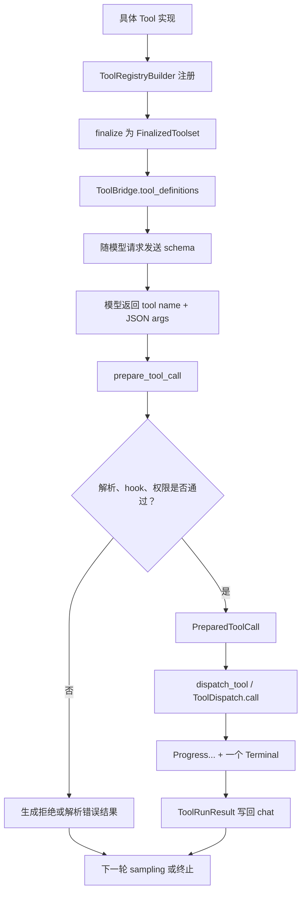

# 工具从注册到执行

本文沿一条工具调用的完整生命线阅读 Grok Build：工具如何变成模型可见的 JSON schema，模型返回的字符串参数如何恢复为 Rust 类型，权限检查发生在哪里，执行结果又怎样回到下一轮 sampling。

前置阅读：[Sampling 与 Agentic Loop](03-sampling-loop.md)。本文只展开其中的工具分支。

## 先记住结论

工具系统不是一个巨大的 `match tool_name`。它被分成五层：

1. 具体工具用强类型 `Tool` trait 描述输入、输出和执行逻辑。
2. 注册适配器把不同的关联类型擦除成统一的 JSON 调度接口。
3. `ToolRegistryBuilder` 收集工具，finalize 后形成可并发读取的 `FinalizedToolset`。
4. `ToolBridge` 给 agent 提供稳定门面，同时管理内建工具、MCP 动态工具和运行资源。
5. session 在真正 dispatch 前完成解析、展示、hook、权限和冲突控制，执行后把结果写回对话。

因此，“模型会调用某个工具”至少要求三件事同时成立：模型看到了它的定义；返回的名字和参数能被解析；调用通过了执行前的门禁。

## 全链路地图



这是阅读模型，不是源码中一个同名状态机。核心入口分别位于：

- `crates/common/xai-tool-runtime/src/tool.rs`：统一 `Tool` trait。
- `crates/common/xai-tool-runtime/src/dispatch.rs`：对象安全的 `ToolDispatch`。
- `crates/codegen/xai-grok-tools/src/registry/types.rs`：builder 和 finalized registry。
- `crates/codegen/xai-grok-tools/src/bridge.rs`：`ToolBridge`。
- `crates/codegen/xai-grok-agent/src/session/tool_calls.rs`：调用准备与批量执行。
- `crates/codegen/xai-grok-agent/src/session/tool_dispatch.rs`：session 到工具运行时的分派。

## 第一阶段：具体工具保持强类型

`xai-tool-runtime::Tool` 使用关联类型表达参数和结果：

```rust
pub trait Tool {
    type Args: DeserializeOwned + JsonSchema + Send;
    type Output: Serialize + ToolOutput + Send;

    fn id(&self) -> ToolId;
    fn description(&self, ctx: &ListToolsContext) -> ToolDescription;
    fn execute(&self, args: Self::Args, ctx: ToolCallContext)
        -> ToolStream<Self::Output>;
}
```

上面是为学习压缩过的签名，应以 `tool.rs` 为准。它带来三个好处：

- 工具实现读取的是 `ReadFileArgs` 一类 Rust 类型，而不是到处手取 JSON 字段。
- 参数类型可以生成 JSON schema，供模型理解字段名、必填项和约束。
- 输出仍是结构化类型，统一层再负责序列化。

例如 `xai-grok-tools/src/implementations/grok_build/read_file/mod.rs` 中的 `ReadFileTool`，就是一份可对照阅读的具体实现。学习新工具时，优先找它的 `impl Tool`，再看参数结构和内部 helper。

### 为什么 `run` 和 `execute` 都存在

简单工具只需要产生一次结果，可以实现 `run`；默认 `execute` 会把它包装成 stream。需要增量反馈的工具则可直接实现 `execute`。

流有一条重要协议：可以有多个 `Progress`，但最终必须恰好出现一个 `Terminal`。`ToolDispatch::call_terminal` 会丢弃过程进度，只取最终项；如果流结束仍没有 `Terminal`，就产生 `stream_no_terminal` 工具错误。

这不是 UI 装饰。长命令可以一边运行一边报告进展，而 session 最终仍能获得一个确定结果写回对话。

## 第二阶段：为什么还要做类型擦除

不同工具的 `Args` 和 `Output` 不同，因此带关联类型的 `Tool` 不能直接作为一组普通 trait object 存进同一个容器。`ToolDispatch` 在这里建立统一边界：

- 输入统一成工具 ID、`serde_json::Value` 和 `ToolCallContext`。
- 每个工具的适配器负责把 JSON 反序列化成自己的 `Args`。
- 输出再转成统一的 `TypedToolOutput` stream。

可以把它理解成“仓库内部仍然强类型，跨注册表的总线使用 JSON”。类型擦除不是放弃类型安全，而是把类型恢复安排在每个工具自己的适配层。

## 第三阶段：注册、finalize 与定义生成

`ToolRegistryBuilder` 是组装期对象。调用 `register::<T>` 或 `register_with_params` 时，具体工具及其适配信息被加入 builder。构建结束后，`ToolBridge::finalize_builder` 生成 `FinalizedToolset`。

这一区分值得注意：

- builder 适合启动期逐步添加能力。
- finalized toolset 是运行期对象，主要操作是列举和 dispatch。
- 它内部仍使用 `RwLock`，因为 MCP 工具可能在运行期注册或移除；常规 dispatch 是高频读，动态变更是低频写。

工具 ID 可以带 namespace。`xai-grok-tools-api` 的默认客户端名称会从 `Namespace:tool` 取出更短的 `tool`。因此要区分：

- 内部 ID 用于避免不同提供方重名。
- client function name 是暴露给模型、出现在 tool call 中的名字。
- `ToolBridge` 还支持名称 override，所以不要只凭 UI 中的名字反推实现位置。

`ToolBridge::tool_definitions()` 将当前可列举工具变成模型请求所需的定义；`tool_definitions_builtins_only()` 则只返回内建工具。工具自己的 `should_list`、动态 description 和 `ListToolsContext` 会影响“此刻是否展示、如何描述”。注册成功不等于每一轮都一定向模型展示。

## 第四阶段：ToolBridge 是什么边界

`Agent` 构建完成后基本保持不可变，它持有 `Arc<ToolBridge>`。bridge 再持有 finalized registry、terminal backend 和资源状态。

`ToolBridge` 的职责包括：

- 返回当前工具定义。
- 按客户端名称调用工具。
- 在执行前尝试解析参数。
- 注册或注销 MCP 动态工具。
- 提供工具运行所需的共享资源。

terminal backend 被单独缓存，而不是只能通过 registry 获得。源码注释给出的原因与取消有关：bash 运行期间 registry 的调用路径可能仍被占用，取消动作必须能绕开它直接触达 terminal。

这是一处很实用的并发设计信号：控制面（cancel）不能依赖可能正被数据面（command execution）占住的唯一锁或通道。

## 第五阶段：模型返回后先 prepare，不立即执行

模型给出的 tool call 本质上仍是不可信输入。`Session::prepare_tool_call` 在 `tool_calls.rs` 中依次处理：

1. 尽早向 ACP 客户端发送 pending tool-call 更新，让 UI 能显示正在准备的动作。
2. 判断是否为 MCP 工具；必要时等待其出现，或按策略返回 unavailable。
3. 规范化空参数并解析 JSON；对拼接 JSON 还有恢复逻辑。
4. 调用 `ToolBridge::try_parse` 恢复成内部 `ToolInput`。
5. 解析失败时生成可反馈给模型的工具解析错误，而不是执行半成品。
6. 从 `ToolInput` 推导 `AccessKind`，例如 Read、Edit、Bash 或 MCPTool。
7. 应用 plan mode 的编辑限制。
8. 运行 pre-tool hooks；hook 可以拒绝此次调用。
9. 携带真实 cwd 等路径上下文请求 permission。
10. 通过后生成 `PreparedToolCall`。

这解释了为何“模型输出了 tool call”和“机器执行了动作”之间还有明显距离。前者只是提案，后者需要本地系统完成验证和授权。

### 不同拒绝为什么行为不同

`Decision` 区分 `PolicyDeny`、用户 `Reject` 和 `Cancelled`：

- policy deny 会作为工具结果返回给模型，让模型换一种合法方案继续。
- 用户 reject 通常表示这次需要人工许可的路线被拒绝。
- cancel 表示用户取消当前 turn，应映射为取消原因，而不是普通工具失败。

这些分支不能简单压成一个布尔值，否则 agent 不知道应该改策略、停止工具链，还是取消整轮。

## 第六阶段：批量调度与冲突控制

`execute_tool_calls_batch` 先 prepare 一批调用，只让批准的调用进入执行集合。随后它：

- 为可能冲突的写操作获取按路径划分的锁。
- 用 `FuturesUnordered` 并发推进独立调用。
- 同时排空工具事件通道，避免只等最终值而堵住进度事件。
- 在等待过程中响应用户 interjection。
- 调用 `dispatch_tool`，获得 `ToolRunResult` 或 `ToolError`。
- 运行完成后的 hooks，更新 ACP 状态和 telemetry。
- 把工具结果追加进 chat，供下一轮模型读取。

并发并不是“所有 tool call 无条件一起跑”。prepare、权限、只读/写入判断和路径锁共同决定哪些操作可以安全重叠。

工具失败一般也会成为一条 tool result。这样模型能看到错误并自我修正，例如改正路径或换一个工具。只有取消、权限拒绝等控制语义才需要改变 tool loop 的走向。

## 运行上下文从哪里来

`ToolCallContext` 本身很小：call ID 加一组 `TypedExtensions`。后者是按 Rust `TypeId` 索引的扩展容器，可携带：

- 当前工作目录。
- behavior version。
- trace/session context。
- cancellation token。
- viewer 或客户端相关上下文。

这种设计避免每新增一个跨工具能力就修改所有工具的统一函数签名。代价是依赖不再全部写在类型参数列表上，因此阅读工具时要搜索它从 extensions 取了哪些类型。

## MCP 工具与 hosted tool

两者不要混为一谈：

- MCP 工具由外部 MCP server 提供，`ToolBridge` 可以在运行期注册、按 server 前缀移除。
- hosted tool 是模型服务提供方执行的能力；agent 把声明随请求发送，但本地不一定经过同一套具体工具实现。

从模型视角它们都像“可调用能力”，从所有权、故障位置、权限和生命周期看却不同。排错时先判断执行发生在本进程、MCP server，还是 provider 侧。

## 建议的源码阅读顺序

1. 在 `xai-tool-runtime/src/tool.rs` 读 `Tool`、`ToolStream` 和终态约束。
2. 在 `dispatch.rs` 读 `ToolDispatch::call` 与 `call_terminal`。
3. 用 `ReadFileTool` 看一个具体实现如何接入。
4. 在 registry 的 `types.rs` 追 `ToolRegistryBuilder::register` 到 `FinalizedToolset`。
5. 在 `bridge.rs` 看 agent 实际依赖的窄接口。
6. 在 `tool_calls.rs` 追 `prepare_tool_call` 和 `execute_tool_calls_batch`。
7. 最后读 `tool_dispatch.rs`，补齐 workspace/session 特有的分派分支。

## 自测题

1. 为什么 `Tool` 已经是统一 trait，仍不能直接把所有工具放进 `Vec<Box<dyn Tool>>`？
2. 工具已经注册，但哪些条件可能让模型当前轮看不到它？
3. 为什么 JSON 参数必须在 permission 之前恢复成 `ToolInput`？
4. policy deny 和用户 cancel 为什么不能使用同一种返回语义？
5. bash 的 cancel 通道为什么不应完全依赖 registry 的调用锁？
6. 两个互不相关的只读工具与两个写同一路径的工具，调度方式有何不同？

## 本篇术语表

| 名词 | 白话解释 | 本文中的具体含义 |
| --- | --- | --- |
| tool | 模型可以请求系统代为执行的一项能力 | 读文件、运行命令、搜索、MCP 调用等 |
| trait | Rust 对一组共同行为的接口描述 | `Tool` 规定工具要提供的类型和方法 |
| associated type | 由 trait 实现者指定的配套类型 | 每个工具自己的 `Args` 和 `Output` |
| JSON schema | 描述 JSON 对象字段与约束的机器可读说明 | 随模型请求发送，告诉模型怎样填写工具参数 |
| registry | 按名字查找能力的登记表 | 保存工具适配器，并支持列举和 dispatch |
| builder | 在对象正式使用前逐步组装它的临时对象 | `ToolRegistryBuilder` 收集各类工具 |
| finalize | 结束组装，产出运行期对象 | 从 builder 得到 `FinalizedToolset` |
| namespace | 名字前用于隔离来源的范围标识 | 让不同提供者的同名工具不冲突 |
| client function name | 模型实际看到和返回的工具名 | 可由 namespaced ID 派生，也可被 override |
| type erasure | 把各自不同的具体类型包成统一调用形态 | registry 边界使用 JSON，适配器再恢复类型 |
| object-safe | 一个 trait 能否通过 `dyn Trait` 做动态调用 | 带关联类型的 `Tool` 需要 `ToolDispatch` 作为对象安全边界 |
| adapter | 在两种接口之间翻译的小组件 | 负责 JSON 与具体 `Args`/`Output` 互转 |
| dispatch | 根据工具名把请求送到正确实现 | 不是线程调度的同义词，本文特指工具分派 |
| stream | 结果随时间分多项产生 | 工具可先发多个 `Progress`，最后发 `Terminal` |
| Progress | 尚未结束的过程更新 | 例如长命令的中间输出 |
| Terminal | 一次工具执行唯一的最终结果 | 成功或失败都必须以终态结束 |
| bridge | 向上层隐藏内部注册与调用细节的门面 | `ToolBridge` 是 agent 使用工具系统的入口 |
| typed extension | 按 Rust 类型存取的上下文附件 | 给工具传 cwd、取消令牌、session 信息等 |
| pre-tool hook | 工具执行前运行的扩展逻辑 | 可检查、修改展示或拒绝调用 |
| MCP | 连接外部工具与资源服务器的协议 | MCP 工具可在运行期动态加入 registry |
| hosted tool | 由模型提供方托管执行的工具 | 声明可随 sampling 请求发送，不等同于本地工具 |
| interjection | 工具运行期间用户插入的新消息 | session 等待工具时仍可响应这种输入 |

通用名词见 [全局术语表](../appendices/glossary.md)。
