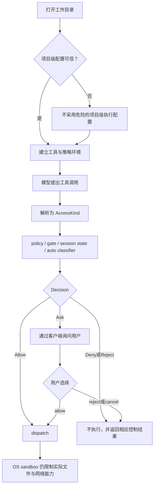

# 权限、目录信任与 Sandbox

本文解释 Grok Build 的安全链路。重点不是罗列配置项，而是回答：一次动作由谁判定、为什么有时必须询问用户、目录信任保护什么，以及 sandbox 与 permission 为什么缺一不可。

前置阅读：[工具从注册到执行](04-tool-execution.md)和[启动链路](01-startup.md)。

## 先记住三个不同问题

| 机制 | 回答的问题 | 典型时机 |
| --- | --- | --- |
| folder trust | “这个仓库自带的配置和可执行入口值得采用吗？” | 加载项目级 MCP、LSP、权限配置或插件前 |
| permission | “这一次具体工具调用是否应该执行？” | 每个工具完成解析、尚未 dispatch 时 |
| sandbox | “进程在操作系统层面最多能访问什么？” | 进程启动早期应用，随后持续生效 |

它们不是三个名字不同的开关。目录信任管配置来源，permission 管动作意图，sandbox 管内核可执行边界。

## 防线如何串起来

重要推论：permission 返回 `Allow` 不会关闭 sandbox；sandbox 已启用也不代表所有 bash 都应无提示自动批准。

## Permission 的输入：AccessKind

工具参数通过解析后，会由 `From<&ToolInput> for AccessKind` 转成权限系统理解的动作类别。`permission/types.rs` 中的主要变体是：

- `Read`：读文件或列目录。
- `Grep`：搜索，并保留 path、glob 信息。
- `Edit`：修改目标路径。
- `Bash`：运行具体脚本字符串。
- `MCPTool`：携带工具名和原始 JSON 参数。
- `WebFetch`、`WebSearch`：访问网页或搜索。

权限系统不能只看工具名。例如同一个 bash 工具既可能执行 `git status`，也可能执行删除或向外发送数据的命令；MCP 名字也不足以说明参数会造成什么影响。所以 `AccessKind` 保留了决策所需的细节。

`RequestPathContext` 还携带请求 session 的真实 cwd 和可选 display cwd。父 session 与 subagent 可能共享 permission manager，却在不同目录执行；路径规则必须锚定“这次工具真正解析路径的 cwd”，而不是 manager 创建时的 cwd。

## PermissionHandle：异步 actor 边界

`PermissionHandle` 有 `Actor` 和 `AllowAll` 两种形态。常规 `Actor` 通过 channel 发送 `PermissionCommand::Request`，并用 oneshot 等待一个 `Decision`。

`request_with_path_context` 同时传入：

- `AccessKind`。
- 给 ACP UI 展示的 tool-call update。
- 路径上下文。
- session ID 和 subagent 元数据。

如果请求通道失效，代码返回 `Reject`，而不是猜测允许。这是 fail-closed：安全决策基础设施异常时，默认不扩大权限。

actor 结构还让多个 session/subagent 共享授权状态与串行化的交互入口，同时用 in-flight 计数记录并发权限请求。

## Decision 不只是允许或拒绝

`Decision` 包含：

| 变体 | 含义 | tool loop 的典型处理 |
| --- | --- | --- |
| `Allow` | 可以执行 | 进入 dispatch |
| `Ask` | policy 明确要求询问 | 调起客户端权限 UI |
| `FollowupMessage` | 用户用消息补充要求 | 作为新输入处理 |
| `Reject` | 用户拒绝或普通拒绝 | 停止这条需许可路线 |
| `PolicyDeny` | 策略明确禁止 | 把拒绝告诉模型，让其改用合规方案 |
| `Cancelled` | 用户取消当前 turn | 以 cancelled 结束，而非伪装成工具错误 |

保留拒绝来源是 agent 能正确恢复的基础。把这些情况压成 `false`，会丢失“应换方案”“应停止工具”“应取消整轮”的区别。

## 三种权限模式

代码和 telemetry 使用的有效模式包括 `ask`、`auto`、`always-approve`：

### Ask

需要人工判断的动作进入 prompt。明确 allow/deny 规则仍可直接生效，因此 Ask 不等于“每个动作都弹窗”。

### Auto

安全的 fast path 可以直接通过；其余动作交给 classifier 判断。classifier 的 block 语义通常是“需要用户确认”，不是悄悄执行，也不应被理解成永久 policy deny。

源码设置了连续和总 auto denial 上限，避免模型反复请求同类危险动作。分类器不可用、超时或分析失败，也都有独立的 decision reason，便于审计。

### Always approve / YOLO

它降低人工确认频率，但并非自动抹掉所有硬性保护。企业管理策略可以 pin 它为不可用；危险 bash 的 request floor、显式 policy deny、目录信任和 OS sandbox 仍是需要单独理解的边界。

不要把产品层的“总是批准”理解成 Unix root，也不要把它当成 sandbox off 的别名。

## 决策不是简单的优先级列表

permission manager 综合多类证据：

- 编译后的 policy rule：allow、ask、deny。
- 当前 session 的允许或拒绝状态。
- 持久化的精确 grant。
- 静态 allowlist 与安全命令识别。
- bash command gate 和 shell file gate。
- auto mode classifier。
- sandbox 是否实际激活并允许某些安全自动路径。
- 必须询问的 request floor。

阅读时应追踪“哪条规则命中”以及“这个来源有没有被后续步骤覆盖”，而不是假设最后读取的配置永远获胜。

### Ask provenance 为什么要保留

`GatePreflight` 区分两种看起来都像 Ask 的来源：

- 某条规则明确写了 ask。
- 系统无法可靠分析命令，因此 fail-closed 到 ask。

前者代表策略作者的明确意图，不能被 auto classifier 轻易改写；后者在特定 auto 流程中可以交给 classifier 继续判断。这个来源信息称为 provenance。

## Bash 为什么最复杂

文件读取通常能从参数直接知道目标；shell 字符串却是一段小程序。权限代码需要分析：

- 管道、逻辑运算符和多命令序列。
- 环境变量赋值与危险环境注入。
- wrapper 展开和嵌套 shell。
- 重定向会写到哪些路径。
- `cd` 后相对路径实际指向哪里。
- symlink 解析后的真实目标。
- 命令是否可能间接执行脚本或 git hook。
- 是否存在动态、混淆或无法解析的 opaque shell。

`bash_command_splitting.rs`、`shell_access.rs` 和 `exec_risk.rs` 分别承担命令结构、文件访问和间接执行风险的一部分。解析不透明不是“没发现风险”，而是“无法证明安全”，通常应进入 ask。

一些风险构成 bash request floor，例如真实文件写入、危险环境、opaque shell 或间接执行风险。即使 sandbox active，`sandbox_may_auto_allow_bash` 也要求这些 floor 不存在。

## Grant 的范围为何重要

用户选择“总是允许”时，系统不能粗暴记录“以后允许整个 bash”。安全的 grant 应尽量精确，例如某个命令前缀、特定路径或工具范围。

需要区分：

- session grant：只在当前会话生命周期有效。
- persisted grant：写入权限状态，后续会话也可能复用。
- static allowlist：产品预定义的安全集合。
- policy allow：由配置规则明确授权。

它们最终都可能产生 `Allow`，但撤销方式、作用域和审计含义不同。`PermissionEvent.decision_reason` 正是为了保留这种来源。

## Folder trust 防的是“仓库即代码”

一个刚 clone 的仓库可能包含项目级 MCP/LSP server 命令、权限规则和插件路径。如果程序无条件加载，光是打开目录就可能执行仓库作者提供的命令，或让恶意规则自动批准动作。

folder trust 因此保护的是配置消费边界：

- 项目级可执行配置只有在项目 scope 被允许后才采用。
- 决策持久化到独立的 trust store。
- project trust 与 plugin trust 是不同概念，不应互相冒充。
- 无法可靠解析或不满足提示条件时，关键路径倾向不加载，而不是静默信任。
- revoke 会更新进程内缓存，使后续检查看到撤销。

只有合适的启动目录能进行阻塞式信任询问；共享 manager 下某个 subagent 临时进入另一 cwd，不应顺便弹窗并替那个目录建立信任。

## Sandbox 是操作系统层的限制

`xai-grok-sandbox` 在进程启动时应用一次。模块文档明确说明，它覆盖进程内的 `tokio::fs` 调用和子进程。Unix 默认 feature 使用 `nono` 接入内核机制：macOS 侧是 Seatbelt，Linux 侧包括 Landlock，并在需要时使用 bwrap/子进程网络限制路径。

`ProfileName` 包含：

- `workspace`
- `devbox`
- `read-only`
- `strict`
- `off`
- 自定义 profile

解析后的 `SandboxProfile` 描述 read-only、read-write、deny、write-deny、default-read 和 child network restriction。

### 配置合并的安全细节

全局 `~/.grok/sandbox.toml` 与项目 `.grok/sandbox.toml` 都可提供自定义 profile，但项目配置只能增加新名字，不能重定义全局已有名字。否则恶意仓库可以保留一个看似可信的 profile 名称，却把其中的 deny 清空或扩大 read-write。

这是一个典型原则：低信任配置可以添加局部能力，但不能覆盖高信任层已经定义的安全语义。

### 进程网络与子进程网络

agent 进程需要访问模型 API，因此模块注释说明进程级网络保持开放。需要限制时，已知的子进程启动路径会单独安装网络过滤。

所以“restrict network”不能简单理解为整个程序完全断网。排查网络行为时要问：发起连接的是 agent 本身，还是它启动的 child process？

### requested 与 active 不是一回事

`requested_confinement_profile()` 表示启动时请求了非 off profile；`is_active()` 表示 sandbox 是否成功应用。源码特意不把两者混成一个状态，因为某些平台路径的报告方式不同，而且“请求了但未正常应用”本身应触发保守处理和警告。

`should_auto_allow_bash()` 还要求 auto-allow 配置开启并且 sandbox active。即便返回 true，permission manager 仍会检查 bash floor；这再次说明 sandbox 只是决策证据之一。

## 一次 Bash 调用的完整例子

假设模型请求运行一个命令：

1. tool 参数先被解析为 Bash `ToolInput`。
2. session 推导出 `AccessKind::Bash(script)`。
3. shell parser 拆出命令树、wrapper、重定向和路径访问。
4. gate 检查 policy 命中，并保留 allow/ask/deny 来源。
5. manager 检查 session/persisted grant、安全命令、环境与 exec risk。
6. 若 auto mode 可用，符合条件的请求由 fast path 或 classifier 评估。
7. 触及 request floor 或明确 ask 时，ACP 客户端展示 permission prompt。
8. 用户允许后才 dispatch 到 bash 工具。
9. bash 子进程仍处于 sandbox 允许的文件边界；适用 profile 时，已知启动路径还限制 child network。
10. 失败、拒绝和取消按不同结果返回 tool loop，并记录 telemetry。

这十步中任何一步说“不”，都可能导致命令不执行；它们的理由却不相同。

## 常见误解

### “sandbox 开着，就不需要 permission”

错误。sandbox 只能限制能碰到的资源，无法判断命令是否符合用户意图。例如工作区内删除大量文件可能完全处于 sandbox 边界内，仍应经过意图授权。

### “用户点允许，命令就什么都能做”

错误。permission 是意图许可，不能突破内核 sandbox 的能力集。

### “解析器没识别出危险命令，所以是安全的”

错误。opaque 或解析失败通常意味着无法证明安全，应 fail-closed。

### “信任仓库就是信任所有插件”

错误。project trust 和 plugin trust 是分离的决策域。

### “PolicyDeny 和 Reject 都是不执行，没必要区分”

错误。前者应让模型看到策略约束并换方案；后者表达用户对当前许可请求的决定。

## 建议的源码阅读顺序

1. `permission/types.rs`：先掌握 `AccessKind`、`Decision`、`PermissionCommand`。
2. `permission/manager.rs`：追 `request_with_path_context` 和 actor 的 Request 分支。
3. `permission/gate_preflight.rs`：理解 rule provenance 与 fail-closed。
4. `permission/bash_command_splitting.rs`：看 shell 结构怎样被拆解。
5. `permission/shell_access.rs` 与 `exec_risk.rs`：看路径和间接执行风险。
6. `permission/auto_mode.rs`：区分 fast path、classifier allow 与 block。
7. `xai-grok-shell/src/folder_trust.rs`：理解项目配置消费边界。
8. `xai-grok-sandbox/src/lib.rs`、`profiles.rs`：理解 OS 隔离与 profile 合并。
9. 回到 `session/tool_calls.rs::prepare_tool_call`，把安全子系统接回主流程。

## 自测题

1. folder trust、permission 和 sandbox 分别保护哪个时间点与对象？
2. 为什么 subagent 的权限请求必须携带它自己的 cwd？
3. policy 明确 ask 与命令无法分析而 ask，有什么行为差异？
4. auto classifier 的 block 为什么通常应转成人工确认，而不是静默执行？
5. 为什么 sandbox active 仍不能自动批准所有 bash？
6. 项目 sandbox 配置为何不能覆盖同名全局 profile？
7. `requested_confinement_profile` 与 `is_active` 为什么分开？
8. 若一个动作已获 permission，却被 Seatbelt/Landlock 阻止，应在哪一层排错？

## 本篇术语表

| 名词 | 白话解释 | 本文中的具体含义 |
| --- | --- | --- |
| permission | 执行某次动作前的意图授权 | 判断一条具体工具调用是否可以 dispatch |
| folder trust | 是否采用当前目录自带敏感配置的信任决定 | 防止仅打开恶意仓库就执行其 server 或放宽策略 |
| sandbox | 由操作系统强制执行的资源边界 | 限制进程和子进程能读写的路径及部分网络能力 |
| defense in depth | 多道防线彼此补充 | trust、permission、sandbox 任一层都不被当成全部安全体系 |
| AccessKind | 权限系统理解的动作分类 | Read、Edit、Bash、MCPTool 等，并携带决策细节 |
| actor | 通过消息顺序处理状态与请求的异步任务 | permission manager 接收 command 并返回 decision |
| oneshot | 只传一次结果的异步通道 | 每个权限请求等待自己的一个 `Decision` |
| policy | 预先配置的允许、询问或禁止规则 | 是决策输入之一，不等同于全部 permission 状态 |
| provenance | 一个结果是由哪条规则、哪种机制产生的 | 区分明确 policy ask 与分析失败导致的 ask |
| fail-closed | 无法安全判断时默认不扩大权限 | 通道失败拒绝、opaque shell 要求确认等 |
| request floor | 无论普通自动路径如何，都至少要询问的风险下限 | 文件写入、危险环境、opaque shell、exec risk 等 bash 条件 |
| classifier | 对动作风险做分类的组件 | auto mode 对非 fast-path 请求进行判断 |
| fast path | 无需昂贵分类即可确认的安全路径 | auto mode 中已知安全的调用可快速允许 |
| YOLO / always-approve | 尽量自动批准权限请求的模式 | 不是 root、不是 sandbox off，仍受硬性边界约束 |
| pin | 由更高层策略锁定某项设置 | 企业策略可阻止客户端打开 YOLO |
| grant | 对某类动作保存的许可 | 可只在 session 内，也可持久化，范围应尽量精确 |
| scope | 一项授权或信任覆盖的范围 | 可能按会话、路径、命令前缀、server 或项目划分 |
| shell parser | 把 shell 字符串理解为命令结构的解析器 | 用来识别序列、管道、wrapper、重定向等 |
| opaque shell | 系统无法可靠静态理解的 shell 结构 | 不能因“没看出危险”而视作安全 |
| symlink | 指向另一个路径的文件系统链接 | 权限检查需关注解析后的真实目标 |
| exec risk | 命令间接执行代码的风险 | 脚本、hook、动态解释器等可能扩大表面命令的行为 |
| RCE | Remote Code Execution，攻击者让机器执行其代码 | 恶意项目级 server 配置可能造成此类后果 |
| profile | 一组命名的 sandbox 能力规则 | 如 workspace、read-only、strict 或自定义配置 |
| Seatbelt | macOS 的进程 sandbox 机制 | `nono` 在 macOS 使用的内核隔离后端 |
| Landlock | Linux 的非特权文件访问限制机制 | Linux 文件边界的实现基础之一 |
| bwrap | bubblewrap，Linux 进程隔离工具 | 某些 Linux sandbox/deny 路径会使用它 |
| child process | 当前 agent 启动的子进程 | bash 命令等；网络策略可能与 agent 主进程不同 |
| telemetry | 用于观测和审计的结构化事件 | 记录 decision、reason、是否提示、分类耗时等 |

通用名词见 [全局术语表](../appendices/glossary.md)。
