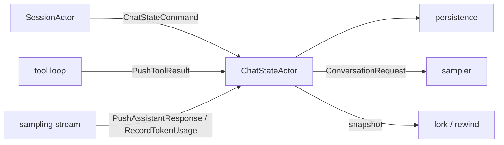
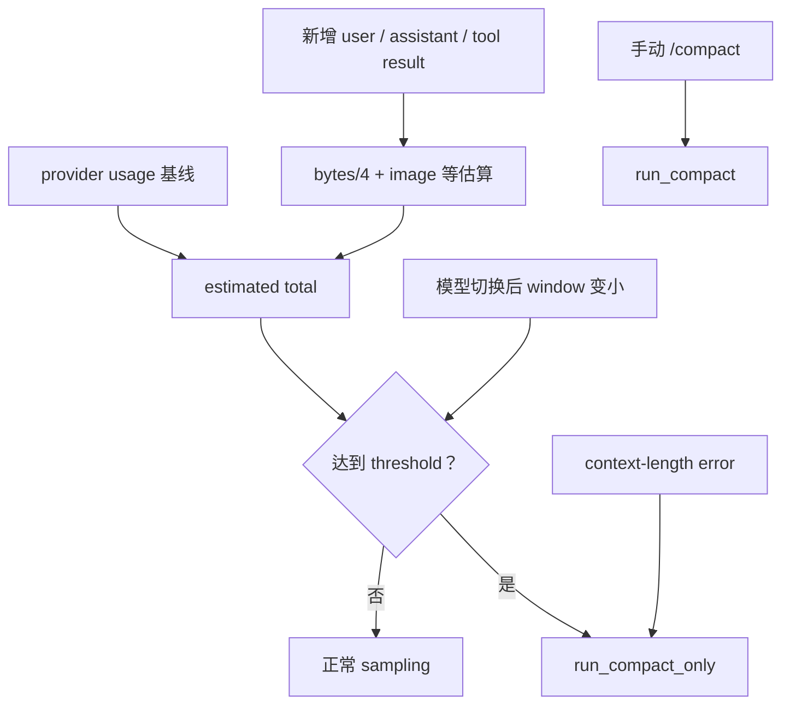

# 会话上下文、裁剪与压缩

本文回答一个贯穿 agent 系统的问题：模型在某一轮到底看到了什么？随着对话增长，Grok Build 如何估算上下文、裁剪低价值内容、生成压缩摘要，并在替换历史后保留继续工作的必要状态？

前置阅读：[Prompt 到最终回答](02-prompt-to-answer.md)和[Sampling 与 Agentic Loop](03-sampling-loop.md)。持久化文件格式会在后续“会话持久化”专题进一步展开，本文只说明它与上下文替换的关系。

## 先记住结论

“会话记录”“下一次模型请求”“压缩后的活动上下文”不是同一份东西：

- `ChatStateActor` 拥有当前活动 conversation 和相关计数，是运行时权威状态。
- 构建一次 `ConversationRequest` 时，会从活动状态克隆并按需裁剪，再加入工具定义、memory reminder 和请求元数据。
- compaction 会调用模型生成摘要，组装一份新的短 conversation，并用它替换活动状态。
- 原始更新日志、compaction checkpoint 和可选 transcript/segments 可以保留历史证据，但不会自动全部塞回每次模型请求。

压缩的本质是有损变换：它不是“把旧消息藏起来但模型仍然知道”，而是用较短的新上下文承载旧上下文中最重要的信息。

## 四种需要区分的数据形态

| 数据形态 | 所有者/来源 | 用途 | 是否直接发送给模型 |
| --- | --- | --- | --- |
| 活动 conversation | `xai-chat-state::ChatState` | 当前会话继续运行的权威消息序列 | 构建请求时以它为基础 |
| request clone | `build_conversation_request` 临时构建 | 当前这一次 sampling | 是 |
| durable transcript | shell persistence | 恢复、审计、重放 | 通常不是整体发送 |
| compacted history | compaction pipeline 生成 | 替换过长的活动 conversation | 替换后成为后续请求基础 |

这一区分能解释一个常见现象：UI 或磁盘上仍能看到很早的工具输出，但模型当前轮不一定能直接看到原文。

## ChatStateActor 为什么存在

`crates/codegen/xai-chat-state` 把会话的可变状态放进 actor。`ChatState` 的关键字段包括：

- `conversation: Vec<ConversationItem>`：当前活动消息。
- `sampling_config`：模型、context window、采样参数等。
- `prompt_index`：真实用户 turn 的推进位置。
- `total_tokens`：最近一次模型响应记录的累计 token 基线。
- `estimated_tokens_since_model`：上次模型计数后新加入内容的估算。
- `estimate_at_last_response`：记录基线时 conversation 的本地估算。
- `last_compaction_prompt_index`：最近一次压缩边界。
- `agent_edited_paths`：本会话修改过的文件。
- turn capture、usage ledger、时间戳和 credential 等辅助状态。

actor 独占这些字段，所以常规 mutation 不需要为每个字段加锁。其他组件通过 `ChatStateHandle` 发送 `ChatStateCommand`，读操作通常用 oneshot 接收结果。



这里有两个不同的 actor：shell 的 `SessionActor` 编排完整会话流程；`ChatStateActor` 专门拥有聊天状态。看到源码中的 `self` 时，先确认当前 `impl` 属于哪一个类型。

## ConversationItem 保存什么

活动 conversation 由 `xai-grok-sampling-types::ConversationItem` 组成，主要变体是：

- `System`：系统 prompt。
- `User`：用户文本、图片，以及运行时注入的某些 user-shaped metadata。
- `Assistant`：模型文本和本地 tool calls。
- `ToolResult`：工具调用结果，通过 call ID 与 assistant tool call 配对。
- `BackendToolCall`：provider 侧工具相关项。
- `Reasoning`：推理内容或加密推理载荷。

它不是简单的 `role + String`。图片、tool-call ID、synthetic reason、reasoning 结构都影响后续修复、裁剪和 provider 序列化。

### Tool call 配对是不变量

每个 `ToolResult.tool_call_id` 必须对应它前面某个 `Assistant.tool_calls[].id`。进程在工具执行中途退出、用户取消或历史文件出现 torn write，都可能留下未配对状态。

系统在多个写入边界修复 dangling tool call，并去重重复结果。`BuildConversationRequest` 前也会确保 actor 自身历史完整。纯读取操作则尽量保持纯读，不应因为查看 snapshot 就暗中改写历史。

这条不变量非常重要：一些 provider 会直接用 400 拒绝结构错误的对话，而不是宽容地忽略孤立结果。

## 一轮消息如何进入状态

从用户开始一次 turn 到模型完成，典型 mutation 顺序是：

1. `IncrementPromptIndex`。
2. `BeginTurnCapture` 记录本轮在 conversation 中的起始 offset。
3. `PushUserMessage` 加入真实输入和必要的运行时上下文。
4. sampling 产生 assistant 内容后，`PushAssistantResponse` 入栈。
5. 每次本地工具完成后，`PushToolResult` 入栈。
6. agentic loop 可以继续追加 assistant/tool-result 对。
7. `RecordTokenUsage` 用 provider 返回值更新 token 基线。
8. turn 结束时 `TakeTurnMessages` 获取本轮消息，`Flush` 推进持久化。

turn capture 使用 offset，而不是每 push 一项就复制到第二个 vector。若 compaction 或 snapshot restore 在本轮中途替换整个 conversation，它会先保存替换前的本轮 slice，再把 offset rebase 到新 vector。这样 telemetry/persistence 仍能得到完整 turn，同时避免常规路径的重复拷贝。

## 模型请求不是 conversation 的原样复制

`actor/request_builder.rs::build_conversation_request` 会在请求边界执行若干变换：

1. 检查 inline image 序列化体积；接近上限时淘汰最旧图片到低水位。
2. context 利用率超过 50% 时，裁剪较老的 tool result。
3. 按配置把 memory reminder 持久注入状态，或只注入当前 request clone。
4. 加入本轮 tool definitions、模型参数、trace 和 conversation/request ID。

多数变换在 clone 上进行，所以“模型这次看到的内容”可能比 actor 的 retained conversation 更短。某些路径也会把裁剪后的旧 tool result 保留到内存状态以控制长会话占用；阅读具体调用时要确认操作对象是 clone 还是 `self.state.conversation`。

### Tool result pruning 与 compaction 不同

pruning 只针对旧的大型工具结果：

- 最近若干 turn 永不裁剪。
- 中等年龄的大结果保留 head 和 tail，中间放 `[…trimmed…]`。
- 很老的结果可替换为 `[Tool result omitted — too old]`。

它不调用模型，也不把整段对话变成摘要。它的目标是回收高体积、低时效的工具输出，同时保留近期工作细节。

### 图片压缩也不是 compaction

inline 图片可能携带很大的 base64。请求体接近约定上限时，builder 批量淘汰旧图片以恢复 headroom。这样既控制请求大小，也减少每轮都轻微改写 prefix 导致的 KV cache miss。

因此本文把三类“变短”严格区分：工具结果裁剪、图片淘汰、conversation compaction。

## Token 数为何同时有精确值和估算值

provider 只会在一次模型响应后返回真实 usage；但工具调用之后、新一轮 sampling 之前，conversation 已经增加了新的 tool result。这一段没有新的 provider 计数，只能本地估算。

`xai-chat-state::actor::state` 使用近似算法：

- 文本大致按 bytes / 4。
- 图片按固定的 `IMAGE_TOKEN_ESTIMATE`。
- assistant 还计入 tool-call arguments。
- reasoning 同时考虑文本和 encrypted content。
- 工具定义按名称、description 和序列化参数 schema 估算。

因此 preflight 使用的是：

```text
estimated total = 上次记录的 provider total + 此后新增内容的本地估算
```

它不是 tokenizer 的逐 token 精确重算，但能覆盖“大工具输出刚写入，尚未获得下一次 usage”的危险窗口。

## 什么时候触发 compaction

`CompactionPolicy` 的默认 auto threshold 是 context window 的 85%，实际 session 可由配置覆盖。触发路径不止一种：

- 每次 sampling 前检查估算利用率。
- 工具输出把估算值直接推过 context window 时做 preflight overflow 检查。
- provider 报告 context-length error 时进入错误恢复判断。
- 切换到 context window 更小的模型时主动检查。
- 用户显式执行 `/compact`。
- 调试或内部控制路径强制触发。



auto compaction 可以被临时或 sticky suppress，例如认证、额度、请求体尺寸或刚压缩后仍超阈值。这样可避免每轮进入同一个必败压缩循环。不同 suppress reason 的恢复条件不同，不能把它理解成一个永久 `bool`。

## Compaction 的完整过程

主编排位于 `xai-grok-shell/src/session/compaction.rs::run_compact_inner`。可以把它分成八步。

### 1. 冻结输入快照

读取当前 conversation、system message、用户信息前缀、sampling config、工具定义和 token 情况。若配置为 segments mode，还会为即将被替换的历史准备一份 segment 视图。

### 2. 捕获不能只靠摘要恢复的运行状态

`CompactionStateContext` 保存：

- 最后一个真实用户请求。
- 自该请求以来的 recent assistant/tool messages。
- agent 修改过的文件。
- 正在运行的 background tasks 和 subagents。
- todo 状态。
- 已连接的 MCP servers。
- cwd generation 和目标目录的项目指令。

这是“语言摘要”和“结构化状态”分开保存的设计。让模型自己回忆 task ID、MCP schema 或 cwd 变化不够可靠，因此这些信息由代码重新渲染成 system reminder。

### 3. 为 summarizer 准备输入

常规 lossy summarization 会：

- 删除 `ToolResult` 原文。
- 把 assistant 的 tool calls 展平成 `[Called tools: ...]` 文本。
- 删除 reasoning blocks。
- 用 `[image]` 替换内联图片。

reasoning 删除还有协议原因：修改周围文本后，provider 签名过的 thinking block 可能失效。segments 存档则保留 tool I/O，只去掉 reasoning 和图片，以便以后找回精确细节。

### 4. 调用压缩模型

`compact_model` 为空时使用 session 当前模型；请求末尾追加结构化 summarization prompt，并且不允许 summarizer 通过工具“重新调查”历史。

每次生成受 wall-clock budget、idle timeout 和 retry 策略约束。错误被区分为：

- deterministic：同一 payload 重试也不会好，例如配置、认证、序列化、明确的 4xx 或 context overflow。
- transient：网络、部分 stream/5xx 等可能恢复的问题。
- cancelled：用户或 stop token 取消，不应重试。

过短、复述 prompt 或明显退化的 summary 会被 `is_degenerate_summary` 拒绝，而不是直接替换好历史。

### 5. 输入过大时逐级降级

如果连 compaction request 本身也超出模型窗口，系统按 input ladder 缩小：

1. verbatim
2. verbatim fitted
3. lossy

`fit_conversation_to_budget` 从最旧的完整 turn 开始丢弃，保留 system；它避免从一个 `ToolResult` 开头形成孤儿结构。如果预算连最近单元都放不下，会截断最近项而不是把整个最新上下文全部丢掉。

这解决了一个“不可压缩状态”：需要摘要是因为历史太大，但拿去生成摘要的请求本身也太大。

### 6. 组装新的 compacted history

`build_compacted_history` 不是只生成一条 summary。常规顺序大致为：

1. 原 system message。
2. user-info / project-layout prefix。
3. 当前 cwd 对应的 AGENTS.md/project instructions。
4. 最后一个真实用户请求。
5. 最近的 assistant/tool 消息。
6. LLM 生成的 compaction summary，附可选 transcript hint。
7. 运行状态 system reminder。

recent tool result 的正文会用 placeholder 替换以节省空间，但对应 assistant tool call 会保留，避免结构断裂。

“最后真实用户请求”明确排除 synthetic system reminder、metadata-only bootstrap 和 auto-continue prompt；图片-only 的人类输入仍算真实 turn。这可以防止内部注入消息错误地成为压缩边界。

### 7. Sanitize 和 validate

组装后从左到右检查每个 `ToolResult` 是否存在 preceding tool call：

- `sanitize_compacted_history` 删除 orphaned result。
- `validate_compacted_history` 再做只读验证。
- 如果仍有违反项，退回不带 recent messages 的最小 compacted history。

这是 provider 协议完整性检查，不是对 summary 文本质量的评分。

### 8. 持久化边界并原子替换活动历史

成功后系统会：

- 可选写入 compaction segment。
- 记录 `last_compaction_prompt_index`。
- 写独立的 compaction checkpoint 文件，并在 `updates.jsonl` 记录 marker。
- 用 `replace_conversation_for_compaction` 替换 `ChatStateActor` 的活动 conversation。
- 重新估算压缩后 tokens。
- 重置或调整 auto-compaction suppress。
- 重置 memory context 注入标志，使下一轮重新判断。
- 清理/刷新与压缩边界相关的 plan、AGENTS.md 等运行状态。

先生成并验证新历史，再替换旧历史；失败不会把活动 conversation 换成空摘要。

## 压缩后的 system prompt 为什么可能不同

`Agent::compact_system_prompt()` 返回静态 `COMPACT_SYSTEM_PROMPT`。它比首次启动 prompt 更短，不重复完整工具说明；运行所需的项目指令、技能、MCP、任务状态等通过压缩后的 user-shaped reminder 和结构化 state context 恢复。

这体现了两类上下文：

- 长期稳定的行为规则，可以使用紧凑 post-compaction prompt。
- 会话现场状态，必须在每次压缩时重新采集，不能依赖旧 prompt。

## Summary、Transcript 与 Segments 模式

`xai-chat-state::CompactionMode` 决定压缩后如何找回丢失细节：

| 模式 | 压缩后携带什么 | 特点 |
| --- | --- | --- |
| `Summary` | 只有摘要和重建状态 | 最省空间，默认模式 |
| `Transcript` | 摘要加原始 `updates.jsonl` 路径提示 | 可按需查询完整日志 |
| `Segments(detail)` | 摘要加 `compaction/segment_NNN.md` 和 `INDEX.md` 提示 | 更适合模型按段读取旧细节 |

segment detail 有 `none`、`minimal`、`balanced`、`verbose`：从只有统计/摘要，逐步增加工具签名、截断内容，直到完整 turn。单段 verbatim 还有字节上限，并按完整 turn 边界截断。

Transcript/Segments 不是自动扩大 context window。它们只是给后续 agent 一个 out-of-band 地址；只有在摘要不足并主动 `read_file`/`grep` 时，具体内容才重新进入上下文。

## Two-pass 与 prefire

开启 two-pass compaction 时，系统可以在达到正式阈值前启动后台 pass 1：

1. 将 conversation 切成较老 prefix 和近期 tail。
2. 在后台把 prefix 总结为 `NOTE₁`。
3. 正式压缩时，用 `NOTE₁ + recent tail` 做 pass 2。

默认 prefire lead 是阈值前 10 个百分点。缓存的 NOTE₁ 带 prefix fingerprint；如果用户 edit、rewind 或 branch 改变了 prefix，fingerprint 不匹配就必须丢弃缓存。

prefire 是投机优化：它可能降低正式 compaction 的等待时间，也可能因为会话变化而白做一次 sampling。因此源码为 cached、too-small、sample-failed、empty-note 等结果记录 telemetry。

## Memory flush 不是 compaction summary

若 memory system 和 policy 都开启，达到低于 compaction 的 soft threshold 时，可以先跑 memory flush：

- 模型提取跨会话仍有价值的决策、技术上下文和问题解决方法。
- 输出必须有 Markdown `##` 标题；空内容或 `NO_REPLY` 表示无需写入。
- 内容过长会截断。
- 有 embedding 能力时用相似度做语义去重，避免重复写入近似 memory。
- flush 期间抑制 auto compaction，完成后再继续正式压缩。

compaction summary 服务于“这个 session 紧接着继续”；memory flush 服务于“未来 session 还能复用”。前者必须保留当前进度，后者反而明确排除短期 progress。

## Auto-continue 是谁说的话

auto compaction 发生在 agent 正在工作时，压缩完成后系统可注入 `AUTO_CONTINUE_PROMPT`，要求模型像中断未发生一样继续。它是 runtime 生成的 synthetic user item，不是用户本人新发的消息。

因此：

- 提取真实用户 query 时必须跳过它。
- 用户 turn 统计不应把它算成人类输入。
- compaction boundary 不能被它错误重置。
- UI/telemetry 应能区分 synthetic 与 real user message。

## Fork、Rewind 与 Compaction 的交互

`ChatStateSnapshot` 保存 conversation、sampling config、prompt index、token 状态、edited paths 和最近 compaction 边界，可用于 fork 与 rewind。

复杂点在于：fork 可能共享父会话的一段 inherited prefix，而 compaction 想释放旧 prefix。如果压缩后的历史仍超过阈值，代码会 sticky suppress 自动压缩，避免立即再次进入循环。跨 compaction rewind 则需要 checkpoint 和 prompt index 共同定位，而不能只对当前短 vector 做简单截断。

这一专题的持久化与恢复细节将在“会话持久化”文档中继续展开。

## 常见误解

### “磁盘里有完整历史，模型就记得完整历史”

错误。磁盘记录只有被组装进 request，或通过工具按需读回时，才成为模型输入。

### “token usage 就是本地字符串长度除以四”

错误。响应后的基线来自 provider；bytes/4 主要用于新内容和 preflight 的近似补偿。

### “pruning 会重新总结整个会话”

错误。它主要缩短旧 tool result；compaction 才会调用模型生成摘要并替换 conversation。

### “summary 成功生成就一定可以采用”

错误。还要做退化摘要检查、工具配对 sanitize/validate，并在取消检查通过后才替换。

### “memory flush 保存当前任务进度，所以可代替 checkpoint”

错误。memory 明确偏向未来可复用知识，checkpoint 才保存一次具体 compaction 后的活动历史。

## 建议的源码阅读顺序

1. `xai-grok-sampling-types/src/conversation.rs`：认识 `ConversationItem`。
2. `xai-chat-state/src/types.rs` 和 `actor/state.rs`：认识 actor 拥有的状态与 token 估算。
3. `xai-chat-state/src/commands.rs`、`handle.rs`：看外部怎样读写 actor。
4. `actor/request_builder.rs`：看一次 request 与 retained conversation 的差别。
5. `xai-grok-agent/src/compaction.rs`、`agent.rs::should_auto_compact`：看 policy。
6. `xai-grok-shell/src/session/compaction.rs`：沿 `run_compact_inner` 读主流程。
7. `xai-chat-state/src/compaction_utils.rs`：看输入清理、state context、重建和验证。
8. `compaction_mode.rs` 与 `compaction_transcript.rs`：看历史找回模式。
9. `session/helpers/memory_flush.rs`：对比长期 memory 与当前摘要。
10. 结合 `inline_auto_compact_flow_tests.rs`、`rewind_cross_compaction_tests.rs` 验证边界行为。

## 自测题

1. 活动 conversation、request clone 和 durable transcript 有什么不同？
2. 为什么 build request 之前要修复 dangling tool call？
3. 工具执行后、下一次模型响应前，token 总量怎样估算？
4. pruning、image eviction、compaction 分别损失什么信息？
5. 为什么 `CompactionStateContext` 不能只由语言模型自由总结？
6. summarizer 输入为什么移除 reasoning 和图片？
7. compaction request 自己也超出窗口时，input ladder 如何处理？
8. Summary、Transcript 和 Segments 对模型可恢复细节有何不同？
9. two-pass prefix fingerprint 解决了什么一致性问题？
10. memory flush 和 compaction checkpoint 分别服务于哪个时间尺度？

## 本篇术语表

| 名词 | 白话解释 | 本文中的具体含义 |
| --- | --- | --- |
| session | 一段可连续多轮工作的 agent 会话 | 包含 conversation、工具状态、权限、持久化等 |
| context | 当前模型调用可见的信息集合 | 不等同于仓库所有文件或磁盘全部会话记录 |
| context window | 一个模型请求能容纳的 token 上限 | sampling config 中由模型配置提供的非零值 |
| conversation | 按时间排列的结构化消息序列 | `Vec<ConversationItem>`，是 ChatState 的核心字段 |
| active history | 当前继续运行所依据的历史 | compaction 会用新短历史替换它 |
| durable transcript | 持久化的完整更新记录 | 用于恢复与审计，不自动全部进入模型上下文 |
| request clone | 为某一次 API 调用复制出的消息 | 可临时裁剪或注入 reminder，不必等于 retained state |
| actor | 独占状态并通过消息处理请求的异步任务 | `ChatStateActor` 串行维护聊天状态 |
| mutation | 改变状态的操作 | Push、Replace、Record 等 command |
| snapshot | 某一时刻状态的不可变副本 | 用于 fork、rewind 或恢复 |
| turn | 一次用户输入及其后续 agentic loop | 可含多个 assistant/tool-result 往返 |
| turn capture | 收集本轮新增消息的机制 | 用 offset 定位 slice，替换 conversation 时做 rebase |
| synthetic message | 系统生成但使用消息形态注入的内容 | system reminder、auto-continue 等，不是用户亲自输入 |
| dangling tool call | 有 assistant tool call 却没有最终 tool result | 可能由取消或崩溃产生，需要插入合成结果修复 |
| orphaned ToolResult | 找不到前置 matching tool call 的工具结果 | provider 可能拒绝，sanitize 会移除 |
| invariant | 始终必须成立的结构条件 | 例如 ToolResult 必须匹配 preceding tool call |
| token | 模型处理文本的计量单位 | 不等同于字符；本地部分路径只能近似估算 |
| token baseline | 最近一次 provider 返回的计数基准 | 与新增内容估算合并用于 preflight |
| utilization | 当前 token 相对 context window 的占比 | 达到阈值可触发 auto compaction |
| pruning | 定向缩短低价值旧内容 | 主要 soft-trim 或 hard-clear 旧 tool result |
| soft trim | 保留首尾、删除中部 | 用于较老的大型工具结果 |
| hard clear | 用占位符替换全部正文 | 用于非常旧的工具结果 |
| image eviction | 从请求中淘汰老的内联图片 | 控制序列化体积和 prefix 改写频率 |
| compaction | 用摘要与重建状态替换过长活动历史 | 是有损的 conversation 级变换 |
| summary | 模型生成的历史浓缩文本 | 是 compacted history 的一个组成部分，不是全部 |
| headroom | 离硬上限还剩余的空间 | 提前触发 flush/compaction 可留出生成空间 |
| preflight | 真正发模型请求前的检查 | 覆盖工具输出造成的 context overflow |
| input ladder | compaction 输入过大时逐级缩小的策略 | verbatim → fitted → lossy |
| verbatim | 尽量逐字保留原内容 | 与丢弃工具正文的 lossy 输入相对 |
| lossy | 无法无损还原全部原文 | 常规摘要天然属于有损压缩 |
| sanitize | 自动删除已知不合法结构 | compacted history 中移除 orphaned results |
| validate | 只检查、不修改结构是否合法 | sanitize 后再次验证 tool pairing |
| checkpoint | 某个压缩边界的状态快照文件 | 保存 compacted history 和 prompt index 等 |
| transcript hint | 告诉后续模型旧历史存放位置的提示 | 只有主动读取后，精确旧内容才回到 context |
| segment | 一段压缩前历史的独立 Markdown 存档 | `segment_NNN.md`，由 `INDEX.md` 索引 |
| out-of-band | 不直接放进当前模型消息的旁路信息 | transcript/segments 在需要时通过工具读回 |
| two-pass | 分两轮生成最终压缩摘要 | 先总结旧 prefix，再结合 recent tail 总结 |
| prefire | 达到正式阈值前投机启动 pass 1 | 用后台工作减少真正压缩时的等待 |
| fingerprint | 对 prefix 内容做的廉价一致性标识 | edit/rewind 后不匹配则丢弃过期 NOTE₁ |
| memory flush | 压缩前提取未来会话仍有价值的知识 | 与当前 session 的 continuation summary 不同 |
| semantic dedup | 按语义相似度判断是否重复 | 避免 memory 写入近义重复内容 |
| auto-continue | 压缩后让 agent 自动接着做的内部提示 | synthetic user item，不计作真实用户请求 |
| KV cache | provider 对相同 prompt 前缀的计算缓存 | 频繁改写旧 prefix 会降低缓存命中率 |
| suppress | 暂时阻止自动压缩再次触发的状态 | 防止认证、额度或尺寸错误造成重复失败循环 |

通用名词见 [全局术语表](../appendices/glossary.md)。
