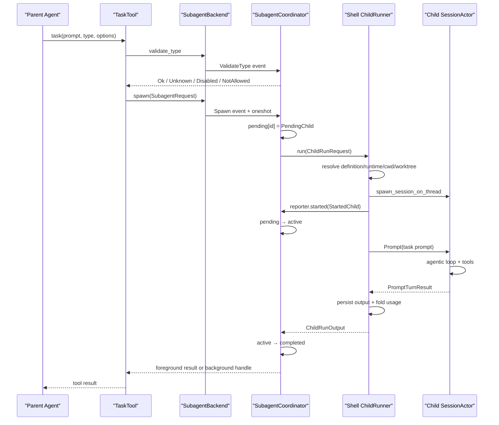
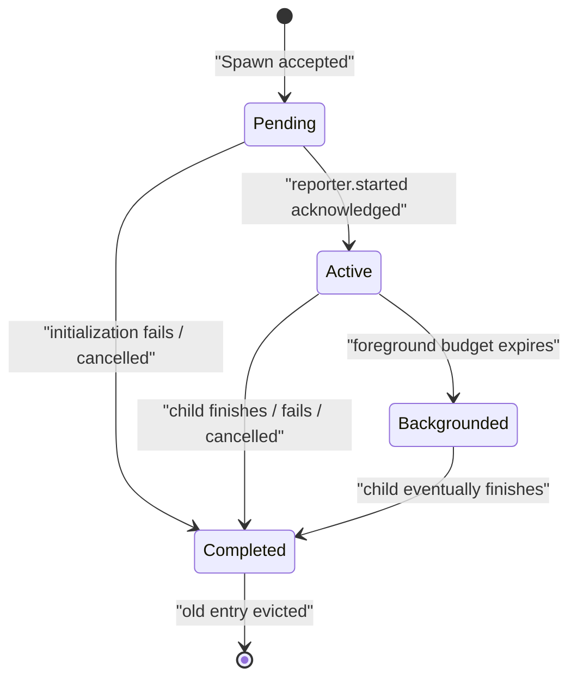

# Subagent 从创建到结果回传

本文沿一次 `task` 工具调用追踪 Subagent：父 Agent 怎样提出任务，coordinator 怎样管理生命周期，shell 怎样构建独立的子 session，前台与后台结果如何回到父会话，以及取消、权限、usage、worktree 和 compaction 如何与它交互。

前置阅读：[工具从注册到执行](04-tool-execution.md)、[权限、目录信任与 Sandbox](05-permission-and-sandbox.md)和[会话上下文、裁剪与压缩](06-session-context.md)。

## 先记住结论

Subagent 不是“在同一个模型上下文里临时换一段 system prompt”，而是一条独立的子 session：

- 有自己的 session ID、conversation、sampling loop、token usage 和持久化目录。
- 根据 `subagent_type` 重新解析 agent definition、system prompt、模型和工具集。
- 可以共享父进程中的文件系统、terminal、permission handle 等基础设施，也可以使用独立 worktree。
- 普通 `task` 调用默认只把任务 prompt 交给新子 session，并不会自动复制父 conversation。
- foreground 结果直接成为 `task` tool result；background 先返回 ID，完成后可由 reminder/auto-wake 通知，也可主动查询。

因此“独立工作”主要指模型上下文和生命周期独立，不必然意味着文件系统、进程或权限完全隔离。

## 总体调用链



源码边界：

- `xai-grok-tools/.../task/mod.rs`：`TaskTool` 参数检查与调用入口。
- `task/backend.rs`：工具与 coordinator 之间的抽象。
- `task/coordinator.rs`、`coordinator_state.rs`：共享生命周期状态机。
- `xai-grok-shell/src/agent/subagent/handle_request.rs`：shell 子 session 的实际构建与运行。
- `xai-grok-subagent-resolution`：definition、runtime override 和 fork context 的共享解析逻辑。

## 第一步：TaskTool 先验证，不急着 spawn

`TaskTool` 实现统一的 `xai_tool_runtime::Tool`，参数类型是 `TaskToolInput`。调用开始后先从 `Resources` 读取：

- `SubagentBackendResource`：向 coordinator 发请求。
- `SubagentDepthCounter` 与 `MaxSubagentDepth`：递归深度。
- `SessionIdResource`：父 session ID。
- `CurrentPromptIdResource`：是哪一个父 turn 发起的。
- `TaskModelValidator`：校验模型显式指定的 model slug。
- `SubagentForegroundWait`：前台等待窗口的 host guard。

### 深度限制

默认 `MAX_SUBAGENT_DEPTH` 是 1。父 session 通常处于 depth 0，可以创建 depth 1 的 child；child 到达上限后，其 tool config 中的 `Task` 会被移除，避免它继续递归创建。

最大深度可配置，所以不要把“Subagent 永远不能创建 Subagent”写成系统不变量。真正的不变量是：`current depth >= effective max depth` 时拒绝创建，并在构建 child toolset 时按深度剥离递归能力。

### 参数规范化

模型生成的参数属于不可信输入：

- 空白、`null`、`none` 一类 `resume_from` 被当成未提供。
- `cwd` 会去掉多余引号、展开 `~`，并检查真实目录。
- `cwd` 与 `isolation=worktree` 不能同时指定，因为它们都决定有效工作目录。
- resume 时忽略新的 model override，后续固定使用来源 child 的模型。
- 显式 model 必须通过模型目录校验。

`task_id` 未提供时生成 UUID v7；这个 ID 同时成为 subagent ID，并通常成为 child session ID。

### 类型验证为什么做两次

`backend.validate_type` 在真正 spawn 前检查：

- type 是否存在。
- 是否被 `[subagents.toggle]` 禁用。
- 当前 parent definition 是否允许创建该类型。
- coordinator 是否可用。

shell child runner 收到请求后还会重新 resolve 和 gate。这是 defense in depth：第一次给模型快速、明确错误；第二次保护真正执行边界，避免配置变化或绕过工具入口。

## 第二步：SubagentRequest 描述一次创建意图

`SubagentRequest` 不包含完整 parent session 对象，而是纯数据与少量控制句柄：

- `id`、`prompt`、`description`、`subagent_type`。
- `parent_session_id`、`parent_prompt_id`。
- `resume_from`、显式 `cwd`。
- model、reasoning effort、persona、capability、isolation 等 runtime overrides。
- `run_in_background`、`surface_completion`、`await_to_completion`。
- harness 专用的 `fork_context`。
- owner 与 cancellation token。

请求数据与 reply envelope 分离。`SubagentSpawnRequest` 才额外持有 oneshot sender；coordinator 负责决定何时回复。这样 child runner 不拥有调用方 reply，也不能绕过共享状态机自行声明生命周期完成。

`parent_prompt_id` 很关键：用户只取消当前 turn 时，可以取消这一 turn 创建的 children，而不误伤较早 turn 已经转为后台的独立工作。

## 第三步：Backend 只负责传输

`SubagentBackend` 暴露窄接口：

- `spawn`
- `query`
- `cancel`
- `validate_type`
- `describe_subagent_type`

本地 shell 使用 `ChannelBackend`，把操作编码成 `SubagentEvent` 发到一个共享 mpsc channel，再用 oneshot 等响应。

工具层因此不依赖 shell 如何构建 child，也不直接操作 coordinator 的 HashMap。`TaskTool`、`TaskOutputTool` 和 `KillTaskTool` 使用同一个 backend contract；不同 host 只需要提供不同 `ChildRunner`。

## 第四步：Coordinator 是生命周期的单写者

`SubagentCoordinator` 独占三张主要表：



源码中 backgrounded 主要是 delivery disposition，不是独立 HashMap；仍运行的 child 留在 active。图中把它画成状态，是为了表达父调用方式已经从阻塞等待变为持 ID 查询。

### Pending

coordinator 接收 Spawn 后先检查：

- parent session 是否已停止并关闭新 Task admission。
- ID 是否与 pending、active、completed 中任何记录重复。
- 嵌套 child 是否需要重新归属 root parent。

通过后保存 `PendingChild`，启动 `ChildRunner::run` future。

### Pending → Active 的竞态

shell 完成 session 初始化后调用 `reporter.started(StartedChild)`。coordinator 返回一个 bool acknowledgement：

- `true`：记录已经从 pending 提升为 active，可以正式运行。
- `false`：取消已抢先发生，runner 必须拆掉刚初始化了一半的 child。

这关闭了“cancel 恰好发生在 child runtime 建好、但 coordinator 尚未登记 active”的竞态窗口。

### Completed 与容量

完成结果进入 `completed`，默认最多保留 1024 个 completed entries，超出后淘汰最旧记录。shell 还可持久化 output reference；查询内存结果不存在时，可以尝试从持久化位置恢复正文，否则返回 output unavailable placeholder。

所以 completed registry 是有界运行时索引，不是永久档案。

## 第五步：Shell runner 真正构建 child session

`run_shell_child` 是最长也最值得精读的函数。它按如下顺序工作。

### 1. 解析 AgentDefinition

`subagent_type` 可映射到内建、用户或插件提供的 agent definition。解析同时应用：

- 全局与逐类型 toggle。
- parent definition 的 `allowed_subagent_types`。
- role 和 persona。
- definition 自带的 model、effort、isolation、capability 默认值。
- 本次 spawn 的 runtime overrides。

显式 override 不能无限扩大权限。`intersect_capability_modes` 与 `apply_child_tool_policy` 会把最终工具集限制在 definition 和 runtime policy 的交集内。

### 2. 选择模型

优先考虑 runtime override、definition 默认和 parent fallback。若解析出的模型不在当前模型目录中，代码退回 parent model。

resume 是例外：来源 child 的 model ID 被固定；若该模型已经不在目录中，resume 失败，而不是悄悄换模型导致 continuation 行为漂移。

### 3. 选择 cwd 与 isolation

有效 cwd 可以来自：

- resume source 的 child cwd/worktree。
- 新建 worktree。
- Task 显式 `cwd`。
- parent cwd。

请求 worktree 时，shell 使用 `xai-fast-worktree` 从父工作树建立 `subagent-{id}` 目录，并尽量保留当前 working-tree 状态。创建失败会记录 warning 并退回 shared workspace，而不是必然终止 spawn。

因此调用方不能只凭请求参数断言“肯定隔离”；应查看返回的 `worktree_path` 或 spawned notification 中的实际状态。

### 4. 决定初始上下文

`InitialContextSource` 有三种：

| 来源 | 初始 conversation | 常见调用方 |
| --- | --- | --- |
| `New` | 新 system prompt，加 child 自己的项目上下文与 task prompt | 普通 `TaskTool` |
| `Forked` | 规范化后的 parent history 作为 `<background_context>`，task prompt 最后追加 | harness 内部调用 |
| `Resumed` | 已完成 peer child 的原 transcript/tool state，重新渲染 system prompt | `resume_from` |

这是最容易误解的地方：普通模型调用 `task` 时，`fork_context` 固定为 false。父 Agent 必须在 `prompt` 中把子任务目标和必要背景说清楚；不能假设 child 自动看到父 conversation。

### 5. Fork context 怎样缩短

`xai-grok-subagent-resolution/src/context.rs::normalize_forked_context` 把 parent history 变成：

```text
System(占位，稍后替换为 child system prompt)
User(<background_context>...</background_context>)
User(真正的 child task prompt，随后正常入栈)
```

最多保留最近 3 个完整 turn 的 verbatim 内容；更早部分只总结消息数和工具使用。它还删除 parent 已注入、child 会重新构建的 `system-reminder`、user info、git status、project layout 和 skill 指令正文。

reasoning 不进入 background rendering；tool argument/result 只保留有限 preview。这既节省 token，也防止把 parent 的编排噪声误当成 child 指令。

### 6. Resume 与 fork 不同

resume 只允许来自已完成 child；active child 必须先等它结束。成功 resume 会继承来源的：

- raw transcript。
- tool state。
- model。
- cwd/worktree 信息。
- persona/type identity 约束。

system prompt 则依据当前 definition 重新渲染。若旧 worktree 已被清理但保存了 snapshot ref，可以 rehydrate；没有目录也没有 snapshot 时退回 shared workspace。

resume 不是从 parent conversation 分叉，而是让一个新 child 接着已完成 child 的上下文继续工作。

### 7. 构建共享与独立资源

child 的 `ToolContext` 使用自己的 child cwd 和 session ID，但会复用父进程提供的：

- async filesystem backend。
- terminal backend。
- hunk tracker。
- session environment。
- LSP backend。
- root process scope。
- workspace operations。
- permission handle。
- hook registry、scheduler 等按策略允许的资源。

同时 child 有独立 conversation、persistence、prompt ID、model config、usage ledger 和 agent definition。

MCP 是否继承由 `McpInheritance` 决定；agent definition 也可声明自己的 server。Skills 只有在 `inherit_skills` 开启时继承。插件 agent 的 inline hooks、permission bypass 和自有 MCP 等敏感能力还有额外安全限制。

### 8. 启动 child SessionActor

runner 调用 `spawn_session_on_thread`，传入 `PromptAudience::Subagent`、child tool config、permission handle、startup hints、compaction policy 等。成功后向 coordinator 报告 `StartedChild`，再给 child session 发送真正的 `SessionCommand::Prompt`。

child 从此运行与主 Agent 相同类型的 agentic loop，而不是一次单独、无工具的模型调用。

## Foreground 与 Background

### Foreground

`run_in_background=false` 时，`TaskTool` 等待 backend spawn 的结果。child 在 foreground budget 内完成，则父模型直接收到 `SubagentCompletedOutput`，包含：

- output。
- subagent ID/type。
- tool-call 数、turn 数和耗时。
- worktree path。
- resume hint。

coordinator 的默认 foreground budget 是 45 秒，host 可以覆盖。超时不是杀掉 child：它把 delivery 转成 background，向父模型返回 ID，让主对话保持响应。

### Background

`run_in_background=true` 时，`TaskTool` 用 Tokio task 异步调用 backend.spawn，并立即返回 subagent ID 与查询提示。

background 不等于 fire-and-forget：

- coordinator 仍跟踪 active/completed。
- shell 可把完成摘要放入 pending completion buffer。
- parent 空闲时可以收到 reminder/auto-wake。
- 模型可调用 `get_task_output` 查询。
- 用户或 session teardown 仍可按 ownership 取消。

`surface_completion=false` 只用于 goal planner/classifier 等内部 harness child，避免把内部结果暴露给主模型。

## 查询、等待与取消

### get_task_output

`TaskOutputTool` 同时查询后台 bash 和 subagent。一个 ID 时走单任务路径；多个 ID 时走 multi wait。`timeout_ms=0` 一类调用可作为快照，正值则等待终态直到 deadline。

查询 subagent 时 backend 返回 `SubagentSnapshot`，状态可表示 initializing、running、completed、failed 或 cancelled。running snapshot 带 progress，例如 turn/tool-call 数、token/context 使用率和使用过的工具。

### wait_tasks

这是兼容层。`wait_all` 复用 `get_task_output` 的 multi 路径；`wait_any` 保留事件驱动等待，任一目标完成即可返回。新提示通常优先引导模型直接使用统一 output 工具。

### kill_task

`KillTaskTool` 先尝试 terminal background task；如果找不到，再通过 subagent backend cancel。coordinator 根据 ID 和 parent session scope 判断：

- 发出取消。
- 已结束。
- 未找到。

取消使用 `CancellationToken` 传播；active child 的 `ChildControl::cancel` 也会被触发。

## 取消的作用域

取消不是一个全局 kill switch。源码区分：

- `SubagentId`：只取消一个 child。
- `ParentPromptId`：取消某个 turn 创建的 children。
- `ParentSession`：停止某个 session 的非 workflow children，并阻止迟到 spawn。
- `WorkflowRunId`：取消某条 workflow lineage。

普通 foreground Task 还会把父工具调用的 cancellation 转发给 child。显式 background Task 不建立同样的直接 forwarder，而由 prompt/session ownership 和 coordinator 的取消命令管理。

用户 Stop 后，session 会关闭该 parent 的 spawn admission，避免已经脱离调用栈的迟到 background spawn 又出现；新一轮开始时可以重新打开 admission。

## 完成结果怎样回到父 Agent

child turn 完成后，shell runner：

1. 读取最后一个 assistant text 或 structured output。
2. 统计 turn、tool calls、duration 和 token usage。
3. 持久化 child output、metadata 和 trace。
4. 将 child usage 按 model fold 进 parent prompt/session ledger。
5. 优雅关闭 child session。
6. 根据配置 snapshot/remove 或保留 worktree。
7. 返回 `ChildRunOutput` 给 coordinator。

coordinator 先提交 completed 状态，再根据 `CompletionDisposition` 决定交付：

- foreground waiter 仍在：通过原 spawn oneshot 返回，成为 `task` tool result。
- 已自动 background 或原本就是 background：保存结果供查询，并按配置缓冲 completion reminder。
- 显式 killed 或 `surface_completion=false`：不向父模型自动展示普通完成提醒。

状态先提交、展示后处理，可以避免 UI/poll 已收到“完成”但 registry 仍显示 running 的次序问题。

## Usage 如何归属

child 有自己的 `UsageLedger`，完成时按模型读取 `by_model` totals，再通过 `SessionCommand::RecordSubagentUsage` 合并到 parent：

- `parent_prompt_id` 存在时可归属到发起它的 prompt。
- 同时计入 parent session lifetime usage。
- 取消可能丢失尾部 usage，或 channel fold 失败时，ledger 标记 incomplete。
- fold 未确认还会通过 parent/coordinator 路径记录 sticky “usage not applied”。

因此父 usage 不是简单取 child 的 `total_tokens` 字段相加；代码保留 model 维度、输入/输出分类和 incomplete 状态。

## Compaction 如何记住运行中的 child

compaction 前，session 向 coordinator 查询当前 parent session 的 active children，转成 `RunningSubagentSummary`：

- subagent ID。
- type。
- description。
- elapsed time。

随后 system reminder 把这些信息连同查询和取消工具名重新注入 compacted history。这样旧 tool call 即使被摘要替代，父模型仍知道哪些 child 尚未结束以及如何取结果。

完成但尚未展示的 background result 则走 pending completion/idle reminder 路径；它与“仍 active 的 child 列表”是不同队列。

## Task Subagent、Forked Session 与线程不是一回事

| 概念 | 创建的是什么 | 上下文来源 | 用户是否直接拥有 |
| --- | --- | --- | --- |
| Task Subagent | coordinator 管理的 child session | 新上下文；harness 可 fork；也可 resume peer | 通常由父 Agent 管理 |
| 会话 fork | 从 snapshot/history 建立另一条会话分支 | 父会话历史 | 通常是独立会话操作 |
| Tokio task | Rust 异步 future 的调度单元 | 没有模型上下文概念 | 否 |
| OS thread | 操作系统执行线程 | 没有 conversation 概念 | 否 |

源码中 `tokio::spawn`、`spawn_local`、`spawn_session_on_thread` 都可能出现，但只有建立了 child SessionActor、conversation 和 agent definition 的对象才是本文所说的 Subagent。

## 常见故障与排查顺序

### 模型说已启动，但查不到 ID

先查 background spawn 是否被 coordinator 拒绝、channel 是否断开、parent session 是否关闭 admission，以及 ID 是否重复。background 分支会立即返回 handle，后续 spawn 失败只能通过日志/通知暴露。

### Child 看不懂父任务背景

普通 Task 不自动 fork parent history。检查 Task prompt 是否自包含：目标、相关路径、限制、期望输出都应明确写入。

### 请求 worktree，文件却出现在共享目录

检查 spawned metadata/`worktree_path`。创建 worktree 失败会 warning 后 fallback shared workspace。

### Child 无法使用某工具

依次检查 agent definition tool config、capability intersection、递归深度、MCP inheritance、skill inheritance 和运行时 tool override。不要只看父 Agent 拥有哪些工具。

### Parent 已取消但 child 仍运行

确认取消类型：send-now、turn soft cancel、用户 Stop、显式 kill 的语义不同；还要检查 child 是否属于 workflow owner，或是否来自更早 prompt。

### Parent usage 少于 child 实际消耗

检查 child ledger 的 `incomplete`、取消发生时间、`RecordSubagentUsage` ack，以及 coordinator 的 usage-not-applied 标记。

## 建议的源码阅读顺序

1. `task/mod.rs::TaskTool::run`：看用户可见入口和参数校验。
2. `task/types.rs`：掌握 `SubagentRequest`、event、result、snapshot。
3. `task/backend.rs`：理解工具层与 coordinator 的窄边界。
4. `task/coordinator_state.rs`：先看 pending/active/completed 数据。
5. `task/coordinator.rs`：追 Spawn、Started、completion 与 cancel 转移。
6. `task/coordinator/query.rs`：看 polling 和持久化 output fallback。
7. `xai-grok-subagent-resolution/definition.rs`：看 definition、role、capability。
8. `context.rs`：看 harness fork context 如何规范化。
9. `xai-grok-shell/.../subagent/handle_request.rs::run_shell_child`：串起完整 child 构建。
10. `task_output` 和 `kill_task`：补齐父 Agent 的控制面。
11. `session/acp_session_impl/tasks_cancel.rs`：看 turn/session cancel scope。
12. `subagent_usage_fold_tests.rs`、`cancel_running_task_tests.rs`：用测试复核边界。

## 自测题

1. 为什么 TaskTool 不直接持有并运行一个 child SessionActor？
2. 普通 Task、harness fork_context 和 resume_from 的初始历史有何区别？
3. 为什么 subagent type 在 TaskTool 和 shell runner 两处都要 gate？
4. pending → active 为什么需要 `reporter.started` acknowledgement？
5. foreground budget 到期后，为什么不直接 cancel child？
6. capability mode 为什么应与 definition 取交集，而不是覆盖？
7. worktree 请求成功与实际隔离成功为什么是两个状态？
8. `parent_prompt_id` 与 `parent_session_id` 各自解决什么取消问题？
9. background completion reminder 与 active-child compaction reminder 有何不同？
10. child usage fold 失败时，为什么需要显式 incomplete 标记？

## 本篇术语表

| 名词 | 白话解释 | 本文中的具体含义 |
| --- | --- | --- |
| Subagent | 由另一个 Agent 创建、独立完成子任务的 Agent | 有自己的 child session、conversation 和 agentic loop |
| parent | 创建 child 的上级会话 | 通过 session/prompt ID 形成 ownership |
| child session | Subagent 对应的独立会话实例 | 有自己的 ID、模型状态、持久化和 usage |
| task tool | 让模型提出创建 Subagent 请求的工具 | `TaskTool` 负责验证参数并调用 backend |
| coordinator | 集中管理所有 child 生命周期的 actor | 独占 pending、active、completed registry |
| backend | 工具访问 coordinator 的抽象接口 | 本地实现通过 mpsc + oneshot 传输事件 |
| child runner | 真正创建并驱动 child runtime 的 host 适配器 | shell 使用 `run_shell_child` |
| pending | spawn 已登记但 runtime 尚未完全建立 | 取消仍可能抢先阻止 promotion |
| active | child runtime 已建立且尚未终止 | 可以查询 progress 或取消 |
| completed | child 已成功、失败或取消后的终态记录 | 有界保留，可带持久化 output reference |
| promotion | pending child 正式转为 active | 由 `reporter.started` 与 coordinator ack 完成 |
| acknowledgement / ack | 接收方确认一个动作已被处理 | 关闭启动/取消竞态，也用于 usage fold |
| foreground | 父 tool call 等待 child 结果 | 超过等待预算可自动转后台 |
| background | 父 Agent 先拿 ID，child 继续运行 | 仍受 coordinator 管理，并非无人负责 |
| auto-background | foreground 等待超时后改用后台交付 | child 不被取消，稍后查询或通知结果 |
| polling | 按 ID 查询任务当前状态 | `get_task_output` 可快照或限时等待 |
| wait-all | 等待多个目标全部终止 | 统一 multi-task output 的常见语义 |
| wait-any | 任意一个目标终止即返回 | 兼容 `wait_tasks` 的事件驱动模式 |
| cancellation token | 可被多个异步组件观察的取消信号 | 从 tool/parent/coordinator 传播给 child |
| ownership | 某 child 属于哪个 session、prompt 或 workflow | 决定查询、取消和 completion 展示范围 |
| spawn admission | 当前 parent 是否接受新的 child spawn | Stop 后关闭，避免迟到的 detached spawn |
| subagent type | 选择哪份 agent definition 的名字 | 如 explore、general-purpose 或用户定义类型 |
| AgentDefinition | Agent 的声明式配置 | 决定 prompt、工具、模型默认和允许的 child 类型 |
| runtime override | 只对本次 child 生效的参数覆盖 | model、effort、persona、capability、isolation 等 |
| capability mode | 对 child 工具能力的粗粒度限制 | ReadOnly、ReadWrite、Execute、All 等 |
| intersection | 只保留两边都允许的能力 | 防止 runtime override 扩大 definition 权限 |
| isolation | child 工作目录与父目录的隔离方式 | `None` 共享目录，`Worktree` 尝试独立副本 |
| worktree | 同一仓库的另一份工作树 | 让 child 改动与父工作目录分离 |
| fallback | 首选方案失败后的退路 | worktree 创建失败可能退回 shared workspace |
| fork context | 把 parent history 规范化为 child 背景 | harness 专用；普通 Task 默认不启用 |
| background_context | 承载规范化 parent 历史的 user-shaped XML 块 | task prompt 会放在其后，获得更高新近性 |
| resume | 从已完成 child 的状态继续 | 继承 transcript/tool state/model，重渲染 system prompt |
| rehydrate | 从 snapshot ref 重建已删除的 worktree | resume 时恢复隔离工作区 |
| inheritance | child 从 parent 复用某些资源或配置 | filesystem、terminal、permission、MCP/skills 等各有规则 |
| shared resource | 父子共同指向的进程内服务 | 共享不代表状态或权限无限制 |
| lifecycle | 对象从创建到结束的状态变化 | pending → active → completed/evicted |
| disposition | child 完成后应怎样交付结果的决定 | foreground reply、background buffer、是否 surface |
| completion buffer | 暂存尚未向父模型展示的完成摘要 | idle reminder/auto-wake 可消费它 |
| progress snapshot | 某一时刻 child 的运行统计 | turn、tool call、token、context 使用率等 |
| usage fold | 把 child 账单合并进 parent ledger | 保留 model 维度和 incomplete 状态 |
| incomplete usage | 计费数据可能缺失或尚未完整归属 | 取消、channel/ack 失败时显式标记 |
| surface completion | 是否允许把完成信息自动展示给父模型 | harness 内部 child 可关闭 |
| nested subagent | 由 Subagent 再创建的 child | 受最大深度和工具剥离控制 |
| UUID v7 | 带时间排序特性的唯一 ID 格式 | 默认生成 subagent/task ID |
| RAII guard | 离开作用域时自动清理状态的对象 | 用于 turn active、foreground wait 等生命周期保护 |

通用名词见 [全局术语表](../appendices/glossary.md)。
