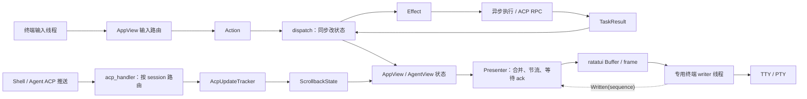
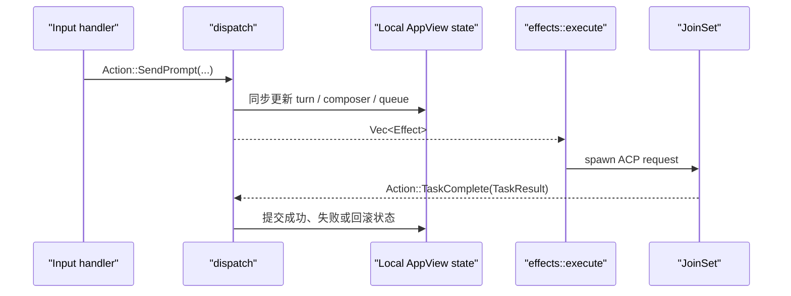
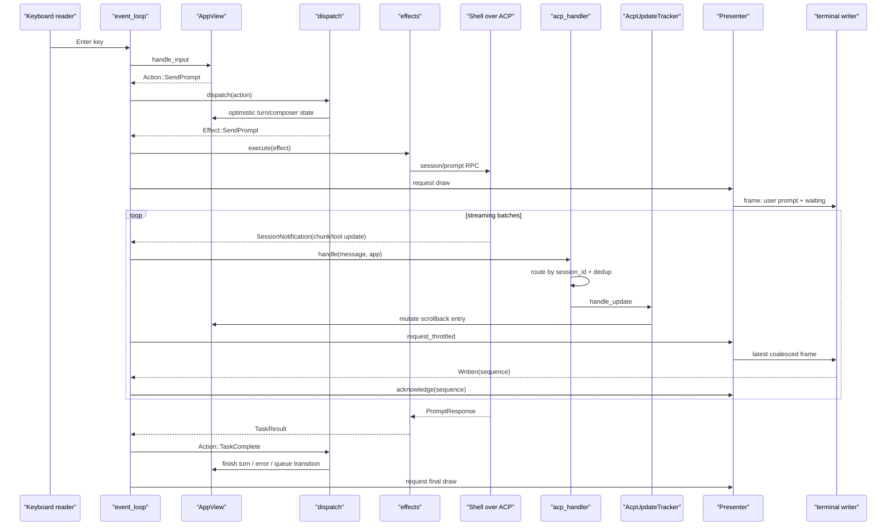

# TUI 事件循环：从键盘输入到终端重绘

本文追踪 Grok Build 终端界面的主循环：键盘、鼠标和粘贴事件如何变成用户意图，异步 ACP 消息如何落入正确 session 的 scrollback，状态变化如何被合并成有限频率的终端帧，以及为什么高频流式输出不会完全饿死用户输入。

前置阅读：[Prompt 到最终回答](02-prompt-to-answer.md)、[工具从注册到执行](04-tool-execution.md)和[Subagent 从创建到结果回传](07-subagent-task.md)。后续的 `09-acp-and-mcp.md` 会进一步解释协议本身；本文只关心 TUI 怎样消费协议事件。

## 先澄清名字

仓库中没有名为 `xai-grok-tui` 的 crate。完整终端应用主要位于 `xai-grok-pager`，并配合以下 crate：

- `xai-grok-pager-render`：较低层的绘制支持。
- `xai-grok-pager-minimal`：minimal 屏幕模式的实现。
- `xai-ratatui-inline`：inline/native scrollback 相关能力。
- `xai-ratatui-textarea`：文本输入组件。

所以本文中的 “TUI” 是产品形态，“pager” 是源码中的主要实现名。不要因为名字叫 pager，就把它理解成只读的 `less` 替代品；它同时负责 prompt 输入、session 切换、流式输出、权限弹窗、设置和大量交互状态。

## 先记住结论

这套 TUI 不是一个简单的 `read event -> redraw` 循环。它有五个关键边界：

1. **事件循环只做 I/O 调度。** 输入路由和绘制交给 `AppView`，同步业务状态变更交给 `dispatch`，异步操作交给 `effects`。
2. **本地意图走 Action/Effect/TaskResult。** 键盘或鼠标先形成 `Action`；dispatch 同步修改状态并返回 `Effect`；异步任务完成后以 `TaskResult` 回到 dispatch。
3. **服务端推送走 ACP handler/tracker。** 流式 chunk、tool update、权限请求等由 `acp_handler` 按 session 路由；内容事件再由 `AcpUpdateTracker` 归约成 scrollback mutation。
4. **状态变化不等于立刻写终端。** `Presenter` 合并 dirty 请求、限制流式绘制频率，并等待上一帧写入确认，避免终端输出反压堵塞 Tokio 主循环。
5. **正确性依赖路由、批处理和恢复。** 后台 Agent 的消息仍必须进入它自己的 scrollback；输入队列出现数据时 ACP 批处理会让路；外部编辑器接管 TTY 后，返回时必须恢复终端并强制全量重绘。

可以先把主干压缩成这张图：



这张图包含两条汇合到同一视图状态的输入路径。它们不要混为一谈：

- `Action` 是本地、同步、可测试的用户意图。
- `AcpClientMessage` 是来自协议连接的异步消息。
- `RenderBlock` 是已经适合 scrollback 展示的数据，不是协议 DTO。
- 终端 frame 是某一时刻状态的投影，不是状态本身。

## 一、事件循环拥有的是什么

主入口在 `crates/codegen/xai-grok-pager/src/app/event_loop.rs::run`。文件顶部把自己称为 thin `tokio::select!` loop：它负责把各类 I/O 接到应用状态上，而不是在巨大 match 中直接实现所有功能。

它长期持有或轮询的输入源包括：

- ACP 客户端消息 channel。
- 专用终端读取线程送来的键盘、鼠标、resize、paste 和 focus 事件。
- `JoinSet<TaskResult>` 中已完成的异步 effect。
- session restore progress channel。
- 终端 writer 的成功确认或失败。
- animation、scroll、resize debounce 和 deferred draw timer。
- 配置与主题热更新。
- billing、subscription、roster、recap 等周期性轮询结果。
- 退出信号、连接取消、leader 重连和语音转写等外围事件。

这不意味着每种事件都应放进一个统一 enum。主循环的价值恰恰是保留不同来源的时序特征，再把它们送往合适的 reducer 或 handler。

### AppView 与 AgentView

`AppView` 是根视图模型，定义于 `app/app_view.rs`。它拥有全局 UI 状态，例如：

- 当前是 welcome、dashboard 还是某个 Agent 页面。
- 多个 `AgentView` 及 active agent ID。
- 全局 modal、通知、主题、屏幕模式和输入规范化状态。
- 尚待执行的 effects、轮询标志和 session picker 等跨页面状态。

`AgentView` 定义于 `app/agent_view/mod.rs`，是单个 Agent 的视图模型。它把 session 状态、scrollback、prompt editor、权限/问题/plan overlay、subagent view、滚动和布局缓存等组合在一起。

可以用一个实用判断区分二者：

- 切换到另一个 Agent 后仍是同一份状态，通常属于 `AppView`。
- 每个 Agent 应各自保留一份的状态，通常属于 `AgentView` 或其 `AgentSession`。

这个区分会直接影响 ACP 消息路由。消息不能总写入 active view，否则后台 session 的回答会串到当前页面，或切回后台页面时丢失中间内容。

## 二、本地输入怎样进入系统

### 1. 专用线程读取终端

终端读取不是直接放在 Tokio task 中做阻塞 `read()`。`event_loop.rs` 建立 `input_tx/input_rx`，由专用 reader thread 读取 crossterm `Event`，再把带到达时间的信息送入异步 channel。

这样做有两个主要原因：

- 传统 TTY 读取是阻塞式的，不应占住 Tokio worker。
- 外部编辑器或 pager 接管终端时，可以显式 park reader，避免两个读取者竞争同一个 TTY。

### 2. 先排水，再识别输入边界

主循环收到第一个事件后调用 `drain_and_process`，不会机械地只处理一个字节或一个 key event。它先排掉 channel 中已经就绪的一批事件，然后处理：

- XT/CSI 终端查询响应过滤。
- 某些终端协议的碎片拼接。
- bracketed paste 不完整或终端没有可靠标记时的 paste 探测。
- paste 后续片段的短窗口收集。

原因是“用户输入”与“终端控制响应”在字节流层可能长得相似。一段快速到达的文本也可能是一次粘贴，而不是用户逐键输入。若边界识别错误，常见后果是：终端能力查询的响应被插进 prompt，或者大段粘贴触发逐键快捷键。

### 3. AppView 分层路由

`AppView::handle_input_at_with_paste_provenance` 是根输入入口。其注释给出的主层次是：

1. pending action，例如需要按两次确认的快捷键。
2. active view，例如 welcome、dashboard 或 Agent 页面。
3. 全局动作，例如带确认的退出。

实际代码还会优先处理 modal、教程、滚轮命中区域、下拉框、active subagent pane 和 prompt 等更细粒度焦点。

这里的重点不是背快捷键，而是理解“最具体的交互层先消费，未消费的事件再冒泡”。例如：

- 权限 modal 打开时，方向键应改变权限选项，而不是移动 prompt 光标。
- 鼠标滚轮位于 dropdown 上时，应滚 dropdown，而不是底层 scrollback。
- active subagent 全屏打开时，滚动应落到 child view。
- 没有局部组件消费的 Ctrl+C，才可能升级为 turn cancel 或全局退出确认。

### 4. InputOutcome 不是业务操作本身

输入处理会返回类似以下结果：

- 未改变状态。
- 状态已改变，需要绘制。
- 产生一个 `Action`。
- resize-only、force repaint 等绘制提示。

事件循环随后把 `Action` 交给 dispatch，并依据 outcome 决定立即绘制、延迟 resize 绘制，还是完全不画。

这层分离避免每个 widget 自己调用网络、文件系统或 terminal write。widget 的任务是解释输入；业务状态变化由 dispatch 统一完成。

## 三、Action → dispatch → Effect → TaskResult

这组类型定义在 `app/actions.rs`，是理解 TUI 架构最重要的三个 enum。

### Action：同步用户意图

源码将 `Action` 定义为 “Synchronous, side-effect-free user intent”。常见例子包括：

- 退出、创建或加载 session。
- `SendPrompt`、`SendPromptNow`、interject、cancel turn。
- 回答权限、问题或 plan approval。
- 切换模型、设置、Agent 或 view。
- 打开链接、外部编辑器和 transcript pager。

“side-effect-free” 描述的是 Action 值本身。它只表达“用户想做什么”，不会在 enum 构造时发送 RPC。

### dispatch：同步 reducer

`app/dispatch/mod.rs` 规定了明确的不变量：

- 不直接接触终端、网络或文件系统。
- 状态变更同步且确定。
- 异步工作只描述成 `Effect`，不在 dispatch 内执行。
- 不需要 Tokio 或真实终端就能测试。

例如发送 prompt 时，dispatch 可以先更新本地 turn/prompt/queue 状态，产生 `Effect::SendPrompt`；但真正调用 ACP 不在这里发生。

这种写法有两个好处：

1. **状态转换可单测。** 给定初始 `AppView` 和 `Action`，可以断言新状态与 effects。
2. **异步完成也走同一状态入口。** 网络成功、失败或超时不会在任意 task 中偷偷修改 UI。

### Effect：待执行的副作用描述

`Effect` 描述需要异步或外部世界参与的工作，例如：

- 创建、加载、fork session。
- 发送 prompt、bash command、cancel、permission response。
- 读取 session list、检查订阅、持久化设置。
- 打开浏览器、外部编辑器或本地 pager。
- 启动 debounce timer 或后台恢复任务。

`app/effects/mod.rs::execute` 消费这些值。多数 effect 被 spawn 到 `JoinSet<TaskResult>`；部分很短的进程级操作会直接执行，并通过返回元信息告诉主循环是否退出或需要特殊处理。

### TaskResult：异步结果重新入环

异步任务结束后产生 `TaskResult`。事件循环不会直接在 task completion branch 里散落业务逻辑，而是包装为：

```text
Action::TaskComplete(result)
```

再交回同一个 dispatch。dispatch 可以据此提交成功状态、显示错误、回滚 optimistic update，或产生下一批 effects。

完整闭环是：



不要把它误解为完整的 Elm/Redux 框架。代码借用了单向数据流的优点，但 ACP 推送还有一条专门的 handler 路径，draw 过程中也会维护布局、hitbox 等展示缓存。

## 四、ACP 推送怎样变成 scrollback

用户发送 prompt 后，最终回答不是作为一个巨大 `TaskResult` 一次性返回。模型文本、thinking、tool call 和工具状态会作为 ACP session notification 持续到达 `acp_rx`。

### 1. AcpClientMessage 先按类别分流

`app/acp_handler/mod.rs::handle` 处理的主要类别包括：

- `SessionNotification`：标准 session update。
- `RequestPermission`：Agent 反向请求用户批准。
- `ExtNotification`：xAI 扩展通知。
- `ExtMethod`：扩展方法请求。
- `WaitForTerminalExit`：终端任务退出协调。

所以 ACP 通道既承载普通通知，也承载从 Agent 指向客户端的交互请求。权限弹窗不是 TUI 猜到“某工具危险”后自行生成的；它是服务端执行链明确发出的 reverse request，TUI 负责展示并把答案送回去。

### 2. 先找 session owner，不能只看 active tab

`app/acp_handler/routing.rs::find_session_match` 会按 `session_id` 查找：

- root Agent session。
- root 下的 child/subagent session。

找到后，消息写入拥有该 session 的 `AgentView` 或 child view。即使它当前在后台也照常更新，只是返回值会区分 active view 是否受视觉影响。

交互型消息还有专门的 `interaction_target_agent`：child 的权限或问题可以显示在 parent 的 overlay 上，但所有权仍按 child session ID 决定。MCP progress 等消息也有各自更窄的目标解析规则。

这条规则解决三个问题：

- 多 Agent 并行流式输出不会串屏。
- 切回后台 Agent 时能看到完整历史。
- 权限回答会回给真正阻塞的 session，而不是当前碰巧可见的 session。

### 3. live dedup 与 replay 是两套规则

对 live ACP notification，Agent 保存 `last_applied_event_seq` 高水位；序号不大于已应用值的重复事件会被丢弃。这可防 leader fan-out 或 reconnect 重发导致相同 chunk 重复出现。

replay 不使用这一 live highwater。原因是进程重启后事件计数可能重新从较小值开始，而持久化历史可拼接多段非单调序列。若拿旧高水位过滤 replay，恢复 transcript 会被截断。

因此需要记住：

- live event：按 event sequence 去重。
- replay history：把已排序持久化内容视为权威输入，不给 live highwater 喂值。
- unexpected replay：仍会通过 session/reconnect 语境检查丢弃，防止过期恢复流污染当前 turn。

### 4. AcpUpdateTracker 是流式状态机

`acp/tracker.rs::AcpUpdateTracker` 不负责网络和绘制。它只把一个个 `acp::SessionUpdate` 转成 `ScrollbackState` mutation。

它内部跟踪：

- 当前正在追加的 assistant message entry。
- 当前 thinking entry。
- pending/running tool call 与 tool call ID 的映射。
- 当前 turn activity，例如 thinking、responding、tool running、compacting、retrying 或 waiting。
- stream 起点、完成边界、去重和部分展示元数据。

`handle_update` 的主要映射是：

| ACP update | tracker 行为 |
| --- | --- |
| `AgentMessageChunk` | 创建或继续追加 assistant message block |
| `AgentThoughtChunk` | 创建或继续追加 thinking block |
| `ToolCall` | 创建对应工具的 pending/running block |
| `ToolCallUpdate` | 按 tool call ID 更新输出、状态与完成信息 |
| `UserMessageChunk` | 处理用户消息 echo/replay，并避免不需要的重复 |
| `AvailableCommandsUpdate` | 暂存 slash command 与 ACP tool 列表更新 |
| `Plan` / `CurrentModeUpdate` | 由更上层的 session/plan 逻辑处理，tracker 本身不改 scrollback |

tracker 返回 bool，表示可见 scrollback 是否发生变化。它不是在说“协议消息是否有效”；有些消息只改变更上层状态，或空 chunk 不需要重画。

### 5. 为什么要有 RenderBlock

scrollback 中不是直接保存原始 JSON notification。`RenderBlock` 把展示语义稳定下来，例如文本、thinking、特定工具、session event 等各有自己的 block 类型。

这样协议层与展示层解耦：

- 协议只说“发生了一个 tool update”。
- tracker 决定它对应哪个现有 entry、应该追加还是完成。
- tool-specific block 决定命令、文件读取、搜索或编辑结果怎样显示。
- renderer 只需布局 block，不必重新推断整个 ACP 生命周期。

## 五、为什么流式输出不会无限抢占输入

事件循环使用 `tokio::select! { biased; ... }`。biased 表示多个分支同时 ready 时按源码顺序选择，而不是随机公平轮询。

高优先级大致是：

1. 连接取消和退出信号。
2. terminal writer ack/failure。
3. ACP 消息。
4. 已完成的 effect 和 progress。
5. 终端输入。
6. draw、resize、animation、poll、hot reload 等 timer。
7. 特意放在末尾的语音 STT 分支。

只看这个顺序会产生疑问：ACP token 一直 ready，排在后面的键盘输入岂不是永远没机会？代码用了两个配套机制。

### 输入队列 gate

ACP 分支只在 `input_rx.is_empty()` 时启用。一旦 reader 已经送来按键或滚轮，ACP 分支暂时不可选，输入分支立即有机会排掉 backlog。

代码没有简单地把 input 分支永久挪到 ACP 上面，因为持续按键反过来也可能让 streaming redraw 长时间得不到处理。gate 表达的是更精确的策略：有已缓冲输入就先清输入；清完后的下一轮允许 ACP 继续。

### 有界 ACP 批处理

收到一个 ACP 消息后，循环用 `try_recv` 继续排掉已经就绪的消息，最多 `ACP_DRAIN_BATCH_MAX = 32` 条，并在输入一到达时提前停止。

这同时避免两种极端：

- 每个 token 都单独 draw，终端写入成本远高于状态更新成本。
- 一次排空无限 token flood，让输入必须等整个回答结束。

因此这里的 fairness 不是“所有分支完全平均”，而是对交互延迟和流式吞吐做有界权衡。

## 六、Presenter 怎样控制绘制

`event_loop.rs::Presenter` 是事件状态与真实终端输出之间的小型调度器。字段很少，但解决了三个不同问题。

### dirty 与合并

`request()` 只把 `dirty` 设为 true。多个状态变化在真正 draw 前重复 request，不会形成同样数量的帧；它们被合并成“至少需要再画一帧”。

`force_full_repaint` 使用 OR 累积。只要任何请求要求全量重绘，后续普通请求不能把这个要求覆盖掉。

### streaming throttle

ACP batch 造成可见变化后调用 `request_throttled(now, min_draw_interval)`。若距离上一帧太近，Presenter 记录最早允许绘制的时间，由 deferred draw timer 稍后完成。

这叫 throttle：在持续事件流中限制最大绘制频率。它与 resize debounce 不同：

- throttle 保证一段时间最多画一次，但连续流中仍周期性更新。
- debounce 等待 resize 暂停一小段时间，只在尺寸稳定后重建一次布局。

### in-flight frame gate

绘制并不代表字节已经写进 TTY。底层 `PagerTerminal` 把 frame 数据交给专用 writer thread，避免 PTY 反压阻塞 Tokio event loop。

Presenter 在 draw 前记录 writer queue sequence，在 draw 后读取新的 sequence；若新增了输出，就把它记为 `in_flight_target`。收到 `WriterEvent::Written(sequence)` 且序号达到目标后，才允许下一帧真正提交。

如果上一帧仍在写：

- 新 request 只保持 dirty。
- 状态仍可继续接收输入和 ACP 更新。
- ack 到达后，后续循环会用最新状态绘制，而不是把每个过期中间帧都输出。

这是一种有损帧合并，但不是有损状态处理。可以丢掉“第 101 个 token 时的屏幕截图”，不能丢掉第 101 个 token 本身。

## 七、从视图状态到终端帧

`AppView::draw` 调用 `draw_inner`，非 minimal 模式最终经低层 `render::draw::draw_frame` 构建并提交 frame。`AgentView::draw` 接收 ratatui `Rect` 与 `Buffer`，绘制 scrollback、prompt、状态栏、modal、overlay 等内容。

一次绘制可理解为：

1. 根据 terminal area 和配置计算 layout。
2. 将当前 view model 投影到 ratatui `Buffer`。
3. 同时记录鼠标 hitbox、link span、cursor 位置和某些 post-flush 操作。
4. 低层比较/编码需要写入终端的内容。
5. writer thread 执行真正可能阻塞的 `write()`。

ratatui 的 `Buffer` 可以看成二维 cell 网格；cell 中包含字符与样式。终端最终接收的是 ANSI 控制序列和文本，不是 widget 对象。

### 三种 ScreenMode

`app/mod.rs::ScreenMode` 定义：

- `Fullscreen`：使用 alternate screen 的完整 TUI。
- `Inline`：留在主屏幕中的 inline 界面。
- `Minimal`：把已完成 block 写入终端原生 scrollback，只保留较小的固定 live region。

Minimal 的核心绘制实现位于独立的 `xai-grok-pager-minimal`。`xai-grok-pager` 只保留 hook/API seam 和 `minimal_state`。阅读普通全屏交互时，可以暂时把 minimal 当成另一套 renderer；但修改 scrollback commit 或 screen restoration 时不能忽略它。

## 八、resize、动画与热更新为什么也在循环里

并非只有新文本才会改变画面。

### Resize debounce

连续拖动终端边缘会快速产生大量 resize。输入分支识别 resize-only 后重置 deadline，尺寸稳定后才集中重建布局。若其间出现普通输入或需要强制修复的 focus 事件，会取消 debounce 并立即画最新状态。

### Animation tick

spinner、等待状态、toast TTL、滚动动画和某些 turn reconciliation 需要时间推进，即使没有新 ACP chunk。主循环只在 `app` 表示需要时安排 tick，避免 idle 时持续空转绘制。

animation tick 还承担恢复职责。例如 prompt response 已经完成但对应结束事件因竞态没有及时落到视图时，超过 grace period 后可进行 reconciliation，避免界面永久卡在 running。

### Hot reload

配置、主题或系统 appearance 变化会更新展示状态并申请重绘。它们仍走 Presenter，而不是绕过帧合并直接写终端。这样一帧可以同时反映“新 token + 新主题”，不必按事件来源分别绘制。

## 九、外部程序接管 TTY 时发生什么

打开 `$EDITOR`、本地 pager 或其他交互子进程是 TUI 最容易出错的边界之一。父应用与子进程不能同时认为自己拥有 raw-mode 终端。

事件循环的 suspend/handoff 路径大致会：

1. 确认当前没有不安全的终端写入交错。
2. park 输入 reader，清掉 park 前竞态送来的残留事件。
3. 暂时离开当前屏幕/raw mode，让 child 接管 TTY。
4. 等待 child 退出。
5. 丢弃 child 留下的 ANSI 查询响应和无效输入。
6. 恢复输入 reader、terminal mode、鼠标与屏幕状态。
7. 必要时重新锚定 inline/minimal cursor，并请求 full repaint。

为什么必须 full repaint？因为 child 可能移动光标、清屏、换颜色或输出任意文本，ratatui 之前保存的“终端现在长什么样”已经不可信。只做 diff 可能认为某些 cell 没变化而不重写，留下破碎画面。

## 十、一次流式回答的完整时序

下面把前面各段串成一次常见交互：



图中有一个容易忽略的事实：Prompt RPC 的 completion 与流式 notification 是两条相关但不同的信号。notification 构造可见 transcript；RPC result 让请求方知道 turn 调用结束或失败。代码还需要 reconciliation 来处理它们到达顺序、丢失或重连造成的边缘情况。

## 十一、常见误解

### 误解 1：每个 ACP chunk 都对应一帧

不对应。ACP 会有界批处理，Presenter 会 throttle、coalesce，并受 in-flight writer gate 限制。多个 chunk 常常只形成一帧。

### 误解 2：当前屏幕就是全部应用状态

不是。后台 Agent 和 child 的 view model 会继续更新；active view 只是当前投影。session 路由错误比 renderer 错误更可能造成“回答出现在错误页面”。

### 误解 3：dispatch 会直接发网络请求

不会。dispatch 返回 `Effect`，由 effects executor 发起异步工作，完成后以 `TaskResult` 回流。

### 误解 4：ACP 消息都先变成 Action

不是。服务端 session notification 直接进入 `acp_handler` 与 tracker。Action pipeline 主要用于本地意图和异步结果的确定性状态变更。

### 误解 5：draw 是完全无状态的纯函数

不宜这样假设。业务 reducer 与副作用的边界很清晰，但绘制会维护 layout、hitbox、selection、inline media 和终端相关缓存。更准确的说法是：view model 驱动绘制，业务状态不应由任意 widget 直接执行外部副作用。

### 误解 6：Tokio select 默认会公平处理所有来源

这里明确使用 `biased`。公平性来自源码顺序之外的 gate、有界 drain、throttle 和 timer 设计，不来自 select 自动平均分配。

## 十二、建议的源码精读顺序

不要从 `AppView` 的所有字段开始硬读。按一个闭环逐层进入更容易：

1. `xai-grok-pager/src/app/mod.rs`：看模块边界与 `ScreenMode`。
2. `app/event_loop.rs`：先看文件注释、`Presenter` 和主 `tokio::select!`。
3. `app/actions.rs`：只读 `Action`、`Effect`、`TaskResult` 的注释和与你关心的变体。
4. `app/dispatch/mod.rs` 与 `app/dispatch/router.rs`：理解纯同步 dispatch contract。
5. `app/effects/mod.rs`：追一个 effect 怎样 spawn 并返回 `TaskResult`。
6. `app/app_view.rs::handle_input_at_with_paste_provenance`：看根输入层次。
7. `app/acp_handler/mod.rs` 与 `routing.rs`：看 session routing、dedup 和 reverse request。
8. `acp/tracker.rs::handle_update`：看协议 update 到 scrollback 的归约。
9. `app/app_view.rs::draw` 与 `app/agent_view/render.rs::draw`：最后看状态怎样投影到 Buffer。

建议选择两个具体场景做双线追踪：

- 按 Enter 发送 prompt：输入 → Action → Effect → TaskResult。
- 收到 `AgentMessageChunk`：ACP → routing → tracker → scrollback → Presenter。

这两条线掌握后，再读权限 modal、subagent view 或 minimal renderer 会容易很多。

## 十三、测试与验证

### 快速定位

```sh
rg "tokio::select|ACP_DRAIN_BATCH_MAX|struct Presenter" \
  crates/codegen/xai-grok-pager/src/app/event_loop.rs

rg "pub enum Action|pub enum Effect|pub enum TaskResult" \
  crates/codegen/xai-grok-pager/src/app/actions.rs

rg "AcpClientMessage::|find_session_match|handle_update" \
  crates/codegen/xai-grok-pager/src/app/acp_handler \
  crates/codegen/xai-grok-pager/src/acp/tracker.rs
```

### 重点测试位置

- `app/dispatch/tests/`：Action 到状态/effect 的纯逻辑测试。
- `app/acp_handler/tests/`：路由、重放、通知和交互请求测试。
- `acp/tracker.rs` 内测试：chunk 合并、thinking、tool update、replay 等状态机测试。
- `xai-grok-pager/tests/`：更完整的 pager 行为测试。
- `xai-grok-pager-pty-harness`：streaming、resize storm、scroll stress、mixed interaction 等真实 PTY 场景。

### 小范围运行

```sh
cargo test -p xai-grok-pager presenter
cargo test -p xai-grok-pager acp_handler
cargo check -p xai-grok-pager
```

具体测试过滤名可能随源码变化；先用 `cargo test -p xai-grok-pager -- --list` 查看当前名称，再选小范围运行。日常理解 TUI 时不需要先跑整个 workspace。

## 十四、阅读检查题

1. 为什么 ACP 分支排在 input 之前，却不会在 token flood 时永久饿死已缓冲输入？
2. 为什么 Presenter 丢掉中间帧是安全的，但丢掉 ACP chunk 不安全？
3. `Action`、`Effect` 和 `TaskResult` 各自由谁产生、谁消费？
4. 后台 Agent 的 notification 为什么仍要更新它自己的 scrollback？
5. live event highwater 为什么不能直接用于 replay？
6. `AcpUpdateTracker` 为什么要记住 current message、thinking 和 tool call，而不能把每个 update 都新增成一个 block？
7. throttle 与 debounce 分别解决什么问题？
8. 外部编辑器退出后为什么需要 full repaint？
9. 权限请求为什么属于 ACP reverse request，而不只是一个本地 modal？
10. 如果出现“输入很卡但 CPU 不高”，你会先检查 input gate、Presenter in-flight，还是 session routing？为什么？

## 本篇术语表

| 名词 | 白话解释 | 在本文中的具体含义 |
| --- | --- | --- |
| TUI | 在终端里运行的图形化交互界面 | Grok Build 的 prompt、scrollback、modal、dashboard 等终端 UI |
| pager | 通常指分页查看器 | 本仓库中是完整 TUI 主实现 `xai-grok-pager` 的历史/产品命名 |
| event loop | 不断等待和处理事件的主循环 | `event_loop.rs` 中协调 ACP、输入、任务、timer 和绘制的 Tokio 循环 |
| event source | 产生事件的来源 | 终端 reader、ACP channel、JoinSet、timer、信号等 |
| Tokio | Rust 异步运行时 | 驱动 channel、task、timer 和 `select!` 的 runtime |
| `tokio::select!` | 等多个 async 操作，谁先就绪就执行谁 | 主循环一次选择一个 ready 分支的机制 |
| biased select | 多分支同时就绪时按声明顺序选 | 本文主循环明确使用的优先级策略 |
| starvation | 某类任务长期抢不到执行机会 | token flood 让键盘事件一直排队，或持续输入让绘制一直推迟 |
| fairness | 不同事件源都能在合理时间内被处理 | 由 input gate、有界 drain 和节流共同实现，不是严格平均 |
| channel | task/thread 之间传消息的队列 | `input_rx`、`acp_rx`、progress channel 等 |
| drain | 一次取走队列中已就绪的多条消息 | 输入与 ACP 都会批量处理，减少每条消息的固定成本 |
| backlog | 队列中尚未处理的积压 | 高频 token、按键或 resize 可能产生 backlog |
| crossterm | 跨平台终端控制库 | 读取 key/mouse/paste/resize，并控制 raw mode、鼠标等 |
| ratatui | Rust TUI 布局和绘制库 | 将 widget/view 状态写入二维 `Buffer` |
| TTY | 进程所连接的终端设备抽象 | TUI 与外部编辑器需要交接所有权的输入输出设备 |
| PTY | 由程序模拟的一对伪终端 | 测试 harness 或宿主终端用来运行和观察真实 TUI |
| raw mode | 终端不做普通行编辑，按键直接交给程序 | TUI 捕获快捷键、鼠标和控制序列所需的模式 |
| alternate screen | 与普通 shell 历史分开的临时屏幕 | Fullscreen 模式退出后可恢复原 shell 画面 |
| inline mode | 不完全占用 alternate screen 的显示方式 | 在主终端屏幕中绘制 pager 内容 |
| minimal mode | 已完成内容进入终端原生历史的精简模式 | `xai-grok-pager-minimal` 管理的小型 live region + native scrollback |
| view model | 为界面展示组织的状态对象 | `AppView`、`AgentView` 以及它们持有的展示状态 |
| focus | 当前优先接收输入的组件 | modal、dropdown、prompt、subagent pane 等 |
| modal | 覆盖当前页面并优先接收输入的对话框 | 权限、问题、plan approval、设置等交互层 |
| overlay | 叠加在基础视图上的展示层 | dashboard session view、subagent 或其他浮层；不一定阻塞所有输入 |
| Action | 同步、无副作用的用户意图值 | dispatch 的输入，例如 SendPrompt、CancelTurn |
| dispatch | 根据 Action 同步改变状态的分发器 | `app/dispatch`，返回零个或多个 Effect |
| reducer | 用旧状态和事件算出新状态的逻辑 | 本文用来描述 dispatch/tracker 的状态归约职责 |
| Effect | 对异步或外部操作的描述值 | 由 dispatch 产生，由 `effects::execute` 执行 |
| TaskResult | 异步 Effect 的完成结果 | 包装成 `Action::TaskComplete` 后重新进入 dispatch |
| optimistic update | 外部操作完成前先更新本地界面 | 例如 prompt 发送时先进入 running/waiting 状态，失败后再回滚或报错 |
| ACP notification | Agent 通过 ACP 主动推给客户端的事件 | 流式文本、thinking、tool update 和 xAI session 通知等 |
| reverse request | 服务端反过来向客户端发起、等待答复的请求 | permission、ask-user-question 等交互请求 |
| session routing | 根据 session ID 找到状态所有者 | 把 root/child 消息送到正确 `AgentView`，而非一律送到 active view |
| tracker | 记忆流式事件上下文的状态机 | `AcpUpdateTracker` 追踪当前文本、thinking 与 tool calls |
| scrollback | 可回看的一串终端会话内容 | `ScrollbackState` 中的用户、Agent、工具和 session event entries |
| RenderBlock | 已按展示语义分类的内容块 | 文本、thinking、特定工具或 session event 的渲染数据 |
| chunk | 流式内容的一小段增量 | `AgentMessageChunk`、`AgentThoughtChunk` 等 ACP update |
| replay | 恢复 session 时重新送入历史事件 | 与 live 消息有不同的去重和顺序假设 |
| dedup | 去除重复事件 | live notification 使用 event sequence highwater 防重复应用 |
| highwater | 已处理到的最大序号记录 | `last_applied_event_seq`，只适用于相应 live 流 |
| frame | 某一时刻完整或差量的屏幕输出 | AppView 经 ratatui 和低层 renderer 生成的一次绘制 |
| Buffer | 终端字符与样式的二维内存网格 | AgentView 把当前状态写入的 ratatui 数据结构 |
| dirty | 状态已变化，至少还需要画一次 | Presenter 合并多个绘制申请的标志 |
| coalesce | 把多个重复工作合并成一个 | 多个 state change 合并成最新的一帧 |
| throttle | 持续事件中限制最大执行频率 | streaming 时限制 terminal paint rate |
| debounce | 等连续事件停止一会儿再执行 | resize 稳定后只重建一次布局 |
| tick | 由 timer 驱动的一次时间推进 | 更新 spinner、动画、toast 和 reconciliation |
| in-flight | 已提交但尚未确认完成 | writer 正在输出的 terminal frame |
| ack | 完成确认 | writer 的 `Written(sequence)` 允许 Presenter 提交下一帧 |
| backpressure | 下游处理慢迫使上游等待或积压 | PTY 写入慢时，专用 writer 与 frame gate 避免堵塞主循环 |
| full repaint | 清除旧假设并重画整个屏幕 | child program 破坏屏幕或 refocus 后恢复正确画面 |
| hot reload | 不重启进程就重新读取配置 | 主题/配置变化更新 view state 并申请重绘 |

更多跨文章通用概念见 [全局术语表](../appendices/glossary.md)。
