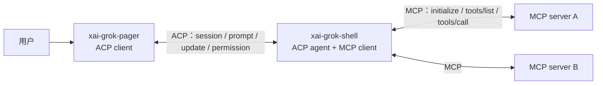
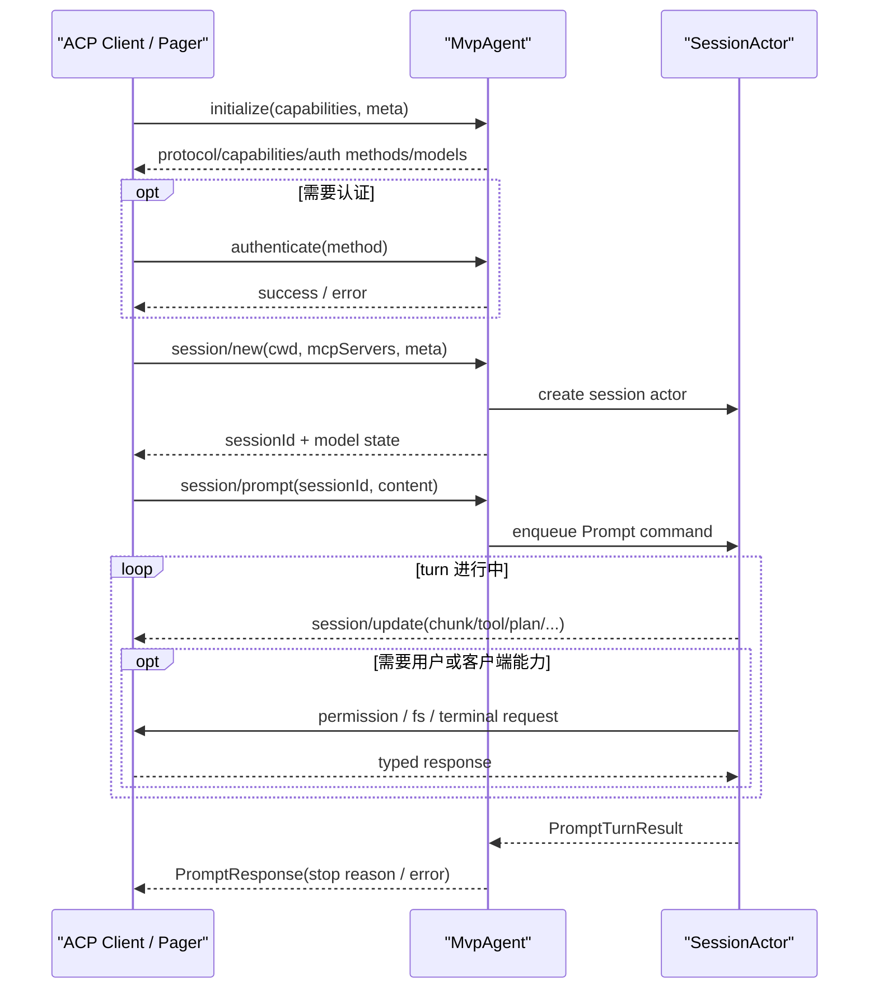
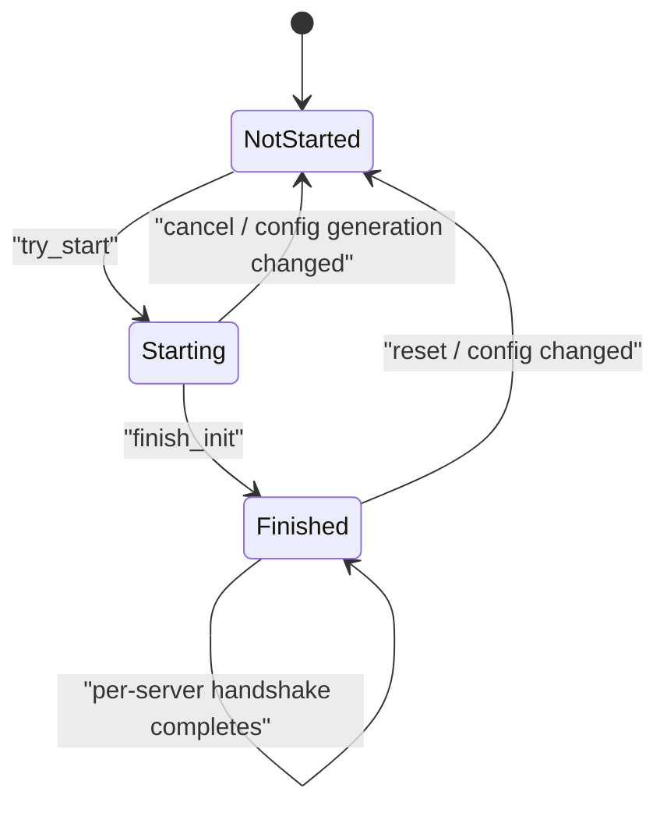
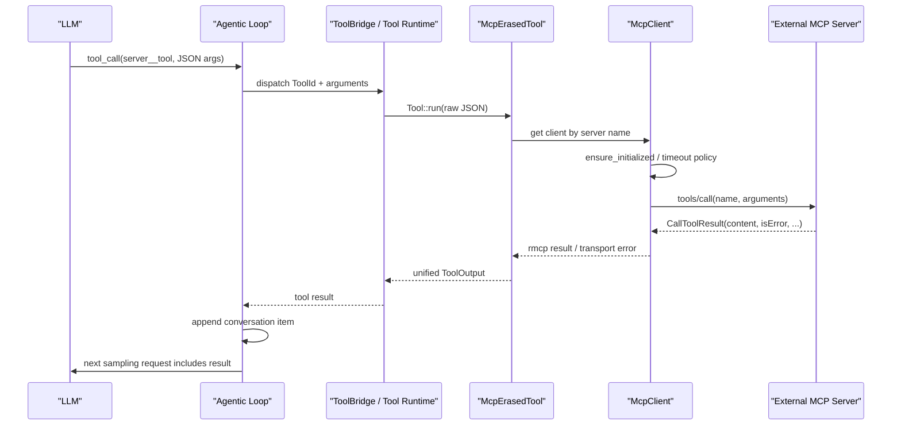
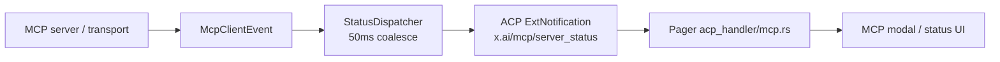
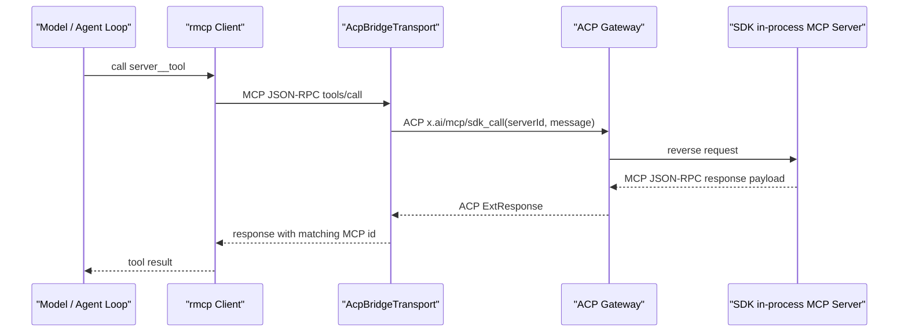

# ACP 与 MCP：Agent 控制面和外部工具面的边界

本文解释 Grok Build 中两个名称相似、职责完全不同的协议：ACP（Agent Client Protocol）与 MCP（Model Context Protocol）。重点不是罗列协议字段，而是回答：谁是 client、谁是 server，消息向哪边流动，session 与 tool 各由谁拥有，以及两套协议在哪里衔接。

前置阅读：[Prompt 到最终回答](02-prompt-to-answer.md)、[工具从注册到执行](04-tool-execution.md)和[TUI 事件循环](08-tui-event-loop.md)。后续的 `10-configuration.md` 会继续解释 MCP server 配置从哪些层合并；本文只概括配置进入运行时后的行为。

## 先记住结论

ACP 和 MCP 可以用一句话区分：

- **ACP 让客户端控制一个 Agent。** 它管理 initialize、认证、session 创建/恢复、prompt、cancel、session update、权限、文件系统和 terminal 等双向交互。
- **MCP 让 Agent 使用外部能力。** Agent 作为 MCP client，连接一个或多个 MCP server，完成 initialize、tools/list、tools/call、资源读取和 OAuth 等操作。

在 Grok Build 的普通 TUI 模式中，角色关系是：



最重要的边界有六条：

1. 模型不会直接连接 MCP server；shell 把 MCP tool 包装进统一工具运行时后，模型才看到工具定义。
2. pager 通常不是普通 MCP tool call 的执行者；它通过 ACP 控制 shell，并显示 shell 推来的 MCP 状态。
3. `session_id` 属于 ACP/session 维度；MCP server name 和 MCP request ID 属于 MCP 连接维度，不能互换。
4. ACP 和 MCP 都可以使用 JSON-RPC 风格请求，但“都像 JSON-RPC”不代表它们是同一协议。
5. 本地 ACP 可以只走进程内 typed channel；leader 模式才通过 IPC 传 JSON 行。协议角色不由物理 transport 决定。
6. 仓库支持 MCP-over-ACP 的特殊 SDK bridge；那是把 MCP JSON-RPC 当作 ACP 扩展请求的 payload 搬运，并没有抹掉两层协议边界。

## 一、先用对照表建立地图

| 维度 | ACP | MCP |
| --- | --- | --- |
| 全称 | Agent Client Protocol | Model Context Protocol |
| 主要问题 | 客户端怎样创建、驱动和观察 Agent session | Agent/host 怎样发现并调用外部工具或资源 |
| 本仓库常见 client | `xai-grok-pager`、headless/SDK client | `xai-grok-shell` 中的 `McpClient` |
| 本仓库常见 server/agent | `MvpAgent` / shell | stdio、HTTP、SSE 或 SDK 进程内 MCP server |
| 核心标识 | session ID、prompt ID、ACP method | server name、qualified tool name、JSON-RPC request ID |
| 典型 client → peer | initialize、new/load session、prompt、cancel | initialize、tools/list、tools/call |
| 典型 peer → client | session update、permission、FS、terminal、扩展请求 | tool result、resource result、list-changed notification |
| 状态所有者 | Agent/session actor 与客户端视图各有一部分 | shell 的 `McpState`、`McpClient` 与外部 server |
| 本仓库基础库 | `agent-client-protocol` + `xai-acp-lib` | `rmcp` + `xai-grok-mcp` |
| 失败影响 | 可能失去整个 Agent/session 连接 | 通常只让某个 server/tool unavailable，Agent 仍可做非 MCP 工作 |

表中 “ACP server” 容易造成措辞混乱。ACP 类型直接使用 **client side** 和 **agent side**；本文也优先说 ACP client 与 ACP agent，不把 Agent 叫成普通工具 server。

## 二、ACP 的角色和消息方向

### 1. client side 与 agent side

`xai-acp-lib/src/message.rs::AcpSide` 给两边建立了对称类型关系：

- `acp::ClientSide` 接收 `AcpClientMessage`，发送 `AcpAgentMessage`。
- `acp::AgentSide` 接收 `AcpAgentMessage`，发送 `AcpClientMessage`。

命名规则不是“谁发送”，而是“消息发给谁”：

- `AcpAgentMessage` 是 meant for the agent。
- `AcpClientMessage` 是 meant for the client。

这能避免阅读时把方向看反。例如 `RequestPermission` 位于 `AcpClientMessage`，因为它由 Agent 发出、等待客户端回答。

### 2. 发给 Agent 的主要消息

`AcpAgentMessageGeneric` 包含：

| 变体 | 作用 |
| --- | --- |
| `Initialize` | 协商协议版本、客户端能力、认证方式和 Agent capabilities |
| `Authenticate` | 按协商出的认证方法完成登录/认证 |
| `NewSession` | 为 cwd、MCP server、meta 等参数创建 session |
| `LoadSession` | 恢复已存在的 session 与历史 |
| `SetSessionMode` | 切换 plan/default 等 session mode |
| `SetSessionModel` | 修改 session 使用的模型 |
| `Prompt` | 向指定 session 提交内容块并等待 turn 结果 |
| `Cancel` | 通知指定 session 取消当前工作 |
| `ExtMethod` | 有响应的 xAI 扩展方法 |
| `ExtNotification` | 无业务返回值的 xAI 扩展通知 |

扩展机制很重要：标准 ACP 提供 session 主干，Grok Build 用 `x.ai/...` 方法补充队列、配置、MCP 管理、session 状态、hooks 等产品能力。

### 3. 发给 Client 的主要消息

`AcpClientMessageGeneric` 包含：

| 变体 | 作用 |
| --- | --- |
| `SessionNotification` | 推送文本、thinking、tool call、plan、mode 等 session update |
| `RequestPermission` | 请求用户批准工具、命令或文件操作 |
| `ReadTextFile` / `WriteTextFile` | 使用客户端提供的文件系统能力 |
| `CreateTerminal` | 请求客户端创建 terminal |
| `TerminalOutput` | 获取 terminal 输出 |
| `WaitForTerminalExit` | 等 terminal 命令结束 |
| `KillTerminalCommand` | 杀掉 terminal 中的命令 |
| `ReleaseTerminal` | 释放 terminal 资源 |
| `ExtMethod` / `ExtNotification` | Agent 到客户端的扩展调用或通知 |

这说明 ACP 不是单向“前端调用后端”的 REST 接口。Agent 在一个 prompt 执行期间可能反向使用客户端能力，并等待客户端答复。

## 三、xai-acp-lib 怎样把 RPC 变成 Rust channel

`xai-acp-lib` 不实现 Agent 的业务逻辑，也不负责 TUI。它提供协议胶水：typed message、request/response 关联、channel pair 和 gateway。

### AcpRequest：把 request 与 response 类型绑定

`AcpRequest` trait 为每个 request 声明：

- 对应的 `Response` 类型。
- method name。

例如 `PromptRequest` 对应 `PromptResponse`，`RequestPermissionRequest` 对应 `RequestPermissionResponse`。编译器因此能检查调用结果类型，不必把所有响应都先变成 `serde_json::Value` 再手工 downcast。

### AcpArgs：request 加一次性应答通道

`AcpArgs<T>` 同时携带：

- typed request。
- `oneshot::Sender<Result<T::Response, acp::Error>>`。

发送方调用 `acp_send(request, tx)` 时：

1. 创建 oneshot pair。
2. 把 request 与 response sender 包成相应 message enum。
3. 发进 mpsc channel。
4. await response receiver。

若主 channel 已关闭，得到 send failure；若 peer 取走消息却丢掉 response sender，得到 receive failure。这两个错误有不同诊断意义。

### acp_channels：一对交叉连接的 channel

`acp_channels()` 创建两个相反方向的 mpsc channel，返回：

- `AcpClientChannel`：接收 client messages，发送 agent messages。
- `AcpAgentChannel`：接收 agent messages，发送 client messages。

这对 channel 让同一进程或相邻线程无需序列化 JSON 就能保持完整 ACP request/response 语义。

### Gateway：typed channel 与 ACP trait/connection 的适配器

`AcpGatewayReceiver` 从 channel 收消息，并调用 `acp::Agent` 或 `acp::Client` trait 的对应 async 方法；结果再送回原 `response_tx`。

`AcpGatewaySender` 提供反向发送句柄。业务对象不用知道对面最终是：

- 同进程 trait object。
- 另一条 OS 线程。
- JSON-RPC connection。
- leader IPC 后面的远端 Agent。

所以 gateway 是调用语义的适配层，不等同于 TCP gateway 或 API gateway。

## 四、ACP transport 不只有一种

### 本地内嵌 Agent：typed channel 直达

`xai-grok-pager/src/acp/spawn.rs::spawn_grok_shell` 创建 linked ACP channels，并在 `acp-agent-worker` OS thread 上运行 `MvpAgent`。

Agent thread 使用 single-thread Tokio runtime + `LocalSet`。`AcpGatewayReceiver` 直接把 `AcpAgentMessage` 分发给 `Rc<MvpAgent>` 的 trait 方法。因此这条路径：

- 有 ACP 类型和 request/response 语义。
- 跨 OS thread channel。
- 不需要把每条请求编码成 JSON。

这也是“协议不等于网络”的典型例子。

### Leader 模式：JSON-RPC 经 IPC

`xai-grok-pager/src/acp/leader_bridge.rs` 把 leader 的 raw JSON line channels 适配成同样的 `AcpClientChannel`：

```text
Pager typed ACP channel
  ↕ gateway
ClientSideConnection
  ↕ newline-delimited JSON-RPC
leader IPC channels
  ↕
Leader-hosted Agent
```

bridge 使用 simplex pipe 和 `agent_client_protocol::ClientSideConnection` 完成序列化、反序列化和 response correlation。上层 event loop 仍只看到相同 typed `AcpClientChannel`。

连接重建时，bridge 会替换 leader sender。已经为旧连接组成、发送失败的 outbound line 不会盲目重放，因为 stale `session/load` 重发可能把完整 transcript 再 replay 一遍。重连后的 session 状态由明确的 re-init/reload 流程恢复。

### 为什么 transport 透明仍不是“完全无差别”

上层接口相同，但物理 transport 仍影响：

- 序列化错误与消息大小。
- 断线、重连和 stale request。
- 时延与乱序窗口。
- 是否能共享进程内对象。

因此测试协议业务时可使用内存 channel；测试 reconnect/replay 时必须覆盖 leader/JSON 路径。

## 五、一次 ACP session 的主生命周期



`PromptResponse` 与 `session/update` 不重复：

- update 是增量事件流，用于构建可见 transcript 和中间状态。
- prompt response 是一次 RPC 的结束信号，表明 turn 调用完成、取消或失败。

客户端必须同时处理两者，并处理重连或竞态造成的边缘顺序。上一章的 TUI tracker 消费 update，effects/TaskResult 则处理 prompt RPC completion。

## 六、MCP 在系统中的位置

MCP 的核心对象位于 `xai-grok-mcp`：

- `servers.rs`：transport、client lifecycle、tool listing/call、error recovery。
- `credentials.rs`：MCP credential store。
- `oauth.rs` / `oauth_config.rs`：OAuth 获取和配置。
- `mcp_http_client.rs`：HTTP/SSE reconnect/backoff 包装。
- `liveness.rs`：transport 活性监控。
- `acp_transport.rs`：SDK in-process MCP-over-ACP bridge。
- `wire.rs`：跨语言 bridge 的 ACP 扩展 method 常量。

`xai-grok-mcp` 还隔离了 `rmcp` 与 reqwest 版本。workspace 其他模块通过 `xai_grok_mcp::rmcp::*` 使用 MCP model types，避免 HTTP 依赖版本向整个工程扩散。

shell 侧 `session/mcp_servers.rs` 主要 re-export/整合这些能力；`acp_session_impl/mcp.rs` 把 MCP client/tool 注册接入 session actor 和 `ToolBridge`。

## 七、MCP server 配置从哪里来

一个 session 的 MCP server 不只来自单一 `config.toml`。运行时可能合并：

- pager 在 `NewSessionRequest.mcp_servers` 传入的 cwd 相关本地配置。
- shell 重新按 session cwd 解析出的项目配置。
- plugin/agent definition 提供的 server。
- managed MCP/connector 配置。
- parent session 共享给 Subagent 的现有 client pool snapshot。
- SDK 在 `_meta["x.ai/mcp/servers"]` 注册的进程内 MCP server。

配置合并还受目录信任、managed policy、toggle 和 disabled tools 影响。具体优先级放在下一篇；本文只需记住：`NewSessionRequest` 里的列表是输入之一，不必然等于最终 `McpState.configs`。

`acp::McpServer` 在这里被用作标准 server 配置类型，常见 variant 是：

- `Stdio`：command、args、env。
- `Http`：URL 与 headers。
- `Sse`：URL 与 headers。

“类型定义来自 ACP crate”不代表 MCP 流量通过 ACP。它只是 ACP 的 session/new schema 需要携带 MCP server 配置，所以复用了同一个 Rust 数据类型。

## 八、McpState 和初始化状态机

`xai-grok-mcp/src/servers.rs::McpState` 是 session 的 MCP 聚合状态，主要持有：

- server configs 与 meta overrides。
- session 自己拥有的 `owned_clients`。
- 从 parent snapshot 继承的 `shared_clients`。
- SDK ACP-MCP registry。
- 初始化进度与 generation。
- tool `_meta`、disabled tool registrations。
- auth-required 和 init-failed server 集合。
- client event sender。

### InitProgress

初始化使用 typed state machine：



`Finished` 不一定表示所有 server handshake 已完成。它表示 session 已越过“不应继续阻塞主启动”的边界；内部仍保存 `handshaking` set。只有 `Finished` 且 set 为空时，`is_complete()` 才为 true。

这种设计让非 MCP 工作不必等所有外部 server 冷启动，同时仍能精确展示哪些 server 在后台初始化。

### generation 防止旧初始化覆盖新配置

配置更新可能发生在旧 server 仍 handshake 时。`McpState.generation` 用于识别过期 init：旧 task 返回后若 generation 不再匹配，就不能把旧 client/tool 写回新配置状态。

这是常见 async stale-result 防护。仅靠“取消旧 future”不够，因为连接或 spawn 可能已经进入不可立即取消的阶段。

## 九、从 server 启动到工具注册

### 1. 构造 transport

`start_mcp_server` 按配置创建 client：

- Stdio：规划可执行命令，spawn child process，stdin/stdout 作为 MCP transport，stderr 单独排到日志。
- HTTP/SSE：构建 URL/headers，探测 OAuth，必要时准备 authorization manager。
- SDK ACP server：建立内存 duplex，并由 ACP reverse invoker 搬运 MCP JSON-RPC。

每个 server 有 startup timeout、默认 tool timeout 和 per-tool timeout override。HTTP 还保存可重建 transport 的配置，用于断线或认证恢复。

### 2. MCP initialize handshake

`McpClient::ensure_initialized` 负责 single-flight 初始化：多个并发 caller 发现同一 client 尚未 ready 时，不会各自重复 handshake；一个 caller 成为 holder，其他 caller 等 `Notify`。

成功后得到 rmcp `RunningService<RoleClient, GrokClientHandler>`，并记录 server instructions、capabilities 和 transport 状态。失败会恢复可重试状态并通知等待者，避免 client 永久卡在 `Initializing`。

### 3. tools/list 分页

`get_tool_registrations` 先 `ensure_initialized`，再调用 `list_tools`。若 server 返回 `next_cursor`，继续取后续页，直到工具列表完整。

每个 MCP tool 包成 `McpTool`，再转为 `McpToolRegistration`：

- 保存 name、description、input schema 和 `_meta`。
- 关联 server name 与共享 `McpState`。
- 计算是否 model-visible。
- 验证 qualified name。

### 4. server__tool 命名

注册进统一工具运行时时，工具 ID 变成：

```text
<server_name>__<unqualified_tool_name>
```

例如：

```text
github__create_issue
linear__create_issue
```

两个 server 即使都暴露 `create_issue`，也不会在 `LocalRegistry` 中冲突。`parse_mcp_qualified_name` 要求结构可拆分且 provider/tool ID 合法；含糊或非法名称会记录错误并跳过。

### 5. model-visible 与 app-visible

工具 `_meta.ui.visibility` 可以区分受众：

- 默认或包含 `model`：注册到 `ToolBridge`，模型可调用。
- 只有 `app`：不暴露给模型，但前端可通过 MCP catalog 看到，并使用 `x.ai/mcp/call` 直接触发。

所以 “MCP server 列出了工具” 不等于 “模型一定能看到工具”。还要经过 visibility、disabled tool、policy 和 ToolBridge 注册。

## 十、一次普通 MCP 工具调用

模型看到的是统一 sampling tool definition，而不是 rmcp client。调用路径如下：



`McpErasedTool` 实现统一的 `xai_tool_runtime::Tool`：参数是任意 JSON，输出转换为 Grok 工具系统的 `ToolOutput`。因此 sampling loop 不需要为每种 MCP server 增加新 dispatch 分支。

### 超时与恢复

调用使用 server 默认或 per-tool timeout。HTTP transport 出现可恢复错误时，可以重建连接并做一次受控重试；认证拒绝可能触发 token reload/refresh 或交互式 OAuth。外层 timeout 仍是硬边界，不能因 reconnect 无限延长一次模型工具调用。

Stdio child 的 transport 生命周期不同：进程退出后需要重新 spawn，而不是简单复用一个 HTTP config 建连接。session 侧有 stdio auto-restart guard，避免用户主动删除/禁用 server 后 transport-close watcher 又把它复活。

### 权限位于哪一层

MCP 协议本身负责 tool call，不替 Grok Build 决定本地用户是否批准。MCP tool 包装进入统一 ToolBridge 后，Grok 的权限/auto-mode policy 可以在执行边界展示 server、tool 和 arguments，再决定是否继续。

换句话说：

- `tools/call` 是 MCP 操作。
- permission reverse request 是 ACP 客户端交互。
- 把二者串起来的是 shell 的统一工具运行时与 permission system。

## 十一、MCP 状态怎样回到 TUI

MCP server 可以在 prompt 之外发生变化：进程崩溃、HTTP 断线、OAuth 过期、配置更新、`tools/list_changed` 或 `resources/list_changed`。

`McpClient` 和 `GrokClientHandler` 把这些变化编码成 `McpClientEvent`。session actor 的 `mcp_dispatcher.rs::StatusDispatcher`：

1. 从 event channel 收事件。
2. 使用 50ms tumbling window。
3. 按 `(server_name, McpClientEventKind)` 合并，窗口内 latest wins。
4. config diff 展开为逐 server 事件。
5. 需要时触发受限的 stdio auto-restart。
6. 生成 `x.ai/mcp/server_status` ACP `ExtNotification`。

于是状态跨层流动为：



注意协议转换发生在中间：server transport 事件不是直接送给 pager 的 MCP notification，而是 shell 解释后形成产品级 ACP notification。这样 pager 不需要持有每个 rmcp connection，也不会看到认证 header 等敏感实现细节。

工具列表变化还会触发 `x.ai/mcp/tools_changed`；pager 通常安排 debounce 后重新调用 `x.ai/mcp/list` 获取完整 catalog，而不是尝试仅凭一个增量 patch 重建所有 UI 状态。

## 十二、ACP 上的 MCP 管理扩展

shell 在 `extensions/mcp.rs` 提供一组 `x.ai/mcp/*` ACP 扩展方法：

- `x.ai/mcp/list`：列 server、session 状态、工具与 setup/auth 信息。
- `x.ai/mcp/call`：客户端直接调用 Agent 已连接 server 的某个工具。
- `x.ai/mcp/read_resource`：读取 MCP resource。
- `x.ai/mcp/auth_status` / `auth_trigger`：查看或启动认证。
- `x.ai/mcp/setup`：处理 server setup。
- `x.ai/mcp/toggle`：启用/禁用 server。
- `x.ai/mcp/toggle_tool`：启用/禁用单个工具。
- `x.ai/mcp/upsert` / `delete`：管理 server 配置。
- `servers_updated`、`tools_changed`、`init_progress`、`server_status`：Agent 推给客户端的状态通知。

这些方法属于 **ACP 产品控制面**，内部操作 **MCP runtime**。方法名含 `mcp` 不代表外层 wire protocol 变成了 MCP。

### x.ai/mcp/call 为什么存在

普通模型调用从 Agentic Loop 进入 `McpErasedTool`。但 app-visible-only 工具或 UI 按钮不应伪造一条模型 tool call，所以客户端可以：

```text
ACP ExtMethod x.ai/mcp/call
  params: sessionId/server/tool/arguments
    ↓
Shell 定位相应 McpClient
    ↓
真正 MCP tools/call
    ↓
ACP ExtResponse
```

这是 ACP 调用包裹 MCP 调用的 forward bridge。两层各自拥有独立的请求、超时和错误转换。

## 十三、特殊的 SDK MCP-over-ACP 反向桥

官方 SDK 可以在 client 进程中定义 in-process MCP server。此时 Agent 无法用普通 stdio/HTTP 地址连接它，于是使用 ACP reverse channel 作为 transport。

### 注册

SDK 在 `session/new` meta 中声明：

```text
_meta["x.ai/mcp/servers"] = [
  { "name": "harness-tools", "serverId": "srv_0" }
]
```

shell 的 `session/acp_mcp.rs::parse_acp_mcp_servers` 解析并去除重复 server name，再把 registration 与 `GatewayAcpInvoker` 放进 `McpState`。

### 调用

`xai-grok-mcp/src/acp_transport.rs` 为 rmcp 创建内存 duplex transport。pump 读取 rmcp 发出的 MCP JSON-RPC line，并对每个有 ID 的请求执行：

```text
Agent MCP client
  MCP JSON-RPC request
    ↓ 作为 payload
ACP reverse ExtMethod: x.ai/mcp/sdk_call(serverId, message)
    ↓
SDK client process 中的 MCP server
    ↓ ACP ExtResponse 携带 MCP JSON-RPC response
内存 duplex 回给 rmcp
```



bridge 并发执行不同 request，再由单 writer 序列化 response bytes，防止输出交错。每个 reverse round trip 受 server tool timeout 限制；transport teardown 时 `JoinSet` drop 会取消仍在运行的 invoke。

当前 bridge 对无 JSON-RPC ID 的 notification 采用受限处理：某些 id-less notification 会在本地丢弃，因为 SDK reverse endpoint 只接受可应答调用。源码把这标为 half-duplex v1 限制，不应把它推广成 MCP 通用规则。

### 两个 method 不能混淆

`xai-grok-mcp/src/wire.rs` 集中定义：

- `x.ai/mcp/call`：client → agent，调用 Agent 已连接的 MCP server。
- `x.ai/mcp/sdk_call`：agent → client，调用 SDK client 进程里的 MCP server。

它们方向相反、参数 schema 不同、handler 也不同。只看字符串前缀很容易追错调用链。

## 十四、Subagent 怎样使用 MCP

Subagent 可以从 parent 获得 `SharedMcpPool` snapshot：

- HashMap 被 clone，所以 child 的 server map 独立。
- value 是 `Arc<McpClient>`，所以实际连接/transport 可共享。
- snapshot 不会自动实时增加 parent 后来新建的 client。
- child 自己 definition/config 中同名 owned client 优先于 shared client。
- liveness/status notification 仍由 parent 作为单一 owner，避免父子对同一连接重复推送状态。

child 仍需把共享 client 的工具注册到自己的 `ToolBridge`，因为模型可见工具集合属于 child session。共享 transport 不等于共享 sampling tool registry。

这与上一章的结论一致：Subagent 的模型上下文和工具表独立，但可以共享某些进程级资源。

## 十五、错误应该在哪一层诊断

### “整个会话断了”

先查 ACP：

- `AcpChannelFailure::SendFailed` 还是 `RecvFailed`。
- 本地 agent worker 是否退出。
- leader IPC 是否断线、重连是否成功。
- outbound line 是否因 stale connection 被丢弃。
- session reload/replay 是否完成。

### “只有一个外部工具不可用”

先查 MCP：

- server config 是否被合并、信任或 toggle 掉。
- Stdio process 是否 spawn 成功。
- HTTP OAuth 是否需要交互。
- initialize 与 tools/list 是否超时。
- server 是否在 `auth_required` / `init_failed`。
- tool 是否 disabled、app-only 或名称非法。
- `tools/call` 是 server 返回 error，还是 transport/outer timeout。

### “MCP 页面状态不更新”

跨层检查：

1. `McpClientEvent` 是否产生。
2. `StatusDispatcher` 是否合并并发送 ACP ext notification。
3. notification 是否带正确 session ID。
4. pager `acp_handler/mcp.rs` 是否路由到 owning Agent。
5. UI 是否安排 `mcp/list` debounced refetch。

### “MCP 工具存在，但模型看不到”

检查：

- tools/list 是否真的返回该项。
- `_meta.ui.visibility` 是否只有 `app`。
- server/tool 是否 disabled。
- qualified name 是否通过验证。
- registration 是否进入当前 session 的 ToolBridge。
- prompt/tool search snapshot 是否已经刷新。
- 模型/provider 的 tool 数量或能力限制是否进一步裁剪。

## 十六、常见误解

### 误解 1：ACP 和 MCP 都是 Agent 调工具的协议

ACP 的主对象是 Agent session；MCP 的主对象是外部 server 的 tool/resource。工具执行结果可以穿过 ACP 展示，但它并不因此成为 ACP tool protocol。

### 误解 2：pager 是 MCP client

普通工具路径中，真正持有 rmcp `McpClient` 的是 shell/session。pager 通过 ACP 扩展管理和观察它。只有从产品视角宽泛地说“Grok 应用使用 MCP”时，才可能省略这层进程边界。

### 误解 3：模型直接发送 tools/call

模型生成 provider tool call；Agentic Loop 和 ToolBridge 选择 `McpErasedTool`，后者才调用 MCP `tools/call`。

### 误解 4：ACP 一定经过 JSON-RPC 和网络

本地 pager + shell 使用 typed channel 直接分发。leader bridge 才编码 JSON-RPC line。ACP 是方法/角色契约，不限定一定跨网络。

### 误解 5：MCP server 连上就代表所有工具可用

还需要 handshake、完整 tools/list、名称验证、visibility、disabled policy 和 ToolBridge registration。初始化也允许部分 server 成功、部分失败。

### 误解 6：`x.ai/mcp/*` 都是 MCP wire method

这些是 ACP extension method，用于管理或桥接 MCP。真正给外部 MCP server 的方法由 rmcp 发送，例如 `initialize`、`tools/list`、`tools/call`。

### 误解 7：共享 McpClient 等于共享整个 MCP 状态

Subagent 共享的是 `Arc<McpClient>` transport snapshot；map、工具注册、模型上下文和 session 状态仍各自管理。

## 十七、建议的源码精读顺序

### ACP 主线

1. `xai-acp-lib/src/message.rs`：先看 `AcpSide`、两个 message enum 和 `AcpArgs`。
2. `xai-acp-lib/src/channel.rs`：看 `acp_channels` 与 `acp_send`。
3. `xai-acp-lib/src/gateway.rs`：看 message enum 怎样路由到 ACP traits。
4. `xai-grok-pager/src/acp/spawn.rs`：看本地 direct dispatch。
5. `xai-grok-pager/src/acp/leader_bridge.rs`：比较 JSON-RPC/IPC transport。
6. `xai-grok-shell/src/agent/mvp_agent/acp_agent.rs`：看 `acp::Agent for MvpAgent`。
7. `xai-grok-shell/src/agent/mvp_agent/session_setup.rs`：追 new/load session。
8. `xai-grok-shell/src/session/acp_session.rs`：看 session actor 怎样向 client 发 notification。

### MCP 主线

1. `xai-grok-mcp/src/lib.rs`：看 crate 职责。
2. `xai-grok-mcp/src/servers.rs::McpState` 与 `InitProgress`：建立状态模型。
3. `start_mcp_server`：比较 stdio、HTTP、SSE。
4. `McpClient::ensure_initialized`：看 single-flight handshake。
5. `get_tool_registrations`：看 tools/list 与注册数据。
6. `McpTool::into_registration` / `McpErasedTool::run`：追工具包装与调用。
7. `xai-grok-shell/src/session/acp_session_impl/mcp.rs`：看注册进入 ToolBridge。
8. `mcp_dispatcher.rs`：看 MCP event 怎样转成 ACP notification。
9. `extensions/mcp.rs`：看 TUI 管理控制面。
10. `acp_transport.rs` 与 `session/acp_mcp.rs`：最后读特殊 SDK bridge。

## 十八、测试与验证

### 快速查符号

```sh
rg "AcpSide|AcpAgentMessageGeneric|AcpClientMessageGeneric|acp_send" \
  crates/codegen/xai-acp-lib/src

rg "struct McpState|enum InitProgress|ensure_initialized|get_tool_registrations" \
  crates/codegen/xai-grok-mcp/src/servers.rs

rg "x.ai/mcp/call|x.ai/mcp/sdk_call|server_status" \
  crates/codegen/xai-grok-mcp/src \
  crates/codegen/xai-grok-shell/src \
  crates/codegen/xai-grok-pager/src
```

### 重点测试位置

- `xai-acp-lib` 内测试：channel send/receive failure 与 gateway dispatch。
- `xai-grok-shell/tests/acp_harness/`：真实 ACP Agent/client 交互。
- `xai-grok-shell/tests/acp_session_setup_wire.rs`：session setup wire contract。
- `xai-grok-shell/src/session/acp_session_tests/`：prompt、reverse request、replay 和 MCP 等 session 行为。
- `xai-grok-mcp/src/servers.rs` 内测试：qualified ID、single-flight init、timeout、reconnect 和工具调用。
- `xai-grok-mcp/src/acp_transport.rs` 内测试：SDK reverse bridge correlation/error。
- `xai-grok-pager/src/app/acp_handler/tests/mcp.rs`：MCP notification 到 UI 状态。
- `xai-grok-pager/tests/pty_e2e/mcp_menu_*`：终端中的 MCP menu。

### 小范围命令

```sh
cargo test -p xai-acp-lib
cargo test -p xai-grok-mcp
cargo test -p xai-grok-pager acp_handler::tests::mcp
cargo check -p xai-grok-shell
```

`xai-grok-mcp` 的测试量较大，学习时可以先用 `cargo test -p xai-grok-mcp -- --list` 查当前名称，再按 `qualified`、`ensure_initialized`、`acp_transport` 等关键词过滤。

## 十九、阅读检查题

1. 为什么 `AcpClientMessage` 是 Agent 发给客户端，而不是客户端发出的消息？
2. `AcpArgs<T>` 中的 oneshot sender 解决什么 request/response 关联问题？
3. 本地 direct ACP 与 leader JSON-RPC ACP 的业务接口为什么可以相同？
4. `PromptResponse` 和 `SessionNotification` 分别承担什么职责？
5. 为什么 `acp::McpServer` 类型出现在 `NewSessionRequest` 中，不代表 MCP tool call 经过 ACP？
6. `InitProgress::Finished` 为什么不一定等于所有 server 已 ready？
7. 工具为什么使用 `server__tool` 而不是原始 MCP tool name？
8. app-visible-only tool 为什么不能注册给模型？
9. MCP transport event 怎样跨越协议边界成为 pager 可见状态？
10. `x.ai/mcp/call` 与 `x.ai/mcp/sdk_call` 的方向和目标有什么不同？
11. SDK MCP-over-ACP bridge 中，哪一层的 request ID 用于 MCP response correlation？
12. Subagent 共享 `Arc<McpClient>` 后，为什么仍要在自己的 ToolBridge 注册工具？

## 本篇术语表

| 名词 | 白话解释 | 在本文中的具体含义 |
| --- | --- | --- |
| ACP | 客户端与 Agent 协作的协议 | 管理 Agent lifecycle、session、prompt、update 和反向客户端能力 |
| MCP | host/Agent 与外部工具或资源服务协作的协议 | shell 连接 server、发现工具并执行 `tools/call` |
| protocol | 双方约定的方法、消息和行为规则 | 不等同于某一种网络、进程或序列化格式 |
| client side | ACP 中操作和展示 Agent 的一边 | 通常是 pager、headless client 或 SDK host |
| agent side | ACP 中实现 Agent 能力的一边 | 本仓库通常是 `MvpAgent` / shell |
| MCP client | 主动连接 MCP server 并调用能力的一边 | `xai-grok-shell` 中的 `McpClient` |
| MCP server | 暴露 tools/resources/prompts 的服务 | stdio child、HTTP/SSE endpoint 或 SDK in-process server |
| request | 期待同类型 response 或 error 的调用消息 | ACP typed request、MCP JSON-RPC request 均有此概念 |
| response | 与 request 对应的成功或失败结果 | ACP 由 oneshot/gateway 关联；MCP 由 JSON-RPC ID 关联 |
| notification | 不期待业务 response 的事件 | ACP session update、MCP list-changed 等；实现层可能仍确认传输成功 |
| reverse request | peer 反过来调用最初的 client | ACP permission、FS、terminal 或 SDK MCP call |
| method name | 标识 RPC 操作的稳定字符串 | `session/prompt`、`x.ai/mcp/list`、`tools/call` 等 |
| extension method | 标准协议之外、保留命名空间的扩展调用 | Grok Build 的 `x.ai/...` ACP methods |
| `_meta` | 协议对象中的扩展元数据容器 | 携带 capability、prompt ID、SDK MCP registrations 等 |
| capability negotiation | 连接初始化时声明双方支持什么 | ACP initialize 与 MCP initialize 都会做，但字段和对象不同 |
| typed message | 编译器知道 request/response Rust 类型的消息 | `AcpAgentMessage`、`AcpClientMessage` |
| `AcpSide` | 标记 ACP 某一侧输入输出类型的 trait | 建立 client side 与 agent side 的对称关系 |
| `AcpRequest` | 绑定 ACP request、response 和 method 的 trait | 让 `acp_send` 返回正确的 response 类型 |
| `AcpArgs` | request 加 response sender 的 envelope | 通过 oneshot 把处理结果送回原 caller |
| oneshot | 只能发送一次值的异步 channel | 一次 ACP request 对应一个 response |
| mpsc | 多生产者、单消费者队列 | 搬运 ACP message、MCP status event 等 |
| gateway | typed channel 与 trait/connection 之间的适配层 | `AcpGatewayReceiver/Sender`，不是网络 API gateway |
| transport | 真正搬运协议消息的介质和实现 | ACP 可用内存 channel/IPC；MCP 可用 stdio/HTTP/SSE/ACP bridge |
| JSON-RPC | 以 method、params、id、result/error 组织 RPC 的格式 | leader ACP wire 和 MCP wire 都会使用，但属于各自协议语境 |
| correlation | 把异步 response 找回原 request | ACP oneshot；MCP JSON-RPC `id` |
| direct dispatch | 不经 JSON 编解码，直接调用 typed trait method | 本地 pager 到 agent worker 的 ACP 路径 |
| leader | 可承载/协调 session 的独立 Grok 进程 | pager 通过 IPC bridge 与其进行 ACP 通信 |
| IPC | 进程间通信 | leader bridge 搬运 newline-delimited ACP JSON-RPC |
| reconnect | transport 断开后重新建立连接 | ACP leader 与 MCP HTTP/stdio 各有不同恢复策略 |
| stale request | 为旧连接/旧配置产生、返回时已过期的操作 | 不能无条件重放或覆盖新 generation |
| session | 一条有 ID、历史和运行状态的 Agent 会话 | ACP 的主要业务对象 |
| session actor | 串行拥有一个 session 状态的执行单元 | 接收 prompt/cancel 等 command，发 session notification |
| session update | Agent 向 client 推送的会话增量 | 文本、thinking、tool call、plan、mode 等 |
| prompt response | `session/prompt` RPC 的最终应答 | 表示 turn 调用结束，不承载全部流式正文 |
| `McpState` | 一个 session 的 MCP 聚合运行状态 | configs、clients、init、auth、tools 和 event sink |
| `McpClient` | 管理一个 MCP server 连接的对象 | 负责 handshake、list/call、timeout、auth 与 reconnect |
| `InitProgress` | MCP pool 初始化的 typed 状态机 | NotStarted、Starting、Finished + handshaking set |
| handshake | 新连接互相确认版本、能力和身份 | MCP client 调用 initialize；ACP 也有独立 initialize |
| single-flight | 多个并发请求共享同一次初始化工作 | `ensure_initialized` 只让一个 holder 做 handshake |
| generation | 配置版本计数器 | 阻止旧 init task 把结果写回已变化的 `McpState` |
| stdio transport | 用子进程标准输入输出传协议 | 本地 MCP server 的常见运行方式 |
| HTTP transport | 通过 HTTP 流式连接传 MCP | 可配 headers、OAuth 和 reconnect |
| SSE | Server-Sent Events 流式传输 | `acp::McpServer::Sse` 支持的一种 MCP transport 配置 |
| OAuth | 用户授权第三方服务访问的协议族 | HTTP MCP server 的 token 获取、刷新与交互登录 |
| rmcp | Rust 的 MCP SDK/实现库 | 被 `xai-grok-mcp` 封装和隔离依赖版本 |
| tools/list | 向 MCP server 获取工具目录 | 可能分页，随后转为 Grok tool registrations |
| tools/call | 调用某个 MCP tool | `McpErasedTool` 最终发给 server 的 MCP 操作 |
| resource | MCP server 暴露的可读取内容对象 | 可通过 MCP resource API 和 ACP 管理扩展访问 |
| qualified tool name | 带 server namespace 的工具名 | `server__tool`，避免不同 server 同名冲突 |
| unqualified tool name | MCP server 原始返回的工具名 | 例如 `create_issue` |
| ToolBridge | shell 的统一工具注册/执行桥 | 内建工具与 model-visible MCP 工具在此汇合 |
| `McpErasedTool` | 把 JSON 型 MCP tool 包成统一 Rust Tool 的适配器 | 从 ToolBridge 找 client 并调用 `tools/call` |
| model-visible | 工具定义会交给模型 | 默认 MCP tool，受 visibility 和 policy 过滤 |
| app-visible | 工具只供 UI/app 直接操作 | 可通过 ACP `x.ai/mcp/call` 调用，不暴露给模型 |
| disabled tool | 用户或策略关闭的单个 MCP 工具 | 可 stash registration，重新启用时不一定重做全量 init |
| liveness | transport 是否仍健康可用 | watcher 生成 close/status event，并可能触发恢复 |
| status dispatcher | 把 MCP client events 变成产品通知的任务 | 50ms 合并后发 ACP `x.ai/mcp/server_status` |
| tumbling window | 固定时间段收集事件，到点整体 flush | MCP status event 使用的 50ms 合并窗口 |
| latest wins | 同一 key 在窗口内只保留最后一条 | 减少高频重复状态通知 |
| catalog | server/tool 的完整可展示目录 | pager 通过 `x.ai/mcp/list` 获取并刷新 |
| shared MCP pool | parent 给 child 的 client snapshot | map 独立、`Arc<McpClient>` transport 共享 |
| MCP-over-ACP | 用 ACP 扩展请求搬运 MCP JSON-RPC | SDK in-process server 的特殊 transport bridge |
| duplex | 可双向读写的内存字节流 | ACP bridge 给 rmcp 模拟一个 transport |
| half-duplex v1 | 当前 SDK bridge 对部分无 ID notification 的限制 | bridge 可 request/response，但会丢弃特定 id-less notification |
| forward bridge | client 经 ACP 要 Agent 调它已连接的 MCP server | `x.ai/mcp/call` |
| reverse bridge | Agent 经 ACP 调 SDK client 中的 MCP server | `x.ai/mcp/sdk_call` |

更多跨文章通用概念见 [全局术语表](../appendices/glossary.md)。
