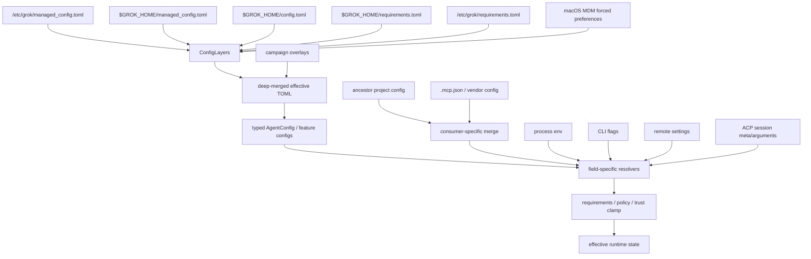
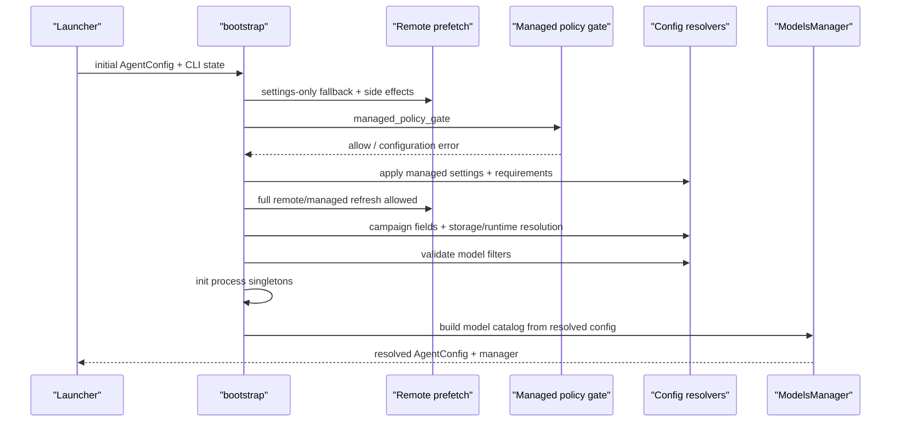

# 配置系统：从多层输入到运行时生效值

本文追踪 Grok Build 的配置链路：磁盘上的 TOML 怎样分层合并，项目目录、环境变量、CLI 参数、remote settings、campaign、managed policy 和 ACP session 参数怎样进入专用 resolver，最终值何时被固定、何时可热更新，以及发生冲突时应该去哪里确认来源。

前置阅读：[启动链路](01-startup.md)、[权限、目录信任与 Sandbox](05-permission-and-sandbox.md)和[ACP 与 MCP](09-acp-and-mcp.md)。下一篇 `11-persistence.md` 会专门讨论 session/history 的持久化；本文只讨论配置和配置写回。

## 先记住结论

Grok Build 的配置系统不能用一条万能公式概括。更准确的模型是四步：

1. **加载层（load）**：读取若干 TOML/JSON 文件，做版本 patch、环境变量插值和磁盘层合并。
2. **解析层（parse）**：把松散的 `toml::Value` 转成 typed `Config`、MCP config、plugin config 等不同结构。
3. **解析优先级层（resolve）**：每个功能使用自己的 resolver，把 CLI、env、local config、remote 和 default 按该功能的规则组合。
4. **强制层（enforce）**：requirements、MDM、managed settings、目录信任和 capability policy 可以覆盖或夹紧前面选出的值。

因此：

- 磁盘 TOML 有统一的基础合并顺序。
- CLI/env/remote 没有全局统一顺序，必须看字段 resolver。
- “更高优先级”不等于“更高权限”；安全策略可在最后否决本地 bypass。
- 项目 `.grok/config.toml` 并不会自动成为所有字段的全局覆盖层；MCP、plugin 等 cwd-sensitive consumer 明确选择是否读取它。
- 配置文件发生变化，也不表示整个运行时 Config 会原子替换；hot reload 只传播代码显式支持的子集。

先看总体结构：



## 一、配置不是一个对象，而是一组阶段性表示

阅读源码时会同时看到多个都叫 Config 的类型。它们处于不同阶段：

| 表示 | 典型类型 | 用途 |
| --- | --- | --- |
| 原始文件 | TOML/JSON bytes | 用户或管理员实际写入磁盘的内容 |
| 松散配置树 | `toml::Value` | 深合并、version override、检查某个 key 是否显式存在 |
| 磁盘层集合 | `xai_grok_config::ConfigLayers` | 保存各层来源与固定合并顺序 |
| Typed 总配置 | `agent::config::Config` | shell 启动和 Agent 构建使用的大型配置对象 |
| 子系统配置 | `MemoryConfig`、`McpServerConfig`、`PluginsConfig` 等 | 为一个功能保留显式性与结构 |
| Remote DTO | `xai_grok_config_types::RemoteSettings` | 后端下发的 optional feature/settings 集合 |
| Resolved 值 | `Resolved<T>` 或普通 runtime 字段 | 已选出值，并有时保留 `ConfigSource` |
| Enforced 值 | requirements/policy 应用后的字段 | 最终运行时不能被较低权限来源绕过的结果 |

很多优先级 bug 来自过早把 `Option<T>` 变成普通 `T`。例如 `false` 可能是：

- 用户明确写了 false。
- 当前层没写，serde default 恰好是 false。

remote default 只应在“本地未显式设置”时生效，所以 resolver 经常保留原始 TOML，检查 key 是否存在，而不能只看 typed struct 中的 false。

## 二、GROK_HOME 与主要磁盘文件

用户级配置通常位于 `$GROK_HOME`；默认可理解为用户目录下的 `.grok`，实际路径由 `xai-grok-config/src/paths.rs` 解析。

常见文件：

| 文件 | 主要用途 |
| --- | --- |
| `$GROK_HOME/config.toml` | 用户全局配置 |
| `$GROK_HOME/managed_config.toml` | 后端同步或组织提供的 managed defaults/config |
| `$GROK_HOME/requirements.toml` | 后端缓存的强制 requirements/pins |
| `/etc/grok/managed_config.toml` | 系统管理员提供的低层 managed config |
| `/etc/grok/requirements.toml` | root 管理的高权威 requirements |
| macOS forced preferences | MDM 下发的最高 requirements tier |
| `$GROK_HOME/auth.json` | 认证 store，不属于 TOML 合并树 |
| `$GROK_HOME/models_cache.json` | 模型目录缓存，不属于 TOML 合并树 |
| `<project>/.grok/config.toml` | cwd/repo 相关配置；由特定 consumer 读取 |
| `<project>/.mcp.json` | 项目 MCP server 配置 |

若无法安全解析 user home，loader 返回空 user layer，而不会退回读取 cwd 下的 `.grok/config.toml` 作为用户全局层。否则一个不可信项目目录可能被意外提升为用户级配置。

## 三、磁盘 TOML 的基础合并顺序

`xai-grok-config/src/lib.rs` 明确声明 lowest → highest：

1. `/etc/grok/managed_config.toml`
2. `$GROK_HOME/managed_config.toml`
3. `$GROK_HOME/config.toml`
4. `$GROK_HOME/requirements.toml`
5. `/etc/grok/requirements.toml`
6. macOS MDM forced requirements

`ConfigLayers::effective_config_base` 也按这个顺序调用 `deep_merge_toml`。

这里有一个反直觉点：名字包含 managed 的文件并不自动覆盖用户 config。`managed_config.toml` 在 user `config.toml` 下面，更像组织分发的配置/default layer；真正不能被用户绕过的字段放在 requirements 或 OS-protected policy 中，并在后续 enforcement 再次应用。

### Deep merge 的精确定义

`deep_merge_toml(base, overrides)` 的规则很小：

- 两边都是 table：逐 key 递归合并。
- 其他任意组合：高层值整体替换低层值。
- 低层不存在的 key：插入高层 clone。

例如：

```toml
# 低层
[features.telemetry]
enabled = false
sample_rate = 0.1

[server]
allowed = ["a", "b"]
```

```toml
# 高层
[features.telemetry]
enabled = true

[server]
allowed = ["c"]
```

结果为：

```toml
[features.telemetry]
enabled = true
sample_rate = 0.1

[server]
allowed = ["c"]
```

数组不会自动 concatenate；它被整体替换。需要 additive 行为的 hooks、plugins、campaigns 或 announcements 通常绕开普通 deep merge，用自己的 merge function。

## 四、每个磁盘层加载时还做什么

### 1. TOML 解析与安全错误

`loader.rs::read_toml_file` 对不存在的文件返回空 table；其他读取错误返回 error。TOML 语法错误只输出行列和 parser message，不包含原始 source line，因为配置行中可能含 token 或 secret。

这意味着日志中的错误信息故意不回显“出错的那一行”。调试时应打开对应文件按 line/column 查看，不要期待日志打印完整值。

### 2. 字符串环境变量插值

普通 `load_toml_file` 会递归展开所有 string value 中的：

```text
$VAR
${VAR}
```

它通过 `shellexpand` 读取进程环境。不存在的变量不会把加载变成硬错误。

要区分两种完全不同的 env 用法：

- **插值**：TOML 字符串里写 `${TOKEN}`，loader 替换字符串内容。
- **字段 override**：resolver 主动读取 `GROK_*`，整个字段采用 env 值。

插值不会让 env 自动拥有更高优先级；它只是当前 TOML 层字符串值的组成方式。

hooks 是例外之一：hook layer 以 unmerged、未插值形式读取，保留 `${VAR}` 给 hook runner 做一次展开，避免 double expansion，并保留 provenance。

### 3. `[[version_overrides]]`

每个 config layer 在彼此合并前，先根据当前 CLI semver 应用自己的 version patches：

```toml
[[version_overrides]]
minimum_version = "1.8.0"
maximum_version = "1.9.99"

[version_overrides.features]
some_feature = true
```

匹配规则：

- minimum/maximum 都是 inclusive。
- 缺少 minimum 相当于 0.0.0。
- 匹配 patch 按 minimum version 升序 deep merge。
- minimum 相同保持声明顺序，后声明的 leaf 胜出。
- `version_overrides` 最终总会从有效配置中移除。

patch 不能逃离所在层的权限。用户层的 version patch 先应用到用户层，之后 requirements 仍可覆盖它。

## 五、Campaign 是基础配置上的临时 patch

Campaign 不作为普通数组参与 deep merge。`ConfigLayers::load` 会从每层取走 campaign entries，单独按 campaign ID 和来源解析。

来源优先级是：

```text
requirements > remote > user > managed > system_managed
```

随后：

1. 应用 `GROK_CAMPAIGNS`/feature kill switch。
2. 按 ID 选择高优先级 entry。
3. 丢弃已 dismiss 或不满足条件的 campaign。
4. 把 active patches 应用到 base effective config。
5. **重新应用 requirements**。

最后一步是安全不变量：低信任 campaign patch 可以改普通配置，但不能覆盖管理员 requirements。

shell 的 `load_effective_config()` 会使用已经缓存的 remote campaigns 和 env override；`load_effective_config_disk_only()` 明确不使用 remote cache，供尚未获取 remote settings 的 one-shot CLI 使用。两个函数名字故意把差异写出来。

## 六、Project config 不是全局第七层

`xai-grok-workspace/src/project_config.rs::find_project_configs` 从 cwd 向 git root 查找：

```text
<repo-root>/.grok/config.toml
...
<cwd>/.grok/config.toml
```

返回顺序为 repo-root-first，因此越靠近 cwd 的文件优先级越高。没有 git repo 时只检查 `cwd/.grok/config.toml`。它还排除 `$GROK_HOME/config.toml`，防止 cwd 恰好是 home 时把同一文件重复当项目层。

但 `ConfigLayers` 本身不读取这些文件。每个需要 cwd scope 的 consumer 显式调用 `find_project_configs`：

- MCP server loader 将 global config 与 ancestor project MCP sections 合并。
- plugin loader扩展项目路径、enabled/disabled 集合。
- folder trust gate检查 repo config 是否存在，再决定是否允许执行项目配置。
- 某些 discovery subsystem 使用类似的 root → cwd 规则。

所以不要推断“项目 `.grok/config.toml` 里的任意 `[ui]` 或 `[telemetry]` 都覆盖用户全局设置”。必须搜索对应 consumer 是否读取 project configs。

### MCP 的项目合并是命名对象覆盖

MCP loader 会从 global 开始，再按 root → cwd 叠加 server map；较近项目中同名 server 替换较远定义。`.mcp.json`、`.claude.json`、Cursor/Claude compatibility sources 还受 compat config、enable/disable preference 和 folder trust 约束。

一个 server 的 project override 不一定按字段 deep merge；部分路径把同名 server config 视为完整定义替换。因此排查 timeout/transport 丢失时，要确认是 leaf merge 还是 whole server replacement。

## 七、Remote settings 不是远程 TOML 层

Remote settings 被解析为 `RemoteSettings` typed struct，保存在 `AgentConfig.remote_settings`。它不会整体 deep merge 到 `toml::Value` 中。

各功能按需读取 optional remote field：

- feature flag 作为本地未设置时的 default。
- 上传限制、storage mode、兼容开关等作为产品策略输入。
- campaigns 被放进独立 remote campaign cache。
- 部分 remote setting 会更新 process-global resolver cache。
- managed-config signature verification 等会触发进程级 side effect。

remote 值何时胜出完全取决于 resolver。常见设计是 local explicit value > remote default，但安全或服务能力相关字段可能采用其他组合。

启动时若 client 没有预先获取 remote settings，`agent/init.rs::ensure_remote_settings_side_effects` 会做 fallback prefetch。managed-policy gate 前只允许 settings-only prefetch，不能借网络刷新把被篡改的本地 policy 悄悄“治好”后绕过 gate；通过 gate 后才可做完整 managed sync。

## 八、CLI、环境变量和 remote 的优先级必须逐字段看

源码提供了 `BoolFlag`、`resolve_string_flag`、`resolve_enabled` 和大量专用函数，但没有强迫所有字段使用同一 builder。

下面是几个已由源码明确的例子。

### 字符串 flag 的常见模板

`resolve_string_flag`：

```text
CLI > env > config > remote feature flag > unset
```

空字符串通常被当作 unset。

### 辅助模型

`ModelOverrideConfig::resolve` 对 web-search/session-summary 等采用：

```text
CLI > env > config.toml > remote settings > compiled default
```

prompt suggestion 没有 CLI 项，使用 env > config > remote；env pin 还可绕过 model catalog guard，而普通 config/remote pin 必须存在于 catalog。

### Telemetry mode

`Config::resolve_telemetry_mode`：

```text
requirements pin > env > effective config > remote > disabled default
```

这里 requirements 甚至高于 env，因为它是 enforcement，不是普通 preference。

### Permission mode

launch 解析大致是：

```text
CLI --permission-mode / --yolo
  > effective TOML [ui] explicit keys
  > remote permission_mode
  > Ask
```

随后 `yolo_disabled_by_policy()` 可强制关闭 bypass。也就是说 CLI 能赢普通配置，但不能赢 admin pin。

### Memory/Subagents enabled

section-based resolver需要区分本地 section 是否存在：

```text
CLI tri-state > env > explicit local section > remote > compiled default
```

但 `--no-memory` 是 absolute disable，高于所有 enable 来源。Subagent max depth 又使用自己的 env/TOML/remote resolver。

### 为什么不能“猜优先级”

一个字段的合理策略取决于语义：

- Debug endpoint 可能允许 env escape hatch。
- 组织禁用 telemetry 不应被用户 env 打开。
- Remote experiment 只应填空，不应改掉用户明确选择。
- `--no-memory` 必须是本次进程的硬关闭。
- Session ACP meta 可能只覆盖当前 session，而不是全局默认。

遇到冲突时，应搜最终字段的 `resolve_*`，而不是只看 serde struct 声明。

## 九、Requirements、managed settings 与强制策略

### requirements tiers

`requirements_layers()` 按 apply order 返回：

1. 用户 home 中的 requirements cache。
2. `/etc/grok/requirements.toml`。
3. macOS MDM forced requirements。

system/MDM 在冲突时胜出。requirements 中的 feature、endpoint、model、sandbox、yolo、telemetry、memory、subagent 等受支持字段会在 typed `AgentConfig` 上再次应用，并记录 `EnforcedField { path, value, source }`。

这次 typed re-apply 很重要：即使某个普通 resolver读了 env/remote，requirements pin 仍可在最终 resolver中优先，或提前改写 runtime config。

### managed-settings.json

外部 `managed-settings.json` 由 workspace permission resolution 读取。目前 `apply_managed_settings_features` 会强制某些禁用项，例如 telemetry/feedback。它在 `apply_requirements()` 前执行，所以 requirements 仍是最后的管理员 override。

### fail-closed

requirements 可设置 `fail_closed = true`。startup validation 会在 version overrides 非法等策略损坏情况下拒绝启动，而不是静默跳过管理员约束。

`GROK_MANAGED_CONFIG_FAIL_CLOSED=1` 可以收紧为 fail-closed；设置为 0 不能关闭文件中已经要求的 fail-closed。这体现了安全 env 的单向性：本地环境可以更严格，不能解除 admin policy。

### Managed config 同步与身份绑定

`managed_config.rs` 负责：

- 以 deployment key 或 team identity 获取远程配置。
- 在锁内原子更新 managed artifacts 和 marker。
- 验证签名/claim 与 serving principal 绑定。
- team/deployment 切换时淘汰旧 tenant artifacts。
- 维护 stale/hard-stale、rollback floor 和 sync marker。
- session start 尝试有时间预算的修复。
- policy 缺失、被替换或无法验证且 fail-closed 已武装时拒绝 session。

因此 managed policy 不是“最后一次 HTTP 返回的 JSON 直接塞进 Config”。它有磁盘缓存、身份、签名、原子替换和离线启动规则。

## 十、从 effective TOML 到 AgentConfig

`agent::config::Config::new_from_toml_cfg` 的主要过程是：

1. 展开 `[auth]` 到 `[grok_com_config]` alias；显式后者 key 胜出。
2. 单独解析 model entries、auth providers 和 model providers。
3. 从 `Config::default()` 序列化出默认 TOML 基底。
4. 移除需要专用解析的 sections。
5. 将 raw config 合到 defaults。
6. 用 `serde_ignored` 反序列化 typed `Config` 并收集未知 key。
7. 单独解析 MCP、worktree、permission 和其他 out-of-band sections。
8. 应用 env overrides，并在后续 `resolve_runtime_fields` 中解析 remote/CLI/runtime fields。

### 错误策略并不完全一致

- 顶层 Config 结构无法反序列化：可能返回 config error。
- 未识别 user key：记录 warning，可由 `grok inspect` 展示。
- 单个 auth/model provider 格式错误：通常 warning 并跳过该 entry，避免一个 BYOK provider 破坏整个 CLI。
- MCP parser 会返回 problem list，非法 server 可被过滤。
- 某些 bool/string resolver 对非法值回到安全 default。

这种差异是刻意的：安全关键的含糊配置应 fail closed；可选 integration 的单项错误更适合局部失效。

## 十一、Bootstrap 何时把配置固定下来

`agent/init.rs::bootstrap` 的主顺序：



不同值在不同时间固定：

- process singleton：telemetry client、managed sync 等首个 bootstrap 后建立。
- Agent lifetime：models manager、global definition/config caches。
- session create：cwd、MCP list、agent definition、model、permission mode。
- turn start：某些 remote flags、context/reminder、tool snapshots可再次读取。

所以“修改 config.toml 后当前回答为什么没变化”要先问该字段属于哪种生命周期。

## 十二、ACP session 参数也是一层，但 scope 不同

ACP `initialize`、`session/new` 和 prompt `_meta` 可以提供：

- client capability 与 client type。
- cwd、MCP servers。
- session model、agent/profile hint。
- auto/yolo/session behavior flags。
- SDK in-process MCP registration。
- prompt-specific mode、schema、client identifier 等。

这些值通常只影响连接、session 或 turn，而不写回 `$GROK_HOME/config.toml`。它们与 CLI 类似，属于 runtime override，但最终仍受 requirements、capability intersection、trust 和 server policy。

例如 client 请求一个宽工具集不表示一定获准；workspace bind 和 agent definition 会做 intersection，sandbox/requirements 可进一步夹紧。

## 十三、MCP 配置的特殊链路

上一章已讲 MCP runtime；这里关注配置来源：

1. pager 创建/加载 session 前按 cwd 调 `load_mcp_servers`。
2. global effective TOML 提供基础 `[mcp_servers]`。
3. repo root → cwd 的 `.grok/config.toml` 叠加同名 server。
4. `.mcp.json`、Claude/Cursor config 按 compat 开关导入。
5. disabled server/tool preferences 过滤。
6. shell session setup 再合并 managed、plugin、client-supplied和 agent-definition sources。
7. folder trust 决定项目来源是否能实际启动。
8. 最终变成 `McpState.configs`，再初始化 client。

MCP config 还支持 `${VAR}`、setup preference、OAuth、per-server/per-tool timeout 和 transport conversion。缺少必要 transport 字段的 server 会成为 config problem，而不是生成一个半有效 ACP `McpServer`。

## 十四、配置写回怎样避免破坏文件

设置 UI 和 slash commands 会修改 `$GROK_HOME/config.toml`。`util/config/persist.rs` 使用 process-wide async `SAVE_LOCK` 串行化 read-modify-write，并通过临时文件 + rename 原子替换。

写回不能简单 serialize 整个 `AgentConfig`：

- typed struct 可能不知道未来版本或其他组件写的 key。
- 某些 sections 使用专用 parser。
- 未识别字段不应因改一个 theme 被删除。
- secret 与 OAuth block 需要特定保留规则。

因此 `update_config`/`merge_section` 路径只更新目标 section，并保留原 TOML 中不归当前 struct 所有的内容。MCP 写回还会选择 global 或最近定义该 server 的 project config，避免把项目配置错误搬到 user global。

原子 rename 保护单次写入不产生半文件；process lock 保护同进程并发写。跨进程同时编辑仍需依赖“重新读取后写”和 watcher/content dedup，不能假设内存 Config 永远最新。

## 十五、Hot reload 的真实边界

`ConfigFileWatcher` 使用 filesystem watcher + debounce，关注：

- `$GROK_HOME/auth.json`
- `$GROK_HOME/config.toml`
- `$GROK_HOME/models_cache.json`
- 已注册 cwd 的 `.grok/config.toml`
- `.mcp.json` / `.claude.json`

它对 cwd 只建立非递归 watch，避免遍历 `.git`、`node_modules`、`target` 等巨大目录。

`ConfigReloader` 批量排水 watcher events，重新读取文件并按内容 diff：

- auth key 变化 → `Auth` / `AuthCleared`。
- global MCP table 变化 → 广播 MCP reload。
- project MCP source 变化 → 只通知 cwd 匹配的 sessions。
- memory、skills、compat、models、部分 UI 字段 → 对应 typed `ConfigUpdate`。
- models cache → 交给 ModelsManager 做内容去重。

解析新 config 失败时保留 last-known-good，不把坏的半配置替换进运行时。

### 热更新不是完整重启

未列入 `ConfigUpdate` 的字段可能：

- 只在下一个 session 生效。
- 只在下次进程启动生效。
- 有自己的独立 watcher/cache。
- 根本不支持 hot reload。

修改后 UI 变了不代表 sandbox、endpoint 或所有现有 session 都重新配置。对安全或进程级字段，重启通常是最可靠的验证方式。

## 十六、如何确认一个值为什么生效

推荐使用从结果反向追来源的方法。

### 第一步：确认最终 consumer

先找真正使用值的代码，而不是只找字段声明：

```sh
rg "resolve_telemetry_mode|effective_yolo_for_launch|resolve_max_depth" \
  crates/codegen/xai-grok-shell/src
```

记录它读取了 CLI、env、raw TOML、remote、requirements 中的哪些输入。

### 第二步：确认磁盘层

```sh
grok inspect
grok inspect --json
```

`grok inspect` 位于 `xai-grok-shell/src/inspect`，用于展示 config layers、warnings、compat、MCP、skills、plugins、trust 等来源信息。JSON 形式更适合精确比较或留档。

同时手工检查：

```sh
rg "目标字段" ~/.grok/config.toml ~/.grok/managed_config.toml ~/.grok/requirements.toml
```

若机器有 system/MDM layer，也要纳入。不要把 secret-bearing 文件整体贴进日志或 issue。

### 第三步：区分插值与 override

如果 TOML 写了 `${VAR}`，确认变量影响的是字符串内容；若代码读取 `GROK_*`，确认它是 resolver override。还要检查空字符串是显式值还是 unset。

### 第四步：检查 project scope

从 session cwd 到 git root列出 `.grok/config.toml`、`.mcp.json`。确认 consumer 是否采用 root-first/nearest-wins，以及 folder trust 是否已允许项目配置。

### 第五步：检查 enforcement

若较高表面优先级仍不生效，查：

- requirements pin。
- MDM/system requirement。
- managed-settings disable。
- folder trust。
- sandbox/capability intersection。
- managed-policy gate 与 identity。

### 第六步：检查生命周期

确认值是 process、Agent、session 还是 turn scope；确认 watcher 是否支持它。必要时创建新 session 或重启进程，不要用旧 session 的状态判断新配置是否正确。

## 十七、常见误解

### 误解 1：所有字段都是 CLI > env > project > user > remote

不是。只有具体 resolver 能给出顺序；requirements 还可在最后强制覆盖。

### 误解 2：managed_config.toml 一定比 user config 权威

基础 disk merge 中 user config 覆盖 managed config。强制 policy 使用 requirements、MDM 或专用 managed-settings enforcement。

### 误解 3：项目 config 是全局 ConfigLayers 的最高层

不是。项目 config 由 MCP、plugins 等 cwd-aware consumer 显式读取，不能假设任意 section 都生效。

### 误解 4：TOML 中 `${VAR}` 等于环境变量覆盖字段

不是。`${VAR}` 是字符串插值；字段 override 必须由 resolver 主动读取对应 env var。

### 误解 5：数组会像 table 一样合并

普通 deep merge 中数组整体替换。additive 列表需要专用 merge。

### 误解 6：remote settings 到达后会重建全部 AgentConfig

不会。部分字段重解析、部分写 cache、部分只影响新 session，具体由 side-effect 和 resolver 路径决定。

### 误解 7：保存一个设置会重写成当前 typed Config 的完整快照

不应如此。写回路径尽量只 merge 目标 section并保留未知字段；否则不同版本和组件的配置会丢失。

### 误解 8：hot reload 成功表示所有现有 session 都已更新

不是。更新消息按子系统和 cwd 定向，很多 process/session 级字段需要新建 session 或重启。

## 十八、建议的源码精读顺序

1. `xai-grok-config/src/lib.rs`：先读文件顶部的 disk precedence。
2. `loader.rs::ConfigLayers`、`deep_merge_toml`：掌握基础合并。
3. `version_overrides.rs`：看 layer-local semver patch。
4. `validation.rs`：理解 requirements 和 fail-closed。
5. `xai-grok-shell/src/util/config/campaigns.rs`：看 remote-aware effective config。
6. `agent/config.rs::Config` 与 `new_from_toml_cfg`：看 typed parse。
7. `RuntimeResolutionContext` / `resolve_runtime_fields`：看 CLI/env/remote 汇合。
8. 选择 `resolve_telemetry_mode`、`ModelOverrideConfig::resolve`、permission resolver 做对比。
9. `agent/init.rs::bootstrap`：把 gate、remote、requirements 和 process init 串起来。
10. `xai-grok-workspace/src/project_config.rs`：看 repo config discovery。
11. `util/config/mcp.rs`：看 cwd-specific 合并特例。
12. `managed_config.rs`：最后读签名、身份、缓存和 fail-closed gate。
13. `config/watcher.rs` 与 `reloader.rs`：补齐 hot reload。
14. `util/config/persist.rs`：理解保留未知字段的写回。

## 十九、测试与验证

### 快速查符号

```sh
rg "struct ConfigLayers|effective_config_base|deep_merge_toml" \
  crates/codegen/xai-grok-config/src

rg "resolve_.*|RuntimeResolutionContext|apply_requirements" \
  crates/codegen/xai-grok-shell/src/agent/config.rs \
  crates/codegen/xai-grok-shell/src/config/mod.rs \
  crates/codegen/xai-grok-shell/src/util/config

rg "find_project_configs|ProjectMcpServersChanged|last-known-good" \
  crates/codegen/xai-grok-workspace/src \
  crates/codegen/xai-grok-shell/src/config
```

### 重点测试位置

- `xai-grok-config/src/loader.rs`：disk precedence、deep merge、secret-safe parse errors。
- `xai-grok-config/src/version_overrides.rs`：semver 边界和 patch 顺序。
- `xai-grok-config/src/validation.rs`：requirements/fail-closed。
- `xai-grok-shell/src/config/tests.rs`：typed config 与 requirements。
- `agent/config.rs` 内测试：feature-specific resolver precedence。
- `util/config/mcp.rs` 内测试：project/global MCP merge。
- `config/reloader.rs`、`watcher.rs` 内测试：hot reload、cwd routing 和 dedup。
- `util/config/persist.rs` 内测试：write/merge preservation。
- `inspect/mod.rs` 内测试：来源和 warning 展示。

### 小范围命令

```sh
cargo test -p xai-grok-config
cargo test -p xai-grok-shell config::tests
cargo test -p xai-grok-shell reloader
cargo test -p xai-grok-shell util::config::mcp
cargo check -p xai-grok-shell
```

测试过滤名可能随模块组织变化；先使用 `cargo test -p <crate> -- --list` 查询，再按 resolver 名过滤。

## 二十、阅读检查题

1. 为什么不能从 typed bool 的 false 判断用户是否明确写了 false？
2. 六个基础 disk layer 的顺序是什么？为什么 managed config 低于 user config 不构成 policy 漏洞？
3. deep merge 对 table 与 array 的行为有何不同？
4. version override 为什么必须先在各自 layer 内应用，再做跨 layer merge？
5. campaign patch 后为什么要重新应用 requirements？
6. `${VAR}` 插值与 `GROK_*` resolver override 有何区别？
7. 为什么项目 `.grok/config.toml` 不能被视为所有字段的最高层？
8. remote settings 为什么保留为 typed optional fields，而不是直接合进 TOML？
9. CLI `--yolo` 为什么仍可能被 policy 关闭？
10. `fail_closed` 环境变量为什么只能收紧、不能放松？
11. hot reload 为什么使用 last-known-good？
12. 如何判断一个配置修改需要当前 turn、新 session，还是进程重启？

## 本篇术语表

| 名词 | 白话解释 | 在本文中的具体含义 |
| --- | --- | --- |
| configuration / config | 控制程序行为的数据 | TOML、env、CLI、remote、policy 和 session override 的总称 |
| config layer | 一份可与其他配置叠加的来源 | user、managed、requirements、MDM 等 |
| precedence | 多个来源设置同一值时谁胜出 | 基础 TOML 固定；其他字段由专用 resolver 定义 |
| effective config | 合并和 patch 后供解析的配置树 | 通常是 `load_effective_config()` 返回的 `toml::Value` |
| raw config | 尚未转成最终 runtime 字段的配置 | 保留 key 是否显式存在等信息的 TOML tree |
| typed config | 已反序列化成 Rust struct 的配置 | `agent::config::Config` 及各子系统 config |
| explicitness | 一个值是否由某层明确设置 | `Some(false)` 与缺失后 default false 的差异 |
| resolver | 按规则从多个候选来源选最终值的函数 | `resolve_telemetry_mode`、`resolve_enabled` 等 |
| `Resolved<T>` | 值与来源组成的结果 | 可携带 `ConfigSource::Cli/Env/Config/Remote/...` |
| enforcement | 普通偏好解析后再施加的强制限制 | requirements、MDM、managed settings、trust/policy clamp |
| clamp / pin | 把字段限制或固定到策略值 | 即使 CLI/env 请求其他值也不能越过 |
| `$GROK_HOME` | Grok 用户数据目录 | 保存 config、auth、requirements、cache、sessions 等 |
| user config | 用户自行编辑的全局配置 | `$GROK_HOME/config.toml` |
| managed config | 组织/服务同步的配置层 | `managed_config.toml`，基础 merge 中仍低于 user config |
| requirements | 高权威强制配置 | user cache、system file 或 MDM 层，能 pin runtime 字段 |
| MDM | 操作系统的设备管理机制 | macOS forced preferences 提供的最高 requirements tier |
| managed settings | 外部兼容管理设置文件 | `managed-settings.json` 中可强制禁用部分功能 |
| system layer | 机器管理员控制的配置 | 通常来自 `/etc/grok` 或 MDM |
| project config | 随 cwd/repo 变化的项目配置 | ancestor `.grok/config.toml`，仅由明确 consumer 读取 |
| ancestor walk | 从 cwd 向 repo root 查目录 | 收集 root-first 的 project config/MCP 文件 |
| nearest wins | 离 cwd 最近的同名定义胜出 | project MCP server 等命名对象的常见覆盖规则 |
| deep merge | table 递归合并、其他值替换 | `deep_merge_toml` 的精确定义 |
| leaf | 配置树中不再继续递归的具体值 | bool、string、number、array 等 |
| array replacement | 高层数组整体取代低层数组 | 普通 deep merge 不 concatenate |
| additive merge | 不覆盖，而是把多来源条目都保留 | hooks/plugins 等使用的专用策略 |
| environment interpolation | 把字符串中的 `$VAR` 替换成环境值 | 发生在 TOML load 阶段 |
| environment override | resolver 直接读取 env 并覆盖整个字段 | 例如 `GROK_WEB_SEARCH_MODEL` |
| blank as unset | 空白字符串视为没有配置 | 很多 model/endpoint resolver 的规则 |
| `version_overrides` | 按 CLI semver 条件应用的 layer-local patch | 在各层跨层 merge 前执行 |
| semver | `major.minor.patch` 版本规则 | 判断 version patch 的 inclusive 范围 |
| patch | 只描述部分字段修改的配置片段 | version override 或 campaign overlay |
| campaign | 按条件临时修改配置的活动/实验条目 | 独立解析，应用后 requirements 会重新覆盖 |
| kill switch | 可快速完全关闭某机制的开关 | `GROK_CAMPAIGNS=0` 等 |
| remote settings | 后端返回的 typed optional settings | 由各 feature resolver 选择性使用，不整体合进 TOML |
| feature flag | 服务端或本地控制功能开关的值 | 常作为无本地显式值时的 default |
| side effect | 不只是返回值，还修改 cache/global state 的动作 | remote campaign cache、signature verification 配置等 |
| default | 所有显式来源缺失时的编译内置值 | resolver 优先级最低，除非安全设计另有规定 |
| capability intersection | 多个允许集合取交集 | session/tool/agent policy 只会保留共同允许能力 |
| fail closed | 配置或验证不确定时拒绝高风险行为 | requirements 损坏时可拒绝 startup/session |
| fail open | 配置错误时继续使用安全缺省或旧值 | 可选 integration、last-known-good 等场景 |
| serving identity | 当前 managed config 绑定的组织主体 | deployment fingerprint 或 team ID |
| signature | 验证远程 policy 未被篡改的数字签名 | managed cache 强制策略的可信依据之一 |
| rollback floor | 防止回退到更旧策略的时间/版本下界 | managed policy cache 的反回滚状态 |
| tenant | 一组组织/团队配置的所有者 | 切换 team 时旧 tenant artifacts 会被清理 |
| bootstrap | Agent 启动时完成配置与运行时初始化的阶段 | remote prefetch、policy gate、resolver、ModelsManager |
| process scope | 整个进程共享的生命周期 | telemetry client、managed sync 等 |
| Agent scope | 一个 Agent worker 的生命周期 | model catalog、global definitions 等 |
| session scope | 只对一个 ACP session 生效 | cwd、MCP、模型、permission、agent definition |
| turn scope | 只对一次 prompt/turn 生效 | prompt meta、schema、mode 等 |
| runtime override | 不一定写回文件的本次运行覆盖 | CLI、ACP meta、session argument 等 |
| hot reload | 进程不重启时读取配置变化 | watcher → reloader → typed ConfigUpdate |
| debounce | 合并短时间内多次文件事件 | 编辑器 write/rename 不会触发大量重复 reload |
| content dedup | 内容没变就跳过更新 | 防止 watcher self-write 和 mtime touch 造成重建 |
| last-known-good | 新配置坏了时继续使用最近有效状态 | ConfigReloader 的容错策略 |
| atomic write | 临时文件完成后 rename 替换 | 避免 crash 留下半个 config.toml |
| read-modify-write | 先读现有文件、只改目标、再保存 | 保留未知字段和其他 section |
| write lock | 同进程内串行化配置保存的 mutex | `SAVE_LOCK` 防两个设置更新互相覆盖 |
| provenance | 一个配置或 hook 来自哪里 | user/managed/requirements/file/plugin 等来源标签 |
| unrecognized key | typed Config 不认识的字段 | `serde_ignored` 收集并由 `grok inspect` 展示 warning |
| `grok inspect` | 配置来源和发现状态诊断命令 | 可输出 human 或 JSON report |

更多跨文章通用概念见 [全局术语表](../appendices/glossary.md)。
