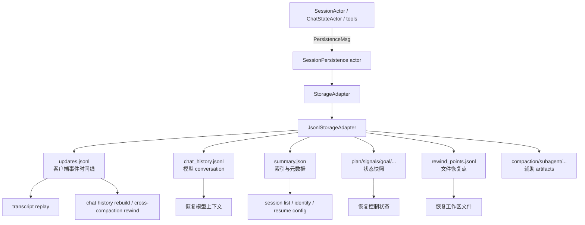
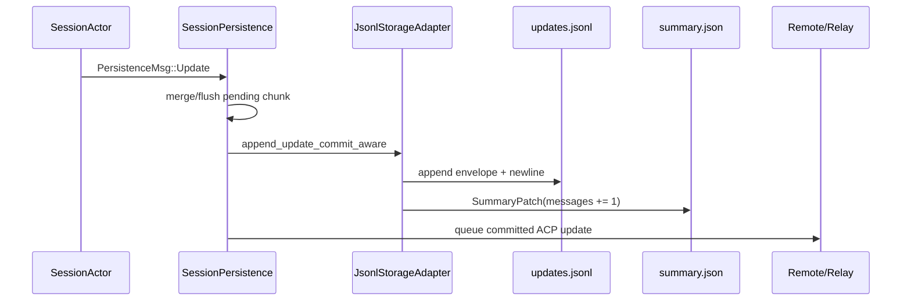
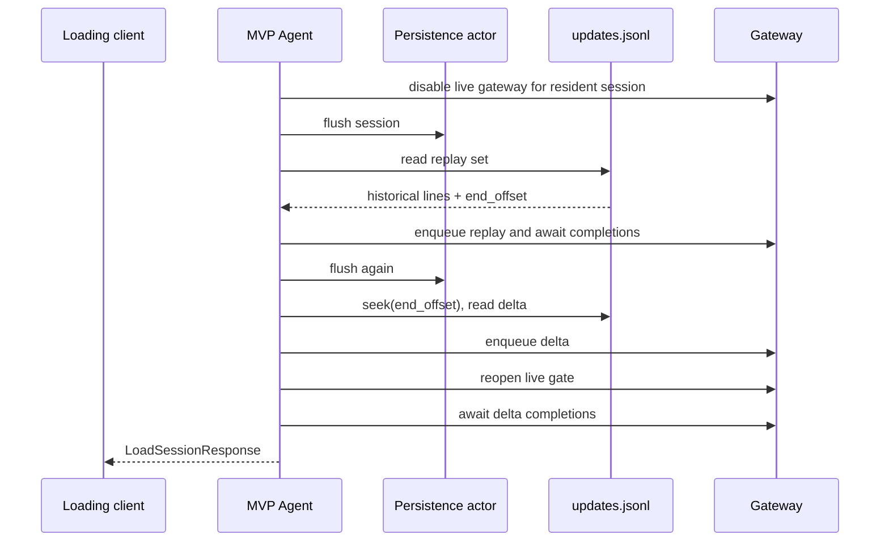

# 会话持久化：落盘、恢复、重放与故障边界

本文追踪 Grok Build 的会话数据从内存到磁盘、再从磁盘回到运行时的完整链路。重点不是罗列文件名，而是分清三类状态：供模型继续推理的 conversation、供客户端恢复界面的 update stream、供恢复控制状态的 snapshot。只有先分清它们，才能正确理解 resume、fork、rewind、compaction 和崩溃恢复。

前置阅读：[会话上下文、裁剪与压缩](06-session-context.md)、[TUI 事件循环](08-tui-event-loop.md)、[ACP 与 MCP](09-acp-and-mcp.md)和[配置系统](10-configuration.md)。

## 先记住结论

1. 一次 session 不是一个文件，而是一个目录中的多份日志、快照和辅助 artifact。
2. `updates.jsonl` 保存 ACP/xAI session update 时间线，主要用于客户端 transcript replay，也是重建 `chat_history.jsonl` 的依据。
3. `chat_history.jsonl` 保存 `ConversationItem`，是恢复模型上下文时直接加载的会话状态；它会因 compaction 和 rewind 被整体替换。
4. `summary.json` 是列表和恢复入口所依赖的索引记录。只有目录没有 `summary.json`，不算可 resume 的完整 session。
5. 大部分写操作不由业务代码直接执行，而是发送 `PersistenceMsg` 给单独的 persistence actor 串行处理。
6. 普通 JSONL append 会 `write_all + flush`，但不保证数据已经进入稳定介质；少数必须确认提交的边界使用 durable append 和 acknowledgement。
7. JSONL append 不是 crash-atomic。代码通过 torn-tail 隔离和容错读取，把一次中断的损失限制为一个坏 record。
8. 小型覆盖式状态通常用临时文件 + rename；`summary.json` 还使用跨 actor/process 的 sidecar lock 和字段级 patch，避免并发写丢字段。
9. resume 同时恢复两种东西：内部模型状态从 `chat_history.jsonl` 加载，客户端显示从 `updates.jsonl` replay。二者不能互相替代。
10. rewind 不会删除 `updates.jsonl` 的旧分支，而是追加 `RewindMarker`；之后的读取者用 marker 计算仍然存活的时间线。

总体链路如下：



## 一、Session 的磁盘身份

### 1. `Info` 是最小身份

持久化层使用 `session::info::Info` 表示 session 身份，核心只有：

- `id`：ACP `SessionId`。
- `cwd`：该 session 所属的工作目录。

标准本地目录由 `xai-grok-shared/src/session/mod.rs::session_dir` 和 `xai-grok-config/src/paths.rs` 共同决定：

```text
$GROK_HOME/
└── sessions/
    └── <encoded-cwd>/
        └── <session-id>/
```

所以 session ID 不是完整磁盘地址；同一个 ID 是否“已经存在”，还要结合 cwd 判断。`session_exists_for_cwd` 正是为 `--resume` 做这个精确检查。

### 2. cwd 如何编码

`encode_cwd_dirname` 有两条路径：

- URL 编码后不超过 255 bytes：直接使用 URL-encoded cwd，兼顾可读性和旧格式兼容。
- 太长：使用 `<leaf-slug>-<blake3-prefix>`，并在 cwd 分组目录中写 `.cwd`，供反向解码。

这避免一个绝对路径超过常见文件系统的单个目录名限制。`decode_cwd_from_dirname` 先尝试 URL decode，再回退读取 `.cwd`。

### 3. 子代理的例外

`JsonlStorageAdapter` 有两种目录模式：

- `FromRoot`：按 `$GROK_HOME/sessions/<cwd>/<id>` 计算。
- `Explicit`：直接使用调用方给出的 session directory。

`new_with_explicit_dir` 用后一种模式把 child session 放在父 session 的 `subagents/<subagent-id>/` 下，并跳过 cloud writeback、relay sync 和普通 gateway 生命周期通知。不要假设每个可见的 `JsonlStorageAdapter` 都按标准根目录寻址。

### 4. `summary.json` 是完整性的门槛

`is_persisted_session_dir` 以 `summary.json` 是否为普通文件判断目录能否 resume。原因是某些流程可能提前建立 `images/` 等 stub；仅凭目录存在会让不完整目录错误劫持 `--resume`。

## 二、Session 目录里分别保存什么

典型目录不是严格固定 schema；功能开启后会逐步增加文件。核心结构可理解为：

```text
<session-dir>/
├── summary.json
├── summary.json.lock
├── updates.jsonl
├── updates.jsonl.lock
├── chat_history.jsonl
├── chat_history.jsonl.lock
├── plan.json
├── plan_mode.json
├── signals.json
├── announcement_state.json
├── rewind_points.jsonl
├── feedback.jsonl
├── btw_history.jsonl
├── goal/
│   └── state.json
├── workflows/
│   └── <run-id>/state.json
├── prompts/
│   └── prompt_<index>.txt
├── compaction_checkpoints/
├── compaction_requests/
├── recap_requests/
├── compaction/
└── subagents/
```

重要文件的角色：

| 文件 | 数据形态 | 主要消费者 | 写入模式 |
| --- | --- | --- | --- |
| `summary.json` | 单个 `Summary` | session list、resume、fork、remote metadata | lock 下字段 patch，临时文件 rename |
| `updates.jsonl` | `SessionUpdateEnvelope` 序列 | TUI/ACP replay、搜索、跨 compaction rewind | append；必要时 durable append |
| `chat_history.jsonl` | `ConversationItem` 序列 | ChatState/model context 恢复 | append；compaction/rewind 时原子全量替换 |
| `rewind_points.jsonl` | `RewindPoint` 序列 | 工作区文件回退 | append；截断/合并时原子全量替换 |
| `plan.json` | `TodoState` snapshot | TODO 恢复 | 覆盖写 |
| `plan_mode.json` | plan-mode lifecycle snapshot | mode 恢复 | 原子覆盖 |
| `signals.json` | `SessionSignals` snapshot | turn/tool/compaction 计数恢复 | 原子覆盖 |
| `announcement_state.json` | 去重状态 | MCP/skill announcement 恢复 | 原子覆盖 |
| `goal/state.json` | goal orchestration snapshot | goal mode 恢复 | 原子覆盖或幂等删除 |
| `feedback.jsonl` | feedback events | 本地反馈记录 | append |
| `btw_history.jsonl` | `/btw` 问答 | side-question 历史 | append |
| compaction artifacts | request/checkpoint/segment | rewind、诊断、离线 prompt 分析 | 独立 artifact 文件 |

### 不要把所有 JSON 文件都叫 snapshot

本文使用三个更精确的词：

- **append log**：新 record 追加到末尾，例如 `updates.jsonl`。
- **materialized state/cache**：从历史演算出的当前状态，例如 `chat_history.jsonl`。
- **snapshot**：某个时刻完整覆盖的小型状态，例如 `signals.json`。

`summary.json` 既是 snapshot，也是 session index；`chat_history.jsonl` 虽然是 JSONL 格式，但语义上不是不可变 event log，因为 compaction 会整体替换它。

## 三、`updates.jsonl` 与 `chat_history.jsonl` 的根本区别

这是本篇最重要的区分。

### `updates.jsonl`：发生过什么

`SessionUpdate` 联合两条协议轨道：

- `SessionUpdate::Acp`：标准 `session/update`。
- `SessionUpdate::Xai`：扩展 `_x.ai/session/update`。

磁盘上再包一层 `SessionUpdateEnvelope`：

```json
{
  "timestamp": 1770000000,
  "method": "session/update",
  "params": { "sessionId": "...", "update": { "...": "..." } }
}
```

`timestamp` 是写入时 Unix seconds，主要用于调试；`method` 决定按 ACP 还是 xAI extension 解析；`params` 是原始 notification。

这条日志包含用户/助手 chunk、工具注册和状态、扩展事件、compaction checkpoint、rewind marker 等。客户端恢复历史界面时，重放的正是这条时间线。

### `chat_history.jsonl`：模型下一轮要看到什么

这里每行是一个 `ConversationItem`，例如 System、User、Assistant、ToolResult、Reasoning。resume 时 `load_session_without_updates` 会直接加载它并交给新建的 session actor。

它是“当前有效 conversation”的物化结果：

- 普通 turn 追加消息。
- compaction 用摘要化后的 conversation 替换整个文件。
- rewind 用截断或重建后的 conversation 替换整个文件。

因此，模型不会因为 `updates.jsonl` 仍保存早期全文，就自动再次获得那些早期内容；模型实际拿到什么，要看当前 `chat_history.jsonl`。

### 两者为什么都要保存

只保存 conversation 会失去 UI 需要的细节，例如工具调用的中间状态、扩展通知和历史时间线。只保存 update stream，则每次恢复模型上下文都要执行完整 reducer，还要处理版本兼容、compaction 和 rewind 分支，成本更高。

当前设计是：

- `updates.jsonl` 提供更完整、append-oriented 的历史事实。
- `chat_history.jsonl` 提供快速可用的当前模型状态。
- 当新格式 session 的 chat history 为空时，`chat_rebuild::rebuild_chat_history` 可以从 updates 重新生成它。

这是一种 event log + materialized view 的组合，但不能把它等同于严格 event sourcing：并非所有 session 状态都能只靠 updates 无损重建，部分控制状态和 compaction checkpoint 仍在独立文件中。

## 四、为什么需要 Persistence Actor

### 1. 业务代码发送意图，不直接操作文件

`PersistenceHandle` 包含一个 Tokio unbounded channel sender。运行时把持久化意图包装成 `PersistenceMsg`：

- `Update`、`Chat`
- `ReplaceChatHistory`
- `CurrentModel`
- `PlanState`、`PlanModeState`
- `RewindPoint`、`TruncateRewindPoints`
- `Signals`、`AnnouncementState`、`GoalModeState`
- `CompactionCheckpoint`、`CompactionRequest`
- `GeneratedTitle`
- `Flush`、`FlushAndAck`、`CopyFile`

`SessionPersistence::run` 单循环接收这些消息，再调用 `StorageAdapter`。这提供了一个 session actor 内的写入顺序，并让流式生成、模型循环和工具执行不必同步等待普通文件 I/O。

### 2. 它会合并连续文本 chunk

模型流式回答可能产生大量很小的 `AgentMessageChunk` 或 `AgentThoughtChunk`。Persistence actor 保留一个 `pending_notification`：

- 同类型、无额外 meta、内容都是可合并 text 时，拼接文本。
- 遇到不同事件时，先落盘前一个 pending，再暂存新的。
- 空文本且无 meta 的 chunk 直接跳过。

这减少 `updates.jsonl` 的 record 数和写放大。因此“notification 已经发给 UI”不表示它已经以同样粒度写入磁盘；磁盘可能保存合并后的 chunk。

### 3. channel 顺序不等于全系统只有一个 writer

单个 persistence actor 内消息有序，但 reconnect 等情况下可能出现不止一个 actor/adapter 触碰同一 session。`summary.json` 甚至明确按多 actor、多 process 竞争设计。

因此并发正确性不能只依赖 actor：

- JSONL append 使用 sidecar file lock 包住 tail healing 和 append。
- summary 更新使用 `summary.json.lock` 包住完整 read-modify-write。
- summary mutation 使用字段级 `SummaryPatch`，而不是写回调用方持有的旧 `Summary`。

### 4. actor 退出时会 drain

当所有 strong sender 被释放，receiver 结束循环。`run` 最后调用 `flush_pending`，尝试把合并缓冲中的最后一个 update 写入磁盘并 flush remote/relay queue。

这是正常关闭语义，不是进程强杀保证。若进程在执行 drop/drain 前被终止，内存中的 pending chunk 仍可能丢失。

## 五、新建 Session 的写入链路

`persistence::new` 的核心步骤：

1. 用 `JsonlStorageAdapter::with_root(grok_home())` 建立 storage。
2. `init_session` 创建目录和 `summary.json`，或读取已经存在的 summary。
3. 记录 sandbox profile，并在需要时更新 model。
4. 创建 `PersistenceHandle`、receiver 和弱 sender。
5. 根据 `StorageMode` 初始化 remote writeback。
6. spawn `SessionPersistence::run`。

`Summary::new` 会捕获一组恢复和列表所需元数据：

- 创建/更新时间、消息计数。
- current model、agent name、reasoning effort。
- parent/fork/session kind。
- cwd、git root/remotes/HEAD。
- sandbox profile。
- telemetry turn counter、request ID、collection ID。
- generated/manual title。

设计上，`summary.json` 是轻量索引，所以列 session 不需要读取完整日志。

## 六、一次 update 如何落盘

普通 ACP update 的路径：



这里有两个不同的 commit 点：

1. update record 已追加到 `updates.jsonl`。
2. summary 的 `num_messages` 和 activity timestamp 已更新。

因此 `AppendUpdateError` 区分：

- `NotCommitted`：update record 没有成功提交，可安全重试。
- `Committed`：record 已经落入日志，但后续 summary bookkeeping 失败；盲目重试会产生重复事件。

Persistence actor 在 `Committed` 情况下仍把 ACP update 排入 remote/relay sync，因为事件事实已经存在；同时向日志报告 bookkeeping 错误。

## 七、Buffered、Flush 与 Durable 不是一回事

### 1. 普通 append

`AppendDurability::Buffered` 执行：

1. 打开/创建文件。
2. `write_all` 一整行。
3. `flush` Rust writer。
4. 关闭 file handle。

`flush` 主要把用户态 buffer 交给操作系统，不等于硬件已稳定保存。系统断电或内核崩溃仍可能丢失最近数据。

### 2. Durable append

`AppendUpdateDurablyAndAck` 先 drain 更早的 pending update，再调用 durable append：

- 文件 `sync_all`。
- macOS 额外请求 `F_FULLFSYNC`。
- Unix 上同步 parent directory，保证新文件目录项也跨 crash 稳定。
- oneshot 返回明确的 commit-aware 结果。

`PersistenceHandle::append_update_durably` 还区分第三种错误：`AcknowledgementLost`。此时 actor 可能已经提交，只是调用方没收到 ack，提交状态未知，不能简单当作未写重试。

### 3. 三种 flush 消息

| 消息/路径 | 保证 |
| --- | --- |
| `Flush` | drain pending merged update，并 flush remote/relay queue；fire-and-forget |
| `FlushAndAck` | 上述工作完成后通过 oneshot 通知调用方；不是所有本地文件的 `fsync` barrier |
| `CopyFile` | 先 `flush_and_sync`，对一组核心 session 文件调用 `sync_all`，再把目录复制进内存 |

所以代码里出现“flush completed”时，要继续问：是 actor merge buffer 已清空、OS buffer 已 flush，还是稳定介质 barrier 已完成？三个含义不同。

## 八、JSONL 如何面对半行损坏

append 无法像 rename 那样原子替换。进程可能在一条 JSON 写到一半时退出，留下没有换行符的 torn tail。

### 写入侧隔离损坏

下一次 append 前，`append_jsonl_line_sync_with` 在 file lock 内检查最后一个 byte：

- 末尾是 `\n`：正常追加。
- 末尾不是 `\n`：先在新 record 前插入一个换行。

它不会猜测或修补残缺 JSON，而是把残缺内容封成单独的坏行。这样新 record 不会与旧半行粘成一个更大的坏 record。

### 读取侧跳过坏行

`read_updates_jsonl` 和 `read_chat_history_sync` 按原始 `\n` bytes 切分并逐行解析：

- 成功的行正常加载。
- 解析失败的行记录 warning 后跳过。
- 一行在 UTF-8 code point 中间断裂，也只污染该行。

这是一种 bounded corruption：尽量把 crash 损失限制为一个 record，而不是让整个 session 无法 resume。

并不是所有 JSONL reader 都同样宽容。阅读新 consumer 时，应确认它使用容错 reader、`UpdatesIterator`，还是严格的通用 `read_jsonl`。

## 九、覆盖式文件如何避免 torn write

### 1. 通用 atomic replace

`write_bytes_atomic` / `write_bytes_atomic_async`：

1. 在目标旁创建带 UUID 的唯一临时文件。
2. 完整写入临时文件。
3. rename 覆盖目标。
4. 失败时 best-effort 删除临时文件。

读取者看到旧版本或新版本，而不是被 truncate 后只写了一半的目标文件。

### 2. 并非每个覆盖写都使用同一 helper

当前代码中 `plan_mode.json`、signals、announcement、goal state、rewind 全量替换等使用 atomic helper；`plan.json` 的 TODO snapshot 是直接 `tokio::fs::write`。因此不能笼统声称“所有 session snapshot 都 crash-atomic”。

这是阅读持久化代码时应保持的证据标准：分别核对每个 `StorageAdapter` method 的实现，不从文件扩展名推断 durability。

### 3. atomic replace 也不自动等于 durable replace

普通 atomic helper 关注避免 torn target，但没有统一对 temp file 和 parent directory 执行完整 durable barrier。它解决“读取半个 JSON”的主要问题，不承诺突然断电后的最高等级持久性。

## 十、`summary.json` 的并发安全

`summary.json` 会被 append bookkeeping、标题生成、手动 rename、model switch、git HEAD 和 telemetry counter 等多个路径修改。朴素流程会出错：

```text
writer A 读旧 summary
writer B 读旧 summary
writer A 更新 num_messages 并写回
writer B 更新 model 并写回旧 num_messages
```

最终 A 的更新被 B 无意覆盖。

### `SummaryPatch` 表达意图

调用方不提交完整旧 snapshot，而是提交：

- counter `Increment` 或 `Set`
- model patch
- git HEAD patch
- title patch
- trace-turn patch
- activity flag

`apply_patch_locked` 获取 `summary.json.lock` 的 exclusive lock，在锁内重新读最新 summary、应用 patch，再 atomic rename 写回。

### 字段有各自的 merge 规则

- `num_messages`：在锁内对最新值 increment。
- `last_active_at`：单调不后退。
- `next_trace_turn`：单调不降低，并让 request ID 与胜出的 turn 配对。
- `chat_format_version`：只升不降。
- manual title：无条件设置，并标记 `title_is_manual`。
- generated title：仅在仍无标题时采用，因此与 `/rename` 竞争时手工标题获胜。
- 普通 metadata：只覆盖 patch 指定的字段。

这体现了一个常用模式：**锁解决操作串行化，字段级 patch 解决写入意图正确性**。只有锁、但仍把陈旧完整对象写回，也容易制造不必要的覆盖。

## 十一、Resume 分为“加载状态”和“重放界面”

### 1. 先解析本地身份

恢复时会区分：

1. 当前 cwd 下恰好存在该 session。
2. 当前 cwd 下存在从 remote session 恢复出的 child。
3. 同 repo 的其他 cwd/worktree 中存在该 session。
4. 任意 cwd 扫描找到该 session。
5. 本地未命中，需要从 backend pull。

`resolve_local_session`、`resolve_local_session_for_repo`、`resolve_local_session_any_cwd` 服务不同场景。不要随意用“扫描所有 cwd”的 helper 替代精确 cwd 检查，否则可能恢复错误 workspace 的同 ID session。

### 2. `load_light` 避免一次性加载大文件

正常 MVP Agent resume 使用 `persistence::load_light`：

- 立即读取 `summary.json`、`chat_history.jsonl` 和若干小 snapshot。
- 不把所有 updates 反序列化进 `Vec<SessionUpdate>`。
- 不读取可能包含大量文件内容的 rewind points。
- 返回 `updates_file_path` 和 `rewind_points_file_path`，供后续 replay 或真正 rewind 时使用。

这降低大 session 恢复时的峰值内存。`load` 仍提供 eager 版本给需要完整 `PersistedInfo` 的路径。

### 3. 模型状态从 chat history 恢复

`chat_history` 被传给 `spawn_and_register_session`，建立新的 ChatState/SessionActor。旧版本消息还会在 load-time 做兼容升级，例如把 legacy assistant reasoning 转成新的 sibling `Reasoning`/`BackendToolCall` 形态；磁盘原文件不因此改写。

### 4. 客户端 transcript 从 updates 重放

`replay_session_updates` 读取 `updates.jsonl`，执行 timeline filter，然后逐条转发给 gateway：

- ACP update 恢复成 typed `SessionNotification`。
- xAI update 走 extension notification。
- 历史事件通常添加 `_meta.isReplay: true`。
- ToolCall 与多个 ToolCallUpdate 会在 replay 时折叠成一个完成态 ToolCall，减少 TUI 重建成本。
- cursor reconnect 可以跳过客户端已看过的事件；找不到 cursor 则退回完整 replay。

因此 replay 是语义恢复，不保证逐 byte、逐 chunk 原样发送历史事件。

## 十二、Replay 期间的新事件如何不丢不乱

恢复一个已经 resident 的 session 时，旧 actor 可能仍在产生更新。直接“读文件然后 replay”存在竞态：读取结束后到恢复完成前追加的事件可能漏掉，或与 live output 交错。

当前流程建立 replay gate：



关键点是第一次读取会记录 byte `end_offset`。第二次从这个 offset 读取 delta，补上 replay 窗口内刚刚持久化的 update。gateway completion 让加载响应不会越过应该先到达客户端的 replay notification。

这是一种 snapshot + delta catch-up 模式。它解决的是加载期间事件排序，不把文件读取本身变成事务。

## 十三、Chat History 的重建与兼容

对于当前 `CHAT_FORMAT_VERSION == 1` 的 session，如果 `chat_history.jsonl` 不存在或为空，`ensure_chat_history` 会调用 `chat_rebuild::rebuild_chat_history`：

1. streaming 读取 `updates.jsonl`。
2. `ChatReducer` 聚合 user chunks、agent chunks 和 tool calls/results。
3. 遇到 `CompactionCheckpoint` 时清空已写 materialized history，从 checkpoint 后的逻辑状态继续。
4. 写到临时文件。
5. flush 后 rename 覆盖 `chat_history.jsonl`。

坏 update line 会跳过，失败 rebuild 不会先 truncate 现有 chat history。

这条能力很有价值，但不是“任何情况下从 updates 完美恢复一切”：reducer 明确忽略部分 display-only 或非 conversation update，跨 compaction 的安全 rewind 还依赖 checkpoint artifact。

## 十四、Compaction 如何改变持久化状态

Compaction 同时操作三个层次：

1. 内存中的 active conversation 被摘要化 history 替换。
2. `PersistenceMsg::ReplaceChatHistory` 原子重写 `chat_history.jsonl`。
3. checkpoint metadata 进入 `updates.jsonl`，详细 checkpoint 写入 `compaction_checkpoints/<id>.json`。

可选的 request/response artifact 和 segment archive 还用于离线分析、recap、跨 compaction rewind。

`updates.jsonl` 不因 compaction 被整体截短，所以仍保留历史时间线；`chat_history.jsonl` 则只保留模型当前有效上下文。参见[会话上下文、裁剪与压缩](06-session-context.md)。

## 十五、Rewind 为什么追加 Marker 而不是删日志

### 1. 两类状态分别处理

Rewind 可以影响：

- conversation：截断模型上下文。
- workspace files：依据 `RewindPoint` 恢复或删除文件。

完成 conversation rewind 后，代码：

1. 替换 ChatState conversation。
2. 通过 chat state persistence 对齐 `chat_history.jsonl`。
3. 向 `updates.jsonl` 追加 xAI `RewindMarker { target_prompt_index, created_at }`。

日志保持 append-only。未来 replay 遇到 marker 时，丢弃 target 之后旧分支积累的状态，再接受 marker 后新写入的分支。

### 2. 跨 compaction rewind

如果目标 prompt 位于 compaction 边界之前，当前 chat history 已没有原始消息。`helpers/replay.rs::replay_to_prompt` 会：

- streaming 扫描 updates。
- 解释所有 RewindMarker。
- 根据目标在 checkpoint 前还是后，选择原始 update 或 compacted checkpoint。
- 恢复原始 `User(user_info)` 等不能随意用当前值代替的前置信息。
- 缺少、损坏或版本过新的必要 checkpoint 时拒绝 rewind，不冒险用错误 conversation 继续。

这是 fail-closed：错误恢复可能让模型看到错误历史或持续超出 context window，因此不能简单退回“随便截断当前 conversation”。

### 3. Rewind points 也要修正

- 同时恢复 files：删除 target 及之后的 file snapshots，磁盘全量重写 `rewind_points.jsonl`。
- 只 rewind conversation：文件没有回退，所以把被丢弃 turns 的文件影响合并进之前的 rewind point，保证以后仍可正确恢复文件。

磁盘被视为 authoritative set，合并不是基于可能只加载了一部分的内存 tracker。

## 十六、Fork 是复制后改写身份

`fork_session` 为 child 生成 UUIDv7 或接受调用方提供的新 ID，然后 `copy_session_data_sync`：

- 复制/裁剪 chat history 和 update stream。
- 把 update 内 session ID 改成 child ID。
- 在 child summary 记录 `parent_session_id` 和 `forked_at`。
- 可覆盖 model、session kind 和 source workspace。
- 若指定 target prompt，复制到相应历史边界。
- 复制仍被保留的 compaction checkpoint 和可选 segment archive。

本地复制成功就是 fork 的关键成功条件。backend registration 在后台执行，失败只 warning；local fork 仍可使用。这体现了 local-first、remote eventual 的故障边界。

## 十七、本地、Writeback 与 Relay 是三件事

Persistence actor 可以在本地 append 后把 ACP notification 同时排入：

- `RemoteSync`：持久化到 backend 的 writeback 通道。
- `RelaySync`：实时 session sharing 的 WebSocket relay。

本地磁盘仍是普通 session 操作的即时基础。remote sync 不是把每次本地写变成分布式事务。

若 session 在 remote settings 尚未返回时以 Local 创建，之后可收到 `UpgradeToWriteback`：

- 先 flush pending。
- 读取本地 session。
- fresh session 可以 backfill 之前的本地 history。
- resumed session 只从升级之后 forward，不重发旧历史，避免重复同步。

ZDR 或无可用 remote sync 时保持 local-only。

## 十八、Session Relocation 为什么需要 Journal

工作目录切换会改变 session 的磁盘父目录。跨目录移动若只做一次 rename/copy，很难处理中途 crash、目标碰撞和“到底哪边权威”。

`session/storage/relocation` 使用 durable journal 和 phase machine：

```text
Prepared
  → Staged
  → TargetPublished
  → Ready
  → Committed

失败路径可进入 RolledBack
```

源码明确规定 authority boundary：

- 到 `TargetPublished` 为止，source 仍权威。
- 从 `Ready` 开始，target 权威。

流程使用 per-session lease、no-replace publication、目录 sync、journal atomic durable write，并在 session list/cleanup 前运行 recovery。`RelocationView` 让扫描逻辑在事务未清理完时仍按 journal 选择权威目录。

这和普通单文件 atomic rename 是不同等级的问题：relocation 是多文件、跨 namespace 的可恢复事务。

## 十九、故障发生后能恢复到什么程度

| 故障 | 预期行为 | 可能损失 |
| --- | --- | --- |
| 普通进程正常退出 | channel close 后 drain pending | 一般无 pending merge 丢失 |
| 进程被强杀 | 下次 append 隔离 torn tail；reader 跳过坏行 | 最后一条 partial record 或仍在内存的 chunk |
| summary 覆盖写中断 | temp + rename 避免半个 summary | 可能保留旧版本而非新版本 |
| 两个 actor 同改 summary | sidecar lock + fresh read + patch | 设计目标是不丢独立字段更新 |
| chat history 丢失/为空 | 可尝试从 updates rebuild | reducer 不表达的状态需其他文件 |
| checkpoint 缺失而跨 compaction rewind | 明确拒绝 rewind | 功能不可用，但不构造错误 history |
| 本地 session 缺失 | 可选 backend pull 后再 load | backend 不可用时 resume 失败 |
| remote writeback 失败 | local session 通常继续工作 | 云端副本延迟或缺失 |
| relocation 中途 crash | journal recovery commit 或 rollback | recovery 失败时停止扫描/cleanup，避免误删 |
| 磁盘已满 | I/O error 映射为 `FS_DISK_QUOTA_EXCEEDED` | 当前或最近持久化操作失败 |

注意很多普通 `PersistenceMsg` handler 是 best-effort：失败记录 warning 后 actor 继续处理后续消息。只有带 ack 的少数协议边界会把明确结果返回调用方。调用者若要求“动作完成前必须保证写入”，必须选对 acknowledged/durable API。

## 二十、清理与删除不是恢复

### TTL cleanup

`cleanup_stale_sessions` 每进程最多运行一次，默认 TTL 为 30 天，并跳过当前 session directory。它先恢复未完成 relocation，再按 mtime 清理旧文件和空目录。

TTL 解决磁盘生命周期，不是 logical session compaction。不要把“旧文件被清理”与 context compression 混为一谈。

### 显式删除

`delete_session_history` 是幂等删除。需要删 remote 时顺序是：

1. 先删除 remote；404 视为已经不存在。
2. remote 真正失败则保留 local，方便重试。
3. remote 成功后删除本地目录。
4. 通知 search index 驱逐条目。

这种顺序避免 local 先消失、remote 仍存在，下一次列表刷新又把 session“复活”。

## 二十一、常见误解

### “`updates.jsonl` 是模型的上下文文件”

不准确。它主要是 update/event 时间线；模型 resume 直接加载的是 `chat_history.jsonl`。

### “`chat_history.jsonl` 是完整不可变历史”

不是。它会在 compaction、rewind 时被整体替换，是当前 conversation 的 materialized state。

### “用了 JSONL，每次 append 就一定不会损坏”

JSONL 只让 record 有自然边界。append 中途仍会留下半行；代码靠 newline 隔离与逐行跳过控制损坏范围。

### “调用 `flush` 就等于 fsync”

不等于。普通 writer flush、actor flush、remote queue flush、file sync 和 directory sync 是不同 barrier。

### “有 persistence actor 就不需要文件锁”

一个 actor 能串行自己的 mailbox，但 reconnect、多 actor 或多进程仍可能写同一文件。

### “Resume 就是把旧对话塞回模型”

还包括给客户端 replay transcript、恢复控制 snapshots、修复 stale tasks、恢复 model/sandbox/plan 状态等。

### “Rewind 会从日志里删除未来记录”

不会。updates 保持 append-only，RewindMarker 描述分支失效；chat history 和 rewind snapshot set 才会被重写。

### “本地写成功意味着云端也成功”

remote/relay 是额外同步通道，很多路径是 queue 或后台 best-effort，不是同步双写事务。

## 二十二、建议的源码阅读顺序

1. `xai-grok-config/src/paths.rs`：cwd 分组路径与长路径编码。
2. `xai-grok-shared/src/session/mod.rs`：标准 `session_dir`。
3. `xai-grok-shell/src/session/storage/mod.rs`：文件常量、数据类型、`StorageAdapter` contract。
4. `session/storage/jsonl/mod.rs`：真实文件读写、tail healing、load 和 replace。
5. `session/storage/summary_write.rs`：summary lock、patch 和并发 merge。
6. `session/persistence.rs`：`PersistenceMsg`、actor、new/load/load_light。
7. `agent/mvp_agent/session_setup.rs`：resume 阶段编排。
8. `agent/mvp_agent/mod.rs` 的 replay methods：full replay、cursor 和 delta catch-up。
9. `agent/mvp_agent/replay.rs`：raw line 如何还原并发给客户端。
10. `session/helpers/replay.rs`：跨 compaction conversation reconstruction。
11. `session/acp_session_impl/rewind.rs`：conversation/files 两类 rewind。
12. `session/storage/jsonl/copy.rs` 与 `session/fork.rs`：fork copy 和身份改写。
13. `session/storage/relocation/`：多目录可恢复迁移。

### 快速查符号

```sh
rg "enum PersistenceMsg|struct SessionPersistence|flush_pending" \
  crates/codegen/xai-grok-shell/src/session/persistence.rs

rg "trait StorageAdapter|SessionUpdateEnvelope|write_bytes_atomic|UpdatesIterator" \
  crates/codegen/xai-grok-shell/src/session/storage

rg "append_jsonl_line_sync|read_chat_history_sync|load_session_without_updates" \
  crates/codegen/xai-grok-shell/src/session/storage/jsonl

rg "replay_session_updates|replay_session_updates_from_offset|forward_raw_replay_line" \
  crates/codegen/xai-grok-shell/src/agent/mvp_agent

rg "RewindMarker|replay_to_prompt|copy_session_data|RelocationPhase" \
  crates/codegen/xai-grok-shell/src/session
```

### 重点测试位置

- `session/persistence_tests.rs`：actor flush、durable acknowledgement、writeback backfill。
- `session/storage/jsonl/durable_tests.rs`：fsync、commit-aware errors、torn tail。
- `session/storage/jsonl/tests.rs`：load、corrupt line、legacy format、replace/rebuild。
- `session/storage/summary_write.rs` 内测试：并发 patch 不丢字段。
- `session/storage/jsonl/copy_tests.rs`：fork 截断、ID 改写、checkpoint copy。
- `session/helpers/replay.rs` 内测试：rewind marker 和多次 compaction。
- `session/acp_session_tests/rewind_cross_compaction_tests.rs`：端到端跨压缩 rewind。
- `agent/mvp_agent` replay 相关测试：cursor、delta ordering、tool call folding。
- `session/storage/relocation/tests.rs`：每个 crash phase 的 recovery。
- `tests/session_load_perf.rs`、`tests/test_session_load_memory.rs`：大 session 性能和内存。

### 小范围命令

```sh
cargo test -p xai-grok-shell session::storage::jsonl
cargo test -p xai-grok-shell session::persistence
cargo test -p xai-grok-shell summary_write
cargo test -p xai-grok-shell replay
cargo test -p xai-grok-shell relocation
cargo check -p xai-grok-shell
```

过滤名可能随模块组织变化。先执行 `cargo test -p xai-grok-shell -- --list`，再选择精确测试，避免把整个 workspace 当成日常验证单位。

## 二十三、阅读检查题

1. 为什么 session 的唯一定位不能只看 session ID？
2. `updates.jsonl` 与 `chat_history.jsonl` 分别为谁服务？
3. 为什么 `chat_history.jsonl` 不能被称为 append-only source of truth？
4. Persistence actor 合并连续 text chunk 会改变哪些可观察性质？
5. `Committed` error 与 `NotCommitted` error 为什么必须区分？
6. `FlushAndAck` 为什么不等同于 durable filesystem barrier？
7. torn-tail healing 为什么插入换行，而不是尝试修复 JSON？
8. atomic rename 与 durable write 分别解决什么问题？
9. `SummaryPatch` 为什么比“锁住后写完整旧 Summary”更安全？
10. `load_light` 为什么仍要加载 chat history，却推迟 updates 和 rewind points？
11. replay 的 `end_offset + delta` 如何封住加载竞态？
12. 为什么跨 compaction rewind 缺 checkpoint 时必须拒绝？
13. RewindMarker 如何让 append-only 日志表达分支？
14. fresh session 升级 writeback 与 resumed session 有什么区别？
15. relocation 的 authority boundary 为什么必须写入 durable journal？

## 本篇术语表

| 名词 | 白话解释 | 在本文中的具体含义 |
| --- | --- | --- |
| persistence | 让进程退出后状态仍存在 | 把 session update、conversation、metadata 和 snapshots 写入磁盘/remote |
| session | 一段可继续、回放、分叉的交互状态 | 由 ID、cwd、conversation、updates 和辅助状态共同组成 |
| session identity | 定位一个会话所需的身份 | 通常是 `Info { id, cwd }`，不只是 ID |
| session directory | 一个 session 的本地文件集合 | `$GROK_HOME/sessions/<encoded-cwd>/<session-id>` 或 explicit child dir |
| `$GROK_HOME` | Grok 用户数据根目录 | 默认用户 `.grok`，包含 sessions、config、cache 等 |
| encoded cwd | 可安全放进单个目录名的 cwd 表示 | URL encoding，过长时为 slug + BLAKE3 prefix |
| stub directory | 已存在但尚不构成完整 session 的目录 | 例如只有 images，没有 `summary.json` |
| storage adapter | 对持久化后端的统一接口 | `StorageAdapter` trait，当前主要实现是 `JsonlStorageAdapter` |
| JSONL | 每行一个 JSON record 的文本格式 | 用于 update、chat、rewind point、feedback 等追加序列 |
| append log | 只在末尾增加 record 的日志 | `updates.jsonl` 的主要语义 |
| event stream | 按发生顺序排列的事件序列 | ACP 与 xAI session updates 的统一时间线 |
| update | 发给 session client 的状态变化 | user/agent chunk、tool 状态或 xAI extension notification |
| `SessionUpdate` | 两类 update 的 Rust enum | `Acp` 或 `Xai` |
| envelope | 包住 payload 的元数据外壳 | `SessionUpdateEnvelope { timestamp, method, params }` |
| method | 指示 payload 协议类型的字符串 | `session/update` 或 `_x.ai/session/update` |
| conversation | 模型下一轮实际使用的结构化上下文 | `Vec<ConversationItem>` |
| `ConversationItem` | conversation 的一项 | System、User、Assistant、ToolResult、Reasoning 等 |
| chat history | 当前有效 conversation 的磁盘表示 | `chat_history.jsonl`，可被整体替换 |
| transcript | 面向用户/客户端的交互过程 | 从 `updates.jsonl` replay 出的 UI 历史 |
| materialized view | 从历史计算并保存的当前结果 | chat history 相对 update stream 的角色 |
| source of truth | 冲突时被当成权威依据的数据 | 需按问题区分；updates、chat history、snapshot 各自权威范围不同 |
| snapshot | 某一时刻完整状态的保存 | signals、plan mode、goal state 等覆盖式 JSON |
| artifact | 主状态之外用于恢复或诊断的文件 | compaction checkpoint/request/segment、prompt dump 等 |
| metadata | 描述数据的数据 | model、cwd、timestamps、counts、parent ID 等 summary 字段 |
| index record | 用于快速列举和定位内容的轻量记录 | `summary.json` |
| persistence actor | 串行处理持久化消息的异步任务 | `SessionPersistence::run` |
| mailbox | actor 接收消息的队列 | Tokio unbounded mpsc channel |
| `PersistenceHandle` | 业务侧发送持久化意图的句柄 | 包含 `PersistenceMsg` sender |
| `PersistenceMsg` | 一项待持久化操作 | update、chat、snapshot、flush、copy 等 enum variant |
| pending notification | 尚未写入、等待继续合并的 update | persistence actor 中的单个 ACP notification buffer |
| coalescing | 把连续小更新合成一个较大更新 | 合并相邻 agent text/thought chunks |
| write amplification | 一次逻辑变化造成过多底层写入 | chunk 合并用来降低它 |
| drain | 把队列或 buffer 中剩余项目处理完 | actor 退出、flush、durable append 前处理 pending update |
| flush | 把某层 buffer 向下一层推进 | 具体可能是 writer、actor 或 remote queue flush |
| sync / `fsync` | 请求操作系统把文件内容同步到稳定存储 | Rust `File::sync_all`，macOS 另有 `F_FULLFSYNC` |
| durability | crash/断电后数据仍存在的保证程度 | 普通 append 与 durable append 的主要区别 |
| buffered append | 写入并 flush writer，但不执行稳定介质 barrier | 大多数普通 session update |
| durable append | append 后同步 file 和目录并等待 ack | 关键协议边界使用 |
| acknowledgement / ack | 操作完成后回给调用方的确认 | oneshot channel 传回成功或 commit-aware error |
| sync barrier | 调用返回前必须跨过的持久化边界 | durable append 或特定 file sync；普通 flush 未必是 |
| commit point | 操作从“未发生”变为“已产生权威效果”的边界 | update line append 成功是一个 commit point |
| commit-aware error | 能说明失败发生在提交前还是后的错误 | `NotCommitted`、`Committed`、`AcknowledgementLost` |
| idempotent | 重复执行结果与执行一次相同 | 删除和部分 generation-aware append 的目标性质 |
| torn write | 写到一半便中断留下的残缺数据 | JSONL 末尾半行或非原子覆盖的半个 JSON |
| torn tail | JSONL 最后一条没有完整结束 | 下次 append 前用换行隔离 |
| bounded corruption | 把损坏限制在可控小范围 | 容错 reader 跳过一个坏 record，继续读其他行 |
| crash-atomic | crash 后看到旧完整版本或新完整版本 | temp-file + rename 的主要目标 |
| atomic replace | 完整写 temp 后 rename 覆盖 target | summary、chat rewrite、部分 snapshots 使用 |
| temp sibling | 与目标同目录的临时文件 | 保持 rename 在同一 filesystem namespace 内 |
| sidecar lock | 与目标并存的专用锁文件 | `summary.json.lock`、`*.jsonl.lock` |
| exclusive lock | 同一时刻只允许一个 writer 进入临界区 | 跨 actor/process 串行 read-modify-write 或 append |
| read-modify-write | 读当前值、修改、再整体写回 | summary 和部分 snapshot rewrite 的模式 |
| lost update | 并发 writer 用旧数据覆盖别人刚写的字段 | `SummaryPatch` 和 lock 要避免的问题 |
| patch | 只描述本次要改哪些字段 | `SummaryPatch` |
| monotonic field | 只允许朝一个方向变化的字段 | `last_active_at`、`next_trace_turn`、format version |
| last-writer-wins | 后写值覆盖先写值 | 部分普通 metadata 字段的规则 |
| format version | 用于解析旧磁盘数据的版本标记 | `chat_format_version`，当前新格式为 1 |
| backward compatibility | 新程序仍能读取旧数据 | legacy raw update、旧 ChatRequestMessage、reasoning upgrade |
| lenient reader | 遇到单条坏数据仍继续的 reader | updates/chat history load 跳过坏行 |
| strict reader | 一条坏 record 使整个读取失败 | 某些通用 snapshot/JSONL 读取路径 |
| reducer | 按事件更新累计状态的逻辑 | `ChatReducer` 从 updates 生成 conversation |
| rebuild | 从更基础的数据重新生成派生文件 | 从 updates 重建空 chat history |
| resume | 继续一个已有 session | 恢复内部状态并向客户端 replay 历史 |
| cold load | session 当前不在进程内存中的加载 | 需要新建 actor 和恢复状态 |
| resident session | session actor 仍在当前进程中 | reconnect 时需处理 replay/live 竞态 |
| eager load | 一次性读入全部 updates/rewind points | `persistence::load` |
| light load | 推迟大日志和 rewind snapshots 的加载 | `persistence::load_light` |
| lazy load | 真正需要时才读取 | rewind points 在实际 rewind 时读取 |
| replay | 把历史 update 再发送给客户端或用于重建 | UI transcript replay 与 conversation replay 要看上下文区分 |
| replay marker | 告诉客户端事件属于历史回放的 metadata | `_meta.isReplay` |
| cursor | 客户端声明已经处理到的位置 | reconnect 时只发 cursor 之后的 live timeline |
| replay gate | replay 期间暂时隔离 live output 的顺序控制 | 防止历史与新通知交错 |
| end offset | 首次读取结束处的文件 byte 位置 | delta catch-up 的起点 |
| delta replay | 第一次 replay 后补发新追加的记录 | 从 `end_offset` 读到新 EOF |
| gateway completion | gateway 完成发送后的 oneshot | 保证 LoadSessionResponse 不越过 replay 通知 |
| tool-call folding | replay 时合并工具注册和状态更新 | TUI 最终收到一个预完成 ToolCall |
| compaction checkpoint | 压缩边界的可恢复 conversation artifact | 跨 compaction rewind 所需 |
| `RewindMarker` | 表示旧 timeline 在某 prompt 处分叉的 append event | 不删除 updates，而由 replay filter 解释 |
| dead branch | rewind 后不再有效的旧未来事件 | 仍在文件里，但被 marker-aware reader 排除 |
| rewind point | prompt 前的工作区文件快照 | 用于恢复或删除被工具修改的文件 |
| authoritative set | 发生冲突时应信任的完整集合 | rewind point 合并时以磁盘内容为准 |
| fork | 从历史复制出有新 ID 的 child session | 改写身份并记录 parent relationship |
| parent session | fork/restore child 的来源 session | `summary.parent_session_id` |
| backfill | 把启用同步前已有的本地历史补发远端 | fresh Local → Writeback upgrade 可执行 |
| forward-only | 只同步此刻之后的新 update | resumed session 升级 writeback 的规则 |
| writeback | 本地保存后异步同步 backend 的模式 | `RemoteSync` 通道 |
| relay | 实时共享 session update 的连接 | `RelaySync` WebSocket 通道 |
| local-first | 本地成功不依赖远端同步完成 | fork 和普通 session persistence 的重要故障边界 |
| eventual consistency | 副本稍后才趋于一致 | backend/relay 可能落后本地状态 |
| relocation | session 因 cwd 变化迁移整个目录 | 多文件、跨目录的持久化事务 |
| journal | 把事务阶段写入磁盘的恢复记录 | `$GROK_HOME/relocations/<session-id>.json` |
| phase machine | 只按规定阶段推进的状态机 | Prepared → Staged → TargetPublished → Ready → Committed |
| authority boundary | source 与 target 谁被视为权威的切换点 | relocation 从 `Ready` 起 target 胜出 |
| lease | 防止同一 session 同时启动两个 relocation | per-session exclusive lock |
| no-replace publication | 目标已存在时拒绝覆盖的发布操作 | 防止 relocation 覆盖另一份 session |
| recovery | 根据持久化 journal 完成或回滚中断事务 | list/cleanup 前恢复 relocation |
| TTL | 数据保留时长 | stale session cleanup 默认 30 天 |
| ZDR | Zero Data Retention | 某些身份下不建立 remote writeback |

更多跨文章通用概念见[全局术语表](../appendices/glossary.md)。
