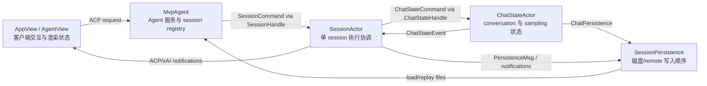

# 状态所有权：MvpAgent、SessionActor、ChatStateActor 与 TUI

本文从“谁拥有状态”而不是“请求经过哪里”理解 Grok Build。系统里同时存在进程级 Agent、单 session actor、conversation actor、persistence actor 和客户端 view；它们都有看起来相似的 session ID、model、prompt、queue 或 history 字段，但语义、生命周期和一致性要求不同。

前置阅读：[Prompt 到最终回答](../02-runtime-flows/02-prompt-to-answer.md)、[会话上下文](../02-runtime-flows/06-session-context.md)、[TUI 事件循环](../02-runtime-flows/08-tui-event-loop.md)、[ACP 与 MCP](../02-runtime-flows/09-acp-and-mcp.md)和[会话持久化](../02-runtime-flows/11-persistence.md)。

## 先记住结论

1. `MvpAgent` 是一个 ACP Agent 服务实例的进程/连接级协调器，管理认证、模型目录、全局配置、session registry 和跨 session 服务。
2. `SessionActor` 是单个 session 的执行协调器，拥有 turn 调度、工具/MCP、权限、compaction/memory/goal 等 session 行为。
3. `ChatStateActor` 独占 conversation、sampling config、prompt index、token usage 和 chat-specific persistence；`SessionActor` 只能通过 `ChatStateHandle` 操作它。
4. `SessionPersistence` 独占持久化消息的串行消费顺序，但磁盘仍通过 file lock/atomic write 防御多 actor 或多进程写入。
5. `SessionHandle` 不是 session 本体，而是 `Clone + Send` 的代理和少量同步可读镜像，让 `MvpAgent` 无需跨线程借用 `SessionActor`。
6. TUI `AppView`/`AgentView` 是客户端状态和服务端状态的投影。scrollback、光标、modal、pane、optimistic echo 等只属于本地界面。
7. 同名字段可能分别是权威值、镜像、缓存、快照或持久化副本。判断 bug 前必须先标明它属于哪一类。
8. actor 不是“所有字段都完全无锁”。每个 actor task 内有顺序，但跨 task 共享的少量同步状态仍使用 `Arc<Mutex<_>>`、atomic、watch 或 `ArcSwap`。
9. 生命周期也分层：磁盘 session 可以长期存在，session actor 可以被 idle-unload，TUI pane 可以随时关闭，进程级 `MvpAgent` 则继续服务其他 session。
10. 设计的核心不是追求零重复，而是让每份重复数据有明确用途、刷新路径和失效条件。

## 一、先建立五个“状态岛”



这里的箭头表示控制或消息方向，不表示 Rust crate 依赖一定完全同向。尤其 `xai-chat-state` 通过 trait 接受 persistence 实现，从而避免反向依赖 shell 的具体 `PersistenceMsg`。

### 五层一览

| 层 | 核心类型 | 生命周期 | 权威状态示例 |
| --- | --- | --- | --- |
| UI process | `AppView` | 一个 TUI 进程 | 当前 view、所有 pane、全局 modal/settings UI |
| UI agent view | `AgentView` + `AgentSession` | 一个本地 pane/attachment | scrollback、composer、客户端 turn gate、render state |
| Agent service | `MvpAgent` + `SessionRegistry` | 一个 shell Agent/ACP 服务实例 | resident session 集合、认证、model catalog、attach/liveness |
| Session runtime | `SessionActor` + `State` | 一个 resident session actor | turn queue、工具/权限/MCP、session modes 和 orchestration |
| Chat runtime | `ChatStateActor` + `ChatState` | 随 resident session | conversation、sampling config、prompt index、usage |
| Persistence | `SessionPersistence` + storage | 随 session persistence handle | 持久化 mailbox 顺序、pending merged update |
| Disk | session directory | 跨进程、跨运行 | resume 所需持久化副本 |

表中故意把 UI process 和 UI agent view 分开，也把 runtime 与 disk 分开。一个 session 可以：

- 在 disk 上存在但没有 `SessionActor`，称为 dormant。
- 有 resident `SessionActor` 但当前 TUI 没有 pane。
- 被多个客户端/pane attach，每个都有自己的 `AgentView`。
- 关闭一个 pane 后继续由 leader 或另一个客户端运行。

## 二、五种“看起来像重复”的数据

读大型 actor struct 时，先给字段分类：

| 类别 | 定义 | 例子 |
| --- | --- | --- |
| authoritative state | 当前行为必须以它为准 | `ChatState.conversation`、`State.running_task` |
| projection / mirror | 为同步查询或展示复制的视图 | `SessionHandle.model_id`、TUI model display |
| cache | 可从其他来源重新计算，主要为性能 | model catalog cache、resident roster title |
| snapshot | 某时刻复制出的稳定值 | spawn-time MCP list、`ChatStateSnapshot` |
| persisted replica | 用于跨进程恢复的磁盘副本 | `chat_history.jsonl`、`summary.json` |

同一个概念可以同时有这五种形态。例如 model：

```text
ModelsManager catalog
    ↓ 解析选择
ChatState.sampling_config.model        ← 当前采样真正使用
SessionHandle.model_id                 ← Agent 层同步路由/roster 镜像
summary.current_model_id               ← resume 用持久化副本
AgentSession.models                    ← TUI 展示和选择状态
```

只看字段名，无法决定谁应覆盖谁。必须看该操作的语义：下一次 API 请求应读 ChatState sampling config；重启后恢复应读 summary；渲染状态栏应读 TUI 已确认的 model state。

## 三、`MvpAgent`：Agent 服务实例的所有者

`xai-grok-shell/src/agent/mvp_agent/mod.rs::MvpAgent` 不是“一个聊天会话”。它更像 ACP server 的 application service，负责把多种请求路由到正确 session 和共享基础设施。

### 它拥有的状态

主要分为六组：

1. **协议/客户端初始化**
   - `initialize_request`
   - `gateway`
   - `client_type`
   - code navigation、folder trust 等 client capability

2. **认证和模型目录**
   - shared `AuthManager`
   - live `auth_method_id`
   - default/global sampling seed
   - `ModelsManager`
   - chat product 的 `ChatModesManager`

3. **Agent 级配置与远端状态**
   - `AgentConfig`
   - `storage_mode`
   - remote settings 应用后的 gates
   - plugin registry、managed MCP cache

4. **Session registry 与生命周期**
   - `SessionRegistry`
   - resident/attaching/dormant/dead presence
   - `SessionHandle`、`SessionThread`
   - dispatch lock、turn number、permission receiver

5. **跨 session 服务**
   - codebase index manager
   - subagent coordinator channel
   - worktree/background copy resources
   - announcements、bundle sync、heap profile monitor

6. **leader-safe mirrors**
   - activity mirror
   - trace-upload live gate
   - roster titles/liveness projection

### 它不拥有 conversation

`MvpAgent` 创建或加载 session 时会得到 `chat_history`，但随后把它移交给 session thread 内的 `ChatStateActor`。Agent 层需要查询 conversation 时，通过 `SessionHandle.chat_state_handle` 发命令，而不是直接访问 Vec。

这使一个大 session 的消息内存随 session actor 卸载，而不会永久挂在进程级 Agent 上。

### 为什么大量使用 `Cell`、`RefCell` 和 `Rc`

`MvpAgent` 主要运行在单线程 Tokio `LocalSet`。许多状态不需要跨线程锁，因此使用：

- `Cell<T>`：小型 Copy 值，读取不产生跨 await borrow。
- `RefCell<T>`：运行时检查的单线程内部可变性。
- `Rc<T>`：单线程共享所有权。
- `spawn_local`：运行 `!Send` future。

这不是“Rust 并发写法退化成不安全”。它利用明确的线程约束避免无意义的 mutex 成本。但代码必须遵守一个关键规则：不要把 `RefCell` borrow 跨过 `.await`。

### `LocalRef<T>` 为什么存在

某些 `spawn_local` 任务需要持有 `MvpAgent` 的长期引用，而普通借用无法满足 `'static`。`LocalRef<T>` 封装 raw pointer，并依赖三个不变量：

1. pointee 在 LocalSet 期间不移动、不释放。
2. 所有访问都在同一 LocalSet thread。
3. `LocalRef` 不活得比 LocalSet 更久。

它是一个有显式 safety contract 的局部工具，不应被当作通用“绕过 borrow checker”方案。

## 四、`SessionRegistry`：存在、驻留与资源生命周期

```mermaid
stateDiagram-v2
    [*] --> Attaching
    Attaching --> Resident: attach/load succeeds
    Attaching --> Previous: attach fails; displaced presence restored
    Resident --> Dormant: idle unload
    Resident --> Evicted: client release, thread still draining
    Resident --> Closed: explicit close
    Resident --> Dead: actor exits/panics
    Dormant --> Attaching: resume
    Evicted --> [*]: thread reaped
    Closed --> [*]
    Dead --> Dormant: later disk scan treats history as resumable

    state "previous presence" as Previous
```

`MvpAgent.session_registry` 不是简单的 `HashMap<SessionId, SessionHandle>`。`SessionPresence` 用 enum 把合法生命周期组合编码进类型：



图中的 `previous presence` 是概念节点：attach/resume 开始前，registry 会暂存被替换的 presence；失败时恢复它。它常见是 `Dormant`，但不能一概写成 `Dormant`。

源码中的完整 presence variants 是：

- `Resident`
- `Attaching`
- `Evicted`
- `Closed`
- `Dead`
- `Dormant`

### 为什么 enum 比平行 bool 更好

如果使用：

```text
is_loading: bool
is_resident: bool
is_closed: bool
handle: Option<_>
thread: Option<_>
```

程序可以表示互相矛盾的组合，例如 `is_resident=true` 但没有 handle，或同时 loading/closed。`SessionPresence` 的 variant 携带使该状态成立的证据，例如 `Resident` 包含 handle slot 和 activity。

### Retained 与 Resident resources

registry 进一步区分：

- `ResidentResources`：idle-unload 时释放，例如 codebase index strong pin。
- `RetainedResources`：idle-unload 后仍保留，直到真正 remove，例如 turn counter、dispatch lock、permission event receiver。

这解释了为什么“session actor 不在内存”不等于“Agent 忘记该 session 的所有运行信息”。部分轻量状态必须跨 unload/resume 保持连续。

### `SessionLiveState` 是投影，不是数据库终态

它把 registry presence 投影为 `Working`、`IdleResident`、`Dormant`、`Completed`、`DeadFailed`、`Attaching`，供 roster/dashboard 使用。

磁盘 session 本身没有“进程永远结束”的终态；它通常仍可 resume。这里的 liveness 更接近 residency + turn activity，而不是操作系统 pid 状态。

## 五、`SessionThread` 与 `SessionActor`

正常 session 通过 `spawn_session_on_thread` 启动：

1. 建立专用 OS thread。
2. 在线程中创建 current-thread Tokio runtime。
3. 创建该线程的 `LocalSet`。
4. 在那里构造 `!Send` 的 `SessionActor`。
5. 只把 `Send` 的 `SessionHandle`、permission receiver 和 system prompt 传回 Agent 线程。

`SessionActor` 本体绝不跨线程移动。`SessionThread` 单独持有 OS `JoinHandle`，因为它不可 Clone；`SessionHandle` 则可以廉价 clone。

### `SessionActor` 拥有什么

它是单 session 行为最密集的对象，主要包括：

- session identity、auth handles、telemetry identity
- turn scheduling state
- notification sender 和 replay buffer channel
- permission handle
- `ToolContext` 与完整 `Agent`
- MCP live state 和 strategy
- file rewind tracker
- compaction、memory、goal、workflow、plan mode
- interjection、notification、skill reminder buffers
- model-switch compatibility 和 session modes
- lifecycle cancellation、feedback、uploads

### 它为什么是 `Arc<SessionActor>`

session thread 内会 `spawn_local` 多个辅助任务：MCP dispatcher、file watcher、memory flush、tool turns 等。这些任务需要共享 session services，所以主循环和辅助任务持有 `Arc`。

`Arc` 只表达跨 task 的 shared ownership，不自动表示对象可跨 thread。`SessionActor` 内含 `RefCell` 等 `!Sync` 状态，仍被限定在本 session 的 LocalSet/thread。

## 六、`State` 只剩 turn 调度状态

`acp_session.rs::State` 的注释非常关键：conversation、tokens、timing、prompt index、prompt texts、edited paths、last compaction index 和 sampling config 已全部迁移到 `ChatStateActor`。

当前 `State` 主要保存：

- `running_task`
- `pending_inputs`
- `pending_notifications`
- prompt combine edit holds
- notification suppression
- 当前 turn 是否仍可 rewind
- laziness nudge counter

它被 `TokioMutex<State>` 包裹，因为多个 session-local async path 会协调 queue、running task 和 notifications，并可能跨 await。

### 为什么 queue 和 running task 必须在同一锁内

`State::running_prompt_id` 和 `sweep_pending_inputs` 的注释记录了一个重要不变量：

- running task 的 input slot 必须留在 queue 中，直到 completion/cancel 正确处理。
- queue sweep 不能仅凭“第 0 项”猜哪个是 running turn。
- 必须用 `running_task.prompt_id` 保护真正的 running slot。

如果 running identity 和 pending queue 分属两个无原子关系的锁，清理 synthetic wake 时可能误删用户 prompt。

### 一个 canonical idle predicate

`is_session_idle_for_injection` 同时要求：

- 没有 running task。
- 没有 pending input。
- notifications 没被 Ctrl+C suppression 阻止。

memory/notification/laziness 等 idle consumers 共用这一 predicate，避免每个子系统定义略有不同的“空闲”。

## 七、`ChatStateActor`：conversation 的唯一写入序列

`xai-chat-state` 把 chat state 抽成独立 crate。`ChatStateActor` 拥有：

- `ChatState`
- pruning config
- `Box<dyn ChatPersistence>`
- command receiver
- event sender
- cancellation token

它由 `tokio::spawn(actor.run())` 运行，顺序处理 `ChatStateCommand`。

### `ChatState` 的权威字段

| 字段 | 用途 |
| --- | --- |
| `conversation` | 模型当前结构化上下文 |
| `sampling_config` | 下一次模型请求配置 |
| `prompt_index` | 当前 user turn 序号 |
| `prompt_texts` | rewind preview 的 prompt 缓存 |
| `total_tokens` | provider 报告/重建后的累计 token |
| timing fields | stream/turn 时间元数据 |
| `agent_edited_paths` | Agent 修改过的路径集合 |
| `last_compaction_prompt_index` | rewind/compaction 边界 |
| `credentials` | opaque API/auth secret snapshot |
| usage ledgers | 当前 prompt 和 session billing/usage |
| turn capture | 当前 turn artifact 的 offset capture |
| harness trace buffers | goal planner/verifier 的独立 trace turns |

`ChatStateActor` 独占这些字段，所以 mutation 内部通常不需要 mutex。所有并发调用者通过同一 mpsc mailbox 排队。

### 构造时会修复历史

`ChatState::new` 会：

- 去重重复 ToolResult。
- 为进程中断留下的 dangling tool call 生成修复结果。
- 重新估算 initial tokens。

因此 disk chat history 是恢复输入，actor 内的 conversation 才是当前运行时权威值；加载阶段允许做不改写原文件的兼容/修复。

## 八、`ChatStateCommand` 同时承担 mutation、query 与 barrier

命令分三类：

### Fire-and-forget mutation

例如：

- `PushUserMessage`
- `PushAssistantResponse`
- `PushToolResult`
- `RecordTokenUsage`
- `UpdateSamplingConfig`
- `ReplaceConversation`
- `Flush`

sender 只保证命令成功进入 channel；不保证 actor 已处理。

### Request/reply query

例如：

- `GetConversation`
- `GetPromptIndex`
- `GetSamplingConfig`
- `Snapshot`
- `BuildConversationRequest`
- `TakeTurnMessages`

命令携带 oneshot sender。调用方 await reply，也建立了 mailbox ordering barrier：reply 之前排队的 mutation 已先被处理。

### Acknowledged mutation

例如 `PushUserMessageAndAck`、`AppendWorkingDirectorySwitchAndAck`、`ReplaceSystemHead`。它们用于不能只靠 fire-and-forget 的边界：

- 调用方需要知道内存 mutation 已被 actor 接受。
- 或需要等到底层 persistence commit。
- 或需要让 read-modify-write 与并发 turn push 原子排序。

不要为了方便把所有 mutation 都改成 await ack；这会把高频流式路径串成大量 round trip。只在确实需要 barrier 的协议边界使用。

## 九、为什么 `ReplaceSystemHead` 必须在 ChatStateActor 内执行

错误做法：

```text
get_conversation().await
修改第一个 System
replace_conversation(new_vec)
```

在 get 和 replace 之间，另一个 task 可能已经 push Assistant 或 ToolResult。旧 snapshot 整体替换会丢掉这些新 items。

`ReplaceSystemHead` 把“检查 head + 修改 + persistence”作为一个 actor command，在 conversation owner 内顺序执行。它与所有 push command 串行，因此不会形成跨 actor round trip 的 stale read-modify-write。

这条原则可推广：如果 mutation 依赖当前值，应尽量把 mutation 意图发给 owner，而不是先 query snapshot、在外部修改、再 replace。

## 十、ChatState 如何连接 Persistence

`ChatStateActor` 独占 `Box<dyn ChatPersistence>`。trait 只暴露 chat-specific 操作：

- `persist_message`
- `persist_working_directory_switch_and_ack`
- `replace_history`
- `flush`

shell 提供的真实实现把这些操作翻译成 `PersistenceMsg`。因此：

- `xai-chat-state` 不依赖 shell 的完整 persistence actor。
- conversation mutation 与“应该触发哪种持久化意图”放在同一个 owner 中。
- 真实 I/O 仍在 `SessionPersistence` 执行，不阻塞 ChatState 的大多数 mutation。

trait 使用 `&mut self`，因为 persistence object 被 actor 独占，不需要为了共享而引入 interior mutability。

## 十一、`ChatStateEvent` 是协调通知，不是状态复制

ChatStateActor 向 session main loop 发少量事件：

- `PromptIndexChanged`
- `TokensUpdated`
- `ConversationReset`
- `ImageBudget`

注释明确：persistence 已在 actor 内部处理；这些 event 只用于 session-level coordination。

例如 conversation reset 后，SessionActor：

- 重置 memory idle-flush 的长度基线。
- 重新允许 memory context injection 检查。

对于 prompt index/token event，main loop 不保存另一份权威值；真正需要时重新 query ChatStateActor。换句话说，event 不会升级成第二个权威状态副本。事件通道关闭仍然是需要处理的协调故障，不能理解成“任何 event 都可以随意丢失”。

## 十二、`SessionHandle`：跨线程代理，不是小型 SessionActor

`SessionHandle` 的首要任务是把 `!Send` actor 隔离在 session thread 内，同时给 `MvpAgent` 一个 `Clone + Send` 的控制面。

### 它包含哪些类型的字段

1. **命令入口**
   - `cmd_tx`
   - `persistence_tx`
   - `ChatStateHandle`
   - permission、signals、scheduler 等 handles

2. **同步共享 live state**
   - `current_prompt_id: Arc<Mutex<Option<_>>>`
   - `pending_interactions`
   - `gateway_enabled: Arc<AtomicBool>`
   - resolved tool overrides `ArcSwapOption`

3. **快捷 identity/config snapshot**
   - `Info`
   - model ID、reasoning effort
   - max turns、agent name
   - initial MCP servers
   - yolo/origin client 等

4. **跨层资源 handle**
   - hunk tracker
   - ToolContext/process scope
   - upload queue
   - hook registry

### 为什么保留同步可读镜像

roster 构建、cancel routing、subagent inheritance 等路径有时需要在 Agent LocalSet 上同步判断，不适合为每个字段向 session thread 发一次 query。少量 atomic/mutex/snapshot 能降低跨线程 round trip。

代价是每个镜像必须注明刷新规则。源码直接说明：`SessionHandle.mcp_servers` 是 spawn-time snapshot，后续 `UpdateMcpServers` 不更新它；它只适合立即 fork inheritance，不能当实时 MCP source of truth。

## 十三、共享同步原语各自解决什么

| 类型 | 典型字段 | 为什么不用普通字段 |
| --- | --- | --- |
| `Arc<Mutex<T>>` | current prompt ID、pending interactions | 多线程同步读写复合值 |
| `Arc<AtomicBool>` | gateway enabled、turn active | 高频单 bit gate，无需获取锁 |
| `AtomicUsize/U64` | counters、length baseline | 单值并发更新 |
| `ArcSwapOption<T>` | resolved tool overrides | 多 reader 低成本读取不可变 snapshot |
| Tokio `Mutex<T>` | turn scheduling State、MCP live state | async 临界区可能与 await 协调 |
| parking_lot `Mutex<T>` | 短小同步临界区 | 不跨 await、无需 async wake |
| watch channel | model switch generation | 广播最新状态并感知变化 |
| mpsc channel | actor commands/events | 保序的所有权边界 |
| oneshot channel | query/ack | 单次请求结果和 ordering barrier |
| `OnceLock<T>` | display cwd、init request | set-once 后 lock-free 读取 |

选择同步原语时，不要只看“会不会并发”。还要问：

- 是否跨 thread？
- 是否跨 await 持有？
- 需要所有事件还是只需最新值？
- 是传 ownership，还是共享 snapshot？
- 调用方需要 acknowledgement 吗？

## 十四、Session 主循环如何汇合多个 mailbox

`run_session` 在一个 biased `tokio::select!` 中协调：

- `SessionCommand` receiver
- ChatState event receiver
- replay/session notification receiver
- turn completion receiver
- model switch watch
- memory idle/dream timers
- cancellation/shutdown 和其他 service events

它是 session orchestration 的 serialization point，但并不亲自执行所有工作：长时间采样、tool execution、memory flush、watcher 等可以在 local task 中运行，完成后再通过 channel/共享 gate 汇合。

`biased` 表示分支按源码顺序有优先倾向。分析 starvation 或 shutdown ordering 时，不能把 select 当成完全随机公平调度。

## 十五、`SessionCommand` 是 SessionActor 的公开行为面

`SessionCommand` 不是简单 CRUD。它定义 Agent 层能要求一个 session 做什么：

- prompt、cancel、shutdown
- model/session mode switch
- compact、rewind、history repair
- permission modes
- MCP/tool/plugin refresh
- interjection、prompt queue
- goal/workflow operations
- query session info/model/rewind points

很多 variant 携带 oneshot reply。命令 enum 的好处是：

- 所有外部 mutation 经过 main loop 排序。
- shutdown/cancel/prompt intake 可以定义明确先后关系。
- caller 不需要获得 `&mut SessionActor`。
- 测试可以直接注入命令和断言 reply。

但 enum 变大也意味着边界需要持续拆分；当前代码已经把实现按 `acp_session_impl/*.rs` concern 拆文件，而不是让一个源文件承载所有 handler。

## 十六、TUI `AppView`：客户端进程的根状态

`xai-grok-pager/src/app/app_view.rs::AppView` 注释为“owns all application state”。这里的 application 指 pager/TUI，不是 shell Agent。

它拥有：

- `active_view`
- `IndexMap<AgentId, AgentView>`
- TUI-local `AgentId` allocator
- global model/UI settings projection
- keybinding registry
- auth/trust/welcome state
- dashboard/session picker
- terminal/render scratch
- process-wide voice、clipboard、notifications 等 UI services
- shared ACP transport handle

TUI `AgentId` 与 ACP `SessionId` 不同：

- `AgentId` 定位当前 pager 内的一个 view instance。
- `SessionId` 定位 shell/backend session。
- 一个新 attachment 可获得新 AgentId，却指向已有 SessionId。

## 十七、`AgentSession` 与 `AgentView` 的分工

### `AgentSession`：TUI 看到的业务状态

它包含：

- ACP session ID、cwd、model state
- `AgentState`（idle/turn/command lifecycle）
- 本地 prompt queue
- permission mode 的 display mirror
- prompt history
- replay/loading flags
- background/scheduled task projection
- current client prompt ID
- rate-limit/credit/auth retry UI gates

它通过 facade method 消费 ACP update，而不应让外部直接随意修改内部 tracker。

### `AgentView`：交互和渲染状态

它在 `AgentSession` 外增加：

- scrollback
- prompt widget
- TODO/task/catalog/queue panes
- modal、selection、mouse hit areas
- pane focus、input/vim/multiline modes
- turn timer、hover、links、media paths
- viewer/driver adoption 与 replay dedup highwater
- optimistic echo reconciliation
- goal/workflow display projection

这类状态不应下沉到 shell：换一个 ACP client，界面组件完全不同；服务端只需提供可重建 projection 的 protocol events。

## 十八、TUI 为什么也保存 `current_prompt_id`

后端和客户端的同名字段语义不同：

### SessionActor/SessionHandle

表示 session 当前真正运行的 prompt/turn。MvpAgent 用它判断 Working、cancel target、subagent attribution 等。

### AgentSession/AgentView

表示当前 pane 认为自己正在跟踪或驱动的 prompt。它用于：

- 丢弃 rewind 后迟到的旧 chunk。
- 区分自己发起的 turn 与其他 client/server 发起的 turn。
- viewer attach 时采用远端 prompt ID。
- turn terminal 与 loading replay 对齐。

多个 TUI pane 可以 attach 同一 session，所以每个客户端必须拥有自己的观察/driver 状态；不能直接共享一个 UI prompt ID。

## 十九、Scrollback 不是 Conversation

| Conversation | Scrollback |
| --- | --- |
| 给模型使用 | 给人显示 |
| `ConversationItem` | render blocks/entries |
| 工具 pair 必须满足模型协议 | 可包含 toast、banner、status、hook display |
| compaction 后会缩短 | replay 后仍可展示更完整历史 |
| ChatStateActor 权威 | AgentView 权威 |
| 持久化为 chat history | 可由 updates replay 重建 |

因此不能拿 TUI scrollback 的 block 数推断模型 context item 数，也不能因为 UI 还显示早期消息就认为模型仍能看到它们。

## 二十、Queue 也有多份，但不是同一队列

### Server queue

`SessionActor::State.pending_inputs` 是执行 admission 和 turn promotion 的权威队列。它包含 user、wake、synthetic 等不同来源，并与 running task 在同一锁内维护不变量。

### TUI local queue

`AgentSession.pending_prompts` 保存当前客户端还没提交/发送的本地 prompt。

### TUI shared queue mirror

`AgentView.shared_queue` 是 server-authoritative shared prompt queue 的客户端 projection，由 queue changed events 更新。

queue pane 显示 local + shared 的 union，但 remove/reorder 必须按 origin 路由到不同 owner。把两者先合并成一个 Vec 再直接 mutate 会破坏权威边界。

## 二十一、常见字段的权威关系表

| 问题 | 当前权威 | 镜像/副本 | 不应误用的值 |
| --- | --- | --- | --- |
| 下一轮给模型哪些消息？ | `ChatState.conversation` | `chat_history.jsonl` | TUI scrollback |
| 下一轮请求哪个模型？ | `ChatState.sampling_config` | handle/summary/TUI model | 启动时 global sampling seed |
| turn 是否正在运行？ | `State.running_task`；同步 roster 常读 shared prompt ID | `SessionLiveState`、TUI `AgentState` | disk summary |
| prompt 执行顺序？ | `State.pending_inputs` + dispatch lock | TUI shared queue | TUI local pending queue |
| 当前 live MCP？ | `SessionActor.mcp_state` | handle spawn snapshot | project config 原始文件 |
| model context token？ | ChatState token fields/query | TUI context projection、signals | scrollback 文本长度 |
| 当前 permission decision？ | session permission subsystem | handle/TUI mode mirror | config default |
| session 是否 resident？ | `SessionRegistry::SessionPresence` | roster/dashboard | session directory existence |
| session 是否可 resume？ | disk `summary.json` + files | session picker entry | resident handle presence |
| UI 当前显示什么？ | `AgentView` | 可由 replay 重建 | ChatState conversation |
| 已持久化到哪？ | persistence/storage ack 或 disk | actor pending buffers | UI 已显示的 chunk |

## 二十二、生命周期与清理顺序

### Pane 关闭

关闭 TUI view 只必然释放本地 `AgentView`。是否同时发送 session close、detach 或保持 leader resident 取决于具体 action/模式。

### Idle unload

Agent 可以释放 resident-heavy resources 和 session actor，使 session 变为 Dormant；磁盘 history 和 retained metadata 仍允许 resume。

### Explicit close

`close_active_session`：

1. 等 attach settle。
2. 获取 prompt-intake dispatch lock。
3. 确认 target actor 未被新 attach 替换。
4. cancel running turn/background work。
5. 发送 shutdown。
6. 从 registry 移除/标记 terminal。
7. bounded wait old session thread drain。
8. finalize remote replica。

同 channel identity 检查防止 close 请求误杀刚刚替换进来的新 actor。

### Delete

delete 在删目录前也要 hard-stop resident actor 并短暂等待 flush，避免 actor 在目录删除后继续写文件把 session 部分“复活”。

### Actor panic

`SessionThread` 的 supervisor 定期检查 `JoinHandle::is_finished`。异常 actor 被 reaped 并投影为 `DeadFailed`/后续 Dormant，而不是让 registry 永远保留 zombie handle。

## 二十三、为什么不能合并成一个大对象

假设把全部状态放进 `GlobalState`：

```text
GlobalState {
  sessions: HashMap<Id, SessionEverything>,
  ui: ...,
  disk: ...,
}
```

会产生以下问题：

1. **锁范围巨大**：流式 chunk、render、tool execution、disk write 争夺同一 mutex。
2. **生命周期绑死**：为了保留 disk metadata，不得不保留完整 conversation、MCP clients 和 UI scrollback。
3. **线程约束冲突**：TUI、Agent LocalSet、session dedicated thread 的 `Send/!Send` 需求不同。
4. **故障传播扩大**：一个 session 的阻塞或 panic 更容易拖住所有 session。
5. **测试困难**：无法用 fake persistence 或 command channel 单独测试 ChatState。
6. **协议边界模糊**：多个客户端 attach 时，UI-local state 无法自然区分。
7. **持久化耦合**：每次小 mutation 都可能被迫克隆/锁住完整对象。

当前设计用 message passing 换取清晰的 serialization boundary 和独立生命周期，代价是需要管理镜像、ack 和 eventual consistency。

## 二十四、Actor 模型并未消灭所有竞态

常见剩余竞态：

- query snapshot 后在外部修改再 replace，可能覆盖中间 mutation。
- fire-and-forget command 后立即从另一 owner 读取，可能还没处理。
- UI optimistic echo 与 server broadcast 重复。
- replay 与 live update 重叠。
- attach/close 同时发生，旧 handle 被新 actor 替换。
- cached handle field 没有随 live actor 更新。
- actor 已写日志但 ack channel 丢失。
- actor thread 退出，clone 的 sender 仍暂时存在但 send/response 失败。

actor 的价值是把竞态压缩到明确边界，不是自动证明整个系统线性一致。

## 二十五、常用一致性模式

### 1. Command + oneshot

用于 query 或需要处理完成 barrier 的 mutation。

### 2. Generation / event ID

用于 cwd switch、TUI replay dedup、settings generation。比较身份而不是依赖到达次数。

### 3. Optimistic echo + reconcile by ID

TUI 先显示自己的 interjection，server broadcast 回来后按 ID 去重；其他 pane 则正常显示。

### 4. Snapshot + delta

session replay 先读历史到 offset，再补发 delta；见[会话持久化](../02-runtime-flows/11-persistence.md)。

### 5. Shared atomic gate

`gateway_enabled` 让 Agent 线程在 replay/reconnect 时同步关闭 session notification forwarding，而无需等待 actor query。

### 6. Enum state machine

`SessionPresence`、TUI `VoiceState` 把互斥状态编码为 enum，避免相关 booleans 漂移。

### 7. Canonical predicate

多个 consumer 共用 `is_session_idle_for_injection`，避免“空闲”的定义在不同功能中分叉。

### 8. Owner-side mutation

`ReplaceSystemHead`、summary patch 等把依赖当前值的 mutation 发送给 owner，在 owner 的锁/actor 内执行。

## 二十六、如何判断一个新字段该放哪里

依次回答：

1. 它属于整个 Agent 服务、单个 session、模型 conversation，还是一个 UI pane？
2. session idle-unload 后是否必须保留？
3. 进程重启后是否必须保留？
4. 哪个操作需要原子地与它一起改变？
5. 谁需要同步读取，谁可以 async query？
6. 它是权威值、缓存、镜像还是 snapshot？
7. 镜像如何刷新，什么时候允许 stale？
8. 是否包含 secret 或不可 Clone 的资源？
9. 是否跨 OS thread？类型需要 `Send`/`Sync` 吗？
10. 测试时能否用 command/trait seam 隔离？

示例：一个只用于 prompt widget 高亮的 bool 应放 `AgentView`；一个决定下一次 model request 的参数应放 ChatState sampling config；一个需要 roster 同步读取的 turn gate 可能需要 SessionActor 权威值加 SessionHandle atomic mirror。

## 二十七、调试状态分叉的方法

### 第一步：写出 owner map

不要先加日志。先写：

```text
事实：当前模型
权威：ChatStateActor.sampling_config
镜像：SessionHandle.model_id、summary、AgentSession.models
写入者：SetSessionModel / model-switch flow
传播：ChatStateCommand → handle update → notification → TUI
```

### 第二步：找所有 writer

```sh
rg "UpdateSamplingConfig|update_sampling_config|model_id =|current_model_id" \
  crates/codegen/xai-chat-state/src \
  crates/codegen/xai-grok-shell/src \
  crates/codegen/xai-grok-pager/src
```

### 第三步：标出 async boundary

关注：

- mpsc send 后是否 await ack？
- watch receiver 是否可能只看到最新 generation？
- mutex guard 是否跨 await？
- TUI update 是 optimistic 还是 server-confirmed？
- persisted summary 更新是否晚于 runtime mutation？

### 第四步：检查生命周期事件

很多“偶发 stale”只发生在：

- reconnect
- idle unload/resume
- model switch
- rewind
- attach 与 close 竞争
- actor panic/reap
- multi-pane viewer/driver 切换

### 第五步：验证失效规则

如果字段是 cache/snapshot，测试重点不只是初始值正确，还要验证 owner 改变后它是否应刷新，以及不刷新是否是文档化约束。

## 二十八、建议的源码阅读顺序

1. `xai-chat-state/src/lib.rs`：先看 crate 提供的整体 actor 图。
2. `xai-chat-state/src/actor/state.rs`：明确 conversation owner。
3. `xai-chat-state/src/commands.rs` 与 `handle.rs`：看 command/query seam。
4. `xai-chat-state/src/actor/mod.rs`：看 mailbox 和 cancellation。
5. `xai-chat-state/src/persistence.rs`：看 trait 如何反转具体依赖。
6. `xai-grok-shell/src/session/acp_session.rs`：看 `State` 和 `SessionActor` 字段分工。
7. `session/acp_session_impl/run_loop.rs`：看 select 汇合点。
8. `session/commands.rs` 与 `session/handle.rs`：看 Agent 能如何控制 session。
9. `agent/mvp_agent/session_registry.rs`：看 presence 与资源生命周期。
10. `agent/mvp_agent/session_lifecycle.rs`：看 close/unload/reap。
11. `agent/mvp_agent/mod.rs::MvpAgent`：最后再看进程级大对象。
12. `xai-grok-pager/src/app/agent.rs`：看客户端业务 projection。
13. `xai-grok-pager/src/app/agent_view/mod.rs`：看 UI-local state。
14. `xai-grok-pager/src/app/app_view.rs`：看 pager root ownership。

### 快速查符号

```sh
rg "struct MvpAgent|struct SessionRegistry|enum SessionPresence" \
  crates/codegen/xai-grok-shell/src/agent/mvp_agent

rg "struct SessionActor|struct State|enum SessionCommand|struct SessionHandle" \
  crates/codegen/xai-grok-shell/src/session

rg "struct ChatStateActor|struct ChatState|enum ChatStateCommand|struct ChatStateHandle" \
  crates/codegen/xai-chat-state/src

rg "struct AppView|struct AgentView|struct AgentSession" \
  crates/codegen/xai-grok-pager/src/app
```

### 重点测试位置

- `xai-chat-state/src/actor/tests.rs`：mailbox ordering、snapshot、repair、usage 和 persistence。
- `xai-grok-shell/src/session/acp_session_tests/session_thread_tests.rs`：dedicated thread 生命周期。
- `session/acp_session_tests/parallel_dispatch_tests.rs`：并行 tool/turn coordination。
- `session/acp_session_tests/prompt_queue_actor_tests.rs`：server queue 不变量。
- `agent/mvp_agent/tests/session_resume_close_tests.rs`：attach/close/replacement 竞争。
- `agent/mvp_agent/tests/process_scope_reclaim.rs`：资源回收。
- `agent/mvp_agent/session_registry.rs` 内测试：presence 与 release。
- `xai-grok-pager/src/app/acp_handler/tests/`：protocol event 到 UI projection。
- `xai-grok-pager/src/app/agent_view/viewer_tests.rs`：viewer/driver 与 replay gate。
- `xai-grok-pager/src/app/dispatch/tests/`：Action 对 AppView/AgentView 的 mutation。

### 小范围命令

```sh
cargo test -p xai-chat-state
cargo test -p xai-grok-shell session_thread
cargo test -p xai-grok-shell prompt_queue_actor
cargo test -p xai-grok-shell session_resume_close
cargo test -p xai-grok-pager viewer
cargo check -p xai-chat-state
cargo check -p xai-grok-shell
```

先用 `cargo test -p <crate> -- --list` 确认过滤名称。本文讨论架构边界，日常验证不需要运行完整 workspace。

## 二十九、阅读检查题

1. 为什么 disk session 存在不表示它是 resident？
2. `MvpAgent` 为什么不直接保存所有 conversation？
3. `SessionPresence` 相比多个 bool 防止了哪些非法状态？
4. ResidentResources 与 RetainedResources 的生命周期差异是什么？
5. 为什么 `SessionActor` 可以放在 `Arc` 中，却仍不能跨 thread？
6. `State.running_task` 为什么必须与 `pending_inputs` 在同一个锁内？
7. 哪些状态已从 SessionActor 迁移到 ChatStateActor？
8. fire-and-forget command 与 oneshot query 分别提供什么 ordering？
9. 为什么外部 get-modify-replace conversation 容易丢消息？
10. `ChatStateEvent` 为什么不复制保存 token/prompt index 的权威值？
11. `SessionHandle` 中的 snapshot 字段为什么必须逐个注明 stale 规则？
12. TUI current prompt ID 与后端 current prompt ID 有什么语义差异？
13. scrollback 为什么不能作为模型 context 的调试依据？
14. TUI local queue、shared queue mirror 和 server pending inputs 如何分工？
15. idle-unload、close、delete 对 actor、registry 和 disk 的影响分别是什么？

## 本篇术语表

| 名词 | 白话解释 | 在本文中的具体含义 |
| --- | --- | --- |
| state | 会随时间变化、影响行为的数据 | conversation、queue、model、UI focus、liveness 等 |
| ownership | 谁负责保存和修改一份状态 | 不只指 Rust move，也指架构上的唯一权威 writer |
| state owner | 对某份状态拥有最终修改权的组件 | ChatStateActor 拥有 conversation |
| state island | 有独立生命周期和串行化边界的一组状态 | MvpAgent、SessionActor、ChatStateActor、AgentView 等 |
| authoritative state | 当前行为必须以它为准的权威值 | `ChatState.conversation`、`State.pending_inputs` |
| source of truth | 发生冲突时应相信的数据源 | 必须针对具体问题说明，不能笼统指定一个全局源 |
| projection | 从权威状态派生的面向消费者视图 | roster、TUI model/queue/goal display |
| mirror | 为快速读取复制的一份 live 值 | SessionHandle 的部分字段、atomic gates |
| cache | 可重建、为性能保留的数据 | roster title、model catalog cache |
| snapshot | 某时刻冻结的状态副本 | spawn-time MCP list、ChatStateSnapshot |
| persisted replica | 磁盘上的恢复副本 | summary、chat history、signals |
| stale | 副本落后于权威值 | snapshot 未随 live actor 更新 |
| invalidation | 权威值变化时让 cache 失效 | model/auth/config switch 清 memo 或 bump generation |
| refresh path | 把权威变化传播到镜像的路径 | command → notification → TUI update |
| consistency | 多份状态在约定范围内相互符合 | 可强一致、最终一致或允许短暂 stale |
| eventual consistency | 副本稍后才追上权威值 | TUI/remote projection 常见模式 |
| linearization point | 并发操作可视为瞬间生效的位置 | actor 处理 command 或锁内 patch 的时刻 |
| serialization boundary | 并发请求在此排成确定顺序 | actor mailbox、mutex critical section |
| actor | 独占状态、通过消息处理操作的任务 | SessionActor 是变体，ChatStateActor 是更纯粹 actor |
| mailbox | actor 接收命令的队列 | Tokio mpsc receiver |
| message passing | 用消息传递操作意图 | `SessionCommand`、`ChatStateCommand`、events |
| command | 要 owner 执行的操作 | push、prompt、compact、query 等 enum variant |
| event | owner 完成变化后发出的协调通知 | `ChatStateEvent`、ACP session update |
| query | 向 owner 请求当前值 | command 携带 oneshot reply |
| mutation | 改变 owner 内状态的操作 | push user、replace conversation、model switch |
| fire-and-forget | send 成功后不等处理完成 | 高频 ChatState mutations |
| acknowledgement / ack | owner 完成指定边界后的确认 | oneshot reply |
| ordering barrier | 保证更早消息已先处理的等待点 | query/ack reply 返回 |
| request/reply | 发请求并等待一次回应 | mpsc command + oneshot sender |
| handle | 控制 owner 的轻量代理 | `SessionHandle`、`ChatStateHandle` |
| proxy | 自己不拥有业务状态，只转发操作 | handle 的主要角色 |
| facade | 隐藏内部复杂度的公开操作面 | AgentSession facade methods、handle methods |
| registry | 按 ID 管理对象和生命周期的集合 | `SessionRegistry` |
| residency | session actor 当前是否驻留内存 | 与 disk 是否存在分开 |
| resident | actor 正在运行并注册 | registry 有 hosted handle |
| dormant | disk 可恢复，但 actor 未驻留 | idle-unloaded session |
| attaching | 正在创建/加载 actor | racing caller 可等待同一 attach settle |
| evicted | handle 已释放，但旧 thread 仍在 drain | registry 暂时继续追踪 thread |
| dead / failed | actor 异常退出 | history 通常仍可在 disk 上恢复 |
| zombie | 已死但 registry 仍错误显示存活的对象 | supervisor/reap 要避免的问题 |
| liveness | 当前进程对 session 活动性的判断 | residency + turn state，不等同 disk existence |
| roster | 多 session 的轻量运行状态列表 | dashboard/leader 使用的 projection |
| presence | session 生命周期的类型化状态 | `SessionPresence` enum |
| state machine | 只允许合法状态和转换的模型 | presence、voice、turn lifecycle |
| illegal state | 业务上不应出现却可被数据结构表示的组合 | resident=true 但无 handle |
| type-state | 用类型/enum 限制状态组合 | `SessionPresence` variant 携带证据 |
| retained resource | unload 后仍保留的轻量资源 | dispatch lock、turn number 等 |
| resident resource | 仅 actor 驻留时保留的资源 | codebase index strong pin 等 |
| idle unload | 空闲时卸载重型 runtime | session 留在 disk，稍后可 resume |
| dedicated thread | 一个 session 使用的独立 OS thread | 容纳 current-thread runtime 和 LocalSet |
| runtime | 驱动 async task 的执行器 | session thread 内 Tokio current-thread runtime |
| `LocalSet` | 允许运行 `!Send` future 的单线程 task 集 | MvpAgent 和 SessionActor 各自使用相关模式 |
| `Send` | 值可安全移动到另一线程 | `SessionHandle` 必须满足跨线程返回 |
| `Sync` | 多线程可安全共享引用 | actor 本体未必需要满足 |
| `!Send` | 类型/未来不能跨线程移动 | 含 Rc/RefCell 的 local actor state |
| interior mutability | 通过共享引用修改内部值 | Cell、RefCell、Mutex、atomic 等 |
| `Cell<T>` | 单线程、Copy 值内部可变容器 | flags/generations，避免借用跨 await |
| `RefCell<T>` | 单线程运行时 borrow 检查 | mutable Agent/registries/config |
| `Rc<T>` | 单线程引用计数 | Agent LocalSet 内共享资源 |
| `Arc<T>` | 原子引用计数的 shared ownership | 跨 task/thread handle；不自动保证 `T: Send` |
| `LocalRef<T>` | 同 LocalSet 长期引用的 raw-pointer wrapper | 有明确 unsafe lifetime/thread contract |
| mutex | 同时只让一个执行者访问临界状态 | sync 或 Tokio async 版本 |
| atomic | 无锁读写小型原子值 | bool/counter/gate |
| `ArcSwap` | 原子替换不可变 Arc snapshot | tool override 的多 reader 发布 |
| watch channel | 保存最新值并通知变化的 channel | model switch generation |
| mpsc | 多生产者、单消费者 channel | actor mailbox/event queue |
| oneshot | 只传一个结果的 channel | query/ack response |
| cancellation token | 多 task 共享的取消信号 | actor 和辅助任务 graceful shutdown |
| biased select | 按分支顺序带优先倾向的 async select | `run_session` 汇合多事件源 |
| orchestration | 协调多个 owner 和任务完成一项流程 | SessionActor 的核心职责 |
| scheduler state | running task、pending input 等调度数据 | `State` 中剩余的主要内容 |
| canonical predicate | 所有 consumer 共用的一份判断函数 | `is_session_idle_for_injection` |
| invariant | 任何合法执行都必须保持的条件 | running queue slot 不能被 sweep 误删 |
| running slot | pending queue 中对应当前 turn 的 input | 按 prompt ID 保护，不只看 index 0 |
| prompt ID | 标识一次 turn 的稳定 ID | server execution identity 与 client tracking identity |
| driver | 发起当前 turn 的客户端 | TUI 用 self-originated IDs 判断 |
| viewer | attach 并观看他人/server turn 的客户端 | 可采用 incoming prompt ID 并实时渲染 |
| attachment | 一个客户端连接/视图绑定到 session | 可与 session runtime 生命周期分离 |
| optimistic echo | 服务端确认前先在 UI 显示本地动作 | interjection 等改善响应感知 |
| reconcile | 服务端事件回来后校准 optimistic state | 按 ID 去重或修正 |
| highwater | 已处理到的最大事件序号 | TUI ACP/xAI replay dedup |
| generation | 每次状态代际变化递增的数字 | cwd switch、commands、settings 等 |
| conversation | 模型使用的结构化上下文 | ChatStateActor 权威 Vec |
| scrollback | TUI 给人看的渲染历史 | AgentView 权威，不等于 conversation |
| turn capture | 用 conversation offset 捕获本轮 items | trace artifact 用，不复制每次 push |
| sampling config | 模型、context window、endpoint 等请求配置 | ChatStateActor 当前权威值 |
| usage ledger | prompt/session 维度的 token/cost 汇总 | ChatState 内 runtime usage |
| dangling tool call | 有 ToolCall 但没有匹配 ToolResult | ChatState 初始化或 repair 时修复 |
| owner-side mutation | 在权威 owner 内基于当前值完成更新 | `ReplaceSystemHead` 防 stale overwrite |
| stale read-modify-write | 基于旧 snapshot 改写并覆盖新变化 | get conversation 后外部 replace 的风险 |
| dependency inversion | 上层通过 trait 注入能力，避免依赖具体实现 | `ChatPersistence` 隔离 xai-chat-state 与 shell |
| trait seam | 可替换实现的接口边界 | real channel persistence 与 mock persistence |
| `SessionCommand` | MvpAgent 控制 SessionActor 的消息协议 | prompt、cancel、model、rewind 等 |
| `ChatStateCommand` | 操作 conversation owner 的消息协议 | push、query、snapshot、build request 等 |
| `ChatStateEvent` | ChatState 发给 session loop 的协调事件 | reset、tokens、prompt index、image budget |
| `SessionHandle` | `Clone + Send` 的 session 控制代理 | 跨 Agent thread 与 session thread |
| `ChatStateHandle` | 可 clone 的 conversation actor proxy | SessionActor/Agent 通过它 query/mutate |
| `AgentSession` | TUI 的 session 业务 projection | ACP state、model、local queue、turn tracker |
| `AgentView` | 一个 TUI pane 的完整交互状态 | session projection + scrollback/prompt/modal/render |
| `AppView` | pager application root state | 所有 AgentView、active view 和 UI services |
| TUI `AgentId` | pager 内 view instance 的 ID | 不等于 ACP SessionId |
| ACP `SessionId` | 协议和持久化 session 身份 | 多 attachment 可共享同一 ID |

更多跨文章通用概念见[全局术语表](../appendices/glossary.md)。
