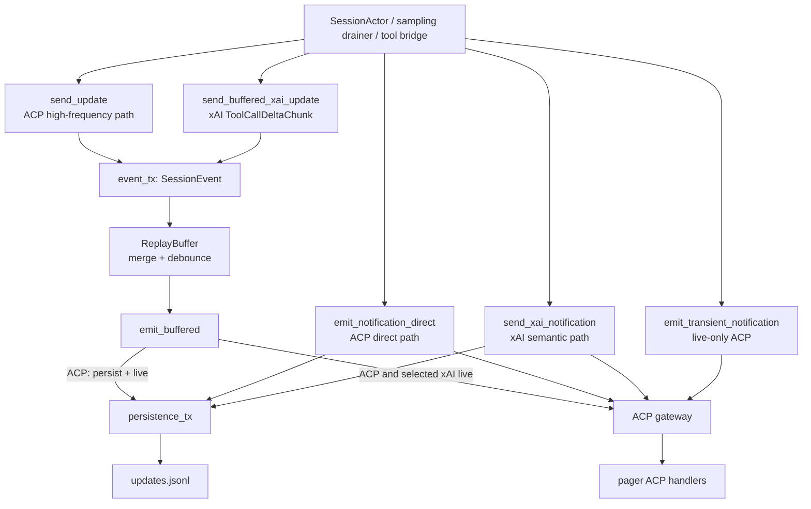
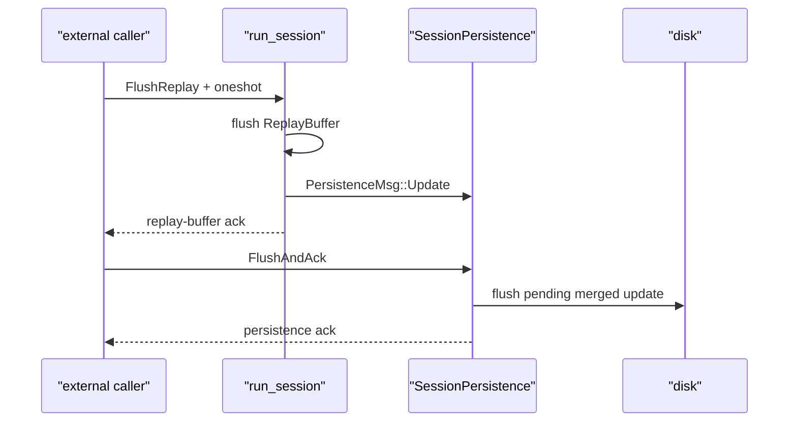

# 通知与事件路由：缓冲、持久化、重放与客户端去重

本文研究 Grok Build 中“已经发生的事情如何到达客户端”。重点不是枚举每一种 UI 更新，而是建立一套可以用于读代码和排查故障的事件模型：事件由谁产生，走 ACP 还是 xAI 扩展，是否进入流式缓冲，是否落入 `updates.jsonl`，断线后如何重放，以及 TUI 如何避免重复应用。

前置阅读：[Prompt 到最终回答](../02-runtime-flows/02-prompt-to-answer.md)、[TUI 事件循环](../02-runtime-flows/08-tui-event-loop.md)、[ACP 与 MCP](../02-runtime-flows/09-acp-and-mcp.md)、[会话持久化](../02-runtime-flows/11-persistence.md)和[状态所有权](01-state-ownership.md)。

## 先记住结论

1. “通知”不是单一类型。代码中至少有标准 ACP `SessionNotification`、xAI `SessionNotification`、session 内部 `SessionEvent`，以及终端桌面通知 `NotificationService`；本文主要讲前三者。
2. 标准 ACP 更新和 xAI 扩展更新使用不同 wire envelope，但都可以描述某个 session 的增量变化。
3. 高频流式事件先进入 `event_tx`，由 `run_session` 中的 `ReplayBuffer` 合并和防抖；低频语义事件通常直接持久化并发送。
4. `ReplayBuffer` 处理的是 live chunk buffering，不是磁盘历史 replay。真正的 replay 读取 `updates.jsonl`。
5. 可持久化事件必须在“持久化副本”和“在线广播副本”分叉前获得同一个 `eventId`。
6. `eventId` 格式是 `{session_id}-{process_global_counter}`。数字后缀由进程全局 atomic counter 产生，不是每个 session 单独从零计数。
7. `promptId` 与 `eventId` 解决不同问题：前者标识一轮 prompt 的归属，后者标识单个通知及 reconnect 位置。
8. session load 时，resident handle 的 gateway gate 暂时关闭，主要阻止 actor 的 ACP live path 与历史交错；系统先发送历史，再 flush 并捕获读取期间的 delta，随后恢复 live 输出。direct xAI path 并不在每个发送点上与 ACP 完全对称。
9. reconnect cursor 是“最后一个成功应用的完整 `eventId`”，服务端按字符串在磁盘中定位；客户端 highwater 是数字后缀，用来丢弃 live 重复事件。两者不能互相替代。
10. TUI 为 ACP 和 xAI 分别保存 highwater，因为两条路径并不共享一个严格的交付顺序。
11. replay 事件不参与 live highwater 去重。旧进程写出的历史可能包含多段非单调 counter；完整 replay 是有序的权威 transcript，应整体应用。
12. `AvailableCommandsUpdate`、临时 UI 清理和 `ToolCallDeltaChunk` 等事件有特殊持久化策略，不能用“所有通知都会落盘”概括。

## 一、先区分四种容易混淆的“通知”

### 1. ACP session notification

标准协议类型是 `agent_client_protocol::SessionNotification`，核心结构可以抽象为：

```text
SessionNotification {
    session_id,
    update: SessionUpdate,
    meta: Option<Map<String, Value>>,
}
```

常见 `SessionUpdate` 包括：

- `UserMessageChunk`
- `AgentMessageChunk`
- `AgentThoughtChunk`
- `ToolCall`
- `ToolCallUpdate`
- `Plan`
- `CurrentModeUpdate`
- `AvailableCommandsUpdate`

它是 ACP 客户端能够直接识别的强类型消息。

### 2. xAI extension session notification

项目自己的扩展类型位于 `xai-grok-shell/src/extensions/notification.rs`，同样包含：

```text
SessionNotification {
    session_id,
    update: xAI SessionUpdate,
    _meta,
}
```

但它通过 ACP extension notification 的 method 发送，例如：

- live：`x.ai/session_notification`
- replay：`x.ai/session/update`
- disk method：`_x.ai/session/update`

xAI update 承载标准 ACP 没有表达的产品语义，例如 compaction、retry、subagent、goal、workflow、turn completion 和 image processing 状态。

### 3. session actor 内部事件

`session/replay_events.rs` 定义内部 enum：

```rust
enum SessionEvent {
    Notification(SessionNotification),
    FlushReplay { respond_to: Option<oneshot::Sender<()>> },
}
```

这里的内部 `SessionNotification` 又是一个 enum，把 ACP 与 xAI 两种消息装进同一条高频队列：

```rust
enum SessionNotification {
    Acp(Box<AcpSessionNotification>),
    Xai(Box<XaiSessionNotification>),
}
```

它不是 wire protocol，而是 session actor 内部为了共用 buffering pipeline 建立的 tagged union。

### 4. 桌面/终端通知

pager 还有 `NotificationService`、OSC 9/99/777、BEL 和 notification hooks。这一层解决“终端不在焦点时提醒用户”，不是 transcript transport。它消费 turn complete、approval required 等业务事件，但不负责 ACP 历史重放。

因此，搜索 `Notification` 时先问：它是协议增量、actor mailbox 消息，还是操作系统/终端提醒？

## 二、完整路由图



这个图是阅读模型。实际代码中有 bridge、subagent、goal 和 remote sync 等额外 producer，但它们仍要遵守相同的不变量：如果事件会持久化并在线发送，两份副本必须共享 identity。

## 三、`NotificationSender` 只是传输依赖集合

`session/notifications.rs` 中的 `NotificationSender` 字段很少：

| 字段 | 用途 |
| --- | --- |
| `gateway` | 把消息送到 ACP client/leader routing 层 |
| `gateway_enabled` | live broadcast gate |
| `persistence_tx` | 把持久化意图交给 `SessionPersistence` |

它不拥有 replay buffer，不分配 session 状态，也不解析更新内容。它只是 `SessionActor` 发送通知时需要的 transport capability bundle。

### 为什么 `gateway_enabled` 是 atomic

load/replay 期间，session actor 可能继续产生事件。系统希望它们继续写入磁盘，但暂时不要和历史 replay 一起广播。因此 gate 的含义是：

```text
gateway_enabled = false
    persist: yes
    live forward: no
```

当 load 完成历史 replay 和 delta 补发后，`MvpAgent` 把 gate 打开。这里用 `Arc<AtomicBool>`，因为多个发送点只需要快速读取一个 bool，不需要保护复合数据结构。

### gate 不是持久化开关

把 gate 误读成“整个通知系统关闭”会导致错误推理。关闭期间的可持久化更新仍进入 `persistence_tx`；否则 replay 窗口内发生的新事件会永久丢失。

## 四、高频 ACP 路径：`send_update`

`SessionActor::send_update` 最终进入 `send_update_full`。它完成几类工作：

1. 关闭 rewind window。
2. 对 edit tool call 记录 agent edited path。
3. 从 `ChatStateActor` 查询 token 和 timing metadata。
4. 生成 `eventId` 与 `agentTimestampMs`。
5. 在当前 prompt 存在时加入 `promptId`。
6. 加入 `streamStartMs`、`turnStartMs`、update type、chunk ID 等辅助字段。
7. 构造 ACP `SessionNotification`。
8. 投递 `SessionEvent::Notification` 到 `event_tx`。

注意第 8 步：`send_update` 并不直接调用 gateway。名字里的 “send” 是“送入 actor 的 outbound event pipeline”，不是“已经写到 socket”。

### 为什么 metadata 在入队前生成

event ID 既承担 identity，也隐含 live 顺序。若等到 buffer flush 时才生成，多个已产生的 chunk 合并后才获得 ID，其他直接事件可能插到它们前后，难以描述真实产生顺序。

但入队时生成 ID 也带来约束：任何绕过 FIFO pipeline 的直接事件，都可能拿到更大的 ID 却更早抵达客户端。代码因此对某些本来低频的事件也选择排队。

## 五、`CurrentModeUpdate` 为什么也进入 FIFO

`enqueue_current_mode_update` 的注释直接记录了一个重要故障模式：

1. 若流式 chunk 已在 `event_tx` 排队，它们已经获得较小 event ID。
2. mode update 若走 direct path，会获得更大 ID，但可能先到客户端。
3. 客户端把 highwater 推到这个更大的 ID。
4. 随后到达的文本 chunk 因 `seq <= highwater` 被当成旧事件丢弃。
5. 用户看到静默文本丢失。

所以 mode update 也在 enqueue 时 stamp，并按 FIFO 与 chunk 一起被 drain。这是“顺序要求决定路由路径”的典型例子。

## 六、`ReplayBuffer` 实际是 live chunk coalescer

`agent/update_chunk_merge.rs` 中的 `ReplayBuffer` 保存：

- optional `BufferingSettings`
- 一个 `pending` notification
- `pending_count`
- `pending_bytes`

`BufferingSettings` 有三个阈值：

| 字段 | 默认值 | 含义 |
| --- | ---: | --- |
| `max_items` | 100 | 最多累计多少 chunk |
| `max_bytes` | 2048 | 合并 payload 的近似字节上限 |
| `max_duration_ms` | 10 ms | timestamp merge window |

### buffering 未配置时

`settings == None` 表示不合并，每个 incoming notification 立即返回给调用方发送。

### buffering 启用时

连续的可合并 chunk 会先留在 `pending`。达到 item/byte/time threshold、遇到不能合并的事件，或收到 flush event 时才输出。

### 哪些事件是 streaming chunk

当前分类是：

- ACP `AgentMessageChunk`
- ACP `AgentThoughtChunk`
- xAI `ToolCallDeltaChunk`

`ToolCall`、`Plan` 等语义边界事件不可静默滞留，通常强制 flush。

## 七、合并规则保留什么、牺牲什么

两个事件能否合并，不只取决于类型：

1. session ID 必须相同。
2. protocol kind 必须相同。
3. 必须是兼容的 streaming variant。
4. timestamp 必须在 window 内；缺失 timestamp 时无法做窗口判断，代码允许继续尝试合并。
5. ACP text 带 annotations 时不能简单拼接。

### session ID 变化

如果 pending 和 incoming 属于不同 session，buffer 会按 `pending -> incoming` 顺序一次返回两个事件，不能跨 session 合并。

### protocol kind 变化

ACP 与 xAI 不互相合并。pending 先发，incoming 随后发，保持进入 buffer 的顺序。

### metadata 合并

ACP text 合并以较早 notification 的 meta 为基础，并把连续 `chunkId` 压成 `chunkIdRange`。因此多个原始 chunk 可能最终对应一个传输和持久化事件，后续原始 event ID 不一定各自出现在线路上。

这不是丢失语义：合并后的文本和 chunk range 描述了同一段连续输出。event ID 的核心要求是“已实际发送并持久化的事件可定位、可去重”，不是 counter 必须无缺口。

### timer flush

`run_session` 在 buffering 开启时启动 local timer。interval 使用至少 20 ms，或 `max_duration_ms * 2`，周期性发送 `FlushReplay`。所以 duration threshold 不是精确 deadline；它是合并窗口，而 timer 提供最终排空保证。

## 八、`run_session` 是 buffering 的唯一 owner

`run_session` 创建局部 `ReplayBuffer`，然后在 select loop 中消费 `event_rx`：

```text
SessionEvent::Notification(n)
    -> replay_buffer.consume_chunk(n)
    -> zero / one / two outgoing notifications
    -> session.emit_buffered(...)

SessionEvent::FlushReplay
    -> replay_buffer.flush()
    -> session.emit_buffered(...)
    -> optional ack
```

buffer 没有单独 mutex，因为它只在 session actor main loop 中被操作。这让 pending、count、bytes 和输出顺序天然串行。

### flush with ack

actor 外部调用者可以通过 `flush_replay_actor` 发送带 oneshot 的 `FlushReplay`，最多等 5 秒。ack 表示：

- actor loop 已处理 flush event；
- pending notification 已交给 `emit_buffered`。

它不自动表示磁盘已经 fsync。要获得磁盘 barrier，还要向 persistence actor 发送 `FlushAndAck`。

### 为什么 actor 内不能调用 `flush_replay_actor`

`run_session` 自己就是 `event_rx` consumer。若它发送请求后等待自己处理 mailbox，就会自我死锁，最终超时。因此 loop 内部的 flush command 直接调用 `replay_buffer.flush()`。

## 九、buffer 输出后的 ACP 路径

`emit_buffered(SessionNotification::Acp)` 委托给 `emit_notification_direct`。后者是 ACP 的 persist/broadcast chokepoint：

```text
ensure eventId
    -> log
    -> persistence_tx.send(clone)
    -> if gateway_enabled: gateway.forward(original)
```

### 为什么再次 `ensure_event_id_meta`

多数 `send_update` 已经 stamp 过 ID，但其他调用点可能构造未 stamp 的 ACP notification。chokepoint 的防御性检查保证所有可持久化 ACP line 尽量具备 event ID；已有 ID 不会被替换。

### 为什么先 enqueue persistence，再 forward

代码先把 clone 送进 persistence mailbox，然后 fire-and-forget gateway。这建立的是“持久化意图先入队”的顺序，不等于磁盘 write 已在 live delivery 前完成。

若业务需要 durable-before-visible，必须使用 durable append + ack，而不能从普通 `send` 推断出磁盘已提交。

### `AvailableCommandsUpdate` 的例外

该更新不写入 replay history。可用命令来自当前 skills/workflows/MCP/config，是可重新计算的 runtime projection。把旧 command catalog 放入历史会在 resume 时短暂展示陈旧能力。

## 十、xAI 有 buffered 与 direct 两条路径

### buffered xAI

`send_buffered_xai_update` 用于高频 `ToolCallDeltaChunk`：

```text
xAI update -> event_tx -> ReplayBuffer -> emit_buffered(Xai)
```

buffer 输出后只做 live gateway forward：

- 不把每个 delta 写入 JSONL；
- 不为每个 delta dispatch notification hook。

原因是 canonical ACP `ToolCall` 会在 turn 后带组装完成的 `raw_input` 持久化。delta 只是实时观感，不是恢复工具调用所需的权威记录。

### direct xAI

`send_xai_notification` 用于 RetryState、ImageCompressed、HookExecution、AutoCompactCompleted、TurnCompleted 等低频语义事件。它：

1. 构造标准 event ID/timestamp meta。
2. 发送 `PersistenceMsg::Update(Xai(...))`。
3. 包装成 ACP `ExtNotification("x.ai/session_notification", ...)`。
4. gateway fire-and-forget。
5. 某些 update 还触发 notification hook。

### 一个重要差异

direct xAI path 在当前实现中没有像 ACP direct path 那样读取 `gateway_enabled` gate。load/replay 和 leader routing 还依赖更外层的转发/目标机制与具体调用上下文。因此排查 load race 时不能假设 ACP 与 xAI 在每个 chokepoint 上完全对称。

## 十一、transient notification

`emit_transient_notification` 只发送给 live client，不写 disk。适合：

- cosmetic UI cleanup；
- underlying resource 已有独立 source of truth；
- resume 时不应重新演示的瞬时状态。

它也不应成为 reconnect cursor 的 durable anchor。`ensure_event_id_meta` 的注释明确指出：broadcast-only 事件若生成一个不在 `updates.jsonl` 的 cursor，下一次服务端无法定位，只能退回 full replay。

设计问题不是“这个 UI 变化重要吗”，而是：重新加载时，客户端能否从其他权威状态重建它？若不能，它可能不应该是 transient。

## 十二、持久化 actor 还会做第二次合并

ACP live `ReplayBuffer` 和 persistence actor 的 merge 解决不同层次的问题：

| 层 | 目的 | owner |
| --- | --- | --- |
| live buffering | 降低客户端高频刷新和 transport 次数 | `run_session` 的 `ReplayBuffer` |
| persistence merging | 减少 JSONL 中连续文本记录数量 | `SessionPersistence` |

`SessionPersistence` 收到 ACP `Update` 后调用 `maybe_merge_notification`；适当时把连续文本合并，再写 disk。xAI notification 通常直接写，不走同一 ACP merge。

所以 live 事件粒度与 disk line 粒度不保证一一对应。调试时应比较 event identity 和最终内容，不要仅比较“消息条数”。

## 十三、两级 flush 才形成完整 barrier

`flush_to_disk` 的次序是：



缺少第一级，最后一个 live chunk 可能仍在 memory buffer，尚未进入 persistence channel。缺少第二级，notification 可能已经在 persistence mailbox 或 merge slot 中，但尚未真正写完。

这也是并发代码里常见的 barrier composition：一个 ack 只覆盖其 owner 的边界。

## 十四、`eventId` 的生成模型

实现位于 `xai-grok-shell-base/src/util/event_id.rs`：

```text
EVENT_COUNTER: AtomicU64

generate_event_id(session_id):
    count = EVENT_COUNTER.fetch_add(1, SeqCst)
    return "{session_id}-{count}"
```

### counter 是进程级，不是 session 级

若事件依次来自 session A、B、A，可能得到：

```text
A-100
B-101
A-102
```

对单个 session 来说只要求递增，允许有间隔。进程级 counter 方便 relay/client 从尾部数字比较同一进程中的相对新旧。

### 为什么从最后一个 `-` 解析

session ID 自己通常包含多个连字符。客户端用 `rsplit('-').next()` 取得 numeric suffix，而不是从第一个连字符切分。

### atomic ordering

生成使用 `SeqCst`，给所有线程一个统一的分配序列。但“ID 分配顺序”不自动等于“网络抵达顺序”；发送仍可能经过不同 mailbox 和 gateway path。这正是客户端拆分 ACP/xAI highwater 的原因。

## 十五、同一个 ID 必须覆盖 live 与 persisted copy

正确的分叉点是：

```text
construct notification
    -> ensure eventId once
        -> clone to persistence
        -> original to gateway
```

错误做法是两条分支各自调用 `generate_event_id`：

```text
live copy:      sess-40
persisted copy: sess-41
```

这样客户端 live 收到 `sess-40`，断线时用它作为 cursor，但 disk 根本没有这个 ID。服务端无法做 tail replay，只能 full replay；更糟时也无法准确 dedup 重叠事件。

`ensure_event_id_meta` 因此保留已经存在的 non-null ID，只在缺失时生成。

## 十六、恢复新进程时必须抬高 counter

全局 static counter 每次进程启动从 0 开始，而某个 session 的 disk history 可能已有很大的 suffix。session load 的 replay preparation 会计算历史中的 `max_event_seq`，然后调用：

```text
ensure_event_counter_at_least(max_event_seq + 1)
```

内部使用 atomic `fetch_max`，只提高、不降低 counter。

如果没有这个步骤：

1. 客户端 replay 历史并见到高水位 900。
2. 新进程从 0 生成 live event 0、1、2。
3. 客户端认为它们都 `<= 900`。
4. 新回答全部被当成重复事件丢弃。

这是典型的“进程局部 sequence 被用于跨进程恢复时，需要从 durable state reseed”。

## 十七、`eventId`、`promptId`、`chunkId` 各自是什么

| ID | 粒度 | 主要用途 | 生命周期 |
| --- | --- | --- | --- |
| `sessionId` | 会话 | 路由、存储目录、attach | 跨进程 |
| `promptId` | 一轮用户请求 | turn ownership、cancel/rewind stale gate、usage attribution | 一轮 turn，可跨 reconnect |
| `eventId` | 一个最终通知 | live dedup、reconnect cursor、correlation | 持久化历史 |
| `chunkId` | 原始流式 chunk | chunk tracking、合并 range | 单次 stream |
| `toolCallId` | 一次工具调用 | 合并 ToolCall/ToolCallUpdate、渲染 | turn 内及 replay |

### 一个 prompt 会产生很多 event

例如 prompt `P7` 可以对应：

```text
P7 / event 201 / thought chunk
P7 / event 202 / message chunk
P7 / event 203 / tool call
P7 / event 204 / tool result update
P7 / event 205 / turn completed
```

所以不能用 `promptId` 做 notification dedup，也不能用 `eventId` 判断一段迟到文本属于哪一轮 prompt。

## 十八、notification metadata 是小型控制面

pager 的 `NotificationMeta` 把 JSON `_meta` 解析成强类型字段：

| 字段 | 客户端用途 |
| --- | --- |
| `totalTokens` | context usage bar |
| `agentTimestampMs` | agent 生成事件的时间 |
| `streamStartMs` | 当前 response streaming 时间 |
| `turnStartMs` | 整轮 turn 时间 |
| `promptId` | turn ownership 和 stale update gate |
| `isReplay` | 区分历史恢复与 live delta |
| `eventId` | reconnect cursor |
| parsed `event_seq` | live highwater dedup |

字段都是 optional，以便 pager 与旧 shell 兼容。缺少 event ID 时，客户端不能数字去重，但仍应用 update；服务端 cursor safety 检查会在必要时退回 full replay。

## 十九、磁盘 replay 与 live buffer 完全不同

再次对比：

| 概念 | 输入 | 存放位置 | 输出时机 |
| --- | --- | --- | --- |
| `ReplayBuffer` | 当前进程刚产生的 chunk | session actor 内存 | 阈值或 timer flush |
| full replay | 完整 `updates.jsonl` | session directory | session/load |
| cursor replay | cursor 后的 JSONL tail | session directory | reconnect load |
| delta replay | load 读取期间新增的文件尾部 | session directory | replay 后、gate 打开附近 |

名字相近，但故障形态不同：

- live buffer 未 flush：回答尾部暂时不显示/不落盘。
- full replay 失败：恢复后的 scrollback 缺失。
- cursor 找不到：性能退化为 full replay，通常不应丢数据。
- delta replay 漏掉：load 窗口内的 live 事件缺失。

## 二十、full replay 如何准备历史

`MvpAgent::replay_session_updates` 大致执行：

1. 读取 `updates.jsonl`。
2. `prepare_replay_lines` 过滤和整理记录。
3. 计算 `last_tokens`、`max_event_seq`。
4. 根据 cursor 决定 full replay 或 tail replay。
5. 为每条记录调用 `forward_raw_replay_line`。
6. 收集每次 gateway forward 的 completion receiver。
7. 等待所有 completion，确保 replay delivery 排在 load response 之前。

最后一点很重要。仅仅 fire-and-forget 所有历史然后立即返回 load response，会让客户端在“加载完成”后才继续收到旧 transcript，破坏 UI 状态机和 queue adoption。

## 二十一、cursor reconnect 的安全降级

pager reconnect 时把 `AgentView.last_seen_event_id` 写入：

```json
{
  "_meta": {
    "cursor": "session-uuid-842"
  }
}
```

服务端在过滤后的 disk lines 中按完整字符串从后向前找 cursor。

### cursor 找到

只发送 cursor 之后的 tail，并把这些事件当作 live delta，不标 `isReplay`。客户端已有之前的 transcript，只需应用新增事件。

### cursor 找不到

退回 full replay，并标记 `isReplay: true`。这可能发生于：

- 旧客户端保存的是 broadcast-only event ID；
- history 被重写或截断；
- 旧 binary 没有一致 stamp；
- cursor 属于不同 session/history generation。

full replay 是安全降级，不应为了强行增量而猜测位置。

### tail 中存在 id-less line

即使 cursor 自身找到，若后续要发送的 durable line 缺少 event ID，未来 cursor 无法覆盖它，客户端也不能安全 dedup。`prepare_replay_lines` 会拒绝该 cursor optimization，回退 full replay。

`AvailableCommandsUpdate` 是例外，因为它在 replay 时本来就被丢弃。

## 二十二、replay gate 与 delta capture

session load 不是简单的“读文件然后开 gate”。关键时序如下：

```mermaid
sequenceDiagram
    participant A as "MvpAgent load"
    participant S as "resident SessionActor"
    participant P as "SessionPersistence"
    participant F as "updates.jsonl"
    participant C as "loading client"

    A->>S: keep gateway_enabled=false
    A->>F: read history; remember end_offset
    A->>C: forward prepared replay lines
    A->>P: flush session
    P->>F: write pending updates
    A->>F: read lines appended after end_offset
    A->>C: enqueue captured delta forwards
    A->>S: gateway_enabled=true
    A->>A: await delta completions
    A-->>C: load response after completions
```

这里“enqueue captured delta forwards”表示 gateway forward 已发起、completion receivers 已收集，但尚未全部确认完成；随后先打开 actor live gate，再等待这些 completion。源码中的细节会因 resident/dormant、leader 和 target client 而变化，但不变量是：历史、replay 窗口 delta、重新开启的 live stream 必须形成无缺口序列。

### 为什么记录 `end_offset`

第一次读取时文件可能继续增长。byte offset 允许第二次只读取新增尾部，不必重新扫描并重发全部历史。

### 为什么 replay 可以带 target client

加载历史只应发给请求 load 的 attachment。leader 路由通过 `_meta.x.ai/leaderClientId` 等目标信息避免把一个客户端的 replay 广播给其他订阅者，否则其他 pane 会重复追加整段历史。

## 二十三、ACP 与 xAI 的 replay envelope

disk line 保留 method：

- ACP：`session/update`
- xAI：`_x.ai/session/update`

`forward_raw_replay_line` 按 method 分派：

### ACP replay

反序列化为强类型 ACP `SessionNotification`，注入 replay/target meta，再通过 typed gateway forward。这样 pager 仍走正常 ACP handler，而不是只根据 method string 猜类型。

### xAI replay

转换为 `ExtNotification("x.ai/session/update", raw params)`。在不需要注入 meta 的 fast path 中，可以保留 raw JSON，减少 parse/serialize；需要 `isReplay` 或 target 时才 round-trip JSON。

## 二十四、tool call replay 会折叠中间状态

历史中一次工具调用可能有：

```text
ToolCall registration
ToolCallUpdate metadata
ToolCallUpdate InProgress
ToolCallUpdate Completed
```

replay 不必重新动画演示“工具正在运行”。`forward_raw_replay_line` 会：

1. 暂存未完成 `ToolCall`。
2. 把 status 为 `None` 的 metadata merge 进去。
3. 丢弃 `Pending`/`InProgress` 中间状态。
4. 遇到 `Completed`/`Failed` 后合并为一个 pre-completed `ToolCall` 转发。

这让 pager 恢复时一次 push 就得到最终工具块，也避免历史工具看起来重新开始执行。

## 二十五、客户端第一层：按 session 路由

pager 的 ACP handler 不只更新 active view。它先用 notification 的 `session_id` 查找对应 root 或 child session：

- active pane 收到变化后通常需要 redraw；
- background pane 仍要更新自己的 scrollback；
- child session update 可能投影到 parent view 的 subagent state；
- 找不到 session match 的事件被记录并丢弃。

“没有 redraw”不等于“没有应用事件”。redraw 是可见性决策，state mutation 是路由正确性问题。

## 二十六、客户端第二层：unexpected replay gate

`isReplay: true` 的事件只应在某个 agent 正处于 `session/load` replay window 时到达。

若 replay 在 window 外到达，常见原因是 leader 错误广播、load timeout 后迟到，或 target routing 丢失。pager 会：

- 第一次记录 warning；
- 后续 burst 降为 debug；
- 不把事件追加到 scrollback。

否则完整历史会被追加在 live transcript 后面，形成肉眼可见的重复对话。

## 二十七、为什么需要两个 live highwater

`AgentView` 保存：

```text
last_applied_event_seq       // ACP stream
last_applied_xai_event_seq   // xAI stream
```

live dedup 规则近似为：

```text
if !isReplay and event_seq <= stream_highwater:
    drop
else:
    apply and advance stream_highwater
```

### 不能共用一个 highwater

ACP chunk 经 `event_tx` FIFO 和 `ReplayBuffer`，xAI semantic update 可能 direct emit。可能出现：

```text
ACP chunk allocated id 50, queued
xAI event allocated id 51, sent directly and arrives
ACP chunk id 50 later drains
```

若共用 highwater，xAI 51 会导致 ACP 50 被误判为 stale，用户丢一段文字。拆分后，ACP 只和 ACP 比，xAI 只和 xAI 比。

### workflow update 的特殊性

xAI handler 对部分 workflow update 绕过普通 dedup，因为它们可能使用不同的更新/投影语义。看到 exception 时应追踪具体 state reconciliation，而不是强行套用统一规则。

## 二十八、为什么 replay 不推进 live highwater

进程 A 可能写出 counter 0–300，进程 B resume 后历史中又出现另一段 counter；旧数据、迁移和多次恢复使整份 persisted history 不适合假设为一个干净的 live monotonic stream。

full replay 的语义是“按准备后的文件顺序重建 transcript”，所以：

- replay 始终应用；
- replay 不因 `seq <= highwater` 被丢弃；
- replay 不 seed live highwater。

新进程的 counter reseed 负责保证后续 live ID 足够大。两种机制配合，而不是让客户端从历史最大值自行猜测。

## 二十九、reconnect cursor 与 highwater 的区别

这是最容易混淆的一组字段：

| 字段 | 保存内容 | 何时更新 | 用在哪里 |
| --- | --- | --- | --- |
| `last_seen_event_id` | 完整字符串 | 一个事件真正应用后 | 下一次 `_meta.cursor` |
| `last_applied_event_seq` | ACP numeric suffix | non-replay ACP 应用后 | ACP live dedup |
| `last_applied_xai_event_seq` | xAI numeric suffix | non-replay xAI 应用后 | xAI live dedup |

一个事件若因以下原因被 drop，不应移动 cursor：

- highwater duplicate；
- prompt mismatch；
- unexpected replay；
- adoption 暂存尚未真正应用。

否则 reconnect 会声称“我已经看过这个位置”，服务端跳过的 tail 中可能包含客户端从未应用的内容。

## 三十、`promptId` gate 防止旧 turn 污染新 turn

event dedup 只能判断“是否见过这个事件”，不能判断“这个事件现在还属于有效 turn 吗”。pager 还要根据 `promptId` 处理：

- cancel 后迟到的 chunk；
- rewind 后来自旧 prompt 的 update；
- queue 中下一轮已被 server promote，但客户端尚未完成 adoption；
- 同一 session 被多个 client attach，其中一个 client 驱动 turn，另一个是 viewer；
- server-initiated synthetic prompt。

因此事件应用条件实际上是多重 gate：

```text
session route matches
AND replay window is valid
AND live event is not duplicate
AND prompt ownership/adoption permits apply
```

只有真正 apply 后才推进 reconnect cursor。

## 三十一、viewer、driver 与 optimistic state

同一 session 可以被多个 pane attach：

- driver 发起当前 prompt；
- viewer 观看另一个客户端发起的 turn；
- server-initiated turn 没有普通 client finish path。

pager 保存最近 self-originated prompt IDs，用 notification 的 `promptId` 重新推导本轮是 drive 还是 view。否则 `attached_as_viewer` 若只在 attach 时设置一次，会在角色变化后错误丢弃另一客户端的输出。

这说明 prompt identity 不只是日志字段，而是多 attachment 协议的一部分。

## 三十二、事件送达语义是什么

这套设计不是端到端 exactly-once transport。更准确的描述是：

- gateway 多数为 fire-and-forget；
- persistence mailbox 多数也是 fire-and-forget；
- live/replay 可能重叠，因此客户端必须幂等去重；
- load replay 使用 completion receivers 建立更强的阶段顺序；
- flush/durable append 在少数边界提供 ack；
- cursor 缺失或不安全时，以 full replay 恢复正确性。

整体接近“允许重复、通过 identity 与 state gates 达到 exactly-once apply 的用户体验”，而不是网络层保证每个 packet 只出现一次。

## 三十三、常见故障及推理路径

### 症状：live 回答少了一截

优先检查：

1. `eventId` 是否按抵达路径单调。
2. 某个 direct xAI/ACP event 是否提前推高错误的共享 highwater。
3. `ReplayBuffer` 是否在 terminal boundary flush。
4. `promptId` gate 是否把有效 chunk 当成旧 turn。
5. sampling drainer 和 tool call barrier 是否保证 stream 先 drain。

### 症状：reconnect 后整段回答重复

检查：

1. replay 是否错误广播给非 loading attachment。
2. `_meta.isReplay` 是否正确注入和解析。
3. `loading_replay` window 是否过早关闭。
4. dropped event 是否错误推进 `last_seen_event_id`。
5. cursor 是否指向 broadcast-only/non-durable ID。

### 症状：reconnect 总是 full replay

检查日志中的：

- cursor not found；
- post-cursor tail contains eventId-less lines；
- notification emitter 是否绕过 stamping chokepoint；
- live 和 disk copy 是否拿到了不同 event ID；
- history rewrite 是否移除了 cursor line。

### 症状：resume 后新消息完全不显示

首先检查 event counter reseed：

- `prepare_replay_lines.max_event_seq` 是否正确；
- `ensure_event_counter_at_least(max + 1)` 是否执行；
- pager highwater 是否被旧大值保留；
- 新 live IDs 是否小于 replayed history。

### 症状：tool call replay 显示“运行中”

检查 tool call collapse：

- registration 和 final update 的 `toolCallId` 是否一致；
- final status 是否是 `Completed`/`Failed`；
- base call 是否因过滤或截断缺失；
- xAI delta 是否被误当成 durable canonical state。

## 三十四、调试时建议记录的最小事件表

不要只看文本内容。建立如下表格通常更快：

| arrival | surface | session | prompt | full event ID | seq | replay | action |
| ---: | --- | --- | --- | --- | ---: | --- | --- |
| 1 | xAI | S | P | S-51 | 51 | false | apply |
| 2 | ACP | S | P | S-50 | 50 | false | apply on ACP highwater |
| 3 | ACP | S | P | S-50 | 50 | false | dedup drop |

再补充：

- route matched root/child/none；
- gateway gate 值；
- event_tx enqueue 和 drain 时间；
- persistence enqueue/write/flush 时间；
- cursor before/after；
- prompt gate/adoption reason。

这能区分“没有产生”“产生但缓冲”“已经落盘但没广播”“抵达但被客户端丢弃”四类问题。

## 三十五、修改通知系统时的检查清单

新增一种事件前逐项回答：

1. 它是 ACP 标准 update，还是 xAI extension？
2. 它是高频 chunk 还是低频语义边界？
3. 相邻事件是否可结合，结合是否改变语义？
4. reload 时是否需要看到它？
5. 若不持久化，是否有其他权威 source 可重建状态？
6. 若持久化，event ID 是否在 persist/live 分叉前生成？
7. 它必须与哪些事件保持严格先后？
8. 是否必须进入 `event_tx` FIFO？
9. 是否需要 prompt ID？
10. client route 是 root session、child session 还是全局？
11. replay 时要重演中间状态，还是折叠成最终状态？
12. duplicate apply 是否安全？
13. cursor 是否只在真正 apply 后推进？
14. 是否需要 notification hook？
15. 测试是否覆盖 live、full replay、cursor reconnect 和 load race？

## 三十六、推荐源码阅读顺序

### 第一轮：只读主干

1. `crates/codegen/xai-grok-shell/src/session/notifications.rs`
   - `NotificationSender`
2. `crates/codegen/xai-grok-shell/src/session/replay_events.rs`
   - internal `SessionNotification`
   - `SessionEvent`
   - `flush_replay_actor`
3. `crates/codegen/xai-grok-shell/src/agent/update_chunk_merge.rs`
   - `BufferingSettings`
   - `ReplayBuffer`
4. `crates/codegen/xai-grok-shell/src/session/acp_session_impl/updates.rs`
   - `send_update`
   - `emit_buffered`
   - `emit_notification_direct`
   - `send_xai_notification`
5. `crates/codegen/xai-grok-shell/src/session/acp_session_impl/run_loop.rs`
   - `SessionEvent` branch

### 第二轮：读 durable identity 与 replay

1. `crates/codegen/xai-grok-shell-base/src/util/event_id.rs`
2. `crates/codegen/xai-grok-shell/src/session/persistence.rs`
3. `crates/codegen/xai-grok-shell/src/session/storage/mod.rs`
   - `prepare_replay_lines`
4. `crates/codegen/xai-grok-shell/src/agent/mvp_agent/replay.rs`
5. `crates/codegen/xai-grok-shell/src/agent/mvp_agent/mod.rs`
   - `replay_session_updates`
6. `crates/codegen/xai-grok-shell/src/agent/mvp_agent/session_setup.rs`
   - replay gate phases

### 第三轮：读客户端 correctness gates

1. `crates/codegen/xai-grok-pager/src/acp/meta.rs`
2. `crates/codegen/xai-grok-pager/src/app/acp_handler/mod.rs`
   - ACP highwater
3. `crates/codegen/xai-grok-pager/src/app/acp_handler/session_notification.rs`
   - xAI highwater
   - replay gate
   - cursor advance
4. `crates/codegen/xai-grok-pager/src/app/agent_view/mod.rs`
   - three cursor/highwater fields
5. `crates/codegen/xai-grok-pager/src/app/event_loop.rs`
   - `plan_reconnect_load`

## 三十七、推荐测试阅读

| 测试区域 | 学习目标 |
| --- | --- |
| `session/acp_session_tests/replay_buffer_send_update_tests.rs` | send_update 与 buffer 输出 |
| `agent/update_chunk_merge.rs` 内 tests | chunk、meta 和 threshold merge |
| `agent/mvp_agent/replay_tests.rs` | replay filtering、cursor 与 envelope |
| `session/storage/jsonl/*tests.rs` | JSONL durability 和 replay preparation |
| `xai-grok-shell-base/src/util/event_id.rs` tests | ID format、increment、reseed |
| `pager/app/acp_handler/tests/reconnect.rs` | highwater、unexpected replay、cursor |
| `pager/headless/ext_protocol_tests.rs` | xAI method decoding |
| `agent/subagent/tests` 的 event ID tests | 同一通知双路径 stamp 一致性 |

运行局部测试前先用 `cargo metadata` 或 workspace manifest 确认 package 名。大型 workspace 中，按测试模块或 test name 过滤比直接全量测试更适合作为学习反馈循环。

## 三十八、建议动手练习

### 练习 1：手算 merge

给定 5 个连续 `AgentMessageChunk`，改变：

- timestamp；
- annotations；
- chunk ID；
- session ID；
- max bytes。

逐步写出 `pending`、返回的 first/second 和最终 `chunkIdRange`。

### 练习 2：画出 load race

假设读取文件时 actor 又产生 E10 和 E11。分别画出：

- 没有 gateway gate；
- 只有 gate，没有 end offset delta replay；
- 完整 gate + flush + delta replay。

比较三者客户端最终看到的序列。

### 练习 3：证明双 highwater 必要

构造 ACP 100 排队、xAI 101 direct 到达、ACP 100 后到的例子。先用一个 highwater，再用两个 highwater，比较结果。

### 练习 4：设计新事件

假设新增 `IndexingProgress { percent }`：

- 是否高频？
- 是否需要 replay？
- reload 时 source of truth 是什么？
- 是否可合并成最后一个 percent？
- 用 ACP 还是 xAI？
- cursor 应不应该看到它？

把答案落实为一张 routing decision 表，再去找最接近的现有 update。

## 三十九、复习题

1. 标准 ACP `SessionNotification` 与 xAI `SessionNotification` 有什么区别？
2. 内部 `SessionEvent` 为什么不是 wire protocol？
3. `NotificationSender` 为什么不拥有 `ReplayBuffer`？
4. `gateway_enabled=false` 时什么仍然继续发生？
5. `send_update` 为什么不是直接 gateway send？
6. `CurrentModeUpdate` 为什么需要和 chunk 共用 FIFO？
7. `ReplayBuffer` 的名字为什么容易误导？
8. 哪三类 update 被认为是 streaming chunk？
9. 跨 session incoming 为什么会返回两个 notification？
10. annotations 为什么会阻止简单文本 merge？
11. timer interval 为什么不等于精确的最大等待时间？
12. replay-buffer ack 与 persistence ack 分别保证什么？
13. 为什么 actor loop 内不能等待自己 mailbox 的 flush ack？
14. ACP direct chokepoint 为什么再次 ensure event ID？
15. 普通 persistence enqueue 是否等于 durable commit？
16. `AvailableCommandsUpdate` 为什么不持久化？
17. `ToolCallDeltaChunk` 为什么 live-only？
18. transient event 为什么通常不应生成 durable cursor anchor？
19. live merge 和 persistence merge 有何不同？
20. event counter 为什么是进程全局？
21. 为什么 event ID suffix 可以有缺口？
22. ID 分配顺序为什么不保证网络抵达顺序？
23. live 与 persisted copy 为什么必须共享同一 event ID？
24. resume 时为什么要 reseed counter？
25. `promptId` 与 `eventId` 分别解决什么问题？
26. cursor 找不到时为什么 full replay 更安全？
27. tail 中有 id-less line 时为什么拒绝增量 replay？
28. replay load 为什么记录文件 `end_offset`？
29. 为什么要等待 replay gateway completions？
30. tool call replay 为什么折叠中间状态？
31. background pane 为什么也要应用 notification？
32. unexpected replay 为什么必须 drop？
33. ACP 与 xAI 为什么不能共享 highwater？
34. replay 为什么不 seed live highwater？
35. dropped event 为什么不能推进 reconnect cursor？
36. prompt ID gate 能阻止哪些 event ID dedup 无法阻止的问题？
37. 这套系统更接近 exactly-once delivery 还是 exactly-once apply？

## Glossary：本篇术语表

| 名词 | 通俗解释 | 在本篇中的具体含义 |
| --- | --- | --- |
| notification | 一方主动告知另一方“发生了变化”的消息 | ACP/xAI session update，不要求 request/response |
| event | 系统中发生的一次可观察变化 | 常与 notification 近义，但也可指 actor 内部事件 |
| ACP | Agent Client Protocol | shell 与 pager 的标准控制/增量协议 |
| extension notification | ACP 标准之外、用 method + JSON 扩展的通知 | `x.ai/session_notification` |
| wire envelope | 网络上传输消息的外层结构 | method、params、session ID、meta |
| payload | 消息真正承载的业务内容 | `SessionUpdate` variant 及其字段 |
| tagged union | 用 tag 区分多种可能形态的数据类型 | Rust enum `Acp`/`Xai` |
| transport | 把消息从发送方交给接收方的机制 | gateway、channel、remote sync |
| gateway | ACP 消息转发入口 | `AcpAgentGatewaySender` |
| mailbox | actor 顺序接收消息的 channel | `event_rx`、persistence rx |
| producer | 产生事件的一方 | sampling drainer、SessionActor、tool bridge |
| consumer | 消费事件并改变状态的一方 | run loop、persistence actor、pager handler |
| routing | 根据 ID/type/target 把事件送到正确对象 | session match、leader target、child route |
| projection | 从权威状态派生出的客户端视图 | scrollback、context bar、subagent card |
| live event | 当前运行期间实时送达的事件 | `_meta.isReplay != true` |
| replay event | 从历史文件重新发送的事件 | `_meta.isReplay == true` |
| buffering | 暂存多个小事件再批量/合并发出 | `ReplayBuffer.pending` |
| debounce | 等一小段时间，将密集变化合并 | chunk window + timer flush |
| coalescing | 多条等价增量折叠为较少消息 | 相邻文本拼接 |
| streaming chunk | 流式输出的一小片增量 | message/thought/tool delta |
| semantic boundary | 具有独立业务意义、不能随意延迟的事件 | ToolCall、Plan、TurnCompleted |
| pending slot | buffer 当前尚未发出的唯一事件 | `ReplayBuffer.pending` |
| threshold | 触发立即 flush 的限制 | item、byte、duration |
| flush | 把暂存内容推进下一阶段 | buffer flush 或 persistence flush |
| ack | 接收方确认已处理到某个边界 | oneshot response |
| barrier | 调用者可等待的顺序边界 | replay ack、`FlushAndAck` |
| self-deadlock | task 等待只有自己才能完成的工作 | actor loop 等自己的 mailbox ack |
| chokepoint | 多条路径汇合、统一执行不变量的位置 | `emit_notification_direct` |
| stamping | 给 notification meta 写入标识 | 添加 event ID/timestamp |
| identity | 判断两个副本是否是同一事件的标识 | 完整 `eventId` |
| correlation | 跨日志/relay/client 关联同一事件 | 按 event ID 搜索 |
| event ID | 单个最终通知的 durable identity | `{sessionId}-{counter}` |
| sequence / seq | event ID 尾部的数字 | pager highwater 比较值 |
| global counter | 全进程共享的递增数字 | `EVENT_COUNTER` |
| atomic | 可跨线程原子读改写的值 | `AtomicU64`、`AtomicBool` |
| `SeqCst` | 最强、全局一致顺序的 atomic ordering | event counter 分配方式 |
| reseed | 从持久化历史抬高新进程 counter 起点 | `ensure_event_counter_at_least` |
| suffix | 字符串末尾的一部分 | event ID 最后一个 `-` 后数字 |
| highwater | 已处理序列中的最大编号 | ACP/xAI 各自的 last applied seq |
| dedup | 检测并丢弃重复事件 | live `seq <= highwater` |
| stale event | 已过时、不应再应用的事件 | cancel/rewind 后旧 prompt chunk |
| cursor | reconnect 请求的历史位置标记 | 完整 `last_seen_event_id` |
| full replay | 从头发送可恢复历史 | cursor 缺失或不安全时 |
| tail replay | 只发送 cursor 后的历史尾部 | incremental reconnect |
| delta replay | 补发第一次读取后新追加的文件尾部 | load race closure |
| replay window | 客户端允许接受 historical event 的时间段 | `loading_replay` |
| gate | 控制某类行为是否允许的开关 | `gateway_enabled`、prompt gate |
| apply | 真正把事件作用到客户端状态 | 更新 scrollback/state 后推进 cursor |
| exactly-once delivery | transport 保证消息只到一次 | 本系统不整体承诺 |
| exactly-once apply | 即使重复送达，客户端状态只应用一次 | identity + highwater 的目标体验 |
| at-least-once | 消息可能重复但尽量不丢 | replay/live overlap 的典型模型 |
| fire-and-forget | 发送后不等待处理结果 | 大多数 gateway/persistence send |
| completion receiver | 等待 gateway 确认转发完成的 oneshot | replay ordering |
| durable | 进程崩溃后仍可恢复 | 已安全写入 session storage |
| persisted copy | 写入 `updates.jsonl` 的事件副本 | reconnect 的 source |
| live copy | 同一事件实时发往 gateway 的副本 | 当前 pager 消费 |
| durable anchor | 能在 disk 中重新定位的 cursor 事件 | persisted event ID |
| id-less line | 没有 event ID 的旧/旁路记录 | 会让 cursor replay 安全降级 |
| source of truth | reload 时可重建状态的权威来源 | disk line 或独立资源状态 |
| transient | 只对当前 live UI 有意义 | 不持久化的 cleanup update |
| cosmetic | 只影响显示，不承载不可重建业务状态 | transient plan cleanup |
| metadata / meta | payload 之外的控制和诊断字段 | `_meta.eventId`、`promptId` 等 |
| prompt ID | 一轮 prompt 的稳定身份 | turn ownership、cancel、rewind |
| chunk ID | 原始 streaming fragment 编号 | 可合并为 `chunkIdRange` |
| tool call ID | 一次工具调用的身份 | replay 时关联 base/update |
| session ID | 会话身份和首要路由键 | root/child/session storage |
| timestamp window | 允许相邻 chunk 合并的时间范围 | `agentTimestampMs` 差值 |
| annotation | 文本额外语义标注 | 存在时不能简单拼接 chunk |
| fast path | 避免不必要解析/复制的快捷路径 | xAI raw replay without meta injection |
| round-trip | JSON parse 后再 serialize | replay 注入 meta 时 |
| JSONL | 每行一个 JSON object 的日志格式 | `updates.jsonl` |
| byte offset | 文件中的字节位置 | load delta capture 起点 |
| live/disk granularity | 在线消息和磁盘记录的切分粒度 | 两层 merge 后可能不同 |
| leader | 多 client/attachment 路由协调者 | target replay、fan-out |
| unicast | 只发给指定客户端 | load replay target |
| broadcast | 发给所有订阅客户端 | 普通 live session update |
| fan-out | 一条事件复制给多个接收者 | leader broadcast |
| attachment | 一个 client/pane 对 session 的连接 | 同 session 可有多个 |
| driver | 发起并控制当前 prompt 的 client | self-originated prompt |
| viewer | 只观看别的 client 驱动 turn 的 attachment | 仍要应用其 chunks |
| adoption | 客户端接管服务端已开始/排队的 prompt | 需要暂存并按 FIFO 应用 update |
| optimistic state | client 在服务端确认前先显示的状态 | prompt echo、queue row |
| reconciliation | 用服务端事件校正 client projection | 按 prompt/event ID 对齐 |
| load race | replay 期间 live actor 继续产出造成的交错 | gate + offset delta 解决 |
| replay/live overlap | 同一事件从历史和实时路径重复到达 | highwater/cursor 处理 |
| silent data loss | 没报错但 UI 少内容 | 错误 highwater 最危险的结果 |
| safety fallback | 无法证明增量安全时选择更保守路径 | full replay |
| `ReplayBuffer` | 高频 live notification 合并器 | 不是 disk replay storage |
| `NotificationSender` | gateway、gate、persistence sender 集合 | SessionActor transport dependency |
| `SessionEvent` | session 内部 outbound mailbox protocol | notification 或 flush |
| `NotificationMeta` | pager 对 `_meta` 的强类型解析 | optional compatibility fields |
| `PersistenceMsg::Update` | 通知持久化意图 | ACP/xAI update 进入 storage actor |
| `FlushAndAck` | persistence 同步 barrier | pending write 完成后回复 |

更多跨文章通用概念见[全局术语表](../appendices/glossary.md)。
