# Prompt 队列与 Turn 调度：排队、提升、打断、完成与自动唤醒

本文研究 Grok Build 如何保证一个 session 同一时刻只运行一个主 turn，同时还能接受后续输入、跨客户端编辑队列、立即发送、插话、取消、后台任务唤醒和自动续跑。重点是调度状态及其不变量，不重复展开 sampling/tool loop 内部细节。

前置阅读：[Prompt 到最终回答](../02-runtime-flows/02-prompt-to-answer.md)、[Sampling 与 Agentic Loop](../02-runtime-flows/03-sampling-loop.md)、[TUI 事件循环](../02-runtime-flows/08-tui-event-loop.md)、[状态所有权](01-state-ownership.md)和[通知与事件路由](02-notification-routing.md)。

## 先记住结论

1. 服务端权威调度状态只有一个核心组合：`State.running_task` 与 `State.pending_inputs`，它们受同一把 Tokio mutex 保护。
2. 正在运行的 prompt 不会在提升时从 `pending_inputs` 弹出；它仍占据队首，直到 completion 或 cancel 才移除。
3. `running_task` 表示队首已经被提升为可 abort 的 local task；`pending_inputs.front()` 同时保留该 prompt 的 RPC sender 和完整输入数据。
4. `current_prompt_id` 是跨组件同步读取的 pin/mirror，不是队列修改时的权威 running identity。queue/cancel 必须优先使用同锁下的 `running_task.prompt_id`。
5. 每个普通 `session/prompt` 请求携带一个 oneshot sender。完成、取消、删除、清空或合并都必须明确 resolve；直接 drop sender 会被客户端解释为“session failed to respond”。
6. `send_now` 不是把新 prompt 放到绝对队首，而是放在正在运行的 front 后面，并保持多个 send-now prompt 之间的 FIFO。
7. 普通 send-now 会取消当前 turn；goal loop active 时只调整顺序而不取消 goal turn。
8. promotion 分为“选择队首、广播 running 状态、设置 pin/resource、spawn local task”几个有顺序要求的步骤。
9. turn task 不直接修改队列完成状态，而是把 `(prompt_id, PromptTurnResult)` 发回 actor main loop 的 `completion_rx`。
10. completion handler 只接受仍拥有队首的 prompt；迟到的 stale completion 不得清空后来已提升的 `running_task`。
11. mid-turn interjection 与 send-now 不同：它不取消 turn，而是在模型循环的安全点作为独立 synthetic user message 注入 conversation。
12. idle auto-wake 只有在“没有 running task、没有 queued input、未被 Ctrl+C suppress”时才能转化为新 turn；用户 prompt 永远优先。

## 一、先建立调度对象图

```mermaid
flowchart LR
    Client["ACP client / pager"]
    Agent["MvpAgent::prompt"]
    Cmd["SessionCommand::Prompt"]
    Loop["run_session command loop"]
    Queue["State.pending_inputs\nserver-authoritative FIFO"]
    Running["State.running_task\nAgentTask + AbortHandle"]
    Turn["run_task / handle_prompt"]
    Completion["completion_tx/rx"]
    End["handle_completion"]
    Reply["InputItem.respond_to"]

    Client -->|"session/prompt RPC"| Agent
    Agent --> Cmd
    Cmd --> Loop
    Loop -->|"queue_input"| Queue
    Queue -->|"maybe_start_running_task"| Running
    Running --> Turn
    Turn --> Completion
    Completion --> End
    End -->|"pop front"| Queue
    End --> Reply
    Reply --> Agent
    Agent -->|"PromptResponse"| Client
```



图中有两条不同的 reply 路径：

- turn task 完成后先发给 session actor 的 `completion_tx`；
- session actor 核验队列 ownership 后，再通过 `InputItem.respond_to` 回复 `MvpAgent::prompt`。

这层间接性让队列 owner 能在 completion、cancel、remove 竞争时做一次最终仲裁。

## 二、三种“队列”不要混为一谈

### 1. pager local queue

用户快速输入时，pager 可先保存尚未成功送到服务端的本地项目。它负责乐观 UI、网络 dispatch 和 reconnect 行为。

### 2. pager shared queue mirror

pager 通过 `x.ai/queue/changed` 接收服务端投影，保存在 `AgentView.shared_queue`。它是多 attachment 共享状态的客户端镜像。

### 3. SessionActor authoritative queue

`State.pending_inputs: VecDeque<InputItem>` 决定实际执行顺序。queue remove/edit/reorder/clear/send-now 都必须在 actor 中修改它，然后重新广播 projection。

```text
local optimistic intent
    -> SessionCommand
        -> State.pending_inputs mutation
            -> x.ai/queue/changed
                -> every pager reconciles shared mirror
```

客户端画出来的顺序不能反过来成为 server scheduler 的依据。

## 三、最关键的不变量：running prompt 仍在队首

很多队列实现会在启动任务时 `pop_front()`。这里不是：

```text
before promotion:
    pending_inputs = [P1, P2, P3]
    running_task   = None

after P1 promotion:
    pending_inputs = [P1, P2, P3]
    running_task   = Some(P1)

after P1 completion:
    pending_inputs = [P2, P3]
    running_task   = None
```

### 为什么保留 P1

`InputItem` 不只是 prompt 文本，还保存：

- `respond_to`：等待本 prompt 最终结果的 ACP RPC；
- `persist_ack` 与 `parsed_prompt_tx` 等一次性回执；
- prompt mode、schema、trace 和 artifact context；
- queue metadata、origin 和 tool override update。

让 running front 留在队列里，completion 时可以原子地验证 ID、弹出 item、回复正确 caller，并把下一个 item 暴露为 front。

### 代价

所有“队列长度”和“队首”代码都必须知道：active 时 `pending_inputs[0]` 不是 waiting item，而是 running slot。显示 queued depth 时通常要排除 running item。

## 四、`State` 为什么把 running 与 queue 放在同一锁内

调度相关字段包括：

```text
running_task
pending_inputs
pending_notifications
combine_edit_holds
notifications_suppressed
rewindable
nudges_used_this_session
```

最重要的是前两个必须在同一临界区内观察。否则可能发生：

1. task 已完成，开始清理 `current_prompt_id`；
2. queue editor 仍根据旧 mirror 认为 front 可删除；
3. next prompt 被移到 front；
4. stale completion 清掉 next prompt 的 task。

`State::running_prompt_id()` 从 `running_task` 读取 ID。queue sweep、remove、clear、reorder 和 completion 都能在持有 state lock 时获得一致快照。

## 五、`current_prompt_id` 为什么不是队列权威值

`current_prompt_id` 是 `SessionActor` 上的同步 mutex 字段，并被投影到 tool resource、SessionHandle/TUI 等位置。它适合：

- notification stamp `promptId`；
- usage attribution；
- tool 读取当前 prompt；
- 跨 task 快速查看当前 turn pin。

但 `handle_completion` 会先清理这个 pin，再获取 `State` lock 弹出 finished front。中间存在短窗口：

```text
current_prompt_id = None
running_task      = Some(P1)
pending front     = P1
```

若 queue edit 用 `current_prompt_id` 判断 running，可能误删 P1。源码反复强调：调度 ownership 应用 `state.running_prompt_id()`。

## 六、`InputItem` 是排队执行的完整胶囊

字段可按职责分组：

| 分组 | 字段示例 | 作用 |
| --- | --- | --- |
| identity/content | `prompt_id`、`prompt_blocks` | prompt 身份和模型输入 |
| behavior | `prompt_mode`、`verbatim`、`json_schema` | 本轮处理方式 |
| tracing | `trace_gcs_config`、`artifact_tracker`、screen/client info | trace 与上传 |
| origin | `PromptOrigin` | 用户还是 synthetic wake |
| queue projection | `queue_meta`、`send_now` | 多客户端队列显示与排序 |
| completion | `respond_to` | 完成本 prompt 的 ACP RPC |
| barriers | `persist_ack`、`parsed_prompt_tx` | prompt 落盘/解析阶段通知 |
| carry-over | `task_wake_fallback`、`tool_overrides_update` | cancel 回退与本轮配置 |

这解释了为什么“删除一个 queue row”不是简单 `VecDeque::remove`：被删除的 item 仍可能有 caller 在 await `respond_to`。

## 七、`PromptOrigin` 把用户输入与 synthetic turn 分开

当前主要 origin：

- `User`
- `TaskCompleted`
- `SubagentCompleted`
- `WorkflowCompleted`
- `NotificationDrain`
- `GoalSummary`
- `GoalClassifierNudge`
- `SchedulerFired`
- `PlanResume`

`from_prompt_id` 通过稳定 prefix 识别 synthetic prompt，例如 `task-completed-`、`notifications-` 和 `goal-summary-`。

### origin 影响什么

1. 是否写入普通 prompt history。
2. 是否出现在 shared user queue。
3. 用户 prompt 到达时能否抢占/清理待运行 auto-wake。
4. user echo 是否应进入 scrollback。
5. notification/task completion reservation 如何释放。
6. goal/scheduler/plan resume 的后续行为。

synthetic 不等于“不运行模型”。它只是“不是用户在 composer 中提交的普通 queue row”。

## 八、`MvpAgent::prompt` 建立 request lifetime

ACP `prompt` handler 做完 session/model/mode/metadata 检查后：

1. 从 request meta 取 `promptId`，缺失时生成 UUID。
2. 获取 per-session dispatch lock。
3. 创建 `(tx, rx)` oneshot。
4. 发送 `SessionCommand::Prompt { respond_to: tx, ... }`。
5. 释放 dispatch lock。
6. 把 roster 标成 `Working`。
7. await `rx`。
8. 根据 `PromptTurnResult` 构建 `PromptResponse`、terminal notification、telemetry 和 trace。

### dispatch lock 保护什么

它串行化 Agent 层对同一 session 的 prompt admission/setup，避免多个 ACP handler 在建立 mode、trace、prompt ID 和 command 顺序时交错。真正的 execution serialization 仍由 SessionActor queue 完成。

### RPC 可以比实际 turn 等得更久

一个 prompt 请求被 queue 后，其 `MvpAgent::prompt` future 会一直 await：

- 前面的 turn 完成；
- 自己被提升并运行；
- 或自己被 remove/clear/combine/cancel resolve。

所以 server queue 不是“收到请求后立即返回 queue ticket”的独立 API；每个 prompt RPC 最终仍对应一个 terminal response。

## 九、`SessionCommand::Prompt` 是 actor admission 边界

main loop 收到命令后先处理可选 `TaskWakeAdmission`：

- admitted：继续 queue；
- rejected：保存/转移 fallback，并用 `RemovedFromQueue` resolve sender。

随后调用 `queue_input`。返回的 bool 表示该 prompt 是否要求取消当前 turn；若需要，loop 调用 `cancel_turn_for_send_now`，最后统一调用 `maybe_start_running_task`。

这保证 queue mutation、cancel 和 promotion 都在同一 serialized command branch 中按顺序发生。

## 十、`queue_input` 的分阶段工作

`queue_input` 不只是 `push_back`：

1. 记录 queue telemetry。
2. 提取 raw prompt text。
3. 解析 `PromptOrigin`。
4. 对真实用户 prompt 取消待提交 recap。
5. 把普通 prompt 追加到 per-CWD prompt history。
6. 为 synthetic prompt 继承 trace template。
7. 获取 state lock。
8. 用户 prompt 必要时清理尚未运行的 completion wake。
9. 为用户 prompt 构造 `QueueEntryMeta`。
10. 计算 explicit/automatic send-now。
11. 插入 `pending_inputs`。
12. 广播新的 authoritative queue。
13. 返回是否要取消 running turn。

部分 I/O 在 state lock 之前完成，避免持锁访问磁盘；真正的 queue mutation 在一个临界区内完成。

## 十一、用户 prompt 对 synthetic wake 有优先级

后台 task/subagent/workflow 完成可能已经排入 synthetic input，但真实用户此时发来 prompt。scheduler 会清扫特定尚未运行的 completion-origin items，同时保护 running prompt 自己的 slot。

保护不能只写成“永远保留 index 0”，而应按 `running_task.prompt_id` 精确匹配。idle 时 index 0 只是普通 queued item；若无条件保护 index 0，可能留下本应被用户输入抢占的 synthetic wake。

被清除的 task completion 还涉及 reservation/fallback，不能只丢 item。

## 十二、普通 queue append

未触发 send-now 时：

```text
pending_inputs.push_back(item)
```

假设 P1 正在运行，P2 已排队，用户再提交 P3：

```text
[P1 running, P2 waiting, P3 waiting]
```

`maybe_start_running_task` 看到 `running_task.is_some()` 会直接返回。P2/P3 只能由 completion/cancel branch 再次 kick promotion。

## 十三、send-now 的真实插入规则

send-now 的目标是“当前 turn 结束后优先运行”，不能破坏 running-front invariant。

```text
before: [P1 running, P2 normal, P3 normal]
send P4 now
after:  [P1 running, P4 send-now, P2 normal, P3 normal]
```

多个 send-now 必须保持提交顺序：

```text
[P1 running, S1 send-now, S2 send-now, P2 normal]
```

实现从 running front 后开始寻找连续 `send_now` 项的末尾，再插入新 item。

### automatic send-now

用户 prompt 在当前 turn 正处于 interruptible blocking wait 且没有其他 held user queue 时，可被 server 派生为 send-now。这样用户不必显式设置 meta，也能打断“等很久”的前台等待。

### goal active 的例外

`cancel_running_turn = send_now && turn_running && !goal_active`。goal turn active 时，新 item 仍会调整到 send-now 区域，但不取消正在执行的 goal turn。

## 十四、send-now cancel 与普通 Ctrl+C 不同

`cancel_turn_for_send_now`：

1. flush live replay buffer，保留已产生的流式尾部。
2. 清空 pending interjections。
3. 用 `CancelTrigger::SendNow` 调用 cancel。
4. 重新打开 task-wake gate。
5. 清除 `notifications_suppressed`。

send-now 表示用户正在继续交互，所以不应像 Ctrl+C 一样长期抑制自动通知。它也不会给下一轮注入普通“request interrupted”信号。

## 十五、共享 queue projection

user-originated input 具有 `QueueEntryMeta`：

- stable ID；
- `version`；
- `owner`；
- `last_editor`；
- kind：prompt/bash；
- display text；
- combined texts。

synthetic item 通常 `queue_meta=None`，不显示在 user queue。

`build_queue_wire` 会排除 running item，并为剩余 user rows 重新计算 position。广播 payload 还单独携带：

- `runningPromptId`
- `runningText`
- `runningKind`
- `runningCombinedTexts`

因此客户端可以同时显示“正在运行什么”和“后面排了什么”。

## 十六、为什么 promotion broadcast 在 spawn 前

`maybe_start_running_task` 的关键顺序：

1. 从 front 取本轮字段，但不 pop。
2. 应用 tool override update。
3. 用户 turn 清除 notification suppression。
4. 设置 `current_prompt_id`。
5. 更新 tool resource 中的 current prompt ID。
6. 广播 `queue/changed`，声明 front 正在运行。
7. 设置 `state.running_task = AgentTask::new_prompt(...)`。

注释指出，promote broadcast 必须在 user-message chunk 有机会到达之前，让客户端先绘制 turn-start UI 并准备 echo-skip/adoption。否则第一个 chunk 可能被当成没有 owner 的孤立增量。

这里 broadcast 发生在 `running_task` 设置前，所以函数传入显式 `RunningPromptDisplay`，而不是依赖尚未更新的 state projection。

## 十七、promotion 为什么要双重检查

函数先短暂持锁检查：

- 已有 running task：返回；
- queue 为空：返回；
- 是否可能 combine。

若可能 combine，它释放锁读取配置，再重新获取锁。await gap 内状态可能变化，因此必须再次检查：

```text
if running_task.is_some() || pending_inputs.is_empty(): return
```

这是异步代码的标准模式：await 前得到的事实在 await 后不再可靠。

## 十八、queued prompt combine

配置允许时，promotion 前可以把连续 plain prompt 合进 front。combine gate 会排除：

- synthetic input；
- bash；
- image/non-text block；
- expanded skill；
- 带独立 tool override 的 row；
- 正在 composer edit hold 中的 ID；
- 不满足 shared `xai_prompt_queue` 规则的文本。

被吸收的 follower 文本追加到 front，UI 用 `running_combined_texts` 还原多个输入泡泡。

### follower 的 RPC 如何结束

follower 确实贡献了模型输入，但不再拥有独立 turn。它自己的 sender 在 promotion/combine 阶段就用 `PromptCompletionKind::RemovedFromQueue` resolve，不等待合并后的 turn 完成；只有 front 的 RPC 等待真实 turn 结果。

因此 `RemovedFromQueue` 不只表示用户主动删除，也表示“这个 queue identity 不再对应独立执行单元”。

## 十九、edit hold 防止 promotion 吞掉正在编辑的 row

客户端进入 queue composer 编辑时发送 `HoldCombineEdit { id }`，完成或退出后发送 release。promotion combine 会跳过 held ID。

edit handler 在同一 state lock 中：

1. 更新 prompt blocks/text/version/last editor；
2. 清除 hold；
3. 广播 authoritative queue。

如果 edit 和 release 分成两个无序消息，promotion 可能在新文本抵达前先 combine 旧 row。hold 是一个短生命周期并发协议，不只是 UI flag。

## 二十、queue CRUD 的并发语义

### remove

用 ID、expected version、可选 owner 匹配。running row 永远不可删。成功后 resolve sender，失败也重新广播，帮助客户端 reconcile stale optimistic state。

### edit

只改尚未运行的 row；blank text、missing ID、running ID 都 no-op。actor mailbox 顺序形成 last-write-wins，成功时 version 递增。

### reorder

running item 和 synthetic item 被 pinned；只对 user queued rows stable reorder。请求未列出的 rows 保持相对顺序。

### clear

可以按 owner 清除 user rows；running row 与 synthetic rows 保留。每个移除的 user item 都必须 resolve。

### version 为什么需要

两个 attachment 可能同时编辑/删除。expected version 防止一个基于旧文本的操作覆盖新状态。失败不是 transport error，而是 benign no-op + authoritative rebroadcast。

## 二十一、`respond_removed_prompt` 为什么返回成功结果

它发送：

```text
Ok(PromptTurnOk {
    stop_reason: Cancelled,
    completion_kind: RemovedFromQueue,
    total_tokens: 0,
    ...
})
```

之所以不是 channel drop 或 generic error：

- channel drop 会变成 `session failed to respond`；
- generic cancelled turn 可能触发 `prompt_complete`、roster Idle 和 turn-end UI；
- 但这个 prompt 根本没启动，不应宣告正在运行的另一 turn 已结束。

`MvpAgent::prompt` 识别 `RemovedFromQueue` 后，返回 cancelled `PromptResponse`，同时跳过普通 turn terminal side effects。

## 二十二、`AgentTask` 只保留 ID 和 AbortHandle

promotion 用 `tokio::task::spawn_local` 启动 `run_task`，`AgentTask` 保存：

- `prompt_id`
- `AbortHandle`

session 使用 current-thread runtime + LocalSet，所以 turn future 可以访问 `!Send` 的 actor 内部状态。scheduler 不需要保存 `JoinHandle` 来 await；正常结果通过 completion channel 返回，取消则通过 abort handle 终止。

这把两个关注点分开：

- task runtime：执行 turn；
- actor loop：裁决 queue ownership 和启动下一项。

## 二十三、completion channel 是回到 owner 的路径

`run_session` 创建：

```text
completion_tx/rx: (String, PromptTurnResult)
```

turn task 结束后发送 `(prompt_id, result)`。main loop 收到时：

1. flush notification `ReplayBuffer`，确保最后 delta 先于 terminal。
2. 计算 goal degradation/continuation plan。
3. 调用 `handle_completion`。
4. sweep turn-end monitor events。
5. 处理 goal continuation。
6. 把迟到 interjection 转成 fallback turns。
7. 尝试提升下一 input。
8. 若没有 user input，尝试 drain pending notifications。
9. 若确实 idle，通知 lifecycle extensions。

completion 不只是“回复 caller”，还是整个 post-turn scheduler chain 的触发器。

## 二十四、`handle_completion` 的 ownership check

handler 首先按 prompt ID 清理同步 pin，但真正的 queue ownership 判断是：

```text
pending_inputs.front().prompt_id == completion.prompt_id
```

匹配时：

- pop front；
- 设置 `owned_completion=true`；
- 通过 item.respond_to 回复结果；
- 必要时安排 queue rebroadcast。

不匹配时：

- 记录 unknown/stale completion；
- 不回复其他 item；
- 不发送第二个 durable terminal。

### stale completion 从哪里来

cancel path 可能已经 abort task、弹出 front 并完成 terminal，但 task 的 completion message 已经在 channel 中。若 handler 不验证 ownership，它会把新 prompt 当成旧 prompt 清理。

## 二十五、清理 `running_task` 也必须 ownership-gated

不能在收到任意 completion 时无条件：

```text
state.running_task = None
```

正确条件近似为：

```text
running_task.prompt_id == completion.prompt_id
OR handler owned and popped this completion
```

否则 stale P1 completion 可能在 P2 已提升后把 P2 的 task slot 清空；下次 `maybe_start_running_task` 又会 spawn P2，形成 double execution。

## 二十六、turn 有两类 terminal surface

正常 prompt 完成后有：

1. `MvpAgent::prompt` 发出的 fire-and-forget `x.ai/session/prompt_complete`；
2. SessionActor 持久化的 xAI `TurnCompleted`。

前者服务当前 RPC/UI，后者使 viewer/reconnect 能从 replay 恢复 terminal。两者从相同 mapping 派生 stop reason/result，避免语义漂移。

只有 `owned_completion` 且不是 `RemovedFromQueue` 时才发送 durable `TurnCompleted`。cancel path也共用同一个 durable terminal chokepoint，避免重发。

## 二十七、cancel 的类型不是一个 bool

`CancelOptions` 包含：

- 是否取消 subagents；
- 是否杀 background tasks；
- 无输出时是否 rewind；
- `CancelTrigger`；
- 是否 user initiated。

trigger 包括：

- `Esc`
- `CtrlC`
- `SendNow`
- `Shutdown`
- `SessionClose`
- `SessionDelete`
- arbitrary client string

不同 trigger 影响 task wake suppression、telemetry、interrupt marker 和下一轮行为。

## 二十八、cancel 前为什么先 flush streaming buffer

主循环处理 `SessionCommand::Cancel` 时先把 `ReplayBuffer` flush 到 `emit_buffered`。否则用户按 Ctrl+C 的瞬间，最后一段 thought/message chunk 可能仍在内存 pending slot：

- UI 没看全；
- `updates.jsonl` 缺尾部；
- trace snapshot 也缺失。

只有 flush 后才能开始 abort/terminal teardown。

## 二十九、普通 cancel 如何处理 queue

cancel path 在 state lock 下区分：

### rewind

若 `rewind_if_no_output && state.rewindable`，abort running task并弹出 front，结果是 `Rewound` 而非普通 cancel。

### hard teardown

`kill_background_tasks` 路径通常意味着 session/subagent teardown，会 drain 整个 queue，并 resolve 所有 callers。

### normal cancel

- 移除并 cancel running front；
- 保留后续真实用户 prompts；
- Ctrl+C 还会移除某些 task/workflow completion wakes；
- 保留的下一 user prompt随后可被 promotion。

这是 server-authoritative queue 的关键修复：cancel 当前 turn不应顺带把用户已排好的所有后续输入静默丢掉。

## 三十、Ctrl+C 为什么抑制 task wakes

Ctrl+C 表示用户明确要求“停下来”。系统会同时设置：

- tool-context `task_wake_suppressed` gate；
- `State.notifications_suppressed=true`。

即使后台任务随后完成，也不能立刻自动启动新 model turn，让刚停止的会话重新活跃。

真正用户 prompt 被 promotion 时会清除 suppression；send-now 和 rewind 也有各自清除逻辑。普通后台事件不能自行解除。

## 三十一、interjection 与 queued prompt 的区别

`SessionCommand::Interject` 表示“给当前 turn 增加指导，不结束它”：

1. 广播 `x.ai/session/interjection` 给所有 attachment。
2. originator 用 client-minted interjection ID 去重乐观 echo。
3. 记录 telemetry。
4. 若 turn 正在运行，push 到 `pending_interjections`。
5. model loop 在安全点 drain。

drain 后，每条 interjection 成为独立 `ConversationItem::interjection` / synthetic user message，而不是拼进 tool result。这样 conversation、compaction 和 analytics 都能看到清晰的用户 steering 边界。

### 安全点

turn loop 在模型迭代、tool 边界和准备完成前多处调用 `drain_pending_interjections`。若 drain 到新输入，会继续 agentic loop，让下一次模型调用看到它。

## 三十二、idle 或迟到 interjection 的 fallback

客户端判断“正在运行”与 server turn end 可能竞争。interjection 抵达时若已经 idle，放进 interjection buffer 将永远无人 drain。

系统把它转换成 `interject-fallback-*` prompt turn：

- send-now 语义；
- 放在 queue front，若已有 running front 则放在它后面；
- 保持 plan mode；
- pager 已展示 interjection，因此 live user echo 要避免重复。

turn completion bookkeeping 期间迟到的 interjection也会被 `flush_stranded_interjections` 转成 fallback turns，并保持原顺序。

## 三十三、名称陷阱：`InterjectQueuedPrompt`

当前 `handle_interject_queued_prompt` 的实际实现更接近“把已有 queue row 提升为 send-now”：

- version/owner 匹配后先移除 row；
- 可选应用最新编辑；
- 标记 `send_now=true`；
- 插到 running front 后的 send-now 区；
- 非 goal turn 时请求 cancel current turn；
- 重新广播 queue。

函数顶部部分历史注释仍使用“interject into running turn”的措辞，但实际代码没有把该 row push 到 `pending_interjections`。读代码时应以执行分支和测试为准，并把这类注释/命名漂移列为后续重构候选。

## 三十四、pending notifications 是另一类候选 turn

后台 monitor/bash completion 先进入 `pending_notifications`，上限 50，超出时丢最旧项。它们不是立即进入 user queue。

`maybe_drain_notifications` 只有满足 canonical idle predicate 时才：

1. sweep monitor buffer；
2. take pending notifications；
3. 应用 goal suppression；
4. 把多个通知用分隔符组合成一个 `InputItem`；
5. 设置 origin=`NotificationDrain`；
6. push 到 `pending_inputs`；
7. 调用 promotion。

没有 caller 等待 notification turn，所以创建 oneshot 后主动丢弃 receiver；completion send 失败是预期的 harmless outcome。

## 三十五、canonical idle 与 busy 不是完全同一个问题

### safe synthetic injection

`is_session_idle_for_injection(state)`：

```text
running_task.is_none()
AND pending_inputs.is_empty()
AND !notifications_suppressed
```

### leader busy/unload

`state_is_busy(state)`：

```text
running_task.is_some()
OR !pending_inputs.is_empty()
```

一个 session 可以没有运行/排队工作，但仍因 Ctrl+C suppression 而“不允许 synthetic injection”。对 unload 来说它是 idle；对 auto-wake 来说它不是 eligible。

## 三十六、task wake admission 与 fallback

terminal task wake 可以携带 `TaskWakeAdmission`：

- actor 在真正 queue 前检查当前 suppression/state；
- 用 oneshot 告诉 producer 是否 admitted；
- rejected wake 转成 deferred `TaskWakeFallback`；
- fallback进入 `pending_notifications`，等待用户重新参与或合适 drain。

这是 producer-side check 之外的 actor-authoritative二次 admission。因为 producer 判断和 command 实际处理之间，用户可能刚按 Ctrl+C。

## 三十七、完整 turn 状态机

```mermaid
stateDiagram-v2
    [*] --> Idle
    Idle --> Queued: Prompt admitted
    Queued --> Running: promote front
    Running --> Running: drain interjection and continue
    Running --> Completing: task sends completion
    Completing --> Idle: pop owned front; no next input
    Completing --> Queued: pop owned front; next input exists
    Queued --> Running: next promotion
    Running --> Cancelling: Cancel / SendNow
    Cancelling --> Idle: remove running front; no next input
    Cancelling --> Queued: preserve queued input
    Queued --> Removed: remove / clear / combine follower
    Removed --> [*]: resolve RemovedFromQueue
    Idle --> SuppressedIdle: Ctrl+C suppression
    SuppressedIdle --> Queued: genuine user prompt
    Idle --> NotificationQueued: pending notification drain
    NotificationQueued --> Running: synthetic promotion
```



这里 `Queued` 是逻辑状态，不代表源码有同名 enum。源码用 `running_task`、queue内容、suppression和 origin 的组合编码状态。

## 三十八、最重要的并发不变量

### 不变量 1：每个 running task 对应同 ID 的 queue front

若不成立，completion 无法安全 pop/respond。

### 不变量 2：只有 queue owner resolve `InputItem.respond_to`

turn task只发 completion result，不直接回复 ACP caller。

### 不变量 3：任何移除 user item 的路径都要 resolve sender

包括 remove、clear、combine、cancel和admission rejection。

### 不变量 4：stale completion 不得清理新 task

所有 cleanup都按 prompt ID ownership gate。

### 不变量 5：await gap 后重新验证 state

例如 promotion 的 config read、异步 tool/resource update都可能让先前观察失效。

### 不变量 6：running front不可 reorder/edit/remove

queue operations 必须 pin它。

### 不变量 7：用户输入优先于未运行 auto-wake

但不能误删已经 running 的 synthetic front。

### 不变量 8：cancel/terminal 前 flush最后 streaming delta

否则持久化顺序和 trace不完整。

## 三十九、典型竞态推演

### completion 与 queue edit

P1刚结束并清理 `current_prompt_id`，edit P1 同时到达。若 edit只看 pin，会修改 finished/running row；使用 state.running task identity则拒绝。

### cancel 与 completion

cancel已完成 P1并启动 P2，P1 completion迟到。ownership mismatch使其只记录 stale，不清空 P2。

### send-now 与 turn end

客户端认为 P1 running，发送 S1 now；actor处理时 P1可能刚结束。插入逻辑在 state lock下重新判断 running front：有则插后，无则插队首。

### interjection 与 turn end

客户端发 interjection时 P1刚结束。actor发现无 current turn，转为 fallback prompt；若落在最后 drain之后，completion branch再flush stranded buffer。

### notification wake 与 Ctrl+C

producer先判断允许，命令排队期间用户 Ctrl+C。actor-side admission再次检查，拒绝并保留 fallback，而不是启动新 turn。

### combine 与 composer edit

P2正在编辑，P1完成触发 promotion/combine。hold ID使 P2不被旧文本合入 P1/P2组合；edit commit在同锁中清 hold并广播。

## 四十、TUI 如何消费 queue broadcast

`x.ai/queue/changed` 是 live、fire-and-forget、非持久化 projection。pager用它：

- 替换 shared queue mirror；
- reconcile本地 optimistic rows；
- 在 idle/viewer场景采用 `runningPromptId`；
- 选择正确 prompt/bash display；
- 处理 combined bubbles；
- 驱动 queue pane。

它不写入 session replay，因为 queue 是运行时瞬时状态；reconnect/load response与当前 session handle重新建立 running/queue projection。

### adoption

另一个 attachment提升 prompt时，本地 pane可能没有对应的 `current_prompt_id`。queue broadcast携带 running metadata，pager建立 turn-start shim并采用该 ID，使后续带相同 `promptId` 的 chunks通过 gate。

客户端已有自己的 current prompt时不能随便被另一 broadcast覆盖，否则driver会失去当前 turn ownership。具体分支需结合 viewer/driver状态阅读。

## 四十一、调试 queue 卡住的方法

### 先记录五列

| 时间 | command/event | running task ID | pending IDs | current pin |
| --- | --- | --- | --- | --- |
| T1 | queue P1 | — | P1 | — |
| T2 | promote P1 | P1 | P1 | P1 |
| T3 | queue P2 | P1 | P1,P2 | P1 |
| T4 | completion P1 | — | P2 | — |

再加：

- 每个 item 的 origin、send_now、queue version和owner；
- 哪些 respond_to尚未 resolve；
- replay buffer是否已flush；
- completion ID是否与front匹配；
- notifications suppression/gate；
- queue broadcast payload。

### “spinner 永远不结束”

优先检查：

1. user item是否被 remove但 sender直接drop；
2. cancel是否错误保留/丢弃running front；
3. completion_tx是否关闭；
4. stale completion是否被当成owned；
5. `MvpAgent::prompt` 是否仍await对应 rx。

### “同一个 prompt 执行两次”

检查：

1. stale completion是否无条件清 `running_task`；
2. promotion在await gap后是否re-check；
3. running front是否被reorder/remove；
4. completion branch与cancel branch是否都kick promotion；
5. queue ID是否重复。

### “Send now 没有立即运行”

检查：

- goal loop是否active；
- item是否正确标记send_now；
- 是否排在更早send-now之后；
- cancel command是否flush后真正abort task；
- foreground process kill是否卡住；
- next promotion是否被调用。

### “Ctrl+C 后会话自己又启动”

检查两层 suppression：

- `task_wake_suppressed`；
- `State.notifications_suppressed`；
- actor-side admission；
- notification drain是否使用canonical idle predicate；
- 某个synthetic path是否绕过admission直接push queue。

## 四十二、修改 scheduler 时的检查清单

1. 新 input属于 user queue 还是synthetic queue？
2. 它是否携带 caller等待的 sender？
3. 所有移除路径如何resolve？
4. running front是否始终保留？
5. 新操作是否必须pin running row？
6. 需要version/owner检查吗？
7. await前后的state是否重新验证？
8. 它对send-now FIFO有什么影响？
9. 它能否取消goal turn？
10. cancel后保留还是删除？
11. Ctrl+C suppression是否适用？
12. 是否要出现在shared queue？
13. queue broadcast发生在user echo之前吗？
14. completion是否可能迟到？
15. stale completion会不会清理新task？
16. terminal前是否flush streaming buffer？
17. reconnect/viewer如何adopt？
18. synthetic user echo是否应隐藏？
19. prompt history是否应记录？
20. 测试是否覆盖completion/cancel/edit竞态？

## 四十三、推荐源码阅读顺序

### 第一轮：核心数据和主循环

1. `crates/codegen/xai-grok-shell/src/session/acp_session.rs`
   - `InputItem`
   - `State`
   - `is_session_idle_for_injection`
   - `state_is_busy`
2. `crates/codegen/xai-grok-shell/src/session/commands.rs`
   - `SessionCommand::Prompt`
   - `PromptCompletionKind`
   - `CancelOptions` / `CancelTrigger`
3. `crates/codegen/xai-grok-shell/src/session/acp_session_impl/run_loop.rs`
   - prompt、completion、cancel、interject branches

### 第二轮：queue mutation

1. `session/acp_session_impl/prompt_queue.rs`
   - `queue_input`
   - queue projection/CRUD
   - `combine_front_pending_inputs`
2. `session/acp_session_impl/notification_drain.rs`
   - `maybe_start_running_task`
   - `maybe_drain_notifications`
3. `session/prompt_queue.rs`
   - shared wire types re-export

### 第三轮：结束与竞争

1. `session/acp_session_impl/tasks_cancel.rs`
   - `AgentTask`
   - `cancel_running_task`
2. `session/acp_session_impl/turn_end.rs`
   - `handle_completion`
   - `emit_turn_completed`
3. `session/acp_session_impl/interjection.rs`
4. `agent/mvp_agent/acp_agent.rs`
   - ACP `prompt`
5. pager `app/dispatch/queue.rs` 与 `app/acp_handler/tests/queue_and_adoption.rs`

## 四十四、推荐测试阅读

| 测试文件 | 重点 |
| --- | --- |
| `session/acp_session_tests/prompt_queue_actor_tests.rs` | append、combine、send-now、edit、remove、reorder |
| `session/acp_session_tests/cancel_running_task_tests.rs` | cancel保留queue、sender resolution、task wake suppression |
| `session/acp_session_tests/turn_completion_emit_tests.rs` | owned/stale completion与terminal |
| `session/acp_session_tests/interjection_tests.rs` | synthetic message、FIFO、broadcast |
| `session/acp_session_tests/auto_wake_suppression_tests.rs` | Ctrl+C和notification gate |
| `session/acp_session_tests/idle_resume_tests.rs` | idle predicate和resume |
| `pager/app/acp_handler/tests/queue_and_adoption.rs` | shared queue、viewer adoption、prompt ID gate |
| `pager/app/dispatch/queue.rs` tests | optimistic/local/shared queue reconcile |

## 四十五、动手练习

### 练习 1：手推队列

从 `[P1 running, P2, P3]` 开始，依次执行：

1. send-now S1；
2. send-now S2；
3. remove P2；
4. cancel P1；
5. complete stale P1；

每一步写出running ID、pending IDs、哪些 sender被resolve、下一个promotion是谁。

### 练习 2：制造sender leak

在测试中直接从 `pending_inputs` remove一个user item而不调用 `respond_removed_prompt`，观察 `MvpAgent::prompt` 一侧看到的错误。再补上显式resolution。

### 练习 3：证明running front必须pin

让P1 running、P2 queued，执行reorder请求只列P2。比较“pin running item”和“把所有items一起sort”的结果，以及P1 completion会pop谁。

### 练习 4：interjection race

构造interjection在以下三个时刻抵达：

- tool loop中；
- final drain前；
- completion bookkeeping后。

分别验证它被mid-turn drain还是fallback turn消费。

### 练习 5：设计priority prompt

假设要新增high-priority system remediation prompt。回答：

- 是否显示在shared queue？
- 能否越过send-now？
- 是否取消goal turn？
- Ctrl+C后能否启动？
- 谁等待respond_to？
- completion如何与front关联？

若这些问题没有清晰答案，就不应直接在多个地方`push_front`。

## 四十六、复习题

1. 为什么running prompt仍留在`pending_inputs.front()`？
2. `running_task`比`current_prompt_id`更适合queue ownership判断的原因是什么？
3. `InputItem`为什么不只是prompt文本？
4. sender被drop为什么会表现为session failure？
5. `RemovedFromQueue`为什么是`Ok`而不是generic error？
6. synthetic origin影响哪些行为？
7. per-session dispatch lock与SessionActor queue分别序列化什么？
8. queue中的prompt RPC何时返回？
9. actor-side task wake admission解决什么竞态？
10. 用户prompt为什么可以清理未运行completion wake？
11. 为什么保护running item要按ID而不是index 0？
12. send-now为什么插在running front后？
13. 多个send-now如何保持FIFO？
14. automatic send-now在什么条件下产生？
15. goal active为什么阻止send-now cancel？
16. send-now与Ctrl+C的suppression语义有何不同？
17. shared queue为什么单独传runningPromptId？
18. promotion broadcast为什么在spawn前？
19. promotion读取配置后为什么必须re-check state？
20. 哪些input不能combine？
21. combined follower的RPC如何结束？
22. edit hold解决什么竞态？
23. queue version/owner有什么作用？
24. reorder为什么要pin synthetic items？
25. `AgentTask`为什么只需AbortHandle？
26. completion为什么必须回actor owner仲裁？
27. stale completion从哪里产生？
28. stale completion为何不能清running_task？
29. `prompt_complete`与`TurnCompleted`分别服务什么场景？
30. cancel前为何flush ReplayBuffer？
31. normal cancel为何保留后续user prompts？
32. Ctrl+C为何设置两层task-wake suppression？
33. interjection为什么不拼进tool result？
34. idle interjection为何转成fallback turn？
35. `InterjectQueuedPrompt`名称与当前实现有什么差异？
36. pending notification何时转成turn？
37. idle-for-injection与busy predicate有何区别？
38. viewer如何adopt另一个client提升的turn？

## Glossary：本篇术语表

| 名词 | 通俗解释 | 在本篇中的具体含义 |
| --- | --- | --- |
| prompt | 一次提交给agent的用户/系统输入 | 一个`InputItem`及最终RPC结果 |
| turn | 从一个prompt开始到terminal result的一轮执行 | 可包含多次模型和工具迭代 |
| scheduler | 决定下一项何时运行的协调逻辑 | SessionActor queue/completion/cancel branches |
| queue | 按顺序保存待处理项目的数据结构 | `VecDeque<InputItem>` |
| FIFO | 先进入的先处理 | 普通queue和stacked send-now顺序 |
| front | 队列最前面的item | active时也是running slot |
| promotion | 把queued front提升成running task | `maybe_start_running_task` |
| running slot | 保留正在执行prompt的queue位置 | `pending_inputs.front()` |
| running task | 已spawn、可abort的turn future | `AgentTask` |
| authoritative queue | 真正决定执行顺序的队列 | SessionActor `pending_inputs` |
| local queue | 客户端尚未完全同步的输入队列 | pager optimistic state |
| shared queue | 服务端广播给多客户端的queue projection | `AgentView.shared_queue` |
| mirror | 权威状态的本地副本 | pager shared queue/current prompt |
| projection | 从内部状态选择字段形成外部视图 | `QueueChanged` payload |
| queue row | UI中一条待运行输入 | 有`QueueEntryMeta`的user item |
| queue metadata | 编辑/显示queue row的附加信息 | version、owner、kind、text |
| owner | 最初创建queue row的client | 可用于owner-scoped mutation |
| last editor | 最近编辑row的client | queue collaboration提示 |
| version | row每次修改递增的版本号 | stale edit/remove gate |
| optimistic UI | 服务端确认前先显示用户意图 | local prompt/queue row |
| reconcile | 用权威broadcast修正本地状态 | replace shared mirror/remove optimistic row |
| stable reorder | 排序部分元素但保持其他元素相对顺序 | queue reorder semantics |
| pinned item | reorder/remove/combine不能移动的item | running front、synthetic、edit hold |
| dispatch lock | Agent层同session prompt setup锁 | 不等于execution lock |
| admission | 判断新工作是否允许进入queue | prompt/task wake admission |
| oneshot | 只能发送一次结果的channel | prompt result、flush ack |
| sender | oneshot发送端 | `InputItem.respond_to` |
| receiver | 等待oneshot结果的一端 | `MvpAgent::prompt`中的`rx` |
| resolve | 向等待者明确发送最终结果 | completed/cancelled/removed |
| sender leak/drop | 未发送结果就销毁sender | 客户端看到session failed to respond |
| `InputItem` | 一个排队prompt的完整执行胶囊 | 内容、origin、trace、sender、meta |
| `AgentTask` | 正在运行turn的最小控制记录 | prompt ID + AbortHandle |
| AbortHandle | 从外部终止spawned task的句柄 | cancel running turn |
| `spawn_local` | 在LocalSet启动无需`Send`的future | turn task执行方式 |
| completion channel | task把结果交回actor的mailbox | `(prompt_id, PromptTurnResult)` |
| completion ownership | completion仍属于当前front的条件 | front ID匹配 |
| stale completion | 已被cancel/替代的旧task迟到结果 | 只能记录，不能清新task |
| double spawn | 同一prompt被启动两次 | stale cleanup破坏running_task时可能发生 |
| terminal | turn结束的最终信号 | PromptResponse/prompt_complete/TurnCompleted |
| durable terminal | 可持久化并在replay恢复的结束信号 | xAI `TurnCompleted` |
| fire-and-forget terminal | 不等待确认的实时结束通知 | `x.ai/session/prompt_complete` |
| `PromptTurnResult` | turn成功payload或ACP error | completion channel内容 |
| completion kind | 更细分的成功终态 | Completed/Cancelled/Rewound/Removed等 |
| `RemovedFromQueue` | item不再拥有独立turn的正常终态 | remove/clear/combine follower |
| `PromptOrigin` | prompt由谁/什么机制产生 | User或多类synthetic origin |
| synthetic prompt | 非普通composer提交的系统触发turn | task wake、goal summary等 |
| auto-wake | 后台完成事件触发模型新turn | task/subagent/notification drain |
| notification drain | idle时把后台通知批量变成turn | origin=`NotificationDrain` |
| task wake | 终端/monitor完成后请求唤醒agent | 可admit或defer |
| fallback | 当前不能运行时保存的替代工作 | `TaskWakeFallback`或interjection turn |
| suppression | 暂时禁止自动唤醒 | Ctrl+C后直到用户重新参与 |
| canonical predicate | 多个consumer共用的一份判定 | `is_session_idle_for_injection` |
| idle | 没有 running/queued input | 具体语义取决于 predicate；synthetic input 也会阻止 canonical injection |
| busy | 有running task或queued input | leader unload判断 |
| send-now | 要求当前turn后优先执行的prompt | 插入running front后的priority band |
| priority band | queue中具有相同优先语义的连续区域 | stacked send-now items |
| interruptible wait | turn可被新用户输入自然打断的等待阶段 | 自动派生send-now |
| cancel | 终止/替换当前running turn | 多trigger、多option |
| cancel trigger | cancel来源 | Esc/CtrlC/SendNow/Shutdown等 |
| hard teardown | 不再继续session queue的彻底清理 | kill background tasks路径 |
| rewind | 在可回退窗口撤销尚无输出的turn | `rewind_if_no_output` |
| rewindable | 尚未发首个prompt-scoped outbound event | `State.rewindable` |
| interjection | 不取消当前turn的用户补充指令 | safe point注入synthetic user message |
| steering | 用户在执行中修正方向 | interjection语义 |
| safe point | 模型循环可吸收新输入且不破坏tool状态的位置 | interjection drain调用点 |
| stranded interjection | 已无running turn可消费的插话 | 转为fallback prompt |
| optimistic echo | originator先画出的interjection block | broadcast按ID去重 |
| interjection ID | client生成的插话UI identity | 多attachment echo dedup |
| combine | 多个plain queued prompt合为一个turn | shared `xai_prompt_queue` rules |
| combine follower | 被合入front的后续row | resolve RemovedFromQueue |
| combined texts | 保留多个原始display bubble的列表 | promotion broadcast字段 |
| edit hold | 暂时禁止某row被combine | composer编辑协议 |
| last-write-wins | actor按到达顺序接受最后一次合法编辑 | queue edit语义 |
| await gap | async函数释放执行权的区间 | gap后必须re-check shared state |
| critical section | 持有锁、观察/修改一致状态的区间 | state mutex scope |
| invariant | 任何合法执行路径都必须保持的条件 | running task与front ID一致 |
| race | 多个事件时序不同会产生不同结果 | completion/cancel/edit竞争 |
| TOCTOU | 检查时和使用时状态可能变化 | unlocked running check后重新插入 |
| queue broadcast | 服务端发布最新queue projection | `x.ai/queue/changed` |
| running prompt ID | 当前执行prompt的身份 | broadcast/adoption字段 |
| adoption | viewer采用别的client启动的turn | 建立本地current prompt gate |
| driver | 发起当前prompt的client | 等待对应PromptResponse |
| viewer | 观看其他client turn的attachment | 通过broadcast/replay完成状态 |
| roster | session列表的活动状态投影 | Working/NeedsInput/Idle |
| prompt history | per-CWD快速输入历史 | queue时写，synthetic通常不写 |
| prompt queue history | 当前待执行工作 | 不等于conversation/prompt history |
| kick promotion | 状态变化后再次尝试启动front | completion/cancel/queue branch调用 |

更多跨文章通用概念见[全局术语表](../appendices/glossary.md)。
