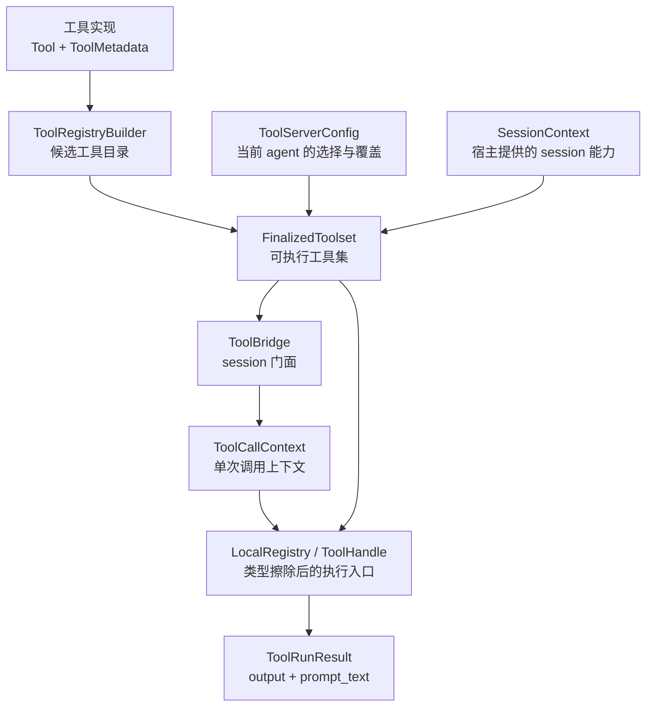
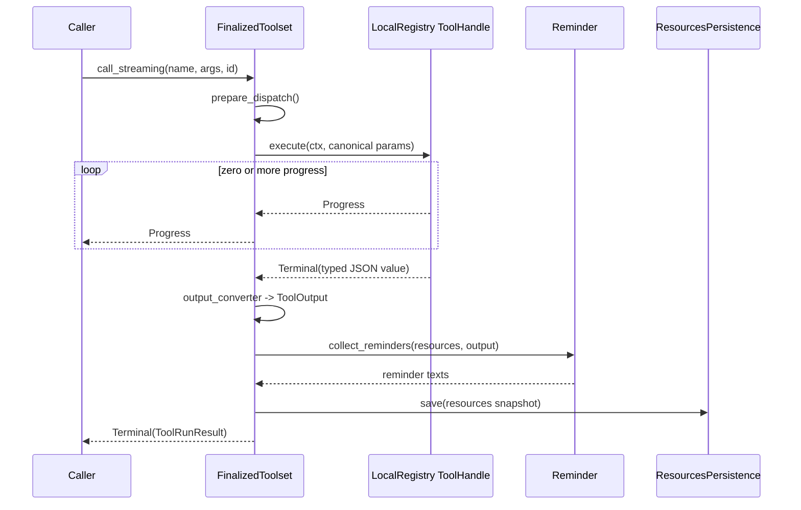

# ToolBridge、工具注册表与 Resources：工具依赖、注册与执行

本文研究 Grok Build 的工具系统内部结构：一个 Rust 工具实现如何进入候选目录，如何由 agent 配置挑选并 finalize，如何获得当前 session 的文件系统、终端、工作目录和状态，又如何在一次模型 tool call 中完成参数改名、动态派发、流式进度、提醒注入和状态持久化。

前置阅读：[工具从注册到执行](../02-runtime-flows/04-tool-execution.md)、[ACP 与 MCP](../02-runtime-flows/09-acp-and-mcp.md)、[会话持久化](../02-runtime-flows/11-persistence.md)和[状态所有权](01-state-ownership.md)。前置文章回答端到端链路；本文专门拆开 `ToolBridge`、`ToolRegistryBuilder`、`FinalizedToolset`、`Resources` 和 `ToolCallContext` 的职责。

## 先记住结论

1. `ToolBridge` 是 session 面向工具系统的门面，不是所有工具逻辑和状态的真正存放处。
2. 工具系统有两个明显阶段：`ToolRegistryBuilder` 收集二进制中“可用的候选实现”；`FinalizedToolset` 只保留当前 agent 配置“实际启用的工具”。
3. `SessionContext` 是宿主传入工具层的强类型边界；finalize 会把其中的能力转换成 `Resources` 条目。
4. `Resources` 是按 Rust `TypeId` 索引的异构依赖容器。工具按类型取得 `FileSystem`、`Terminal`、`Cwd`、配置或状态，而不依赖 shell 的 `SessionActor`。
5. `Params<T>` 表示配置，`State<T>` 表示运行时状态。即使内部的 `T` 相同，两个 wrapper 也有不同 `TypeId`，可以同时存在。
6. 并非所有 resource 都会落盘。只有调用 `register_params` 或 `register_state` 登记过的类型才参加 JSON 序列化；`Cwd`、backend handle 等临时能力不会被序列化。
7. `ToolMetadata` 描述工具的语义；`xai_tool_runtime::Tool` 描述工具的类型化输入、输出和执行逻辑。两者共同构成一个可注册工具。
8. fully-qualified ID、registry ID、client-facing name 和 `ToolKind` 是四个不同概念。把它们混为一个 name，是阅读工具代码时最常见的误区。
9. finalize 不只是“把 Vec 冻结”：它会校验 requirements、合并参数、解析行为版本、建立名字映射、生成模型可见 JSON Schema、注册本地 dispatch handle、恢复状态和启动 scheduler。
10. 每次调用都会新建 `ToolCallContext`。session 级资源共享在 `SharedResources` 中，call ID、cwd override、cancellation、behavior version 等调用级信息进入 `extensions`。
11. dispatch 前把 client 参数名反向映射为 canonical Rust 字段名；工具定义对模型暴露的 schema 则在 finalize 时做正向改名。
12. 工具的 terminal output 有两种视图：干净的结构化 `ToolOutput` 用于协议/UI/追踪，追加 system reminder 后的 `prompt_text` 用于回注模型上下文。
13. streaming 与非 streaming 调用共用 `finalize_output`，因此 reminder、输出格式和持久化不会因调用模式不同而漂移。
14. MCP 工具是在 finalize 后动态注册的少数例外；`FinalizedToolset.tools` 用 `RwLock` 支持少量写入，正常 dispatch 的读锁不会跨 `.await`。
15. cancel 路径需要独立访问 terminal，因此 `ToolBridge` 额外保存一份 `Arc<dyn TerminalBackend>`，避免取消被工具资源路径阻塞。

## 一、先建立五层心智模型



这五层分别回答不同问题：

| 层 | 回答的问题 | 生命周期 |
| --- | --- | --- |
| 工具实现 | 这个工具如何解析输入、执行并产生输出？ | 代码/进程级 |
| builder | 当前二进制知道哪些候选工具？ | agent build 期间 |
| finalized toolset | 当前 agent 实际允许哪些工具，叫什么，参数如何映射？ | session/agent 级 |
| shared resources | 工具共同使用哪些 session 能力和可变状态？ | session 级 |
| call context | 本次调用的 ID、取消 token、cwd override 和行为版本是什么？ | 单次 tool call |

`ToolBridge` 把后三层包装成 shell 和 agent 容易使用的 API。

## 二、为什么工具不直接依赖 `SessionActor`

shell 的 `SessionActor` 拥有 prompt 队列、turn、ACP attachment 和会话调度。如果每个工具都接收完整 actor：

- `xai-grok-tools` 会反向依赖 shell；
- 单元测试必须构造一整个 session；
- 同一个工具很难在 gRPC tool server、subagent 或独立 harness 中复用；
- 工具能接触超过自身需要的状态，ownership 边界变模糊。

当前设计采用依赖注入：宿主只把工具实际需要的能力放入 `Resources`，工具再按类型取用。例如文件编辑工具通常只取：

```text
FileSystem
NotificationHandle
Cwd
Params<EditParams>
```

而命令工具会取：

```text
Terminal
SessionFolder
SessionEnv
NotificationHandle
Params<BashParams>
```

这里的控制反转不是复杂框架：核心就是“工具不主动构造 backend，宿主在 finalize 时提供，工具从类型容器中取出”。

## 三、一个工具由两个 trait 组成

`crates/codegen/xai-grok-tools/src/types/tool_metadata.rs` 的模块说明把工具拆成：

1. `xai_tool_runtime::Tool`
2. `xai_grok_tools::types::tool_metadata::ToolMetadata`

### `Tool` 负责执行契约

它定义：

- 工具 ID；
- 类型化 `Args`；
- 类型化 `Output`；
- `run` 或 streaming run 的实际实现。

注册时，`T::Args` 必须可从 JSON 反序列化并可生成 JSON Schema；`T::Output` 必须可序列化、反序列化并转换为统一 `ToolOutput`。

### `ToolMetadata` 负责 Grok Build 语义

三个核心方法是：

- `kind()`：它属于 read、edit、search、execute 等哪类能力；
- `tool_namespace()`：它来自 GrokBuild、Codex、OpenCode、MCP 等哪个命名空间；
- `description_template()`：给模型看的描述模板。

默认方法还提供：

- 是否只读；
- 可能发送哪些 notification；
- finalize 前要满足什么 requirement；
- 不同 behavior contract 下如何生成定义；
- schema 和描述中的参数名如何改写。

因此，`Tool` 解决“怎么跑”，`ToolMetadata` 解决“在这个 agent 系统里它意味着什么”。

## 四、`ToolRegistryBuilder` 是候选目录，不是启用列表

`ToolBridge::get_builder()` 调用 `ToolRegistryBuilder::new()`。`new()` 注册大量内置实现以及跨工具 reminder。这代表“当前二进制知道它们”，不代表每个 agent 都会向模型暴露它们。

### 注册无配置工具

`register::<T>()` 最终调用：

```text
register_with_params::<T, ()>()
```

`()` 的 `ResourceType::ID` 为空，因此没有可持久化工具参数。

### 注册带配置工具

`register_with_params::<T, P>()` 在编译期知道具体 `T` 和 `P`，会捕获一组类型擦除 closure：

| closure/字段 | finalize 或执行时的作用 |
| --- | --- |
| `input_schema` | 从 `T::Args` 生成 canonical JSON Schema |
| `output_converter` | 把通用 JSON value 还原为 `T::Output`，再转成 `ToolOutput` |
| `validate_params` | 把配置 JSON 校验为 `P` |
| `apply_params` | 将有效配置写成 `Params<P>` |
| `register_params` | 登记 `Params<P>` 的序列化元数据 |
| `parse_input` | 把 JSON 输入解析为统一 `ToolInput` |
| `register_in_local` | 在 `LocalRegistry` 注册具体 `T` |

这是典型的“注册时保留类型知识，运行时使用类型擦除句柄”。运行时不需要对几十种工具写巨大 `match`。

### fully-qualified ID 在这里形成

builder key 由下面两部分拼出：

```text
{ToolNamespace}:{Tool::id()}
```

例如可能是：

```text
GrokBuild:list_dir
OpenCode:bash
Codex:apply_patch
```

它用于配置精确选择实现，不能直接假定等于模型调用时看到的名字。

## 五、四种“工具名字”必须分开

| 概念 | 示例/来源 | 用途 |
| --- | --- | --- |
| fully-qualified tool ID | `GrokBuild:list_dir` | builder/config 精确选择实现 |
| canonical tool ID | `Tool::id()` 返回值 | 实现自身的稳定标识 |
| client-facing name | 可能是 `list_dir` 或配置覆盖名 | 模型 schema 与 tool call 使用 |
| registry ID | `LocalRegistry` 查找 handle 的 key | 进程内 dispatch |
| `ToolKind` | `ListDir`、`Edit`、`Execute` | 按能力引用，而非按品牌/名字引用 |

内置工具中有些值相等，但动态 MCP、名字覆盖和多种实现存在时就不能依赖“恰好相等”。

### 为什么需要 `ToolKind`

prompt 模板不应硬编码 `grep`、`bash` 或 `list_dir`。它通过 `TemplateRenderer` 查询：

```text
tools.by_kind.search
tools.by_kind.execute
tools.by_kind.list
```

于是切换工具包或 client-facing alias 时，描述仍能引用当前真实名称。`ToolBridge::tool_for_kind` 也可回答“当前 agent 是否有执行某类任务的工具”。

### `ToolKind::Other`

无法映射到内建语义类别的工具，尤其动态 MCP 工具，可使用 `Other`。这是 forward-compatible fallback，不表示工具不能执行，只表示 kind 驱动的模板和只读推导无法获得更细语义。

## 六、`ToolServerConfig` 决定当前 agent 真正拥有什么

`xai-grok-agent/src/builder.rs` 中，agent build 大致执行：

```text
AgentDefinition.tool_config
    + memory/web/LSP/media/write 等能力门控
    + subagent allow/disallow 调整
    -> ToolBridge::finalize_builder(builder, tool_config, SessionContext)
```

这说明工具集合同时受三类信息影响：

1. agent definition 显式配置；
2. 宿主是否提供某种 backend/client；
3. 当前 agent/subagent 的能力约束。

例如没有允许的 subagent 类型时，task 相关工具会从配置移除；terminal 的 background 参数也可能被关闭。不能只搜索 `ToolRegistryBuilder::new()` 判断某工具是否可用。

## 七、finalize 实际做了什么

`ToolRegistryBuilder::finalize` 是工具系统最值得精读的函数之一。可按顺序理解为八个阶段。

### 1. 校验工具选择和 requirement

它检查：

- 配置引用的 fully-qualified ID 是否存在；
- 工具 requirements 是否被当前集合/参数满足；
- 不兼容实现是否同时启用；
- 参数 JSON 是否能反序列化并通过语义校验。

错误会汇总为 `RequirementError`，包含 tool、field path、expected、bad value 和 category 等定位信息。

### 2. 解析名字、参数名和 behavior contract

每个已配置工具可获得：

- client-facing name override；
- canonical 参数到 client 参数的映射；
- 默认参数与显式 override 合并后的 effective params；
- current 或 legacy behavior contract version。

behavior version 不是只改描述，它可以让工具实现选择历史算法或历史输出格式。`list_dir` 就保留 `legacy-0.4.10` 分支。

### 3. 建立 `TemplateRenderer`

renderer 保存 kind → name 以及参数映射，供：

- 工具描述模板；
- system reminder；
- 工具输出中的下一步建议；
- 工具内部需要提及自身参数名的文本。

`FinalizedToolset` 既把 renderer 放进 resources，也保留 `Arc<TemplateRenderer>` 字段。后者可在每次调用时无锁克隆进 `ToolCallContext`。

### 4. 用 `SessionContext` 初始化 resources

常见条目包括：

- `Terminal`
- `FileSystem`
- `Cwd`
- `SessionFolder`
- `SessionEnv`
- `NotificationHandle`
- 可选 `OwnerSessionId`
- skill、memory、web、LSP、media client
- subagent backend、event sender、depth、session ID

`SessionContext` 是公开、强类型的宿主边界；调用方不必知道内部 `TypeId` map 如何组织。

### 5. 注册可持久化资源类型并恢复旧状态

finalize 会登记若干 `State<T>`，例如：

- 已报告的 background task completion；
- todo state；
- web citation counter；
- cursor rules on-read tracker；
- scheduler state。

它也为启用工具登记 `Params<P>`。随后 `ResourcesPersistence` 从 session state path 旁的 `resources_state.json` 恢复已登记值。

### 6. 只实例化启用工具

对配置中的每个工具：

- 应用 effective params；
- 生成版本化、参数感知的 definition；
- 把具体实现注册进 `LocalRegistry`；
- 构造 `FinalizedTool`。

因此 local registry 只含当前配置启用的内置工具，而不是 builder 的全部候选项。

### 7. 过滤 reminder 并发布 enabled-name 投影

reminder 自己也有 requirement expression。只有当前工具集合支持其依赖时才进入 finalized set。系统还插入 `EnabledNativeToolNames`，让 `use_tool` 等逻辑知道哪些 native 工具实际存在。

### 8. 建立 scheduler 生命周期

顶层 session 可启动自己的 scheduler actor；child session 可复用 parent scheduler handle。scheduler cancel token 因而也是 `FinalizedToolset` 生命周期的一部分。

## 八、`FinalizedToolset` 为什么还需要锁

核心字段可以分成四组：

| 分组 | 字段 | 特点 |
| --- | --- | --- |
| 工具目录 | `RwLock<Vec<FinalizedTool>>` | 高频读、低频动态写 |
| session 依赖/状态 | `SharedResources` | Tokio mutex 下的异构容器 |
| 执行设施 | `LocalRegistry`、renderer | dispatch 和名字解析 |
| 后处理/生命周期 | reminders、persistence、scheduler cancel | 输出加工与清理 |

工具目录不能完全 immutable，是因为 MCP server 连接后会动态发布工具，断开或刷新时又要注销。`parking_lot::RwLock` 允许普通调用并发读取，MCP 更新偶尔写入。

源码明确保证：`prepare_dispatch` 只在很短的同步区间里查找并 clone 所需数据，read guard 返回前已经释放，不会跨 `.await`。

## 九、`Resources` 是什么

`Resources` 的数据结构本质是：

```text
HashMap<TypeId, Box<dyn Any + Send + Sync>>
```

它是一个异构 map：同一张表可保存不同 Rust 类型，key 不是字符串而是类型身份。

### 常用 API

| API | 语义 |
| --- | --- |
| `get::<T>()` | 可选读取，不存在返回 `None` |
| `require::<T>()` | 必需读取，不存在返回 `missing_resource` ToolError |
| `get_mut::<T>()` | 可选可变读取 |
| `get_or_default::<T>()` | 不存在时插入默认值，再返回可变引用 |
| `insert(value)` | 按 value 的具体类型插入或覆盖 |
| `remove::<T>()` | 删除并取回该类型 |
| `contains::<T>()` | 判断该类型是否存在 |

### 为什么不按字符串读取

类型 key 让工具可以写：

```rust
let fs = resources.require::<FileSystem>()?.0.clone();
```

而不是：

```text
get("filesystem") -> JSON -> 手工检查 shape -> downcast
```

拼写错误和类型不匹配因此尽量在编译期或明确的 downcast 边界暴露。

### `SharedResources`

共享形式是：

```text
Arc<tokio::sync::Mutex<Resources>>
```

`Arc` 让多个工具调用、reminder 和 session 层共享 ownership；Tokio mutex 保护容器内可变数据。

## 十、锁的正确使用：取出 handle，再 await

resource mutex 不应包住耗时 I/O。常见安全模式是：

```rust
let fs = {
    let res = resources.lock().await;
    res.require::<FileSystem>()?.0.clone()
};

// resource guard 已释放
let content = fs.read(...).await?;
```

许多 resource 本身是轻量 wrapper 内的 `Arc<dyn Backend>`，正适合先 clone 后释放锁。

如果工具持有 resource guard 再等待 terminal、网络、文件系统或另一个需要 resources 的 future，可能造成：

- 其他工具状态读取被长时间阻塞；
- reminder 无法完成；
- cancel/cleanup 路径等待；
- 更隐蔽的锁顺序死锁。

因此要区分“容器锁”与“backend 自身并发控制”。容器锁只保护查表和短小状态修改。

## 十一、`Params<T>` 与 `State<T>` 为什么必须有 wrapper

假设某个内部类型 `EditConfig` 既想表示启动配置，又想表示运行期更新后的状态。如果直接以 `T` 为 key，同一个 `TypeId` 只能保存一份。

wrapper 后：

```text
TypeId::of::<Params<EditConfig>>()
!=
TypeId::of::<State<EditConfig>>()
```

### 语义区别

| wrapper | 含义 | 典型写入者 | 是否可能持久化 |
| --- | --- | --- | --- |
| `Params<T>` | 工具配置/选项 | finalize、SetToolOptions | 登记后是 |
| `State<T>` | 工具运行时累积状态 | 工具、reminder、scheduler | 登记后是 |
| 裸类型 resource | backend、当前 session handle、临时投影 | 宿主/session | 通常否 |

`get_or_default::<State<T>>()` 很适合 lazy state：只有真正调用功能时才创建。

## 十二、类型 key 与持久化 string key 是两套身份

内存访问用 `TypeId`，但 `TypeId` 不能作为稳定磁盘格式。需要持久化的内部类型实现 `ResourceType`：

```text
namespace.Name
```

例如：

```text
grok_build.ListDir
grok_build.Todo
```

`register_resource!` 宏生成这个稳定 `ID`。

### `register_*` 与 `insert` 不是一回事

- `insert`：当前内存里有一个值；
- `register_params/register_state`：系统知道如何把该类型序列化、反序列化，以及放到哪个 JSON category/key。

只 insert 未登记的 resource 是 ephemeral，在 `Resources::serialize()` 时被静默跳过。

### 磁盘形状

```json
{
  "params": {
    "grok_build.ListDir": {
      "max_output_chars": 10000
    }
  },
  "state": {
    "grok_build.Todo": {
      "items": []
    }
  }
}
```

加载时，未知 string key 会被忽略；文件中缺失的类型不会凭空覆盖当前值。这样新旧版本之间可做有限度的 forward/backward tolerance。

## 十三、resource 持久化不等于完整 session 持久化

`ResourcesPersistence` 只负责工具资源快照。它采用：

- background writer；
- unbounded command channel；
- debounce；
- 临时文件加 atomic rename；
- save、save-and-flush、flush 三类命令。

每次成功取得 terminal tool output 后，`finalize_output` 会对当前 resources 做 snapshot 并调用非阻塞 `save`。

但 conversation history、notification journal、session metadata 和 prompt queue 属于其他持久化通道。看到 `resources_state.json` 不能推断“整个会话都在这里”。

## 十四、`SessionContext` 是宿主到工具层的窄腰

agent builder 调用 `ToolBridge::finalize_builder` 时构造 `SessionContext`。字段虽然多，但有清晰分类：

| 类别 | 示例 |
| --- | --- |
| 基础 I/O | terminal backend、async filesystem、cwd |
| session 环境 | folder、env、owner session ID |
| 事件 | tool notification handle、attribution callback |
| 可选能力 | memory、web、LSP、image/video、deploy、auth |
| 子系统共享 | subagent resources、parent scheduler handle、skills |
| 持久化 | state path |

这比让 builder 自己从全局 singleton 找依赖更容易测试，也更适合顶层 agent、subagent、server harness 使用不同实现。

## 十五、shell 的 `ToolContext` 与工具层 `Resources` 不同

`xai-grok-shell/src/tools/tool_context.rs` 中还有一个 `ToolContext`，包含 gateway、ACP session ID、fs、terminal、cwd、hunk tracker、subagent event sender、monitor buffer、blocking wait state 等。

它是 shell/session 侧的运行上下文集合，不是 `xai_tool_runtime::ToolCallContext`，也不是 `Resources` 本身。

可以这样区分：

```text
shell ToolContext
    = shell 构造 agent、重建 agent、协调 turn 时持有的依赖集合

SessionContext
    = finalize API 明确接受的工具 session 能力

Resources
    = finalize 后工具实际共享的类型容器

runtime ToolCallContext
    = 单次 tool call 的临时 envelope
```

同名的“context”不表示相同抽象。阅读时先看 crate 路径。

## 十六、一次调用的 pre-dispatch

`FinalizedToolset::prepare_dispatch` 在任何 `.await` 之前完成同步准备。

### 第一步：按 client-facing name 查找

它从 `tools.read()` 中找到 `FinalizedTool`，clone：

- `registry_id`
- `output_converter`
- `reverse_params`

随后立即释放 read guard。

### 第二步：反向改写参数

模型使用 client schema 中的参数名，而 Rust `Args` 只认识 canonical 字段名。因此：

```text
client JSON keys
    -- reverse_params --> canonical JSON keys
        -- serde --> T::Args
```

正向映射发生在 definition/schema 生成时，反向映射发生在 dispatch 前，两者必须来自同一份配置。

### 第三步：建立 call identity

传入 call ID 若能构造 `ToolCallId` 就保留；否则生成新的 UUID v7 ID。这一 ID 会贯穿 progress、notification 和结果关联。

### 第四步：填充 extensions

`ToolCallContext.extensions` 至少可能含：

- `SharedResources`
- `Arc<TemplateRenderer>`
- `InvokingToolParamNames`
- 可选 per-call `Cwd`
- 可选 `CancellationToken`
- 可选 `BehaviorVersion`
- `InnerDispatch`
- 可选 `WorkspaceViewerContext`

extensions 是按类型取值的调用级扩展袋，与 session 级 Resources 的设计相似，但生命周期更短。

### 第五步：找到 LocalRegistry handle

系统用 `registry_id` 构造 `ToolId`，从 `LocalRegistry` 得到类型擦除 `ToolHandle`。真正执行发生在：

```text
lr_handle.execute(ctx, canonical_params)
```

## 十七、为什么还要 `InnerDispatch`

某些元工具不是自己完成所有业务，而是选择并调用另一个工具。例如 `use_tool` 需要在同一 finalized toolset 内再次派发。

把 `InnerDispatch` 放入 call extensions，元工具可以复用：

- 当前启用工具集合；
- 名字和参数映射；
- resources；
- 标准执行/错误路径。

它不需要持有具体 `FinalizedToolset` 类型，也不需要通过 shell 绕一圈。

需要特别防范的是递归和权限语义：新增元工具时，应核对 inner call 是否继承 cancellation、cwd、行为版本和审批准入，而不是只确认“能调用成功”。

## 十八、工具如何从 call context 取得 session 依赖

`tool_metadata::shared_resources(ctx)` 从 extensions 中提取 `SharedResources`。缺失时返回：

```text
missing_resources
```

工具随后锁住容器并 `require::<T>()`。必需 resource 缺失返回：

```text
missing_resource: missing required resource: <Rust type name>
```

工作目录有两级优先级：

1. call extension 中的 per-call `xai_tool_runtime::Cwd`；
2. shared resources 中的 session `Cwd`。

这使独立调用、workspace viewer 或测试可覆盖 cwd，而不修改整个 session 的共享 cwd。

## 十九、用 `list_dir` 看新架构工具

`implementations/grok_build/list_dir/mod.rs` 的模块注释明确说明：新实现从 Resources 读 `Cwd`，从自己的 `Params<ListDirParams>` 读 `max_output_chars`，不再接收庞大的 shell ToolContext。

它展示了几个关键模式：

1. `ListDirInput` 是模型输入，派生 `Deserialize` 和 `JsonSchema`。
2. `ListDirParams` 是宿主配置，不是模型每次调用输入。
3. `register_resource!("grok_build", "ListDir", ListDirParams)` 给参数稳定持久化 ID。
4. behavior version 可以切换 current 与 legacy 算法。
5. 输出提示通过 `TemplateRenderer` 引用当前真实 list/search/execute 工具名。

模型输入和工具配置是两个通道：不能因为 `max_output_chars` 影响行为，就自动把它暴露给模型。

## 二十、用 `bash` 看 backend clone 模式

OpenCode bash 工具会从 resources 取得：

- `Terminal`
- `SessionFolder`
- `SessionEnv`
- `NotificationHandle`
- truncation/config resource

这些 handle 在短临界区内 clone，实际命令执行发生在 resource lock 外。终端 backend 自己负责进程、foreground/background task 和取消语义。

这说明 `Resources` 是依赖定位器，不是执行所有 I/O 的“大锁”。

## 二十一、streaming 与非 streaming 如何共享语义

`call_with_cancellation` 本身会消费 streaming sibling：

- progress item 被跳过；
- 第一个 terminal item 返回；
- stream 若无 terminal，生成 `stream_no_terminal` 错误。

`call_streaming_with_cancellation` 则原样向外转发每个 progress。收到成功 terminal value 后，进入统一 `finalize_output`。



统一 tail 是重要不变量：若以后新增审计、引用计数或输出清洗，应优先放到公共 terminal tail，而不是只改一个调用入口。

## 二十二、`ToolOutput` 与 `prompt_text` 为什么分开

`ToolRunResult` 保存：

- `output: ToolOutput`
- `prompt_text: String`
- 可选 `effective_tool_name`

`ToolBridgeResult` 进一步向 session 暴露前两个核心字段。

### 干净结构化输出

`ToolOutput` 用于：

- JSON 序列化；
- ACP tool update；
- hunk tracking；
- UI 按类型呈现；
- 程序化检查。

### prompt-ready 文本

`prompt_text` 先由 `output.to_prompt_format()` 产生，再追加 reminders，并包进配置的 system reminder tag。它面向下一次模型采样。

如果把 reminder 直接写入结构化 output，UI 和协议消费者会把模型控制信息误当成工具业务结果；如果只保留结构化 output，模型又收不到重要的下一步约束。

## 二十三、Reminder 是跨工具的后处理规则

`Reminder` 可以在每次成功工具 terminal 后检查：

- 统一 `ToolOutput`；
- `SharedResources` 中的状态；
- 当前 finalized name/param mapping。

典型用途包括：

- LSP diagnostics；
- background task completion；
- skill discovery；
- task completion workflow 提示。

reminder 不是 notification。notification 是给客户端/宿主的事件；reminder 是注入模型上下文的控制文本。某些业务事件可能同时影响两者，但传输目标不同。

`SystemRemindersEnabled` resource 可关闭 reminder 收集。关闭时工具原始 `prompt_text` 仍会生成，只是不附加跨切面提醒。

## 二十四、取消为何在 `ToolBridge` 保存独立 terminal

`ToolBridge` 字段是：

```text
registry: Arc<FinalizedToolset>
terminal: Option<Arc<dyn TerminalBackend>>
```

terminal 原本也在 Resources 中。finalize 后又取出 clone 放在 bridge 上，是为了 cancel 快路径可直接执行 foreground kill，而不必先穿过 shared resource lock 或正在进行的工具状态路径。

源码注释仍以“registry lock”概括这个动机；当前 `FinalizedToolset` dispatch 已明确避免持有工具目录 read guard 跨 `.await`。应把稳定设计意图理解为：取消所需的 process-control handle 不应依赖普通工具调用的锁和后处理链。

cooperative cancellation token 与 kill foreground 是互补关系：

- token 让愿意配合的工具主动停止；
- terminal kill 处理已经运行的外部进程。

## 二十五、MCP 动态工具为什么是例外

MCP server 连接、能力刷新或断开都发生在 agent/session 已 finalize 之后。因此动态工具不能走完整 builder finalize 流程。

`register_tool` 的行为包括：

- 检查 client name 是否冲突；
- 接受远端提供的 JSON Schema override；
- 使用 MCP namespace 和通常为 `Other` 的 kind；
- 在 `LocalRegistry` 注册 runtime adapter；
- 向 locked finalized tools vector 追加 definition。

与内置工具相比，动态 MCP 工具通常：

- name 同时作为 canonical/client-facing name；
- 没有 param remapping；
- 没有 managed behavior contract；
- schema 来自远端，不能由本地 Rust Args 推导；
- 生命周期由 MCP server/prefix 管理。

`tool_definitions_builtins_only` 明确排除 MCP 工具，适合需要稳定 native capability 清单的调用方。

## 二十六、agent rebuild 为什么要重新注入 live resources

修改 agent definition 或 tool config 可能重建 Agent，也就重建 ToolBridge/FinalizedToolset/Resources。静态 `SessionContext` 能重新构造大部分依赖，但 session 已运行后产生的一些 live handle 不能简单从 definition 恢复。

shell 的 agent rebuild 路径会把当前值重新插入新 resources，例如：

- subagent backend/event/depth/session ID；
- wait state、monitor buffer；
- `RespectGitignore`、path-not-found hints；
- user question sender；
- scheduler background-loop 配置；
- 当前客户端或 feature-specific handle。

这形成一个维护风险：新增由 shell 注入的 ephemeral resource 时，必须同时检查 initial build、subagent build 和 agent rebuild。否则功能可能首次可用，但改变配置后突然报 `missing_resource`。

## 二十七、session 在 turn 期间还会更新 resource 投影

Resources 不全是 finalize 后永远不变的。session 会根据 turn 更新某些投影，例如：

- 当前 prompt ID；
- attached images；
- goal loop active gate；
- tool override 或当前 client 相关资源。

这些字段通常是其他权威状态的镜像，而非 ownership source。例如 queue/running ownership 仍在 SessionActor state；`CurrentPromptIdResource` 只是让工具读取当前 prompt identity。

修改这类资源前要问：

1. 权威状态在哪里？
2. mirror 在什么时刻更新和清理？
3. cancel、stale completion、rebuild 是否也同步？

## 二十八、常见误读

### 误读 1：builder 里注册了，所以模型一定能调用

错误。builder 是候选目录；必须检查 `ToolServerConfig`、requirements 和 finalized definitions。

### 误读 2：工具 ID 就是模型看到的 name

错误。client-facing name 可覆盖，MCP 还可能使用不同 registry ID。

### 误读 3：所有 Resources 都会写进 `resources_state.json`

错误。只有登记过的 `Params<T>`/`State<T>` 参加序列化。

### 误读 4：`Params<T>` 是模型 tool call 参数

错误。模型调用参数是 `T::Args`；`Params<P>` 是宿主配置通道。

### 误读 5：持有 resources lock 执行 I/O 更安全

错误。应 clone backend handle 后释放容器锁；长时间持锁会扩大阻塞和死锁风险。

### 误读 6：notification 和 reminder 是同一种输出

错误。notification 面向客户端，reminder 面向模型下一轮上下文。

### 误读 7：重建 agent 只需重跑 builder

错误。运行中注入的 ephemeral handles 和 mirrors 需要重新接入。

### 误读 8：非 streaming 调用完全走另一条实现

错误。非 streaming 会消费 streaming API，并共享 terminal finalization。

## 二十九、新增一个内置工具的检查清单

### 类型与 metadata

- 为 `Args` 派生 serde deserialize 和 `JsonSchema`。
- 为 `Output` 提供到 `ToolOutput` 的转换。
- 实现 `Tool::id` 与执行逻辑。
- 实现正确的 `ToolKind`、`ToolNamespace`、description template。
- 正确声明 read-only、notification tags 和 requirements。

### 配置与状态

- 区分模型输入 `Args`、宿主配置 `Params<P>`、运行态 `State<S>`。
- 对可持久化 `P/S` 使用稳定且唯一的 `register_resource!` ID。
- 在 builder 使用 `register` 或 `register_with_params`。
- 若 state 需恢复，确保 finalize 路径调用 `register_state::<S>()`。

### 执行

- 从 call context 提取 SharedResources。
- 必需能力用 `require`，可选能力用 `get`。
- clone handle 后释放 resource guard，再执行 `.await`。
- 传播 cancellation 和 tool call ID。
- progress stream 最终必须产生恰好一个 terminal。

### 集成

- 把 fully-qualified ID 加入合适的 agent tool config/preset。
- 核对 client name 和 param rename 后的 schema。
- 若描述提及其他工具，使用 `TemplateRenderer` kind lookup。
- 核对 permission、notification、hunk tracking 和 reminder。
- 核对 subagent 和 agent rebuild 是否需要额外 resource 注入。

## 三十、调试顺序

### 模型根本看不到工具

依次检查：

1. builder 是否 `has_tool_id`；
2. agent definition 的 tool config 是否包含正确 fully-qualified ID；
3. capability gate 是否把它移除；
4. requirement 是否失败；
5. `tool_definitions()` 是否有 client-facing definition；
6. MCP 工具是否在 definition snapshot 后才动态注册。

### 模型能看到但调用报 not found

检查：

1. client name 是否能在 finalized vector 找到；
2. `registry_id` 是否在 LocalRegistry；
3. 动态 MCP refresh 是否只更新一侧；
4. unregister prefix 是否误删；
5. agent rebuild 后 caller 是否还持有旧 ToolBridge。

### 参数反序列化失败

检查：

1. definition schema 显示的 client key；
2. `reverse_params` 是否正确；
3. canonical `Args` 字段和 serde rename；
4. behavior version 是否生成不同 schema；
5. MCP schema 是否与 runtime adapter 预期一致。

### `missing_resource`

检查：

1. 该能力应来自 `SessionContext` 还是 shell 后注入；
2. 顶层、subagent、test harness 是否都插入；
3. agent rebuild 是否重新插入；
4. 读取的是裸类型、`Params<T>` 还是 `State<T>`；
5. 测试是否通过 `test_ctx(resources)` 安装 SharedResources。

### 状态重启后丢失

检查：

1. 是否只 `insert(State(...))` 而没 `register_state`；
2. `ResourceType::ID` 是否变化或冲突；
3. `state_path` 是否指向预期 session 目录；
4. terminal success 是否走到 `finalize_output`；
5. session close 前是否需要显式 flush；
6. JSON shape 和 serde 类型是否仍兼容。

## 三十一、推荐源码阅读顺序

1. `crates/codegen/xai-grok-tools/src/bridge.rs`
2. `crates/codegen/xai-grok-tools/src/types/tool_metadata.rs`
3. `crates/codegen/xai-grok-tools/src/types/resources.rs`
4. `crates/codegen/xai-grok-tools/src/registry/types.rs` 中的 `ToolEntry`、`FinalizedTool`、`FinalizedToolset`
5. 同文件的 `register_with_params`、`finalize`、`prepare_dispatch`、`finalize_output`
6. `crates/codegen/xai-grok-tools/src/persistence.rs`
7. `crates/codegen/xai-grok-agent/src/builder.rs` 的 ToolBridge 构造段
8. `crates/codegen/xai-grok-shell/src/tools/tool_context.rs`
9. `implementations/grok_build/list_dir/mod.rs`
10. `implementations/opencode/bash/mod.rs`
11. MCP 动态 register/unregister 调用点
12. shell 的 agent rebuild resource re-injection

先读一个无副作用工具和一个 terminal 工具，再读复杂 task/use_tool 工具，能更快识别基础设施与业务逻辑的边界。

## 三十二、可执行验证

### 搜索关键符号

```sh
rg "struct ToolBridge|struct FinalizedToolset|struct ToolRegistryBuilder" \
  crates/codegen/xai-grok-tools/src

rg "register_with_params|prepare_dispatch|finalize_output" \
  crates/codegen/xai-grok-tools/src/registry/types.rs

rg "register_state|register_params|ResourcesPersistence" \
  crates/codegen/xai-grok-tools/src
```

### 定向测试建议

```sh
cargo test -p xai-grok-tools resources
cargo test -p xai-grok-tools prepare_dispatch
cargo test -p xai-grok-tools persistence
```

测试时优先使用 `tool_metadata::test_ctx` 或 `test_ctx_with_call_id`。它们会把 SharedResources 和默认 streaming gate 插入 runtime ToolCallContext，避免每个工具复制测试上下文样板。

### 建议的小实验

1. 给某工具配置 client name 和一个参数别名，打印 definition schema，再观察 dispatch 收到的 canonical JSON。
2. 在 Resources 中插入一个裸 `Cwd`、一个登记的 `Params<P>` 和一个登记的 `State<S>`，比较 serialize 输出。
3. 构造缺少 `FileSystem` 的 test context，观察 `missing_resource` 错误。
4. 调用 streaming 工具，记录 progress 与 terminal 数量，验证 terminal 只出现一次。
5. 注册一个动态 MCP fake tool，再比较 `tool_definitions` 与 `tool_definitions_builtins_only`。

## 三十三、阅读后自测

1. 为什么 `ToolRegistryBuilder::new()` 里的工具不等于当前模型能调用的工具？
2. fully-qualified ID、client-facing name、registry ID、`ToolKind` 各由谁消费？
3. 为什么注册时要保存 output converter 和 params applier closure？
4. `SessionContext`、shell `ToolContext`、runtime `ToolCallContext` 有什么区别？
5. `Params<T>` 为什么不是 `T::Args`？
6. `insert(State<T>)` 后为什么仍可能无法持久化？
7. per-call cwd 为什么应放 extensions，而不是覆盖 session Cwd？
8. `prepare_dispatch` 为什么必须在 `.await` 前释放 tools read guard？
9. 为什么 `ToolOutput` 和 `prompt_text` 不能合成一个字段？
10. reminder 与 notification 的接收者分别是谁？
11. MCP 工具为何不能完全复用内置工具的 finalize 路径？
12. agent rebuild 后最容易遗漏哪类 resource？
13. cooperative cancellation 与 terminal kill 分别解决什么问题？
14. 一个工具可见但调用 not found，最可能是哪两个目录不同步？
15. 如果新增后处理逻辑，为什么应放到 shared `finalize_output`？

## 本篇术语表

| 名词 | 白话解释 | 在本篇中的准确含义 |
| --- | --- | --- |
| bridge / 门面 | 给复杂内部系统提供较简单入口 | `ToolBridge` 把 finalized toolset 暴露给 agent/session，并提供 cancel、definition、resource 辅助 API |
| registry | 保存“名字到实现/metadata”关系的目录 | 本文可能指 builder 候选目录或 LocalRegistry 执行目录，会注明具体类型 |
| toolset | 一组工具 | `FinalizedToolset` 特指经当前配置筛选、可直接执行的 session 级工具集合 |
| finalize | 把声明和环境解析成运行时对象 | 校验、合并配置、生成 schema、注入资源、恢复状态并注册 dispatch handle 的完整阶段 |
| IoC | 控制反转 | 工具不自己构造文件系统/终端，而由宿主提供并从 Resources 取得 |
| dependency injection / DI | 把依赖从外部传给对象 | `SessionContext -> Resources -> ToolCallContext` 是本工具系统的依赖注入路径 |
| resource | 工具可能需要的一项类型化能力或状态 | 如 `FileSystem`、`Cwd`、`Params<BashParams>`、`State<TodoState>` |
| heterogeneous container | 同一容器可存放不同类型的值 | `Resources` 用 `TypeId` 和 `Any` 同时保存多种 Rust 类型 |
| `TypeId` | Rust 运行时的类型身份 | Resources 的内存 key；不是稳定磁盘格式 |
| `Any` | 支持运行时类型检查和 downcast 的 trait | Resources 用 `Box<dyn Any>` 擦除具体存储类型 |
| downcast | 从类型擦除值恢复为具体类型 | `get::<T>` 内部根据 TypeId 将 Any 转回 `T` |
| `Params<T>` | 配置 wrapper | finalize/option API 提供给工具的配置，不是模型本次调用 JSON |
| `State<T>` | 状态 wrapper | 工具运行中累积、可按登记规则持久化的状态 |
| ephemeral | 只在当前进程/session 生命周期中存在 | 未登记序列化的 backend handle、cwd、channel 等 resource |
| `ResourceType` | 为可序列化内部类型提供稳定 ID 的 trait | 用 `namespace.Name` 将 Rust 类型映射到 JSON key |
| serialization | 把内存值转换成可保存 JSON | 只有登记的 Params/State resource 参加 |
| type erasure | 隐藏具体泛型类型，统一保存/调用 | builder 捕获 closure，LocalRegistry 暴露统一 ToolHandle |
| closure | 可捕获环境的函数值 | 注册时 closure 记住具体 `T/P`，运行时完成解析、转换和注册 |
| metadata | 描述一个对象的附加信息 | `ToolMetadata` 提供 kind、namespace、description、requirements 等工具语义 |
| JSON Schema | 描述 JSON 字段、类型和约束的结构 | 从 `T::Args` 生成并作为 model tool definition 的 input schema |
| canonical | 系统内部约定的标准形式 | canonical tool/param 名是 Rust 实现认识的名字 |
| client-facing | 对模型或协议客户端暴露的形式 | 可由配置改名的 tool name 和 input parameter name |
| name remapping | 在内部名和外部名之间转换 | schema 生成正向改写，dispatch 前反向改写 JSON keys |
| `ToolKind` | 与具体实现名无关的能力类别 | 用于模板、能力判断和默认只读属性，例如 Read、Edit、Execute |
| namespace | 避免不同工具包同名冲突的分组 | GrokBuild、Codex、OpenCode、MCP 等 |
| requirement expression | 描述启用条件的逻辑表达式 | finalize 时检查依赖工具、参数或能力是否满足 |
| behavior contract/version | 工具对外行为的版本约定 | 可选择 current 或 legacy schema、算法和输出兼容性 |
| `TemplateRenderer` | 根据 finalized 工具映射渲染模板的对象 | 把 `tools.by_kind.*` 和参数占位符替换成当前 client 名字 |
| dispatch | 根据名字把一次调用送给实现 | prepare context、解析 handle 并执行的过程 |
| `LocalRegistry` | 进程内的可执行工具句柄目录 | 只登记当前启用的实现及运行时 MCP adapter |
| `ToolHandle` | 类型擦除后的统一执行入口 | 接受 ToolCallContext 与 JSON，返回 streaming typed output |
| extension bag | 可按类型附加任意调用级信息的容器 | `ToolCallContext.extensions` 保存 resources、cancel、cwd override 等 |
| call ID | 一次工具调用的唯一身份 | 用于关联模型请求、progress、notification 和 terminal result |
| cancellation token | 可被触发、由执行逻辑协作检查的取消信号 | 通过 call extensions 传给工具 |
| cooperative cancellation | 被调用方主动响应取消 | 与强制杀掉外部 terminal 进程互补 |
| streaming | 执行中先产生多次进度，最后产生结果 | tool stream 包含若干 Progress 和一个 Terminal |
| terminal item | stream 的最终成功或错误项 | 不是 terminal shell；这里意为“流结束结果” |
| `ToolOutput` | 工具结果的统一结构化表示 | 用于 ACP、UI、JSON 和追踪 |
| `prompt_text` | 要回注给模型的工具结果文本 | 由 ToolOutput 格式化并追加 system reminders |
| reminder | 工具执行后注入模型上下文的规则提示 | 跨工具检查 output/resources 后生成，不是客户端 notification |
| notification | 发给 shell/ACP 客户端的结构化事件 | 例如进度、文件变更、terminal update |
| persistence | 把状态保存到进程外并恢复 | `ResourcesPersistence` 保存登记过的 resource JSON 快照 |
| atomic rename | 先写临时文件再一次性替换目标 | 降低崩溃时留下半个 JSON 文件的概率 |
| MCP dynamic tool | 外部 MCP server 在运行时提供的工具 | finalize 后注册，schema 来自远端，生命周期可动态变化 |
| native tool | 二进制内置并经普通 finalize 的工具 | 与运行时 MCP tool 相对 |
| rebuild | 配置变化后重新构造 Agent/ToolBridge | 需要把仍然有效的 live ephemeral resources 注入新 toolset |
| mirror / 投影 | 为消费者复制的一份状态视图 | 当前 prompt ID 等 resource 可能只是 SessionActor 权威状态的工具可读镜像 |

更多跨文档通用名词见[全局术语表](../appendices/glossary.md)。

