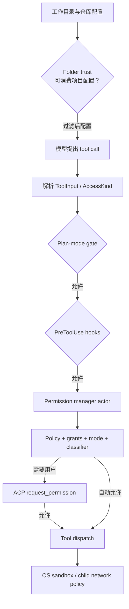

# 权限判定与审批状态机：Policy、用户交互、目录信任与 Sandbox

本文深入研究 Grok Build 如何决定一次工具调用能否执行。重点不是再次罗列安全配置，而是拆开 `prepare_tool_call`、`PermissionHandle` actor、policy preflight、auto classifier、ACP permission prompt、grant persistence、folder trust 和 OS sandbox 之间的状态转换与优先关系。

前置阅读：[权限、目录信任与 Sandbox](../02-runtime-flows/05-permission-and-sandbox.md)、[工具从注册到执行](../02-runtime-flows/04-tool-execution.md)、[ToolBridge、工具注册表与 Resources](04-tool-bridge-registry-and-resources.md)、[Prompt 队列与 Turn 调度](03-prompt-queue-and-turn-scheduling.md)。前置文章给出端到端概览；本文关注状态机、不变量、并发和失败语义。

## 先记住结论

1. “是否执行”不是一个函数返回的布尔值，而是多个 gate 顺序收窄能力后的结果。
2. folder trust、tool permission、plan-mode gate、pre-tool hook 和 sandbox 属于不同安全域；任何一个拒绝都足以阻止或限制动作。
3. `prepare_tool_call` 是 shell 工具执行前的总编排点：先解析输入，再检查 plan mode 和 hooks，之后才进入 permission actor。
4. permission manager 接收的是语义化 `AccessKind`，不是仅凭工具名称判断。
5. `PermissionHandle::Actor` 通过 mpsc 接收请求、用 oneshot 返回 `Decision`；channel 失效时 fail closed 为 `Reject`。
6. `Decision` 保留 `Allow`、`Ask`、`PolicyDeny`、用户 `Reject`、`Cancelled` 和 `FollowupMessage` 的差异，因为 tool loop 对它们的恢复方式不同。
7. policy deny 在 YOLO/always-approve 之前执行；managed-policy pin 还能禁止客户端启用 always-approve。
8. policy `Ask` 与解析失败产生的 fail-closed `Ask` provenance 不同：前者是明确规则，后者在 auto mode 下可交给 classifier 仲裁。
9. auto classifier 的 `Block` 并不总等价于同一种 deny。普通 block 可先作为 model-visible policy deny；某些 request floor 或 deferred Ask 的 block 必须转成人工 prompt。
10. bash 有硬 request floor：真实文件写入、危险/未验证环境、opaque shell 和间接执行风险会阻止普通自动批准；只有部分 floor 可先交 classifier。
11. sandbox active 可以成为 bash auto-allow 的一个证据，但不能覆盖 request floor、policy ask/deny 或 plan-mode gate。
12. 用户允许一次、session grant、持久化 grant、static allowlist、policy allow 和 YOLO 都可能得到 `Allow`，但作用域、优先级和审计来源不同。
13. permission prompt 是阻塞的 ACP reverse-request，不是 notification；它不会像普通 session event 那样持久化和重放。
14. `PendingInteractionGuard` 用 RAII 在 await 期间登记 `NeedsInput`，无论正常返回、取消还是错误，drop 都会清理。
15. 用户 `Reject` 通常终止本批剩余调用并形成 permission rejection；`PolicyDeny` 则把限制告诉模型并允许 agent 改方案继续。
16. 同一批 tool calls 先串行 prepare/审批，批准后才并发 dispatch；这样不会在某个请求被拒后继续弹出后续权限框。
17. plan mode 的编辑 gate 在 permission manager 之前，因此 `PermissionHandle::AllowAll`、YOLO 或 persisted grant 都无法绕过计划期写入限制。
18. folder trust 保护“是否消费仓库提供的可执行配置”；它不是对单次工具调用的批准，也不等价于 plugin trust。
19. sandbox 在进程启动时一次性、不可逆地应用；permission allow 不能扩大它，sandbox off 也不能自动批准工具。
20. requested sandbox profile 与 successfully active 必须分别观察；请求了隔离但未成功应用本身是需要保守处理的状态。

## 一、把安全链路看成能力逐层收窄



图中不存在“最强开关把其余层关掉”的关系。更准确的模型是：

```text
实际可执行能力
  = 已加载配置允许的能力
  ∩ plan/hook 允许的动作
  ∩ permission 决策允许的动作
  ∩ OS sandbox 最终允许的系统调用
```

这是 defense in depth：每层观察不同信息，也承担不同失败模式。

## 二、五个安全域分别保护什么

| 安全域 | 保护对象 | 决策时间 | 典型拒绝结果 |
| --- | --- | --- | --- |
| folder trust | 仓库提供的 MCP/LSP/hooks/policy/plugin path | 加载项目配置前 | 不加载项目 scope 能力 |
| plan-mode gate | 规划期间的写入纪律 | tool input 解析后 | tool 不执行，模型继续规划 |
| pre-tool hook | 组织或用户自定义的调用前规则 | permission 请求前 | `HookDenied` |
| permission | 这次动作是否符合用户/策略意图 | dispatch 前 | allow、deny、cancel、follow-up |
| sandbox | 进程/子进程真正能访问的 OS 资源 | 启动时应用、执行时强制 | EACCES/EPERM、网络拒绝 |

如果排查“为什么没执行”，必须先确定阻止来自哪一层。只搜索 permission log 会漏掉 plan gate、hook deny 或内核拒绝。

## 三、`prepare_tool_call` 是安全编排的入口

`crates/codegen/xai-grok-shell/src/session/acp_session_impl/tool_calls.rs` 中，`prepare_tool_call` 的主要顺序是：

```text
1. 提前向客户端注册 pending ToolCall
2. 必要时等待/刷新 MCP 工具状态
3. 解析 JSON arguments
4. ToolBridge::try_parse -> ToolInput
5. ToolInput -> AccessKind
6. plan_mode_edit_gate
7. 发送更精确的 tool-call start/update
8. 执行 server-side 和 client-side PreToolUse hooks
9. 对 plan file edit 做特定 auto-approve
10. PermissionHandle::request_with_path_context
11. 按 Decision 转换为 ToolLoop control result
12. 处理 exit_plan_mode 的独立 plan approval
13. 生成 PreparedToolCall
```

这个顺序有安全含义：

- 未解析的原始 JSON 不能直接拿去执行；
- plan mode 不依赖 permission mode；
- hook deny 不会先弹出一个无意义的用户审批框；
- permission UI 能获得解析后的 title、kind、raw input 和 meta；
- 只有所有 prepare gate 通过，调用才进入 dispatch 集合。

## 四、为什么先发送 pending ToolCall

函数一开始就向 ACP 客户端发送 `ToolCallStatus::Pending`，即使后面可能解析失败或被拒绝。

这样做使 UI 拥有稳定的 tool call ID，可以把后续状态关联到同一行：

```text
Pending
  -> refined title/kind/raw input
  -> waiting for permission
  -> running / completed / failed / denied
```

权限请求也携带这个 ID。若到 permission 阶段才第一次创建 UI 行，MCP 初始化等待、parse error 和 hook deny 会缺少统一可观察对象。

## 五、`ToolInput` 与 `AccessKind` 是不同抽象

`ToolInput` 保留工具执行需要的完整、具体输入；`AccessKind` 只保留安全决策需要的语义。

当前主要 `AccessKind`：

| 变体 | 保留的信息 | 为什么需要 |
| --- | --- | --- |
| `Read(Option<String>)` | 可选读取路径 | 路径 policy、deny glob |
| `Grep { path, glob }` | 搜索根和 glob | 同时判断目录和过滤范围 |
| `Edit(String)` | 修改目标 | 路径规则、protected target、plan gate |
| `Bash(String)` | 完整脚本 | shell 结构和副作用分析 |
| `MCPTool { name, input }` | 工具名和原始 JSON | classifier 不能只看名字 |
| `WebFetch(String)` | URL | domain grant 与网络意图 |
| `WebSearch(String)` | query | 搜索意图和策略 |

权限层无需知道 `ListDirOutput` 如何渲染，却必须知道 bash 的完整脚本和 MCP 的输入参数。这就是语义归一化的边界。

## 六、每个请求为什么要携带 `RequestPathContext`

`RequestPathContext` 包含：

- `real_cwd`
- 可选 `display_cwd`

共享 permission manager 可能服务父 session 和多个 subagent。它们能共享 grants 和 UI actor，却可能在不同目录执行。

路径必须按“提出请求的 session”解析：

```text
模型路径
  + request.real_cwd
  + optional display_cwd mapping
  -> 实际目标
  -> path policy / protected edit 判定
```

如果错误使用 manager 创建时的 cwd，可能把 child 的 `../`、symlink 或 display path 锚到父目录，造成误批或误拒。

## 七、plan-mode edit gate 是 permission 之前的硬边界

`plan_mode_edit_gate` 只在 plan mode active 时关心 `AccessKind::Edit`。

核心规则是：除允许的 plan file edit 外，编辑被拒绝。`apply_patch` 目前只能映射成占位 edit target，无法在 permission 前可靠知道所有 patch 文件，因此保守拒绝。

最重要的不变量：

```text
plan mode edit restriction
  does not depend on
PermissionHandle / YOLO / persisted grants
```

源码测试甚至用 `PermissionHandle::allow_all()` 验证 plan gate，确保“最宽权限模式”也不会放行普通编辑。

### plan file auto-approve

当 edit target 正是 plan file，`PlanModeTracker::should_auto_approve_edit` 同时用于：

- plan gate 的允许判断；
- 跳过普通 permission request。

共用 predicate 防止“gate 认为是 plan file，但 auto-approve 认为不是”或反向漂移。

## 八、PreToolUse hook 是另一条 deny 通道

permission 之前会执行：

1. 本地 hook registry 中的 `PreToolUse`；
2. 可选 client hook。

hook envelope 包含：

- resolved tool name；
- tool use ID；
- 截断后的 input；
- 是否截断；
- subagent type。

hook 返回 `Deny { reason, hook_name }` 时，tool loop 产生 hook-specific rejection。它不是 permission policy deny，telemetry 和 UI 应保留 hook 来源。

### folder trust 与 hooks

project-scoped agent 的 inline hooks 属于仓库控制的代码执行能力，必须通过 folder trust。内置/user/bundled agent 的 hook 来源不同，不应被 project trust 一刀切。

## 九、`PermissionHandle` 是 actor 边界

`PermissionHandle` 有两种形态：

```text
Actor { cmd_tx, yolo_state, auto_state, ... }
AllowAll
```

### `AllowAll`

它直接返回 `Decision::Allow`，常用于已明确绕过 permission 的内部场景和测试。但它仍然位于 plan gate、hook 和 sandbox 之后/之前的既定位置，不能绕过那些独立层。

### `Actor`

请求流程：

```mermaid
sequenceDiagram
    participant Session
    participant Handle as PermissionHandle
    participant Actor as Permission Manager Actor
    participant UI as ACP Client

    Session->>Handle: request_with_path_context(...)
    Handle->>Handle: InFlightGuard +1
    Handle->>Actor: PermissionCommand::Request
    Actor->>Actor: preflight / grant / mode / classifier
    opt user prompt required
        Actor->>UI: session/request_permission
        UI-->>Actor: selected / cancelled / followup
    end
    Actor-->>Handle: oneshot Decision
    Handle->>Handle: InFlightGuard drop -1
    Handle-->>Session: Decision
```

actor 让多个共享 handle clone 的请求汇聚到同一状态 owner，同时保留异步等待。

## 十、为什么 mpsc + oneshot 很合适

两种 channel 分工：

- mpsc：很多 session/subagent 把命令送给一个 manager actor；
- oneshot：每个 permission request 只需要一个最终答复。

`PermissionCommand` 除 Request 外还包括：

- `SetYoloMode`
- `SetAutoMode`
- `SetClassifier`
- classifier transcript/project instructions 更新
- `ResetState`
- `Shutdown`

因此 actor 不仅串行审批，也拥有 permission 模式和 grant state 的变更顺序。

## 十一、channel 故障为什么必须 fail closed

`request_with_path_context` 有两种基础设施失败：

1. `cmd_tx.send` 失败：permission manager 已不可用；
2. oneshot `rx.await` 失败：actor 未返回 decision 就退出。

两者都返回 `Decision::Reject`，而不是 `Allow` 或无限等待。

安全系统不可用时扩大权限，会把 crash、shutdown 或竞态变成绕过路径。fail closed 的代价是可用性下降，但错误会明确进入 tool-loop 结果和日志。

## 十二、`InFlightGuard` 统计的是并发请求，不是排队长度

handle 在发送前构造 `InFlightGuard`，drop 时自动减计数。counter 在 handle clones 之间共享，因此包含父 session 和 subagent 的重叠请求。

`PermissionEvent.queue_depth` 使用这个快照。它表达“此刻有多少 permission request 正在等待或处理”，不是 actor channel 内未 dequeue 元素的精确长度，也不是本轮用户点了几次 yes。

RAII 保证所有 early return、channel error 和 cancellation 路径都能平衡计数。

## 十三、Permission manager 的大状态机

可以把 actor 对单个 Request 的处理压缩成下面顺序：

```text
requester still alive?
  -> resolve request cwd
  -> evaluate bash structure/ambient exec risk
  -> resolve protected edit target
  -> managed policy preflight
  -> hard policy deny
  -> eligible YOLO fast path
  -> eligible session/persisted/static grant
  -> eligible policy allow
  -> auto fast path / classifier
  -> sandbox-assisted bash auto path
  -> remaining grant/safe-command decisions
  -> interactive ACP prompt
  -> mutate/persist grant state
  -> emit PermissionEvent
  -> send Decision through oneshot
```

这不是简单“最后匹配的规则获胜”。每个 fast path 都有 guard，决定哪些 provenance 能阻止它。

## 十四、managed policy preflight 为什么必须先计算

`GatePreflight::evaluate` 一次计算：

- direct policy 对 `AccessKind` 的决定；
- bash command gate；
- shell-file access gate；
- Ask 是否可在 auto mode 下 defer。

它在 YOLO、grants 和 classifier 前完成，使后续所有 fast path 使用同一快照。

### 组合优先级

组合语义大致是：

```text
deny > rule-match ask > fail-closed ask > allow/none
```

但 Ask provenance 仍单独保存，因为后续 auto 行为不同。

## 十五、Rule-match Ask 与 fail-closed Ask

### Rule-match Ask

策略作者明确写了类似：

```text
Bash(git push*) -> ask
```

这是明确意图。auto classifier 不能替用户覆盖这条规则。

### Fail-closed Ask

shell gate 无法可靠拆解命令，无法证明它是否命中规则，于是保守 Ask。它不是策略作者对具体命令的明确匹配。

在 auto mode 下，如果：

- 只有 fail-closed Ask；
- 没有同时存在 rule-match Ask；

`GatePreflight` 可以允许 classifier 仲裁。classifier Allow 才执行；Block 仍转成人工 prompt，而不是静默放行。

这就是 provenance 的价值：相同的 `Ask` 表面值背后有不同安全承诺。

## 十六、Policy deny 为什么与用户 Reject 不同

policy deny 在 YOLO 前处理，并转换为 `Decision::PolicyDeny`。

回到 tool loop：

- `PolicyDeny`：工具不执行，但把策略限制作为 tool result 告诉模型，`ToolLoop::Continue`，模型可换合规方案；
- 用户 `Reject`：表达用户拒绝当前权限路线，产生 `ToolLoop::PermissionReject`，停止本批后续请求；
- `Cancelled`：取消整轮；
- `FollowupMessage`：停止当前工具路线，把用户补充内容作为 follow-up。

若都压成 `false`，模型可能在用户已经拒绝时继续反复尝试，也可能在 policy deny 时无缘无故终止整轮。

## 十七、YOLO/always-approve 不是最高权力

actor 中 policy deny 先于 YOLO。YOLO fast path 还要求不存在 shell-forced prompt。

此外 `yolo_pin` 来自 managed policy。`set_yolo_mode(true)` 会先通过 `clamp_yolo`：

```text
effective_yolo = requested && yolo_pin.is_none()
```

handle 会同步更新 atomic mirror，避免客户端刚打开 YOLO 后出现短暂 optimistic-true window；actor 仍收到原始请求，用于记录拒绝和再次 clamp。

### agent definition 的 `PermissionMode`

`xai-grok-agent::config::PermissionMode` 含 `Default`、`AcceptEdits`、`Auto`、`DontAsk`、`BypassPermissions`、`Plan`，但源码注释明确说当前 spawn 主要只接线 `BypassPermissions`，其他值具有 forward-compat 成分。

不要把这个 enum 与 permission manager 实际运行态的 ask/auto/yolo atomic 状态简单一一对应。应追具体 spawn 和 mode-resolution 路径。

## 十八、session grant fast path

在不受 policy/shell Ask、protected edit 和 floor 阻挡时，session/persisted/static grant 可在 classifier 前短路。

常见来源：

- session 内允许所有 edits；
- 精确 bash command grant；
- bash glob grant；
- persisted domain grant；
- exact MCP tool grant；
- validated MCP server grant；
- static domain allowlist；
- built-in safe command。

虽然都返回 `Decision::Allow`，`PermissionEvent.decision_reason` 会区分 `session_grant`、`persisted_grant`、`static_allowlist`、`safe_command` 等。

## 十九、为什么 grant 必须精确建模

`PermissionState` 不是一个 `allow_everything: bool`，而是多个集合：

```text
edit_policy
allow_bash_execute
allowed_bash_commands
disallowed_bash_commands
allowed_bash_globs
allowed_web_fetch_domains
allowed_mcp_tools
allowed_mcp_servers
validated_mcp_server_grants_version
```

### bash literal 与 glob 分开

`allowed_bash_commands` 使用 literal/exact 或前缀语义；用户通过 pattern editor 写的 wildcard 存入 `allowed_bash_globs`。

若混在同一集合，普通 command 中恰好出现 `*` 等 shell 字符时，可能意外变成更宽通配规则。

### MCP tool 与 server 分开

server-wide grant 只接受能解析为合法 qualified MCP ID 的 server component。旧版本或格式不明的 persisted server grants 会按 version marker 清除，避免 legacy 字符串被误解释为宽权限。

## 二十、权限状态如何持久化

permission state 按工作目录对应的 session-cwd 目录保存，文件为：

```text
permission.toml
permission_<sanitized-client-id>.toml
```

如果存在 per-client 文件，加载时优先使用。client ID 中非字母数字、`-`、`_` 的字符会被替换，避免直接形成任意路径。

写入使用原子写工具；stale permission files 可按年龄清理。

### 并非所有“always”都持久化

edit prompt 的 “allow all edits during this session” 明确只在内存生效；bash/MCP/domain 的特定 always 选择可更新持久化 state。

UI 文案中的 always 必须结合具体 `PromptOutcome` 理解，不能仅凭 label 推断 scope。

## 二十一、Auto mode 不是一个 classifier 调用

auto path 包含三部分：

1. `AutoFastPath::Allow`
2. `AutoFastPath::PromptUser`
3. `AutoFastPath::Classify`

在 classify 前，session 会刷新最近 conversation turns；manager 还会加入最近的人工 permission decisions 和 project instructions，作为 classifier context。

### classifier verdict

主要 verdict 是：

- `Allow`
- `Block`
- `Unavailable`

telemetry 还区分 LLM、heuristic、timeout、transport error、fast path 等 source 和 latency。

## 二十二、Classifier Block 的多种去向

### deferred gate Ask / deferrable floor

Block 必须人工 prompt；不能消费 denial budget，也不能静默 deny。因为 classifier 只是被允许先判断，原始 hard-to-prove 风险仍在。

### 普通请求，denial budget 未到上限

Block 转为 model-visible `PolicyDeny`，增加 consecutive 和 total denial counter。模型可尝试更安全方案。

### denial budget 达上限

转人工 prompt，防止 agent 无限循环地产生 classifier block 并在没有用户介入时空转。

### timeout / unavailable

转人工 prompt。classifier 基础设施失败不能当作批准。

## 二十三、为什么要同时有 consecutive 与 total denial limit

- consecutive limit：阻止当前连续危险尝试快速循环；
- total limit：即使中间穿插成功操作，也限制整段 session/manager 生命周期内的累计自动拒绝。

人工 prompt 有效完成后，consecutive counter 可重置，但 total 仍保留。telemetry 记录两个值，便于区分偶发 block 与持续策略冲突。

## 二十四、Bash 为什么需要独立 evaluation

`evaluate_bash` 不只识别 primary command，还产生多维结果：

- segments 是 auto-allow、needs-prompts、reject 还是 unparseable；
- 是否所有 segment 都有 grant；
- 是否写真实文件；
- environment risk；
- 是否有 opaque shell；
- ambient/indirect exec risk；
- 是否有 exact grant。

shell 是一门语言，不是 argv 列表。下列结构都会改变风险：

```text
pipeline
&& / || / ;
redirection
subshell / command substitution
shell wrapper
cd 后的相对路径
environment assignment
script or hook execution
```

## 二十五、Bash request floor

当前 floor 主要由四类构成：

1. `writes_real_file` 且无 exact grant；
2. env risk 非 Safe 且无 exact grant；
3. opaque shell 且无 exact grant；
4. exec risk 且无 exact grant。

floor 的作用是阻止 blanket grant、safe-command 或 sandbox evidence 在信息不足时直接放行。

### 哪些 floor 可 defer 给 classifier

在没有 opaque shell、exec risk 和危险 segment 时：

- 普通真实文件写入；
- unvetted environment assignment；

可以先交 classifier，因为 auto mode 对 Edit 工具也可能允许同类受控变更。

environment injection、opaque shell、间接执行和危险命令不 defer。即使 classifier path 存在，也保留人工确认 floor。

## 二十六、Safe command 不是“命令名在列表里”

例如 `rg` 通常是只读搜索，但 `rg --pre COMMAND` 会为文件启动外部预处理器，因此不能沿用普通 `rg` safe path。

类似地，某些看起来只读的 CLI 可通过自定义 config、endpoint、credential exec plugin 或 wrapper 执行额外代码。

安全识别必须检查参数和环境，而非：

```text
first_word == "rg" -> allow
```

新增 safe command 时，应专门寻找“读操作可加载代码”的 escape hatch。

## 二十七、sandbox-assisted auto allow 的边界

`sandbox_may_auto_allow_bash` 要求：

```text
sandbox_active
&& !bash_request_floor_requires_prompt
```

外层还会检查 policy/shell prompt、auto-forced prompt 等条件。因此 sandbox active 只是必要证据之一。

为什么不能只看 sandbox：

- workspace profile 可能允许删除整个工作区；
- child network 与 agent process network 不是同一边界；
- sandbox 无法判断操作是否符合当前用户意图；
- opaque shell 可能触发难以预测的进程树；
- plan mode 的纪律不是 OS 能力问题。

## 二十八、ACP permission prompt 是 reverse-request

`AcpPrompter` 构造 `RequestPermissionRequest`，通过 gateway 调客户端的 `session/request_permission`，然后等待响应。

这和 notification 的区别：

| 属性 | permission reverse-request | notification |
| --- | --- | --- |
| 是否需要响应 | 是 | 否 |
| tool loop 是否 await | 是 | 通常否 |
| 是否有 selected/cancelled outcome | 是 | 否 |
| 是否适合 journal replay | 否 | 某些 notification 是 |
| client disconnect | 当前请求失败/取消语义 | 可缓冲或丢弃，依类型而定 |

把 permission 当通知重放会产生“旧请求重新获得新授权”的安全歧义。

## 二十九、不同客户端看到的 options 可不同

`ClientType` 区分 Generic、GrokTUI、GrokWeb、Extension、Pager、Desktop 等。

prompt options 会根据 access kind 和客户端能力生成，例如：

- allow once；
- session 内允许 edits；
- 按 bash command words/pattern always allow；
- always allow domain；
- always allow MCP tool 或 server；
- reject once；
- reject a bash command scope；
- follow-up message；
- cancel。

TUI/Pager/Desktop 还可看到“启用 always-approve mode”的特殊 option。wire 上它仍按当前请求 `AllowOnce` 处理；客户端另外触发 mode toggle 和持久化。老客户端不认识该 ID 时，最坏只批准当前调用，不会由 shell 擅自扩大为全局权限。

## 三十、`PromptOutcome` 到 `Decision`

| PromptOutcome | manager side effect | Decision |
| --- | --- | --- |
| `AllowOnce` | 无长期 grant | `Allow` |
| `AllowEditsForSession` | 设置内存 session edit allow | `Allow` |
| `AllowAlwaysBashCommand/Glob` | 更新 permission state 并持久化 | `Allow` |
| `AllowAlwaysDomain` | 记录 domain | `Allow` |
| `AllowAlwaysMcpTool/Server` | 校验 scope 后记录 | `Allow` |
| `RejectOnce` | 通常不持久化 | `Reject` |
| `RejectAlwaysBashCommand` | 更新 deny state | `Reject` |
| `Cancelled` | 不批准 | `Cancelled` |
| `FollowupMessage` | 携带用户文字 | `FollowupMessage` |
| `Error` | fail closed | `Reject` |

MCP server scope 如果验证失败，会降级为 tool scope，而不是把未经验证的字符串写成 server-wide grant。

## 三十一、`PendingInteractionGuard` 管理等待期

permission await 之前，session 构造：

```text
PendingInteractionGuard(
  session_id,
  tool_call_id,
  PendingKind::Permission
)
```

构造时：

- 向 per-session `HashMap<tool_call_id, PendingKind>` 插入；
- 广播 `pending_interaction`。

drop 时：

- 删除 key；
- 若确实删除成功，广播 `interaction_resolved`。

RAII 让正常响应、future cancellation、错误和 early return 共享清理逻辑。

### first-answer-wins / idempotent resolution

只有真正移除 live key 的 guard 才广播 resolved。已经移除时第二次 drop 是 silent no-op，避免多个竞态路径重复告诉 UI 同一个请求已完成。

## 三十二、为什么 pending permission 不持久化

permission prompt 内部等待的是 in-memory oneshot，原客户端响应与当前 tool future 绑定。把 registry 写盘并不能恢复：

- 原 `respond_to` sender；
- 原 actor request lifetime；
- 原客户端看到的具体 option set；
- 当时的 policy/mode/grant snapshot。

因此 permission/question pending interaction 只用于 roster 的即时 `NeedsInput`。plan approval 另有 persisted `awaiting_plan_approval` gate 和 reconnect re-park 设计，不能把两者混用。

## 三十三、Decision 回到 tool loop 后发生什么

### `Allow`

生成 `PreparedToolCall`，随后进入 dispatch batch。

### `Ask`

在当前 manager 架构中，Ask 主要是内部 preflight/prompt 状态；session 防御性地把返回的 `Ask` 与 Allow 同类处理。正常交互路径应由 manager/prompter 解析成最终 Decision。

### `PolicyDeny`

- tool UI 标记未执行；
- 触发 `PermissionDenied` hook；
- 生成 model-visible message；
- `ToolLoop::Continue`，允许模型适应策略。

### 用户 `Reject`

- tool 未执行；
- permission-denied hook；
- `ToolLoop::PermissionReject`；
- 当前 batch 后续 tool calls 被取消，不再逐个弹框。

### `Cancelled`

当前 turn 以 cancelled 路径结束。

### `FollowupMessage`

工具不执行，用户文字转为后续 conversation input，模型根据新指示继续。

## 三十四、批量工具调用为什么“先审批，后并发”

`execute_tool_calls_batch` 第一阶段按模型给出的顺序调用 `prepare_tool_call`，收集 `approved: Vec<PreparedToolCall>`。

若出现：

- PermissionReject；
- Cancelled；
- FollowupMessage；

`final_result` 被设置，后续 calls 只写入“因先前拒绝/取消而未执行”的 tool result，不再 prepare。

所有可执行调用准备完毕后，才用 `FuturesUnordered` 并发 dispatch。

```text
serial admission / permission
        ↓
approved set fixed
        ↓
parallel execution
        ↓
per-call post-flight
```

这个结构避免同时弹出多个权限框后，用户拒绝第一个却发现其他危险调用已经开始。

## 三十五、只读标记不等于 permission bypass

prepare 尾部按 `ToolKind` 计算 `PreparedToolCall.is_read_only`，包括 Read、Search、Lsp、ListDir、Memory、WebSearch/WebFetch、plan enter/exit、AskUser 等。

它用于并行执行和路径写锁等后续调度判断，不表示这些工具天然不经过 permission：

- web fetch 仍可能受 domain grant；
- read 仍可能命中 deny path policy；
- MCP 即使描述为 read-only，也可能无法可靠信任远端 metadata；
- hook 仍可拒绝。

read-only 是执行副作用分类，不是最终授权结论。

## 三十六、Folder trust 的威胁模型

仓库可携带：

- `.mcp.json` 或项目 MCP server 命令；
- project `.grok/config.toml` 中 permission/MCP/plugin paths；
- Claude project MCP 配置；
- `.grok/lsp.json`；
- project agent inline hooks。

若打开仓库就无条件采用，攻击者可把“查看代码”变成启动任意 server，或植入自动批准规则。

folder trust 因此发生在配置消费边界，而不是 tool call 时。

## 三十七、trust decision 与 consume gate 分离

`xai-grok-workspace` 负责：

- 扫描配置；
- `decide` precedence；
- prompt；
- `TrustStore` 持久化。

shell 的 `agent/folder_trust.rs` 负责：

- 进程内 `DECISIONS` cache；
- `project_scope_allowed`；
- MCP/LSP/hooks 等 loader filtering；
- revoke 后同步 cache。

这种分离让决策规则和各 loader 的消费逻辑可以分别测试，但要求所有 project-scope loader 都调用同一 gate。

## 三十八、为什么 “no repo configs” allow 不应永久缓存

首次扫描没有危险配置时可以允许，但这个结果是 provisional：

1. 用户打开干净仓库；
2. 后续 `git pull` 带来 `.mcp.json`；
3. 若 “no configs” allow 永久缓存，新配置会绕过 trust prompt。

因此无项目配置和某些不可记录根目录的 allow 不进入普通 durable cache。下一次 resolve 可重新扫描，降低 TOCTOU 风险。

## 三十九、只有安全的启动点可以阻塞询问信任

`resolve_and_record(..., allow_prompt)` 只允许在能够安全读取用户输入的启动目录阶段传 true。其他 session cwd、leader session、doctor 等路径传 false。

原因：

- TUI 接管终端后再读 stdin 会与 UI 争用；
- subagent 改变 cwd 不应替另一个仓库弹全局 trust；
- 非交互客户端可能永远无法回答。

无法询问且存在危险 project config 时，结果 fail closed 为 untrusted。

## 四十、Folder trust 与 plugin trust 独立

folder trust store 与 plugin trust store 是不同文件和决策域。信任仓库不自动信任其中每个插件；信任某插件也不代表允许仓库启动任意 MCP/LSP server。

这种独立性看似增加操作，但防止一个窄范围 grant 被误提升为整个 workspace code-exec grant。

## 四十一、Sandbox 的生命周期

`xai-grok-sandbox` 文档明确：

- 在进程启动时应用一次；
- 覆盖进程内 `tokio::fs` 和 child processes；
- kernel enforcement 应用后不可逆；
- agent process 网络为模型 API 保持开放；
- 已知 Linux child launch path 可安装单独网络过滤。

典型调用是：

```text
SandboxManager::new(profile, workspace)
  -> apply(workspace)
  -> install()
```

`ProfileName::Off` 不应用限制；不支持的平台或 apply 失败会记录 warning/event。

## 四十二、requested 与 active 为什么必须分开

```text
requested_confinement_profile()
```

回答启动配置请求了哪个非-off profile。

```text
is_active()
```

回答 sandbox 是否成功应用到当前进程。

请求非 off 但 active false 可能表示：

- 平台不支持；
- apply 失败；
- 特殊 bwrap/reporting 路径；
- feature/build 不包含 enforcement。

安全逻辑不能把 “requested” 当作 “已成功限制”，可观测性也不能只展示配置意图。

## 四十三、Sandbox profile 合并边界

profile 可描述：

- read-write paths；
- read-only paths；
- deny paths；
- default read 行为；
- child network restriction；
- extends 关系。

项目配置可以添加自定义 profile，但不能用同名 profile 覆盖更高信任层的全局定义。否则恶意仓库只需复用用户熟悉的 profile 名，就能悄悄扩大能力。

这是配置系统中的单调安全原则：低信任层可以增加局部名字，不能重定义上层安全承诺。

## 四十四、Sandbox violation 与 permission denial 不同

permission denial 发生在 dispatch 前，通常没有实际 I/O。

sandbox violation 发生在执行时，文件系统可能返回 `PermissionDenied`。local filesystem wrapper 对 EACCES/EPERM 调用 `xai_grok_sandbox::log_violation`，工具输出可能转换成 `ReadFileOutput::PermissionDenied` 等业务错误。

排查时看：

- 有没有 permission event；
- tool 是否已经进入 running；
- sandbox event type 是 `FsViolation` 还是 `NetViolation`；
- profile、operation、target；
- OS 错误类型。

不要把内核拒绝误诊为“用户点了 No”。

## 四十五、失败与取消矩阵

| 场景 | 工具是否执行 | tool loop 结果 | 模型是否可继续换方案 |
| --- | --- | --- | --- |
| plan edit gate deny | 否 | Continue | 是，继续规划 |
| PreToolUse hook deny | 否 | HookDenied/相应控制 | 依上层处理 |
| policy deny | 否 | Continue | 是 |
| auto classifier ordinary block | 否 | PolicyDeny/Continue | 是 |
| user reject | 否 | PermissionReject | 本批终止 |
| user cancel | 否 | Cancelled | 当前 turn 取消 |
| user follow-up | 否 | FollowupMessage | 以新指示继续 |
| permission channel failure | 否 | Reject 路径 | fail closed |
| sandbox violation | 已开始 | ToolError/结构化错误 | 通常可看到错误后调整 |

## 四十六、常见误读

### 误读 1：always-approve 会绕过所有安全检查

错误。plan gate、hook deny、policy deny/pin、folder trust 和 sandbox 仍独立生效。

### 误读 2：policy Ask 与 parser Ask 完全一样

错误。rule-match Ask 是策略承诺；fail-closed Ask 在严格条件下可由 auto classifier 先仲裁。

### 误读 3：classifier Block 就是用户 Reject

错误。它可能变成 model-visible PolicyDeny，也可能触发人工 prompt。

### 误读 4：pending permission 会在 reconnect 后自动恢复

错误。它依赖内存 oneshot，不持久化；plan approval 有单独 re-park 机制。

### 误读 5：read-only 工具无需 permission

错误。read path、web domain、MCP 和 hooks 仍可能需要 gate。

### 误读 6：sandbox active 就能安全批准所有 bash

错误。request floor 和意图审批仍存在。

### 误读 7：用户允许后 sandbox 应自动扩大

错误。进程 sandbox 通常不可逆，permission grant 不改变 kernel capability set。

### 误读 8：信任文件夹等于信任插件

错误。两者 store 和 scope 独立。

### 误读 9：多个 tool calls 会同时弹出多个审批框并同时运行

错误。当前 batch 先按序 prepare/审批，批准集合确定后才并发 dispatch。

## 四十七、修改权限代码的检查清单

### 新增 AccessKind 或工具类别

- `ToolInput -> AccessKind` 是否保留足够安全信息？
- policy rule parser/evaluator 是否支持？
- prompter title/options 是否合理？
- telemetry access kind/detail 是否更新？
- auto fast path/classifier args 是否包含必要上下文？
- grant scope 是否最小化？

### 新增 fast path

- policy deny 是否仍在前？
- rule-match Ask 是否仍能阻止？
- bash request floor 是否仍阻止？
- protected edit/plan gate 是否独立？
- sandbox requested/active 是否用对？
- decision reason 是否可审计？
- requester gone 时是否停止昂贵工作？

### 新增 prompt option

- option ID 是否稳定且不依赖 label？
- 老客户端如何降级？
- `map_selected_outcome` 是否验证 meta？
- grant 是 once、session 还是 persisted？
- reject/cancel/follow-up 是否保持不同语义？
- UI side effect 与 shell side effect 是否重复扩大权限？

### 新增 project-scope 可执行配置

- 是否加入 folder-trust repo config scan？
- loader 是否调用 `project_scope_allowed`？
- revoke 是否立即影响进程内 cache？
- “no configs” provisional allow 是否仍会重新扫描？
- subagent/project agent shadowing 是否受 gate？

## 四十八、调试顺序

### 工具没有弹框也没执行

1. 是否 JSON/ToolInput parse 失败？
2. 是否 plan-mode edit gate deny？
3. 是否 PreToolUse hook deny？
4. 是否 managed policy direct deny？
5. 是否 auto classifier ordinary block？
6. 是否前一个 batch call 已 Reject/Cancelled？

### 工具意外自动允许

1. 当前是 yolo、auto 还是 ask？
2. 是否命中 session/persisted/static grant？
3. bash 是否被识别为 safe command？
4. sandbox auto-allow 是否开启且 active？
5. policy Ask provenance 是否在 preflight 中丢失？
6. path context 是否错误导致规则未匹配？

### 每次都重复弹框

1. 用户选择的是 AllowOnce 还是持久化 option？
2. client meta 是否正确返回 command/MCP scope？
3. permission state file 是否写入？
4. per-client ID 是否导致读取另一文件？
5. policy ask 是否配置为每次强制提示？
6. `remember_tool_approvals` 语义是否启用？

### UI 一直显示 NeedsInput

1. reverse-request future 是否仍 await？
2. `PendingInteractionGuard` 是否存活？
3. client 是否回复正确 tool call ID？
4. gateway/request channel 是否断开？
5. interaction resolved 广播是否到达所有 subscriber？
6. 是否其实是 plan approval 而非 permission？

### permission allow 后仍报 PermissionDenied

1. 是否 OS sandbox violation？
2. 文件 ACL/Unix mode 是否拒绝？
3. symlink real target 是否在 deny path？
4. child network 是否被 seccomp/filter 拒绝？
5. 工具 backend 是否使用另一个 cwd/container？

## 四十九、推荐源码阅读顺序

1. `crates/codegen/xai-grok-workspace/src/permission/types.rs`
2. `crates/codegen/xai-grok-shell/src/session/acp_session_impl/tool_calls.rs::prepare_tool_call`
3. 同文件的 `plan_mode_edit_gate` 与 batch prepare/dispatch
4. `crates/codegen/xai-grok-workspace/src/permission/manager.rs::PermissionHandle`
5. manager actor 的 `PermissionCommand::Request` 分支
6. `permission/gate_preflight.rs`
7. `permission/policy.rs` 与 `shell_access.rs`
8. `permission/bash_command_splitting.rs`、`exec_risk.rs`
9. `permission/auto_mode.rs`
10. `permission/prompter.rs`
11. `permission/state.rs`
12. `xai-grok-shell/src/session/pending_interaction.rs`
13. `xai-grok-shell/src/agent/folder_trust.rs`
14. `xai-grok-workspace/src/folder_trust.rs`
15. `xai-grok-sandbox/src/lib.rs`、`profiles.rs`、`child_net.rs`

## 五十、可执行验证

### 搜索状态机入口

```sh
rg "prepare_tool_call|plan_mode_edit_gate" \
  crates/codegen/xai-grok-shell/src/session

rg "request_with_path_context|GatePreflight|bash_request_floor" \
  crates/codegen/xai-grok-workspace/src/permission

rg "PendingInteractionGuard|PendingKind::Permission" \
  crates/codegen/xai-grok-shell/src/session
```

### 定向测试建议

```sh
cargo test -p xai-grok-workspace permission
cargo test -p xai-grok-shell plan_mode_edit_gate
cargo test -p xai-grok-shell permission_auto_mode
cargo test -p xai-grok-sandbox
```

### 建议的小实验

1. 用 `PermissionHandle::allow_all()` 调 plan-mode 普通 edit，验证仍被 plan gate 拒绝。
2. 配置显式 policy Ask，再让 auto classifier 返回 Allow，验证 rule-match Ask 仍弹框。
3. 构造 fail-closed shell Ask，让 classifier Allow/Block，比较两个结果。
4. 同时提交两个需审批 tool calls，拒绝第一个，验证第二个不再弹框。
5. 允许一个精确 bash command，再稍微改变参数，观察 grant 是否仍命中。
6. 开启 sandbox 后尝试 permission-allowed 但 profile-denied 的路径，区分两个事件源。
7. 在首次 folder-trust 扫描后新增项目 MCP 配置，验证 provisional no-config allow 不会永久缓存。

## 五十一、阅读后自测

1. 为什么权限链路不能建模成一个 `can_execute: bool`？
2. `ToolInput` 和 `AccessKind` 分别服务谁？
3. 为什么共享 permission manager 仍要每次携带 request cwd？
4. plan mode 为什么必须在 permission manager 前 gate edit？
5. PreToolUse deny 与 PolicyDeny 的来源有何不同？
6. mpsc 与 oneshot 在 permission actor 中各做什么？
7. permission manager crash 为什么返回 Reject？
8. policy Ask 与 fail-closed Ask 的 provenance 如何影响 auto mode？
9. 为什么 policy deny 要让模型继续，而用户 Reject 要终止本批？
10. yolo pin 如何避免 optimistic-true window？
11. bash request floor 包含哪四类风险？
12. 哪些 floor 可以先交 classifier，哪些不可以？
13. classifier ordinary Block 与 deferred-floor Block 的结果有何不同？
14. session grant 和 persisted grant 如何区分？
15. 为什么 bash literal grant 与 glob grant 要用不同集合？
16. MCP server grant 为什么需要 qualified-name validation 和 version marker？
17. permission prompt 为什么不做 journal replay？
18. `PendingInteractionGuard` 如何保证 cancel 后 UI 不残留 NeedsInput？
19. 为什么 batch 要先串行审批，再并发 dispatch？
20. requested sandbox profile 与 active sandbox 的差别是什么？
21. permission allow 后出现 EACCES，应先查哪条链？
22. folder trust 的 provisional allow 解决什么 TOCTOU 问题？

## 本篇术语表

| 名词 | 白话解释 | 在本篇中的准确含义 |
| --- | --- | --- |
| permission | 对一次具体动作的意图授权 | 工具 dispatch 前由 manager 综合策略、grant、模式和用户响应作出的决定 |
| approval | 用户明确同意某次或某范围动作 | permission prompt 或 plan approval 的肯定结果，范围可能不同 |
| authorization | 判断主体是否有权执行动作 | 本文主要对应 permission/policy 层，不等于 OS sandbox |
| gate | 动作通过前必须经过的关卡 | plan gate、hook、policy、permission、sandbox 都可视为不同 gate |
| state machine | 根据当前状态和输入转移到下一状态的逻辑 | permission request 从 preflight 到 allow/deny/prompt/cancel 的完整转换 |
| defense in depth | 多层独立防护 | 一层放行不自动关闭其他层 |
| fail closed | 判断失败时选择不扩大权限 | channel 失败、解析不透明、未知 approval outcome 时拒绝或询问 |
| provenance | 一个决定来自哪里 | 区分 rule-match Ask、fail-closed Ask、grant、classifier、sandbox 等来源 |
| `AccessKind` | 权限系统理解的动作类别 | 从 ToolInput 提炼的 Read/Edit/Bash/MCP/Web 等安全语义 |
| `ToolInput` | 已解析的具体工具输入 | 仍保留执行所需完整字段，并可转换成 AccessKind |
| path context | 解析相对路径需要的请求环境 | 当前请求 session 的 real cwd 和 optional display cwd |
| real cwd | 工具实际解析路径的工作目录 | policy 和 protected target 的安全锚点 |
| display cwd | 展示给模型/用户的逻辑工作目录 | 可能需要映射回 real cwd 才能做路径判断 |
| plan-mode gate | 规划状态下限制编辑的关卡 | 在 permission 之前阻止非 plan-file edit |
| PreToolUse hook | 工具执行前运行的扩展规则 | 可基于 tool/input 返回 deny，独立于 permission policy |
| actor | 独占状态并通过消息处理请求的异步任务 | permission manager 接收 PermissionCommand 并拥有 mode/grant state |
| handle | actor 的可克隆调用端 | `PermissionHandle` 向 manager 发送命令并等待 Decision |
| mpsc | 多生产者单消费者 channel | 多个 session/subagent 向一个 permission actor 发命令 |
| oneshot | 只发送一次结果的 channel | 每个 Request 用它返回唯一最终 Decision |
| RAII guard | 创建时登记、析构时自动清理的对象 | InFlightGuard 和 PendingInteractionGuard 保证各种退出路径平衡状态 |
| in-flight | 已发出但尚未完全结束 | permission request 正在排队、分类、提示或等待结果 |
| `Decision` | permission manager 的语义化最终结果 | Allow、Ask、Reject、PolicyDeny、Cancelled、FollowupMessage |
| `Ask` | 需要人工确认的策略状态 | 多数在 manager 内部被 prompter 解析，仍保留防御性 enum 分支 |
| `PolicyDeny` | 策略或自动安全判断明确禁止 | 告诉模型并允许其换方案，不冒充用户拒绝 |
| `Reject` | 用户或 permission 基础设施拒绝 | 通常终止当前 batch 的权限路线 |
| follow-up | 用户不批准工具而给出新指示 | 转为 conversation input，而非工具错误 |
| managed policy | 由组织/配置提供的强制权限规则 | 可产生 allow/ask/deny，并可 pin 禁止 yolo |
| compiled policy | 已解析、可高效匹配的规则集合 | 对 AccessKind、bash segment 和 shell-file access 求值 |
| preflight | 正式走 fast path 前的一次统一预判 | `GatePreflight` 保存 direct/bash/file gate 决定及 Ask provenance |
| direct rule | 直接匹配 AccessKind 的规则 | 与 bash segment/shell-file gate 相对 |
| command gate | 对 shell 命令结构逐段匹配的策略关卡 | 处理 pipeline、多个 command 等 |
| shell-file gate | 分析 shell 参数涉及的文件读写 | 将 bash 内部路径访问提升到 Read/Edit policy 判断 |
| rule-match Ask | 明确 ask 规则命中 | 不能被 auto classifier 覆盖 |
| fail-closed Ask | 因无法可靠分析而要求确认 | 在严格条件下可先 defer 给 classifier |
| defer | 暂时交给下一判断者仲裁 | 并非取消原风险；Block 时通常仍需 prompt |
| YOLO / always-approve | 大幅减少人工审批的运行模式 | 仍受 policy deny/pin、plan gate、hook、folder trust、sandbox 约束 |
| pin | 管理策略强制固定某个安全选择 | `yolo_pin` 让客户端无法启用 always-approve |
| atomic mirror | 无锁读取的一份小状态镜像 | yolo_state/auto_state 让 handle 立即报告 effective mode |
| grant | 已授予的某个范围许可 | 可按 once、session、persisted、tool、server、domain、command 区分 |
| session grant | 只在当前 manager/session 生命周期有效的许可 | 如 allow edits for session |
| persisted grant | 写入 permission TOML 的许可 | 后续 session 可按 cwd/client 重新加载 |
| static allowlist | 产品预定义的安全集合 | 不是用户 grant，也不是 managed policy |
| exact grant | 精确匹配当前危险动作的许可 | 可解除某些 bash floor，避免宽 blanket grant |
| literal | 按普通字符匹配 | bash command grant 中 `*` 不自动成为 wildcard |
| glob | 含通配语义的 pattern | 用户明确通过 pattern editor 创建，单独存储 |
| qualified MCP ID | 含合法 server/tool 边界的 MCP 名称 | server-wide grant 前必须解析验证 |
| auto mode | 使用 fast path 与 classifier 减少人工提示 | 不等于 YOLO，也不保证所有 Block 静默拒绝 |
| classifier | 根据工具、参数和上下文评估是否允许 | 可由 LLM 或 heuristic 实现，并报告 source/latency |
| denial budget | 自动拒绝可连续/累计发生的上限 | 达上限后转人工 prompt，避免 agent 空转 |
| request floor | 即使有一般 fast path也必须升级处理的最低确认要求 | bash 写文件、危险环境、opaque shell、exec risk 等 |
| opaque shell | 分析器无法可靠看穿的 shell 结构 | 无法证明安全，不视为无风险 |
| env risk | 环境变量赋值带来的执行风险 | Safe、Unvetted、Injection 等级影响 request floor |
| exec risk | 命令可能间接执行仓库/环境代码 | script、hook、credential plugin、ambient executable 等 |
| safe command | 经参数和结构分析可自动允许的命令 | 不是只看第一个单词的简单白名单 |
| reverse-request | 服务端向客户端发请求并等待回答 | ACP `session/request_permission`，不同于单向 notification |
| `PromptOutcome` | ACP response 映射后的用户选择 | manager 再将其转成 Decision 并更新 grant state |
| option ID | permission 选项的稳定协议标识 | 逻辑不能依赖可能变化的展示 label 或位置 |
| pending interaction | 当前 session 正在等待的用户交互 | permission、question 或 plan approval 的内存 registry 条目 |
| first-answer-wins | 同一请求只接受第一次有效完成 | guard 只在确实删除 live key 时广播 resolved |
| `PreparedToolCall` | 已通过 parse/gates/permission、可 dispatch 的调用 | 批量执行先收集它，再并发运行 |
| admission | 决定任务是否进入执行集合 | 本文对应串行 prepare/permission 阶段 |
| dispatch | 真正调用工具实现 | 只对 PreparedToolCall 发生，可并发执行 |
| read-only | 预计不产生写副作用的工具类别 | 用于调度/锁优化，不自动等于 permission allow |
| folder trust | 是否采用仓库提供的可执行配置 | 保护 project scope loader，不审批单次工具 |
| trust store | 持久化 workspace 信任决定的文件 | 与 plugin trust store、permission state 相互独立 |
| provisional | 暂时成立、需要未来重新验证 | “当前无 repo config” 的 allow 不应永久缓存 |
| TOCTOU | 检查与使用之间状态发生变化 | 首次无配置、之后 git pull 增加配置就是典型风险 |
| sandbox | OS/内核层限制进程能力 | permission allow 后仍持续生效，通常不可逆 |
| sandbox profile | 一组文件/网络 capability 规则 | workspace、devbox、read-only、strict、off 或 custom |
| requested profile | 配置希望应用的隔离 profile | 不证明内核 enforcement 成功 |
| active sandbox | 已成功应用到当前进程的限制 | `is_active()` 的含义 |
| capability set | 进程在 OS 层被允许的操作集合 | permission 无法在运行中扩大它 |
| Seatbelt | macOS 的 sandbox 机制 | nono 在 macOS 的内核 enforcement 路径之一 |
| Landlock | Linux 的文件系统访问控制机制 | nono 在 Linux 的 enforcement 路径之一 |
| seccomp | Linux 系统调用过滤机制 | 用于已知 child launch 的网络限制路径 |
| sandbox violation | 执行时被 OS 限制拒绝 | 与 dispatch 前的 permission denial 不同 |

更多跨文档通用名词见[全局术语表](../appendices/glossary.md)。

