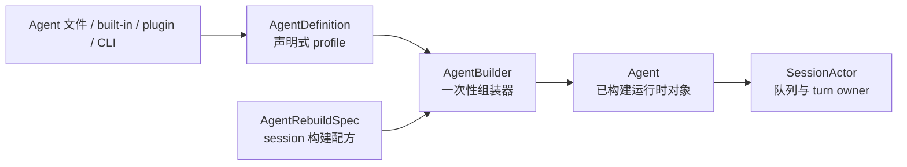
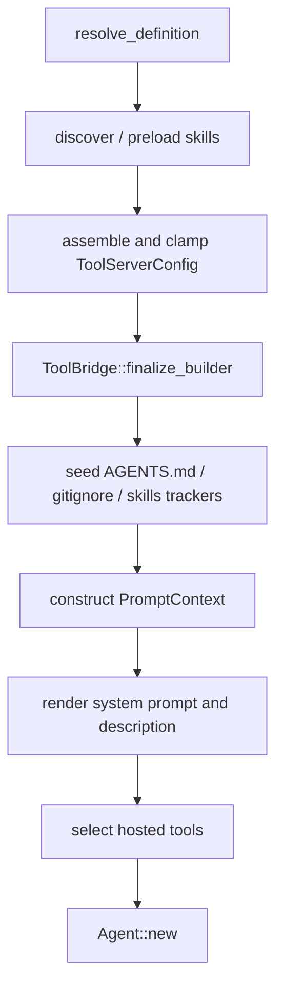
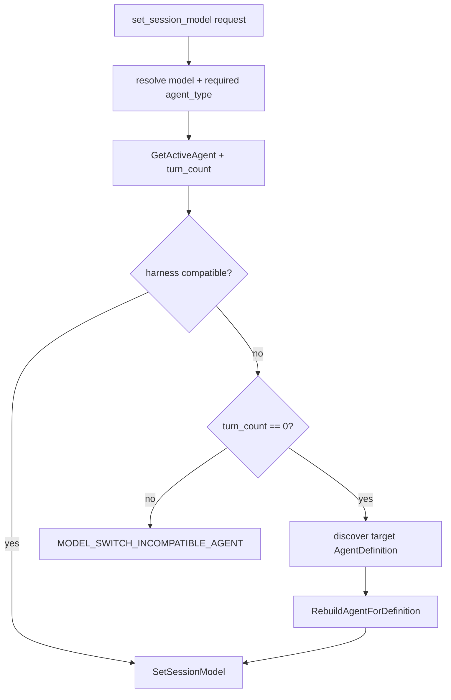

# Agent 构建、配置覆盖与运行时重建：从 Definition 到 Session-bound Agent

本文研究 Grok Build 如何把一个声明式 `AgentDefinition` 变成当前 session 真正运行的 `Agent`，以及为什么模型切换、模式切换、MCP 更新和每轮 tool override 不能都使用同一种“热更新”方式。重点包括 agent discovery、配置来源、`AgentBuilder` 的构建顺序、工具集收窄、prompt 渲染、`AgentRebuildSpec`、零 turn 重建和 live resource 迁移。

前置阅读：[配置系统](../02-runtime-flows/10-configuration.md)、[ToolBridge、工具注册表与 Resources](04-tool-bridge-registry-and-resources.md)、[状态所有权](01-state-ownership.md)、[Prompt 队列与 Turn 调度](03-prompt-queue-and-turn-scheduling.md)。本文不再讲通用 TOML 层合并，而是从“已经解析出的配置和 definition”继续追到运行时对象。

## 先记住结论

1. `AgentDefinition` 是声明；`Agent` 是把声明与一个具体 session 的 backend、channel、cwd、prompt 和 ToolBridge 绑定后的运行时对象。
2. `Agent` 不能跨 session 共享，因为它的 ToolBridge 包含 session-scoped terminal、filesystem、notification、subagent、scheduler 和持久化状态。
3. `Agent` 构建后基本不可变；MCP 注册、tool resource 和少量运行态通过 ToolBridge 内部锁更新，结构性变化通常需要重建。
4. definition 可来自 built-in、project/user/bundled agent 文件、plugin agent 或 CLI/subagent resolution；同名优先级不是简单“用户文件总覆盖 built-in”。
5. 按 name 解析时，native precedence 是 project > built-in > user > bundled；plugin agent 通常使用 `plugin:agent` qualified name，bare name 只有唯一匹配时才接受。
6. 不可信 plugin agent 只解析 frontmatter，不读取 prompt body，防止未信任代码包把任意指令注入模型。
7. `AgentBuilder::build` 不是纯构造器：它会发现 skills、重写 definition、组装/过滤工具、finalize ToolBridge、读取 AGENTS.md、种入 trackers、渲染 system prompt 并选择 hosted tools。
8. 工具集合经历“definition 基础集 → 环境能力注入 → 功能 gate → author allow/deny → session operator clamp → finalize”的多次收窄。
9. `inject_default_tools = false` 表示 curated/exact harness；此时空 toolset 是配置错误，builder 不应偷偷填入默认工具。
10. author `tools`/`disallowed_tools` 与 session `--tools`/`--disallowed-tools` 是两层约束；session 层作为最终 clamp 与 author 约束取交集。
11. prompt 必须在 ToolBridge finalize 之后渲染，因为模板要知道最终 client-facing tool name、参数别名和启用能力。
12. real cwd 与 prompt/display cwd 可以不同；fork/worktree session 对模型隐藏内部路径，但工具仍在真实路径执行。
13. initial build 可携带一次性的 persisted skill announcement 和 parent-preloaded skills；普通 rebuild 不复用它们，而是重新发现。
14. shell 只允许通过 `AgentRebuildSpec` 调 `AgentBuilder::new`，用一个 canonical recipe 防止 initial build 与 rebuild 参数漂移。
15. `AgentRebuildSpec` 保存完整构造输入，并通过 `#[deny(unused_variables)]` 的全字段 destructure，让新增字段未接入 rebuild 时成为编译错误。
16. runtime channel sender 必须在 rebuild 后复用；新建 channel 会让已有 coordinator 继续监听旧 receiver，造成请求被孤立。
17. 当前完整 harness rebuild 主要用于零 turn 模型切换：目标模型要求不兼容 agent type、且尚未发送用户消息。
18. 有 turn history 时不允许切到不兼容 harness，因为旧 conversation 已由另一套 prompt/tool contract 产生，原地替换会污染语义。
19. rebuild handler 还检查没有 running task；即使上层错误发送命令，也不会在工具或 sampling 进行中替换 agent。
20. rebuild 先完整 build 新 agent，成功后才 swap，因此 build 失败时旧 agent 仍可用；但 swap 后的 rebind/MCP/persistence 是后续阶段，不是单个数据库事务。
21. swap 后必须重新注入不属于普通 `SessionContext` 的 live resources，例如 ToolIndex、PlanFilePath、workflow/goal handles、task reservations 和 deny-read globs。
22. MCP 工具属于运行时动态状态，不在新内置 ToolBridge 中自动出现；rebuild 会等待必要 handshake，再重新注册到新 bridge。
23. session mode 切换通常只重渲染 prompt并更新动态 tracker，不重建 ToolBridge；当前 `update_policies_from_definition` 还是 no-op/TODO。
24. per-turn hosted-tool override 在 prompt 从队列提升时应用，不重建 function tool registry，也不能在 enqueue 时提前污染 session。
25. 改代码时必须先判断变化属于 definition、build-time capability、session live state、per-turn state 还是 dynamic MCP state，再选择更新路径。

## 一、四种对象不要混为一谈



| 对象 | 保存什么 | 是否绑定 session | 是否适合持久化/传输 |
| --- | --- | --- | --- |
| `AgentDefinition` | 名称、prompt、工具声明、skills、模型提示、权限/能力元数据 | 否 | 可从 YAML/JSON 产生 |
| `AgentBuilder` | definition 加本次构造所需的所有 backend/config | 构建过程中是 | 一次性 fluent object |
| `AgentRebuildSpec` | shell 已解析的 session 构建输入配方 | 是 | 仅内存，供同 session 重建 |
| `Agent` | rendered prompt、finalized ToolBridge、policies、hosted tools | 是 | 不可直接跨 session 搬运 |
| `SessionActor` | prompt queue、turn、MCP state、plan/goal trackers、chat handle | 是 | actor runtime state |

把 `AgentDefinition` 改了，不代表 live `Agent` 自动变化；把 `Agent.system_prompt` 改了，也不代表 ToolBridge 的 schema 和工具集合跟着变化。

## 二、`AgentDefinition` 描述哪些维度

字段可按职责分组：

| 分组 | 字段示例 |
| --- | --- |
| identity/source | `name`、`description`、`scope`、`source_path`、`plugin_name` |
| prompt | `prompt_mode`、`prompt_body`、`system_prompt`、`user_message_template` |
| tools | `tool_config`、`inject_default_tools`、`tools`、`disallowed_tools` |
| runtime capability | `capability_mode`、`permission_mode`、`isolation`、`background` |
| subagent | `allowed_subagent_types`、`mcp_servers`、`mcp_inheritance`、`model` |
| discovery | `skills`、`discover_skills`、`inherit_skills`、`agents_md` |
| turn behavior | `effort`、`max_turns`、`completion_requirement` |
| hosted tools | `tool_overrides` |
| hooks/memory | `hooks`、`memory` |
| session operator clamps | `session_tools_allowlist`、`session_tools_denylist` |

其中 `scope`、`source_path`、`plugin_name`、derived `allowed_subagent_types` 和 session clamp 字段会被 `serde(skip)`，说明它们主要由 discovery/shell 运行时补充，而不是普通 agent 文件自由声明。

## 三、Agent 文件的两部分

标准 agent Markdown 文件：

```text
---
name: reviewer
description: Reviews code
tools: [Read, Grep]
model: inherit
---

这里是 agent prompt body。
```

`AgentDefinition::from_file`：

1. 读取整个文件；
2. YAML frontmatter 反序列化为 definition；
3. closing delimiter 后的 Markdown body 写入 `prompt_body`；
4. 设置 `source_path`；
5. 从路径推导 `scope`。

`from_file_frontmatter_only` 则把 `prompt_body` 清空，并将 `system_prompt` 设为 None。它用于可以展示 metadata、但不能信任 prompt 内容的场景。

## 四、为什么不可信 plugin 只读 frontmatter

plugin agent 的 prompt body 会直接进入 system prompt，实际是对模型行为的代码/指令注入面。

discovery 对 plugin 采用：

```text
plugin.trusted
  -> AgentDefinition::from_file

!plugin.trusted
  -> AgentDefinition::from_file_frontmatter_only
```

这样 UI 仍可看到 agent 名称和描述，但未信任 plugin 不能通过 Markdown body 或 custom system prompt 控制 agent。

plugin 中的 `${CLAUDE_PLUGIN_ROOT}`、`${CLAUDE_PLUGIN_DATA}` 及 Grok aliases 只在可信、实际加载 body/custom prompt 时展开为绝对路径。

## 五、native agent discovery 优先级

project agent 目录从当前 cwd 向 git root 扫描：

```text
.grok/agents
.claude/agents
```

然后扫描：

```text
$GROK_HOME/agents
legacy ~/.grok/agents（若 GROK_HOME 不同）
~/.claude/agents
$GROK_HOME/bundled/agents
```

`discover` 对 name 去重，先出现的高优先级定义获胜。

按 name 精确解析时的核心顺序是：

```text
project > built-in > user > bundled
```

这有一个重要后果：用户级 `~/.grok/agents/explore.md` 不能覆盖 built-in `explore`；project-level 同名定义可以覆盖。

## 六、visible 必须等于 callable

`all_subagents` 先放入 built-ins，再合并发现的定义。代码专门保证 UI/Task description 展示的 agent 与 spawn 时真正解析到的 agent 一致。

如果 user-level `explore` 在列表里覆盖 built-in，但 spawn precedence 又选择 built-in，就会出现：

```text
模型看到的描述 = 用户 explore
实际启动的实现 = built-in explore
```

因此 user/bundled 同名 built-in 会被展示列表跳过；只有 project definition 可以 shadow built-in。

## 七、plugin agent 的名字解析

plugin agent 推荐 qualified name：

```text
plugin-name:agent-name
```

解析顺序先尝试所有 native definition。native 未命中后：

1. qualified name 精确查 enabled plugin；
2. bare name 遍历 enabled plugins；
3. 恰好一个匹配才接受；
4. 多个 plugin 同名时拒绝 bare lookup，并提示使用 qualified name。

这避免 plugin 加载顺序无意决定 agent 身份。

## 八、Project scope 与 folder trust 的关系

project agent definition 本身来自仓库。其 prompt、inline hooks、MCP 等能力具有不同风险面：

- project prompt discovery 有自己的产品信任策略；
- project agent inline hooks 明确受 folder trust gate；
- plugin trust 单独控制 plugin prompt/body 和附带能力；
- plugin agent 不能任意启动 agent-owned MCP server；parent-pool inheritance 是另一条受控路径。

不要因为 `AgentScope::Project` 只检查了一处，就推断所有字段自动可信。不同 consumer 会在自己的执行边界再次 gate。

## 九、`AgentBuilder` 为什么有大量 `with_*`

definition 只描述 agent 想要什么，builder 还必须知道宿主能提供什么：

- real cwd 与 prompt/display cwd；
- terminal、filesystem、notification handle；
- state path 与 session env；
- memory/web/LSP/media/deploy backends；
- subagent toggle、available models、plugin registry；
- compaction/reminder policy；
- skills/compat/AGENTS.md 设置；
- auth/API-key provider；
- tool params；
- prompt audience；
- system reminder tag。

因此它是 definition 与 session context 的 join point，不只是 Rust builder pattern 的语法糖。

## 十、definition 的两种进入方式

### `from_definition(def)`

shell 已完成 discovery/resolution，builder 使用完整 definition clone。

### 单独 `with_*` definition fields

若没有完整 definition，`resolve_definition` 从 `default_grok_build()` 开始，再应用 name、description、prompt mode、permission mode、skills、tools、denylist 等 builder 字段。

shell canonical path 使用 `from_definition`。单字段方式主要服务库调用、测试和简单构造。

## 十一、构建总览



顺序不能随意交换。尤其：prompt render 依赖 finalized ToolBridge，session resource update 又依赖新 Agent 已创建。

## 十二、Skills 在工具和 prompt 之前解析

builder 优先级：

```text
preloaded_skills present
  -> 直接使用

else definition.discover_skills
  -> 按 cwd/plugins/compat 发现

else
  -> empty
```

definition 的 `skills` 是明确预加载名称。匹配出的 skill 内容会格式化后前置到 `prompt_body`，同时记录路径，避免后续 discovery listing 重复展示已预载项。

这意味着 `build()` 会修改自己的 `definition.prompt_body`；最终 `Agent.definition()` 是 build 后的有效 definition，而不一定逐字等于输入 clone。

## 十三、工具构建从 definition 基础集开始

```text
let mut tool_config = definition.tool_config.clone();
```

随后 builder 按能力和约束修改副本，不直接改变原始配置对象的 ownership。

若：

```text
inject_default_tools == false
&& tool_config.tools.is_empty()
```

立即返回 InvalidConfig。curated harness 明确要求 provider/definition 给出准确工具契约，不能静默回落到 Grok 默认工具。

## 十四、`inject_default_tools` 控制环境能力注入

开启时，builder 根据实际 backend/config 添加：

- memory search/get；
- local web search/fetch；
- LSP；
- image/video tools；
- deploy/app capability；
- OpenCode write fallback；
- plan mode enter/exit/ask tools。

注入依据不是 definition 单独决定，而是：

```text
definition allows defaults
&& session actually has capability/config
```

关闭时，tool_config 更接近模型训练过的 exact harness schema。

## 十五、缺失 backend 会反向移除工具

即使基础 definition 带 memory tool，如果 builder 没有 memory backend，也会移除 memory search/get。

类似地：

- ask-user-question feature 关闭时移除对应工具；
- workflow feature 决定 goal/workflow 工具组合；
- subagents disabled 或没有可用类型时移除 task；
- task 被移除且没有任何 background command satisfier 时，再移除 task lifecycle 工具。

因此工具列表不是只增不减的 patch；它在 build 中多次做 capability reconciliation。

## 十六、Task 工具描述是运行时生成的

当 subagent 可用：

- primary audience 的 task description 列出当前可用 agent types 和 model slugs；
- subagent audience 使用更简短、鼓励少委派的 child description。

若 discovery/toggle 后没有可用 subagent，Task 本身被移除。这维持“模型看到的描述等于实际可调用能力”。

Task availability 还影响 `get_task_output`、`wait_tasks`、`kill_task` 和 terminal background params，不能只删除 spawn tool 而留下没有生产者的 lifecycle API。

## 十七、Tool params 的 merge 时机

shell 已解析的工具参数以 JSON map 进入 builder，例如：

- web fetch params；
- bash params；
- ask-user-question timeout policy。

这些 map merge 到匹配 `ToolConfig.params`。时机很重要：ask 参数必须在 `ensure_plan_mode_tools` 之后合并，否则新注入的 ask tool 收不到配置。

随后 ToolRegistry finalize 再将 JSON 校验为具体 `Params<P>`。

## 十八、Author denylist 先收窄

`definition.disallowed_tools` 可按 fully-qualified ID 或 short name 匹配。未匹配条目会 warning，帮助发现拼写错误或当前 harness 不含该工具。

`Agent(type)` 形式还用于限制能 spawn 的 subagent 类型，不只过滤 function tool。

denylist 先移除，后续 allowlist 不能把已删除项重新加回。

## 十九、Author allowlist 的兼容解析

`definition.tools` 可能含：

- 当前 tool_config 的精确 ID；
- Claude 风格能力名，可映射到 `ToolKind`；
- `Agent(type)` directive；
- MCP 风格名字；
- 无法识别的自定义名字。

如果所有非 directive 条目都能解析，builder 保留：

- 精确 ID match；
- kind match；
- Agent directive 需要的 task lifecycle；
- SearchTool/UseTool 元工具。

如果存在 unmappable 条目，当前实现 warning 并保留完整 Grok toolset，避免兼容输入被错误解析后过度删减。安全边界仍由 session operator clamp、permission 和 capability gate 收口。

## 二十、Session operator clamp 是最终工具约束

`session_tools_allowlist` / `session_tools_denylist` 不来自 agent 作者 frontmatter，而来自 session operator/CLI。

builder 在工具完成环境注入和 author filter 后调用：

```text
definition.session_tools_allowed(tool_id)
```

hosted tools 也调用 `hosted_tool_allowed`，因此 session clamp 同时约束 function tools 和 server-hosted search。

核心关系：

```text
effective tools
  ⊆ author requested tools
  ∩ session operator allowed tools
  ∩ available capabilities
```

较晚的 tool_config mutation 不应绕过 session restriction。

## 二十一、从 tools directive 推导 subagent allowlist

builder 解析 `Agent(type1,type2)`：

- 没有任何 directive 且 `tools` 非空：`allowed_subagent_types = Some([])`，表示 author 只给普通工具，没有给 Agent 能力；
- directive 有具体类型：保存去重后的 types；
- tools 为空：通常 `None`，表示未通过 author allowlist 限制；
- bare Agent deny：强制 `Some([])`；
- typed deny：从已有 allowed 中移除。

如果最终是空列表，builder 再移除 task lifecycle，并关闭 terminal background 参数。

## 二十二、ToolBridge finalize 是 build 的中点

工具配置收窄完成后，builder 构造 `SessionContext` 并调用：

```text
ToolBridge::finalize_builder(
  ToolRegistryBuilder,
  effective ToolServerConfig,
  SessionContext
)
```

此处固定：

- client-facing tool names；
- JSON Schema；
- behavior version；
- tool params；
- session Resources；
- reminder set；
- tool-state persistence；
- scheduler handle。

从这一步起，工具模板才能可靠渲染。

## 二十三、finalize 后还有 seed 阶段

builder 随后：

- 恢复 announced skill names；
- 读取 AGENTS.md chain；
- 建立 git root/gitignore；
- seed `AgentsMdTracker`；
- seed skill discovery tracker；
- 设置 MCP truncation resource。

这些不是 ToolRegistry 的静态定义，但工具/reminder 在运行时会依赖。它们必须在最终 prompt render 前准备好。

## 二十四、real cwd 与 prompt cwd 必须分开

`working_directory` 用于：

- Tool `Cwd`；
- filesystem/terminal 实际路径；
- skill/AGENTS.md discovery；
- git root；
- permission path context。

`prompt_working_directory` 只用于模型看到的 `<user_info>`/Workspace Path，以及把 AGENTS.md file path 显示成外部路径。

fork/worktree session 的真实路径可能是内部 overlay：

```text
real: ~/.grok/worktrees/project/fork-123-overlay
display: /Users/me/project
```

若把 display cwd 用来执行工具，会操作错误目录；若把 real cwd写入 prompt，会泄露内部实现路径并让模型输出不可用路径。

## 二十五、PromptContext 在 build 时捕获什么

常见字段：

- prompt mode/body/system template；
- audience；
- AGENTS.md files；
- persona summaries/instructions；
- memory paths；
- OS、shell、working directory；
- current date 和 build timestamp；
- non-interactive flag；
- system prompt label。

`PromptContext::render(&tool_bridge)` 使用 finalized tool/param mapping。description 也通过 ToolBridge render，占位符可随当前 harness 改名。

## 二十六、为什么 prompt 在工具之后渲染

prompt/工具描述中可能包含：

```text
${{ tools.by_kind.search }}
${{ tools.by_kind.execute }}
${{ params.task.subagent_type }}
```

只有 finalize 后才知道：

- 哪个实现实际启用；
- client name 是否 override；
- 参数是否改名；
- 某 capability 是否被 gate 删除。

若先 render 再过滤工具，system prompt 会要求模型调用一个不存在或名字错误的工具。

## 二十七、Hosted tools 与 Function tools 不同

backend search 开启时，builder 可能建立：

- `HostedTool::WebSearch`
- `HostedTool::XSearch`

它们由 sampler/backend 执行，不注册为本地 ToolBridge function tool。是否加入同时受：

- build-time backend search toggle；
- web search config；
- definition/session tool restrictions；
- definition `tool_overrides`。

请求时还要与当前 model 的 `supports_backend_search` 做 AND。`hosted_tools().is_empty()` 不能替代 capability flag，因为空列表也可能只是 config 没启用 web search。

## 二十八、最终 `Agent` 包含什么

`Agent::new` 保存：

```text
effective AgentDefinition
PromptContext
rendered system_prompt
Arc<ToolBridge>
ReminderPolicy
CompactionPolicy
hosted_tools
backend_search_enabled
```

它不保存 SessionActor 的 prompt queue、plan tracker 或 chat history。Agent 是“harness/runtime capability bundle”，SessionActor 才是会话调度 owner。

## 二十九、为什么说 Agent “effectively immutable”

构建后：

- definition 不提供普通 setter；
- system prompt 只在明确 re-render 路径更新；
- ToolBridge 内部允许 MCP/resource/state mutation；
- hosted tool list 是 build-time vector；
- compaction/reminder policy 固定在对象中。

这种设计让一次 sampling 能读取一致的 prompt/tool contract，同时把确实需要动态变化的部分放进有锁资源或 SessionActor state。

## 三十、五种运行时变化路径

| 变化 | 是否重建 Agent | 主要机制 |
| --- | --- | --- |
| MCP server 发布/撤销工具 | 否 | ToolBridge dynamic register/unregister |
| tool state/resource 更新 | 否 | `ToolBridge::update_resource` |
| per-turn hosted search override | 否 | promotion 时更新 SessionActor override |
| session/plan mode切换 | 通常否 | tracker + prompt re-render/reminder |
| 不兼容 model agent_type、零 turn | 是 | `AgentRebuildSpec::build_agent` |

不要把“热更新”当成一个统一接口；每一类状态的 owner 和一致性边界不同。

## 三十一、per-turn tool override 为什么不重建

`ToolOverridesUpdate` 当前主要控制 hosted web/x search options。它保存在排队的 `InputItem` 中，只在 prompt promotion 时应用：

```text
enqueue -> 不改变 session
remove before promotion -> 永不生效
promotion -> fold into sticky override
absent -> 保持
explicit null -> 清除到 seed
```

它不改变 built-in ToolBridge function schema，因此无需重建 Agent。

promotion 后还把 resolved override 发布到 shared cell，保证本轮 spawn 的 subagent 继承同一搜索 cutoff。

## 三十二、session mode 切换是轻量路径

`handle_session_mode`：

- 更新 `current_prompt_mode`；
- 进入/退出 plan tracker；
- 必要时注入 plan reminders；
- 按 mode name 解析另一个 AgentDefinition；
- 用现有 ToolBridge 为新 definition 重渲染 prompt；
- 更新 `active_agent_type`。

它调用 `Agent::update_policies_from_definition`，但当前实现明确是 no-op/TODO：completion requirement/retry 已进入 ToolServerConfig，新架构尚不支持中途更新这些 policy。

所以 session mode 切换并不等于完整 harness replacement。阅读代码时必须看到这个限制。

## 三十三、模型切换为何有 harness compatibility

model catalog 的 entry 可声明所需 `agent_type`。切模型时比较：

```text
active_agent_type
vs
required_agent_type
```

某些名称可由 `harnesses_are_compatible` 判定兼容，不一定要求字符串完全相等。

若兼容，只更新 sampling config、model credentials、compaction阈值和可能的 prompt concise/default形式。

若不兼容，需要考虑 conversation 是否已经开始。

## 三十四、为什么只允许零 turn rebuild

`turn_count == 0` 表示还没有用户消息驱动的真实 turn。此时替换：

- system prompt；
- tool schema；
- agent discipline；
- hosted tool contract；

不会使已有 assistant/tool history与新 harness 冲突。

`turn_count > 0` 时拒绝不兼容 switch，并返回建议 start new session。否则新模型会看到由旧 harness 产生的对话，却缺失旧工具/规则的语义前提。

这是 conversation contract 保护，不只是实现方便。

## 三十五、上层 model-switch 编排



rebuild 成功后，后续 `SetSessionModel` 会设置 `skip_prompt_rewrite`，避免普通 concise/default rewrite 把刚安装的新 harness prompt 覆盖掉。

## 三十六、`AgentRebuildSpec` 为什么存在

initial spawn 构造 Agent 时使用了几十个输入。如果 model switch 只重新调用：

```text
AgentBuilder::new(cwd, terminal, notification)
  .from_definition(new_def)
  .build()
```

会丢失 fs、memory、web、plugin、skills、session env、tool params、LSP、API key provider、subagent channels、scheduler 等设置。

`AgentRebuildSpec` 在 spawn 时缓存完整 recipe，initial build 和 rebuild 都通过同一个 `build_agent_inner`。

模块级 invariant：shell crate 中只有这里调用 `AgentBuilder::new`。

## 三十七、Spec 字段按生命周期分类

### 稳定 backend

```text
working_directory
terminal_backend
fs_backend
notification_handle
session_env
state_path
memory/web/LSP/media clients
```

### 已解析 policy/config

```text
compaction_policy
reminder_policy
skills_config / compat
context_window
tool params
feature toggles
prompt audience/instructions
```

### live channel/handle

```text
subagent_event_tx
monitor_event_buffer
user_question_tx
blocking_wait_depth
parent scheduler handle
managed gateway client
```

### identity

```text
session_id
owner_session_id
subagent depth/max depth
prompt display cwd
system prompt label
```

这些分类帮助判断新增字段是否能 clone、是否应在 rebuild 中复用，以及是否需要 swap 后再注入。

## 三十八、全字段 destructure 是编译期维护机制

`build_agent_inner` 开头把 `self.as_ref()` 全字段解构，并带：

```rust
#[deny(unused_variables)]
```

新增 `AgentRebuildSpec` 字段后，如果没有在 builder chain 或 resource injection 中使用，编译会失败。

模块注释要求新增 `AgentBuilder::with_*` 时同步：

1. spec 加字段；
2. build_agent 传入；
3. spawn call site 赋值。

这把容易漏的文档约定转成部分编译器约束。

## 三十九、为什么 channel sender 必须复用

以 subagent 为例：

```text
existing coordinator owns rx
Agent/ToolBridge resource owns tx
```

rebuild 若新建 `(tx2, rx2)` 但没有替换 coordinator：

```text
tool sends to tx2
coordinator waits on rx1
request never consumed
```

因此 spec 保存原 `subagent_event_tx`，重建 `ChannelBackend::for_session` 时继续包装同一个 sender。user question、workflow、goal 等 channel 同理。

## 四十、initial-only overrides

`build_agent_with_initial_overrides` 接受：

- `persisted_skill_names`
- `preloaded_skills`

前者在 resume 时恢复已宣布 skill 名，避免 startup reminder 重复；后者让 child 使用 parent 已发现的 skill，避免重新扫文件系统。

普通 `build_agent` 在零 turn rebuild 时传 `None`，进行 fresh discovery。它们是一次性启动输入，不应无条件永久固化在 recipe 中。

## 四十一、build 完成后的第一轮 resource injection

AgentBuilder 能通过 SessionContext 注入通用能力，但 shell-specific live resource 在 `AgentRebuildSpec::build_agent_inner` 的 build 后加入，例如：

- `TaskModelValidator`
- `SubagentBackendResource`
- `SubagentDepthCounter` / `MaxSubagentDepth`
- `SessionIdResource` / `SubagentEventSender`
- foreground wait handle
- monitor event buffer
- `RespectGitignore`
- `SchedulerBackgroundLoops`
- `PathNotFoundHints`
- managed gateway tool client
- `UserQuestionSender`

这层仍属于 canonical build recipe，因此 initial build 和 rebuild都会得到。

## 四十二、rebuild handler 的准入条件

上层只在 zero-turn mismatch 发送 command，handler 仍检查：

```text
state.running_task.is_none()
```

这是 defense in depth。即便 turn_count snapshot 与 command delivery 之间出现竞态，或未来新增错误调用方，也不能在 running turn 中替换工具和 prompt。

若正在运行，返回 internal error，不修改 live agent。

## 四十三、先 build，后 swap

handler 首先：

```text
new_agent = rebuild_spec.build_agent(new_definition).await
```

此时 `self.agent` 仍指向旧 Agent。若 skill discovery、tool requirements、prompt render 或 backend 构造失败，函数返回错误，旧对象保持不变。

只有 new Agent 完整构建成功后才：

1. capture new system prompt/context；
2. abort compaction prefire；
3. replace `self.agent`；
4. update `active_agent_type`。

这是近似 prepare-then-commit 的结构。

## 四十四、为什么 swap 前要停止 compaction prefire

prefire task 可能已经基于旧 agent 的 prompt、context window 和 compaction policy 做准备。如果 swap 后旧 task 完成，它可能把旧 harness 的压缩结果/假设写回新 session。

handler 会 take handle、abort、await，并 clear prefire state，避免跨 harness 残留。

## 四十五、swap 后要重新绑定 WorkspaceOps

`workspace_ops.bind_local_session` 保存当前 session 对应的 toolset/hunk tracker/cwd 关联。Agent swap 后旧 ToolBridge toolset 已不再是权威对象。

rebind 失败会 warning，但不会回滚已 swap Agent。这说明 rebuild 不是覆盖所有 side effect 的原子事务；后续步骤采用 best-effort/显式日志。

调试“模型看到新工具但本地 workspace dispatch 仍异常”时，应查 rebind warning。

## 四十六、swap 后的第二轮 live resource injection

handler 还必须加入只有 SessionActor 当前状态才知道的资源：

- rebuild 时刻的 `ToolIndex`；
- managed gateway tool client；
-当前 `PlanFilePath`；
- display cwd；
- `WorkflowLaunchHandle`；
- goal engine 未接管时的 `GoalUpdateHandle`；
- task completion reservations；
- task wake suppression gate；
- permission deny-read globs。

为什么不全放 Spec：有些值属于 actor live state，可能在 spawn 后变化或只在完整 session setup 后可用。

## 四十七、MCP 为什么需要重新注册

新 ToolBridge 只 finalize 内置/配置工具。MCP server state 由 SessionActor 的 `mcp_state` 管理，adapter 已注册在旧 bridge，不会自动复制。

handler：

1. 观察当前 MCP configs/initialized 状态；
2. 如有配置但 handshake 未完成，最多等待固定 timeout；
3. 调 `re_register_mcp_tools_on_rebuilt_bridge`；
4. 标记 MCP reminder dirty。

timeout 后仍继续，避免 rebuild 永久卡住；之后 dynamic state 可继续收敛。

## 四十八、为什么等 handshake 不能无限期

MCP server 可能：

- 启动慢；
- auth 等待；
- 配置错误；
- 永久无响应。

若 rebuild 必须等待全部 server 成功，零 turn model switch 会无期限阻塞。固定 timeout 在“尽量给新 prompt 完整工具集”与“session 仍可用”之间取平衡，并通过 warning 保留可观测性。

## 四十九、Conversation 如何切换到新 harness

新 Agent swap 后，handler：

- abort old deferred prefix；
- 重建 user-message prefix；
- replace/insert leading system message；
- rewrite zero-turn prefix；
- 必要时插入 AGENTS.md project instructions；
- 注入 baseline skill reminder；
- replace conversation。

只允许 zero-turn 是这些 rewrite 能安全成立的重要前提。已有大量 user/assistant/tool history 时无法只替换 head 就保证语义一致。

## 五十、重建后的持久化

handler 保存：

- normalized `PromptContext`；
- `system_prompt.txt`；
- 当前 conversation 的 `chat_history.jsonl`；
- model switch 的 agent name/metadata（由后续 SetSessionModel 路径）；

随后发送 available commands update，让客户端命令面与新 harness 对齐。

若只替换内存 system head 不更新辅助文件，session reload、trace artifact 和 UI inspection 会看到不同版本。

## 五十一、`active_agent_type` 是 guard mirror

SessionActor 保存：

```text
Mutex<Option<String>> active_agent_type
```

spawn 时由 definition 初始化，session mode/rebuild 时更新。model switch 通过 `GetActiveAgent` command读取，而不是直接跨 actor 访问 `Agent`。

它是 compatibility guard 所需的镜像；真正完整 definition 仍在 `Agent` 内。

## 五十二、重建不是普通 mid-turn mutation

安全的 full rebuild 需要：

```text
no running task
zero user turns for incompatible harness switch
new Agent fully buildable
session channels reusable
conversation head safely rewriteable
dynamic MCP/resources rebindable
```

因此不应把 `RebuildAgentForDefinition` 暴露为任意 prompt 中的通用“换人格”操作。

## 五十三、哪些变化不能只调用 `finalize_prompt`

`Agent::finalize_prompt` 只更新 build timestamp 并用当前 ToolBridge 重渲染现有 PromptContext。

适合：

- ToolBridge 内已有 name/状态变化，prompt模板需要刷新；
- 不改变 definition 工具契约的展示更新。

不适合：

- 添加/删除 built-in function tool；
- 改 behavior contract/schema；
- 改 skills/AGENTS.md discovery输入；
- 改 hosted tool集合；
- 改 compaction/reminder policy；
- 改 session backend。

这些需要专门更新路径或 full rebuild。

## 五十四、常见误读

### 误读 1：AgentDefinition 就是运行时 Agent

错误。definition 没有 session backend、rendered prompt 或 finalized ToolBridge。

### 误读 2：用户 agent 一定覆盖 built-in

错误。project 可 shadow built-in；普通 user-level 同名 built-in 不会。

### 误读 3：plugin bare agent name 总能解析

错误。多个 plugin 同名时必须 qualified。

### 误读 4：`inject_default_tools=false` 表示没有工具

错误。表示必须使用 definition/provider 的 curated exact toolset；空集会报错。

### 误读 5：allowlist 在最前应用一次就够了

错误。环境注入和 hosted tools 之后还要受 session final clamp。

### 误读 6：session mode 切换会重建工具 registry

错误。当前主要重渲染 prompt/更新 tracker，policy update 仍未完整支持。

### 误读 7：换模型只改 sampler model 字符串

错误。不兼容 agent_type 在 zero-turn 需要完整 harness rebuild。

### 误读 8：新 Agent build 成功后所有重建步骤都是原子的

错误。swap 后 rebind、MCP 和 persistence 仍是多个可失败步骤，以 warning/重试收敛。

### 误读 9：rebuild 可以新建 subagent channel

错误。必须复用已有 coordinator 监听的 sender。

### 误读 10：tool override update 应在 enqueue 时立即应用

错误。排队 prompt 可能被删除或重排，只有 promotion 才能改变 session effective override。

## 五十五、新增 Builder knob 的检查清单

- 字段是否属于 AgentDefinition，还是宿主 session capability？
- `AgentBuilder` 是否有字段、default 和 `with_*`？
- `AgentRebuildSpec` 是否加对应字段？
- `build_agent_inner` 全字段 destructure 是否消费？
- initial spawn 是否填入 resolved value？
- subagent spawn 是否也解析同一语义？
- build 后是否还要 `ToolBridge::update_resource`？
- rebuild swap 后是否需要基于 actor live state 再注入？
- 是否影响 prompt persistence、trace 和 available commands？
- 是否有安全 clamp 不能被新字段绕过？

## 五十六、新增 AgentDefinition 字段的检查清单

- YAML/JSON serde default 是否保持旧文件兼容？
- 字段是否应该 `serde(skip)` 由 runtime 注入？
- built-in constructors 是否给出合理默认？
- `from_file_frontmatter_only` 是否应保留或清除它？
- discovery 展示与 spawn 解析是否一致？
- plugin trust/folder trust 是否影响消费？
- builder 在哪个阶段应用？
- full rebuild 和 lightweight mode switch 是否都支持？
- `to_json/from_json` roundtrip 测试是否更新？
- prompt/tool/persistence artifact 是否需同步？

## 五十七、调试顺序

### 找不到 agent

1. name 是否与 filename/frontmatter一致？
2. cwd→git-root project directories 是否正确？
3. built-in 是否优先于 user-level 同名？
4. plugin 是否 enabled/trusted？
5. bare plugin name 是否 ambiguous？
6. subagent toggle/allowed types 是否过滤？

### Agent 存在但工具不对

1. `inject_default_tools` 是 true 还是 false？
2. definition.tool_config 初始有哪些工具？
3. backend capability 是否存在？
4. workflow/subagent/ask/memory gate 移除了什么？
5. author allow/deny 是否匹配 fully-qualified/short name？
6. session CLI clamp 是否生效？
7. ToolBridge finalized definitions 最终是什么？

### Prompt 提到不存在的工具

1. 是否在 ToolBridge finalize 前渲染？
2. 是否硬编码工具名而非 `tools.by_kind`？
3. session mode 是否重用了不兼容旧 bridge？
4. dynamic MCP/tool name变化后是否 re-render？
5. persisted system prompt 是否旧版本？

### 模型切换被拒绝

1. required agent_type 与 active type 是否兼容？
2. turn_count 是否已大于 0？
3. target definition 是否能 discovery？
4. builder 是否因 curated empty toolset/requirements失败？
5. handler 检查时是否已有 running task？

### Rebuild 后工具请求无人处理

1. subagent/user-question/workflow sender 是否复用？
2. coordinator 是否仍监听原 receiver？
3. build 后 resource injection 是否完成？
4. swap 后 actor live resource injection 是否完成？
5. WorkspaceOps 是否 rebind 新 toolset？

### Rebuild 后 MCP 工具丢失

1. mcp_state 是否有 configs？
2. handshake 是否 initialized 或 timeout？
3. `re_register_mcp_tools_on_rebuilt_bridge` 是否执行？
4. tool name 是否与新 bridge built-in 冲突？
5. MCP reminder dirty/definitions update 是否传播？

## 五十八、推荐源码阅读顺序

1. `crates/codegen/xai-grok-agent/src/config.rs::AgentDefinition`
2. `crates/codegen/xai-grok-agent/src/discovery.rs`
3. `crates/codegen/xai-grok-agent/src/builder.rs::AgentBuilder`
4. `AgentBuilder::resolve_definition`
5. `AgentBuilder::build` 的 skill/tool/filter/finalize段
6. `crates/codegen/xai-grok-agent/src/agent.rs`
7. `crates/codegen/xai-grok-shell/src/session/agent_rebuild.rs`
8. initial spawn 中 `AgentRebuildSpec` 的构造
9. `acp_session_impl/model_switch.rs::handle_rebuild_agent_for_definition`
10. `agent/handlers/model_switch.rs`
11. `acp_session_impl/session_mode.rs`
12. `acp_session_impl/sampler_turn.rs` 的 tool override update
13. subagent definition/harness resolution路径

## 五十九、可执行验证

### 搜索构建单一入口

```sh
rg "AgentBuilder::new" crates/codegen/xai-grok-shell/src
rg "AgentRebuildSpec|build_agent_with_initial_overrides" \
  crates/codegen/xai-grok-shell/src/session
```

预期 shell 的生产构造集中在 `agent_rebuild.rs`。

### 搜索工具收窄顺序

```sh
rg "inject_default_tools|disallowed_tools|session_tools_allowed" \
  crates/codegen/xai-grok-agent/src/builder.rs

rg "allowed_subagent_types|apply_workflow_tool_gates" \
  crates/codegen/xai-grok-agent/src/builder.rs
```

### 定向测试建议

```sh
cargo test -p xai-grok-agent discovery
cargo test -p xai-grok-agent builder
cargo test -p xai-grok-shell rebuild_agent
cargo test -p xai-grok-shell model_switch
cargo test -p xai-grok-shell tool_overrides_update
```

### 建议的小实验

1. 建立 project 和 user 同名 built-in agent，观察 project 可 shadow、user 不可。
2. 建立两个 plugin 同名 agent，验证 bare name拒绝、qualified name成功。
3. 用 `inject_default_tools=false` 加空 config，观察 InvalidConfig。
4. 禁用 subagents，比较 task/lifecycle/background params 的最终 definitions。
5. 设置 author allowlist 与 session denylist，验证最终是交集。
6. 创建 display cwd 与 real cwd 不同的 builder，比较 prompt path 和工具执行 cwd。
7. 模拟 zero-turn incompatible model switch，比较 swap 前后的 system prompt/tool definitions。
8. 让 new builder故意失败，验证旧 Agent 未被替换。
9. 把 tool override 放到 queued prompt 后删除，验证 session override 不变。

## 六十、阅读后自测

1. AgentDefinition、AgentBuilder、AgentRebuildSpec 和 Agent 各自解决什么问题？
2. 为什么 Agent 不能跨 session 共享？
3. project、built-in、user、bundled 的 name precedence是什么？
4. 为什么 user-level 同名 built-in 不出现在可调用列表？
5. plugin bare name何时允许？
6. 不可信 plugin 为什么只能加载 frontmatter？
7. `inject_default_tools=false` 的真实语义是什么？
8. 工具集合经历哪些添加和收窄阶段？
9. author filters 与 session operator clamp 如何组合？
10. 为什么 Task 被移除后还要检查 lifecycle tools？
11. 为什么 ask tool params 要在 plan tools 注入后 merge？
12. allowlist 中 unmappable entry 当前如何处理？
13. prompt 为什么必须等 ToolBridge finalize 后渲染？
14. real cwd 与 prompt cwd 为什么不能共用一个字段？
15. hosted tools 为什么不在 ToolBridge definitions 中？
16. session mode切换与 full rebuild 有何不同？
17. 为什么不兼容 harness 只允许 zero-turn切换？
18. `AgentRebuildSpec` 如何防止 initial/rebuild drift？
19. 为什么 channel sender必须复用？
20. initial-only skill overrides 为什么不进入普通 rebuild？
21. rebuild 为什么先 build 后 swap？
22. swap 后还要补哪些 live resources？
23. MCP 工具为什么不会随新 Agent 自动出现？
24. per-turn tool override 为什么只在 promotion 应用？
25. 哪些 rebuild 后步骤失败不会自动回滚 Agent swap？

## 本篇术语表

| 名词 | 白话解释 | 在本篇中的准确含义 |
| --- | --- | --- |
| agent definition | Agent 的声明式配方 | `AgentDefinition` 保存 prompt、tools、skills、模型/权限/能力元数据，不含 session backend |
| agent profile | 一套可命名选择的 Agent 行为配置 | built-in 或 Markdown/plugin 中的 definition |
| runtime Agent | 已经可以在一个 session 中工作的 Agent 对象 | 包含 rendered prompt、ToolBridge、policies 和 hosted tools |
| session-bound | 与某个会话的资源和生命周期绑定 | Agent 中的 channel/backend/state path 不能直接搬到另一个 session |
| builder pattern | 连续调用方法设置构造参数的写法 | `AgentBuilder::with_*` 收集 definition 外的 session 输入 |
| fluent API | 方法返回 self、可链式调用的 API | AgentBuilder 的主要构造风格 |
| discovery | 从若干位置寻找定义 | 扫描 project/user/bundled/plugin agent 文件并按名字去重 |
| precedence | 多个同名来源谁优先 | native agent 通常 project > built-in > user > bundled |
| shadow | 高优先级同名定义遮盖低优先级定义 | project agent 可以 shadow built-in subagent |
| visible == callable | UI 展示对象必须等于实际解析对象 | 防止描述来自 user agent、spawn 却得到 built-in |
| qualified name | 包含命名空间的完整名字 | plugin agent 使用 `plugin:agent` 消除歧义 |
| bare name | 不带命名空间的短名字 | 只有唯一 plugin match时才安全解析 |
| frontmatter | Markdown 开头由 `---` 包围的 YAML metadata | 解析成 AgentDefinition 字段 |
| prompt body | frontmatter 后的 Markdown 正文 | 可进入 system prompt；不可信 plugin 不加载它 |
| scope | definition 的来源层级 | Project、User、Bundled 或 BuiltIn |
| plugin trust | 是否信任 plugin 包内容 | 控制 prompt body/附带能力，独立于 folder trust |
| join point | 多类输入汇合的位置 | AgentBuilder 把 definition 和 session capability 合成 Agent |
| effective definition | 构建阶段修改后的最终声明 | 可能已注入 skills、derived subagent types 和描述变化 |
| capability | 宿主实际能提供的功能 | memory、web、LSP、media、subagent 等 backend/config |
| capability reconciliation | 声明能力与实际 backend 对齐 | 缺 backend移除工具，有 backend且允许 defaults时注入 |
| curated toolset | 明确、精确控制的工具集合 | `inject_default_tools=false`，builder 不自行添加默认工具 |
| default tool injection | 按 session 能力向 definition 加工具 | memory/web/LSP/write/plan 等可选工具注入 |
| author allowlist | agent 作者声明允许的工具 | `definition.tools`，还可含 Agent directives |
| author denylist | agent 作者声明禁止的工具 | `definition.disallowed_tools` |
| session clamp | session operator 的最终限制 | CLI `--tools/--disallowed-tools` 对 function/hosted tools做交集收窄 |
| fully-qualified tool ID | 带工具 namespace 的 ID | 如 `GrokBuild:read_file`，可与 short name 匹配 |
| short name | 去掉 `Namespace:` 的工具 ID | 兼容 author/CLI 的简写输入 |
| ToolKind mapping | 把外部能力名映射为语义种类 | Claude-style Read/Grep 等可匹配当前 harness 实现 |
| Agent directive | tools 列表中的 subagent 能力声明 | `Agent(type)` 推导 `allowed_subagent_types` |
| lifecycle tool | 操作后台任务已有实例的工具 | get/wait/kill task；无生产者时应移除 |
| tool params | 宿主配置的每工具参数 | JSON merge 到 ToolConfig，finalize 后变成 `Params<P>` |
| finalize | 把工具声明变为当前 session 可执行 ToolBridge | 固定名字、schema、resources、versions 和 reminders |
| seed | 向新 resource/tracker 写入初始快照 | AGENTS.md、gitignore、skill discovery 等 build 后初始化 |
| prompt context | 渲染 system prompt 的结构化输入 | `PromptContext` 保存 audience、cwd、日期、instructions 等 |
| prompt rendering | 用 context 和 ToolBridge 模板生成最终文字 | 必须在工具 finalize 后进行 |
| template placeholder | 渲染时替换的变量 | 如 `tools.by_kind.search`、`params.task.*` |
| real cwd | 工具实际执行的目录 | worktree/overlay的内部真实路径也可能在这里 |
| display/prompt cwd | 模型和用户看到的路径 | 用于隐藏 fork session内部路径，不改变执行位置 |
| hosted tool | 由模型 backend/server执行的 native tool | WebSearch/XSearch，不通过本地 ToolBridge dispatch |
| function tool | 以 JSON function schema 暴露并本地 dispatch 的工具 | ToolBridge 的 built-in/MCP definitions |
| backend search | 是否允许使用服务端搜索能力 | build-time flag还需与 per-model capability做 AND |
| effectively immutable | 对外基本不提供结构修改，但内部有受控动态状态 | Agent structure固定，ToolBridge 允许 MCP/resource updates |
| hot update | 不重建整个对象的运行时更新 | MCP registration、resource、mode tracker、tool override等不同路径 |
| tool override | hosted search 的配置覆盖 | definition seed加 per-turn update，不等于重建 function registry |
| promotion | queued prompt成为 running prompt 的时刻 | per-turn override 在这里才应用 |
| sticky override | 一轮设置后后续轮次继续沿用的值 | absent保持，explicit null清除 |
| session mode | ACP session的 Agent/Ask/Plan等交互模式 | 主要更新 tracker和 prompt，不等于 full Agent rebuild |
| harness | prompt、工具 schema 和行为纪律的组合 | model可要求特定 `agent_type` harness |
| harness compatibility | 两个 agent type能否共享当前 conversation contract | model switch判断是否只改 sampler或需要 rebuild |
| zero-turn | 尚未执行任何真实用户 turn | 允许安全替换不兼容 harness 的窗口 |
| rebuild | 用新 definition 和相同 session recipe构造新 Agent | 不是修改旧 Agent的几个字段 |
| rebuild spec | 可复现 session Agent构造的缓存配方 | `AgentRebuildSpec` 是 shell唯一 AgentBuilder入口 |
| canonical construction path | initial和rebuild共用的唯一构造路线 | 防止两条 builder chain随时间漂移 |
| recipe drift | 初始构造增加参数、重建路径忘记同步 | spec全字段 destructure帮助编译期发现 |
| initial-only override | 只在首次创建/resume/child spawn使用的输入 | persisted announced skills、parent-preloaded skills |
| live resource | 运行中 actor/coordinator持有的 handle或状态镜像 | channel sender、PlanFilePath、ToolIndex、reservation等 |
| sender reuse | rebuild继续使用原 channel tx | 保证长期 coordinator的 rx仍能收到请求 |
| orphaned channel | sender和实际 receiver不成对导致无人消费 | rebuild错误新建 channel的典型故障 |
| swap | 把 SessionActor 的旧 Agent替换为新 Agent | 只有完整 new build成功后发生 |
| prepare-then-commit | 先准备新对象，成功后才替换权威引用 | rebuild build失败不破坏旧 Agent |
| compaction prefire | 正式压缩前后台提前准备的任务 | rebuild前必须 abort，避免旧 harness结果回写 |
| rebind | 让外围服务指向新 ToolBridge/toolset | WorkspaceOps在 Agent swap后重新绑定 |
| MCP re-registration | 把现有动态 MCP adapters装入新 bridge | new ToolBridge不会自动复制旧动态工具 |
| handshake | MCP server初始化/能力协商 | rebuild可有限等待，timeout后继续 |
| system head | conversation开头的 System message | rebuild用新 system prompt替换或插入 |
| prompt artifact | prompt/context的磁盘副本 | system_prompt、prompt_context、chat history需保持一致 |
| active agent type | 当前 session harness身份的轻量镜像 | model switch通过 actor command读取并做 compatibility guard |
| defense in depth | 上层限制之外，处理方再次验证 | rebuild handler仍检查 running_task为空 |
| best effort | 失败会记录但不保证全局回滚 | swap后的 WorkspaceOps rebind/MCP/persistence部分步骤 |

更多跨文档通用名词见[全局术语表](../appendices/glossary.md)。

