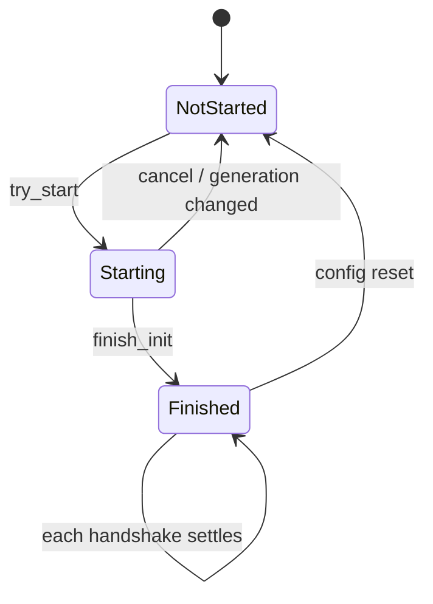
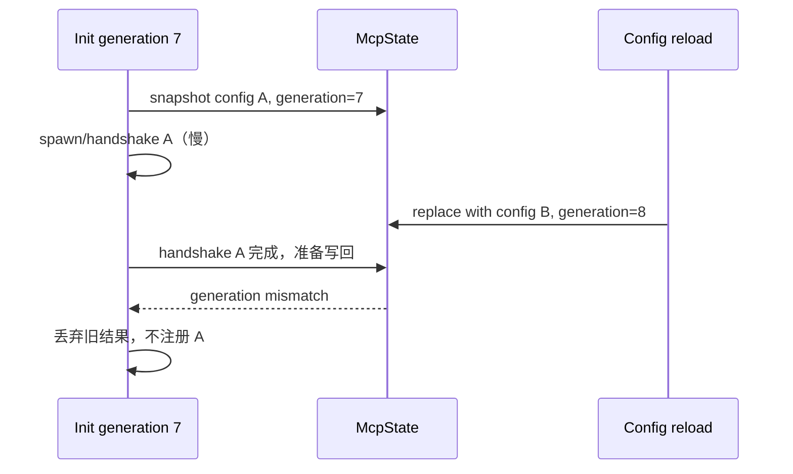
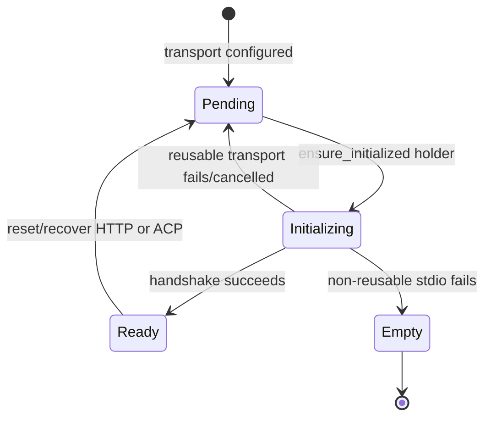
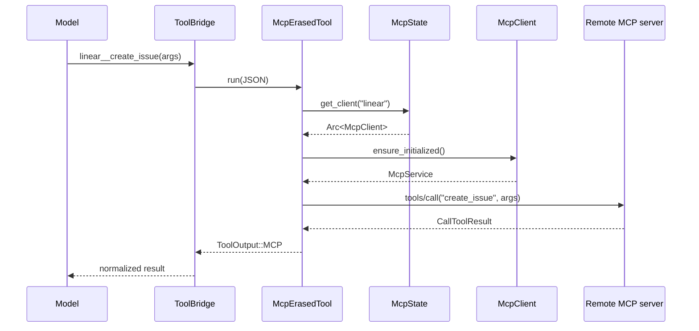
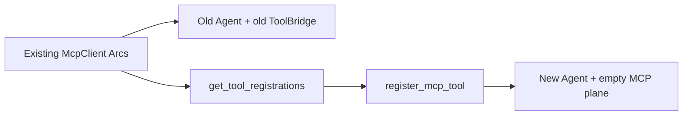

# MCP Server 生命周期、能力刷新与动态工具：初始化、注册、调用、恢复与重载

本文研究 Grok Build 中一个 MCP server 从配置出现，到创建 transport、完成协议握手、枚举工具、动态注册进 `ToolBridge`、接受调用、响应能力变化、断线恢复和配置热重载的完整生命周期。重点不是再介绍“什么是 MCP”，而是解释这套实现里的状态所有权、异步边界和防竞态不变量。

前置阅读：[ACP 与 MCP](../02-runtime-flows/09-acp-and-mcp.md)、[ToolBridge、工具注册表与 Resources](04-tool-bridge-registry-and-resources.md)、[状态所有权](01-state-ownership.md)、[Agent 构建与重建](06-agent-build-configuration-and-rebuild.md)。本文可独立阅读；末尾术语表会重新解释本篇使用的关键名词。

## 先记住结论

1. MCP 不是一张启动时固定的工具表，而是一组随 session 变化的远端能力；`McpState` 拥有配置、client、初始化进度、鉴权状态和工具元数据，`ToolBridge` 拥有模型实际可调用的动态注册。
2. “MCP 初始化完成”至少有三个层次：session 已越过 `finish_init`、单个 `McpClient` 已进入 `Ready`、所有后台 handshake 都已结束。三者不能互换。
3. `InitProgress::Finished { handshaking }` 允许 `handshaking` 非空。它表示 session 不再被启动流程阻塞，不表示全部 server 已可用；只有 `Finished` 且集合为空才是 `is_complete()`。
4. session 初始化先创建 client，再把每个 server 的 handshake 和 `tools/list` 放到后台并发执行。这样不需要 MCP 的普通问答可先开始，晚到的工具随后动态出现。
5. `generation` 是配置版本戳。异步初始化完成后必须重新比较它；否则旧配置启动出来的 client 和工具会写回新配置状态。
6. `McpClient` 自己还有 `Empty → Pending → Initializing → Ready` 状态机。`ensure_initialized` 是 single-flight：并发调用者等待同一次 handshake，而不是各自建立连接。
7. `InitGuard` 让 handshake 任务被取消时尽量把可复用 transport 放回 `Pending`，并唤醒等待者；这是异步取消安全的一部分。
8. stdio transport 的 child 在 handshake 中被消费，失败后不能原地复用；HTTP、带 OAuth 的 HTTP 和 ACP reverse transport 可以保存重建材料并重试。
9. 工具名在模型侧不是原始 MCP 名，而是 `server__tool`。server namespace 防止两个 server 暴露同名工具时在本地 registry 冲突。
10. `tools/list` 必须翻页直到 `next_cursor` 为空。对缺少 `type`/`properties` 的输入 schema，客户端会补成 object schema，避免下游模型 API 拒绝。
11. `_meta.ui.visibility` 决定工具面对模型还是只面对 app。app-only 工具不进 `ToolBridge`，但仍可经 UI 通知和 `x.ai/mcp/call` 使用。
12. disabled tool 不是简单丢弃：registration 会放进 `disabled_tool_registrations`，因此重新启用时不必重新执行 `tools/list`。
13. `ToolBridge` 已 finalize 并不意味着 MCP 不能加入。内置工具集在 build 时冻结，MCP 走专门的动态注册通道。
14. 一次模型工具调用先用 qualified name 找到本地 wrapper，再由 wrapper 从当前 `McpState` 查 server client，最后发送原始 tool name 和 JSON arguments。
15. 超时的工具调用不会自动重试，因为它可能已经在远端产生副作用；客户端只为后续调用重置 HTTP transport。
16. 明确的 transport failure 可以恢复后重试一次；确定性的 JSON-RPC 客户端错误不会重连；auth failure 进入重新鉴权路径。
17. server 推送 `tools/list_changed` 或 `resources/list_changed` 时，`GrokClientHandler` 只产生事件；当前 dispatcher 会合并事件并把它映射成 `Ready + ConfigChanged` 状态通知，但不会仅凭这个事件自动重跑 `tools/list`。不要把“收到变化通知”误读成“模型工具表已经刷新”。
18. liveness watcher 只在 `Ready + transport closed` 时报告断线；观察到 `Pending`、`Initializing` 或 `Empty` 会静默退出，避免把主动 reset 误判为崩溃。
19. stdio crash 使用 1、4、16 秒的有界 respawn；HTTP 使用更长的 in-place recovery ladder，并保留下次 tool call 的 lazy recovery。
20. 自动恢复同时检查 server 是否仍配置、是否被禁用、是否正在 intentional teardown、是否已有恢复任务；否则一个陈旧断线事件可能复活用户刚删掉的 server。
21. `client_id` 防止旧 client 的 watcher 删除同名 replacement；`generation` 防旧配置任务写回，二者解决不同层次的陈旧问题。
22. config reload 使用 diff 尽量保留未变化的健康 client；owned client 可被替换，parent 继承的 shared client 不因子 session 的配置变化而清空。
23. Agent rebuild 会创建一个全新的 `ToolBridge`，所以必须从现存 client 再跑 `tools/list` 并重新注册；复用连接不等于复用本地工具表。
24. snapshot、prompt reminder 和磁盘 descriptor 都是 MCP 工具表的派生视图。注册变化后要刷新这些视图，否则实际可调用能力与模型可发现能力会不一致。

## 一、先把六层对象分开


这六层的生命周期不同：

| 层 | 核心对象 | 主要拥有者 | 变化原因 |
| --- | --- | --- | --- |
| 配置 | `Vec<acp::McpServer>`、meta/OAuth config | config merge + `SessionActor` | 文件修改、managed connector 刷新、client session binding |
| session MCP 状态 | `McpState` | `SessionActor` 内的 `Arc<TokioMutex<_>>` | init、reload、toggle、继承、auth |
| server client | `McpClient` | `McpState::owned_clients/shared_clients` | spawn、handshake、reset、restart |
| 协议 service | `McpService` | `McpClient::ClientState::Ready` | initialize 成功或 transport 重建 |
| 工具 registration | `McpToolRegistration` | 初始化过程中的临时值，disabled 时由 `McpState` 保存 | `tools/list`、list changed、toggle |
| 动态工具表 | ToolBridge 内部 registry | 当前 `Agent` | register/unregister、Agent rebuild |
| 派生视图 | `ToolMetadataSnapshot`、reminder、descriptor files | session 层 | 动态工具表刷新 |

最常见的错误是假设“client 还活着，所以新 Agent 一定有 MCP 工具”。实际上 Agent rebuild 会换掉 ToolBridge，client 与 registry 是两份状态。

## 二、源码边界和入口

核心实现分布在两个 crate：

| 文件 | 关键符号 | 职责 |
| --- | --- | --- |
| `xai-grok-mcp/src/servers.rs` | `McpState`、`McpClient`、`McpTool`、`McpClientEvent` | transport、handshake、client 状态机、工具 wrapper |
| `xai-grok-mcp/src/liveness.rs` | `spawn_transport_liveness` | per-client 断线轮询 |
| `xai-grok-mcp/src/mcp_http_client.rs` | HTTP transport helpers | HTTP 请求与告警预算 |
| `xai-grok-mcp/src/credentials.rs` | credential helpers | token 读取与保存 |
| `xai-grok-mcp/src/oauth.rs` | OAuth helpers | browser/refresh 鉴权流程 |
| `xai-grok-mcp/src/acp_transport.rs` | ACP reverse transport | SDK MCP 经 ACP 反向调用 |
| `xai-grok-shell/src/session/mcp_servers.rs` | `start_mcp_server(s)`、`build_pending_clients` | shell 配置解析与 MCP crate 包装 |
| `session/acp_session_impl/mcp.rs` | `ensure_mcp_tools_initialized`、`register_mcp_tool` | session 级初始化与动态注册 |
| `session/acp_session_impl/mcp_snapshot.rs` | snapshot/re-register helpers | 搜索视图、reminder、rebuild 后重新注册 |
| `session/mcp_dispatcher.rs` | `StatusDispatcher` | client event 合并、wire status 和恢复调度 |
| `session/mcp_restart.rs` | restart/recovery loops | stdio respawn 与 HTTP recovery |
| `extensions/session_admin.rs` | reload handlers | 全局和 project-scoped 热重载入口 |

阅读时建议先看 shell 的 session 编排，再下钻 MCP crate。只从 `start_mcp_server` 开始，很容易看懂连接建立，却看不到工具最终何时对模型可见。

## 三、配置不是单一文件

初始化接收到的是已合并的 `Vec<acp::McpServer>`，上游可能包含：

- session 创建时 client 直接提供的 server；
- `~/.grok/config.toml` 与 project `.grok/config.toml`；
- `.mcp.json`、兼容来源和 plugin 声明；
- cli-chat-proxy 返回的 managed MCP；
- SDK 通过 ACP `_meta["x.ai/mcp/servers"]` 声明的进程内 MCP。

热重载时必须重新以 `initial_client_mcp_servers` 为 seed。不能只重新读磁盘文件，否则只存在于 client binding 的 server 会被当作“已删除”并关闭。

per-server override 在 shell 边界解析，例如：

- `startup_timeout_sec`；
- 默认 `tool_timeout_sec`；
- 按 raw tool name 配置的 `tool_timeouts`；
- `expose_image_base64`。

全局 startup timeout 是没有显式 server override 时的 fallback。SDK/ACP server 也在每轮 init 重新解析 override，而不是把旧值永久缓存进 registry。

## 四、owned client 与 shared client

`McpState` 分开保存：

```text
owned_clients  = 当前 session 自己创建和管理
shared_clients = 从 parent SharedMcpPool 继承的 Arc<McpClient>
```

关键不变量：

1. config change 可以清空或替换 owned client；
2. 它不能顺手清空 shared client；
3. shared client 复用同一个 `Arc<McpClient>` 和已建立的 transport；
4. 子 session 仍要把这些 client 的工具注册到自己的 ToolBridge；
5. shared client 的 liveness/status event 仍由 parent 负责，子 session 不重复接线。

如果父子双方都给同一个 shared client 安装 event sender，一次断线会产生重复通知和重复恢复。`McpState::set_client_event_tx` 因而只 fan-out 到 `owned_clients`。

## 五、SDK MCP 为什么也进入同一 client 流程

SDK server 没有 stdio child 或 HTTP URL。它由 ACP metadata 提供：

```text
server namespace name + SDK serverId + shared reverse-RPC invoker
```

`AcpMcpRegistry` 把 servers 和 invoker 保存为一个原子对象，避免出现“有 server id、没有调用通道”的半状态。`build_pending_acp_clients` 产生 `PendingTransport::Acp`，然后继续走统一路径：

```text
ensure_initialized
  → initialize
  → tools/list
  → McpToolRegistration
  → ToolBridge
```

这保持了一个重要边界：调用载体不同，但能力发现、命名、禁用、snapshot 和模型调用语义相同。

## 六、session 级初始化状态机

`InitProgress` 有三个 variant：



`Starting` 和 `Finished` 都带一个 `handshaking` set。

| 状态 | `finish_init` 是否已发生 | 是否可能有后台 handshake | `is_complete` |
| --- | --- | --- | --- |
| `NotStarted` | 否 | 否 | false |
| `Starting { ... }` | 否 | 是 | false |
| `Finished { non-empty }` | 是 | 是 | false |
| `Finished { empty }` | 是 | 否 | true |

`finish_init` 是“编排阶段已经结束”的边界，不是“远端能力全到齐”的承诺。源码故意让它早于所有 server handshake 完成，以免慢 MCP 阻塞不需要它的 turn。

## 七、为什么还要维护 handshaking set

只有一个 `initializing: bool` 无法回答：

- 哪些 server 还在连接；
- 某 server 应显示 `initializing` 还是 `unavailable`；
- prompt 是否应注入“工具稍后可用”的 reminder；
- templated prefix 是否值得短暂等待；
- 某个新 config 是否已经有同名 handshake 在途。

因此 init 开始后，待启动的 config server 与 pending ACP server name 都先进入集合。每个 server 无论成功还是失败，settle 后都必须移除；否则 `is_initialized()` 永远不会变 true。

失败不是“继续留在 handshaking”。失败会转移到：

```text
auth_required : 等待用户/managed auth 恢复
init_failed   : 非鉴权类失败，附短原因
```

状态集合各自表达不同事实，不能用一个 set 兼任全部含义。

## 八、Blocking 与 Progressive 的含义

`McpInitStrategy` 控制 session 在需要 MCP 时如何面对尚未完成的初始化。

- Blocking：需要时等待初始化边界；适合必须让完整工具集先到位的场景。
- Progressive：普通工作先继续，模型若过早调用尚未可用的 MCP tool，会收到引导去 `search_tool` 的 unavailable 结果。

Progressive 不是“永不等待”。特定 user-message template 需要把 MCP server/tool 元数据写入前缀时，session 会最多短暂等待；Agent rebuild 也会 bounded wait，随后 best-effort 重新注册。

这体现两类一致性：

| 场景 | 目标 | 策略 |
| --- | --- | --- |
| 普通 turn | 降低首 token 延迟 | MCP 后台连接 |
| 依赖 MCP metadata 的模板 | 前缀尽量完整 | 最多等待约 3 秒 |
| Agent rebuild | 新 bridge 尽量恢复动态工具 | 最多等待约 5 秒 |

等待都有上限，防止一个坏 server 挂住整个 session。

## 九、一次 session 初始化的主流程

`SessionActor::ensure_mcp_tools_initialized` 的主线可压缩为：

```text
1. lock McpState，try_start_init
2. snapshot configs/meta/generation/existing client names
3. 读取 disabled_tools
4. 计算 configs_to_start + pending ACP names
5. 把 names 加入 handshaking set
6. lock 外并发 spawn/build clients
7. 重新比较 generation
8. 对 spawn 失败项记录 auth/failure，并从 handshaking 移除
9. finish_init（后台 handshake 尚可继续）
10. spawn_local 后台任务
11. 每个 client 并发 ensure_initialized + tools/list
12. 再比较 generation
13. 动态注册工具，插入 owned_clients，标记 server ready/failed
14. 注册 shared client 工具
15. 刷新 snapshot/reminder/descriptors，发送完成通知
```

第 6 步不持有 `McpState` lock。创建进程、网络连接和 OAuth 都可能慢，锁必须只保护短状态变更，不能包住外部 I/O。

## 十、为什么先 `finish_init` 再在后台 handshake

乍看之下，`finish_init` 放在工具注册之前像是过早完成。它实际区分：

```text
session init orchestration 已经派发完
≠
所有 per-server capability discovery 已完成
```

好处是：

- 没有 MCP 依赖的 prompt 可以立即 sampling；
- fast server 的工具可先注册，不必等 slow server；
- UI 能逐个显示连接进度；
- 一个 server timeout 不拖住其他 server；
- progressive discovery 与 `search_tool` 能自然工作。

代价是所有消费者都必须使用准确谓词：检查 `is_initialized()`，而不是看到 `Finished` 就假设工具齐全。

## 十一、generation 防的是什么竞态

考虑时间线：



没有 generation check，旧任务会把已删除 server 的 client 和工具重新插入。检查至少出现在：

- client build/spawn 返回后；
- background handshake/tool list 全部 settle 后；
- 任何准备把批量结果写回 state 的 async 边界。

`wrapping_add` 允许计数器溢出而不 panic；实际 session 生命周期内回绕到同值几乎不可达。

## 十二、单个 `McpClient` 的状态机

session init 状态与 client 状态是两套正交状态机：



| variant | 含义 |
| --- | --- |
| `Empty` | 没有可用 transport；stub 或不可复用 transport 失败后可到达 |
| `Pending(PendingTransport)` | 有建立连接所需材料，尚未完成 handshake |
| `Initializing` | 某一个调用者正独占 handshake |
| `Ready(McpService)` | 已完成 initialize，可发送 MCP request |

不要把 `Pending` 理解成“已经有一条空闲连接”。对于 HTTP，它更多是可重建的 config；对于 stdio，它可能含尚未被 `serve` 消费的 child handle。

## 十三、`ensure_initialized` 为什么是 single-flight

同一时刻可能有两条路径触发初始化：

- session 后台正在 `get_tool_registrations`；
- 模型很快调用了这个 server 的工具。

旧式 fail-fast 会让第二条路径收到“client already initializing”，把内部竞态暴露给模型。现在的逻辑是：

1. 在创建 `Notify::notified()` future 后再检查 state，防丢 wakeup；
2. 第一个看到 `Pending` 的调用者把 state 换成 `Initializing`，成为 holder；
3. 后续调用者看到 `Initializing`，释放 lock 并等待 `init_done`；
4. holder handshake 完成后发布 `Ready`、`Pending` 或 `Empty`；
5. `notify_waiters` 唤醒所有 waiter，让它们重新读 state。

等待不是无限的。上限约为 `startup_timeout_sec + 1s`，用来防 holder 被取消且恢复失败后所有调用者永久挂住。

## 十四、`InitGuard` 解决取消安全

async future 可以在任意 `.await` 被 drop。若 holder 已把 state 改成 `Initializing`，随后 task 取消而没有发布结果，client 会永远卡在中间态。

`InitGuard` 是 RAII guard：

- 成功/正常失败发布前调用 `disarm()`；
- 非正常 drop 时尝试用 `try_lock` 把可复用 transport 放回 `Pending`；
- 无论是否成功恢复，都唤醒 waiter；
- 锁竞争导致恢复失败时，wait timeout 仍会给出明确错误。

之所以用 `try_lock`，是因为 Rust `Drop` 不能 `.await`。这是“同步析构语义”与“异步锁”交界处的典型工程折中。

## 十五、四类 transport 的失败语义

| transport | 建立方式 | handshake 失败后能否原地重试 | 主要恢复方式 |
| --- | --- | --- | --- |
| stdio | spawn child，stdin/stdout 传 JSON-RPC | 通常不能；child 已被 `serve` 消费 | session restart 重新 spawn |
| HTTP/SSE | URL + headers/config | 能，用 config 重建 transport | reset + ensure/recovery ladder |
| HTTP + OAuth | HTTP config + shared auth manager | 能 | refresh token、重建 transport、再 handshake |
| ACP reverse | serverId + reverse invoker | 能 | 重新构造 ACP pending transport |

这也是 `PendingTransport` 故意不实现普通 `Clone` 的原因：如果无脑 clone stdio child，会掩盖“资源只能被消费一次”的真实所有权。

## 十六、handshake 不只是在检查端口

`try_handshake` 最终建立 `McpService`，并从 initialize response 得到 peer info/capabilities/instructions。后续代码使用其中的 server instructions 建立 `ServerMetadata`，供 MCP reminder 和工具搜索展示。

一个 server “进程启动成功”仍可能在以下位置失败：

- transport serve 失败；
- initialize request 超时；
- OAuth token 被拒绝；
- initialize response 不兼容；
- `tools/list` 超时或返回错误；
- list 能返回，但所有工具名都无效。

因此状态和 telemetry 区分 spawn failure、handshake failure、list failure 与最终 tool registration failure。

## 十七、OAuth handshake 的一次 refresh retry

带 auth manager 的 client 若首次 handshake 失败，会尝试 refresh token 后再 handshake 一次。代码不只匹配特定错误字符串，因为 MCP server/transport 的 auth error 文本并不稳定。

若仍失败：

- managed server 根据 error 是否是 auth rejection 标记 `needs_auth`；
- 本地有 auth 能力的 server 也进入 auth-required 路径；
- 非 auth failure 进入 `init_failed`。

`auth_required` 与 `init_failed` 必须互斥。否则鉴权成功后即使工具恢复，旧 `init_failed` 仍会让 UI 显示 unavailable。

## 十八、`tools/list` 是分页能力发现

`McpClient::get_tool_registrations`：

```text
ensure_initialized
  → list_tools(cursor=None)
  → append page
  → cursor=next_cursor
  → 重复直到 next_cursor=None
  → 每个 tool 转 McpToolRegistration
```

只读第一页会在工具较多的 server 上产生隐蔽缺失：连接显示成功，但模型只看到前一部分工具。

每个工具转换时提取：

- raw name；
- description；
- input schema；
- `_meta`；
- model visibility；
- 指向 server 和 `McpState` 的 runtime wrapper。

## 十九、为什么要修补 schema

有些 MCP server 对无参数工具返回：

```json
{}
```

但下游模型 function-tool schema 通常要求顶层是 object。Grok Build 会补为等价形态：

```json
{
  "type": "object",
  "properties": {}
}
```

这是 adapter responsibility：MCP server 的宽松输出要在进入更严格的模型 API 前规范化。修补只补缺失字段，不应改写 server 已声明的参数含义。

## 二十、qualified tool name 是本地身份

远端 server 只认识 raw tool name，例如：

```text
create_issue
```

本地模型/registry 使用：

```text
linear__create_issue
```

构造规则是：

```text
server_name + MCP_TOOL_NAME_DELIMITER("__") + raw_tool_name
```

qualified name 同时用于：

- `ToolBridge` lookup；
- `LocalRegistry` 的 `ToolId`；
- disabled registration map；
- `_meta` map；
- telemetry call id；
- snapshot/search identity。

实际发送 MCP `call_tool` 时必须再使用 raw name。把 qualified name 原样发给 server 会得到 method/tool not found。

## 二十一、为什么工具名要做双重验证

`McpTool::into_registration` 同时检查：

1. qualified name 能否无歧义拆成 server/tool 两段；
2. 名称是否满足下游 tool provider 的字符规则。

无效工具会被记录并跳过，而不是让一个坏名字使整个 server 初始化失败。这是 per-item fault isolation。

server 或 raw tool name 自身若包含含混的 `__`，会破坏反向解析，因而也必须拒绝。

## 二十二、model-visible 与 app-visible

默认情况下工具对模型可见。若 `_meta.ui.visibility` 明确只包含 `app`：

- 不注册进 `ToolBridge`；
- 模型 tool schema 中不会出现；
- UI 仍可根据 metadata 展示 action；
- app 可通过扩展方法调用。

若 metadata 包含 `model`，则进入模型工具表。`resourceUri` 等 UI metadata 还会形成 `x.ai/mcp/tools_changed` 的 entry。

这说明“server 暴露了工具”不等于“模型可以调用”。capability、audience 与 enablement 是三个维度。

## 二十三、disabled tool 为什么保存 registration

工具被禁用时，代码不会注册到 bridge，但会把完整 `McpToolRegistration` 存入：

```text
disabled_tool_registrations[qualified_name]
```

重新启用时可直接：

```text
remove stash → register_mcp_tools
```

无需重新连接 server，也无需重新 `tools/list`。这种设计优化了频繁 toggle，同时确保 disabled 工具不在模型可调用表中。

注意两个 name domain：配置中的 `disabled_tools` 按 server 保存 raw tool name；stash 以 qualified name 索引。转换必须始终使用同一个 delimiter 规则。

## 二十四、动态注册如何越过 finalize 边界

普通内置工具在 `AgentBuilder` 中注册，然后 ToolBridge finalize。MCP 工具晚于 build 才知道，因此走：

```text
ToolBridge::register_mcp_tools(name, erased_tool, schema)
```

ToolBridge 内部为 dynamic MCP registry 保留并发可写路径；这不等于整个 finalized toolset 都可任意修改。

可以把它理解为：

```text
finalized built-in plane  +  runtime MCP extension plane
```

二者最后都能被统一 list/dispatch，但写入规则和生命周期不同。

## 二十五、注册过程必须同时维护多份状态

`register_mcp_tool` 不只调用 bridge：

1. 从 qualified name 得到 raw name；
2. 保存 `_meta` 到 `mcp_tool_meta`；
3. 收集有 `resourceUri` 的 UI tool entry；
4. 检查 disabled 状态；
5. disabled 则 stash；
6. app-only 则跳过 model registration；
7. model-visible 才调用 `register_mcp_tools`。

批量完成后还要：

- 更新 client map 和 init status；
- refresh `ToolMetadataSnapshot`；
- 标记 reminder dirty；
- 更新 managed gateway resource；
- 外部 harness 下刷新 descriptor mirror；
- 向 UI 发送 tools changed/init progress。

因此“新增一个 MCP 工具”不是单点 registry write，而是一组需要收敛的派生状态更新。

## 二十六、正常工具调用链



wrapper 每次从 `McpState` 按 server name 获取当前 client，而不是永久保存初始 `Arc<McpClient>`。因此 managed token refresh 或 reload 替换 client 后，已注册 wrapper 的新调用能命中新 client。

这是一种“稳定工具对象 + 可替换连接槽”的间接寻址。

## 二十七、timeout 的两层配置

每个 client 保存：

```text
startup_timeout_sec
tool_timeout_sec
tool_timeouts[raw_tool_name]
```

调用时 `tool_timeout_for(raw_name)` 优先使用 per-tool override，再 fallback 到 server 默认值。初始化后还会检查 override key 是否匹配实际发现的 raw tool name，帮助发现拼写错误。

外层初始化 budget 大于单次 startup timeout，因为它包含 handshake 与完整分页 `tools/list`；两者不能误用同一个精确上限。

## 二十八、为什么 tool timeout 不重试

若 `call_tool` timeout，客户端不知道远端是否已经执行：

```text
请求已到达并创建 issue
  + response 在网络中丢失
```

如果自动重试，会创建第二个 issue。因此 timeout 分支：

- 标记 `is_timeout`；
- 对 HTTP 可 reset transport，准备下次调用；
- 当前调用直接返回 timeout error；
- 不重放同一个可能有副作用的请求。

这是 at-most-once 倾向，而不是可靠 exactly-once。真正的幂等性需要 server 提供 idempotency key。

## 二十九、哪些错误允许 recover-and-retry

明确的 transport closed/send failure 可触发 `recover()` 后重试一次。HTTP MCP error 也可能恢复，但排除：

- parse error `-32700`；
- invalid request `-32600`；
- method not found `-32601`；
- invalid params `-32602`；
- auth-class error；
- 已经尝试过 reconnect。

前四类说明请求本身确定性错误，换连接不会修复。auth error 需要刷新 credential，不能用同一旧 credential 重建 transport。

恢复失败时返回原始 error，以保留上层用来识别 auth/transport 类别的信号；恢复成功但 retry 失败时返回 retry error。

## 三十、tool result 如何变成模型输出

`CallToolResult` 的处理包含：

- `is_error=true`：拼接 text block，生成 errored `MCPOutput`；
- text content：直接进入文本结果；
- image content：形成 data URI；
- image resource blob：同样转换为可抽取的 image；
- 其他 resource：尽量序列化为 JSON；
- 附加 timeout、reconnect、auth retry 标志供 telemetry/上层观察。

`expose_image_base64` 打开时还会产生额外 wrapper，让原始 base64 在视觉提取后仍可供 path-based forwarding 使用。默认不开启可避免巨大 base64 污染模型上下文。

## 三十一、server 主动通知的边界

`GrokClientHandler` 关注：

```text
notifications/tools/list_changed
notifications/resources/list_changed
```

handler 不直接持有整个 `SessionActor`，而是发送 `McpClientEvent`。这样 MCP crate 只负责协议事实，shell 决定：

- 如何合并 burst；
- 向 ACP client 推什么状态；
- 是否安排 restart；
- 未来若接入真正的 capability refresh，应在什么边界编排。

这是一条依赖方向边界：底层协议 crate 不反向依赖上层 session 编排。

当前源码中，dispatcher 把这两类事件映射成 `Ready + ConfigChanged` 并推送 `x.ai/mcp/server_status`；它本身没有调用 `get_tool_registrations`、unregister 或 snapshot refresh。因此这条通知目前主要是状态/失效提示，不是完整的动态能力同步实现。

## 三十二、StatusDispatcher 为什么要做 50 ms 合并

server 可能在很短时间内连续推送大量 list-changed。dispatcher 使用：

```text
key = (server_name, McpClientEventKind)
window = 50 ms tumbling window
value = latest event
```

同一 server、同一 kind 在窗口内只保留最后一个；不同 kind 不互相覆盖。例如 `Ready` 与 `ToolsChanged` 都能留下。

`ConfigDiff` 先 fan-out 为逐 server 的 `ConfigAdded`/`ConfigRemoved`，使 buffer 内每个 event 都有明确 server identity。

合并是削峰，不是全局去重。跨窗口的变化仍会依次发出。

## 三十三、wire status 与内部状态不是一一对应

ACP `x.ai/mcp/server_status` 暴露：

```text
Ready | Initializing | Unavailable | NeedsAuth
```

并附 reason，例如：

```text
initialized
transport_closed
handshake_failed
config_added / config_removed / config_changed
disabled
auth_expired
restart_succeeded / restart_failed
managed_token_refreshed
```

reason 区分同一个 status 的来源。第一次 `ensure_initialized` 成功必须是 `Initialized`，自动重启成功才是 `RestartSucceeded`，否则监控无法区分首次连接和恢复。

## 三十四、liveness watcher 的判定表

每次成功 handshake 后可 arm 一个 watcher，默认约每 500 ms 检查一次：

| 观察结果 | 行为 | 是否发事件 |
| --- | --- | --- |
| `Ready` 且 transport open | 继续 polling | 否 |
| `Ready` 且 transport closed | 清 slot、退出 | `TransportClosed` |
| `Initializing` | 清 slot、静默退出 | 否 |
| `Pending` | 清 slot、静默退出 | 否 |
| `Empty` | 清 slot、静默退出 | 否 |

reset transport 会主动让 state 离开 `Ready`。如果 watcher 把所有非健康状态都当断线，就会对正常恢复流程制造假警报和重复 restart。

watcher 是 one-shot。退出前清除 `liveness_handle` slot，后续重新 handshake 成功才能 arm 新 watcher。

## 三十五、client identity 防陈旧 watcher

每个 `McpClient` 有 process-global 单调 `client_id`。`TransportClosed` event 携带发出它的 client id。

场景：

```text
old client watcher 发现断线，event 尚在队列
reload 创建同名 new client 并放入 owned_clients
dispatcher 处理 old event
```

dispatcher 必须比较 event client id 与 map 中当前 client id。不同表示事件陈旧，不能删除 replacement。

对比：

| guard | 防护对象 |
| --- | --- |
| `generation` | 一整批旧配置异步任务 |
| `client_id` | 同名旧 client 的延迟事件 |
| restart in-flight set | 同 server 重复恢复任务 |

三个 guard 不能互相替代。

## 三十六、intentional teardown 为什么需要显式记录

stdio child 使用 `kill_on_drop(true)`。config diff 删除 client 时，drop 会杀 child，watcher随后可能观察到 transport closed。

从 watcher 视角看，“用户删除 server”和“server 自己 crash”结果相同。dispatcher 的 `ShutdownState::shutting_down` 记录 `ConfigRemoved`，作为意图通道：

```text
intentional teardown → 不自动复活
unexpected close     → 可以尝试恢复
```

该 set 没有时间过期；只有观察到新的 `Ready` 才清除。永久删除的 server 会永久留在 set 中，这正是防复活语义。

## 三十七、stdio 自动重启

stdio auto-restart 只由 `TransportClosed` 或 `HandshakeFailed` 触发，backoff 为：

```text
attempt 1: 1s
attempt 2: 4s later
attempt 3: 16s later
cumulative: 21s
```

每轮重新检查：

- server 是否仍为 configured/enabled stdio；
- 是否处于 intentional teardown；
- 是否已有同 server restart in flight；
- session cancellation 是否已发生。

成功后重新 spawn、handshake、arm watcher、原子替换 client，并报告 `restart_succeeded`。三次失败后 unregister server tools，避免模型继续调用一个 map 中已不存在 client 的 stale wrapper。

## 三十八、HTTP recovery 与 stdio respawn 不同

HTTP 不需要重启本地进程，采用 in-place reset/re-handshake：

```text
immediate, +1s, +4s, +16s, +30s, +30s, +30s, +30s
```

较长窗口适合远端 rolling deployment。恢复循环不自己重复 push status，`ensure_initialized` 统一拥有 ready/failed status，避免一条恢复产生冲突通知。

即使 ladder exhausted，client 仍可停在可 lazy recover 的状态；未来一次 tool call 会再次经过 `ensure_initialized`。

## 三十九、managed token 刷新为什么替换 client

managed connector 的 endpoint/header/token 可能过期。refresh path：

1. 从 managed source 重新获取 config；
2. `refresh_managed_clients` 按 URL 找到 client 并替换；
3. 旧 `Arc<McpClient>` 让 in-flight call 自然完成；
4. 新调用从 `McpState` map 查到新 client；
5. 对新 client handshake + `tools/list`；
6. 清除 `auth_required` 和旧 `init_failed`；
7. 重新注册工具、刷新 snapshot、发 tools changed。

这种 copy-and-swap 比原地修改一个正在被调用的 client 更容易保持并发安全。

## 四十、配置热重载的全局与 project 范围

`extensions/session_admin.rs` 提供两个入口：

- reload all：全局配置变化时 fan-out 到所有 resident sessions；
- reload project：只更新 cwd 等于或位于目标 project root 下的 session。

project 匹配使用 `Path::starts_with`，是 path component aware：`/repo-test` 不会误匹配 `/repo`。

每个匹配 session 最终收到 `SessionCommand::UpdateMcpServers`。更新使用 config diff：

- unchanged client 尽量保留；
- removed/changed owned client 被拆除；
- added/changed server 进入新 init；
- shared client 保留；
- generation 增加；
- 旧后台结果被丢弃；
- 对应动态工具被 unregister/re-register。

## 四十一、为什么 diff update 优于全清空

全清空再初始化会导致：

- 无关 server 的健康连接被打断；
- OAuth/handshake 重复；
- 工具短暂全部消失；
- stdio child 被不必要重启；
- 更多陈旧 watcher/status event。

diff update 把 blast radius 限制在新增、删除和配置改变的 server。代价是需要更严格地维护 per-server unregister、client identity 和 config generation。

## 四十二、`tools/list_changed` 目前不是完整能力刷新

server 的能力变化可能包括：

- 新增工具；
- 删除工具；
- schema/description 改变；
- visibility/meta 改变。

若要让模型工具表真正随 server 的动态变化收敛，需要以 server namespace 为单位实现：

```text
重新 list_tools
  → 删除该 server 的旧动态 registrations
  → 注册新 model-visible set
  → 更新 disabled stash/meta
  → 更新 UI entries
  → refresh snapshot/reminder/descriptors
```

但当前 `StatusDispatcher` 只把事件转换为 `ConfigChanged` status，并未自动执行上述流水线。这是阅读当前实现时必须保留的边界：显式 reload、auth refresh、restart、初始连接和 Agent rebuild 会重新获得/注册工具；server 单独推一次 `tools/list_changed` 并不等价于本地 ToolBridge 已更新。

若未来补上自动 refresh，不能只追加 registration：模型 registry 会保留 server 已删除的 ghost tool；也不能只改 UI，因为 `search_tool` snapshot 与真实 ToolBridge 仍会陈旧。还要处理 refresh 与 config generation、client replacement、disabled stash 同时发生的竞态。

## 四十三、snapshot 是搜索和 prompt 的事实副本

`refresh_mcp_snapshot_and_schedule_reminder_with` 从 ToolBridge 的当前 definitions 构造 `ToolMetadataSnapshot`：

- qualified name；
- server/raw tool name；
- description；
- 参数名与 input schema；
- server instructions；
- `mcp_initialized` 标记。

它还合并 managed gateway catalog，更新 ToolBridge resource，并把 `mcp_reminder_dirty` 设为 true。

`search_tool` 依赖 snapshot。工具已经能直接调用但 snapshot 未刷新时，模型可能搜不到它；反之 snapshot stale 也会引导模型调用已删除工具。

## 四十四、磁盘 descriptor mirror 的一致性边界

某些 external harness template 从 workspace 对应的 `mcps/` 目录读取 tool descriptor。连接较晚的 server 也必须物化 descriptor，而不能只在 first turn 写一次。

local MCP descriptor 采用 upsert-only：session 中途删除的 folder 不立即 prune，下一 session 清理。原因是 client set 正在异步变化时 aggressive prune 可能删掉刚连接 server 的目录。

managed gateway descriptor 则按 admitted catalog 收敛，并保护与真实 MCP connector 同名的目录，避免两套来源互删文件。

descriptor 写入使用临时文件后 persist，减少并发读到半个 JSON 的风险。

## 四十五、Agent rebuild 后为何必须重新注册

rebuild 保留 `McpState` 和 client 连接，但创建新 Agent/ToolBridge：



流程会：

1. bounded wait 正在进行的 handshake；
2. snapshot 所有 client name + Arc，避免 lock 跨 await；
3. 对每个 client 再执行 `get_tool_registrations`；
4. 注册到新 bridge；
5. 单 server 失败只记录并跳过，不让整个 rebuild 失败；
6. 刷新 snapshot 和 UI notification。

由于 `McpClient` 已 `Ready`，`ensure_initialized` 只是 clone service，不会重复建连接；但 `tools/list` 会重新执行以获得当前能力。

## 四十六、锁与 await 的基本纪律

这一子系统频繁使用 `Arc<TokioMutex<McpState>>`，但遵守：

- 锁内 snapshot config、name、Arc 和短 map mutation；
- 锁外 spawn process、network handshake、OAuth、tools/list 和文件 I/O；
- async 返回后重拿锁并检查 generation/identity；
- 标准库 `MutexGuard` 绝不跨 `.await`；
- client 内部 state lock 不跨远端 handshake。

注册路径有时在持有 `McpState` lock 时 await ToolBridge write。这是局部耦合点，修改时应特别检查 lock ordering；不能在 ToolBridge 路径反向等待 `McpState`，否则可能形成死锁。

## 四十七、`spawn_local` 与 LocalSet

session actor 与 gateway 等对象可能不是 `Send`，所以后台 handshake、dispatcher 和 restart 使用 `tokio::task::spawn_local`。这要求调用栈运行在 Tokio `LocalSet` 内。

把 restart helper 拿到普通 multi-thread executor test 直接调用，可能不是返回错误，而是 runtime panic。测试通常需要显式建立 LocalSet。

这里的 local 指“固定在线程本地调度”，不是“本地 MCP server”。

## 四十八、取消和 session 关闭

关闭时需要停止多种异步活动：

- per-client liveness watcher；
- stdio/HTTP recovery task；
- 后台 handshake batch；
- dispatcher receiver；
- stdio child process；
- pending reminder/descriptor work。

RAII 负责一部分：

- drop liveness handle 会取消 watcher；
- stdio command 的 `kill_on_drop` 清理 child；
- restart in-flight guard 在所有退出路径释放 dedup claim；
- `InitGuard` 尝试恢复 client 中间态。

CancellationToken 负责可等待的 backoff/recovery，使 shutdown 不必等完 30 秒 sleep。

## 四十九、错误可见性与 telemetry

MCP 事件覆盖：

- config resolved；
- server starting/connected/failed；
- init cancelled；
- tool registration failed；
- tool call started/completed；
- timeout；
- auth retry；
- transport error/reconnect；
- auto-restart attempted/succeeded/exhausted/skipped。

调试时不要只看“server process exists”。优先确认：

```text
config 中有它吗
→ client map 中有它吗
→ ClientState 是什么
→ handshaking/auth_required/init_failed 属于哪个
→ list_tools 得到多少 registration
→ ToolBridge 中有 qualified name 吗
→ snapshot 中有吗
```

## 五十、关键不变量汇总

1. `InitProgress` 不能同时表达 initialized 与 initializing 两个独立 bool；variant 保证状态组合合法。
2. `Finished` 允许后台 handshaking，`is_complete` 才代表全部 settle。
3. 每个 handshaking name 最终必须 success/failure 都移除。
4. async batch 写回前必须比较 config generation。
5. client event 处理前必须确认 client identity 仍当前。
6. 同一 client 同时只有一个 handshake holder。
7. waiter 在检查 state 前先订阅 Notify，防 missed wakeup。
8. stdio transport 不可伪装成可 clone/reusable。
9. model registry identity 使用 `server__tool`，wire call 使用 raw name。
10. app-only 或 disabled 工具不得进入模型 ToolBridge。
11. tool timeout 不自动重放有副作用的 call。
12. intentional teardown 不得触发 auto-restart。
13. restart 必须 per-server dedup。
14. replacement client 不得被旧 watcher event 删除。
15. 动态注册变化后，snapshot/reminder/UI/descriptor 需要收敛。
16. Agent rebuild 后必须在新 bridge 重建 MCP registration。

## 五十一、常见误读

### 误读 1：`finish_init()` 后所有 MCP 工具都可用

不对。它只越过 session 编排边界；检查 `handshaking` 是否为空。

### 误读 2：一个 server 对应一个永久 tool list

不对。server 可推 `tools/list_changed`，reload、auth refresh 和 rebuild 也会重新枚举。

### 误读 3：MCP tool wrapper 保存 client，所以 replacement 不生效

不对。wrapper 保存 server name 和 `McpState`，每次调用重新 lookup 当前 client。

### 误读 4：ToolBridge finalize 后不能再加任何工具

不对。普通 build-time 表冻结，但存在专用 MCP dynamic plane。

### 误读 5：`server__tool` 就是远端 tool name

不对。它是本地 qualified identity；wire request 使用 raw tool name。

### 误读 6：timeout 后 reconnect 成功就应该重试工具

不对。timeout 无法证明远端没执行，重试可能重复副作用。

### 误读 7：transport closed 一律应该 restart

不对。它可能来自 config removal、disable 或主动 reset；需要 intention 和当前配置检查。

### 误读 8：HTTP 与 stdio 复用同一恢复逻辑

不对。stdio 要重新 spawn child；HTTP 可原地 reset/re-handshake，并有更长恢复窗口。

### 误读 9：tools changed 只影响 UI

不对。模型 registry、search snapshot、reminder、descriptor 都可能需要刷新。

### 误读 10：shared client 已在 parent 注册，child 自动能调用

不对。连接可共享，ToolBridge 是 per-Agent/per-session 的，child 仍需本地 registration。

### 误读 11：`auth_required` 可以同时留在 `init_failed`

不对。恢复路径要求两类状态分离，否则成功后仍显示 unavailable。

### 误读 12：generation 与 client_id 是重复机制

不对。前者标记配置批次，后者标记具体 client instance。

## 五十二、修改 server 初始化时的检查清单

- 是否在慢 I/O 前释放 `McpState` lock？
- 是否在 await 后复查 generation？
- 新 server name 是否先加入 handshaking？
- success、spawn failure、handshake failure、timeout 是否都会移除？
- auth failure 是否只进入 `auth_required`？
- event sender 是否在首次 `ensure_initialized` 前接好？
- handshake 成功后是否 arm liveness watcher？
- background task 是否运行于 LocalSet？
- cancellation 是否会留下 `Initializing` 或 restart claim？

## 五十三、修改动态工具注册时的检查清单

- raw/qualified name 是否使用统一 parser/delimiter？
- schema 是否仍满足模型 provider 约束？
- app-only 是否被错误暴露给模型？
- disabled tool 是否被 stash，enable 后能否恢复？
- server tool 被删除时是否 unregister 旧项？
- `_meta` 是否同步更新/清除？
- `ToolMetadataSnapshot` 是否刷新？
- reminder dirty 是否设置？
- tools-changed UI notification 是否按 server 发出？
- external harness descriptor 是否更新？
- Agent rebuild 是否能重建这类 registration？

## 五十四、修改恢复逻辑时的检查清单

- 是否区分 transport、deterministic request、auth、timeout error？
- 有副作用调用是否可能被重复执行？
- stdio 与 HTTP 的资源重建语义是否分开？
- server 是否仍 configured/enabled？
- 是否处于 `shutting_down`？
- 是否 per-server dedup？
- 是否比较 event client id？
- backoff sleep 是否响应 cancellation？
- 成功后是否 re-arm watcher？
- exhaustion 后是否清除 stale tools？
- status reason 是否准确区分 initialized/restart/refreshed？

## 五十五、推荐调试顺序

### server 没出现

1. 查 config merge 结果与 disabled list；
2. 查 `McpConfigResolved` event；
3. 查 `configs_to_start` 与 handshaking set；
4. 查 spawn error；
5. 查 generation 是否中途变化。

### server 显示 ready，但模型搜不到工具

1. 查 `get_tool_registrations` 返回数量；
2. 查 tool name validation 是否跳过；
3. 查 `_meta.ui.visibility`；
4. 查 disabled set/stash；
5. 查 ToolBridge definitions；
6. 查 `ToolMetadataSnapshot` 是否刷新。

### 工具存在但调用报 server not found

这是典型 stale registration：

- client 已从 map 删除；
- server namespace 的工具未 unregister；
- restart exhaustion 或 config diff 清理不完整。

### server 反复自动复活

检查：

- `ConfigRemoved` 是否进入 dispatcher；
- `ShutdownState` 是否 mark；
- configured/enabled check 是否读取当前配置；
- old watcher event 是否通过 client-id stale guard。

### auth 成功但仍显示 unavailable

检查 `auth_required` 清除后是否也调用 `clear_init_failed`，以及新 client 是否真正完成 tools/list 和 registration。

## 五十六、推荐源码阅读顺序

1. `servers.rs::InitProgress`：先理解 session init 语义。
2. `servers.rs::McpState`：看状态分区与 generation。
3. `acp_session_impl/mcp.rs::ensure_mcp_tools_initialized`：看总编排。
4. `servers.rs::ClientState` 与 `ensure_initialized`：看 single-flight/cancellation。
5. `servers.rs::get_tool_registrations`：看分页与 schema 适配。
6. `McpTool::into_registration`、`McpErasedTool::run`：看命名和调用。
7. `register_mcp_tool`：看 visibility/disabled/meta。
8. `mcp_dispatcher.rs`：看 event 到 status。
9. `liveness.rs` 与 `mcp_restart.rs`：看断线和恢复。
10. `mcp_snapshot.rs`、`mcp_descriptors.rs`：看派生视图。
11. `session_admin.rs` reload handlers：看配置变化入口。
12. `model_switch.rs`：看 Agent rebuild 后重新注册。

## 五十七、可执行验证

快速定位关键符号：

```sh
rg "enum InitProgress|pub struct McpState|pub struct McpClient" \
  crates/codegen/xai-grok-mcp/src/servers.rs

rg "ensure_mcp_tools_initialized|register_mcp_tool|re_register_mcp_tools" \
  crates/codegen/xai-grok-shell/src/session

rg "COALESCE_WINDOW|BACKOFF|HTTP_RECOVERY_BACKOFF" \
  crates/codegen/xai-grok-shell/src/session
```

针对 MCP crate：

```sh
cargo test -p xai-grok-mcp ensure_initialized
cargo test -p xai-grok-mcp liveness
```

针对 shell dispatcher/restart 可先列出测试名，再选择精确 filter：

```sh
cargo test -p xai-grok-shell --lib -- --list | rg "mcp.*(dispatcher|restart|reload|rebuild)"
```

最有价值的手工实验：

1. 启动一个包含一个快 server 和一个慢 server 的 session；
2. 观察 `Finished` 时 slow server 仍在 handshaking；
3. 快 server 工具先进入 `search_tool`；
4. 修改 config 删除 slow server；
5. 确认旧 handshake 完成后没有借尸还魂；
6. 杀死 stdio server，观察 1/4/16 秒重启；
7. 重建 Agent，确认现存连接不重启但工具在新 bridge 可见。

## 五十八、阅读练习

### 练习 1：画出两个状态机

分别画 `InitProgress` 与 `ClientState`，并解释为什么不能合并成一个 enum。

### 练习 2：制造 generation race

在测试 fake handshake 中加入 barrier：旧 generation handshake 被暂停，更新 config，再释放 barrier。断言旧 client/tool 不会写回。

### 练习 3：制造 stale watcher event

创建同名 old/new client，把 old client id 的 `TransportClosed` 晚到 dispatcher，断言 new client 保留。

### 练习 4：验证无副作用重试边界

fake server 收到 tool call 后不回 response。断言 client timeout 后不会发送第二个 call，但下一次新调用可重新初始化 transport。

### 练习 5：验证 visibility

返回三个工具：默认 meta、`["model", "app"]`、`["app"]`。断言前两个在 ToolBridge，第三个只出现在 UI-facing catalog。

## 五十九、阅读后自测

1. 为什么 `Finished { handshaking: non-empty }` 是合法状态？
2. `is_initialized()` 与单 client `Ready` 分别回答什么问题？
3. 为什么 waiter 必须先创建 `notified()` future，再检查 client state？
4. stdio handshake 失败后为何通常进入 `Empty`，HTTP 却可回到 `Pending`？
5. `InitGuard` 在 task cancellation 时恢复了什么？恢复失败还有什么兜底？
6. 为什么 `tools/list` 必须处理 `next_cursor`？
7. 为什么本地用 `server__tool`，wire call 却用 raw tool name？
8. app-only 工具与 disabled 工具有何不同？
9. 为什么 wrapper 每次调用都从 `McpState` 查 client？
10. timeout 与 transport closed 在 retry 语义上有何不同？
11. `generation`、`client_id`、in-flight restart set 各防哪种竞态？
12. 为什么 watcher 在 `Pending` 时静默退出？
13. config removal 为什么会产生看似 crash 的 transport event？
14. Agent rebuild 复用 client 后为什么仍要 `tools/list`？
15. snapshot 不刷新会造成哪两种方向的不一致？

## 本篇术语表

| 名词 | 白话解释 | 在本篇中的具体含义 |
| --- | --- | --- |
| MCP | 让模型客户端发现并调用外部能力的协议 | Grok Build 与外部/SDK tool server 之间的协议边界 |
| MCP server | 对外提供工具、资源或 prompt 的服务 | 可由本地 stdio child、远端 HTTP/SSE 或 ACP reverse server 承载 |
| MCP client | 主动连接 server 并发请求的一侧 | `McpClient`，保存 transport 配置、连接状态、timeout、auth 和 watcher |
| transport | 搬运协议消息的通道 | stdio、HTTP/SSE、带 OAuth HTTP 或 ACP reverse channel |
| stdio | 通过子进程标准输入输出通信 | Grok Build spawn 本地 server，并在 stdin/stdout 上传输 JSON-RPC |
| HTTP | 基于网络请求的传输 | 可重建连接，适合 reset 与较长 recovery ladder |
| SSE | Server-Sent Events，服务器向客户端持续推事件的 HTTP 机制 | MCP 的一种远端 transport 形式，shell status 中单独标记 |
| ACP reverse transport | 借宿主与 agent 的 ACP 连接反向发 MCP 调用 | SDK MCP server 不开独立 socket，由 `serverId` 和 reverse invoker 路由 |
| JSON-RPC | 用 JSON 表示方法调用、结果和错误的协议格式 | MCP request/notification 的底层消息模型 |
| handshake | 双方建立协议会话并交换版本/能力的初始化交互 | `ensure_initialized` 驱动 initialize，成功后产生 `McpService` |
| capability | 一端声明自己支持哪些协议功能 | initialize response 中的 tools/resources/list-changed 等能力 |
| `McpService` | 已握手、能发 MCP 请求的运行对象 | 存在于 `ClientState::Ready`，可执行 list/call |
| `McpState` | 一个 session 的 MCP 总状态盒子 | 保存 configs、owned/shared clients、progress、generation、meta 和失败分类 |
| `InitProgress` | session 级初始化进度状态机 | `NotStarted`、`Starting`、`Finished` 加 per-server handshaking set |
| handshaking set | 仍在连接/枚举能力的 server 名集合 | 即使已 `finish_init` 也可能非空 |
| settle | 一个异步操作最终成功或失败，不再悬而未决 | server handshake 两种结果都必须从 handshaking set 移除 |
| progressive initialization | 能力边连接边加入，不阻塞全部工作 | MCP 工具按 server 晚到并动态注册，普通 turn 可先继续 |
| blocking initialization | 使用能力前等待初始化边界 | 需要完整 MCP 状态的路径选择有界等待 |
| generation | 每次 config 变化递增的版本戳 | 防旧 async init batch 把结果写进新配置状态 |
| client identity | 某个具体 client 实例的唯一编号 | `client_id` 防旧 watcher event 删除同名 replacement |
| stale | 产生时曾有效、处理时已被新状态替代 | 旧 generation 结果、旧 client event 或旧 tool registration |
| single-flight | 多个调用者共享同一次正在进行的操作 | 同一 `McpClient` 同时只有一个 handshake holder，其他 waiter 等待 |
| holder | single-flight 中真正执行操作的调用者 | 把 `Pending` 取走并使 state 进入 `Initializing` 的 future |
| waiter | 等待 holder 结果的并发调用者 | 订阅 `Notify`，醒来后重新检查 state |
| `Notify` | Tokio 的轻量异步唤醒原语 | handshake 完成后唤醒所有 `ensure_initialized` waiter |
| missed wakeup | 事件发生在开始等待之前，导致永远等不到 | 通过先创建 notified future 再查 state 避免 |
| RAII | 让资源生命周期绑定 Rust 对象构造和析构 | `InitGuard`、liveness handle、restart claim guard 用 Drop 做清理 |
| cancellation safety | async task 被中途取消后状态仍能继续使用 | 避免 client 永久卡在 `Initializing`、claim 永不释放 |
| `PendingTransport` | 下一次 handshake 所需的未消费 transport 材料 | HTTP/ACP 可重建；stdio child 具有一次性所有权 |
| qualified name | 加上命名空间、在全局内可区分的名字 | `server__tool`，用于本地 registry 和模型调用 |
| raw tool name | server 自己声明的原始工具名 | `tools/call` 发送给远端的 name，例如 `create_issue` |
| namespace | 为一组名字加共同前缀以避免冲突 | MCP server name 是其工具的本地 namespace |
| delimiter | 分隔名字各部分的固定字符 | `MCP_TOOL_NAME_DELIMITER`，当前为双下划线 `__` |
| registration | 把工具描述和执行对象加入本地 registry 的动作/数据 | `McpToolRegistration` 包含 name、schema、meta、wrapper 和 visibility |
| erased tool | 隐去具体 Rust 参数/返回类型的统一工具对象 | MCP 本来就是 JSON→JSON，`McpErasedTool` 可进入统一 runtime registry |
| schema | 描述输入 JSON 结构和约束的数据 | MCP `inputSchema` 被规范化后交给模型 function tool API |
| schema normalization | 把宽松但等价的 schema 补成下游能接受的形式 | 对 `{}` 补 `type: object` 与空 `properties` |
| `_meta` | 协议对象附带的扩展元数据 | 用于 UI visibility、resource URI 和 app 集成，不是普通参数 schema |
| model-visible | 会暴露给 LLM 并允许其发起调用 | 默认或 visibility 中含 `model` 的 MCP 工具 |
| app-visible | 供前端 UI 展示/调用但不一定给模型 | visibility 只有 `app` 时不进入 ToolBridge |
| disabled tool | 用户明确关闭的工具 | 不进 bridge，但 registration 被 stash 以便快速恢复 |
| stash | 暂存一份以后可直接恢复的数据 | `disabled_tool_registrations` 保存被禁用的完整 registration |
| dynamic registration | 程序运行过程中增删工具 | MCP 在 Agent build/finalize 后仍可更新 ToolBridge 的专用平面 |
| ToolBridge | 统一列举、查找和执行工具的桥 | MCP wrapper 注册后，模型通过同一 bridge 调用内置与动态工具 |
| finalize | build 阶段冻结常规工具集和依赖的边界 | 不关闭专用 MCP dynamic registration 能力 |
| wrapper | 把一种接口包成系统统一接口的对象 | `McpErasedTool` 将 ToolBridge call 转成 MCP `tools/call` |
| timeout | 操作超过本地允许的最长时间 | startup 与 per-tool timeout 分开；tool timeout 不自动重放 |
| side effect | 调用会改变外部世界 | 创建 issue、发送消息等，使 timeout retry 有重复执行风险 |
| idempotency | 同一请求执行多次结果仍等价 | MCP tool 若无 idempotency key，client 不能假设安全重试 |
| recover | 重建失效 transport 并恢复 service | 对可恢复 transport error 最多在当前 dispatch 中重试一次 |
| backoff | 每次失败后逐渐延长再试等待 | stdio 1/4/16 秒；HTTP 还有多个 30 秒阶段 |
| liveness | 判断连接是否仍活着 | watcher 周期检查 Ready service 的 transport closed 状态 |
| watcher | 后台观察状态变化的 task | 每个 Ready client 一个 one-shot transport liveness poller |
| one-shot | 触发一次后退出 | watcher 首次发现 closed 就发 event 并结束，恢复后重新 arm |
| polling | 定期主动检查，而非等待对方推送 | rmcp 未暴露 shutdown future，因此约每 500 ms 检查 transport |
| dispatcher | 汇聚事件并决定后续通知/调度的组件 | `StatusDispatcher` 合并 client events、发 ACP status、安排恢复 |
| tumbling window | 固定时间段收集事件，到边界整体 flush | 50 ms 内同 server/kind 只保留最新事件 |
| coalescing | 把短时间重复事件合成更少事件 | 防 list-changed burst 造成 UI/status 风暴 |
| intentional teardown | 用户或配置明确要求关闭 | 与意外 crash 区分，禁止 auto-restart 复活 server |
| `kill_on_drop` | handle 被丢弃时自动杀子进程 | stdio config removal 会因此产生看似断线的后续信号 |
| in-flight dedup | 确保同一目标只有一个恢复任务在运行 | `in_flight_restart` set 防重复 respawn/recovery |
| lazy recovery | 不立即恢复，等下次实际使用再触发 | HTTP ladder exhausted 后，未来 tool call 仍可 `ensure_initialized` |
| copy-and-swap | 先构造 replacement，再替换共享槽位 | managed token refresh 让旧 in-flight Arc 自然完成，新调用用新 client |
| config diff | 比较新旧配置，只处理差异 | 保留 unchanged 健康 client，缩小热重载影响 |
| hot reload | 不重启整个进程就应用配置变化 | admin handler 向 resident session 发送 `UpdateMcpServers` |
| snapshot | 某一时刻派生出的只读事实副本 | `ToolMetadataSnapshot` 供 `search_tool` 与 MCP reminder 使用 |
| descriptor mirror | 把 MCP tool metadata 写成磁盘 JSON 树 | external harness template 从 `mcps/` 发现晚到工具 |
| upsert-only | 只新增或覆盖，不立即删除未出现项 | local descriptor 更新策略，降低异步 client set 下的误删风险 |
| derived view | 从主状态计算出的辅助表示 | snapshot、UI catalog、reminder、descriptor 不是独立事实源 |
| best-effort | 某个局部失败会记录，但不使整体操作失败 | rebuild 时单 server list failure 不阻止 Agent swap |
| LocalSet | Tokio 在单线程本地调度 `!Send` future 的容器 | session dispatcher、background handshake 和 restart 的运行要求 |
| `spawn_local` | 在当前 LocalSet 启动异步 task | 用于持有 session/gateway 非 `Send` 对象的后台流程 |
| auth manager | 共享并刷新 OAuth token 的对象 | transport 与 re-auth path 持有同一 Arc，使 token 更新可见 |
| `auth_required` | server 尚需有效身份凭据的状态集合 | 与非鉴权 `init_failed` 分离，恢复后单独清除 |
| managed MCP | 由平台代理/connector 配置提供的 MCP | endpoint/header/token 可重新拉取并替换 client |
| server instructions | server 在 initialize response 返回的使用说明 | 进入 server metadata，帮助 prompt/search 解释该 server |
| blast radius | 一次变化影响的系统范围 | diff reload 只重建 changed server，避免全 MCP 波动 |

## 源码依据

本文结论主要由以下源码符号支持：

- `crates/codegen/xai-grok-mcp/src/servers.rs`
  - `InitProgress`
  - `McpState`
  - `AcpMcpRegistry`
  - `ClientState`、`ClientStateKind`、`InitGuard`
  - `McpClient::ensure_initialized`
  - `McpClient::get_tool_registrations`
  - `McpTool::into_registration`
  - `McpErasedTool::run`、`try_call_tool`、`recover_and_retry`
  - `McpClientEvent`
- `crates/codegen/xai-grok-mcp/src/liveness.rs`
  - `spawn_transport_liveness`
  - `TransportLivenessHandle`
- `crates/codegen/xai-grok-shell/src/session/mcp_servers.rs`
  - `start_mcp_server`、`start_mcp_servers`、`build_pending_clients`
- `crates/codegen/xai-grok-shell/src/session/acp_session_impl/mcp.rs`
  - `ensure_mcp_tools_initialized`
  - `register_mcp_tool`
  - `register_shared_client_tools`
- `crates/codegen/xai-grok-shell/src/session/acp_session_impl/mcp_snapshot.rs`
  - `refresh_mcp_snapshot_and_schedule_reminder_with`
  - `wait_for_mcp_templated_prefix_ready`
  - `re_register_mcp_tools_on_rebuilt_bridge`
- `crates/codegen/xai-grok-shell/src/session/mcp_dispatcher.rs`
  - `COALESCE_WINDOW`
  - `McpServerStatusPayload`
  - `ShutdownState`
- `crates/codegen/xai-grok-shell/src/session/mcp_restart.rs`
  - `BACKOFF`、`HTTP_RECOVERY_BACKOFF`
  - `maybe_schedule_restart`
  - `maybe_schedule_http_recovery`
- `crates/codegen/xai-grok-shell/src/session/mcp_descriptors.rs`
  - `materialize_descriptors_for_clients`
  - `materialize_descriptors_for_gateway_tools`
- `crates/codegen/xai-grok-shell/src/extensions/session_admin.rs`
  - `handle_reload_all_mcp_servers`
  - `handle_reload_project_mcp_servers`
- `crates/codegen/xai-grok-shell/src/session/acp_session_impl/model_switch.rs`
  - rebuild 后 bounded wait 与 MCP re-registration 调用点
