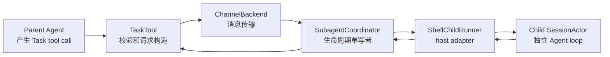
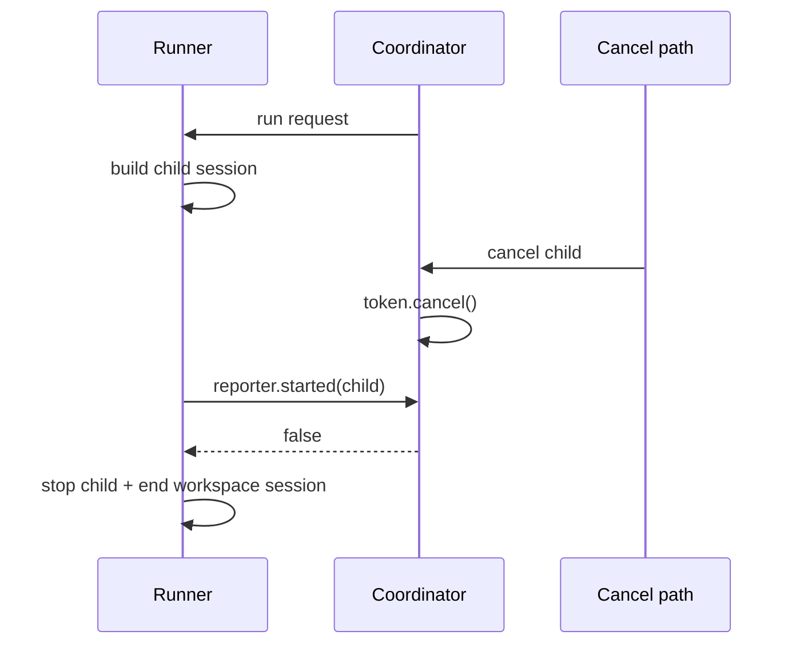
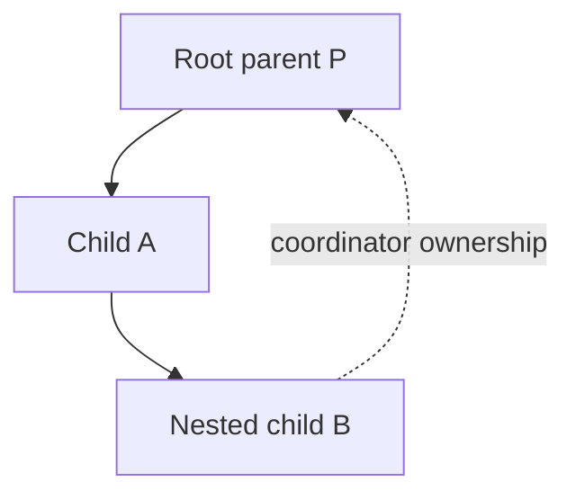

# Subagent 调度、父子状态继承与后台任务协调：Coordinator、Child Session、取消与结果回传

本文研究 Grok Build 如何把一次 `Task` 工具调用变成独立 child session，并在父 Agent、共享 coordinator、shell runner 和 child `SessionActor` 之间管理状态。重点是生命周期单写者、父子资源继承、前台转后台、嵌套归属、取消竞态、usage 归账、结果持久化和 session teardown。

前置阅读：[Subagent 从创建到结果回传](../02-runtime-flows/07-subagent-task.md)、[状态所有权](01-state-ownership.md)、[Prompt 队列与 Turn 调度](03-prompt-queue-and-turn-scheduling.md)、[Agent 构建与重建](06-agent-build-configuration-and-rebuild.md)、[MCP Server 生命周期](07-mcp-server-lifecycle-and-dynamic-tools.md)。运行链路文章回答“发生了什么”，本文进一步回答“谁有权改变状态、为什么不会失控”。

## 先记住结论

1. Subagent 是独立 child session，不是父 conversation 里的一段临时 prompt；它有独立 session ID、conversation、sampling loop、usage ledger、persistence 和 Agent。
2. `SubagentCoordinator` 是生命周期的单写者，独占 `pending`、`active`、`completed`、waiters、deadline、completion buffer 和 spawn-admission 状态。
3. `TaskTool` 不直接创建 shell session。它只做参数校验、组装 `SubagentRequest`，再通过 `SubagentBackend` 向 coordinator 发事件。
4. shell 用 `ShellChildRunner` 实现 host-specific seam；共享 coordinator 不知道 worktree、sampling client、persistence 或 ACP notification 的具体构建方法。
5. 生命周期不是简单 running/done，而是 `Pending → Active → Completed`。Pending 阶段已经可查询、可取消，只是 child runtime 尚未完成注册。
6. `ChildReporter::started` 的 bool acknowledgement 关闭了 cancel-at-promote 竞态：若取消先赢，刚建立的 child 必须立刻拆除，不能继续跑成孤儿。
7. 普通 model-issued `Task` 默认 `fork_context=false`。child 不自动看到父 conversation，父 Agent 必须在 task prompt 中提供必要背景。
8. `Forked`、`Resumed` 和 `New` 是三种不同上下文来源；resume 继承完成 child 的 transcript/tool state/model，不是复制父会话。
9. 父子共享某些基础设施，例如 filesystem/terminal backend、permission handle、process scope、workspace ops 和 coordinator sender；但 cwd、Agent、ToolBridge、conversation、usage 与 persistence 是 child 自己的。
10. MCP connection 可按 definition 的 inheritance policy 共享 `Arc<McpClient>`，但 child 仍需把工具注册到自己的 ToolBridge。
11. skills、MCP、hooks、memory、scheduler 都有独立继承规则；“共享 parent context”不是一个全有或全无开关。
12. tool/capability/permission 只能在父边界和 child definition 约束下收窄，不能用 runtime override 任意扩权。
13. 默认最大 Subagent depth 为 1；有效深度可配置。到达上限时，不只在调用时报错，还会从 child 工具集中剥离 `Task`。
14. 普通 Task coordinator 没有统一的全局并发 semaphore；workflow 子任务有自己的 semaphore。递归深度限制不等于并发限制。
15. `run_in_background=true` 会立即返回 handle，并让 detached backend future 继续；父 tool-call cancellation 不会自动杀掉该 child。
16. foreground Task 并非永远阻塞：超过 coordinator 的 foreground budget 会自动 background，返回可查询 ID；shell 默认 budget 可由环境变量配置，当前 host default 为 600 秒。
17. `definition.background=true` 与调用参数 `run_in_background=true` 不完全相同：前者影响 outstanding/turn accounting，后者决定 spawn caller 是否立刻只拿 handle。
18. coordinator 会发现 foreground caller 的 oneshot receiver 已消失，并把仍运行的 child 转为 handle-only，避免因父调用被 drop 就丢失最终状态。
19. 用户 Stop、当前 prompt cancel、单 ID kill、workflow run cancel 和 session teardown 是五种不同取消范围。
20. 用户 Stop 会把 parent session 加入 `spawn_blocked_sessions`，防止已经 detached 的晚到 Task spawn 越过停止边界；下一 turn 开始才发送 `OpenSpawnAdmission`。
21. workflow-owned child 不被普通 ParentSession Stop 取消；它们由 `WorkflowRunId` 生命周期管理。
22. 嵌套 child 会重新归属 root parent，并关闭普通 completion surface；这样中间 child 完成后，孙 child 仍有稳定 owner，且不会向父 UI 重复冒泡。
23. child completion 先提交 coordinator 状态，再交给 host presentation；通知失败不能回滚 completed registry。
24. foreground result、blocking query waiter、background reminder 之间做 disposition 去重，避免同一个结果重复喂给模型。
25. completed registry 最多保留 1024 项；它是有界索引，不是永久存档。shell 可保存 output reference，并在查询时从磁盘恢复正文。
26. pending completion reminder buffer 也有界，最多 256 项；session teardown 会清除本 session 的 buffer。
27. child usage 会按 model 折入 parent ledger；前台 child 在 turn 结束前有界等待 fold，后台 child 不阻塞 turn，但会让当次报告标为 incomplete。
28. 如果 usage fold 没有得到 parent ack，会设置 sticky `subagent_usage_not_applied`，防止后续报告假装账单完整。
29. 查询 active child 的进度是 pull-based：coordinator 调 `ChildControl::progress()`，不会把整个 child actor 状态共享出来。
30. coordinator actor 使用 `FuturesUnordered` 同时驱动 child runs、validation、description 和 progress，状态 mutation 仍只发生在一个 event loop。
31. runner future panic 会被 `catch_unwind` 转成失败 completion，不会让 coordinator actor 一起退出。
32. coordinator command channel 关闭后会继续等待已接收的 runs/queries settle；最终退出时取消所有仍活跃 child。
33. worktree isolation 是 best-effort。创建失败会退回 shared workspace，所以调用方必须看实际 `worktree_path`，不能只信请求参数。
34. resume 的旧 worktree 若丢失，可以从 snapshot rehydrate；没有 snapshot 时会退回 shared workspace。
35. child session persistence 与 parent 下的 `subagents/<id>` metadata 是两层记录：前者保存会话，后者方便 parent 追踪 provenance 和结果。

## 一、五个角色不要混为一谈



| 角色 | 知道什么 | 不应该直接做什么 |
| --- | --- | --- |
| Parent Agent | 要委派的目标 | 操作 coordinator 的 HashMap |
| `TaskTool` | tool 参数、resources、父 session/prompt ID | 构造 shell child runtime |
| `ChannelBackend` | event sender 与 oneshot | 决定 lifecycle transition |
| `SubagentCoordinator` | 所有 child 状态、deadline、waiter、delivery | 读取 worktree/config 或构造 Agent |
| `ShellChildRunner` | shell config、parent handle、session spawn | 绕过 coordinator 自行宣布完成 |
| Child `SessionActor` | 自己的 prompt、tools、sampling、persistence | 修改 coordinator 内部 registry |

这种分层让 coordinator 可以用 fake runner 做完整状态机测试，也让其他 host 能复用同一生命周期语义。

## 二、源码地图

| 文件 | 关键符号 | 职责 |
| --- | --- | --- |
| `xai-grok-tools/.../task/mod.rs` | `TaskTool` | 参数校验、depth gate、前后台调用 |
| `task/backend.rs` | `SubagentBackend`、`ChannelBackend` | 工具到 coordinator 的窄接口 |
| `task/types.rs` | `SubagentRequest`、`SubagentEvent`、snapshot types | 跨层数据协议 |
| `task/coordinator.rs` | `SubagentCoordinator` | actor loop 与状态迁移 |
| `task/coordinator_state.rs` | child records、reporter、config | 状态载荷和纯辅助函数 |
| `task/coordinator/query.rs` | query/inspect/list | waiter 与 pull progress |
| `xai-grok-shell/.../mvp_agent/subagent_coordinator.rs` | `ShellChildRunner` | shell runner adapter 与 coordinator 启动 |
| `xai-grok-shell/.../subagent/handle_request.rs` | `run_shell_child` | child 的实际解析、构建、运行和 usage fold |
| `xai-grok-subagent-resolution` | definition/context/resume/overrides | 可复用的解析与 policy helper |
| `session/acp_session_impl/tasks_cancel.rs` | cancel integration | turn、Stop 与 child cancel 编排 |
| `session/acp_session_impl/turn.rs` | usage drain | turn 结束前的 child usage 收敛 |
| `xai-grok-tools/src/reminders/task_completion.rs` | completion reminder | 后台完成提示和去重 |

## 三、Subagent 的独立性边界

child 独立拥有：

- child session ID；
- child `SessionActor`；
- 解析后的 `AgentDefinition` 与构建后的 `Agent`；
- ToolBridge 与 Resources 容器；
- conversation 与 prompt queue；
- sampling client/model config；
- persistence directory；
- usage totals 和 turn/tool-call signals；
- child cwd，可能是 worktree；
- compaction 生命周期。

child 可共享或引用 parent/进程级设施：

- async filesystem backend；
- terminal backend；
- LSP backend；
- root process scope；
- permission handle；
- workspace operations；
- hunk tracker；
- scheduler handle（按 owner/policy）；
- subagent event sender；
- MCP client pool（按 inheritance）；
- hooks/skills/config snapshots（按显式规则）。

“独立 session”因此主要保证上下文和控制流独立，不自动等于 OS process、filesystem 或 credential 隔离。

## 四、为什么 coordinator 必须是单写者

若 Tool、runner、UI query 和 cancel path 都直接共享几张 `Mutex<HashMap>`，会出现：

- completion 与 cancel 同时删除记录；
- pending promotion 与 query 看见半状态；
- foreground timeout 与正常完成重复回复 oneshot；
- teardown 与 late spawn 交错留下 orphan；
- completion reminder 在 registry commit 前触发。

coordinator 把所有 mutation 串行化：

```text
external SubagentEvent
internal Started/ResumeSource event
run future completion
validation/description completion
progress future completion
deadline tick
```

并发 future 可以同时推进，但最后都回到同一个 actor loop 修改状态。

## 五、coordinator 拥有的状态

```text
pending                 尚在构建 runtime
active                  已注册 live control
completed               终态索引
completed_order         FIFO eviction 顺序
waiters                 blocking query waiters
workflow_cancel_waiters 等 workflow child 全停的调用者
spawn_blocked_sessions  Stop 后关闭新 spawn 的 parent
usage_not_applied_prompts 账单不完整 sticky 标记
pending_completions     待下轮注入的完成摘要
runs                    child runner futures
validations/descriptions 独立元数据请求 futures
progress                pull-based progress futures
list_requests           多 child list 的 slot 聚合
```

这些状态互有关联，所以不能把某一张表单独暴露为 public shared state。

## 六、Pending 不是“还不存在”

coordinator 接受 Spawn 后立即写入 `PendingChild`，然后才启动 runner future。Pending 保存：

- 完整 `SubagentRequest`；
- started time；
- cancellation token；
- spawn reply oneshot；
- foreground deadline；
- `handle_only`；
- explicit-kill 标志。

这让耗时的 definition resolution、worktree 创建和 child session build 期间：

- query 返回 `Initializing`；
- cancel 能先设置 token；
- duplicate ID 能被拒绝；
- parent teardown 能覆盖它；
- running gauge 能包含它。

若等 child 构建完成才登记，初始化窗口会成为不可见、不可取消的黑洞。

## 七、Pending → Active 的两阶段提交

runner 建好 child 后调用：

```text
reporter.started(StartedChild) -> bool
```

`StartedChild` 携带：

- child session ID；
- persona/resume provenance；
- child cwd/worktree；
- effective model；
- definition background flag；
- `ChildControl`。

coordinator 收到后：

1. 从 pending remove；
2. 检查 cancellation 是否已触发；
3. 若可继续，构造 `ActiveChild` 并 insert；
4. 回复 `true`；
5. 若 pending 已不存在或取消先发生，回复 `false`。

runner 只有拿到 `true` 才能正式继续。`false` 表示它建立的是一个已经失去 admission 的 runtime，必须执行 cleanup。

## 八、cancel-at-promote 竞态



如果 `started` 没有 ack，runner 可能在 cancel 已发生后仍继续 prompt child；coordinator 又认为 child 正在取消，形成失配。bool ack 是一个小接口，却承担两阶段提交中的 commit decision。

## 九、`ChildControl` 为什么只有两个能力

trait 只要求：

```text
progress() -> Future<SubagentProgress>
cancel()
```

coordinator 不需要知道 shell command sender、thread handle 或 session actor 类型。shell 的 `ShellChildRuntime` 把这些细节封装起来。

窄接口带来：

- coordinator 可独立单测；
- host 可以使用 `Send` 或 `!Send` runner；
- query 只拉取必要进度；
- cancel 不需要共享 child 内部锁。

## 十、TaskTool 的资源依赖

`TaskTool::run` 从 ToolBridge Resources 读取：

| Resource | 用途 |
| --- | --- |
| `SubagentBackendResource` | 向 coordinator 发操作 |
| `SubagentDepthCounter` | 当前递归深度 |
| `MaxSubagentDepth` | 有效最大深度 |
| `SessionIdResource` | 绑定 parent ownership |
| `CurrentPromptIdResource` | 绑定 turn-scoped cancel/usage |
| `TaskModelValidator` | 校验 model slug |
| `SubagentForegroundWait` | host 侧前台等待 guard |

Task tool metadata 还要求 background-output 与 kill 工具同时存在。能创建后台 child 却没有查询/终止工具，会让模型失去治理手段，因此 registry 用 requirement expression 约束这组能力共同出现。

## 十一、参数为什么当作不可信输入

模型可能生成：

- 空字符串或字符串 `null` 作为 `resume_from`；
- 带多余引号的 cwd；
- 不存在的 cwd；
- cwd 与 worktree isolation 同时给出；
- 不存在的 subagent type；
- 不可用的 model slug；
- 重复 task ID。

工具层先规范化并给出 model-friendly error，runner 再做 authoritative validation。两次检查不是浪费：中间配置可能变化，也可能有非 TaskTool 的内部 caller。

## 十二、`SubagentRequest` 是创建意图，不是 runtime

请求包含：

```text
identity: id, subagent_type, description
work: prompt
ownership: parent_session_id, parent_prompt_id, owner
continuation: resume_from, fork_context
location: cwd, isolation override
runtime: model, effort, persona, capability, harness, budgets
delivery: run_in_background, surface_completion, await_to_completion
control: cancellation token
```

它不包含 child `SessionActor` 或完整 parent object。这样请求可以在 channel 中传输，也不会把生命周期 owner 偷渡到 runner。

## 十三、ID 的三个用途

model 未提供 `task_id` 时生成 UUID v7。当前 MVP 中：

```text
subagent_id == child_session_id
```

同一个 ID 用于：

- coordinator registry key；
- background query/kill；
- child session identity；
- parent `subagents/<id>` metadata；
- UI notification 与 provenance；
- worktree 名的一部分。

不要把“当前相等”升级成永久协议不变量；类型里仍同时保留两字段，为以后解耦留出空间。

## 十四、类型验证的结果分类

`SubagentValidateTypeOutcome` 区分：

```text
Ok
Unknown { available }
Disabled
NotAllowed { allowed }
ValidationUnavailable
```

最后一种是基础设施错误，不应提示模型改一个 type name 重试；因此 ToolError category 也与 invalid arguments 不同。

`describe_type` 还可以在不 spawn 的情况下构建同样经过 parent-dependent policy 的 toolset summary，供 role gate 和 prompt rendering 使用。

## 十五、深度限制是双保险

默认：

```text
MAX_SUBAGENT_DEPTH = 1
```

但 host 可注入 `MaxSubagentDepth`。真正规则是：

```text
current_depth >= max_depth -> TaskTool 拒绝
child_depth >= max_depth   -> child definition 移除 Task 能力
```

前者防直接调用，后者让模型根本看不到递归工具。只做前者会反复诱导 child 尝试一个必失败工具。

配置解析把小于 1 的值 clamp 到 1。若希望 first-level child 再创建 child，有效 max depth 至少为 2。

## 十六、深度不是并发上限

深度限制控制树高，不限制同一 parent 同时创建多少 sibling：

```text
depth = 1: parent 可同时有 A、B、C 三个 child
max depth = 1: A/B/C 不能再创建孙 child
```

普通 `SubagentCoordinator` 没有 `Semaphore` 或 `max_active` gate。实际并发受模型、tool calls、runtime、API 配额和系统资源影响。

workflow manager/host service 有独立 `Semaphore` 与 `max_concurrent_agents`。那是 workflow orchestration policy，不是所有 `TaskTool` spawn 的全局限制。

## 十七、三种 initial context

| 来源 | conversation 从哪来 | 模型 | 常见 caller |
| --- | --- | --- | --- |
| `New` | child system/project context + task prompt | definition/override/parent fallback | 普通 Task |
| `Forked` | 规范化 parent history + child task prompt | 通常钉到 parent | harness/internal spawn |
| `Resumed` | 已完成 child 的 transcript/tool state | pin source model | `resume_from` |

普通 model-issued Task 明确设置 `fork_context=false`。所以任务 prompt 应是自包含委托，而不是“继续看上面并修一下”。

## 十八、Forked context 为什么需要规范化

fork 不应把 parent 的全部编排噪声原样复制。normalizer 会：

- 只保留最近有限完整 turn；
- 更早部分压缩成统计摘要；
- 去掉 child 会重新生成的 project/user/git/layout reminders；
- 不复制 reasoning；
- 截断 tool args/result preview；
- 把背景包在 `<background_context>`；
- 最后追加真正 child task prompt。

这是 context transfer，不是 conversation object sharing。parent 后续新消息不会自动流入 child。

## 十九、Resume 的身份约束

resume source 必须属于同一 root parent，且只能来自 completed child：

- active source 返回 `Active`，要求先等待；
- completed source 返回 cwd/worktree/snapshot/type/persona/model；
- missing 时再尝试 durable lookup；
- type/persona identity 不匹配则拒绝；
- request 的新 model override 被忽略；
- source model 已不在 catalog 时失败，不静默换模型。

这是 continuation 语义：行为身份和模型应延续，而不是借旧 transcript 创建另一个角色。

## 二十、worktree 的真实语义

新 isolation 请求会从 parent source cwd 创建：

```text
subagent-<id>
```

builder 使用 PreserveWorkingTree，尽量把未提交状态也带入。失败时只 warning 并退回 shared workspace。

所以：

```text
requested isolation != effective isolation
```

有效隔离由返回的 `worktree_path` 表示。需要强隔离保证的上层不能把这个 best-effort fallback 当成功。

## 二十一、Resume worktree 的三种动作

```text
目录仍存在                -> Reuse
目录不存在但有 snapshot   -> Rehydrate
目录不存在且无 snapshot   -> Shared workspace fallback
```

resume 会优先延续来源 child 的 worktree；caller 新 isolation override 不应把一个原本 shared 的 source 强行变成 worktree continuation。

worktree snapshot 是恢复材料，不是 coordinator 完成记录本身。coordinator 只保存 `snapshot_ref`。

## 二十二、能力模式只能取交集

最终 capability 由 request override 与 definition capability 交集得到，再由 `apply_child_tool_policy` 过滤工具。

安全阅读模型：

```text
parent/runtime ceiling
    ∩ child definition ceiling
    ∩ depth policy
    ∩ host feature availability
    = effective child toolset
```

runtime override 可以请求更窄模式，不能借此越过 definition 或 parent 边界扩权。

## 二十三、permission mode 的额外安全门

child definition 可声明 permission mode，但：

- plugin agent 的 permission override 被忽略；
- managed policy 禁止 always-approve 时，`bypassPermissions` 被忽略；
- child 复用 parent permission handle，但仍用自己的 effective tool/cwd context 发请求；
- yolo mode 也受 policy clamp。

共享审批基础设施不等于继承无限许可。

## 二十四、Hooks 的继承与改写

agent definition hooks 需要：

- 非 plugin agent；
- project-scoped agent 所在 folder 已信任；
- hook 配置成功解析。

child-specific hook 会追加到已有 registry。普通 `Stop` hook 被改写为 `SubagentStop`，防止 child 结束误触发只为 primary session 定义的生命周期语义。

## 二十五、Memory 的独立 scope

若 definition 开启 memory：

- 确保必要 read/write/edit tools 在 child toolset 中；
- 按 agent name 和 parent project 解析 memory directory；
- 读取有限大小的 `MEMORY.md` 注入 child prompt；
- 配置 child memory root。

memory 不是复制 parent conversation；它是按 agent/project scope 解析的持久知识源。

## 二十六、Skills 不是默认全继承

只有 `definition.inherit_skills` 时：

- 获取或复用 parent skills discovery 结果；
- 把 parent skills config/preloaded skills 传给 child build；
- 记录 inherited count。

否则 child 使用默认 skills config 并独立发现/构建。显式规则避免把 primary agent 的大量技能说明无条件塞进所有 child context。

## 二十七、MCP 的 owned 与 inherited

child MCP 有两条来源：

1. definition 自己的 `mcp_servers`：named ref 从 parent config 查找，或解析 inline config；
2. `mcp_inheritance` 允许的 parent shared pool。

plugin agent 的 agent-owned MCP 声明出于安全原因被忽略。继承的 client 是共享 `Arc<McpClient>`，自有 server 则由 child session 初始化。

连接共享后仍要在 child ToolBridge 注册工具；status/liveness 由 owner 统一管理，避免重复通知。

## 二十八、Scheduler 为什么按 owner 区分

普通 child 可复用 parent scheduler handle，使计划任务不因 child session 退出立刻丢失。

workflow-owned child 则：

- 从 toolset 移除 scheduler create/list/delete；
- spawn child session 时不注入 parent scheduler handle；
- 生命周期由 workflow engine 管理。

否则 workflow child 可以在另一个调度系统里再创建长寿命任务，破坏 workflow run 的取消和完成边界。

## 二十九、Nested child 的重新归属

当 coordinator 收到的 request.parent_session_id 对应一个 active child session 时，会把它改成 root parent session ID。

同时：

- `surface_completion=false`，防止孙 child 向 root parent 独立冒泡普通 reminder；
- 若 spawner 属于 workflow，孙 child 继承 workflow owner；
- 继承 loop task lineage；
- 若 spawner 正在取消，直接拒绝 late nested spawn。



运行关系仍是 A 创建 B，但治理 owner 是稳定的 root P。

## 三十、为什么需要 re-parent

若 B 只属于 A：

- A 完成后 coordinator 可能认为其 session 已无 owner；
- root Stop 无法完整找到 B；
- usage/completion 归属会形成多级级联；
- A teardown 可能误杀本应继续的 workflow B；
- parent session scoping 的 query/kill 变复杂。

re-parent 将治理拓扑压平，同时用 depth/provenance 保留创建关系。

## 三十一、前台 Task 的 cancellation forwarding

foreground 模式会创建 child cancellation token，并启动 forwarder：

```text
tool-call cancellation -> child token.cancel()
```

backend spawn 返回后 abort forwarder。这样父 tool call 被取消时，仍阻塞等待的 child 跟着停止。

background 模式不建立这个 forwarder。既然工具已经返回 handle，原 tool-call future 的结束不应自动杀掉 child。

## 三十二、后台模式为何是 detached spawn future

`run_in_background=true` 时，TaskTool：

1. `tokio::spawn` 一个 future 调 `backend.spawn(request)`；
2. 立即向模型返回 subagent ID 和查询工具名；
3. future 继续等待 coordinator 最终 reply；
4. late transport/rejection 只写日志；
5. coordinator 保存状态供 query/reminder。

不是把 request fire-and-forget 后完全不接收结果；detached future 仍把 oneshot 生命周期保持到 completion。

## 三十三、foreground budget 与自动 background

coordinator 为普通 foreground request 设置 deadline：

```text
!run_in_background && !await_to_completion
```

共享 `CoordinatorConfig` 默认是 45 秒；shell host 启动 coordinator 时用 `GROK_SUBAGENT_AWAIT_BUDGET_MS`，fallback 当前为 600 秒。

到 deadline 后：

- reply 一个 `backgrounded=true` 的结果/handle notice；
- child 继续运行；
- `handle_only=true`；
- 完成后通过 query/reminder surface。

`await_to_completion=true` 是 harness/workflow 内部语义，不设置这个 foreground deadline。

## 三十四、definition background 与 call background

两者区别：

| 维度 | `run_in_background` | `definition.background` |
| --- | --- | --- |
| 来源 | 本次 Task 参数 | AgentDefinition |
| spawn caller 是否立刻返回 | 是 | 不一定 |
| `handle_only` 初值 | true | 不直接决定 |
| outstanding 是否阻塞 turn | 不阻塞 | 不阻塞 |
| completion surface | 通常通过 reminder/query | 取决于 request disposition |

因此一个 definition-declared background child 即使由 blocking tool call 发起，也不应被 usage/turn accounting 当成 foreground blocker。

## 三十五、caller 消失时为什么自动 background

coordinator 定期检查 `spawn_reply` receiver 是否 closed。若父 tool future 被 drop，却没有正式 cancel：

- child 不一定应该被杀；
- coordinator 不能继续尝试 foreground delivery；
- completion 应转为 handle/reminder 路径。

`background_if_caller_gone` 把 disposition 转成 background。它是 response-channel 生命周期反映到业务状态的例子。

## 三十六、Query 的四种结果

`query(id, block, timeout)`：

- completed：立即返回 terminal snapshot；
- active + non-block：异步拉 progress 后返回 Running；
- pending + non-block：返回 Initializing；
- active/pending + block：登记 waiter，完成或 timeout 时回复；
- 不属于当前 parent、workflow-owned 或不存在：返回 None。

parent-session scoping 防止一个 session 用猜到的 UUID 查询/取消另一个 session 的 child。

## 三十七、blocking query timeout 不取消 child

waiter deadline 到达后：

- active child 返回最新 Running progress；
- pending child 返回 Initializing；
- 若刚好完成则返回 terminal snapshot。

timeout 只结束“这次等待”，不是 kill。调用方可稍后再次 query。

## 三十八、progress 为什么是 pull-based

`SubagentProgress` 包含：

- turn count；
- tool-call count；
- tokens/context window/pct；
- distinct tools used；
- error count。

coordinator 不持续订阅 child 每个细粒度事件。query/list 时才通过 `ChildControl::progress` 取 snapshot，降低跨 session 事件流耦合。

若 progress future 返回时 child 已完成，coordinator 会重新查 completed，而不是返回过期 Running 状态。

## 三十九、多 child list 的 slot 聚合

`ListRunning` 为每个 active child 发起 progress future，并用 `request_id + index` 写入 slots。

所有 slot settle 后才回复 Vec；中途完成或消失的 child 对应 None，最后过滤/聚合。`next_list_request_id` wrapping increment 只需在同时存活的 request map 中保持不冲突。

## 四十、五种取消范围

| target | 典型来源 | 影响 |
| --- | --- | --- |
| `SubagentId` | kill tool | 单个 child，标记 explicitly killed |
| `ParentPromptId` | turn cancel/max turns | 当前 prompt 创建的 child |
| `ParentSession` | 用户 Stop/Esc | 此 parent 的所有非-workflow child |
| `WorkflowRunId` | workflow cancel | 同一 workflow run 的 children |
| `TeardownSession` | session unload/evict | 关闭 surface 并取消该 parent children |

取消 scope 必须携带或验证 parent session，避免共享 coordinator 上的 wildcard 误伤。

## 四十一、Pending 与 Active 的取消不同

对 active：

```text
cancellation token.cancel()
ChildControl.cancel()
```

对 pending：

```text
cancellation token.cancel()
```

pending 尚无 `ChildControl`。runner 应在耗时阶段观察 token，并在 `started` ack 为 false 时拆除刚构建 runtime。

## 四十二、User Stop 的 late-spawn gate

背景 TaskTool future 可能在用户按 Stop 时已经 detached，但 Spawn event 尚未到 coordinator。仅扫描当前 pending/active 不够。

ParentSession cancel 会：

1. 把 session ID 加入 `spawn_blocked_sessions`；
2. 取消当前所有非-workflow child；
3. 拒绝随后到达的 late Task spawn；
4. 下一 user turn 开始发送 `OpenSpawnAdmission` 清除 block。

这是时间边界上的 admission control，而不只是对当前集合做一次 cancel sweep。

## 四十三、为什么 workflow 不跟 User Stop 一起取消

workflow 是独立的长生命周期 owner。用户停止当前交互 turn，不应自动破坏已提交 workflow run。

coordinator 使用 `SubagentOwner` 区分 `Task` 与 workflow owner：

- ParentSession cancel 跳过 workflow children；
- workflow query 不暴露给普通 Task query；
- workflow completion 不进入普通 reminder buffer；
- workflow run cancel 有自己的 waiter，直到 outstanding 归零才 ack。

## 四十四、Session teardown 比 Stop 更彻底

`TeardownSession`：

- 删除该 parent 的 buffered completions；
- 清除 spawn admission block；
- 把 pending/active 的 `surface_completion=false`；
- 取消它们；
- 防止同 session ID 未来恢复时收到旧 completion reminder。

Stop 代表“当前 session 还活着，只是停止工作”；teardown 代表“owner 已消失”。

## 四十五、完成的提交顺序

runner future settle 后，coordinator：

1. 从 active 或 pending 取出 record；
2. 构造 `CompletedChild`；
3. 解析 persisted output ref；
4. 唤醒 blocking query waiters；
5. 尝试 foreground spawn reply；
6. 按策略加入 completion buffer；
7. 若正文已持久化，清空内存 result output；
8. 计算 `CompletionDisposition`；
9. insert completed registry；
10. 更新 running gauge；
11. 调 `runner.on_completed` 做 host presentation；
12. 解析 workflow cancel waiters。

状态先 commit，再做 presentation，保证 UI/notification 失败时 query 仍能看到完成事实。

## 四十六、CompletionDisposition 防重复交付

字段：

```text
foreground_delivered
backgrounded
waiter_delivered
explicitly_killed
should_surface
```

`should_surface` 要求：

- request 允许 surface；
- 当前已是 handle-only；
- 不是 cancelled；
- 没有 waiter 已拿到结果；
- 不是模型/用户显式 kill。

否则同一输出可能既作为 Task tool result，又作为系统 reminder，再作为 query result重复注入模型。

## 四十七、完成 reminder 的去重

between-turn reminder 同时处理 bash background task 与 subagent completion。`ReportedTaskCompletions` 记录已报告 ID。

若模型已经通过 `get_task_output` 或 multi-wait 得到 terminal output，对应 ID 会进入 suppress set，completion drain 不再重复提醒。

若当前 toolset 没有 polling tool，reminder 必须 inline 完整 subagent output；否则模型永远没有取回正文的手段。

## 四十八、completed registry 为什么有界

`MAX_COMPLETED_ENTRIES = 1024`，使用 `completed_order` 淘汰最旧项。

内存 registry 的职责是近期 query/resume 索引，不是档案系统。Subagent output 可能很大，因此 `SubagentResult.output` 使用 `Arc<str>` 避免多份 summary clone。

shell runner 可返回 persisted output directory。coordinator 保存 reference 后清空内存正文；查询时调用 runner loader：

```text
read success -> 恢复正文
read failure -> [subagent output no longer available]
```

## 四十九、completion buffer 也必须有界

`pending_completions` 最多 256 项，超出从最旧开始删除。原因是 session 可能未正常发送 teardown，若 buffer 永不 drain 会持续 pin output `Arc`。

buffer entry 用 wrapper 保存 parent session ownership；drain 时只取当前 session 的条目，foreign entries 放回。

## 五十、child persistence 的两层结构

child 有自己的 session directory，用正常 persistence 保存 conversation、model、events 等。

parent session directory 下另有：

```text
subagents/<subagent_id>/
```

其中 metadata 记录：

- parent/child ID；
- type、description、prompt；
- running/completed status；
- timestamps、duration、turn/tool counts；
- context source 与 normalization；
- persona/resume provenance；
- effective cwd/worktree/snapshot；
- effective model/error。

前者支持恢复 child 会话，后者支持 parent 视角追踪和 durable resume lookup。

## 五十一、runner panic 为什么不会杀 coordinator

每个 `runner.run` 被：

```text
AssertUnwindSafe + catch_unwind
```

包裹。panic 被转换成：

```text
success=false
error="Subagent runtime panicked"
```

然后走正常 `finish_child`。这避免一个 child adapter bug 清空整个进程级 coordinator 的其他 children。

它只能捕获 Rust unwind；进程 abort 或 runtime fatal error 不在此保证内。

## 五十二、Coordinator channel 关闭后的行为

command sender 全部 drop 后，actor 将 `commands_open=false`，但不会立即退出。只要 runs、validation、description 或 progress future 仍非空，它继续 select 驱动。

全部 settle 后退出，并调用 `cancel_all_children` 作为防御清理。

这种 drain semantics 避免“最后一个 backend drop 导致已接收 child 瞬间失踪”。

## 五十三、Child usage 如何回到 parent

child 完成时读取自己的 usage totals，并按 model 构造 usage entries。runner 通过 parent command path 请求 fold，只有 parent chat state ack 后才视为成功。

usage 数据包括：

- input/output/total token；
- per-model usage；
- output tokens 是否可确定；
- cancellation 是否可能隐藏 usage；
- ledger 是否已 incomplete。

completion result 也暴露 `tokens_used`、`output_tokens_used`、`total_tokens_used` 和 `output_usage_incomplete`。

## 五十四、为什么 turn 完成前还要 drain usage

foreground child 可能刚结束，但 usage fold command 尚在 parent actor queue。若立即 freeze parent prompt report，会少算 child token。

turn task 最多等待 turn-blocking children/folds，当前正常上限 120 秒，每 50 ms 查询 `Outstanding`：

```text
live_ids empty -> 可冻结
background_live -> 不等待，但 report incomplete
query failure/timeout -> fail closed，report incomplete
sticky usage_not_applied -> report incomplete
```

这个等待必须在 turn task，而不能阻塞 session actor loop；否则 fold command 自己永远没有机会被 actor 处理，形成死锁。

## 五十五、后台 usage 为什么不阻塞 turn

background child 可能运行几分钟。让 parent turn 等它会违背 background 语义。

所以：

- 当前 prompt report 标记 incomplete；
- child 完成后 usage 仍折入 session ledger；
- 后续 session totals 可包含它；
- 不能声称当时那条 prompt usage report 是最终完整账单。

这是“交互延迟”和“计费最终一致性”的折中。

## 五十六、sticky usage-not-applied

若 runner 尝试 fold usage 但 parent command/ack 失败，coordinator 记录：

```text
PromptScope(parent_session_id, prompt_id)
```

之后 `Outstanding` 即使没有 live child，也返回 `subagent_usage_not_applied=true`。只有 freeze/cancel 已把 incomplete 状态纳入报告后，session 才发送 Clear event。

没有 sticky，瞬时 fold failure 会在 child record结束后失去证据，后续报告错误显示 complete。

## 五十七、CurrentPromptId 的作用

每轮 prompt 开始时，session 把 `CurrentPromptIdResource` 更新为当前 ID；结束且 actor 真正 idle 时清空。

TaskTool 把它写入 `parent_prompt_id`，用于：

- turn-scoped cancel；
- usage fold attribution；
- spawned refs；
- fork provenance；
- outstanding query；
- completion suppression。

如果 stale completion 错误清空新 turn 的 resource，下一批 child 会归到错误 prompt。因此清空操作有 idle gate。

## 五十八、父 session 被 evict 时的 spawn

`ShellChildRunner::run` 首先用 root parent ID 构造 `SubagentSpawnContext`。若 resident handle 已不存在：

- 不 panic；
- 返回失败 result；
- error 指明 parent session 已 evicted/torn down；
- 不创建 child。

在真正 run 前还 snapshot parent MCP pool、client hooks 和 tool definitions。snapshot 后 parent 变化不会把可变 borrow 带进长 async build。

## 五十九、LocalSet 与 `!Send` runner

shell runner 需要访问 `MvpAgent` 的本地状态和 ACP gateway，future 不保证 `Send`。`start_subagent_coordinator` 使用 `LocalRef` 和 `spawn_local`。

共享 coordinator trait 不强制 future `Send`：

- local shell runner 返回 `LocalBoxFuture`；
- 多线程 host 可以返回 `SendBoxFuture`；
- actor future 自然继承 runner future 的 Send 性质。

调用 shell coordinator 必须位于 Tokio LocalSet，否则 `spawn_local` 会 panic。

## 六十、并发不等于共享可变状态

coordinator 的 `FuturesUnordered` 可同时运行许多 child future；这不会破坏单写者，因为 child future 输出只在 `runs.next()` 分支被串行消费。

同理 validations、descriptions、progress 各自并发，但最终 reply 和 map mutation 都回到 actor loop。

这是 actor 模式的重要性质：I/O 并发，状态提交串行。

## 六十一、安全边界汇总

1. parent session ID scope 限制 query/cancel 可见性。
2. type 在 tool 层与 runner 层双重验证。
3. capability 取交集，runtime override 不能扩权。
4. depth 同时由调用 gate 与 toolset stripping 保证。
5. plugin agent 的 permission、hooks、owned MCP受到额外限制。
6. folder trust 决定 project agent inline hooks 是否允许。
7. managed policy 可禁止 bypass permissions。
8. worktree fallback 必须对调用方可见，不能假装强隔离成功。
9. Stop 关闭 late-spawn admission。
10. teardown 关闭 future completion surface。

## 六十二、关键不变量

1. 一个 subagent ID 最多存在于 pending、active、completed 之一。
2. duplicate ID 跨三张表都必须拒绝。
3. Pending 在 runner 启动前先登记。
4. Pending → Active 需要 coordinator ack。
5. cancel token 是 pending/active 都存在的统一控制信号。
6. `ChildControl` 只在 Active 存在。
7. completion 先 commit registry，再 host presentation。
8. foreground reply、waiter、reminder 不能重复交付同一结果。
9. completed 和 completion buffer 都有界。
10. query/cancel 必须符合 parent ownership。
11. workflow 与普通 Task owner 的取消/surface 语义分离。
12. Stop 后 late non-workflow spawn 被阻止，直到下一 turn reopen。
13. nested child re-parent 到 root owner。
14. background child 不阻塞 prompt usage freeze，但必须标 incomplete。
15. fold failure 留 sticky 证据。
16. runner panic 被转成 terminal failure。

## 六十三、常见误读

### 误读 1：Subagent 与 parent 共用 conversation

不对。普通 Task 是 New context；只有显式 fork/resume 复制经过处理的内容。

### 误读 2：TaskTool 自己创建 child actor

不对。它只通过 backend 发 request；shell runner 才构建 child。

### 误读 3：Pending child 不能查询或取消

不对。它返回 Initializing，并持 cancellation token。

### 误读 4：最大深度 1 表示最多一个并发 child

不对。它限制树高，不限制 sibling 数量。

### 误读 5：所有 subagent 都受 workflow semaphore 限制

不对。普通 Task coordinator 无统一 semaphore；workflow 有专门并发 gate。

### 误读 6：foreground Task 一定等到完成

不对。超出 foreground budget 会自动转后台；只有 `await_to_completion` 无该 deadline。

### 误读 7：background tool call 结束会取消 child

不对。background 不转发 tool cancellation，child 由 ID/parent/workflow scope 管理。

### 误读 8：用户 Stop 会取消 workflow child

不对。ParentSession cancel 跳过 workflow owner。

### 误读 9：请求 worktree 就保证隔离

不对。创建失败会 fallback shared workspace，检查实际 path。

### 误读 10：共享 MCP pool 后 child 自动有工具

不对。共享连接，child 仍需注册到自己的 ToolBridge。

### 误读 11：completed map 就是永久历史

不对。它最多 1024 项；durable data 在 persistence/metadata/output ref。

### 误读 12：child 完成时 parent prompt usage 已自动完整

不一定。usage fold 需要 parent ack，turn freeze 还要等待 outstanding 收敛。

### 误读 13：blocking query timeout 会杀 child

不对。它只返回当前 snapshot。

### 误读 14：runner panic 会终止所有 subagent

不对。单 run panic 被捕获为失败结果。

### 误读 15：嵌套 child 永远归直接 parent child

不对。治理上 re-parent 到 root session。

## 六十四、新增 lifecycle 状态时的检查清单

- 是否仍能保证 ID 只在一张主表？
- query/inspect/list/outstanding 是否认识新状态？
- cancel 的五种 scope 是否覆盖？
- next deadline 是否包含新 timer？
- completion disposition 是否会重复交付？
- running gauge 是否计数正确？
- teardown 是否清理？
- actor channel close 是否能 drain？
- completed eviction/resume 是否仍成立？
- fake runner 测试是否能构造该状态？

## 六十五、新增继承资源时的检查清单

- 资源是 process-level、parent-session-level 还是 child-owned？
- 是共享 handle、只读 snapshot 还是深复制？
- parent teardown 后 child 是否还能安全使用？
- child cwd/worktree 是否需要重新绑定？
- 权限是否只能收窄？
- plugin/untrusted folder 是否允许？
- workflow owner 是否应继承？
- Agent rebuild 后是否重新注入？
- fork/resume/new 三种 context 是否一致？
- 是否意外形成 parent↔child 强引用环？

## 六十六、修改后台完成交付时的检查清单

- foreground result 是否已经交付？
- blocking waiter 是否拿到 terminal snapshot？
- completion reminder 是否需要 suppress？
- polling tool 不存在时是否 inline output？
- explicit kill/cancel 是否还会误 surface？
- nested/workflow internal child 是否应隐藏？
- buffer 是否继续有界？
- persisted output 丢失时是否给 placeholder？
- session teardown 后是否还有旧 reminder？
- output 大小是否只 clone `Arc`？

## 六十七、修改取消逻辑时的检查清单

- Pending 和 Active 是否都处理？
- Active 是否同时触发 token 与 `ChildControl::cancel`？
- parent session scope 是否必填？
- workflow owner 是否正确排除/包含？
- cancel-at-promote ack 是否仍闭合？
- late spawn admission 是否关闭？
- 下一 turn 是否 reopen？
- teardown 是否关闭 surface？
- backoff/sleep/persistence await 是否观察 token？
- explicit kill 是否阻止 reminder？

## 六十八、推荐调试顺序

### Task 一直显示 Initializing

1. 查 pending registry 是否存在；
2. 查 worktree/definition/model/persistence build 卡在哪；
3. 查 cancellation token；
4. 查 runner 是否调用 `reporter.started`；
5. 查 ack 是否 false；
6. 查 child spawn error 是否转 terminal output。

### child 在 Stop 后仍启动

1. ParentSession cancel 是否发送；
2. backend 是否绑定具体 session ID；
3. `spawn_blocked_sessions` 是否包含 parent；
4. request 是否 workflow-owned；
5. 是否过早发送 `OpenSpawnAdmission`；
6. nested request 是否正确 re-parent。

### 完成结果重复出现

1. `foreground_delivered`；
2. `waiter_delivered`；
3. `handle_only/backgrounded`；
4. completion suppress IDs；
5. `ReportedTaskCompletions`；
6. `surface_completion` 是否应为 false。

### usage 少算

1. child ledger 是否有 usage；
2. `record_subagent_usage` 是否发 parent command；
3. parent 是否 ack；
4. parent prompt ID 是否正确；
5. outstanding 是否还有 live foreground child；
6. sticky `usage_not_applied` 是否设置；
7. background_live 是否让 report incomplete。

### resume 找不到输出或 worktree

1. completed registry 是否已淘汰；
2. durable metadata 是否存在；
3. persisted output ref 是否可读；
4. source parent ownership 是否一致；
5. snapshot ref 是否存在；
6. source model 是否仍可用。

## 六十九、推荐源码阅读顺序

1. `task/types.rs::SubagentRequest` 与 `SubagentEvent`。
2. `task/coordinator_state.rs` 的 Pending/Active/Completed。
3. `task/coordinator.rs::run` 与 `handle_command`。
4. `handle_internal` 的 promote ack。
5. `finish_child` 与 `CompletionDisposition`。
6. `coordinator/query.rs` 的 waiter/progress。
7. `task/mod.rs::TaskTool::run` 的前后台分支。
8. shell `subagent_coordinator.rs::ShellChildRunner`。
9. `handle_request.rs::run_shell_child`。
10. `xai-grok-subagent-resolution` 的 context/resume/overrides。
11. session cancel 与 usage drain。
12. `task_completion.rs` 的 reminder 去重。

## 七十、可执行验证

定位状态机：

```sh
rg "struct SubagentCoordinator|struct PendingChild|struct ActiveChild|struct CompletedChild" \
  crates/codegen/xai-grok-tools/src/implementations/grok_build/task

rg "reporter.started|spawn_blocked_sessions|OpenSpawnAdmission" \
  crates/codegen/xai-grok-tools/src/implementations/grok_build/task \
  crates/codegen/xai-grok-shell/src
```

运行 coordinator 定向测试：

```sh
cargo test -p xai-grok-tools coordinator_tests
```

先列 shell Subagent 相关测试，再选择 filter：

```sh
cargo test -p xai-grok-shell --lib -- --list | rg "subagent|usage_fold|orphan"
```

建议的最小实验：

1. foreground budget 设很短，确认 child 自动 background 后仍完成；
2. 用 barrier 卡在 `reporter.started` 前，发送 cancel，确认 ack=false；
3. Stop 后延迟发送 Spawn，确认 admission gate 拒绝；
4. 下一 turn reopen 后确认新 Task 可启动；
5. 同时创建多个 depth-1 sibling，验证 depth 不限制并发；
6. worktree builder 故意失败，确认 effective path 是 shared workspace；
7. query 已完成 child，确认正文从 persisted ref 恢复。

## 七十一、阅读练习

### 练习 1：画状态与交付两个正交维度

生命周期画 Pending/Active/Completed；交付状态另画 Foreground/Handle-only/Waiter-delivered。解释为何不能塞进一个 enum。

### 练习 2：构造 caller-gone

spawn foreground child 后 drop reply receiver，不 cancel child。断言 coordinator 将它 background，并在完成后允许 surface。

### 练习 3：构造 nested late spawn

取消 A 后让 A 的 detached Task 再发 B。断言 B 被拒绝为“parent subagent is being torn down”。

### 练习 4：验证 usage sticky

让 parent fold command sender 关闭。child 完成后查询 Outstanding，断言 live_ids 为空但 `subagent_usage_not_applied=true`。

### 练习 5：验证 bounded registries

完成 1025 个 fake child，断言最旧项被淘汰，最新 1024 项仍可查询。

## 七十二、阅读后自测

1. 为什么 coordinator 不能只保存 active/completed 两张表？
2. `reporter.started` 为什么需要返回 bool？
3. `CancellationToken` 与 `ChildControl::cancel` 各覆盖哪个阶段？
4. 普通 Task child 为什么看不到 parent conversation？
5. fork 与 resume 的来源和模型语义有何不同？
6. 哪些资源共享，哪些状态必须 child-owned？
7. depth limit 为什么既在 TaskTool 检查又在 child toolset 过滤？
8. 普通 Task 的 sibling concurrency 由哪个 coordinator 字段限制？
9. `run_in_background` 与 definition background 有何不同？
10. foreground caller 消失后 coordinator 为什么不直接 cancel child？
11. blocking query timeout 为什么返回 Running 而不是 Cancelled？
12. ParentSession Stop 为什么需要 spawn admission gate？
13. workflow child 为什么不跟普通 Stop 一起取消？
14. nested child re-parent 解决了哪些 orphan 问题？
15. completion 为什么先写 completed map 再发 UI 通知？
16. persisted output ref 如何降低内存占用？
17. background child usage 为什么让当前 report incomplete？
18. sticky usage flag 防止什么错误结论？
19. worktree request 与 effective isolation 为什么可能不同？
20. command channel 关闭时 coordinator 为什么仍需 drain runs？

## 本篇术语表

| 名词 | 白话解释 | 在本篇中的具体含义 |
| --- | --- | --- |
| Subagent | 被另一个 Agent 委派工作的独立 Agent | 由独立 child session、Agent、conversation 和 sampling loop 实现 |
| parent | 发起委派的一侧 | root `SessionActor`/Agent，不一定是直接创建 nested child 的中间 child |
| child session | 为 Subagent 单独建立的会话 | 有自己的 session ID、persistence、ToolBridge 和 usage |
| coordinator | 统一接收命令并管理多个 child 的调度者 | `SubagentCoordinator`，生命周期状态的单写者 |
| single writer | 只有一个执行者能修改某组状态 | 所有 child map/deadline/waiter 只由 coordinator actor loop 修改 |
| actor | 通过消息串行处理状态的并发组件 | coordinator 和各 `SessionActor` 都是 actor，但职责不同 |
| runner | 把抽象 child request 变成 host runtime 的适配器 | `ShellChildRunner` 调 `run_shell_child` 创建 shell child session |
| adapter/seam | 隔离实现差异的窄接口 | `ChildRunner` 让共享 coordinator 不依赖 shell 细节 |
| backend | 工具用于发送 subagent 操作的抽象 | `SubagentBackend`，shell 实现是 `ChannelBackend` |
| `Resources` | ToolBridge 内按类型存放运行依赖的容器 | TaskTool 从中取得 backend、session/prompt ID、depth 和 model validator |
| `SubagentRequest` | 描述要创建什么 child 的数据 | 包含 prompt、type、owner、override、delivery 和 cancel token |
| `SubagentEvent` | coordinator 接收的命令枚举 | Spawn、Query、Cancel、Completions、Outstanding 等 |
| mpsc | 多发送者、单接收者 channel | 多个 session/tool clone sender，共享 coordinator 独占 receiver |
| oneshot | 只能回复一次的 channel | spawn/query/validate/cancel 的 request-response envelope |
| Pending | child 正在解析或构建、尚无 live control | 已在 registry，可查询 Initializing 和取消 |
| Active | child runtime 已建立且 coordinator 接受 | 保存 `ChildControl`，可拉 progress、主动 cancel |
| Completed | child 已终止的近期索引 | 保存 result/provenance/output reference，最多 1024 项 |
| promotion | Pending 升为 Active | runner 上报 `StartedChild`，coordinator ack 后才 commit |
| acknowledgement/ack | 接收方明确确认操作已被接受 | `started()` 的 bool 关闭 cancel-at-promote 竞态 |
| two-phase commit | 先准备，再由 owner 决定是否提交 | runner prepare child，coordinator ack 决定是否正式运行 |
| race condition | 执行先后不同会改变错误结果的竞态 | cancel 与 promote、completion 与 query、Stop 与 late spawn |
| `ChildControl` | coordinator 持有的最小 live-child 控制接口 | 只有 `progress` 和 `cancel` |
| `ChildReporter` | runner 回传初始化事件的句柄 | 报告 started，并向 coordinator 查询 resume source |
| lifecycle | 对象从创建到结束的状态变化 | Pending → Active → Completed，并伴随 cancel/eviction |
| disposition | 完成结果应如何交付的决定 | foreground、background、waiter、surface、explicit kill 的组合 |
| foreground | 当前 Tool call 阻塞等待 child | 可能在 budget 到期后自动转后台 |
| background | Tool call 已返回 handle，child 继续运行 | 完成通过 query/reminder/auto-wake 交付 |
| handle-only | 调用方只持 ID，不再等待直接 result | coordinator 的 `handle_only` delivery 状态 |
| foreground budget | 前台最多阻塞多长时间 | 到期后 child 继续，但 spawn caller 收到 backgrounded notice |
| detached future | 创建者不再 await，但 runtime 仍驱动的 future | background TaskTool 用 `tokio::spawn` 保持 backend spawn/reply |
| deadline | 某个等待必须结束的时间点 | foreground auto-background 和 blocking query waiter timeout |
| waiter | 阻塞查询等待 terminal state 的调用者 | 保存 deadline 与 response oneshot，不拥有 child |
| snapshot | 某一时刻的只读状态副本 | Initializing、Running progress 或 terminal output |
| inspection | snapshot 加完整 lifecycle metadata | 还包含 parent/child ID、fork prompt、resume provenance |
| pull-based | 需要时主动读取，而非持续推送 | active progress 在 query/list 时通过 `ChildControl::progress` 获取 |
| `FuturesUnordered` | 并发轮询多个 future、按完成顺序产出 | coordinator 同时驱动很多 child/validation/progress |
| `catch_unwind` | 捕获 Rust panic unwind | 把单 child runner panic 转成失败 completion |
| LocalSet | Tokio 在单线程调度 `!Send` future 的容器 | shell coordinator/runner 通过 `spawn_local` 运行 |
| `!Send` | future/对象不能安全移到其他线程 | shell runner访问本地 `MvpAgent` 状态，因此无需强制 Send |
| context source | child 初始 conversation 的来源 | New、Forked 或 Resumed |
| fork | 从 parent history 生成压缩背景 | 不是共享 live conversation；普通 Task 默认不开启 |
| resume | 从已完成 child 的上下文继续 | pin source type/persona/model，并恢复 transcript/tool state |
| provenance | 数据/child 从哪里来的记录 | parent prompt、resumed-from、context source、persona、model 等 |
| normalize | 删除噪声并转换成稳定结构 | forked context 只保留有限 turn 和必要 tool previews |
| verbatim | 尽量保持原文、不做摘要 | 特定 harness fork 可保留 inherited system/tool definitions |
| worktree | 与主工作目录分开的 Git 工作树 | Subagent best-effort isolation，可失败并 fallback |
| fallback | 首选方案失败后使用较弱替代方案 | worktree 创建失败或丢失时使用 shared workspace |
| rehydrate | 从保存的 snapshot 重建已丢失资源 | resume 时恢复旧 subagent worktree |
| capability mode | 对 child 可用能力的高层限制 | 与 definition/parent policy 取交集后过滤 toolset |
| permission mode | 工具调用如何请求或绕过审批的配置 | plugin/managed policy 会限制 child override |
| folder trust | 用户是否信任 project 目录中的主动配置 | 决定 project agent inline hooks 能否执行 |
| hook | 生命周期节点执行的外部动作 | child Stop hook 改写成 `SubagentStop` |
| skills inheritance | 是否把 parent 的 skills 发现结果交给 child | 由 `definition.inherit_skills` 显式控制 |
| MCP inheritance | 是否复用 parent 已连接的 MCP clients | 共享连接 pool，仍在 child ToolBridge 本地注册 |
| scheduler handle | 创建和管理计划任务的共享控制句柄 | 普通 child 可继承，workflow child 不继承 |
| owner | 决定 child 由哪个生命周期域治理 | 普通 Task 或具体 workflow run |
| root parent | 整棵 nested child 树的顶层 session owner | nested requests 在 coordinator 中 re-parent 到它 |
| re-parent | 把治理归属从直接 parent 改为 root parent | 简化 Stop、usage、query 和 orphan cleanup |
| orphan | 仍运行但已经没有可治理 owner 的 child | promote ack、re-parent、teardown 和 admission gate共同防止 |
| spawn admission | 当前是否允许某 parent 新建 child | User Stop 后关闭，下一 turn 再打开 |
| late spawn | Stop/cancel 后才到 coordinator 的旧请求 | detached Task future 可能产生，由 blocked set 拒绝 |
| cancellation token | 可被多方触发、供 async 代码观察的取消信号 | Pending/Active 都持有，runner 在长步骤中检查 |
| explicit kill | 模型/用户按 ID 明确终止 child | 设置标志，完成后不再 surface reminder |
| turn-scoped cancel | 只取消某 parent prompt 创建的 children | `ParentPromptId` target，不误伤早先后台任务 |
| session teardown | parent session 被卸载或回收 | 取消 child、清 completion、关闭 surface |
| workflow | 有独立 run owner 和调度政策的后台编排 | 有自己的 semaphore/cancel，不等同普通 Task |
| semaphore | 控制同时进入某段工作的许可证计数器 | workflow 限制并发；普通 coordinator 本身没有全局 semaphore |
| depth | 当前 child 在委派树中的层级 | root 为 0，child 通常为 parent+1 |
| sibling | 同一 parent 创建的多个同级 child | depth 限制不限制 sibling 并发数量 |
| completion buffer | 尚未注入 parent 的后台完成摘要 | 按 parent scope drain，最多保留 256 项 |
| surface | 把完成事实主动呈现给 parent/model | 与 registry commit 分离，可被 owner/disposition 关闭 |
| reminder | 在后续模型迭代注入的系统提示 | 告知 background child 已完成并指向 query tool |
| suppression | 已经交付过就不再提醒 | query/multi-wait result 中的 ID 抑制 completion reminder |
| output reference | 指向磁盘输出的路径/句柄 | completed registry 不必长期保留大段 `Arc<str>` 正文 |
| eviction | 超出容量后移除最旧内存索引 | completed 超过 1024 时按 FIFO 删除 |
| `Arc<str>` | 引用计数共享字符串 | result 与 summary clone 不复制大输出正文 |
| usage ledger | 累计 token 消耗的账本 | child usage 最终折入 parent chat/session ledger |
| fold | 把 child usage 合并进 parent 账本 | 通过 parent command 并等待 ack |
| outstanding | 某 prompt 尚未收敛的 child/usage 状态 | 区分 foreground live、background live 和 sticky failure |
| incomplete usage | 当前报告可能少算 token | background 仍活跃、fold failure、query failure或 timeout 时标记 |
| sticky flag | 原因消失后仍保留，直到明确清理的标志 | `subagent_usage_not_applied` 防瞬时 fold failure 被遗忘 |
| fail closed | 不确定时按更保守结果处理 | usage 查询失败时标 incomplete，不宣称完整 |
| eventual consistency | 派生数据稍后才与事实收敛 | background child usage 完成后才进入 session ledger |
| metadata | 描述 child 身份和生命周期的数据 | parent `subagents/<id>` 下的 JSON/记录，不是完整 transcript |
| durable lookup | 内存索引没有后从持久化记录查找 | completed eviction 后仍可尝试 resume source |
| blast radius | 一次取消/故障影响的范围 | ID、prompt、session、workflow 和 process 的 scope 不同 |

## 源码依据

本文主要依据以下符号：

- `crates/codegen/xai-grok-tools/src/implementations/grok_build/task/mod.rs`
  - `TaskTool::run`
  - `MAX_SUBAGENT_DEPTH`
  - `effective_max_subagent_depth`
- `crates/codegen/xai-grok-tools/src/implementations/grok_build/task/backend.rs`
  - `SubagentBackend`
  - `ChannelBackend`
  - `SubagentBackendResource`
- `crates/codegen/xai-grok-tools/src/implementations/grok_build/task/types.rs`
  - `SubagentRequest`、`SubagentResult`
  - `SubagentEvent`、`SubagentCancelTarget`
  - `SubagentSnapshot`、`SubagentInspection`
  - `SubagentOutstandingReply`
  - `SubagentResumeLookup`
- `crates/codegen/xai-grok-tools/src/implementations/grok_build/task/coordinator_state.rs`
  - `PendingChild`、`ActiveChild`、`CompletedChild`
  - `ChildRunner`、`ChildControl`、`ChildReporter`
  - `CoordinatorConfig`、`CompletionDisposition`
- `crates/codegen/xai-grok-tools/src/implementations/grok_build/task/coordinator.rs`
  - `SubagentCoordinator::run`
  - `handle_command`、`handle_internal`
  - `finish_child`、`cancel_parent_session`
  - `process_deadlines`、`reap_abandoned_callers`
- `crates/codegen/xai-grok-tools/src/implementations/grok_build/task/coordinator/query.rs`
  - `handle_query`、`handle_inspect`、`handle_list_running`
- `crates/codegen/xai-grok-shell/src/agent/mvp_agent/subagent_coordinator.rs`
  - `ShellChildRunner`
  - `MvpAgent::start_subagent_coordinator`
  - `try_build_subagent_spawn_context`
- `crates/codegen/xai-grok-shell/src/agent/subagent/handle_request.rs`
  - `run_shell_child`
  - `record_subagent_usage`
- `crates/codegen/xai-grok-shell/src/session/acp_session_impl/turn.rs`
  - `freeze_prompt_usage`
  - `drain_subagent_usage_for_prompt_bounded`
- `crates/codegen/xai-grok-shell/src/session/acp_session_impl/turn_end.rs`
  - `outstanding_reply_for_prompt`
  - `usage_incomplete_from_reply`
- `crates/codegen/xai-grok-tools/src/reminders/task_completion.rs`
  - completion formatting、suppression 和 drain 逻辑
- `crates/codegen/xai-grok-subagent-resolution/src/context.rs`
  - `normalize_forked_context`
- `crates/codegen/xai-grok-subagent-resolution/src/resume.rs`
  - resume identity 与 source resolution helpers
