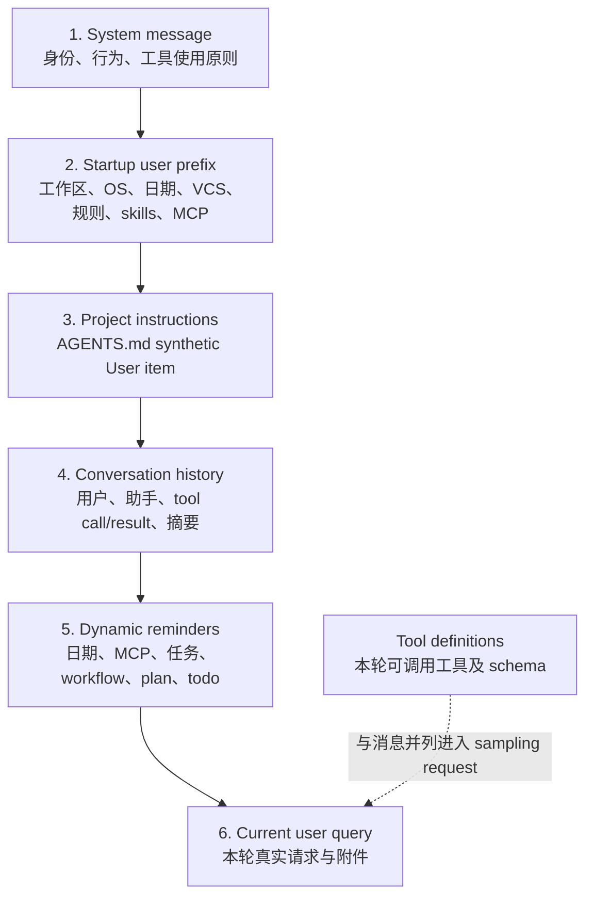

# Prompt 构建、上下文注入与 System Reminder：静态身份、首轮前缀、动态状态与压缩重建

本文研究 Grok Build 在一次模型请求前，如何把 Agent 身份、工具名称、工作区信息、项目规则、skills、MCP 状态和运行中事件组合成模型真正看到的上下文。重点不是“prompt 文案写了什么”，而是这些内容分别由谁构造、以什么消息角色进入 conversation、何时刷新、怎样去重，以及 compaction 后如何重建。

前置阅读：[Prompt 到最终回答](../02-runtime-flows/02-prompt-to-answer.md)、[会话上下文、裁剪与压缩](../02-runtime-flows/06-session-context.md)、[Agent 构建、配置覆盖与运行时重建](06-agent-build-configuration-and-rebuild.md)、[MCP Server 生命周期](07-mcp-server-lifecycle-and-dynamic-tools.md)。端到端文章回答“一次请求怎样流过系统”，本文回答“模型看到的指令究竟来自哪一层”。

## 先记住结论

1. Grok Build 没有把所有上下文拼成一个巨大的字符串；它同时使用首条 `System`、首轮 synthetic user prefix、项目规则消息、普通 user query、运行时 reminder、tool schema 和既有 conversation。
2. `PromptContext` 是“渲染 system prompt 所需的数据快照”，不是 conversation，也不是 prompt renderer。
3. system prompt 必须在 `ToolBridge` 完成工具注册后渲染，因为模板中的 `${{ tools.by_kind.* }}` 要解析成当前 Agent 真正拥有的工具名。
4. `PromptMode::Extend` 先渲染 base template，再追加 `prompt_body`；`PromptMode::Full` 只渲染 `prompt_body`。
5. `TemplateOverride::{None, Codex, Custom}` 决定 Extend 模式的 base template；Primary 与 Subagent audience 还会选择不同的内置模板。
6. 内置模板的 XOR 编码只是不把明文直接放进 binary，源码明确不把它当作安全边界。
7. 首轮 user prefix 与 system prompt 是不同层。它包含 workspace、OS、shell、日期、VCS、规则、skills 和 MCP 等 session 环境信息。
8. 默认 user-message template 走 legacy constructor；`Custom` template 才通过 MiniJinja 和 `UserMessageContext` 渲染。
9. AGENTS.md 虽然语义上是高优先级项目指令，传输上却是带 `SyntheticReason::ProjectInstructions` 的 `User` conversation item。
10. 名为 `push_system_reminder` 的函数也没有创建 `System` role；它创建带 `SyntheticReason::SystemReminder` 的 synthetic `User` item。
11. 因此“system reminder”描述的是 harness 赋予内容的语义，不等于模型 API 的 `system` role。
12. reminder 正文会包在 `<system-reminder>` 中；正文里的闭合标签会被转义，防止内容提前闭合 wrapper。
13. AGENTS.md 内容也会处理可能伪造 framing 的前导 `<`；这些措施是消息边界加固，不是把仓库内容变成可信代码。
14. 首轮 prefix 可在后台构建；等待超过 10 秒或后台任务 panic 时，同步重建，保证 turn 不会永远卡住。
15. 新 session 插入 system prompt；顶层恢复通常保留已持久化的 system；普通 subagent spawn 通常用新 child Agent 的 system prompt 覆盖 inherited system。
16. Skills 有 baseline snapshot 和 mid-session discovery 两条路径。动态发现通常注入 reminder，不会原地修改已缓存的 system prompt。
17. MCP 同样分静态 prefix metadata 与动态连接/能力变化 reminder；不能把“已配置”误读为“当前已连接且工具已经可用”。
18. 日期被故意缓存于首轮 prefix 以利 prompt cache；跨本地午夜后，用一天最多一次的 date-rollover reminder 修正。
19. 用户中断、后台任务完成、subagent 完成、workflow 状态、plan mode、MCP 变化和 todo discipline 都可产生不同 reminder。
20. reminder 有 one-shot flag、announcement set、reported ID、reservation、turn counter 等各自的去重机制；不存在一个万能的全局 dedupe。
21. 超过 25,000 bytes 的请求默认写入 session 文件，并只内联有界的头尾预览和路径提示；失败时仍保留有界预览，但绝不指向不存在的文件。
22. 大 prompt 截断按 UTF-8 字符边界进行，并为尾部问题和 skill instructions 单独留预算。
23. compaction 不是只留一段摘要。当前主路径重建 system、最新 user prefix、有效项目规则、最后 user query、近期消息、摘要和状态 reminder。
24. 当前 shell compaction 主路径保留 conversation 原有的 system message。`Agent::compact_system_prompt()` 虽存在，但不能仅凭接口注释断言主路径已换成短 system prompt。
25. compaction 后会重置 AGENTS/skill announcement tracker、plan reminder state 和 memory injection flag，让下一轮重新检查必要上下文。
26. Prompt 的正确性不仅是“内容齐不齐”，还包括角色、顺序、缓存稳定性、去重、持久化和不信任内容的 framing。

## 一、先建立六层模型

从模型请求角度，可把上下文看成六层：



这是阅读模型，不是源码中的同名 struct。最重要的边界是：tool definitions 不是文本 conversation 的一部分；它们由 sampling request 另行携带。模板里提到工具，只是把稳定语义映射到实际工具名。

## 二、源码地图

| 文件 | 关键符号 | 职责 |
| --- | --- | --- |
| `xai-grok-agent/src/prompt/context.rs` | `PromptContext`、`PromptAudience`、`TemplateOverride` | system prompt 的输入快照与组合规则 |
| `xai-grok-agent/src/prompt/template.rs` | 内置模板解码、`COMPACT_SYSTEM_PROMPT` | 内置模板载荷 |
| `xai-grok-agent/src/prompt/user_message.rs` | `UserMessageTemplate`、`UserMessageContext` | 首轮 user prefix 模板与字段 |
| `xai-grok-agent/src/prompt/agents_md.rs` | discovery、format、escaping | 项目/用户规则发现与包装 |
| `xai-grok-agent/src/prompt/skills.rs` | skill discovery/listing | skill baseline 内容 |
| `xai-grok-agent/src/builder.rs` | `AgentBuilder::build` | finalize tools 后创建并渲染 PromptContext |
| `xai-grok-agent/src/agent.rs` | `finalize_prompt`、`render_prompt_for_definition` | 运行时重渲染与派生 definition prompt |
| `xai-grok-agent/src/system_reminder.rs` | `ReminderPolicy` | TodoNudge/TodoGate policy |
| `xai-grok-shell/.../prompt_build.rs` | prefix、规则分区、large prompt | shell 侧输入收集和有界化 |
| `xai-grok-shell/.../session_setup.rs` | `initialize`、`ensure_prefix_ready` | startup conversation 组装 |
| `xai-grok-shell/.../turn.rs` | turn injection order、PromptOrigin | 每轮注入点 |
| `xai-grok-shell/.../reminders.rs` | reminder producers/wrapper | 动态提醒、转义与去重 |
| `xai-grok-shell/src/session/compaction.rs` | compaction orchestration | 压缩前采样和压缩后状态重置 |
| `xai-chat-state/src/compaction_utils.rs` | `build_compacted_history` | compacted conversation 的纯构造函数 |

## 三、`PromptContext` 是数据快照，不是 prompt 本身

`PromptContext` 收集以下类别的数据：

- schema version；
- `PromptMode` 与 `PromptAudience`；
- optional `prompt_body`；
- system template override；
- 已发现的 AGENTS.md 文件；
- build timestamp；
- memory 是否启用及 global/workspace 路径；
- role/persona instructions；
- OS、shell、模型看到的 working directory、本地日期；
- non-interactive 状态；
- model-facing system prompt label。

它有三个容易误解的特征。

第一，它可序列化，是为了让 Agent 的构建语境可恢复、可检查；但序列化一个 context 不等于已经得到最终字符串。

第二，它不持有 `ToolBridge`。`render()` 从 bridge 取得 finalized `TemplateRenderer` snapshot，再把自身 placeholders 合并进去。

第三，它同时承担“system prompt 的模板输入”和“生成 AGENTS.md user reminder 所需的规则快照”，但两者最终进入 conversation 的角色不同。

## 四、为什么一定要先 finalize ToolBridge

模板可写：

```text
${{ tools.by_kind.read }}
${{ tools.by_kind.execute }}
${{ tools.by_kind.apply_patch }}
```

这些不是硬编码工具名，而是按 `ToolKind` 查当前 registry 的名字。不同兼容模式、Agent definition 或 host 可能把相同语义注册成不同名字，也可能根本不提供某类工具。

因此构建顺序必须是：

```text
解析 AgentDefinition
  → 注册静态工具
  → 注入 session resources
  → 注册动态 MCP 工具
  → finalize ToolBridge / renderer
  → 创建 PromptContext
  → 渲染 system prompt
  → 构造 Agent
```

若提前渲染，system prompt 可能教模型调用不存在的名字，或残留 `${{ tools.by_kind.* }}`。这也是 Prompt 子系统与 ToolBridge 子系统必须配合、却不能合并成一个模块的原因。

## 五、system prompt 的组合矩阵

### 5.1 PromptMode

| 模式 | 组合行为 | 适合的心智模型 |
| --- | --- | --- |
| `Extend` | 渲染 base；若有 `prompt_body`，再空两行追加其渲染结果 | 在标准 Agent 行为上增加规则 |
| `Full` | 只渲染 `prompt_body`；没有 body 时得到空字符串 | 完全接管 prompt |

`prompt_body` 本身也走 renderer。因此扩展正文里同样可以引用工具 placeholder。

### 5.2 TemplateOverride

`Extend` 下 base 的选择为：

```text
Custom(template) → 使用自定义模板
Codex            → 使用 apply-patch 风格内置模板
None + Primary   → 使用 primary 内置模板
None + Subagent  → 使用 subagent 内置模板
```

`Full` 不再选择上述 base，只看 `prompt_body`。

### 5.3 Audience

`PromptAudience::Primary` 和 `Subagent` 不只是标签。它们影响内置 base template，也影响部分 context persistence normalization。Subagent 会清空 persona summaries，但会保留完整 AGENTS.md 规则。

当前 `format_personas_section()` 总是返回 `None`，因为 task tool 的 persona 参数已移除。看到 struct 中仍有 persona 字段时，不应推断运行时一定会注入 persona reminder。

## 六、内置模板编码不等于保密

`prompt/template.rs` 把内置模板保存为 XOR 处理后的 bytes，运行时解码到 `Zeroizing<String>`。测试还会验证 encoded bytes 与模板源文件一致。

这里有两条边界：

- `Zeroizing<String>` 让临时明文 drop 时尽力覆写内存；
- 简单 XOR 只是降低 binary 中直接出现明文的程度。

源码明确说明这不是 security boundary。拿到 binary 或源码的人仍可恢复模板。阅读安全设计时，不要把“obfuscation”写成“encryption guarantees secrecy”。

## 七、真实 cwd 与模型看到的 cwd

Agent 可能运行在 worktree、overlay 或其他内部路径中，而模型应看到稳定的 display cwd。`AgentBuilder` 和 shell prefix builder 都会优先采用 model-facing/display path，并在需要时重写 AGENTS.md 展示路径。

这一区分避免两类问题：

- prompt 暴露 host 内部实现路径；
- 模型按显示路径推理，但规则文件又展示另一套路径，造成自相矛盾。

调试路径问题时，至少同时记录：session 实际 cwd、display cwd、VCS root 和规则文件原始路径。

## 八、首轮 user prefix 不是第一条真实用户请求

fresh session 初始化大致经历：

```text
initialize(system_prompt)
  → conversation = [System]
  → 可选 baseline skill reminder
后台构建 prefix
ensure_prefix_ready()
  → 在 index 1 插入 synthetic/plain User prefix
  → 紧随其后插入 AGENTS.md ProjectInstructions
  → 再开始处理真实 user query
```

因此 conversation 中第一个 `User` item 可能是环境前缀，不是用户亲手输入的文字。任何“找第一条用户问题”的代码若只匹配 `ConversationItem::User` 都可能取错，必须考虑 synthetic reason、meta carrier 或专用 extraction helper。

## 九、`UserMessageContext` 包含什么

自定义首轮模板可使用的 typed inputs 包括：

| 字段 | 来源/语义 | 缺失时 |
| --- | --- | --- |
| `workspace_path` | display cwd | 必有 |
| `os_family` | 实际上通常是 kernel + release 字符串 | 可退回平台名 |
| `shell` | `$SHELL` basename | 使用解析结果 |
| `vcs_root` | Git/JJ workspace root | 不展示 |
| `vcs_status` | 有超时保护的预取状态 | 不展示 |
| `today_local` | session start 或 compaction 时的本地日期 | template guard 跳过 |
| `terminals_folder` | 后台命令输出目录 | 当前 shell producer 可为 `None` |
| `workspace_rules` | repository/workspace 范围规则 | 空列表 |
| `user_rules` | 用户 home/config 范围规则 | 空列表 |
| `skills` | 已去重 registry snapshot | 不展示 skill block |
| `mcp_servers` | 已连接/可描述 server metadata | 空列表 |
| `mcps_root` | MCP descriptor root | 当前 build 可不可用 |
| `read_tool_name` | renderer 解析出的 read 工具名 | fallback 为 `Read` |

placeholders 是 typed struct，而不是随意的 JSON map。这让字段重命名更容易被编译器和测试发现。

## 十、Default 与 Custom user-message template

`UserMessageTemplate::Default` 的 `render()` 返回 `None`，shell 负责调用 legacy `construct_user_message*`。`Custom(String)` 才交给 `ToolBridge::render_prompt`。

自定义模板渲染失败时，shell 会回退 legacy prefix，不会让 session 因一段模板彻底无法开始。若自定义模板原本不展示日期、fallback 却展示了日期，`prefix_carries_fallback_date` 会记住这个事实，使午夜 rollover reminder 仍然生效。

这说明 fallback 不只是字符串替换，还要补偿“模型已经看见哪些信息”的语义差异。

## 十一、首轮 prefix 为什么后台构建

prefix 可能等待 MCP handshake、读取规则、枚举 skills、探测 repository 并获取 VCS status。全部串在 session 主初始化路径会显著增加首轮延迟。

实现采用 deferred background task：

- blocking MCP strategy 下，按模板种类有界等待 handshake；
- `ensure_prefix_ready` 最多等后台结果 10 秒；
- task panic 或超时则 abort，并在当前路径同步构建；
- 完成后在 conversation index 1 插入。

同步 fallback 的目标不是获得完美信息，而是保证 conversation 结构完整且 turn 能继续。

## 十二、VCS 状态为什么必须有界

大型 monorepo 的 `git status` 可能很慢，也可能输出巨大文本。代码从两个维度限制它：

- shell 获取状态有 timeout；
- renderer 对单个 repo 的 status 规范化并限制到约 10,000 字符。

截断尽量在换行边界完成并添加 marker。Prompt 输入不能无条件信任外部命令输出的体积；否则一个普通工作区状态就可能吞掉模型上下文。

## 十三、规则发现与 scope 分区

规则来源不只有 repository 中的 `AGENTS.md`。兼容配置还可能启用 Claude/Cursor 风格路径与规则目录。shell 读取后按路径分成：

- user-scoped rules：Grok home 或启用的 vendor home 的直接规则；
- workspace-scoped rules：repository/workspace 内的项目规则。

若 config home 自身嵌在 workspace 内，分区逻辑仍会识别直接用户规则与更深的项目路径，避免简单 `starts_with(workspace)` 把所有内容误分类。

嵌套目录规则的阅读模型是从较宽作用域走向较窄作用域；越接近当前 cwd 的规则越具体。真正修改 precedence 前，应以 discovery 顺序和相应测试为准，而不是凭文件名猜优先级。

## 十四、AGENTS.md 怎样进入 conversation

`PromptContext::agents_md_user_reminder()` 会把发现的完整规则格式化成 `<system-reminder>` block。startup 时，shell 创建：

```text
ConversationItem::project_instructions(...)
```

它在 wire/conversation 层仍是 `User` item，但带 typed `SyntheticReason::ProjectInstructions`。typed reason 有三个价值：

- 恢复和 fork 时可以识别并去重；
- compaction 可选择重新注入正确版本；
- 提取真实用户 query 时可以跳过它。

为兼容旧会话，检测还识别固定 legacy prefix。新代码应优先依赖 typed reason，legacy text matching 只是 migration seam。

## 十五、规则内容的信任边界

AGENTS.md 位于用户控制或 repository 控制的文件系统，内容不能被视为 harness 自己生成的安全标记。formatter 会处理前导 `<` 等可能破坏外层 framing 的文本，使文件内容不能轻易伪造成相邻 harness block。

同理，dynamic reminder wrapper 会把正文中的 `</system-reminder>` 改写为 `<\/system-reminder>`。

这些保护解决的是“不要逃出当前容器标签”。它们不判断规则内容是否合理，也不防止恶意规则用自然语言要求危险操作。真正的安全边界仍是工具权限、审批与 sandbox。

## 十六、Skills 有三种不同状态

不要把 skills 简化成“一段 system prompt”：

1. **discovered registry**：当前文件系统和插件中有哪些 skills；
2. **announced names**：哪些 skill 已经向模型介绍过；
3. **rendered projection**：当前模板把它们内联为 XML，还是用 reminder 告知。

首轮 custom prefix 可用 budgeted `<agent_skill>` XML listing。baseline 也可能由 startup skill reminder 承载。mid-session 重新发现后，ToolBridge/SkillManager 产生 update effects：

- turn 正在运行时，先进入 `pending_skill_reminders`；
- idle 或 turn completion 时统一 flush；
- announcement state 随后持久化；
- 已缓存的 system prompt 不因此被原地改写。

某些 compatibility harness 已在 preamble 快照 baseline，会抑制重复 baseline change，但仍保留真正的新 discovery。

## 十七、Skill listing 为什么单独有预算

skills 数量可能增长，description 也可能很长。默认 XML formatter 使用 budgeted mode，并可显示 overflow indicator。大 user prompt 处理时，又为 inline skill information 独立预留最多 4,000 bytes。

这是两级约束：registry projection 自己有预算，整条 user message 还有总预算。否则用户问题变长时 skills 会被完全挤掉，或 skills 变多时问题本身被挤掉。

## 十八、MCP 也分静态快照与动态变化

首轮 template 可看到 server name、usage instructions，以及兼容模式下 descriptor folder/root。它回答“session 启动时知道哪些 MCP surface”。

运行期则可能出现：

- server 仍在 connecting；
- handshake 完成；
- capabilities 改变；
- server failed；
- tool registry 刷新。

这些通过 MCP snapshot dirty state 和 reminder delta/full projection 在后续 inference 前注入。connecting reminder 通常是 one-shot；failure 信息会带下一次调用可重试的提示。

因此排查“模型为什么不知道新 MCP 工具”要同时检查：MCP client 状态、ToolBridge registry、snapshot dirty bit、reminder 是否已注入，以及当前请求的 tool schemas。

## 十九、system prompt 在 fresh、resume 与 subagent 中如何安装

`install_system_prompt` 的核心规则：

| 场景 | conversation 已有首条 System | 行为 |
| --- | --- | --- |
| 顶层恢复 | 是 | 保留持久化内容 |
| 普通 subagent spawn | 是 | 通常覆盖为新 child Agent prompt |
| fork 且要求 preserve inherited system | 是 | 保留 inherited system |
| 任意场景 | 否 | index 0 插入，并修正 inherited prefix length |

顶层 resume 保留旧 system 的意义是会话可复现性：恢复后的历史继续以创建时的身份解释。subagent 则要服从自己的 definition，不能无条件继承 parent identity。

## 二十、动态 reminder 其实是什么消息

`SessionActor::push_system_reminder` 的实现逻辑是：

```text
escape closing tag in body
  → wrap as <system-reminder> ... </system-reminder>
  → ConversationItem::system_reminder(...)
  → chat_state_handle.push_user_message(...)
```

最终是 synthetic `User` message。命名里的 `system` 表示“由系统/harness 生成并拥有更强语义”，不是 provider role。

为什么不持续修改首条 System？主要有三个工程收益：

- 保持稳定前缀，利于 prompt caching；
- 变化发生在 conversation 尾部，模型更容易注意；
- reminder 可和事件发生顺序一起持久化、压缩和去重。

代价是它会占 conversation token，也必须防止被当成真实用户输入。

## 二十一、一轮开始前的注入顺序

当前 turn 主路径在加入本轮 user item 前，依次处理大致如下：

```text
解析并组装 prompt blocks/images/skills
处理 oversized prompt
注入 MCP capability reminder
注入 MCP connecting reminder
注入 date rollover reminder
注入 plan-mode reminders
注入 resumed background tasks reminder
真实 user turn：清理 gate / 消费 deferred completions
drain between-turn completions
注入 workflow status reminder
真实 user turn：必要时注入 prior-interrupt reminder
加入当前 User item
进入 sampling loop
```

“大致”表示省略了 mode/harness 条件分支，但相对位置很重要：动态状态应在本轮推理前出现，真实 query 又应成为最后一个明确任务载体。

## 二十二、PromptOrigin 防止 synthetic turn 冒充用户

turn 不只由人类输入触发。来源还可能是：

- normal user；
- task/subagent completed；
- notification drain；
- goal continuation/summary；
- workflow 或其他自动唤醒。

`PromptOrigin` 决定本轮 item 如何标记、是否递增/关联 prompt index、是否消费只应在真实用户边界发生的 one-shot state。

若新加一种自动 turn 却直接伪装成普通 User，可能提前消费 interrupt reminder、打开 spawn admission、重置 todo gate，或污染“最后真实用户问题”的提取。

## 二十三、日期 rollover：缓存稳定与事实更新的折中

首轮 prefix 中的日期在 session start 时计算，并保持不变。这样长对话的稳定前缀不会每天整体改写，有利于 provider prompt cache。

跨本地午夜后：

- 判断模板是否实际 surfaces `today_local`；
- 或 fallback prefix 是否意外携带了日期；
- 与 `last_announced_local_date` 比较；
- 只在日期推进时注入一次 reminder。

若 custom template 根本没有日期，系统不会凭空添加 rollover reminder。这叫“按 surface 修正”，不是全局定时广播。

## 二十四、中断 reminder 为什么是 one-shot

用户停止上轮时，不一定需要额外提示。若有 active tool，系统通常可通过 cancelled tool result 显式修复 conversation；若权限流程也已有 tool result，模型同样能理解发生了什么。

只有缺少这种可见信号的 abort path 才设置 pending flag。下一次真实用户 turn 消费一次并注入：

```text
[Request interrupted by user]
```

自动 notification turn 不应消费它，否则下一次真人继续对话时反而不知道上轮为何截断。

## 二十五、后台完成 reminder 的去重不是一个 bool

后台 bash、monitor、workflow 和 subagent completion 可能同时从多个 surface 到达：

- foreground tool result；
- blocking query waiter；
- completion notification；
- next user turn 的 between-turn drain；
- automatic wake prompt。

系统使用 reported completion IDs、reservations、suppressed IDs 和 drain ownership 协调。其原则是：模型只应看到一次完整结果，UI 可以通过结构化事件独立显示。

goal continuation loop 还可能主动 drop/suppress普通 completion reminder，防止一个长期目标被不相关完成事件反复打断。这不是“结果丢失”：canonical result 仍由 coordinator/persistence 持有。

## 二十六、Workflow reminder 的有界性

workflow 可产生 launch、status、completion reminder。为了防止外部任务描述和输出吞掉上下文：

- objective 会被截到较小上限；
- result summary 有约 4 KiB 上限；
- 完整输出若已落盘，可提示模型读取文件。

这与 large user prompt 的策略一致：conversation 放定位信息和有界摘要，完整载荷放可寻址存储。

## 二十七、TodoNudge 与 TodoGate 不是一回事

| 机制 | 默认 | 触发点 | 效果 |
| --- | --- | --- | --- |
| TodoNudge | 开启 | 多轮未调用 todo tool | 提醒模型使用 todo |
| TodoGate | 关闭 | content-only assistant 试图结束、仍有未完成 todo | 注入 reminder 并强制追加 inference |

默认 Nudge 参数为：连续 3 turns 未使用 todo 后可提醒，两次提醒至少间隔 5 turns。

TodoGate 默认最多每个 user prompt 触发 2 次，且只有 definition/audience 携带 task-completion discipline 时才激活。goal laziness loop 活跃时会关闭 TodoGate，因为 goal continuation 已拥有“不要过早停止”的控制权。

不要把两者都叫“懒惰检测”：一个是低成本提示，一个会改变 turn 的终止状态。

## 二十八、超大请求如何降级

默认阈值是 25,000 bytes。超过后，系统尝试把完整组装消息写入 session 文件，同时在 conversation 仅保留最大约 25,000 bytes 的 bounded message。

预算分配包括：

- skill instructions 独立最多 4,000 bytes；
- 剩余预算约 80% 给 query；
- query 使用 head + marker + tail；
- tail 最多保留 4,000 bytes，使末尾真正的问题不易丢；
- context 使用剩余预算的前部；
- notice 告诉模型完整文件路径并要求先读取。

所有 byte truncation 都向 UTF-8 char boundary 调整，避免切坏中文或 emoji。

### 写文件失败时

失败分支不会恢复原始超大字符串，因为那会重新制造 context overflow；也不会留下虚假路径。它把 file notice 替换为明确的失败说明，让模型根据有界预览回答，必要时请用户重发。

### Verbatim 模式

明确启用 verbatim input 的路径会跳过普通 truncation/offload 逻辑。调试 context overflow 时要先确认这个开关，而不是只看阈值常量。

## 二十九、图片不是简单保留原 URI

upstream API 只接受 HTTP(S) URL 或 base64 `data:` URL。选择规则是：

- 有 inline bytes 时，以 bytes 构造 data URL；
- 无 bytes 且 URI 是 HTTP(S) 时，直接转发；
- `file://` 和其他本地 scheme 不能直接交给 upstream。

“inline bytes win”保证 payload 是调用方已经提供的 canonical 内容，也避免模型服务端无法访问本机路径。

## 三十、Compaction 前后到底发生什么

compaction 首先用经过简化的 conversation 请求模型生成 summary；成功后，不是把整个历史替换成单一 User summary，而是调用 `build_compacted_history` 重建有结构的历史。

当前 grok-build 顺序可概括为：

```text
原 System message
新构建的 user-message prefix
AGENTS.md project instructions（或 cwd 变化后的 destination instructions）
最后一个真实 user query（若有，包在 <user_query>）
保留的 recent messages
LLM 生成的 compaction summary（User meta）
状态恢复 system reminder（若有）
```

状态 snapshot 可涵盖 running background tasks、running subagents、connected MCP servers、todos、agent edited paths 等。具体 reminder 只有在相应 state 存在、工具名可解析且模式允许时才生成。

## 三十一、压缩后哪些状态会重新武装

conversation 替换成功后，shell 还会：

- 把 memory `context_injected` 设为 false，下一 turn 重新判断注入；
- 重置持久化的 Todo state；
- 通知 ToolBridge AGENTS.md compaction；
- 通知 ToolBridge skill discovery compaction；
- 持久化新的 announcement state；
- 重置 plan-mode reminder counter；
- 更新 idle-flush conversation length；
- 发出 post-compact hook。

这些不是附属清理。若只替换 conversation、不重置 tracker，系统可能以为规则或 skill 仍在上下文中，实际却已被摘要删掉。

## 三十二、`COMPACT_SYSTEM_PROMPT` 的现实边界

`xai-grok-agent` 暴露：

```text
Agent::compact_system_prompt()
```

它返回一个短 prompt，注释称用于 post-compaction。但当前 shell `run_compact_inner` 从 chat state 取得原 system message，并把它传入 `build_compacted_history`；全仓搜索也不能证明此 accessor 已接入这条主路径。

所以当前源码事实应写成：

- 短 prompt 常量和 accessor 存在；
- shell 主 compaction 重建保留原 System；
- 未来其他 host 或新路径可能采用短 prompt，届时要重新核对调用点。

这是一个典型阅读原则：public API、注释中的 intended use 和当前 production call graph 是三种不同证据。

## 三十三、Fork inherited prefix 的压力释放

fork session 可记录 `inherited_prefix_len`，compaction 时尝试保留 inherited head。但如果保留后仍超阈值，系统可以释放 prefix，并把 `prefix_released` 设为 sticky，防止后续 compaction 又恢复它、形成无界压缩循环。

若释放后仍超阈值，auto-compaction 会被 sticky suppression，避免每轮重复做必然无效的压缩。

“尽量保留继承历史”因此是 best-effort policy，不是不可突破的硬约束。

## 三十四、压缩历史还要修复 tool pairing

provider 通常要求每个 `ToolResult.tool_call_id` 都有一个在它之前出现的 Assistant tool call。截取 recent messages 或摘要重建可能留下 orphan result。

`sanitize_compacted_history` 从左到右扫描：

- 记录已见 Assistant tool-call IDs；
- 删除没有 preceding call 的 ToolResult；
- 不删除“有 call 暂无 result”的 Assistant item，因为它可能是合法的 in-flight/修复中状态。

sanitize 后还会 validate；仍有违规则回退到不含 recent messages 的 minimal compacted history。Prompt 完整性必须服从 provider wire invariant，否则整次请求会直接 400。

## 三十五、Prompt cache 的核心设计

可缓存的理想前缀应稳定：

- system prompt 只在 Agent build/rebuild 时变化；
- startup prefix 只在 session start/compaction 重建；
- 日期变化通过尾部 reminder，而不是每日改 system；
- skill/MCP 动态变化通过后续 synthetic User item；
- 本轮 query 总在后部。

这不是单纯性能技巧。把静态身份和动态事实分离，还能让状态来源、去重和恢复更清楚。

## 三十六、Agent rebuild 与 prompt 重渲染

`Agent::finalize_prompt` 会更新时间戳，并使用当前 ToolBridge 重新渲染 system prompt。`render_prompt_for_definition` 则复制已有 PromptContext，替换 definition 的 prompt mode/body/system override，并复用当前 renderer。

但“重渲染出一个字符串”不自动等于“已安全替换运行中 conversation 的首条 System”。session rebuild 还需处理：

- 是否为 zero-turn；
- 是否保留 inherited system；
- prefix 是否要 rewrite；
- baseline skill reminder 是否要移除或重注入；
- 已有 conversation 是否允许改变解释基线。

因此修改 prompt 配置时，要同时追 Agent 层和 shell session 层。

## 三十七、持久化时应区分三样东西

排查恢复问题时分别寻找：

1. `PromptContext`：为何这样渲染；
2. rendered system prompt：当时模型实际收到的身份文本；
3. conversation items：prefix、规则、reminder、query、tool results 和摘要的历史。

只保存 template inputs 不能保证未来 renderer/version 得出完全相同的字符串；只保存 rendered prompt 又无法解释其来源；只保存 conversation 则不够支持某些 Agent rebuild。三者解决不同问题。

## 三十八、常见误读

### 误读 1：所有 `<system-reminder>` 都是 System role

不是。当前主要路径把它存成 synthetic User item。

### 误读 2：AGENTS.md 已经拼在 system prompt 内

`PromptContext` 持有规则，但 startup 主要通过独立 ProjectInstructions user item 注入，compaction 也显式重建它。

### 误读 3：动态 skills 必须重建 Agent

动态 discovery 可通过 pending reminder 和 ToolBridge state 投影，无需每次改 system prompt。

### 误读 4：首条 User 就是用户问题

它通常是环境 prefix；后面还可能有 ProjectInstructions 和其他 synthetic items。

### 误读 5：压缩只留下摘要

当前构造器保留/重建多个语义块和必要近期消息。

### 误读 6：存在 `compact_system_prompt()` 就说明已在用

应检查 call graph。当前 shell 主路径保留原 System。

### 误读 7：标签转义等于内容可信

转义只保护 framing；权限和 sandbox 才限制实际副作用。

### 误读 8：MCP server 出现在 prefix 就代表工具一定可调用

连接、capability refresh、registry 和本轮 tool schema 必须一致。

## 三十九、修改 Prompt 子系统的检查清单

新增一个 system placeholder 时：

- `PromptContext` 是否有 typed field、serde default 和 version/migration 策略？
- builder 是否填充？
- primary/subagent 是否都适用？
- renderer finalize 后才调用吗？
- persistence normalization 是否需要处理？

新增一个 dynamic reminder 时：

- 它应在真实 user turn、自动 turn、tool loop 还是 turn end 注入？
- 以什么 `SyntheticReason` 标记？
- 如何 one-shot/dedupe？
- resume/fork/compaction 后怎样恢复？
- 是否可能包含不可信 closing tag？
- 是否有体积上限？
- UI 是否已有独立结构化事件，避免重复展示？

修改 AGENTS/skills/MCP projection 时：

- startup、mid-session update、compaction 三条路径是否一致？
- announcement tracker 是否在正确时机重置和持久化？
- display path 是否泄露内部 worktree path？
- compatibility harness 是否已拥有相同 surface？

## 四十、推荐调试路径

遇到“模型不知道某信息”时，按以下顺序排查：

1. 数据源是否真的发现：规则文件、skill、MCP capability、后台任务状态。
2. producer 是否把数据放进 `PromptContext`、`UserMessageContext` 或 reminder state。
3. renderer 是否拥有对应工具名和 placeholder。
4. conversation 中是否存在正确 item、synthetic reason 和相对顺序。
5. compaction/fork/resume 是否删掉后没有重新武装 announcement state。
6. sampling request projection 是否保留该 item，并携带正确 tool schema。
7. 是否因 budget、truncation、compat suppression 或 mode condition 被有意省略。

遇到“模型重复收到提醒”则反向检查：typed reason、legacy detector、announced names、reported completion IDs、one-shot flag 和 compaction reset 是否重复执行或没有持久化。

## 四十一、验证命令

```sh
# system prompt 数据与组合规则
rg "PromptContext|PromptMode|PromptAudience|TemplateOverride" \
  crates/codegen/xai-grok-agent/src/prompt

# startup prefix 与 project instructions
rg "build_user_message_prefix|ensure_prefix_ready|project_instructions" \
  crates/codegen/xai-grok-shell/src/session

# 所有动态 reminder 注入点
rg "push_system_reminder|inject_.*reminder|maybe_inject_.*reminder" \
  crates/codegen/xai-grok-shell/src/session

# compaction 的重建顺序与状态 reset
rg "build_compacted_history|on_agents_md_compaction|on_skill_discovery_compaction" \
  crates/codegen/xai-chat-state crates/codegen/xai-grok-shell

# 大 prompt 的预算、offload 与失败降级
rg "LARGE_PROMPT_THRESHOLD|OFFLOAD_NOTICE|bound_head_tail" \
  crates/codegen/xai-grok-shell/src/session
```

建议运行的定向测试：

```sh
cargo test -p xai-grok-agent prompt::
cargo test -p xai-chat-state compaction_utils::
cargo test -p xai-grok-shell prompt_build
cargo test -p xai-grok-shell compaction
```

测试名和 package 过滤行为可能随版本变化；若过滤不到，先用 `cargo test -p <crate> -- --list` 查看当前名称。

## 四十二、学习练习

### 练习 1：画出 fresh session 的前五个 item

选择一个有 AGENTS.md、有 skills 的 workspace，写出从 `initialize` 到第一轮 query 后 conversation 的 item 类型、role 和 synthetic reason。

### 练习 2：验证“system reminder 不是 System role”

从 `push_system_reminder` 追到 `ConversationItem::system_reminder` 和 chat-state projection，记录最终 provider role。

### 练习 3：设计一个 timezone reminder

不写代码，只回答：状态放哪里、何时比较、自动 turn 是否消费、compaction 后是否重置、如何避免每天重复。

### 练习 4：模拟大中文 prompt

构造超过 25,000 bytes、末尾有关键问题的 UTF-8 文本，验证 head/tail 都存在、字符串有效、skill budget 独立、写文件失败时没有虚假路径。

### 练习 5：比较 compaction 前后

准备含 tool calls、AGENTS.md、running task 和最近 user query 的 conversation，调用纯 builder，逐项解释为何保留、为何标成 meta/synthetic，以及 sanitizer 会删除什么。

## 四十三、自测问题

1. 为什么 system prompt 不能在工具注册前渲染？
2. `Extend + Custom` 与 `Full` 的区别是什么？
3. 为什么 `PromptContext` 里有 AGENTS.md，不代表规则一定在 System role？
4. startup prefix 和真实 user query 如何区分？
5. 为什么日期 rollover 不直接改首条 System 或首轮 prefix？
6. dynamic skill discovery 怎样避免重复 announcement？
7. `push_system_reminder` 为什么要转义 closing tag？
8. 大 prompt offload 失败后为什么仍不能发送完整原文？
9. compaction 为什么要重建项目规则和状态 reminder？
10. 为什么 orphan ToolResult 必须删除？
11. `COMPACT_SYSTEM_PROMPT` 存在为何仍不能断言主路径使用它？
12. 新增 reminder 时至少需要设计哪几种 lifecycle 行为？

## 本篇术语表

| 名词 | 白话解释 | 在本文中的准确含义 |
| --- | --- | --- |
| prompt | 发给模型、用来决定下一步输出的输入 | 广义上含消息历史和 tool definitions；狭义时会注明某个模板字符串 |
| system prompt | 给 Agent 设定身份和行为边界的首层指令 | conversation 开头的 `ConversationItem::System` 内容 |
| system reminder | 系统在运行中追加的提示 | 通常是 `<system-reminder>` 包装、带 synthetic reason 的 User item，不是 System role |
| user prefix / user-message prefix | 第一条真实问题前的环境介绍 | workspace、OS、shell、VCS、日期等构成的 startup User item |
| user query | 用户真正要求完成的任务 | 应排除 prefix、project instructions、notification 等 synthetic/meta item |
| context | 模型本轮能够参考的信息集合 | system、history、reminders、当前 query 和 tool schemas 的总和 |
| context window | 模型单次请求能容纳的 token 上限 | 超过后需截断、offload 或 compaction |
| `PromptContext` | system prompt 的数据配方 | serializable inputs，不是 renderer 或 conversation |
| `UserMessageContext` | 首轮 user prefix 的数据配方 | shell 收集的一次性 session 环境快照 |
| template | 含固定文字与变量的文本 | 由 MiniJinja 和 ToolBridge renderer 转为最终字符串 |
| MiniJinja | Rust 的 Jinja 风格模板引擎 | 处理 `${{ ... }}` / 条件等模板表达式的底层组件 |
| placeholder | 模板中等待替换的变量 | 如 `working_directory`、`today_local`、`tools.by_kind.read` |
| `ToolKind` | 工具的稳定语义类别 | 用来把模板中的“读文件工具”映射到具体注册名 |
| renderer snapshot | 已完成工具名注册后的模板渲染视图 | 保证 prompt 使用当前 ToolBridge 的真实名称 |
| `PromptMode::Extend` | 扩展模式 | base template 加 optional rendered body |
| `PromptMode::Full` | 完全替换模式 | 只使用 prompt body |
| audience | prompt 面向的 Agent 类别 | 当前主要是 Primary 或 Subagent |
| template override | 覆盖内置 base 的选择 | `None`、`Codex` 或 `Custom` |
| synthetic message | 不是用户亲手输入、但以消息形式加入历史的内容 | project instructions、system reminder、notification carrier 等 |
| `SyntheticReason` | synthetic message 的 typed 来源标签 | 用于去重、恢复、提取和不同 lifecycle 处理 |
| ProjectInstructions | 项目规则的 synthetic reason | 主要承载 AGENTS.md block |
| AGENTS.md | 目录作用域的 Agent 指令文件 | discovery 后按顺序合并并作为项目规则注入 |
| rule scope | 一条规则适用的范围 | user-global 或 workspace/project 范围 |
| precedence | 多条规则冲突时的优先关系 | 通常越靠近当前工作目录越具体，须以 discovery 实现验证 |
| skill | 可按需读取的专项工作流程说明 | 首轮 listing 介绍名称/描述，真正使用时再读取 `SKILL.md` |
| announcement state | 已告诉模型哪些动态能力的记录 | 防止 baseline 或 discovery reminder 重复出现 |
| MCP | Model Context Protocol | 外部 server 向 Agent 提供工具、资源或提示能力的协议 |
| reminder dirty state | 动态状态已变化、需要在后续告诉模型的标记 | MCP/skills 等可通过它延迟投影到 conversation |
| prompt cache | provider 对稳定输入前缀的复用 | 减少重复计算/费用；要求前缀尽量稳定 |
| rollover | 跨越一个时间边界 | 本文特指 session 跨本地午夜后的日期修正 |
| one-shot | 只消费一次的状态 | 如 prior-interrupt reminder flag |
| dedupe | 去重 | 防止同一规则、skill 或完成结果多次喂给模型 |
| offload | 把大载荷移到文件，只在 prompt 放摘要和路径 | 用来控制当前 conversation 大小并保留完整原文 |
| head-tail truncation | 同时保留开头和结尾的截断 | 让背景与末尾实际问题都有机会留下 |
| UTF-8 boundary | 合法字符的字节边界 | 截断必须停在这里，避免生成损坏字符串 |
| compaction | 用摘要和必要状态替换长历史 | 不等于只留摘要；还会重建关键语义块 |
| compaction summary | 模型生成的长会话摘要 | compacted history 中的 User meta carrier |
| recent messages | 压缩时选择保留的近期原始消息 | 需维持 tool call/result 配对 |
| orphan ToolResult | 找不到此前 matching tool call 的工具结果 | provider 可能拒绝，sanitizer 会删除 |
| framing | harness 用标签和消息边界表达结构的方式 | 如 `<system-reminder>`、`<user_query>` |
| escaping | 改写可能提前闭合外层标签的内容 | 防止不可信正文突破 wrapper |
| obfuscation | 让内容不直接显眼的可逆处理 | 内置模板 XOR；不提供真正保密性 |
| `Zeroizing<String>` | drop 时尽力清零内存的字符串容器 | 缩短解码模板明文残留，不等于完整内存安全保证 |
| display cwd | 展示给模型的工作目录 | 可能不同于 host 内部真实 worktree path |
| harness | 承载 Agent 的上层运行框架/兼容模式 | 可能自己拥有某些 prefix/reminder surface，因此 shell 要抑制重复 |

## 源码阅读顺序

建议依次阅读：

1. `xai-grok-agent/src/prompt/context.rs`：先理解 system prompt 组合矩阵。
2. `xai-grok-agent/src/builder.rs` 的 build 尾段：确认 ToolBridge finalize 与 render 顺序。
3. `xai-grok-agent/src/prompt/user_message.rs`：理解首轮 prefix typed inputs。
4. `xai-grok-shell/src/session/acp_session_impl/session_setup.rs`：看消息进入 conversation 的顺序。
5. `prompt_build.rs`：看真实数据收集、规则分区和大 prompt 降级。
6. `turn.rs` 与 `reminders.rs`：看每轮动态注入和 one-shot/dedupe。
7. `xai-chat-state/src/compaction_utils.rs`：看 compacted history 的纯构造顺序。
8. `xai-grok-shell/src/session/compaction.rs`：最后看状态采集、失败处理与压缩后 reset。

读完后应能回答一个核心问题：conversation 中任意一段“看起来像系统指令”的文字，是谁生成的、以什么 role 进入、何时失效、由什么机制保证不重复，以及它是否真的是安全边界。
