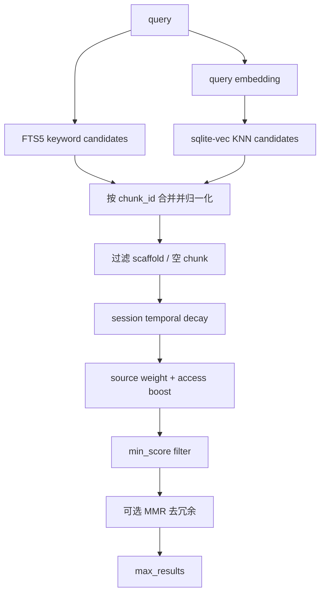
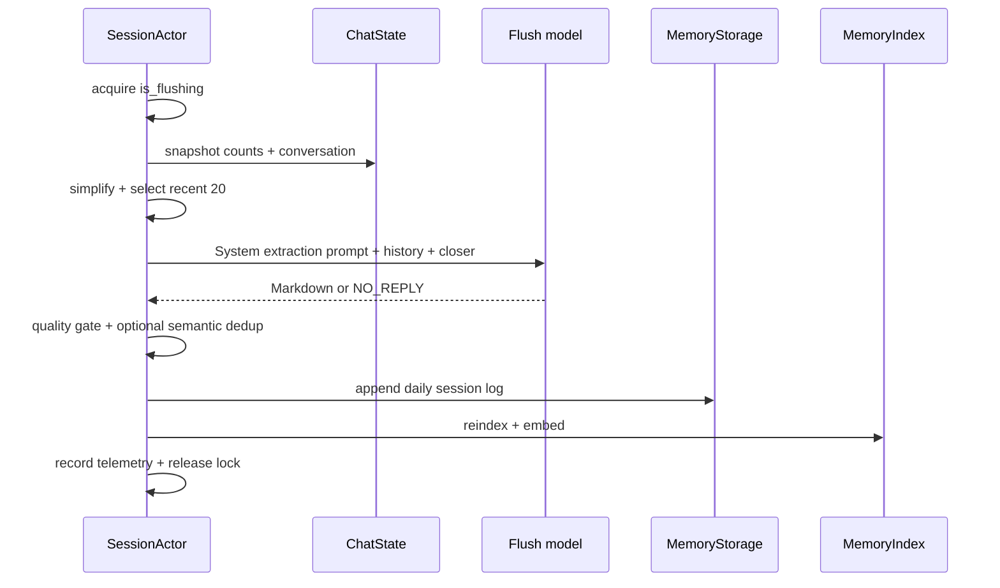

# Memory 子系统：Markdown 存储、混合检索、上下文注入、Flush 与 Dream

本文研究 Grok Build 如何把一次会话中值得长期保留的信息写入磁盘，在未来会话中检索，并把相关片段重新交给模型。重点是 Memory 的数据生命周期、三种检索入口、两级写回机制、索引一致性、并发协调、安全边界和失败降级。

前置阅读：[会话上下文、裁剪与压缩](../02-runtime-flows/06-session-context.md)、[会话持久化](../02-runtime-flows/11-persistence.md)、[Prompt 构建与上下文注入](09-prompt-construction-context-injection-and-reminders.md)、[Subagent 调度](08-subagent-coordinator-inheritance-and-background-tasks.md)。

## 先记住结论

1. Memory、conversation history 和 compaction summary 是三套不同数据：conversation 服务当前会话，compaction summary 缩短当前会话，Memory 面向跨会话复用。
2. `xai-grok-memory` 是可独立复用的核心引擎；shell 的 `session/memory/mod.rs` 主要是兼容 re-export，session lifecycle glue 留在 shell。
3. Markdown 文件是长期事实源，SQLite 是可重建的搜索索引；不能把 `index.sqlite` 当作唯一记忆副本。
4. 默认存储有 global `MEMORY.md`、workspace `MEMORY.md` 和 workspace `sessions/*.md` 三类来源。
5. workspace 目录优先用 Git remote `org/repo` 形成稳定 identity；没有 remote 时才退回 filesystem path，并加入短 hash 防冲突。
6. 临时目录被标为 ephemeral：workspace 写入会静默跳过，避免 subagent 临时 worktree 制造长期垃圾目录。
7. Markdown 按标题、段落和行切 chunk；默认最大 1,600 字符、重叠 320 字符，并携带祖先标题上下文。
8. 搜索始终可用 FTS5；sqlite-vec 或 embedding 不可用时自动退化为 FTS-only，而不是让 memory tool 整体失败。
9. 默认 tool search 最多返回 6 项，最低分 0.35，vector/text 权重为 0.7/0.3。
10. 检索还应用 source weight、session temporal decay、轻量 access-frequency boost 和可选 MMR diversity rerank。
11. global/workspace memory 被视为 evergreen，不做时间衰减；session logs 默认以 7 天 half-life 衰减。
12. 搜索结果不是绝对事实。旧 session 结果超过 1 天会提示核验，超过 7 天显示更强 stale warning；curated global/workspace 不显示该警告。
13. `memory_search` 返回相关 snippet 和路径；`memory_get` 才按路径读取完整或指定行范围。两者都属于 read-only tool capability。
14. `memory_get` 会 canonicalize 文件和 memory root，并拒绝 root 外路径，避免把它变成任意文件读取器。
15. 首轮自动注入会根据真实 user query 搜索；过短、空或 greeting query 会改用宽泛的 project-context query。
16. 首轮注入默认最多 6 项，历史兼容默认最低分为 0.0，除非 `initial_injection.min_score` 显式覆盖。
17. 首轮 memory block 会 upsert 到首条 `System` 中并持久化，不是普通 synthetic User reminder。
18. resume 发现 System 已有 `<memory-context>` 时会原样复用，不重新搜索和重排，从而避免破坏后续 prompt cache prefix。
19. compaction recovery 是另一条检索路径：按最后 user query 搜索最多 3 项、最低分 0.0，并放入压缩后的状态 reminder。
20. `context_injected` 只是当前进程段的一次性 latch；跨 resume/compaction 的真正幂等依据是 conversation 内是否已有 memory block。
21. Memory 写回至少有三条路径：session-end metadata summary、LLM flush session log、Dream consolidation 到 workspace `MEMORY.md`。
22. session-end save 不调用模型，只记录消息数量、日期和前几个真实用户主题；至少要有 3 条真实 user query 且总计 50 bytes。
23. flush 使用独立模型请求、不给工具、默认只看最近 20 条简化消息，并要求带 Markdown header；`NO_REPLY` 表示没有值得保存的内容。
24. 第一次 flush 做完整提取，后续 flush 可根据 `last_flush_content` 做 delta，只保存新信息。
25. flush 输出默认最多 8,000 字符；写入前还可用 embedding 做 semantic dedup，默认相似阈值 0.92。
26. pre-compaction flush 在达到 compact threshold 前 4,000 tokens 触发，并有 once-per-compaction-cycle guard。
27. 当前实现把 pre-compaction flush 作为 `spawn_local` 后台任务启动，compaction 不等待它完成；snapshot 先冻结 flush 输入，失败也不阻止压缩。
28. idle flush 只有显式配置 timeout 才运行，并比较 conversation length，没新消息时跳过。
29. `is_flushing` 原子锁统一互斥 idle、pre-compaction、slash-command 等 flush 来源，并在 flush 期间抑制 auto-compaction 检查。
30. Dream 把多个 session logs 与已有 workspace memory 合并成耐久知识，成功后覆盖 workspace `MEMORY.md`，再清理真正处理过的旧 session files。
31. autoDream 默认启用，但受至少 4 小时、至少 3 个新 session 两道 gate 约束；周期检查默认未配置，只在 session end 或手动命令等入口运行。
32. Dream 模型输入上限 32,000 字符，输出上限 16,000 字符；未放进输入的 session 不会被删除。
33. Dream cleanup 跳过 5 分钟内刚修改的日志，避免删除并发 session 正在追加的文件。
34. Dream lock 是 PID + mtime 的 best-effort 协调，不是严格分布式互斥；设计要求 consolidation 尽量幂等。
35. 外部手工修改 `.md` 文件由 watcher 标记 dirty，下一次 search 才 claim、reindex、补 embedding；删除文件时也会清除 stale chunks。
36. embedding credential 只保留给受信 endpoint；URL 不匹配时 fail closed，并可退化到无向量搜索。
37. subagent 默认不执行 session-end save 或 Dream；Agent definition 还可声明独立 memory scope，得到 agent-specific memory root。
38. Memory 的大多数失败都是 best-effort：搜索退化、flush 跳过、watcher 失败和 session-end write 不能拖垮主会话。

## 一、先分清三种“记住”

| 机制 | 主要范围 | 载荷 | 何时消失/变化 |
| --- | --- | --- | --- |
| conversation history | 当前 session | 原始 User/Assistant/Tool items | compaction、pruning、session 结束 |
| compaction summary | 当前 session 的后续 turns | 模型生成的历史摘要 | 下一次 compaction 可再次重写 |
| Memory | 跨 session | Markdown 文件及其索引 chunks | 用户编辑、flush、Dream、清理 |

三者会互相传递信息，但不是彼此的别名：


## 二、crate 与模块边界

| 位置 | 关键类型/函数 | 职责 |
| --- | --- | --- |
| `xai-grok-memory/src/storage.rs` | `MemoryStorage` | Markdown 路径、读写、GC、workspace identity |
| `xai-grok-memory/src/chunker.rs` | `chunk_markdown` | Markdown-aware chunking |
| `xai-grok-memory/src/index.rs` | `MemoryIndex` | SQLite schema、FTS、vector、reindex |
| `xai-grok-memory/src/backend.rs` | `MemoryBackendImpl`、`MemoryBackendParams` | live session 的搜索 backend |
| `xai-grok-memory/src/search.rs` | `hybrid_search_merge` | 分数合并、decay、weight、MMR |
| `xai-grok-memory/src/watcher.rs` | `MemoryFileWatcher` | 外部文件变化收集 |
| `xai-grok-memory/src/dream.rs` | gates、prompt、execute | 长期记忆 consolidation |
| `xai-grok-memory/src/dream_lock.rs` | `DreamLock` | 跨进程 best-effort 协调 |
| `xai-grok-tools/.../memory_backend.rs` | `MemoryBackend` | 工具层依赖的窄 trait |
| `xai-grok-tools/.../memory/search_tool.rs` | `MemorySearchImpl` | 模型主动检索入口 |
| `xai-grok-tools/.../memory/get_tool.rs` | `MemoryGetImpl` | 受限文件读取入口 |
| `xai-grok-shell/src/session/memory_state.rs` | `SessionMemory` | session 运行状态和 telemetry counters |
| `session/helpers/memory_context.rs` | format/detection | 首轮与恢复注入文本 |
| `session/helpers/memory_flush.rs` | threshold/quality/dedup | flush 纯逻辑 |
| `session/acp_session_impl/memory_dream.rs` | orchestration | flush、Dream、动态工具 glue |
| `session/memory/hooks.rs` | `on_session_end` | 无模型 session-end metadata save |

`xai-grok-shell/src/session/memory/mod.rs` 的注释称自己是 shim：核心已经迁入独立 crate，旧的 `crate::session::memory::*` 路径通过 re-export 保持约 30 个反向依赖点无需同时迁移。

## 三、Memory 的磁盘布局

普通 workspace 默认布局：

```text
~/.grok/memory/
├── MEMORY.md                         global、跨项目的人工/长期知识
└── <project-slug>-<hash8>/
    ├── MEMORY.md                     当前项目的长期知识
    ├── index.sqlite                  当前 workspace 搜索索引
    ├── .dream-lock                   Dream PID/时间协调文件
    └── sessions/
        └── YYYY-MM-DD-<slug>-<sid8>.md
```

`ensure_initialized()` 会懒创建 global 与 workspace 模板。模板本身只有标题、说明和 comment，搜索阶段会识别 scaffold/结构性空内容并过滤，避免空模板成为“高相关结果”。

## 四、workspace identity 为什么不是简单 cwd

若直接 hash 绝对路径，同一仓库的 clone、worktree 和移动副本会产生彼此隔离的 memory。`compute_workspace_hash` 优先提取 Git remote identity，例如 `org/repo`：

```text
slug = repo name，最多 40 字符
hash input = normalized remote identity
directory = <slug>-<BLAKE3 前 8 位>
```

无 Git remote 时才使用 filesystem path。这种策略在“同一仓库多 worktree 共享知识”和“不同同名目录不能冲突”之间折中。

## 五、ephemeral workspace 为什么不写长期数据

`MemoryStorage` 会识别系统临时目录，包括 `/tmp`、`/var/tmp`、macOS `/var/folders/.../T` 及 canonicalized 变体。

标为 ephemeral 后：

- workspace 初始化跳过；
- workspace long-term write 跳过；
- daily session log write 跳过；
- global scope 仍可按其独立规则操作。

subagent worktree 常位于临时目录。如果按临时 cwd 建永久 memory，每个 child 都可能生成一个再也不会复用的 workspace 目录。

## 六、三类 source 的语义

| source | 文件来源 | 定位 | 时间衰减 |
| --- | --- | --- | --- |
| `global` | global `MEMORY.md` | 跨项目偏好与稳定知识 | 无 |
| `workspace` | project `MEMORY.md` | 项目架构、规范、长期决策 | 无 |
| `session` | `sessions/*.md` | 未完全整理的会话记录 | 默认有 |

`classify_source()` 依据文件位置和文件名分类。Dream 输出实际 reindex 时可能传入诊断用的其他 source label，但检索长期语义主要围绕上述三类。

## 七、Markdown 是 source of truth，SQLite 是 projection

文件层允许用户直接阅读、版本化或修改；索引层提供快速检索。reindex 会：

1. 读取 `.md`；
2. 按配置切 chunk；
3. 为 chunk 文本计算 BLAKE3 hash；
4. 对比同一路径旧 chunks；
5. 在事务内新增、更新、删除 chunks 和 FTS entries；
6. 必要时补 vector embeddings。

因此 index 丢失理论上可由 Markdown 重建。反过来，只改 SQLite 而不改文件，会在下一次 reindex 被 source of truth 覆盖。

## 八、Markdown chunker 怎样工作

默认配置：

```text
max_chunk_chars     = 1600
chunk_overlap_chars = 320
```

切分顺序：

1. 整个文件足够短时直接一个 chunk；
2. 按 `##` 及更深标题形成 section；
3. 超大 section 按空行/段落拆；
4. 仍超长时按行拆；
5. continuation chunk 加入上一 chunk 尾部 overlap；
6. 添加祖先标题 context，使片段脱离原文件后仍可理解。

chunk 的 `start_line` 和 `end_line` 使用 0-based、end-exclusive 语义。工具展示时要注意与用户侧 1-based line number 的转换。

## 九、Index 的并发与降级设计

`MemoryIndex` 持有 `rusqlite::Connection`，是 `Send` 但不是 `Sync`。backend 不把一个 connection 长期共享给并发 query，而是每次 search 新开 index/connection。

搜索过程被刻意分成：

```text
同步：打开 index、reindex dirty files、收集缺 embedding chunks
异步：调用 embedding provider
同步：写回 embeddings、FTS 查询
异步：embed query
同步：vector 查询、merge、rank、record access
```

这样不会把 `&MemoryIndex` 借用跨过 `.await`，也满足 `MemoryBackend: Send + Sync` 的 tool resource 要求。

SQLite journal mode 还由共享 helper 根据文件系统选择，避免在不适合 mmap/WAL 的网络挂载上触发危险行为。

## 十、Hybrid search 的完整流水线



基础候选上限是 `max_results * 3`。除了普通 FTS query，还单独查一次 evergreen sources，避免大量 session logs 把 global/workspace 结果挤出候选集。

## 十一、FTS 与 vector 怎样合分

- 同一 chunk 同时命中 FTS/vector：按配置加权，但结果不低于强 FTS 单独分数；
- 只有 FTS：使用完整 FTS 分，不因 vector 功能存在而乘低 text weight；
- 只有 vector：使用 `vector_weight × similarity`；
- vector distance 以单位向量最大 L2 距离 2.0 转换到 `[0,1]` similarity。

当 sqlite-vec、模型配置、API key 或 query embedding 失败时，vector candidates 为空，FTS 路径仍可返回结果。

## 十二、时间、来源和访问次数如何影响排名

session source 默认使用：

```text
decay = exp(-ln(2) / half_life_days × age_days)
half_life_days = 7
```

global/workspace 是 evergreen，multiplier 恒为 1。之后乘 source-specific weight 和轻量访问 boost：

```text
access_boost = 1 + ln(1 + access_count) × 0.05
```

raw score 用于排序，展示和 threshold 判断使用 clamp 到 `[0,1]` 的 display score。每次返回结果会 best-effort 更新 access count/last accessed；写失败不影响搜索响应。

旧配置 `recency_decay` 仍有 migration 行为：只有 temporal decay 关闭且旧值显式偏离默认时，才折算为近似 half-life。

## 十三、MMR 解决什么问题

单纯按相关性排序，前六项可能是同一事实的六个近似 session chunks。可选 MMR 用 Jaccard 相似度惩罚与已选结果的重复：

```text
MMR(d) = λ × relevance(d) - (1-λ) × max_similarity(d, selected)
```

默认关闭，`lambda=0.7`。越接近 1 越偏相关性，越接近 0 越偏多样性。配置解析会把 lambda clamp 到 `[0,1]`。

## 十四、MemoryBackend 为什么定义在 tools crate

`memory_search` 和 `memory_get` 不应依赖 SQLite、filesystem layout 或 embedding client。`xai-grok-tools` 只认识：

```text
async search(query, max_results, min_score)
get(path, from, lines)
total_chunks()
default_search_max_results()
default_search_min_score()
```

shell 创建 `Arc<dyn MemoryBackend>` 放入 ToolBridge shared Resources。工具调用从 Resources 取 trait object；缺失时返回“Memory is not enabled”，而不是 panic。

## 十五、三种 search caller 必须区分

| caller | `search_source` telemetry | max results | min score |
| --- | --- | --- | --- |
| 模型调用 `memory_search` | `tool` | 参数或配置，默认 6 | 参数或配置，默认 0.35 |
| first-turn injection | `injection` | 固定 6 | 显式 injection 配置，否则 0.0 |
| post-compaction recovery | `compaction_recovery` | 固定 3 | 固定 0.0 |

三条路径都由 `MemoryBackendImpl::from_session_params` 构建，以共享 embedding、watcher、search config 和 credentials。只改变 `search_source` 或入口需要覆盖的参数，避免某条路径意外退化成 FTS-only。

源码中个别 schema 注释仍写“min_score 通常 0.0”，但当前 `MemorySearchConfig::default()` 是 0.35；判断运行行为应以 backend default 和调用参数为准。

## 十六、`memory_search` 与 `memory_get`

`memory_search` 适合先定位：返回 score、source、path、0-based line range、staleness note 和 snippet。模型应使用具体技术词而非“我们之前说的那个东西”。

`memory_get` 适合深读：输入 path、optional `from`、optional `lines`。client schema 的 `from` 是 1-based，backend 接受 0-based，所以工具层用 `saturating_sub(1)` 转换；输出重新带 1-based 行号。

两者的 capabilities 都声明 read-only/read scope。Memory 写入不通过这两个 backend trait 方法，而由 session actor、slash flow 或 lifecycle hook 控制。

## 十七、`memory_get` 的路径安全

`MemoryStorage::read_file`：

1. canonicalize 请求路径；
2. canonicalize global memory root；
3. 验证 canonical path 位于 canonical root 下；
4. 读取 canonical path，而不是原始路径；
5. 再做行范围截取。

两边任何一方不能 canonicalize 都 fail closed。读取 canonical path 还能减少 symlink/TOCTOU 绕过空间。它的权限边界是整个 memory tree，不只是当前 workspace，因为 global 与 workspace 都需要读取。

## 十八、首轮自动注入的查询选择

`first_turn_memory_reminder()` 先消费一次 `context_injected` latch，然后检查配置、storage 和 backend params。

查询取 conversation 中最后一条真实 user query。满足任一条件时视为模糊 opener：

- 空；
- 长度小于 20 bytes；
- 匹配 `hi`、`hello`、`continue`、`start` 等 greeting 集合。

此时用：

```text
project conventions preferences architecture
```

这比搜索“继续”更可能找到项目长期上下文。search error 或空结果只得到 `None`，不会阻止第一轮回答。

## 十九、首轮 Memory 注入为何进入 System

格式器生成：

```text
<memory-context>
## Relevant Memory from Past Sessions
...
</memory-context>
```

ChatState `build_request` 在 memory enabled 时把它 upsert 到首条 `System`：

- 已有旧 `<memory-context>` 时，从该 marker 开始替换；
- 无旧 block 时追加到 system prompt；
- 没有 System 时新建并 prepend；
- actor conversation 被修改，并通过 replace-history 持久化。

这和上一章的 dynamic `<system-reminder>` 不同：后者通常是 synthetic User item。Memory 首轮 block 是真正 System 内容。

## 二十、为什么 resume 不重新搜索

相同 query 在不同时间可能因新文件、access count、embedding 或 decay 得到不同排序。若每次恢复都重写最前面的 System，后续整段 prompt prefix 会变化，provider KV cache 无法复用，而且同一会话的解释基线漂移。

因此 `conversation_has_memory_context()` 只检查 leading System 是否包含 open tag。一旦存在，就原样复用并跳过 search。

`context_injected` 只防止当前 actor segment 反复执行 decision；真正跨进程幂等由 persisted block 提供。

## 二十一、Compaction recovery 的不同语义

compaction 构建 `CompactionStateContext` 后，可创建一个 `search_source="compaction_recovery"` 的 backend，按最后 user query 搜索最多 3 项、最低分 0.0。

结果进入压缩后的综合 `<system-reminder>`，与 edited files、skills、background tasks、todos、subagents 和 MCP state 并列。它不是直接 upsert 首条 System。

压缩后 `context_injected` 会重置为 false。下一次 turn：

- 若原 System 已持久化首轮 memory block，检测到后不重搜；
- 若此前没有 block，系统仍有机会重新检查；
- compaction recovery search 自己有独立 telemetry counter。

## 二十二、Memory reminder 的体积与陈旧提示

每个自动注入 snippet 最多 500 characters，超出加 `...`。每项仍保留 score、source、path 和 line range，方便模型用 `memory_get` 深读。

session result 的 staleness：

- 年龄超过 1 天：提示核验；
- 年龄超过 7 天：强 stale warning；
- global/workspace：不因创建时间显示 stale。

不显示 warning 不等于内容永远正确；evergreen 表示它经过长期整理，搜索器不自动按年龄降权。

## 二十三、`SessionMemory` 拥有哪些状态

| 字段类别 | 代表字段 | 用途 |
| --- | --- | --- |
| enable/storage | `storage`、`backend_params` | runtime 开关和 backend 工厂输入 |
| injection | config、`context_injected` | first-turn decision |
| flush | config、`is_flushing`、last cycle/content | 互斥、delta 和 cycle guard |
| lifecycle | `save_on_end`、dream config | session teardown 策略 |
| counters | search/injection/recovery/flush/dream/chunks | telemetry |

`storage` 和部分状态放在 `RefCell`，因为 `SessionActor` 在 LocalSet 上是单线程 actor，并支持 `/memory on|off` 从共享 actor reference 切换。跨 task 竞争所需的 latch/counter 使用 atomics。

## 二十四、Session 启动时如何建立 backend

memory enabled 后，spawn 流程：

1. 按普通或 flat agent-specific root 创建 `MemoryStorage`；
2. best-effort `ensure_initialized()`；
3. 后台 GC orphan workspace dirs；
4. 可选启动 recursive `.md` watcher；
5. 创建 endpoint-scoped embedding credentials；
6. 组装 `MemoryBackendParams`；
7. `from_session_params()` 创建 tool backend；
8. 把 backend 注入 AgentBuilder/ToolBridge Resources；
9. 保存 params，供 injection/recovery 临时 backend 重用。

初始化模板或 watcher 失败会记录 warning，但只要可行仍继续构建主 session。

## 二十五、配置覆盖与默认值

总开关优先级从高到低：

1. `--no-memory` 绝对禁用；
2. `--experimental-memory` 启用；
3. `GROK_MEMORY=1/true` 启用、`0/false` 强制禁用；
4. 本地 config；
5. remote settings；
6. 默认关闭。

remote settings 只在对应本地 section 缺失时覆盖，粒度是 section，不是每个 field。这避免远端只改一个值时把用户明确配置的同 section 其他字段混搭掉。

常用默认：

| 配置 | 默认 |
| --- | --- |
| memory 总开关 | false |
| first-turn injection | true |
| search max/min | 6 / 0.35 |
| vector/text weight | 0.7 / 0.3 |
| temporal decay | true，7 天 half-life |
| MMR | false，lambda 0.7 |
| session save-on-end | true |
| watcher | true，stale claim 60 秒 |
| GC | 30 天 |
| flush | true，提前 4,000 tokens |
| flush max output | 8,000 chars |
| Dream | true，4 小时、3 sessions |
| Dream periodic interval | None |

总开关关闭时，子配置默认 true 并不会单独启动功能。

## 二十六、外部编辑怎样进入索引

watcher 递归监听 memory root，只收集 `.md` 的 create/modify/remove。event callback 不直接打开数据库，而用 `ArcSwap<HashSet<PathBuf>>` 聚合 dirty paths，并设置轻量 atomic dirty flag。

下一次 search：

1. 快速检查 dirty；
2. 通过 SQLite reindex claim 协调；
3. atomic take 当前 dirty set；
4. 存在文件则 reindex；
5. 已删除文件则 `delete_path` 清 stale chunks；
6. 为新 chunks 补 embeddings；
7. release claim；
8. 再执行本次 query。

这是 sync-on-search，不是实时一致。用户编辑后，在下一次 search 之前 index 可以短暂陈旧。

## 二十七、Embedding credential 的安全边界

`EndpointScopedCredentials::for_endpoint` 只有在 endpoint 可解析且被 trust predicate 接受时，才保留 auth credential/API-key provider。

实际创建 provider 时还会再次比较请求 base URL 与 scoped endpoint；不一致就在 release build 中也丢弃 credential，而不是只靠 `debug_assert`。

没有可用 key、model 为空或 endpoint 不匹配时，结果是 `None` provider 和 FTS-only，不是把 session credential 发给未知地址。

## 二十八、写回路径一：session-end metadata summary

session 正常 teardown/channel close 时，非 subagent session 调 `on_session_end`。它不发模型请求，只从 conversation 提取：

- 真实 user query 数；
- Assistant 数；
- ToolResult 数；
- UTC 日期；
- 最多前 5 个真实 user topics，每个最多 100 chars。

gate：

```text
save_on_end == true
real user queries >= 3
全部真实 query 总 bytes >= 50
```

通过后写 daily log，文件名 slug 来自第一条真实 query，而非 startup user prefix。写完立即 reindex/embed，并可触发 session-saved notification。

这条路径延迟低但信息浅；源码明确建议需要决策、架构和解决方案时使用 flush。

## 二十九、写回路径二：Memory Flush

flush 是一次专用无工具模型调用：



flush prompt 要求提取 decisions/rationale、technical context、debugging techniques、problems/solutions，并排除 OS/shell/editor preference 和 ephemeral current progress。

## 三十、Flush response 的质量门

`process_flush_response()` 顺序：

1. empty → `NothingToStore`；
2. 匹配 `NO_REPLY` → `NothingToStore`；
3. 超过 `max_flush_write_chars` → 按字符截断；
4. 没有 Markdown header → `Rejected`；
5. 其余 → `Accepted(content)`。

Accepted 后仍要 semantic dedup。若 embedding/provider 不可用，dedup helper 会采用其定义的降级结果，主写回路径不会因无法向量比较而崩溃。

成功写 daily log 时使用 append mode：同一 session 文件增加带 UTC flush timestamp 的分隔 section，便于 chunker 把增量内容区分开。

## 三十一、完整 Flush 与 Delta Flush

第一次 flush 使用 `FLUSH_SYSTEM_PROMPT`，提取当前窗口内所有耐久信息。

只要此前成功写入并保存了 `last_flush_content`，后续 flush 使用 delta prompt，把上次输出附在 system prompt 后，要求只提取新增内容。

注意 delta 基线是“本进程最近一次成功 flush 的输出”，不是读取整个 daily log。resume 后这段内存字段若没有恢复，新的 actor 可能重新走完整提取；semantic dedup 是最后防线之一。

## 三十二、Pre-compaction Flush 的精确时序

触发条件全部满足才启动：

- Agent compaction policy 允许 memory flush；
- flush config enabled；
- 当前 compaction cycle 尚未 flush；
- tokens 达到 `compact threshold - soft headroom`。

counter 在 check 前先递增，避免初始 `last=0/current=0` 被 once-per-cycle guard 误判为已执行。

实现先 snapshot conversation，再 `spawn_local` 执行 `run_memory_flush`，随后 compaction 继续。也就是说：

- snapshot 不受后续 conversation replacement 影响；
- flush 与 compaction 可以并行；
- flush 失败或慢不会阻塞 compaction；
- “pre-compaction”表示在压缩前触发，而非保证写盘完成早于压缩。

这是当前 call graph 的事实，比模块注释中简化的“flush completes before overflow”更精确。

## 三十三、Idle Flush

`idle_timeout_secs=None` 时不创建有效 timer。配置后，run loop 定时检查：

- memory 是否仍 enabled；
- 当前没有 flush；
- conversation length 是否大于上次 idle flush 记录。

有新消息才后台启动 `run_memory_flush("interval")`，随后 reset timer。compaction replacement 会把 last conversation length 重置成新长度，避免永远拿压缩前的大长度比较。

## 三十四、Flush 互斥与取消

所有来源先 `compare_exchange(false, true)` 获取 `is_flushing`。失败直接跳过，不排队第二次 flush。

模型 call 被放到 multi-thread Tokio task；外层 future drop 时 `AbortOnDrop` 会 abort HTTP stream，避免 session cancel 后留下孤儿请求。无论模型错误、write 失败还是内容 rejected，最终都记录 outcome、释放 lock，并发送 completion notification。

auto-compaction check 在 `is_flushing` 时受抑制，但已经启动的 pre-compaction orchestration 与后台 flush 采用 snapshot/并行语义，不能简单理解成一个全局停止世界的锁。

## 三十五、写回路径三：Dream consolidation

session logs 是流水账，数量持续增长且可能互相矛盾。Dream 让模型：

- 合并相关主题；
- 用新事实解决旧矛盾；
- 相对日期改成绝对日期；
- 删除 greetings、tool noise、message count、current state；
- 保留 decisions、rationale、architecture、preferences、problem/solution。

它把已有 workspace `MEMORY.md` 一并提供给模型，要求 merge 而不是丢弃旧知识。成功输出会覆盖 workspace `MEMORY.md`，所以 prompt 和质量门必须比 append flush 更严格。

## 三十六、Dream gates

自动 Dream 按从便宜到昂贵检查：

1. `dream.enabled`；
2. 距上次 consolidation 至少 `min_hours`，默认 4；
3. 上次 consolidation 后至少 `min_sessions`，默认 3。

当前 session sid8 从候选中排除，避免 session-end 刚写的当前日志立刻被同一个 actor 清理。

触发入口包括 session end、可配置 periodic check，以及绕过时间/session gate 的手动 Dream 命令。subagent session 直接跳过自动 Dream。

## 三十七、Dream 输入输出边界

已有 memory 若不是短 scaffold，会先放入 prompt，最多占总 cap 的一半。随后按 session stems 加载日志，整体约 32,000 characters 时停止。

`processed_stems` 只记录真正成功读取并加入 prompt 的文件。输出必须：

- 非空；
- 不是 `NO_REPLY`；
- 含 Markdown heading；
- 最多 16,000 characters。

未被读取的 sessions 不会因“本次 gate eligible”就删除，留给未来 Dream。

## 三十八、Dream lock 与 cleanup

`.dream-lock` 内容保存 PID，mtime 同时代表最近 consolidation 时间。acquire：

- 活进程且 lock 未 stale → 跳过；
- PID 已死或年龄超过 `stale_lock_secs` → 可回收；
- 写入自己的 PID 后重读验证竞态胜者。

源码明确承认这是 best-effort，不是严格 mutual exclusion，两个进程极少情况下都可能认为自己获胜。因此 Dream 必须能容忍重复 consolidation。

写 `MEMORY.md` 失败时 rollback 旧 lock 状态；成功后保留新 mtime。cleanup 仅删除 `processed_stems`，且跳过最近 5 分钟修改的文件。之后只从 index 删除确实从磁盘删掉的 paths。

## 三十九、GC 与 Dream cleanup 不同

Dream cleanup 删除已经成功汇总的具体 session logs。GC 清理整个 orphan workspace directory：

- `tmp*` empty dir 无条件删；
- 非空 tmp dir 超过 7 天可删；
- 普通 workspace 没有 session files 且超过配置天数才删；
- 普通非空 workspace 永不删；
- 当前 workspace 跳过。

GC 在 session startup 后台 best-effort 运行。它不是 memory 内容 retention policy，不会清理仍有 session data 的正常 workspace。

## 四十、Agent-specific Memory scope

`AgentDefinition.memory` 的 `MemoryScope` 与 storage write scope 同名但不是同一个 enum：

| Agent scope | 路径 |
| --- | --- |
| `user` | `~/.grok/agent-memory/<agent-name>/` |
| `project` | `<project>/.grok/agent-memory/<agent-name>/` |
| `local` | `<project>/.grok/agent-memory-local/<agent-name>/` |

subagent resolution 若发现该 scope，会：

- 给 definition 补必要读写工具；
- 最多读取 `MEMORY.md` 前 200 行/25 KiB，放入 `<agent-memory>` prompt body；
- 复制 parent memory config 并改 root；
- project/local root 标成 flat，避免再套 workspace hash。

与此同时，普通 subagent session-end save 和 autoDream 被跳过。不要把“child 能读 agent memory”推断为“child teardown 会自动沉淀父项目 memory”。

## 四十一、动态启停

`SessionMemory.storage` 使用 interior mutability，支持 `/memory on|off`。重新启用时除了恢复 storage/backend Resources，还要动态把 `memory_search`、`memory_get` 注册进 ToolBridge local registry。

因此 Memory enable 状态至少包括：

- config 曾经配置过，决定 slash command 是否可见；
- 当前 session storage 是否存在；
- Resources 中 backend 是否存在；
- registry 中两个工具是否注册；
- prompt/definition 是否向模型暴露相应能力。

只切一个 bool 不足以完成运行时启停。

## 四十二、故障降级矩阵

| 故障 | 行为 |
| --- | --- |
| memory disabled/backend missing | 工具返回未启用提示，主会话继续 |
| sqlite-vec 未加载 | FTS-only |
| embedding model/key 缺失 | FTS-only |
| query embedding 失败 | 本次 FTS-only |
| watcher 启动失败 | 无外部编辑自动同步，其他功能继续 |
| first-turn search 失败 | 不注入 memory，继续 sampling |
| flush model/write 失败 | 记录 error，compaction/session 继续 |
| flush response 无 header | reject，不写入 |
| Dream gate 未通过/lock held | skip |
| Dream write 失败 | rollback lock，不清 session logs |
| 单个 cleanup 删除失败 | warning，其余继续；index 不删该 path |
| session-end save 失败 | best-effort failure，不阻止 shutdown |

这种设计把 Memory 定位为增强能力，而不是主 Agent 可用性的硬依赖。

## 四十三、安全与隐私边界

1. Memory 是跨会话持久化；写入的信息寿命明显长于 conversation，flush prompt 必须主动排除无价值或敏感的临时内容。
2. `memory_get` 的 canonical path containment 是读取边界；不能只在 tool schema 里要求“请勿越界”。
3. embedding 可能发送 chunk/query 到远程 endpoint；credential 必须 endpoint scoped，但内容传输本身仍是部署隐私决策。
4. Markdown 可由用户手工编辑，检索到的内容不是可信代码，也可能陈旧或含错误指令。
5. global memory 跨项目共享，写入 workspace-specific secret 会扩大暴露范围。
6. Project/local agent memory 位于 repository 内时，是否被版本控制取决于项目 ignore 规则。
7. clear/GC/Dream cleanup 是 destructive filesystem operation，必须精确区分目标和可恢复性。

## 四十四、常见误读

### 误读 1：Memory 就是聊天记录数据库

不是。聊天有自己的 persistence；Memory 保存筛选后的跨会话 Markdown。

### 误读 2：启用 Memory 必然使用向量搜索

不是。默认 embedding model 可为 `None`，FTS 是完整降级路径。

### 误读 3：首轮 memory reminder 是 synthetic User

不是。它 upsert 到 leading System 的 `<memory-context>`。

### 误读 4：每次 resume 都检索最新 Memory

已有 persisted block 时原样复用，以保护 cache 和会话解释稳定性。

### 误读 5：pre-compaction flush 一定先写完

当前实现后台 spawn，compaction 不 await；只保证在 mutation 前取得 snapshot 并触发。

### 误读 6：session-end save 是高质量 LLM 摘要

不是。它是零延迟 metadata/topics summary。富内容来自 flush。

### 误读 7：Dream 只是拼接日志

不是。它用模型合并、去噪、解冲突，并覆盖 curated workspace memory。

### 误读 8：Dream 成功就删除全部 eligible sessions

只删除真正进入 prompt 且不受 recent-write guard 保护的文件。

### 误读 9：SQLite 是唯一数据源

Markdown 是事实源，index 是 projection。

### 误读 10：global/workspace 不显示 stale 就永远正确

它们只是免自动时间衰减，仍需人或 Dream 维护正确性。

## 四十五、修改 Memory 的检查清单

修改存储布局：

- workspace identity migration 如何处理旧目录？
- global/workspace/session classification 是否仍正确？
- path containment、ephemeral detection、GC 是否同步？
- user-visible Markdown 能否继续直接编辑？

修改 chunk/index：

- chunk ID 与 hash 稳定性怎样？
- FTS、chunks、vec 三张 projection 是否事务一致？
- dimension 变化是否重建 vector table？
- deleted file 是否清 stale chunks？
- network filesystem journal mode 是否安全？

修改 search scoring：

- FTS-only 是否仍能通过 min score？
- evergreen candidate 是否会被 session volume 淹没？
- raw/display score 的排序与阈值语义是否一致？
- tool/injection/recovery 三条 caller 是否共享配置？
- telemetry 是否能区分 search source？

修改写回 lifecycle：

- flush/Dream 是否有体积与结构 quality gate？
- `NO_REPLY`、empty、timeout、cancel 如何处理？
- lock 是否必定释放或 rollback？
- 写文件后是否立即 reindex/embed？
- 删除文件后是否同步删 index path？
- subagent 是否应该参与？

## 四十六、推荐调试路径

“搜不到记忆”：

1. 检查对应 `.md` 文件是否存在且非 scaffold。
2. 确认当前 workspace hash/root 是否预期。
3. 检查 `index.sqlite` chunk 数与文件 path/source。
4. 检查 watcher dirty/claim 或主动 reindex 是否运行。
5. 判断 vector 是否可用；先用明确关键词验证 FTS。
6. 检查 caller 的 min score：tool 0.35、injection/recovery 可能 0.0。
7. 检查 temporal decay、source weight 和 MMR。
8. 查看 `xai_memory` target 的 search source、mode、top score。

“重复写入记忆”：

1. 检查 `last_flush_content` 是否因 resume 丢失。
2. 查看 semantic dedup provider 和 threshold。
3. 确认 once-per-compaction counter 是否正确递增。
4. 检查 idle/slash/pre-compaction 是否同时竞争，`is_flushing` 是否释放。
5. 查看 session-end metadata 与 flush rich summary 是否被误认为同一种重复。

“Dream 删除异常”：

1. 核对 `processed_stems`，而非全部 eligible stems。
2. 核对 session 文件 mtime 是否落在 5 分钟 guard 内。
3. 检查 lock PID、mtime、stale timeout。
4. 确认 workspace `MEMORY.md` 已成功写入后才进入 cleanup。
5. 对比实际 deleted paths 与 index deletion telemetry。

## 四十七、验证命令

```sh
# 核心引擎地图
rg "pub struct Memory(Storage|Index|BackendImpl)|pub fn hybrid_search" \
  crates/codegen/xai-grok-memory/src

# 三种搜索入口
rg 'search_source: "(tool|injection|compaction_recovery)"|first_turn_memory_reminder' \
  crates/codegen

# 首轮 System 注入与持久化
rg "inject_memory_reminder|conversation_has_memory_context|persist_memory_reminder" \
  crates/codegen/xai-chat-state crates/codegen/xai-grok-shell

# Flush 触发、互斥、质量门
rg "should_flush|run_memory_flush|process_flush_response|is_semantically_duplicate" \
  crates/codegen/xai-grok-shell/src/session

# Dream gates、锁和 cleanup
rg "check_dream_gates|execute_dream|DreamLock|processed_stems" \
  crates/codegen/xai-grok-memory crates/codegen/xai-grok-shell
```

定向测试可从以下 crate 开始：

```sh
cargo test -p xai-grok-memory
cargo test -p xai-grok-tools memory
cargo test -p xai-chat-state memory_reminder
cargo test -p xai-grok-shell memory_config
```

## 四十八、学习练习

### 练习 1：手工推导 workspace directory

选择有 origin remote 的仓库和无 remote 的目录，分别追踪 identity、slug、hash input。解释 worktree 为什么通常共享前者。

### 练习 2：追一次 FTS-only search

关闭 embedding model，写两段带 `##` 的 memory，reindex 后搜索。记录 FTS rank normalization、source weight、decay 和 threshold 后的顺序。

### 练习 3：比较三种 search caller

对同一 query 分别模拟 tool、first injection 和 compaction recovery，说明 max/min 参数、telemetry source 和最终注入位置。

### 练习 4：验证 resume 幂等

先把 `<memory-context>` 持久化进 System，再新建 actor segment。证明 `context_injected=false` 时仍不会重新搜索。

### 练习 5：设计 flush 竞态测试

同时触发 idle 与 slash flush，验证只有一个取得 `is_flushing`。再 drop model-call future，验证 HTTP task abort 且锁最终释放。

### 练习 6：验证 Dream cleanup safety

准备 4 个 session logs：已处理旧文件、已处理新文件、超出 32K 未处理文件、删除失败文件。写出完成后磁盘与 index 应保留什么。

## 四十九、自测问题

1. 为什么 Markdown 而不是 SQLite 才是 Memory 的事实源？
2. 为什么同一 repository 的不同 worktree 应共享 memory identity？
3. chunk overlap 与 ancestor headers 分别解决什么问题？
4. FTS-only chunk 为什么不能简单乘 `text_weight=0.3`？
5. session source 为什么 decay，而 workspace/global 不 decay？
6. tool search、首轮注入和压缩恢复的默认阈值分别是什么？
7. 首轮 memory block 为什么进入 System 并持久化？
8. `context_injected` 为什么不足以保证 resume 幂等？
9. session-end save、flush 和 Dream 的信息质量有什么区别？
10. pre-compaction flush 为什么可以与 compaction 并行？
11. Dream 为什么只删除 `processed_stems`？
12. watcher 为什么把 reindex 延迟到下一次 search？
13. endpoint-scoped credentials 在哪里 fail closed？
14. agent `MemoryScope` 与 storage `MemoryScope` 为什么不能混用？

## 本篇术语表

| 名词 | 白话解释 | 在本文中的准确含义 |
| --- | --- | --- |
| Memory | 跨会话保留的信息 | Markdown 文件、索引、检索、注入和 consolidation 的整体系统 |
| conversation history | 当前聊天的逐条历史 | 与长期 Memory 分开持久化，并可能被 compaction |
| compaction summary | 当前长会话的压缩摘要 | 帮助当前 session 继续，不自动成为长期记忆 |
| source of truth | 最终应被信任和恢复的数据源 | Memory 中是 `.md` 文件，不是 SQLite projection |
| projection | 从事实源派生的查询视图 | `index.sqlite` 中 chunks、FTS、vectors |
| global memory | 跨 workspace 的长期信息 | global root 下的 `MEMORY.md` |
| workspace memory | 某一项目的长期信息 | hashed workspace 目录下的 `MEMORY.md` |
| session log | 某次会话产生的待整理记录 | `sessions/*.md`，可由 session-end 或 flush 写入 |
| workspace identity | 决定项目 Memory 归属的稳定标识 | 优先 Git remote，回退 filesystem path |
| slug | 路径/文件名中的可读短名 | repo 名或用户 query 清洗后的字符串 |
| hash8 | hash 的前 8 位 | 防止同名项目目录冲突 |
| ephemeral | 临时、预期不长期存在 | temp cwd 的 workspace memory 写入被跳过 |
| chunk | 可独立索引和返回的一小段文本 | 带路径、行范围、source、hash 和可选 embedding |
| overlap | 相邻 chunk 重复的一段尾部文本 | 默认 320 字符，保持跨边界语义连续 |
| ancestor header context | chunk 所在上级标题信息 | continuation 片段前的 `[Context: ...]` |
| FTS5 | SQLite 全文关键词搜索扩展 | Memory 始终可用的 lexical search 基础 |
| BM25 | 全文检索相关性排名算法 | FTS5 返回 rank，代码归一化为越高越好 |
| embedding | 把文本映射成向量 | 支持语义相似搜索，需模型/provider/credential |
| sqlite-vec | SQLite 向量搜索扩展 | 执行 KNN；不可用时退化为 FTS-only |
| KNN | 最近邻向量查询 | 找 embedding 空间里接近 query 的 chunks |
| hybrid search | 关键词与向量共同排名 | 合并 FTS、vector、decay、weight、access、MMR |
| candidate | 进入精排前的候选 chunk | 默认两路最多围绕 `max_results * 3` 收集 |
| evergreen | 不随时间自动衰减的长期来源 | global 与 workspace memory |
| temporal decay | 旧内容随时间降低分数 | 默认只对 session chunks 使用 7 天 half-life |
| half-life | 分数降到一半所需时间 | temporal decay 的直观配置单位 |
| source weight | 按来源乘到相关分的权重 | global/workspace/session 可分别配置 |
| access boost | 被成功检索过的 chunk 小幅加权 | 对数增长，避免热门度压倒内容相关性 |
| MMR | 兼顾相关性和结果多样性的重排 | 可选，用 Jaccard similarity 惩罚重复结果 |
| min score | 结果进入最终列表的最低展示分 | tool 默认 0.35，自动注入路径可覆盖为 0.0 |
| staleness note | 提醒模型旧 session 信息可能失效 | 超 1 天提示、超 7 天强提示 |
| `MemoryBackend` | tools 依赖的抽象查询接口 | 隐藏 SQLite、storage 和 embedding 实现 |
| Resources | ToolBridge 的共享依赖容器 | 保存 `Arc<dyn MemoryBackend>` 供工具执行 |
| first-turn injection | 第一轮自动找相关历史 | 结果持久化进 leading System 的 memory block |
| `<memory-context>` | 自动 Memory 上下文的边界标签 | 可用于 upsert、检测和 resume 幂等 |
| compaction recovery | 压缩后恢复相关长期信息的搜索 | 结果进入 compacted state reminder |
| latch | 一次性开关 | `context_injected` 防同一 actor segment 重复判断 |
| idempotency | 重复执行仍不重复产生副作用 | persisted memory tag 是跨 segment 的关键依据 |
| KV cache / prompt cache | provider 对稳定前缀的复用 | 重搜并改 System 会让后续前缀缓存失效 |
| flush | 把当前会话耐久信息提取到 session log | 独立无工具模型请求，带 quality/dedup gate |
| delta flush | 只提取上次 flush 后新增信息 | 依赖 `last_flush_content` 作为本进程基线 |
| soft threshold | 正式 compaction threshold 前的提前量 | flush 默认提前 4,000 tokens 触发 |
| snapshot | 某一时点的不可变输入副本 | pre-compaction flush 在历史替换前冻结 conversation |
| semantic dedup | 用 embedding 判断新摘要是否近似重复 | 默认 threshold 0.92，可配置 |
| `NO_REPLY` | 模型表示没有值得保存内容的约定文本 | quality processor 将其视为 neutral，不写盘 |
| Dream | 多 session 日志的长期整理过程 | 合并到 workspace `MEMORY.md` 并清理已处理 logs |
| consolidation | 把零散信息整理成稳定知识 | Dream 的核心操作，不等于简单拼接 |
| gate | 执行昂贵操作前的条件 | Dream 的 enable/time/session-count 检查 |
| best-effort lock | 尽量避免并发、但不承诺严格互斥的锁 | PID + mtime + write-verify 的 `.dream-lock` |
| stale lock | 持有进程死亡或时间过久的锁 | 可被后续 Dream reclaim |
| processed stems | 真正读入 Dream prompt 的 session 文件名集合 | cleanup 的最大候选集合 |
| recency guard | 防误删刚被写入文件的时间保护 | Dream cleanup 默认 5 分钟 |
| watcher | 监听外部 `.md` 变更的 OS 设施 | 只记 dirty，下一次 search 才同步 index |
| reindex claim | 多查询/进程协调 reindex 的轻量所有权 | stale 后可回收，完成要 release |
| endpoint-scoped credential | 只允许发给特定受信 URL 的认证信息 | URL 不匹配即丢弃，防止 credential 外泄 |
| fail closed | 无法证明安全时拒绝而非放行 | 路径、credential endpoint 等边界采用此策略 |
| agent memory scope | 某类 Agent 自己的记忆根策略 | `user/project/local`，不同于写入 global/workspace 的 enum |
| flat root | 已经是项目专属、不再套 hash 子目录的 root | project/local agent memory 使用 |
| telemetry source | 区分检索为何发生的标签 | `tool`、`injection`、`compaction_recovery` |

## 源码阅读顺序

1. `xai-grok-memory/src/storage.rs`：先看数据究竟落在哪里。
2. `chunker.rs` 与 `index.rs`：理解 Markdown 如何变成可查 chunks。
3. `search.rs`：逐项计算一个结果的 score。
4. `backend.rs`：看同步/异步阶段、watcher 和 embedding 降级。
5. `xai-grok-tools` 的 memory backend/search/get：看工具抽象边界。
6. shell `spawn.rs` 与 `memory_state.rs`：看 session 如何装配资源和状态。
7. `turn.rs::first_turn_memory_reminder` 和 chat-state `request_builder.rs`：看首轮 System 注入。
8. `memory_flush.rs` 与 `memory_dream.rs`：看短期写回。
9. `dream.rs`、`dream_lock.rs` 与 `memory/hooks.rs`：最后看 consolidation 和 teardown。

读完后应能沿任意一条记忆回答：它最初来自哪次会话、写进哪个 Markdown 文件、怎样切 chunk、通过什么分数被选中、以何种消息角色交给模型，以及未来由谁更新或删除。
