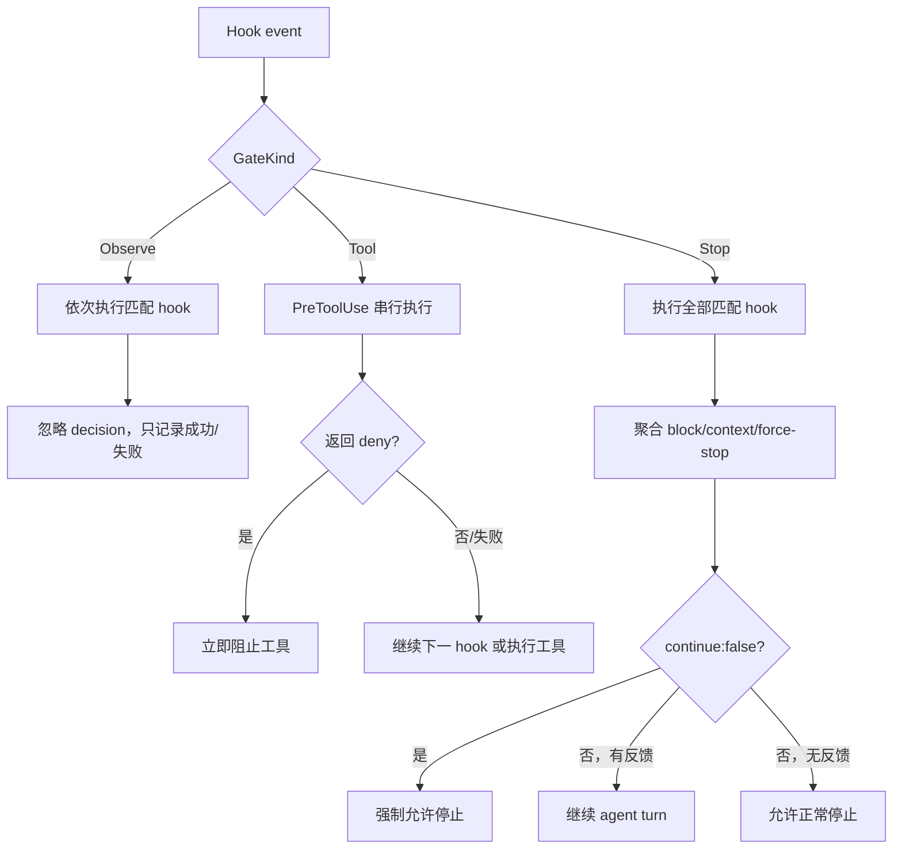
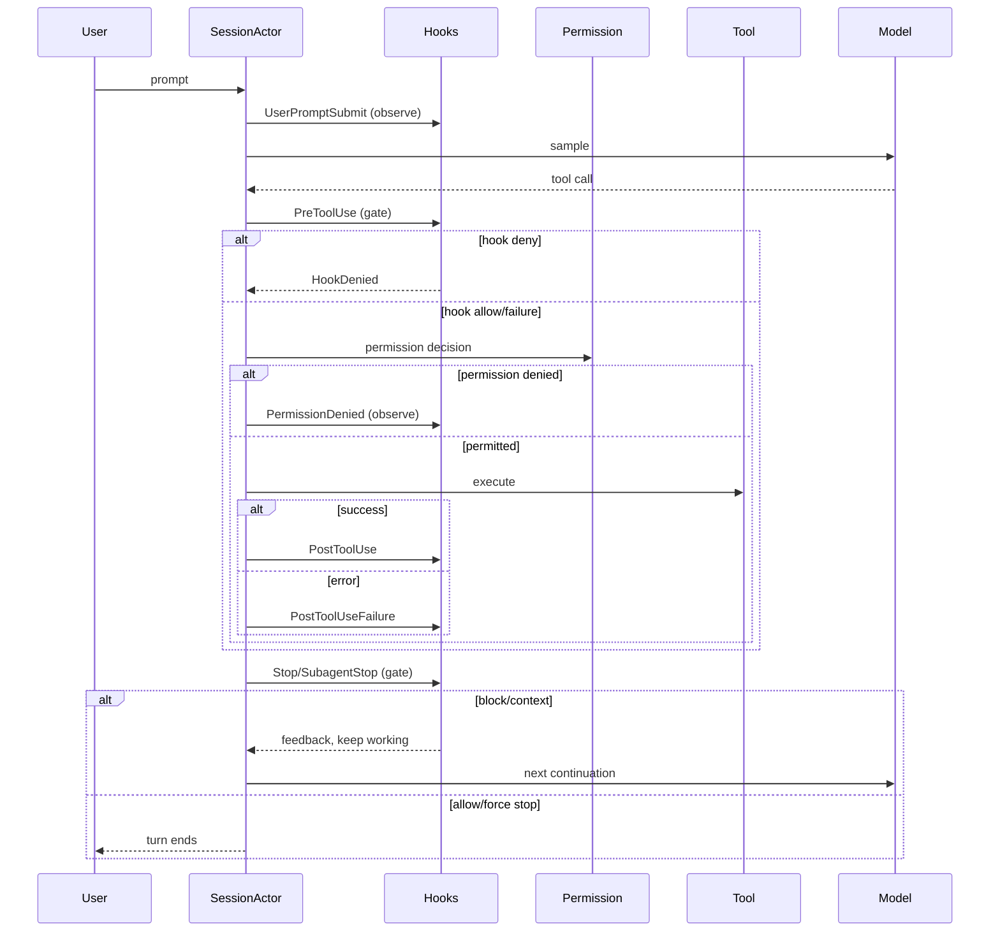

# Hooks 子系统：事件、匹配、执行、Gate 与信任边界

本文研究 Grok Build 如何在 session、turn、tool、compaction 和 subagent 生命周期中触发 hook，如何从多种配置源构建注册表，如何匹配事件并执行 command、HTTP 或 ACP client callback，以及 hook 的返回值何时真的能改变控制流。

前置阅读：[工具从注册到执行](../02-runtime-flows/04-tool-execution.md)、[权限、目录信任与 Sandbox](../02-runtime-flows/05-permission-and-sandbox.md)、[配置系统](../02-runtime-flows/10-configuration.md)、[权限判定与审批状态机](05-permission-approval-state-machine.md)、[Subagent 调度](08-subagent-coordinator-inheritance-and-background-tasks.md)。

## 先记住结论

1. Hook 是生命周期扩展点，不是模型主动调用的 tool；事件发生时由 shell 自动调度。
2. `xai-grok-hooks` 负责事件模型、配置解析、matcher、注册表、runner 和结果聚合；`xai-grok-shell` 负责在真实生命周期中触发它们。
3. `event.rs` 的事件表是事件名、兼容别名、gate 类型、matcher 策略和 hub 转发策略的单一事实源。
4. 当前事件分三种 gate：`Observe` 只观察，`Tool` 可禁止工具，`Stop` 可让 agent 继续工作或强制结束。
5. 只有 `PreToolUse` 可以 deny 工具；普通 post/session/notification/compaction 事件即使输出 deny 也不会改变主流程。
6. `Stop` 和 `SubagentStop` 不是“禁止停止”这么简单：它们可返回 block reason、additional context，或用 `continue:false` 强制停止。
7. Hook timeout、进程崩溃、网络错误和多数格式错误统一 fail-open；失败会被记录，但不会意外锁死工具或会话。
8. `PreToolUse` 按配置顺序串行执行，第一条 deny 立即短路；Stop gate 会运行所有匹配 hook 后聚合反馈。
9. matcher 的简单字符串不是正则：`Bash|Read` 是精确名称集合；出现其他正则字符时才编译为未锚定 regex。
10. tool matcher 面向解析后的真实工具名；`use_tool` 之类 meta-dispatch 会暴露底层 MCP tool，而不是只暴露分发器名。
11. 缺少 matcher、空 matcher、`*` 和缺少 match value 都按 match-all 处理；但只有标为 `Tested` 的事件才真正使用 matcher。
12. 全局、项目、插件和 Agent hooks 最终被展平成 `HookRegistry` 快照；重复项按事件、原始 command/URL 和 matcher 去重，先出现者获胜。
13. 项目 hook 只有在 folder trust 允许时才进入发现结果；统一信任存储是 `~/.grok/trusted_folders.toml`。
14. 信任项目的安全含义包括允许仓库内 hook 自动执行，不只是允许读取代码或读取配置。
15. command hook 直接启动子进程，不逐次经过普通 tool permission/sandbox 审批；其安全边界主要是来源信任、超时和 session process scope。
16. command hook 从 stdin 接收完整 JSON envelope，工作目录固定为 workspace root，stdout/stderr 各最多保留 64 KiB。
17. command 含空格、管道、重定向、变量等 shell 语法时走 `sh -c`；单一相对可执行文件则相对 hook 配置文件目录解析。
18. runner 注入 `GROK_HOOK_EVENT`、`GROK_HOOK_NAME`、`GROK_SESSION_ID`、`GROK_WORKSPACE_ROOT` 和 `CLAUDE_PROJECT_DIR`，配置不能伪造这些值。
19. Tool gate 的 command protocol 同时支持 JSON decision 和退出码；退出码 `2` 是 deny，其他非零码是 hook failure。
20. Stop command 没有有效 JSON 时，退出码 `2` 用 stderr 作为继续工作的反馈；其他非零退出码仍是 fail-open failure。
21. HTTP hook 只允许 HTTPS，禁止 redirect，并在请求前解析 DNS、拒绝私网、link-local、CGNAT、unspecified 和 metadata 地址；loopback 被特意允许用于本地开发。
22. HTTP 防 SSRF 仍有源码明确承认的 DNS rebinding 时间窗口，不能把它当作完整网络沙箱。
23. ACP client hook 不在 shell 里启动程序：服务端通过 `x.ai/hooks/run` 反向请求 gate callback，通过 `x.ai/hooks/event` 发送 observe notification。
24. client gate callback 并发等待并各自计时；PreToolUse 收到第一个完成的 deny 就阻止工具，Stop 则按注册顺序聚合完成结果。
25. Stop hook 最多让同一 turn 继续 8 次；到上限后不再调用 gate，直接允许结束，防止无限循环。
26. registry 是快照而非每次事件都读文件；中途修改需显式 reload，trust 和 plugin 操作会走重建路径。
27. `$GROK_HOME/disabled-hooks` 是运行时精确名称禁用表；被禁用 hook 产生 `Skipped`，不会执行。
28. envelope 中大型 tool input/result 最多序列化 128 KiB，并带截断标记；Stop 中单条后台任务文字最多 1,000 字符。
29. `SubagentEnd` 是兼容别名，规范化后是 `SubagentStop`；去重、序列化和查找应以 canonical event 为准。
30. Hooks 的主设计取舍是“扩展能力强、策略失败不阻断工作”；若需要强安全保证，hook 不能替代 permission policy 或 sandbox。

## 一、Hook 到底是什么

可以把 hook 理解为系统在固定时刻广播的一条生命周期消息：

```text
事件发生
  -> 构造统一 envelope
  -> 查找该事件的 hook
  -> matcher 过滤
  -> command / HTTP / client callback
  -> 解释结果
  -> gate 改变控制流，或 observe 仅记录
```

这是一种 IoC（Inversion of Control，控制反转）：hook 作者不编写主循环去寻找 Grok，也不决定何时轮询；Grok 拥有控制流，并在约定时机回调 hook 作者提供的逻辑。这里的 IoC 描述“谁调用谁”，不等同于依赖注入框架。

它与几个相邻概念的区别如下：

| 概念 | 谁决定调用 | 主要用途 | 能否直接改变主流程 |
| --- | --- | --- | --- |
| tool | 模型产生 tool call | 读写文件、执行命令、访问外部能力 | 能，结果回到 agent loop |
| hook | shell 在固定生命周期点触发 | 校验、审计、通知、补上下文 | 仅 gate 类事件能 |
| plugin | 配置与能力的分发单元 | 携带 tools、hooks、MCP 等 | 间接，取决于其内容 |
| permission policy | 工具执行框架判定 | 控制资源访问 | 能，属于安全主路径 |
| event/notification | 状态变化的消息 | 解耦生产者和消费者 | 通常不能 |

最容易犯的错误是把 PreToolUse hook 当成 permission policy。它们都可能阻止工具，但前者是可失败、fail-open 的扩展策略，后者才是权限系统的核心约束。

## 二、crate 与模块边界

| 位置 | 关键类型/函数 | 职责 |
| --- | --- | --- |
| `xai-grok-hooks/src/event.rs` | `HookEventName`、`HookEventEnvelope`、`HookPayload` | 事件词汇、wire shape、事件 trait |
| `xai-grok-hooks/src/config.rs` | `HooksMap`、`RawHandler`、`HookSpec` | 配置反序列化和运行规格 |
| `xai-grok-hooks/src/discovery.rs` | discovery、`HookRegistry` | 多源加载、排序、去重、索引 |
| `xai-grok-hooks/src/matcher.rs` | `HookMatcher`、`matcher_allows` | exact-list/regex 编译和名称兼容 |
| `xai-grok-hooks/src/dispatcher.rs` | 三类 dispatch 函数 | 顺序、短路、聚合、fail-open |
| `xai-grok-hooks/src/runner/command.rs` | `run_command_hook` | 子进程、stdin/env、timeout、输出协议 |
| `xai-grok-hooks/src/runner/http.rs` | `run_http_hook` | POST、SSRF 校验、HTTP 输出协议 |
| `xai-grok-hooks/src/result.rs` | `HookRunResult`、`HookDecision` | UI/telemetry 可消费的统一结果 |
| `xai-grok-hooks/src/trust.rs` | disable/migration helpers | hook 禁用表和旧信任数据迁移 |
| `shell/.../acp_session/hooks.rs` | client hook dispatch | ACP reverse RPC 与 observe notification |
| `shell/.../hook_dispatch.rs` | session glue | envelope、file hook、UI 和 telemetry |
| `shell/.../stop_gate.rs` | turn-end gate | Stop/SubagentStop 聚合和循环上限 |
| `shell/.../hooks_plugins.rs` | reload/trust/plugin merge | 中途重建 registry |
| `shell/src/agent/folder_trust.rs` | folder trust adapter | 项目级来源是否允许加载 |

这里体现了一个清晰边界：hooks crate 不知道一次 turn 何时结束，也不知道 permission prompt 何时被拒绝；shell 知道生命周期，但把匹配与执行委托给 hooks crate。

## 三、事件表是单一事实源

`event.rs` 用集中事件表同时生成 enum、字符串解析、显示名和 trait。当前规范事件如下：

| 事件 | Gate | Matcher | 典型载荷/时机 |
| --- | --- | --- | --- |
| `SessionStart` | Observe | Tested | session 来源、model、agent type |
| `UserPromptSubmit` | Observe | Ignored | 原始用户 prompt |
| `PreToolUse` | Tool | Tested | 工具名、ID、输入 |
| `PostToolUse` | Observe | Tested | 成功结果、耗时 |
| `PostToolUseFailure` | Observe | Tested | 失败文本、是否中断 |
| `PermissionDenied` | Observe | Tested | 被拒工具、输入、原因 |
| `Stop` | Stop | Ignored | assistant 最后消息、后台任务、cron |
| `StopFailure` | Observe | Tested | turn 失败分类和细节 |
| `Notification` | Observe | Tested | notification type/message/level |
| `SubagentStart` | Observe | Tested | subagent id/type |
| `SubagentStop` | Stop | Tested | gate/observe phase 与 subagent 信息 |
| `PreCompact` | Observe | Tested | compaction source |
| `PostCompact` | Observe | Tested | compaction source |
| `SessionEnd` | Observe | Tested | reason、turn/tool 数量 |

`SubagentEnd` 仍是 enum 兼容入口，但 `canonical()` 会把它变成 `SubagentStop`。序列化 envelope 时也写 canonical 名。因此新代码和新配置应使用 `SubagentStop`。

### 3.1 兼容事件名

解析接受 PascalCase、snake_case、camelCase 以及一些外部生态操作名。例如：

```text
beforeShellExecution  -> PreToolUse
beforeMCPExecution    -> PreToolUse
beforeReadFile        -> PreToolUse
afterShellExecution   -> PostToolUse
afterMCPExecution     -> PostToolUse
afterFileEdit         -> PostToolUse
afterAgentResponse    -> PostToolUse
afterAgentThought     -> PostToolUse
```

兼容别名解决迁移问题，却会损失原事件的细粒度。比如多个 `after*` 最终都成为 PostToolUse，后续只能再用 tool matcher 区分。

## 四、Envelope：hook 收到的统一输入

所有执行器消费同一个 `HookEventEnvelope`。公共字段使用 camelCase：

```json
{
  "hookEventName": "pre_tool_use",
  "sessionId": "...",
  "cwd": "...",
  "workspaceRoot": "...",
  "timestamp": "...",
  "transcriptPath": "...",
  "promptId": "...",
  "permissionMode": "default",
  "toolName": "run_terminal_command",
  "toolUseId": "...",
  "toolInput": {"command": "cargo test"},
  "toolInputTruncated": false
}
```

事件专属 payload 被 flatten 到顶层，不再套一层 `payload`。好处是兼容外部 hook 格式；代价是添加字段时必须留意公共字段冲突。

### 4.1 大载荷保护

tool input 和 result 的序列化上限是 128 KiB。超过上限时不会把任意大对象塞进 stdin、网络和日志，而是输出受控表示并设置对应 `...Truncated` 标志。

Stop payload 里的后台 command、描述和 cron prompt 单项最多 1,000 字符，且在 UTF-8 字符边界截断。真正反馈给模型时，stop gate 还会把每段限制到 10,000 字符。

### 4.2 match value 从哪里来

不同事件的 matcher 输入由 `HookPayload::match_value()` 给出：

| payload | match value |
| --- | --- |
| tool 相关 | 解析后的 tool name |
| Notification | notification type |
| SubagentStart/Stop | subagent type |
| SessionStart、Pre/PostCompact | source |
| SessionEnd | reason |
| StopFailure | error 分类字符串 |
| Stop、UserPromptSubmit | 无；matcher 被忽略 |

缺少 match value 时 `matcher_allows` 按 match-all 处理。这是兼容性 fail-open，不代表给 Stop 写 matcher 有意义；事件 trait 已将它标为 `Ignored`，loader 会提示。

## 五、配置如何变成 HookSpec

概念上的配置结构是：事件 -> matcher groups -> handlers。

```json
{
  "hooks": {
    "PreToolUse": [
      {
        "matcher": "Bash|run_terminal_command",
        "hooks": [
          {
            "type": "command",
            "command": "./scripts/check-tool.sh",
            "timeout": 5,
            "env": {"POLICY": "strict"}
          }
        ]
      }
    ]
  }
}
```

handler 目前有 `command` 和 `http` 两类。缺 type、command/URL 或使用未知 type 都是加载错误。

### 5.1 timeout

- 一般 hook 默认 5 秒。
- `Stop`/`SubagentStop` 默认 600 秒，因为常见用途是跑构建或测试。
- 配置以秒为单位，转换毫秒时使用饱和乘法，避免整数溢出。

长 timeout 不改变 fail-open 语义，只改变主流程最多等待多久。

### 5.2 环境变量展开

command/URL 在加载时做一次环境变量展开；HTTP URL 在运行时还会再展开一次，以支持 plugin adapter 后补进来的 `${CLAUDE_PLUGIN_ROOT}` 等变量。

规则有几个细节：

- per-hook `env` 优先于进程环境参与展开；
- 未设置引用保留原文，不悄悄替换为空；
- `${VAR:-fallback}`、`${VAR%pattern}` 等 shell parameter modifier 被保留给 shell；
- 内部用随机 128-bit sentinel 保护 modifier 片段，避免展开器误写；
- command 在运行时不做第二轮通用展开，走 `sh -c` 的分支由 shell 自然处理。

## 六、来源、顺序、去重和快照

`HookSpec` 保留 provenance，常见来源有 system-managed、managed、requirements、user config/file、project file、plugin 和 agent。文件 hook 名通常带 `global/`、`project/`、`agent:` 或 `plugin/` 前缀，方便展示与禁用。

发现过程支持单一 settings file，也支持目录中直接一层、非隐藏、按文件名排序的 `*.json`。不存在的来源视为空；目录里某个坏文件会记录错误并继续加载兄弟文件。

有一个格式差异值得记住：

- JSON hook 文件中某个已知事件结构损坏，可能使整个文件失败；
- TOML 配置层中损坏的事件可被跳过，保留同层其他事件；
- 未知事件 key 会被跳过，而不是让所有 hook 消失。

### 6.1 去重键

注册表去重键是：

```text
(canonical event, command_raw, url_raw, configured_matcher)
```

timeout 和 extra env 故意不参与。调用方必须先放高优先级来源；重复项中先出现者获胜。这防止低层配置仅修改 timeout/env 就绕开更高层的同一 hook 定义。

### 6.2 registry 不是实时文件视图

`HookRegistry` 是按事件建立索引的 point-in-time snapshot。dispatch 不会每次打开配置文件。中途变更需要 `ReloadHooks` 或 trust/plugin/config 操作触发显式重建。

禁用是例外：dispatch 会查询 `$GROK_HOME/disabled-hooks`，按精确 hook name 判定。空行和注释忽略；disable append 幂等，enable 通过重写移除名称。

## 七、Matcher 的真实语义

`HookMatcher` 有三种模式：

| 配置 | 编译结果 | 含义 |
| --- | --- | --- |
| 缺失、空串、`*` | match all | 所有目标 |
| 仅字母数字、下划线和 `|` | exact list | `A|B` 等于 A 或 B |
| 含其他字符 | regex | Rust regex，默认未锚定 |

因此 `Read` 只匹配精确的 `Read`，而 `Read.*` 是正则。想匹配完整字符串应自己写 `^...$`。

空白是有效字符：`"   "` 会进入 regex 模式，并通常什么也匹配不到；它不是空 matcher。

### 7.1 工具名称兼容

matcher 会扩展 Grok 与外部兼容名称。例如 `Bash` 能匹配 Grok 的 `run_terminal_command`，锚定正则 `^Bash$` 也会经过兼容名称集合测试。

对 meta-dispatch tool，payload 和 matcher 使用已解析的底层目标，例如 `server__tool`，而不是表面的 `use_tool`。否则策略只看见一个总分发器，无法区分真实能力。

### 7.2 反序列化后的 recompile

compiled matcher 被 `serde(skip)` 排除；registry 从 wire/storage 恢复后必须调用 `recompile_matchers()`。若恢复的数据含非法 regex，会编译成 never-match，而不是危险地 match-all。

## 八、三种 dispatch 状态机



### 8.1 Observe

`dispatch_non_blocking` 的 non-blocking 指“不阻止业务动作”，不一定指 detached background task。它仍可能按顺序 await hook，但返回的 decision/stop signals 被丢弃；只有执行状态进入 UI 和 telemetry。

### 8.2 PreToolUse

在普通工具权限路径中，流程是：构造 envelope -> 文件 hook gate -> client hook gate -> 后续 permission/tool execution。文件 hook 串行并在 deny 时短路。client callbacks 并发等待，哪个 deny 先完成就立即阻止。另有一个更早的 plan-mode edit gate：它拒绝编辑时不会进入 PreToolUse，这属于 plan mode 自己的控制规则，不是 hook。

如果 hook timeout、崩溃或输出无效，记录 `Failed` 后继续。这意味着 hook 适合组织策略、lint 和提示，不适合单独承担不可绕过的安全隔离。

### 8.3 Stop/SubagentStop

Stop 运行全部匹配 hook，因为多个 hook 都可能提供需要模型处理的反馈。聚合结果包括：

- `block_reason`：说明为什么还不能结束；
- `additional_context`：没有错误也可以补充下一步上下文；
- `prevent_continuation`：由 `continue:false` 产生，强制停止并覆盖其他 block。

文件 hook 先运行。若文件 hook 已强制停止，就跳过 client gate，但仍给 client 发送 observe notification。否则再聚合 client 结果。

每个 turn 最多被 Stop hooks 续跑 8 次。达到上限时不再通知 gate，直接结束，避免永动机。payload 的 `stopHookActive` 告诉 hook 当前是否已经是续跑后的再次停止。

## 九、Command runner

### 9.1 命令选择

command 含空格、`|`、`&`、`;`、重定向、`$` 或以 `~` 开头时，在 Unix 使用：

```text
sh -c <command string>
```

否则它被当作单一 executable path：绝对路径直接使用，相对路径相对 `HookSpec.source_dir` 解析。这一区别解释了为什么 `./check.sh` 相对 hook 文件，而 `./check.sh --fast` 的 shell 工作目录却是 workspace root。

在启动 shell 前，runner 会扫描未解析的必需 `$VAR`。runner 固有变量、extra env、进程环境和命令内局部赋值可满足引用；带 fallback/modifier 的表达式不报错。缺失必需变量会在 spawn 前产生清晰 failure。

### 9.2 进程环境

- current directory：workspace root；
- stdin：序列化 envelope JSON；
- stdout/stderr：并发 drain，各截断到 64 KiB；
- controlling terminal：detach，避免 GPG pinentry 等破坏 TUI；
- `kill_on_drop(true)`；
- 尽量加入 session `ProcessGroup`，timeout/session close 时连同 grandchildren 清理。

extra env 先写，runner identity env 后写，因此以下值始终由 runner 覆盖：

```text
GROK_HOOK_EVENT
GROK_HOOK_NAME
GROK_SESSION_ID
GROK_WORKSPACE_ROOT
CLAUDE_PROJECT_DIR
```

加载器也会剥离 config 中对这些 reserved keys 的覆盖并警告。`GROK_HOOK_DEBUG=1` 只增加 stdin/stdout 字节数 trace，不把敏感 payload 原文写日志。

### 9.3 Tool gate 输出协议

推荐输出严格 JSON：

```json
{"decision":"allow"}
```

或：

```json
{"decision":"deny","reason":"命令不符合项目策略"}
```

判定优先级：

| stdout / exit | 结果 |
| --- | --- |
| 有效 JSON deny，任意退出码 | deny |
| 有效 JSON allow，exit 非 2 | allow |
| 有效 JSON allow，exit 2 | deny，exit 2 胜出 |
| 无有效 JSON，exit 0 | allow |
| 无有效 JSON，exit 2 | deny，生成默认原因 |
| 无有效 JSON，其他 exit | failure，dispatcher fail-open |
| JSON decision 是未知值 | failure，dispatcher fail-open |

### 9.4 Stop 输出协议

Stop JSON 可组合这些字段：

```json
{
  "decision": "block",
  "reason": "测试尚未通过",
  "hookSpecificOutput": {
    "additionalContext": "先运行 cargo test -p target"
  }
}
```

也可以强制停止：

```json
{"continue":false,"stopReason":"预算耗尽，结束本轮"}
```

有效 Stop JSON 在任何退出码上优先于退出码。没有有效 JSON时：exit 0 允许停止；exit 2 阻止停止并用 stderr 作为模型反馈；其他退出码是 failure，允许正常停止。普通 stdout 文本不是 Stop feedback。

## 十、HTTP runner 与 SSRF 边界

HTTP hook POST 同一 envelope，`Content-Type` 为 `application/json`。Observe 模式只看 2xx；gate 模式还读取响应体。

请求前执行这些检查：

1. URL 必须可解析且 scheme 必须是 HTTPS；
2. host literal 或 DNS 的所有地址都要通过 IP 检查；
3. 拒绝 RFC1918 私网、169.254/16、100.64/10、unspecified、IPv6 link-local/ULA 和映射后的私网 IPv4；
4. 允许 `127.0.0.0/8` 和 `::1`，服务本地开发；
5. DNS lookup 也受 hook timeout 限制；
6. reqwest client 禁止 redirect，防止首个公开地址跳转到内网。

源码明确记录一个 gap：校验 DNS 后，reqwest 发请求时会再次解析，恶意 DNS 可能 rebinding。这个检查是风险降低，不是完整 egress sandbox。

HTTP 错误日志优先使用未展开的 raw URL，且从 reqwest error 中移除 URL，避免 `env` 展开的 secret 泄漏到日志。UI 可保存最多 200 字符的 response preview。

### 10.1 HTTP gate 解析

- Tool gate：2xx 空 body -> allow；2xx 非 JSON -> 兼容性 allow；非 2xx 空/非法 JSON -> failure。
- 若 body 是有效 decision JSON，则按 decision 处理；有效 deny 即使 HTTP status 非 2xx 也会被尊重。
- Stop gate：必须先是 2xx；空或非 JSON body -> allow-stop；有效 Stop JSON -> 聚合 signals；非 2xx -> failure。
- Observe：任意 2xx success，非 2xx failure，不读取 decision。

所有 failure 最终仍由 dispatcher fail-open。

## 十一、ACP Client Hooks

客户端可在 `session/new` 的 `_meta["x.ai/hooks"]` 注册 groups 和 callback IDs。它们与 file hook 共享 `HookMatcher` 和 envelope，却不在 shell 主机执行 command。

| 类别 | ACP 方法 | 行为 |
| --- | --- | --- |
| PreToolUse、Stop/SubagentStop | reverse request `x.ai/hooks/run` | await response，解释 gate signals |
| 其他事件 | notification `x.ai/hooks/event` | fire-and-forget，返回值无效 |

PreToolUse client gate 默认 30 秒；Stop client gate 默认 600 秒。每个 group 可覆盖 timeout。callback 独立 timeout 并通过 `FuturesUnordered` 并发执行，同一 callback ID 被多个 group 匹配时只发送一次。

反向 RPC 的 transport error、timeout、malformed response 和未知 decision 都 fail-open。PreToolUse 用首个完成的 deny；Stop 为了确定性先收集并发结果，再按注册顺序吸收，保证 force-stop 的归属稳定。

client hook 的代码运行在客户端一侧，因此信任和资源限制不能只看 shell 主机；ACP client 自己必须保护 callback 执行环境。

## 十二、事件嵌入真实生命周期的位置

一次常见 turn 可以简化为：



几个重要不变量：

- 成功工具只发 `PostToolUse`，硬错误只发 `PostToolUseFailure`，两者不应同时发；
- permission 被拒后工具没有执行，因此是 `PermissionDenied`，不是 PostToolUseFailure；
- Pre/PostCompact 包围 compaction；
- StopFailure 记录模型/turn 失败，不等同于 Stop gate block；
- SessionEnd 是 observe-only，不能阻止 session 关闭；关闭路径还给它一个有限预算，不能无限拖延退出。

## 十三、Subagent 的特殊处理

subagent tool call 仍通过父连接上的同一 PreToolUse 策略，并在 payload 带 `subagentType`，因此父级策略可以按工具和 agent 类型审计。

顶层 turn 结束使用 `Stop`；subagent turn 结束使用 `SubagentStop`。Agent 定义里兼容的 Stop spec 会在 subagent 请求路径转换成 `SubagentStop`，避免错误地套用顶层结束语义。

`SubagentStop` payload 还区分 gate phase 和 observe phase：gate 决定是否继续工作，结束观察则让外部消费者看到生命周期完成。阅读日志时不要把同名事件的两个 phase 当成重复 bug。

## 十四、信任模型

### 14.1 项目 hook 的加载门

项目级 `.grok` hook 与 repo-local MCP、LSP、project Agent 一样，受统一 folder trust 控制。当前权威存储是：

```text
~/.grok/trusted_folders.toml
```

旧的 `trusted-hook-projects` 只用于迁移，不是并行的第二套实时授权源。untrusted project 的 hook 在 discovery 阶段就被排除，而不是先加载、执行时再询问。

### 14.2 为什么这是代码执行授权

command hook：

- 自动随事件运行；
- 不逐次展示普通 tool permission prompt；
- 继承 Grok 进程环境并可读 envelope；
- 以 workspace root 为工作目录；
- 可启动子进程和访问主机资源。

所以 clone 陌生仓库后，信任提示必须按“是否允许仓库配置自动执行代码”理解。只检查 Rust 源码而不检查 `.grok/hooks`、Agent inline hooks 和 plugin 配置是不完整的。

### 14.3 Hook 不是安全边界

fail-open 是刻意选择：hook 通常运行在已受信环境，若 typo、网络抖动或脚本缺依赖就阻塞所有工作，用户会被永久锁住。代价是：

- deny hook 挂掉时工具继续；
- Stop verifier 挂掉时 agent 可以结束；
- observe hook 丢事件时主任务不补偿。

不可绕过的规则应放到 permission policy、sandbox、服务端授权或操作系统边界；hook 适合 defense-in-depth、组织流程和反馈。

## 十五、结果、UI、Telemetry 与调试

统一结果有四种：

| 结果 | 含义 |
| --- | --- |
| `Success` | 执行成功或 observe 中 decision 被忽略 |
| `Skipped` | 名称被禁用等，未执行 |
| `Blocked` | gate 明确给出 deny/block/force-stop signal |
| `Failed` | timeout、spawn、HTTP、格式或退出码错误 |

shell 把非空结果批次转换为 `HookExecution` 更新，在 TUI scrollback 展示，并逐条发 telemetry。observe-only session-end 即便 runner 返回“blocked”形态，也会降级成 success，避免 UI 谎称它阻止了关闭。

排查顺序建议：

1. 用 hooks 列表确认 source、event、matcher、enabled 和 raw command/URL；
2. 确认项目 folder trust verdict，尤其是中途 revoke/trust 后是否 reload；
3. 检查 `$GROK_HOME/disabled-hooks` 是否存在精确名称；
4. 用真实 canonical tool name 验证 matcher，不要只看 UI alias；
5. command hook 单独喂一份 envelope，检查 stdout 是否只有协议 JSON；
6. 区分 Blocked 与 Failed：后者默认不会阻断；
7. HTTP 检查 HTTPS、DNS 地址集合、redirect 和 response status/body；
8. client hook 检查 reverse request 是否由客户端实现，以及 callback timeout。

## 十六、常见误解与修改陷阱

### 误解 1：所有 hook 都可以 deny

错误。事件 trait 决定 gate kind。PostToolUse 输出 deny 仍是 observe success。

### 误解 2：non-blocking 就是不等待

错误。它表示不改变业务控制流；本地 observe hook 当前仍可被顺序 await。

### 误解 3：exit 1 更安全，会拒绝工具

错误。Tool gate 只有 exit 2 是明确 deny；exit 1 是 failure，dispatcher fail-open。

### 误解 4：HTTP 500 加 deny JSON 一定算 failure

对 Tool gate 不一定。只要 body 是有效 deny JSON，deny 会被尊重；Stop gate 则先要求 2xx。

### 误解 5：改了 hook 文件下一事件就生效

错误。registry 是快照，需要 reload/rebuild。

### 误解 6：去重会比较完整 HookSpec

错误。timeout/env 不参与去重，先出现的相同 identity 获胜。

### 误解 7：项目 hook 会在执行前弹普通命令审批

错误。folder trust 是更早、更大的授权门；hook command 本身不走每次工具审批。

### 误解 8：给 Stop 写 tool matcher 能筛工具

错误。Stop 没有 tool match value，而且 matcher policy 是 Ignored。

### 修改时的 checklist

- 新增事件：同步事件表、payload、match value、fire site、client/hub 行为和测试。
- 新增 payload 字段：确认 flatten 冲突、大小限制、敏感信息和兼容默认值。
- 修改 matcher：同时覆盖 exact、regex、alias、meta-tool 和 restore recompile。
- 修改 runner：保持 timeout 内同时写 stdin/drain output，并保持 process group 清理。
- 修改 gate JSON：分别测试 command、HTTP 和 client vocabulary，不要假设协议完全相同。
- 修改 trust/reload：测试 untrusted -> trusted、trusted -> revoked 和 mid-session rebuild。
- 修改 Stop：测试多个 block、additional context、force-stop 优先级和 8 次上限。

## 十七、建议源码阅读顺序

1. `xai-grok-hooks/src/event.rs`：先学事件词汇和 trait。
2. `matcher.rs`：掌握 exact/regex/alias，避免后面误读。
3. `config.rs`：看 RawHandler 如何变成 HookSpec。
4. `discovery.rs`：理解来源顺序、去重和 registry。
5. `dispatcher.rs`：画出三种 gate 状态机。
6. `runner/mod.rs`：读共享 JSON vocabulary。
7. `runner/command.rs` 和 `runner/http.rs`：看真实副作用与失败模式。
8. shell 的 `acp_session/hooks.rs`：理解 client hooks。
9. `tool_calls.rs`、`stop_gate.rs`、`compaction.rs`、`run_loop.rs`：核对 fire sites。
10. `folder_trust.rs` 和 `hooks_plugins.rs`：最后建立信任与 reload 模型。

## 十八、验证与练习

### 快速源码检索

```sh
rg "HookEventName::" crates/codegen/xai-grok-shell/src/session
rg "dispatch_pre_tool_use|dispatch_stop|dispatch_non_blocking" crates/codegen
rg "GATE_EXIT_CODE|RUNNER_ALWAYS_SET_ENV|validate_hook_url" \
  crates/codegen/xai-grok-hooks/src
```

### 目标测试

```sh
cargo test -p xai-grok-hooks
cargo test -p xai-grok-shell client_hooks
```

### 学习练习

1. 写一个 command PreToolUse hook：只拒绝 `run_terminal_command` 中含危险片段的输入，比较 JSON deny 与 exit 2。
2. 让 hook 分别 exit 1、输出非法 JSON、sleep 超时，验证三者都记录 Failed 且工具继续。
3. 写两个 Stop hooks：一个 block，一个 additionalContext，观察聚合反馈如何进入下一轮模型输入。
4. 再加一个 `continue:false`，验证它覆盖前两个继续信号。
5. 用 `Bash`、`Bash|Read`、`^Bash$`、`Bash.*` 对同一工具测试 matcher。
6. 修改文件但不 reload，再显式 reload，对比 registry snapshot。
7. 在隔离目录测试 folder trust 前后项目 hook 是否进入列表；不要在不受信仓库直接执行未知脚本。
8. 为 HTTP runner 增加测试，验证 redirect、私网 literal、解析到混合公网/私网地址都被拒绝。

## 本篇术语表

| 名词 | 白话解释 | 在本文中的具体含义 |
| --- | --- | --- |
| hook | 系统走到某个节点时自动调用的扩展逻辑 | command、HTTP 或 ACP client callback |
| IoC / 控制反转 | 框架掌握主流程，并在约定点回调用户逻辑 | Grok 决定何时触发 hook，hook 不负责驱动 Grok |
| callback / 回调 | 先注册、等系统需要时再调用的函数或标识 | ACP client hook 通过 callback ID 被反向调用 |
| lifecycle | 对象从开始到结束经历的阶段 | session/turn/tool/compaction/subagent 的阶段 |
| event | 某件事已经发生或即将发生的结构化信号 | `HookEventName` 与对应 `HookPayload` |
| envelope | 给不同事件套上的统一外包装 | sessionId、cwd、timestamp 加 flatten payload |
| payload | 某个事件独有的数据 | tool input、stop reason、compact source 等 |
| dispatch | 查表、匹配、执行并解释结果 | dispatcher 的三条主入口 |
| gate | 能影响控制流的检查点 | Tool gate 或 Stop gate |
| observe-only | 只能旁观，结果不能改变主动作 | SessionStart、PostToolUse 等事件 |
| blocking | 可能阻止工具或结束动作 | 不是指线程同步阻塞 |
| non-blocking | 不改变业务控制流 | 不保证 hook 在后台、不等待 |
| matcher | 决定某 hook 是否适用于当前目标的规则 | exact list、regex 或 match-all |
| match value | matcher 实际检查的字符串 | tool name、subagent type、source 等 |
| exact list | 由 `|` 分隔的精确名称集合 | `Bash|Read`，不是 regex alternation |
| regex | 正则表达式匹配 | 默认未锚定，完整匹配需 `^...$` |
| alias | 同一概念的兼容名称 | `Bash` 与 `run_terminal_command` |
| canonical | 归一化后的唯一标准形式 | `SubagentEnd` 归一为 `SubagentStop` |
| meta-dispatch | 一个工具再分发到真实底层工具 | matcher 使用底层工具名 |
| handler | 某条 hook 的具体执行方式 | command 或 HTTP 配置 |
| runner | 真正执行 handler 的代码 | command runner、HTTP runner |
| registry | 已加载、去重、按事件索引的 hook 集合 | session 持有的快照 |
| provenance | 一条配置来自哪里 | global、project、plugin、agent 等 |
| precedence | 多个来源冲突时谁优先 | 去重时先出现者获胜 |
| fail-open | 检查器失败时允许主操作继续 | hook failure 不 deny 工具/停止 |
| fail-closed | 检查器失败时拒绝主操作 | hooks 主 dispatcher 通常不采用 |
| short-circuit | 得到决定后不再执行后续项 | PreToolUse 第一条 deny 后停止 |
| aggregate | 收集多个结果再统一判断 | Stop 收集 blocks/context/force-stop |
| decision | hook 输出的控制词 | allow/deny 或 approve/block |
| exit code | 子进程结束状态整数 | 0 成功，2 表示 gate deny/block |
| stdout | 命令标准输出 | 承载 JSON decision |
| stderr | 命令标准错误输出 | Stop exit 2 时作为反馈 |
| timeout | hook 最长等待时间 | 超时产生 Failed 并 fail-open |
| process group | 可一起终止的一组进程 | 用于清理 hook 及 grandchildren |
| reserved env | 配置不能覆盖的 runner 身份变量 | `GROK_HOOK_*` 等 |
| SSRF | 服务端被诱导请求内部地址的攻击 | HTTP hook URL 校验所防风险 |
| DNS rebinding | 同一域名在校验后解析成不同 IP | 当前 SSRF 防护记录的剩余窗口 |
| redirect | HTTP 响应要求客户端访问另一个 URL | HTTP hook client 明确禁止 |
| reverse RPC | 服务端反过来向客户端发请求并等回复 | `x.ai/hooks/run` |
| callback ID | 客户端注册的回调标识 | client hook 的具体归属名称 |
| folder trust | 对项目目录内可执行配置的统一授权 | 决定 project hook 是否加载 |
| sandbox | 限制进程可访问资源的隔离机制 | hook command 本身不走普通 tool sandbox |
| telemetry | 用于观测的结构化运行数据 | hook outcome、耗时、名称等 |
| scrollback | TUI 中可回看的输出历史 | 显示 HookExecution 和 annotation |
| snapshot | 某一时刻冻结的数据视图 | registry 不自动跟随文件变化 |
| reload | 重新发现并构建运行时配置 | 让 hook/trust/plugin 变更生效 |

## 源码证据索引

| 结论 | 主要源码 |
| --- | --- |
| 事件、别名和 gate traits | `crates/codegen/xai-grok-hooks/src/event.rs` |
| matcher exact/regex/alias | `crates/codegen/xai-grok-hooks/src/matcher.rs` |
| 配置、timeout、env、provenance | `crates/codegen/xai-grok-hooks/src/config.rs`、`env_expand.rs` |
| discovery、去重、registry | `crates/codegen/xai-grok-hooks/src/discovery.rs` |
| Tool/Stop/Observe 调度 | `crates/codegen/xai-grok-hooks/src/dispatcher.rs` |
| command protocol 和进程清理 | `crates/codegen/xai-grok-hooks/src/runner/command.rs` |
| HTTP 与 SSRF | `crates/codegen/xai-grok-hooks/src/runner/http.rs` |
| client reverse RPC | `crates/codegen/xai-grok-shell/src/session/acp_session/hooks.rs` |
| tool fire sites | `crates/codegen/xai-grok-shell/src/session/acp_session_impl/tool_calls.rs` |
| Stop 聚合与循环上限 | `crates/codegen/xai-grok-shell/src/session/acp_session_impl/stop_gate.rs` |
| compaction fire sites | `crates/codegen/xai-grok-shell/src/session/compaction.rs` |
| trust 与 reload | `crates/codegen/xai-grok-shell/src/agent/folder_trust.rs`、`session/acp_session_impl/hooks_plugins.rs` |
