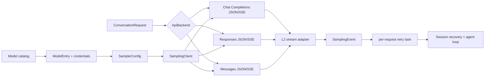
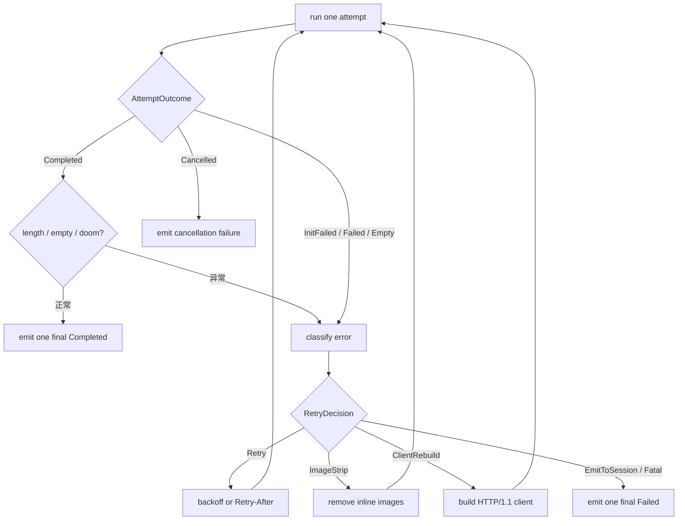

# 模型请求与 Provider 子系统：模型目录、协议转换、流式响应、重试与恢复

本文研究 Grok Build 如何选择模型和 endpoint，把统一 conversation 转换成不同厂商协议，通过 SSE 流持续接收文本、reasoning 与 tool call，如何把不同 wire event 重新归一成内部响应，以及网络错误、空响应、401、context overflow 等故障分别由哪一层恢复。

前置阅读：[Sampling、流式响应与 Agentic Loop](../02-runtime-flows/03-sampling-loop.md)、[Prompt 构建、上下文注入与 System Reminder](09-prompt-construction-context-injection-and-reminders.md)、[Agent 构建、配置覆盖与运行时重建](06-agent-build-configuration-and-rebuild.md)、[会话上下文、裁剪与压缩](../02-runtime-flows/06-session-context.md)。

## 先记住结论

1. 源码没有一个名为 `Provider` 的统一推理 trait；主要抽象是 `SamplerConfig`、`SamplingClient`、`ApiBackend`、三套协议转换器和三套 stream adapter。
2. `model_provider` 是配置继承模板，不是运行时动态分派对象；模型最终仍被解析成完整 `ModelEntry` 和 `SamplerConfig`。
3. 当前支持三种 wire backend：OpenAI Chat Completions、OpenAI Responses、Anthropic Messages。
4. `ConversationRequest` 和 `ConversationResponse` 是内部中间表示；provider-specific JSON 不应泄漏到 Session 主循环。
5. 模型 catalog key、发送给 API 的 routing slug 和 UI display name 是三个不同标识，不能混用。
6. 默认模型选择优先级是 CLI > `GROK_DEFAULT_MODEL` > config > remote settings hint > 第一个可选模型/内置 fallback。
7. catalog 合并主优先级是本地 `[model.*]` > remote prefetched models > bundled defaults；自定义 models endpoint 会跳过 bundled defaults。
8. `allowed_models` 控制是否可选择，`hidden_models` 控制是否展示，`disabled_models` 直接从 catalog 删除，三者语义不同。
9. 模型目录有 5 分钟磁盘 cache，并同时校验 Grok 版本、认证方式和来源 URL；任一不匹配都视为 miss。
10. `SamplerConfig` 是一次 sampling 的完整连接和行为配置，但 context window 只作为 metadata 供 Session 做 compaction，Sampler 自己不强制它。
11. endpoint protocol 由 `ApiBackend` 决定，不应仅凭 URL 或 model name 猜测。
12. `SamplingClient` 构造时不发网络请求，只准备 headers、endpoint template、默认参数和共享 HTTP client。
13. HTTP/2 client 默认进程级共享；连接池默认每 host 最多 2 个 idle connection、90 秒 idle eviction、10 秒 connect timeout，并发送 keepalive。
14. 第一次可重试 transport/5xx failure 会重建为不复用连接的 HTTP/1.1 client，绕开可能损坏的 HTTP/2 pool。
15. bearer resolver 在每次 POST 时读取最新 token；resolver 存在但没有有效 token 时，会删除旧 Authorization/X-API-Key，fail closed 防止过期 seed key 上线。
16. env-sourced HTTP header 在 client build 时解析，不写回可持久化的 `extra_headers`，降低 secret 落盘风险。
17. Session token 不能发送到任意 third-party endpoint；custom provider 未配置自己的凭据时会进入 fail-closed auth provider 路径。
18. `ConversationItem` 保留 System、User、Assistant、ToolResult、Reasoning 与 BackendToolCall 的内部语义，再由每种 backend 映射到合法 wire sequence。
19. Responses API 按原 emission order 重放 reasoning/backend tool/output，因为顺序和 `encrypted_content` 会影响语义、解密与 prompt cache。
20. Messages API 会把多个 system item 提升为 system blocks，把 tool result 包装成 user role content block，并清洗 tool call ID。
21. Messages API 自动布置最多三个显式 ephemeral cache breakpoint，并给 gateway 自动 caching 留出第四个 slot。
22. Responses API 原生转发 `prompt_cache_key`；Chat Completions 和 Messages 的 cache 行为通过各自协议能力实现，不能假设字段通用。
23. Structured output 在 Chat/Responses 可转成 strict JSON schema；Messages 路径不会直接发送会抑制 tool call 的 wire schema，而由上层改用 synthetic tool。
24. 三个 L2 stream adapter 把 provider chunks 统一成 `SamplingEvent`，并保证正常路径恰好产生一个 `Completed` 或 `Failed` terminal event。
25. `ToolCallDelta.arguments_delta` 只是 JSON 片段；必须按 tool index 累积完成后才可解析，不能逐 chunk 执行。
26. idle timeout 是“相邻有效 chunk 最大间隔”，默认 300 秒，不是整次模型请求总时限。
27. adapter 同时防两种假活跃：完全无 chunk，以及不断收到 ping/empty delta 但没有 meaningful content。
28. `FirstToken` 可由文本或 reasoning 的首次内容/内容块启动触发；它不等于首个 SSE frame。延迟 metrics 当前只按可见 text delta 采样，因此纯 reasoning 可以先发 FirstToken，而 TTFT 仍为空或等到首段可见文本。
29. 统一 response 把 reasoning 保存为 Assistant 前面的 sibling item，避免把多个并行 reasoning blob 压扁成单字段。
30. 统一 token usage 中 `prompt_tokens` 已包含 cache hit/write token；`cached_prompt_tokens` 是其子集，不能再次相减。
31. Responses API 的 live context total 可由 `context_details` 覆盖，而 billing input/output/cached/reasoning 统计继续保留累计 wire 值。
32. 独立 Sampler 的 `RetryPolicy` 默认值是 15，但 shell 创建 session 时默认传入 5；环境变量 `GROK_MAX_RETRIES` 可再覆盖，显式 0 禁用重试。
33. exponential backoff 从约 2、4、8、16 秒增长，30 秒封顶，并加入 ±20% jitter 防止惊群。
34. 429 使用更低的默认 cap 2，并优先尊重最多 120 秒的整数 `Retry-After`。
35. 500/502/503/504/520/529、连接错误、mid-stream error 和 empty response 可重试；400/401/403/404/408/422、serialization、idle timeout 和 max-token truncation通常不在 Sampler 内重试。
36. `x-should-retry:false` 是 retry veto；`true` 不会强迫客户端重试本来不可重试的错误。
37. 413、image processing error 和疑似上传阶段 connection reset 会尝试剥离 inline images 后重发，因为请求内容已经改变。
38. reasoning-only/no-visible-content 的正常完成被视为 empty response；content filter 即使无内容也视为合法结果，避免 retry storm。
39. Doom-loop resampling 有独立预算和近零 jitter backoff，不消耗 transport retry budget。
40. 若启用 `retry_only_before_output`，一旦观察到 token/tool delta/backend-tool event，就不再重试，避免重复输出和无法准确计量成本。
41. Session 层另有恢复：context overflow -> compact 后重提；401 -> 刷新 session/auth-provider credential 后重提；encrypted reasoning 不兼容 -> 要求新 session。
42. 401 恢复预算独立于 transport retry：credentialed rejection 使用 1/2/4 秒节奏，最多 3 个 slot；明确没带 credential 的 401 不收费，但有 50 次 runaway guard。
43. cancellation 使用 `CancellationToken` 同时打断 stream 和 retry sleep；重复 RequestId 会 cancel 旧任务，actor shutdown 会 cancel 全部 active request。
44. request task suppress 每次 attempt 的 terminal event，只有最终成功或最终失败才向 Session 发 terminal event，避免 UI 把一次 request 显示成多次完成。
45. sampling 主路径当前没有使用 `xai-circuit-breaker`；retry/backoff 不是 circuit breaker，不能声称 endpoint 会因失败率自动 open。

## 一、先建立正确的分层



这条链有四种“类型转换”：

1. catalog entry -> 有效连接配置；
2. internal conversation -> provider request；
3. provider SSE event -> unified sampling event；
4. unified terminal response/error -> Session 的继续、压缩、认证恢复或结束。

把这四层混在一个“调用模型”概念中，会看不清参数由谁补、错误由谁重试、消息在哪里变形。

## 二、crate 与模块边界

| 位置 | 关键符号 | 职责 |
| --- | --- | --- |
| `xai-grok-models` | `DEFAULT_MODELS_JSON`、默认模型函数 | 编译时嵌入的模型基线 |
| `shell/src/agent/models/*` | catalog resolution/cache/fetch | 远端目录、缓存、过滤、默认选择 |
| `shell/src/agent/model_providers.rs` | `ModelProviderConfig` | provider 级配置继承模板 |
| `shell/src/agent/config.rs` | `ModelEntry`、`resolve_model_list` | 合并模型配置、凭据和 endpoint |
| `xai-grok-sampling-types` | `ConversationRequest/Response` | provider-neutral 数据模型 |
| `conversation/chat_completions.rs` | conversion impl | Chat Completions 映射 |
| `conversation/responses.rs` | conversion impl | Responses 映射与顺序重放 |
| `conversation/messages.rs` | `build_messages_request` | Messages role/block/cache 映射 |
| `xai-grok-sampler/src/config.rs` | `SamplerConfig`、`RetryPolicy` | 单次采样运行参数 |
| `xai-grok-sampler/src/client.rs` | `SamplingClient` | HTTP、auth、headers、原始 SSE |
| `xai-grok-sampler/src/stream/*` | 三个 L2 adapter | chunks -> `SamplingEvent`/response |
| `xai-grok-sampler/src/retry.rs` | `classify_error` | 纯 retry decision 和 backoff |
| `actor/request_task.rs` | `run_request_task` | attempt、retry、cancel、terminal event |
| `shell/.../sampler_turn.rs` | Session failure recovery | compact、auth refresh、用户错误 |
| `shell/.../auth_retry.rs` | `AuthRetrySchedule` | 401 恢复后的独立重提预算 |

`xai-grok-shell/src/sampling/*` 主要保留 facade、兼容类型和 session-facing error glue；新的 HTTP/retry/stream 主体已在独立 `xai-grok-sampler` crate。

## 三、Model Catalog：选择的是目录项，不只是字符串

### 3.1 三种模型标识

| 标识 | 示例用途 | 代码意义 |
| --- | --- | --- |
| catalog key | picker、持久化选择 | `IndexMap<String, ModelEntry>` 的 key |
| routing slug | API body/model override header | `ModelEntry.info.model` |
| display name | 用户界面 | 可选 `name` |

`resolve_catalog_key` 先查 key；查不到时才从后向前找 routing slug。倒序意味着多个 catalog entries 指向同一 slug 时，后定义项作为解析结果。

### 3.2 Catalog 合并顺序

`resolve_model_list` 的主体可简化为：

```text
bundled defaults
  <- remote prefetched list 覆盖
  <- local [model.*] 覆盖/新增
  <- model_provider defaults 只填模型没写的字段
  <- global [models] headers/scalars 只填空缺
  <- slug sibling 补 context window/backend
```

本地 model override 最高。若配置了自定义 models endpoint，内置 defaults 被跳过，防止把另一来源的模型混入企业/第三方目录。

新模型没有显式 context window 时 fallback 是 200,000，并记录诊断；对实际部署应配置真实窗口，因为它会影响 auto-compaction。

### 3.3 目录过滤不是一回事

- `disabled_models`：从 catalog 删除；
- `allowed_models`：不删除，但决定 `user_selectable`；非法 glob fail closed，全部不可选；
- `hidden_models`：仍可内部使用，只从普通 picker 隐藏；
- auth visibility：有些模型只对 session/OAuth 或 API auth 显示。

默认模型解析只从 auth-visible 且 selectable 项中找。优先级：CLI override、环境变量、config、remote hint；找不到时选择首项或 bundled fallback。remote hint 不可用通常仅 debug，显式用户选择不可用则 warn。

### 3.4 远端目录 Cache

`~/.grok/models_cache.json` 默认 TTL 300 秒。cache hit 同时要求：

- `grok_version` 相同；
- auth method 相同；
- models list origin URL 相同；
- `fetched_at` 非未来且未超 TTL。

写入使用 PID+sequence 独立临时文件后 rename，减少多个 CLI 并发写相互覆盖；超过 TTL 的遗留 temp files 会 best-effort 清理。远端返回 ETag 也随 cache 保存，response header 中新的 `x-models-etag` 可驱动刷新。

## 四、`model_provider` 是配置模板

`[model_providers.<id>]` 可定义：

- `base_url` / `api_base_url`；
- `api_backend`；
- credential env/static/helper；
- `extra_headers`、query params、env HTTP headers；
- context window。

`[model.foo] model_provider = "gateway"` 会继承缺失字段；模型自己的 scalar 优先。headers/query/env-header 不是逐 key merge：只有模型对应 map 为空时才整体继承 provider map。

认证优先级需要特别留意：模型静态 `api_key` > 模型 env key > auth provider helper；provider 同理只是填默认。配置同时设置静态 key 和 helper 会警告，因为 helper 永远不会运行。

这里没有运行时 `Provider::sample()` 多态对象。provider ID 在解析后被消去，最终生成普通 `ModelEntry`。真正的 wire 分支是 `ApiBackend` enum。

## 五、SamplerConfig：一次采样的完整运行配置

主要字段可分组：

| 分组 | 字段示例 |
| --- | --- |
| endpoint/auth | base_url、api_key、auth_scheme、bearer_resolver |
| wire protocol | api_backend、stream_tool_calls |
| sampling | model、temperature、top_p、max_completion_tokens、reasoning_effort |
| HTTP | extra_headers、query_params、env_http_headers、force_http1 |
| resilience | max_retries、idle_timeout_secs、doom_loop_recovery |
| product identity | origin_client、client_identifier、deployment/user ID |
| session metadata | context_window、compaction headers、backend search support |
| observability | attribution callback、header injector |

`SamplerConfig` 故意不等同于 chat state's `SamplingConfig`，避免 sampler crate 依赖 shell/tool 类型。Session 在每个 turn 前执行 credential refresh，再从 live state 重建完整配置并 `update_config`。

UpdateConfig 只影响随后未显式 override 的请求；已经 spawn 的 request task 拿到的是独立 config snapshot。

## 六、Endpoint 与凭据安全

### 6.1 两类 base URL

某些 first-party model 同时有：

- session/OAuth 走 proxy `base_url`；
- API key 走 `api_base_url`。

BYOK/third-party 通常只有自己的 `base_url`。配置解析会检查 session bearer 是否可能流向非 xAI API bearer-safe URL；危险且又没有 model/provider 自己 credential 时，插入 fail-closed auth provider，而不是退回 session token。

### 6.2 Header 构造

`SamplingClient::new` 建立默认 headers：

- Bearer -> `Authorization: Bearer ...`；
- Messages 等可选 `XApiKey` -> `x-api-key`；
- extra headers；
- env HTTP headers；
- client/deployment/user identity；
- User-Agent。

env header 只在内存解析，不写回可序列化 config。invalid header name/value 直接产生 config error。

### 6.3 Live bearer resolver

每次 `post()` 都重新读取 bearer resolver。只要 resolver 存在，它就是唯一认证来源：先删除默认 Authorization 与 x-api-key，再尝试加入 fresh bearer。读不到 token 就发送无 credential 请求，而不是复用旧 token。

`SentRequest` 同时保存实际 wire credential 的尾部 fragment/是否存在，401 分类必须基于请求构造当时的快照，不能在失败后重新读取已刷新的 credential。

日志只记录是否存在、认证类型和有限 fragment，不应记录完整 key。不过 fragment 仍属于敏感诊断信息，分享 sampling log 前应脱敏。

## 七、共享 HTTP Client

默认 HTTP/2 client 是 process-wide `OnceLock<reqwest::Client>`：SamplingClient clone 共享 pool，但每次请求自己附 auth、URL 和 headers，因此连接共享不等于 credential 状态共享。

默认网络参数：

| 参数 | 默认值 |
| --- | --- |
| max idle per host | 2 |
| pool idle timeout | 90 秒 |
| connect timeout | 10 秒 |
| H2 keepalive interval | 15 秒 |
| H2 keepalive timeout | 5 秒 |
| TCP_NODELAY | true |

`GROK_SAMPLER_SHARED_CLIENT=0/false` 可关闭共享；相关环境变量进程内只解析一次。额外 CA 由 `GROK_EXTRA_CA_BUNDLE` 对应的 extra-ca 层加入。

HTTP/1.1 fallback client 禁止 pooling，每次打开新连接。第一次通用 retryable failure 重建 SamplingClient 并设置 `force_http1=true`，用于逃离坏掉的 H2 pool；重建失败时继续使用旧 client，而不是吞掉原 retry。

## 八、统一 Conversation IR

`ConversationRequest` 包含：

- ordered `ConversationItem`s；
- client-side function tools；
- backend-hosted tools；
- tool choice；
- sampling params；
- tracking IDs；
- trace context；
- reasoning effort、JSON schema 和 prompt cache key。

`ConversationItem` 的关键变体：

| 变体 | 意义 |
| --- | --- |
| System | 系统指令 |
| User | 用户/合成输入，含 text/image parts |
| Assistant | 可见文本和 client-side tool calls |
| ToolResult | 与 tool call ID 配对的结果，可带图片 |
| Reasoning | 独立 reasoning item/summary/encrypted blob |
| BackendToolCall | provider 已在服务端执行的 search/code tool |

IR 的价值是让 Session 不必写三遍 agent loop。代价是每个 conversion 必须保持 backend-specific 序列不变量。

## 九、Chat Completions 转换

Chat backend 把 items 转成 role messages：

- System/User/Assistant/ToolResult 直观映射；
- images 转为 text/image_url blocks；
- Reasoning siblings 暂存，折叠进后续 Assistant 的 `reasoning_content`；
- BackendToolCall 没有原生表示，变成 synthetic assistant summary；
- tool definition 变成 function schema；
- 没有 tools 时不发送 tool_choice，避免兼容端报错；
- JSON schema 变成 strict `response_format`。

tool arguments 在重放前会 sanitize，避免持久化中的坏参数让下一请求直接构造失败。

这个映射是有损的：独立 reasoning items 被折叠，backend tool 变成摘要。若需要 Responses API 的完整 replay 语义，不能把 Chat conversion 当作权威存储格式。

## 十、Responses API 转换

Responses input 尽量一对一重放 `ConversationItem`，reasoning 作为顶层 sibling，而不是塞回 assistant。server-side web/X search/code interpreter 也按 emission order 保存。

这是 prompt cache 与 reasoning continuity 的关键：

```text
Reasoning A
BackendToolCall X
Reasoning B
Assistant + FunctionCalls
```

如果为了方便重排成“所有 reasoning + 所有工具 + assistant”，下一轮的 prefix bytes、encrypted reasoning 对应关系和语义都可能变化。

`CreateResponse` 当前使用 full input replay，`previous_response_id=None`、`store=None`；缓存依靠稳定 input 与 `prompt_cache_key`，不是依赖服务端保存上一 response。

Responses conversion 还会：

- 发送 reasoning effort，并请求 concise summary；
- 把 JSON schema 映射到 strict text format；
- 注入原生 hosted tools；
- 对 typed library 不认识的 xAI-specific tools 做 raw JSON 补丁；
- 修补缺失的 `reasoning_text` type discriminator。

## 十一、Messages API 转换与 Cache Breakpoint

Messages 的协议约束更不同：

- system 独立于 messages 数组；
- Assistant text、thinking、tool_use 可以组成多个 content blocks；
- tool result 必须作为 User role 的 `tool_result` blocks；
- 连续 pending assistant/tool result blocks 在 role 边界 flush；
- tool call ID 只保留字母数字、`_`、`-`，其他字符替换成 `_`；
- data URI/HTTP images 变成 Messages image source；未知 image 格式退化成文字描述；
- encrypted reasoning 作为 thinking signature 重放。

### 11.1 Prompt cache breakpoint

Messages conversion 最多使用三条显式 ephemeral breakpoint：

1. system 最后一个 block；
2. 当前 transcript tip 上最后可标记 block；
3. 上一请求结束附近的 user boundary。

Thinking/RedactedThinking 不允许放 breakpoint，因此算法向前找可标记的 text/tool/image block。第四个 slot 留给可能开启 automatic caching 的 gateway，因为五个 breakpoint 会被拒绝。

Messages usage 把 uncached input、cache read 和 cache creation 相加形成 full prompt tokens，同时单独保留 cached/write buckets。

## 十二、三套 L2 Stream Adapter

“L2”指 raw provider stream 之上的第二层转换：它不负责 HTTP POST，但负责累积 chunks、解释 terminal reason、计算 metrics，并输出统一事件。

| Backend | 原始结构 | 累积重点 |
| --- | --- | --- |
| Chat Completions | choices/delta/finish_reason | content、reasoning_content、indexed tool deltas |
| Responses | response.* SSE events | output_index、reasoning、hosted tools、terminal response |
| Messages | message/content_block events | indexed block state、thinking signature、usage |

三个 adapter 统一产出：

- `StreamStarted`；
- `ModelMetadata`；
- `FirstToken`；
- `ChannelToken(Text|Reasoning)`；
- `ToolCallDelta`；
- `Completed` 或 `Failed`。

Messages 额外产生 `ResponseStarted` 和 `ReasoningCompleted`；Responses 额外产生 backend-hosted tool started/completed。

### 12.1 Tool call delta 不能单独解析

一次函数参数可能这样到达：

```text
delta 1: { id:"call_1", name:"read_file", args:"{\"pa" }
delta 2: { args:"th\":\"src/" }
delta 3: { args:"lib.rs\"}" }
```

adapter 按 tool index 保存 `(id, name, arguments_buffer)`。UI 可以边收边显示，但执行必须等完整 response；单个 `arguments_delta` 通常不是合法 JSON。

### 12.2 Reasoning 与可见文本是不同 channel

`ChannelToken` 带 `SamplingChannel::Text` 或 `Reasoning`。共同的 `chunk_index` 维持事件相关顺序，但 `message_chunks_emitted` 只数可见 text chunks。

如果 response 最终有 text 而 `message_chunks_emitted==0`，说明 streaming 更新在 retry/bridge 中丢失；`fallback_text()` 让 Session 补发完整文本，避免 TUI 显示空回答。

## 十三、Terminal Event 与 StopReason

内部 `StopReason` 只有四类：

| StopReason | 意义 | request task 处理 |
| --- | --- | --- |
| Stop | 正常自然结束 | 接受 |
| ToolCalls | 请求客户端执行工具 | 接受并进入 agent loop |
| Length | 命中输出 token 上限 | 转成 `MaxTokensTruncation` failure |
| ContentFilter | 安全过滤/拒绝 | 即使无内容也接受 |

Messages 还保留 `raw_stop_reason`、`stop_sequence` 和人类可读 `stop_message`，因为 `end_turn/tool_use/pause_turn` 压缩成四类后会损失诊断信息。

adapter 的合同是恰好一个 terminal event。若 stream 直接结束却没有 Completed/Failed，request task 合成 `EventStreamError`；buffered `collect_response` 也把无 terminal 视为 truncation error。

## 十四、Idle Timeout 与流式活性

默认 idle timeout 为 300 秒，可按模型配置。它不是“5 分钟后无论如何结束”，而是每个有效进展重新计时。

adapter 同时看两种时钟：

1. `timeout(idle_timeout, stream.next())`：完全收不到 SSE frame；
2. `last_content_chunk_at`：持续收到 ping/empty keepalive，却没有 text/reasoning/tool/finish 等 meaningful event。

IdleTimeout 被定义为 non-retryable，因为相同模型/路径大概率再次卡住；Session 记录专用 signal 并向用户返回可操作错误。

## 十五、Usage、Cache 与延迟指标

### 15.1 TokenUsage

统一字段：prompt、completion、total、reasoning、cached prompt、cache creation prompt。

关键不变量：

```text
cached_prompt_tokens ⊆ prompt_tokens
cache_creation_prompt_tokens ⊆ prompt_tokens
```

因此不能计算 `prompt_tokens - cached_prompt_tokens` 后又把结果当总 prompt。缓存字段用于成本/命中率拆分，不改总上下文定义。

Responses 的 server-side multi-turn tool loop 可能让累计 total tokens 大于模型最后实际上下文。terminal event 若提供 `usage.context_details.input_tokens/output_tokens`，client 用两者之和覆盖 live `total_tokens`，供 `/context` 和 auto-compaction；billing input/output/cache/reasoning 仍保留累计值。

### 15.2 延迟指标

`InferenceLatencyStats` 包括：

- TTFT：request/stream 起点到首个 content-bearing chunk；
- TTLB：到 stream 真正结束，包含尾部 usage/metadata；
- chunk count；
- ITL p50/p99/max/mean；
- attempts：最终成功所经历的 transport + doom attempts。

TTFB 和 TTFT 在代码/日志中偶有命名差异；`InferenceLatencyStats` 当前实际基于第一条可见 text chunk timestamp，不是只收到 HTTP headers，也不是 reasoning channel 的首个 delta。

## 十六、Sampler Retry 状态机



### 16.1 Budget 与 off-by-one

`xai-grok-sampler` 独立使用时，`RetryPolicy::default()` 的 `DEFAULT_MAX_RETRIES=15`；shell 创建 session 时则用 model/session `max_retries`，缺省为 5。classifier 用 `next_attempt >= max_retries` 判耗尽。阅读 telemetry 的 `attempt`、`retry_count` 和配置值时要按测试核对，不要仅凭字段名推断“初次 + N 次”还是“总共 N 次”。成功 metrics 明确记录实际 attempts。

显式 `max_retries=0` 禁用 retry；否则 `GROK_MAX_RETRIES` > model config > default。

### 16.2 Backoff 与 jitter

通用 backoff 以 2 秒起步、指数增长、30 秒封顶，加 ±20% pseudo-random jitter。jitter 防止大量 client 在服务恢复瞬间同步重试形成 thundering herd。

429 使用 `min(max_retries, rate_limit_threshold)` 的更低 cap，默认 threshold 2。若有整数秒 `Retry-After` 就使用，最大 120 秒；HTTP-date 不解析，退回本地 backoff。

### 16.3 Retry 分类

| Failure | Sampler decision |
| --- | --- |
| 500/502/503/504/520/529 | retry |
| connect/timeout/reset、stream error | retry |
| empty response | retry |
| 429 | 较低 cap retry |
| 413/image processing | strip images 后 retry |
| 上传 broken pipe/reset | 先主动 strip images，再按原错误 retry |
| 401/Auth | emit to Session |
| encrypted_content mismatch | emit to Session |
| context overflow | retry veto，Session 决定 compact |
| serialization | fatal |
| idle timeout | fatal |
| max-token truncation | fatal |
| 其他 4xx | fatal |

`x-should-retry:false` 和 context overflow 在 image-strip special case 之后检查：若剥图会改变导致错误的 payload，允许先恢复；否则 server veto 胜出。

### 16.4 Empty response

Completed 但无 visible text、无 client tool call时：

- 有 reasoning -> `ReasoningOnly`；
- 无 reasoning -> `NoVisibleContent`。

二者带 model、finish reason、usage、first-choice 等 context 进入日志并重试。ContentFilter 例外：它是确定性的合法无内容结束，重试只会制造 storm。

### 16.5 Doom-loop 独立预算

Responses API 可 opt in server doom-loop check。confidence trigger 可在中途直接丢弃 poisoned stream，或在 Completed 后二次检查。

Doom retries：

- 独立 `doom_retry_count`；
- 不消耗 transport retry budget；
- backoff 仅 0-250ms jitter；
- budget 用完后 disarm abort，接受下一结果并记录 `accepted_after_budget`。

workflow child/output-budget 场景会关闭 doom resampling，防止已产生输出或已花费 token 后重复采样导致预算不可信。

## 十七、为什么 Attempt 不直接发 Completed

L2 adapter 每次 attempt 都会生成 terminal event，但 `run_one_attempt` 截获它：

- intermediate token/tool/metadata event 向外转发；
- attempt Completed 转成内部 `AttemptOutcome`；
- attempt Failed 保留 rich `SamplingError` 用于分类；
- retry 成功后，只有最外层 request task 发最终 Completed；
- 最终放弃时才发 Failed。

这让 Session 看到“一次 RequestId 一个最终结局”，同时仍能看到 `Retrying`。否则 empty attempt 会先让 UI 结束 turn，再从相同 ID 突然出现第二段内容。

Raw error 不能 Clone/Serialize，因此 `tee_errors` 捕获第一条 rich error；event channel 发送可序列化 `SamplingErrorInfo`。若 L2 自己合成错误，则从 info 重建合适的 `SamplingError`，尤其保证 serialization 仍不可重试。

## 十八、Session 层恢复

Sampler 只知道 request/transport；Session 知道 conversation、credentials、compaction 和用户体验。

### 18.1 Context overflow

Sampler 不靠自己的 token counter分类 context overflow，只把 API error 和 model metadata交给 Session。Session 的 `should_compact_on_error` 判断可恢复后：

1. 用 response metadata 更新真实 context window；
2. 计算当前 usage percentage；
3. 运行 compact-only；
4. 返回 `CompactAndResubmit`，外层 turn loop 重建 request。

同一过大 payload 原样 retry 没意义，因此 classifier 的 context-length detection 是 retry veto。

### 18.2 401 与 credential refresh

Sampler 遇到 Auth/401 直接 `EmitToSession`。Session 再区分：

- first-party session credential：AuthManager refresh；
- model auth provider：执行 provider recovery；
- BYOK/API key 401：不假装 session reauth 可修复，直接呈现；
- 403：权限/政策拒绝，不当作 credential refresh。

刷新成功后 `prepare_sampler_for_turn()` 重建 live config，再重提。若失败，生成带 model、auth mode、provider 和 available models 的诊断。

### 18.3 AuthRetrySchedule

刷新成功后再次 401 的循环有独立 schedule：

- 实际带 credential 或 provenance unknown 的 rejection 消耗 slot；
- 最多 3 个 charged retries，延迟 1s、2s、4s；
- 明确没带 credential 的 rejection 不收费，等待 refresh 最多 15 秒或至少 pace 1 秒；
- 没有成功 response 前最多 50 次 uncharged resubmit；
- sleep/wake 可重置 incident，但最多 8 次，防止跨 suspend 永久循环；
- 任一成功 response 清空 schedule。

这与 Sampler 的 15 次 transport retry 完全独立。

### 18.4 Encrypted reasoning 不兼容

Responses/Messages 会保存 encrypted reasoning。切换到不能解密该 model family blob 的模型时，API 400 含 `encrypted_content`。重复发送不会修复，Session 返回“当前历史与模型不兼容，请开始新 session”，不会删除历史偷偷重试。

## 十九、Cancellation 与并发所有权

SamplerActor 自己串行处理 command，但每个 Submit spawn 一个 request task，因此不同 requests 可并发。

active map 只保存 `RequestId -> CancellationToken`。completion oneshot 直接交给 task。状态不需要 mutex，因为只有 actor loop 修改；stream task 用自己的 snapshot。

取消传播：

```text
Session cancel
 -> SamplerCommand::Cancel
 -> remove active entry + CancellationToken.cancel()
 -> tokio::select! 打断 stream 或 retry sleep
 -> task 发送 cancellation completion
 -> JoinSet 回收
```

相同 RequestId 重复 Submit 会 cancel 前一个 task。所有 handle 被 drop 后 actor 退出，先 cancel active tokens，再 shutdown JoinSet，防止后台 inference 泄漏。

`sleep_or_cancel` 使用 biased select，cancel 与 timer 同时 ready 时优先取消。

## 二十、Circuit Breaker：当前没有接在 Sampling 主路径

Circuit breaker 与 retry 的区别：

| 机制 | 问的问题 |
| --- | --- |
| retry | 这一个 request 失败后是否再试一次？ |
| backoff | 下一次尝试前等多久？ |
| circuit breaker | 某 endpoint 最近整体失败太多，是否暂时拒绝新 request？ |

仓库有独立 `xai-circuit-breaker` crate，也有其他上传/文件路径的 observer，但 `xai-grok-sampler` 当前未引用它，sampling 代码也没有 endpoint-keyed breaker registry。因此不能把 15 次 retry 或 H1 fallback 描述成 open/half-open/closed circuit。

如果未来接入，要回答：breaker key 是 host、model 还是 credential tenant；429/401 是否计失败；half-open probe 是否绕过普通请求；Session/UI 如何区分 circuit-open 与真实 API failure。

## 二十一、Observability 与隐私

`SamplingEvent` 让 UI 看见 stream/retry；tracing span 记录 request ID、model、backend、base URL、reasoning effort、usage、attempt；`InferenceLatencyStats` 提供 TTFT/TTLB/ITL。

模型 response headers 还可携带：

- context window；
- max completion tokens；
- models ETag；
- retry-after / should-retry；
- cost ticks。

安全注意：

- trace/sampling logs 可能包含 endpoint、model、credential fragment 和错误 message；
- serialization failure 路径可能记录 raw provider event，用于诊断但可能包含生成内容；
- conversation trace 可保存 finalized request payload；
- env header secret 不进入 config，并不代表所有 debug log 天然无敏感信息。

分享日志、测试 fixture 或 bug report 前应检查 prompt、tool args、headers、URL query 和 credential fragment。

## 二十二、常见误解与修改陷阱

### 误解 1：ModelProviderConfig 就是运行时 provider

错误。它是配置继承模板，解析后由 `ApiBackend` 决定 wire path。

### 误解 2：切换 model 只改一个字符串

错误。还可能改变 endpoint、auth、context window、backend、reasoning effort、cache/reasoning replay 和 agent type。

### 误解 3：每次请求新建独立 TCP client

错误。默认共享 process-wide H2 client；第一次 retry 才可能切到 pool-less H1。

### 误解 4：收到 SSE frame 就说明没 idle

错误。ping/empty delta 不算 meaningful progress，content-aware timer 仍会到期。

### 误解 5：arguments_delta 每段都是 JSON

错误。它是字符串 fragment，必须按 index 拼接。

### 误解 6：reasoning-only 是成功回答

当前 retry contract 将其视为空响应并重采样；content-filtered empty 才是接受的例外。

### 误解 7：max retries 包含所有恢复

错误。transport、429、doom、401 refresh、compaction resubmit 是不同预算。

### 误解 8：`x-should-retry:true` 能覆盖 400

错误。header 只作为 false veto；true 不强迫不安全的 retry。

### 误解 9：cached tokens 要从 prompt tokens 中扣除后再统计总量

错误。它已经是 prompt tokens 子集。

### 误解 10：已有 circuit breaker 防止模型雪崩

错误。sampling 主路径当前只有 retry/backoff，没有 endpoint breaker。

### 修改 checklist

- 新增 backend：实现 request conversion、stream adapter、terminal reason、usage/cache、tool delta 和 tests。
- 修改 conversation item：同步三种转换和 persistence round-trip。
- 修改 retry classification：覆盖 header veto、context error、429 cap、image strip、output-observed policy。
- 修改 auth：证明 session bearer 不会到 third-party URL，并保留 wire credential provenance。
- 修改 stream：保证恰好一个 terminal event、两类 idle timer和 cancel safety。
- 修改 tool delta：保持 tool index 稳定、arguments order和 final validation。
- 修改 usage：区分 live context 与 billing cumulative totals。
- 修改 model catalog：测试 key/slug、auth visibility、filter、cache version/auth/origin。
- 修改 reasoning：测试顺序、encrypted content 和 model-family switch failure。
- 修改 cache：分别验证 Responses key 与 Messages breakpoint，不用一个 backend 的假设套另外两个。

## 二十三、建议源码阅读顺序

1. `xai-grok-sampling-types/src/conversation.rs`：先看统一 IR。
2. `xai-grok-sampler/src/config.rs`：看运行配置边界。
3. `xai-grok-sampler/src/client.rs`：看 HTTP、auth 和 backend 分支。
4. 三个 `conversation/*.rs`：比较 request 转换。
5. `xai-grok-sampler/src/events.rs`：建立统一 stream vocabulary。
6. 三个 `stream/*.rs`：对照 chunk accumulator。
7. `retry.rs`：读纯 classifier 与 backoff。
8. `actor/request_task.rs`：把 attempt、event、retry 和 cancel 串起来。
9. shell `sampler_turn.rs` / `auth_retry.rs`：理解 Session recovery。
10. shell `agent/models/*` / `model_providers.rs`：最后补 catalog 和 credential resolution。

## 二十四、验证与练习

### 快速检索

```sh
rg "enum ApiBackend|struct ConversationRequest|struct ConversationResponse" \
  crates/codegen/xai-grok-sampling-types
rg "run_request_task|classify_error|retry_backoff_with_jitter" \
  crates/codegen/xai-grok-sampler
rg "CompactAndResubmit|RefreshAuthAndResubmit|AuthRetrySchedule" \
  crates/codegen/xai-grok-shell/src/session
```

### 目标测试

```sh
cargo test -p xai-grok-sampling-types
cargo test -p xai-grok-sampler
cargo test -p xai-grok-shell model_provider
```

### 学习练习

1. 构造含 system、image user、reasoning、assistant tool call 和 tool result 的 IR，分别序列化三种 backend，列出有损差异。
2. 喂入三段 tool argument delta，证明第二段单独无法 parse，完整拼接可以。
3. 模拟正常 chunk、持续 ping 和完全静默，验证 content-aware idle timer。
4. 为 `classify_error` 画出 429、500、413、401、context overflow、serialization 的 decision table。
5. 设置 `GROK_MAX_RETRIES=0`，验证没有 transport retry，但 Session 仍可能做 auth/compact recovery。
6. 构造 output-observed 后的 stream failure，比较 `retry_only_before_output` 开关。
7. 比较 Messages cache read/write/full prompt usage，确认没有重复扣减。
8. 模拟 bearer resolver 从旧 token -> None -> fresh token，检查三次 request headers 和 SentCredential。
9. 配置 third-party `model_provider` 但不提供 credential，验证 session token fail closed。
10. 设计一个 sampling circuit breaker，但先写 key、计数错误和 half-open policy，不直接编码。

## 本篇术语表

| 名词 | 白话解释 | 在本文中的具体含义 |
| --- | --- | --- |
| model | 生成输出的推理模型 | catalog entry 最终指向的 routing slug |
| provider | 提供模型 API 的服务方 | 配置语境可指 `model_provider` 模板，不代表 Rust trait |
| catalog | 可用模型的有序目录 | `IndexMap<String, ModelEntry>` |
| catalog key | 目录中的稳定键 | picker 与 persisted model selection 常用标识 |
| routing slug | 发给 API 的模型名 | `ModelEntry.info.model` |
| endpoint | HTTP 请求目标基址 | `base_url` 加 backend path/query |
| BYOK | Bring Your Own Key | 用户给第三方/公开 API 自带凭据 |
| model provider | 多个模型共享的配置模板 | base URL、auth、headers 等默认值 |
| wire protocol | 网络上传输的真实 JSON/SSE 规则 | Chat Completions、Responses、Messages |
| backend | 一套请求与响应协议实现 | `ApiBackend` enum variant |
| IR | Intermediate Representation，中间表示 | provider-neutral ConversationRequest/Response |
| conversion | 从一种数据结构映射到另一种 | ConversationItem -> provider request item |
| lossy | 转换后不能完整还原原信息 | Chat path 折叠 reasoning/backend tool |
| replay | 把历史再次发给模型 | Responses 保持 item emission order |
| prefix cache | 服务端复用相同 prompt 前缀的缓存 | 依赖稳定顺序/bytes 和 backend cache机制 |
| prompt cache key | 让请求稳定路由/复用 cache 的键 | Responses API 请求字段 |
| cache breakpoint | 告诉 provider 在哪里缓存前缀 | Messages 的 ephemeral cache_control |
| ephemeral cache | 有有效期的 provider prompt cache | Messages `cache_control: ephemeral` |
| credential | API 身份证明 | bearer token 或 x-api-key |
| bearer | 放在 Authorization 中的 token | `Bearer <token>` |
| credential helper | 动态生成/刷新 token 的程序 | auth provider |
| fail closed | 缺关键安全信息时拒绝危险 fallback | 不向第三方发送 session bearer |
| header injector | 每个 request 动态补 header 的回调 | OTel traceparent 等 |
| connection pool | 可复用 TCP/TLS 连接集合 | process-wide shared H2 client |
| HTTP/2 | 可多路复用的 HTTP 版本 | 默认 sampling transport |
| HTTP/1.1 fallback | 失败后换用的简单连接模式 | pool-less retry client |
| SSE | Server-Sent Events | provider streaming event framing |
| raw stream | 尚未归一化的 provider event 流 | Chat chunk/Response event/Message event |
| L2 adapter | raw stream 上的第二层转换器 | 生成 SamplingEvent 并累积 response |
| chunk | 一小段流式事件数据 | 不必对应完整 token 或 JSON |
| delta | 相对上一状态的增量 | 文本、reasoning 或 tool args fragment |
| accumulator | 把多个 delta 拼成完整值的状态 | tool-call map、content buffer |
| channel | token 所属内容种类 | Text 或 Reasoning |
| terminal event | 表示一个流最终结局的事件 | Completed 或 Failed |
| finish reason | provider 表示停止原因的字段 | 映射成统一 StopReason |
| reasoning | 模型的思考/摘要/加密连续性数据 | 独立 sibling item，不等于可见 answer |
| encrypted content | provider 返回的加密 reasoning blob | 必须原样重放且可能与 model family 绑定 |
| hosted tool | provider 在服务端执行的工具 | web/X search、code interpreter |
| client-side tool | Grok 本地执行的 function tool | 完成后把 ToolResult 回传模型 |
| structured output | 要求模型匹配 JSON Schema | 原生 schema 或 synthetic tool |
| idle timeout | 相邻有效流进展的最大允许间隔 | 默认 300 秒，可按模型覆盖 |
| keepalive / ping | 证明连接活着但没有生成内容的 frame | 不重置 meaningful-content timer |
| TTFT | Time To First Token | 到首个内容 chunk 的延迟 |
| TTLB | Time To Last Byte | 到整个 stream 结束的延迟 |
| ITL | Inter-Token Latency | 相邻内容 chunks 的延迟分布 |
| token usage | provider 报告的 token 计量 | prompt/completion/reasoning/cache buckets |
| live context | 模型最后实际坐拥的上下文大小 | 用于 context bar 和 compaction |
| billing cumulative | provider 为整次服务端 loop 累计的用量 | 用于成本，不等同 live context |
| attempt | 同一 RequestId 的一次 provider 尝试 | retry 会产生多个 attempts |
| retry | 失败后重做同一请求 | transport/empty 等由 request task 管理 |
| retry budget | 最多允许多少次重试的计数 | transport、429、doom、auth 各自独立 |
| backoff | 重试前逐渐增加等待 | 2/4/8 秒到 30 秒封顶 |
| jitter | 在等待时间上加随机抖动 | 避免并发客户端同时重试 |
| thundering herd | 大量客户端同时恢复并冲击服务 | jitter 要避免的惊群效应 |
| Retry-After | 服务端建议等待的 HTTP header | 只解析整数秒且 cap 120 秒 |
| retry veto | 明确禁止重复相同请求的信号 | `x-should-retry:false` 或 context overflow |
| empty response | 正常结束却无 visible text/tool calls | reasoning-only 也属于此类 |
| retry storm | 确定性错误被无限重复请求 | content filter 不重试就是为了避免它 |
| doom loop | 模型生成陷入高置信重复模式 | Responses server signal 驱动独立 resample |
| poison attempt | 已检测为无效、结果应丢弃的一次生成 | doom/empty/length attempt |
| output observed | 已经向外看到内容或 tool progress | workflow child 可据此禁止 retry |
| context overflow | 请求超过模型上下文窗口 | Session compact 后重建 request |
| auth recovery | 401 后刷新凭据并重提 | 不属于 transport retry |
| credential provenance | 请求到底有没有携带凭据的证据 | SentCredential::Sent/Missing/Unknown |
| runaway guard | 防免费重提路径无限循环的上限 | 50 次 uncharged 401 resubmit |
| cancellation token | 可被多个异步分支共同观察的取消信号 | 打断 stream 和 retry sleep |
| oneshot | 只发送一次结果的 channel | request task 返回最终 response/error |
| actor | 串行拥有状态、靠消息交互的任务 | SamplerActor 管 active request map |
| circuit breaker | 失败率过高时临时拒绝新调用的状态机 | 当前 sampling 主路径未接入 |
| open / half-open | breaker 的拒绝/探测状态 | 当前 sampler 不存在这些状态 |

## 源码证据索引

| 结论 | 主要源码 |
| --- | --- |
| 默认模型与 catalog | `crates/codegen/xai-grok-models/src/lib.rs`、`shell/src/agent/models/*` |
| 模型/provider 配置合并 | `crates/codegen/xai-grok-shell/src/agent/config.rs`、`agent/model_providers.rs` |
| 统一 request/response/usage | `crates/codegen/xai-grok-sampling-types/src/conversation.rs` |
| 三种 request conversion | `xai-grok-sampling-types/src/conversation/{chat_completions,responses,messages}.rs` |
| SamplingClient、headers、auth | `crates/codegen/xai-grok-sampler/src/client.rs` |
| 共享 H2 与 H1 fallback | `crates/codegen/xai-grok-sampler/src/shared_http.rs` |
| 统一事件 | `crates/codegen/xai-grok-sampler/src/events.rs` |
| 三种 stream adapter | `crates/codegen/xai-grok-sampler/src/stream/*` |
| retry classifier/backoff | `crates/codegen/xai-grok-sampler/src/retry.rs` |
| attempt/retry/cancel loop | `crates/codegen/xai-grok-sampler/src/actor/request_task.rs` |
| actor 并发所有权 | `crates/codegen/xai-grok-sampler/src/actor/{mod,state}.rs` |
| Session compact/auth recovery | `crates/codegen/xai-grok-shell/src/session/acp_session_impl/sampler_turn.rs` |
| 401 独立预算 | `crates/codegen/xai-grok-shell/src/session/acp_session_impl/auth_retry.rs` |
