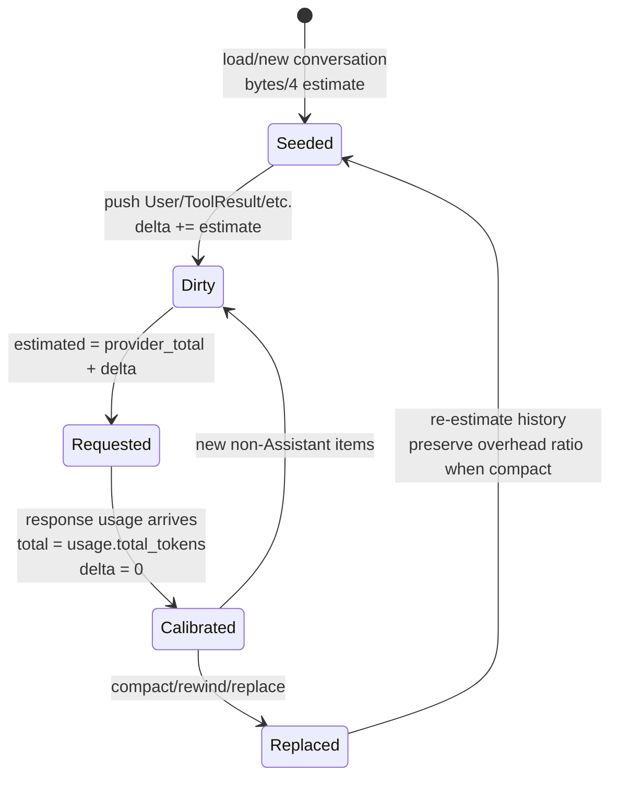
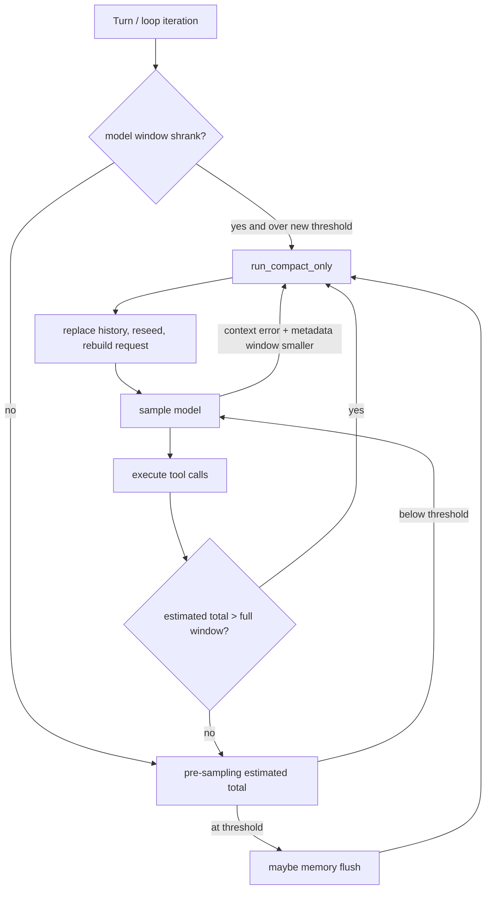

# Token 计量、Context Window 与自动压缩决策：估算、真实 Usage、阈值、预算与压缩恢复

本文研究 Grok Build 如何估算一段 conversation 的 token footprint，如何用 provider 返回的 usage 校准 live context，如何同时维护 prompt/session billing ledger，以及 context window、max output、goal budget、workflow child output budget 和 compaction threshold 为什么必须是彼此独立的概念。最后沿真实 turn loop 解释：系统在什么时候裁剪旧工具结果、提前 flush memory、自动 compact，什么时候因模型切换或 API context error 进入恢复路径。

前置阅读：[会话上下文、裁剪与压缩](../02-runtime-flows/06-session-context.md)、[Sampling、流式响应与 Agentic Loop](../02-runtime-flows/03-sampling-loop.md)、[Memory 子系统](10-memory-storage-retrieval-flush-and-dream.md)、[模型请求与 Provider 子系统](12-model-provider-request-streaming-retry-and-recovery.md)。

## 先记住结论

1. “token 数”不是一个字段；当前至少有 live context、local estimate、单次 call usage、prompt bill、session bill、output limit、goal spend 和 workflow output grant 八类数值。
2. `TokenUsage.total_tokens` 用于校准最后一次模型响应后的 live context；它不是把历次 API 调用的 token 相加得到的 session spend。
3. `UsageLedger.totals.total_tokens()` 才是累计账本意义上的 input + output；它刻意不信任 wire 的 `total_tokens` 字段。
4. `prompt_tokens` 已包含 cache hit 和 cache creation 部分；`cached_prompt_tokens`、`cache_creation_prompt_tokens` 是分类子集，不能从 prompt total 再减一次。
5. `reasoning_tokens` 是 completion 的明细维度；不能简单与 completion 再相加来推导请求总量。
6. ChatState 启动或整段 history 被替换时，只能用本地启发式重新播种 token 值；模型响应到达后再以 provider total 校准。
7. 本地文本估算规则是 UTF-8 bytes / 4，而不是 Unicode 字符数 / 4，也不是真实 tokenizer。
8. 每张图片固定估算为 765 tokens；图片 URL/base64 字符串长度不直接作为图片 token 估算。
9. Assistant 响应已经包含在 provider 的 `usage.total_tokens` 中，因此响应落入 conversation 时不再加入 local delta，避免双算。
10. 用户消息、工具结果、reasoning 等在两次模型响应之间会加入 `estimated_tokens_since_model`。
11. 请求前使用 `total_tokens + estimated_tokens_since_model`，因此巨大的工具输出不必等 API 返回 400 才被发现。
12. `record_token_usage` 会把 local delta 清零，并记录此刻 conversation 的本地估算基线。
13. compaction 后不能立即获得真实 tokenizer total；`replace_conversation` 用压缩后本地估算重新播种，并按压缩前 provider/local 比率保留 provider overhead。
14. 压缩后的估算被 cap 到压缩前 total，保证一次成功 compaction 不会在 UI 上表现成 context 反而增长。
15. `context_window` 是整个请求可容纳的输入和输出总空间；`max_completion_tokens` 只是本次最多生成多少输出，二者不等价。
16. `ConversationRequest.max_output_tokens` 直接来自当前 `SamplingConfig.max_completion_tokens`。
17. 默认自动压缩阈值是 context window 的 85%，但可由 env、用户 per-model、用户 global、远端 per-model、远端 global 依次覆盖。
18. auto-compact gate 使用整数交叉乘法：`used * 100 >= window * threshold`，避免先除法造成边界误差。
19. UI percentage 使用四舍五入，而部分 trigger info 使用截断；“显示 85%”不总能反推 gate 一定已触发。
20. shell 主 auto-compact 在精确边界使用 `>=`；shared intra-compaction 的独立 trigger 当前用严格 `>`，阅读测试时不要混为一套策略。
21. 请求副本中的旧工具结果从 context 超过 50% 后开始 prune；这只是减压，不等于完整 compaction。
22. memory flush 阈值位于 compact threshold 之前，计算为“compact 阈值减 `soft_threshold_tokens` 头部空间”。
23. flush 期间 `is_flushing` 会抑制 auto-compact，避免 flush 自己递归触发压缩。
24. two-pass compaction 可以在正式阈值前按 `threshold - prefire lead` 启动后台 pass 1，降低真正 compact 时的等待。
25. 自动压缩至少有四个触发观察点：正常请求前、工具输出后的 overflow preflight、模型窗口缩小时、provider error 携带更小 context metadata 时。
26. 正常请求前按 configured threshold 触发；工具输出 preflight 则只在估算已经超过整个 context window 时触发。
27. 模型切换只有在新窗口更小且现有 context 达到新阈值时才主动 compact；扩大窗口不需要压缩。
28. provider context error recovery 不靠错误字符串猜总量；它要求 error metadata 提供非零 context window，并把本地估算与其比较。
29. 自动 compact 失败后不会无脑每轮重试；不同失败原因进入 turn、sticky、until-success 或 auth suppression。
30. size/schema failure 是 sticky，只有 context budget 变化、成功压缩或 rewind 等事件才可能清掉。
31. credit block 要等一次正常 model 200 才清；auth suppression 则要等登录或 token refresh，不能互换。
32. 手动 `/compact` 忽略 auto-compaction suppression，仍允许用户主动修复。
33. `x-compaction-at` 是给服务端的请求提示 header；它可以由 context window × 本地 threshold 计算，但不是本地 gate 本身。
34. 动态 `x-compactions-remaining` 在首次本地 compaction 前后改变，表达服务端还能否预期本地 compaction。
35. goal `token_budget` 是跨多轮、可含 subagent marginal 的任务花费上限；compaction 缩短 live context 不应让已花预算倒退。
36. goal parent spend 只累计 session token total 的正向 delta；compaction 只重新锚定，不扣减历史花费。
37. goal token accounting 是 best effort：如果两次观察之间增长又被 compaction 完全吞掉，该增长可能不可见。
38. workflow child `output_token_budget` 只约束 completion output，且会 clamp 每次 request 的 max output；它不是 context window。
39. budgeted workflow child 缺 usage 或 sampling 失败时 fail closed：标 incomplete 并耗尽 grant，避免未知花费后继续生成。
40. session billing ledger 还记录 model calls、API duration、per-model 分组、cost ticks 和 incomplete；context bar 不提供这些语义。
41. compaction side call 不进入 main-loop `numTurns`；subagent usage 可折入账本，但不增加 parent main-loop call count。
42. prompt ledger 在下一 prompt 开始时清空，session ledger 生命周期更长；两者当前都不持久化。
43. 恢复旧 session 时，billing ledger 不能从 history 精确重建；history 只能重建一个 live-context 估算。
44. 所有累计加法和 free-token 计算大量使用 saturating arithmetic，异常大值不会 wrap 成小数。
45. 排查 token 问题时，必须先问“这个数字属于容量、当前占用、累计花费，还是输出许可”，再看代码。

## 一、先把八类数字分开

| 数值 | 主要字段/类型 | 生命周期 | 回答的问题 |
| --- | --- | --- | --- |
| Provider live total | `TokenUsage.total_tokens` -> `ChatState.total_tokens` | 最近一次成功模型响应 | 模型刚完成这一轮时，活上下文有多大？ |
| Local delta | `estimated_tokens_since_model` | 两次模型响应之间 | 新增 user/tool 等大约又占了多少？ |
| Estimated live total | `total_tokens + delta` | 请求前即时计算 | 如果现在发请求，大约带多少 context？ |
| Call usage | `TokenUsage` | 单次成功模型调用 | 这次 input/output/cache/reasoning 各多少？ |
| Prompt/session billing | `UsageLedger` | 当前 prompt / 当前进程 session | 一段时间累计调用了多少、花了多少？ |
| Context capacity | `SamplingConfig.context_window` | 当前模型配置 | 一个请求最多容纳多少总 token？ |
| Output cap/grant | `max_completion_tokens` / `TaskOutputTokenBudget` | 单次请求 / workflow child | 还允许模型生成多少输出？ |
| Goal budget | `GoalTracker.token_budget` | 一个 goal | 整个自治任务累计还能花多少？ |

最重要的分类是：

```text
容量：context_window
占用：live total / estimated live total
本次产出许可：max_completion_tokens / output grant
累计消费：UsageLedger / goal spend
```

如果把累计消费拿去做 compaction，长会话会因为每次重复发送历史而很快超过 100%；如果把 live context 当账单，compaction 后历史消费会凭空消失。

## 二、模块与状态所有权

| 位置 | 关键符号 | 责任 |
| --- | --- | --- |
| `xai-token-estimation/src/lib.rs` | `estimate_tokens`、percentage helpers | 共享估算与阈值数学 |
| `xai-chat-state/src/actor/state.rs` | `ChatState`、item estimators | conversation 与 live token 状态 |
| `xai-chat-state/src/actor/mutations.rs` | push/record/replace | delta 更新、provider 校准、压缩重播种 |
| `xai-chat-state/src/usage.rs` | `UsageTotals`、`UsageLedger` | prompt/session billing ledger |
| `xai-chat-state/src/actor/request_builder.rs` | `should_prune` | 50% 后的 request-copy tool pruning |
| `xai-grok-shell/.../sampler_turn.rs` | `record_response_token_usage` | response usage 写入各账本与预算 |
| `xai-grok-shell/src/session/compaction.rs` | auto-compact checks | 阈值、prefire、error/model-switch 恢复 |
| `session/compaction_config.rs` | `CompactionConfig`、`SUPPRESS_*` | 运行时阈值和 suppression state |
| `util/config/resolve/compaction.rs` | threshold resolver | 多层配置优先级 |
| `session/helpers/memory_flush.rs` | `should_flush` | 压缩前 memory headroom gate |
| `tools/tool_context.rs` | `TaskOutputTokenBudget` | workflow child 输出 grant |
| `goal_support.rs` | `goal_tokens` | goal 累计 spend 与 subagent marginal |
| `xai-grok-compaction` | intra compaction policy | shared agent-loop 内部压缩策略 |

这里的所有权很清楚：ChatState 拥有 conversation 与当前占用；Shell Session 决定何时 compact；Sampler/provider 提供真实 usage；Goal 和 workflow 子系统维护更高层的预算。

## 三、本地 token 估算到底怎么算

### 3.1 统一基础规则：UTF-8 bytes / 4

`xai-token-estimation::estimate_tokens` 的规则是：

```text
estimated_tokens = utf8_byte_length / 4
```

这是整数除法，少于 4 bytes 的文本估为 0。中文字符通常占 3 个 UTF-8 bytes，因此它不是“4 个汉字约等于 1 token”。它只是便宜、稳定、无需知道 provider tokenizer 的粗略代理。

设计上它适合：

- 请求前保守观察增长趋势；
- compaction input fitting；
- history 恢复后的初始播种；
- UI 没有 provider usage 时的近似展示。

它不适合：

- 精确计费；
- 比较不同 tokenizer 的真实效率；
- 推导 cache billing；
- 判断一个边界请求一定会被 provider 接受。

### 3.2 ConversationItem 分类估算

`estimate_item_tokens` 不会先把整个 enum JSON 序列化，而是按语义字段计算：

| Item | 纳入估算的内容 |
| --- | --- |
| `System` | `content` bytes / 4 |
| `User` | text bytes / 4 + 图片数 × 765 |
| `Assistant` | visible content + tool-call arguments 的 bytes / 4 |
| `ToolResult` | result content bytes / 4 |
| `BackendToolCall` | `text_summary()` bytes / 4 |
| `Reasoning` | reasoning text + encrypted blob bytes / 4 |

工具定义另算 name、description 和 JSON parameters；这提醒我们：conversation history 估算并不天然包含 request 上所有 tools schema。provider 的真实 prompt count 可能因此高于本地 conversation estimate，这一差异就是后面 provider overhead 需要被保留的原因之一。

### 3.3 图片是双重预算问题

图片在 token 侧固定按 765 估算；在 HTTP body 侧又有独立字节上限与 image compaction。两者不可替代：

- 一张巨大的 base64 图片，token estimate 未必同比巨大，但 request body 可能接近 50 MB；
- 多张低分辨率图片，body 尚可接受，token footprint 仍会累加。

因此 `request_builder` 同时检查 context 使用率和 serialized body bytes。

## 四、ChatState 的校准状态机



### 4.1 初始播种

`ChatState::new` 会先修复重复 tool result 和 dangling tool call，再用 `estimate_conversation_tokens` 得到 `initial_tokens`。此时：

```text
total_tokens = initial_tokens
estimated_tokens_since_model = 0
estimate_at_last_response = initial_tokens
```

名字 `total_tokens` 在这个瞬间并不代表 provider 真值，因为还没有新的响应；它是当前最好的可用种子。

### 4.2 响应之间的 delta

`push_user_message` 和一般 `push_message` 会估算新增 item 并增加 delta。但 Assistant 是特殊情况：

```rust
let count_in_delta = !matches!(item, ConversationItem::Assistant(_));
```

原因是处理顺序中 provider usage 已经包含本次 assistant completion。若随后把 Assistant 文本再次加到 delta，下一次 preflight 会双算它。

工具结果则是在 provider 响应之后由本地执行产生，必须加入 delta。reasoning、backend tool 等通过一般 item 路径时也按相同原则处理。

所有 delta 读数由 `get_estimated_total_tokens` 返回：

```text
estimated_live_total = model_reported_total + locally_estimated_delta
```

### 4.3 Provider 响应重新校准

`record_response_token_usage` 在 response 有 usage 时完成四件事：

1. workflow child 记录 `completion_tokens` 消费；
2. ChatState 用 `usage.total_tokens` 刷新 live total；
3. 保存最近一轮完整 `TokenUsage` 供 response metadata/UI 使用；
4. 把本次 call 折入 prompt/session billing ledger。

`record_token_usage` 同时清零 delta，并把当前 conversation 的本地估算记录为 `estimate_at_last_response`。下一批新增项从这个校准点继续累加。

### 4.4 为什么要保存 `estimate_at_last_response`

设模型报告 100,000 tokens，而本地对相同 conversation 只估 80,000。差异可能来自 tool schemas、消息 framing、真实 tokenizer、provider 隐藏字段等。

如果 compact 后新 history 的本地估算是 20,000，直接写 20,000 会假装所有 overhead 消失。代码采用近似比例：

```text
ratio = provider_total_before / local_estimate_at_last_response
reseed = local_estimate_after_compact * ratio
reseed = min(reseed, provider_total_before)
```

示例中 ratio 为 1.25，新 seed 约 25,000。这个值仍是估算，但比突然回落到 20,000 更接近下一次 provider 看到的请求。

当原 estimate 为 0 时无法计算比率，退回新 history 的本地估算。非 compaction 的完整 replace 也直接使用本地估算。

## 五、Live Context 与 Billing Ledger

### 5.1 为什么 wire `total_tokens` 不能累加成账本

对于普通单次请求，很多 provider 的 `total_tokens` 看起来像 prompt + completion；但 Responses 等服务端 loop 还可能把“当前 live context”和“累计 billing buckets”分别表达。Grok Build 已在 provider adapter 层做归一化：

- `TokenUsage.total_tokens`：下轮仍然相关的 live context total；
- `prompt_tokens` / `completion_tokens`：本次 call 的计量 buckets；
- cache/reasoning：这些 buckets 的细分信息。

所以 `UsageTotals::from_call` 明确以 prompt 和 completion 建账：

```text
ledger_total = Σ prompt_tokens + Σ completion_tokens
```

而不是 `Σ usage.total_tokens`。

### 5.2 TokenUsage 中的包含关系

可以用下面的集合关系理解：

```text
prompt_tokens
├── cached_prompt_tokens           # 命中 cache 的子集
├── cache_creation_prompt_tokens   # 写 cache 的子集
└── other prompt tokens

completion_tokens
├── reasoning_tokens               # provider 报告的 reasoning 子类
└── visible/tool-related completion
```

这里是语义模型，不保证每个 backend 都能完整上报所有子类；不支持的字段归一为 0。最常见错误是计算 `prompt - cached` 后又把 cached 单独相加，或计算 `completion + reasoning`，都会重复计数。

### 5.3 Prompt ledger 与 Session ledger

一次 main-loop model call 同时写入：

- `prompt_usage`：当前用户 prompt 引发的所有 main-loop calls；
- `session_usage`：本进程内当前 session 的生命周期累计。

开始下一 prompt 时 `increment_prompt_index` 清空 prompt ledger。两个 ledger 当前都不序列化，所以 resume 后不能把旧 history 变回完整账单。

账本还记录：

- `by_model`：model id -> totals；
- `model_calls`：含折入的 subagent calls；
- `main_loop_model_calls`：只含 parent main loop，用于 wire `numTurns`；
- `api_duration_ms`；
- `cost_usd_ticks` 与缺失 cost 的 call 数；
- `incomplete`：账单可能低估。

subagent usage 可以折进 parent ledger，但不会增加 parent 的 `main_loop_model_calls`。compaction 等 side call 也不应通过 `record_main_loop_call` 伪装成用户 turn。

### 5.4 Incomplete 是安全语义，不只是展示字段

异步 subagent 尚未 drain、usage apply miss、采样失败或 provider 未返回 usage 时，系统可能知道“发生过消费”，却不知道准确数值。此时 ledger/报告标 incomplete，cost projection 也不能假装精确。

这与 0 tokens 不同：

```text
0 + complete    = 已确认没有消费
0 + incomplete  = 可能消费了，但无法可靠归因
```

## 六、Context Window 与 Output 上限

### 6.1 Context window 是总容量

`SamplingConfig.context_window: NonZeroU64` 随当前模型配置保存。它主要供 shell 做：

- `/context` 与 signals 展示；
- tool result pruning；
- memory flush 与 auto-compact；
- 模型切换窗口缩小时的预压缩；
- provider error 恢复判断。

它不是 Sampler 在本地运行真实 tokenizer 后强制拒绝请求的硬校验；最终 provider 仍是接受与否的权威。

### 6.2 `max_completion_tokens` 是本次输出 cap

Request builder 把：

```text
SamplingConfig.max_completion_tokens
    -> ConversationRequest.max_output_tokens
    -> backend-specific request field
```

这只是输出上限。一个 128K window、max output 16K 的模型，不代表永远能再生成 16K；若 input 已占 125K，provider 可能缩短、拒绝或按协议处理。

### 6.3 Workflow child output grant 会再 clamp

`TaskOutputTokenBudget` 维护 `total`、`spent`、`incomplete`。每次 child model request 的有效输出上限是：

```text
min(configured_max_completion, remaining_output_grant)
```

没有 configured cap 时直接用 remaining grant。remaining 为 0 时拒绝继续 sampling。

每次成功响应只按 `completion_tokens` 扣 grant。若实际报告超过 grant，会 cap spend 并标 incomplete；若响应缺 usage 或请求失败，则 `mark_incomplete_and_exhaust`，用 fail-closed 阻止未知消费后继续请求。

## 七、自动压缩阈值的数学

### 7.1 配置优先级

当前 `resolve_auto_compact_threshold_percent_from_tiers` 的优先级为：

```text
GROK_AUTO_COMPACT_THRESHOLD_PERCENT
> user per-model
> user global session
> remote/GB per-model
> remote/GB global
> default 85
```

env 解析成整数且只接受 0..=100；非法值忽略并继续 fallback。模型切换时阈值会按新模型重新解析，因此 `Cell<u8>` 比 immutable config 更合适。

边界值的直观含义：

- `0`：任何非空甚至 0-used 边界都满足 `used * 100 >= window * 0`，等同总是触发；
- `100`：只有达到或超过整窗才触发；
- 一般生产默认：85。

### 7.2 Gate 不先算百分比

共享 helper 使用：

```text
used * 100 >= context_window * threshold_percent
```

乘法使用 saturating arithmetic。这样在非整百 context window 上不会因先整数除法丢掉余数。

例如 window = 10,001，threshold = 85：真正 gate 比较的是 850,085。展示出来的整数百分比只是派生值，不是决策源。

### 7.3 三种 percentage helper

| Helper | 行为 | 主要用途 |
| --- | --- | --- |
| `usage_percentage` | f64，最大 100.0 | 精细展示/计算 |
| `usage_percentage_u8` | 四舍五入，最大 100 | shell UI/telemetry trigger info |
| `usage_percentage_truncated_u8` | 整数截断，最大 100 | 与整数 gate 对齐的展示 |

`85 / 200 = 42.5%` 时，rounded 是 43，truncated 是 42。读日志看到 85% 时，应同时看 raw used/window 与真正比较符号。

### 7.4 两套 trigger 的边界差异

Shell auto-compact 使用 `exceeds_threshold`，边界是 `>=`。而 `xai-grok-compaction` 的 shared intra-compaction `should_compact` 先算 absolute threshold，再要求 `last_prompt_tokens > threshold`。

因此 100K window、85% threshold 时：

- shell：85,000 已触发；
- shared intra policy：85,000 不触发，85,001 才触发。

它们运行位置、配置结构和目标不同，不能拿一边的测试断言另一边有 bug。

## 八、压缩之前的两道减压措施

### 8.1 50% 后 prune request-copy 中的旧工具结果

`should_prune` 条件是：

```text
total_tokens > context_window / 2
```

注意它当前读取 ChatState 的 `total_tokens`，不是含 local delta 的 estimated total。触发后只修改准备发送的 conversation clone：

- 最近若干 turns 不动；
- 较旧的大 tool result 保留头尾；
- 更老的 tool result 替换成 omitted placeholder。

这不会把完整 history 总结成语义摘要，也不等同用户可见的 compaction cycle。另有 retained-conversation 的极老工具结果清理，用于真实内存占用；两条路径也不要混淆。

### 8.2 Memory flush 提前留出 headroom

`should_flush` 要同时满足 enabled、本 cycle 未 flush、到达 soft line：

```text
used * 100 >= window * compact_percent - soft_threshold_tokens * 100
```

若 128K window、85% compact line、soft headroom 4K：

```text
compact line = 108,800
flush line   = 104,800
```

flush 自己需要一次模型调用，所以必须在 hard compact line 前启动。运行期间 `is_flushing = true`，auto-compact check 直接返回 None，避免 flush turn 与 compact 相互递归。

## 九、Auto-compact 的四个观察点



### 9.1 正常请求前

`check_auto_compact_needed`：

1. 跳过 memory flush 进行中状态；
2. 读取当前 sampling config/window；
3. 读取 estimated total；
4. 更新 context signals；
5. 若 suppression 非 NONE 则跳过；
6. 处理一次性 debug force flag；
7. 按 configured threshold 决定。

这里用 estimated total，所以刚产生的大工具输出被包含。

### 9.2 工具执行后的 overflow preflight

`check_preflight_overflow` 更像最后保险：只有 `estimated_total > context_window` 才触发，不用 85% soft threshold。它避免 agent loop 带着明确超窗的工具结果继续发下一次 sampling。

它与正常 gate 并存的理由是调用时机不同：正常 gate 提前腾空间，overflow gate 保证工具输出突增后不会盲发。

### 9.3 模型切换

Session 在 turn end 记录 previous model slug/window。下一 turn 若 model 改变：

- 新窗口不小于旧窗口：无需因容量变化 compact；
- 新窗口更小：用当前 estimated total 对新 threshold 判断；
- 到线：先 compact，再进入新模型 sampling。

模型切换能清理 context-change 可修复的 suppression，但不能假装解决 credit/auth account state。

### 9.4 Provider context metadata error

若 sampling failure 的 `model_metadata.context_window` 存在且非零，`should_compact_on_error` 比较本地 estimated total 是否超过服务端报告窗口。这个路径处理 catalog 配置窗口过大、模型动态路由到更小窗口等情况。

错误 message 中含“context”并不自动触发；metadata 是更结构化的证据。compact 成功后 turn loop 重建 request 再试，属于 Session recovery，不消耗一般 transport retry 的相同语义预算。

## 十、Prefire、服务端提示与压缩目标

### 10.1 Two-pass prefire

two-pass compaction 的 pass 1 可在：

```text
start_percent = threshold_percent - prefire_lead_percent
```

提前后台运行。它只读 conversation snapshot、缓存 NOTE1，不立即替换 session history。正式 threshold 到来后 pass 2 使用仍然匹配 prefix fingerprint、model slug 的 cache；history/model 改变会使 cache 失效。

Prefire 是 latency optimization，不改变正式 auto-compact gate，也会产生真实 side-call spend，必须通过 telemetry 区分 cache hit 与浪费的 speculative pass。

### 10.2 `x-compaction-at` 与 `x-compactions-remaining`

某些模型配置允许发送：

- `x-compaction-at`：固定 token 数，或 `window * threshold / 100`；
- `x-compactions-remaining`：固定值，或根据本地是否已有 compaction summary 动态解析。

这些是 request headers，给远端了解客户端压缩计划。首次本地 compaction 后，动态 compaction-at 不再发送。它们不会取代本地 ChatState/Shell gate。

### 10.3 Shared intra-compaction 的 target 不是 shell 默认值

`xai-grok-compaction` 还有 agent loop 内部的 `IntraCompactionConfig`：默认 disabled；启用后 trigger 默认 85%，partial modes 的 target 默认 50%。`FullReplace` 模式会忽略 `target_threshold_percent`，因为它总结并整体重建 `[system] + [summary]`。

partial modes 的 50% target 表示选择要压缩的 turns 时，希望给近期 tail 留出目标空间；它不是 shell 每次 full-replace 后强制恰好降到 50%。

## 十一、Auto-compaction suppression 状态机

自动 compact 失败后，重复同一个确定性失败既浪费 token，又可能卡死 turn。`auto_compact_suppressed` 用 u8 表示不同恢复条件：

| 状态 | 典型原因 | 清除时机 |
| --- | --- | --- |
| `SUPPRESS_NONE` | 无阻止 | 正常检查 |
| `SUPPRESS_TURN` | other/resolvable failure | 下一 turn 乐观重试 |
| `SUPPRESS_STICKY` | size/schema | context budget 变化、成功 compact、rewind 等 |
| `SUPPRESS_UNTIL_SUCCESS` | credit block | 正常模型请求得到 200 |
| `SUPPRESS_AUTH` | auth expired | login/token refresh |

为什么 credit 与 auth 要分开：

- credit 状态无法由本地刷新 token 观察到，需一次成功请求证明恢复；
- auth 若等正常 200，而 session 已经超窗、正常请求根本发不出去，会形成死锁，所以登录/刷新即可清。

自动 gate 遵守 suppression；手动 `/compact` 绕过它，让用户保留主动恢复手段。

## 十二、Goal token budget：压缩不能抹掉已经花的钱

Goal budget 跨多个 turns，可能包含 parent 和多个 subagents。若直接使用当前 `ChatState.total_tokens`：

```text
120K live -> compact -> 25K live
```

预算会错误“返还”95K。`goal_tokens` 因此维护：

- `last_session_tokens_seen`：上次观察 anchor；
- `parent_tokens_spent`：只加入正向 delta；
- goal-scoped subagent marginal；
- `tokens_used_high_water`：最终单调不减。

压缩使 current total 下降时，只更新 anchor，不扣 parent spend。之后从 25K 增长到 30K，再新增 5K spend。

subagent 也分两种累计：

- 全部 finished + in-flight marginal 用于预算 gate；
- 只有 finished marginal 发到 pager wire，因为 UI 会自己加 active subagent，避免双算。

这是 best-effort spend counter，不是 billing ledger 的替代品。若在两次 `goal_tokens` 采样之间从 25K 增长到 40K、又 compact 到 20K，这 15K 正向增长可能从未被观察到。

到达 budget 后，goal 进入 budget-limit 状态、清 pending classifier completions、通知 UI 并停止自动 continuation。它不会改变 context window 或 provider max output。

## 十三、典型数字示例

假设：

```text
context_window = 128,000
auto_compact = 85%
memory headroom = 4,000
max_completion_tokens = 16,000
provider total after response = 100,000
local estimate at response = 80,000
```

随后发生：

1. 工具返回 6,000 estimated tokens；estimated live = 106,000。
2. 50% pruning gate 已满足；request clone 会裁剪符合年龄/大小规则的旧 tool results。
3. memory flush line 是 104,800，所以可触发 flush。
4. compact line 是 108,800，因此尚未触发正式 compact。
5. 若又加入 4,000 tokens，estimated live = 110,000，正式 gate 触发。
6. 压缩后 local conversation estimate = 20,000。
7. provider/local ratio = 100,000 / 80,000 = 1.25，reseed 约 25,000。
8. 下一次请求的 output cap 仍最多 16,000；不会因为 context 降到 25K 自动扩大。
9. billing ledger 不会减去这次 compaction 前的模型调用花费。
10. goal spend 也不会从 100K 退回 25K，只重新 anchor。

如果工具一次返回 35K，则 estimated live = 135K；overflow preflight 在 full window 之外也会触发，即便某条常规 threshold 检查因调用时机尚未运行。

## 十四、常见误读与反例

### 误读 1：`total_tokens` 永远是真实 tokenizer 值

不是。启动、resume、rewind、replace、compact 后都可能是启发式 seed；只有成功响应 usage 到达后才是最近一次 provider 校准值。

### 误读 2：Session token usage 应等于每轮 `total_tokens` 相加

不是。每轮 prompt 会重复携带 history，live total 与 billing input 的语义不同。账本按 call buckets 累加。

### 误读 3：Cached tokens 不收费，所以从 prompt tokens 中减掉

不能从归一化 `prompt_tokens` 再减来重算 total。cache hit 是子集，价格如何计算是 cost/pricing 层问题。

### 误读 4：Reasoning tokens 应加在 completion tokens 之外

当前归一化语义把 reasoning 作为 completion detail。展示 breakdown 可以拆分，求总量不能重复加。

### 误读 5：达到 50% 就会 compact

50% 是 request-copy tool pruning gate；shell auto-compact 默认是 85%。shared intra partial policy 的 target 50 又是第三种含义。

### 误读 6：UI 显示 85% 就说明 gate 一定触发

rounded percentage 与 raw integer cross-multiplication 可能在边界不同；还可能被 flush 或 suppression gate 阻止。

### 误读 7：调低 max output 可以等价解决 context overflow

只能减少输出预留/上限，无法删除已经过大的 input history。真正恢复仍可能需要 pruning/compaction。

### 误读 8：Compaction 后 budget 应返还

context capacity 被释放，但已发生的 API 消费不会消失。goal/billing 都应保持历史 spend。

### 误读 9：自动 compact 失败就每轮一直 retry

代码按失败原因设置 suppression，只有对应恢复条件满足才重开自动路径。

### 误读 10：`x-compaction-at` 表示 server 会替客户端 compact

它只是协议提示。是否、何时替换本地 conversation 仍由 shell compaction flow 决定。

## 十五、调试路线

### 15.1 先确定你看到的是哪类 token

问四个问题：

1. 字段来自 provider response、ChatState、UsageLedger、GoalTracker 还是 ToolContext？
2. 它是单次 call、当前 prompt、当前 live context，还是 session lifetime？
3. 它会在 compaction 后下降吗？应该下降吗？
4. 缺 usage 时是 0、estimate，还是 incomplete？

### 15.2 Context bar 不更新

检查：

- `record_response_token_usage` 是否收到 `response.usage`；
- adapter 是否正确填 `TokenUsage.total_tokens`；
- `record_token_usage` 是否执行并发出 `TokensUpdated`；
- resume 后是否只有 local seed、尚未完成新响应；
- sampling config 的 context window 是否是当前模型值。

### 15.3 工具输出后才 400 overflow

检查：

- ToolResult 是否通过 ChatState push 路径加入 delta；
- `get_estimated_total_tokens` 是否包含 delta；
- turn loop 是否在下一 sampling 前调用 preflight/normal auto gate；
- suppression 是否非 NONE；
- 当前路径是否是 budgeted workflow child，因设计跳过了某些 auto recovery。

### 15.4 反复自动 compact 失败

检查 suppression reason/state，而不是只看 trigger log：

- size/schema 是否 sticky；
- credit 是否等待 model success；
- auth 是否等待 refresh/login；
- manual compact 是否也失败；
- compaction 输出是否真正小于输入并成功 replace。

### 15.5 Compaction 后数字异常

同时记录四个值：

```text
pre_replace_total
estimate_at_last_response
base_estimate_after
reseeded_total_after
```

若 `estimate_at_last_response == 0` 会走 fallback；若 reseed 大于 pre total 会被 cap。下一次 provider response 会再校准。

### 15.6 账单与 UI context 不一致

这是多数情况下的正确行为。核对：

- context 使用 `TokenUsage.total_tokens`；
- ledger 使用 prompt + completion 累加；
- subagent 是否 attribute 到 prompt/session；
- incomplete 是否为 true；
- cost missing calls 是否导致 partial cost。

## 十六、建议的源码阅读顺序

1. `xai-token-estimation/src/lib.rs`：先看最小数学原语。
2. `xai-chat-state/src/actor/state.rs`：看 item estimate 与四个 token state fields。
3. `actor/mutations.rs`：跟 push、record、replace 三种状态变化。
4. `actor/tests.rs` 中 estimated total、assistant double-count、compaction ratio 测试。
5. `xai-grok-sampling-types/src/conversation.rs`：理解 `TokenUsage` 包含关系。
6. `xai-chat-state/src/usage.rs`：区分 live state 与 billing ledger。
7. `sampler_turn.rs::record_response_token_usage`：看真实响应如何分流。
8. `session/compaction.rs`：读四个 trigger 观察点与 suppression。
9. `memory_flush.rs::should_flush` 和 threshold resolver。
10. 最后看 goal budget 与 workflow output grant，建立跨层预算模型。

## 十七、可执行验证

### 17.1 快速定位符号

```sh
rg "estimated_tokens_since_model|estimate_at_last_response" crates/codegen/xai-chat-state
rg "check_auto_compact_needed|check_preflight_overflow" crates/codegen/xai-grok-shell
rg "UsageLedger|TaskOutputTokenBudget|goal_tokens" crates/codegen
```

### 17.2 目标测试

```sh
cargo test -p xai-token-estimation
cargo test -p xai-chat-state
cargo test -p xai-grok-compaction intra_compaction
```

重点测试契约：

- bytes/4、image estimate、round/truncate、threshold boundary；
- provider total + local delta；
- Assistant 不重复加入 delta；
- replace/compaction ratio 与 cap；
- 50% prune boundary；
- context window downgrade trigger；
- output grant clamp 与 incomplete fail-closed；
- suppression clear conditions。

## 本篇术语表

| 名词 | 白话解释 | 在本文中的具体含义 |
| --- | --- | --- |
| token | 模型处理文本的计量单位 | 不等于字符或字节，真实切分由 tokenizer 决定 |
| tokenizer | 把输入拆成 tokens 的算法 | provider/model-specific，本地估算没有运行它 |
| token estimate | 对真实 token 数的近似 | Grok Build 主要用 bytes/4 |
| UTF-8 byte | UTF-8 编码后的一个字节 | 中文字符通常占多个 bytes |
| heuristic | 便宜但不精确的经验规则 | bytes/4 和每图 765 tokens |
| footprint | 某对象占用的容量 | conversation 对 context window 的近似占用 |
| image token estimate | 图片的固定 token 代理 | 每张 765，不按 base64 长度 |
| tool schema | 工具名、说明和参数 JSON | 也占 prompt，但不一定在 conversation estimate 中 |
| framing overhead | 协议包装带来的额外 token | role、item wrapper 等 provider 开销 |
| provider overhead | provider total 高于本地 history estimate 的差异 | compact reseed 时按比例保留 |
| seed / 播种 | 没有真实值时设置初始估算 | new/resume/replace 后的 total |
| calibrate / 校准 | 用更可信观测替换估算 | response usage 覆盖 live total |
| delta | 校准点之后的新增估算 | `estimated_tokens_since_model` |
| live context | 下一次模型仍会携带/使用的上下文 | 最近 provider total 加本地 delta |
| model-reported total | provider 最后报告的 live total | ChatState `total_tokens` 的主要校准源 |
| estimated live total | provider total 加本地新增项 | 请求前 auto-compact/preflight 使用 |
| context window | 单请求上下文总容量 | `SamplingConfig.context_window` |
| utilization | 已用容量占总窗口比例 | used/window |
| free tokens | 总容量减当前占用 | 使用 saturating subtraction |
| headroom | 阈值前特意保留的空间 | memory flush 比 compact 提前的 token 数 |
| output cap | 单次响应最多允许生成量 | `max_completion_tokens` |
| output grant | workflow child 可累计生成的配额 | `TaskOutputTokenBudget` |
| clamp | 把值限制在允许范围 | request max output 不超过 remaining grant |
| prompt tokens | 一次调用的完整输入 token | 包含 cache hit/write 子集 |
| completion tokens | 一次调用的输出 token | reasoning 是其明细维度 |
| total tokens | 需结合类型判断的总数 | TokenUsage 中偏 live；ledger 中是 input+output 累计 |
| reasoning tokens | 模型推理部分的输出明细 | 不应再次加到 completion total |
| cached prompt tokens | 从 prompt cache 读取的输入子集 | 已包含在 prompt tokens 中 |
| cache creation tokens | 写入 prompt cache 的输入子集 | Messages 可上报，仍属于 prompt tokens |
| bucket | usage 的分类计数槽 | prompt/completion/cache/reasoning |
| call usage | 一次模型调用的 usage | 一个 `TokenUsage` |
| ledger | 可累计、分组并标完整性的账本 | `UsageLedger` |
| prompt ledger | 当前用户 prompt 的累计账本 | 下个 prompt 开始时清空 |
| session ledger | 本进程 session 生命周期账本 | 当前不持久化 |
| per-model attribution | 按 model id 分组消费 | `UsageLedger.by_model` |
| main-loop call | parent agent loop 的模型调用 | 决定 `numTurns`，不含 side call/subagent |
| side call | 辅助模型调用 | compaction、某些摘要调用等 |
| incomplete | 账本可能低估 | 未知 usage、subagent drain/apply 问题 |
| fail closed | 信息不完整时选择安全停止 | child usage 未知就耗尽 output grant |
| saturating arithmetic | 溢出时停在最大/最小值 | 防止 token 计数 wrap |
| percentage rounding | 百分比四舍五入 | `usage_percentage_u8` |
| percentage truncation | 百分比直接去掉小数 | `usage_percentage_truncated_u8` |
| cross multiplication | 交叉相乘比较比例 | `used*100 >= window*threshold` |
| threshold | 触发某动作的界线 | prune 50%、compact 85% 等 |
| soft threshold | hard line 前的提前线 | memory flush line |
| auto-compact | 达阈值后自动总结并替换 history | Session 级 context recovery |
| manual compact | 用户主动发起压缩 | 可忽略 auto suppression |
| full replace | 用 system + summary 重建上下文 | 一种 compaction strategy |
| partial compaction | 只替换部分 history/steps | shared intra modes |
| target threshold | 压缩选择希望达到的占用目标 | intra partial 默认 50%，不等于 trigger |
| tool pruning | 缩短/清除旧工具结果 | 50% 后作用于 request clone |
| hard clear | 用 placeholder 替换旧 payload | tool pruning 的激进阶段 |
| soft trim | 只留 payload 头尾 | tool pruning 的温和阶段 |
| preflight | 真正发请求前的最后检查 | 工具输出后检查是否已经超整窗 |
| context overflow | 输入/预留超过模型窗口 | 触发 compact recovery 或 provider 400 |
| model downgrade | 切到 context window 更小的模型 | 可能在新模型采样前 compact |
| provider metadata | 错误附带的结构化模型信息 | 可携带真实 context window |
| prefire | 正式阈值前预先跑 pass 1 | two-pass compaction 延迟优化 |
| speculative spend | 预跑但最终未使用的模型消费 | prefire cache 失效时的成本 |
| fingerprint | conversation prefix 的摘要标识 | 验证 prefire cache 仍适用 |
| suppression | 暂时关闭自动重试 compact | 按失败原因保存不同清除条件 |
| sticky suppression | 跨 turn 保持的阻止状态 | size/schema failure |
| credit block | 余额/额度阻止模型调用 | 等正常 200 后清 suppression |
| auth suppression | 认证失效导致的阻止状态 | login/token refresh 后清 |
| context-budget change | 可改变压缩可行性的上下文变化 | rewind、成功 compact、模型窗口变化 |
| compaction cycle | 一次压缩前后的一轮状态 | memory flush 每 cycle 避免重复 |
| `x-compaction-at` | 发给远端的绝对 token header | 提示本地计划在哪条线 compact |
| `x-compactions-remaining` | 可用压缩次数提示 header | 可在首次压缩前后动态变化 |
| goal budget | 一个自治 goal 的累计 token 上限 | 独立于 live context |
| marginal | 相对 baseline 新增的 token | goal-scoped subagent 贡献 |
| anchor | 上一次观测 total 的参照点 | compaction 后只重置 anchor |
| high-water mark | 历史最大累计值 | 防 goal spend 倒退 |
| monotonic | 数值只增不减 | budget spend 的目标性质 |
| best effort | 尽力准确但存在观测缺口 | goal token sampling |
| resume | 从持久化 history 恢复 session | 可恢复 context estimate，不能恢复精确 ledger |

## 源码证据索引

| 结论 | 主要源码 |
| --- | --- |
| bytes/4、图片估算、百分比与 threshold math | `crates/codegen/xai-token-estimation/src/lib.rs` |
| item/conversation/tool schema 估算 | `crates/codegen/xai-chat-state/src/actor/state.rs` |
| delta、provider 校准、compaction ratio reseed | `xai-chat-state/src/actor/mutations.rs` |
| estimated total 与 ChatState compact gate | `xai-chat-state/src/actor/{mod,queries}.rs`、`handle.rs` |
| prompt/session billing ledger | `xai-chat-state/src/usage.rs` |
| TokenUsage 包含关系 | `xai-grok-sampling-types/src/conversation.rs` |
| request max output 与 50% pruning | `xai-chat-state/src/actor/request_builder.rs` |
| usage 写入 live/ledger/output grant | `xai-grok-shell/src/session/acp_session_impl/sampler_turn.rs` |
| shell auto-compact 四个观察点 | `xai-grok-shell/src/session/compaction.rs` |
| suppression states | `xai-grok-shell/src/session/compaction_config.rs` |
| threshold 配置优先级 | `xai-grok-shell/src/util/config/resolve/compaction.rs` |
| memory soft threshold | `xai-grok-shell/src/session/helpers/memory_flush.rs` |
| output grant | `xai-grok-shell/src/tools/tool_context.rs` |
| goal monotonic spend | `xai-grok-shell/src/session/acp_session_impl/goal_support.rs` |
| intra trigger/target 差异 | `crates/common/xai-grok-compaction/src/intra_compaction/{config,trigger,compact}.rs` |
| compaction request headers | `xai-grok-sampling-types/src/types.rs`、`shell/.../sampler_turn.rs` |
