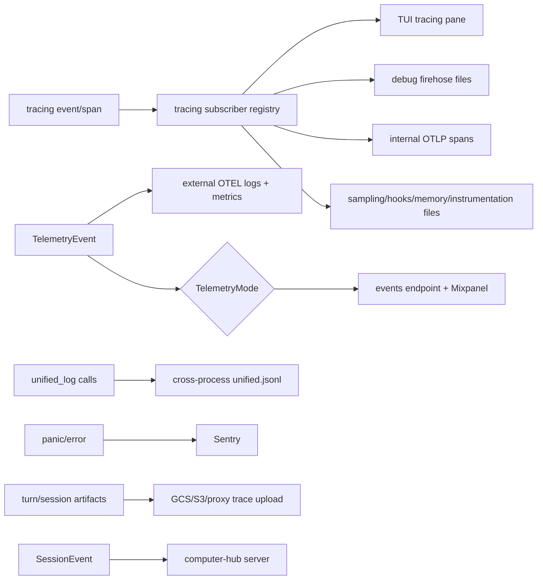
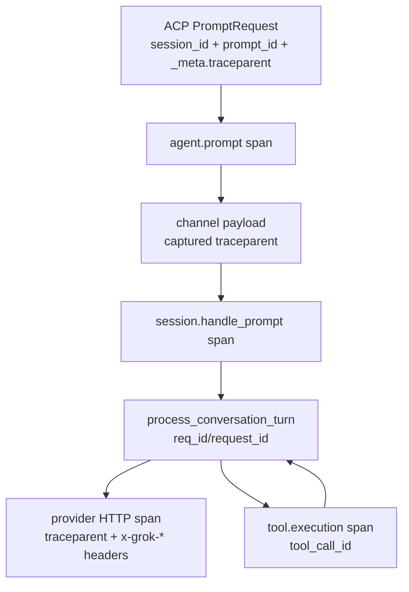

# 日志、Telemetry、Tracing 与可观测性：本地诊断、事件管线、分布式 Trace、Metrics 与隐私边界

本文研究 Grok Build 如何把运行时行为变成可诊断信号：普通 `tracing` event/span 如何进入 TUI、debug firehose 或 OTLP；结构化 unified log 如何汇合 shell、pager 与 desktop；类型化 telemetry event 如何分流到产品分析、session metrics 和企业自有 collector；Sentry 如何处理 panic/error；以及 session trace artifact 为什么不是 OpenTelemetry trace。

前置阅读：[Prompt 到最终回答](../02-runtime-flows/02-prompt-to-answer.md)、[Sampling 与 Agentic Loop](../02-runtime-flows/03-sampling-loop.md)、[通知与事件路由](02-notification-routing.md)、[模型请求与 Provider 子系统](12-model-provider-request-streaming-retry-and-recovery.md)、[Token 计量与自动压缩](13-token-accounting-context-window-and-compaction-policy.md)。

## 先记住结论

1. Grok Build 的可观测性不是一个 logger，而是多条独立管线；同一个 call site 可以同时被多个 `tracing_subscriber::Layer` 消费。
2. `tracing::info!` 产生 event，`info_span!`/`#[instrument]` 产生有开始、结束和父子关系的 span；两者不等价。
3. `xai-grok-telemetry` 是主要所有权边界，集中管理产品事件、Mixpanel、Sentry、内部 OTLP、external OTEL、本地专项日志和 unified log。
4. TUI tracing pane 是内存中的 bounded ring-like buffer，不是持久化日志；channel 满时丢最新行，绝不能反压 agent runtime。
5. `GROK_DEBUG_LOG=1` 启用按 session 路由的本地 firehose，写入 `~/.grok/debug/<session_id>.txt`，并维护 `latest.txt`。
6. session span 是否能路由，依赖字段名 `session_id`，而不是 span 名必须叫 `session`。
7. session span 外的 firehose event 写入 `<role>-<pid>.txt` fallback；不能期待每条启动日志都带 session id。
8. `GROK_LOG_FILE` 优先于 `GROK_DEBUG_LOG`，并写单文件；前者尊重 `RUST_LOG`，后者的 firehose profile 使用代码内 curated directives。
9. debug firehose 使用 non-blocking writer，process exit 时必须保留并 flush `WorkerGuard`，否则短进程尾部日志会丢失。
10. firehose per-session 文件保留 7 天；清理由年龄驱动，避免误删仍在被并发进程写入的活跃文件。
11. unified log 是跨组件 JSONL：shell 直接写，pager/desktop 经 ACP `x.ai/log` 转发给 shell 落盘。
12. unified log 每行包含 timestamp、source、pid、binary version、level、可选 session id、message 和 structured context。
13. pager/desktop 不能伪装成 shell source；`ingest_client_entries` 明确拒绝 client-supplied `LogSource::Shell`。
14. unified log 位于 `~/.grok/logs/unified.jsonl`，约 5 MB 达线后保留后半段完整 JSONL lines。
15. unified log 必须原 inode 就地裁剪；temp+rename 会让其他进程继续写入已 unlink 的旧 inode，造成不可见日志。
16. writer 每 2 秒检查路径是否仍指向原 inode；文件被删或替换后会 reopen，失败期间宁可丢 entry 也不写不可见 inode。
17. unified log 是显式诊断 call site，不会自动收集所有 `tracing` event；firehose 和 unified log 互相不能替代。
18. sampling、hooks/plugins、memory 和 instrumentation 还有独立 target/file layer，便于高噪声子系统单独启用。
19. `sampling_log` 默认关闭，启用后写 `~/.grok/logs/sampling.jsonl`；它记录 request span 与有限 auth prefix，仍应按敏感诊断文件对待。
20. telemetry mode 有 Disabled、SessionMetrics、Enabled 三档；SessionMetrics 只允许 metadata-only lifecycle events，Enabled 才发送完整产品事件。
21. `log_event` 只在内部 mode=Enabled 时发产品事件，但会先独立 fan-out 到 external OTEL；两条 sink 的 gate 不相同。
22. `log_session_event` 在 Enabled 和 SessionMetrics 两档均可发送生命周期事件，并同样先尝试 shell-origin external fan-out。
23. 产品事件 emission 是 fire-and-forget Tokio task；短命令退出前需 `drain_pending`，否则刚排队的 HTTP post 可能丢失。
24. 类型化 `TelemetryEvent` 把 event name 与 Rust struct 绑定，字段改名和 enum label 可能是 dashboard/wire contract，不是随意重构。
25. 产品事件可同时发送到 internal events endpoint 和 Mixpanel；两者共享 metadata，但各自有 request/insert id 语义。
26. session task-local `TelemetryCtx` 自动注入 session id 和 turn number，避免每个 call site 手写并产生不一致。
27. 每个 prompt 开始时 `begin_prompt_id` 轮换 UUID；external OTEL event 可带 `prompt.id`，metrics 刻意不带以限制 cardinality。
28. session `prompt_index` lock 竞争时，telemetry snapshot 宁可省略 turn number，也不会阻塞正在执行的任务。
29. 内部 OTLP tracing 与 external OTEL 是两套不同 exporter：内部面向 xAI 可观测后端，external 面向企业自己的 collector。
30. external OTEL 默认完全不构造；必须 master switch 与至少一个 logs/metrics exporter 双重 opt-in。
31. external OTEL 不注册到 OpenTelemetry global provider，使用独立 handle，避免抢占内部 tracer 的 global slot。
32. external exporter 只使用客户配置的 OTLP headers，不依赖内部 `AuthCredentialProvider`，防止把 xAI session credential 发往客户 endpoint。
33. external stream 独立于产品 telemetry mode、GCS trace upload 和 xAI retention opt-out，因为目标是用户显式配置的自有 collector。
34. external OTEL schema 是闭合的：事件名 enum、attribute-key enum、allowlist test 和 export-time validator 形成多层默认拒绝。
35. external prompt text 和 tool details 默认不发送；需要分别显式开启 content gate，远端 policy 只能收紧、不能开启。
36. external string attribute 会做 secret/path scrub 与长度限制；prompt 有 60 KB cap，一般值使用更小的截断策略。
37. internal OTLP span exporter也默认拒绝未列入 allowlist 的字符串属性，并把 URL 降为 origin、event free-text name 改成静态 callsite。
38. `tracing` event message 本身可能含用户内容，本地 firehose/unified log 与远端 redacted exporter拥有不同隐私边界，不能假定“一处脱敏等于所有 sink 脱敏”。
39. internal OTLP 默认 filter 是 info，可由 `GROK_OTEL_FILTER` 调整；`sampling_log` 被强制排除，避免专项日志误入 trace exporter。
40. instrumentation 有 Disabled、Log、Chrome、Server 四种模式；默认 Server，Log/Chrome 主要用于本地性能剖析。
41. Chrome instrumentation 输出 `instrumentation.trace.json`，用于时间轴分析；它不是产品 event log，也不是 session artifact。
42. Sentry `send_default_pii=false`、1% trace sample，并在 `before_send` 中清 secret、home path、用户名、cwd 和 server name。
43. broken-pipe panic 会被 Sentry 丢弃，避免正常管道关闭被当成产品 crash。
44. panic hook 同时生成分类 span、external `InternalError` 事件和本地 error event；external 只发送 error class，不发送 panic message/location。
45. 一次用户 prompt 至少涉及 session id、prompt id、request/req id、conversation id、tool call id 和 trace id；它们的作用域不同，不能用一个 UUID 替代所有 join key。
46. `agent.prompt` span 接受 ACP `_meta.traceparent` 作为 parent；跨 channel 到 `session.handle_prompt` 时又显式携带并重新 link。
47. sampling config 的 header injector把当前 W3C `traceparent` 写入模型 HTTP 请求，使 provider/proxy span 可接入同一 distributed trace。
48. `x-grok-conv-id`、`x-grok-req-id`、`x-grok-session-id` 等业务 headers 与 `traceparent` 并存：前者用于产品关联，后者表示标准 trace 父子关系。
49. tool span 使用 `tool_call_id` 作为 join key，并在结果已知时补 success/outcome/result size；field 若未在 span 创建时声明，后续 `record` 会静默丢弃。
50. async task 若直接 spawn，当前 span 不一定自动保留；代码使用 `.instrument(parent_span)` 或显式 traceparent 跨 task/channel 传播。
51. trace artifact 是每轮可恢复/分析的会话材料，如 turn messages、permission events、session state、manifest；它不同于 OTLP span batch。
52. trace artifact upload 受 ZDR、`trace_upload`、credentials 和上传方式控制，并有 attempted/succeeded/skipped/failed 生命周期事件。
53. ObservabilityBridge 是第三类外发：把 bounded `SessionEvent` 发送到已连接 computer-hub server；无 harness 时 no-op，发送失败不影响主循环。
54. ObservabilityBridge 不取代本地 sink，call site 必须分别发 local event 与 server leg，防止抽象误导。
55. metrics 应使用低 cardinality labels；`prompt.id` 被禁止进 metrics，session id 是否进入 external metrics也可关闭。
56. latency 至少分 total、pre-model、MCP wait、tool collection、model call、TTFT、ITL、TTLB；用一个“响应耗时”字段无法定位瓶颈。
57. `PromptTiming` 使用 saturating subtraction 推导 pre-model 和 tool-collection，避免时钟/采样异常造成负值 wrap。
58. sampling span中的 `status_code`、`success`、`error` 先声明 Empty，得到 response 后再 record，形成完整 span outcome。
59. 日志/telemetry通常 best effort：channel full、无 runtime、进程快速退出、export timeout 都可能丢信号；业务正确性不能依赖观测 sink 成功。
60. 排障顺序应先选对管线，再找 join key，最后核对 filter/gate/redaction；“没看到日志”不等于 call site 没执行。

## 一、七条管线的全景图



最容易混淆的三组概念：

```text
tracing event/span  != TelemetryEvent product event
OTLP distributed trace != uploaded session trace artifact
unified log         != automatic tracing firehose
```

同一个动作可以刻意写三次，因为消费者不同。例如 prompt 到达时：

- `agent.prompt` span供调用链和 latency；
- unified log的 `prompt received` 供跨进程事故排查；
- typed lifecycle/product event供聚合指标和产品分析。

这不是天然重复，而是不同数据模型的投影。

## 二、crate 与模块边界

| 位置 | 关键符号 | 职责 |
| --- | --- | --- |
| `xai-grok-telemetry/src/lib.rs` | public facade | telemetry 所有权边界 |
| `debug_log.rs` | `install_firehose`、`RoutingLayer` | 本地 tracing firehose |
| `unified_log.rs` | `LogEntry`、`emit`、`ingest_client_entries` | 跨 shell/pager/desktop JSONL |
| `events.rs` | `TelemetryEvent`、`telemetry_event!` | 类型化事件和稳定名称 |
| `session_ctx.rs` | `TelemetryCtx`、`log_event` | task-local correlation 与 sink fan-out |
| `client.rs` | `TelemetryClient::track` | internal events endpoint + Mixpanel |
| `otel_layer/*` | tracer provider、redact | 内部 OTLP span exporter |
| `external/*` | config/schema/emit/redact/providers | 企业自有 OTEL logs + metrics |
| `instrumentation.rs` | instrumentation modes | 本地/服务端性能计时 |
| `sampling_log.rs` | target-specific layer | 模型请求专项 JSONL |
| `hooks_log.rs`、`memory_log.rs` | subsystem layers | 专项调试文件 |
| `sentry.rs` | init、scrubber、shutdown flush | crash/error 上报 |
| `xai-file-utils/trace_context.rs` | W3C extract/inject/link | 跨 HTTP/channel 的 trace context |
| `shell/session/*` | spans、typed events、unified calls | 业务 call sites |
| `shell/upload/*` | `complete_prompt_trace` | session artifact upload |
| `xai-computer-hub-sdk/observability.rs` | `ObservabilityBridge` | server-side session event leg |

## 三、Tracing：Event、Span、Subscriber 与 Layer

### 3.1 Event 是瞬时记录，Span 是一段工作

```rust
tracing::info!(request_id = %id, "request queued");

#[tracing::instrument(
    name = "session.process_conversation_turn",
    skip_all,
    fields(session_id, model_id, input_tokens = tracing::field::Empty)
)]
async fn process_conversation_turn(...) { ... }
```

event适合“某件事发生了”；span适合“某段操作从开始到结束，期间有哪些子操作”。span关闭时间可形成 duration，父子关系可形成 flame/timeline。

`skip_all` 很重要：它防止宏把函数参数通过 `Debug` 自动记录。需要的字段明确声明，比意外把 prompt、credentials 或大 payload 放入所有 sink 更安全。

### 3.2 `field::Empty` 是后填字段声明

Tracing span的 schema 在创建时固定。下面的 `record` 只有字段先声明才生效：

```rust
let span = tracing::info_span!(
    "tool.execution",
    success = tracing::field::Empty,
    outcome = tracing::field::Empty,
);

span.record("success", true);
span.record("outcome", "success");
```

如果直接 `record("undeclared", value)`，不会自动创建新字段，而是静默丢失。排查“明明 record 了为何 OTLP 没字段”时，应先看 span 创建点。

### 3.3 一个 event 可被多个 layer 消费

Pager 的 registry 大致组合：

```text
fmt layer -> bounded TUI channel
instrumentation layer
sampling log layer
hooks log layer
internal OTEL layer
debug firehose layer（可选）
```

每个 layer 有自己的 filter、writer、格式和隐私处理。`RUST_LOG` 通常只影响某些 fmt layer，不应假设它能统一关闭所有 telemetry sink。

### 3.4 Filter 与 callsite 求值成本

过滤发生在 layer 侧，但 registry 中某些 filterless/no-op layer 可能让 callsite保持 enabled。昂贵字段应延迟序列化。例如 ACP full payload 用 `LazyJson`，只有真正记录字段的 layer 调用 `Display::fmt` 时才序列化。

直接在 macro 参数里写 `serde_json::to_string(&huge_update)`，即使目标 layer最终过滤掉，也可能提前付出大对象序列化成本。

## 四、TUI Tracing Pane：有界、可搜索、允许丢失

`TracingChannelMakeWriter` 把 fmt 后的 ANSI line放入容量 16K 的 Tokio mpsc。`try_send` 的选择表达关键约束：

- channel 有空间：送到 UI event loop；
- channel full：丢最新行并增加 `DROPPED_LOG_LINES`；
- channel closed：writer 返回错误。

绝不能 `await send`，因为 UI tick可能被大量 ACP updates饿死；让 agent runtime等待日志消费者会把观察工具变成故障源。

`TracingModel` 保存预解析 ANSI style 和纯文本版本，支持绘制与搜索。超过 `capacity + hysteresis` 时批量删除最老 entries，减少频繁移动 Vec 的成本。

因此 tracing pane适合交互排查最近行为，不适合：

- 完整审计；
- 证明某事件绝对没发生；
- 重启后追溯；
- 大流量 payload capture。

## 五、Debug Firehose：按 Session 落盘

### 5.1 开启方式与优先级

```sh
# 每个 session 一个文件
GROK_DEBUG_LOG=1 grok

# 指定一个平面文件
GROK_DEBUG_LOG=/tmp/grok-firehose.log grok

# 最高优先级的兼容单文件入口；尊重 RUST_LOG
GROK_LOG_FILE=/tmp/grok.log RUST_LOG=xai_grok_shell=trace grok
```

解析优先级：

```text
nonblank GROK_LOG_FILE
> GROK_DEBUG_LOG truthy/path
> no firehose
```

`GROK_DEBUG_LOG=1` 使用 curated firehose directives：一方 crates为 debug、依赖默认 info、`sampling_log=off`，避免专项 sampling event重复灌入。

### 5.2 Session 路由机制

`with_session_ctx` 同时进入：

```rust
info_span!("session", session_id = %session_id)
```

RoutingLayer 在 `on_new_span` 中访问字段，sanitize 后存进 span extensions；`on_event` 从 leaf到root找最近含 SessionId extension 的 span：

```text
找到 -> ~/.grok/debug/<safe-session-id>.txt
找不到 -> ~/.grok/debug/<role>-<pid>.txt
```

session id允许字母数字、`-_.`，其他字符替换为 `_`；空值或仅点号变为 `_`，防止路径穿越。Unix 上首次打开 session文件会用原子 symlink swap更新 `latest.txt`。

### 5.3 Non-blocking writer 与生命周期

磁盘 I/O 在 `tracing_appender` worker thread完成。主线程只把格式化内容放入 writer queue。`WorkerGuard` 被集中保存在 process-lifetime registry；退出时清空 guards，drop会 flush并 join worker。

每个 distinct session在进程生命周期内保留一个 writer/FD，没有主动 eviction。这是 debug-only 的可接受权衡；长寿命 leader调试大量 sessions时仍需注意 FD数量。

### 5.4 Retention

每次真正启用 per-session routing会 sweep `~/.grok/debug`：删除超过 7 天的 `*.txt` 和孤儿 symlink temp，保留近期文件与 `latest.txt`。它不是按数量淘汰，所以刚被并发进程写过的文件不会因列表过长被删。

## 六、Unified Log：跨进程事故时间线

### 6.1 数据模型

`LogEntry` 是一行 JSON：

```json
{
  "ts": "2026-08-09T12:00:00.123Z",
  "src": "shell",
  "pid": 4242,
  "ver": "0.1.x",
  "lvl": "info",
  "sid": "session-id",
  "msg": "shell.handle_prompt.start",
  "ctx": {"prompt_id": "...", "block_count": 1}
}
```

它专门解决多个进程写同一事故线的问题：

- `src` 区分 shell、grok-pager、grok-desktop；
- `pid` 区分同时存在的多个进程；
- `ver` 识别 stale zombie binary；
- `sid` 用于筛选某 session；
- `ctx` 保留可查询结构，不把所有内容塞入 message。

Shell调用 `unified_log::{info,warn,error,debug}` 直接写。pager/desktop发送 ACP `x.ai/log` notification，shell批量 ingest并保留原始 timestamp/pid/version，同时盖上可信 source。

### 6.2 与 firehose 的差异

| Firehose | Unified log |
| --- | --- |
| 自动消费符合 filter 的 tracing events | 只有显式 unified call sites |
| 文本行，主要单进程/session | 结构化 JSONL，跨三个组件 |
| debug opt-in | 文件 writer按 call site使用 |
| 适合详细调用栈 | 适合事故关键节点与跨进程重连 |
| 大量 debug细节 | curated、低噪关键事件 |

推荐方式：先用 unified log找到时间点、session、pid和版本，再打开对应 firehose做细节下钻。

### 6.3 多进程安全裁剪

文件达到 5 MB 时，`trim_file` 从中点以后找第一条 newline，只保留完整后半段。它在原 inode offset 0重写并 `set_len`，而不做 temp+rename。

原因：多个 shell/pager writer可能已经持有同一 inode 的 `O_APPEND` FD。rename换新 inode后，其他进程仍会把日志写入旧且已 unlink 的文件；磁盘增长但任何 reader看不到。

裁剪使用跨进程 advisory `try_lock`：已有别人裁剪时直接跳过，不让日志 mutex等待外国进程 I/O。代价是并发 rewrite边界可能损失少数行；比永远丢失后续所有 sibling writes更可控。

### 6.4 Writer 自愈与 snapshot

每 2 秒维护一次：

1. 比较 path 当前 inode 与已打开 handle identity；
2. 不同或不存在则 reopen；
3. reopen失败时标 detached并丢写；
4. 后续维护周期重试；
5. 同时检查真实 on-disk size，而非本进程 byte counter。

`snapshot_log` flush后读整个 visible file；`snapshot_session_log` 解析 JSONL并筛 `sid`。snapshot是近似快照，读取期间其他进程仍可追加。

## 七、专项本地日志

| 管线 | 开关 | 默认路径 | 内容 |
| --- | --- | --- | --- |
| sampling | `GROK_LOG_SAMPLING=1` / CLI | `~/.grok/logs/sampling.jsonl` | request id、model、backend、endpoint、usage、有限 auth信息 |
| hooks/plugins | `GROK_HOOKS_LOG=1` 或 path | `~/.grok/logs/hooks.log` | discovery、dispatch、plugin lifecycle |
| memory | cargo feature + `GROK_MEMORY_LOG` | `~/.grok/logs/memory.log` | memory init/search/flush/dream细节 |
| instrumentation log | `GROK_INSTRUMENTATION=log` | `~/.grok/logs/instrumentation.log` | instrumentation target timing |
| Chrome trace | `GROK_INSTRUMENTATION=chrome` | `~/.grok/logs/instrumentation.trace.json` | Chrome trace viewer 时间轴 |

这些 layer按 target过滤，避免把高噪数据塞进普通 UI或 firehose。专项文件可能包含 endpoint、path、auth suffix或业务细节，不能因为它们叫“日志”就当作可随意公开的匿名数据。

## 八、类型化 TelemetryEvent 与三档 Mode

### 8.1 类型化事件

每个事件 struct 实现：

```rust
trait TelemetryEvent: Serialize + Send + 'static {
    const NAME: &'static str;
    fn external_record(&self) -> Option<ExternalRecord> { None }
}
```

`telemetry_event!` 把 Rust type绑定到稳定 suffix，可选映射到 external OTEL closed schema。当前有大量事件，但只有显式 `external = mapper` 的 subset会进入 external stream。

强类型的价值：

- 编译器检查字段与 enum；
- event name集中可搜索；
- external mapping集中评审；
- dashboard依赖的 label可以用测试 pin；
- caller无需手拼任意 JSON key。

### 8.2 TelemetryMode

| Mode | `log_event` 产品事件 | `log_session_event` 生命周期 | 目的 |
| --- | --- | --- | --- |
| Disabled | 否 | 否 | 不发送 internal analytics |
| SessionMetrics | 否 | 是 | metadata-only 生命周期 |
| Enabled | 是 | 是 | 完整产品 telemetry |

Legacy bool仍可解析；字符串 `session_metrics` 进入中间档。未知字符串记录 warning并 fail到 Disabled。

External OTEL fan-out的 gate独立，不能从“TelemetryMode Disabled”推断客户自有 collector也关闭。

### 8.3 Product events 与 Mixpanel

`emit_event_with_origin` 构造 `grok-shell-*` 或 `grok-workspace-*` event name，snapshot session id/turn number，然后 spawn async task：

1. 收集 locale/country/timestamp；
2. 序列化 event metadata；
3. 补 agent/team/deployment/version/client/subscription metadata；
4. POST internal events endpoint；
5. 若启用则 track Mixpanel。

每次 emit生成独立 request id；Mixpanel `$insert_id` 使用不带 event-name的 32-char UUID，避免长度截断导致错误 dedup。

由于 emission不阻塞 turn，`PENDING_EVENTS` 计数正在飞行的 posts。长寿命 agent通常自然完成；login等短命令需在退出前 bounded `drain_pending`。

## 九、Session Telemetry Context 与 Correlation IDs

### 9.1 Task-local context

Session spawn构造：

```text
TelemetryCtx {
  session_id,
  shared prompt_index,
  prompt_id slot
}
```

然后用 `with_session_ctx(ctx, run_session(...))` 同时建立 Tokio task-local 与 tracing session span。`log_event` 在调用瞬间 snapshot，避免 turn index后续变化污染早先事件。

锁竞争时 `try_lock` 失败就省略 turn number；telemetry不能阻塞 actor。

### 9.2 ID 不是越统一越好

| ID | 作用域 | 主要用途 |
| --- | --- | --- |
| `session_id` | 整个 session | 文件路由、生命周期、跨组件筛选 |
| `prompt_id` | 一次外部/合成 prompt | prompt correlation、来源分类 |
| external `prompt.id` | 每个 turn新 UUID | external events聚合；不进 metrics |
| `req_id` / `request_id` | 一次 conversation/model request | retry、feedback、HTTP关联 |
| `conv_id` | 对话级 provider关联 | `x-grok-conv-id` |
| `tool_call_id` | 一个模型 tool invocation | start/result/span join |
| `subagent_id` / child session id | 一个 child agent | 父子追踪 |
| W3C trace id/span id | distributed trace tree | 跨进程/HTTP因果关系 |
| event sequence | external OTEL process内单调序号 | 同 timestamp事件排序 |

业务 ID允许直接按对象 join；trace id表达因果树。一次 request retry可能保持业务 request id，却有多个 attempt/http child spans，这正是两类 ID需要并存的例子。

### 9.3 一次 Turn 的关联链



`agent.prompt` 首先从 ACP `_meta.traceparent` 设置 remote parent。跨 agent/session channel时，当前 traceparent作为字符串随 command携带；session actor收到后把当前 span link到该 parent。

随后 `reconstruct_full_config` 安装 header injector，在实际 sampling request时重新读取 current traceparent并写 HTTP header。业务 `x-grok-session-id`/`req-id`等同时发送，后端既能标准 trace join，也能业务实体 join。

## 十、Internal OTLP Tracing

### 10.1 Provider 与 exporter

Pager构建 `OpenTelemetryLayer`，设置 global tracer provider与 W3C `TraceContextPropagator`。InstrumentationMode为 Server时，provider使用 batch span processor把 spans送往配置的内部 traces endpoint；否则构造不导出的 provider供本地模式使用。

Exporter每批读取 live credential；token变化时重建 exporter，export失败可刷新 credential并重试一次。资源属性包括 service/client version、client name、entrypoint以及当前 identity。

`OTEL_TRACES_EXPORTER=none` 会使 span仍可创建但不外发；显式关闭 telemetry也会影响默认内部 traces exporter enablement。

### 10.2 Redaction 是 exporter边界

Internal redact层在 batch export前：

- string-valued attribute默认拒绝，仅保留 allowlisted keys；
- numeric/bool scalars允许；
- URL key降为 `scheme://host[:port]`；
- secret shape与 home/user path scrub；
- tracing event free-text name替换为 `code.filepath:line` 静态 callsite；
- error status description保留但 scrub；
- links attributes同样清洗。

对 `SpanData` 的 destructure故意不使用 `..`：未来 SDK新增字段时编译失败，迫使维护者决定新表面如何清洗，而不是默认导出。

这只保证 internal OTLP payload；本地 fmt/firehose看到的是 redaction前的原 event。

## 十一、External OTEL：企业自有 Collector

### 11.1 双重 Opt-in

激活要求：

```text
GROK_EXTERNAL_OTEL=1（或对应 local config）
AND
OTEL_LOGS_EXPORTER / OTEL_METRICS_EXPORTER 至少一个为 otlp 或 console
```

只有 master switch或只有 exporter设置都不够。默认不构造 provider、thread或socket。

HTTP 默认 base为 `localhost:4318` 并分别附 `/v1/logs`、`/v1/metrics`；gRPC默认 `localhost:4317`。collector headers只从 `OTEL_EXPORTER_OTLP_HEADERS` 及 signal-specific env读取，config file故意没有 headers字段，避免 auth token落盘。

### 11.2 与 Internal pipeline 隔离

| Internal OTLP | External OTEL |
| --- | --- |
| tracing spans | curated log records + 6类 counters |
| xAI observability endpoint | 客户自有 collector |
| live internal auth provider | 只用客户 OTEL headers |
| global tracer provider | 独立 handle，绝不注册 global |
| broad span schema后 redaction | closed event/key schema |

若 internal pipeline通过 deprecated fallback消费了同一 `OTEL_EXPORTER_OTLP_*` 配置，external init拒绝激活，代码层阻止 double send。

### 11.3 Closed schema 与 content gates

External v1列举固定事件，如 session start/end、user prompt、turn、API、tool、MCP、compaction、subagent、auth、model switch和 internal error。attribute key也由 enum封闭。

默认只发送 metadata。两项额外 gate：

- `OTEL_LOG_USER_PROMPTS=1`：允许 scrubbed prompt，60 KB cap；
- `OTEL_LOG_TOOL_DETAILS=1`：允许 tool params、full paths、verbatim names等细节。

remote policy只能 force-disable stream或把 gates锁到 false，不能在用户没开启时远程开启内容发送。

每个 external event自动加入 process-local sequence、ambient session/turn/prompt id和identity attrs。metrics只使用受控 labels；prompt id永不进入 metrics，session id可通过配置关闭，版本默认也不进入 metrics。

### 11.4 Counter 不等于 Event

同一个 typed event mapping可同时产生：

- 一个 OTLP log record，保留一次事件的属性；
- 一个或多个 counter increments，供聚合 dashboard。

当前 counter类别包括 session count、token usage、turn count、tool decision、tool usage和error count。高 cardinality/free text不应成为 metric label，否则 collector成本和查询性能会恶化。

## 十二、Instrumentation 与性能分解

`GROK_INSTRUMENTATION` 模式：

| 值 | Mode | 输出 |
| --- | --- | --- |
| off/false | Disabled | 无 instrumentation layer |
| log/json | Log | `instrumentation.log` |
| chrome/trace | Chrome | Chrome trace JSON |
| server或默认 | Server | 由 internal OTEL layer export |

`instrumentation_timer!` 根据 mode创建 timer或 instrumentation span。Chrome模式适合查看嵌套阶段与并发重叠；Log模式适合文本统计；Server适合线上聚合。

Prompt latency不是一个数字：

```text
total_ms
├── pre_model_ms
│   ├── mcp_wait_ms
│   └── tool_collection_ms + other prep
└── model_call_ms
    ├── TTFT
    ├── decode / ITL distribution
    └── TTLB
```

`PromptTiming::record_tool_prep` 用 `total_prep - mcp_wait` 得 tool collection；emit时用 `total - model_call` 得 pre-model，均 saturating。Sampler还记录每 chunk timestamp、attempt count和token throughput。

排查“慢”时应先判断慢在 MCP初始化、tool schema收集、HTTP连接/TTFT、decode ITL、工具执行还是artifact upload，而不是只看 total duration。

## 十三、Sentry 与 Panic

Sentry初始化设置：

- `send_default_pii = false`；
- stacktrace on；
- traces sample rate 1%；
- client/version/os/arch tags；
- shutdown最多 flush 2秒。

`before_send`：

- 丢弃 broken pipe panic；
- scrub message、exception、stack frames、breadcrumbs、extra、tags；
- secret values替换；
- home path折叠成 `~`；
- path segment中的用户名替换成 `<user>`；
- 删除 `extra.cwd` 与 server name。

panic hook还会：

1. 建 `internal_error` span，分类为 panic；
2. external OTEL只发 `InternalError { error_type }`；
3. 本地 `tracing::error!` 可保留 message/location供本机诊断；
4. 调用原 panic hook。

这种分层体现“本地可诊断，远端最小化”的原则。

## 十四、Session Trace Artifact 不是 Distributed Trace

每轮 `complete_prompt_trace` 处理的 artifact可能包括：

- `turn_messages.json`；
- streaming partial；
- before/after session state；
- permission events；
- memory state；
- upload manifest；
- 其他 turn-level关联产物。

它回答“这轮模型看到了什么、做了什么、如何恢复或离线分析”。OTLP spans回答“哪些操作何时发生、父子调用和耗时怎样”。

| Session artifact | OTLP trace |
| --- | --- |
| 可含conversation内容 | 默认主要结构化 span metadata |
| 按 session/turn组织对象 | 按 trace/span tree组织 |
| GCS/S3/proxy上传 | OTLP exporter上传 |
| 有 manifest与restore语义 | 有 traceparent与resource attrs |
| 受 ZDR/trace_upload控制 | 受 tracer/exporter/redaction控制 |

Upload flow发 `TraceUploadAttempted`，终局发 succeeded或failed；若 policy/credential不允许则上层发 skipped。Defer模式把 artifact durable accept、bounded queue flush、terminal telemetry与manifest write放进 deadline内，避免 turn completion无限等待。

## 十五、ObservabilityBridge：连接 Server 的 SessionEvent

Computer-hub `ObservabilityBridge` 发送一个很小的 closed event set：

- turn started/ended；
- tool call started/completed；
- phase changed。

它把 event编码成 custom `ToolNotificationFrame(kind="session_event")` 发给已连接 server。没有 harness时 no-op；server发送错误被忽略，主 agent loop不受影响。

Bridge注释明确要求 caller另发 local sink。原因是 shell、chat service等宿主的本地 event类型不同；把 local callback塞进 bridge会形成虚假的统一抽象。

SDK内部还有 feature-gated Prometheus metrics；feature disabled时 helper编译为空函数，默认不引入 Prometheus运行成本。

## 十六、如何选择正确的诊断信号

| 问题 | 第一选择 | 第二选择 |
| --- | --- | --- |
| UI与shell谁先断开？ | unified log按 pid/src排序 | ACP compact firehose |
| 某 session内部执行到哪一步？ | per-session debug firehose | tracing pane |
| 模型请求为何失败/重试？ | sampling.jsonl + request id | provider HTTP spans |
| 某工具为什么慢/失败？ | `tool.execution` span + tool_call_id | unified关键错误 |
| MCP初始化慢在哪里？ | prompt timing + mcp spans | hooks/MCP firehose |
| hooks/plugin为何未运行？ | hooks.log | typed Hook events |
| memory为何没检索/flush？ | memory.log | memory telemetry events |
| 线上总体错误率/延迟？ | OTLP metrics/spans | product events dashboard |
| 企业想接自己collector？ | external OTEL | 不要重定向 internal auth exporter |
| 需要复原一轮conversation？ | session trace artifacts | persistence files |
| crash/panic聚合？ | Sentry | local firehose/unified log |
| server需要实时阶段状态？ | ObservabilityBridge | local session events |

## 十七、常见误读

### 误读 1：设置 `RUST_LOG=trace` 就能看到所有东西

不同 layer有独立 filter；external/product telemetry不是 fmt layer；专项 target可能明确 off。必须确认目标 sink的配置。

### 误读 2：没有日志就说明函数没执行

可能是 layer未启用、filter挡住、channel full、无 Tokio runtime、fire-and-forget尚未完成、redaction丢字段或 writer reopen失败。

### 误读 3：所有 telemetry 都由同一个总开关控制

TelemetryMode、internal OTLP exporter、external OTEL、debug logs、Sentry、trace artifact upload各有独立 gate。

### 误读 4：`trace_id` 可以代替 request id

一个 trace可含多个请求/重试；一个业务 request也可能因边界重建 span。查询时通常两者一起用。

### 误读 5：Span里随时可以添加任意 field

必须创建 span时声明；后续 record未声明字段会静默丢失。

### 误读 6：本地日志经过 OTLP redaction，所以安全上传

OTLP redaction发生在 exporter batch上，不会回写原 tracing event。本地文件需要单独审查。

### 误读 7：External OTEL会拿内部登录 token认证客户collector

不会。external模块没有 AuthCredentialProvider依赖，只使用客户 OTEL header env。

### 误读 8：SessionMetrics 是 Enabled 的同义词

它只允许 lifecycle metadata，不发送普通产品事件。

### 误读 9：Trace artifact就是 OpenTelemetry trace文件

两者内容、协议、存储、上传 gate与恢复用途完全不同。

### 误读 10：日志必须可靠，业务才能正确

多数观测路径故意 best effort、drop-on-full或fire-and-forget。业务控制流不能等待 telemetry成功。

## 十八、排障步骤

### 18.1 先拿到关联键

优先记录：

```text
session_id
prompt_id / turn_number
req_id or request_id
tool_call_id（如相关）
timestamp + pid + version
```

有 trace backend时再取 trace id/span id。没有这些键，跨进程日志很容易把并发 sessions混到一起。

### 18.2 本地复现模板

```sh
GROK_DEBUG_LOG=1 \
GROK_LOG_SAMPLING=1 \
GROK_HOOKS_LOG=1 \
grok

tail -f ~/.grok/debug/latest.txt
tail -f ~/.grok/logs/unified.jsonl
tail -f ~/.grok/logs/sampling.jsonl
```

如果只需某模块，减少开启项，避免 I/O和信息噪声影响复现。

### 18.3 没有 session firehose 文件

检查：

1. `GROK_LOG_FILE` 是否覆盖了 `GROK_DEBUG_LOG`；
2. event是否发生在 `with_session_ctx` scope内；
3. session span是否仍声明 literal `session_id`；
4. 是否落到 `<role>-<pid>.txt` fallback；
5. filter是否允许 span本身通过，否则 event scope看不到它；
6. 进程退出前 writer guard是否 flush。

### 18.4 OTLP span缺字段

依次检查：

1. span创建时字段是否声明；
2. record是否对正确 current/owned span调用；
3. filter level是否允许；
4. string key是否在 internal allowlist；
5. exporter redaction是否把 URL/content降级或丢弃；
6. batch是否在退出前 shutdown/flush。

### 18.5 External collector无数据

检查：

1. master switch；
2. logs/metrics exporter至少一个active；
3. protocol和signal-specific endpoint；
4. internal pipeline是否消费同组 legacy OTEL vars，触发 no-double-send拒绝；
5. settings gate是否尚未开放或 remote force-disable；
6. event是否有 external mapping；
7. content缺失是否只是 gate默认关闭，而不是整条 event没发。

### 18.6 Unified log时间线不完整

检查：

- 当前 call site是否真的写 unified log；
- `src/pid/ver` 是否说明另一个旧进程仍在运行；
- 文件是否刚越过 5 MB被保留后半；
- writer是否进入 detached/reopen失败；
- client的 `x.ai/log` notification是否到达 shell；
- 用 `snapshot_session_log` 时 entry是否有匹配 sid。

## 十九、建议源码阅读顺序

1. `xai-grok-pager/src/tracing.rs`：先看多个 layer如何组合。
2. `xai-grok-telemetry/src/debug_log.rs`：理解 session span到文件路由。
3. `unified_log.rs`：理解跨进程 JSONL和inode问题。
4. `events.rs` + `session_ctx.rs`：理解类型化事件与 mode fan-out。
5. `client.rs`：看 internal product event与Mixpanel发送。
6. `otel_layer/mod.rs` + `redact.rs`：看 internal span exporter和隐私边界。
7. `external/{config,schema,emit,redact}.rs`：看企业collector的closed schema。
8. `xai-file-utils/trace_context.rs`：看W3C context传播。
9. `session/acp_session_impl/{turn,sampler_turn,tool_calls}.rs`：沿一次真实 turn找 spans和IDs。
10. `upload/turn.rs` 与 ObservabilityBridge：最后区分其他两类“可观测”输出。

## 二十、验证方法

### 20.1 快速搜索

```sh
rg '#\[tracing::instrument|info_span!|tracing::(info|warn|error)!' crates/codegen/xai-grok-shell/src/session
rg 'unified_log::' crates/codegen/xai-grok-shell/src
rg 'log_event|log_session_event' crates/codegen/xai-grok-shell/src
rg 'traceparent|tool_call_id|request_id' crates/codegen/xai-grok-shell/src/session
```

### 20.2 目标测试

```sh
cargo test -p xai-grok-telemetry
cargo test -p xai-file-utils trace_context
cargo test -p xai-grok-pager tracing
cargo test -p xai-computer-hub-sdk observability
```

重点契约：

- session span保留 `session_id` field；
- per-session routing与fallback不串线；
- debug env precedence和path sanitize；
- unified trim保留 inode、旧 handle继续可见；
- deleted/replaced log writer自愈；
- telemetry event names和enum labels稳定；
- internal allowlist/default-deny redaction；
- external double opt-in、content gates、closed schema；
- traceparent注入/提取父子关系；
- bounded UI channel在full时drop而非block；
- ObservabilityBridge无 harness时no-op。

## 本篇术语表

| 名词 | 白话解释 | 在本文中的具体含义 |
| --- | --- | --- |
| observability | 从外部信号推断系统内部状态的能力 | logs、events、traces、metrics、artifacts的总称 |
| log | 按时间记录的一条诊断信息 | 可能是文本或JSONL，不必有父子关系 |
| structured log | 字段化日志 | unified log的`ctx`等可查询JSON字段 |
| JSONL | 每行一个JSON对象的格式 | unified/sampling log的存储格式 |
| event | 某个瞬间发生的记录 | tracing event或TelemetryEvent，正文注明 |
| span | 有开始、结束、字段和父子的操作区间 | `agent.prompt`、`tool.execution`等 |
| trace | 一棵相关spans组成的调用树 | OpenTelemetry distributed trace |
| trace artifact | 可离线回放的一轮会话材料 | turn messages、permission events、manifest等 |
| metric | 可聚合的数值时间序列 | counter、gauge、histogram |
| counter | 只递增的累计指标 | token usage、error count等 |
| gauge | 可增减的当前值 | 连接数、queue depth等 |
| histogram | 按bucket统计分布 | latency distribution |
| label / attribute | 附在信号上的键值 | model、outcome、session.id等 |
| cardinality | label组合可能取值的数量 | prompt UUID会造成极高cardinality |
| telemetry | 自动收集并发送的运行信号 | 产品事件、session metrics、OTEL等 |
| product event | 用于产品行为分析的类型化事件 | events endpoint/Mixpanel |
| lifecycle event | session/turn起止等低内容事件 | SessionMetrics模式允许 |
| firehose | 高覆盖率的调试日志流 | `GROK_DEBUG_LOG` tracing输出 |
| unified log | 跨shell/pager/desktop的关键事件JSONL | `~/.grok/logs/unified.jsonl` |
| tracing pane | TUI中显示近期tracing lines的面板 | 内存有界、会丢行 |
| subscriber | 接收tracing callsites的全局消费者 | `tracing_subscriber::Registry` |
| layer | subscriber上的一个独立处理管线 | fmt、OTLP、file logger等 |
| filter | 决定哪些callsite进入某layer | level/target directives |
| target | tracing event的逻辑分类名 | `sampling_log`、`xai_memory`等 |
| callsite | 编译期固定的一处tracing宏位置 | event name可降级成file:line |
| instrumentation | 给代码段加计时和结构字段 | server/log/Chrome模式 |
| `#[instrument]` | 自动为函数创建span的宏 | `skip_all`避免记录全部参数 |
| `field::Empty` | 先声明、稍后填值的span字段 | response后记录success/status |
| parent span | 当前span的直接上游操作 | 构成因果树 |
| span context | trace id、span id、flags等传播状态 | W3C header的来源 |
| trace id | 一整条distributed trace的标识 | 多个spans共享 |
| span id | trace中一个span的标识 | 每个operation不同 |
| traceparent | W3C标准的trace传播header | 跨ACP/channel/HTTP传递parent |
| tracestate | W3C vendor状态header | trace context的可选补充 |
| propagation | 跨进程/异步边界传递context | inject、extract、link |
| carrier | 承载trace headers的容器 | HTTP HeaderMap或JSON `_meta` |
| correlation ID | 用于把相关记录join起来的ID | session/request/tool call等业务ID |
| join key | 查询中连接两类记录的字段 | `tool_call_id`、`request_id` |
| session id | 一次会话标识 | file routing与生命周期关联 |
| prompt id | 一次prompt的业务标识 | 可能表达synthetic origin |
| request id / req id | 一次模型/会话请求标识 | retry与HTTP关联 |
| conversation id | provider对话标识 | `x-grok-conv-id` |
| tool call id | 模型工具调用标识 | tool start/result/span join |
| turn number | session中的轮次序号 | task-local自动注入 |
| event sequence | process内external events的单调序号 | 同时刻排序辅助 |
| task-local | Tokio task范围的环境变量式状态 | `TELEMETRY_CTX` |
| ambient context | call site无需参数即可读取的上下文 | session/turn/prompt IDs |
| snapshot | 某一瞬间复制状态 | 防异步发送读取到后续turn值 |
| best effort | 尽力发送但允许丢失 | 大多数观测路径 |
| backpressure | 消费慢迫使生产者等待 | UI日志明确避免 |
| drop-on-full | buffer满时直接丢新数据 | tracing channel策略 |
| ring buffer | 只保留最近固定数量记录的结构 | TracingModel近似行为 |
| hysteresis | 超过容量一段余量后批量淘汰 | 降低Vec频繁搬移 |
| non-blocking writer | 把磁盘I/O移到worker thread | debug/special file layers |
| WorkerGuard | 保持并flush日志worker的守卫 | drop时join并写完buffer |
| fallback file | 无session span event的落盘位置 | `<role>-<pid>.txt` |
| symlink | 指向另一文件的链接 | `latest.txt`指最新session log |
| retention | 日志保留策略 | firehose 7天、unified按size裁剪 |
| inode | Unix文件对象身份 | 多进程裁剪必须保持 |
| unlinked inode | 路径已删但FD仍指向的文件 | rename裁剪造成不可见写入 |
| advisory lock | 进程协作使用的文件锁 | unified trim防并发rewrite |
| detached writer | handle不再指向可见path的状态 | reopen失败期间停止写 |
| source spoofing | client伪造日志来源 | ingest拒绝Shell source |
| telemetry mode | internal analytics内容等级 | Disabled/SessionMetrics/Enabled |
| fan-out | 一次call分发到多个sink | typed event到external/internal |
| sink | 信号最终写入的目标 | file、HTTP endpoint、collector |
| fire-and-forget | 启动异步发送而不等待结果 | product event emission |
| drain | 退出前等待pending发送完成 | `drain_pending` |
| Mixpanel | 产品分析sink | 与internal events endpoint并行 |
| insert id | analytics去重标识 | 每次emit独立UUID |
| OTLP | OpenTelemetry传输协议 | HTTP/protobuf或gRPC |
| OTEL | OpenTelemetry生态简称 | traces/logs/metrics标准 |
| internal OTLP | 发往xAI后端的span管线 | live internal auth |
| external OTEL | 发往客户collector的curated管线 | 双opt-in、独立handle |
| collector | 接收OTLP信号的服务 | 客户自建或内部proxy |
| exporter | 把SDK信号批量发出的组件 | span/log/metric exporter |
| batch processor | 聚合一批信号后异步发送 | 减少每span网络请求 |
| global provider | OpenTelemetry进程全局provider | 由internal tracer占用 |
| resource attributes | 描述发信进程/服务的属性 | versions、entrypoint、identity |
| double opt-in | 两个条件同时成立才启用 | external master + exporter |
| content gate | 单独允许敏感内容字段的开关 | prompt/tool details默认off |
| tighten-only | 运行后只能收紧权限 | remote policy不能开启内容 |
| closed schema | 只能发送枚举中定义的event/key | external OTEL v1 |
| allowlist | 明确允许通过的字段集合 | internal string attributes |
| default-deny | 未显式允许即丢弃 | remote exporter隐私策略 |
| redaction | 替换或删除敏感内容 | secret/home/path scrub |
| scrubbing | 对字段内容做清洗 | 与redaction近义 |
| truncation | 把过长内容裁短 | 防payload/cardinality膨胀 |
| URL origin | URL的scheme+host+port | 删除path/query后的值 |
| ZDR | Zero Data Retention | 禁止某些xAI侧artifact/data路径 |
| Sentry | crash/error聚合服务 | panic与stacktrace上报 |
| PII | 可识别个人的信息 | Sentry默认不发送 |
| panic hook | Rust panic时运行的全局回调 | 发分类信号后调用默认hook |
| TTFT | 到首个有效token的时间 | 模型延迟第一阶段 |
| ITL | 相邻token/chunk延迟 | decode流畅度分布 |
| TTLB | 到stream最后字节时间 | 完整模型调用时延 |
| ObservabilityBridge | computer-hub session event外发门面 | 无harness时no-op |
| SessionEvent | server消费的closed lifecycle事件 | turn/tool/phase |
| Prometheus | metrics抓取/聚合体系 | SDK feature-gated实现 |

## 源码证据索引

| 结论 | 主要源码 |
| --- | --- |
| tracing registry与TUI bounded channel | `crates/codegen/xai-grok-pager/src/tracing.rs` |
| per-session firehose、env优先级、retention | `xai-grok-telemetry/src/debug_log.rs` |
| non-blocking guards与exit flush | `xai-grok-telemetry/src/appender.rs` |
| cross-process unified JSONL与inode-safe trim | `xai-grok-telemetry/src/unified_log.rs` |
| telemetry mode/config | `xai-grok-telemetry/src/config.rs` |
| typed events与stable names | `xai-grok-telemetry/src/events.rs` |
| task-local session context与sink fan-out | `xai-grok-telemetry/src/session_ctx.rs` |
| product events endpoint与Mixpanel | `xai-grok-telemetry/src/client.rs` |
| internal tracer/provider/exporter | `xai-grok-telemetry/src/otel_layer/mod.rs` |
| internal default-deny redaction | `xai-grok-telemetry/src/otel_layer/redact.rs` |
| external OTEL double opt-in | `xai-grok-telemetry/src/external/config.rs` |
| external closed schema与metrics | `xai-grok-telemetry/src/external/{schema,emit,redact}.rs` |
| instrumentation modes与panic hook | `xai-grok-telemetry/src/instrumentation.rs` |
| Sentry scrubber | `xai-grok-telemetry/src/sentry.rs` |
| specialized file layers | `xai-grok-telemetry/src/{sampling_log,hooks_log,memory_log}.rs` |
| W3C propagation | `crates/codegen/xai-file-utils/src/trace_context.rs`、`crates/common/xai-tracing/src/http_client.rs` |
| prompt/request/tool spans | `xai-grok-shell/src/agent/mvp_agent/acp_agent.rs`、`session/acp_session_impl/{turn,sampler_turn,tool_calls}.rs` |
| latency decomposition | `xai-grok-telemetry/src/prompt_timing.rs`、`xai-grok-sampler/src/metrics.rs` |
| session trace artifact upload | `xai-grok-shell/src/upload/{turn,trace}.rs` |
| server event bridge | `crates/common/xai-computer-hub-sdk/src/observability.rs` |
