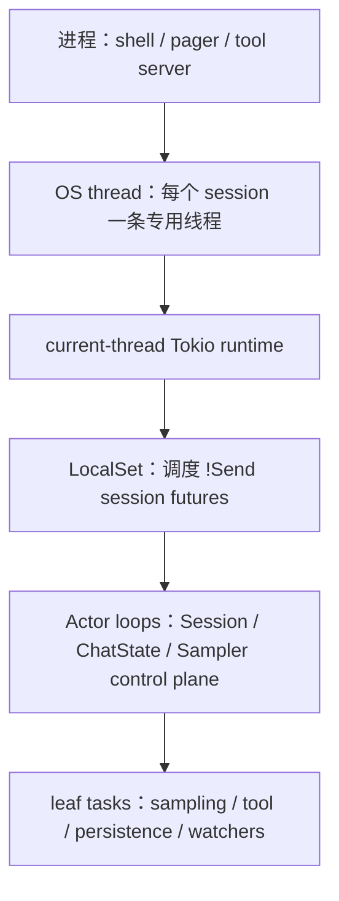
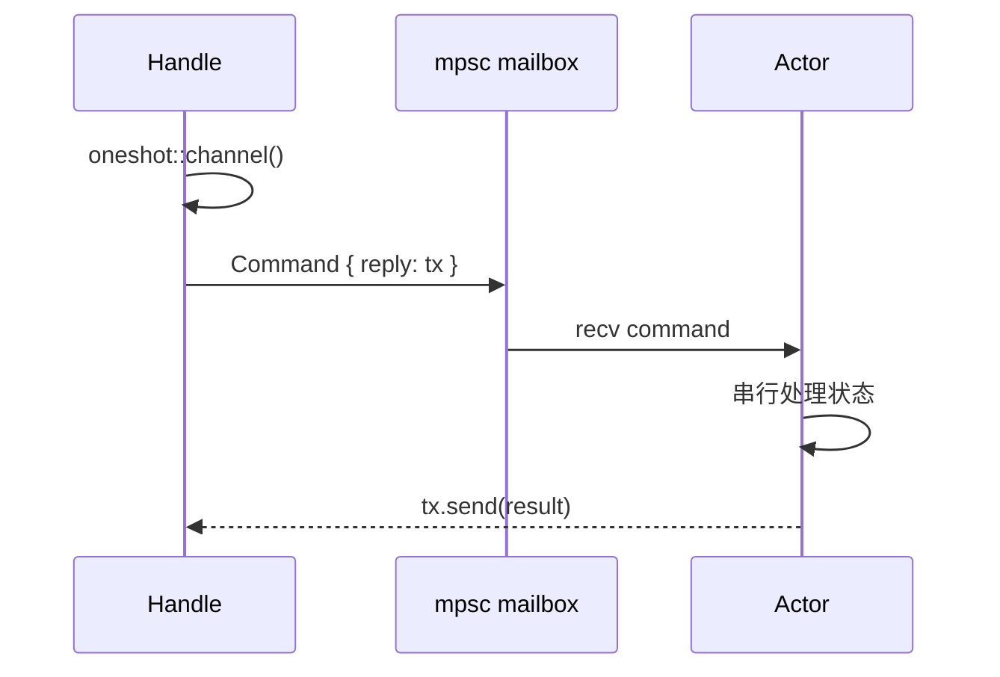

# 并发模型、Actor、Channel 与取消传播：线程隔离、任务所有权、背压和有序关闭

本文研究 Grok Build 怎样组织同时发生的工作：一个 session 为什么有独立线程和 Tokio runtime；SessionActor、ChatStateActor 与 SamplerActor 分别如何串行化状态、并发执行叶子工作；`mpsc`、`oneshot`、`watch`、`broadcast` 各自传递什么；取消为什么同时存在 `CancellationToken`、`abort`、channel close 和业务状态；以及 shutdown 怎样避免留下后台任务、悬空 RPC 或未落盘数据。

前置阅读：[状态所有权](01-state-ownership.md)、[Prompt 队列与 Turn 调度](03-prompt-queue-and-turn-scheduling.md)、[模型请求与 Provider 子系统](12-model-provider-request-streaming-retry-and-recovery.md)、[日志与可观测性](14-logging-telemetry-tracing-and-observability.md)。

## 先记住结论

1. “异步”不等于“多线程”：Rust `Future` 只是可推进的计算，Tokio runtime 才负责在条件满足时继续 poll。
2. Grok Build 的 session 不是全部挤在一个全局 executor；每个 session 建立独立 OS 线程、current-thread Tokio runtime 和 `LocalSet`。
3. `SessionActor` 可以持有 `Rc`、`RefCell`、`Cell` 等 `!Send` 状态，因为它只在所属 session 线程的 `LocalSet` 内运行。
4. `SessionHandle` 是可 clone、可跨线程的代理；真正的 `SessionActor` 不跨线程，边界由 `SessionCommand` channel 隔开。
5. Actor 的主要价值不是“所有事情都并行”，而是让一组可变状态只有一个串行决策者。
6. `SessionActor` 的主循环通过 `tokio::select!` 同时等待命令、turn completion、replay event、chat-state event、model switch 和 timer。
7. 主循环一次只执行一个选中的 arm；arm 内长时间 `.await` 仍可能让同一 actor 的其他消息等待。
8. 因此耗时 turn 不直接在主循环中执行，而由 `AgentTask` 用 `spawn_local` 启动，再通过 completion channel 回报。
9. `State.running_task` 与 `pending_inputs` 在同一个 `TokioMutex` 下，保证“谁正在运行、谁仍排队”的组合决策不会看到撕裂快照。
10. `running_task` 的 prompt 同时保留在 `pending_inputs.front()`，完成或取消时才弹出；这是队列编辑和取消逻辑依赖的不变量。
11. `ChatStateActor` 是另一层 actor：独占 conversation、token usage、sampling config 和 persistence，并按 command 顺序处理。
12. `ChatStateHandle` 使用 unbounded mpsc 发送命令；查询或需要确认的 mutation 再嵌入 oneshot reply。
13. fire-and-forget command 只表示“尝试入 mailbox”，不表示 actor 已处理，更不表示数据已落盘。
14. `PushUserMessageAndAck` 的 ack 表示 actor 已接受并处理；`AppendWorkingDirectorySwitchAndAck` 还把持久化结果纳入返回语义。
15. `ChatStateActor` 同时监听 cancellation token 与 mailbox；所有 handle 被 drop、mailbox 关闭也会结束 actor。
16. `biased;` 让 cancellation arm 优先于 command arm，避免关闭已请求时继续消耗源源不断的消息。
17. `SamplerActor` 串行拥有 active-request map，但每个 sampling request 在 `JoinSet` 中并发运行。
18. 这形成常见 actor 模式：控制面串行，数据面或叶子 I/O 并行。
19. `JoinSet` 同时承担 task ownership 和完成回收；actor 退出时可取消 token，再 `shutdown().await` 中止剩余任务。
20. 单纯 `tokio::spawn` 后丢弃 `JoinHandle` 会 detach task，不会停止它；源码对此有明确注释。
21. 需要把子任务生命周期绑定到父流程时，应保存 handle、放入 `JoinSet`、使用 cancellation token，或由明确 supervisor 管理。
22. `spawn_local` 用于 `!Send` future；`tokio::spawn` 要求 future 可在线程间移动；`spawn_blocking` 用于同步阻塞工作。
23. `spawn_blocking` 不是“让代码更快”，而是避免文件系统、压缩、同步 SDK 等阻塞 async worker。
24. 已启动的 `spawn_blocking` 工作通常不能靠 abort 立即停止；长期工作仍需自己支持 cooperative cancellation。
25. unbounded mpsc 让同步发送方快速入队，但把背压风险转换成内存增长风险。
26. bounded mpsc 把容量写进接口；满时 `send().await` 施加背压，`try_send` 则立即返回 Full。
27. 选择丢弃、等待、报错还是降级，不是 channel 自己决定，而是每个 call site 的产品语义。
28. TUI tracing 满时丢日志；Computer Hub outbound 满时最多等待 250ms，之后返回 `BackpressureError`；两者策略不同是合理的。
29. oneshot 表示一次请求对应一次回复；sender 被 drop 时 receiver 得到关闭，而不是永久等到一个不存在的值。
30. oneshot 只能解决“这次请求的答案”，不能承载持续状态或多条事件。
31. watch channel 保存最新值并通知变化，适合 model generation、shutdown reason 等“状态快照”；慢消费者不会逐条重放历史值。
32. broadcast 给多个订阅者同一事件流；慢订阅者可能 lag，并不能把它当可靠持久队列。
33. channel close 是生命周期信号：所有 sender drop 后，`recv()` 返回 `None`；许多 actor 将它视为所有 owner 都离开。
34. `CancellationToken` 是 cooperative cancellation：`cancel()` 只唤醒/标记，future 必须检查 `is_cancelled` 或 select `cancelled()`。
35. clone token 共享同一取消状态；它适合把一条取消意图传播到请求、重试 backoff、工具和子循环。
36. `AbortHandle::abort` 是 hard task cancellation：executor 在下次可取消点 drop future，不会像异常一样自动运行 async cleanup。
37. Rust `Drop`/RAII cleanup 仍会在 future 被 drop 时运行，因此 guard 可清除 active flag 和 prompt pin。
38. cooperative cancel 和 hard abort 常组合使用：先发 token让叶子优雅退出，再由 owner 在超时或 teardown 时 abort。
39. session 的“取消当前 turn”不是单次 `abort()`；它还要处理工具进程、subagent、后台任务、队列回复、usage、事件、reminder 和下一 prompt。
40. Esc、Ctrl+C、SendNow、Shutdown 等 trigger 虽都可能取消 turn，但业务副作用不同；源码使用 `CancelTrigger` 明确区分。
41. 普通交互取消保留后续真实用户 prompt；hard teardown 会清空整个队列并逐一完成等待中的 RPC。
42. Ctrl+C 额外抑制 task/workflow auto-wake，直到真实用户重新参与；SendNow 则是无中断提示的 cancel-and-send。
43. 取消时必须完成 pending oneshot，否则客户端的 `session/prompt` 可能永远显示运行中。
44. 取消 active future 后还要修复业务历史：已提交但未返回的 tool call 需要 dangling-call repair，不能只删除内存 task。
45. shutdown 是协议，不是一个布尔值：停止接收新工作、取消或保留运行工作、drain、flush、发 terminal event、关闭资源需要有顺序。
46. `ShutdownKind::Graceful` 与 `CancelRunningTurn` 明确区分“保留运行工作”和“先取消 turn 再关闭”。
47. session shutdown 会先 drain workflows，并用 oneshot + timeout 等待 persistence flush；超时会告警但不会无限卡住。
48. replay buffer 必须在 `TurnCompleted`、Cancel 和 Shutdown 前 flush，保证持久化事件顺序不倒置。
49. MCP reverse transport 用 owned `JoinSet` 管理每个 invoke；EOF 时 drop set，使尚未结束的调用立即停止，而非变成 detached task。
50. 不是所有 future 都 cancellation-safe；`read_line` 被明确禁止放进会被其他 arm 打断的 `select!`，否则部分读取的数据可能丢失。
51. `tokio::select!` 的未选中 future 通常会被 drop；把有部分进度但不可安全重建的操作放进去前必须核对 cancellation safety。
52. lock 不能自动提供 actor 语义；只有把相关状态、操作顺序和不变量放在同一所有权边界内，才能避免逻辑竞态。
53. async mutex guard 跨 `.await` 会延长临界区；源码常先快速检查、释放 lock 做 I/O、再加锁并重新检查。
54. “重新检查”不是重复劳动，而是处理 await gap 中其他任务已经改变状态的标准做法。
55. `Cell`/`RefCell` 适合单线程 interior mutability，`Mutex`/atomics 用于真正跨 task 或跨线程共享；选择反映访问拓扑。
56. atomic flag 适合独立的门闩或提示，不适合维护必须一起变化的多字段状态机。
57. `Semaphore` 控制并发量，不保存业务队列语义；`buffer_unordered(n)` 也限制并行度，但结果完成顺序不保证与输入一致。
58. timeout 只是停止等待；它是否也停止底层工作，取决于 future 被 drop 后的行为及其子资源所有权。
59. 并发 bug 排查应先找 owner、task owner、wake source 和 terminal acknowledgement，再看具体 mutex/channel。
60. 修改并发代码时应测试正常完成、取消、sender drop、receiver drop、队列满、timeout、panic 和 shutdown race，而不只测试 happy path。

## 一、先建立分层心智模型

Grok Build 中的并发可以压成五层：



这里有两个必须分开的概念：

- **执行位置**：process、thread、runtime、LocalSet 决定代码在哪里被 poll。
- **状态所有权**：actor、mutex、channel 决定谁有权修改状态以及以什么顺序修改。

一个 async function 不会因为写了 `async` 就自动并行。调用它只得到 future；只有 `.await`、`spawn` 或 runtime 驱动它，才会继续执行。

### 1.1 外层隔离、内层串行、叶子并发

可以把核心架构读成：

```text
不同 session：OS thread 级隔离
同一 session 的调度决策：actor loop 串行
同一 turn 内的模型、工具、监听器：按需并发
跨边界通信：typed channel
```

这不是“纯 actor 系统”，也不是“所有状态加 Mutex”。它混合使用几种机制，让每种机制解决自己擅长的问题。

### 1.2 为什么 session 使用独立线程

`spawn_session_on_thread` 创建：

1. 命名为 `ses-<id前缀>` 的 OS thread；
2. 8 MiB thread stack；
3. current-thread Tokio runtime；
4. `LocalSet`；
5. 在该 LocalSet 内构造并运行 `SessionActor`。

构造参数必须是 `Send`，被 move 进线程；构造完成后只把 `SessionHandle`、permission receiver 和 system prompt 等 `Send` 结果通过 oneshot 送回调用者。`SessionActor` 本身从未跨越线程边界。

**设计推断：** 这种方案用更多线程和 runtime 资源换取 session 故障/调度隔离，并允许复杂 session 状态继续使用 `Rc`/`RefCell`，降低到处升级为 `Arc<Mutex<_>>` 的成本。

### 1.3 Runtime 构建也会失败

`build_session_runtime()` 返回 `std::io::Result<Runtime>`。创建 runtime 要申请 fd、waker 等系统资源，在 `EMFILE`/`EAGAIN` 下可能失败。线程入口会把错误通过 init oneshot 返回，而不是 panic 杀掉整个进程。

对应测试 `runtime_build_failure_is_contained` 会在子进程中降低 fd limit，验证资源耗尽被限制在 session 初始化错误内。

## 二、Actor 到底解决什么问题

Actor 可以先理解成：

> 一个对象独占状态；外部不能直接拿 `&mut` 修改，只能给它发消息；它按某个明确顺序处理消息。

Grok Build 至少有三种重要 actor 形态：

| Actor | 串行拥有的状态 | 并发叶子工作 | 外部代理 |
| --- | --- | --- | --- |
| `SessionActor` | turn 调度、pending inputs、notifications、session orchestration | prompt task、MCP、watcher、memory、workflow | `SessionHandle` |
| `ChatStateActor` | conversation、usage、sampling config、persistence owner | persistence 内部工作 | `ChatStateHandle` |
| `SamplerActor` | config、retry policy、active request map | 每个 model request 一个 task | `SamplerHandle` |

### 2.1 Actor 不等于 struct 名里有 Actor

判断一个对象是否真正承担 actor 角色，要看：

- 是否独占一组状态；
- 是否有 mailbox/command protocol；
- 是否有持续运行的 receive loop；
- 外部是否通过 handle，而非直接 mutation；
- teardown 是否由 mailbox close、cancel 或 supervisor 驱动。

仅仅把 struct 命名为 `FooActor` 不会自动消除竞态。

### 2.2 串行处理也可能被阻塞

Actor loop 只保证不会同时进入两个 command handler，却不保证 handler 很快。如果 handler 在持有 actor 独占权时 `.await` 一个慢网络请求，后续 command 仍会排队。

常用拆法是：

```text
actor 收到 command
  -> 更新/登记状态
  -> spawn 叶子 task
  -> 立刻回到 recv loop
叶子 task 完成
  -> completion channel 发回结果
actor 串行提交完成状态
```

`SessionActor` 的 turn 和 `SamplerActor` 的 request 都采用这一模型。

## 三、SessionActor：每个 Session 的串行调度核心

### 3.1 Handle 与 Actor 的线程边界

`SessionHandle` 派生 `Clone`，核心字段是：

```text
cmd_tx: UnboundedSender<SessionCommand>
current_prompt_id: Arc<Mutex<Option<String>>>
chat_state_handle: ChatStateHandle
signals_handle: SessionSignalsHandle
若干只读快照或专用共享 handle
```

调用方 clone 的不是 actor，而是发送端与少量经过设计的共享句柄。绝大多数有顺序要求的改变仍必须变成 `SessionCommand`。

### 3.2 主循环同时监听哪些来源

`run_session` 的 `tokio::select!` 包含多类输入：

- idle memory flush timer；
- dream consolidation timer；
- model-switch `watch::Receiver::changed()`；
- `ChatStateEvent`；
- replay/notification `SessionEvent`；
- turn completion channel；
- `SessionCommand` mailbox。

这意味着 actor 的“消息”不只来自一个 enum channel。timer 和 watch change 也是 wake source，但所有 arm 最终仍在同一 session thread 串行提交调度状态。

### 3.3 为什么 turn 要单独 spawn

`maybe_start_running_task` 不直接 `.await handle_prompt(...)`，而是构造 `AgentTask`：

```text
pending_inputs.front_mut()
  -> 取出 prompt 所需字段
  -> 写 current_prompt_id
  -> broadcast queue promotion
  -> spawn_local(run_task(...))
  -> 保存 AbortHandle 到 State.running_task
```

`run_task` 完成后通过：

```text
UnboundedSender<(prompt_id, PromptTurnResult)>
```

把结果送回主循环。这样模型流式等待、工具调用和重试不会占住 command dispatch loop，Cancel、Interject、Shutdown 仍能被处理。

### 3.4 Front-is-running 不变量

运行中的 prompt 不会在 promotion 时立即从 `pending_inputs` 弹出。源码约定：

```text
pending_inputs.front().prompt_id == running_task.prompt_id
```

直到 completion 或 cancel 提交结束状态。

这让队列展示、respond_to sender、combined prompt metadata 与 running identity 仍在一个记录上。但它也意味着任何 sweep 都必须按真实 `running_prompt_id` 保护运行项，不能想当然删除“匹配某类 synthetic input”的 front。

### 3.5 Fast check、await、re-check

`maybe_start_running_task` 先在 lock 内检查是否已经运行或队列为空，然后释放 lock 去读 combine-queued 配置，再重新加锁检查一次。

```text
lock -> 快速判断 -> unlock
await config I/O
lock -> 重新判断 -> 真正 promote
```

await gap 中 Cancel、Prompt 或 completion 都可能修改状态。第二次检查是正确性要求。

## 四、ChatStateActor：把会话历史变成单写者状态

### 4.1 它拥有的内容

`ChatStateActor` 独占：

- `ChatState`：conversation、token/turn 统计、sampling config 等；
- `PruningConfig`；
- `Box<dyn ChatPersistence>`；
- command receiver；
- event sender；
- cancellation token。

外部通过 `ChatStateHandle` 的 clone 发送命令，不能直接借用 conversation 的可变引用。

### 4.2 Mailbox 串行化 mutation 与 query

例如下列操作都进入同一 `ChatStateCommand` 顺序：

- push user/assistant/tool message；
- record token/model/subagent usage；
- replace conversation；
- repair history；
- replace system head；
- snapshot/query。

因此“先 push 再 snapshot”如果由同一个 sender 按顺序入队，actor 会按 mailbox 顺序看到。若多个 sender clone 并发发送，则应依赖协议 ack 或更高层同步，不能臆测跨 producer 的业务顺序。

### 4.3 Fire-and-forget 与 Ack 的差异

`push_user_message()`：

```text
send(command); 忽略 send error; 立即返回
```

`push_user_message_and_ack()`：

```text
创建 oneshot
把 reply sender 放进 command
发送 command
await reply receiver
```

第二种建立了明确 barrier：返回时 actor 已处理该命令。需要“确保持久化也完成”时，还必须使用包含 persistence acknowledgement 的更强协议，不能把 actor ack 自动理解成 fsync。

### 4.4 两条关闭路径

主循环使用 biased select：

```text
cancellation_token.cancelled() -> break
cmd_rx.recv() == None          -> break
Some(command)                  -> handle_command
```

第一条是显式生命周期控制；第二条是所有 `ChatStateHandle` sender 都离开后的隐式 ownership 终止。

## 五、SamplerActor：串行控制面，并发请求面

`SamplerActor` 的 mailbox 是 unbounded channel，内部有：

- `ActorState`：config、retry policy、active requests；
- `JoinSet<RequestId>`：每个 request task；
- event sender。

Submit 时：

1. 创建 per-request `CancellationToken`；
2. 登记进 active map；
3. duplicate request id 会 cancel 旧 token；
4. 把 `run_request_task` spawn 进 `JoinSet`。

Cancel 时，actor 从 active map 找到 token 并调用 `cancel()`。request task 会在 attempt 前、stream/select 和 retry backoff 路径检查 token。

### 5.1 为什么使用 JoinSet

`JoinSet` 让 actor 能：

- 接收任意 request task 的完成；
- 从 active map 回收对应 id；
- 观察 panic/abort 的 `JoinError`；
- actor 关闭时集中 shutdown 全部仍在运行的 tasks。

如果改成裸 `tokio::spawn` 并立即丢 handle，请求虽然能运行，但 owner 无法可靠回收、等待或停止它们。

### 5.2 `biased` 的选择

Sampler loop 优先 `tasks.join_next()`，然后才处理新 command。源码注释说明目的是尽快清理完成任务，避免 active map 长时间保留 stale entry。

`biased` 不是免费的“高优先级”：如果高位 arm 永远 ready，低位 arm 可能饥饿。使用时必须能证明高位工作会被及时耗尽，或饥饿符合关闭语义。

## 六、Channel 类型怎么选

### 6.1 对照表

| Channel | 发送者/接收者 | 是否保留每条值 | 满/慢时行为 | 项目中的典型用途 |
| --- | --- | --- | --- | --- |
| bounded `mpsc` | 多发送者、单接收者 | 容量内保留 | await、Full、timeout 或丢弃 | socket outbound、日志 pane、PTY 数据 |
| unbounded `mpsc` | 多发送者、单接收者 | 理论上全保留 | 不向 producer 施加容量背压 | actor mailbox、completion/event |
| `oneshot` | 单发送者、单接收者 | 一个值 | sender drop 后 receiver error | command reply、init handshake、flush barrier |
| `watch` | 多接收者看最新状态 | 只保留最新值 | 中间变化可合并 | model generation、shutdown reason |
| `broadcast` | 多发送者、多接收者 | 环形容量内事件 | 慢 receiver 得到 lag | PTY output fan-out |
| `std::sync::mpsc` | 同步线程通信 | 依具体类型 | 阻塞线程，不应阻塞 async worker | clipboard/专用线程桥接 |

### 6.2 Unbounded 并不代表无限安全

`unbounded_channel()` 的 `send` 不需要 `.await`，适合 actor handle 的同步方法和低延迟控制消息。但如果 producer 长期快于 consumer，队列会持续占内存。

因此 unbounded 的安全性来自系统级约束，而非 channel 本身，例如：

- 每个 session 的 prompt admission 有业务限制；
- event 是短小结构；
- actor arm 不应长时间阻塞；
- shutdown 会关闭 producer 并 drain/resolve。

如果无法说明这些约束，新增 unbounded channel 就需要重新考虑。

### 6.3 Bounded channel 的四种满载策略

代码中常见四种：

1. `send().await`：让 producer 等待，真实背压；
2. `try_send` 返回 Full：调用方立即决定；
3. `try_send` 失败后 bounded timeout `send`：给短暂拥塞恢复机会；
4. 丢弃/合并：适合可观测性、重复 wake 等 best-effort 信号。

Computer Hub `send_outbound` 先 `try_send`，满时最多等待 250ms，仍满则返回 `BackpressureError`。同步 Drop 路径不能 `.await`，只能 `try_send_outbound` 并允许 abandon cancel frame。

### 6.4 Oneshot 是协议的完成边

一个带 reply 的 command 实际形成小型 RPC：



必须同时处理两种关闭：

- command mpsc send 失败：actor 已死；
- oneshot receive 失败：actor 收到后在回复前退出或 drop sender。

把 `unwrap()` 放在这些边界上，常会把正常 teardown 变成 panic。

### 6.5 Watch 不是事件日志

`watch::channel(0u64)` 很适合 model-switch generation。消费者只关心“当前 generation 已变化”，不需要逐一重放每次中间值。

如果业务要求“每个状态迁移都必须处理”，应选 mpsc/broadcast + 持久化，而不是 watch。

### 6.6 Broadcast 允许 lag

PTY session 的 output 使用容量 256 的 broadcast channel，让多个订阅者同时收到 bytes。慢 receiver 超过 ring capacity 后会看到 lag error，旧数据不会神奇恢复。

需要终端完整回放时，必须依赖额外 scrollback/persistence，而非仅依赖 live broadcast。

## 七、Backpressure：系统慢下来时谁承担代价

背压不是“channel 满了”这么窄。它回答：consumer 处理不过来时，代价落在哪里？

| 策略 | 代价 | 适合 | 不适合 |
| --- | --- | --- | --- |
| producer await | 延迟传播上游 | 必须保留的网络/存储数据 | actor control loop 中的长等待 |
| 有界等待后报错 | 调用失败可见 | outbound protocol | 无法重试且必须交付的数据 |
| 丢最新 | 信号不完整 | debug log、重复心跳 | 用户 prompt、terminal result |
| 丢最旧/环形覆盖 | 历史不完整 | 最近窗口、PTY live fan-out | 审计记录 |
| 合并为最新状态 | 中间迁移消失 | config generation、shutdown reason | 每次事件都重要 |
| unbounded 缓冲 | 内存承担压力 | 有严格流量上界的 control messages | 大 payload、高频无限 producer |
| semaphore 限流 | 等待任务数增加 | 上传、存储、探测并发 | 需要公平业务队列的调度 |

### 7.1 容量是接口语义

`mpsc::channel(1)` 常表示“信号只需排队一个”，例如 stop/reconnect。重复 `try_send(())` 失败往往意味着已有等价 wake pending，不需要无限积累。

容量 64、256 或 16K 则代表不同 burst tolerance。修改容量会改变内存、延迟和丢弃概率，不只是性能微调。

### 7.2 Semaphore 限制并发，不限制所有排队内存

`Semaphore::new(max_concurrent)` 限制同时持有 permit 的工作数。如果代码在拿 permit 前已经创建并保存大量 futures/tasks，排队对象仍可能增长。

检查限流实现时要问：

- permit 在 spawn 前还是 task 内获取？
- 等待者存在哪里？
- cancel 后 permit 是否通过 RAII 释放？
- shutdown 是否等待持 permit 的任务？

## 八、Spawn 家族与任务所有权

### 8.1 `tokio::spawn`

用于 `Send + 'static` future，可被多线程 runtime 调度。返回 `JoinHandle<T>`。

```text
保留并 await handle -> 观察结果/panic
保留 AbortHandle   -> 能请求 hard cancel
丢弃 JoinHandle    -> task detached，继续运行
```

`xai-tracing::spawn_traced` 会用当前 tracing span instrument future，说明 spawn 边界还涉及上下文传播，而不仅是生命周期。

### 8.2 `spawn_local`

在 `LocalSet` 上运行 `!Send` future。SessionActor 大量使用它，因为 actor 持有 `Rc`、`RefCell` 或线程绑定资源。

`spawn_local` 不表示同步：多个 local tasks 仍会在 `.await` 处交错，只是不会被迁移到其他 OS thread。

### 8.3 `spawn_blocking`

用于不能异步化的同步工作，例如：

- git/file operations；
- image/PDF 编码；
- 某些 credential/keychain API；
- 压缩或大文本 CPU 工作；
- 同步 SDK。

调用者仍要处理 `JoinError`，因为 blocking closure 可能 panic。timeout 掉外层 await 也不保证 closure 已停止。

### 8.4 `TaskSlot<T>`：只允许一个延迟任务

SessionActor 的 `TaskSlot<T>` 用 `Cell<Option<JoinHandle<T>>>` 保存一个 task：

- `arm(new)` 先 abort old；
- `take()` 转移所有权以 await；
- `cancel()` abort 并清空。

它适合 debounce、延迟 prefix 等“新任务取代旧任务”的场景。`Cell` 可用是因为整个 actor 处于单线程 LocalSet。

### 8.5 JoinSet：结构化所有权

MCP reverse transport 的每个 invoke 都进入函数局部 `JoinSet`。reader EOF 后函数返回，JoinSet 被 drop，仍运行的 invokes 被 abort。

这比 detached spawn 更符合结构化并发：子任务不能无声活过拥有它的 transport。

## 九、`tokio::select!` 与 Cancellation Safety

### 9.1 Select 实际做什么

`select!` 同时 poll 多个 future；一个 branch ready 后执行该 arm，其他未选 future 通常被 drop，下一轮再重新构造或继续 pinned future。

所以正确性问题不是只看“哪个先完成”，还要问：

> 如果这个 future poll 了一半却没被选中，drop 后下次重建是否会丢进度？

### 9.2 项目中的 `read_line` 反例

ACP MCP bridge 明确说明 `read_line` 不应与 task-reaping branch 放进 select。长 JSON line 可能跨多个 `fill_buf` chunk；若另一 branch 先完成，pending `read_line` 被 drop，已经消费的部分 bytes 可能丢失，下一次 `line.clear()` 后协议流失步。

代码因此选择：

1. 完整 await 一行；
2. 再用 `try_join_next()` 非阻塞回收已完成 invoke；
3. 解析并 spawn request。

这是“吞吐技巧服从协议正确性”的典型例子。

### 9.3 Pinned timer 的重置

`run_session` 预先创建并 pin `idle_flush_sleep`、`dream_check_sleep`。timer arm 完成后用 `reset(now + timeout)` 重用，而不是每轮任意重建，避免丢失 deadline 状态。

### 9.4 `biased` 应有可读理由

项目中的两类合理理由：

- ChatStateActor：cancel 优先，关闭请求不应被 mailbox 流量拖延；
- SamplerActor：完成回收优先，避免 active state stale。

新增 biased select 时应写清优先级不变量，并测试低优先级 branch 不会永久饥饿。

## 十、取消的四个层次

### 10.1 业务取消

业务层先决定“取消意味着什么”：

- stop reason 是 Cancelled 还是 Rewound；
- 排队 prompt 保留还是移除；
- background bash 是否继续；
- subagent 是否停止；
- 是否注入 interrupt reminder；
- 是否记录 user-cancel metric。

`CancelOptions` 与 `CancelTrigger` 承载的就是这层语义。

### 10.2 Cooperative token

`CancellationToken` 的模型是：

```text
owner: token.cancel()
worker: select! { _ = token.cancelled() => cleanup/return, result = work => ... }
```

优点是 worker 能返回 typed cancellation、写 terminal event、释放协议资源。缺点是每个长等待和重试 sleep 都必须配合检查。

### 10.3 Hard task abort

`AbortHandle::abort()` 请求 runtime drop future。适合：

- worker 不配合；
- owner 已决定结果，不再需要异步清理；
- shutdown budget 已耗尽。

但它不会自动完成业务 ack，也不会自动 kill future 之外的 OS child process。因此 session cancel 在 abort 前后还显式调用 terminal backend、subagent coordinator 和事件/持久化逻辑。

### 10.4 Channel close

关闭最后一个 sender 可让 receiver loop自然结束。这是一种 ownership cancellation：没有任何 handle 能再发工作，actor 没有继续驻留的理由。

它不适合表达 Esc 与 Shutdown 的差异，因为 close 不携带原因。需要业务原因时仍应先发 typed command/token。

## 十一、一次真实的 Turn 取消追踪

下面以交互式取消为主线。实际分支由 `CancelOptions` 决定。

```mermaid
sequenceDiagram
    participant C as Client/MvpAgent
    participant S as SessionActor loop
    participant T as AgentTask
    participant Tools as Tool/Subagents/Terminal
    participant Q as pending_inputs + replies
    participant P as Persistence/Events

    C->>S: SessionCommand::Cancel(options)
    S->>S: capture prompt identity + log trigger
    opt cancel_subagents
        S->>T: abort producer early
        S->>Tools: close child spawn admission + cancel children
    end
    S->>Tools: kill foreground commands
    opt hard teardown
        S->>Tools: kill background tasks
    end
    S->>Q: lock state; drain monitor buffer
    S->>Q: take running_task; partition queued inputs
    S->>P: emit TurnEnded(Cancelled)
    S->>T: abort()
    S->>S: clear flags / blocking wait depth
    S->>P: finalize usage + emit TurnCompleted
    S-->>C: resolve cancelled prompt oneshot
    S->>S: maybe promote preserved next prompt
```

### 11.1 为什么先 abort producer，再扫 subagent

当 `cancel_subagents=true` 时，源码先 abort 正在产生新 TaskTool work 的 running task，再取消所有 session children 并关闭 spawn admission。否则 sweep 之后 producer 仍可能立刻创建新 child，形成“取消完成后又冒出任务”的竞态。

### 11.2 前台与后台进程不同

普通交互取消杀 foreground commands，但让 background tasks 存活；subagent hard teardown 的 `kill_background_tasks=true` 才清除后台任务。

subagent 共享 parent terminal backend，因此按 owner/session id kill，不能误杀 parent 或 sibling 的进程。

### 11.3 队列为什么不能全部 `mem::take`

普通 cancel 只应移除 running front，并在 Ctrl+C 时额外移除 task/workflow completion wakes。真实用户排队 prompt 要保留，之后自动 promote。

hard teardown 不会再启动下一 prompt，才会 take 整个队列并逐个回复 Cancelled。

### 11.4 为什么 abort 后还要写 terminal event

被 abort 的 `run_task` 不一定有机会把 completion 发回主循环。SessionActor 必须自己：

- emit `TurnEnded`；
- finalize/snapshot usage；
- emit durable `TurnCompleted`；
- 完成 client oneshot；
- 修复下一 turn 所需的 interrupt/dangling-tool context。

否则执行层已经停了，协议层却永远不知道它结束。

## 十二、RAII、Drop 与竞态收口

### 12.1 `TurnActiveGuard`

创建时把 atomic flag 设为 true，Drop 时恢复 false。无论正常返回、`?` 提前返回、panic unwind 或 future abort/drop，都不会把 turn 永久标记为 active。

### 12.2 `TurnSubagentScopeGuard`

它在 Drop 时只在 prompt id 仍匹配时清空 `current_prompt_id`。比较后清理避免旧 turn 的迟到 Drop 把新 turn 的 pin 清掉。

这是一种 generation/identity guard：cleanup 必须证明自己仍拥有当前槽位。

### 12.3 Drop 不能做任意 async cleanup

Rust `Drop::drop` 不能 `.await`。因此复杂关闭需要显式 `shutdown().await`；Drop 最多做同步释放、发 token、abort 或 best-effort spawn。

`McpBridge` 的文档要求调用显式 `shutdown`，Drop 里的 close 只是兜底，体现了这个限制。

## 十三、有序 Shutdown

### 13.1 ShutdownKind

```text
Graceful          -> 正在运行的工作按调用场景存活/自然收口
CancelRunningTurn -> 先执行完整 cancel protocol，再 teardown
```

关闭 session 不是直接 drop thread。`SessionCommand::Shutdown` arm 会按顺序执行多项工作。

### 13.2 关键阶段

简化后的 shutdown 顺序：

1. cancel/drain workflows，最多等待既定 budget；
2. 向 persistence actor 发送 `FlushAndAck`，oneshot 最多等 2 秒；
3. flush replay buffer，保证最后 stream delta 先于 terminal；
4. 若要求，执行完整 turn cancel；
5. 删除 pending synthetic auto-wake 与 notifications；
6. 运行 session_end hooks/stop hooks；
7. 保存 memory session summary、尝试 dream；
8. cancel feedback sync loop并 drain feedback/upload；
9. 持久化 background task manifest；
10. 清 scratch，主循环 return；
11. `session_done_rx` 完成后，session thread 的 LocalSet/runtime 退出。

### 13.3 为什么每一步都有 budget

无限等待一个挂死网络、embedding、hook 或 persistence ack，会让 session thread永不退出，leader roster留下 zombie。完全不等又会丢数据。

项目采用 bounded graceful shutdown：给关键 drain 一个有限窗口，超时记录 warning 并继续 teardown。

### 13.4 事件顺序也是关闭正确性

replay buffer 中可能还有 reasoning/text chunks。如果先写 `TurnCompleted` 再 flush，`updates.jsonl` 会出现 terminal 后还有 turn delta，重放和 trace snapshot 都会误解状态。

因此 Cancel、Shutdown、FlushComplete 等路径都在 terminal event 前执行同一 flush discipline。

## 十四、Lock、Cell、RefCell 与 Atomic 怎么分工

| 工具 | 访问模型 | 适合 | 风险 |
| --- | --- | --- | --- |
| `tokio::sync::Mutex` | async task 间共享，可 await lock | scheduling state、async owner | guard 跨 await 使 actor停顿 |
| `parking_lot::Mutex` | 同步短临界区 | tracker、快速共享 map | 临界区内阻塞会卡 OS thread |
| `std::sync::Mutex` | 跨线程同步 | prompt id 等短同步读写 | poison、不可 async await |
| `Rc<RefCell<T>>` | 单线程共享，运行时 borrow check | LocalSet 内复杂对象 | borrow panic、不能跨线程 |
| `Cell<T>` | 单线程 copy/move 型 interior mutation | flag、TaskSlot | 不能维护复杂跨字段原子性 |
| `AtomicBool/U64` | 无锁独立值 | gate、counter、liveness hint | 多字段组合可能看到不一致 |
| Actor mailbox | 单 writer 串行 mutation | conversation、protocol state | mailbox 堆积、slow handler |

### 14.1 “用了 Arc”不表示线程安全

`Arc<T>` 只保证引用计数可跨线程。`T` 自身仍需满足 `Send + Sync`，内部 mutation 仍需 Mutex、RwLock、atomic 或 actor ownership。

### 14.2 “用了 Mutex”不表示没有竞态

下面仍可能有逻辑竞态：

```text
lock -> 检查空闲 -> unlock
await I/O
lock -> 不重新检查 -> 启动工作
```

内存访问安全不等于业务状态机正确。await gap 后重检或 generation compare 才能关闭逻辑竞态。

### 14.3 不要跨 await 持有不必要的 guard

安全做法通常是：

```text
lock -> clone/take 最小数据 -> unlock
await 慢操作
lock -> 按 identity/generation 提交结果 -> unlock
```

如果必须跨 await 持锁，应明确说明这是为了串行 barrier，并评估 Cancel/Shutdown 是否会被拖住。

## 十五、并发集合与限流

### 15.1 `FuturesUnordered`

工具并行调用和 MCP 初始化可把 futures 放入 `FuturesUnordered`，哪个先完成先产出哪个。它不保留输入完成顺序。

如果最终结果必须按原 tool-call 顺序组装，需要携带 index/id，在收集后重排或按协议 id关联。

### 15.2 `buffer_unordered(n)`

它允许最多 `n` 个 future 同时 in-flight。MCP server 操作和 doctor probe 使用这类方式减少串行等待，又避免无限并发。

### 15.3 `JoinSet` 与 Futures collection 的区别

二者都能按完成顺序收结果，但 `JoinSet` 管理 spawned Tokio tasks，带 task abort/panic 边界；`FuturesUnordered` 在当前 parent task 内直接 poll futures，parent 被 drop 时集合随之 drop。

## 十六、失败路径与恢复语义

### 16.1 Sender closed

发送失败通常说明 actor/consumer 已退出。应把 payload 或请求转换成 typed unavailable/cancelled error，不能无限 retry 同一个死 sender。

### 16.2 Receiver closed

`recv() == None` 表示所有 sender 都 drop。Actor 可将它解释为 ownership 结束，但在多 channel select 中某个辅助 channel 关闭不一定代表整个 session 要退出；`run_session` 对不同 receiver 有不同处理。

### 16.3 Task panic

只有保留/await JoinHandle 或 JoinSet entry 才能观察 `JoinError`。detached task panic 可能只进入 panic hook，而 owner 状态仍不知道 worker 已死。

Session thread 由 `SessionThread` supervisor 的 join handle 检查；失败后 leader 可把 roster 状态标为 `DeadFailed`，避免僵尸 resident session。

### 16.4 Timeout

`tokio::time::timeout(d, future)` 在超时时返回 error并 drop future。若 future 只拥有 async socket wait，通常能停止；若它触发了 detached task、OS process 或已运行的 blocking closure，底层工作可能继续。

所以 timeout 后仍要检查资源 owner，而不能只看调用栈返回了 `Elapsed`。

### 16.5 重复完成

取消、worker completion 和 channel close 可能竞速。oneshot 的单发送语义与 identity check 可把重复完成降为 send error/no-op。

代码中的许多 `let _ = reply.send(...)` 不是忽略业务失败，而是在声明：“另一条 teardown 路径可能已经完成/丢弃 receiver，重复回复不应 panic。”

## 十七、常见误读

### 误读 1：async function 会自动在后台运行

不会。未 await、未 spawn 的 future 不会自行推进。

### 误读 2：丢掉 JoinHandle 就取消 task

Tokio 中丢 JoinHandle 会 detach。必须调用 `abort`、取消 token，或让 owner 的 JoinSet/LocalSet teardown。

### 误读 3：Actor 里不需要锁

纯单 task actor 内部可能不需要锁，但 SessionActor 还与 turn task、外部 handle 和同步 observer 共享少量状态，因此仍有 `TokioMutex`、sync mutex 和 atomics。关键是每块状态有明确 owner。

### 误读 4：Unbounded channel 永远更快，所以都该用它

它只是把等待从 producer 移到内存。没有流量上界时会造成内存压力。

### 误读 5：CancellationToken.cancel 会强制终止代码

它只发 cooperative 信号。worker 不检查就不会停止。

### 误读 6：Abort 后所有外部资源都会被关闭

future owned 的 Rust 值会 drop，但 detached children、共享 terminal backend、OS process、远端 request可能需要显式处理。

### 误读 7：select 中哪个 future 没完成，下轮继续即可

未选 future可能已被 drop并重建。只有 cancellation-safe 操作才允许这样使用。

### 误读 8：watch receiver 会收到每次 send 的值

它保证观察最新状态变化，不保证慢消费者逐条看到中间版本。

### 误读 9：AtomicBool 可以替代状态机

单一 gate 可以；多个必须一致变化的字段不行。它们需要同一 lock、actor command 或带 generation 的提交。

### 误读 10：Graceful shutdown 就应该无限等待

无限等待会把故障变成资源泄漏。正确做法是分阶段、有限 budget、超时可观测、必要时 hard stop。

### 误读 11：取消只是错误路径

取消是正常用户操作和生命周期操作，必须有稳定 completion、持久化和客户端 UI 语义。

### 误读 12：同一线程就不会有竞态

local tasks 在每次 `.await` 处交错。虽然没有 data race，仍有逻辑 race 和过期快照。

## 十八、排障方法

### 18.1 任务“卡住”

按下面顺序查：

1. 谁拥有 `JoinHandle`/`AbortHandle`？
2. worker 在等哪个 future、lock、oneshot 或 channel capacity？
3. 谁应该发送 wake/completion？sender 是否还活着？
4. actor loop 是否被另一个 arm 的长 `.await` 占住？
5. cancellation token 是否已 cancel，但 worker 没有 select 它？
6. client 等待的 reply sender 是否被留在队列项里？

### 18.2 内存持续增长

重点搜索：

```sh
rg "unbounded_channel|pending_inputs|pending_notifications|JoinSet|spawn\(" crates/codegen
```

检查 producer/consumer速率、队列清理、finished task reap、receiver 是否还被意外 clone/持有。

### 18.3 取消后 UI 仍显示运行

追踪：

```text
SessionCommand::Cancel
-> cancel_running_task
-> pending_inputs front respond_to
-> PromptCompletionKind::Cancelled
-> TurnCompleted / PromptResponse
```

仅看到 `AbortHandle::abort` 不足以证明协议已完成。

### 18.4 Shutdown 后还有后台活动

区分它是：

- detached Tokio task；
- `spawn_blocking` closure；
- OS child process；
- shared terminal backend 中被刻意保留的 background task；
- 另一个 session/subagent owner 的工作。

然后查显式 owner 的 shutdown contract，而不是在随机位置再加一个 abort。

### 18.5 偶发丢消息

检查：

- bounded `try_send` 是否返回 Full；
- broadcast receiver 是否 Lagged；
- watch 是否只保留最新值；
- oneshot sender 是否提前 drop；
- select 是否取消了不安全的 partial read；
- shutdown 是否在 flush 前写 terminal。

## 十九、修改并发代码的审查清单

### 19.1 新增 task

- 谁保存 handle？
- 正常完成由谁 reap？
- parent return 后它是否应该存活？
- Cancel 与 Shutdown 如何到达？
- panic 谁观察？
- tracing/session context 是否传播？

### 19.2 新增 channel

- 为什么是 mpsc/oneshot/watch/broadcast？
- 为什么 bounded/unbounded？容量依据是什么？
- 满、closed、lag 时做什么？
- payload 是否可能很大？
- receiver 生命周期由谁拥有？
- 等待方是否有 timeout 或 teardown reply？

### 19.3 新增共享状态

- 能否放回 actor command？
- 哪些字段必须原子地一起读写？
- lock 是否跨 await？
- await gap 后是否需要重检？
- late completion 如何验证 generation/id？

### 19.4 新增取消路径

- 业务 completion kind 是什么？
- cooperative token 与 hard abort 谁先？
- oneshot/RPC 是否必定完成？
- 外部进程与 subagent 是否属于取消范围？
- partial state 如何修复或标记 interrupted？
- terminal event 是否只写一次且顺序正确？

## 二十、建议源码阅读顺序

1. `xai-grok-shell/src/session/acp_session_impl/spawn.rs`
   - `build_session_runtime`
   - `SessionThread`
   - `spawn_session_on_thread`
2. `xai-grok-shell/src/session/acp_session.rs`
   - `State`
   - `is_session_idle_for_injection`
   - `state_is_busy`
3. `xai-grok-shell/src/session/commands.rs`
   - `SessionCommand`
   - `CancelOptions`、`CancelTrigger`、`ShutdownKind`
4. `xai-grok-shell/src/session/acp_session_impl/run_loop.rs`
   - `run_session`
   - completion、Cancel、Shutdown arms
5. `notification_drain.rs`
   - `maybe_start_running_task`
6. `tasks_cancel.rs`
   - `AgentTask`、`TaskSlot`
   - `cancel_running_task`
7. `xai-chat-state/src/actor/mod.rs` 与 `handle.rs`
8. `xai-grok-sampler/src/actor/mod.rs` 与 `request_task.rs`
9. `xai-grok-mcp/src/acp_transport.rs`
10. `xai-computer-hub-sdk/src/connection.rs`

这条路线从执行容器走到状态 owner，再看取消和 backpressure 的具体例子。

## 二十一、如何验证

### 21.1 快速搜索

```sh
rg "spawn_session_on_thread|LocalSet|new_current_thread" \
  crates/codegen/xai-grok-shell/src/session

rg "struct AgentTask|struct TaskSlot|cancel_running_task" \
  crates/codegen/xai-grok-shell/src/session

rg "JoinSet|CancellationToken|biased;" \
  crates/codegen/xai-grok-sampler/src/actor \
  crates/codegen/xai-chat-state/src/actor

rg "mpsc::channel|unbounded_channel|oneshot::channel|watch::channel|broadcast::channel" \
  crates/codegen crates/common
```

### 21.2 目标测试

```sh
# ChatStateActor 的 mailbox、ack 与关闭语义
cargo test -p xai-chat-state actor_

# SamplerActor 的 submit/cancel/cleanup
cargo test -p xai-grok-sampler actor

# Session 取消路径（crate 较大）
cargo test -p xai-grok-shell cancel_running_task_tests

# MCP reverse transport 的 task ownership
cargo test -p xai-grok-mcp acp_transport

# Computer Hub backpressure
cargo test -p xai-computer-hub-sdk backpressure
```

测试 filter 是学习入口，不保证覆盖整个 crate；运行后查看 `filtered out` 数量和实际 test names。

### 21.3 最小思考实验

阅读 `maybe_start_running_task`，在纸上插入一个 await gap：

```text
Task A: 检查 running_task=None
Task A: unlock，await config
Task B: promote 一个 prompt
Task A: 重新 lock
```

如果删除第二次 `running_task` 检查，会发生 double-spawn。这能直观看出“async 单线程”为什么仍需竞态防护。

## 二十二、自测题

1. 为什么 `SessionActor` 能安全使用 `Rc<RefCell<_>>`，但 `SessionHandle` 仍可跨线程 clone？
2. Actor command 已成功 `send`，能否证明 mutation 已完成？何时需要 oneshot ack？
3. 为什么 running prompt 仍保留在 `pending_inputs.front()`？取消时必须保护什么？
4. `CancellationToken::cancel()` 与 `AbortHandle::abort()` 的行为差异是什么？
5. 为什么 drop `JoinHandle` 不适合作为取消手段？
6. bounded channel 满时，日志、用户 prompt 和网络 outbound 应采用相同策略吗？
7. `watch` 为什么适合 model generation，却不适合审计每次状态迁移？
8. MCP transport 为什么不把 `read_line` 放进 select 与 `join_next` 竞争？
9. timeout 返回后，哪三类底层工作仍可能继续？
10. session cancel 为什么必须显式完成 pending `respond_to` oneshot？
11. fast check 后做 I/O，为什么重新加锁时必须 re-check？
12. graceful shutdown 为什么既要 drain，又必须有 timeout budget？

## 本篇术语表

| 名词 | 白话解释 | 在本篇中的具体含义 |
| --- | --- | --- |
| concurrency（并发） | 多项工作在重叠时间段推进，不要求同一时刻真在多核执行 | session loop、turn、sampling、tool tasks 在 await 点交错推进 |
| parallelism（并行） | 多项计算同一时刻在不同 CPU 核或线程执行 | 多 session threads、Tokio worker 或 blocking pool 可能真并行 |
| asynchronous（异步） | 等待 I/O 时让出执行权，完成后再继续 | Rust async/await 与 Tokio 驱动的 futures |
| Future | 描述“将来可能完成”的计算对象 | async fn 返回值；必须被 await/spawn/runtime poll 才推进 |
| poll | executor 询问 future 是否能继续或已完成 | Tokio 在 wake 后再次推进 future |
| wake | 告诉 executor 某个 pending future 可能有进展 | channel 消息、timer、socket ready、cancel token 都可触发 wake |
| executor | 调度并 poll futures 的组件 | Tokio runtime 的任务执行器 |
| runtime | 提供 executor、timer、I/O driver 等的运行环境 | 每个 session 建立的 current-thread Tokio runtime |
| current-thread runtime | 只在调用它的一个线程上调度 async tasks 的 runtime | `build_session_runtime()` 创建的 session runtime |
| OS thread | 操作系统调度的执行线程 | 每个 session 的 `ses-<id>` 专用线程 |
| LocalSet | 只在当前线程调度一组 local futures 的 Tokio 容器 | 承载 `!Send` 的 SessionActor 和 `spawn_local` tasks |
| `Send` | Rust 标记类型可以安全移到另一个线程 | 进 session thread 的参数和返回的 handle 必须满足 |
| `Sync` | Rust 标记共享引用可安全被多线程同时访问 | `Arc<T>` 跨线程共享时通常要求内部 `T: Sync` |
| `!Send` | 类型不能安全移到其他线程 | 含 `Rc`/`RefCell` 的 SessionActor 被固定在 LocalSet |
| task | executor 调度的异步工作单元 | 本篇默认指 Tokio task，不等同用户任务或 subagent task |
| leaf task | 从控制面 spawn 出去执行实际 I/O/计算的子任务 | sampling request、prompt turn、MCP invoke |
| detached task | owner 丢掉 join handle、仍由 runtime 独立运行的 task | 裸 spawn 后不保存 handle 的生命周期状态 |
| structured concurrency | 父作用域明确拥有、等待或取消子任务 | JoinSet 随 transport/actor 关闭而停止 children |
| JoinHandle | 用于等待一个 spawned task 结果的句柄 | drop 只 detach；`abort()` 才请求中止 |
| AbortHandle | 不拥有返回值、但能请求 task 中止的句柄 | `AgentTask` 保存它以取消当前 turn |
| JoinSet | 拥有一组 Tokio tasks 并按完成顺序回收 | SamplerActor requests、MCP invokes |
| `spawn` | 把 `Send + 'static` future 交给 Tokio 独立调度 | 跨 worker 可移动的后台/请求任务 |
| `spawn_local` | 把 `!Send` future 交给当前 LocalSet | session turn 与本地 watcher |
| `spawn_blocking` | 把同步阻塞 closure 放进专用 blocking pool | git、文件、编码、同步 SDK 等 |
| Actor | 独占状态并通过消息串行处理操作的长期任务 | SessionActor、ChatStateActor、SamplerActor |
| mailbox | actor 接收 command 的消息队列 | `mpsc::Receiver<...Command>` |
| handle | 外部与 actor 交互的轻量代理 | clone sender，提供 typed methods，不是 actor 本体 |
| command | 请求 actor 执行操作的消息 | `SessionCommand`、`ChatStateCommand`、`SamplerCommand` |
| control plane | 决定登记、取消、配置和状态迁移的串行路径 | SamplerActor 的 command loop、SessionActor 调度逻辑 |
| data plane | 承担实际高延迟/高吞吐工作的路径 | sampling HTTP stream、tool execution |
| single writer | 只有一个 owner 能提交某块状态变化 | ChatStateActor 对 conversation 的独占 |
| interior mutability | 通过 Cell/RefCell/Mutex 在共享引用后修改内部值 | LocalSet actor 与跨 task state 的不同实现 |
| `Rc` | 单线程引用计数智能指针 | SessionActor 内共享 `!Send` 对象 |
| `Arc` | 原子引用计数智能指针 | 跨 task/线程共享 handle 或同步状态 |
| `RefCell` | 单线程、运行时检查借用规则的容器 | SessionActor 内部可变对象；冲突会 panic |
| `Cell` | 单线程直接复制/替换小值的容器 | TaskSlot、flag 和计数器 |
| Mutex | 一次只允许一个执行者进入临界区 | Tokio/sync/parking_lot 版本按访问模型使用 |
| async mutex | 获取锁本身可以 await 的 mutex | `tokio::sync::Mutex<State>` |
| lock guard | 持有期间代表独占/共享访问权的 RAII 对象 | drop guard 时自动 unlock |
| critical section（临界区） | 持锁或独占访问状态的代码区间 | 应尽量短，避免在其中做慢 I/O |
| await gap | 释放执行权期间其他 task 可能修改状态的间隙 | fast check 与 commit 之间必须 re-check |
| race condition（竞态） | 结果依赖不可控执行先后 | 单线程 local tasks 也可能有逻辑竞态 |
| data race | 未同步并发访问内存且至少一方写入 | Safe Rust 类型系统阻止，但不等于没有逻辑竞态 |
| stale state | await 后仍拿旧判断当成当前事实 | double-spawn、late completion 的来源 |
| generation | 单调版本号，用来识别结果是否仍属于当前状态 | model switch、supervisor restart、slot cleanup |
| identity guard | 提交/清理前比较 id，避免迟到任务影响新 owner | `TurnSubagentScopeGuard` 的 prompt id 比较 |
| RAII | 用对象生命周期自动执行清理 | guard Drop 清 active flag、释放 permit/lock |
| mpsc | multiple producer, single consumer，多发送者单接收者 | actor mailbox、event/completion queues |
| bounded channel | 容量固定的 channel | 满时等待、Full 或丢弃，提供背压边界 |
| unbounded channel | 不设固定消息容量的 channel | 同步快速 send，但可能持续增长内存 |
| oneshot | 只能发送一个结果的一次性 channel | actor reply、init、flush acknowledgement |
| watch channel | 始终保存最新状态、通知订阅者变化的 channel | model generation、shutdown reason |
| broadcast channel | 每个 receiver 都可订阅同一消息流的环形 channel | PTY bytes 的 live fan-out |
| sender | channel 的发送端 | clone 数量也参与 receiver 的 close 判定 |
| receiver | channel 的消费端 | drop 后 send 返回 closed error |
| channel close | 一侧全部离开后的终止状态 | actor mailbox `recv() == None` 可触发退出 |
| backpressure（背压） | consumer 太慢时把压力传回 producer | bounded send await、timeout/error |
| capacity | bounded channel 可排队的消息数 | 是 burst、内存和延迟策略的一部分 |
| `try_send` | 不等待地尝试入队 | 满时立即返回 Full，closed 时返回 Closed |
| lag | broadcast receiver 落后到旧消息被环形缓冲覆盖 | receiver 得到 Lagged，不能读取被覆盖数据 |
| coalescing（合并） | 多次变化只保留最新状态或汇成一项 | watch 值和 notification batching |
| semaphore（信号量） | 用有限 permit 控制同时进行的工作数 | upload/storage 并发限制 |
| permit | semaphore 中一个并发名额 | guard drop 后自动归还 |
| `FuturesUnordered` | 在当前 task 内并发 poll 一组 futures | tool calls/MCP init 按完成顺序产出 |
| `buffer_unordered` | stream 同时最多运行 N 个 future | bounded concurrent probing/operations |
| `select!` | 同时等待多个 futures，执行先 ready 的 branch | actor main loop、cancel vs work |
| branch/arm | select/match 中的一个候选分支 | timer、command、completion 各是一个 arm |
| `biased` | 按源码顺序优先轮询 select branches | cancel 或 task reap 取得显式优先级 |
| cancellation safety | future 被中途 drop 后可安全重新开始且不丢状态 | channel recv通常安全，partial `read_line` 场景不安全 |
| cooperative cancellation | worker主动观察信号并自行返回 | `CancellationToken` |
| hard cancellation | owner要求 executor直接 drop task future | `AbortHandle::abort` |
| CancellationToken | 可 clone 的共享取消信号 | sampling、workflow、MCP restart 等循环 |
| cancellation point | future 能让 executor drop/切换的 await/poll 边界 | abort 不是同步杀死正在执行的非让出代码 |
| cancellation trigger | 触发取消的业务来源 | Esc、Ctrl+C、SendNow、Shutdown 等 |
| teardown | 生命周期结束时停止工作并释放资源的全过程 | session、transport、MCP bridge 关闭 |
| shutdown | 有顺序和超时预算的主动关闭协议 | `SessionCommand::Shutdown` 及各 drain/flush 阶段 |
| graceful shutdown | 允许在 budget 内完成关键清理再退出 | workflow drain、persistence flush、hooks |
| hard teardown | 不再启动后续工作并强制清理子资源 | subagent teardown / cancel-running shutdown |
| drain | 停止新增后等待或消费已经在途的工作 | workflow、telemetry、upload、persistence |
| flush | 把内存缓冲提交给下一层或持久化 | replay buffer、persistence ack |
| barrier | 返回前保证此前操作已越过某个顺序点 | oneshot ack、FlushAndAck |
| timeout budget | 最多允许 graceful 阶段等待的时间 | 2 秒 persistence ack、workflow shutdown budget |
| supervisor | 保存 worker/thread状态并处理退出或重启的 owner | SessionThread registry、MCP restart coordinator |
| zombie | 实际 worker 已死或不再有用，但状态仍显示存活 | supervisor/reaper 要避免的 resident session |
| fire-and-forget | 发起后不等待结果 | 部分 event/mutation；不等于保证交付 |
| best effort | 失败允许被记录或忽略，不影响主业务 | debug log、某些 close/cancel frame |
| acknowledgement / ack | consumer 明确确认已处理到某个阶段 | actor reply、persistence flush ack |
| in-flight | 已开始但尚未完成 | sampling request、turn、tool call |
| completion channel | worker 向 owner 回报终态的 channel | turn task 到 SessionActor 的 `(prompt_id, result)` |
| dangling tool call | 历史中已有 tool call、却没有对应 tool result | abort 后需 repair，不能只停止 future |
| idempotent | 重复执行不会造成额外不正确副作用 | duplicate abort、late oneshot send 可安全 no-op |
| TOCTOU | 检查与使用之间状态发生变化 | kill process 与 abort task 间的窄竞态 |
| front-is-running | 队列 front 同时代表当前运行 prompt 的约定 | completion/cancel 前不能随意 pop/sweep |

## 源码证据索引

| 主题 | 文件 | 关键符号 |
| --- | --- | --- |
| Session 专用线程/runtime | `crates/codegen/xai-grok-shell/src/session/acp_session_impl/spawn.rs` | `build_session_runtime`、`SessionThread`、`spawn_session_on_thread` |
| Session 调度状态 | `crates/codegen/xai-grok-shell/src/session/acp_session.rs` | `State`、`is_session_idle_for_injection`、`state_is_busy` |
| Session command protocol | `crates/codegen/xai-grok-shell/src/session/commands.rs` | `SessionCommand`、`CancelOptions`、`CancelTrigger`、`ShutdownKind` |
| Session 主 select loop | `crates/codegen/xai-grok-shell/src/session/acp_session_impl/run_loop.rs` | `run_session`、`shutdown_workflows` |
| Turn promotion/completion | `crates/codegen/xai-grok-shell/src/session/acp_session_impl/notification_drain.rs` | `maybe_start_running_task` |
| Turn task/cancel | `crates/codegen/xai-grok-shell/src/session/acp_session_impl/tasks_cancel.rs` | `AgentTask`、`TaskSlot`、`TurnActiveGuard`、`cancel_running_task` |
| Session proxy | `crates/codegen/xai-grok-shell/src/session/handle.rs` | `SessionHandle`、`SessionLiveState` |
| Chat state actor | `crates/codegen/xai-chat-state/src/actor/mod.rs` | `ChatStateActor::spawn_with_pruning`、`run`、`handle_command` |
| Chat state proxy/replies | `crates/codegen/xai-chat-state/src/handle.rs` | `ChatStateHandle`、`query` |
| Chat state protocol | `crates/codegen/xai-chat-state/src/commands.rs` | `ChatStateCommand` |
| Sampler actor | `crates/codegen/xai-grok-sampler/src/actor/mod.rs` | `SamplerActor`、`JoinSet`、`handle_command` |
| Sampling cooperative cancel | `crates/codegen/xai-grok-sampler/src/actor/request_task.rs` | `run_request_task`、`AttemptOutcome::Cancelled` |
| Traced spawn | `crates/common/xai-tracing/src/tokio.rs` | `spawn_traced` |
| Tool cancellation extension | `crates/common/xai-tool-runtime/src/context.rs` | `Cancellation` |
| MCP owned invoke tasks | `crates/codegen/xai-grok-mcp/src/acp_transport.rs` | `pump`、`read_requests`、`JoinSet`、cancellation-safety comment |
| Computer Hub backpressure | `crates/common/xai-computer-hub-sdk/src/connection.rs` | `send_outbound`、`try_send_outbound` |
| PTY watch/broadcast | `crates/codegen/ptyctl/src/session.rs` | `broadcast::channel`、`watch::channel`、shutdown channel |
| Bounded async-to-blocking bridge | `crates/codegen/xai-file-utils/src/storage_client.rs` | small buffer for backpressure、`spawn_blocking` |
| Concurrent upload worker | `crates/codegen/xai-file-utils/src/queue.rs` | `Semaphore`、`JoinSet`、worker loop |
| Explicit async MCP shutdown | `crates/common/xai-computer-hub-mcp-adapter/src/bridge.rs` | `McpBridge::shutdown`、`Drop` |
