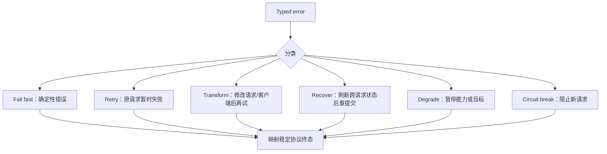
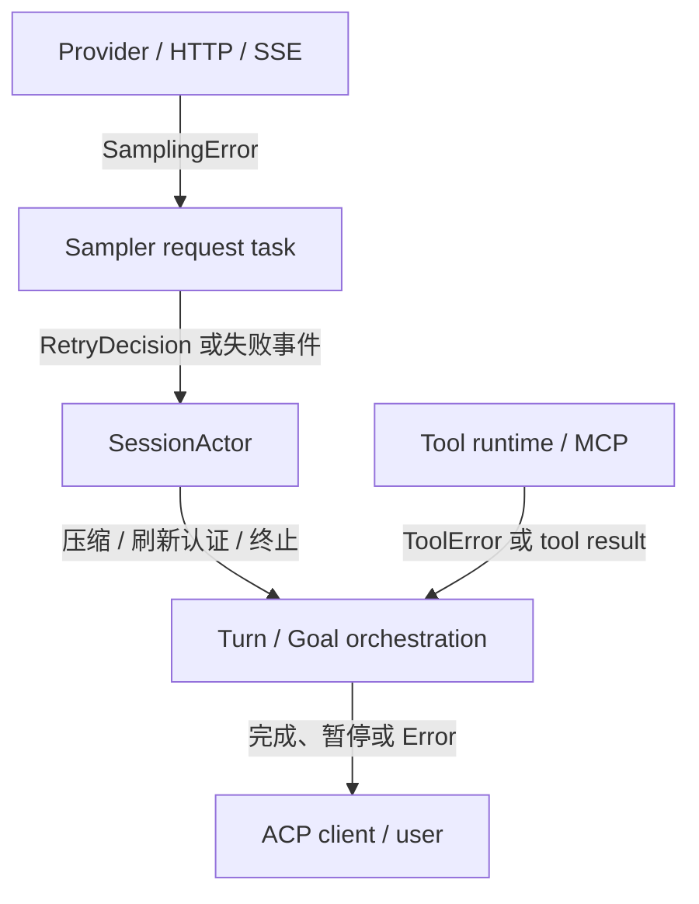
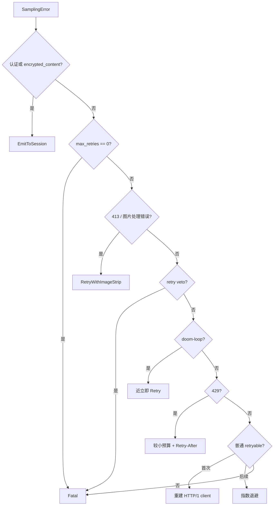
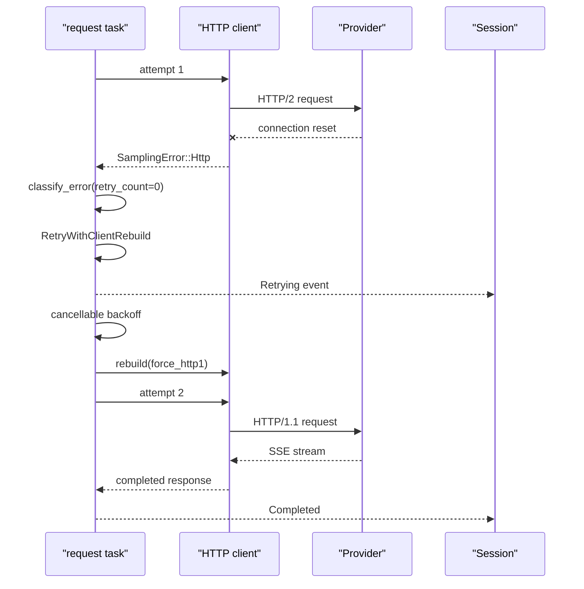
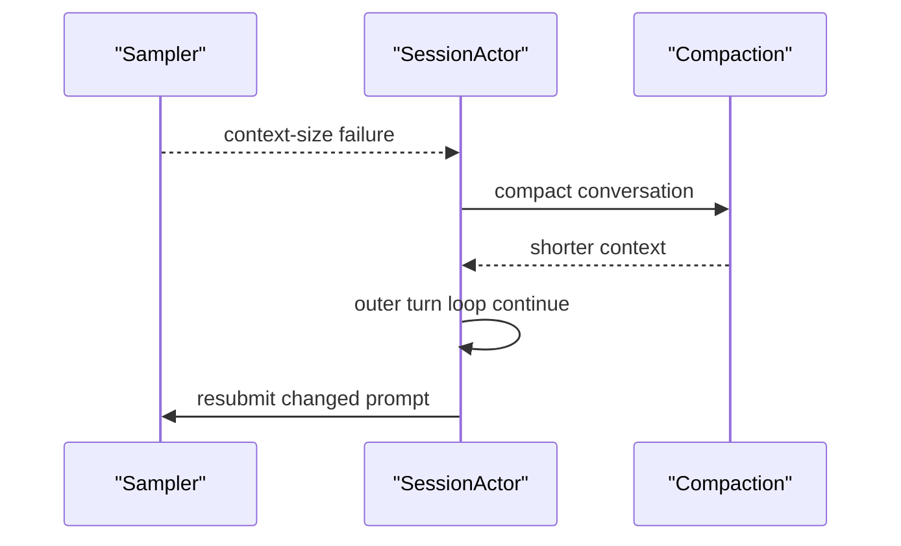
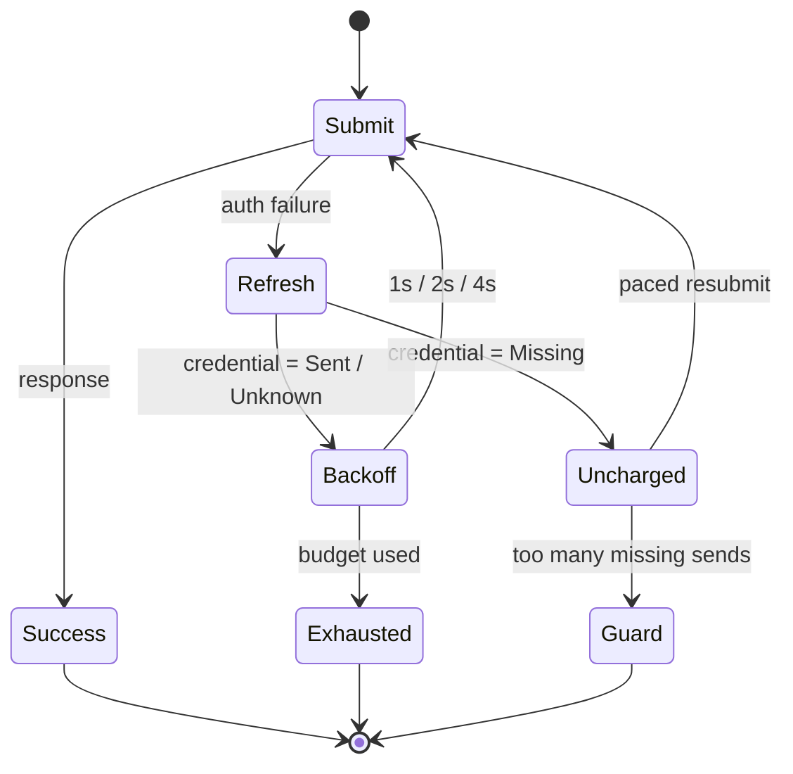
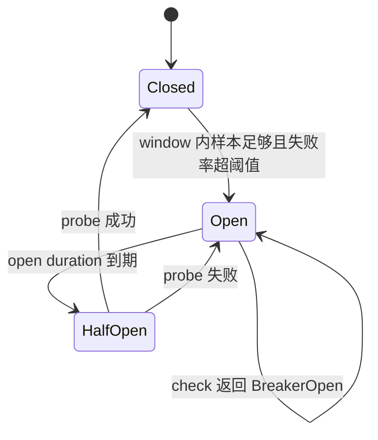

# 错误分类、重试、降级与恢复状态机：Typed Error、Backoff、认证恢复、熔断和终态映射

错误处理最容易被误读成一句话：“失败了就重试几次”。在 Grok Build 中，真正重要的问题不是“能不能再调一次”，而是：**错误发生在哪一层、谁掌握恢复所需的信息、下一次尝试改变了什么、预算由谁拥有，以及最终如何向用户和协议客户端解释失败**。

本篇沿模型采样、Session、工具、MCP、文件存储和 ACP 边界，建立一套统一的错误阅读方法。建议先读 [模型请求与 Provider 子系统](12-model-provider-request-streaming-retry-and-recovery.md)、[Token 计量与自动压缩](13-token-accounting-context-window-and-compaction-policy.md) 和 [并发、取消与 Shutdown](15-concurrency-actors-channels-cancellation-and-shutdown.md)。

---

## 1. 先记住这些结论

1. `SamplingError` 是模型采样域的内部 typed error，不是直接展示给用户的字符串。
2. `RetryDecision` 把“错误分类”和“执行副作用”拆开：`classify_error` 只决定，request task 才 sleep、重建客户端或改写请求。
3. 401 不是普通网络重试。Sampler 把它交给 Session，由 Session 判断是否允许刷新认证并重新提交。
4. 403 明确不是 401：它通常表示已经认证但没有权限，不能用反复登录掩盖。
5. `SentCredential::Missing` 表示失败请求根本没带凭据；它不能证明某个凭据被服务端拒绝，因此不消耗“凭据被拒”预算。
6. 429、5xx、传输断开、空响应、idle timeout 看起来都像“暂时失败”，但源码策略并不相同；尤其 `IdleTimeout` 明确不重试。
7. `x-should-retry: false` 是 veto；`true` 并不会强迫客户端重试一个本来不可重试的状态。
8. 图片剥离、HTTP/1 客户端重建、上下文压缩和认证刷新都不是“原样重放”，而是**改变失败条件后的恢复**。
9. Doom-loop 重采样有自己的预算和近乎立即的 jitter；它不应吞掉普通传输重试预算。
10. 一旦模型已经输出内容，再完整重放请求可能产生重复或相互矛盾的流式内容，因此存在 `retry_only_before_output` 保护。
11. 重试等待必须可取消；否则用户取消后，任务仍可能在 backoff 到期时复活。
12. Tool error 和 sampling error 属于不同错误域。工具错误经常作为 tool result 返回模型，让模型在下一轮改变策略，而不是让整轮立即失败。
13. 通用工具 backoff helper 会对调用者交给它的每一个错误重试，因此“哪些错误安全可重试”是调用者的责任。
14. MCP 只对很窄的传输关闭/发送失败做恢复；确定性的 JSON-RPC 参数和方法错误不会靠重连修好。
15. Circuit breaker 不是 retry。retry 处理一次调用的后续尝试；breaker 根据一段时间内的失败率，暂时阻止新的 wire I/O。
16. Breaker 的 `HalfOpen` 不是“恢复完成”，而是只放少量探针请求验证依赖是否恢复。
17. 当前可确认的生产集成之一是 storage client；不要仅因为存在通用 breaker crate，就假定所有模型请求都经过熔断器。
18. `map_sampling_err_to_acp` 是一次语义投影：把丰富的内部错误映射成稳定的协议 code、message 和 data；这个过程有意丢失部分内部细节。
19. Context overflow 的恢复由 Session 触发 compaction 后重提交，不能在 HTTP retry 层原样重发。
20. 连续基础设施错误可能让 active goal 自动暂停。这是降级：保留可恢复状态，把控制权交回用户，而不是无限重试。
21. 多层 retry 的真实最坏尝试次数可能是乘法，而不是加法。设计时必须明确唯一 owner 或计算嵌套预算。
22. 判断能否重试，必须同时回答幂等性、请求体可重放性、是否已有可见副作用、取消是否传播四个问题。

---

## 2. 不要只有“成功/失败”两个抽屉

### 2.1 一条失败至少有五个维度

阅读任意错误路径时，可以用下面五元组记录：

```text
Failure = {
  origin:     错误由谁产生，
  semantics:  失败意味着什么，
  owner:      谁拥有恢复所需状态，
  action:     下一步做什么，
  terminal:   最终如何对外呈现
}
```

例如模型 API 返回 401：

```text
origin    = 模型服务 / HTTP 边界
semantics = 凭据缺失、过期或被拒
owner     = Session 认证管理，而不是低层 HTTP client
action    = 刷新认证，受预算约束地重新提交
terminal  = ACP auth_required，或刷新失败的稳定错误
```

而模型 API 返回 503：

```text
origin    = 上游服务
semantics = 暂时不可用
owner     = sampler request task
action    = cancellable backoff 后重试
terminal  = overloaded/internal ACP error
```

两者都表现为一次 `Err`，但 owner 和 action 完全不同。

### 2.2 动作阶梯

可以把错误处理动作从“最局部”到“最外层”排列如下：



这些动作的含义不同：

| 动作 | 下一次是否相同 | 典型例子 | 适合的 owner |
| --- | --- | --- | --- |
| fail fast | 不再尝试 | 序列化失败、无效参数 | 最早能确定错误的层 |
| retry | 基本相同，只等待环境恢复 | 503、连接重置 | request task |
| transform | 请求或 transport 条件改变 | 去掉图片、强制 HTTP/1 | sampler |
| recover | 跨请求状态改变 | 刷新 token、压缩上下文 | Session |
| degrade | 功能进入受限但可解释状态 | goal 暂停 | orchestration 层 |
| circuit break | 暂时拒绝新 wire call | storage 依赖持续 401 | 共享依赖边界 |

### 2.3 一个实用判断式

重试只有在下面命题成立时才有意义：

```text
下一次成功概率提高
AND 重放是安全的
AND 尚有明确预算
AND 等待可以取消
```

如果请求和环境都没有变化，确定性错误的下一次成功概率仍接近零。对这类错误做指数退避，只是把快速失败变成慢速失败。

---

## 3. 分层所有权：谁有资格决定恢复

Grok Build 的错误恢复不是一个全局函数，而是多层合作：



每层能看到的信息不同：

- Provider 层知道 HTTP status、response headers、SSE 事件和原始错误。
- Sampler 知道是否已经重试、请求中是否还有图片、是否已产生输出、客户端能否重建。
- Session 知道认证来源、BYOK 边界、上下文是否可压缩、会话历史如何重放。
- Tool runtime 知道工具错误类别，但不一定知道业务操作是否幂等。
- Turn/Goal 层知道完成条件、自动恢复次数以及是否应暂停长期目标。
- ACP 边界知道客户端可依赖的标准 code/data，却不应泄露所有内部实现细节。

核心原则是：**把恢复交给最窄、但又掌握足够信息的 owner。**

太低的层会缺少上下文。例如 HTTP client 看到 401，却不知道 token 从哪里来；太高的层又会丢失原始分类，例如只剩一个字符串 `request failed`，无法判断 429、503 和序列化错误。

---

## 4. `SamplingError`：先保留语义，再决定动作

源码入口：

- `crates/codegen/xai-grok-sampling-types/src/error.rs`
- `SamplingError`
- `SentCredential`
- `EmptyResponseContext`

### 4.1 变体不是错误文案列表

`SamplingError` 的主要变体可以按来源重组：

| 类别 | 变体 | 关键信息 |
| --- | --- | --- |
| 认证 | `Auth` | message 和请求是否实际携带凭据 |
| 本地配置 | `InvalidConfiguration` | 客户端配置不成立 |
| transport | `Http` | `reqwest::Error` 的连接、timeout 等因果 |
| 本地解析 | `Serialization` | JSON 序列化/反序列化失败 |
| HTTP API | `Api` | status、message、model metadata、`Retry-After`、`x-should-retry` |
| SSE/stream | `EventStreamError`, `StreamError` | 流中断或服务端流错误 |
| 无进展 | `IdleTimeout`, `EmptyResponse` | 长时间无 chunk，或正常结束但没有可用输出 |
| 生成边界 | `MaxTokensTruncation` | 达到最大生成 token |
| 语义循环 | `DoomLoopDetected` | 重复模式触发器与中止位置 |

结构化字段让后续策略不必解析字符串。例如 `Api.retry_after_secs` 直接支持服务端指定等待时间；`EmptyResponseContext` 记录是否见过 reasoning、content 长度、tool call 数量、finish reason、usage 和 model，便于区分“真空响应”和“只有 reasoning”。

### 4.2 分类 helper 是领域政策

`SamplingError` 上的 helper 不是纯粹的 HTTP 常识，而是仓库当前的领域政策：

- `is_auth_error()`：`Auth` 或 HTTP 401；明确排除 403。
- `is_rate_limited()`：HTTP 429。
- `is_payload_too_large()`：HTTP 413。
- `is_likely_body_rejected()`：上传阶段 reset/broken pipe 等请求体可能被拒的信号；排除 connect 和 timeout。
- `is_encrypted_content_error()`：400 且消息指向 `encrypted_content`。
- `is_image_processing_error()`：400/500 且消息包含图片处理失败特征。
- `is_overloaded()`：529、带 overload 语义的 5xx，或特定 stream error type。
- `is_retry_vetoed()`：服务端明确 `x-should-retry: false`，或上下文长度溢出。

`is_retryable()` 当前将下面这些视为候选：

- retryable 的 `reqwest` transport error；
- 429、500、502、503、504、520、529；
- event stream 和 stream error；
- empty response；
- doom-loop。

而认证、配置、序列化、idle timeout、max-token truncation 不在普通 retry 集合中。

这里有一个容易凭直觉写错的点：**idle timeout 不重试**。源码注释给出的政策是，模型或网络路径已经卡住，原样重放很可能再次卡住。无论你是否同意这个产品选择，维护时都应先承认这是当前测试和实现表达的语义。

### 4.3 401 和 403 为什么必须分开

```text
401 Unauthorized       通常表示认证缺失/失效，可进入认证恢复
403 Forbidden          通常表示身份已知但无权访问，不应触发重新认证
```

如果把 403 当成 401：

1. 用户会被反复要求登录；
2. refresh token 会被无意义消耗；
3. 真正的权限、组织或资源策略问题被掩盖；
4. 外部 BYOK endpoint 可能收到不该发送的第一方凭据操作。

### 4.4 `SentCredential` 记录的是 wire provenance

`SentCredential` 有三个状态：

| 状态 | 意义 | 认证预算含义 |
| --- | --- | --- |
| `Sent` | 请求确实携带了凭据 | 401 可视为一次凭据被拒 |
| `Missing` | 请求没有 credential header | 不能归罪于某个凭据，不计拒绝预算 |
| `Unknown` | 合成/旧错误，来源不明 | 为避免无限循环，按较保守的 `Sent` 处理 |

它回答的不是“本地有没有 token”，而是“失败的那次 wire request 到底有没有发 token”。这一区分处理了一个现实竞态：本地 token 刷新期间，某次请求可能 fail closed 地不带 header 发出；它收到 401，不代表刷新后的 token 也无效。

反序列化遇到未来版本的未知字符串时，会降级到 `Unknown`，而不是让包含它的整个错误载荷解析失败。这是面向版本演进的 fail-closed 选择。

---

## 5. `RetryDecision`：纯分类和副作用执行分离

源码入口：

- `crates/codegen/xai-grok-sampler/src/retry.rs`
- `RetryDecision`
- `classify_error`
- `retry_backoff_with_jitter`
- `crates/codegen/xai-grok-sampler/src/request_task.rs`
- `apply_retry_decision`

### 5.1 六种决策

```rust
enum RetryDecision {
    Retry { backoff: Duration },
    RetryWithBackoff { backoff: Duration, is_rate_limited: bool },
    RetryWithImageStrip,
    RetryWithClientRebuild { backoff: Duration },
    EmitToSession(SamplingError),
    Fatal(SamplingError),
}
```

这个枚举同时表达两件事：

1. sampler 是否仍能本地处理；
2. 下一次尝试必须改变什么。

`classify_error` 是纯函数：不 sleep、不通知、不发网络请求。`apply_retry_decision` 才执行 backoff、客户端重建、图片剥离，并发出 `Retrying`、`Failed` 等事件。

这种分离的收益是：分类规则能用表驱动测试穷举，而不会让测试真实等待 30 秒或创建网络连接。

### 5.2 决策顺序本身就是政策

简化后的顺序如下：



顺序不能随意交换。例如 image strip 在 retry veto 之前检查，因为去掉图片会改变请求体；服务端针对原始请求给出的“不要原样重试”并不必然否定这个 transformed retry。

另一方面，`max_retries == 0` 较早返回 `Fatal`，代表显式关闭 retry 时连图片恢复也不执行。读策略不能只看注释列表，必须看 guard 的真实顺序。

### 5.3 `x-should-retry` 只做否决

服务端 header 的语义是：

```text
false -> 明确不要重试
true  -> 允许继续走客户端本地分类
缺失  -> 继续走客户端本地分类
```

`true` 不会把 400 或本地 serialization error 强行变成 retryable。这样可以防止一个过宽的服务端提示放大确定性失败。

### 5.4 429 的预算要单独读测试

普通最大 retry 默认值是 `DEFAULT_MAX_RETRIES = 15`。优先级为：

```text
GROK_MAX_RETRIES 环境变量
    > model config
    > DEFAULT_MAX_RETRIES
```

429 额外受 `RATE_LIMIT_RETRY_THRESHOLD = 2` 限制，避免在长时间 rate limit 上持续烧等待预算。

实现使用 `next_attempt >= effective_cap` 判断终止，因此“配置数字代表允许几次 retry，还是到第几个 attempt 停止”不能凭变量名猜。修改边界时应以 `retry.rs` 的单元测试为规范，并显式测试 0、1、2 和上限附近的值。

---

## 6. Backoff、jitter 和 `Retry-After`

### 6.1 默认曲线

普通 sampler backoff 的基线是：

```text
2s, 4s, 8s, 16s, 30s, 30s, ...
```

每次加入约 ±20% jitter，30 秒封顶。15 的默认预算按源码注释约覆盖 6 分钟量级。

### 6.2 为什么需要 jitter

如果一批客户端同时收到 503，又都严格等待 2、4、8 秒，它们会在相同时间再次冲击服务，形成 thundering herd。jitter 把重试点摊开：

```text
无 jitter:  1000 个请求都在 t+2.000s 重来
有 jitter:  1000 个请求散布在约 t+1.6s ... t+2.4s
```

jitter 不提高单次成功率；它降低群体同步造成的二次过载。

### 6.3 `Retry-After` 是服务端反馈

`SamplingError::Api` 保存解析后的 `retry_after_secs`。分类器优先使用它，否则才计算本地 backoff。这样服务端可以告诉客户端真实恢复窗口。

但尊重 `Retry-After` 不等于放弃本地预算：等待多久和总共允许几次，是两个独立维度。

### 6.4 等待必须与取消竞争

`request_task.rs` 的 sleep 不是裸 `tokio::time::sleep(...).await`，而是让 cancellation token 和 timer 竞争。概念上是：

```rust
tokio::select! {
    biased;
    _ = cancellation.cancelled() => Cancelled,
    _ = tokio::time::sleep(backoff) => Retry,
}
```

`biased` 让两者同时 ready 时优先取消。更完整的取消传播见 [并发模型、Actor、Channel 与取消](15-concurrency-actors-channels-cancellation-and-shutdown.md)。

---

## 7. 一次 sampler 失败实际怎样流动

下面用首次 transport error 后恢复成功说明：



第一次普通 transport retry 会重建为 HTTP/1 client，意图是逃离可能已污染的 HTTP/2 connection pool。后续 retry 通常只 backoff。

`drive_l2` 还会保留首次较丰富的 raw error，避免 tee/stream 转发后只剩扁平化文案，导致分类丢失。错误链中的结构是策略输入，不只是 debug 装饰。

request task 的终态可概括为：

- `Completed`
- `Empty`
- `Failed`
- `Cancelled`
- `InitFailed`

取消不是一种“可重试网络错误”；它是调用方明确要求停止的控制信号。

---

## 8. Transformed retry：下一次必须真的不同

### 8.1 图片剥离

413 或特征明确的图片处理错误会产生 `RetryWithImageStrip`。request task 从请求中剥离 inline images 后再试。

这里的安全条件是：

```text
原请求 = 文本 + 图片
新请求 = 文本
```

如果已经没有图片可剥，继续走同一分支不会改变任何条件，于是升级成 `Fatal`。这体现一个通用规则：**fallback 必须验证自己确实改变了输入。**

对于请求体发送阶段 reset/broken pipe，代码还会识别“可能是 body 被拒”，从而主动尝试图片剥离；连接建立失败和 timeout 不被混为这种信号。

### 8.2 客户端重建

`RetryWithClientRebuild` 改变 transport 条件而不改变语义请求：

```text
同样的模型输入
+ 新 HTTP client
+ force HTTP/1.1
```

这比简单地在同一个坏连接池上重发更有机会恢复。

### 8.3 Doom-loop 重采样

Doom-loop 表示模型输出落入重复模式。它不是服务暂时不可用，因此等待 30 秒没有价值。代码使用 0–250ms 的小 jitter 快速重新采样，并由独立 recovery policy 控制 resample 预算。

把它和 transport retry 分开可以避免：连续的语义重采样耗尽网络故障预算，或反过来网络抖动耗尽 doom-loop 的修复机会。

### 8.4 Context compaction

上下文超限是确定性的：原样重发相同或更大的 prompt 仍会失败。因此 `is_retry_vetoed()` 阻止 sampler 原样重试，Session 的 `handle_sampling_failure` 才能选择压缩历史并返回 `CompactAndResubmit`。



压缩状态机详见 [Token 计量、Context Window 与自动压缩](13-token-accounting-context-window-and-compaction-policy.md)。

### 8.5 已经输出后为何危险

流式请求可能先给用户显示一段文本，随后连接断开。如果从头重放，第二次采样未必产生相同文本：

```text
第一次可见输出：先删除旧索引，然后…… [断开]
第二次可见输出：不要删除索引，应该……
```

这不仅重复，还可能互相矛盾。`retry_only_before_output` 允许在观察到输出后把 retry budget 设为零。它把“请求是否幂等”细化成“在当前可见副作用之后是否仍可安全重放”。

---

## 9. Session 认证恢复状态机

源码入口：

- `crates/codegen/xai-grok-shell/src/session/acp_session_impl/sampler_turn.rs`
- `handle_sampling_failure`
- `crates/codegen/xai-grok-shell/src/session/acp_session_impl/auth_retry.rs`
- `AuthRetrySchedule`
- `AuthRetryDecision`
- `crates/codegen/xai-grok-shell/src/session/acp_session_impl/turn.rs`

### 9.1 为什么 sampler 不自己 refresh

Sampler 知道发生 401，却不知道：

- 当前是 session-based auth 还是 BYOK；
- endpoint 是第一方还是第三方；
- 哪个 credential store/provider 有刷新能力；
- 同一个 turn 已经恢复了多少次；
- 本次失败是否真的带了凭据。

所以 `classify_error` 对 auth 返回 `EmitToSession`。Session 再执行 auth recovery gate，只有 session auth、合适的 BYOK 状态和第一方 endpoint 等条件允许时才刷新。这也是 credential isolation：不能因为外部 endpoint 返回 401，就把第一方 token 恢复逻辑带过去。

### 9.2 外层状态机

`run_turn_via_sampler` 可返回：

```text
Response
CompactAndResubmit
RefreshAuthAndResubmit { credential, store }
```

外层 conversation loop 收到 refresh 结果后咨询 `AuthRetrySchedule`：



### 9.3 四种 `AuthRetryDecision`

| 决策 | 触发 | 动作 |
| --- | --- | --- |
| `UnchargedResubmit` | 401 且 wire credential 为 `Missing` | 不消耗拒绝预算，带节奏重提交 |
| `Backoff` | `Sent` 或 `Unknown` 的恢复后 401 | 消耗 slot，等待后重提交 |
| `Exhausted` | 认证拒绝预算耗尽 | 终止并映射 auth error |
| `RunawayGuard` | missing-credential 重提交过多 | 防止另一类无限循环 |

credentialed rejection 的精确等待是 1s、2s、4s，最大三次。源码注释专门记录过一个易错配置：指数退避库的 exponent/factor 语义理解错误，曾可能算出 1 秒、1000 秒、约 11.57 天。这里提醒我们：backoff 不是“看起来指数增长就行”，测试必须固定精确序列。

### 9.4 `Missing` 不收费，但也不能无限免费

不消耗 rejection budget 是为了不把“未发送 token”误判为“token 无效”；但若 credential resolver 永远拿不到 token，无限免费重提交同样危险。

因此 missing 路径有双重保护：

- 最多 50 次 runaway guard；
- 等待 token refresh，或至少以固定下限 pacing，避免 busy loop。

这展示了两种不同预算：

```text
rejection budget 保护认证恢复不要反复打坏凭据
runaway budget   保护无凭据路径不要永远循环
```

### 9.5 suspend 后的时钟处理

机器休眠可能让 wall clock 和 monotonic clock 的推进差异很大。`AuthRetrySchedule` 用二者漂移超过 30 秒识别 suspend，并有限次数重置 schedule；成功响应会完整清零状态。

重置次数本身也封顶，防止环境时钟异常变成无限重试许可证。

### 9.6 工具调用的认证 retry

`call_with_auth_retry` 用于工具侧的 auth-shaped failure：

1. 先执行工具调用；
2. 若是 401 语义且有 `AuthManager`，刷新；
3. 仅重试一次；
4. 同批并发工具的 401 通过 `tokio::sync::OnceCell<bool>` 合并刷新。

`is_auth_tool_error` 优先读取结构化 401 status，仅为 legacy payload 保留字符串 fallback；403 同样被排除。

这不是 sampler 的 1/2/4 秒 schedule，而是另一个边界的小型恢复机制。它们解决不同请求，不应把预算混算成一个“全局 auth retries”。

---

## 10. 语义恢复：完成条件没有满足

`process_conversation_turn_with_recovery` 还处理一种不属于 transport 的失败：agent 配置要求调用某个 completion tool，但模型正常结束却没有调用它。

这时系统可以注入 `ConversationItem::auto_recovery(reminder)`，等待配置指定的指数 delay，再运行一轮。它还会发出 `AutoRecoveryStarted` 和 `AutoRecoveryExhausted` 事件。

```text
HTTP 成功
  ≠ stream 成功
  ≠ turn 语义完成
  ≠ agent 任务满足 completion requirement
```

这次重试改变了 prompt：添加 reminder，所以更准确地说是 semantic recovery。

`MaxTurnsReached` 和 `StationarityEnded` 是明确终态，不进入这套恢复。如果无视终态继续自动唤醒，系统可能把“安全边界”误当成普通失败。

---

## 11. Tool error：让模型看懂失败，不一定终止 turn

源码入口：

- `crates/common/xai-tool-runtime/src/error.rs`
- `ToolErrorKind`
- `ToolError`
- `ToolErrorWire`

### 11.1 错误种类

`ToolErrorKind` 包含：

```text
NotImplemented          InvalidArguments
NotFound                PermissionDenied
Unauthorized            Timeout
Cancelled               RateLimited
UsagePoolExhausted      UsageLimitReached
GlobalRateLimit         ConcurrencyLimit
ServiceUnavailable      NetworkError
Execution               BehaviorVersionUnsupported
RenderLimited           TerminalError
Custom
```

比一个 `anyhow!("tool failed")` 更有价值的地方，是这些 kind 能支持：

- UI 选择合适反馈；
- 模型判断是否换参数、换工具或停止；
- telemetry 聚合类别；
- wire bridge 保留稳定机器语义。

### 11.2 `ToolError` 的三个信息面

| 字段 | 面向谁 | 用途 |
| --- | --- | --- |
| `kind` | 机器 | 稳定分类 |
| `detail` | 模型/用户 | 可理解的失败描述 |
| `source` | 开发者 | causal chain，仅 debug，不序列化 |
| `details` | 机器/协议 | 附加结构化 metadata |

`source` 被 serde 跳过，避免把内部错误链、路径或依赖细节直接送上 wire。`From<ToolError> for ToolErrorWire` 负责协议转换；custom kind 的 subcode 会合并到 object details，并避免覆盖已有 `code`。

### 11.3 工具失败的恢复者经常是模型

一个工具返回 `InvalidArguments` 时，最有信息的恢复者可能不是 runtime retry loop，而是模型：模型看到 tool result 后修正参数，在下一轮重新调用。

```text
工具 runtime 原样 retry：同样的坏参数 -> 同样失败
模型语义恢复：读懂错误 -> 改参数 -> 新工具调用
```

因此“工具调用返回 error”不总等于“整个 conversation turn 返回 ACP error”。要追踪它是否被编码为 tool result、是否允许模型继续。

### 11.4 通用工具 backoff helper 的边界

`crates/codegen/xai-grok-tools/src/retry.rs` 提供 `execute_with_backoff`：默认配置的 `max_retries` 为 10、1 秒起步、30 秒封顶，并提供 `on_retry` callback。要特别注意，实现先把 `attempt` 加一，再用 `attempt >= max_retries` 终止，因此这个字段在该 helper 中实际限制的是 10 次总 attempt，而不是“首次之外再重试 10 次”。

它比 sampler retry 更通用，也更少政策：它会对调用者返回的每个 `Err` 重试，没有 sampler 那样丰富的 status 分类、jitter 或 cancellation token 参数。

所以调用者必须保证：

1. 传入的 operation 可安全重放；
2. 不可重试错误已在进入 helper 前被过滤；
3. 上层取消不会被长等待吞掉；
4. 操作没有产生一半完成的外部副作用。

一个 mutation tool 若“服务端已成功，但响应在途中丢失”，原样 retry 可能执行两次。除非有 idempotency key 或读后确认，不能仅凭 `NetworkError` 就自动重放。

---

## 12. MCP：只恢复确定会因重连改变的错误

源码入口：

- `crates/codegen/xai-grok-mcp/src/servers.rs`
- `is_retriable_transport_error`
- HTTP MCP 调用与重连路径

MCP 的 transport recovery 很保守：主要只把 `TransportClosed` 和 `TransportSend` 视为可通过重连修复。

下面这些确定性 JSON-RPC 错误不会重连重试：

- `-32700` parse error；
- `-32600` invalid request；
- `-32601` method not found；
- `-32602` invalid params。

取消、timeout 和 unexpected response 也有明确测试约束，不应被宽泛归为“连接问题”。认证拒绝进入专门的 re-auth 路径，而不是普通 reconnect。

判断逻辑可以概括为：

```text
transport 已关闭/发送失败
    -> 重建连接可能改变条件 -> 可恢复

method 不存在/参数无效
    -> 重建连接不改变请求语义 -> 立即返回
```

MCP server 自身 restart 的 backoff 同样要可取消，避免 session shutdown 后后台 server 又被定时器拉起。生命周期细节见 [MCP Server 生命周期、能力刷新与动态工具](07-mcp-server-lifecycle-and-dynamic-tools.md)。

---

## 13. Circuit breaker：保护依赖和调用方

源码入口：

- `crates/common/xai-circuit-breaker/src/breaker.rs`
- `CircuitBreaker`
- `crates/common/xai-circuit-breaker/src/state.rs`
- `BreakerState`
- `crates/common/xai-circuit-breaker/src/config.rs`
- `BreakerConfig`
- `crates/codegen/xai-file-utils/src/storage_client.rs`

### 13.1 三态模型



- `Closed`：正常放行并记录 outcome。
- `Open`：不进行 wire I/O，快速返回 `BreakerOpen { retry_after }`。
- `HalfOpen`：只允许有限 probe；用成功或失败判断是否恢复。

调用协议是：

```text
check()        请求发出前申请放行
record(...)   请求结束后反馈 outcome
```

如果只 `record` 不 `check`，breaker 无法阻止流量；如果只 `check` 不 `record`，它无法学习依赖健康度。

### 13.2 默认 preset

共享 crate 提供两类 preset：

| preset | window | min samples | 阈值 | open | half-open probes | 失败 code |
| --- | ---: | ---: | ---: | ---: | ---: | --- |
| server | 60s | 10 | 50% | 10s | 1 | 429, 500, 502, 503, 504 |
| client | 60s | 5 | 50% | 60s | 1 | 401 |

名称不能脱离调用位置理解。`client` preset 适合“某客户端凭据/状态连续失败”一类边界；`server` preset 关注服务端过载和不可用。

### 13.3 并发正确性

从 `Open` 到 `HalfOpen` 使用原子状态转换，确保并发调用不会都认为自己拿到了唯一 probe。`is_open` 还有原子镜像，供 hot path 快速查询。

另一个细节是 abandoned half-open lease：probe 可能在 `check()` 后被取消，永远没有机会 `record()`。实现允许超过 open duration 后回收 lease，避免 breaker 永久卡在没有探针额度的 `HalfOpen`。

这与 [并发模型、取消和有序关闭](15-concurrency-actors-channels-cancellation-and-shutdown.md) 中的任务所有权是同一问题：取消不能遗留不可回收的状态占用。

### 13.4 storage client 的真实集成

`StorageClient` 使用 `BreakerConfig::client()` 和名为 `storage_breaker` 的 tracing observer。

上传前先 `check()`：若 open，返回带 `retry_after` 的合成 503，不进行网络 I/O。重试循环每轮也重新检查 breaker，因此另一个并发请求把 breaker 打开后，本请求后续 retry 会停下。

关键不变量是：

```text
breaker open => no wire I/O
```

storage retry 默认配置为 500ms 起步、30s 上限、最多 5、multiplier 2、jitter 0.5，尊重 `Retry-After` 且对其设置 60 秒上限。

需要谨慎表述应用范围：仓库中存在通用 registry 和 policy，但这不证明所有 sampling/tool/MCP 请求都已接入 breaker。阅读实际生产行为必须从 `CircuitBreaker::new`、`check` 和 `record` 的调用点反向确认。

### 13.5 breaker 和 retry 如何组合

合理顺序通常是：

```text
breaker.check()
    -> 单次 wire attempt
    -> breaker.record(outcome)
    -> 若调用政策允许，再进入 backoff
    -> 下一轮重新 breaker.check()
```

不应在 breaker 已 open 后先 sleep 再盲发一次。也不应把 `BreakerOpen` 当普通 503 无限递归重试，否则快速失败保护被上层 retry 抵消。

---

## 14. ACP 终态映射：对外稳定、对内保真

源码入口：

- `crates/codegen/xai-grok-shell/src/sampling/error.rs`
- `map_sampling_err_to_acp`
- rate-limit 和 overloaded message helpers

`map_sampling_err_to_acp` 把内部 `SamplingError` 投影为 ACP `Error`：

| 内部错误 | ACP 结果 |
| --- | --- |
| overload / 529 / 相应 5xx | 简洁的模型暂时过载文案 |
| `Auth` / 401 | `auth_required` |
| invalid config / serialization / 400 / 413 | invalid params |
| 403 | internal error，并保留服务端权限消息；不触发 re-auth |
| 404 | resource not found |
| 429 | 自定义 `-32003` rate-limited code |
| 其他 API error | internal error，并在 structured data 中保留 status |
| `MaxTokensTruncation` | 带稳定 `error_kind`，供 turn 推导 MaxTokens stop reason |

映射还尽量保留 `http_status`、prompt usage 等结构化数据，并根据 OAuth、API key、team/free quota 生成更可操作的 rate-limit 文案。

### 14.1 为什么说映射是“有损”的

内部错误服务于恢复和诊断，字段丰富；ACP error 服务于跨进程兼容和 UI。客户端不需要知道 `reqwest` 的完整 source chain，却需要稳定地知道“认证”“限流”“参数错误”。

```text
内部：高保真、实现相关、可用于策略
协议：稳定、有限、可用于互操作
用户：简洁、可行动、避免泄密
```

三种受众不应共用同一条未经处理的 `Display` 字符串。

### 14.2 错误文案不是分类 API

代码应优先读取 error code、HTTP status、kind 和 structured data。字符串匹配只适合 legacy fallback。否则一处措辞优化就会破坏恢复逻辑。

同理，日志应保留内部 type 和 retry metadata，而 UI 应给用户下一步行动，例如“稍后重试”“重新登录”“开启新会话”，而不是完整堆栈。

---

## 15. 降级：目标暂停而不是无限失败

源码入口：

- `crates/codegen/xai-grok-shell/src/session/acp_session_impl/turn_end.rs`
- `is_infra_turn_error`
- `post_turn_goal_degradation_plan`

Turn 结束后，代码会识别基础设施类 ACP code，例如 rate limited、server/internal error。若当前有 active goal，持续基础设施错误可形成 degradation plan，把 goal 自动暂停，并提示用户之后通过 `/goal resume` 恢复。

这不是宣告任务逻辑失败，而是：

```text
外部基础设施目前不可靠
-> 保留目标状态
-> 停止自动消耗资源
-> 把明确的恢复入口交给用户
```

降级适合“继续自动运行的边际收益很低，但状态仍有价值”的情况。它与 fatal 的区别是可恢复状态仍被保存；与 retry 的区别是没有立即再次尝试。

---

## 16. 多层重试的乘法风险

假设：

- storage operation 内部最多 5 个 retry；
- tool wrapper 外面最多 10 个 retry；
- 模型看到错误后又重调工具 3 次。

最坏 wire attempts 不是 `5 + 10 + 3`，而可能接近：

```text
(1 + 5) × (1 + 10) × 3 = 198
```

具体数字取决于每层“max retries”是否包含首次 attempt，但乘法风险不变。

设计新恢复逻辑时应建立 budget table：

| 层 | owner | 计数单位 | 上限 | 是否改变请求 | 终止后交给谁 |
| --- | --- | --- | --- | --- | --- |
| transport | request task | wire retry | N | client/backoff | Session |
| auth | Session | credential rejection | 3 | token | ACP |
| semantic | turn | recovery turn | config | prompt reminder | user |
| breaker | shared dependency | time/window | duration | 是否放行 | caller |

最安全的策略通常是每种失败只有一个主要 retry owner，其他层只做有界、语义不同的恢复。

---

## 17. 幂等性与可重放性检查

### 17.1 四问

给任何新 retry 加代码前，回答：

1. 操作在服务端可能已经成功了吗？
2. 再执行一次会产生重复文件、重复消息、重复扣费或重复 mutation 吗？
3. request body 能重新构造吗，还是 one-shot stream？
4. 用户或模型是否已经看到第一次尝试的部分输出？

### 17.2 常见操作对比

| 操作 | 通常风险 | 需要的保护 |
| --- | --- | --- |
| 读取资源 | 较低 | snapshot/版本一致性 |
| 模型采样且尚无输出 | 中等 | token 成本和 retry budget |
| 模型采样且已有输出 | 高 | 禁止重放或显式续写协议 |
| 读取本地文件后上传 | 可重放 body，但服务端可能已保存 | idempotency key/结果查询 |
| one-shot byte stream 上传 | request body 可能不可重放 | buffer、重新打开 source 或不重试 |
| shell/tool mutation | 很高 | 幂等设计、事务或用户确认 |

“HTTP method 是 POST”并不能单独决定能否 retry；真正问题是操作语义和服务端去重能力。

---

## 18. 可观测性：记录一次恢复，而不是只记最终错误

一条有用的 retry event 至少应包含：

```text
operation / request id
error kind / HTTP status
owner layer
attempt 与 max budget
decision
backoff duration
Retry-After 来源
是否已有输出
是否改变请求
terminal outcome
```

需要关联而不是混淆的指标：

- attempts per operation；
- recovered vs exhausted；
- time spent in backoff；
- rate-limit 与 overload 分布；
- auth `Missing` vs `Sent`；
- breaker open/half-open/closed transition；
- user cancellation during backoff；
- transformed retry 的成功率，例如 image strip。

只统计最终 200 会隐藏依赖抖动；只统计每次 503 又会让一次最终成功被误判成多次用户失败。应同时保留 attempt-level 和 operation-level 视角。更多 trace 边界见 [日志、Telemetry、Tracing 与可观测性](14-logging-telemetry-tracing-and-observability.md)。

---

## 19. 常见误解

### 误解一：所有 5xx 都应该一直重试

服务端可能用 500 包装内容相关错误；`x-should-retry: false` 和图片特征分类正是为了避免无意义重放。预算也必须有上限。

### 误解二：`is_retryable()` 为 true 就一定 retry

它只是候选分类。当前 retry count、rate-limit cap、server veto、是否已有输出和上层策略都会改变最终决策。

### 误解三：认证失败由 HTTP client 刷 token 最方便

HTTP client 缺少 auth source、BYOK 和 endpoint trust 信息。低层自动刷新容易跨越凭据边界。

### 误解四：没有 credential 的 401 比带错 credential 更严重

二者证据相反。`Missing` 说明没有验证任何具体 token；它应重新等待凭据，但必须有 runaway guard。

### 误解五：timeout 都是暂时网络问题

仓库对不同 timeout 有不同政策。Sampling idle timeout、MCP timeout 和 transport connect timeout不能只凭名称归一处理。

### 误解六：breaker 会替代 retry

breaker 决定“现在要不要发新请求”，retry 决定“一次 operation 失败后是否再尝试”。两者组合但不互相替代。

### 误解七：错误 message 足够做逻辑判断

文案会变、会本地化、会包含上游噪声。优先使用 typed variant、kind、code、status 和 structured data。

### 误解八：只要设了 max retries 就不可能死循环

不同错误可能走不同预算；free resubmit、semantic recovery、outer tool loop 和 breaker probe 都可能叠加。每个回边都要找到它自己的单调递增量和终止条件。

---

## 20. 调试路线

### 20.1 用户报告“卡了很久”

1. 确认是在 sampling、tool、MCP 还是 storage 层等待。
2. 找 `Retrying` event 和 attempt/backoff。
3. 检查是否尊重了异常大的 `Retry-After`。
4. 检查 cancellation token 是否传到 sleep。
5. 检查是否发生嵌套 retry 乘法。
6. 检查 auth missing 路径是否在 pacing，而不是业务工作。

### 20.2 用户报告“登录后仍反复 401”

1. 读取 `SentCredential`：`Sent`、`Missing` 还是 `Unknown`。
2. 确认 endpoint 是否第一方，当前是否 BYOK。
3. 查看 auth recovery gate 是否允许 refresh。
4. 查看 rejection schedule 的 attempt 与 delay。
5. 检查并发工具调用是否通过 `OnceCell` 去重 refresh。
6. 区分 401 和 403；不要看到“permission”就统一 re-auth。

### 20.3 用户报告“回答重复了一半”

1. 确认 stream 失败前是否已经产生 visible output。
2. 检查 `retry_only_before_output` 是否启用并被正确 disarm。
3. 区分 UI replay buffer 重放和 provider request 重试。
4. 检查 attempt 事件是否被客户端当成两次独立回答拼接。

### 20.4 依赖恢复了但仍被 breaker 拒绝

1. 查看当前 `BreakerState` 和 `retry_after`。
2. 确认 open duration 是否到期。
3. 检查 half-open probe lease 是否被取消/遗弃。
4. 检查成功 probe 是否调用 `record(Success)`。
5. 确认上层没有把 `BreakerOpen` 再包装成无限 retry。

### 20.5 结构化分类在中途丢失

1. 从最原始错误处确认 status、headers 和 source chain。
2. 沿 channel/event/serde bridge 检查是否只保留了 `to_string()`。
3. 检查 serialization round-trip 后 variant 是否仍保持不可重试语义。
4. 检查 ACP mapping 的 `data` 是否保留客户端依赖的 `http_status` / `error_kind`。

---

## 21. 修改错误策略的检查清单

### 分类

- [ ] 新错误是 typed variant，还是只能靠字符串识别？
- [ ] 401 与 403、429 与 quota exhaustion 是否分开？
- [ ] server hint 是 veto 还是 force？
- [ ] serialization 后分类是否保持？

### 重试安全

- [ ] operation 是否幂等？
- [ ] request body 是否可重放？
- [ ] 是否已有流式输出或外部副作用？
- [ ] 下一次尝试改变了什么？
- [ ] 是否存在 idempotency key 或结果确认？

### 预算与时间

- [ ] max 的单位是 retries 还是 attempts？
- [ ] 0、1、边界值是否有测试？
- [ ] backoff 精确序列是否测试固定？
- [ ] 是否有 jitter、cap 和 `Retry-After` cap？
- [ ] 多层预算最坏是否相乘？
- [ ] suspend/clock jump 会怎样？

### 并发与取消

- [ ] sleep 能否被取消？
- [ ] 同批 auth refresh 是否去重？
- [ ] breaker probe lease 被取消后能否回收？
- [ ] shutdown 后 timer 会不会复活任务？

### 对外终态

- [ ] ACP code 是否稳定？
- [ ] structured data 是否保留必要语义？
- [ ] 用户文案是否可行动且不泄露内部细节？
- [ ] 日志是否仍保留完整内部 source chain？
- [ ] exhausted 后是 fatal、pause 还是允许显式 resume？

---

## 22. 推荐源码阅读顺序

第一轮只读纯分类：

1. `xai-grok-sampling-types/src/error.rs` 的 `SamplingError` 和 helper；
2. `xai-grok-sampler/src/retry.rs` 的 `RetryDecision`；
3. `classify_error` 及其边界测试。

第二轮追一次真实执行：

1. `xai-grok-sampler/src/request_task.rs`；
2. `apply_retry_decision`；
3. cancellable sleep；
4. output-observed 后的 retry policy；
5. attempt outcome 发回 Session。

第三轮追 Session recovery：

1. `sampler_turn.rs::handle_sampling_failure`；
2. `types.rs` 的 recovery outcome；
3. `turn.rs` 的 outer resubmit loop；
4. `auth_retry.rs`；
5. compaction 与 completion requirement recovery。

第四轮比较其他错误域：

1. `xai-tool-runtime/src/error.rs`；
2. `xai-grok-mcp/src/servers.rs` 的 retriable transport 分类；
3. `xai-circuit-breaker` 的 state/config/breaker；
4. `xai-file-utils/src/storage_client.rs` 的真实集成；
5. `xai-grok-shell/src/sampling/error.rs` 的 ACP mapping；
6. `turn_end.rs` 的 goal degradation。

---

## 23. 可以运行的验证

优先运行窄测试：

```sh
cargo test -p xai-grok-sampler retry::tests
cargo test -p xai-circuit-breaker
cargo test -p xai-tool-runtime wire_bridge
cargo test -p xai-grok-tools retry::tests
cargo test -p xai-file-utils breaker_
```

快速定位关键政策：

```sh
rg "enum SamplingError|fn is_retryable|fn is_retry_vetoed" \
  crates/codegen/xai-grok-sampling-types/src/error.rs

rg "enum RetryDecision|fn classify_error|retry_only_before_output" \
  crates/codegen/xai-grok-sampler/src

rg "AuthRetryDecision|CompactAndResubmit|RefreshAuthAndResubmit" \
  crates/codegen/xai-grok-shell/src/session

rg "enum BreakerState|fn check|fn record" \
  crates/common/xai-circuit-breaker/src
```

验证重点不是测试是否“全绿”这一句话，而是测试是否固定了：分类表、attempt 边界、精确 backoff、取消优先、错误 round-trip、breaker 并发 probe 和 no-wire-while-open 不变量。

---

## 24. 自测题

1. 为什么 401 应由 Session 恢复，而 503 可以由 sampler request task 重试？
2. `SentCredential::Missing` 为什么不消耗 rejection budget？为什么仍需要 runaway guard？
3. `x-should-retry: true` 为什么不应覆盖本地不可重试分类？
4. 图片剥离为什么是 transformed retry？没有图片时应该怎样？
5. 为什么 context overflow 在 sampler 层 fail fast，在 Session 层却可能恢复？
6. 已产生流式输出后重放模型请求有什么语义风险？
7. Doom-loop 和 transport retry 为什么需要独立预算？
8. `CircuitBreaker::check()` 和 `record()` 各自承担什么职责？
9. Half-open probe 被取消后，如果 lease 永远不回收会发生什么？
10. 为什么工具 `InvalidArguments` 更适合交给模型修参数，而不是 runtime 原样 retry？
11. MCP `method not found` 为什么不应通过 reconnect 重试？
12. 内部 typed error 映射到 ACP error 时，哪些信息应该保留，哪些不应暴露？
13. 三层 retry 分别允许 2、3、4 次尝试时，为什么不能简单认为最多 9 次？
14. goal 因基础设施错误暂停，为什么属于 degradation 而不是 fatal？
15. 如果给一个有副作用的工具新增 retry，你至少要验证哪四件事？

---

## 25. 本篇术语表

| 名词 | 白话解释 | 在本文中的具体含义 |
| --- | --- | --- |
| typed error | 用类型和字段表达失败，而不只是字符串 | `SamplingError`、`ToolErrorKind` 等可被程序可靠分类的错误 |
| taxonomy | 分类体系 | 按来源、语义、owner 和动作组织错误 |
| retry | 失败后再次尝试 | 通常指暂时性环境变化后重放基本相同的 operation |
| attempt | 一次实际尝试 | 首次调用和每一次 retry 都各算一个 attempt |
| retry budget | 允许重试的有限额度 | 防止暂时失败演变成无限循环和无限成本 |
| backoff | 重试前逐渐增加等待 | sampler 的普通曲线约为 2、4、8、16、30 秒封顶 |
| exponential backoff | 指数退避 | 每轮等待按倍数增加，直到 cap |
| jitter | 在等待时间上加入随机扰动 | 防止大量客户端在同一时刻同步重试 |
| cap | 上限 | backoff、次数或服务端等待时间的最大允许值 |
| `Retry-After` | 服务端建议客户端等待多久的 header | 优先于本地计算，但仍受本地总预算约束 |
| retry veto | 明确阻止重试的信号 | 如 `x-should-retry: false` 或 context overflow |
| fail fast | 确定无法本地恢复时立即失败 | 避免对确定性错误浪费时间和资源 |
| transformed retry | 修改条件后再次尝试 | 图片剥离、HTTP/1 client rebuild 等 |
| recovery | 改变跨请求状态后重新执行 | 认证刷新、上下文压缩、prompt reminder |
| degradation | 暂时降低或暂停能力 | 基础设施错误后暂停 active goal，保留 resume 入口 |
| fallback | 主路径失败后的替代方案 | 例如去掉图片继续文本请求；必须真的改变条件 |
| owner | 对某段状态和决策负责的组件 | sampler、Session、tool runtime、goal orchestration 等 |
| wire | 真正跨进程/网络发送的边界 | `SentCredential` 记录请求在线上是否携带 header |
| provenance | 数据或状态来自哪里 | 此处指失败请求所用 credential 的来源证据 |
| BYOK | Bring Your Own Key | 用户自带 provider key；认证恢复必须避免跨 endpoint 泄露 |
| idempotency | 同一操作执行多次仍等价于执行一次 | mutation 是否可安全 retry 的核心条件 |
| idempotency key | 服务端用来识别重复操作的唯一键 | 防止响应丢失后的 retry 重复创建副作用 |
| replayability | 请求能否被重新构造和发送 | one-shot stream 可能不可重放，本地文件可重新打开但仍要考虑服务端副作用 |
| partial output | 一次请求失败前已经产生的部分结果 | 模型流式文本已可见时，重放可能造成重复或矛盾 |
| doom-loop | 模型陷入重复生成模式 | 通过独立预算的快速重新采样尝试恢复 |
| idle timeout | 一段时间没有收到新的 stream chunk | 当前 sampling 政策将其视为不可普通重试 |
| rate limit | 服务端限制请求速率或配额 | 常见 HTTP 429，使用更小的 retry cap |
| overload | 服务暂时过载 | 529、部分 5xx 或 stream error type 映射为友好终态 |
| circuit breaker | 失败率过高时暂时阻止新调用 | 保护故障依赖和调用方，避免持续 wire I/O |
| Closed | breaker 正常放行状态 | 记录滑动窗口 outcome，达到阈值后 Open |
| Open | breaker 快速拒绝状态 | 返回 `BreakerOpen`，不做 wire I/O |
| HalfOpen | breaker 探测恢复状态 | 只允许有限 probe，成功关闭，失败重开 |
| probe | 用于验证依赖是否恢复的少量请求 | HalfOpen 时受严格并发限制 |
| lease | 临时占有一次 probe 资格 | 被取消的 probe lease 必须能超时回收 |
| sliding window | 只统计最近一段时间样本的窗口 | breaker 用它计算近期失败率 |
| thundering herd | 大量客户端同时重试形成新冲击 | jitter 用于打散时间点 |
| causal chain | 错误的底层原因链 | `ToolError.source` 供 debug，通常不直接序列化给用户 |
| semantic projection | 将一种错误模型映射为另一种稳定语义 | `SamplingError` 到 ACP code/message/data 的转换 |
| lossy mapping | 映射时有意丢弃部分细节 | 协议和用户界面不暴露内部完整错误链 |
| terminal outcome | 该 operation 不再自动继续的最终结果 | completed、failed、cancelled、paused 等 |
| runaway guard | 防止“免费恢复路径”无限循环的上限 | missing credential resubmit 最终仍会被截断 |
| pacing | 即使不收费也控制重试频率 | 防止 missing credential 路径 busy loop |
| suspend detection | 识别机器休眠造成的时钟跳变 | auth schedule 比较 wall/monotonic clock 并有限重置 |
| semantic recovery | HTTP 成功但任务语义未满足时重新引导 | completion requirement 未满足时注入 reminder |
| ACP | Agent Client Protocol | 向客户端输出稳定 error code、message 和 data 的协议边界 |
| MCP | Model Context Protocol | 外部 server/tool 的连接与调用边界，重连策略很保守 |

---

## 26. 源码证据索引

| 结论 | 主要源码 |
| --- | --- |
| sampling typed error 与 helper | `crates/codegen/xai-grok-sampling-types/src/error.rs` |
| 纯 retry 分类、预算和 jitter | `crates/codegen/xai-grok-sampler/src/retry.rs` |
| retry 决策执行、可取消等待、输出后保护 | `crates/codegen/xai-grok-sampler/src/request_task.rs` |
| Session failure recovery | `crates/codegen/xai-grok-shell/src/session/acp_session_impl/sampler_turn.rs` |
| 认证 schedule 和 wire credential 计费 | `crates/codegen/xai-grok-shell/src/session/acp_session_impl/auth_retry.rs` |
| outer resubmit 与 completion recovery | `crates/codegen/xai-grok-shell/src/session/acp_session_impl/turn.rs` |
| sampling error 到 ACP | `crates/codegen/xai-grok-shell/src/sampling/error.rs` |
| Tool error taxonomy 和 wire bridge | `crates/common/xai-tool-runtime/src/error.rs` |
| 通用工具 backoff helper | `crates/codegen/xai-grok-tools/src/retry.rs` |
| MCP retriable transport 分类 | `crates/codegen/xai-grok-mcp/src/servers.rs` |
| circuit breaker 三态实现 | `crates/common/xai-circuit-breaker/src/` |
| storage breaker 生产接入 | `crates/codegen/xai-file-utils/src/storage_client.rs` |
| goal infra degradation | `crates/codegen/xai-grok-shell/src/session/acp_session_impl/turn_end.rs` |

读完本篇后，应该能把一次错误描述成完整句子：**“哪一层产生了什么 typed error，谁根据哪些字段消耗哪份预算，下一次改变什么条件，取消怎样中止等待，耗尽后如何映射成稳定终态或可恢复降级。”** 如果只能说“这里会 retry”，说明还没有真正读懂错误状态机。
