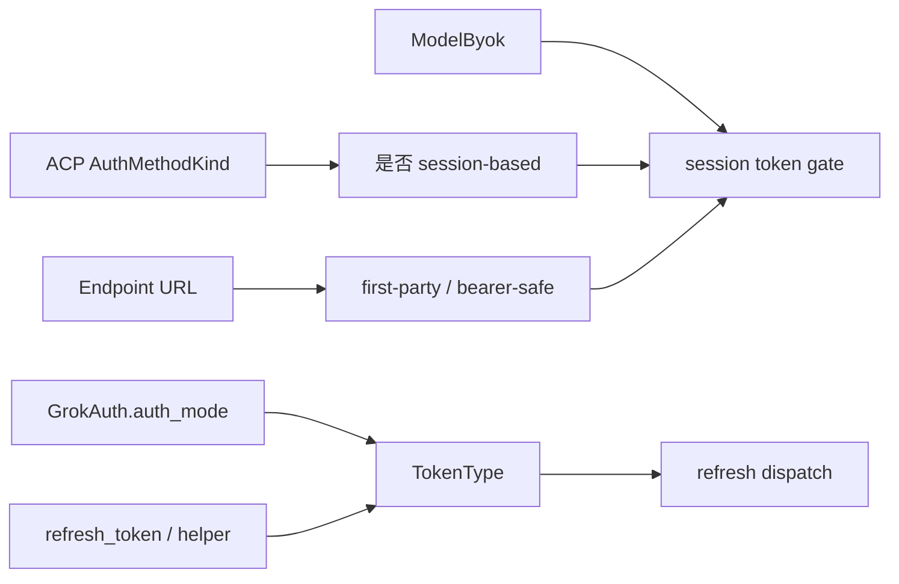
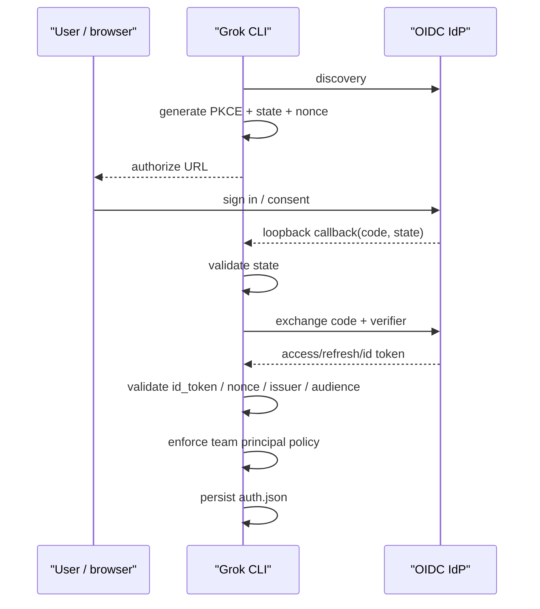
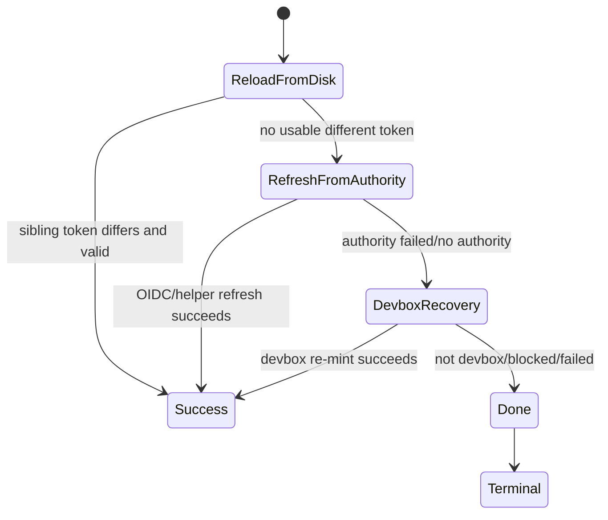

# 认证、凭据与 Endpoint 信任边界：OAuth、API Key、BYOK、刷新、隔离与失效恢复

认证系统表面上是在回答“请求头里放哪个 token”，实际上同时承担身份选择、交互式登录、凭据持久化、跨进程同步、过期刷新、401 恢复、endpoint 隔离、企业策略和隐私 gating。只追 `Authorization` header，会错过大部分真正重要的状态。

本篇从 `AuthMode`、`TokenType`、ACP auth method、`AuthManager`、OIDC、BYOK、model auth provider 和 endpoint trust gate 出发，建立一套可以用于读代码、定位 401 和安全审查的心智模型。错误重试的通用框架见 [错误分类、重试、降级与恢复状态机](16-error-taxonomy-retry-degradation-and-recovery-state-machines.md)，配置来源和覆盖关系见 [配置系统](../02-runtime-flows/10-configuration.md)。

---

## 1. 先记住这些结论

1. “用户选择了哪种 ACP auth method”“当前内存里是哪类 token”“这个模型是否 BYOK”“目标 URL 是否可信”是四个不同问题。
2. `AuthMode` 记录凭据来源；`TokenType` 根据当前凭据形态决定能否刷新；两者不能互换。
3. `AuthManager` 是 session credential 的内存与 `auth.json` 单一协调者，但不是所有凭据的全局仓库。
4. Per-model `[auth_provider.*]` token 只驻留内存并由外部 helper 管理，明确不写入 `auth.json`。
5. API key 没有 refresh authority。401 后应提示轮换或重新配置，而不是假装能 OAuth refresh。
6. OIDC session 只有携带 `refresh_token` 才归类为 `OidcSession`；缺少 refresh token 会退化为不可静默刷新的 `LegacySession`。
7. `current()` 使用提前失效窗口；`current_wire_valid()` 只拒绝真正 hard-expired 的 token。两者服务于不同目的。
8. 提前刷新失败时，只要 access token 仍在 hard expiry 之前，某些路径可以继续使用它作为 grace，而不是立刻发无凭据请求。
9. Refresh token 旋转要求进程内 async lock 和跨进程 file lock 同时参与；只做其中一种都不足以避免双花。
10. 跨进程竞争中，等待者应优先采用 sibling 已写入的新 token，而不是再次访问 IdP。
11. 401 recovery 的第一步也是重新读磁盘，因为桌面应用或另一个 CLI 进程可能已经刷新。
12. `invalid_grant` 代表 refresh token 已死亡，属于 sticky failure；普通网络错误和部分 client failure 可以在 TTL 后自愈。
13. 401 和 403 必须分开：401 可进入认证恢复，403 通常表示已认证但被策略拒绝。
14. `is_xai_auth()` 根据 auth mode 与 issuer 判断“第一方身份资格”；它不会改变请求 endpoint，也不是 token 签名验证的替代品。
15. 是否允许把 session bearer 附到 URL 上，应使用比“是否值得刷新”更严格的 HTTPS host gate。
16. `is_xai_api_url()` 可用于拒绝/分类；真正附加 bearer 应使用 `is_xai_api_bearer_url()`，后者强制 HTTPS 并拒绝 loopback。
17. BYOK 的核心不是“用了 API key”这么简单，而是模型携带自己的 `api_key`/`env_key`，其凭据所有权和恢复责任不属于 session auth。
18. `ModelByok::Unknown` 采用条件化 fail-safe：第一方 endpoint 保留 session refresh，第三方 endpoint 禁止，避免凭据泄露。
19. 外部 auth provider helper 启动时会清除第一方 credential 环境变量，防止 BYOK helper 继承 Grok 自己的 token。
20. Auth provider command 的 stdout、stderr、超时和进程组都有硬边界，避免一个 helper 卡住所有共享该 provider 的 turn。
21. 登录 policy 是 fail-closed：`preferred_method` 不可用时不悄悄降级到另一个方法；team pin 不允许 personal 或未知 principal 绕过。
22. 凭据日志只能记录 suffix、是否存在、年龄和来源，不应记录完整 bearer、refresh token 或认证 header。
23. Debug 401 时必须记录“实际发到 wire 的 credential”，不能在 401 返回后重新读取当前 token来猜，因为 token 可能已经轮换。
24. 认证系统的正确性不止是“能登录”，还包括休眠唤醒、磁盘短暂不可见、并发刷新、退出登录和旧格式迁移。

---

## 2. 四套分类不要混在一起

### 2.1 ACP auth method：用户/客户端选择了什么入口

`crates/codegen/xai-grok-shell/src/agent/auth_method.rs` 定义对 ACP 客户端展示的方法：

```text
xai.api_key   API key / per-model credentials
cached_token  auth.json 中已有 session
grok.com      xAI 交互式 OAuth 登录
oidc          企业 OIDC 登录
```

`AuthMethodKind` 将 method id 分类为：

```text
XaiApiKey | CachedToken | GrokCom | Oidc | Unknown
```

其中 `CachedToken`、`GrokCom`、`Oidc` 被视为 session-based，`XaiApiKey` 不是。

### 2.2 `AuthMode`：这份落盘凭据最初来自哪里

`crates/codegen/xai-grok-shell/src/auth/model.rs` 的 `AuthMode`：

| `AuthMode` | 来源 | 备注 |
| --- | --- | --- |
| `WebLogin` | 旧版网页登录 | deprecated，只为兼容旧 `auth.json` |
| `Oidc` | OIDC/OAuth2 登录 | 可能有 refresh token，也可能没有 |
| `External` | 外部 session auth command | 是否第一方取决于 issuer |
| `ApiKey` | 普通 API key | 无静默 refresh authority |

`AuthMode` 主要描述 provenance，不足以独立决定运行时动作。

### 2.3 `TokenType`：当前 credential shape 能做什么

`crates/codegen/xai-grok-shell/src/auth/token_type.rs` 将 live credential 归类：

| `TokenType` | 判定 | 可静默 refresh |
| --- | --- | --- |
| `OidcSession` | `Oidc` 且有 `refresh_token` | 是 |
| `LegacySession` | `WebLogin`，或无 refresh token 的 `Oidc` | 否 |
| `ExternalBinary` | `External` | 是，通过 helper |
| `ApiKey` | `ApiKey` | 否 |
| `None` | 没有凭据 | 否 |

因此：

```text
AuthMode::Oidc
    + refresh_token 存在  -> TokenType::OidcSession
    + refresh_token 缺失  -> TokenType::LegacySession
```

### 2.4 `ModelByok`：这个模型是否自带凭据

```text
Byok       模型明确有 api_key/env_key
NotByok    模型明确没有自己的 key
Unknown    配置未加载、解析失败或 memo 被清空
```

它是 per-model 事实，不等同于进程当前 auth method。一个进程可以以 OIDC session 登录，同时切换到带第三方 API key 的模型。

### 2.5 四者的关系



认证 bug 经常来自把其中一条边误当成另一条。例如从“当前 cache 暂时为空”推断“用户使用 API key”，会把仍然活跃的 OIDC session 降级成不可刷新模式。

---

## 3. `GrokAuth`：凭据之外还有身份和策略状态

`GrokAuth` 不只是 `key: String`。它还保存：

- `auth_mode` 与 `create_time`；
- `user_id`、email、姓名和头像信息；
- principal、team、organization 及角色；
- blocked reasons；
- data-retention opt-out；
- `refresh_token` 与 `expires_at`；
- `oidc_issuer` 与 `oidc_client_id`。

### 3.1 为什么身份 metadata 和 bearer 放在一起

很多下游决策依赖 credential owner：

- OTel resource 的 `user.id`、team、organization；
- managed MCP 是否可用；
- team ZDR 与数据收集 gate；
- relay、remote conversation、workspace 等第一方功能；
- `force_login_team_uuid` policy。

Refresh 后 `carry_user_profile_from` 会把旧 credential 的 `/user` enrichment 字段带到新 credential，避免刷新 access token 时把 profile 和 privacy metadata 清空。

### 3.2 `is_xai_auth()` 的准确含义

源码逻辑为：

```text
Oidc / External
AND issuer 是生产 xAI OAuth2 issuer 或本地开发 issuer
```

API key 即使配置了 issuer 字段，也不会被当成 `is_xai_auth()`；旧 `WebLogin` 有独立兼容规则。

源码注释明确指出：issuer 是 client-side hint，不是信任断言。真正权限仍由服务端验证 token；该 hint 不会改写 endpoint。

### 3.3 session auth 与 first-party auth 仍不相同

`is_session_auth()` 的矩阵为：

- `WebLogin`、`Oidc`：true，包括企业 issuer；
- `External`：只有 `is_xai_auth()` 才 true；
- `ApiKey`：false。

而 `is_managed_mcp_eligible()` 使用的是 `is_xai_auth()` 或 legacy `WebLogin`。不同功能 gate 的语义并不统一，不能随手复用“看起来差不多”的 predicate。

### 3.4 隐私 gate 默认更保守

新的或缺字段的 credential 默认 `coding_data_retention_opt_out = true`。`is_data_collection_disabled()` 在 team ZDR 或用户 opt-out 时为 true。

`AuthManager` 同时提供：

- `is_data_collection_disabled()`：没有 credential 时返回 false；
- `allows_data_collection()`：只有明确存在 credential 且未禁用时才返回 true。

需要 fail-closed 的出站数据路径应使用后者，避免 logout 后隐私状态未知却继续上传。

---

## 4. Auth method 广告、排序和 fail-closed pin

### 4.1 未 pin 时的展示顺序

当相应方法可用时，`build_auth_methods` 生成：

```text
1. xai.api_key
2. cached_token
3. oidc 或 grok.com（二选一）
```

顺序本身是 wire contract：旧 pager 会读取 `methods.first()` 决定启动 metadata。Per-model key 存在时，`xai.api_key` 仍必须出现在第一位。

但默认选中的 method id 另有优先级：

```text
cached_token > xai.api_key > None
```

这看似矛盾，其实服务不同兼容需求：展示顺序照顾客户端启动行为，default method 保持已有 session 的 refresh 能力。

### 4.2 `preferred_method`

`[auth] preferred_method` 可设：

```toml
[auth]
preferred_method = "api_key"
```

或：

```toml
[auth]
preferred_method = "oidc"
```

它不是普通 preference，而是 fail-closed pin：

- pin `api_key`：只广告 `xai.api_key`；无 key 就失败；
- pin `oidc`：只允许 cached session 与交互登录；不退回 API key；
- 未 pin：允许前述多方法选择。

### 4.3 API key kill switch

`disable_api_key_auth`、team pin 或环境 lockdown 都可以禁用 API key auth。Team pin 隐式禁用 API key，是因为 bare key 无法在客户端验证所需 team membership。

环境 lockdown 会与配置结果做 OR，避免低信任用户配置将管理员强制的禁用改回 false。可信配置分层见 [配置系统](../02-runtime-flows/10-configuration.md)。

### 4.4 team pin

`force_login_team_uuid` 可以是单个 team 或列表；空列表明确 fail closed。登录和后续 credential dispense 都会检查 principal：

```text
登录前/后 token principal 不匹配
-> 不持久化或清理现有 scope
-> 返回 PinnedTeamMismatch
-> 要求用允许的 team 重新登录
```

客户端会 peek 未验证 JWT claim 做 fail-fast UX 和 defense-in-depth；服务端仍是签名验证和授权的真正安全边界。

---

## 5. 交互登录：OAuth/OIDC 不是“打开浏览器拿字符串”

源码入口：

- `crates/codegen/xai-grok-shell/src/auth/flow.rs`
- `crates/codegen/xai-grok-shell/src/auth/oidc/login.rs`
- `crates/codegen/xai-grok-shell/src/auth/oidc/protocol.rs`
- `crates/codegen/xai-grok-shell/src/auth/device_code.rs`

### 5.1 三种展示模式

`AuthUrlMode`：

| 模式 | 用户体验 |
| --- | --- |
| `Loopback` | 浏览器回调到本地 server，也可粘贴 code/URL |
| `Command` | 外部 auth provider 自己展示或打开交互 |
| `Device` | 显示 device code 和验证 URL |

旧客户端只理解 `external_provider` flag，因此 `Command` 还维护兼容 metadata。

### 5.2 登录 transport 的优先级

对 xAI OAuth 登录，device/loopback 的选择顺序为：

```text
CLI --oauth / --device-auth
> GROK_LOGIN_DEVICE_FLOW
> [auth] login_device_flow
> remote feature flag
> 默认 loopback
```

Remote flag 获取有整体超时；不能让登录因 remote settings 或 agent id 获取卡死。企业 OIDC 固定走 loopback。

### 5.3 Loopback 流程

概念时序：



主要防护包括：

- PKCE S256，code verifier 不直接出现在 authorize URL；
- `state` 防 callback/CSRF 混淆；
- `nonce` 与 id token 对应；
- 校验允许的签名算法、discovery 支持列表、JWKS、issuer、audience；
- callback 等待上限 10 分钟；
- accounts app CORS origin allowlist。

用户手工粘贴可以是完整 callback URL 或 bare code。完整 URL 会读取 state；bare code 的后续处理必须遵循源码的兼容逻辑，不能把粘贴输入直接当 bearer。

### 5.4 Discovery cache

OIDC discovery document 以 issuer 为 key 做约一小时 cache。它不包含用户身份，因此可以跨 `AuthManager` 共享。这样一次 discovery endpoint 短暂故障不会让每次 refresh 都失败。

### 5.5 Device flow

Device flow 适合无可用 loopback/browser handoff 的环境。它将用户交互放在另一设备/浏览器上，由 CLI 轮询授权结果。不要把它和 external command 混为一谈：二者 wire mode、UI 和 credential authority 不同。

---

## 6. `auth.json`：按 scope 存储，而不是单 token 文件

源码入口：

- `crates/codegen/xai-grok-shell/src/auth/storage.rs`
- `AuthStore = BTreeMap<String, GrokAuth>`
- `crates/codegen/xai-grok-shell/src/auth/manager.rs`

### 6.1 Scope key

OIDC scope key通常由：

```text
issuer::client_id
```

组成；plain API key 使用 `xai::api_key`；旧网页登录 scope 仍有迁移兼容。

这意味着 logout/remove scope 不一定删除整个文件：

- 删除一个 scope，保留其他 scope；
- 最后一个 scope 被删除时，删除 `auth.json`。

### 6.2 加载优先级

`AuthManager::new` 先确定 auth path：

```text
GROK_AUTH_PATH
> $GROK_HOME/auth.json
```

若 `GROK_AUTH` 是可解析的 inline `GrokAuth` JSON，则作为最高优先级初始凭据；否则回退到文件。

读取文件后只选择当前 config scope。旧 `WebLogin` entry 在特定兼容条件下会被 best-effort 清理。

### 6.3 磁盘状态不是一个 `Option`

`DiskAuthState` 区分：

| 状态 | 含义 | 对内存的影响 |
| --- | --- | --- |
| `Ok` | 文件可读且 scope 存在 | 采用 entry |
| `EntryMissing` | 文件可读但当前 scope 不在 | 可确认 logout，清内存 |
| `FileMissing` | 文件不存在 | 可能是 wake-time FS anomaly |
| `Unreadable` | 损坏、权限或 I/O 问题 | 不能等价于 logout |

把后三种都写成 `None` 会造成危险：一次唤醒后的临时 ENOENT 可能让内存中唯一的 refresh token 永久丢失。

`force_reload_from_disk` 对 missing/unreadable 做短预算重读；若异常持续，但内存还有未被判死的 refresh token，则保留内存。只有可读文件明确缺少 scope，才是可信的 logout 信号。

### 6.4 写入安全

正常路径：

```text
secure temp file
-> pretty JSON streaming write
-> flush + fsync
-> rename publish
-> 再次收紧 owner-only permission
```

若磁盘满导致 atomic temp-copy 写法失败，会尝试原地 truncate/write，因为它需要更少额外空间。原地路径先保存旧 bytes，失败时 best-effort restore。

损坏的非空 JSON 在恢复写入前会备份为：

```text
auth.json.corrupt.<millis>
```

备份仍含 credential，因此同样必须是 owner-only。

### 6.5 为什么落盘在 enrichment 之前

Token rotation 成功后，新的 access/refresh token 必须先持久化，再做 `/user` 网络 enrichment。否则进程若在 enrichment 期间崩溃，IdP 已旋转 refresh token，但磁盘仍保留旧 token，可能迫使用户重新登录。

---

## 7. Token freshness：soft expiry、hard expiry 和 grace

### 7.1 两个失效时刻

若有 `expires_at`：

```text
soft expiry = expires_at - early invalidation
hard expiry = expires_at
```

默认 early invalidation 为 5 分钟。没有服务端 expiry 时，external token 可使用配置 TTL，最终 fallback 为创建时间加 30 天。

### 7.2 主要读取 API

| API | 返回什么 | 适用场景 |
| --- | --- | --- |
| `current()` | soft expiry 之前的 cached auth | 正常快速路径 |
| `current_wire_valid()` | hard expiry 之前的 auth | 真正决定能否上 wire |
| `current_or_expired()` | 任意内存 auth | identity、refresh token、隐私 metadata |
| `expired_auth()` | soft-expired entry | 从中取 refresh token |
| `auth().await` | 完整 dispatch 后的可用 auth | 可异步的请求前入口 |
| `get_valid_token().await` | `auth()` 的 key | 只需要 bearer 的调用方 |

### 7.3 为什么不能一进入 refresh window 就删除 header

Token 在最后 5 分钟仍可能被服务端接受。若 proactive refresh 遇到短暂网络故障，直接把它当“完全无效”会让请求不带 header 发出并得到 401。

因此部分路径在 refresh transient failure 时允许使用仍 hard-valid 的 access token。`WireValidBearerResolver` 也只通过 `current_wire_valid()` 供给 sampler。

### 7.4 grace 不是无限延寿

一旦 hard expired，或 refresh authority 明确返回 `RefreshTokenRejected`，旧 access token 不再被重新提供。Grace 只覆盖“刷新点已到但 wire 仍接受”的窗口。

---

## 8. `AuthManager`：内存、磁盘与刷新协调者

### 8.1 它拥有的核心状态

`AuthManager` 包含：

- `inner: RwLock<Option<GrokAuth>>`；
- auth path 与 scope；
- `TokenRefresher`；
- 进程内 `refresh_lock`；
- permanent failure verdict；
- refresh/wake notifications；
- disk-state observation；
- proactive refresh task guard；
- sleep/dark-wake gate；
- manual-auth telemetry debounce；
- process-static API key cache。

其 `Debug` 实现不展开字段，防止被其他 `Debug` 派生类型间接打印 credential。

### 8.2 锁顺序

源码规定：

```text
refresh_lock (async)
-> 短暂访问 inner/refresher/permanent_failure 等 sync lock
```

且不能持有 `parking_lot` guard 跨 `.await`。`with_inner_read/write` 的同步 closure 返回值在类型层提醒调用者不要 await。

### 8.3 Refresher 只能返回数据

`TokenRefresher::refresh` 返回 `RefreshOutcome`：

```text
Success(GrokAuth)
PermanentFailure { reason, tried_key, tried_refresh_token }
TransientFailure { message }
```

Refresher 通过只读 `AuthSnapshot` 获取状态，不能调用 `update()`、`clear()` 或递归 `refresh_chain()`。所有 credential mutation 集中到 `refresh_chain`。

这是一种 capability design：不是靠注释要求实现者“别修改”，而是不给它 mutation API。

---

## 9. Refresh chain：避免 refresh token 被并发双花

### 9.1 为什么比普通 cache refresh 难

OAuth provider 可能旋转 refresh token：一次成功交换使旧 RT 失效。两个进程同时使用同一 RT：

```text
Process A: RT0 -> AT1 + RT1
Process B: RT0 -> invalid_grant
```

更糟时 IdP 可能撤销整个 token family。因此必须保证某一时刻只有一个 participant 花费 RT0。

### 9.2 两级 single-flight

```mermaid
sequenceDiagram
    participant A as "Task A / Process 1"
    participant B as "Task B / Process 1"
    participant C as "Process 2"
    participant D as "auth.json lock"
    participant I as "IdP"

    A->>A: acquire process refresh_lock
    B->>A: wait refresh_lock
    A->>D: acquire cross-process file lock
    C->>D: wait file lock
    A->>I: spend refresh token
    I-->>A: new AT + RT
    A->>D: persist new auth.json
    A-->>B: release; B double-checks and adopts
    A-->>C: release file lock
    C->>C: read sibling-written token; do not refresh again
```

进程内 `tokio::Mutex` 合并同进程并发；`auth.json.lock` 合并多个 CLI/desktop 进程。

### 9.3 锁必须跨 IdP 调用存活

File lock guard 在 IdP exchange 和写回完成前不能释放。否则另一个进程会在新 RT 尚未发布时拿到旧磁盘状态并再次花费它。

系统休眠又引入 inode 问题：stale lock 可能被 sibling unlink/recreate。旧 holder 醒来时仍持有被删除 inode 上的 flock，却已经不拥有“live lock file”。所以不可逆操作前会用 `still_live()` 比较 inode/device，必要时重新获取。

### 9.4 采用 sibling token

获得锁后先重新读磁盘：若已经出现不同且有效的 credential，返回 `LockOutcome::Adopted`，不再访问 IdP。

这是分布式协调中的核心模式：

```text
等待锁
-> 重新检查共享状态
-> 条件已被 leader 满足则直接采用
-> 只有仍未满足时执行昂贵/不可逆操作
```

### 9.5 Refresh credential 的优先级

`resolve_refresh_credential`：

```text
磁盘上带 refresh_token 的 auth
> 内存 soft-expired auth
> current auth（仅 ServerRejected）
```

这一函数同时用于实际 refresh 和 permanent verdict key 计算，避免“尝试的是 credential A，缓存 failure 却绑定 credential B”。

---

## 10. Refresh outcome 与 permanent failure

### 10.1 错误轴必须封闭

`RefreshTokenError` 只有：

```text
Permanent
Transient
```

它故意不是 `non_exhaustive`：未来如果增加第三种 recoverability，所有 match consumer 应编译失败，迫使维护者明确政策。

### 10.2 Permanent 原因

| 原因 | 典型 OAuth code/场景 | sticky | 阻止无人值守恢复 |
| --- | --- | ---: | ---: |
| `RefreshTokenRejected` | `invalid_grant` | 是 | 是 |
| `ClientRejected` | `invalid_client` | 否 | 否 |
| `ProviderInteractiveRequired` | helper 在 headless refresh 无法完成 | 否 | 是 |
| `Other` | 重复 transient 升级 | 否 | 否 |

Sticky `invalid_grant` 不会随时间消失，因为 revoked RT 不会自愈；只有新 credential/login 才清除。其他 verdict 约 5 分钟后可重新尝试，并用 monotonic + wall clock 判断，确保跨 suspend 也会过期。

### 10.3 为什么 permanent verdict 要 scope 到 key

一个进程对旧 credential 记录失败后，sibling 可能已经完成登录或 rotation。如果 failure 是全局 bool，新 token 也会被旧 verdict 永久挡住。

当前设计将 verdict 绑定 attempted credential key：

```text
same key -> short-circuit
different key -> verdict 不适用，允许恢复
```

`RefreshOutcome::PermanentFailure` 还携带实际花费的 refresh token，用来区分：

- 本进程的 RT 确实被 IdP 拒绝；
- sibling 已经旋转 RT，本进程拿旧 RT 失败。

后者不能删除 sibling 刚写入的新 credential。

### 10.4 OIDC refresh 的内部 retry

`refresh_tokens` 最多三次 attempt（首次加两次 retry），使用 200ms–2s jittered exponential backoff。

`invalid_grant`、`invalid_client` 等已识别 terminal code 不重试；5xx、429、裸 4xx 或未知/RFC transient code 可重试。每次 HTTP POST 自带 15 秒 timeout。

若重试跨越 suspend grace，会抑制后续 retry，避免机器唤醒后继续一个已经失去时序可信度的 token exchange。

---

## 11. Proactive refresh、sleep 和 wake

### 11.1 Proactive task

`start_proactive_refresh` 是 idempotent：同一 `Arc<AuthManager>` 第二次调用不会再 spawn。任务在 expiry 前调度，接收 cancellation token。

循环必须避免这些 busy-loop 条件：

- permanent failure；
- token type 不可刷新；
- refresher 尚未配置；
- system sleep imminent；
- dark wake 且仍有 wire-valid token；
- 没有可计算 expiry；
- 连续 refresh failure。

失败次数驱动额外 backoff；成功、采用 sibling token 或 OS wake 会重置相应 ladder。

### 11.2 为什么 wake 有独立 notification

Monotonic sleep 在系统 suspend 期间可能暂停。若机器睡了数小时，原计划的“还有 5 分钟刷新”可能在醒来后仍等待 5 分钟。`wake_notify` 让 loop 立即重新计算。

### 11.3 Sleep-imminent gate

刷新 RT 是不可安全中断的操作。系统即将睡眠时：

- 新 refresh 可以被暂缓；
- power callback 等待已在 flight 的 refresh drain；
- dark wake 时可 best-effort hold awake，避免 exchange 成功而写盘前再次睡眠。

这里保护的不是普通请求成功率，而是 refresh token family 的一致性。

---

## 12. 401 recovery：Reload、Refresh、Devbox、Done

源码入口：

- `crates/codegen/xai-grok-shell/src/auth/recovery.rs`
- `UnauthorizedRecovery`
- `RecoveryStep`

状态机：



### 12.1 ReloadFromDisk

只接受：

```text
未过期
AND 与 server rejected token 不同
```

相同 token 不能伪装成 recovery success，否则 caller 会立即重发同一个坏 bearer。

### 12.2 RefreshFromAuthority

- `OidcSession` / `ExternalBinary`：走 refresh chain；
- `LegacySession` / `ApiKey`：返回 `ServerRejectedNoRecovery`；
- `None`：`NotLoggedIn`。

401 后存在 120 秒对称 fresh-mint guard：若当前 token 刚刚 mint，401 可能来自旧 in-flight request 或服务端 validation lag。立即再次旋转 RT 不能解决问题，反而增加 rotation 风险。

### 12.3 DevboxRecovery

仅在 devbox 且 policy 未 pin `api_key` 时：清理旧 auth、重新 mint OIDC credential、先保存，再异步 enrichment。

### 12.4 `try_recover_unauthorized`

对 transient refresh failure 最多尝试两次，起始 backoff 500ms；永久失败、NotLoggedIn 等立即停止。成功只表示 credential recovery 完成，原始 API request 仍由 caller 重新提交。

### 12.5 Manual-auth telemetry

Turn 和 Relay 来源会产生用户相关 manual-auth KPI；Background recovery 不会。事件按 rejected credential debounce，同一 dead token 的并发 401 只记录一次。

API key 401 不计入要求 `/login` 的 session KPI，因为合理动作可能是轮换 key，而非网页登录。

---

## 13. Endpoint trust：分类 URL 和附加 bearer 是不同门槛

源码入口：

- `crates/codegen/xai-grok-shell-base/src/util/mod.rs`
- `is_xai_api_url`
- `is_xai_api_bearer_url`

### 13.1 `is_xai_api_url`

用于识别 xAI-operated endpoint、拒绝不允许的 API key、决定 refresh fallback 等。它能安全抵御 suffix attack：

```text
api.x.ai                  true
x.ai                      true
api.x.ai.evil.example     false
evil-x.ai.attacker.com    false
```

该 predicate 是 scheme-agnostic，适合 fail-closed refusal：即使 URL 使用 HTTP，也不应因为 scheme 不安全就把它误认成第三方，从而绕过第一方 policy。

### 13.2 `is_xai_api_bearer_url`

真正决定“可否附加 session bearer”时更严格：

```text
host 必须是认可的第一方
AND scheme 必须 HTTPS
AND 不能是 localhost / loopback
```

即使 loopback 和当前进程在同一机器，也可能有其他本地进程监听端口，因此不能把 session token 发到明文 localhost。

### 13.3 两个 predicate 的组合原则

```text
拒绝 credential / 执行第一方 policy -> is_xai_api_url
真正 attach credential             -> is_xai_api_bearer_url
```

如果附加 bearer 时使用较宽 predicate，会泄露 token；如果拒绝 policy 时使用较窄 predicate，HTTP 第一方 URL 又可能被错误当 BYOK 绕过限制。

---

## 14. Session token gate：方法、BYOK、endpoint 三维真值表

核心函数：

```rust
session_token_auth_gate(
    is_session_based_method,
    model_byok,
    endpoint_is_first_party,
)
```

真值表：

| session method | `ModelByok` | endpoint | refresh/session token active |
| --- | --- | --- | ---: |
| false | 任意 | 任意 | false |
| true | `Byok` | 任意 | false |
| true | `NotByok` | 正常 session route | true |
| true | `Unknown` | first-party | true |
| true | `Unknown` | non-first-party | false |

### 14.1 为什么 `Unknown` 不直接 false

历史问题是：配置暂时不可解析或 cache 为空时，live OIDC session 被误判成 API-key mode；旧 buffered token 每 turn 被重发，直到进程重启。

但 `Unknown` 也不能无条件 true，因为模型可能实际是第三方 BYOK。当前策略利用 endpoint 补充证据：

```text
Unknown + first-party     保持 session refresh
Unknown + third-party     withholding，宁可表面 401，也不泄露 session token
```

### 14.2 Refresh gate 不等于 attach gate

`SessionTokenAuthGate` 的 first-party 判定使用 `is_xai_api_url()`，用于“未知时是否仍按 session 恢复”。Sampler 的 live bearer resolver 还应通过更严格的 wire-valid/endpoint配置路径接入。

审查新调用点时，不要因为 recovery gate active 就推断任意 `RequestBuilder` 可以附加 bearer。Credential attachment 需要独立确认目标 URL。

### 14.3 Sampler config 重建

`reconstruct_full_config`：

1. 从 chat state 读取 sampling config 和 credentials；
2. 计算 model auth facts；
3. 结合 auth method、BYOK 和 base URL 计算 gate；
4. session 路径先尝试 `AuthManager::auth()`；
5. 取 `current_wire_valid()`；
6. 安装 `WireValidBearerResolver`，让每个请求实时解析 bearer；
7. BYOK 路径使用 model credential，不接 session resolver。

Live resolver 避免 client 构造时冻结旧 token。每次 `post()` 都应让更新后的 credential覆盖默认 header，并记录真正 stamped 的 fragment。

---

## 15. BYOK 与 model auth provider

### 15.1 普通 per-model key

模型 entry 可通过 `api_key` 或 `env_key` 自带凭据。它的特点：

- 属于特定 model/provider；
- 常发给第三方 endpoint；
- 不由 session `AuthManager` 刷新；
- 401 通常要求用户更新 key；
- 不能解锁第一方 session-only 功能。

### 15.2 `[auth_provider.<name>]`

模型也可引用 named auth provider：

```toml
[auth_provider.corp]
command = "credential-helper"
timeout_secs = 30

[model.example]
auth_provider = "corp"
```

Helper 输出 fresh bearer，模块负责：

- 内存 cache；
- expiry skew 前 re-mint；
- 401 后有界 re-mint；
- 共享 provider name 的 session single-flight；
- config edit 后 cache invalidation。

它和 `AuthCredentialProvider` trait 名字相似，但不是同一抽象：

```text
[auth_provider.*]      为某个模型运行 credential helper
AuthCredentialProvider 为 storage/telemetry 等 HTTP consumer 提供 snapshot + recovery
```

### 15.3 Trusted config re-attachment

`AuthProviderRef` 序列化时只保存 name 和 fail-closed 标记，不保存可执行 command。反序列化后的 ref 是 unresolved，必须从 trusted config layer `attach_trusted_config` 后才能 mint。

否则持久化数据或低信任输入可能把任意命令注入 credential path。

### 15.4 Provider slot

每个 resolved provider name 共享：

```text
Arc<tokio::Mutex<Option<MintedProviderToken>>>
```

锁跨 helper command 运行，合并并发 mint。Slot 数量由可信配置中的 provider name 限定，不是任意用户输入无限增长。

### 15.5 Cache stale 条件

Token 在以下情况 stale：

- command、args、TTL、cwd 等 token-shaping config 改变；
- 距 expiry 不足 60 秒；
- 401 re-mint 失败后被标记为立即过期。

仅修改 timeout 这类 execution knob 不必让 token identity 失效。源码通过完整 destructuring 让未来新增 config 字段时必须明确分类。

### 15.6 401 fresh-mint guard

Provider token 刚 mint 后 30 秒内收到 401，不立刻再次运行 helper。若 token 真坏，频繁执行 helper也可能弹交互、消耗外部刷新资源或产生循环；先把 401 暴露更安全。

### 15.7 Helper 进程隔离

安全边界包括：

- stdout 上限 1 MiB，超过即错误；
- stderr 只保留 64 KiB 用于失败诊断，其余 drain；
- 默认 timeout 30 秒，配置 clamp 到 1–600 秒；
- stdout/stderr 并发读取，避免 pipe deadlock；
- timeout 时杀整个 process group，而不只 shell child；
- 清除第一方 credential env vars；
- malformed JSON、空 access token、非 UTF-8、control character 都 fail closed。

若 helper 输出 JSON，可以带：

```json
{
  "access_token": "...",
  "refresh_token": "...",
  "expires_in": 3600,
  "issuer": "..."
}
```

Bare token 也支持，但无法表达 refresh token 和结构化 expiry。

### 15.8 Handback protocol

再次运行 helper 时，上一份 access/refresh token 和 expiry 通过专用 `GROK_AUTH_PROVIDER_*` 环境变量交回，让 helper 自己决定 refresh。这个 refresh token永远不直接发给模型 endpoint。

---

## 16. HTTP credential provider 与 middleware

源码入口：

- `crates/codegen/xai-grok-auth/src/auth_provider.rs`
- `AuthCredentialProvider`
- `crates/codegen/xai-grok-shell/src/auth/credential_provider.rs`
- `ShellAuthCredentialProvider`
- `crates/codegen/xai-grok-auth/src/retry_middleware.rs`

### 16.1 `CredentialSnapshot`

Snapshot 包含：

- wire bearer；
- user/team/organization id；
- deployment id；
- API key id。

ID 是用于 attribution 的稳定/派生身份，不等于把原 key 写入 telemetry。

Trait 要求 `snapshot().token` 与 `HttpAuth::apply` 真正发出的 bearer 一致，否则 401 attribution 会比较错 credential。

### 16.2 Live 与 static provider

`ShellAuthCredentialProvider` 包装 live `AuthManager`，401 可调用完整 recovery。Deployment key 优先于 session user token，并且不能由 session refresh。

`StaticAuthCredentialProvider` 用于只有快照 token 的 one-shot caller；`refresh_after_unauthorized()` 永远 false。

OTel provider 先以 bootstrap disk-read-only manager 工作，agent 初始化后通过 `ArcSwap` 升级为 live manager。这避免为了 tracing 初始化在大量入口层层传参，同时保持运行时 credential state 可替换。

### 16.3 Header 差异

`GrokAuthCredentials`：

- deployment key：bare `Authorization: Bearer ...`；
- user/session token：Bearer 加 `X-XAI-Token-Auth: xai-grok-cli`；
- deployment key 存在时优先。

这个 helper 本身不会利用 `base_url` 做 host gate，因此调用者/工厂必须保证它只用于已验证的 proxy endpoint。不要把一个“会正确构造 header”的类型误当成“会自动验证 URL”的类型。

### 16.4 Auth retry middleware

`AuthRetryMiddleware`：

1. 从 provider snapshot stamp header；
2. 保存 request clone；
3. 只对 401 且预算非零尝试 refresh；
4. 拿新 snapshot 重放 clone；
5. request 不可 clone、refresh 失败或新 token 缺失时停止。

它记录 `StampedBearerSuffix` 到 request extensions。401 attribution 读取本次 response 对应 attempt 的 stamp，而不是刷新完成后的 live snapshot。

---

## 17. 401 attribution：回答“究竟发了哪把钥匙”

认证 race 的典型时间线：

```text
t0 request 用 token A 发出
t1 后台 refresh 将 live state 更新为 token B
t2 request 返回 401
t3 若此时读取 current token，只能看到 B
```

如果日志写“token B 被拒”，诊断方向完全错误。正确方案是在 request build/stamp 时记录 token suffix，并随 attempt 一起返回。

Sampler 侧使用 `SentRequest`/`SentCredential`；middleware 侧使用 `StampedBearerSuffix`。Attribution payload 可以判断：

- sent suffix；
- current suffix；
- 是否 stale snapshot；
- mint age；
- expiry 距离；
- consumer 名称。

完整 token 不进入日志。Suffix 足以关联 rotation，又降低 credential 暴露面。

相关错误预算见 [错误分类、重试、降级与恢复状态机](16-error-taxonomy-retry-degradation-and-recovery-state-machines.md)。

---

## 18. 认证策略的 fail-open 与 fail-closed

不同场景需要不同失败方向：

| 场景 | 失败方向 | 原因 |
| --- | --- | --- |
| 第三方 endpoint 是否可发 session token | fail closed | 泄露不可逆 |
| team pin principal 缺失 | fail closed | 缺少授权证据 |
| auth provider ref 未从 trusted config resolve | fail closed | 防命令注入 |
| token JSON malformed | fail closed | 防垃圾/header injection |
| API key admin kill switch | fail closed | 不允许用户层绕过 |
| disk 瞬时 missing | 暂时保留 live memory | 不能因 FS anomaly 丢失唯一 RT |
| proactive refresh 短暂失败但 AT hard-valid | grace | 避免人为制造无 header 401 |
| telemetry identity 缺失 | 通常不发 identity | 不猜测用户 |

“安全系统都应该 fail closed”太粗糙。对 credential disclosure 必须 closed；对本地磁盘短暂不可见直接清空 credential，反而可能破坏可恢复性并迫使用户重新认证。

---

## 19. 常见误解

### 误解一：OIDC token 一定可以 refresh

没有 refresh token 的 `AuthMode::Oidc` 被归类为 `LegacySession`，只能采用 sibling 新 token 或要求重新登录。

### 误解二：API key 和 OAuth bearer 都放在 Authorization，所以一样

它们的 owner、identity metadata、刷新能力、功能资格和错误提示都不同；部分 provider 还使用 `x-api-key` scheme。

### 误解三：`is_xai_auth()` 为 true 就可以把 token 发到任何 xAI-looking URL

身份资格和 endpoint attachment 是不同 gate。真正附加 bearer 要验证解析后的 host、HTTPS 和 loopback。

### 误解四：localhost 是本机，所以发 token 安全

本机其他进程也可以监听端口。`is_xai_api_bearer_url` 明确拒绝 loopback。

### 误解五：401 后重新读取当前 token 就能知道失败请求用了什么

读取会与 rotation race。必须在构造 request 时 capture wire credential fragment。

### 误解六：Refresh 只需一个 Tokio mutex

另一个 CLI 或 desktop 进程不共享该 mutex。必须再用跨进程 file lock，并在拿锁后 double-check disk。

### 误解七：磁盘没有 auth.json 等于用户 logout

可读文件中 scope 明确不存在才是可靠 logout。File missing/unreadable 可能是 wake-time 或 FS anomaly。

### 误解八：外部 auth command 可以继承当前环境

Per-model BYOK helper 会主动 scrub 第一方 credential env，防止 helper 获取不相关的 session/deployment key。

### 误解九：`preferred_method` 只是排序偏好

它是 pin；不可用时失败，不跨方法自动降级。

### 误解十：刷新成功后原请求会自动成功

Refresh 和 API resubmit 是两个预算、两个动作。Credential recovery 成功后 caller 才决定是否安全重放请求。

---

## 20. 调试路线

### 20.1 “每个 prompt 都 401，重启后恢复”

1. 查看 ACP `auth_method_id` 是否 session-based。
2. 查看 selected model 的 `ModelByok`。
3. 查看 base URL 是否 first-party。
4. 找 `auth gate: Unknown BYOK...` unified log。
5. 检查 `bearer_resolver` 是否安装。
6. 对比 sent suffix 和 current suffix。
7. 检查 chat state 是否仍冻结旧 `api_key`。

### 20.2 “Token 明明还有几分钟却没发 header”

1. 区分 soft expiry 和 hard expiry。
2. 确认调用方使用 `current()` 还是 `current_wire_valid()`。
3. 检查 refresh transient failure 后是否保留 grace。
4. 检查 provider snapshot token 是否与 `apply()` 一致。

### 20.3 “多个进程同时登录后 session 被撤销”

1. 检查是否所有 refresh 都经过 `refresh_chain`。
2. 检查进程内 `refresh_lock`。
3. 检查 `auth.json.lock` acquisition 和 heartbeat。
4. 检查 IdP call 前 `still_live()` revalidation。
5. 检查持锁是否覆盖 token exchange 与 disk write。
6. 检查 loser 是否采用 sibling RT，而不是把 `invalid_grant` 当本 session revoked。

### 20.4 “登录成功但启动后又要求登录”

1. 检查 auth scope 是否与 issuer/client_id 一致。
2. 检查 `preferred_method` 和 API-key kill switch。
3. 检查 team pin principal。
4. 检查 credential 是否在 early invalidation window 且没有 refresher。
5. 检查 `auth.json` owner permission、corrupt backup 和 disk state transition。
6. 检查落盘是否在 enrichment 前完成。

### 20.5 “第三方模型收到不该收到的 token”

这是安全事件，优先检查：

1. endpoint URL 的 parsed host 和 scheme；
2. attach path 是否使用 `is_xai_api_bearer_url`；
3. `ModelByok` 是否明确/Unknown；
4. session bearer resolver 是否错误接入 BYOK config；
5. helper env 是否 scrub `FIRST_PARTY_CREDENTIAL_ENV_VARS`；
6. 默认 headers 是否残留旧 Authorization；
7. live resolver 是否覆盖而非追加第二个 header。

### 20.6 “auth provider helper 卡住所有 turn”

1. 检查 provider name 是否共享同一 slot。
2. 检查 command timeout 是否 clamp。
3. 检查 stdout/stderr 是否被同时 drain。
4. 检查输出是否超过 cap。
5. 检查 timeout 是否杀 process group。
6. 检查 helper 是否要求交互，但 `GROK_AUTH_EXPIRED=1` 表示 headless refresh。

---

## 21. 修改认证代码的检查清单

### Credential 分类

- [ ] 新来源属于 `AuthMode`、`TokenType`、ACP method 还是 model provider？
- [ ] 是否有 refresh authority？
- [ ] expiry 从服务端、JWT、配置 TTL 还是 fallback 获得？
- [ ] API key、deployment key、user token 的 header contract 是否不同？

### Endpoint 隔离

- [ ] URL 是否先 parse 再比较 host？
- [ ] 是否防 `x.ai.evil.example` suffix attack？
- [ ] 附加 bearer 是否强制 HTTPS？
- [ ] 是否拒绝 loopback？
- [ ] `Unknown` BYOK 是否在第三方 endpoint fail closed？
- [ ] 默认 header 中是否可能残留旧 credential？

### Refresh 并发

- [ ] 同进程是否 single-flight？
- [ ] 跨进程是否 file-lock？
- [ ] 拿锁后是否 double-check disk？
- [ ] 锁是否跨 IdP exchange 和 persist？
- [ ] suspend 后 lock inode 是否仍 live？
- [ ] sibling rotation 是否会被误判成 revocation？

### Persistence

- [ ] 新 token 是否在其他网络 enrichment 之前落盘？
- [ ] 多 scope 是否被保留？
- [ ] corrupt file 是否备份而非静默覆盖？
- [ ] 文件和 backup 是否 owner-only？
- [ ] write 是否 durable/atomic，fallback 是否可恢复？
- [ ] FileMissing 与 EntryMissing 是否区分？

### Policy

- [ ] `preferred_method` 是否仍 fail closed？
- [ ] admin kill switch 能否被低信任配置覆盖？
- [ ] team pin 是否覆盖 login、cache dispense、disk adoption 和 recovery？
- [ ] 无 principal 是否 fail closed？
- [ ] client-side JWT peek 是否被错误当成真正授权边界？

### Observability

- [ ] 是否只记录 suffix，不记录完整 bearer？
- [ ] 401 attribution 是否绑定实际 wire attempt？
- [ ] Background recovery 是否避免错误触发用户 KPI？
- [ ] 同一 dead credential 的 manual-auth event 是否 debounce？
- [ ] Debug 派生是否可能递归打印 token？

### Helper

- [ ] executable config 是否只来自 trusted layer？
- [ ] first-party env credentials 是否 scrub？
- [ ] stdout/stderr、timeout 和 process tree 是否有硬上限？
- [ ] malformed token 是否 fail closed？
- [ ] config edit 是否正确使 cache stale？

---

## 22. 推荐源码阅读顺序

第一轮建立分类：

1. `auth/model.rs`：`AuthMode`、`GrokAuth`；
2. `auth/token_type.rs`：`TokenType`；
3. `agent/auth_method.rs`：ACP method、`ModelByok` 和 session gate；
4. `xai-grok-shell-base/src/util/mod.rs`：两个 URL predicate。

第二轮读 session credential 主线：

1. `auth/manager.rs::new`；
2. `current` / `current_wire_valid` / `auth`；
3. `refresh_chain`；
4. `auth/recovery.rs`；
5. `auth/storage.rs`。

第三轮读登录与 authority：

1. `auth/flow.rs`；
2. `auth/oidc/login.rs`；
3. `auth/oidc/protocol.rs`；
4. `auth/refresh/oidc_refresher.rs`；
5. `auth/refresh/external_refresher.rs`。

第四轮读 consumer 和 BYOK：

1. `auth/credential_provider.rs`；
2. `xai-grok-auth/src/auth_provider.rs`；
3. `xai-grok-auth/src/retry_middleware.rs`；
4. `auth/auth_provider.rs`；
5. `session/acp_session_impl/sampler_turn.rs`。

---

## 23. 可以运行的验证

先运行独立、小型 crate：

```sh
cargo test -p xai-grok-auth
cargo test -p xai-grok-shell-base test_is_xai_api_url
```

Shell 的 auth 测试较多，按主题过滤：

```sh
cargo test -p xai-grok-shell token_type
cargo test -p xai-grok-shell auth_provider
cargo test -p xai-grok-shell unauthorized_recovery
cargo test -p xai-grok-shell force_login
cargo test -p xai-grok-shell auth_method
```

快速查关键 gate：

```sh
rg "enum AuthMode|struct GrokAuth" \
  crates/codegen/xai-grok-shell/src/auth/model.rs

rg "enum TokenType|is_refreshable" \
  crates/codegen/xai-grok-shell/src/auth/token_type.rs

rg "session_token_auth_gate|enum ModelByok" \
  crates/codegen/xai-grok-shell/src/agent/auth_method.rs

rg "refresh_chain|UnauthorizedRecovery|DiskAuthState" \
  crates/codegen/xai-grok-shell/src/auth
```

测试时应重点固定：method 排序和 default、BYOK 三态真值表、URL suffix attack、HTTPS/loopback gate、soft/hard expiry、同进程与跨进程 single-flight、sibling adoption、sticky verdict、corrupt backup 和 helper env scrub。

---

## 24. 自测题

1. `AuthMode::Oidc` 为什么不一定对应 `TokenType::OidcSession`？
2. ACP auth method 和 `TokenType` 分别回答什么问题？
3. 为什么 auth method 展示顺序以 API key 为先，但 default id 可以 cached token 为先？
4. `preferred_method` 为什么不能实现成“优先失败后自动 fallback”？
5. `current()` 与 `current_wire_valid()` 有什么差异？
6. Proactive refresh 失败后继续使用 hard-valid token 为什么不等于忽视过期？
7. 为什么 refresh token rotation 同时需要进程内锁和文件锁？
8. 拿到 file lock 后为什么必须重新读取磁盘？
9. 为什么 `invalid_grant` verdict 要绑定 credential key？
10. `RefreshTokenRejected` 与 `ClientRejected` 的 TTL 策略为什么不同？
11. FileMissing 和 EntryMissing 为什么不能都解释成 logout？
12. `is_xai_auth()` 与 `is_xai_api_bearer_url()` 分别保护什么？
13. 为什么真正附加 bearer 的 URL predicate 必须拒绝 loopback？
14. `ModelByok::Unknown` 为什么在第一方和第三方 endpoint 上做不同决定？
15. Model auth provider 与 `AuthCredentialProvider` trait 有什么区别？
16. 为什么反序列化后的 `AuthProviderRef` 必须重新 attach trusted config？
17. Helper 为什么要同时 drain stdout 和 stderr？
18. 401 返回后读取 current token 为什么无法可靠 attribution？
19. Team pin 的客户端 JWT peek 为什么不是安全边界？
20. Refresh 成功后为什么还需要独立的 API resubmit budget？

---

## 25. 本篇术语表

| 名词 | 白话解释 | 在本文中的具体含义 |
| --- | --- | --- |
| authentication / 认证 | 证明“我是谁或我持有什么凭据” | 登录、API key 和 bearer 验证的总称 |
| authorization / 授权 | 判断“这个身份能做什么” | 403、team policy、功能资格；不等于认证 |
| credential / 凭据 | 可以随请求证明身份的秘密或关联数据 | access token、API key、deployment key、refresh token |
| bearer token | 谁拿到谁就能使用的 token | 通常放在 `Authorization: Bearer ...` |
| access token / AT | 真正发给 API 的短期 token | `GrokAuth.key` 在 OIDC 场景下通常是 AT |
| refresh token / RT | 用来换新 access token 的长期凭据 | 只发给 IdP，不应发给模型 endpoint |
| API key | 静态服务凭据 | 无 OAuth refresh authority，需要用户/管理员轮换 |
| deployment key | 企业部署级凭据 | 优先于 user token，发送 bare Bearer，通常不可由 session 刷新 |
| session auth | 代表用户登录会话的认证方式 | ACP cached/grok.com/oidc method，与 BYOK 分开 |
| BYOK | Bring Your Own Key | 模型携带自己的 `api_key`/`env_key`，可能发往第三方 provider |
| OIDC | OpenID Connect | 在 OAuth2 之上增加身份 token、discovery、issuer/audience 等约定 |
| OAuth2 | 授权协议框架 | authorization code、device flow、access/refresh token exchange |
| IdP | Identity Provider | 执行登录、授权和 token exchange 的身份提供方 |
| issuer | 声明 token 由谁签发的标识 URL | 用于 discovery、验证和 first-party hint |
| audience | token 预期给哪个 client/resource | id token 验证的一部分 |
| client id | OAuth/OIDC 应用标识 | 与 issuer 一起形成 auth scope |
| scope | 请求的权限范围；也可指本地凭据命名空间 | 正文会区分 OAuth scope 与 `auth.json` map key |
| principal | 被授权的主体 | 个人、team 或 organization 身份 |
| team pin | 只允许指定 team 登录的策略 | `force_login_team_uuid`，缺失/不匹配会 fail closed |
| PKCE | 防 authorization code 被截获滥用的机制 | CLI 生成 verifier，并把 S256 challenge 放进 authorize URL |
| state | 登录请求与 callback 的随机关联值 | 防 callback 混淆/CSRF |
| nonce | 登录请求与 id token 的随机关联值 | 防旧 id token 重放/混淆 |
| discovery | 从 issuer 获取 OIDC endpoint/JWKS metadata | 缓存约一小时，降低 refresh 对 discovery availability 的依赖 |
| JWKS | 用于验证 JWT 签名的公钥集合 | 从 discovery 指向的 URI 获取 |
| loopback flow | 浏览器回调本地 HTTP server 的登录方式 | CLI 等待 `/callback`，也支持手工粘贴 |
| device flow | 用户在另一浏览器输入 code 完成授权 | 适合无直接 callback/browser 环境 |
| auth method | ACP 向客户端广告的认证入口 | `xai.api_key`、`cached_token`、`grok.com`、`oidc` |
| `AuthMode` | 落盘 credential 的来源类别 | WebLogin、Oidc、External、ApiKey |
| `TokenType` | 当前 credential 运行时能力类别 | OidcSession、LegacySession、ExternalBinary、ApiKey、None |
| `ModelByok` | Per-model credential 是否确定存在 | Byok、NotByok、Unknown |
| auth provider command | 由 operator 配置的外部登录/刷新程序 | Session external auth，和 named model provider需看上下文 |
| model auth provider | 为特定模型 mint bearer 的 named helper | `[auth_provider.<name>]`，token 只驻留内存 |
| credential provider | 为 HTTP consumer 提供 snapshot/header/recovery 的 trait | `AuthCredentialProvider`，不是 named model provider |
| endpoint | 请求目标 URL/服务边界 | 是否 first-party 和是否 bearer-safe 必须分别判断 |
| first-party | xAI 控制或明确认可的身份/服务 | 身份 issuer 和 endpoint host 是不同维度 |
| endpoint trust gate | 判断 credential 能否发送到目标 URL | 真正 attach session bearer 时要求 HTTPS 且非 loopback |
| suffix attack | 恶意域名伪装成可信域名后缀 | `api.x.ai.evil.example` 不得匹配 `.x.ai` |
| fail closed | 信息不充分时拒绝敏感动作 | 不向未知第三方 endpoint 发 session token |
| fail open | 信息不充分时继续动作 | 仅适用于风险可接受场景；认证出站通常更保守 |
| soft expiry | 提前进入刷新窗口的时刻 | 默认真实 expiry 前约 5 分钟 |
| hard expiry | 服务端预计真正不再接受 token 的时刻 | 到此以后不得上 wire |
| grace | Refresh 暂时失败时继续使用 hard-valid AT | 不越过 hard expiry，也不覆盖 RT 明确被拒 |
| proactive refresh | 到期前后台主动刷新 | 受 cancellation、sleep/wake 和 failure backoff 控制 |
| reactive recovery | 收到 401 后尝试恢复 | reload disk、authority refresh、devbox recovery |
| single-flight | 多个并发请求只让一个执行刷新 | 同进程 mutex、provider slot 和跨进程 file lock |
| token rotation | 刷新后 AT/RT 被新值替换 | 旧 RT 可能立刻失效，因此必须串行并先落盘 |
| token family | 一系列由同一登录演化的 refresh token 链 | RT 重用可能导致整条 family 被撤销 |
| sibling process | 共享同一 `auth.json` 的另一个进程 | Desktop、另一个 CLI 或 pager 等 |
| disk adoption | 采用 sibling 已写入的新 credential | 避免重复访问 IdP 和错误 revocation |
| advisory file lock | 多进程自愿遵守的文件锁 | `auth.json.lock` 保护 RT exchange 和写盘 |
| sticky failure | 不随普通时间 TTL 自动消失的失败结论 | `RefreshTokenRejected`，直到 credential 改变/login |
| verdict scope | 一个 failure 结论针对哪份 credential | 按 attempted key 绑定，不能挡住 sibling 新 token |
| wire credential | 某次请求真正发送的凭据 | 必须在 build/stamp 时 capture，不能事后猜 |
| attribution | 将 401 关联到 consumer 和实际 token generation | 只使用 token suffix 和结构化 metadata |
| redaction | 隐藏敏感字段 | Debug/log 不输出完整 token、RT 和 header |
| ZDR | Zero Data Retention | Team policy，影响 trace/research data gate |
| owner-only | 只有文件所有者可读写 | `auth.json` 和 corrupt backup 的权限目标 |
| atomic write | 新内容完整准备后一次 rename 发布 | 避免读到半写文件；磁盘满时有有界 fallback |
| inode | Unix 文件对象身份 | Stale lock 被 unlink 后，旧 FD 可能指向非 live inode |
| dark wake | 机器短暂后台唤醒后可能很快再次睡眠 | Refresh 可能 defer 或请求 hold-awake |
| helper handback | 把旧 provider token 交回 helper 供其刷新 | 使用专门环境变量，RT 不上模型 wire |

---

## 26. 源码证据索引

| 结论 | 主要源码 |
| --- | --- |
| `GrokAuth`、`AuthMode`、身份与隐私字段 | `crates/codegen/xai-grok-shell/src/auth/model.rs` |
| `TokenType` refreshability | `crates/codegen/xai-grok-shell/src/auth/token_type.rs` |
| ACP auth method、排序、pin 和 BYOK gate | `crates/codegen/xai-grok-shell/src/agent/auth_method.rs` |
| AuthManager、expiry、refresh、proactive task | `crates/codegen/xai-grok-shell/src/auth/manager.rs` |
| 401 recovery state machine | `crates/codegen/xai-grok-shell/src/auth/recovery.rs` |
| Refresh capability interface 和 outcome | `crates/codegen/xai-grok-shell/src/auth/refresh/mod.rs` |
| OIDC login、PKCE、state、nonce | `crates/codegen/xai-grok-shell/src/auth/oidc/` |
| Auth error recoverability taxonomy | `crates/codegen/xai-grok-shell/src/auth/error.rs` |
| `auth.json` 多 scope、原子写和 corrupt recovery | `crates/codegen/xai-grok-shell/src/auth/storage.rs` |
| First-party URL 与 bearer-safe URL | `crates/codegen/xai-grok-shell-base/src/util/mod.rs` |
| HTTP credential provider bridges | `crates/codegen/xai-grok-shell/src/auth/credential_provider.rs` |
| 跨 crate `AuthCredentialProvider` | `crates/codegen/xai-grok-auth/src/auth_provider.rs` |
| 401 middleware 与 wire stamp | `crates/codegen/xai-grok-auth/src/retry_middleware.rs` |
| Named model auth provider helper | `crates/codegen/xai-grok-shell/src/auth/auth_provider.rs` |
| Provider token output parsing | `crates/codegen/xai-grok-shell/src/auth/token_output.rs` |
| Sampler credential reconstruction 与 recovery gate | `crates/codegen/xai-grok-shell/src/session/acp_session_impl/sampler_turn.rs` |

读完本篇后，应该能完整回答一次认证决策：**客户端选择了哪种 auth method，当前 credential 属于什么 `TokenType`，模型是否 BYOK，endpoint 是否允许附加 session bearer，谁拥有刷新权，多个进程如何避免重复花费 RT，失败后是采用 sibling token、刷新、要求换 key，还是要求重新登录。**
