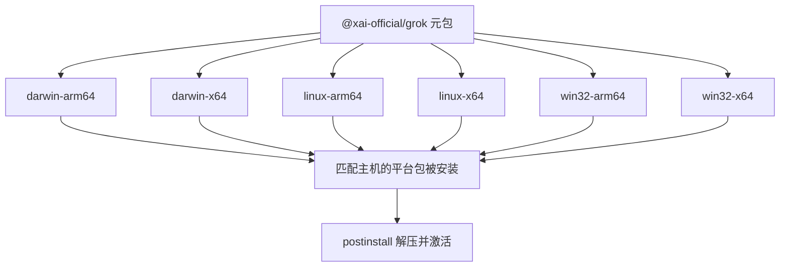
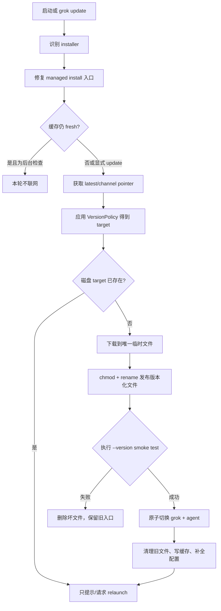

# 构建、打包、发布通道与原子更新：版本注入、跨平台产物、安装器和回滚边界

这篇文章回答一个看似简单、实际上跨越很多层的问题：源码怎样变成用户执行的 `grok`，新版本又怎样安全地替换旧版本？

这里必须先区分四件事：

1. **构建**：Rust 源码如何编译、链接成二进制；
2. **打包**：二进制怎样进入 CDN 安装布局、GitHub Release 或 npm 平台包；
3. **发布**：哪个版本被声明为 `stable` 或 `alpha`；
4. **更新**：已安装客户端怎样发现、下载、验证、激活和重启到新版本。

如果把它们统称为“release”，会漏掉最重要的故障边界。例如，编译成功不等于六个平台都打包成功；文件下载完成不等于已经激活；新链接已经切换也不等于当前进程已经运行新代码。

---

## 1. 先记住结论

### 1.1 源码构建入口与发行身份不是同一个版本号

本仓库的可执行组合根是 `xai-grok-pager-bin`，生成的 Cargo artifact 名为 `xai-grok-pager`；官方安装器把它暴露为 `grok` 和兼容入口 `agent`。

发行版本身份优先来自编译期环境变量 `GROK_VERSION`，没有它才退回 crate 的 `CARGO_PKG_VERSION`。所以不能任选一个 crate 的 `version` 字段就断言“这就是发行版本”。当前同步树中不同 crate 和 npm 元包的版本字段也确实不完全一致，这进一步说明发布流水线需要显式注入并同步版本。

### 1.2 本地 `--release` 与正式分发 profile 不相同

根 `Cargo.toml` 的普通 `[profile.release]` 主要方便本地 release 构建；真正面向用户的配置是 `release-dist`：thin LTO、单 codegen unit、保留调试信息供 CI 提取 sidecar，并启用 `panic = "abort"` 的父 profile。

### 1.3 “发布 stable”可以只是移动通道指针

源码注释明确说明 alpha 与 stable 共用相同 `release-dist` 产物，稳定版晋级可以通过通道指针切换复用已经构建的二进制，而不是重新编译。客户端读取纯文本 `stable`、`alpha` 指针，再把指针内容当作目标 semver。

### 1.4 更新分为下载验证和本地激活两个阶段

internal 更新器先下载到唯一临时文件，设置可执行位并 rename 成版本化二进制，随后执行 `--version` smoke test。只有 smoke test 成功，才原子切换 `~/.grok/bin/grok` 与 `agent`。

这条边界可以概括为：

> 下载成功的文件仍不是 active binary；先证明它能启动，再改变入口。

### 1.5 更新了磁盘，不代表当前进程已经更新

Unix 上运行中的旧进程不会因为 symlink 指向新文件而自动换代码。更新器会报告 `relaunch_needed`，重启时必须优先执行规范入口 `~/.grok/bin/grok`，不能使用已经解析到旧版本 inode 的 `current_exe()`。

### 1.6 当前同步树不能完整证明“发布流水线如何运行”

仓库包含构建 profile、安装脚本、npm 组包脚本和客户端更新逻辑，但没有 `.github/workflows` 或等价的发布编排文件。本文可以证明产物契约和消费端行为，不能从本树证明：

- 谁触发正式发布；
- CI 使用哪些签名或凭据；
- 各平台如何编译、codesign、notarize；
- 上传顺序与 stable 晋级审批；
- debug sidecar 最终存到哪里。

这是源码证据边界，不是文档遗漏。

---

## 2. 源码地图

| 层次 | 关键文件 | 主要职责 |
| --- | --- | --- |
| Workspace 与 profile | `Cargo.toml` | 成员、依赖、`release`、`release-dist` |
| 目标链接参数 | `.cargo/config.toml` | unwind table、musl hardening、Windows static CRT、架构参数 |
| 工具链 | `rust-toolchain.toml` | 固定 Rust、rustfmt、clippy 和部分目标 |
| 可执行组合根 | `crates/codegen/xai-grok-pager-bin/Cargo.toml` | 生成 `xai-grok-pager`，组合 TUI、runtime、update |
| 编译期版本 | `xai-grok-version/src/lib.rs` | `GROK_VERSION`、installed semver、展示标签 |
| 版本与 commit | `xai-grok-pager-bin/build.rs` | 生成 `VERSION_WITH_COMMIT` |
| 更新版本源 | `xai-grok-update/src/version.rs` | npm、GitHub Release、CDN/GCS pointer、缓存 |
| 更新决策与安装 | `xai-grok-update/src/auto_update.rs` | installer 检测、策略、下载、激活、回滚、重启 |
| 组织版本策略 | `xai-grok-update/src/version_policy.rs` | required range 启动门禁、安装目标校验 |
| Unix/Git Bash 安装 | `xai-grok-pager/scripts/install.sh` | 平台识别、下载、smoke test、链接、配置 |
| Windows 安装 | `xai-grok-pager/scripts/install.ps1` | 下载、锁文件替换、PATH 和配置 |
| npm 元包 | `xai-grok-pager/npm/grok/package.json` | CLI trampoline 与六个平台 optional dependencies |
| npm 组包 | `npm/grok/scripts/assemble-platform-packages.js` | Brotli 压缩、版本同步、notice 拷贝 |
| npm 安装 | `npm/grok/bin/postinstall.js` | 解压到版本化路径并切换规范入口 |
| npm 启动器 | `npm/grok/bin/grok` | 找规范入口、必要时自举、转发信号与退出码 |

建议先读 profile 和版本 crate，再读 `version.rs` 的“目标是什么”，最后读 `auto_update.rs` 的“怎样安全到达目标”。

---

## 3. 从源码到本地二进制

### 3.1 组合根为什么单独存在

`xai-grok-pager-bin` 不是业务逻辑最多的 crate，而是最终链接图的 composition root。它同时依赖：

- `xai-grok-pager`：TUI 和应用交互；
- `xai-grok-pager-minimal`：可选渲染模式；
- `xai-grok-shell`：agent runtime、leader、stdio、headless；
- `xai-grok-update`：更新；
- `xai-grok-version`：版本；
- telemetry、workspace、sandbox、crash handler 等。

把组合根独立出来，解决了 `minimal` 已经依赖 pager library、pager 又不能反向依赖它的 Cargo 循环问题。最终 binary 在启动时安装 IoC seam，而不是让 library 形成依赖环。

输出名由 `[[bin]]` 决定：

```toml
[[bin]]
name = "xai-grok-pager"
path = "src/main.rs"
```

因此：

- Cargo 包名：`xai-grok-pager-bin`；
- artifact 名：`xai-grok-pager`；
- 用户命令名：`grok`，另有 `agent` 兼容入口。

这三个名字属于不同命名层。

### 3.2 工具链固定

`rust-toolchain.toml` 固定 Rust `1.94.0`，包含 `rustfmt`、`clippy`，并预声明两个 GNU Linux target。固定工具链的意义不只是“大家版本相同”，还包括：

- edition 2024 行为稳定；
- 编译器优化和 lint 结果可复现；
- release binary 的 ABI、代码生成和调试信息更可比较；
- 升级工具链时能把编译器变化和业务变化分开。

注释要求一次只提升一个 point version，并在提升后执行 workspace check 和 clippy。这是维护策略；日常学习和局部修改仍应优先跑目标 crate，避免无意义地构建整个大 workspace。

### 3.3 普通 release 与发行 profile

普通 release：

```toml
[profile.release]
incremental = true
panic = "abort"
```

发行 profile：

```toml
[profile.release-dist]
inherits = "release"
lto = "thin"
codegen-units = 1
strip = false
debug = 1
split-debuginfo = "off"
```

各字段的实际含义：

| 配置 | 影响 |
| --- | --- |
| `panic = "abort"` | panic 不展开栈，直接终止；减小 unwind 路径，但要求资源恢复不能只依赖析构 |
| thin LTO | 跨 crate 优化，同时控制链接时间 |
| `codegen-units = 1` | 给优化器更完整的程序视图，代价是编译更慢 |
| `strip = false` | 构建阶段先保留符号，允许后处理提取调试 sidecar |
| `debug = 1` | 生成行表级调试信息，支持崩溃定位 |
| `split-debuginfo = off` | 构建时不自动拆开；发布流水线可统一后处理 |

`release-dist-jemalloc` 目前只是 `release-dist` 的命名别名。注释说明它保留给桌面流程引用，不能因为名字含 jemalloc 就推断它另有 profile 设置。真正的 allocator 和 profiling 能力由 binary feature 与 `main.rs` 中的 cfg 决定。

### 3.4 目标级编译参数

`.cargo/config.toml` 的目标设置不能只看一行，因为 Cargo 的 target `rustflags` 不会自动叠加，文件因此在每个平台重复必要参数。

关键差异包括：

| 目标 | 关键设置 |
| --- | --- |
| macOS x64/arm64 | dynamic lookup、ObjC 链接、force unwind tables |
| Linux GNU x64 | force unwind tables |
| Linux GNU arm64 | `target-cpu=neoverse-v2` 与 unwind tables |
| Linux musl | RELRO、立即绑定、non-executable stack |
| Windows MSVC | force unwind tables、static CRT |

两个安全提醒：

1. musl hardening 注释不能外推为“所有 Linux 目标都由这个文件显式设置了相同 hardening”；GNU target 在本文件没有同一组 linker flags。
2. arm64 GNU 的 `neoverse-v2` 是兼容性决策，不只是性能决策；改变 CPU baseline 会改变可运行机器集合。

### 3.5 构建期版本与 commit

`xai-grok-version::VERSION`：

```rust
pub const VERSION: &str = match option_env!("GROK_VERSION") {
    Some(v) => v,
    None => env!("CARGO_PKG_VERSION"),
};
```

`xai-grok-pager-bin/build.rs` 还执行 `git rev-parse --short HEAD`，生成：

```text
VERSION_WITH_COMMIT=<version> (<short-commit>)
```

它被 CLI 展示、telemetry service version、trace artifact 等使用。

需要区分三种标识：

| 标识 | 用途 | 可靠边界 |
| --- | --- | --- |
| `SOURCE_REV` | 说明公开同步树来自哪个上游 commit | 源码同步 provenance |
| Git `HEAD` short SHA | 当前 checkout 构建身份 | 本地构建 checkout |
| `GROK_VERSION` | 正式发行 semver | 更新与用户展示 |

build script 只监听 `.git/HEAD`，而 worktree 中 HEAD 指向的 ref 内容变化是否总能触发重跑，要结合 Cargo rerun 机制谨慎判断。需要绝对准确时应 clean/rebuild 或由 CI 显式注入 commit 元数据。

---

## 4. 跨平台产物契约

### 4.1 internal/CDN 命名

更新器的 `detect_platform()` 把目标归一为：

- OS：`macos`、`linux`、`windows`；
- arch：`x86_64`、`aarch64`。

internal artifact 名为：

```text
grok-<version>-<os>-<arch>
```

Windows 下载还会尝试 `.exe` 后缀。安装脚本与 Rust 更新器必须共享同一命名契约，否则 channel pointer 虽然有效，客户端仍会 404。

### 4.2 npm 的元包 + 六个平台包

`@xai-official/grok` 不是把六个巨型二进制全塞进一个 tarball。它声明六个精确版本的 optional dependencies：

- darwin-arm64
- darwin-x64
- linux-arm64
- linux-x64
- win32-arm64
- win32-x64

npm 按 `os` 和 `cpu` 过滤，只安装匹配当前机器的平台包。



`assemble-platform-packages.js` 执行三件关键事：

1. 从环境变量或默认 target 目录找到六个平台 binary；
2. 把每个平台 package version 改成元包 version；
3. Brotli 压缩 binary，并复制 `THIRD_PARTY_NOTICES.md`。

如果任一平台缺 artifact、package.json 或 notices，脚本累计失败并以非零退出。这里的平台完整性是“全六个平台一起组装”的契约。

### 4.3 为什么用 Brotli

脚本注释给出的动机是 npm tarball 大小约束：原始 binary 可达 100–150 MB，最大质量 Brotli 后约 30–40 MB。Node 自带 Brotli 解压，无需额外 native dependency。

这只是 npm transport 格式，不是 Rust updater 从 CDN 下载时的统一格式。不要假设 internal artifact 也一定是 `.br`。

### 4.4 npm trampoline

npm 的 `bin/grok` 是 Node 启动器，不是最终 Rust binary。解析顺序是：

1. `GROK_HOME/bin/grok` 或 `grok.exe`；
2. 从匹配的平台 package 解压到版本化规范目录；
3. home 不可写等情况下，退化为 node_modules 内就地解压运行。

启动 Rust child 时设置 `GROK_MANAGED_BY_NPM=1`，并继承 stdio。child 退出后：

- 有 signal：trampoline 把相同 signal 发送给自己；
- 有 exit code：trampoline 以相同 code 退出。

这保证 shell 观察到的退出语义尽量等同于直接运行 Rust binary。

### 4.5 为什么使用版本化文件

npm postinstall 使用：

```text
Unix:    ~/.grok/bin/grok-<version> + grok symlink
Windows: ~/.grok/bin/grok-<version>.exe + grok.exe copy
```

它避免原地覆盖正在运行的 macOS executable。代码注释指出，删除或替换进程 mmap 的 backing file 可能使内核无法继续验证 code signature，导致进程被 SIGKILL。

因此“节省磁盘，只保留一个可执行文件”在这里不是无害清理，而会改变运行中进程的安全性。

---

## 5. 发布通道不是版本字符串后缀

### 5.1 三类版本源

`fetch_latest_version()` 按 installer 选择完全独立的版本源：

| installer | 版本源 | 获取方式 |
| --- | --- | --- |
| `internal` | x.ai/GCS channel pointer | HTTP 读取纯文本 semver |
| `npm` | npm dist-tag | `npm view ... version --json` |
| `gh-release` | GitHub Releases | `gh release list` |

代码明确不做跨 installer fallback。例如 npm registry 失败，不会悄悄改用 internal CDN；因为安装来源不仅决定“去哪查版本”，还决定后续由谁管理磁盘入口。

### 5.2 primary 与 fallback

internal 有两个 base URL：

1. `https://x.ai/cli`：Cloudflare 前置；
2. direct GCS public artifact bucket：前者不可达时回退。

每个 pointer fetch 具有 15 秒 HTTP client timeout，并在瞬时失败时最多重试 3 次，间隔 1、2、4 秒；一个 base 失败后再尝试下一个 base。

安装过程把“base 相关阶段”与“本地激活阶段”分开：

- 下载或 smoke test 失败，可以尝试下一个 base；
- 本地 link swap 失败，不能靠重新下载另一个 base 修好，直接终止并保留恢复信息。

### 5.3 alpha 取 max(alpha, stable)

alpha 用户不能只读 alpha pointer。代码同时取 alpha 和 stable 的 semver 较大值，npm 与 GitHub Release 路径也执行同一策略。

原因是 stable 可能已经发布得比 alpha pointer 更新；如果只看 alpha，alpha 用户反而会卡在更旧版本。

### 5.4 channel label 是缓存推导，不是编译常量

`~/.grok/version.json` 保存：

- 最近看到的目标 version；
- stable pointer；
- `checked_at`。

展示 `[alpha]` / `[stable]` 时，客户端比较当前编译版本与缓存的 stable version：

- current > stable：alpha；
- current <= stable：stable；
- 没缓存或解析失败：不显示 label。

它是 display hint，不参与正确性判断。获取 stable pointer 还被限制在 500 ms 内；失败只导致暂时没有标签。

### 5.5 缓存 TTL 与时钟偏移

版本缓存 TTL 是 30 分钟。未来时间戳一律不视为 fresh，避免机器时钟回拨或错误 NTP 使自动更新永久沉默。

更重要的是写缓存的时机：

- 已经是目标版本：可以缓存；
- 安装成功：可以缓存；
- 下载失败：不能缓存，否则接下来 30 分钟错误地抑制重试。

---

## 6. Installer 身份决定磁盘真相

### 6.1 installer 如何识别

优先顺序大致是：

1. `GROK_INSTALLER`；
2. `GROK_MANAGED_BY_NPM` / `GROK_MANAGED_BY_INTERNAL`；
3. `npm_config_user_agent`；
4. 配置 `[cli].installer`；
5. 默认 internal。

支持的规范值是 `npm`、`internal`、`gh-release`。

### 6.2 为什么不能无条件读取 `~/.grok/bin/grok`

Unix internal/gh-release 使用 symlink 目标名记录磁盘版本，因此无需执行 binary 就能解析 on-disk version。

但 npm 可能留下一个旧 internal symlink。如果 npm updater误把那个 symlink 当真，可能得到一个比 registry 更新的假版本，从此永远认为“不需要 npm 更新”。所以只有明确由 internal 或 gh-release 管理时，`disk_version_for_installer()` 才信任 symlink。

这是一个典型原则：

> 数据格式看起来可解析，不代表当前 owner 对它负责。

### 6.3 升级与降级策略

internal 与 gh-release 的 channel pointer 被视为权威，可以把客户端降级到指针版本；npm registry 可能被企业代理缓存为旧值，因此 npm 只允许 target > current，不因旧 registry 结果自动降级。

stable/enterprise 还拒绝 pre-release target；未知 channel 返回无法判断，而不是偷偷按 alpha 处理。

---

## 7. 组织版本策略

配置的 `VersionPolicy` 有两类边界：

- `minimum` / `maximum`：更新器选择目标时使用；
- `required_minimum` / `required_maximum`：启动硬门禁。

### 7.1 软范围

更新器先取得 latest，再由 policy 解析允许 target：

- latest 被允许：安装 latest；
- policy clamp 到较低 target：告知用户后安装 target；
- anti-downgrade 决定跳过：保留 current；
- required minimum 高于现有 latest：报告管理员配置不可满足。

`grok update --check` 与真正 updater 共享 `plan_for()`，避免“检查说可更新，执行却跳过”的分叉。

### 7.2 硬范围

正常启动前，`enforce_version_policy_or_exit()` 拒绝运行：

- 当前版本低于 required minimum；
- 当前版本高于 required maximum。

恢复类 update subcommand 必须在这个门禁之前可用，否则被禁止启动的旧版本连自救都做不到。

### 7.3 为什么某些错误 fail open

矛盾的 hard range（min > max）或无法解析的 running version 会放行并记录 warning，避免错误策略把所有客户端永久锁死。

但显式 `--version` 低于 hard floor 会被拒绝。高于 ceiling 的 pin 被允许，因为“当前版本太新”时需要有能力安装管理员允许的版本来恢复。

---

## 8. 自动更新状态机

### 8.1 总体流程



### 8.2 后台检查的双重判断

后台更新同时比较：

- running version：决定是否展示“需要重启”；
- on-disk version：决定是否真的需要下载。

这样另一个 TUI 或 leader 已经下载好新 binary 时，当前 TUI 不会再次下载，但仍会提示当前旧进程重启。

Windows 和 npm 无法可靠地从 symlink 推导 disk version，代码会退化到 running version 判断，因此某些重复下载优化不能完全生效。这是已在源码注释中声明的平台边界。

### 8.3 blocking 与 non-blocking child

更新通过当前 executable 再启动 `grok update` 子进程：

- Blocking：前台等待，继承 stderr 让用户看到诊断，Ctrl+C 同组取消；
- NonBlocking：stdin/stdout/stderr 置 null，并 detach 到新 session，返回 child handle 供退出更新流程稍后 `wait()`。

Blocking 路径明确避免 `stderr=pipe + status()`：父进程不 drain pipe 时，下载进度写满缓冲区会让父子互相等待。

### 8.4 auto_update 默认值

配置为 `None` 时首次解析为 true，并尝试持久化 `Some(true)`；显式 `Some(false)` 时跳过后台检查。关闭自动安装不等于所有显式 `grok update` 都被禁止。

用户也可以 dismiss 某个具体 latest version；dismiss 是针对版本的，不是永久关闭更新。

---

## 9. 下载协议和并发更新

### 9.1 唯一临时文件

临时文件不是简单的 `dest.with_extension("tmp")`。版本名中本来含点号，旧做法会把多个 `0.1.x` 目标折叠到相同 `grok-0.1.tmp`。

新格式在完整文件名后追加：

```text
.<pid>-<sequence>.tmp
```

它同时区分：

- 不同 updater 进程；
- 同进程的并发下载；
- 不同 patch version。

### 9.2 并行 range 下载

大于等于 16 MiB 时，更新器先 HEAD 取得 Content-Length，再按每 16 MiB 一个 chunk、最多 8 chunks 并行请求 byte range。

任何条件不满足都会回退单连接：

- 没 Content-Length；
- 文件太小；
- server 不返回 `206 Partial Content`；
- 某一 chunk 失败。

并行失败不是整个更新失败，只是 transport 优化失败。

### 9.3 发布下载文件

完整下载后：

1. flush/关闭临时文件；
2. Unix 设置 `0755`；
3. rename 到版本化 destination。

先 chmod 再 rename，避免另一个并发 installer 在 destination 可见但仍是 `0644` 的窗口内尝试执行。

下载请求总 timeout 是 20 分钟。遗留 tmp 和 tmp-link 只有超过 1 小时才会清理，避免误删慢速或并发 updater 仍在使用的文件。

### 9.4 smoke test 能证明什么

更新器运行：

```text
<downloaded-binary> --version
```

单次限制 10 秒，并对 Unix `ETXTBSY` 进行有限重试。成功可以证明 binary 在当前机器上至少可装载并正常退出。

它不能证明：

- 下载内容具有发布者的密码学签名；
- 所有功能可运行；
- 新版本不会在真实会话崩溃；
- binary 就是 pointer 所声称源码构建出的内容。

在本模块可见源码中，没有对 internal artifact 执行 checksum 或签名验证。TLS、受控 URL 与 smoke test 是现有保护，但不能等价为内容级签名验证。这是值得安全评审单独追踪的边界。

---

## 10. 原子激活与回滚

### 10.1 Unix symlink swap

Unix 不先删旧 link 再建新 link，而是：

1. 在同目录创建唯一临时 symlink；
2. 临时 link 指向新版本化 binary；
3. rename 临时 link 覆盖规范入口。

同一文件系统目录内 rename 提供原子可见性，调用者不会看到“入口暂时不存在”的中间状态。

target 尽量使用相对路径，例如：

```text
~/.grok/bin/grok -> ../downloads/grok-<version>-<platform>
```

相对 link 可以在 Docker bind mount 改变 home 前缀时继续工作。

### 10.2 grok 与 agent 的事务边界

更新必须同时切换 `grok` 和 `agent`。`swap_managed_bin_links()` 在修改前捕获两个入口的旧状态：

- 原先不存在：记录 `Absent`；
- Unix 原先存在：记录旧 symlink target；
- Windows 原先存在：创建唯一 rollback backup。

若第二个入口失败，已经切换成功的第一个入口按逆序恢复。如果它原来不存在，回滚动作是删除新入口，而不是保留半套安装。

这是应用层的 all-or-nothing 协议，不是文件系统自动提供的跨两个路径事务。

### 10.3 Windows 锁定 executable

Windows 不能覆盖正在运行的 executable，但通常允许 rename：

1. 先尝试直接 copy；
2. sharing violation/access denied 时，把旧 dest rename aside；
3. copy 新 binary 到空出的规范路径；
4. copy 失败则把 aside rename 回来。

遗留 `.old` 自己也可能仍被运行中进程锁住，所以 aside 名支持 PID + sequence 唯一后缀。后续更新会 best-effort 清理不再锁定的 leftovers。

### 10.4 旧版本保留策略

cleanup 保留当前版本和一个 previous version。原因不只是回滚便利，也包括 macOS 运行中旧进程仍可能需要 backing file 页面。

清理函数只识别严格可解析的版本化命名，避免把 `grok-latest`、临时文件或无关 binary 当旧版本删除。

---

## 11. 重启、leader 与“磁盘已更新”

### 11.1 `current_exe()` 的陷阱

当前进程可能由 symlink 启动，但 `current_exe()` 常解析为旧版本化 target。symlink 更新后再 exec `current_exe()`，会重新启动旧 binary。

因此 `resolve_restart_exe()` 优先选择 `grok_application()`，即规范 `~/.grok/bin/grok`，不存在才回退当前 executable。

### 11.2 Unix 与 Windows 重启

- Unix：用 `exec` 替换当前进程，保留进程位置并避免 parent exit 的 stdio 问题；
- Windows：spawn 新进程后退出旧进程。

重启会转发原始命令行参数，清理再重建环境，并移除 `GROK_AUTO_UPDATE`，避免自动更新标志造成重启循环。

### 11.3 leader 协调

`run_update()` 即使发现目标已经由其他进程安装，也会返回 `Some(target)`。上层仍需通知 stale leader relaunch，因为“本调用没下载”不代表所有运行进程已经使用磁盘新版本。

这体现出三种状态不能合并：

| 状态 | 示例 |
| --- | --- |
| available version | channel pointer = 0.2.130 |
| on-disk version | symlink 已指向 0.2.130 |
| running version | 当前 leader 仍是 0.2.120 |

---

## 12. 三种安装后端

### 12.1 internal

- 从 x.ai primary 或 GCS fallback 获取 pointer/artifact；
- 下载版本化文件；
- smoke test；
- 原子切换 `grok` 和 `agent`；
- 写 `[cli].installer = "internal"`；
- 重新生成 shell completions。

### 12.2 GitHub Release

- 用 `gh release list` 找目标；
- 用 `gh release download` 获取当前平台 binary；
- 复用 managed bin layout；
- 写 installer 为 `gh-release`。

它要求用户环境中 `gh` 可执行且具有访问目标 repo/release 的能力。

### 12.3 npm

- 运行 `npm i -g @xai-official/grok@<resolved-version>`；
- 可指定 custom registry；
- 若存在 `NPM_TOKEN`，写入进程特有临时 `.npmrc`，Unix 权限 `0600`；
- 通过 `--userconfig` 使用，结束后删除；
- stderr 继承，避免 pipe deadlock。

token 不放在命令行 registry URL 或 shell history，但临时文件删除是 best-effort；异常 kill 仍可能留下文件。这种临时凭据生命周期应纳入安全和故障清理检查。

显式 pin 版本安装成功后会把 `auto_update` 设为 false，避免下一轮自动更新立即覆盖用户的固定版本意图。

---

## 13. Bootstrap 安装器与内置更新器的差异

安装脚本和 Rust updater 的目标相同，但它们不是同一实现：

| 能力 | `install.sh` | `install.ps1` | Rust updater |
| --- | --- | --- | --- |
| 平台 | macOS/Linux/Git Bash | Windows | 当前运行平台 |
| primary/fallback | 有 | 有 | 有 |
| 版本格式校验 | shell regex | PowerShell regex | semver crate |
| Unix smoke test | 有 | 不适用 | 有 |
| Windows locked-file fallback | shell copy/rename | copy/rename/rollback | 更完整的 unique aside/rollback |
| completion | best-effort | best-effort | best-effort |
| managed config | 安装时可获取 | 安装时可获取 | 更新后按 staleness 刷新 |

安装脚本还负责首次把 bin directory 加入 PATH 或给出 shell 配置提示，而内置 updater 一般假定规范入口已经存在。

修改产物命名、目录布局或 installer config 时，必须同时审查三份实现与 npm postinstall，不能只改 Rust updater。

---

## 14. 错误与恢复矩阵

| 故障 | 当前处理 | 旧版本是否保持可用 |
| --- | --- | --- |
| primary pointer 不可达 | 重试后 fallback GCS | 是 |
| pointer 非法 semver | 拒绝该目标 | 是 |
| parallel range 不支持 | 回退单连接 | 是 |
| 下载中断 | 保留唯一 tmp，未来按年龄清理 | 是 |
| binary 无法 `--version` | 删除下载文件，不激活 | 是 |
| grok link 成功、agent link 失败 | 回滚 grok | 设计上是；restore 失败会 warning 并保留恢复物 |
| Windows executable 被占用 | rename aside 后 copy | 是；copy 失败回滚 |
| version cache 写失败 | warning，更新本身可成功 | 是；下次可能重复检查 |
| completion 生成失败 | 静默忽略 | 是 |
| managed config 刷新失败 | 分类型提示或 debug | 是；配置可能仍旧 |
| npm 临时 `.npmrc` 删除失败 | warning | 是；可能遗留凭据文件 |
| 当前进程未重启 | 展示/上报 relaunch needed | 磁盘新、进程旧 |

错误消息最终由 `run_install_script()` 包装，附带与 installer 对应的手动重装建议。

---

## 15. 安全边界

### 15.1 已有保护

- 版本字符串经 semver 校验，降低路径构造注入风险；
- 下载先进入唯一临时文件，再 rename；
- 激活前执行 binary smoke test；
- managed links 使用原子替换；
- 两个入口具有应用层回滚；
- npm token 使用 `0600` 临时配置，避免出现在命令参数和 shell history；
- 平台包携带 third-party notices；
- musl 目标显式启用 RELRO、NOW、NX stack；
- Windows 使用 static CRT，降低目标机 runtime 依赖。

### 15.2 不能过度声称的保护

- smoke test 不是签名验证；
- HTTPS 不是 artifact 内容级 provenance；
- 本树没有展示发布 CI 的 secret、签名、notarization 和上传权限边界；
- `VERSION_WITH_COMMIT` 的 Git short SHA 是诊断标识，不是可验证供应链证明；
- npm optional dependency 的精确版本锁定不自动证明其 binary 与源码 commit 一致。

### 15.3 评审供应链时应追问

1. 每个平台 binary 是否生成 checksum、签名或 provenance attestation？
2. macOS codesign/notarization 和 Windows signing 在哪里完成？
3. channel pointer 写权限与 artifact 上传权限是否分离？
4. stable pointer 是否只能指向已验证且不可变的 artifact？
5. npm 六个平台包是否先全部发布成功，再发布引用它们的元包？
6. CDN cache 是否可能让 pointer 与 artifact 短暂不一致？
7. rollback pointer 的审计和审批在哪里？

这些问题需要发布基础设施源码或运行配置才能回答。

---

## 16. 常见误解

### 误解一：`cargo build --release` 就等于官方发行构建

不等于。正式 profile 是 `release-dist`，还可能有本树外的签名、strip、sidecar 和上传步骤。

### 误解二：所有 crate 的 package version 必须等于 CLI version

当前代码通过 `GROK_VERSION` 建立发行身份；crate version 还服务 Cargo package 管理。判断用户版本应看 `xai-grok-version` 的规则，而不是随便挑一个 Cargo.toml。

### 误解三：把 stable pointer 改掉会让运行中进程立刻更新

pointer 只改变目标；仍需客户端检查、下载、激活和重启。

### 误解四：下载完成就可以切 link

internal updater还要先 chmod、rename 成完整版本化文件并通过 `--version` smoke test。

### 误解五：symlink target 永远是真实磁盘版本

只有负责维护该 symlink 的 installer 才能把它当真。npm 模式必须防止旧 internal link 污染判断。

### 误解六：自动更新只做升级

internal/gh-release 把权威 pointer rollback 也视为应该收敛的目标；npm 则禁止自动降级。

### 误解七：原子 rename 让整个更新天然成为事务

单路径 rename 原子，但 `grok` 与 `agent` 是两个路径。跨两个入口的一致性由显式 capture/rollback 协议实现。

### 误解八：保留旧 binary 只是浪费空间

在 macOS 上，删除运行中 executable 的 backing file 可能杀死旧进程；保留 previous version 是生命周期安全措施。

---

## 17. 修改检查清单

### 17.1 修改构建设置

- profile 是本地 release 还是 distribution release？
- 每个 target 重复的 rustflags 是否同步？
- 改 panic strategy 后，终端恢复与资源清理是否仍成立？
- 改 CPU baseline 后，最老支持机器是否还能运行？
- debug symbols 的提取流程是否仍拿得到符号？

### 17.2 修改版本规则

- `GROK_VERSION` 与 `CARGO_PKG_VERSION` fallback 是否一致？
- npm 元包和六个平台包是否使用同一版本？
- alpha 是否仍取 max(alpha, stable)？
- `--check` 与真正 update 是否共享决策？
- pin、force、channel switch、hard floor 是否分别覆盖？

### 17.3 修改 artifact 或目录命名

- Rust internal updater；
- install.sh；
- install.ps1；
- GitHub Release pattern；
- npm assemble script；
- npm postinstall 与 trampoline；
- on-disk version parser；
- cleanup old downloads；
- `grok` 与 `agent` 两个入口。

### 17.4 修改激活流程

- 下载中断不会暴露半文件吗？
- 可执行位在 destination 可见前已设置吗？
- 两个入口任一失败会回滚吗？
- 旧入口原本 absent 时能恢复 absent 吗？
- 并发 updater 的 tmp/backup 名会碰撞吗？
- Windows 锁定 `.old` 时仍能更新吗？
- macOS 运行中旧 binary 不会被过早删除吗？
- current process 能重启到 canonical entrypoint 吗？

---

## 18. 验证方法

### 18.1 快速静态核对

```sh
rg -n "profile.release|profile.release-dist" Cargo.toml
rg -n "rustflags|relro|noexecstack|crt-static" .cargo/config.toml
rg -n "GROK_VERSION|VERSION_WITH_COMMIT" crates/codegen/xai-grok-version crates/codegen/xai-grok-pager-bin
rg -n "fetch_latest_version|needs_update|swap_managed_bin_links|smoke_test_binary" crates/codegen/xai-grok-update
rg -n "optionalDependencies|brotli|postinstall" crates/codegen/xai-grok-pager/npm
```

### 18.2 定向测试

```sh
cargo test -p xai-grok-version --lib
cargo test -p xai-grok-update --lib
cargo test -p xai-grok-pager-bin --bin xai-grok-pager
node crates/codegen/xai-grok-pager/npm/grok/scripts/test-postinstall.js
```

update crate 的测试包含纯策略、缓存时间、文件名解析、下载 fallback、临时文件唯一性、链接 rollback 和 HTTP fixture。网络行为应优先通过本地 mock server 测，不要把公开 CDN 当单元测试依赖。

### 18.3 本地构建实验

```sh
cargo check -p xai-grok-pager-bin
cargo build -p xai-grok-pager-bin --profile release-dist --features release-dist
GROK_VERSION=9.8.7 cargo run -p xai-grok-pager-bin -- --version
```

最后一个命令会使相关 crate 因环境变化重新编译，适合验证版本注入；不要把虚构版本 binary 放入真实 `~/.grok/bin`。

### 18.4 安全的更新实验

所有 installer/update 集成测试都应设置临时 `GROK_HOME` 并指向本地 fixture server。必须断言：

1. 下载失败后 canonical link 未变；
2. smoke test 失败后坏 binary 被删除；
3. 第二入口切换失败会恢复第一入口；
4. 两个 updater 并发时没有共享 tmp；
5. dangling link 不被报告为已安装版本；
6. npm 模式不信任遗留 internal symlink；
7. cache 只在成功或无需更新时写入。

不要在学习实验里直接运行真实 `grok update --force`，它会改变用户安装。

---

## 19. 推荐源码阅读实验

### 实验一：画出版本身份

找到 `xai-grok-version::VERSION`、两个 build.rs、`SOURCE_REV` 和 `--version` 输出点，解释它们各自解决什么问题。

### 实验二：模拟 stale process

在临时目录创建：

```text
downloads/grok-1.0.0-...
downloads/grok-1.1.0-...
bin/grok -> ../downloads/grok-1.1.0-...
```

假设 running version 仍是 1.0.0，解释为什么无需再次下载但仍需 relaunch。

### 实验三：分析第二 link 失败

沿 `swap_managed_bin_links()` 跟踪：旧 grok 存在、旧 agent 不存在、grok swap 成功、agent swap 失败。写出回滚后的两个路径状态。

### 实验四：比较 installer 信任

对相同的 current=2.0.0、target=1.9.0，分别代入 internal 和 npm，解释为什么结果不同。

### 实验五：审计 artifact authenticity

从 channel pointer 一直追到 `activate_verified_download()`，列出所有实际检查，再列出没有执行的密码学检查。不要把“应该有”写成“源码已有”。

### 实验六：验证 npm 平台选择

阅读元包 optional dependencies、平台 package 的 `os/cpu` 与 trampoline 的 `${process.platform}-${process.arch}`，证明三者命名一致。

---

## 20. 自测题

1. `xai-grok-pager-bin`、`xai-grok-pager`、`grok` 三个名字分别属于哪一层？
2. 为什么 `release-dist` 保留 debug symbols，而不是构建时直接 strip？
3. `GROK_VERSION` 与 `CARGO_PKG_VERSION` 的优先关系是什么？
4. 为什么 alpha channel 要比较 alpha 和 stable 两个版本？
5. version cache 为什么不能在下载开始时就写？
6. npm installer 为什么不能信任 `~/.grok/bin/grok` 的遗留 symlink？
7. internal 为什么允许 pointer 驱动降级，npm 为什么不允许？
8. parallel range 下载失败后为何不一定导致 update 失败？
9. 为什么临时文件名不能用简单的 `with_extension("tmp")`？
10. smoke test 能证明什么，不能证明什么？
11. 单个 symlink rename 原子，为什么还需要 `LinkRollback`？
12. Windows 正在运行的 exe 如何被替换？
13. 为什么更新后不能直接 exec `current_exe()`？
14. on-disk 已是新版本时，为什么 `run_update()` 仍可能返回 target？
15. 当前仓库缺少哪些证据，使我们不能完整描述正式发布 CI？

---

## 21. 本篇术语表

| 名词 | 白话解释 | 在本篇中的具体含义 |
| --- | --- | --- |
| artifact | 构建产物 | 可上传、打包或安装的 `xai-grok-pager`/`grok` binary |
| composition root | 最终把组件组装起来的入口 | `xai-grok-pager-bin`，负责链接 TUI、runtime、update 等 |
| build profile | 一组编译优化设置 | Cargo 的 `release`、`release-dist` 等 profile |
| LTO | 链接时优化 | 跨 crate 做优化；这里发行 profile 使用 thin LTO |
| codegen unit | 编译器拆分代码生成的单元 | 设为 1 可增强整体优化但拖慢构建 |
| unwind table | 栈展开辅助信息 | 即使 panic abort，也可帮助 backtrace/profiler 展开调用栈 |
| sidecar | 与主 binary 分开放置的伴随文件 | 例如 Linux debug file 或 macOS dSYM |
| target triple | 编译目标三元组 | 如 `aarch64-unknown-linux-gnu`、`x86_64-pc-windows-msvc` |
| CPU baseline | binary 假定目标 CPU 支持的最低指令能力 | `target-cpu` 改动会影响兼容机器范围 |
| static CRT | 静态链接 C runtime | Windows target 使用 `+crt-static` 降低运行时依赖 |
| RELRO | 只读重定位保护 | 链接后把部分结构设只读，降低 GOT 类篡改风险 |
| NX stack | 不可执行栈 | `noexecstack`，降低从栈执行注入代码的风险 |
| semver | 语义化版本 | 更新比较与 policy 判断使用的版本格式 |
| release channel | 发布通道 | stable、alpha、enterprise 的目标版本序列 |
| channel pointer | 通道指针 | 内容为 semver 的远端纯文本文件，如 `stable` |
| dist-tag | npm 分发标签 | npm 的 `latest`、`alpha` 等版本入口 |
| installer | 当前安装的管理后端 | internal、npm 或 gh-release，决定查询与激活策略 |
| canonical entrypoint | 用户应始终启动的规范入口 | `~/.grok/bin/grok` 或 Windows 的 `grok.exe` |
| versioned binary | 名字中包含版本的实际文件 | 允许入口切换而不覆盖运行中旧文件 |
| trampoline | 很薄的启动转发器 | npm 的 Node `bin/grok`，最终启动 Rust binary |
| optional dependency | 安装失败或平台不匹配可跳过的依赖 | npm 用它只选择六个平台包中的一个 |
| Brotli | 压缩算法 | npm 平台包用它压缩大型 binary |
| TTL | 缓存有效期 | version cache 在 30 分钟内可跳过后台联网检查 |
| smoke test | 最小可运行性测试 | 下载后执行新 binary 的 `--version` |
| atomic rename | 对单个目录项原子替换 | 避免 canonical link 短暂消失或指向半文件 |
| rollback | 失败后恢复旧状态 | 第二入口失败时恢复先前已切换的入口 |
| backing file | 运行中可执行映射对应的磁盘文件 | macOS 上过早删除可能伤害旧进程 |
| inode | Unix 文件对象身份 | symlink 换目标不会改变当前进程已执行的旧 inode |
| byte range | HTTP 局部字节请求 | 大 artifact 可分块并行下载 |
| ETXTBSY | executable file busy | 写端仍打开时 exec 可能短暂失败，smoke test 会重试 |
| provenance | 产物来源证明 | binary 与特定源码、构建过程、发布者之间的可验证关系 |
| attestation | 供应链声明 | 由受信构建系统签发、描述构建输入输出的证明；本树未展示发布实现 |
| codesign | 平台代码签名 | macOS/Windows 对 executable 发布者和完整性的签名机制 |
| notarization | Apple 公证 | Apple 对已签名软件的额外发行审查流程；本树未展示 |
| fail open | 配置异常时优先允许继续 | 矛盾 hard range 不把全部客户端锁死 |
| fail closed | 异常时拒绝继续 | 显式 pin 低于 required floor 时拒绝安装 |

---

## 22. 源码证据索引

| 结论 | 证据符号或文件 |
| --- | --- |
| 组合根与 artifact 名 | `xai-grok-pager-bin/Cargo.toml` 的 `[[bin]]` |
| 正式发行 profile | 根 `Cargo.toml` 的 `profile.release-dist` |
| 目标链接参数 | `.cargo/config.toml` |
| 版本注入 | `xai_grok_version::VERSION` |
| version + commit | `xai-grok-pager-bin/build.rs` |
| installer 分派 | `fetch_latest_version()`、`get_installer()` |
| channel primary/fallback | `CLI_BASE_URLS`、`fetch_gcs_version()` |
| alpha 与 stable 取较大值 | `semver_max()`、各 installer fetch 函数 |
| 30 分钟缓存 | `TTL_SECONDS_BEFORE_AUTO_UPDATE`、`GrokVersion::is_fresh()` |
| 更新 policy 共享 | `plan_for()`、`fetch_update_plan()` |
| hard range 启动门禁 | `enforce_version_policy_or_exit()` |
| 双重 running/disk 判断 | `check_update_background()`、`ensure_latest_on_disk()` |
| 唯一临时文件 | `tmp_download_path()`、`unique_temp_sibling()` |
| 并行 range 与 fallback | `try_parallel_download()`、`download_with_progress()` |
| smoke test | `smoke_test_binary()` |
| 下载与激活分相 | `download_verified_from_base()`、`activate_verified_download()` |
| 两入口事务回滚 | `swap_managed_bin_links()`、`LinkRollback` |
| Unix 原子 link | `atomic_symlink_swap()` |
| Windows 锁文件替换 | `windows_replace_exe()` |
| 重启到规范入口 | `resolve_restart_exe()`、`restart_grok()` |
| npm 六平台包 | `npm/grok/package.json` |
| npm Brotli 组装 | `assemble-platform-packages.js` |
| npm 安装和启动 | `postinstall.js`、`bin/grok` |
| Bootstrap 安装 | `scripts/install.sh`、`scripts/install.ps1` |

---

## 23. 一句话复盘

Grok Build 的发行链路不是“编译后覆盖一个文件”，而是：构建期注入版本与 commit，按平台形成可分发产物，用 installer 专属版本源解析通道目标，先把新 binary 下载到版本化路径并做最小运行验证，再以带回滚的原子入口切换激活，最后协调旧 TUI/leader 重启；其中正式 CI、签名和上传审批不在当前同步树内，必须保持为明确的证据空白。
