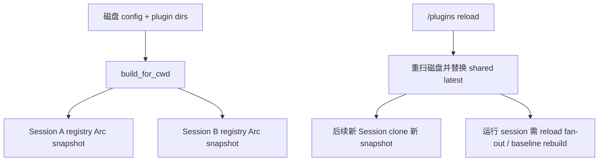
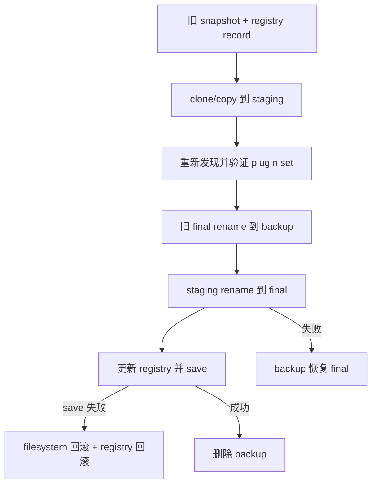

# 插件、Skills、Marketplace 与扩展生命周期：发现、信任、命名、快照、热刷新和执行边界

Grok Build 的“扩展”不是一种单一对象。一个 plugin 目录可以同时携带 Skills、Agents、Hooks、MCP Server 和 LSP 配置；Marketplace 负责找到并安装 plugin；Skill 又既可以独立存在，也可以由 plugin 提供。理解这套系统，关键不是背目录名，而是分清：

- 谁负责发现；
- 谁决定名称和优先级；
- 谁判断启用与信任；
- 哪些内容只是提示文本，哪些会启动外部进程；
- reload 改变共享注册表后，哪些 session 能看到新状态；
- 安装源与运行快照之间如何隔离。

---

## 1. 先记住结论

### 1.1 Plugin 是命名空间容器，Skill 是模型指令包

Plugin 是目录级组合单元，可包含 skills、commands、agents、hooks、MCP 和 LSP。Skill 的核心则是 `SKILL.md`：被发现后形成 `SkillInfo`，按需读取正文并包进 `<skill>` / `<skill_information>` 交给模型。

所以：

- 安装 plugin 可能新增多个 skill；
- 独立 skill 不必属于 plugin；
- plugin enable/reload 与 skill invoke 是两条不同状态机。

### 1.2 “已发现、已启用、已信任、已激活”是四种状态

- discovered：文件系统上找到了候选；
- enabled：不在 disabled，并明确位于 enabled；
- trusted：允许执行 hooks、MCP、LSP 等外部能力；
- active：registry 中 enabled 且 trusted，执行型组件可接入 session。

插件可以被列出但未启用，也可以启用但因 project trust 不足而不能启动执行型组件。

### 1.3 Project plugin 默认不是自动执行

Project plugin 来自仓库内 `.grok/plugins` / `.claude/plugins`。克隆仓库即可获得这些文件，因此它们需要 folder trust 与 plugin trust/enable 共同约束。Hooks 和 MCP 能运行任意本地命令，不能因为代码在当前 repo 就默认安全。

### 1.4 Registry 是 session snapshot，不是所有运行会话实时共享一份可变表

`SharedPluginRegistryHandle` 保存“供新 session 使用的最新 registry”。新 session 按 cwd、folder trust 和 `_meta.pluginDirs` 构建自己的 snapshot。显式 reload 会替换共享 latest，但运行中的 session 仍要通过 reload fan-out / baseline rebuild 才能接收新组件，不能假设一个 RwLock 写入会神奇改变所有旧 Arc。

### 1.5 Marketplace 是目录和 Git 来源的目录服务，不是可信执行沙箱

Marketplace 能扫描 index/catalog 或文件系统、缓存 Git source、解析 plugin entry、安装到 managed snapshot。它会防目录穿越，可选择强制 full commit SHA，但安装后的代码仍可能执行 hooks/MCP。来源可定位不等于内容可信。

### 1.6 本地 plugin 安装是复制快照，不是 live symlink

本地 source 会复制到 `installed-plugins`。session spawn 或 `/plugins reload` 对 under-home / 显式 trusted source 重新复制；普通 spawn 先用结构比较跳过未变内容，强制 reload 总是重拷贝。

### 1.7 Skill 列表采用渐进披露

模型通常先看到 skill 名、描述和绝对路径，而不是一次把所有正文塞进 prompt。用户显式 slash invoke 可以在 prompt assembly 阶段零额外轮次展开；模型调用 Skill tool 时再读取正文并注入。路径条件 skill 还可以等相关文件被触碰后才进入 listing。

---

## 2. 源码地图

| 子系统 | 关键文件 | 职责 |
| --- | --- | --- |
| Plugin manifest | `xai-grok-agent/src/plugins/manifest.rs` | 解析、命名、组件路径、root containment |
| Plugin discovery | `plugins/discovery.rs` | 多来源扫描、scope、origin、去重、冲突 |
| Plugin trust | `plugins/trust.rs` | canonical plugin root 的持久信任 |
| Plugin registry | `plugins/registry.rs` | enabled/trusted 投影、session snapshot、MCP owner |
| Plugin hook adapter | `plugins/hooks_adapter.rs` | 事件过滤、namespace、环境注入 |
| 安装 registry | `plugins/install_registry.rs` | managed installs 的磁盘账本 |
| Git/local install | `plugins/git_install.rs` | source 解析、clone/copy、pin policy |
| Local refresh | `plugins/local_refresh.rs` | trusted local source 到 managed snapshot 的重拷贝 |
| Marketplace core | `xai-grok-plugin-marketplace/src/*` | source、cache、scan、resolve、transactional update |
| Shell plugin facade | `xai-grok-shell/src/plugin.rs` | install/update/uninstall/marketplace 编排 |
| ACP extensions | `xai-grok-shell/src/extensions/plugins.rs` | 列表与动作 RPC |
| Skill discovery | `xai-grok-agent/src/prompt/skills.rs` | 多 scope 优先级、plugin skill 合并 |
| Skill types/tool | `xai-grok-tools/src/implementations/skills/*` | `SkillInfo`、正文包装、参数替换 |
| Skill lifecycle | `xai-grok-tools/src/types/skill_discovery_tracker/*` | baseline、动态发现、条件激活、公告去重 |
| 动态发现 reminder | `xai-grok-tools/src/reminders/skill_discovery.rs` | 文件工具完成后发现/激活 skill |
| Skill ACP extension | `xai-grok-shell/src/extensions/skills.rs` | add/remove/reset/list/toggle |

---

## 3. Plugin 的磁盘形状

### 3.1 Manifest 搜索顺序

插件根目录依次寻找：

1. `plugin.json`
2. `.grok-plugin/plugin.json`
3. `.claude-plugin/plugin.json`

没有 manifest 也可以按约定发现：目录名成为 plugin name，组件从默认位置推导。

默认组件约定：

```text
plugin-root/
├── skills/
├── commands/
├── agents/
├── hooks/hooks.json
├── .mcp.json
└── .lsp.json
```

Manifest 可以用单路径、路径数组或 inline JSON 覆盖。未知字段不会导致解析失败，以兼容由更新版本工具生成的 manifest。

### 3.2 Plugin name

规范名称要求：

- 1–64 字符；
- ASCII 小写字母、数字、连字符；
- 不能以连字符开头或结尾。

名称既是用户命名空间，也是 registry key。内部 identity 还包含 scope 与 canonical root hash：

```text
<scope>/<canonical-path-sha256-first8>/<name>
```

这样同名 plugin 在不同路径仍有稳定区分；用户配置既可引用 name，也可引用完整 id。

### 3.3 组件路径不能逃出 plugin root

Manifest 相对路径会 join 到 root，再 canonicalize root 与 resolved path 并做 prefix check。它同时防：

- `../outside`；
- 指向 root 外的 symlink；
- hooks/MCP/LSP path 越界。

不存在路径 canonicalize 失败时会退回词法路径，因此新路径的边界仍需留意“现存祖先 + 缺失后缀”类问题。Marketplace 的 `MarketplaceRelativePath::join_under()` 对这类路径使用了更细的现存祖先 canonicalization。

### 3.4 Inline 与 file component

Hooks、MCP、LSP 可以是 manifest 内 inline JSON，也可以是路径。Registry 会分别保留：

- file path；
- inline value；
- `has_inline_*_only`；
- server/spec count。

这不是 UI 元数据而已：inline hooks 和 MCP 已有真正加载路径。

---

## 4. 多来源发现和优先级

### 4.1 Plugin scope

优先级用 enum ordinal 表示，数值越小越高：

| 优先级 | Scope | 来源示例 | 默认信任/启用含义 |
| --- | --- | --- | --- |
| 1 | `CliOverride` | `--plugin-dir`、session `_meta.pluginDirs` | 最高优先；视为显式输入 |
| 2 | `Project` | cwd 到 Git root 链上的 `.grok/plugins`、`.claude/plugins` | 需要项目信任，默认 disabled |
| 3 | `User` | `$GROK_HOME/plugins`、`~/.claude/plugins`、managed installs | 用户级；installed 视为用户主动安装 |
| 4 | `ConfigPath` | `[plugins].paths` | 是否 auto-trusted 取决于 canonical location |

具体 `PluginOrigin` 比 scope 更细，能区分 ProjectGrok、UserClaude、Claude Marketplace、Grok MarketplaceInstall、direct Git/local 等，供 UI 展示 provenance。

### 4.2 Project 扫描范围

当 cwd 在 Git repo 中时，源码沿 cwd → worktree root 的目录链扫描每一级现存：

```text
.grok/plugins
.claude/plugins
```

folder-trust 检测复用同一条 `RepoDirChain` 和同一个 helper，避免“安全门禁看到一套目录，真正 discovery 又扫描另一套目录”。

不在 Git repo 中时只扫描 cwd 自身。

### 4.3 Canonical path 去重

候选先按 canonical root 去重。多个入口指向同一个实际目录时，只保留一个，避免同一 hooks/MCP 被加载多次。

### 4.4 Name collision

不同 root 的 plugin 可能同名。系统只保留最高 scope 优先级候选，winner 记录 conflict message，loser 被移除。

同 scope 的顺序来自扫描顺序，因此添加新来源时不能只看 enum，还要审查遍历顺序是否改变 winner。

### 4.5 Enabled/disabled 总账

Discovery 后，`populate_plugin_lists()` 尽量保证每个 plugin 位于 enabled 或 disabled 之一：

- CLI/ConfigPath 自动补入 enabled；
- User/Project 自动补入 disabled；
- 已经明确列出的不改。

Registry 的最终规则更严格：

- 同时出现在 enabled 和 disabled：disabled 胜；
- 两边都没有：默认 disabled；
- 只有明确 enabled 且不 disabled 才 `enabled=true`。

这防止配置写入失败或调用者忘记 populate 时意外启用执行面。

---

## 5. 信任模型

### 5.1 为什么 plugin trust 独立存在

仓库可以提交 hook command 或 MCP server command。用户 `git clone` 后如果自动运行，等价于打开目录就执行仓库提供的任意程序。

因此 trust granularity 是 canonical plugin root，不是整个 repo，也不是 plugin name：

- 信任 `repo/.grok/plugins/a` 不自动信任 `b`；
- 同名 plugin 换路径不会继承旧 trust；
- symlink 解析后按真实 root 判断。

### 5.2 Trust store

路径：

```text
~/.grok/trusted-plugins
```

每行一个 canonical absolute root。读取失败返回空集合并 warning，canonicalize 失败视为 untrusted，属于 fail closed。

Grant 使用 append；revoke 重写整个文件。这里不是带文件锁的事务数据库，并发 grant/revoke 是值得测试和评审的边界。

### 5.3 ConfigPath auto trust

`[plugins].paths` 指向用户 home 之下时可 auto-trusted；home 外要求 trust store 明确授权。判断基于 canonical path，不能用 `~/link-to-outside` 绕过。

### 5.4 Trust 具体门禁什么

Registry 将 enabled + trusted 的 plugin 作为 `active_plugins()`，并只为它们建立 MCP owner 映射。执行型组件包括：

- hooks；
- MCP servers；
- LSP servers / scripts。

`enabled_plugins()` 则包含 trusted 和 untrusted，供 skill/agent discovery。也就是说 trust 的直接实现重点是外部执行面；skill 文本仍是模型指令输入，必须依靠 project 默认 disabled、用户显式 enable 和 prompt/tool 权限边界降低风险，不能把“不是 OS process”理解为“无安全影响”。

---

## 6. Registry、Snapshot 与 Reload

### 6.1 `PluginRegistry`

Registry 以 plugin name 为 key，保存完整 `LoadedPlugin`：

- root、canonical root、scope、origin；
- enabled、trusted；
- skill/agent 名和计数；
- hooks/MCP/LSP file 与 inline 内容；
- MCP server → owner map；
- conflict warning。

`list()` 包含 disabled；`enabled_plugins()` 只筛 enabled；`active_plugins()` 要 enabled + trusted。

### 6.2 Data directory

每个 plugin 的持久数据目录为：

```text
$GROK_HOME/plugin-data/<plugin-id>/
```

使用完整 plugin id 而非裸 name，避免不同 scope/path 的同名 plugin 共用状态。

### 6.3 Shared handle



Shared handle 还永久保存进程启动时 `--plugin-dir`，reload 不能因为它不在 config.toml 就丢失。session `_meta.pluginDirs` 只进入该 session registry，并以 CLI override scope/trust 处理。

### 6.4 纯 rebuild 与有副作用 refresh

- `build_for_cwd()`：只扫描和构建，不修改磁盘；用于 read-only list 和 reload fan-out。
- `refresh_and_build_for_cwd()`：先刷新可信 local install snapshot，再构建；只用于真正 session spawn。
- `reload(force=true)`：显式用户 reload，强制 local re-copy 后替换 shared latest。

把 refresh 塞进任意 list RPC 会让“读取列表”变成磁盘 mutation，因此代码刻意分开。

### 6.5 Plugin reload 对 Skill 的影响

Plugin skill 是 session skill baseline 的一部分。Reload 后不应把 system prompt 字符串原地修改；`SkillManager` 接收 baseline change，产生：

- 可选 system-reminder；
- `AvailableCommands` 刷新；
- 新 baseline 投影。

后续 compaction 和 `/clear` 也从 authoritative manager 重建，而不是依赖旧 prompt 文本。

---

## 7. Plugin Hooks 和 MCP 命名空间

### 7.1 Hook adapter

file 与 inline hooks 最终走同一个 `process_hooks_content()`：

1. 过滤当前 `HookEventName::parse_key` 不支持的事件；
2. 复用通用 hook parser；
3. 收集 warning；
4. 注入 plugin env；
5. provenance 设为 Plugin；
6. hook name 加 plugin namespace；
7. load time 展开 plugin root/data placeholder。

注入变量：

```text
GROK_PLUGIN_ROOT / CLAUDE_PLUGIN_ROOT
GROK_PLUGIN_DATA / CLAUDE_PLUGIN_DATA
```

Plugin-owned value 覆盖 hook 自己声明的同名 env，避免 plugin author 把 root 指向任意位置破坏 runtime contract。

### 7.2 Hook name

Hook 变成类似：

```text
plugin/<plugin-name>/<original-name>
```

这样配置、日志和 gate 能追溯 owner，也避免不同 plugin 的通用名字碰撞。

### 7.3 MCP ownership

Registry 解析 enabled + trusted plugin 的 server name，并建立 server → plugin owner。若多个 plugin 声明同名 MCP server，map 使用 first entry；最终 winner 还受到 plugin list sort/discovery 顺序影响，因此 server 命名应主动 namespace，而不能依赖偶然顺序。

MCP 运行时生命周期和动态工具刷新详见第 7 篇；本篇关注的是 plugin 如何提供 config、信任如何允许它进入那条链路。

---

## 8. Skill 的独立发现体系

### 8.1 Skill scope 优先级

`SkillScope` 数值越小优先级越高：

1. Local
2. Repo
3. User
4. Server
5. Bundled
6. Plugin

Local 是 cwd 附近配置，Repo 是 Git root 范围，User 是 home，Server/Bundled 由 launcher 注入。Plugin 对 bare-name resolution 最低，但保留 qualified identity。

### 8.2 扫描目录

原生 skill 从 `.grok`、`.agents` 以及 compat 允许的 `.claude` / `.cursor` 中找 `skills` 和 `commands`。cwd 在 repo 中时沿 cwd 到 Git root 收集，中间目录也参与优先级。

额外来源：

- `[skills].paths`；
- server skill dirs；
- bundled skill dirs；
- enabled plugin 的 skill/command dirs。

Skill auto-discovery 故意不看 `.gitignore`：这些配置目录常被 gitignore 为本地设置，但用户仍希望加载。隐藏 skill 应使用 `[skills].ignore`，不是 `.gitignore`。

### 8.3 Ignore 与 disabled 不同

- ignore：按路径前缀过滤，skill 完全不出现在结果；
- disabled：SkillInfo 仍可列出，但 `enabled=false`，不进入模型 listing，也不能由 skill tool 调用。

UI 因此可以展示“存在但关闭”的 skill。

### 8.4 Native 与 plugin skill collision

原生 skill bare name 胜过 plugin skill。Plugin skill 的 dedup key 是：

```text
<plugin-name>:<skill-directory-basename>
```

因此即使裸名碰撞，qualified `plugin:skill` 仍可保留。Plugin skill 的命令 identity 使用目录 basename；frontmatter `name` 可以作为 display label，但不能破坏 namespace 稳定性。

---

## 9. Skill 从 Metadata 到模型正文

### 9.1 `SkillInfo` 不是正文

它保存：

- name/display name/description/path/scope；
- `when_to_use`、`paths`；
- allowed tools、model、effort；
- user invocable 与 model invocation gate；
- plugin root/data；
- enabled；
- 可选 preload body。

大多数 listing 只暴露 metadata 和 SKILL.md path，让模型在需要时读取。这控制 context 开销，也让 Skill 内容保持在真实文件中。

### 9.2 两种 invocation

用户 slash invoke 可以在 prompt assembly 阶段把正文放进：

```xml
<skill_information>
  <skills_referenced>...</skills_referenced>
  <skill name="..." args="...">...</skill>
</skill_information>
```

模型自动使用 Skill tool 时，返回：

```xml
<skill name="..." description="..." path="...">
...
</skill>
```

两条路径复用 canonical formatter，避免同一 skill 在 slash、tool、preload 中拥有不同含义。

### 9.3 参数与变量替换

支持：

- `$ARGUMENTS`
- `$ARGUMENTS[N]`
- `$N`
- `${SKILL_DIR}` / compat alias
- `${SESSION_ID}` / compat alias
- `${GROK_PLUGIN_ROOT}` / `${CLAUDE_PLUGIN_ROOT}`
- `${GROK_PLUGIN_DATA}` / `${CLAUDE_PLUGIN_DATA}`

只有真正的 argument token 会抑制传统 `**ARGUMENTS:**` suffix；仅使用 path token 时，args 仍会附加。未知 `$` token 保持原样。

Skill body 是给模型的指令，不是 shell template；变量替换后若正文要求执行命令，仍要走正常工具、权限与 sandbox。

### 9.4 Invocation gates

- `user_invocable=false`：不提供用户 skill invocation；
- `disable_model_invocation=true`：模型不能自动调 Skill tool，但用户 slash 可用；
- `enabled=false`：两条路径均应排除；
- `allowed_tools`：限制/提示 skill 运行上下文允许的工具集合，具体 enforcement 要结合 agent build 阅读。

---

## 10. `SkillManager` 的 session 生命周期

### 10.1 状态所有权

Session actor 不另存一份 skill state。`SkillManager` 统一拥有：

- startup baseline；
- dynamic discoveries；
- canonical path/name dedup；
- conditional skill activation；
- 已公告 name；
- cwd/Git root；
- listing budget；
- pending reconciliation；
- compact 与 `/clear` 所需投影。

这避免“system prompt 有一份、slash commands 有一份、tool registry 又有一份”长期漂移。

### 10.2 Dynamic discovery

`SkillDiscoveryReminder` 在 ReadFile、ListDir、SearchReplace、ApplyPatch 等文件工具完成后：

1. 从 typed tool output 提取真实 path；
2. 激活 `paths:` 匹配的 conditional skills；
3. 从 path 向上寻找已知 skill roots；
4. 在锁外执行 filesystem I/O；
5. 重新加锁合并 discovered skills；
6. 设置 pending reconciliation。

它不尝试从 bash/grep 输出猜路径，因为那会把命令文本或偶然匹配当成可靠访问事实。

### 10.3 为什么 reminder 返回空文本

Reminder 本身只更新 `SkillManager`。Session 随后调用 `take_pending_reconciliation()`，统一生成 model reminder 与 client commands。这样动态发现、baseline reload、compaction accounting 共享同一 projection。

### 10.4 条件 Skill

Skill frontmatter 的 `paths:` 是 gitignore 风格 glob。未命中前不进入 listing；文件工具触碰匹配路径后激活。

ApplyPatch 会考虑所有修改文件及 move target，避免 multi-file patch 只激活第一项。

### 10.5 Budget

Skill listing 有 context budget，并支持完整描述、压缩或 names-only 等退化。`listing_snapshot()` 与真正 reminder 共用 renderer，`/context` 估算才不会与实际注入字符数分叉。

---

## 11. Marketplace 的数据模型

### 11.1 Source

Marketplace source 可以是：

- Local path；
- Git URL + optional branch。

配置来源包括 `[marketplace].sources`、settings JSON 的 `extraKnownMarketplaces`、known marketplaces compat 文件。Official source 有规范 URL 识别，支持 HTTPS/SSH/大小写/`.git` 等归一化。

### 11.2 Scan

Marketplace 先尝试结构化 index/catalog，再可 fallback 扫描文件系统。Entry 包含：

- name/version/description/category/author/tags；
- matcher keywords/domains；
- relative path；
- skill/hook/agent/MCP inventory；
- 可选 remote URL/ref/SHA/subdir。

Catalog 是“在哪里找到 plugin”的目录，不等于 install registry；后者记录“用户实际安装了什么”。

### 11.3 Relative path 防护

`MarketplaceRelativePath` 拒绝：

- 空路径；
- absolute path；
- `.` / `..`；
- Windows prefix/colon；
- root 外 symlink resolution。

对尚不存在的 suffix，它先 canonicalize 最近存在祖先，再把缺失 segment 接回去，避免仅靠字符串 prefix 的 sibling 绕过。

### 11.4 Git cache

Git source cache：

- TTL 5 分钟；
- lock acquire 最多 30 秒，每 100 ms poll；
- 单次 network op timeout 15 秒；
- URL hash 作为 cache dir identity；
- refresh 失败时可通过 unique reclone dir 替换损坏 cache。

Cache lease 的 Drop 负责释放文件锁。网络超时处理还需确保被杀 Git child 被 wait/reap，避免僵尸进程。

---

## 12. 安装、Pin 与事务更新

### 12.1 Direct install source

支持：

- HTTPS/SSH Git URL；
- `owner/repo` shorthand；
- `@ref`；
- `#subdir`；
- local absolute/relative/tilde path。

传给 Git CLI 的 URL/ref/SHA 会 trim，并拒绝空、NUL、leading `-`，防止 operand 被解释为 Git option。

### 12.2 `require_sha`

安全策略可以由以下任一开启：

```toml
[marketplace]
require_sha = true
```

或：

```text
GROK_MARKETPLACE_REQUIRE_SHA=1
```

两者是 tighten-only：任一 true 即 true。开启后 remote plugin 必须 pin 到完整 40 hex SHA-1 或 64 hex SHA-256；branch、tag、short SHA 都是可变/可碰撞引用，不被接受。Local path 不受此门禁，因为没有远端 fetch。

注意 full SHA 只提高“引用不可变性”，不证明 commit 作者可信，也不验证仓库内容签名。

### 12.3 Managed snapshot

InstallRegistry 记录 repo key、kind、installed/updated time、snapshot path、包含的 plugins 与 marketplace provenance。

Local source 被 copy，不保留 symlink；copy helper 跳过 symlink，降低 source 借 symlink 把 root 外内容带入 snapshot 的风险。

### 12.4 Transactional marketplace update



更新还验证 requested marketplace relative path 与 provenance path 一致，防止 catalog 改写后更新到另一 entry。

如果 registry save 在目录 swap 后失败，代码尝试把 filesystem 恢复到旧 snapshot，再恢复内存 registry 并重写。如果恢复也失败，错误会明确指出 snapshot 与 registry 已不一致及 backup 位置。

---

## 13. Local Refresh

### 13.1 为什么需要 refresh

Local install 是 snapshot。安装后 source 新增 skill/agent，不会自动出现在 snapshot。Refresh 只对：

- source 位于 user home；或
- source root 已在 TrustStore。

这意味着安装/信任被当作对后续 session spawn 重拷贝的持续同意。若不希望 live source 后续变化进入 Grok，应撤销 trust、uninstall 或使用 immutable remote SHA snapshot。

### 13.2 Cheap skip 的边界

非 force refresh 比较 source/dest 的 `(relative path, file length)` 集合，能发现 add/remove/rename/resize，但漏掉同路径、同长度内容修改。

因此：

- session spawn 可能漏掉 same-length edit；
- 显式 `/plugins reload` 传 force=true，总是重拷贝，是手动修复路径。

### 13.3 Plugin set guard

重拷贝后重新发现 `(name, subdir)` 集合。若变空或集合变化，保留旧 snapshot，避免 legacy registry 缺 subdir 等情况下 refresh 越界扩大/缩小安装 scope。

### 13.4 Rename-aside

新树先复制到 PID tmp，旧 snapshot rename 到 backup，再 promote tmp；promote 失败则 restore backup。遗留 refresh/backup 目录只有超过 1 小时才扫，避免误删并发 refresh。

---

## 14. ACP Extension 与 UI 边界

Plugin extension 提供 list/action/notify updates 等 method；Skill extension 提供 add/remove/reset/list/toggle/workflows list。

几个重要点：

- list 应是 read-only，因此使用纯 `build_for_cwd()`；
- add/remove skill path 会写 config，然后在 5 秒 timeout 内重新 discovery；
- relative skill path 先相对 cwd 解析，再 canonicalize，保证换 cwd 后配置仍稳定；
- plugin action 必须携带 session id，由对应 session handle 执行；
- update installed notification 与真正安装是分离事件，UI 消费结果但不拥有 install transaction。

TUI 的 extensions modal、slash commands 只是 presentation/control surface；authoritative discovery、trust、install registry 在 agent/shell 层。

---

## 15. 错误与恢复矩阵

| 故障 | 处理 | 影响 |
| --- | --- | --- |
| manifest 缺失 | convention discovery | plugin 仍可用 |
| manifest name 非法 | 候选拒绝 | 不进入 registry |
| component path 越 root | warning + 跳过 | 其他合法组件可继续 |
| trust file 读失败 | 空 trust store | Project 执行面关闭 |
| plugin 同名 | scope 高者胜 | winner 带 conflict warning |
| enabled/disabled 冲突 | disabled 胜 | fail closed |
| Skill 同名 | 高 scope/native bare-name 胜 | plugin qualified name 保留 |
| Skill reload 超时 | 返回空列表并 warning | 本轮 UI 可能显示空，旧 session state视调用链而定 |
| Git cache lock 超时 | 返回错误 | 不并发破坏 cache |
| remote 未 pin 且 require_sha | typed refusal | 不 fetch/安装 |
| staging discovery 为空 | 删除 staging，保留旧 install | 可恢复 |
| promote 失败 | backup restore | 旧 snapshot 保留 |
| registry save 失败 | 尝试 filesystem + registry 双回滚 | 失败时保留详细恢复路径 |
| local same-length edit | cheap comparison 可能漏过 | force reload 可修复 |
| dynamic skill 重复发现 | canonical path/name dedup | 不重复公告 |

---

## 16. 安全边界

### 16.1 Plugin 是复合攻击面

- Skill/agent：向模型注入指令，可诱导工具调用；
- Hook：直接运行命令；
- MCP/LSP：启动进程或连接服务，并暴露工具/代码能力；
- Marketplace：引入远端仓库和更新供应链；
- Local refresh：后续 source 修改可进入下一 session。

“只有文本”不等于完全安全；只是与“立即启动进程”的风险等级和门禁不同。

### 16.2 已有保护

- Project plugin 默认 disabled；
- folder trust 和 per-root trust；
- canonical path containment；
- Git operand 拒绝 leading dash/NUL；
- 可选 full SHA 强制；
- local copy 跳过 symlink；
- managed snapshot 与 transactional update；
- plugin component namespace；
- disabled 胜冲突；
- dynamic discovery 仅从 typed file-tool output 取 path。

### 16.3 仍需关注

- require_sha 默认关闭以保持兼容；
- full SHA 不验证 commit signature；
- marketplace official URL 识别只是 source classification，不是签名；
- TrustStore grant/revoke 文件写没有显式跨进程锁；
- cheap local refresh 漏 same-size content change；
- enabled untrusted plugin 的 Skill 指令仍可能进入模型面；
- plugin data 可能包含凭据或持久状态，uninstall cleanup 必须按完整 id/scope；
- hooks/MCP 的运行仍需和权限、sandbox、env filtering 联合审查。

---

## 17. 常见误解

### 误解一：Plugin 就是 Skill

Plugin 是容器；Skill 是其中一种组件，也可以独立存在。

### 误解二：发现到 plugin 就会立即运行

还要经过 name winner、enabled、project folder trust、plugin trust 和 session registry build。

### 误解三：User scope 一定来自 `$GROK_HOME/plugins`

Managed marketplace installs、Claude compat installs 和 known marketplaces 也可能映射为 User scope；要看 `PluginOrigin` 才知道真实来源。

### 误解四：reload 会原地改变所有 session 的 Arc

Shared handle 替换 latest snapshot；运行 session 需要各自 rebuild/fan-out。

### 误解五：把 local plugin 安装后继续改 source 会实时生效

安装的是 copy。下一次 spawn 只做可能漏 same-size edit 的 cheap refresh；显式 reload 才强制重拷贝。

### 误解六：Marketplace entry 有 version 就是 immutable

若 remote source 只指 branch/tag，它仍可变。只有 full SHA pin 能固定 Git object identity，且仍不等于签名可信。

### 误解七：Skill 正文都在 system prompt

SkillManager 维护 listing/reminder，正文按 slash/tool/preload 需要注入。源码明确强调 skill update 不原地修改 system prompt。

### 误解八：`.gitignore` 可以关闭 Skill discovery

Skill roots 故意不看 `.gitignore`；用 `[skills].ignore` 或 disabled。

### 误解九：Plugin name 冲突会合并组件

不会。一个 winner 保留，loser 移除；Qualified Skill 只解决 skill identity，不会把两个同名 plugin registry 合并。

---

## 18. 修改检查清单

### Manifest / Discovery

- 新字段是 metadata、path 还是 executable config？
- inline/file 两条路径是否等价？
- path canonical containment 是否覆盖 symlink 和不存在 suffix？
- scope ordinal 与扫描顺序是否改变 collision winner？
- folder-trust 检测与真正扫描是否仍复用同一目录链？

### Registry / Reload

- disabled 是否仍优先？
- CLI dirs 和 session dirs reload 后是否保留？
- read-only list 是否意外触发 local refresh？
- shared latest 与 running session snapshot 如何同步？
- MCP owner/name collision 是否可预测？

### Skill

- bare name 与 qualified name 是否稳定？
- ignore、disabled、user/model invocation gates 是否分别生效？
- baseline、dynamic discovery、slash commands、compaction 是否共享 manager 投影？
- 文件 I/O 是否在 resources lock 外？
- listing budget 与 `/context` 估算是否同 renderer？

### Marketplace / Install

- remote URL/ref 是否能成为 Git option？
- require_sha 是否覆盖所有 remote fetch 路径？
- relative path 是否拒绝 Windows 与 Unix traversal？
- staging、backup、registry save 任一步失败能恢复吗？
- uninstall 是否清理 snapshot、registry 和 plugin-data 的正确 scope？
- local refresh 是否会扩大安装 plugin set？

---

## 19. 验证方法

### 静态定位

```sh
rg -n "MANIFEST_PATHS|is_path_contained|resolve_name_conflicts" crates/codegen/xai-grok-agent/src/plugins
rg -n "active_plugins|enabled_plugins|build_for_cwd|refresh_and_build_for_cwd" crates/codegen/xai-grok-agent/src/plugins
rg -n "require_sha|ensure_pinned|MarketplaceRelativePath" crates/codegen/xai-grok-plugin-marketplace crates/codegen/xai-grok-agent/src/plugins
rg -n "SkillScope|merge_skills_with_plugins|SkillManager|SkillDiscoveryReminder" crates/codegen
```

### 定向测试

```sh
cargo test -p xai-grok-agent --lib plugins
cargo test -p xai-grok-agent --lib prompt::skills
cargo test -p xai-grok-plugin-marketplace --lib
cargo test -p xai-grok-tools --lib skill_discovery
cargo test -p xai-grok-shell --lib extensions::plugins
```

### 推荐 fixture

在 tempdir 中构造：

1. 两个同名不同 scope plugin；
2. project plugin 带 hook 与 skill；
3. root 内 manifest path 指向 root 外 symlink；
4. local marketplace index 指向 `../outside`；
5. remote catalog entry 只有 branch，require_sha=true；
6. update staging 成功但 registry save 注入失败；
7. local source 同长度修改，分别走 spawn refresh 与 force reload；
8. native `deploy` 与 `plugin-x:deploy` collision。

不要在学习实验里安装到真实 `$GROK_HOME`；隔离 HOME/GROK_HOME、config、trust store 和 install registry。

---

## 20. 源码阅读实验

### 实验一：四状态表

为一个 Project plugin 列出 discovered/enabled/trusted/active 的 8 个有意义组合，并说明 hooks、Skill listing、MCP 分别是否可见。

### 实验二：同名冲突

创建 CLI/User/Project 三个同名 plugin，沿 `resolve_name_conflicts()` 证明 winner，再将 CLI 候选移除观察变化。

### 实验三：Plugin Skill identity

让 plugin A 与 B 各提供目录名 `review`、frontmatter name 都为 “Review Code”，解释 bare/display/dedup/qualified 四种名字。

### 实验四：Local refresh 漏洞边界

修改 source 文件内容但保持路径和 byte length 不变，证明 cheap snapshot comparison 为什么返回相同；再追 force reload。

### 实验五：事务更新

在 registry save 失败分支逐行写出 filesystem、memory registry、on-disk registry 的状态，解释为什么回滚顺序不能颠倒。

### 实验六：动态 Skill

从 ApplyPatch typed output 开始，追到 conditional activation、pending reconciliation、AvailableCommands 更新，标出每次 resources lock 的持有范围。

---

## 21. 自测题

1. Plugin 与 Skill 的边界是什么？
2. Manifest 缺失时 plugin 如何工作？
3. 为什么 PluginId 包含 canonical path hash？
4. Project plugin 为什么同时需要 enable 和 trust 概念？
5. `enabled_plugins()` 与 `active_plugins()` 有什么区别？
6. 为什么 discovery 与 folder-trust 必须共享同一 RepoDirChain？
7. 同名 plugin 与同名 skill 的冲突处理有什么不同？
8. reload 为什么不能直接改变旧 session 的 Arc snapshot？
9. `build_for_cwd` 和 `refresh_and_build_for_cwd` 为什么分开？
10. Skill ignore 与 disabled 有何不同？
11. `paths:` skill 何时激活？
12. 为什么动态 discovery 不从 Bash output 猜路径？
13. Marketplace relative path 如何防 symlink traversal？
14. full SHA pin 能证明什么，不能证明什么？
15. Local refresh 为什么可能漏同长度修改？
16. Transactional update 在 registry save 失败后为什么还要回滚 filesystem？
17. Plugin hook 注入哪些 root/data 环境变量，谁的值优先？
18. `.gitignore` 为什么不关闭 skill roots？

---

## 22. 本篇术语表

| 名词 | 白话解释 | 在本篇中的具体含义 |
| --- | --- | --- |
| plugin | 扩展组件包 | 一个可携带 Skill、Agent、Hook、MCP、LSP 的目录命名空间 |
| Skill | 可发现、可调用的模型指令包 | 通常以目录中的 `SKILL.md` 为载体 |
| Agent definition | 预配置的 agent persona/能力定义 | Plugin 可在 `agents/` 提供的 Markdown 定义 |
| manifest | 组件清单 | `plugin.json` 或兼容位置，声明 name 和组件路径 |
| convention discovery | 按默认目录猜组件 | 没 manifest 时从 skills/、agents/ 等发现 |
| namespace | 名称隔离空间 | 用 plugin name 前缀避免 Skill/Hook 冲突 |
| scope | 来源优先级类别 | CLI、Project、User、ConfigPath 或 Skill 的 Local/Repo 等 |
| origin | 更具体的来源记录 | 区分 UserGrok、Claude marketplace、direct Git 等 |
| canonical path | 解开 symlink/`.`/`..` 后的真实路径 | 用于 trust、dedup 和 containment |
| containment | 路径包含关系 | 组件或 marketplace entry 必须留在授权 root |
| discovered | 被扫描发现 | 不代表启用或信任 |
| enabled | 配置允许使用 | disabled 冲突时仍关闭 |
| trusted | 被允许进入执行面 | Hooks/MCP/LSP 等外部执行能力的门禁 |
| active plugin | 已启用且已信任的 plugin | `active_plugins()` 的结果 |
| trust store | 信任持久文件 | `~/.grok/trusted-plugins`，每行 canonical plugin root |
| registry | 运行时注册表 | `PluginRegistry` 或磁盘 `InstallRegistry`，正文会注明 |
| snapshot | 某时刻不可变视图/复制 | session registry Arc 或 managed local install copy |
| shared latest | 新 session 应使用的最新 registry | Shared handle 内可由 reload 替换的 Arc |
| reload fan-out | 把新基线送到运行中 session | 不能只更新 shared latest |
| executable component | 会直接启动命令/服务的组件 | Hook、MCP、LSP/script |
| progressive disclosure | 先给索引，需要时再读全文 | Skill 先列 metadata/path，再注入 SKILL.md 正文 |
| bare name | 不带 scope/plugin 的短名 | 如 `review` |
| qualified name | 带 namespace 的完整名 | 如 `my-plugin:review` |
| frontmatter | Markdown 顶部 YAML metadata | Skill name、description、paths 等 |
| baseline | session 启动时 Skill 集合 | 与后续动态发现集合相对 |
| reconciliation | 将内部变化投影到对话/UI | 生成 system reminder 与 AvailableCommands |
| conditional skill | 满足 path 条件后才列出的 Skill | frontmatter `paths:` 控制 |
| Marketplace | Plugin 来源目录 | 可以是 local tree 或 Git repo |
| catalog/index | Marketplace 的结构化目录 | 描述 entry，不等于已安装账本 |
| source cache | Marketplace Git 的本地缓存 clone | 有 TTL、lock、fetch/reclone |
| install registry | 已安装来源和 snapshot 的磁盘账本 | 保存 kind、path、plugins、provenance |
| provenance | 安装来源信息 | marketplace source + plugin subdir 等 |
| pin | 固定远端 Git object | require_sha 模式接受完整 commit SHA |
| mutable ref | 可被远端移动的 Git 引用 | branch、tag，不满足强 pin policy |
| staging | 更新前准备的新目录 | 验证成功后才 promote |
| rename-aside | 先把旧目录改名留作 backup | 允许 promote 失败后恢复 |
| tighten-only | 只能收紧不能被另一来源关闭 | config/env 任一 require_sha=true 即开启 |
| compat | 对其他生态目录/格式的兼容 | `.claude`、`.cursor`、vendor aliases 等 |

---

## 23. 源码证据索引

| 结论 | 证据符号 |
| --- | --- |
| Manifest 顺序与校验 | `MANIFEST_PATHS`、`PluginManifest::validate()` |
| 组件 path containment | `is_path_contained()`、`resolve_component_path()` |
| Plugin scope/id | `PluginScope`、`PluginId::new()` |
| 多来源扫描 | `discover_plugins()`、`project_plugin_dirs()` |
| Name winner | `resolve_name_conflicts()` |
| Enabled/disabled | `DiscoveryConfig::populate_plugin_lists()`、`PluginRegistry::from_discovered()` |
| Project trust | `TrustStore` |
| Active 与 enabled 区分 | `active_plugins()`、`enabled_plugins()` |
| Session snapshot | `SharedPluginRegistryHandle` |
| Pure build 与 refresh build | `build_for_cwd()`、`refresh_and_build_for_cwd()` |
| Hook namespace/env | `process_hooks_content()` |
| Skill 优先级 | `SkillScope`、`list_skills_with_plugins()` |
| Plugin Skill 合并 | `merge_skills_with_plugins()`、`SkillInfo::dedup_key()` |
| Skill 正文格式 | `build_skill_message()`、`build_skill_information()` |
| Skill 参数 | `apply_substitutions()` |
| Session Skill owner | `SkillManager` |
| 动态发现 | `SkillDiscoveryReminder` |
| Marketplace path | `MarketplaceRelativePath` |
| Remote pin | `ensure_pinned()`、`is_full_commit_sha()` |
| Git cache | `sync_source_cache_with_mode()` |
| Transaction update | `update_from_marketplace_entry_transactional()` |
| Local copied snapshot | `InstallSource::Local`、`local_refresh.rs` |
| Local refresh cheap guard | `snapshot_matches_source()` |

---

## 24. 一句话复盘

Grok Build 的扩展系统用 Plugin 组合多类组件、用 Skill 做渐进披露的模型指令、用 Marketplace 和 InstallRegistry 管理来源快照，再通过 scope、enabled、canonical-root trust、session registry snapshot 和 SkillManager reconciliation 把“磁盘上存在的扩展”逐层收敛成“当前会话实际可见且可执行的能力”；真正的安全性来自这些门禁共同作用，而不是某一个 `plugin.json` 或 marketplace 标签。
