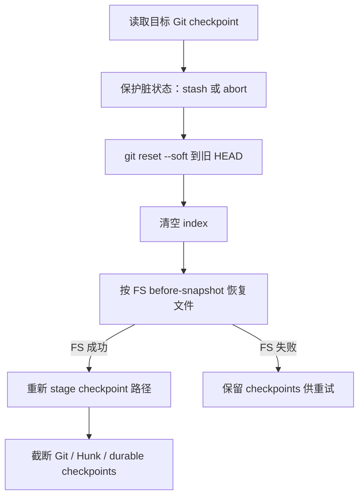
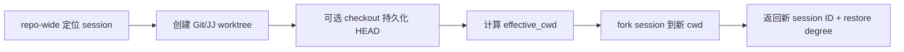

# Git、Checkpoint、Rewind 与 Worktree：多域快照、冲突检测、会话分叉和代码恢复

Grok Build 里的“回到过去”不是一个操作，而是几套边界不同的机制：

- **Rewind** 把当前 session 的对话和/或文件退回到某个 prompt 之前；
- **Checkpoint** 保存执行某个 prompt 前后，各状态域需要的最小恢复信息；
- **Git restore** 尝试恢复当时的 `HEAD` 与暂存区形状，但刻意不使用 `reset --hard`；
- **Fork** 复制会话历史，创建新的 session 身份和时间线；
- **Worktree** 创建隔离代码目录，让新 session 不必继续修改原目录；
- **Resume / rehydrate** 把持久化会话与一个新建或重建的代码目录重新配对。

它们经常同时出现在一次用户操作里，却不能当作同义词。本文的目标，是建立一张能用来调试恢复问题的状态地图：哪个状态由谁保存、恢复顺序为何重要、失败后哪些部分可能已经改变，以及哪些看似“持久化”的数据目前仍不能独立完成恢复。

---

## 1. 先记住结论

### 1.1 “Rewind 到 prompt N”是回到 N 执行前

目标是保留 prompt `0..N-1` 的效果，撤销 prompt `N` 及其后续时间线。`N = 0` 表示回到 session preamble 之后、第一条真实 prompt 之前。

这一定义同时影响：

- 对话截断位置；
- 文件 before-snapshot 的选择；
- Git checkpoint 的选择；
- hunk delta 的保留范围；
- checkpoint 的截断条件；
- `updates.jsonl` 中 rewind marker 的含义。

### 1.2 Checkpoint 是多域逻辑对象，不是一份完整目录备份

一次 prompt 的恢复信息可以分布在四个域：

| 域 | 保存内容 | 恢复目标 |
| --- | --- | --- |
| Conversation | prompt、conversation、compaction checkpoint、updates | prompt N 之前的对话 |
| Filesystem | 每个被跟踪文件的 before/after snapshot | prompt N 之前的文件内容 |
| Git | `HEAD` SHA、暂存路径 | 当时的提交位置和 index 形状 |
| Hunk tracker | 每轮增量 hunk 状态 | 与文件回退一致的 diff 归属状态 |

源码中的 `RewindCheckpoint` 当前只直接打包 FS 与可选 hunk；Git 由独立的 `GitCheckpointStore` 管理，对话则由 chat state 与持久化日志管理。因此“多域 checkpoint”是恢复协议的阅读模型，不代表所有字段都已经放进一个 JSON。

### 1.3 文件冲突检测比较的是“当前内容”和“agent 最后留下的内容”

每个 rewind point 同时保存：

- `file_snapshots`：本轮修改前的内容；
- `after_snapshots`：本轮结束后 agent 留下的内容。

恢复时，最早的 before-snapshot 决定目标内容；最新的 after-snapshot 用来判断文件后来是否被外部修改。当前内容不等于 after-snapshot 时，系统将其标为外部冲突。

### 1.4 Preview 是安全确认，不是恢复

Shell 的 `handle_rewind` 在 `force=false` 时只计算：

- 哪些文件可干净回退；
- 哪些文件被外部删除、创建或修改；
- 执行后会影响哪些路径。

它不写文件、不删文件、不截断对话，也不截断 checkpoint。`force=true` 才进入 commit 阶段。

### 1.5 Git 回退使用 soft reset，并先保护脏工作区

Workspace Git restore 的核心顺序是：

1. 检查仓库是否处于 merge/rebase 等危险操作中；
2. 工作区脏时 stash，无法安全 stash 就中止 Git 域；
3. `git reset --soft <checkpoint-head>`；
4. 清空当前 index；
5. 恢复文件内容；
6. 重新 stage checkpoint 中记录的路径。

它不使用 `reset --hard`，所以不会直接丢弃后来产生的 commit；soft reset 只是移动 `HEAD`，提交差异仍留在 index/working tree 语义中，并且 rewind 前的脏状态可保存在 stash。

### 1.6 Git 域失败并不必然阻止文件域恢复

`WorkspaceHandle::rewind_to` 会记录 Git restore 是否成功，但即使 Git 域中止，仍继续执行 FS rewind，并明确记录这是 partial rewind。调用者不能只看文件恢复成功，就推断 `HEAD`、index 和文件树完全一致。

### 1.7 对话压缩发生过以后，不能按 User message 数量直接截断

Compaction 会把多轮历史折叠成摘要，内存 conversation 中的 User item 数量不再对应 `prompt_index`。因此只要 session 曾发生 compaction，无论目标在压缩点之前还是之后，都必须从 `updates.jsonl` 和 compaction checkpoint replay。

Replay 失败时源码选择中止，而不是退回到“看起来差不多”的截断结果。

### 1.8 Durable checkpoint 目前是镜像，不是独立恢复引擎

开启 `GROK_WORKSPACE_REWIND_DURABLE` 后，checkpoint 会写入工作区内：

```text
<cwd>/.grok/rewind-checkpoints/<safe-session-id>/checkpoint-<prompt>.json
```

这些文件可在 rootfs snapshot 中存活并重新装入 cache，但源码明确说明：把 rehydrated cache 重新灌入 live file/hunk tracker 的链路尚未接通。当前 session 内 rewind 仍依赖进程内 tracker。

### 1.9 Fork 复制时间线，Worktree 隔离代码；两者可以组合但互不替代

Fork 创建新 UUIDv7 session，复制会话文件并记录 parent；它本身不创建代码目录。Worktree 创建代码副本/链接工作树，但本身不复制 chat history。Resume-in-worktree 先创建 worktree，再 fork session 到计算出的 `effective_cwd`，才同时得到隔离代码和独立会话。

### 1.10 Worktree 的默认目标是保留源工作树，而不是只 checkout HEAD

`xai-fast-worktree` 的默认 `WorkingTreeMode::PreserveWorkingTree` 会保留本地修改和未跟踪文件；Grok wire API 的默认 `WorktreeCopyMode::Dirty` 也表达同一产品意图。显式指定 Git ref 时，resume 流程会强制 `Clean`，因为目标变成“准确 checkout 某个 ref”。

---

## 2. 源码地图

| 主题 | 关键文件 | 核心符号 |
| --- | --- | --- |
| Turn 边界 | `xai-grok-workspace/src/session/checkpoint.rs` | `TurnBoundary`、`on_turn_boundary()` |
| 多域恢复编排 | 同上 | `WorkspaceHandle::rewind_to()` |
| 文件 snapshot | `xai-grok-workspace/src/session/file_state.rs` | `RewindPoint`、`FileStateTracker`、`rewind_files()` |
| Durable mirror | `xai-grok-workspace/src/session/checkpoint_store.rs` | `CheckpointStore` |
| Git checkpoint | `xai-grok-workspace/src/session/git.rs` | `GitStateRef`、`GitCheckpointStore`、`soft_restore_git_state()` |
| Shell rewind | `xai-grok-shell/src/session/acp_session_impl/rewind.rs` | `get_rewind_points()`、`handle_rewind()` |
| 对话 replay | `xai-grok-shell/src/session/helpers/replay.rs` | `replay_to_prompt()` |
| Rewind timeline | `xai-grok-shell/src/session/storage/*` | `PromptExtractIterator`、`RewindMarker` |
| Session fork | `xai-grok-shell/src/session/fork.rs` | `ForkSessionRequest`、`fork_session()` |
| Worktree RPC 类型 | `xai-grok-workspace-types/src/rpc/worktree.rs` | `WorktreeType`、`WorktreeCopyMode` |
| Worktree 编排 | `xai-grok-workspace/src/worktree/mod.rs` | create/from-worktree/apply/remove/gc |
| 快速创建引擎 | `xai-fast-worktree/src/api.rs` | `WorktreeBuilder`、`CreationMode` |
| 创建计划执行 | `xai-fast-worktree/src/worktree/{plan,execute}.rs` | `WorktreePlan`、`execute_plan()` |
| Worktree session 恢复 | `xai-grok-shell/src/session/worktree.rs` | `resume_session_in_worktree()` |
| Hunk 状态 | `xai-hunk-tracker` | `HunkTurnDelta`、`HunkTrackerSnapshot` |

路径均省略共同前缀 `crates/codegen/`。

---

## 3. 一次 Prompt 如何形成恢复点

### 3.1 单一 TurnBoundary 入口

`WorkspaceHandle::on_turn_boundary()` 是 workspace 内部 turn/prompt 边界的统一 fan-out。`TurnBoundary` 用 `prompt_index` 区分两类来源：

- `None`：普通 turn hook，只驱动 activity、上传等生命周期副作用；
- `Some(idx)`：rewind RPC 的 begin/end，驱动 FS、Git、hunk checkpoint。

这避免两个事件源误触发对方的副作用。例如 turn activity 不应因为一次 rewind finalize 被重复计数。

### 3.2 Begin prompt

开始 prompt `N` 时：

1. `FileStateTracker::begin_prompt(N)` 打开本轮窗口；
2. 若 `GROK_WORKSPACE_REWIND_GIT` 开启，读取仓库 `HEAD`；
3. 收集 repo-root-relative staged paths；
4. 写入 `GitCheckpointStore[N]`。

Git capture 是 best-effort：不在 Git 仓库、HEAD 不可解析或命令失败时可以没有 Git checkpoint，不能因此阻塞 prompt。

### 3.3 工具修改文件前

文件工具在第一次触碰某路径前调用 tracker，保存当前内容：

```text
文件存在     -> Some(content)
文件不存在   -> None
```

同一 prompt 对同一路径的 before-snapshot 采用 first-write-wins：恢复需要的是“本轮开始前”状态，而不是每次写入前的中间状态。

工作区之外的路径被跳过。新格式优先保存相对 session cwd 的 `RelPathBuf`，旧持久化数据仍可通过 `FlexiblePath::Absolute` 读取。

### 3.4 End prompt

结束 prompt `N` 时：

1. `end_prompt()` 补齐 after-snapshot；
2. 可选捕获 `HunkTurnDelta`；
3. 可选把 `RewindCheckpoint` 写入 durable store；
4. 记录各域 capture metrics。

重复 finalize 采用 last-write-wins，支持 `ForceContinue` 等可能重复结束同一逻辑 prompt 的路径。

`workspace_rewind_all_outcomes` 开启时，非 `Completed` 的 turn end 也会尝试关闭仍打开的 FS checkpoint。否则异常终止可能留下没有 after-snapshot 的窗口。

---

## 4. 文件恢复算法

### 4.1 目标内容取最早 before-snapshot

若回退到 prompt `N`，系统遍历所有 `prompt_index >= N` 的 rewind points。一个文件可能被多轮修改，目标必须是它在这些轮次中最早出现时的 before 内容。

例子：

```text
prompt 3 前: A
prompt 3 后: B
prompt 4 后: C
prompt 5 后: D

rewind to 4 => 恢复 B
rewind to 3 => 恢复 A
```

若最早 snapshot 内容是 `None`，表示文件在目标时间点不存在，恢复动作应删除它。

### 4.2 冲突检查取最新 after-snapshot

外部冲突回答的是另一个问题：当前磁盘内容是不是仍等于 agent 在相关时间线最后留下的状态？所以它需要查找最新 after-snapshot。

| 当前内容 | 最新 after | 分类 |
| --- | --- | --- |
| 相等 | 相等 | clean |
| 不存在 | 存在 | `deleted_externally` |
| 存在 | 不存在 | `created_externally` |
| 存在但不同 | 存在但不同 | `modified_externally` |

这不是 Git merge conflict。它只是发现“checkpoint 之后有别的主体动过文件”，提醒强制恢复可能覆盖用户工作。

### 4.3 Shell preview 与 workspace helper 的差别

Shell `handle_rewind()` 显式分两阶段：

```text
force=false -> 只预览 clean/conflicts
force=true  -> 写入或删除文件
```

Workspace 层的 `rewind_files()` 则是实际执行 helper，会返回冲突信息，但调用它就已经进入恢复流程。调用者若需要确认 UI，必须先使用 shell preview 或等价的只读检查，不能把 `rewind_files()` 当 dry run。

### 4.4 部分文件写失败的语义

每个文件恢复可能单独失败。Workspace helper 的关键安全规则是：只要发生文件错误，就不要截断 rewind points，让用户仍有机会修复权限/磁盘问题后重试。

Shell 本地路径会记录 warning 并继续其他文件，因此消费 `reverted_files` 时也不能仅凭 `success` 想象所有路径都完成；应同时检查 error/conflict/返回列表和日志。

---

## 5. 对话 Rewind 与 Compaction Replay

### 5.1 三种模式

| 模式 | 对话 | 文件 |
| --- | --- | --- |
| `All` | 回退 | 回退 |
| `ConversationOnly` | 回退 | 保持 |
| `FilesOnly` | 保持 | 回退 |

Picker 会为每个 prompt 建立 rewind point，即使那一轮没有文件 snapshot。`has_file_changes` 只是 UI metadata，不能决定该 prompt 是否可回退对话。

### 5.2 未压缩会话：直接截断

没有发生 compaction 时，`conversation_truncate_for_prompt()` 根据 prompt 边界保留 preamble 和 `0..N-1` 对话，然后：

- 把 conversation 写回 chat state actor；
- 将 `prompt_index` 设置为 N；
- 截断 `prompt_texts` 到 N；
- 清理与上下文预算相关的 auto-compaction suppression。

认证/额度导致的 `SUPPRESS_UNTIL_SUCCESS` 不会因 rewind 被清掉，因为它不是上下文大小问题。

### 5.3 已压缩会话：总是 replay

一旦 `last_compaction_prompt_index` 存在，源码对任意目标都执行 `replay_to_prompt()`。原因是 compacted conversation 的消息个数已经失真，不能用目标 prompt 数推断截断位置。

Replay 可能从 checkpoint 中拿到已带 System + user-info 的前缀，也可能从 raw updates 得到普通 turn。调用方会识别首项是否是 `ConversationItem::System`，必要时补回原始 preamble。

### 5.4 Replay 失败必须中止

跨 compaction 数据缺失时，不退化成普通截断：

- 普通截断可能切错轮次；
- 没 checkpoint 的 raw replay 可能生成超出 context window 的会话；
- 错误历史一旦继续执行，会污染后续持久化时间线。

因此返回清晰失败，建议选择 compaction 之后的目标。

### 5.5 Append-only 日志如何表达分叉

`updates.jsonl` 不会因为 rewind 重写旧记录。成功回退对话后追加：

```text
RewindMarker { target_prompt_index, created_at }
```

后续 prompt extraction 遇到 marker，就把已提取 prompt 列表截到 target，再继续读取新分支。这让审计日志保持 append-only，同时 replay 只重建当前有效时间线。

### 5.6 ConversationOnly 的文件 tracker 修复

只退对话、不退文件时，磁盘仍包含被丢弃 prompts 的文件效果。源码调用 `merge_rewind_tracker_from(target)`，把这些效果合并到前一个 rewind point，再删除目标之后的点。

这样下一次在同一 prompt index 重新执行时：

- 新 before-snapshot 反映当前磁盘；
- 将来 `/rewind 0` 仍可撤销全部文件效果；
- tracker 不会因对话分叉而遗失文件历史。

---

## 6. Git Checkpoint 与 Soft Restore

### 6.1 保存的不是完整 index

`GitStateRef` 保存：

- `head_sha`；
- 当时被 stage 的 repo-root-relative 路径集合。

它没有保存 index blob、文件内容或未跟踪目录。文件内容由 FS snapshots 负责，Git checkpoint 只负责提交指针和“哪些路径应该 staged”。

### 6.2 First-wins 与 attempted

同一 prompt 的 Git checkpoint 采用 first-wins，确保捕获的是 prompt 执行前状态。Store 还记录 attempted，避免一次失败捕获在重复 begin 中被悄悄替换为执行中状态。

恢复目标没有精确 checkpoint 时，可以选择目标之前最近的一份。此行为支持某些 prompt 没有 Git capture 的会话，但意味着返回结果应揭示 partial/missing 状态，不能伪装成精确快照。

### 6.3 为什么要先 stash

Soft reset 之前若工作区已有未提交变化，移动 HEAD 和清空 index 会把“rewind 产生的变化”与“用户刚做的变化”混在一起。stash-or-abort 将当前脏状态先保存；无法可靠保护时宁可中止 Git 域。

merge、rebase、cherry-pick 等 in-progress 状态也会中止，因为此时 index 含有操作协议状态，普通 reset/stash 语义不足以保证安全。

### 6.4 恢复顺序为何不能换

完整 workspace 顺序为：



若先恢复文件再 stash，stash 会把刚恢复的目标状态一起收走；若在文件恢复前重新 stage，index 保存的又是错误内容。

### 6.5 Partial rewind 是一等状态

可能出现：

- FS 成功，Git 无 checkpoint；
- FS 成功，Git 因进行中的 merge 中止；
- soft reset 成功，FS 失败；
- FS 成功，但 restage 失败；
- stash 成功，但后续 reset 失败，stash pop 也失败。

因此 `GitRestoreOutcome` 分开记录 `restored`、`index_reset`、`aborted_reason`、`stash_ref`。恢复 API 和 UI 应传递这些信息，而不是压成一个布尔值。

### 6.6 Feature flag 默认关闭

以下域默认都不是无条件开启：

```text
GROK_WORKSPACE_REWIND_GIT=false
GROK_WORKSPACE_REWIND_HUNKS=false
GROK_WORKSPACE_REWIND_DURABLE=false
```

阅读测试或线上日志时先确认 flag。看到 FS rewind 成功，不代表 Git/hunk/durable 路径运行过。

---

## 7. Hunk Tracker 恢复

Hunk tracker 记录“哪些 diff hunk 属于哪一轮”，服务于变化归属、反馈和显示，不等于文件内容本身。

回退到 N 时，`restore_hunk_checkpoints()`：

1. 取所有 `< N` 的 delta，按 prompt 升序组合；
2. 同一路径采用最后写入的 snapshot；
3. 从最终 file states 收集仍存在的 hunk IDs；
4. 从 turn index 删除已经不存在的 IDs；
5. 恢复 tracker state；
6. 删除 `>= N` 的 hunk checkpoints。

若 flag 是 session 中途才开启，store 只有 `>= N` 的 delta，而 N 又大于 0，源码选择 no-op，不用不完整历史把 live hunk 状态错误清空。`N = 0` 则可安全恢复为空。

---

## 8. Durable Checkpoint Store

### 8.1 路径必须处理不可信 session ID

Session ID 来自 RPC，不能直接 `root.join(session_id)`。`session_store_dir_name()`：

- 将非字母数字、`-`、`_` 字符替换为 `_`；
- 可读前缀最多 48 字符；
- 对原始 ID 计算稳定 FNV-1a 64-bit hash 并附加。

即使传入 `../../etc`，结果也只是 store root 下的单一路径组件；hash 又避免不同原始 ID 在 sanitize 后碰撞。

### 8.2 写入协议

Checkpoint 写入使用：

1. 唯一临时名：prompt + PID + 单调 counter；
2. 写完整 JSON；
3. `sync_all()` 刷内容和 metadata；
4. rename 到最终文件；
5. best-effort fsync 目录。

临时名不能只含 prompt index，否则并发 finalize 会共享 temp file。Rename 提供可见性原子性，文件 fsync 才降低 snapshot 捕获到短文件/空文件的概率。

### 8.3 Cache、磁盘与并发

- `BTreeMap` 按 prompt 排序，便于淘汰最老 checkpoint；
- 默认最多保留 64 份；
- `io_lock` 串行化 `persist` 与 `truncate_from`；
- cache mutex 不跨文件删除 I/O 持有；
- truncate 会扫描磁盘，而不只看 hot cache。

若 truncate 无法扫描一个可能仍有旧 blob 的目录，它宁可保留 cache，避免未来 rehydrate 把“已回退”的 checkpoint 复活成 cache/disk 不一致状态。

### 8.4 `.gitignore` 不是秘密保护

Store root 写入内容为 `*` 的 `.gitignore`，作用是防止 checkpoint 被普通 Git add 提交。它不提供加密、访问控制或安全擦除。Snapshot 可能包含源码内容，因此仍要按本地敏感数据处理。

### 8.5 当前未接通的最后一公里

构造 `CheckpointStore` 时可以从磁盘 rehydrate 新的 cache，但 live FS/hunk tracker 尚不会由该 cache 重新播种。因此它目前主要保证“数据跟随 rootfs snapshot 存活”，还不能证明进程重启后可以只靠这些 JSON 完成 rewind。

测试 durable store 时必须分别证明：

- 文件成功落盘并可 rehydrate；
- cache cap/truncate 正确；
- 进程内 tracker 能 restore；
- 跨进程端到端 restore 是否已接线。

前三项通过不等于第四项通过。

---

## 9. Session Fork

### 9.1 Fork 创建新身份

`fork_session()` 默认生成普通 UUIDv7，不把 parent ID 编码进字符串，因此 fork-of-fork 的 ID 仍固定 36 字符。Parent 关系单独写 metadata。

请求可指定：

- source session/cwd；
- new cwd；
- client-provided new session ID；
- model override；
- target prompt index；
- `session_kind`；
- `source_workspace_dir`。

### 9.2 复制什么

`JsonlStorageAdapter::copy_session_data_sync()` 根据 `CopySessionOptions` 复制：

- chat history；
- updates timeline；
- plan state；
- summary/metadata；
- compaction segment archive；
- 可按 `target_prompt_index` 截到某轮。

复制被放到 blocking pool，因为同步磁盘 I/O 若直接运行在 LocalSet，会让多个 fork 表面异步、实际串行阻塞。

### 9.3 Backend 注册是非关键路径

本地 session 文件写好以后，backend upsert 以 fire-and-forget task 运行。网络注册失败只 warning，不让本地 fork 失败；未来后台或其他同步路径可让 backend 最终获知该 session。

这说明 local persistence 是 fork 成功的 authoritative state，backend registration 是 eventual side effect。

### 9.4 Fork 不会启动 session

源码模块注释明确：fork 创建新 session 文件，但不启动 session actor。调用方还要用新 ID/cwd 进入正常 resume/start 流程。

---

## 10. Worktree 创建模型

### 10.1 三种 CreationMode

| Wire `WorktreeType` | Engine `CreationMode` | 机制 | 主要取舍 |
| --- | --- | --- | --- |
| `linked` | `Linked` | `git worktree add --no-checkout` + 并行 CoW copy + index finalize | 大仓库快，共享主仓库 Git metadata |
| `standalone` | `Standalone` | 独立 `.git/` 的 CoW repo copy | 可独立移动/替换，占用更多 metadata |
| `git` | `GitCheckout` | 普通 `git worktree add` 完整 checkout | 逻辑简单，checkout 单线程 |

Linux/Btrfs 上 Linked/Standalone 可自动使用 snapshot；沙箱无 `CAP_SYS_ADMIN` 时可通过 `BtrfsDelegate` 请求特权 helper 创建 snapshot 或 mount overlay。

### 10.2 Working tree 与 ignored files 是两条轴

`WorkingTreeMode`：

- `PreserveWorkingTree`：复制本地修改和未跟踪文件；
- `CleanTracked`：只产生干净 tracked tree；
- `CleanAll`：再删除 untracked，但默认 Git clean 仍不删 ignored。

`IgnoredFilesMode`：

- `Skip`；
- `Copy { skip_patterns }`；
- `CopyOnly { skip_patterns }`。

不能用“copy mode=dirty”推断 `node_modules`、`target` 一定同步。Ignored artifacts 是否后台复制由独立开关控制。

### 10.3 异步调用必须包 blocking engine

`WorktreeBuilder::create()` 明确是 synchronous/blocking。Workspace 编排层负责放入 `spawn_blocking`，并用 cancellation token、streaming notification、in-progress registry 包装。

同一 session 的并发 create 通过 in-progress marker 去重。`prepare_worktree_creation()` 只判断 existing/should spawn，真正 marker 由 async creator 持有和清理，避免 prepare 后没有 creator 接手导致永久 wedged。

### 10.4 目标路径和 label

默认目录位于 Grok home 下按 repo slug 分组的 worktree base。Label 会 sanitize、截断，并在冲突时生成不重复目录名。调用方提供目标路径时仍需验证/规范化，不能把 UI label 当安全路径组件。

### 10.5 Disk full 要提升为用户可见错误

创建涉及 reflink/copy、目录、Git index 和 checkout。底层可能给出 typed `StorageFull`，Git 子进程则只在 stderr 输出 `No space left on device`。`annotate_disk_full()` 将原因提升到 error chain 顶层，避免跨 workspace/ACP flatten 后只剩“copy index failed”。

### 10.6 删除顺序保护 metadata

快速删除可能使用 Btrfs subvolume delete，或直接删除目录再清理 `.git/worktrees` 注册。Metadata DB 只在磁盘删除成功后 unregister；否则失败的 worktree 仍可被 list/gc 找到，不会变成磁盘上的无主泄漏。

---

## 11. Worktree Apply 与冲突

`ApplyWorktreeRequest` 提供：

- `Overwrite`：把 worktree 结果覆盖回目标；
- `Merge`：按 base/ours/theirs 计算并报告冲突。

响应可能是：

- `Success { files, git_root }`；
- `Conflicts { files, conflicts }`。

每个 `FileConflict` 携带 path、change type、base、ours、theirs。这里才是三方合并语义，与 rewind 的“current != latest after-snapshot”外部修改提示不同。

应用前应确认：

1. worktree 和目标属于预期 repo；
2. source session/worktree ID 能对应；
3. overwrite 是否获明确授权；
4. merge conflicts 是否交给用户决定；
5. 应用成功后是否保留 worktree 作为恢复点。

---

## 12. Resume Session in Worktree

### 12.1 本地 session 主路径

本地恢复编排是：



若 fork session 失败，会 best-effort 删除刚创建的 worktree和 stale Git registration，避免只留下孤立代码目录。

### 12.2 为什么要计算 effective_cwd

原 session 可能从 repo 子目录启动：

```text
source git root: /repo
source cwd:      /repo/apps/web
new wt root:     /grok/worktrees/repo/wt-123
```

正确的新 cwd 应为：

```text
/grok/worktrees/repo/wt-123/apps/web
```

创建响应返回 `source_git_root`，客户端从 source cwd 去掉该前缀，再把相对子目录附到新 worktree root。若简单使用 root，配置发现、相对路径、project trust 和 session persistence key 都会改变。

### 12.3 显式 git ref 强制 clean

`create_worktree_for_resume()` 看到 `git_ref` 时把 copy mode 改为 `Clean`。这是必要的：若一边指定“恢复到 commit X”，一边复制 source 的 dirty files，最终代码状态就不再等于 X。

### 12.4 恢复持久化 HEAD

Local summary 可记录 `head_commit`。新 worktree 创建后，恢复流程可 checkout 该 commit；若 worktree 带 dirty copy，会先 stash，并把 stash ref 传给用户。

恢复结果用 `RestoreDegree`/summary 表达 full、partial 或失败，不能只返回“worktree 创建成功”。代码目录创建成功与历史精确恢复成功是两个里程碑。

### 12.5 Git 与 JJ 分流

创建前检测 VCS kind：JJ repo 使用 `jj workspace add`，Git repo 使用 fast-worktree。JJ workspace 删除则执行 forget + directory cleanup。不要对 JJ 路径套用 Git worktree registration 或 Git HEAD 恢复假设。

### 12.6 Remote restore 的故障边界

Remote session 路径先创建 worktree，随后下载 memory/session-state。若 session-state archive 不可用而 conversation 无法恢复，会清理 worktree并失败，而不是返回只有代码、没有对话的伪恢复 session。

这是典型的跨域完成条件：只有代码和会话状态都达到最小可用标准，恢复才算成功。

---

## 13. Rewind、Fork、Worktree、Rehydrate 对照

| 操作 | Session ID | 对话时间线 | 原代码目录 | 新代码目录 | 典型用途 |
| --- | --- | --- | --- | --- | --- |
| Rewind | 不变 | 截断并分叉 | 原地修改 | 无 | 撤销刚才几轮 |
| ConversationOnly | 不变 | 截断并分叉 | 保持 | 无 | 重试推理但保留代码 |
| FilesOnly | 不变 | 保持 | 原地修改 | 无 | 只撤销代码效果 |
| Fork | 新 ID | 复制到目标点 | 不变 | 不自动创建 | 从历史分支继续对话 |
| Worktree create | 不涉及或绑定 ID | 不复制 | 不变 | 创建 | 隔离代码实验 |
| Resume in worktree | 通常新 ID | 复制/恢复 | 不变 | 创建 | 在隔离目录继续旧会话 |
| Rehydrate | 可保留原 ID | 从持久化恢复 | 不要求原目录仍在 | 重建 | 进程/机器恢复场景 |

选择规则：

- 想撤销当前 session 的最近操作：Rewind；
- 想保留当前结果，另开思路：Fork；
- 想避免两个 agent 改同一目录：Worktree；
- 想把旧对话和隔离代码同时继续：Resume in worktree；
- 想从持久化存档重建运行现场：Rehydrate。

---

## 14. 错误与安全边界

### 14.1 可能覆盖用户工作的操作

- `force=true` 文件 rewind；
- Apply `Overwrite`；
- worktree 删除；
- 清理 stale registration；
- checkout persisted HEAD；
- restore 后重新 stage。

执行前必须解析确切路径和 repo root。不要以 session label、未 canonicalize 的字符串前缀或用户可控 ID 直接确定删除目标。

### 14.2 Snapshot 内容可能敏感

Before/after snapshot 和 durable JSON 可能包含：

- 未提交源码；
- 本地配置；
- 粘贴进工作区的凭据；
- 生成文件内容。

`.gitignore` 只防误提交，不防本机其他进程读取。日志也不应输出完整 snapshot 内容。

### 14.3 Stash 是保护，也是需要告知用户的新状态

自动 stash 防止丢数据，但它改变了 Git stash list。返回/日志必须保留 `stash_ref`，让用户知道原工作何处可找。若恢复失败后 stash pop 也失败，不应自动删除 stash。

### 14.4 Symlink 与路径逃逸

Worktree destination、session checkpoint dir、apply path 和 file snapshot path 都是路径边界。检查必须基于规范化路径/组件语义，不可只用字符串 `starts_with`。旧 absolute snapshot 是兼容输入，不代表可以越过当前 workspace 权限。

### 14.5 进程崩溃与原子性边界

- 单个 durable checkpoint 用 temp + fsync + rename；
- 多域 rewind 不是数据库事务；
- Git soft reset、FS revert、restage 之间可能崩溃；
- fork 本地复制与 backend 注册是 eventual；
- worktree 磁盘创建与 metadata DB 注册也有顺序边界。

所以恢复系统需要可观察的阶段结果、可重试 checkpoint 和 best-effort cleanup，而不是声称全局 ACID。

---

## 15. 常见误解

### 误解一：Rewind 就是 `git reset --hard`

不是。对话和 FS 不依赖 Git；Git 域使用 soft reset + stash + restage，并且默认 feature flag 可关闭。

### 误解二：没有文件变化的 prompt 不能 rewind

不是。每条 prompt 都进入 picker；文件 snapshot 数只影响标记。

### 误解三：有 durable checkpoint 就能重启后完整 rewind

目前不成立。Disk cache rehydrate 已有，live tracker reseed 尚未接线。

### 误解四：Fork 会自动给我一个隔离工作区

不会。Fork 只复制 session 数据；要和 worktree 创建组合。

### 误解五：Worktree 一定是干净的 HEAD

默认恰恰倾向保留 dirty/untracked 状态；显式 ref 或 clean mode 才改变这一点。

### 误解六：Preview 返回 `success=false` 就是系统出错

`force=false` 本来就是 dry run，返回候选文件与冲突供确认，不能按 commit 成功语义解读。

### 误解七：文件冲突就是 Git 三方冲突

Rewind conflict 是当前内容偏离 agent after-snapshot；Apply merge conflict 才有 base/ours/theirs。

### 误解八：FS success 意味着完整 rewind success

不一定。Git 可能 partial、restage 可能失败、hunk flag 可能关闭，对话也可能在另一个控制面。

---

## 16. 修改代码时的检查清单

### 修改 checkpoint capture

- begin 是否仍先于任何工具写入？
- 同一路径是否仍 first-before-wins？
- repeated finalize 是否幂等？
- non-completed outcome 是否关闭窗口？
- 相对路径是否仍可跨 cwd/worktree 迁移？
- flag off 是否保持零额外磁盘 I/O？

### 修改 rewind

- 语义是否仍是 before prompt N？
- preview 是否绝对无写操作？
- compaction 后是否始终 replay？
- replay 失败是否中止而非猜测？
- 文件失败是否保留 checkpoints？
- Git/FS/restage 顺序是否保持？
- partial outcome 是否传到 UI/日志？
- ConversationOnly 是否修复 file tracker？
- 是否追加 rewind marker？

### 修改 Git restore

- 是否拒绝 merge/rebase 等 in-progress 状态？
- 脏状态能否 stash-or-abort？
- 是否避免 `reset --hard`？
- staged paths 是否相对 repo root？
- source cwd 位于子目录时是否正确？
- stash ref 是否返回给用户？
- restage 失败后是否错误截断 checkpoint？

### 修改 durable store

- session ID 是否仍无法 path traversal？
- temp 文件名是否并发唯一？
- rename 前是否 flush/fsync？
- persist 与 truncate 是否串行？
- cache 是否不跨 I/O 持锁？
- cap 是否淘汰最老项？
- corrupt JSON 是否隔离而非 panic？
- 文档是否仍如实标注 tracker reseed 状态？

### 修改 worktree

- 创建模式和 copy mode 是否被混淆？
- ignored copy 是否单独处理？
- blocking create 是否离开 async executor 核心线程？
- cancellation 后是否被当作失败？
- 并发相同 session 是否只产生一个 creator？
- 失败是否清理目录、Git registration、DB record？
- source subdirectory offset 是否保留？
- Git/JJ 是否正确分流？
- 删除目标是否通过只读解析确认？

---

## 17. 建议验证方式

### 17.1 快速定位

```sh
rg -n "on_turn_boundary|rewind_to|rewind_files" \
  crates/codegen/xai-grok-workspace/src

rg -n "handle_rewind|needs_compaction_replay|RewindMarker" \
  crates/codegen/xai-grok-shell/src/session

rg -n "CreationMode|WorkingTreeMode|IgnoredFilesMode" \
  crates/codegen/xai-fast-worktree/src
```

### 17.2 定向测试

```sh
cargo test -p xai-grok-workspace --lib checkpoint
cargo test -p xai-grok-workspace --lib file_state
cargo test -p xai-grok-workspace --lib worktree
cargo test -p xai-fast-worktree --lib
```

Shell lib 测试覆盖 fork、rewind 和 worktree resume；若整个 test target 被无关模块的编译错误挡住，应记录 blocker，并改跑可独立编译的相关 integration target，而不是声称目标逻辑已验证。

### 17.3 手工实验一：外部修改冲突

1. Prompt 0 让 agent 把 `a.txt` 从 A 改为 B；
2. 在 session 外手工改为 C；
3. 以 `force=false` rewind 到 0；
4. 预期得到 `modified_externally`，且磁盘仍是 C；
5. 再显式确认 `force=true`，预期恢复 A。

### 17.4 手工实验二：ConversationOnly 分叉

1. 连续两轮修改同一文件；
2. 只回退 conversation 到第二轮前；
3. 确认文件不变；
4. 用新的第二轮继续修改；
5. 再 rewind 到 0，确认原两轮和新分支效果仍可整体撤销。

### 17.5 手工实验三：Compaction 后 replay

1. 构造足够长的 session 触发 compaction；
2. 分别回退到 compaction 前、当点和之后；
3. 检查三次都走 replay；
4. 检查 System/user-info preamble 只有一份；
5. 检查新的 prompt extraction 尊重 rewind marker。

### 17.6 手工实验四：Git staged shape

1. Prompt 前 stage `a.txt`，保持 `b.txt` unstaged；
2. 让 agent 修改二者并产生 commit；
3. Rewind；
4. 检查 later commit 未被 hard-delete；
5. 检查目标 HEAD、staged path 集合和 stash ref；
6. 故意制造 merge-in-progress，确认 Git 域中止而文件域结果被标为 partial。

### 17.7 手工实验五：Source 子目录

从 `/repo/apps/web` 发起 resume-in-worktree，确认返回 `effective_cwd` 为 `<new-root>/apps/web`，并验证相对配置、plugin discovery 和文件工具 cwd 未漂移。

### 17.8 手工实验六：Durable mirror 限制

开启 durable flag，创建多个 checkpoint 并重建 `CheckpointStore`：

- 验证 JSON 可载入；
- 验证超过 64 淘汰最老项；
- 验证 truncate 删除 `>= target`；
- 然后重启 live session，确认当前代码是否真的把 cache 注入 tracker。

最后一步预期暴露“尚未接线”的边界，不能因前三步成功而跳过。

---

## 18. 自测题

1. “rewind to N”到底保留哪些 prompts？
2. Before-snapshot 和 after-snapshot 分别解决什么问题？
3. 为什么一个文件跨多轮修改时，目标内容取最早 before、冲突判断取最新 after？
4. `force=false` 是否可以截断 checkpoint？
5. 为什么发生过 compaction 后，目标在压缩点之后也必须 replay？
6. Replay 失败为什么不能退化为普通 conversation truncation？
7. RewindMarker 如何让 append-only updates 表达分叉？
8. ConversationOnly 为什么还要修改 file tracker？
9. `GitStateRef` 为什么只保存 HEAD 和 staged paths？
10. 为什么 Git restore 必须在 FS restore 前先 stash/reset/unstage？
11. Soft reset 与 hard reset 在保护 commit 上有何区别？
12. FS 成功、Git 失败时应如何向用户描述结果？
13. Hunk delta 为什么要删除已经不在最终 file state 中的 ID？
14. Durable store 为什么对 session ID 同时 sanitize 和 hash？
15. Rename 已经原子，为什么写 checkpoint 前还要 fsync 文件？
16. Durable cache rehydrate 为什么还不等于跨进程 rewind？
17. Fork 与 Worktree 分别复制什么？
18. 为什么 fork backend upsert 失败不影响本地 fork？
19. Linked、Standalone、GitCheckout 的主要差异是什么？
20. Dirty copy 与 ignored-file copy 为什么必须分成两条配置轴？
21. 显式 `git_ref` 为什么强制 clean copy？
22. Source cwd 在 repo 子目录时，怎样计算新 cwd？
23. Rewind conflict 与 Apply merge conflict 有何区别？
24. 为什么 worktree 删除失败后不能先删 metadata record？

---

## 19. 本篇术语表

| 名词 | 白话解释 | 在本篇中的具体含义 |
| --- | --- | --- |
| checkpoint | 恢复所需的状态记录 | 某 prompt 边界上的 FS/hunk/Git/对话相关状态集合 |
| rewind | 把当前时间线退到更早位置 | 恢复到 prompt N 执行前，并让后续历史失效 |
| rewind point | 可选择的回退点 | 一个 prompt index 及其 metadata/snapshots |
| prompt index | prompt 的零基序号 | N 表示第 N 个 prompt，回退到 N 保留 0..N-1 |
| state domain | 可独立捕获/恢复的一类状态 | Conversation、FS、Git 或 Hunk |
| before-snapshot | 修改前内容 | 决定 rewind 的目标文件状态 |
| after-snapshot | agent 修改后内容 | 用于检测后来是否有外部修改 |
| first-write-wins | 第一次记录后不覆盖 | 保留本轮真正开始前的状态 |
| last-write-wins | 后记录覆盖前记录 | 重复 finalize 或组合 hunk 时保留最新结果 |
| external conflict | 当前文件偏离 agent 最后状态 | Rewind 覆盖风险提示，不是 Git 三方冲突 |
| preview / dry run | 只计算影响、不修改 | `force=false` 的 rewind 阶段 |
| partial rewind | 只有部分状态域恢复成功 | 如 FS 已恢复但 Git HEAD 未恢复 |
| compaction | 把长对话折叠成摘要 | 会破坏 message count 与 prompt index 的直接对应 |
| replay | 从日志重演到目标点 | 由 updates 与 compaction checkpoints 重建 conversation |
| preamble | 会话固定开头 | System 与原始 user-info 等前缀 |
| rewind marker | 日志中的时间线截断事件 | 让 append-only updates 忽略旧分支后续 prompts |
| tracker | 内存状态跟踪器 | FileStateTracker 或 HunkTracker |
| hunk | 一段连续 diff | 用于追踪哪一轮产生哪部分代码变化 |
| delta | 相对上一状态的增量 | 每 prompt 的 `HunkTurnDelta` |
| durable mirror | 持久化副本 | 可落盘/rehydrate，但当前不是 live restore source |
| rehydrate | 从持久化重新装入 | 可指 checkpoint cache 或完整 session/worktree 恢复 |
| hot cache | 正常读取优先使用的内存数据 | CheckpointStore 的 `BTreeMap` |
| truncate | 删除目标及之后记录 | 成功回退后清除 `>= target` 的 checkpoints |
| index / staging area | Git 下一次 commit 的内容集合 | Rewind 会清空后按 checkpoint staged paths 重建 |
| staged path | 已加入 Git index 的路径 | `GitStateRef` 保存的 repo-root-relative path |
| soft reset | 移动 HEAD 但不硬删工作内容 | Git rewind 用于保留后来 commit 的变化 |
| hard reset | 移动 HEAD 并强制工作树匹配 | 本恢复路径刻意避免的破坏性操作 |
| stash | Git 临时保存未提交变化 | Rewind/checkout 前保护 dirty state |
| repo root | Git 仓库工作树根目录 | staged paths 和子目录 offset 的共同基准 |
| worktree | 同一仓库的另一工作目录 | 为 session/agent 提供代码隔离 |
| linked worktree | 共享 Git common dir 的工作树 | 快速引擎默认模式 |
| standalone repo | 带独立 `.git` 的仓库副本 | 可独立移动或替换 source |
| CoW | Copy-on-Write，写时复制 | APFS/Btrfs 等避免立即复制全部数据块 |
| Btrfs snapshot | Btrfs 的近 O(1) 子卷快照 | Linux 上的 worktree 加速方式 |
| ignored files | 被 `.gitignore` 排除的文件 | 需单独配置是否复制，如 build cache |
| effective cwd | 新 worktree 中真正继续 session 的目录 | new root 加 source 相对 repo root 的子目录 |
| fork | 从旧会话复制出新身份 | 新 UUID、parent metadata、独立后续时间线 |
| parent session | fork 的来源会话 | 通过 metadata 记录，不编码进新 ID |
| resume | 继续已有 session | 可在原目录或新 worktree 中恢复 |
| restore degree | 代码恢复完整程度 | 用于区分 full、partial、failed/skipped |
| apply | 把 worktree 变化带回目标 | 可 overwrite 或 three-way merge |
| three-way merge | 用 base/ours/theirs 合并 | Apply merge 冲突的语义 |
| in-progress marker | 创建任务占用标记 | 防同一 session 并发产生重复 worktree |
| eventual side effect | 稍后完成也不影响本地成功 | Fork 后的 backend registration |
| authoritative state | 决定事实的主状态 | Fork 成功时是本地 session files |
| cleanup | 失败后的补偿删除/注销 | 防止孤立目录、stale registration 或 DB 泄漏 |

---

## 20. 源码证据索引

| 结论 | 证据符号 |
| --- | --- |
| Turn/prompt 分流 | `TurnBoundary`、`WorkspaceHandle::on_turn_boundary()` |
| Checkpoint 组成 | `RewindCheckpoint` |
| FS 开始/结束捕获 | `FileStateTracker::begin_prompt()`、`end_prompt()` |
| 文件恢复 | `rewind_files()` |
| ConversationOnly tracker 合并 | `merge_and_remove_from()`、`merge_rewind_tracker_from()` |
| Picker 每 prompt 可见 | `SessionActor::get_rewind_points()` |
| Preview/commit 分离 | `SessionActor::handle_rewind()` |
| Compaction 总是 replay | `needs_compaction_replay()` |
| Replay 失败中止 | `replay_to_prompt()` 调用分支 |
| Timeline 分叉 | `XaiSessionUpdate::RewindMarker` |
| Git checkpoint | `GitStateRef`、`GitCheckpointStore` |
| Git soft restore | `soft_restore_git_state()` |
| Git 重新暂存 | `restage_git_paths()` |
| 多域恢复顺序 | `WorkspaceHandle::rewind_to()` |
| Hunk 恢复 | `restore_hunk_checkpoints()` |
| Durable store | `CheckpointStore` |
| Session ID 安全目录 | `session_store_dir_name()` |
| Atomic checkpoint write | `write_checkpoint_file()` |
| Fork 数据复制 | `fork_session()`、`CopySessionOptions` |
| Worktree wire modes | `WorktreeType`、`WorktreeCopyMode` |
| Engine modes | `CreationMode`、`WorkingTreeMode`、`IgnoredFilesMode` |
| Blocking create | `WorktreeBuilder::create()` |
| Disk-full 错误提升 | `annotate_disk_full()` |
| Apply 结果 | `ApplyWorktreeResponse`、`FileConflict` |
| Resume 编排 | `resume_session_in_worktree()`、`resume_local_session_in_worktree()` |
| 子目录映射 | `effective_worktree_path()` |
| Git/JJ 分流 | `create_worktree_for_resume()` |

---

## 21. 一句话复盘

Grok Build 的恢复能力不是一次粗暴的目录回滚，而是以 prompt index 为共同坐标，分别捕获对话、文件、Git 和 hunk 状态，再用 preview、stash-or-abort、soft reset、日志 replay、checkpoint 截断和 partial outcome 组合出可审计的 rewind；当目标是继续另一条时间线时，则由 Fork 复制会话、Worktree 隔离代码、effective cwd 保留原子目录语义，三者协作完成安全的 session recovery。
