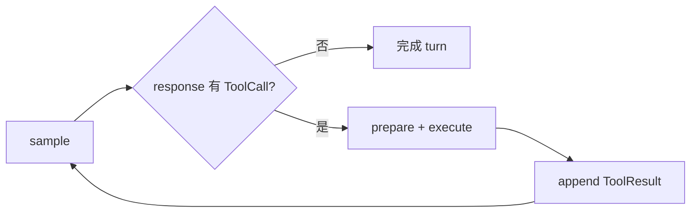

# Walkthrough：Bash Tool Call 如何经过权限、执行并回到下一轮采样

本文固定一个具体场景，沿真实源码追踪一次 Bash 工具调用：

> 普通本地 session 中，模型返回一个合法的 Bash tool call；当前不是 Plan mode；`PreToolUse` hook 放行；权限策略要求询问且用户允许；命令以前台方式执行并以退出码 0 结束；工具输出被写入对话，随后发起下一轮模型采样。

这条路径能把五个容易混在一起的概念拆开：模型只是**提出工具意图**，参数解析把它变成**类型化输入**，Hook 和权限决定**是否允许继续**，Terminal backend 负责**真正启动进程**，ToolResult 才是模型下一轮真正看到的结果。

本文核对基线为根目录 `SOURCE_REV` 记录的提交。行号只帮助首次定位，维护时应以类型和函数名为准。

---

## 1. 最终调用链

```mermaid
sequenceDiagram
    participant Model as "Model / Sampler"
    participant Loop as "Session tool loop"
    participant Prep as "prepare_tool_call"
    participant Hooks as "PreToolUse hooks"
    participant Perm as "Permission system"
    participant Dispatch as "dispatch_tool / WorkspaceOps"
    participant Registry as "FinalizedToolset"
    participant Bash as "Bash tool"
    participant Terminal as "TerminalBackend"
    participant Chat as "ChatState"

    Model-->>Loop: Assistant ToolCall(name=bash, arguments=JSON)
    Loop->>Chat: 保存 Assistant ToolCall
    Loop->>Prep: prepare_tool_call(call)
    Prep-->>Loop: Pending UI update
    Prep->>Registry: try_parse(name, arguments)
    Registry-->>Prep: typed ToolInput::Bash
    Prep->>Prep: AccessKind + Plan mode gate
    Prep-->>Loop: InProgress UI update
    Prep->>Hooks: PreToolUse(local/plugin + client)
    Hooks-->>Prep: allow
    Prep->>Perm: request_permission(context, access_kind)
    Perm-->>Prep: Allow
    Prep-->>Loop: PreparedToolCall
    Loop->>Dispatch: dispatch_tool(prepared input)
    Dispatch->>Registry: toolset.call(...)
    Registry->>Bash: Tool::run(BashToolInput, Resources)
    Bash->>Terminal: run(TerminalRunRequest)
    Terminal-->>Bash: Terminal output + exit status
    Bash-->>Registry: BashToolOutput
    Registry-->>Loop: ToolRunResult(prompt_text, output)
    Loop-->>Hooks: PostToolUse
    Loop->>Chat: ConversationItem::tool_result
    Loop->>Model: 下一轮采样包含 ToolCall + ToolResult
```

一句话概括：

```text
模型 JSON → 类型化参数 → 前置 gate → 用户/策略许可 → 工具分发
        → Terminal 进程 → 双通道结果 → ToolResult → 下一轮模型请求
```

这里的“双通道结果”是理解本链路的关键：用户界面需要结构化、可展示的输出，模型需要适合放回 prompt 的文本；两者来自同一次执行，但不是同一个表示。

---

## 2. 建议同时打开的源码

```text
crates/codegen/
├── xai-grok-shell/src/session/acp_session_impl/
│   ├── tool_calls.rs
│   └── tool_dispatch.rs
├── xai-grok-workspace/src/workspace_ops.rs
└── xai-grok-tools/src/
    ├── bridge.rs
    ├── registry/types.rs
    └── implementations/grok_build/bash/mod.rs
```

快速定位关键符号：

```sh
rg -n "execute_tool_calls|prepare_tool_call|send_tool_call_start" \
  crates/codegen/xai-grok-shell/src/session/acp_session_impl/tool_calls.rs

rg -n "handle_bridge_tool_success|handle_tool_error|handle_tool_not_executed" \
  crates/codegen/xai-grok-shell/src/session/acp_session_impl/tool_calls.rs

rg -n "dispatch_tool|call_tool" \
  crates/codegen/xai-grok-shell/src/session/acp_session_impl/tool_dispatch.rs \
  crates/codegen/xai-grok-workspace/src/workspace_ops.rs

rg -n "BashToolInput|TerminalRunRequest|impl Tool for Bash" \
  crates/codegen/xai-grok-tools/src/implementations/grok_build/bash/mod.rs
```

---

## 3. 起点：模型返回的只是工具调用提议

Sampler 收集到的 assistant response 可能同时包含文本、reasoning 和一个或多个 tool call。一个 Bash call 在概念上类似：

```json
{
  "id": "call_abc",
  "type": "function",
  "function": {
    "name": "bash",
    "arguments": "{\"command\":\"pwd && rg TODO src\",\"description\":\"查找待办项\"}"
  }
}
```

注意 `arguments` 自身仍是字符串，而且来自模型输出。此时系统尚未证明：

- JSON 合法；
- 工具名存在；
- 字段符合 Bash schema；
- 命令符合当前 mode；
- Hook 愿意放行；
- 权限策略或用户允许；
- 命令能够启动或成功退出。

因此 ToolCall 不是“命令已经执行”的记录，而是一项带 identity 的执行提议。`call.id` 会贯穿 UI 更新、执行结果和后续 ToolResult，不能用数组位置代替。

Session 会先把 assistant 的 ToolCall 放入 ChatState。这样即使后续被拒绝或执行失败，对话仍能表达“模型提出了什么、系统如何回应”，而不是只保留成功调用。

---

## 4. `execute_tool_calls`：工具轮次的总协调者

主入口位于 `tool_calls.rs`：

- `execute_tool_calls()`：处理这一轮的工具调用集合；
- `execute_tool_calls_batch()`：准备并执行一个批次；
- `prepare_tool_call()`：完成解析和所有执行前 gate；
- `handle_bridge_tool_success()`：统一处理成功结果；
- `handle_tool_error()`：统一处理工具执行错误；
- `handle_tool_not_executed()`：处理拒绝、取消等“没有真正运行”的情况。

阅读时把一次调用拆成两个阶段：

| 阶段 | 主要职责 | 是否可能产生外部副作用 |
| --- | --- | --- |
| prepare | 解析、展示、Hook、权限、生成 `PreparedToolCall` | Hook/审批交互可能有副作用，目标工具尚未执行 |
| dispatch | 经 workspace 和 registry 调用具体工具 | 是，Bash 会启动进程 |

这种拆分很重要。系统可以先依次完成交互式审批，再把已批准的多个工具并发调度；也能保证被拒绝的调用永远不会误入执行阶段。

---

## 5. 第一条可见状态：`Pending`

`prepare_tool_call()` 开始时会先发出 pending 状态。此时 UI 可能只有工具名和原始 arguments，因此展示是 best effort：JSON 还没有完成类型校验，不能假设一定拥有 `command` 字段。

这一状态回答的是：“系统已经接收到模型的调用，正在准备。”它不表示：

- permission dialog 已经出现；
- 命令已进入 terminal；
- 工具一定会执行。

把 Pending、InProgress 和终态分开，可以让慢审批、Hook 阻塞或排队等待不被误诊为 UI 卡死。

---

## 6. 从 JSON 字符串到类型化 `ToolInput`

准备阶段先规范化空 arguments，再解析 JSON，随后通过 `ToolBridge::try_parse()` 进入工具注册表。注册表根据 wire tool name 找到工具定义，并按该工具 schema 解析成统一的 `ToolInput`；Bash 分支最终携带 `BashToolInput`。

这一步带来三个边界：

1. orchestration 层不需要手写每个工具的 JSON 解析；
2. 权限和 Hook 可以读取类型化字段，而不是反复猜 JSON；
3. 真正执行的输入和完成审批的输入是同一个类型化对象，减少“审批 A、执行 B”的 TOCTOU 风险。

### 6.1 对模型瑕疵的有限恢复

源码还会尝试处理一种常见模型错误：arguments 字符串中连续输出了多个 JSON object。恢复逻辑会逐个尝试，选择第一个能被目标工具成功解析的对象，并通过 reminder 告诉模型后面的对象被忽略。

这不是“任意坏 JSON 都能修好”。恢复范围是刻意有限的，否则系统可能把模型原本表达不清的命令猜成一个可执行命令。

### 6.2 解析失败不会进入权限流程

如果工具不存在、JSON 无法恢复或 schema 不匹配，调用会进入 error/result 路径，向 UI 和模型形成可解释的失败结果。因为没有得到可信的 `ToolInput`，系统没有必要询问“是否允许执行”。

---

## 7. `AccessKind`：给权限系统的访问摘要

类型化输入随后被映射为 `AccessKind`。可以把它理解成权限系统使用的“这项工具想做什么”摘要，例如读取、写入或执行命令，而不是具体工具实现本身。

它的价值是解耦：权限层无需认识 `BashToolInput` 的全部内部字段，只需根据统一访问语义、路径上下文、策略与当前模式做判断。

但是 `AccessKind` 不是 sandbox，也不是最终安全结论。它是授权决策的输入之一。

---

## 8. Plan mode gate 先于普通权限

如果当前 session 处于 Plan mode，普通执行型工具可能被提前拒绝。这个检查位于通常的用户 permission 之前。

顺序有实际意义：Plan mode 是 agent 工作模式约束，表示当前阶段不应执行改变环境的动作；即使某位用户通常允许 Bash，也不应绕过这个模式约束。反过来，如果先弹权限框，用户会看到一项其实无论如何都不该运行的请求。

因此“用户允许”不是系统中最高级、唯一的 gate。至少还存在 mode、hook、tool validation、workspace backend 和 terminal runtime 等约束。

---

## 9. `InProgress`：使用类型化输入更新展示

解析成功并通过早期 mode gate 后，`send_tool_call_start()` 用类型化输入构造更准确的工具展示并发送 InProgress 更新。

对 Bash 而言，UI 可展示命令和 description；但 description 来自模型，是不可信的说明文字。权限判断和审计不能只信“查看目录”这类描述，必须以真实 command、cwd 和访问上下文为准。

此处 InProgress 更接近“调用已经进入执行管线”，仍不等于子进程已启动，因为 Hook 和 permission 尚在后面。

---

## 10. `PreToolUse` Hook：可编程的前置 gate

准备阶段接着运行 `PreToolUse` hooks，包含本地/plugin hook，并可进入 client hook。Hook 可以根据工具名、输入和会话上下文决定放行或拒绝。

```text
typed input
   │
   ├─ local / plugin PreToolUse
   │
   └─ client PreToolUse
          │
          ├─ allow → permission
          └─ deny  → not-executed result
```

Hook 与 permission 的角色不同：

| 机制 | 主要问题 | 典型依据 |
| --- | --- | --- |
| Hook | 组织或扩展逻辑是否允许继续 | 自定义脚本、plugin、客户端规则 |
| Permission | 当前策略/用户是否授权这次访问 | mode、policy、目录、用户选择 |
| Sandbox | 即使运行，操作系统实际允许进程做什么 | 隔离配置、系统能力、执行后端 |

PreToolUse 拒绝时，不应继续弹 permission，也不应启动 terminal。系统会记录一项“未执行”的工具结果，让模型知道调用为什么没有发生。

---

## 11. Permission：模式、路径上下文和用户决策

通过 Hook 后，系统携带 `RequestPathContext` 发起权限判断。这里同时保留：

- `real_cwd`：后端真正使用的工作目录；
- `display_cwd`：呈现给用户的工作目录。

两者在远程 workspace、映射路径或代理模式下可能不同。授权规则应针对真实资源，UI 则需要用户能理解的路径；混用会造成错误判断或误导展示。

### 11.1 常见权限模式

从调用方视角可以先记住三类行为：

| 模式 | 行为模型 |
| --- | --- |
| Ask | 遇到需要确认的访问时询问用户 |
| Auto | 由策略自动允许安全范围内的操作，必要时仍询问/拒绝 |
| YOLO | 大幅减少交互式确认，但仍不消除其他 gate 和运行时限制 |

具体 policy 比这张表更细；这张表只用于建立阅读入口。不要把 YOLO 理解为“关闭所有安全机制”。

### 11.2 `PendingInteractionGuard`

等待用户审批是一段悬空时间。guard 用于把“当前有待处理交互”纳入 session 生命周期管理，避免取消、关闭或状态切换时遗留一个无人负责的 permission request。

### 11.3 决策不只有 Allow 和 Reject

准备逻辑会区分多种结果：

- `Allow` / `Ask`：可继续执行；
- policy deny：通常形成拒绝结果并让 agent loop 继续；
- 用户 reject：形成 permission rejection；
- cancelled：本次交互或 turn 被取消；
- follow-up message：用户借审批界面补充指令，流程转入相应控制分支。

“继续 agent loop”与“执行工具”也不是同义词。拒绝后仍可把原因作为 ToolResult 给模型，让模型改用安全方案。

---

## 12. `PreparedToolCall`：批准对象就是执行对象

全部前置 gate 通过后，`prepare_tool_call()` 返回 `PreparedToolCall`。它封装后续 dispatch 所需的 call identity、工具名和已经解析/批准的输入。

安全上最重要的不变量是：

> Hook 和权限检查过的类型化对象，应当就是稍后交给工具注册表执行的对象。

如果审批后再次从可变字符串重新解析，或者某层偷偷替换 command，就会出现 time-of-check/time-of-use 问题：用户批准的是 A，系统执行的却可能是 B。

---

## 13. 多工具批次：准备有序，执行可并发

当模型一次返回多个 tool call，`execute_tool_calls_batch()` 不只是简单循环：

1. 依次做 preflight/permission，避免多个交互框无序竞争；
2. 把已准备完成的调用加入 `FuturesUnordered` 并发执行；
3. 保存原始 index 和 call ID；
4. 即使完成顺序不同，结果仍与原 ToolCall 正确配对。

### 13.1 文件编辑锁

对能明确提取目标文件的工具，批处理会依据 `file_path`、`path` 或 `target_file` 等字段共享锁，避免两个编辑同时破坏同一文件。

Bash 是例外：任意 shell 字符串可能间接改很多文件，不能靠从 JSON 提取一个路径就完整推断副作用。因此这些路径锁不能被理解成通用事务或 Bash sandbox。

### 13.2 `exit_plan_mode` 的尾部分批

退出 Plan mode 会改变后续调用的语义环境，因此源码会把相关调用切到后续 batch，而不是与依赖旧 mode 的调用随意并发。这体现了一个通用原则：影响控制面的工具调用应形成顺序边界。

### 13.3 共享认证恢复

并发工具若同时遭遇相同认证问题，不应每个都独立发起恢复。批次使用共享的 `OnceCell` 类机制对恢复动作去重，避免重复登录或多个竞争提示。

---

## 14. 分发层：从 Session 到 Workspace

准备完成后，`tool_dispatch.rs::dispatch_tool()` 把调用交给 `WorkspaceOps::call_tool()`。这层边界决定工具在哪个 workspace backend 上运行。

`WorkspaceOps` 大体存在两条路线：

| Backend | 调用方式 | 含义 |
| --- | --- | --- |
| Local | 找到绑定的 `WorkspaceSession`，调用其 toolset | 工具和 Terminal 在本机 session 资源中运行 |
| Proxy | 通过远端 ToolHarness/stream 调用 | 当前进程只协调，实际能力在远端 |

本文固定 Local 路径。Local 调用要求有效 `session_id`，再从 workspace session 取出该 session 专属的 toolset。Agent 构建完成时，`bind_local_session` 会把 Agent 的 `FinalizedToolset` 安装进对应 workspace session。

这个设计阻止了一个常见错误：把全局工具表当成所有 session 的共享执行环境。工具定义可以相同，但 Terminal、cwd、环境变量、通知句柄和 owner session 都可能不同。

---

## 15. `ToolBridge`、`FinalizedToolset` 与 IoC Resources

`ToolBridge` 包装 `Arc<FinalizedToolset>`，向 shell orchestration 提供稳定接口：

- `try_parse()`：把 wire name + JSON 变成 `ToolInput`；
- `call()`：执行类型化输入；
- 查询 definitions 和 metadata；
- 访问单独缓存的 Terminal backend 以支持取消。

`FinalizedToolset` 是已经注册完成、可供运行的工具集合。它负责：

1. wire name 到具体工具的映射；
2. schema/typed input 解析；
3. 调用具体 `Tool` 实现；
4. 把输出整理成 `ToolRunResult` 或 stream terminal。

工具实现不是通过长参数列表获得依赖，而是从 `Resources` 容器取出本次 session 的能力。Bash 会读取的资源包括：

- `Terminal` / `TerminalBackend`；
- `SessionFolder`；
- `SessionEnv`；
- `NotificationHandle`；
- `OwnerSessionId`；
- Bash 参数与截断配置；
- template renderer。

这就是本项目里 IoC 的实际样子：依赖由外部构建并注入，工具在运行时按类型领取，而不是 Bash 自己创建全局 terminal 或猜 session 路径。

ToolBridge 还单独缓存 `Arc<TerminalBackend>`，使取消逻辑可以杀掉前台进程，而不必等待可能正被工具调用占用的 registry lock。这是生命周期设计，不只是性能优化。

---

## 16. Bash 工具先验证，再构造运行请求

Bash 实现位于 `implementations/grok_build/bash/mod.rs`。其输入输出核心类型为：

- `BashToolInput`：模型提供且已经 schema 校验的参数；
- `BashToolOutput`：工具层结构化输出；
- `BashOutput`：承载命令输出、退出信息和后台状态等数据。

进入 `Tool::run()` 后仍会做运行时验证。例如：

- 当前平台上不被支持或危险的裸 `&` 用法；
- 可能匹配并杀死自身的 `pkill -f` / `pgrep -f` 模式；
- 当前配置是否允许后台命令；
- command prefix 等最终执行配置。

Schema 只能说明“字段形状正确”，不能证明 shell 语义合理，所以这些验证不能全部前移到 JSON parser。

---

## 17. `TerminalRunRequest`：Bash 与进程后端的契约

Bash 不直接在 orchestration 层调用 `std::process::Command`，而是构造 `TerminalRunRequest`，其中包含：

| 字段类别 | 作用 |
| --- | --- |
| command | 最终要交给平台 shell 的命令 |
| cwd / env | session 隔离后的工作目录与环境 |
| timeout | 最长执行时间 |
| output limit / truncation | 控制回传体积 |
| output file | 保存较完整终端输出的位置 |
| notification handle | 将执行状态发回客户端 |
| call ID | 关联 ToolCall、日志和输出文件 |
| background / block budget | 前后台与等待行为 |
| owner session | 进程生命周期归属 |
| description | 面向人的展示说明，不作为可信执行事实 |

输出文件通常位于 session 目录下的 `terminal/<call-id>.log`。因此聊天里看到的截断文本并不一定是全部输出；诊断长命令时应沿 call ID 找对应日志。

---

## 18. `TerminalBackend`：真正启动和管理进程

前台路径调用 terminal backend 的 `run()`；显式后台路径调用 `run_background()`。Terminal 层负责平台 shell、PTY/管道、进程组、超时、终止和输出采集等细节。

这里必须再次区分：

```text
Permission: “这项动作被授权了吗？”
Sandbox:    “已启动进程在操作系统层面实际能做什么？”
Terminal:   “如何启动、观察、终止并收集这个进程？”
```

三者可以互相配合，但不是一回事。权限允许不保证命令能越过 sandbox；sandbox 很严格也不意味着可以跳过用户审批；Terminal 负责执行机制，不应自行假装拥有业务授权。

### 18.1 前台命令也可能自动转后台

某些命令在前台等待预算内没有结束时，可以被自动后台化。此时工具返回的是“进程仍在运行”的状态和后续追踪信息，而不是伪造一个完成退出码。

后台进程必须绑定 owner session。否则 session 结束后，系统无法可靠判断谁负责清理、通知和恢复这些进程。

---

## 19. 非零退出码通常是工具成功返回的业务结果

对 Bash 来说，“进程正常启动并以非零码结束”通常仍返回 `Ok(BashToolOutput)`，输出里记录 exit code。它和以下基础设施错误不同：

- 无法创建进程；
- Terminal backend 故障；
- 输入在运行前验证失败；
- session 资源缺失；
- 调用被取消。

为什么这样设计？因为 `rg` 没找到内容、测试失败或编译器报错都是模型需要阅读和修正的正常命令结果。如果一律提升成系统错误，agent loop 会丢失最有价值的反馈。

可以用二维模型判断：

| 工具基础设施 | 命令退出码 | 系统理解 |
| --- | --- | --- |
| 成功 | 0 | 命令成功 |
| 成功 | 非 0 | 命令执行完但业务失败，交给模型分析 |
| 失败 | 不一定存在 | 工具执行错误，进入 error handler |

---

## 20. `ToolRunResult`：展示输出与模型文本汇合

具体工具返回后，registry 将其整理为 `ToolRunResult`，关键内容包括：

- 结构化 `output`：供 UI、通知和工具展示使用；
- `prompt_text`：写回 conversation、供模型下一轮阅读；
- effective tool name 等调用元数据。

这解释了为什么不能直接把终端 UI block 序列化进下一轮 prompt：展示需要颜色、状态、截断和交互信息，模型需要稳定、清晰、受长度约束的文本契约。

长输出可以在模型文本中截断，同时通过 output file 保留更多内容。截断是一项上下文预算策略，不代表底层命令只产生了这些字节。

---

## 21. 成功处理：UI、Hook、ChatState 三个投影

`handle_bridge_tool_success()` 接到结果后，主要完成三件事：

1. 发送终态 ToolCallUpdate，让客户端把 InProgress 更新为 completed；
2. 运行 `PostToolUse` 等后置 Hook/telemetry；
3. 向 ChatState 追加 `ConversationItem::tool_result(call_id, prompt_text)`。

同一执行事实由此形成三个投影：

| 消费者 | 需要的表示 |
| --- | --- |
| 用户/UI | 结构化状态、可读输出、完成/失败标志 |
| 扩展与观测 | hook payload、时长、错误、调用 metadata |
| 模型 | 与 `call_id` 配对的 ToolResult 文本 |

如果只更新 UI 而不写 ChatState，用户会看到命令结果，模型下一轮却不知道发生了什么；如果只写 ChatState，客户端的工具卡片可能永远停在 InProgress。

---

## 22. 为什么 ToolResult 会触发第二轮采样

工具调用不是 turn 的终点。成功处理后，tool loop 返回 Continue，conversation 现在至少包含：

```text
User: 请检查项目中的 TODO
Assistant: ToolCall(call_abc, bash, ...)
Tool: ToolResult(call_abc, "...terminal output...")
```

下一次 sampling 把这组有配对关系的历史发给模型。模型才能基于真实输出生成自然语言答案、发起下一项工具，或承认失败。

`call_id` 是协议级关联键。多个工具并发完成时，完成顺序可能是 B、A、C；不能凭“最近一个 assistant tool call”猜结果属于谁。

完整 agentic loop 是：



因此一次用户 prompt 可能对应多次 provider 请求，但仍属于同一个高层 turn。

---

## 23. 拒绝、错误和取消如何回到模型

主路径之外至少要区分三类终态：

### 23.1 没有执行

Plan mode、Hook deny、policy deny 或用户 reject 会进入 `handle_tool_not_executed()` 一类路径。结果应明确告诉模型“调用没有发生”，避免模型把缺失输出误认为空输出。

### 23.2 执行尝试发生，但工具失败

Terminal 创建失败、资源缺失或工具返回 `ToolError` 时进入 `handle_tool_error()`。系统更新 UI 终态、执行失败相关 hook/telemetry，并形成模型可见的错误结果。

### 23.3 取消

取消可能发生在等待审批、等待调度或进程运行中。不同阶段需要清理不同资源：pending interaction、future、前台进程/进程组、工具 UI 状态。ToolBridge 单独保留 Terminal handle 正是为了让运行中取消不受 registry 锁阻塞。

这三类不应压成一个布尔值 `success=false`。模型是否可以换方案、用户是否拒绝、环境是否损坏，后续策略完全不同。

---

## 24. 一条成功路径的状态时间线

| 时刻 | ToolCall UI | ChatState | 外部进程 | 下一步 |
| --- | --- | --- | --- | --- |
| T0 模型返回 call | 尚未/初始 | Assistant ToolCall 写入 | 无 | prepare |
| T1 pending | Pending | ToolCall 已在 | 无 | parse |
| T2 typed start | InProgress | 不变 | 无 | hooks |
| T3 等审批 | InProgress + interaction | 不变 | 无 | permission decision |
| T4 approved | InProgress | 不变 | 无 | dispatch |
| T5 terminal run | InProgress | 不变 | 运行中 | collect |
| T6 result | Completed | 追加 ToolResult | 已退出或后台化 | post hook |
| T7 loop continue | Completed | ToolCall/Result 已配对 | 依状态管理 | second sample |

表中最值得记忆的是：从 T2 到 T4，UI 可能已经显示 InProgress，但操作系统进程仍不存在。调试“命令为什么没跑”时，应先判断卡在 hook、permission 还是 dispatch，而不是立刻检查 shell。

---

## 25. 调试清单：命令为什么没有按预期运行

按层排查比直接在 Bash 实现里加日志更有效。

### 25.1 根本没有出现工具卡片

- sampler 是否真的返回 ToolCall；
- 工具 definitions 是否发给 provider；
- tool name 是否与 wire name 一致；
- response parsing 是否保留了 tool call。

### 25.2 一直 Pending 或很快失败

- arguments 是否是合法 JSON；
- `try_parse()` 是否找到对应工具；
- Bash schema 是否接受字段；
- 是否触发 concatenated-JSON 恢复。

### 25.3 显示 InProgress，但进程不存在

- 当前是否处于 Plan mode；
- `PreToolUse` hook 是否 deny/超时；
- 是否在等待 permission；
- decision 是否为 reject、policy deny 或 cancelled；
- local workspace session 是否绑定 toolset。

### 25.4 进程启动但输出不对

- 最终 command 是否加入 prefix；
- `real_cwd`、session env 和平台 shell 是否符合预期；
- 输出是否仅在 prompt/UI 中被截断；
- `session/terminal/<call-id>.log` 是否含完整内容；
- 命令是否自动后台化。

### 25.5 UI 有结果但模型继续胡猜

- `handle_bridge_tool_success()` 是否追加 ToolResult；
- ToolResult 的 call ID 是否匹配；
- `prompt_text` 是否包含关键 stdout/stderr/exit code；
- 下一轮 request 是否确实包含 ToolCall + ToolResult。

---

## 26. 安全边界与常见误解

### 26.1 “弹过权限框，所以命令安全”——错误

权限只表示策略或用户授权。命令仍可能失败、越权尝试或输出敏感信息；sandbox、cwd 限制、环境隔离和输出治理仍然必要。

### 26.2 “description 写着只读，所以只读”——错误

description 由模型生成，只能用于帮助人理解。真实 command 才是执行事实，而且 shell 命令可能调用脚本、重定向或间接修改文件。

### 26.3 “非零退出码等于工具基础设施故障”——错误

非零码通常是正常、可供模型分析的 Bash 结果。只有启动、资源或 terminal 层失败才属于不同的错误类别。

### 26.4 “限制聊天输出就不会泄露”——错误

结果还可能进入 terminal 日志、通知、hook 和 telemetry。每个投影都要单独审查敏感数据策略。

### 26.5 “路径锁可以保护任意 Bash 并发写入”——错误

路径锁只对能静态识别目标文件的工具有效。任意 shell 的副作用难以可靠推断，不能把启发式字段提取当事务隔离。

### 26.6 “跨平台 shell 语义相同”——错误

引号、后台符号、信号和进程组在 Unix 与 Windows 上都有差异。Bash 工具中的平台验证和 Terminal 抽象不能随意移除。

---

## 27. 修改这条链路时应守住的不变量

1. Assistant ToolCall 必须在对应 ToolResult 之前进入 conversation。
2. 每个 ToolResult 必须使用原始 call ID 配对。
3. 未通过解析、mode、hook 或 permission 的调用不得进入 dispatch。
4. 审批的类型化输入与执行输入必须保持一致。
5. 用户可见终态与模型可见结果都必须收敛，不能只更新一侧。
6. 非零 Bash exit code 与工具基础设施错误必须可区分。
7. 多工具并发不能破坏 identity 和结果配对。
8. session 取消必须能够清理 pending interaction 和运行中进程。
9. background process 必须有明确 owner 和后续观察入口。
10. 截断后的 prompt/UI 输出不能冒充完整输出。

---

## 28. 建议的源码实验

### 实验 A：观察正常成功闭环

让模型执行一个输出很短、无副作用的命令，例如 `pwd`。记录：

- ToolCall ID；
- Pending/InProgress/Completed 的先后顺序；
- permission 出现时进程是否尚未创建；
- ChatState 中 ToolCall 与 ToolResult 的配对；
- 第二次 provider request 是否包含结果。

### 实验 B：比较 reject 与 exit 1

分别执行：

1. 在权限界面拒绝一个合法命令；
2. 允许执行一个确定返回非零码的命令。

比较 UI terminal、hook 事件、ToolResult 文本和下一轮模型行为。两者都“没有得到成功业务结果”，但系统语义应完全不同。

### 实验 C：触发输出截断

运行产生大量文本的无害命令，比较：

- UI 展示；
- 模型收到的 `prompt_text`；
- `terminal/<call-id>.log`；
- 输出总量/截断提示。

### 实验 D：两个耗时不同的并发工具

让模型一次发出多个互不依赖的工具调用，验证完成顺序变化后，call ID 和 ToolResult 仍正确配对。不要用会竞争同一文件的 Bash 命令做第一次实验。

---

## 29. 建议测试入口

优先运行目标 crate 的测试，而不是一开始测试整个 workspace：

```sh
cargo test -p xai-grok-tools --lib implementations::grok_build::bash
cargo test -p xai-grok-tools --lib registry::types
cargo test -p xai-grok-workspace --lib workspace_ops
```

Shell orchestration 的定向测试也值得运行，但该 crate 的 `--lib` 会先编译所有测试模块；任何无关测试文件的编译错误都可能使目标测试尚未开始便中止。此时应明确记录为“测试前编译阻塞”，不要写成被测链路失败。

### 29.1 本文编写时的实际验证

| 命令 | 结果 | 主要覆盖 |
| --- | --- | --- |
| `cargo test -p xai-grok-tools --lib implementations::grok_build::bash` | 156 passed | Bash 前后台、超时、输出流、命令校验和 Terminal 契约 |
| `cargo test -p xai-grok-tools --lib registry::types` | 58 passed | FinalizedToolset、schema、dispatch、stream terminal 和工具名映射 |
| `cargo test -p xai-grok-workspace --lib workspace_ops` | 36 passed | WorkspaceOps wire 类型、本地 session toolset 生命周期等 |

另一次针对 `xai-grok-shell --lib` 的验证在执行测试前被现有测试源码的编译错误阻塞：`tool_layer_images_bridge_tests.rs` 调用 Base64 engine 方法时缺少 `use base64::Engine`，编译器报 `E0599`。这不是本文改动引入的错误，也不能被记为工具调用测试失败；它意味着 shell orchestration 层还需在修复该独立编译问题后补跑验证。

---

## 30. 自测题

1. 为什么 ToolCall 不能被理解为“命令执行记录”？
2. Pending 与 InProgress 分别能证明什么，不能证明什么？
3. 为什么 Plan mode gate 应在普通 permission 之前？
4. Hook、Permission 和 Sandbox 各回答哪个问题？
5. 为什么审批后不能重新从原始 JSON 构建 Bash 输入？
6. 多个工具并发完成时，系统靠什么配对结果？
7. Bash 返回 exit code 1 时，为什么通常不应变成 `ToolError`？
8. `ToolRunResult.output` 与 `prompt_text` 的消费者分别是谁？
9. 为什么 ToolBridge 要单独缓存 Terminal backend？
10. 为什么路径锁无法为任意 Bash 命令提供完整并发保护？
11. 用户拒绝后为什么仍可能继续 agent loop？
12. 怎样证明下一轮模型真正看到了命令结果？

如果能不看源码画出“ToolCall → prepare → dispatch → ToolResult → resample”，并在每条边上标注数据类型和失败分支，就掌握了本文主线。

---

## 31. 本篇术语表

| 名词 | 白话解释 | 在本文中的具体含义 |
| --- | --- | --- |
| Tool Call | 模型提出的工具调用请求 | 带 name、arguments 和 call ID 的 assistant conversation item；不代表已执行 |
| tool loop / agentic loop | 模型和工具来回接力的循环 | sample → tool execution → ToolResult → 再 sample，直到模型不再调用工具 |
| wire name | 协议线上使用的工具名字 | 模型返回的 `bash` 等名称，由 registry 映射到实际实现 |
| typed input | 已按工具 schema 解析的参数对象 | Bash 对应 `BashToolInput`，比原始 JSON 字符串更可信、更易检查 |
| schema | 参数的结构规则 | 规定字段名称、类型和必填项，但不能证明 shell 语义安全 |
| gate | 决定流程能否继续的一道关口 | Plan mode、Hook、permission 都是执行前 gate |
| Hook | 在生命周期节点运行的扩展逻辑 | `PreToolUse` 可阻止执行，`PostToolUse` 可观察执行结果 |
| IoC | 控制反转；依赖由外部装配 | Bash 从 `Resources` 取得 Terminal、session env 等，而不是自己创建 |
| Resources | 按类型保存 session 能力的容器 | FinalizedToolset 调用工具时提供的运行时依赖集合 |
| Permission | 是否授权某项访问的决策 | 基于策略、模式、路径和用户选择决定是否继续 dispatch |
| Policy | 自动化授权规则 | 可允许、要求询问或拒绝某类访问 |
| Sandbox | 操作系统/执行环境对能力的实际限制 | 即使命令被授权，仍可能因隔离边界无法访问某些资源 |
| TOCTOU | 检查时与使用时对象不一致的竞态 | 若批准 A 后重新解析/替换成 B，就可能执行未获批准的内容 |
| dispatch | 将已准备调用交给实际后端 | 从 session orchestration 进入 WorkspaceOps、toolset 和具体工具 |
| Terminal backend | 启动、观察和终止命令的抽象 | 管理 shell、进程、PTY/管道、超时和输出 |
| foreground | 调用方等待命令结束的运行方式 | terminal `run()` 主路径，但可能在预算耗尽后自动后台化 |
| background | 命令继续运行、调用先返回的方式 | 需要 owner session、进程标识和后续查询/通知 |
| exit code | 进程结束时返回的数字状态 | 0 通常成功，非 0 通常是模型可分析的命令结果 |
| ToolError | 工具基础设施或执行机制错误 | 与普通非零 exit code 区分处理 |
| ToolResult | 写回 conversation 的工具结果 | 通过 call ID 与 Assistant ToolCall 配对，供下一轮模型阅读 |
| `prompt_text` | 面向模型的工具结果文本 | 受上下文预算和截断策略约束，不等于全部原始 terminal 输出 |
| call ID | 一次工具调用的稳定 identity | 关联 UI、日志、执行结果、输出文件与 conversation item |
| preflight | 真正执行前的准备检查 | 解析、mode、hook、permission 和锁等步骤 |
| `FuturesUnordered` | 谁先完成就先产出结果的并发集合 | 批量工具执行不必按提交顺序等待，但仍靠 index/ID 配对 |
| `OnceCell` | 只初始化一次的共享单元 | 并发调用共享一次认证恢复，防止重复交互 |
| path lock | 针对已知目标路径的并发锁 | 保护明确文件编辑，不能完整推断 Bash 的任意副作用 |
| owner session | 对进程生命周期负责的会话 | 用于后台进程清理、通知和恢复归属 |

更多跨文档通用名词见 [全局术语表](../appendices/glossary.md)。

---

## 32. 源码证据索引

| 结论 | 主要源码入口 |
| --- | --- |
| 工具调用的准备、批处理和结果收敛 | `xai-grok-shell/src/session/acp_session_impl/tool_calls.rs` |
| 已准备调用的统一分发 | `xai-grok-shell/src/session/acp_session_impl/tool_dispatch.rs::dispatch_tool` |
| Local/Proxy workspace backend 分流 | `xai-grok-workspace/src/workspace_ops.rs::call_tool` |
| ToolBridge 解析、调用与 Terminal handle | `xai-grok-tools/src/bridge.rs` |
| registry、类型化调用与 `ToolRunResult` | `xai-grok-tools/src/registry/types.rs` |
| Bash 输入、验证、运行请求与输出语义 | `xai-grok-tools/src/implementations/grok_build/bash/mod.rs` |

建议结合以下专题交叉阅读：

- [工具从注册到执行](../02-runtime-flows/04-tool-execution.md)
- [权限、目录信任与 Sandbox](../02-runtime-flows/05-permission-and-sandbox.md)
- [权限判定与审批状态机](../03-subsystems/05-permission-approval-state-machine.md)
- [Hooks 子系统](../03-subsystems/11-hooks-events-dispatch-gates-and-trust.md)
- [内置工具实现与执行语义](../03-subsystems/18-builtin-tools-execution-semantics-and-output-contracts.md)
- [跨平台 Shell、Terminal、PTY 与进程生命周期](../03-subsystems/21-cross-platform-shell-terminal-pty-and-process-lifecycle.md)

---

## 33. 一句话复盘

模型发出的 Bash ToolCall 只是一个带 ID 的不可信提议；Grok Build 先把它解析为类型化输入，依次通过 mode、Hook 和 permission gate，再经 session-bound WorkspaceOps 与 FinalizedToolset 调用 Bash，Bash 把明确的 `TerminalRunRequest` 交给 Terminal backend，最后将结构化展示结果和模型可读 `ToolResult` 分别投影到 UI 与 ChatState，并以原 call ID 配对后启动下一轮采样。
