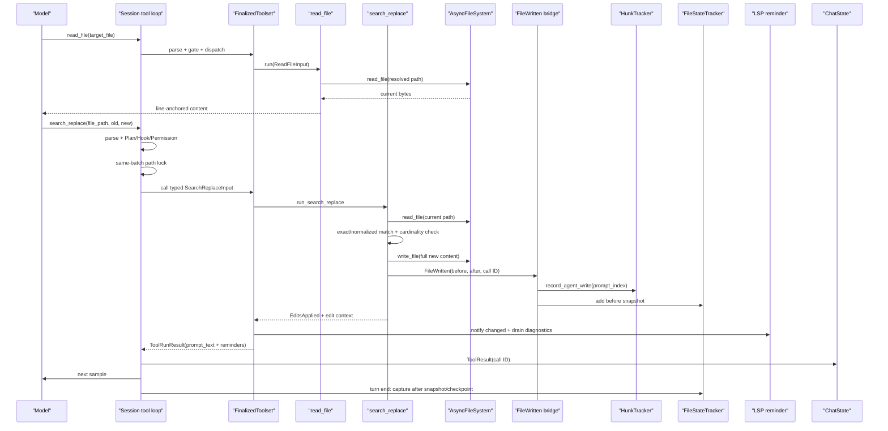

# Walkthrough：一次 SearchReplace 如何从读取依据变成可回退的文件修改

本文固定一个具体场景，沿真实源码追踪一次单文件编辑：

> 普通本地 session 中，模型先用 `read_file` 读取 `src/config.rs`，然后调用 `search_replace`，以一段唯一匹配的 `old_string` 替换成 `new_string`；当前不是 Plan mode，Hook 和权限均放行；文件写入成功，UI 收到修改结果，HunkTracker 与 rewind 系统记录前后状态，LSP 诊断作为 reminder 返回，模型继续下一轮采样。

上一篇已经解释了所有工具共有的解析、Hook、Permission、WorkspaceOps 和 ToolResult 闭环。本文不重复每个通用分支，而是专注文件编辑独有的五件事：

1. “先读后改”到底由什么保证；
2. 路径如何从模型视角映射到真实文件；
3. 精确匹配怎样防止把错误位置改掉；
4. 一次写入怎样同时进入 Diff、Hunk 和 Rewind 数据流；
5. `search_replace` 与多文件 `apply_patch` 的原子性边界有什么不同。

本文核对基线为根目录 `SOURCE_REV` 记录的提交。行号只帮助首次定位，维护时以类型、函数和测试名为准。

---

## 1. 最终调用链



把它压缩成一行：

```text
读取当前文本 → 提交“旧文本应为 A”的编辑意图 → 重新读取真实文件
→ 唯一匹配 A → 写入 B → 广播 before/after → 形成可展示、可诊断、可回退的结果
```

最重要的安全性质不是“模型曾经调用过 Read”，而是写入前工具会读取**当前文件**，并要求 `old_string` 在当前内容中满足明确的匹配规则。

---

## 2. 建议同时打开的源码

```text
crates/codegen/
├── xai-grok-tools/src/
│   ├── implementations/grok_build/read_file/mod.rs
│   ├── implementations/grok_build/search_replace/
│   │   ├── mod.rs
│   │   └── helpers.rs
│   ├── implementations/codex/apply_patch/
│   │   ├── parser.rs
│   │   ├── apply.rs
│   │   ├── seek_sequence.rs
│   │   └── tool.rs
│   ├── notification/types.rs
│   ├── reminders/lsp_diagnostics.rs
│   └── types/output.rs
├── xai-grok-shell/src/
│   ├── session/acp_session_impl/tool_calls.rs
│   ├── session/acp_session_impl/tool_dispatch.rs
│   └── tools/notification_bridge.rs
└── xai-grok-workspace/src/session/
    ├── file_state.rs
    ├── checkpoint.rs
    └── checkpoint_store.rs
```

快速定位：

```sh
rg -n "run_search_replace|handle_replacement|handle_new_file_creation" \
  crates/codegen/xai-grok-tools/src/implementations/grok_build/search_replace

rg -n "FileWritten|record_agent_write|add_before_snapshot_for_prompt" \
  crates/codegen/xai-grok-shell/src/tools/notification_bridge.rs \
  crates/codegen/xai-grok-workspace/src/session/file_state.rs

rg -n "lock_path_for_args|write_paths|file_locks" \
  crates/codegen/xai-grok-shell/src/session/acp_session_impl

rg -n "parse_patch|compute_all_changes|derive_new_contents" \
  crates/codegen/xai-grok-tools/src/implementations/codex/apply_patch
```

---

## 3. 第一步：模型读取文件，但行号锚点不属于文件

`read_file` 的模型输入核心是 `ReadFileInput`：

```text
target_file
offset?
limit?
pages?
format?
```

普通文本输出会带行号锚点，例如：

```text
41→pub struct Config {
    pub timeout: Duration,
    pub retries: usize,
```

锚点用于帮助模型定位，但 `41→` 不是磁盘内容。`search_replace` 的工具描述明确提醒：`old_string` 只能包含箭头后面的真实文本，并保持原缩进。

因此模型若要把 `retries` 从 `3` 改成 `5`，应提交类似：

```json
{
  "file_path": "src/config.rs",
  "old_string": "        retries: 3,",
  "new_string": "        retries: 5,",
  "replace_all": false
}
```

而不是把 `57→` 一起复制进去。

### 3.1 Read 输出可能不是整个文件

`read_file` 支持 offset、limit、最大行数与 token 截断。模型看见一段窗口，不表示已经掌握整个文件。编辑时使用足够的上下文，是为了让目标在当前完整文件中唯一，而不只是当前可见窗口中唯一。

### 3.2 Read 本身不会锁住未来版本

读取完成后，用户、IDE、另一个 agent 或进程仍可修改文件。这里没有数据库式 snapshot isolation，也没有“读取版本号必须等于写入版本号”的 compare-and-swap token。

所以“先读后改”是良好操作顺序，不是跨时间的强一致性承诺。

---

## 4. `requires_expr` 只保证工具组合可用

`SearchReplaceTool::requires_expr()` 默认要求 toolset 中存在 `ToolKind::Read`，并要求 edit schema 暴露 `old_string`、`new_string`、`replace_all` 等参数。

源码注释明确说明：read-before-edit 通过工具描述和训练/评分来鼓励，**不是运行时强制**。`skip_read_before_edit` 目前主要影响配置期 requirement；它不是一次调用里的“已经读过”凭证。

应区分三个层次：

| 层次 | 能证明什么 | 不能证明什么 |
| --- | --- | --- |
| Toolset requirement | 配置里有可供模型使用的 Read 工具 | 模型这次真的读过目标文件 |
| Conversation history | 历史里出现过一次 Read ToolResult | 文件从那以后没有变化 |
| 写入前精确匹配 | 当前文件仍包含模型声明的旧文本 | 文件其他区域完全未变化 |

第三项才是这次具体替换最有价值的并发防护。

---

## 5. 模型提交的是声明式编辑，不是新文件全文

`SearchReplaceInput` 有四个字段：

| 字段 | 含义 |
| --- | --- |
| `file_path` | 要修改的文件 |
| `old_string` | 模型认为当前文件中存在的旧文本 |
| `new_string` | 替换后的文本 |
| `replace_all` | 是否允许替换所有出现位置，默认 false |

这种接口把模型的意图表达成：

> 在这个文件中找到 A；如果满足约束，就把它改成 B。

相比直接提交完整新文件，它有两个优点：

- 用户在其他区域的修改不必被旧快照覆盖；
- 旧文本不再存在或出现多次时，工具可以拒绝猜测。

代价是模型必须准确复制旧文本，包括缩进、换行和默认情况下的 Unicode 字符。

---

## 6. 通用执行前 gate 仍然适用

`search_replace` 首先经过上一篇介绍的工具通用管线：

1. arguments JSON 解析为 `ToolInput::SearchReplace`；
2. `AccessKind::from()` 生成编辑访问摘要；
3. Plan mode edit gate；
4. InProgress UI；
5. `PreToolUse` Hook；
6. Permission policy/用户审批；
7. 形成 `PreparedToolCall`；
8. 经 `WorkspaceOps` 和 `FinalizedToolset` 分发。

在 Plan mode 中，普通 edit 只能命中允许的 plan 文件；其他路径被提前拒绝。`apply_patch` 因权限层拿到的是占位路径 `Edit("apply_patch")`，无法证明只改 plan 文件，因此在 Plan mode 中保守拒绝。

权限层的编辑路径来自类型化输入；它不负责验证 `old_string` 是否真的存在，这属于工具执行语义。

---

## 7. 同一批次中的同路径调用会串行

模型可能在一次 assistant response 里产生多个工具调用。Shell 在批准后，从原始参数的 `file_path`、`path` 或 `target_file` 提取目标路径：

```text
write_paths = 所有非只读调用的目标路径

对每个调用：
  若其路径在 write_paths 中 → 共享该路径的 Mutex
  否则                   → 可与其他调用并发
```

这不仅让两个同文件 edit 按模型给出的顺序执行，也会让同批次里的 read 与同路径 write 使用同一个锁。不同文件仍可并发。

### 7.1 锁键是参数字符串

锁使用模型参数中提取出的路径字符串。语义相同但写法不同的路径，例如 `src/a.rs`、`./src/a.rs`、绝对路径或经 symlink 指向同一 inode 的路径，不一定得到同一个锁键。

因此它是“同批常见冲突”的实用保护，不是全局文件系统事务锁。

### 7.2 锁的作用域有限

该锁只能协调当前批次中经这条 shell orchestration 路径调度的调用。它不能阻止：

- 用户在 IDE 中保存；
- Bash 命令写同一文件；
- 另一个 session 修改；
- 外部 formatter 或 watcher 改写。

精确 `old_string` 检查仍然不可替代。

---

## 8. IoC Resources：编辑工具如何获得文件系统能力

进入 `run_search_replace()` 后，工具从 session 的 `Resources` 取得：

- `Cwd` 与可选 `DisplayCwd`；
- `FileSystem`，即 `Arc<dyn AsyncFileSystem>`；
- `NotificationHandle`；
- `GitignoreFilter` 与 `RespectGitignore`；
- `PathNotFoundHints`；
- `Params<SearchReplaceParams>`；
- `TemplateRenderer`。

工具不直接假设 `tokio::fs` 就是真实 workspace。`AsyncFileSystem` 允许本地、代理或其他后端使用同一工具语义；DisplayCwd 则让错误消息可以显示用户认识的路径。

这也是为什么测试可以注入临时文件系统或 mock，而不需要启动完整 TUI。

---

## 9. 路径解析：模型路径、显示路径与真实路径

`resolve_model_path(cwd, display_cwd, input.file_path)` 先把模型提供的路径映射到后端路径，随后尝试 canonicalize。若目标尚不存在，则保留解析路径，并尝试 Unicode 文件名纠错。

主要路径角色：

| 路径 | 用途 |
| --- | --- |
| 模型路径 | ToolCall 参数里的相对/绝对字符串 |
| display path | 错误和 UI 中呈现给用户 |
| resolved/canonical path | AsyncFileSystem 实际读写、通知和跟踪使用 |

工具还会检查：

- 单个路径 component 是否超过 `NAME_MAX`；
- 路径是否指向目录；
- 当前 contract 下 `.gitignore` 是否禁止编辑；
- 文件不存在时是否能生成更有用的路径建议。

`.gitignore` gate 是文件工具自身的访问规则之一，不应与用户 permission 或 OS sandbox 混为一谈。

---

## 10. 基础输入校验

写入前首先拒绝 `old_string == new_string`，因为这种调用没有实际变化，通常意味着模型参数错误。

随后根据 `old_string` 是否为空分成两条路线：

```text
old_string == ""  → handle_new_file_creation
old_string != ""  → handle_replacement
```

空旧文本不是普通的“匹配空串”。它被定义为创建新文件或整文件写入语义。是否允许覆盖已有非空文件，由 `empty_old_string_does_not_override` 配置控制；当前默认保留 legacy 覆盖行为，启用 guard 后才会返回 `FileAlreadyExists`。

这项默认值很容易被工具描述误导，所以 `versioned_definition()` 会根据有效参数决定是否向模型展示“不能覆盖已有非空文件”的句子。

---

## 11. 替换主路径先重新读取真实文件

`handle_replacement()` 使用 `AsyncFileSystem::read_file(path)` 再读一次当前内容。这次读取发生在实际工具执行阶段，不复用先前 `read_file` 返回给模型的文本。

错误被细分为：

- file not found；
- path is directory；
- filename invalid/too long；
- permission denied；
- 其他底层错误提升为 `ToolError::execution`。

读取成功后，bytes 使用 `String::from_utf8_lossy` 转成文本。对于包含非法 UTF-8 的二进制文件，这会发生替换字符转换，因此 `search_replace` 本质上是文本编辑工具，不适合无损修改任意二进制文件。

---

## 12. CRLF 规范化与回写

如果原文件含 `\r\n`，匹配阶段先把 CRLF 规范化成 LF。模型从 Read 输出复制出的文本通常以统一换行呈现，因此无需在 `old_string` 中猜 `\r`。

替换完成后，如果原文件使用 CRLF，工具再把结果恢复成 CRLF 后写回。

```text
disk CRLF → match view LF → perform replacement → write view CRLF
```

这不是通用混合换行保存器。若文件内部混合 LF/CRLF，基于“是否包含 CRLF”的整体策略可能统一换行风格。修改相关逻辑时，应专门验证混合换行案例。

---

## 13. 精确匹配和基数检查

默认路径通过 `match_indices(old_string)` 收集所有字节匹配位置，然后应用以下规则：

| 匹配数 | `replace_all` | 结果 |
| --- | --- | --- |
| 0 | 任意 | `NoMatchesFound`，不写文件 |
| 1 | false/true | 替换唯一位置 |
| >1 | false | `MultipleMatchesFound`，不猜位置 |
| >1 | true | 替换全部位置 |

“默认必须唯一”是最核心的防误改规则。如果一个短标识符出现十次，系统不会默认选择第一处；模型应增加函数名、邻近行和缩进，使 `old_string` 唯一。

### 13.1 为什么不是用行号直接编辑

行号在并发修改后容易漂移，而且 Read 输出的锚点不属于文件。上下文文本既表达位置，也能验证模型看到的局部内容仍然存在。

### 13.2 `replace_all` 是明确扩大影响范围

设置 `replace_all=true` 通常适合全局重命名，但也意味着模型主动放弃唯一性保护。权限 UI 和 review 应把它视为更宽的编辑意图，而不是一个无关紧要的布尔字段。

---

## 14. Unicode confusable：诊断与可选 fallback

智能引号、en dash、non-breaking hyphen 等字符肉眼相似但字节不同。精确匹配失败时，当前实现可以：

- 生成针对 confusable 字符的诊断提示；
- 在 `unicode_normalized_fallback` 开启时，用规范化比较尝试匹配；
- 若规范化后仍有多个或重叠歧义，返回 `MultipleMatchesFound`；
- 成功 fallback 时在结果中标记 `unicode_normalized=true`。

fallback 默认关闭，说明系统优先选择“明确失败并让模型重读”，而不是默默把相似字符当成相同字符。对代码、标识符和安全敏感文本，这种保守默认更容易审计。

---

## 15. No Match 是有信息的业务结果

找不到 `old_string` 时返回 `SearchReplaceOutput::NoMatchesFound`，而不是写空结果或抛出不可恢复的基础设施异常。

错误文本可能包含：

- 建议重新使用 Read 工具；
- “用户可能已修改文件”的提示；
- 最接近的行和有限长度 snippet；
- Unicode typography 诊断；
- canonical file path 和内部 snapshot 字段。

这会作为 ToolResult 回到模型，使 agent loop 可以自然执行：

```text
edit failed: stale old_string
        ↓
read_file again
        ↓
construct fresh, more specific old_string
        ↓
retry edit
```

不要把自动重试写在工具内部。重新读取与重新决定改法需要模型理解新的代码上下文。

---

## 16. 计算新全文，再调用 `write_file`

匹配通过后，helper 根据匹配 positions 生成 `new_text`。即使接口表达的是局部替换，底层 `AsyncFileSystem` 接收的仍是**完整新文件内容**。

这意味着 read-match-write 之间仍有一个竞争窗口：外部修改若恰好发生在工具读取之后、写入之前，可能被完整新文本覆盖。同批路径锁减少内部竞争，但不是跨进程 compare-and-swap。

如果未来要强化一致性，合适的方向是让文件系统后端支持版本/内容哈希条件写，而不是仅在模型 prompt 中强调“先读”。

写失败会根据 I/O error 映射为 `InvalidInput`、`FilenameTooLong` 等输出；某些未知底层故障则保持工具执行错误。

---

## 17. 写入成功后生成 `FileWritten`

文件写入成功后，工具发送：

```text
FileWritten {
    tool_call_id,
    absolute_path,
    content,          // 写入后的完整文本
    previous_content, // 写入前完整文本；新文件为 None
    is_new_file,
}
```

这个通知是编辑工具与 Diff/Rewind 基础设施之间的事实契约。它携带 before 和 after，消费者无需再次竞争性读取“写入前内容”。

顺序也很重要：只有 `write_file` 成功后才发送通知。否则 HunkTracker 可能记录一个磁盘上从未发生的修改。

`tool_call_id` 让文件变化能够关联到原始工具调用；`absolute_path` 避免下游再次猜 cwd 映射。

---

## 18. Notification bridge：一次写入分叉成两个状态系统

Shell 的 `tools/notification_bridge.rs` 接到 `ToolNotification::FileWritten` 后读取当前 `prompt_index`，然后执行两条更新：

```text
FileWritten
  ├─ HunkTracker.record_agent_write(path, after, prompt_index, before)
  └─ FileStateTracker.add_before_snapshot_for_prompt(prompt_index, path, cwd, before)
```

### 18.1 HunkTracker 回答“改了什么”

它使用前后内容计算/记录 agent edit hunks，支持 UI diff、每 turn 归属和后续 hunk 操作。其 source 带 `AgentEdit { prompt_index }`，所以同一会话不同 turn 的修改能够区分。

### 18.2 FileStateTracker 回答“怎样回到之前”

它把第一次触及文件前的内容加入该 prompt 的 `RewindPoint`。已有文件保存 `Some(previous_content)`；新文件保存 `None`，表示回退时应删除该文件。

两者使用相似数据，但目的不同。Diff 数据不能自动替代完整 rewind snapshot；rewind snapshot 也不是为高质量 UI hunk 展示设计的。

---

## 19. 为什么 before snapshot 采用 first-wins

同一个 prompt 内，模型可能连续编辑同一文件：

```text
初始 A → edit1 得到 B → edit2 得到 C
```

如果 rewind point 每次覆盖 before snapshot，最终保存的是 B，回退这个 prompt 只能回到中间态。正确目标是保存第一次写入前的 A。

因此 `RewindPoint::add_snapshot` 的语义应是同 prompt、同文件 first-wins。Turn 结束时再读取最终状态 C，形成：

```text
before = A
after  = C
```

这也是 FileWritten 必须带 `previous_content` 的原因：通知到达时，磁盘已经是 B/C，重新读取无法恢复第一次写入前的 A。

---

## 20. Turn 边界完成 after snapshot 与持久化

Workspace 的 turn boundary 在 prompt 开始时调用 `FileStateTracker::begin_prompt(prompt_index)`；结束时调用 `end_prompt()`：

1. 清除 current prompt 标记；
2. 找出本 prompt 触及过的路径；
3. 从文件系统读取最终内容；
4. 写入 after snapshot；
5. 可选捕获 HunkTurnDelta；
6. 开启 durable rewind 时，把组合 checkpoint 写盘。

`RewindCheckpoint` 可以组合多个域：

- filesystem `RewindPoint`；
- 可选 hunk delta；
- 可选 Git HEAD/index 状态。

因此“工具返回 success”和“本 turn 的可回退 checkpoint 已完整 finalize”不是同一个时刻。前者发生在工具调用结束，后者发生在 turn boundary。

CheckpointStore 使用临时文件再 rename 的方式持久化单个 checkpoint，避免进程在写 JSON 中途崩溃留下被误认为完整的记录。

---

## 21. `EditsApplied`：为 UI 保留局部编辑上下文

写入成功后，`SearchReplaceOutput::EditsApplied` 包含：

- `old_string` / `new_string`；
- 面向模型的成功文本；
- canonical `absolute_path`；
- 每个替换位置的 `SearchReplaceEditDetail`；
- 可选 patch；
- `unicode_normalized` 标志。

每个 detail 记录：

- 原/新起始行号；
- context before / after；
- 行内匹配前缀 `line_prefix`；
- 具体 old/new string。

这些结构让 UI 可以展示局部 diff，而不用再次对已变化的磁盘文件猜测替换位置。

工具还通过 `line_diff` 汇总 added/removed 行并写入 tracing span `edit.lines`，供观测系统统计编辑规模。

---

## 22. LSP reminder：编辑后的诊断进入模型反馈

`FinalizedToolset` 在得到 ToolOutput 后运行 cross-cutting reminders。`LspDiagnosticsReminder` 对成功的 SearchReplace 做两件事：

1. 确保 LSP 后台启动；
2. 读取已修改文件，调用 `notify_file_changed()`，随后在有限超时内 drain diagnostics。

如果得到诊断 summary，它会作为 `<system-reminder>` 一类文本附加到 `prompt_text`。模型下一轮不仅知道“文件已更新”，还可能立刻看到类型错误、未使用变量等反馈。

LSP reminder 是 best effort：

- 没有 LSP resource 时直接跳过；
- server 尚未 ready 时 adapter 可缓冲变更；
- drain 超时或无诊断时不产生 reminder；
- 它不决定写入是否成功。

不要把“没有 LSP 提示”理解成“修改已通过编译”。

---

## 23. ToolResult 再次驱动模型循环

Registry 把结构化输出渲染成模型用的 `prompt_text`，再附加 reminders。Session 的成功 handler：

- 更新 UI ToolCall 为 completed；
- 执行 PostToolUse/telemetry；
- 追加与原 call ID 配对的 `ConversationItem::tool_result`；
- 返回 Continue，触发下一轮采样。

此时模型可能选择：

- 根据成功结果继续编辑其他位置；
- 根据 LSP diagnostics 修复新错误；
- 运行测试；
- 读取修改后的区域验证；
- 直接给用户总结。

工具成功只证明编辑操作按工具契约完成，不证明任务目标正确。测试和复读仍是更高层 agent workflow 的责任。

---

## 24. SearchReplace 的失败输出不是同一种错误

`SearchReplaceOutput` 将常见业务失败保留成类型化 variant：

| Variant | 含义 | 合理的模型动作 |
| --- | --- | --- |
| `NoMatchesFound` | 当前文件没有旧文本 | 重读并重构 old_string |
| `MultipleMatchesFound` | 目标不唯一 | 增加上下文或明确 replace_all |
| `FileAlreadyExists` | 创建语义触发覆盖 guard | 改用准确 old_string 或换路径 |
| `InvalidInput` | 同串、目录、gitignore、写入映射等问题 | 修正参数/目标 |
| `FileNotFound` | 路径不存在 | 检查 cwd、拼写或目录 |
| `FilenameTooLong` | component 超平台限制 | 缩短路径 |
| `EditsApplied` | 写入成功 | 验证、测试或继续任务 |

这些 variant 在 `ToolOutput::is_error()` 中被区分，最终仍可作为模型可读结果进入 agent loop。基础设施级 `ToolError` 则表示 registry/resource/backend 等更底层问题。

---

## 25. 对比：`apply_patch` 如何处理多文件修改

`apply_patch` 接收一段自定义 patch grammar，可在一次调用中 Add、Delete、Update、Move 多个文件。

它的工具内部流程是：

```text
Phase 1: parse_patch
Phase 2: compute_all_changes（读取文件、在内存推导所有新内容）
Phase 3: 逐个写入/删除，并逐项发送 FileWritten
Phase 4: 构造 A/M/D/M summary
```

### 25.1 “先全量计算”提供了什么

只要任意 hunk 无法找到 context，Phase 2 就返回 `ApplicationError`，Phase 3 尚未开始，因此不会出现“前两个文件已改、第三个因为旧文本过期而失败”。

对 patch 语法/上下文错误而言，它具有 preflight all-or-none 的性质。

### 25.2 它不等于真正的事务

Phase 3 仍是逐项 `write_file` / `delete_file`：

- 第一个写成功、第二个 I/O 失败时，没有自动 rollback；
- compute 与 write 之间仍可能有外部并发变化；
- Move 先写目标再删源，中间失败可能留下双份文件；
- Add 会创建 parent directories，这些目录副作用也不在事务日志里。

所以准确说法是：

> ApplyPatch 在写入前全量验证和计算，但文件系统落地不是原子事务。

### 25.3 ApplyPatch 与 shell 路径锁的缺口

通用 `lock_path_for_args()` 只看顶层 `file_path`、`path`、`target_file`。ApplyPatch 的真实路径藏在 `patch` 文本中，因此调用层无法为每个目标文件建立同批路径锁。它的 Phase 2 降低内部半应用风险，但不能代替跨工具并发协调。

### 25.4 ApplyPatch 的通知和回退

每个成功落地的 Add/Delete/Update/Move 都发 `FileWritten`。Move 会分别通知目标创建和源删除。因此已经发生的部分写入仍能被 Hunk/Rewind 捕捉；这不等于当前调用自动回滚，只表示后续 session rewind 拥有恢复依据。

---

## 26. SearchReplace、ApplyPatch 与 HashlineEdit 怎么选

| 工具 | 意图表达 | 优点 | 主要风险/限制 |
| --- | --- | --- | --- |
| SearchReplace | 单文件精确 old→new | 简单、唯一性保护、失败易重读 | read-write race；多处修改较啰嗦 |
| ApplyPatch | 多文件 hunk patch | 一次表达 add/delete/move/update；写前全量计算 | 落地非事务；顶层无法提取每个锁路径 |
| HashlineEdit | 基于带 hash 的行锚点/range | 可检测陈旧锚点，适合结构化行编辑 | 必须配套 hashline read/grep；不能与标准工具混装 |

Registry 明确禁止 standard file bundle 与 hashline bundle 混用。它们的 read/edit 契约不同，混在一起会让模型把一种锚点误用到另一种工具。

本文主线的判断准则：单个局部变化优先 SearchReplace；多个彼此关联的文件操作适合 ApplyPatch；需要更强陈旧行锚点检测时研究 Hashline 工具组。

---

## 27. 成功路径状态时间线

| 时刻 | 文件内容 | ToolCall UI | Hunk/Rewind | 模型上下文 |
| --- | --- | --- | --- | --- |
| T0 turn start | A | 无 | open prompt checkpoint | User prompt |
| T1 read | A | Read completed | 无写入 | A 的带锚点窗口 |
| T2 edit pending | A | Pending/InProgress | 无变化 | Assistant ToolCall |
| T3 permission | A | waiting | 无变化 | 尚无 ToolResult |
| T4 edit re-read | A | InProgress | 无变化 | 尚无 ToolResult |
| T5 write success | B | InProgress | FileWritten(before=A, after=B) | 尚未追加 |
| T6 result | B | Completed | hunk + before snapshot | ToolResult + LSP reminder |
| T7 turn end | B | terminal | after snapshot/checkpoint | conversation 持久化 |

如果 T5 后进程崩溃而 turn boundary 尚未 finalize，FileWritten 已经尽早提供 before snapshot；durable checkpoint 是否已经落盘则取决于后续边界和配置。理解这个时间差对故障恢复很重要。

---

## 28. 调试清单

### 28.1 模型读到了内容，却总是 NoMatches

- 是否把 `LINE_NUMBER→` 锚点放进 old_string；
- 缩进、空行和末尾换行是否完全一致；
- 是否存在 CRLF/Unicode typography；
- 用户或 formatter 是否在 Read 后修改文件；
- Read 是否只展示了截断窗口；
- 使用的是否是另一个 display cwd 下的同名路径。

### 28.2 返回 MultipleMatches

- old_string 是否过短；
- 是否可加入函数/类型声明和邻近行；
- 是否真的需要 `replace_all=true`；
- Unicode normalized fallback 是否产生多个候选。

### 28.3 磁盘已改但 UI 没有 diff

- `write_file` 后是否发送 FileWritten；
- NotificationHandle 是否为 session bridge 而不是 noop；
- call ID、absolute path、previous_content 是否正确；
- hunk tracker 是否启用并活着；
- notification 是否在 session teardown 后才到达。

### 28.4 UI 有 diff，但 rewind 不完整

- turn 开始是否建立 prompt index；
- bridge 是否调用 `add_before_snapshot_for_prompt`；
- 同文件第一次 snapshot 是否被后续写覆盖；
- turn end 是否调用 `end_prompt`；
- durable/hunk/git rewind feature 是否启用；
- checkpoint store 是否因 I/O 错误跳过写盘。

### 28.5 编辑成功但模型没修 LSP 错误

- 是否配置 LSP backend；
- reminder 是否启用；
- diagnostics drain 是否超时；
- `prompt_text` 是否包含 reminder；
- 下一轮 provider request 是否包含 ToolResult。

---

## 29. 安全与数据一致性边界

### 29.1 Permission 不等于内容正确

用户允许编辑某路径，只授权访问，不证明 old/new 业务含义正确。代码 review 和测试仍然需要。

### 29.2 精确匹配不是完整 CAS

它验证工具读取时旧文本存在，但 write_file 没有携带文件版本条件。读取后到写入前仍有 race。

### 29.3 Gitignore 不是 Sandbox

Gitignore filter 只限制特定文件工具。Bash、其他 backend 或显式配置可能有不同规则；不能把它当 OS 访问控制。

### 29.4 Full content notification 是敏感数据面

FileWritten 同时携带修改前后完整文本。它对 rewind 很有价值，也意味着通知、日志和持久化边界必须避免泄露密钥或大文件内容。

### 29.5 Symlink 与路径别名会削弱字符串锁

权限、canonicalization、display 和 batch lock 使用路径的阶段不同。审计时应关注“最终写了哪个 canonical path”，而不只看模型参数字符串。

### 29.6 Partial success 必须如实记录

ApplyPatch 的落地阶段可能部分成功。不能因最终返回 ToolError 就丢弃已经发送的 FileWritten，也不能向模型声称所有文件都未改变。

---

## 30. 修改这条链路时应守住的不变量

1. SearchReplace 写入前必须读取当前文件，而不是复用陈旧 Read 输出。
2. 默认多匹配必须拒绝，除非调用明确设置 replace_all。
3. 匹配失败时绝不能发生文件写入。
4. `write_file` 成功前不能发送 FileWritten success 通知。
5. FileWritten 必须携带正确 call ID、absolute path 和 before/after。
6. 同 prompt 同文件的 rewind before snapshot 必须 first-wins。
7. Turn end 必须为触及文件捕获最终 after snapshot。
8. UI diff、模型 ToolResult 与 rewind state 不能只更新其中一部分。
9. LSP reminder 失败不能把已成功写入伪装成写入失败。
10. ApplyPatch 的“全量计算”不能被文档或 UI 宣传成文件系统事务。
11. Move 的源删除与目标创建都必须进入通知/回退跟踪。
12. 标准工具和 Hashline 工具的锚点契约不能混用。

---

## 31. 建议源码实验

### 实验 A：唯一匹配成功

在临时文件中放一个唯一 old_string，执行 SearchReplace。核对：

- 最终文件；
- EditsApplied 的 old/new line 与 context；
- FileWritten 的 before/after；
- HunkTracker prompt index；
- ToolResult call ID。

### 实验 B：0、1、2 个匹配

对同一 input 构造三份文件，验证状态表中的 NoMatches、EditsApplied 和 MultipleMatches。然后只在第三份设置 replace_all，验证全部替换。

### 实验 C：模拟用户并发修改

模型 Read 后，手动修改 old_string 所在行，再允许 edit。观察工具是否返回 NoMatches 并提示重读。再做一种只修改文件其他区域的情况，观察局部替换为何仍可成功。

### 实验 D：同 prompt 连续两次编辑

让文件 A→B→C，检查 rewind point 的 before 是 A、after 是 C，而不是 B→C。

### 实验 E：ApplyPatch 预计算失败

构造两文件 patch，使第二个 hunk context 不存在。确认 Phase 2 返回前第一个文件尚未写入。然后模拟 Phase 3 I/O failure，理解为什么它仍可能 partial apply。

### 实验 F：CRLF 与 Unicode

分别测试 CRLF 文件和含智能引号的文件。比较精确匹配、诊断提示、开启 normalized fallback 后的结果，以及最终换行风格。

---

## 32. 建议测试入口

```sh
cargo test -p xai-grok-tools --lib implementations::grok_build::search_replace
cargo test -p xai-grok-tools --lib implementations::codex::apply_patch
cargo test -p xai-grok-tools --lib reminders::lsp_diagnostics
cargo test -p xai-grok-workspace --lib session::file_state
cargo test -p xai-grok-workspace --lib session::checkpoint
```

这些测试分别验证工具语义、patch parser/apply、LSP reminder 和 rewind 状态。Shell 通知桥及完整 agent loop 仍需要 shell crate 测试或更高层集成测试补足。

### 32.1 本文编写时的实际验证

| 命令 | 结果 | 主要覆盖 |
| --- | --- | --- |
| `cargo test -p xai-grok-tools --lib implementations::grok_build::search_replace` | 93 passed | 精确/多重匹配、CRLF、Unicode、Gitignore、创建/覆盖和 FileWritten |
| `cargo test -p xai-grok-tools --lib implementations::codex::apply_patch` | 40 passed | patch grammar、sequence matching、预计算、Add/Delete/Update/Move 和多文件调用 |
| `cargo test -p xai-grok-tools --lib reminders::lsp_diagnostics` | 0 tests，目标 crate 编译成功 | 当前过滤名下没有独立测试，不能视为 LSP reminder 行为覆盖 |
| `cargo test -p xai-grok-workspace --lib session::file_state` | 29 passed | before/after snapshot、first-wins、lazy restore、merge 和 truncate |
| `cargo test -p xai-grok-workspace --lib session::checkpoint` | 28 passed | turn boundary、hunk delta、durable store、rehydrate 和 checkpoint 截断 |

`xai-grok-shell --lib` 的完整验证仍受仓库现有测试源码编译问题阻塞：`tool_layer_images_bridge_tests.rs` 缺少 `use base64::Engine`，在运行目标测试前报 `E0599`。因此本文没有把 Notification bridge 到 Session 的整段写成“集成测试已通过”；现有证据是工具和 workspace 两端的定向单测，加上源码链路核对。

---

## 33. 自测题

1. 为什么 read-before-edit 不是运行时强制的一致性协议？
2. Read 输出中的 `41→` 为什么不能放进 old_string？
3. Toolset requirement、conversation 中的 Read 和写入前精确匹配分别证明什么？
4. 为什么默认多匹配必须拒绝？
5. `replace_all=true` 扩大了哪项影响范围？
6. 同批路径锁为什么不能阻止 IDE 修改？
7. SearchReplace 为什么要在写入前再次读取文件？
8. CRLF 文件在匹配与回写之间怎样转换？
9. FileWritten 为什么同时需要 previous_content 和 content？
10. HunkTracker 与 FileStateTracker 各自解决什么问题？
11. 同 prompt 两次编辑为什么要 first-wins 保存 before？
12. LSP reminder 没有出现能否证明代码无诊断？
13. ApplyPatch 的 Phase 2 提供何种 all-or-none，Phase 3 又缺少什么？
14. 为什么 ApplyPatch 的多文件目标没有进入通用 path lock？
15. Tool success、任务正确和 checkpoint durable 分别是哪个时刻的事实？

如果能画出“Read ToolResult → SearchReplace read/match/write → FileWritten → Hunk/Rewind → ToolResult/LSP → resample”，并解释每一步拥有的数据，就掌握了本文主线。

---

## 34. 本篇术语表

| 名词 | 白话解释 | 在本文中的具体含义 |
| --- | --- | --- |
| Read-before-edit | 修改前先阅读目标文件 | 工具描述鼓励的模型工作方式，不是强制版本协议 |
| line anchor | 帮模型定位行的显示前缀 | Read 输出中的 `LINE_NUMBER→`，不属于磁盘内容 |
| declarative edit | 描述“想把什么变成什么” | SearchReplace 的 file + old + new，而非命令式光标操作 |
| exact match | 字节/文本必须精确相等 | 默认通过 `match_indices` 查找 old_string |
| match cardinality | 匹配出现的数量 | 0、1、多次分别驱动不同结果分支 |
| context | 匹配文本周围的邻近内容 | 用于使 old_string 唯一，也用于 UI diff 展示 |
| stale read | 已经过期的读取结果 | Read 后文件被用户或其他进程修改 |
| CAS | 比较并交换/条件写 | 只有版本或旧值符合时才写；当前完整 write_file 不提供强 CAS |
| race window | 竞争可能发生的时间段 | SearchReplace 重新读取到写入完整新文本之间 |
| path alias | 同一文件的不同路径写法 | `a.rs`、`./a.rs`、绝对路径、symlink 等 |
| canonical path | 尽量解析后的真实路径 | 文件系统读写和 FileWritten 通知使用的路径 |
| display cwd | 用户看到的工作目录 | 可与后端真实 cwd 不同，用于错误/UI 展示 |
| AsyncFileSystem | 异步文件系统接口 | 工具读写本地或代理 workspace 的抽象能力 |
| CRLF | Windows 常见换行 `\r\n` | 匹配时规范化为 LF，写回时恢复 |
| Unicode confusable | 看起来相似但码点不同的字符 | 智能引号、长横线等，可导致精确匹配失败 |
| normalized fallback | 规范化相似字符后重试 | 可选功能；有歧义时仍拒绝编辑 |
| FileWritten | 文件落地后的内部事实通知 | 带 call ID、路径、完整 before/after 和 new-file 标记 |
| Hunk | 一小段连续代码差异 | UI review 和按 turn 追踪的基本修改单元 |
| HunkTracker | 跟踪 agent 修改片段的状态系统 | 回答哪些行由哪个 prompt 修改 |
| RewindPoint | 一个 prompt 的文件回退快照 | 保存第一次修改前和 turn 结束后的文件状态 |
| first-wins | 第一个值保留，后来的不覆盖 | 同 prompt 同文件始终保存最初 before snapshot |
| after snapshot | turn 完成时的最终文件内容 | 将多次中间编辑折叠成 prompt 最终状态 |
| checkpoint | 多域组合的可恢复记录 | 可含 FS rewind、hunk delta 和 Git state |
| durable | 进程退出后仍能恢复 | checkpoint 已写入磁盘，而非只在内存 |
| atomic rename | 用 rename 发布完整临时文件 | CheckpointStore 避免半写 JSON；不代表业务文件编辑原子 |
| LSP | 语言服务器协议 | 编辑后刷新诊断，为模型提供编译/语义提示 |
| reminder | 附加到工具模型文本的系统提示 | 可包含 LSP diagnostics、skill 等跨切面信息 |
| preflight | 落地前解析和计算全部操作 | ApplyPatch Phase 1/2，减少 context 错误导致的半应用 |
| filesystem transaction | 所有文件要么全成功要么全回滚 | 当前 ApplyPatch Phase 3 不具备的保证 |
| partial apply | 一个调用只有部分副作用成功 | 多文件逐项写入中途 I/O 失败的可能状态 |
| Hashline | 内容 hash 参与的行锚点方案 | 用于检测陈旧行引用的另一套 read/edit 契约 |

更多通用名词见 [全局术语表](../appendices/glossary.md)。

---

## 35. 源码证据索引

| 结论 | 主要源码入口 |
| --- | --- |
| Read 输出、行锚点、窗口和截断 | `xai-grok-tools/src/implementations/grok_build/read_file/mod.rs` |
| SearchReplace schema、路径、匹配、写入和通知 | `xai-grok-tools/src/implementations/grok_build/search_replace/mod.rs` |
| 替换 positions、上下文和 snippet 构建 | `xai-grok-tools/src/implementations/grok_build/search_replace/helpers.rs` |
| 同批同路径串行化 | `xai-grok-shell/src/session/acp_session_impl/tool_calls.rs`、`tool_dispatch.rs` |
| FileWritten 数据契约 | `xai-grok-tools/src/notification/types.rs` |
| 通知进入 HunkTracker 与 Rewind | `xai-grok-shell/src/tools/notification_bridge.rs` |
| prompt 前后快照和文件恢复 | `xai-grok-workspace/src/session/file_state.rs` |
| Hunk/Git/FS checkpoint 组合与持久化 | `xai-grok-workspace/src/session/checkpoint.rs`、`checkpoint_store.rs` |
| LSP 编辑通知与诊断 reminder | `xai-grok-tools/src/reminders/lsp_diagnostics.rs` |
| ApplyPatch parse/compute/write 分阶段 | `xai-grok-tools/src/implementations/codex/apply_patch/tool.rs` |
| 纯内存 patch 匹配和替换 | `xai-grok-tools/src/implementations/codex/apply_patch/apply.rs`、`seek_sequence.rs` |
| 结构化编辑输出和模型文本 | `xai-grok-tools/src/types/output.rs`、`registry/types.rs` |

建议交叉阅读：

- [Walkthrough：Bash Tool Call 如何经过权限、执行并回到下一轮采样](02-bash-tool-call-permission-sandbox-and-result-loop.md)
- [文件系统抽象、工作区路径与安全边界](../03-subsystems/19-filesystem-path-workspace-and-safety-boundaries.md)
- [内置工具实现与执行语义](../03-subsystems/18-builtin-tools-execution-semantics-and-output-contracts.md)
- [Git、Checkpoint、Rewind 与 Worktree](../03-subsystems/24-git-checkpoints-rewind-worktrees-and-session-recovery.md)
- [权限判定与审批状态机](../03-subsystems/05-permission-approval-state-machine.md)

---

## 36. 一句话复盘

SearchReplace 并不是把模型先前读到的文件快照直接覆盖回磁盘，而是在通过 mode、Hook 和权限后重新读取真实文件，以唯一 `old_string` 验证局部前置条件，再写入完整新文本；成功的 `FileWritten` 同时驱动 Hunk diff 和 prompt 级 Rewind，结构化 `EditsApplied` 与可选 LSP diagnostics 则通过 ToolResult 回到模型，形成“编辑—诊断—验证”的下一轮循环。
