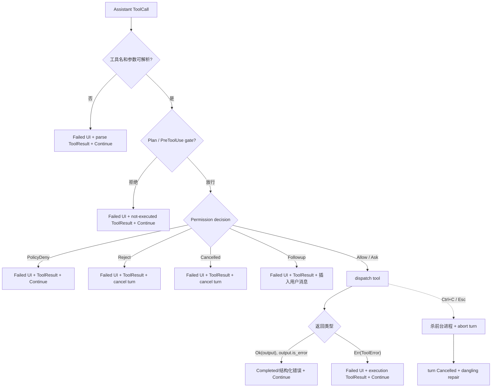

# Walkthrough：工具失败、拒绝与取消如何收敛并修复对话

本文不固定一个“成功场景”，而是固定同一个工具调用在六个失败时刻的分叉：

1. 模型给出未知工具名或错误参数；
2. Plan mode 或 `PreToolUse` Hook 拒绝；
3. Permission policy 拒绝；
4. 用户在权限界面拒绝、取消或发送 follow-up；
5. 工具已经 dispatch，但返回业务错误或基础设施错误；
6. 工具运行中，用户按 Ctrl+C/Esc 取消整个 turn。

这些场景在 UI 上都可能表现成“工具没有成功”，但系统不能把它们压成一个布尔值。它们对“工具是否真正运行”“当前 turn 是否终止”“模型是否应该重试”“后续批次是否继续”“是否需要杀进程”和“conversation 是否需要修复”的答案都不同。

本文核对基线为根目录 `SOURCE_REV` 记录的提交。行号仅用于首次定位，长期维护时以类型、函数和测试名为准。

---

## 1. 总览：六类失败在什么阶段发生



先记住三个最重要的结论：

- **工具失败不必终止 turn**：多数失败会作为 ToolResult 回给模型，让它换方案；
- **用户明确拒绝通常终止当前 turn**：系统不应立即让模型再次请求同一危险动作；
- **硬取消不是普通工具错误**：它会中断 future，清理进程和队列，并可能需要稍后修复未配对 ToolCall。

---

## 2. 建议同时打开的源码

```text
crates/codegen/
├── xai-grok-shell/src/session/
│   ├── acp_session.rs
│   ├── pending_interaction.rs
│   └── acp_session_impl/
│       ├── types.rs
│       ├── tool_calls.rs
│       ├── tasks_cancel.rs
│       ├── turn.rs
│       └── hook_dispatch.rs
├── xai-chat-state/src/actor/
│   ├── state.rs
│   ├── mutations.rs
│   └── request_builder.rs
├── xai-grok-sampling-types/src/conversation.rs
├── xai-grok-tools/src/
│   ├── bridge.rs
│   └── computer/local/terminal.rs
└── xai-file-utils/src/events/
    ├── tracker.rs
    └── types.rs
```

快速定位：

```sh
rg -n "enum ToolLoop|execute_tool_calls|prepare_tool_call" \
  crates/codegen/xai-grok-shell/src/session

rg -n "handle_tool_parse_error|handle_tool_error|handle_tool_not_executed|deny_tool" \
  crates/codegen/xai-grok-shell/src/session

rg -n "cancel_running_task|kill_foreground_commands|cancel_active_tool" \
  crates/codegen/xai-grok-shell/src crates/codegen/xai-grok-tools/src

rg -n "repair_dangling_tool_calls|dedup_duplicate_tool_results" \
  crates/codegen/xai-chat-state/src crates/codegen/xai-grok-sampling-types/src
```

---

## 3. 三层终态：调用、Turn 和 Conversation

分析失败前，必须先区分三层状态：

| 层级 | 关心的问题 | 典型类型/信号 |
| --- | --- | --- |
| ToolCall UI | 这张工具卡当前怎样 | Pending / InProgress / Completed / Failed |
| Tool loop | 下一步是继续采样还是结束/改道 | `ToolLoop` |
| Turn | 整条用户请求最终怎样结束 | `TurnOutcome` / ACP `StopReason` |
| Conversation | Provider 请求是否合法且模型看到了什么 | Assistant ToolCall + 紧邻 ToolResult |

同一个失败可以在不同层有不同描述。例如 Hook deny：

- UI：ToolCall Failed；
- conversation：有“Hook denied” ToolResult；
- tool loop：Continue；
- turn：通常继续下一次 sampling，而不是 Cancelled。

若只看 `ToolCallStatus::Failed`，就无法判断 turn 是否应该停止。

---

## 4. `ToolLoop` 是控制流结果，不是执行结果

`acp_session_impl/types.rs` 中的 `ToolLoop` 包含：

```text
Continue
NonExistingTool
ToolParsingError
PermissionReject { tool_name, reason }
Cancelled
FollowupMessage(String)
HookDenied { hook_name }
```

它表达“工具处理完成后，外层 agent loop 应如何走”，而不是工具业务输出。

例如 SearchReplace 的 `NoMatchesFound` 是一个 `Ok(ToolRunResult)`，但 `output.is_error()` 为 true；控制流依然通常是 `ToolLoop::Continue`。相反，用户点击权限拒绝时工具根本没执行，却得到 `PermissionReject`，并转成 turn cancellation。

---

## 5. 第一类：未知工具与参数解析失败

`prepare_tool_call()` 先发 Pending，再尝试把模型 arguments 解析为 JSON，并通过 `ToolBridge::try_parse()` 映射成类型化 `ToolInput`。

失败可能来自：

- 工具 wire name 不存在；
- JSON 语法错误且有限恢复失败；
- JSON 合法但缺少必填字段；
- 字段类型不符合 schema；
- 输入无法映射到对应 Tool variant。

`handle_tool_parse_error()` 会：

1. 记录 parse failure 和 tool failure signal；
2. 构造对模型可操作的错误信息；
3. 将 UI ToolCall 更新为 Failed；
4. 向 ChatState 追加同 call ID 的 ToolResult；
5. 返回 `ToolLoop::ToolParsingError` 给批次准备逻辑。

### 5.1 为什么错误信息保留原始参数

`build_tool_parse_error_message()` 会在上限内包含原始 arguments，并指出 JSON line/column 等位置。模型常常只漏了一个引号，看到原始内容比一句“invalid arguments”更容易自我修复。

长参数必须截断，而且按 UTF-8 字符边界截断；不能用裸 byte slice 把中文或 emoji 切成非法字符串。

### 5.2 解析失败为何仍写 ToolResult

Provider conversation 已经包含 Assistant ToolCall。如果不配一个 ToolResult，下一轮请求可能被 API 以“缺少 function output”拒绝。即使工具从未运行，协议配对仍必须完成。

---

## 6. Unknown/Parse Error 通常是非终止错误

批次准备收到 `NonExistingTool` 或 `ToolParsingError` 后不会把它们写入 `final_result`。其他可准备工具仍可继续，外层最终通常返回 `ToolLoop::Continue`。

这让模型下一轮可以：

- 修正工具名；
- 补全参数；
- 使用当前 tool definitions 中存在的替代工具；
- 根据错误位置修复 JSON。

把模型格式错误直接升级成整个用户 turn 失败，会失去 agent 自我纠错能力。

---

## 7. 第二类：Plan mode gate 拒绝

类型化参数生成 `AccessKind` 后，Plan mode edit gate 在 Hook 和普通 permission 之前运行。若编辑目标不允许：

- `handle_tool_not_executed()` 发 Failed ToolCallUpdate；
- 写入解释原因的 ToolResult；
- 返回 `ToolLoop::Continue`。

该调用没有进入 Hook、permission 或 dispatch。模型下一轮可以改为只读调查，或只修改允许的 plan 文件。

这里的“拒绝”是模式策略，不是用户刚刚点击 No，所以不会自动终止整个 turn。

---

## 8. 第三类：`PreToolUse` Hook deny

本地/plugin hook 或 client hook 都可能返回 deny。共享的 `deny_tool()` 会：

1. 记录 hook 名和原因；
2. 调用 `handle_tool_not_executed()`；
3. 发送醒目的 hook annotation；
4. 返回 `ToolLoop::HookDenied { hook_name }`。

`execute_tool_calls()` 不把 HookDenied 设为 batch 的 terminal `final_result`；turn.rs 对返回的 HookDenied 也不结束 turn。结果是：拒绝原因成为 ToolResult，模型继续采样。

源码里有专门回归测试保护这一点，因为旧行为曾把 Hook deny 当作 terminal result，错误取消整个 turn。

### 8.1 Client hook 超时为什么通常 fail open

多个 client callback 并发等待，每个有独立 timeout。超时、transport error 或 malformed reply 按 callback fail open，防止一个失联扩展永久冻结所有工具。

这是一项可用性与安全性的权衡：明确 deny 必须阻止执行；无法得到 hook 响应默认不让扩展成为全局单点故障。高安全环境应结合 permission 和 sandbox，而不是只依赖远端 hook 在线。

---

## 9. 第四类：Permission 的四种否定结果

权限决策不仅是 Allow/Reject：

| Decision | 工具是否执行 | Tool loop | Turn 行为 |
| --- | --- | --- | --- |
| `PolicyDeny(reason)` | 否 | Continue | 模型可换方案 |
| `Reject(reason)` | 否 | PermissionReject | 当前 turn Cancelled |
| `Cancelled` | 否 | Cancelled | 当前 turn Cancelled |
| `FollowupMessage(text)` | 否 | FollowupMessage | 加用户消息并继续 loop |

四者都会先调用 `handle_tool_not_executed()`，因此 UI 和 conversation 都有明确结果。区别发生在外层控制流。

---

## 10. `PolicyDeny` 与用户 `Reject` 为什么不同

PolicyDeny 表示自动规则说“这项动作不允许”。模型可能仍有合规替代方案，例如从写文件改为解释步骤，或从访问工作区外路径改为工作区内路径，所以 loop Continue。

用户 Reject 表示人对当前执行意图做了明确否定。系统将其变成：

```text
ToolLoop::PermissionReject
    ↓
TurnOutcome::Cancelled {
    category: PermissionRejected,
    context: { tool_name, reason }
}
```

若立刻让模型在同一 turn 自动重试，可能形成“用户刚拒绝，agent 又弹一次”的骚扰循环。因此用户拒绝终止当前 turn，等待新的用户意图更合理。

两者都会触发 `PermissionDenied` hook，供审计或组织自动化观察。

---

## 11. Permission `Cancelled` 不是运行中 Ctrl+C

Permission `Decision::Cancelled` 表示等待授权的 reverse-request 被用户取消：

- 目标工具尚未 dispatch；
- 不需要杀工具进程；
- `handle_tool_not_executed()` 立即形成 ToolResult；
- 返回 `ToolLoop::Cancelled`；
- turn category 为 `PermissionCancelled`。

运行中 Ctrl+C 则发生在 dispatch 之后，可能已有子进程和副作用，需要走 `cancel_running_task()`。两者虽然都叫 cancelled，清理责任完全不同。

---

## 12. Follow-up 是“拒绝并改写下一步”

用户可以在权限交互中不批准工具，而是给一条新消息。系统会：

1. 给原 ToolCall 写“未执行”的 ToolResult；
2. 返回 `ToolLoop::FollowupMessage(text)`；
3. 外层把 text 作为新的 user turn 内容加入 conversation；
4. 继续 sampling。

它既不能算 Allow，也不应简单算 Cancel。用户已经提供了新的可执行方向，系统应在保持协议配对后把控制权交回模型。

---

## 13. `PendingInteractionGuard` 防止审批状态泄漏

Permission、ask-user-question 和 plan approval 都是 blocking ACP reverse-request。等待期间，session 的 `PendingInteractions` map 以 tool call ID 记录当前交互类型。

`PendingInteractionGuard` 使用 RAII：

```text
new()  → 插入 pending map + broadcast pending_interaction
Drop   → 删除 entry + broadcast interaction_resolved
```

Drop 会在 await 正常返回、报错或 future 被取消时执行，因此取消 turn 不会让 roster 永久显示 NeedsInput。

remove-or-no-op 让 resolution first-answer-wins：只有真正移除 live entry 的 guard 才广播 resolved，重复 drop 或已经解决的 ID 静默。

Pending interactions 是当前内存请求，不持久化。Plan approval 另有 persisted gate，permission/question 没有；session reload 后不能假装旧的 permission dialog 仍可回答。

---

## 14. 批次中的“后续工具”如何处理

模型一次可能发出 A、B、C 三个调用。Preparation 依序进行，但已批准调用稍后并发 dispatch。

如果 B 得到用户 Reject/Cancelled/Followup：

- `final_result` 被设置；
- C 不再 prepare 或 dispatch；
- C 仍写一个合成 ToolResult，解释它因前一个终止决策而取消；
- 已经放入 `approved` 的 A 仍会进入当前 batch dispatch。

最后一点很容易忽略：permission prompt 是依序 preflight，`approved` 中的前序调用尚未 dispatch。后续拒绝不会清空已经批准的前序调用。若产品要求“一项拒绝使整个批次零副作用”，现有两阶段设计不提供这一保证。

Hook deny、PolicyDeny、parse error 不设置 terminal `final_result`，所以 C 仍可准备。

---

## 15. 第五类：工具的结构化业务失败

许多工具把“调用机制成功，但操作未达到目标”编码在 `Ok(ToolRunResult)` 的 output variant 中，例如：

- SearchReplace `NoMatchesFound`；
- SearchReplace `MultipleMatchesFound`；
- Bash 非零 exit code；
- 某些搜索无结果；
- MCP 工具返回自身 error-shaped payload。

`ToolOutput::is_error()` 为观测和 UI 提供失败分类，但 dispatch 本身没有返回 Rust `Err`。成功 handler 仍负责渲染结构化输出、追加 ToolResult 和 reminders。

外层 `tool_failed` 会把 event outcome 记为 Error，而控制流继续。这说明：

```text
Rust Ok != 业务成功
ToolOutcome::Error != turn 必须结束
```

---

## 16. 第六类：dispatch 返回 `ToolError`

工具 registry、resources、backend 或具体工具可能返回 `Err(ToolError)`。`handle_tool_error()` 会：

- 记录 execution failure；
- 对错误中的后端路径做 display-path rewrite；
- 区分 requested tool 与 effective tool；
- 发 Failed ToolCallUpdate；
- 在 raw_output 中写 `tool_execution_failed`；
- 追加同 call ID 的失败 ToolResult；
- 触发 `PostToolUseFailure` hook；
- 返回 Continue。

错误信息例如：

```text
Tool `real_tool` failed via `use_tool`: <rewritten error>
```

这对 meta-dispatch 很重要：模型请求的是入口工具，真正失败的可能是被解析出的目标工具，二者都要保留。

### 16.1 为什么 hard tool error 也通常 Continue

一次工具资源缺失或 backend 失败，并不等于整个任务无解。模型可以换工具、缩小请求或向用户解释限制。

源码注释还说明工具失败不再喂给基于连续错误次数的 doom-loop detector；当前 handler 不负责因错误 streak 终止 turn。

---

## 17. Managed MCP 认证失败有一次特殊恢复

对 managed MCP server，dispatch 后若错误文本符合 auth rejection，Session 会尝试 reactive reauth，然后重新 dispatch 一次。批次共享恢复状态，避免兄弟调用重复触发认证交互。

只有恢复后仍失败，才进入普通 `handle_tool_error()` 或 error-shaped output 流程。

因此日志中可能出现同一 call ID 的两个 execution span；duration 会累加，工具 identity 不应换成新的 call ID。

认证 retry 与模型 retry 不同：前者在同一工具调用内部恢复凭据，后者需要把 ToolResult 放回 conversation 后重新采样。

---

## 18. PostToolUse 与 PostToolUseFailure 的边界

当前调度代码按 Rust 结果区分 hook：

- `Ok(ToolRunResult)`：准备并发送 `PostToolUse`，即使 `output.is_error()` 为 true；
- `Err(ToolError)`：发送 `PostToolUseFailure`。

因此 hook 作者不能仅凭“收到 PostToolUse”断言业务成功，还需检查结构化 tool result。`ToolOutcome` 的 error 分类和 hook event 分类使用不同维度。

这是保留 typed output 的又一个理由：业务失败可能携带对审计有用的结构化字段，而不是一个 transport exception。

---

## 19. `handle_tool_not_executed()` 的最小收敛契约

Plan deny、Hook deny、permission deny/cancel/followup 最终共享这个 handler。它只做两件必要事情：

1. UI ToolCallUpdate → Failed，并显示 reason；
2. ChatState → `ConversationItem::tool_result(model_call_id, reason)`。

它不：

- 杀进程，因为工具尚未运行；
- 决定 turn 是否终止，由返回的 ToolLoop 决定；
- 运行 PostToolUse，因为没有 use；
- 伪造 duration 或输出。

这个小函数是“未执行也必须有协议结果”的统一边界。

---

## 20. 为什么 UI 终态与 ToolResult 必须同时写

只写 UI：用户看到失败，但下一次 provider 请求里的 ToolCall 没有结果，可能直接 400。

只写 ToolResult：模型能继续，但客户端工具卡仍显示 Pending/InProgress，用户误以为命令还在跑。

正常的 parse/reject/error 分支都同时写两侧。硬取消是例外，因为 abort 可能切断正常 post-flight；它需要 turn terminal 与 conversation repair 兜底。

---

## 21. 第七类：运行中硬取消的入口

用户按 Ctrl+C/Esc、send-now 或 session teardown 可以进入 `cancel_running_task(CancelOptions)`。Options 控制：

- 是否取消 subagents；
- 是否杀 background tasks；
- 无输出时是否 rewind；
- cancel trigger；
- 是否属于 user-initiated。

硬取消针对整个 running turn，不只是当前工具 future。其清理顺序必须同时处理 sampler、工具、进程、队列、usage、terminal event 和下一个 prompt 的上下文。

---

## 22. 先阻止新工作，再清理已有工作

取消逻辑首先：

- 请求停止 in-flight compaction；
- Ctrl+C 时抑制 task completion auto-wake；
- 将 `is_turn_active` 置为 false；
- 若要求取消 subagents，先 abort producer，再取消现有 child sessions；
- 记录 cancel processing identity 和 trigger。

这个顺序避免一边清队列，另一边 background completion 又向同一 turn 注入新工作。

Cancel identity 优先从实际 `running_task.prompt_id` 取得，`current_prompt_id` 只作 race window 的 fallback。否则 task 已完成但队列尚未 pop 的窄窗口会把 TurnCompleted 关联错 prompt。

---

## 23. 杀前台进程必须发生在 abort future 之前

`cancel_running_task()` 先通过 ToolBridge 调用 TerminalBackend：

```text
primary session → kill_foreground_commands()
subagent        → kill_foreground_commands_by_owner(session_id)
```

随后才 abort running task。

原因是单纯 drop Rust future 不保证操作系统子进程会停止。Terminal backend 知道进程组、PTY 和平台终止语义，必须由它执行 kill。

Subagent 使用 owner-scoped kill，避免共享 TerminalBackend 上一个 child 的取消误杀 parent 或 sibling 命令。

### 23.1 后台任务默认可能继续

交互 session 的普通取消通常保留 background tasks；subagent teardown 或显式 `kill_background_tasks=true` 才清理它们。这与 Bash 工具的“前台自动后台化”语义一致：取消当前等待不一定等于用户要求终止长期任务。

### 23.2 已知窄 TOCTOU 窗口

源码承认 kill 与 abort 之间，running future 理论上可能新启动一个 terminal。abort 会尽快 drop future 和 child handle，但这不是数学上的零窗口原子操作。

---

## 24. `ToolBridge` 为什么单独缓存 Terminal handle

正常工具调用可能持有 registry 相关锁。如果 cancel 为了取得 terminal 又等待同一锁，就可能出现：工具等进程、取消等工具锁、进程没人杀的死锁式延迟。

因此 ToolBridge 单独保存 `Arc<TerminalBackend>`，`kill_foreground_commands()` 无需等待 tool registry call 完成。

这是 cancellation safety 设计：控制面终止能力不能依赖被终止任务主动归还其执行锁。

---

## 25. Abort 后的队列处理

Session queue 中 front 是正在运行的 prompt，后面可能有真实用户 prompt、task wake 或 synthetic input。

普通 cancel：

- front 必须返回 Cancelled，避免调用方 spinner 永远等待；
- 保留后续真实用户 prompt；
- Ctrl+C 可移除 queued task/workflow completion wakes；
- 取消后由 `maybe_start_running_task` 推进下一项。

Hard teardown：清空整个 queue，并逐个 resolve Cancelled，因为 session 即将关闭。

Rewind-if-no-output：走不同路径，把 front prompt 拉回并恢复 snapshot，不等同于普通 cancel。

源码特别防守一个 race：即使 `running_task` 已暂时为 None，front 的 `respond_to` 也必须 resolve，否则客户端 RPC 会永久悬挂。

---

## 26. 运行中取消不一定经过单工具 error handler

硬取消会 abort 持有 `execute_tool_calls()` 的 future。它可能来不及执行：

- `handle_tool_error()`；
- `handle_tool_not_executed()`；
- PostToolUseFailure；
- 单工具 ACP Failed update。

因此不能设计成“每次 Ctrl+C 都等待工具自己返回 Cancelled output”。某些工具正卡在系统调用或远端 stream；等待它正常返回正是用户想中止的事情。

系统改用两层兜底：

1. turn 级 Cancelled terminal 告诉客户端这轮已结束；
2. conversation write boundary 修复 dangling ToolCall，保证下轮 provider 请求合法。

具体 UI 应在收到 turn terminal 后停止把该 turn 的 InProgress card 当作 live，即使没有等到逐工具终态包。

---

## 27. `EventTracker::cancel_active_tool()` 的观测收敛

工具 dispatch 结果进入 post-flight 时，EventTracker 记录 active tool。硬取消会调用 `cancel_active_tool()`：

- take active tool；
- 发送 `Event::ToolCompleted`；
- outcome 为 `ToolOutcome::Cancelled`；
- 保留 tool name、call ID 和已有 duration；
- 再发送 turn ended。

如果工具在 dispatch 阶段尚未被标为 active，则没有这条 ToolCompleted event。Event stream 的“不存在”不代表工具成功或失败，只说明取消落在 active tracking 建立前。

观测事件、ACP UI update 和 ChatState 是三套投影，不能拿其中一套假定另外两套必然同步逐条出现。

---

## 28. Dangling ToolCall 是怎样产生的

Session 在执行工具前已经写入 Assistant ToolCall。若 future 在结果写回前被 abort，conversation 变成：

```text
Assistant: ToolCall(call_1, bash, ...)
<turn cancelled here>
```

Provider 通常要求每个 ToolCall 紧跟对应 ToolResult。把上述历史原样发送，可能收到：

```text
No tool output found for function call ...
```

进程 crash、tokio task 在 await 点被 abort、JSONL 尾部撕裂也可能产生相似完整性问题。

---

## 29. `repair_dangling_tool_calls()` 的规则

修复函数扫描整个 conversation：

1. 找到带 tool calls 的 Assistant item；
2. 只查看它**紧随其后的连续 ToolResult run**；
3. 收集已回答 call IDs；
4. 为缺失项按原 call order 构造 synthetic ToolResult；
5. 在连续 result run 尾部插入；
6. 从后往前应用 repairs，避免 index 漂移。

UserCancelled 的合成文本明确说明：工具执行被用户取消，工具未执行。

这里的“未执行”是给模型的保守语义。若取消发生在副作用之后、真实结果之前，系统无法证明零副作用；模型不应把合成结果当作事务 rollback 证明。

### 29.1 为什么要求结果紧邻

有些 provider 不只要求 ID 曾在历史任意位置出现，还要求 ToolResult 紧跟声明它的 Assistant ToolCall。修复、dedup 和 displaced-result stripping 使用相同 contiguous-run 规则，避免不同清理器互相制造新问题。

---

## 30. 修复只在安全的写边界运行

ChatState 不会在任意 read query 时修复 dangling calls。后台工具正在正常执行时，它暂时没有 ToolResult是合法状态；若一个读取线程此时误判 dangling 并插入 synthetic result，真实结果稍后到达就会重复。

修复发生在“上一 turn 已确定结束”的写边界，例如：

- `ChatState::new()` 加载旧历史；
- push 新 user message；
- build 下一次 conversation request；
- 显式 history repair。

修改后会通过 persistence replace history，使修复不仅存在内存。

---

## 31. Duplicate ToolResult 的迟到竞争

一种可能竞态：

1. cancel 后 repair 插入 synthetic ToolResult；
2. 旧工具任务的真实结果由于竞态仍迟到；
3. 同 call ID 出现两个 ToolResult。

Provider 同样会拒绝重复结果。`dedup_duplicate_tool_results()` 在每个紧邻 result run 中只保留**最后一个**，目的是让真实的迟到结果覆盖早先 synthetic cancellation。

修复和去重都是幂等的：干净 conversation 上重复运行应是 cheap no-op。

---

## 32. 没有 ToolCall 的中途取消怎样通知模型

若用户在纯文本 streaming 中取消：

- partial assistant text 可能从 canonical conversation 丢弃；
- 没有 dangling ToolCall 可修复；
- 模型下一轮可能完全看不出上一请求被用户中断。

因此 cancel path 会 arm 一次性的 pending interrupt reminder。下一条真实用户 prompt 到来时，系统注入 `[Request interrupted]` 类 system reminder。

若存在 dangling ToolCall，则 repair 已经生成 cancellation signal，系统不再额外注入 reminder，避免重复告诉模型同一件事。

Send-now 是“取消当前并立刻发送新指令”，被视为无声重定向，不 arm interrupt reminder，也不标记普通 MidTurnAbort。

---

## 33. ToolOutcome 的八种粒度

事件层的 `ToolOutcome` 包含：

```text
Success
Error
PermissionRejected
PermissionCancelled
Followup
HookDenied
InvalidTool
Cancelled
```

源码注释称其为 granular outcome，而 hub protocol 最终只有三类：

| Shell ToolOutcome | Hub ToolCallOutcome |
| --- | --- |
| Success | Success |
| Error / InvalidTool | Error |
| PermissionRejected / PermissionCancelled / Followup / HookDenied / Cancelled | Cancelled |

内部保留细粒度是为了 telemetry、产品行为和问题定位；跨协议降维是为了稳定公共契约。不要在内部过早只存 hub 三分类，否则无法区分用户拒绝与进程中止。

---

## 34. Turn cancellation category

Turn 层还区分：

- `PermissionRejected`；
- `PermissionCancelled`；
- `MidTurnAbort`；
- `HookDenied`（类型中存在，但当前 PreToolUse deny 主路径继续 turn）。

只有用户中断子集会映射为下一真实用户 turn 的 `PriorTurnInterrupt`：MidTurnAbort、PermissionRejected、PermissionCancelled。HookDenied 是自动 gate，不应伪装成用户打断。

Turn end 会把 cancellation category/context、cancel trigger 和 usage 等写入相应 terminal/事件。客户端应以 turn terminal 结束 spinner，而不是等待所有内部 future 自行完成。

---

## 35. 状态矩阵

| 场景 | 真正执行 | UI 工具终态 | ToolResult | Tool loop | Turn |
| --- | --- | --- | --- | --- | --- |
| Unknown tool | 否 | Failed | 有，解析/不存在错误 | Continue | 继续 |
| 参数 parse error | 否 | Failed | 有，含修正提示 | Continue | 继续 |
| Plan gate deny | 否 | Failed | 有，模式原因 | Continue | 继续 |
| Hook deny | 否 | Failed + annotation | 有，hook reason | Continue | 继续 |
| PolicyDeny | 否 | Failed | 有，policy reason | Continue | 继续 |
| User Reject | 否 | Failed | 有，reject reason | PermissionReject | Cancelled |
| Permission Cancelled | 否 | Failed | 有，cancel reason | Cancelled | Cancelled |
| Followup | 否 | Failed | 有 + 新 User item | FollowupMessage | 继续改道 |
| Ok(error output) | 是 | 由结构化输出收敛 | 有 | Continue | 继续 |
| Err(ToolError) | 尝试过 | Failed | 有，execution error | Continue | 继续 |
| Ctrl+C mid-run | 可能已有部分副作用 | 以 turn terminal 收敛；逐工具 update 不保证到达 | 下一写边界合成/去重 | future aborted | Cancelled |

这张表是本文最适合留作日常查阅的部分。

---

## 36. 为什么不能对所有错误自动 retry

| 错误 | 自动重试风险 |
| --- | --- |
| Parse error | 可由模型修参数；原样 retry 没意义 |
| Hook deny | 重试会绕不掉组织规则，可能形成 spam |
| User Reject | 违背明确用户意图 |
| ToolError | 工具可能已经有部分副作用，blind retry 会重复操作 |
| Network/auth | 某些幂等恢复可在内部 retry，但需明确分类 |
| Ctrl+C | 用户要求停止，任何自动 retry 都是错误 |

只有系统能证明安全、有限且符合用户意图的恢复才应放在工具内部，例如 managed MCP auth refresh。其余错误通过 ToolResult 交给模型或等待新用户输入。

---

## 37. 调试清单：为什么工具卡看起来卡住

### 37.1 卡在 Pending

- arguments JSON 是否完成；
- ToolBridge parse 是否阻塞或失败；
- managed MCP 是否等待初始化；
- Pending 后的 Failed update 是否在通知层丢失。

### 37.2 卡在 InProgress，但进程未启动

- PreToolUse hook 是否等待 callback；
- PendingInteraction registry 是否存在 permission；
- client 是否收到 reverse-request；
- guard 是否因 future drop 清理；
- Plan gate/permission failed update 是否被客户端漏消费。

### 37.3 Ctrl+C 后工具卡仍显示 InProgress

- 是否已收到 turn-level `StopReason::Cancelled`；
- UI 是否把 turn terminal 作为所有 live child card 的收敛边界；
- EventTracker 是否有 ToolCompleted(Cancelled)；
- 工具取消是否发生在 active tracking 建立前；
- 下一 user/build_request 是否触发 dangling repair；
- 是否错误要求 abort future 自己发送 post-flight update。

### 37.4 下一轮 provider 报 missing tool output

- Assistant ToolCall 是否已持久化；
- ChatState 写边界是否运行 repair；
- ToolResult 是否紧邻对应 Assistant；
- call ID 是否完全一致；
- history replace 是否成功落盘。

### 37.5 Provider 报 duplicate tool result

- synthetic cancellation 后真实结果是否迟到；
- dedup 是否运行；
- duplicate 是否位于紧邻 run；
- 是否有另一个层重复 append 相同 call ID。

---

## 38. 安全与可靠性边界

### 38.1 Cancelled 不等于 rolled back

工具可能在取消前已经写文件、发请求或启动远端任务。Turn Cancelled 只描述控制流终止，不证明所有副作用撤销。

### 38.2 Synthetic result 是协议修复，不是事实审计

“tool was not executed”采用保守、可操作 wording，不能取代底层审计日志。判断是否产生副作用应查 FileWritten、Terminal、远端 request ID 等证据。

### 38.3 Fail-open hook 不能成为唯一安全门

Client hook timeout 会 fail open。需要硬保证的限制必须落到 permission policy、tool validation、sandbox 或操作系统权限。

### 38.4 错误文本要做路径重写和长度控制

后端真实路径可能泄露内部布局；原始 arguments 可能很大或包含敏感数据。错误对模型有用与最小披露之间需要明确上限和 display mapping。

### 38.5 Background task 需要独立生命周期

普通 turn cancel 不一定杀 background task。若 UI 把“turn cancelled”展示成“所有后台进程已停止”，会误导用户。

### 38.6 多工具批次不是拒绝事务

后一个权限拒绝不会撤销前面已批准并即将 dispatch 的调用。需要零副作用批次语义时，必须重新设计审批/提交阶段，而不是只调整提示文案。

---

## 39. 修改此链路时应守住的不变量

1. 每个已写入 conversation 的 Assistant ToolCall 最终必须有且只有一个紧邻 ToolResult。
2. 未执行分支必须同时收敛 UI 和 conversation。
3. Parse/Hook/Policy/tool error 应默认给模型自我修复机会。
4. 用户 Reject 和 Permission Cancelled 不得自动重复弹同一调用。
5. Followup 必须先配平旧 ToolCall，再插入新 User item。
6. PendingInteractionGuard 在成功、错误和 abort 时都必须清 registry。
7. Ctrl+C 必须先请求杀 foreground process，再 abort owner future。
8. Subagent cancel 不得误杀共享 backend 上其他 session 的命令。
9. Turn terminal 必须 resolve running prompt RPC，不能遗留 spinner。
10. Cancel 后有 dangling call 时用 repair signal；无 dangling call 时用一次性 interrupt reminder，不能双重提示。
11. Duplicate real/synthetic result 必须幂等去重并保留最后一个。
12. ToolOutcome、TurnOutcome 和 hub outcome 的降维映射必须显式、穷尽。
13. Cancelled 不能被描述为 rollback success。
14. 已有副作用的 partial failure 必须保留可审计通知。

---

## 40. 建议源码实验

### 实验 A：同一个错误参数的自我修复

提交缺引号的 SearchReplace JSON，观察 Failed UI、原始参数截断、ToolResult 和下一轮模型修正。确认没有进入 permission。

### 实验 B：Hook deny 与 User Reject

用同一个 Bash 调用分别触发 hook deny 和 permission reject。比较：

- 是否运行 PermissionDenied hook；
- ToolLoop；
- turn terminal；
- 下一次 sampling 是否立即发生。

### 实验 C：PolicyDeny 与 Reject

让 policy 自动拒绝一次，再由用户点击 No。二者工具都未执行，但只有后者应取消 turn。

### 实验 D：三工具批次中间拒绝

构造 A、B、C，使 B permission reject。验证 A 的 approved 行为、C 的 synthetic cancellation ToolResult，以及所有 call ID 配对。

### 实验 E：运行中取消 Bash

启动长前台命令后 Ctrl+C。记录：

- foreground kill 时间；
- running task abort；
- ToolCompleted(Cancelled) 是否出现；
- TurnCompleted cancelTrigger；
- 下一个 request 的 synthetic ToolResult；
- 是否留下 OS 进程。

### 实验 F：Synthetic 与真实结果竞争

用测试 double 延迟真实 result，在 repair 后送达。验证 dedup 只保留最后一个真实结果，重复执行 repair 不再改变历史。

---

## 41. 建议测试入口

```sh
cargo test -p xai-grok-sampling-types --lib conversation::tests
cargo test -p xai-chat-state --lib dangling_tool_calls
cargo test -p xai-file-utils --lib events
cargo test -p xai-grok-tools --lib computer::local::terminal
```

Shell 层重点测试文件包括：

```text
xai-grok-shell/src/session/acp_session_tests/
├── build_tool_parse_error_message_tests.rs
├── client_hooks_tests.rs
├── parallel_dispatch_tests.rs
├── cancel_running_task_tests.rs
├── chat_history_integrity_tests.rs
└── turn_completion_emit_tests.rs
```

当前仓库的 shell `--lib` 测试会在运行这些目标前编译所有测试模块，因此无关测试文件的编译错误仍可能阻塞定向执行。应把“目标未运行”和“目标断言失败”分开记录。

### 41.1 本文编写时的实际验证

| 命令 | 结果 | 主要覆盖 |
| --- | --- | --- |
| `cargo test -p xai-grok-sampling-types --lib conversation::tests` | 133 passed | dangling repair、紧邻顺序、幂等性、duplicate result 去重与 conversation 转换 |
| `cargo test -p xai-chat-state --lib dangling_tool_calls` | 4 passed | crash/load、build request、state/request 一致性和 dangling query |
| `cargo test -p xai-file-utils --lib events` | 17 passed | cancellation category、event serialization 和 one-shot interrupt marker |
| `cargo test -p xai-grok-tools --lib computer::local::terminal` | 61 passed，5 ignored | owner-scoped kill、timeout、后台生命周期、进程回收和输出保留；5 项为源码中已标记的 CI flaky 测试 |

Shell 层的 parse、Hook、permission、batch 和 turn-cancel 集成测试仍受仓库现有测试源码编译问题阻塞：`tool_layer_images_bridge_tests.rs` 缺少 `use base64::Engine`，在目标测试运行前报 `E0599`。本文因此把这些结论标为源码链路与现有测试文件证据，而没有宣称本次 shell 集成测试执行通过。

---

## 42. 自测题

1. ToolCall UI、ToolLoop、TurnOutcome 和 conversation integrity 各解决什么问题？
2. 为什么 Rust `Ok` 不代表工具业务成功？
3. Parse error 为什么必须生成 ToolResult？
4. Hook deny 为什么继续 turn，而 User Reject 为什么终止 turn？
5. PolicyDeny 与 PermissionReject 的用户意图差异是什么？
6. Permission Cancelled 与运行中 Ctrl+C 分别需要清理哪些资源？
7. PendingInteractionGuard 的 Drop 为什么重要？
8. FollowupMessage 为什么必须先写旧调用的结果？
9. 多工具批次中 B 被拒绝时，A 和 C 各怎样处理？
10. `PostToolUse` 是否保证 `output.is_error()==false`？
11. 为什么 kill foreground 要早于 abort future？
12. 为什么 ToolBridge 需要独立 Terminal handle？
13. 运行中取消为何不能保证逐工具 Failed update 到达？
14. dangling repair 为什么只查看紧邻 ToolResult run？
15. repair 为什么不能在任意 read query 中运行？
16. Synthetic 和真实结果重复时为什么保留最后一个？
17. 什么情况下使用 interrupt reminder，什么情况下依靠 dangling repair？
18. Turn Cancelled 为什么不等于副作用 rolled back？

能用状态矩阵解释以上问题，就能安全修改这条链路。

---

## 43. 本篇术语表

| 名词 | 白话解释 | 在本文中的具体含义 |
| --- | --- | --- |
| failure taxonomy | 把失败按原因分类 | 区分 parse、gate、permission、业务失败、ToolError 和 hard cancel |
| terminal state | 不会继续等待的最终状态 | ToolCall Completed/Failed 或 Turn Completed/Cancelled |
| control flow | 程序下一步走哪里 | `ToolLoop` 决定继续采样、取消 turn 或插入 followup |
| business error | 工具成功返回的“不达目标”结果 | `Ok(output)` 但 `output.is_error()`，如 NoMatches |
| infrastructure error | 工具机制自身失败 | `Err(ToolError)`，如 backend/resource/transport 故障 |
| parse failure | 工具参数无法类型化 | 工具尚未执行，但必须补 ToolResult |
| policy deny | 自动规则拒绝访问 | 非用户实时点击，通常允许模型换方案 |
| permission reject | 用户明确点击拒绝 | 当前 turn 终止，防止自动重复请求 |
| reverse-request | Server 反向向客户端请求回答 | Permission、Question、PlanApproval 都会 park future |
| parked future | 正在等待外部回答的异步任务 | PendingInteractionGuard 覆盖其生命周期 |
| RAII | 用对象生命周期自动清理资源 | Guard Drop 清除 pending interaction |
| fail open | 失败时默认放行 | Client hook timeout/transport error 不冻结工具链 |
| fail closed | 失败时默认拒绝 | 安全 gate 无法确认时保持禁止状态的策略 |
| Hook annotation | 向用户解释扩展拦截的提示 | 展示具体 hook 名和 deny reason |
| effective tool | meta-dispatch 后真正执行的工具 | 错误同时保留 requested/effective name |
| reactive reauth | 遇到认证拒绝后现场恢复 | Managed MCP 尝试刷新认证并重跑同一 call ID |
| hard cancel | 中断整个运行中 turn | kill process、abort task、处理 queue 和 terminal |
| abort | 强制停止异步 task/future | 不保证 OS 子进程自动结束 |
| owner-scoped kill | 只杀属于某 session 的进程 | 防止 subagent 取消误伤 parent/sibling |
| TOCTOU | 检查/操作之间状态可能变化 | terminal kill 与 future abort 之间可能新 spawn |
| dangling ToolCall | 有 Assistant ToolCall 但没有结果 | 会破坏 provider conversation contract |
| synthetic ToolResult | 系统补造的协议结果 | 表明工具因取消/harness halt 未正常完成 |
| contiguous run | Assistant 后紧邻的一组 ToolResult | Provider 配对和 repair/dedup 的有效范围 |
| idempotent repair | 重复运行不会继续改变结果 | 干净历史上的 repair/dedup 是 no-op |
| duplicate result | 同 call ID 出现多个 ToolResult | 常由 synthetic 与迟到真实结果竞争产生 |
| interrupt reminder | 告知模型上一请求被中断的一次性提示 | 仅在没有 dangling ToolCall 信号时注入 |
| send-now | 取消当前 turn 并立即发新 prompt | 无声重定向，不等同普通 Ctrl+C |
| partial side effect | 取消/失败前已经发生的部分修改 | Cancelled 不能证明其已回滚 |
| outcome projection | 同一事实面向不同系统的表示 | Shell 细分类映射为 hub Success/Error/Cancelled |
| first-answer-wins | 第一个有效回答完成交互 | 后续 guard drop 不重复广播 resolved |

更多通用名词见 [全局术语表](../appendices/glossary.md)。

---

## 44. 源码证据索引

| 结论 | 主要源码入口 |
| --- | --- |
| ToolLoop variants 和 TurnOutcome | `xai-grok-shell/src/session/acp_session_impl/types.rs` |
| prepare、批次 terminal decision、dispatch post-flight | `xai-grok-shell/src/session/acp_session_impl/tool_calls.rs` |
| Hook deny、client callback timeout/fail-open | `xai-grok-shell/src/session/acp_session/hooks.rs` |
| PendingInteraction RAII | `xai-grok-shell/src/session/pending_interaction.rs` |
| ToolLoop 到 TurnOutcome 的映射 | `xai-grok-shell/src/session/acp_session_impl/turn.rs` |
| 硬取消、进程清理、队列和 terminal | `xai-grok-shell/src/session/acp_session_impl/tasks_cancel.rs` |
| ToolOutcome 降维到 hub protocol | `xai-grok-shell/src/session/acp_session_impl/hook_dispatch.rs` |
| Active tool 的 Cancelled event | `xai-file-utils/src/events/tracker.rs`、`types.rs` |
| Terminal owner-scoped kill | `xai-grok-tools/src/bridge.rs`、`computer/local/terminal.rs` |
| dangling repair、duplicate dedup | `xai-grok-sampling-types/src/conversation.rs` |
| ChatState 修复时机和持久化 | `xai-chat-state/src/actor/state.rs`、`mutations.rs`、`request_builder.rs` |

建议交叉阅读：

- [Walkthrough：Bash Tool Call 如何经过权限、执行并回到下一轮采样](02-bash-tool-call-permission-sandbox-and-result-loop.md)
- [错误分类、重试、降级与恢复状态机](../03-subsystems/16-error-taxonomy-retry-degradation-and-recovery-state-machines.md)
- [权限判定与审批状态机](../03-subsystems/05-permission-approval-state-machine.md)
- [Hooks 子系统](../03-subsystems/11-hooks-events-dispatch-gates-and-trust.md)
- [并发模型、Actor、Channel 与取消传播](../03-subsystems/15-concurrency-actors-channels-cancellation-and-shutdown.md)
- [通知与事件路由](../03-subsystems/02-notification-routing.md)

---

## 45. 一句话复盘

Grok Build 把“工具没有成功”拆成可恢复的解析/业务/基础设施错误、非终止的 Plan/Hook/Policy gate、终止当前 turn 的用户拒绝/权限取消，以及必须杀进程并 abort future 的运行中硬取消；正常失败同步收敛 UI 与 ToolResult，硬取消则用 turn-level Cancelled 和写边界的 dangling ToolCall repair 保证客户端停止等待、provider 历史继续合法，同时明确保留“取消不等于副作用已回滚”的安全边界。
