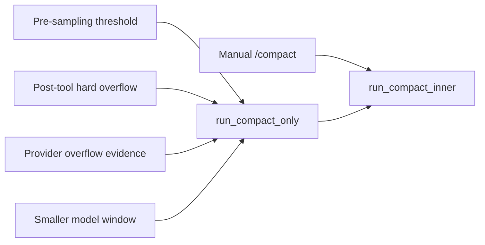

# Walkthrough：自动压缩如何重建可继续的对话上下文

本文固定一个很常见、也很容易被误解的场景：

> 一条长会话已经接近当前模型的 Context Window。上一轮模型返回了真实 Usage，随后又执行了几个输出很长的工具；下一次 sampling 之前，Grok Build 根据“上次真实计数 + 新增消息估算”触发自动压缩。系统调用模型生成摘要，补入当前任务所需的运行态，校验 ToolCall/ToolResult 配对，持久化 checkpoint，整体替换 conversation，然后用新历史继续原来的 turn。

本文还沿同一条链路追踪四种异常：压缩输入本身过大、摘要调用遇到认证或额度错误、用户在压缩中取消，以及替换后的 Fork 前缀仍然过大。

压缩不是“删除旧聊天”这么简单。它同时解决三个问题：

1. **预算问题**：下一次请求必须放得进模型 Context Window；
2. **语义问题**：模型必须仍知道用户要什么、已经做了什么、下一步是什么；
3. **协议问题**：重建后的 ToolCall 与 ToolResult 仍须满足 Provider 的顺序约束。

本文核对基线为根目录 `SOURCE_REV` 记录的提交。行号只用于首次定位，长期维护时以类型、函数和测试名为准。

---

## 1. 最终调用链

```mermaid
sequenceDiagram
    participant Loop as "Session turn loop"
    participant State as "ChatStateActor"
    participant Est as "Token estimator"
    participant Compact as "run_compact_inner"
    participant Model as "Compaction model call"
    participant Persist as "Persistence"
    participant UI as "Client notifications"

    Loop->>State: get_estimated_total_tokens()
    State-->>Loop: prior exact total + new-item estimate
    Loop->>Est: exceeds_threshold(total, window, pct)
    Est-->>Loop: true
    Loop->>UI: AutoCompactStarted
    Loop->>Compact: run_compact_only(trigger)
    Compact->>State: conversation + system + sampling config
    Compact->>Model: simplified/fitted conversation + summary prompt
    Model-->>Compact: compact summary
    Compact->>Compact: capture live state + build compacted history
    Compact->>Compact: sanitize + validate ToolResults
    Compact->>Persist: segment/request/checkpoint artifacts
    Compact->>State: replace_conversation_for_compaction(history)
    State->>Persist: replace_history(history)
    State-->>Loop: ConversationReset + TokensUpdated
    Compact->>UI: AutoCompactCompleted
    Loop->>Loop: rebuild request and continue sampling
```

压缩前后的信息形态可以简化为：

```text
旧历史：System + U1/A1 + U2/A2 + ToolCalls/Results + ... + 当前未完 turn
                            │
                            ▼
压缩调用：适配后的旧历史 + “请生成可接续摘要”的 prompt
                            │
                            ▼
新历史：System + 用户前缀 + 项目指令 + 最后真实请求
      + 最近未完消息 + 摘要(meta) + 运行态 reminder
```

关键不是逐字复刻过去，而是构造一个**自洽、合法、足够继续工作**的新上下文。

---

## 2. 建议同时打开的源码

```text
crates/codegen/
├── xai-grok-shell/src/session/
│   ├── compaction.rs
│   ├── compaction_config.rs
│   ├── compaction_segments.rs
│   └── helpers/
│       ├── full_replace_compaction.rs
│       ├── session_compact.rs
│       └── compaction_context.rs
├── xai-chat-state/src/
│   ├── usage.rs
│   ├── compaction_mode.rs
│   ├── compaction_transcript.rs
│   ├── compaction_utils.rs
│   └── actor/
│       ├── state.rs
│       ├── queries.rs
│       └── mutations.rs
└── xai-token-estimation/src/
```

快速定位：

```sh
rg -n "check_auto_compact_needed|check_preflight_overflow|should_compact_on_error" \
  crates/codegen/xai-grok-shell/src/session/compaction.rs

rg -n "run_compact_only|run_compact_inner|replace_conversation_for_compaction" \
  crates/codegen/xai-grok-shell/src/session/compaction.rs \
  crates/codegen/xai-chat-state/src

rg -n "build_compacted_history|sanitize_compacted_history|validate_compacted_history" \
  crates/codegen/xai-chat-state/src/compaction_utils.rs

rg -n "SUPPRESS_|CompactCancelGate|CompactionMode|CompactionDetail" \
  crates/codegen/xai-grok-shell/src/session/compaction_config.rs \
  crates/codegen/xai-chat-state/src
```

---

## 3. 先区分四种 Token 数字

理解触发条件前，不要把所有 Token 数都叫“当前用量”。源码里至少有四种不同含义：

| 数字 | 来源 | 用途 |
| --- | --- | --- |
| Provider total usage | 上一次主模型响应 | 最可信的已处理上下文总量 |
| `estimated_tokens_since_model` | 上次响应后新增的消息和工具结果 | 补上 Provider 尚未见过的增量 |
| `get_estimated_total_tokens()` | 前两者相加 | sampling 前和工具返回后的风险判断 |
| `context_window` | 当前 SamplingConfig/模型 metadata | 请求可容纳的总预算上限 |

`xai-chat-state/src/usage.rs` 特别区分主循环模型响应与压缩等旁路调用：主响应用来校准 conversation 的真实总量；压缩调用本身不应冒充主响应去改写这条基准。

因此自动压缩不是只看数据库里最后一次 Usage。长工具输出可能发生在两次模型请求之间，如果忽略增量，下一次请求仍可能直接溢出。

---

## 4. 为什么“真实计数 + 增量估算”比单一计数可靠

假设模型上次响应报告：

```text
total_tokens = 90,000
context_window = 128,000
```

之后 Agent 运行两个工具，新增内容估算为 25,000 tokens。虽然 Provider 最近一次只报告 90,000，下一次请求实际风险已经接近：

```text
estimated_total = 90,000 + 25,000 = 115,000
```

若阈值为 85%，触发线是：

```text
128,000 × 85% = 108,800
```

因此应在下一次 sampling 前压缩。这里的估算可以有误差，但它承担的是“提前刹车”职责；等 Provider 精确拒绝请求才行动，恢复成本更高。

---

## 5. 第一道触发器：sampling 前阈值检查

`SessionActor::check_auto_compact_needed()` 是正常路径的主要入口：

1. Memory 正在 flush 时返回 `None`，避免两种上下文维护同时发生；
2. 读取当前 `SamplingConfig.context_window`；
3. 调用 `get_estimated_total_tokens()`；
4. 更新 signals 中的 context usage；
5. 若 auto compact 已被抑制，则不再触发；
6. debug `force_compact` 可一次性强制触发；
7. 否则用 threshold percent 判断。

阈值判断最终落到 `xai_token_estimation::exceeds_threshold()`。百分比展示与触发计算是辅助函数，不应在调用处各自手写一套浮点公式。

### 为什么不是等到 100%

Context Window 还要容纳：

- 当前请求的固定系统内容；
- Tool definitions；
- 模型即将生成的输出；
- Provider 编码与估算误差；
- 压缩调用自己的 summary 输出空间。

所以阈值是一条安全线，不是磁盘容量式的“用满再清理”。

---

## 6. 第二道触发器：工具输出后的 preflight overflow

一次模型响应可以发出工具调用，工具结果随后才被追加到 conversation。某个 Bash、搜索或日志工具可能返回巨大文本，使上下文从阈值以下直接冲到窗口以外。

`check_preflight_overflow()` 在工具输出进入状态后检查：

```text
estimated_total > context_window
```

注意这里检查的是**硬溢出**，不是普通 threshold。触发后外层 turn loop 执行压缩，并 `continue` 回循环顶部，重新基于替换后的 history 构建请求。不能继续使用压缩前已经组装好的 request。

这条路径回答了一个常见问题：自动压缩并非只发生在用户发送新消息时，它也可能发生在一个尚未完成的工具循环中。

---

## 7. 第三道触发器：Provider 返回的 Context Window 证据

本地配置或 Token 估算可能落后于服务端。`should_compact_on_error()` 会查看 `SamplingErrorInfo.model_metadata.context_window`：

- 必须确实有 metadata；
- window 不能为 0；
- auto compact 不能处于 suppressed 状态；
- 本地 estimated total 必须大于服务端报告的 window。

它不是通过模糊匹配任意错误字符串来断言溢出，而是使用错误响应里的模型 metadata 和本地估算共同判断。

这是一条事后恢复路径：前两道预防没捕捉到时，Provider 的事实仍可触发压缩。

---

## 8. 第四种场景：切换到更小窗口的模型

同一会话切换模型时，原历史可能适合旧模型，却放不进新模型。

`maybe_compact_on_model_switch()` 会：

1. 保存并比较上一轮的 model slug 与 context window；
2. 模型未变或新窗口不小于旧窗口时直接返回；
3. 额度/认证抑制仍然保留，因为换模型不能证明账户恢复；
4. 清除 sticky/turn 级抑制，因为新模型环境可能改变了可压缩性；
5. 若当前估算超过新模型阈值，主动压缩。

认证类压缩失败会中止当前 turn 并要求重新认证；其他压缩失败会记录后继续按上层策略处理。

---

## 9. 四个入口不是四套压缩实现



入口负责决定“现在是否该压缩”，核心实现统一进入 `run_compact_inner()`。这避免阈值路径、错误恢复路径和手动命令各自构造不同格式的新历史。

手动压缩与自动压缩仍有策略差异：例如自动路径会设置 suppression，手动 `/compact` 可以让用户显式重试；自动路径还发送 Started/Completed/Failed/Cancelled 通知。

---

## 10. `run_compact_only()`：自动路径的外壳

自动路径在进入核心前后负责：

- 加入 `CompactCancelGate` scope；
- 记录触发 Token、窗口和百分比；
- 发出 `AutoCompactStarted`；
- 必要时做 pre-compaction memory flush；
- 计量 elapsed time；
- 成功后发 `AutoCompactCompleted`；
- 失败后按 cancel/suppression 状态决定是否再发通用 Failed。

核心函数若已经因为确定性错误发送了带原因的失败通知，外壳不能再发送第二条重复消息。判断 `auto_compact_suppressed == SUPPRESS_NONE` 正是在避免这种双重报告。

---

## 11. 压缩首先做输入快照与前置校验

`run_compact_inner()` 并行读取：

- conversation 长度；
- System message；
- 完整 conversation。

随后拒绝三类不可能正确工作的状态：

- conversation 为空；
- 没有 System message；
- 简化后的输入为空或不含 System item。

这些不是“让 summary 模型试试看”的软错误。没有系统头或没有实际对话，生成的摘要无法成为合法替代历史。

压缩开始前还 dispatch `PreCompact` Hook；成功完成状态替换后 dispatch `PostCompact` Hook。Hook 的 source 区分 `manual` 与 `auto`。

---

## 12. 压缩输入不是直接复制原 conversation

系统根据配置选择：

- `prepare_conversation_for_verbatim_summarization()`：尽量保留原始表达；
- `prepare_conversation_for_summarization()`：生成更适合摘要的有损输入。

Messages backend 还可能要求 summary 输入剥离 reasoning，以满足目标协议或减少无效体积。

如果启用 Segments 模式，系统另行准备 `segment_messages`，用于把压缩前内容持久化成可回查文件。它与发送给摘要模型的 request turns 是两个用途，不要混为一份数据。

---

## 13. 摘要请求仍然受到 Context Window 约束

最棘手的悖论是：需要压缩往往意味着原历史已经非常大，而“请总结原历史”本身也是一次模型请求。

源码使用输入降级阶梯处理 Context Overflow：

```text
Verbatim
   │ overflow
   ▼
VerbatimFitted
   │ overflow
   ▼
Lossy
   │ overflow
   ▼
确定性 Size 失败 + 抑制自动重试
```

`VerbatimFitted` 的预算大致从 Context Window 中减去：

- `SUMMARY_BUDGET_RESERVE_TOKENS`（为摘要输出预留）；
- Tool definitions 的估算 Token。

`Lossy` 使用更保守的窗口比例，再扣除工具定义预算。`fit_conversation_to_budget()` 负责真正把输入适配到预算，而不是把 UTF-8 字符串从中间随意截断。

---

## 14. 为什么压缩调用也携带工具定义

`run_compact_inner()` 会重新构造有效 Tool definitions，并在 backend search 活跃时过滤重复的 `web_search`。这些定义既影响模型能力，也占用上下文，所以会计算 `compaction_tool_tokens`。

预算设计必须把工具 schema 当成请求的一部分。只估 conversation 文本，会在工具很多或 schema 很长时系统性低估。

---

## 15. 摘要采样与重试不是无限循环

Full-replace 采样由 `sample_full_replace_summary()` 承担，配置有有限的 attempts 与 retry delay。Observer 记录：

- attempt 数；
- degenerate rejection；
- deterministic rejection；
- transient rejection；
- 每次 `CompactionAttempt` 的摘要化诊断；
- 最后被拒绝的 summary。

失败类别决定下一步：

| 结果 | 处理 |
| --- | --- |
| `NothingToCompact` | 终止，本次没有可压缩内容 |
| Empty/degenerate response | 记录 degenerate 或 transient，失败返回 |
| Context overflow | 沿输入阶梯降级后重试 |
| Deterministic sampler error | 分类并设置 suppression |
| Transient sampler error | 本次失败，保留后续恢复可能 |
| Cancellation | 立即走 cancelled 路径 |

“最多重试”与“降级几档”是两种不同边界：同一输入阶段的采样 retry 由 sampler 管理，输入装不下则由 shell 改变 request turns 后重新进入采样。

---

## 16. Two-pass / Prefire 为什么存在

仓库还支持两阶段压缩与 prefire：在真正越过压缩线前，后台先对稳定前缀做 pass 1；触发时若 conversation 前缀 fingerprint、长度和 model slug 仍匹配，就用缓存 NOTE 与新尾部做 pass 2。

它的目标主要是降低用户在临界点等待完整摘要的延迟，而不是改变最终 Full Replace 语义。

缓存必须验证：

- `prefix_len` 仍然有效；
- 当前前缀 fingerprint 与采样时相同；
- model slug 未切换。

否则缓存是 stale，不能把旧会话的摘要拼进已经变化的新历史。取消 token 由 prefire 与正式 compact 共享，保证用户停止时不会只取消其中一半。

---

## 17. 一个摘要还不足以继续工作

模型生成的文字摘要主要描述历史语义，但 Session 中还有许多结构化运行态：

- 最后一个真实用户请求；
- 最近尚未收束的 Assistant/ToolResult 尾部；
- 当前工作目录对应的项目指令；
- Agent 编辑过的路径；
- 正在运行的后台任务；
- 尚未完成的 subagent；
- Connected MCP servers；
- Todo 列表；
- Plan mode 文件和状态；
- Skills/AGENTS.md reminders；
- 可检索 Memory 的恢复提示。

`CompactionStateContext::build()` 将这些信息组织为结构化上下文，shell 的 `to_system_reminder()` 再生成压缩后的 reminder。

这说明“会话可继续性”不能完全外包给摘要模型。程序掌握的确定性状态，应由程序重新注入。

---

## 18. “最后用户消息”必须是最后一个真实用户请求

Conversation 中有些 User item 其实是系统合成载体，例如 warning、auto-continue 或 compaction meta。若简单按 enum variant 找最后一个 `User`，可能把真正任务边界认错。

`CompactionStateContext` 使用 real-user 判断：

- `last_user_query` 保存最后真实请求；
- `recent_messages` 从最后真实用户 turn 之后提取；
- synthetic User items 不重置边界，也不会被误当成新任务。

这还能避免把一个 Assistant ToolCall 与后续 ToolResult 从中间拆开。

---

## 19. 最近消息为什么只保留一小段

摘要负责长期语义，最近尾部负责当前执行连续性。`extract_messages_since_last_real_user()` 保留该边界后的 Assistant 和 ToolResult；为了节省空间，ToolResult 内容可替换成 `Tool call omitted...` 占位。

这是一种分层保真：

```text
久远历史  → 语义摘要
当前任务  → 最后真实请求
未完动作  → 最近 Assistant/ToolResult 结构
精确细节  → Transcript 或 Segments（若启用）
```

如果所有内容都只靠一段摘要，模型可能忘记正在等待哪个 tool call；如果所有最近大输出都逐字保留，压缩又可能立即失效。

---

## 20. `build_compacted_history()` 构造的新顺序

当前 grok-build 路径大致按以下顺序构造：

1. 原 System message；
2. `user_message_prefix` meta；
3. Project instructions（若存在）；
4. 包装后的最后真实用户 query；
5. recent messages；
6. 格式化后的 compaction summary（synthetic user meta）；
7. system reminder（若存在）。

`summary_before_recent` 允许另一种 carrier 顺序，但当前 alternate carrier 未编译时，正常路径使用上面的 summary-after-recent 形态。

摘要 item 是 `CompactionMeta` 一类的 synthetic 内容，不应被统计成用户又发起了一次真实查询。

---

## 21. 为什么压缩后仍需校验 ToolResult

Provider 通常要求每个 ToolResult 都有一个**更早出现且 ID 匹配**的 Assistant ToolCall。压缩边界、synthetic item 和 recent tail 组合可能意外制造 orphan result。

系统分两步防守：

1. `sanitize_compacted_history()` 删除找不到前置 call 的 ToolResult；
2. `validate_compacted_history()` 再做只读校验。

若 sanitize 后仍有 violation，代码退回更小的 compacted history 形态，不携带危险的 recent messages。宁可损失部分近期细节，也不能生成 Provider 拒绝的非法 conversation。

---

## 22. 替换前的最后取消边界

摘要已生成、上下文已构造后，代码在持久化和替换前再次检查 `cancel.is_cancelled()`。

这是重要的提交边界：

- 边界前取消：旧 conversation 保持不变；
- 边界后进入替换：按成功压缩完成后续状态清理。

它不是数据库事务意义上的全局原子操作，但明确避免用户刚取消时仍把旧历史换掉。

---

## 23. 持久化不只有一份新 history

压缩链路会产生不同用途的 artifact：

| Artifact | 作用 |
| --- | --- |
| Compaction request | 离线分析实际请求、summary、error 和 attempts |
| Compaction segment | Segments 模式下保留清理后的旧内容 |
| Compaction checkpoint | 保存新 history 与 prompt index，支持恢复/审计 |
| Conversation replacement | 将当前 session 的权威 history 换成新历史 |
| Telemetry span/events | 记录触发、耗时、拒绝类别和前后 Token |

Request artifact 和 segment 写入是 best-effort 的诊断/回查能力；主 conversation replacement 才决定后续模型真正看到什么。不要因为某个离线 artifact 发送失败，就误判压缩语义一定失败；也不要因为通知成功，就推断持久化已经落盘。

---

## 24. `replace_conversation_for_compaction()` 真正改变什么

Shell 最终把新列表交给 `ChatStateActor`。Actor 内的 `replace_conversation(items, true)`：

1. snapshot 当前 turn slice，避免 trace 因整体替换丢失；
2. 标记本 turn 发生过 compaction；
3. `persistence.replace_history(&items)`；
4. 重新估算新 history；
5. 重置 `estimated_tokens_since_model`；
6. 更新 `total_tokens` 与 `estimate_at_last_response`；
7. rebase turn capture offset；
8. 发出 `ConversationReset` 与 `TokensUpdated`。

Actor command loop 串行化这些状态变更，避免与普通 push message 在共享 vector 上直接竞争。

---

## 25. 为什么不能直接把新文本估算当作 Token 总量

本地静态估算与 Provider 真实计数常有比例偏差。压缩时若直接把 `base_estimate` 写成新 total，使用量可能突然不合理地“弹回”或过低。

Actor 用压缩前的校准比例传播 Provider overhead：

```text
ratio = pre_replace_total / estimate_at_last_response
new_total ≈ base_estimate(new_history) × ratio
```

然后将结果 cap 到 `pre_replace_total`，保证压缩在 UI 和策略上不会表现成 Token 反而增加。

若旧 `estimate_at_last_response == 0`，则回退到 base estimate，避免除零和伪比例。

---

## 26. 为什么替换后还要清理其他 Session 状态

成功替换 conversation 后，shell 还会：

- 重置 memory context injection，让下一 turn 重新判断；
- 清空持久化的 Plan/Todo state；
- 通知 ToolBridge 已发生 AGENTS.md/Skill discovery compaction；
- 持久化 announcement state；
- reset Plan mode 的压缩后状态；
- 更新 last idle flush conversation length；
- dispatch `PostCompact` Hook；
- 记录 tokens after、summary chars、attempts 和时延。

原因是压缩改变的不只是一个 vector 长度。许多“已经向模型提醒过”的一次性标记必须重新评估，否则新上下文可能以为自己仍知道已被摘要掉的状态。

---

## 27. 三种历史回查模式

`CompactionMode` 定义压缩后如何找回摘要丢失的精确细节：

| 模式 | 新摘要中的能力 | 额外写入 |
| --- | --- | --- |
| `Summary` | 只有摘要 | 无回查指针 |
| `Transcript` | 指向原始 `updates.jsonl` | 使用既有 transcript |
| `Segments(detail)` | 指向 `compaction/segment_*.md` 与 `INDEX.md` | 每次压缩写 segment |

Segments 的 `CompactionDetail` 有：

- `None`：统计与摘要；
- `Minimal`：每 turn 的工具签名；
- `Balanced`：工具调用、截断响应和完整文本的折中；
- `Verbose`：尽量完整的逐 turn 内容。

这些模式不改变新 conversation 必须自洽的要求。回查指针是补充，不是让模型每次继续前都读取整份旧 transcript。

---

## 28. Fork 的 inherited prefix 为什么特殊

Fork session 可能继承并固定父会话前缀。普通 full replace 若完全丢掉它，会破坏 Fork 的继承语义；但无条件重新 pin 整个前缀，又可能让压缩后的会话仍超过阈值。

`resolve_forked_compacted_history()` 会先尝试 `preserve_inherited_prefix()`，再估算保留后的 reseed Token：

- 若仍低于阈值，保留 inherited prefix；
- 若达到或超过阈值，释放 prefix，使用已经包含完整语义的自足摘要；
- 记录 `prefix_released`，避免后续再尝试重复 pin；
- 若替换后仍越线，设置 sticky suppression 防止无限 auto-compact loop。

这是“继承保真”与“请求可发送”之间的运行时取舍。

---

## 29. 失败为什么需要 suppression，而不是下一行立刻重试

如果压缩输入确定性地太大、schema 确定性不合法或账户没有额度，每次 turn 顶部都自动重试会形成死循环：

```text
检测超阈值 → 压缩失败 → 继续 → 仍超阈值 → 再压缩失败 → ...
```

`auto_compact_suppressed` 用不同状态表达“什么变化后才值得再试”：

| 状态 | 原因 | 清除时机 |
| --- | --- | --- |
| `SUPPRESS_TURN` | 其他可恢复错误 | 下一 turn |
| `SUPPRESS_STICKY` | size/schema 等确定性错误 | rewind、成功压缩或合适的模型切换等上下文变化 |
| `SUPPRESS_UNTIL_SUCCESS` | 额度/消费限制 | 后续模型请求成功返回 200 |
| `SUPPRESS_AUTH` | 登录或 token 失效 | login/token refresh |

所有非 `SUPPRESS_NONE` 状态都会挡住自动触发，但用户手动 `/compact` 不应被这套自动熔断完全禁止。

---

## 30. 错误分类如何影响用户可见行为

`classify_suppress_reason()` 将错误文本归入固定、无敏感内容的类别：

- spending limit / out of credits → CreditBlock；
- context length → Size；
- 401 / unauthorized → Auth；
- invalid request schema → Schema；
- 其他 → Other。

通知使用固定说明，不直接把任意服务端内容原样扩散到 telemetry。详细错误仍可进入受控诊断 artifact。

### 认证失败为何必须中止 turn

若 conversation 已经过大，压缩又因 401 失败，继续尝试普通 sampling 只会在超大请求与失效认证之间反复。`surface_compact_auth_failure()` 发出 auth RetryState，并返回 `auth_required`，让上层保存重试语义、要求 `/login` 后再提交。

额度失败则等待真实的后续 200 作为账户恢复信号，因为客户端无法可靠观察充值状态。

---

## 31. 用户取消压缩时发生什么

`CompactCancelGate` 用 holder count 管理共享 CancellationToken：

- 第一层 `enter()` 建立新 token；
- 嵌套的外壳、核心和 prefire 复用同一个 token；
- 最后一个 scope drop 后本次 in-flight 生命周期结束；
- `request_cancel()` 只在确有 holder 时取消。

采样器返回取消，或提交前发现 token 已取消时：

- 自动路径发 `AutoCompactCancelled(UserCancelled)`；
- 返回带固定 cancellation 标识的错误；
- 外壳识别它是 cancel，不再发通用 `AutoCompactFailed`；
- conversation 尚未越过替换边界时保持原样。

取消是用户控制流，不应被统计成摘要质量失败，也不应设置确定性 suppression。

---

## 32. 失败后的旧历史为什么通常仍安全

核心实现直到 summary 成功、history 构建并校验、取消检查通过后，才调用 replace。前面的采样失败、输入降级失败和认证失败不会先把原 conversation 清空。

因此失败恢复原则是：

```text
压缩未提交 → 旧 history 仍是权威状态
压缩已提交 → 新 history + checkpoint 成为继续基础
```

需要谨慎的是旁路 artifact 采用异步/best-effort 持久化，它们不等于一个跨所有文件的 ACID transaction。调试时应分别确认 summary 是否成功、replacement 是否发生、persistence channel 是否落盘。

---

## 33. 正常路径状态表

| 时刻 | Conversation | Token 基准 | UI | 下一步 |
| --- | --- | --- | --- | --- |
| 阈值前 | 原历史 | exact + delta estimate | 正常 turn | sampling/tool loop |
| Started | 原历史 | trigger snapshot | AutoCompactStarted | 生成摘要 |
| 摘要完成、提交前 | 原历史 | 仍是旧基准 | compact in progress | build/validate |
| replace 后 | 新历史 | ratio-reseed estimate | 等待完成 | 清理运行态 |
| Completed | 新历史 | tokens after | AutoCompactCompleted | rebuild request |

最重要的观察点是：UI Started 不代表 conversation 已替换；真正的提交点是 Actor 收到 `replace_conversation_for_compaction`。

---

## 34. 异常路径状态表

| 异常 | 是否替换 history | 是否自动再试 | Turn 行为 |
| --- | --- | --- | --- |
| Verbatim 输入 overflow，但 fitted 成功 | 是 | 不需要 | 正常继续 |
| 所有输入阶段都 overflow | 否 | Sticky suppress | 上层避免死循环 |
| Transient summary failure | 否 | 通常下 turn 可再试 | 当前路径记录失败 |
| 401/Auth | 否 | 登录刷新前不试 | 中止并要求认证 |
| Credit block | 否 | 看到成功 200 前不试 | 等账户恢复 |
| 用户取消 | 否（提交边界前） | 不因 cancel 自动熔断 | Cancelled 控制流 |
| 新 Fork history 仍超阈值 | 是 | Sticky suppress | 避免立即再压一次 |

---

## 35. 一个具体数字例子

假设：

```text
context_window                 = 128,000
threshold                      = 85%
provider total at last response= 92,000
new tool results estimate      = 20,000
estimated total                = 112,000
```

触发线为 108,800，所以 pre-sampling 检查触发。摘要后新 history 的静态估算是 18,000；旧 history 在上次响应时静态估算为 80,000，则 provider 校准比例约为：

```text
92,000 / 80,000 = 1.15
```

新 total reseed 约为：

```text
18,000 × 1.15 = 20,700
```

它远低于旧 total，且不会被 cap 改变。后续新增消息从这条新基线继续估算，直到下一次主模型响应再用 Provider Usage 校准。

这个例子是阅读模型，具体 tokenizer 与静态估算实现应以 `xai-token-estimation` 和 `xai-chat-state` 为准。

---

## 36. 调试自动压缩的推荐顺序

### A. 先判断为何触发

查看：

- estimated total；
- context window；
- threshold percent；
- 是 pre-sampling、preflight、model error 还是 model switch；
- `auto_compact_suppressed` 当前值。

### B. 再判断摘要为何失败

查看 span 字段：

- `compaction_attempts`；
- `compaction_input_overflow_rejections`；
- `compaction_degenerate_rejections`；
- `compaction_deterministic_rejections`；
- `compaction_transient_rejections`；
- `compaction_stop_reason`；
- TTFT、stream 和最大 inter-token latency。

### C. 最后判断是否真正提交

确认：

- 是否持久化 checkpoint；
- 是否调用 replace；
- 是否收到 `ConversationReset`；
- tokens after 是否更新；
- 后续请求是否由新 history 重建；
- suppression 是否按预期清除或设置。

不要只凭客户端的一条 Started/Failed toast 判断整个状态机。

---

## 37. 常见错误理解

### 误解 1：压缩就是截掉最早 N 条消息

实际是模型摘要、确定性运行态重建、协议校验和整体替换的组合。

### 误解 2：只要最后一次 Usage 没过线就安全

工具输出和 synthetic reminders 会在两次主响应之间增加上下文。

### 误解 3：压缩摘要成功就等于压缩完成

之后还有 state capture、history build、sanitize、checkpoint、replace 和清理。

### 误解 4：摘要里写了“一切”就不需要 recent tail

ToolCall 配对和当前未完动作需要结构化连续性，不能只靠自由文本。

### 误解 5：失败就应该马上自动重试

确定性 size/schema、认证和额度错误都有各自的恢复条件；盲目重试会死循环。

### 误解 6：取消等于把已经写出的 artifact 全部回滚

取消边界保护权威 conversation replacement，但旁路异步 artifact 不构成全局事务。

### 误解 7：压缩后的 Token 就是新字符串的 tokenizer 精确值

它是基于静态估算并传播 Provider 校准比例的 reseed，下一次主响应才再次精确校准。

---

## 38. 修改这条链路时必须守住的 Invariants

1. 每次发送前使用包含新增工具结果的 estimated total；
2. Context Window 来自当前模型配置或可信的服务端 metadata；
3. 压缩输入为摘要输出和 tool definitions 留预算；
4. 确定性 overflow 必须有有界降级，不能无限 retry；
5. 最后真实用户请求不能被 synthetic User item 覆盖；
6. 每个保留的 ToolResult 都有前置匹配 ToolCall；
7. replace 前取消不得悄悄提交新 history；
8. 压缩失败不得先清空旧 history；
9. 认证/额度/size/schema 的自动重试恢复条件必须不同；
10. 新 Token reseed 不应让压缩看起来增加 usage；
11. replace 后所有依赖“模型已看过”的缓存和 reminder 状态都要重评；
12. 外层 loop 必须重建 request，不能复用压缩前请求；
13. Fork prefix 保留不能使 auto compaction 自循环；
14. Manual compact 与 Auto suppression 的产品语义不能混为一谈。

---

## 39. 推荐的阅读与实验练习

1. 在 `check_auto_compact_needed()` 中记录 exact、delta estimate 与 window，验证长工具输出会改变触发；
2. 构造略低于 threshold 和刚好超过 threshold 的边界测试；
3. 构造 `estimated_total == context_window` 与 `> context_window`，观察 preflight 的严格不等式；
4. 模拟摘要输入 overflow，确认阶段按 Verbatim → Fitted → Lossy 前进；
5. 在 recent tail 中放置 ToolCall/ToolResult，验证 sanitize 后无 orphan；
6. 插入 synthetic User meta，验证 last real user query 不变；
7. 在 summary 成功后、replace 前触发 cancel，验证原 history 未换；
8. 让静态估算与 Provider total 有明显比例差，验证 reseed 公式和 cap；
9. 构造较小窗口的 model switch，验证主动压缩；
10. 分别注入 401、credit、schema 和 transient error，观察 suppression 清除条件；
11. 切换 Summary/Transcript/Segments，比较新 summary hint 与磁盘 artifact；
12. 构造 inherited prefix 很大的 Fork，观察 preserve 与 release 分支。

---

## 40. 本文编写时的实际验证

| 命令 | 结果 | 主要覆盖 |
| --- | --- | --- |
| `cargo test -p xai-token-estimation --lib` | 15 passed | Token/byte 估算、阈值严格边界、headroom、百分比 round/truncate 与饱和计算 |
| `cargo test -p xai-chat-state --lib auto_compact` | 4 passed | 阈值上下边界与 Context Window downgrade 触发 |
| `cargo test -p xai-chat-state --lib compaction_utils` | 147 passed | 输入 fit、摘要清洗、real user、recent tail、运行态、history build、sanitize/validate 与 ToolResult repair |
| `cargo test -p xai-chat-state --lib compaction_mode` | 3 passed | Summary/Transcript/Segments 解析、detail 绑定与 hint |
| `cargo test -p xai-chat-state --lib compaction_transcript` | 9 passed | Segment 文件名、索引、detail、截断与 Markdown 渲染 |
| `cargo test -p xai-chat-state --lib compaction_reseed` | 4 passed | Provider overhead ratio、删除内容缩放、post-response delta 排除与无 Provider 基准回退 |
| `cargo test -p xai-chat-state --lib replace_conversation_persists_and_emits_reset` | 1 passed | 整体替换持久化与 ConversationReset 事件 |

Shell 层定向命令 `cargo test -p xai-grok-shell --lib test_check_auto_compact_needed_uses_state` 在目标测试运行前被仓库现有测试源码编译错误阻塞：`session/acp_session_tests/tool_layer_images_bridge_tests.rs:15` 缺少 `use base64::Engine`，报 `E0599`。因此本文没有宣称本次执行通过 shell 集成测试；Shell 触发、suppression、cancel、model switch 和 full-replace 编排结论来自源码与仓库已有测试定义，纯 Token/ChatState 边界由上表实际执行结果验证。

---

## 41. 自测题

1. 为什么 `total_tokens` 和 `get_estimated_total_tokens()` 不能互换？
2. sampling 前阈值检查与 post-tool preflight 的条件有什么不同？
3. Provider error metadata 在何时比本地配置更有价值？
4. 为什么换到更小 Context Window 的模型需要主动压缩？
5. 为什么摘要请求本身也可能 Context Overflow？
6. VerbatimFitted 为何必须给 summary 输出和 tools 留预算？
7. Two-pass prefire 的 fingerprint 防止什么错误？
8. 为什么结构化运行态不应完全交给摘要模型记忆？
9. synthetic User 与 real User 的区别为何影响 recent tail？
10. sanitize 和 validate 为什么要连续做两次防守？
11. 压缩提交边界在哪里？
12. Actor replace 会更新哪些 Token 字段？
13. provider overhead ratio 为什么要传播，为什么又要 cap？
14. Summary、Transcript、Segments 三种模式如何取舍？
15. Fork inherited prefix 为什么可能被 release？
16. Size、Auth、Credit、Other 四类 suppression 为什么不能统一成“下一 turn 重试”？
17. 用户取消为何不应记作 deterministic failure？
18. 为什么 AutoCompactStarted 不能证明新 history 已经生效？
19. 压缩成功后为什么 Memory/Plan/Skill reminder 状态也要 reset？
20. 为什么工具循环必须在压缩后重建 sampling request？

---

## 42. 本篇术语表

| 名词 | 白话解释 | 在本文中的具体含义 |
| --- | --- | --- |
| Context Window | 模型一次能处理的 Token 总容量 | 输入、工具定义和输出共享的上限 |
| Token budget | 给不同请求内容预留的容量 | conversation、tools、summary output 各占一部分 |
| exact usage | Provider 返回的实际计数 | 上一次主模型响应对历史总量的校准 |
| delta estimate | 上次响应后新增内容的估算 | 包括用户消息、工具输出和 reminders |
| threshold | 提前触发的安全百分比 | 通常低于 Context Window 的 100% |
| pre-sampling | 调用模型之前 | 正常阈值自动压缩的检查点 |
| preflight overflow | 工具输出后、再采样前的硬溢出 | estimated total 已大于 window |
| compaction | 把长历史重建成短而可继续的历史 | 摘要 + 运行态 + recent tail + 校验 + replace |
| Full Replace | 整体替换 conversation | 不在原 vector 上逐条删除旧消息 |
| summarizer | 生成压缩摘要的模型调用 | 使用适配后的旧 conversation 作为输入 |
| verbatim | 尽量逐字保留 | 输入降级阶梯的第一档 |
| lossy | 允许丢掉低价值细节 | 输入装不下时的保守摘要材料 |
| fitted input | 被裁配进预算的输入 | 为输出与 tools 留出 reserve 后再适配 |
| reserve | 不能给输入占满的预留 Token | `SUMMARY_BUDGET_RESERVE_TOKENS` 给摘要输出留空间 |
| Tool definition | 告诉模型可调用工具的 schema | 同样占 Context Window，必须计入预算 |
| two-pass | 把压缩拆成前缀摘要和尾部合并 | 用来降低触发时的关键路径延迟 |
| prefire | 阈值前后台提前执行 pass 1 | 触发时需验证缓存没有 stale |
| fingerprint | 会话前缀的内容指纹 | 防止把旧前缀 NOTE 用到已变化历史 |
| stale cache | 已不对应当前状态的缓存 | model/prefix 变化后不能用于 pass 2 |
| state context | 程序捕获的结构化运行态 | tasks、subagents、todos、MCP、编辑路径等 |
| real user turn | 用户真正发起任务的消息 | 排除系统合成的 User/meta items |
| synthetic item | 程序以消息形式注入的元信息 | reminder、auto-continue、compaction meta 等 |
| recent tail | 最后真实用户请求后的近期消息 | 保持当前未完工具链的结构连续性 |
| orphan ToolResult | 找不到前置匹配 ToolCall 的结果 | Provider 可能拒绝这种 history |
| sanitize | 自动移除已知非法结构 | 删除 orphan ToolResults |
| validate | 只读检查不变量 | sanitize 后再次确认配对合法 |
| checkpoint | 某时刻可恢复的持久化快照 | 记录压缩后的 history 和 prompt index |
| artifact | 为恢复、分析或回查保存的产物 | request、segment、checkpoint 等 |
| reseed | 替换 history 后重建 Token 基线 | 使用新静态估算与旧 Provider 比例 |
| provider overhead | 静态估算未覆盖的服务端计数差异 | 通过 ratio 传播到新 history |
| suppression | 暂停自动压缩重试 | 防止确定性错误形成循环 |
| sticky suppression | 跨 turn 保持的抑制 | size/schema 需上下文条件变化才清除 |
| auth suppression | 等认证刷新才解除的抑制 | 避免超大请求与 401 死循环 |
| credit suppression | 等一次成功 200 才解除 | 客户端无法直接确认充值完成 |
| cancellation token | 协作式取消信号 | prefire、外壳和核心共享同一信号 |
| commit boundary | 状态从旧 history 切到新 history 的界线 | replace 前最后检查 cancellation |
| CompactionMode | 压缩后精确历史的回查策略 | Summary、Transcript 或 Segments |
| Segment | 一次压缩前历史的 Markdown 存档 | 可按 detail 控制保真程度 |
| inherited prefix | Fork 从父会话固定继承的前缀 | 必要时释放以保证新请求能放入窗口 |
| auto-compact loop | 压缩后仍过线并立即再次压缩 | prefix release 与 sticky suppress 防止它 |
| telemetry span | 一段操作的结构化观测记录 | 保存 attempts、rejections、时延和 outcome |

更多通用名词见 [全局术语表](../appendices/glossary.md)。

---

## 43. 源码证据索引

| 结论 | 主要源码入口 |
| --- | --- |
| 阈值、preflight、错误和模型切换触发 | `xai-grok-shell/src/session/compaction.rs` |
| Cancellation 与 suppression 状态 | `xai-grok-shell/src/session/compaction_config.rs` |
| Full Replace 采样、attempt 和 retry | `xai-grok-shell/src/session/helpers/full_replace_compaction.rs` |
| 摘要 prompt、输出退化判断 | `xai-grok-shell/src/session/helpers/session_compact.rs` |
| 运行态 reminder 构造 | `xai-grok-shell/src/session/helpers/compaction_context.rs` |
| real user、recent tail、build/sanitize/validate | `xai-chat-state/src/compaction_utils.rs` |
| Token 增量字段与估算查询 | `xai-chat-state/src/actor/state.rs`、`queries.rs`、`usage.rs` |
| Conversation replace 与 ratio reseed | `xai-chat-state/src/actor/mutations.rs` |
| Summary/Transcript/Segments 模式 | `xai-chat-state/src/compaction_mode.rs` |
| Segment detail 和 Markdown 渲染 | `xai-chat-state/src/compaction_transcript.rs` |
| Segment 持久化与回查 hint | `xai-grok-shell/src/session/compaction_segments.rs` |

建议交叉阅读：

- [Token 计量、Context Window 与自动压缩决策](../03-subsystems/13-token-accounting-context-window-and-compaction-policy.md)
- [Prompt 构建、上下文注入与 System Reminder](../03-subsystems/09-prompt-construction-context-injection-and-reminders.md)
- [Memory 子系统](../03-subsystems/10-memory-storage-retrieval-flush-and-dream.md)
- [错误分类、重试、降级与恢复状态机](../03-subsystems/16-error-taxonomy-retry-degradation-and-recovery-state-machines.md)
- [并发模型、Actor、Channel 与取消传播](../03-subsystems/15-concurrency-actors-channels-cancellation-and-shutdown.md)
- [Walkthrough：工具失败、拒绝与取消如何收敛并修复对话](04-tool-failure-rejection-cancellation-and-conversation-repair.md)

---

## 44. 一句话复盘

Grok Build 的自动压缩先以“上次主模型真实 Usage + 后续消息估算”在 sampling 前、工具输出后、Provider 溢出和小窗口模型切换四个边界发现风险，再通过有界的 Verbatim/Fitted/Lossy 摘要流程生成语义载体，将最后真实请求、recent tool tail、项目指令和运行态确定性重建，校验 ToolCall/ToolResult 后在 Actor 中整体替换并按 Provider 比例重置 Token；失败时旧历史仍是权威状态，取消停在提交边界前，而 size、schema、auth、credit 各用不同 suppression 条件避免无限重试。
