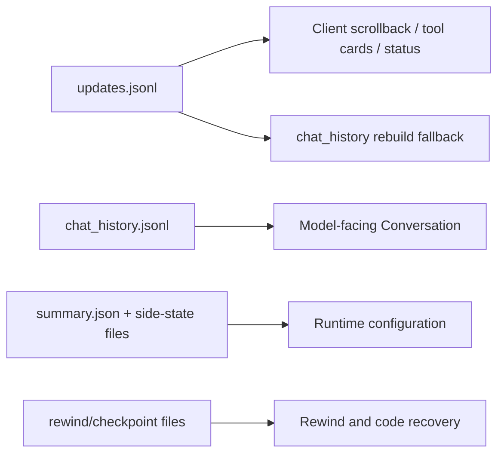

# Walkthrough：一次 Session Load 如何恢复模型状态、重放 UI 并修复崩溃残留

本文固定一个具体场景：

> Grok Build 上次运行在工具执行过程中被关闭。用户重新打开同一个 Session。磁盘上保留了 `summary.json`、`chat_history.jsonl`、`updates.jsonl`、Plan/Signals 等状态，其中 `chat_history.jsonl` 的最后一个 Assistant ToolCall 没有 ToolResult，某一行还可能因进程中止而只写了一半。客户端带着最后看到的 event cursor 调用 ACP `load_session`。系统需要恢复模型可继续使用的 Conversation、向客户端只重放缺失的 UI 更新、修复不可能继续运行的旧任务，并恢复模型与权限状态。

“恢复会话”不是把一个 JSON 文件读进内存。源码至少要恢复四个彼此不同的世界：

1. **模型世界**：下一次 sampling 应看到什么 Conversation；
2. **客户端世界**：聊天列表、工具卡和状态 UI 应显示什么；
3. **运行时世界**：Plan、Signals、模型、MCP、权限和后台任务处于什么状态；
4. **工作区世界**：代码、Rewind 快照与 Session Worktree 是否需要恢复。

本文核对基线为根目录 `SOURCE_REV` 记录的提交。行号只帮助首次定位，维护时以类型、函数和测试名为准。

---

## 1. 最终调用链

```mermaid
sequenceDiagram
    participant Client as "ACP Client"
    participant Agent as "MvpAgent"
    participant Store as "JsonlStorageAdapter"
    participant Replay as "Replay pipeline"
    participant Actor as "SessionActor / ChatState"
    participant Gateway as "Client gateway"

    Client->>Agent: load_session(session_id, cwd, cursor)
    Agent->>Agent: resolve workspace + attach policy
    Agent->>Store: load_session_without_updates()
    Store->>Store: ensure/rebuild chat_history
    Store-->>Agent: summary + conversation + state + update paths
    Agent->>Agent: optional code restore
    Agent->>Replay: prepare_replay_lines(updates, cursor)
    Replay->>Gateway: historical or incremental UI updates
    Agent->>Gateway: flush + replay delta appended during load
    Agent->>Actor: spawn from chat_history, or reconnect resident actor
    Actor->>Actor: dedup results + repair dangling ToolCalls
    Agent->>Agent: restore Plan/Signals/model/MCP/permissions
    Agent->>Agent: reconcile stale tasks and orphaned subagents
    Agent-->>Client: LoadSessionResponse + model/meta
```

把它压成一句话：

```text
读取轻量持久化状态 → 恢复/修复模型 history
→ 过滤并重放 UI timeline → 补上加载窗口内的新事件
→ 重建运行态 → 收敛不可能继续运行的旧任务 → 返回可继续 Session
```

---

## 2. 建议同时打开的源码

```text
crates/codegen/
├── xai-grok-shell/src/
│   ├── agent/mvp_agent/
│   │   ├── session_setup.rs
│   │   └── mod.rs
│   └── session/
│       ├── persistence.rs
│       ├── storage/
│       │   ├── mod.rs
│       │   └── jsonl/mod.rs
│       ├── helpers/replay.rs
│       └── acp_session_impl/spawn.rs
├── xai-chat-state/src/actor/
│   ├── state.rs
│   ├── mutations.rs
│   └── request_builder.rs
├── xai-grok-sampling-types/src/conversation.rs
└── xai-grok-workspace/src/session/
    ├── file_state.rs
    ├── checkpoint.rs
    └── checkpoint_store.rs
```

快速定位：

```sh
rg -n "load_session_inner|attach_session|replay_transcript_gate" \
  crates/codegen/xai-grok-shell/src/agent/mvp_agent

rg -n "load_light|load_session_without_updates|ensure_chat_history" \
  crates/codegen/xai-grok-shell/src/session

rg -n "prepare_replay_lines|filter_rewind_lines|replay_session_updates" \
  crates/codegen/xai-grok-shell/src

rg -n "repair_dangling_tool_calls|dedup_duplicate_tool_results" \
  crates/codegen/xai-chat-state/src crates/codegen/xai-grok-sampling-types/src
```

---

## 3. 先区分 Cold Load、Reconnect、Resume 与 Rewind

这些词在口语里常被混用，源码语义却不同：

| 场景 | Session Actor 是否还活着 | 主要动作 |
| --- | --- | --- |
| Cold load | 否 | 从磁盘创建新 Actor |
| Reconnect | 是 | flush 旧 persistence，更新客户端能力和 MCP，复用 Actor |
| Resume/noReplay attach | 可能任一 | 恢复运行态但可跳过历史 UI replay |
| Rewind | 是 | 把模型历史和工作区退到某个 prompt index |

`attach_session()` 同时服务 Load 与其他 attach policy，但 `AttachPolicy` 决定 `no_replay`、是否恢复代码等策略。不能看到 `load_session` 就假设一定会新建 Actor，也不能看到 replay 就以为它在重建模型 Conversation。

---

## 4. 两条数据面：Conversation 与 Timeline

最重要的阅读模型是：



`chat_history.jsonl` 是给 LLM API 使用的派生 Conversation cache；`updates.jsonl` 是持久的事件时间线，也是 UI replay 和必要时重建 chat history 的来源。

这解释了为什么同一次 Load 同时读取 chat history，却把 updates 只作为文件路径交给 streaming replay：两个消费者需要的数据形状和内存策略不同。

---

## 5. `attach_session()` 的前置门槛

加载开始时，`MvpAgent::attach_session()` 会：

1. 用 load guard 标记该 Session 正在加载；
2. 校验 chat kind feature；
3. 清扫已经死亡的 resident session；
4. 若 Actor 不驻留，等待旧 Session thread 排空；
5. 要求 ACP `initialize` 已经完成；
6. 从 request meta 解析 persist routing、leader client、cursor 和 permission mode；
7. 解析 cwd、folder trust、MCP servers 与 attach policy。

这些步骤发生在读 Conversation 之前，因为加载到错误工作区或在未初始化的客户端能力下启动 Actor，会让后续工具边界从一开始就不正确。

---

## 6. 为什么 Resident Reconnect 要先 Flush

如果 Session Actor 仍在内存，persistence channel 里可能还有尚未落盘的更新。直接读取 `updates.jsonl` replay 会漏掉它们。

Reconnect 分支会：

- 暂时关闭 `gateway_enabled`，阻止新 live update 越过历史 replay；
- 调用 `flush_session()` 尽量落盘当前 buffer；
- 再开始读取 replay 文件。

这是顺序保证，不只是性能优化。客户端必须先看到历史，再看到加载过程中追加的新事件。

---

## 7. 为什么恢复使用 `load_light()`

`persistence::load_light()` 调用 `load_session_without_updates()`，加载：

- `summary.json`；
- `chat_history.jsonl`；
- Plan mode state；
- Signals；
- Announcement state；
- Goal/Workflow state；
- 其他小型 side-state。

它不把整个 updates 和 rewind points 读入 Vec，而是返回：

- `updates_file_path`；
- `rewind_points_file_path`。

长 Session 的 updates 和文件快照可能非常大。正常恢复只需流式重放 updates；用户真正执行 rewind 时，才需要加载历史文件快照。

---

## 8. 本地缺失时的 Remote Pull

`load_light()` 首先从当前 Grok home 的 JSONL storage 加载。若失败且配置了 backend，它可以 `pull_on_miss()`，再用拉取后的 `Info` 重试加载。

加载成功后会 touch Session worktree，重置 GC expiry clock，避免刚恢复的工作树被清理器误判为过期。

这意味着最终 `loaded_info` 不一定与最初构造的本地路径完全相同；后续 persistence actor 必须绑定真正加载成功的 SessionInfo。

---

## 9. `summary.json` 是索引与配置摘要，不是完整历史

Summary 保存 Session 身份和轻量元数据，例如：

- 当前模型与 reasoning effort；
- display title；
- chat format version；
- next trace turn；
- Git head/branch；
- activity timestamps；
- Agent name 与部分恢复标记。

它适合快速列表、模型选择和恢复入口，但无法取代逐消息 Conversation 或 UI event stream。

恢复时若把 Summary 当成唯一权威数据源，会丢掉工具卡、流式消息、Rewind 时间线和实际模型内容。

---

## 10. `ensure_chat_history()`：Cache 缺失时从事件重建

当 chat format version 是当前版本，而 `chat_history.jsonl` 缺失或长度为 0，JSONL adapter 调用 `chat_rebuild::rebuild_chat_history()`。

重建器：

1. 逐行读取 `updates.jsonl`；
2. 用 `ChatReducer` 将 User chunks、Agent chunks、ToolCall 和结果归并成 ConversationItem；
3. 遇到 CompactionCheckpoint 时 truncate 已写的 cache，并以 checkpoint 语义重置；
4. 写入临时 sibling 文件；
5. flush 后 rename 覆盖目标。

临时文件 + rename 保证重建失败时不会把原 cache 截成半份。

---

## 11. 为什么 `chat_history.jsonl` 是派生 Cache

正常运行时直接维护 chat history 能快速构建下一次模型请求；但它的 append 可能在崩溃中 torn，也可能在压缩后丢掉原始旧 history。

`updates.jsonl` 保留 UI/事件时间线和 CompactionCheckpoint/RewindMarker，因此能在 cache 缺失时重建当前 Conversation，也能为跨压缩 rewind 提供历史证据。

“派生”不等于“不重要”：下一次 sampling 直接使用它；只是它损坏时仍有更底层的恢复来源。

---

## 12. 损坏的一行为什么不应砖化整个 Session

`read_chat_history_sync()` 按原始 `\n` byte 切行，并对每行单独 `serde_json::from_slice()`。若某行因为 kill、ENOSPC 或并发 append 而不完整：

- 记录 skipped line；
- 继续加载其他合法行；
- 第一次发现损坏时复制原文件为 `chat_history.jsonl.corrupt`；
- 后续恢复流程会用干净内存 snapshot 重写 live chat history。

按 bytes 而不是先 `read_to_string()`，可让撕裂在半个 UTF-8 codepoint 时只污染当前行，不让整文件解码失败。

---

## 13. Quarantine Copy 的意义

`*.corrupt` 不是加载输入，也不是自动修好的 history。它是：

- 保留原始损坏证据；
- 方便定位 torn/interleaved append；
- 避免干净 snapshot rewrite 后永久失去问题现场。

恢复策略选择“最大化可用数据”，而不是“遇到一行错误全部拒绝”。但损坏行中的语义确实可能丢失，Quarantine 让人工诊断仍有可能。

---

## 14. Mixed Format 与旧 Reasoning 升级

Reader 会依据 `chat_format_version` 优先解析当前 `ConversationItem` 或旧 `ChatRequestMessage`，失败时尝试另一种格式。这覆盖旧 Session 被新 binary 继续 append 后形成的 mixed-format 文件。

旧版本还可能把 reasoning 或 backend search raw output 内嵌在 Assistant。`upgrade_legacy_reasoning()` 在内存中重建 sibling `Reasoning` / `BackendToolCall` items，并放到 Assistant 之前。

升级是 load-time transform：

- 新格式没有旧字段时为 no-op；
- 用 seen IDs 避免重复 BackendToolCall；
- 损坏行不会生成 orphan siblings；
- 原文件不会因兼容升级直接被冒险改写。

---

## 15. Invalid Image 为什么在 Load 时剥离

持久化 history 可能含：

- 非法 data URI；
- 超出解码上限的图片；
- Provider 无法再次发送的 image payload。

`strip_invalid_images()` 在恢复时剥离不可发送图片，并像损坏行一样保存 quarantine copy。目标是让 Session 至少能继续发送文本历史，而不是每次 sampling 都因同一个旧图片失败。

这是兼容性降级，不代表图片错误可以静默忽略；日志与 `.corrupt` 仍保留诊断线索。

---

## 16. ChatState 构造时修复崩溃残留

Cold load 把 Conversation 交给 `ChatState::new()`。构造函数会先：

1. `dedup_duplicate_tool_results()`；
2. `repair_dangling_tool_calls(...UserCancelled)`；
3. 再估算初始 Token。

典型崩溃现场：

```text
Assistant(tool_call id=42)
<process exits before ToolResult>
```

恢复后若原样发送，Provider 会拒绝缺少结果的 ToolCall。修复器插入 synthetic ToolResult，说明旧调用因取消/崩溃未完成；它不会重新执行可能有副作用的命令。

---

## 17. 为什么不能在 Load 时自动重跑旧工具

磁盘只证明“模型请求过工具”，无法证明副作用执行到了哪一步：

- Bash 可能已经创建了一半文件；
- Deploy 可能已经发出远程请求；
- SearchReplace 可能已经写完但结果尚未持久化；
- 进程可能仍由外部系统继续运行。

自动重跑会制造重复副作用。安全做法是把协议状态收敛为 cancelled result，让模型在新 turn 中检查真实世界后决定下一步。

---

## 18. 初始 Token 怎样恢复

UI replay 的 `prepare_replay_lines()` 会在 Rewind 过滤后的 live timeline 中反向寻找最后一个 `_meta.totalTokens`。这个数字作为 `initial_total_tokens` 传入 Session spawn。

若 `noReplay`，`extract_initial_tokens_from_updates()` 只扫描 updates 文件尾部最多 64 KiB，避免为一个数字反序列化整段历史。

若找不到，初始值为 0，ChatState 使用 Conversation 静态估算，直到下一次主模型响应用 Provider Usage 再校准。

---

## 19. Prompt Index 与 Compaction 边界怎样恢复

Spawn 创建 ChatState 后，可通过 snapshot 补回：

- `prompt_index`；
- `prompt_texts`；
- `total_tokens`；
- `last_compaction_prompt_index`。

`restore_snapshot()` 不重新创建 Actor，而是在 actor command loop 内恢复字段并重置增量估算。旧 snapshot 若没有 frozen estimate，则回退到重新估算 Conversation。

Prompt index 必须与持久化时间线一致，因为 Rewind、file checkpoints、Hunk tracker 和 turn trace 都用它作为跨域关联键。

---

## 20. UI Replay 不等于 Conversation Replay

`replay_session_updates()` 读取 `updates.jsonl`，调用 `prepare_replay_lines()`，然后把保留的原始 update 通过 Gateway 发给客户端。

它恢复：

- User/Agent 流式消息；
- ToolCall 卡片与状态；
- Plan、usage、通知等客户端投影；
- 其他可重放 ACP/xAI updates。

模型 Conversation 已由 `chat_history.jsonl` 加载。UI replay 不会把每条 update 再 push 一遍 ChatState，否则消息会重复。

---

## 21. RewindMarker 为什么必须先过滤

`updates.jsonl` 是 append-only 时间线。用户 Rewind 后，旧事件仍在文件前部，后面追加一个 RewindMarker 和新分支事件。

若恢复时简单 replay 全文件，客户端会同时看到已经被撤销的旧分支和新分支。`filter_rewind_lines()` 根据 marker 截断存活时间线，再交给 cursor、Token 和 subagent 计算。

因此：

```text
物理文件中的所有行 ≠ 当前 Session 的逻辑历史
```

---

## 22. Cursor 如何实现增量重连

客户端可携带最后看过的 `_meta.eventId`。`prepare_replay_lines(contents, cursor)`：

1. 先做 Rewind 过滤；
2. 在仍包含 AvailableCommands 的集合中定位 cursor；
3. 从 cursor 后一行开始发送；
4. 没找到 cursor 时回退 full replay，并标记 `isReplay`；
5. 找到时只发送缺失 tail，不把真正的新事件伪装成历史 replay。

使用 `rposition()` 选择最后一次相同 ID，避免旧异常重复记录使起点倒退。

---

## 23. 为什么 Event-ID-less Tail 会拒绝增量 Replay

若 cursor 后存在将被转发、却没有 eventId 的旧行，客户端未来无法对它可靠 dedup。把它当 live 增量再次投递可能重复应用工具卡或消息。

所以代码要求 cursor 后所有可转发行都有 eventId；否则退回 full replay，让客户端整体替换历史视图。

AvailableCommands update 是例外，因为它们稍后会被丢弃并在 Load 完成后重新广告，不会转发旧副本。

---

## 24. 为什么历史 AvailableCommands 不重放

Slash command catalog 可能非常大，而且每次 Session load 后都会重新完整发送。历史 `available_commands_update`：

- 保留在磁盘；
- 参与 cursor 定位；
- 不进入最终 forwarding lines。

这既减少 replay 流量和内存，也避免把旧 binary 的命令表展示成当前能力。

源码用便宜 substring prefilter 再确认第一个结构化 `update` discriminant，避免工具 raw payload 中恰好出现同名文本造成误判。

---

## 25. Event Counter 为什么要 Reseed

恢复进程中的全局 event counter 默认从头开始。若新事件生成的 counter 小于历史最大值，cursor 的单调语义会被破坏。

`prepare_replay_lines()` 扫描 live timeline 最大 event sequence；Load 调用 `ensure_event_counter_at_least(max + 1)`，使恢复后的事件 ID 继续向前。

Session ID 本身可能含 `-`，所以序号从 eventId 最后一个 `-` 后解析。

---

## 26. Replay 期间的新事件如何避免丢失

即使 Reconnect 前先 flush，读完文件后仍可能有 resident Actor 产生新 update。源码使用 offset + delta replay：

1. 初次读文件时记录 `end_offset`；
2. 历史 updates 全部通过 Gateway 并等待 completion；
3. 再次 flush persistence；
4. 打开 live gateway gate；
5. 从旧 offset 读取新增 bytes；
6. enqueue delta replay；
7. 等待 delta completions。

这相当于一次带 catch-up 的日志订阅切换。

---

## 27. 为什么 Gateway Completion 也要等待

把 update 放入 channel 不等于客户端已经按序处理。Replay 使用 `forward_with_completion()` 收集 oneshot receiver，并在阶段边界 drain。

如果发送了 N 条 update 却拿不到任何 completion，代码会警告，因为 Load response 可能先于历史 UI 到达，客户端会误以为恢复完成。

顺序目标是：

```text
历史 replay 完成 → delta replay 完成 → LoadSessionResponse / 后续 live 更新
```

---

## 28. `noReplay` 跳过什么、不跳过什么

`noReplay` 跳过历史 UI 更新转发，但仍会：

- 从 updates tail 尽量恢复 totalTokens；
- 加载模型 chat history；
- 恢复 runtime side-state；
- reconcile stale background tasks；
- 修复 orphaned subagents；
- 恢复模型和客户端能力。

因此它是显示/带宽策略，不是“忽略磁盘状态启动一个空 Session”。

---

## 29. Cold Spawn 与 Resident Reconnect 的分叉

### Cold Spawn

如果 Session 不在 registry：

- 从 persisted chat history 创建 SessionActor；
- 创建 ChatStateActor 并修复 history；
- 为 Rewind tracker 配置 lazy file source；
- 从 snapshot 恢复 Plan、Goal、Signals、Announcement、Workflow；
- 安装当前 workspace 的 System Prompt/Project Instructions；
- 建立 ToolBridge、Terminal、MCP 和通知管线。

### Resident Reconnect

如果 Actor 仍活着：

- 不用磁盘 history 覆盖当前内存 Conversation；
- 更新 initial client MCP servers；
- 发送 `UpdateMcpServers`；
- 更新 client hooks、capabilities、permission modes；
- 复用正在运行的 Session。

Resident 内存状态比刚读取的 cache 更新，强行 replace 会丢失 in-flight turn。

---

## 30. System Prompt 为什么还要重新安装

冷恢复时 Agent definition、Skills、AGENTS.md 和当前 binary 可能已经变化。Spawn 会：

- 解析当前 Agent system prompt；
- 按 startup hints 决定是否保留 inherited system；
- 必要时替换旧 System head；
- 若缺少当前 project instructions，则插入 reminder；
- 保存 prompt context 与 system prompt side file；
- 用最终 Conversation 原子重写 `chat_history.jsonl` snapshot。

恢复不是盲目冻结所有旧配置。历史任务语义要保留，当前安全规则和 Agent 能力也必须生效。

---

## 31. 模型恢复不是简单信任旧 Model ID

`restore_persisted_model()` 读取 Summary 中的 model 与 reasoning effort，然后对照当前 catalog：

- routing slug 可映射到 catalog key；
- catalog 暂时为空时，先保留 persisted model，等待目录加载；
- 原模型消失时，优先切到同 family 可用模型；
- 没有同 family fallback 时，记录 unavailable state 并阻止误用；
- 恢复只作用于该 Session，不改写进程级全局 current model。

这是持久化意图与当前账户可用性之间的协调。

---

## 32. Permission 与 Client Capability 为什么来自本次 Attach

终端、文件读写、code navigation、YOLO/Auto mode 等能力可能属于客户端连接，而不是 Session 历史本身。新客户端 Attach 时必须重新解析 request meta 与 Initialize capabilities。

Resident handle 仍保存旧客户端配置，所以 `refresh_reconnect_session_state()` 会更新：

- code nav；
- YOLO mode；
- Auto permission mode；
- Client hooks；
- MCP server set。

不能把旧客户端曾经有的权限自动继承给能力更弱或策略不同的新客户端。

---

## 33. Plan、Goal、Signals 与 Workflow 怎样恢复

Side-state 文件各有独立类型，而不是塞进 Conversation：

- Plan mode 用 `PlanModeTracker::from_snapshot()`；
- Goal orchestration 用 `GoalTracker::from_snapshot()`；
- Signals 恢复 compaction/turn/tool call 统计和 awaiting approval 状态；
- Workflow runs 从 workflow store 恢复；
- Announcement state 防止或允许必要提示重发。

若恢复信号显示仍在等待 Plan approval，Load 完成后向 Actor 发送 `RestorePlanApproval`，重新建立客户端可交互状态。

---

## 34. Rewind Points 为什么 Lazy Load

`rewind_points.jsonl` 可能包含大量文件内容快照。Cold Spawn 使用 `FileStateTracker::with_lazy_source(path)`：

- 正常继续聊天不读旧文件 blobs；
- 新 prompt 的 snapshot 可直接进内存；
- 用户首次 rewind 到恢复前的 prompt 时再加载历史 set。

这避免“只是打开一个长 Session”就付出所有 Rewind 数据的内存成本。

Checkpoint store 是 durability mirror；具体 restore 仍由 workspace/session 的 in-process tracker 协调多个域。

---

## 35. Code Restore 为什么有独立安全门

Attach policy 可请求恢复 Session 的 Git HEAD，但系统只在目标 cwd 是：

- Grok worktree；或
- Session 原始 persisted cwd

时允许 checkout。

若用户把 Load 指向另一个普通 checkout，源码拒绝 detach source repo。即使 Summary 有 `head_commit`，持久化意图也不能越过当前路径安全边界。

恢复模型 Conversation 与 checkout 代码是不同域：一个成功不自动证明另一个成功，Load response meta 会单独携带 code restore outcome。

---

## 36. Stale Background Task 如何收敛

进程重启后，旧 background Bash task 通常不再由当前 runtime 拥有，但 UI timeline 可能仍显示 Running。

Load 会从 updates 识别 backgrounded/completed 关系，`reconcile_stale_background_tasks()` 为没有终态的旧任务发送持久化的 completion/cancelled 投影。该步骤即使 `noReplay` 也运行，因为它修复的是权威状态，不只是显示历史。

系统不会假装重新接管一个已经失去进程句柄的任务。

---

## 37. Orphaned Subagent 为什么要合并两种证据

`prepare_replay_lines()` 在 Rewind 过滤后的时间线中收集：

```text
SubagentSpawned - SubagentFinished
```

Load 还会查看磁盘上的 child metadata。`heal_orphaned_subagents()` 按 subagent ID 去重两种来源，并通过 backend、parent command channel 和 gateway 将它们收敛为不再运行的状态。

Rewind 可能删掉 Finish 却保留 Spawn，所以必须在逻辑 live timeline 上计算，而不是扫物理文件做简单计数。

---

## 38. CompactionCheckpoint 在两种恢复中的作用不同

普通 Session Load 通常直接读取压缩后的 `chat_history.jsonl`。CompactionCheckpoint 更关键的用途是：

- cache 从 `updates.jsonl` rebuild 时定义 truncate/reset 边界；
- Rewind 穿越压缩点时恢复 compacted history；
- 保存 `original_user_info`，让回到压缩前时仍使用当时正确的用户信息；
- 丢失或 schema 不支持时拒绝“不安全的跨压缩 rewind”。

`helpers/replay.rs::replay_to_prompt()` 根据 target 与 checkpoint prompt index：

- target 在 checkpoint 前：继续从 raw updates 重建，但读取 original user info；
- target 在 checkpoint 后：加载 checkpoint history，再应用后续 updates。

---

## 39. 损坏容忍不是所有地方都 Fail Open

不同数据的安全含义不同：

| 损坏对象 | 策略 | 原因 |
| --- | --- | --- |
| chat history 单行 | skip + quarantine | 最大化可继续内容 |
| replay 单行 | skip/log | UI scrollback best-effort |
| optional side-state | 多数按 loader 规则缺失即 None | 可用默认状态继续 |
| 跨压缩 rewind checkpoint | 返回错误 | 错误恢复可能把任务语义拼错 |
| unsafe code restore cwd | 拒绝 checkout | 防止破坏真实仓库 |
| dangling ToolCall | synthetic cancelled result | 保持 Provider 协议合法且不重跑副作用 |

“恢复要健壮”不等于所有错误都吞掉。是否降级取决于错误后能否证明状态仍安全。

---

## 40. Load 成功的状态矩阵

| 域 | Cold Load 后的权威来源 | Resident Reconnect 后的权威来源 |
| --- | --- | --- |
| Model Conversation | 修复后的 persisted chat history | 当前内存 ChatState |
| UI scrollback | rewind/cursor 过滤后的 updates | 同左，加 flush/delta catch-up |
| Token baseline | replay last total 或静态估算 | resident 当前计数 |
| Model selection | Summary + 当前 catalog | 当前 Actor，随后按 persisted intent 校正 |
| MCP/client caps | 本次 Load request + trust policy | 本次 request 覆盖旧连接配置 |
| Plan/Goal | side-state snapshot | 当前内存 tracker |
| Rewind history | lazy persisted source | 当前 tracker + durable mirror |
| Old processes | 标记 stale/orphaned | 仍由 resident Actor 拥有的可继续 |

---

## 41. 一次崩溃恢复的具体例子

磁盘状态：

```text
chat_history.jsonl
  System
  User("运行构建")
  Assistant(tool_call id=build-7)
  <torn JSON line>

updates.jsonl
  user_message_chunk(event 41)
  agent tool call build-7(event 42)
  task_backgrounded(task-9, event 43)
  <no completion>
```

客户端带 cursor `event 41` 重连：

1. Reader 加载前三条合法 history，把 torn line 复制进 `.corrupt` 证据并跳过；
2. ChatState 为 `build-7` 插入 synthetic cancelled ToolResult；
3. Replay 定位 cursor，只发送 event 42、43；
4. Stale-task reconciliation 为 `task-9` 发终态；
5. Actor 以恢复 Token、模型和 project config 启动；
6. 用户下一条消息到来时，Provider 看到合法历史，但不会自动重跑 build。

这个结果承认“旧操作结果未知”，同时让协议、UI 和运行态都不再永久 Pending。

---

## 42. 调试 Load 失败的推荐顺序

### A. 先确认是哪种 Attach

- resident 还是 cold；
- `noReplay` 是否开启；
- cursor 是否存在；
- cwd 是否与 persisted cwd 一致；
- local miss 是否触发 remote pull。

### B. 再分开检查四类文件

- Summary 是否可解析；
- Chat history 是否 rebuild、skip 或 quarantine；
- Updates 是否经过 Rewind/cursor 后仍有 live lines；
- Side-state/checkpoint 是否缺失或 schema 不支持。

### C. 最后检查顺序和收敛

- gateway 是否在 replay 前关闭、之后打开；
- initial replay completion 是否 drain；
- old end offset 后是否有 delta；
- event counter 是否 reseed；
- stale tasks/subagents 是否补终态；
- Actor 是否恢复 persisted model 与 permission/client caps。

---

## 43. 常见错误理解

### 误解 1：`updates.jsonl` 就是模型 Prompt

它主要是事件时间线；模型使用归并后的 Conversation。

### 误解 2：恢复时全量 replay updates 就能重建一切

RewindMarker 会使物理旧行失效，side-state 和 workspace 也不都在 updates 中。

### 误解 3：Cursor 找到就一定能增量重放

cursor 后若有无 eventId 的可转发行，系统退回 full replay保证 dedup 安全。

### 误解 4：Resident Reconnect 应用磁盘 history 覆盖内存

内存可能包含尚在执行的最新 turn，磁盘 snapshot 反而更旧。

### 误解 5：旧工具没有结果，恢复时应该重新执行

无法判断副作用边界；只能补 cancelled result 后让模型检查现状。

### 误解 6：一行损坏应该让整个 Session Load 失败

Chat history 和 UI replay 可跳过局部坏行，但保留 quarantine 证据。

### 误解 7：所有恢复错误都应 Fail Open

跨压缩 rewind 与 Git checkout 无法证明安全时必须拒绝。

### 误解 8：`noReplay` 等于新建空 Session

它只跳过 UI 历史转发，模型和运行态仍从持久化恢复。

---

## 44. 修改这条链路时必须守住的 Invariants

1. Resident reconnect 不能用旧 disk snapshot 覆盖 live Conversation；
2. UI replay 与 model history 恢复不能互相重复 push；
3. Rewind 过滤必须早于 cursor、Token 和 orphan 计算；
4. Cursor 后存在 eventId-less live line 时必须安全回退；
5. Historical AvailableCommands 不转发，但 cursor 仍可定位到它；
6. Replay 完成前不能让 live update 插队；
7. 初次 replay 与 delta replay 之间的文件增长不能丢；
8. 恢复后的 event sequence 必须大于历史最大值；
9. Torn chat line 只能污染自身，并保留原始证据；
10. Legacy upgrade 必须幂等且不能制造重复 siblings；
11. Dangling ToolCall 修复不能重新执行旧副作用；
12. Token 找不到时应降级估算，而不是阻止 Load；
13. Rewind points 保持 lazy，普通打开长 Session 不加载全部 blobs；
14. Code restore 必须校验 cwd 安全边界；
15. `noReplay` 仍必须修复 stale tasks 与 orphaned subagents；
16. Persisted model 只能恢复到当前可选择的 Session 模型状态；
17. Client-specific capabilities 与 permissions 必须来自当前 attach；
18. 缺失 checkpoint 时不能伪造跨压缩 rewind 结果。

---

## 45. 推荐的阅读与实验练习

1. 构造缺失 `chat_history.jsonl`、只有 updates 的 Session，验证自动 rebuild；
2. 在 chat history 最后一行截断 JSON，验证其余行加载和 `.corrupt` 生成；
3. 写入旧 `ChatRequestMessage` 与新 `ConversationItem` 混合格式；
4. 构造 legacy inline reasoning，观察 sibling upgrade；
5. 让 Assistant ToolCall 没有结果，验证恢复后 synthetic ToolResult；
6. 在 updates 中加入 RewindMarker，验证旧分支不 replay；
7. 使用存在的 cursor，验证只发 tail；
8. 在 cursor 后插入 eventId-less update，验证 full replay fallback；
9. 让 cursor 指向 AvailableCommands，验证定位成功但命令表本身不转发；
10. 在初次 replay 期间 append 新 update，验证 delta offset catch-up；
11. 用 `noReplay` 恢复，验证 Token 与 stale task reconciliation 仍发生；
12. 构造 unavailable persisted model，观察 same-family fallback；
13. 指向非 Session cwd 请求 code restore，验证拒绝 checkout；
14. 首次访问 pre-resume rewind point，观察 lazy source 加载；
15. 删除 CompactionCheckpoint 后尝试跨压缩 rewind，验证明确失败。

---

## 46. 本文编写时的实际验证

| 命令 | 结果 | 主要覆盖 |
| --- | --- | --- |
| `cargo test -p xai-grok-sampling-types --lib conversation::tests` | 133 passed | dangling ToolCall repair、duplicate ToolResult 去重、legacy reasoning upgrade、图片剥离、Rewind truncate 与新旧 Conversation 序列化 |
| `cargo test -p xai-chat-state --lib repair_history` | 8 passed | orphan/displaced/duplicate result 修复、幂等性、持久化与 active turn 拒绝边界 |
| `cargo test -p xai-chat-state --lib prefix_stable_after_session_resume` | 1 passed | Snapshot/restore 后模型请求前缀稳定性 |
| `cargo test -p xai-grok-workspace --lib checkpoint_store` | 11 passed | Cold-cache rehydrate、临时文件清理、retention/cap、truncate 与磁盘路径 |

Shell 层定向命令 `cargo test -p xai-grok-shell --lib prepare_replay_cursor` 在目标测试运行前，仍被仓库现有 `session/acp_session_tests/tool_layer_images_bridge_tests.rs:15` 编译错误阻塞：该测试缺少 `use base64::Engine`，报 `E0599`。因此本文没有把 cursor、Rewind filter、JSONL quarantine、load/reconnect gate 和 delta replay 标成“本次集成测试通过”；这些结论来自对应实现与仓库内现有测试定义，协议修复、ChatState resume 和 Workspace checkpoint 边界则由上表实际执行结果验证。

---

## 47. 自测题

1. `chat_history.jsonl` 与 `updates.jsonl` 分别服务谁？
2. Cold Load 与 Resident Reconnect 的权威 Conversation 来源有什么不同？
3. 为什么 Reconnect 要在 replay 前 flush 并关闭 gateway gate？
4. `load_light()` 为什么不加载 updates 与 rewind points Vec？
5. chat history 缺失时如何从 updates 重建？
6. 为什么 torn UTF-8 需要按 raw bytes 分行？
7. `.corrupt` quarantine copy 解决什么问题？
8. Mixed-format fallback 与 legacy reasoning upgrade 有何区别？
9. 为什么 dangling ToolCall 只能补 cancelled result，不能自动重跑？
10. 初始 totalTokens 找不到时如何降级？
11. UI replay 为什么不能再次写 ChatState？
12. RewindMarker 如何把物理 append-only 日志变成逻辑可变历史？
13. Cursor 后无 eventId 行为什么迫使 full replay？
14. AvailableCommands 为什么参与 cursor 定位却不被转发？
15. Replay offset 与 delta catch-up 关闭什么竞态窗口？
16. `noReplay` 仍执行哪些修复？
17. 为什么当前客户端权限不能从旧 Session 直接继承？
18. Rewind points 为何采用 lazy source？
19. persisted model 不可用时有哪些分支？
20. 哪些损坏可以 best-effort skip，哪些必须阻止恢复？

---

## 48. 本篇术语表

| 名词 | 白话解释 | 在本文中的具体含义 |
| --- | --- | --- |
| Session Load | 打开已有会话 | ACP `load_session`/attach 整体流程 |
| Cold load | 进程内没有原 Actor 的恢复 | 从磁盘创建全新 SessionActor |
| Resident session | 仍驻留内存的 Session | Reconnect 时复用其 live state |
| Reconnect | 新客户端重新附着 | 更新 UI、能力和 MCP，不重建 Actor |
| Attach policy | 附着时的行为选项 | 决定 noReplay、restoreCode 等 |
| Conversation | 模型下一次请求看到的消息序列 | 来自 chat history 并经修复 |
| Timeline | 客户端看到的事件时间线 | 来自 updates replay |
| derived cache | 可从底层事实重建的加速数据 | `chat_history.jsonl` |
| source of truth | 出问题时更基础的权威记录 | updates 对 rebuild/replay 的角色 |
| JSONL | 每行一个 JSON 对象的格式 | chat history 和 updates 的磁盘布局 |
| torn write | 进程中止留下的半条写入 | 只跳过坏行并 quarantine |
| interleaved append | 两个 writer 把内容交错写入 | 可能形成 merged/corrupt line |
| quarantine | 隔离并保留损坏原件 | `chat_history.jsonl.corrupt` |
| mixed format | 同一文件含新旧记录形态 | Reader 逐行 fallback 解析 |
| in-memory upgrade | 加载时转换旧结构 | reasoning/backend call 变 siblings |
| sibling item | 与 Assistant 平级的关联消息 | `Reasoning`、`BackendToolCall` |
| dangling ToolCall | 有调用但缺少匹配结果 | 崩溃后用 synthetic result 修复 |
| synthetic result | 系统补造的协议终态 | 表示旧调用 cancelled/未完成 |
| replay | 重发历史事件以恢复 UI | 不等于写入模型 Conversation |
| RewindMarker | 表示历史逻辑截断的事件 | 过滤被撤销分支 |
| cursor | 客户端最后见过的 event ID | 用于只 replay 缺失 tail |
| full replay | 从逻辑历史开头重放 | cursor 不安全或未找到时采用 |
| incremental replay | 只发送 cursor 后的事件 | 减少重复 UI 流量 |
| eventId | update 的单调标识 | cursor 与 dedup 基础 |
| reseed | 恢复计数器起点 | 新 event sequence 接在历史之后 |
| replay gate | 暂停 live update 穿越的门 | 保证历史先于实时事件 |
| end offset | 初次读取结束的 byte 位置 | delta replay 从这里 catch up |
| delta replay | 补发加载期间追加的日志 | 关闭 read 与 live 之间竞态 |
| completion receiver | 确认转发处理完成的信号 | Load response 前 drain 顺序 |
| noReplay | 不向客户端重发历史 | 不影响模型和运行态恢复 |
| side-state | Conversation 外的持久化状态 | Plan、Goal、Signals、Workflow 等 |
| lazy load | 真正用到时才读 | Rewind point 大文件快照 |
| stale task | 磁盘显示运行、runtime 已不拥有的任务 | Load 时补终态 |
| orphaned subagent | 有 spawn 没有 finish 的 child | 结合 timeline 与磁盘 metadata 修复 |
| CompactionCheckpoint | 压缩点的 Conversation 快照 | rebuild 与跨压缩 rewind 边界 |
| code restore | 恢复 Session 对应 Git 状态 | 与模型 history 独立且受 cwd gate |
| same-family fallback | 原模型消失时选同类替代 | 避免跨产品族静默切换 |
| fail open | 局部失败后继续可证明安全的恢复 | UI坏行、可选 side-state 等 |
| fail closed | 无法证明安全则拒绝 | checkpoint/cwd 安全边界 |
| idempotent repair | 重复修复不会继续改变 | history dedup/dangling repair |
| logical history | Rewind 后真正存活的事件 | 不等于物理文件全部行 |

更多通用名词见 [全局术语表](../appendices/glossary.md)。

---

## 49. 源码证据索引

| 结论 | 主要源码入口 |
| --- | --- |
| Load/Reconnect 总编排 | `xai-grok-shell/src/agent/mvp_agent/session_setup.rs` |
| UI replay、offset/delta 与 stale task | `xai-grok-shell/src/agent/mvp_agent/mod.rs` |
| `load_light` 与 persistence actor | `xai-grok-shell/src/session/persistence.rs` |
| PersistedData、chat rebuild、Rewind/cursor filter | `xai-grok-shell/src/session/storage/mod.rs` |
| JSONL load、损坏隔离、格式升级与 side-state | `xai-grok-shell/src/session/storage/jsonl/mod.rs` |
| Actor spawn、Token/Plan/Rewind lazy restore | `xai-grok-shell/src/session/acp_session_impl/spawn.rs` |
| 跨压缩 prompt replay | `xai-grok-shell/src/session/helpers/replay.rs` |
| 初始 history dedup 与 dangling repair | `xai-chat-state/src/actor/state.rs` |
| ToolCall/ToolResult 协议修复 | `xai-grok-sampling-types/src/conversation.rs` |
| Workspace Rewind 多域恢复 | `xai-grok-workspace/src/session/checkpoint.rs`、`file_state.rs` |

建议交叉阅读：

- [持久化与会话恢复](../02-runtime-flows/11-persistence.md)
- [Session 上下文生命周期](../02-runtime-flows/06-session-context.md)
- [状态所有权与一致性边界](../03-subsystems/01-state-ownership.md)
- [Git、Checkpoint、Rewind 与 Worktree](../03-subsystems/24-git-checkpoints-rewind-worktrees-and-session-recovery.md)
- [并发模型、Actor、Channel 与取消传播](../03-subsystems/15-concurrency-actors-channels-cancellation-and-shutdown.md)
- [Walkthrough：自动压缩如何重建可继续的对话上下文](05-auto-compaction-token-budget-summary-and-recovery.md)
- [Walkthrough：工具失败、拒绝与取消如何收敛并修复对话](04-tool-failure-rejection-cancellation-and-conversation-repair.md)

---

## 50. 一句话复盘

Grok Build 的 Session Load 将模型 Conversation、客户端 Timeline、运行时 Side State 和工作区恢复分成独立但有序的管线：Cold Load 从容错读取并修复过的 `chat_history.jsonl` 创建 Actor，Resident Reconnect 保留更新的内存状态；`updates.jsonl` 先经 Rewind 过滤，再以 cursor 增量或 full replay 恢复 UI，并用 gateway gate、completion drain 和 offset delta 关闭并发窗口；最后恢复模型、Plan、权限和 lazy Rewind 状态，把失去 runtime 所有权的工具与 subagent 收敛为终态，同时对局部坏行 best-effort、对跨压缩 checkpoint 和危险 Git checkout fail closed。
