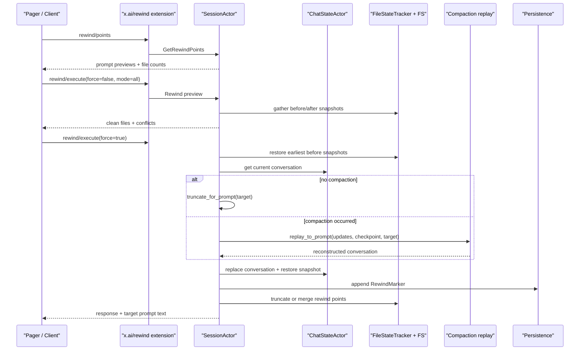

# Walkthrough：一次 Rewind 如何协调对话、文件、Git 与压缩边界

本文固定一个具体场景：

> 用户已经提交了三个 Prompt。第二、三个 Prompt 让 Agent 修改了多个文件，其中一个文件随后又被用户手工修改；会话在第三个 Prompt 后发生过 Compaction。用户选择“回到 Prompt 1 执行前”，先查看预览，再确认强制 Rewind。系统需要恢复 Conversation、文件内容、Prompt index、UI 时间线与可选的 Git/Hunk 状态，同时保证下一次输入能够 edit-and-retry。

Rewind 看起来像“撤销”，实际上横跨多个状态域：

1. 模型 Conversation；
2. Prompt index 与 prompt texts；
3. 工作区文件；
4. 文件 RewindPoint 索引；
5. 可选 Git HEAD/index 与 stash；
6. 可选 HunkTracker 状态；
7. `updates.jsonl` 的逻辑时间线；
8. Compaction checkpoint 与 Token/压缩策略。

这些域不是一个数据库事务。本文会明确每个提交点、失败后保留什么，以及为什么“部分成功”是必须被观察和处理的状态。

本文核对基线为根目录 `SOURCE_REV` 记录的提交。行号只帮助首次定位，长期维护时以类型、函数和测试名为准。

---

## 1. 最终调用链



语义先记成一句话：

```text
Rewind 到 N = 恢复“Prompt N 尚未运行”的状态，只保留 Prompt 0..N-1。
```

因此目标 `0` 不是保留第一个 Prompt，而是回到 Session preamble 之后、任何真实 Prompt 之前。

---

## 2. 建议同时打开的源码

```text
crates/codegen/
├── xai-grok-shell/src/
│   ├── extensions/rewind.rs
│   └── session/
│       ├── acp_types.rs
│       ├── commands.rs
│       ├── helpers/replay.rs
│       ├── persistence.rs
│       ├── storage/mod.rs
│       └── acp_session_impl/
│           ├── rewind.rs
│           ├── run_loop.rs
│           └── turn.rs
├── xai-chat-state/src/actor/
│   ├── mutations.rs
│   └── request_builder.rs
├── xai-grok-sampling-types/src/conversation.rs
└── xai-grok-workspace/src/session/
    ├── file_state.rs
    ├── checkpoint.rs
    ├── checkpoint_store.rs
    └── git.rs
```

快速定位：

```sh
rg -n "handle_rewind|get_rewind_points|needs_compaction_replay" \
  crates/codegen/xai-grok-shell/src/session

rg -n "replay_to_prompt|CompactionCheckpoint|RewindMarker" \
  crates/codegen/xai-grok-shell/src/session

rg -n "rewind_files|merge_and_remove_from|truncate_from" \
  crates/codegen/xai-grok-workspace/src/session

rg -n "restore_git_checkpoint|restore_hunk_checkpoints|rewind_to" \
  crates/codegen/xai-grok-workspace/src/session
```

---

## 3. 三种 Rewind Mode

`RewindMode` 明确区分：

| Mode | Conversation | Files | 典型用途 |
| --- | --- | --- | --- |
| `All` | 回退 | 回退 | 完整时间旅行 |
| `ConversationOnly` | 回退 | 保留 | 思路错了，但代码结果想留下 |
| `FilesOnly` | 保留 | 回退 | 代码错了，但对话上下文仍有价值 |

旧客户端没有 mode 时，为兼容默认 `All`；新客户端应显式选择。

Mode 不只是少执行一段代码。它还决定 RewindPoint 是截断，还是把已丢弃 Prompt 的文件影响合并到更早 checkpoint。

---

## 4. Prompt Index 是跨域关联键

同一个 `prompt_index` 同时关联：

- ChatState 中的真实用户 Prompt；
- `prompt_texts`；
- `updates.jsonl` 的 metadata；
- 文件 before/after snapshots；
- Hunk turn delta；
- 可选 Git checkpoint；
- Compaction checkpoint 的边界。

它不是 Conversation vector 下标。System、Project Instructions、synthetic User、Assistant、Reasoning 和 ToolResult 都会占 vector item，但不一定增加 prompt index。

这正是 Rewind 必须使用 real-prompt-aware truncate/replay，而不能简单 `conversation.truncate(N)` 的原因。

---

## 5. Rewind Point 如何产生

在一个 Prompt 开始时，Workspace 的 turn boundary 会：

- `FileStateTracker::begin_prompt(index)`；
- 可选捕获 Git state；
- 建立本 Prompt 的文件快照容器。

Agent 第一次写某个文件时，Notification Bridge 调用 `add_before_snapshot_for_prompt()`，保存写入前内容。同一 Prompt 对同一文件多次写入，最早的 before snapshot 胜出。

Prompt 结束时：

- `end_prompt()` 读取并保存 after snapshots；
- 可选捕获 Hunk delta；
- 可选写 durable checkpoint；
- 记录完成/错误/取消等 outcome 指标。

因此 Rewind Point 表示“这个 Prompt 运行前和运行后，Agent 触碰的文件分别是什么样”。

---

## 6. Before 与 After Snapshot 分别解决什么

```text
before_snapshot → 真正执行文件恢复时写回什么
after_snapshot  → 判断当前文件是否仍是 Agent 最后留下的状态
```

如果当前内容等于最后的 after snapshot，文件是 clean，可以直接恢复。

如果不相等，说明 Agent 写完后又有其他来源改动：用户、IDE、Formatter、Git 操作或另一个 Session。系统将其列为 conflict，但 force 模式仍可覆盖。

只保存 before 而没有 after，能撤销，却无法提醒用户会覆盖外部修改。

---

## 7. 为什么每个文件选择最早的 Before Snapshot

假设文件 `a.rs`：

```text
Prompt 1: v0 → v1
Prompt 2: v1 → v2
Prompt 3: v2 → v3
```

Rewind 到 Prompt 1 前，应恢复 `v0`。实现遍历所有 `prompt_index >= target` 的 points，并对每个 path 使用 `entry(...).or_insert(...)`，保留最早遇到的 before content。

如果错误地使用最新 before，会得到 `v2`，只撤销最后一个 Prompt，而不是回到目标时间点。

---

## 8. Rewind Picker 为什么只读 Metadata

`get_rewind_points()` 不为显示列表加载所有文件内容。它：

1. 从 FileStateTracker 获取 `RewindPointMeta`；
2. 从 ChatState snapshot 读取 `prompt_texts` 和当前 index；
3. 为每个 `0..current_prompt_index` 生成一个点；
4. 标注 file snapshot 数量和是否有文件变化；
5. 从真实用户 Prompt 提取最多约 60 字的首行 preview。

即使某个 Prompt 没改文件，它仍是 Conversation 可回退点。文件 snapshot 只是附加能力，不决定 Prompt 是否出现在 Picker。

恢复后的长 Session 还可以只扫描磁盘 snapshot metadata，不必物化巨大的 file content。

---

## 9. 请求如何进入 SessionActor

客户端调用：

```text
x.ai/rewind/points
x.ai/rewind/execute
```

Extension handler 解析：

- `sessionId`；
- `targetPromptIndex`；
- `force`；
- `mode`。

Local Session 使用 prompt index；仅给 `targetResponseId` 会返回参数错误。Handler 查找 resident `SessionHandle`，发送 `SessionCommand::Rewind`，通过 oneshot 等待响应。

实际 mutation 在 SessionActor 自己的 local runtime 上执行，避免外部 handler 直接修改 Actor 所有状态。

---

## 10. 目标范围怎样校验

Conversation 相关 Mode 要求：

```text
target_index < current_prompt_index
```

因为 Rewind 语义是撤掉 target 自身及之后的 Prompt；若 target 等于当前 index，没有一个已存在 Prompt 可撤。

`FilesOnly` 不受 ChatState index 限制，因为某些 bridge 架构中 Conversation 在 server side，而本地 Shell 只拥有文件 snapshots。它的有效范围来自文件 Rewind Point 集合。

---

## 11. Preview 是纯 Dry Run

`force=false` 时，代码只：

- 收集将恢复的文件；
- 读取当前内容；
- 对照 after snapshot；
- 返回 `clean_files` 与 `conflicts`。

它不会：

- 写或删文件；
- 截断 Conversation；
- 修改 Prompt index；
- 追加 RewindMarker；
- 删除 checkpoints。

当前响应以 `success=false` 表示“尚未 commit”，即使没有 conflict 也是预览，不应把它解释为操作失败。

---

## 12. 三种 Conflict

根据 current 与 after 是否存在：

| Current | After | Conflict |
| --- | --- | --- |
| 不存在 | 存在 | `deleted_externally` |
| 存在 | 不存在 | `created_externally` |
| 存在且不同 | 存在且不同 | `modified_externally` |

判断的是“Agent 完成后发生了外部变化”，不是文本 merge conflict。系统不会尝试三方自动合并；force 的语义是允许用 before snapshot 覆盖当前状态。

---

## 13. Force 不等于忽略所有错误

`force=true` 表示用户已经接受已知外部修改会被覆盖。它不能让以下错误消失：

- 文件写入失败；
- 文件删除失败；
- `updates.jsonl` 无法读取；
- Compaction checkpoint 缺失或损坏；
- Actor snapshot 不可用；
- Git stash/reset/restage 失败。

Conflict 是产品确认问题；I/O、schema 和状态重建错误仍是执行问题。

---

## 14. 文件恢复的两种目标

Before snapshot 的 `content` 是：

- `Some(text)`：目标 Prompt 前文件存在，应写回该文本；
- `None`：目标 Prompt 前文件不存在，应删除当前文件。

这让 Rewind 同时支持：

- 撤销修改；
- 恢复删除；
- 删除 Agent 新建的文件。

路径用 `FlexiblePath` 保存。新数据尽量相对 workspace，旧 Session 的绝对路径仍能兼容，并在持久化前做 normalize。

---

## 15. 普通 Conversation Rewind

若 `last_compaction_prompt_index` 为 `None`，Session 使用：

```text
conversation_truncate_for_prompt(conversation, target_index)
```

该函数理解：

- Prompt index markers；
- synthetic User items；
- AutoContinue/AutoRecovery；
- ToolCall/ToolResult turn 结构；
- Session preamble。

然后截断 Conversation，使目标 0 只保留 preamble，目标 N 保留前 N 个真实 Prompt 的完整 turns。

---

## 16. 为什么发生过 Compaction 后不能直接 Truncate

Compaction 会把多个旧 User turns 折叠成：

- Last real user query；
- recent tail；
- synthetic summary；
- reminders。

此时 Conversation 中的 User item 数量不再对应原 `prompt_index`。即使目标在 compaction 之后，基于当前 vector 计数截断也可能切错。

所以只要 snapshot 记录发生过 compaction，`needs_compaction_replay()` 对所有目标返回 true，统一从 `updates.jsonl` 与 checkpoints 重建。

---

## 17. 跨压缩 Rewind 的 Replay

`replay_to_prompt(updates_path, session_dir, target)` 在 blocking pool 中执行，因为它同步扫描日志并读取 checkpoint 文件。

它处理：

- User/Agent chunks 聚合；
- Prompt 计数；
- RewindMarker 的旧分支截断；
- CompactionCheckpoint；
- target 前后的停止/裁切；
- 原始 user info；
- surviving compaction marker。

返回的 `ReplayResult` 包含 reconstructed Conversation 和 `prompt_index_reached`，不是 UI replay update 列表。

---

## 18. Target 在 Compaction 之前

若目标早于 checkpoint：

- 不能使用 compacted history；
- 继续从 raw updates 重建旧 turns；
- 仍需打开 checkpoint 取得 `original_user_info`；
- 最后将当前 System 与原 user info preamble 放回 rebuilt turns 前。

原 user info 很重要，因为压缩或后续 Agent rebuild 可能更新了当前 prefix。Rewind 应尽量恢复目标时间点模型真正见过的身份信息。

---

## 19. Target 在 Compaction 之后

若目标位于 checkpoint 之后：

- 加载 checkpoint 的 `compacted_history`；
- 以它作为 replay base；
- 应用 checkpoint 后、target 前的 updates；
- 保留相应 `last_compaction_prompt_index`。

Checkpoint history 已包含 System 与 User prefix，因此调用方直接使用，不能再重复 prepend preamble。

---

## 20. Checkpoint 缺失为何不能降级普通 Truncate

缺失、损坏或 schema 过新的 CompactionCheckpoint 会使 replay 返回错误。Session 明确中止 Conversation rewind，不回退到当前 compacted vector 的普通截断。

原因有两个：

1. User item 计数已经与 Prompt index 失配，可能保留或删除错误 turns；
2. 直接 raw replay 可能重建出未经压缩的超大 Conversation，下一次请求立刻溢出。

这是 fail closed：宁可告诉用户换一个目标，也不伪造一个看似成功的错误历史。

---

## 21. Conversation Commit 的两个动作

重建或截断完成后：

1. `replace_conversation(conversation)` 更新 Actor 状态并持久化 history；
2. 获取 snapshot，设置：
   - `prompt_index = target`；
   - `prompt_texts.truncate(target)`；
   - 更新或保留 `last_compaction_prompt_index`；
3. `restore_snapshot(snap)` 恢复关联字段。

只替换 vector 而不修正 prompt index，会让下一次 Rewind、checkpoint 与 edit-and-retry 全部错位。

---

## 22. 为什么返回 Target Prompt Text

在 mutation 前，Session 从 snapshot 取：

```text
prompt_texts[target_index]
```

成功响应中的 `prompt_text` 可让客户端把被撤销的 Prompt 预填回输入框，用户修改后重新提交。

Session 还将它保存到 `rewind_pending_prompt`，下一次 `prompt()` 可检测这是 edit-and-retry，而不是完全无关的新问题。

因此 Rewind 不只是删除历史，也为交互上的“编辑后重试”保留桥梁。

---

## 23. Rewind 后为什么清理部分 Compaction Suppression

Conversation 缩小后，之前的 size/schema 或 per-turn suppression 可能已经不成立。Rewind 会清除非账户类 suppression，使 auto compaction 能在新预算下重新判断。

Credit/账户状态 suppression 不能因历史变短自动清除，因为 Rewind 无法证明账户充值或认证问题已经恢复。

这一行为把“预算原因”和“账户原因”分开。

---

## 24. `updates.jsonl` 为什么只追加 RewindMarker

Updates 是 append-only，Rewind 不物理删除旧事件。成功 Conversation rewind 后追加：

```text
RewindMarker { target_prompt_index, created_at }
```

后续 UI replay、Prompt extraction、Session Load 和 orphan task scan 都先应用 marker，忽略死分支，再接受 marker 后的新事件。

这既保留审计历史，也允许逻辑时间线分叉。

---

## 25. FilesOnly 为什么不追加 RewindMarker

RewindMarker 表达的是 Conversation/UI timeline 的分支。`FilesOnly` 保留对话，不能把对应 UI turns 从历史中隐藏，因此不追加 marker。

它只恢复文件并截断文件 RewindPoints，使未来文件时间线从目标处重新开始。

这也意味着模型仍记得后来 turns；用户选择 FilesOnly 后应理解模型上下文与磁盘状态可能故意不一致。

---

## 26. All/FilesOnly 如何处理 RewindPoint

文件已经恢复后，目标及之后的 snapshots 都描述旧的、已被撤销的文件分支。代码：

- `file_state_tracker.truncate_from(target)`；
- 发送 `PersistenceMsg::TruncateRewindPoints`。

内存与磁盘索引都删除 `>= target` 的 points。下一次 Prompt 使用同一个 target index 时，将创建新 checkpoint，不与旧分支混合。

---

## 27. ConversationOnly 为什么不能简单截断文件 Checkpoint

ConversationOnly 保留所有文件变化。若直接删除被撤销 turns 的 points，将来 `/rewind 0` 无法再撤掉这些仍存在的改动。

`merge_and_remove_from(target)` 将 `>= target` 的文件效果折叠进前一个 surviving point，再删除原 points。

目标为 0 时没有更早 point 可承载，tracker 清空；当前磁盘成为后续新 Prompt 的基线。

持久化使用 disk-authoritative merge，避免 lazy tracker 只加载部分历史时误截断磁盘数据。

---

## 28. Local Shell 与 Workspace 多域 Rewind

仓库存在两个相关层次：

- Shell `handle_rewind()`：协调本地 Conversation 与 FileStateTracker；
- Workspace `rewind_to()`：协调 FS、可选 Git、Hunk 和 durable checkpoint store。

在不同部署/bridge 形态下，Conversation 可能在 Server，文件操作在本地 Workspace。协议层会组合结果，但不能假设所有代码路径都通过同一个函数。

阅读或修改时应先确认实际所有者：谁拥有 ChatState，谁拥有真实 filesystem，谁能操作 Git。

---

## 29. Workspace Rewind 的 Git 顺序

启用 `workspace_rewind_git` 时，Workspace 顺序是：

1. 选择目标或最近的较早 Git checkpoint；
2. 保存当前改动到 stash；
3. soft reset/unstage 到捕获状态；
4. 执行文件 snapshots 恢复；
5. 文件成功后，根据恢复树 restage 原 index paths；
6. 截断目标及之后的 Git checkpoints。

Git 先行动，是为了让 stash/abort guard 看到真正的 live working tree；restage 必须等文件内容恢复后才能得到正确 index。

---

## 30. 为什么 Git 使用 Soft Restore

目标不是用硬 reset 粗暴抹掉所有工作，而是：

- 保存 Rewind 前改动到可恢复 stash；
- 调整 HEAD/index 基线；
- 让 FileStateTracker 精确恢复 Agent 涉及的文件；
- 最后重建 staged paths。

这减少误删与 Session 无关工作，并留下恢复逃生口。

若没有可用 Git checkpoint，代码明确记录 partial rewind，保留 Git checkpoints 以避免假装 HEAD 已与文件树一致。

---

## 31. HunkTracker 如何回到目标开头

启用 `workspace_rewind_hunks` 时，每个 Prompt 可保存 incremental `HunkTurnDelta`。

恢复到 target 时：

- 按升序组合所有 `< target` 的 deltas；
- 同一路径最后一次 snapshot 胜出；
- 重建 HunkTracker 的 file states 与 turn index；
- 删除 `>= target` 的 hunk checkpoints；
- target 0 恢复为空状态。

若功能在 Session 中途才开启，没有足够早的数据证明目标状态，代码选择 no-op，而不是清空无法重建的 live hunks。

---

## 32. Durable Checkpoint Store 的角色

启用 durable rewind 时，FS RewindPoint 与可选 Hunk delta 组合成 `RewindCheckpoint` 写入磁盘。

它支持：

- Session 重启后 rehydrate；
- cap/retention；
- orphan temp 清理；
- 成功 Rewind 后 truncate `>= target`。

它是内存 tracker 的 durability mirror，不把所有跨域操作变成原子事务。

---

## 33. Rewind 不是跨域原子事务

实际提交顺序可能是：

```text
Git soft restore → Files restore → Conversation replay/replace
→ RewindMarker append → Trackers/checkpoints truncate
```

任一中间步骤失败，都可能留下部分变化。代码在不同层使用：

- 保留 checkpoints 以便重试；
- stash 保护 Git 前状态；
- 明确 partial rewind 日志；
- checkpoint fail-closed；
- response 中列出 reverted files/conflicts/error。

理解 Rewind 的正确心智不是 ACID transaction，而是**有恢复证据的分阶段 saga**。

---

## 34. 一个重要的 Local `All` 失败边界

当前 Shell `handle_rewind()` 的 commit 路径先执行文件恢复，再执行跨 Compaction Conversation replay。

如果文件已经写回，但 checkpoint 缺失使 replay 失败：

- Conversation 保持原状态；
- 函数提前返回失败；
- 文件可能已经处于目标旧状态；
- 文件 tracker 尚未 truncate，仍保留重试证据；
- 返回值中的 `reverted_files` 在该早退分支可能为空，不能完整反映已发生副作用。

这是源码事实和诊断陷阱。调用方不能把 `success=false` 等同于“什么都没变”。

---

## 35. 文件逐项失败的边界

Workspace `rewind_files()` 会设置 `had_errors`：

- 任一写/删失败则 `success=false`；
- 不截断 tracker，允许重试；
- 已成功恢复的其他文件不会自动回滚。

Shell 本地 hand-written 文件循环的错误收集更弱：写失败会跳过，删除失败会记录 warning，但整体路径仍可能继续 Conversation 与 tracker mutation。

因此排障必须查看 warning 与实际文件，不应只信最终布尔值。若未来统一实现，优先复用 Workspace 的 typed `FileRewindResponse` 语义。

---

## 36. Git 失败也可能形成 Partial Rewind

Workspace 先尝试 Git restore，但即使 Git abort，仍继续 FS revert，并记录：

```text
git domain not restored; filesystem still reverted (partial rewind)
```

反过来，Git soft restore 成功、FS 恢复失败时，Git checkpoints 不会被截断，以便保留重试和一致性证据；stash 仍可用于人工恢复。

跨域失败响应必须说明哪一域成功，不能只返回一个模糊“rewind failed”。

---

## 37. 外部修改 Conflict 与 Partial Failure 的区别

| 类型 | 何时发现 | 是否已经 mutation |
| --- | --- | --- |
| Conflict | Preview/current-vs-after 比较 | 否 |
| Force overwrite | 用户接受 conflict 后 | 会覆盖外部修改 |
| I/O partial failure | Commit 写/删途中 | 部分文件可能已变 |
| Cross-compaction failure | 文件阶段之后可能发生 | 文件可能已变、Conversation 未变 |
| Git partial | Git/FS/Hunk 分阶段执行 | 各域状态可能不同 |

Conflict 是可预见的用户决策；Partial failure 是执行结果。二者不能使用同一个字段糊在一起。

---

## 38. Rewind 后下一次 Prompt 如何建立新分支

成功 Conversation rewind 后：

- ChatState prompt index 回到 target；
- `prompt_texts` 截断；
- updates 追加 marker；
- client 可把 target prompt 预填并编辑；
- 新 User/Agent updates 继续 append 在 marker 之后；
- 新文件 checkpoint 使用复用的 target index；
- replay filter 只保留新逻辑分支。

物理日志保留两条分支，逻辑 Session 只选择最后 marker 定义的存活历史。

---

## 39. Rewind 与 Fork 的差别

Rewind 在同一个 Session ID 内改变逻辑当前分支；Fork 创建新的 Session 身份并保留原 Session 不变。

| 特性 | Rewind | Fork |
| --- | --- | --- |
| 原 Session 当前状态 | 被改变 | 保留 |
| updates 文件 | 追加 marker | 复制/变换到新 Session |
| 文件工作区 | 可原地恢复 | 常用新 Worktree |
| 适合 | 放弃错误后续 | 保留两个方案并行探索 |

如果用户不确定是否要丢弃当前分支，Fork 通常具有更强可恢复性，但成本更高。

---

## 40. Rewind 与普通 Undo 的差别

编辑器 Undo 通常只恢复文本 buffer；Grok Build Rewind 尝试恢复一次 Agent turn 的多种后果：

- 模型记忆；
- 文件创建/修改/删除；
- staged state；
- Hunk attribution；
- UI replay timeline；
- Token 与 compaction markers。

它更接近“回到一次交互前”，而不是“撤销最近一次文件写入”。正因范围更大，部分失败与外部修改检测也更重要。

---

## 41. 正常路径状态表

| 阶段 | Conversation | Files | Updates | Checkpoints |
| --- | --- | --- | --- | --- |
| Preview | 不变 | 不变 | 不变 | 不变 |
| File commit | 旧 | 已逐项恢复 | 不变 | 保留 |
| Conversation commit | 已截断/重建 | 已恢复 | 尚未 marker | 保留 |
| Marker append | 新分支 | 已恢复 | 追加 RewindMarker | 保留 |
| Tracker finalize | 新分支 | 已恢复 | marker 存在 | truncate/merge |
| Next Prompt | 从 target 继续 | 新修改基于恢复态 | marker 后追加 | 新 point 复用 index |

---

## 42. Mode 对 Tracker 的影响矩阵

| Mode | Conversation | Files | RewindMarker | File tracker |
| --- | --- | --- | --- | --- |
| All | truncate/replay | restore | append | truncate `>= target` |
| ConversationOnly | truncate/replay | untouched | append | merge discarded effects backward |
| FilesOnly | untouched | restore | none | truncate `>= target` |

这张表是修改 Rewind 代码时最值得先核对的契约。

---

## 43. 调试 Rewind 的推荐顺序

### A. 确认目标语义

- target 是“Prompt N 之前”还是“保留 Prompt N”；
- current prompt index；
- mode 与 force；
- 是否发生过 compaction。

### B. 检查 Preview 证据

- 收集到了哪些 points；
- 每个文件选择的 earliest before；
- latest after 是什么；
- current read 是否成功；
- conflicts 类型是否正确。

### C. 按提交顺序查副作用

- Git stash/reset 是否发生；
- 哪些文件实际写回/删除；
- replay/truncate 是否成功；
- ChatState prompt index 是否更新；
- RewindMarker 是否落盘；
- trackers/checkpoint store 是否 truncate 或 merge。

### D. 验证下次运行

- Picker 是否只显示 surviving points；
- edit-and-retry 是否预填原 Prompt；
- Session reload 是否过滤死分支；
- Token/compaction suppression 是否重新计算；
- 新文件 checkpoint 是否基于当前磁盘。

---

## 44. 常见错误理解

### 误解 1：Rewind 到 2 会保留 Prompt 2

它恢复 Prompt 2 运行前，只保留 0 和 1。

### 误解 2：每个 Prompt 必须改文件才是 Rewind Point

所有真实 Prompt 都可回退 Conversation，文件 metadata 可为空。

### 误解 3：Conflict 表示无法 Rewind

它表示外部修改风险；force 可覆盖，但 I/O 错误仍可能失败。

### 误解 4：Compaction 后只要目标在压缩点以后就能普通截断

压缩已改变 User item 数量，所有目标统一 replay 更安全。

### 误解 5：ConversationOnly 可以丢掉文件 checkpoints

文件仍保留其效果，checkpoint 必须合并，保证以后还能完整撤销。

### 误解 6：`success=false` 说明没有副作用

跨压缩或多文件 commit 可能已经恢复部分文件。

### 误解 7：Git、FS、Conversation 是一个原子事务

它们按阶段提交，并用 stash、checkpoint 保留与日志表达 partial state。

### 误解 8：RewindMarker 删除了旧 updates

它只定义逻辑分支，物理 append-only 文件仍保留旧行。

---

## 45. 修改这条链路时必须守住的 Invariants

1. Target N 必须始终表示 Prompt N 运行前；
2. Prompt index 不能用 Conversation vector index 替代；
3. 每个文件必须恢复 target 及之后最早的 before snapshot；
4. Conflict 必须比较 current 与最新 after snapshot；
5. Preview 不能产生任何 mutation；
6. FilesOnly 不得追加 Conversation RewindMarker；
7. ConversationOnly 不得丢失仍在磁盘上的文件效果；
8. Compaction 发生后必须 replay，而不是猜测 vector 截断点；
9. Checkpoint 不安全时不得回退普通 truncate；
10. Checkpoint history 已含 preamble 时不得重复 prepend；
11. Replace conversation 后必须同步 prompt index/texts/compaction marker；
12. RewindMarker 必须在成功 Conversation commit 后追加；
13. Replay/Load/Prompt extraction 必须过滤 marker 定义的死分支；
14. 文件失败时应保留 checkpoint 数据以便重试；
15. Git 前状态应有 stash 或明确 abort evidence；
16. Hunk restore 只能在有足够历史证据时重建；
17. Partial success 必须可观察，不能被单一布尔值掩盖；
18. Rewind 后 budget suppression 只清除与上下文缩小相关的类别；
19. Target prompt text 必须在截断前捕获；
20. Lazy/durable tracker 的磁盘 mutation必须避免用部分内存视图覆盖全量历史。

---

## 46. 推荐的阅读与实验练习

1. 建立三个无文件修改 Prompt，确认 Picker 仍有三个点；
2. 同一文件跨三个 Prompt 修改，验证 rewind 选择最早 before；
3. Agent 写完后手动改文件，验证 modified_externally；
4. Agent 新建后用户删除，验证 deleted_externally；
5. Preview 后比较磁盘、Conversation 与 updates，确认完全无 mutation；
6. 分别运行 All、ConversationOnly、FilesOnly，核对矩阵；
7. Rewind 到 0，确认只保留 Session preamble；
8. 在 history 中插 synthetic User items，验证不增加 Prompt 计数；
9. 压缩后回到压缩前，验证 raw updates + original user info；
10. 压缩后回到压缩后，验证 checkpoint base + tail；
11. 删除 checkpoint，观察 Conversation rewind fail closed；
12. 在 checkpoint 缺失前让文件可恢复，观察部分状态边界；
13. ConversationOnly 后再 All rewind 到更早点，确认合并后的文件效果仍可撤；
14. 开启 Git rewind，验证 stash、soft reset、FS restore、restage 顺序；
15. 注入 FS write failure，确认已成功文件与 checkpoint 保留情况；
16. 重启 Session，验证 RewindMarker 过滤旧分支；
17. Rewind 后修改预填 Prompt 再提交，验证 index 被复用为新分支。

---

## 47. 本文编写时的实际验证

| 命令 | 结果 | 主要覆盖 |
| --- | --- | --- |
| `cargo test -p xai-grok-sampling-types --lib truncate_for_prompt` | 13 passed | Prompt marker 优先级、synthetic/AutoContinue/AutoRecovery 排除、ToolCall turn 与目标边界截断 |
| `cargo test -p xai-grok-workspace --lib session::file_state::tests` | 29 passed | Before snapshot first-wins、路径兼容、truncate/merge、metadata scan、lazy load、损坏行恢复与并发 capture/rewind |
| `cargo test -p xai-grok-workspace --lib session::checkpoint::tests` | 18 passed | Prompt begin/finalize、非 Completed outcome、Git/Hunk feature gate、Hunk restore、checkpoint serde 与 durable persistence |
| `cargo test -p xai-grok-workspace --lib checkpoint_store` | 11 passed | Cold-cache rehydrate、retention/cap、orphan temp 清理与目标之后 truncate |

Shell 层定向命令 `cargo test -p xai-grok-shell --lib rewind_to_start_keeps_only_preamble` 在目标执行前，仍被仓库现有 `session/acp_session_tests/tool_layer_images_bridge_tests.rs:15` 编译错误阻塞：缺少 `use base64::Engine`，报 `E0599`。因此本文没有宣称本次执行通过 Shell 的 Preview、三种 Mode、跨 Compaction replay、RewindMarker 与部分失败集成场景；这些结论来自对应实现和仓库已有测试定义，Prompt-aware truncate 及 Workspace 文件/Git/Hunk/checkpoint 基础则由上表实际执行结果验证。

---

## 48. 自测题

1. Rewind 到 Prompt N 究竟保留哪些 Prompt？
2. Prompt index 为什么不是 Conversation 下标？
3. Before 与 After snapshot 各有什么用途？
4. 为什么一个文件跨多个 Prompt 时要选 earliest before？
5. Preview 的 `success=false` 为什么不一定表示错误？
6. Force 接受了什么风险，又没有接受什么错误？
7. FilesOnly 为什么可绕过 ChatState prompt index 校验？
8. 普通 truncate 如何排除 synthetic User turns？
9. 为什么只要发生过 Compaction，所有目标都要 replay？
10. Target 在 checkpoint 前后分别怎样重建？
11. Checkpoint 缺失为何不能使用当前 history 普通截断？
12. Conversation replace 后还需恢复哪些 snapshot 字段？
13. RewindMarker 如何在 append-only 文件上表达分支？
14. ConversationOnly 为什么要 merge file points？
15. Git restore 为什么先于 FS，restage 为什么后于 FS？
16. Hunk checkpoint 不完整时为何选择 no-op？
17. 哪些路径可能产生 partial rewind？
18. 为什么 `success=false` 不能证明文件没变化？
19. Rewind 与 Fork 的核心差别是什么？
20. Rewind 后下一 Prompt 如何成为新逻辑分支？

---

## 49. 本篇术语表

| 名词 | 白话解释 | 在本文中的具体含义 |
| --- | --- | --- |
| Rewind | 回到某个真实 Prompt 执行前 | 同时可影响对话、文件与辅助状态 |
| target prompt index | 想撤掉的第一个 Prompt | 保留 `0..target-1` |
| RewindMode | 选择恢复哪些域 | All、ConversationOnly、FilesOnly |
| Rewind Point | 一个 Prompt 的恢复记录 | before/after 文件 snapshots 与 index |
| before snapshot | Agent 写入前的文件内容 | 真正恢复目标，None 表示当时不存在 |
| after snapshot | Agent 完成后的文件内容 | 检测后续外部修改 |
| earliest before | 目标及之后第一次触碰前的状态 | 跨多 Prompt 恢复的正确值 |
| latest after | Agent 最后留下的状态 | 与 current 比较是否 clean |
| clean file | 当前仍等于 latest after | 没有观察到外部修改 |
| conflict | Agent 后又发生外部变化 | deleted/created/modified externally |
| preview | 只计算影响、不执行 | `force=false` 的 dry run |
| force | 接受覆盖已知 conflict | 不消除 I/O 或 checkpoint 错误 |
| preamble | 真实 Prompt 前的会话头 | System、user info、project instructions 等 |
| real prompt | 用户真正发起任务的消息 | synthetic User 不计入 index |
| conversation truncation | 删除目标及之后的 turns | 无 Compaction 时使用 |
| cross-compaction replay | 从事件与 checkpoint 重建 | Compaction 后替代直接截断 |
| CompactionCheckpoint | 压缩点的新 history 快照 | replay base 与 original user info 来源 |
| original user info | 压缩前模型见到的用户前缀 | 回到旧历史时保持当时语义 |
| fail closed | 无法证明安全就拒绝 | checkpoint 缺失不猜测截断 |
| RewindMarker | 逻辑历史截断事件 | append 到 updates，不删除旧行 |
| dead branch | marker 撤销的旧 updates | Replay 时过滤 |
| edit-and-retry | 改写被撤 Prompt 后重发 | 用 `prompt_text` 和 pending prompt 支持 |
| tracker truncate | 删除目标及之后 checkpoints | 文件也被恢复时采用 |
| tracker merge | 将丢弃 Prompt 的文件效果向前折叠 | ConversationOnly 使用 |
| disk-authoritative merge | 以全量磁盘记录为合并基础 | 防止 lazy 内存视图误删历史 |
| FlexiblePath | 兼容相对/绝对路径的表示 | Rewind snapshots 的 path 类型 |
| Git checkpoint | Prompt 开始时捕获的 HEAD/index | 可选 Workspace Rewind 域 |
| soft restore | 不用 hard reset 粗暴擦除 | stash + soft reset + unstage + restage |
| stash | 保存 Rewind 前 Git 改动 | partial failure 的逃生口 |
| HunkTracker | 跟踪 Agent 产生的 diff hunks | Rewind 后需重建 attribution |
| Hunk delta | 单个 Prompt 的增量 Hunk 状态 | 按 `< target` 组合恢复 |
| durable checkpoint | 落盘的 FS/Hunk 恢复 blob | 重启后 rehydrate |
| partial rewind | 只有部分域或文件成功恢复 | 非原子分阶段流程的真实终态 |
| saga | 多步骤、各自提交并用补偿/证据恢复 | 理解跨域 Rewind 的阅读模型 |
| commit point | 某一域开始生效的位置 | 文件写回、Conversation replace、marker append 等 |
| logical timeline | Rewind 过滤后的存活历史 | 不等于 updates 的全部物理行 |
| Fork | 从某点创建独立 Session 分支 | 不改变原 Session 当前状态 |
| suppression | 自动压缩暂停状态 | Rewind 只清理预算相关类别 |

更多通用名词见 [全局术语表](../appendices/glossary.md)。

---

## 50. 源码证据索引

| 结论 | 主要源码入口 |
| --- | --- |
| Extension 请求解析与 SessionCommand 路由 | `xai-grok-shell/src/extensions/rewind.rs` |
| Mode、Request、Response 契约 | `xai-grok-shell/src/session/acp_types.rs` |
| Picker、preview、file/conversation commit | `xai-grok-shell/src/session/acp_session_impl/rewind.rs` |
| Actor command dispatch | `xai-grok-shell/src/session/acp_session_impl/run_loop.rs` |
| 跨压缩 Conversation replay | `xai-grok-shell/src/session/helpers/replay.rs` |
| RewindMarker 过滤与 prompt extraction | `xai-grok-shell/src/session/storage/mod.rs` |
| RewindPoint 持久化 truncate/merge | `xai-grok-shell/src/session/persistence.rs` |
| File snapshots、conflicts、restore 与 tracker merge | `xai-grok-workspace/src/session/file_state.rs` |
| Git/Hunk/FS 多域捕获恢复顺序 | `xai-grok-workspace/src/session/checkpoint.rs` |
| Durable checkpoint rehydrate/truncate | `xai-grok-workspace/src/session/checkpoint_store.rs` |
| Prompt-aware Conversation truncate | `xai-grok-sampling-types/src/conversation.rs` |

建议交叉阅读：

- [Git、Checkpoint、Rewind 与 Worktree](../03-subsystems/24-git-checkpoints-rewind-worktrees-and-session-recovery.md)
- [文件系统抽象、工作区路径与安全边界](../03-subsystems/19-filesystem-path-workspace-and-safety-boundaries.md)
- [状态所有权与一致性边界](../03-subsystems/01-state-ownership.md)
- [持久化与会话恢复](../02-runtime-flows/11-persistence.md)
- [Walkthrough：一次 SearchReplace 如何从读取依据变成可回退的文件修改](03-search-replace-from-read-evidence-to-rewindable-edit.md)
- [Walkthrough：自动压缩如何重建可继续的对话上下文](05-auto-compaction-token-budget-summary-and-recovery.md)
- [Walkthrough：一次 Session Load 如何恢复模型状态、重放 UI 并修复崩溃残留](06-session-load-resume-replay-and-crash-recovery.md)

---

## 51. 一句话复盘

Grok Build 将 Rewind 定义为“恢复 Prompt N 运行前”，用 Prompt index 关联 Conversation、文件 before/after snapshots、Git/Hunk checkpoints 与 append-only updates；普通历史按真实 Prompt 边界截断，发生过 Compaction 则必须借助 checkpoint 和 raw updates 重建，随后同步 Prompt snapshot、追加 RewindMarker，并依据 Mode 截断或合并文件 checkpoints；Preview 只报告外部修改冲突，Force 才分阶段提交，而 Git、FS、Conversation 与 tracker 并非原子事务，所以 stash、保留 checkpoint、fail-closed replay 和明确观察 partial rewind 是安全恢复的核心。
