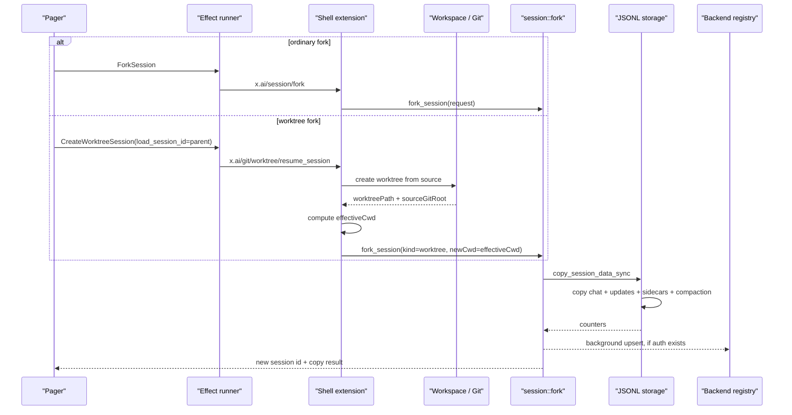

# Walkthrough：一次 Session Fork 如何复制历史并隔离 Worktree

本文固定两个相邻场景：

> 场景 A：用户在当前目录把父 Session Fork 成一个普通子 Session。子 Session 继承选定边界以前的 Conversation、可重放事件、计划和压缩档案，但拥有新的 Session ID；父 Session 不被截断，父子可以从此独立继续。

> 场景 B：用户选择“在新 Worktree 中 Fork”。系统先从父 Session 所在 Git 工作区创建独立工作树，再把会话历史复制到新 CWD。如果会话复制失败，系统尽力清理刚创建的 Worktree；成功后，父目录和父 Session 都继续保留。

Fork 不是简单的目录复制。它同时处理：

1. 新 Session 身份；
2. Conversation 的 Prompt 边界；
3. append-only `updates.jsonl` 的存活分支；
4. 每条通知携带的 Session 归属；
5. CWD 路径重写；
6. Summary 中哪些字段继承、哪些字段重置；
7. Plan、Signals、Tool State 等 sidecar；
8. Compaction segment 与 checkpoint；
9. Git Worktree 的代码副本；
10. 本地成功、后台注册与失败清理的边界。

本文核对基线为根目录 `SOURCE_REV` 记录的提交。行号只帮助首次定位，长期维护时以类型、函数和测试名为准。

---

## 1. 先记住结论

```text
普通 Fork = 新 Session 身份 + 父历史的独立持久化副本

Worktree Fork = 新 Git 工作树 + 新 Session 身份 + 指向新工作树的历史副本
```

它和 Rewind 的根本差别是：

| 操作 | 原 Session | 新 Session | 原工作区 | 新工作区 |
| --- | --- | --- | --- | --- |
| Rewind | 原地改变逻辑历史 | 不创建 | 可原地恢复文件 | 不创建 |
| 普通 Fork | 保持不变 | 创建 | 父子共用或指向请求给定 CWD | 不一定创建 |
| Worktree Fork | 保持不变 | 创建 | 保持不变 | 创建独立 Git 工作树 |

“父分支不变”有两层含义：父 Session 的持久化文件不被改写；Worktree 模式下，子 Session 后续修改发生在另一个工作树中。

---

## 2. 最终调用链



最重要的顺序是：

```text
Worktree 创建成功
  → 计算子 Session 的 effective CWD
  → 复制 Session
  → 返回给 Pager 加载
```

如果最后的 Session 复制失败，Worktree 路径已经出现，因此 shell 会进入补偿清理。

---

## 3. 建议同时打开的源码

```text
crates/codegen/
├── xai-grok-pager/src/app/
│   ├── dispatch/session/fork.rs
│   ├── dispatch/session/lifecycle.rs
│   ├── effects/mod.rs
│   └── session_startup.rs
├── xai-grok-shell/src/
│   ├── extensions/session_admin.rs
│   ├── extensions/worktree.rs
│   └── session/
│       ├── fork.rs
│       ├── worktree.rs
│       └── storage/
│           ├── mod.rs
│           └── jsonl/
│               ├── mod.rs
│               ├── copy.rs
│               └── copy_tests.rs
├── xai-grok-sampling-types/src/conversation.rs
└── xai-grok-workspace/src/worktree/mod.rs
```

快速定位：

```sh
rg -n "ForkSessionRequest|fork_session" crates/codegen/xai-grok-shell/src
rg -n "copy_session_data_sync|copy_updates_streaming" crates/codegen/xai-grok-shell/src
rg -n "CreateWorktreeSession|resume_session_in_worktree" crates/codegen
rg -n "transform_conversation_cwd|conversation_truncate_for_prompt" crates/codegen
```

---

## 4. Pager 先创建一个“待兑现”的子视图

`dispatch/session/fork.rs::dispatch_fork_resolved()` 在真正 I/O 发生前建立子 `AgentView`，记录 `forked_from`，并把 UI 切到这个子视图。

这不是说 Fork 已成功。它是一个 optimistic placeholder：

- UI 先有地方显示 loading 状态；
- 异步 Effect 完成后再填入真实 Session ID 和 CWD；
- 失败则由 `TaskResult::*Failed` 把 placeholder 收敛到错误状态。

普通 Fork 发出 `Effect::ForkSession`；Worktree Fork 发出：

```text
Effect::CreateWorktreeSession {
    load_session_id: Some(parent_session_id),
    ...
}
```

这里的 `load_session_id` 不表示“在新窗口原样加载父 Session”。它让 shell 找到父 Session 后，在新工作树中创建一个新的 forked Session。

---

## 5. 普通 Fork 请求携带什么

`ForkSessionRequest` 的关键字段：

| 字段 | 含义 |
| --- | --- |
| `source_session_id` | 父 Session 身份 |
| `source_cwd` | 父 Session 数据所在 CWD 维度 |
| `new_cwd` | 子 Session 的真实工作目录 |
| `new_session_id` | 可由客户端预留；否则服务端生成 |
| `new_model_id` | 可选模型覆盖 |
| `target_prompt_index` | 可选的历史复制终点，0-based、包含目标 Prompt |
| `session_kind` | 默认 `fork`，Worktree 路径传 `worktree` |
| `source_workspace_dir` | Worktree 子 Session 的原始工作区来源 |

Response 不返回完整文件清单，只返回：新 ID、复制的 chat/update 数、plan 是否复制、新 CWD、父 ID和模型覆盖。

因此 response 是“创建结果摘要”，不是事务日志。

---

## 6. 新 Session ID 为什么不用父 ID 前缀

`generate_fork_session_id()` 直接生成 UUIDv7，固定为标准 36 字符格式。

它故意不采用：

```text
parent-id-fork-fork-fork-...
```

原因是多轮 Fork 不会让 ID 无限增长，也不会把祖先链编码进主键。父子关系由 `Summary::parent_session_id` 表达。

这体现一个常见设计原则：

```text
身份使用固定格式的 opaque ID；关系使用显式 metadata。
```

客户端提供 `new_session_id` 时，Pager 的 Effect 路径会先检查可用性。自动 UUIDv7 主要依赖其唯一性。

---

## 7. Fork 只复制持久化状态，不启动 Session

`session/fork.rs` 文件头明确说明：它创建新的 Session files，但不启动 Session。

也就是说 `fork_session()` 负责：

- 解析父/子 `Info`；
- 复制落盘数据；
- 生成新 Summary；
- 可选后台登记；
- 返回结果。

真正的 actor 创建、Session load 和 UI 状态切换属于 Pager/lifecycle 的后续工作。

因此调试“Fork 成功但子会话没运行”时，要先区分：

1. 持久化复制是否成功；
2. Pager 是否收到成功 TaskResult；
3. 子 Session 是否成功 load/start。

---

## 8. 为什么复制被放进 `spawn_blocking`

`copy_session_data_sync()` 使用同步文件 I/O。`fork_session()` 用 `tokio::task::spawn_blocking` 执行它。

这不是为了让磁盘复制变成“异步 API”，而是避免同步读写堵住 LocalSet 所在的单线程异步执行器。多个 Fork 也可以在 blocking pool 上真正并行推进。

边界是：

- async 层负责 orchestration；
- blocking pool 负责同步文件系统工作；
- join panic 被映射成 `io::Error`；
- copy 内部的 `io::Error` 继续向上传播。

---

## 9. Fork 实际复制哪些文件

可把目标 Session 目录理解为：

```text
<session>/
├── summary.json                  重新构造
├── chat_history.jsonl           解析、截断、路径转换后重写
├── updates.jsonl                流式解析、筛选、换 Session ID 后重写
├── plan.json                    可选原样复制
├── signals.json                 可选原样复制
├── plan_mode.json               可选原样复制
├── tool_state.json              可选原样复制
├── announcement_state.json      可选原样复制
├── compaction/                  Fork 默认原样复制 immutable segments
└── compaction_checkpoints/      只复制被保留事件引用的 checkpoint
```

Workflow 和 Goal 的运行态不是照搬：目标中的相应目录会先被清除，事件流里的 `WorkflowUpdated`、`GoalUpdated` 投影也会被丢弃。

这表达了“继承上下文”和“继承正在运行的编排”之间的区别。

---

## 10. 为什么 Chat History 可以整体读入内存

`chat_history.jsonl` 会被读成 `Vec<ConversationItem>`，因为后续需要：

- 按真实 Prompt 边界截断；
- 对每类 Conversation item 做 CWD 替换；
- 可选执行 fork safety filter；
- 可选剥离 reasoning；
- 重新计算 CWD generation。

该历史受 context window 和 Compaction 控制，通常有上界。

与之相对，`updates.jsonl` 是长期 append-only transcript，理论上无界，所以不能用同样策略全部物化。

---

## 11. Fork 的 Prompt 边界是“包含目标”

当 `target_prompt_index = N` 时，chat copy 调用：

```text
conversation_truncate_for_prompt(history, N + 1)
```

所以 Fork 保留 Prompt N 及其响应，目标是 inclusive。

```text
Fork at N   → 保留 Prompt 0..N
Rewind to N → 保留 Prompt 0..N-1
```

这是本文最容易写错、也最值得单独记忆的差异。

Fork 的语义是“从这一轮完成后的状态开一条支线”；Rewind 的语义是“回到这一轮运行之前，准备 edit-and-retry”。

---

## 12. Prompt Index 仍然不是 Vec 下标

Conversation 中还存在 System、synthetic User、Assistant、Reasoning、ToolResult 等 item。

`conversation_truncate_for_prompt()` 根据显式 `prompt_index` 和“是否启动真实 Prompt turn”的规则找到边界，而不是 `truncate(N + 1)`。

如果直接按 vector 下标复制：

- 可能在一个 Tool Call 中间截断；
- 可能把 synthetic warning 当成用户新任务；
- 可能留下 dangling ToolResult 或丢失完整 Assistant response。

Fork 和 Rewind 虽然对 N 的包含规则不同，但都依赖同一套 real-prompt-aware 语义。

---

## 13. 普通 Fork 默认不会执行 Subagent Safety Filter

`CopySessionOptions::fork_filter` 的默认值是 `false`。普通 `fork_session()` 没有覆盖它。

只有特定的子 Agent bootstrap copy 才会启用这一选项，用于：

- 删除 doom-loop warning 等 synthetic user messages；
- 截到最后一个完整 turn；
- 删除尾部不完整 assistant response；
- 让子 Agent 的 replay transcript 从空开始。

因此不能因为字段叫 `fork_filter` 就推断所有用户可见 Fork 都会过滤历史。

同理，普通 Fork 默认 `strip_reasoning = false`。该 option 支持其他复制场景，但本入口没有启用。

---

## 14. CWD 路径如何重写

只要：

```text
source_info.cwd != target_info.cwd
&& skip_cwd_transform == false
```

copy 就调用 `transform_conversation_cwd()`，把历史中的 source CWD 替换成 target CWD。

覆盖范围包括：

| Conversation item | 重写位置 |
| --- | --- |
| System | 文本内容 |
| User | 每个 Text content part |
| Assistant | 回复文本和 Tool Call JSON arguments |
| ToolResult | 工具结果文本 |
| Reasoning | summary text 与 content blocks |
| BackendToolCall | 不处理，代码假设不含 workspace path |

Tool Call arguments 虽是 JSON 编码字符串，路径在其中仍是普通 `/` 字符串，因此实现用 substring replace。

---

## 15. 路径替换不是通用的路径语义解析器

实现是字符串替换，不会：

- canonicalize symlink；
- 理解 Windows 大小写或路径等价；
- 区分“恰好包含相同文本”的非路径内容；
- 修改 `updates.jsonl` 内所有任意 payload 的路径；
- 修改 immutable compaction segment 内容。

所以它解决的是“历史中已知 source CWD 前缀迁移到 target CWD”，不是任意路径归一化。

`CopySessionOptions` 还提供 `skip_cwd_transform` 和 `prompt_display_cwd`，供“模型应继续看到稳定展示路径”的其他复制路径使用。不过本文追踪的 `ForkSessionRequest → fork_session()` 没有设置它们，当前 Worktree Fork 会按 `new_cwd` 重写 Conversation。

---

## 16. Worktree 的 `effective_cwd` 为什么不一定等于 Worktree 根

父 Session 可能从仓库子目录启动：

```text
repo root:       /src/repo
session cwd:     /src/repo/crates/foo
new worktree:    /wt/session-123
effective cwd:   /wt/session-123/crates/foo
```

`effective_worktree_path()` 利用 source path 和 source git root，把相对子目录投影到新 Worktree。

然后 Fork 使用：

```text
source_cwd = resolved_source_cwd
new_cwd    = effective_cwd
```

这样子 Session 恢复后仍位于对应 crate，而不是无条件落到仓库根。

---

## 17. `updates.jsonl` 为什么必须流式复制

Updates transcript 会保存 UI 可重放事件，并可包含已被 RewindMarker 逻辑淘汰的旧分支。它可能远大于当前模型 Conversation。

无目标 Prompt 时，`copy_updates_streaming()`：

1. 打开源文件；
2. 一行一行读取；
3. 解析 envelope；
4. 过滤不该继承的投影；
5. 重写 Session ID；
6. 立即写入目标文件。

峰值内存接近一条被限制大小的 line，而不是整个 transcript。

---

## 18. 64 MiB 单行上限保护什么

`MAX_UPDATE_LINE_BYTES` 是 64 MiB。超过上限且还没遇到换行的记录被视为损坏并流式 drain，不会把整条异常内容塞进内存。

它解决一种现实损坏：文件尾或内容失去换行，读取器可能把后续大量字节当成一行。

实现还使用 raw bytes：

- 分类阶段能容忍非法 UTF-8；
- 两次 pass 使用一致的非空行 index；
- 真正写入时，无法解析的 line 被跳过并告警。

因此复制策略是 corruption-tolerant，不是 byte-for-byte blind copy。

---

## 19. 指定 Prompt 边界时为什么需要两次扫描

有 `target_prompt_index` 时，Updates 不能简单“见到第 N 个 User 就停止”，因为其中有 RewindMarker 和逻辑死分支。

第一遍：

1. 为每个非空、未超限 line 计算 `RewindStep`；
2. 应用 `filter_rewind_by()`；
3. 在逻辑存活历史上应用 `truncate_for_prompt_by()`；
4. 只保存 survivor line indexes。

第二遍：

1. 将同一个已打开的文件 handle seek 回 0；
2. 仅复制 survivor indexes；
3. 解析、过滤、换 Session ID 后写入。

内存中保存的是每行的小型分类/index，而不是整行 JSON。

---

## 20. 为什么两遍读取要固定同一个文件 Handle

如果第一遍和第二遍分别按路径重新 `open()`，并发 rename/replace 可能让两遍看到不同 inode，line index 就会错位。

当前实现固定一个 handle，再 `seek(0)`。

并发 append 仍可能发生，但 append-only 契约使其可控：第一遍之后追加的行位于所有 survivor index 之后，第二遍不会把它们误当成早期 survivor。

这提供的是“基于第一遍观察结果的一致前缀”，不是跨多个 Session 文件的全局 snapshot transaction。

---

## 21. 不指定目标时为什么保留 Rewind Marker 和死分支

无 Prompt cut 时，Updates 逐行复制，不先计算逻辑 survivor 集，因此物理 dead branch 与 RewindMarker 都会进入子文件。

这并不会让 dead branch 复活，因为 load/replay 仍用 marker 重建逻辑时间线。

保留物理历史有两个优点：

- 不必为普通 Fork 物化全量 transcript；
- 保留与父 Session 相同的审计/回放事实。

指定目标时必须构造一个早期边界，所以才显式筛选 survivors。

---

## 22. 通知重写的是 Session 归属，不是所有事件 ID

`transform_session_id_in_update()` 对两类通知都只替换顶层 `session_id`：

- ACP `SessionNotification`；
- xAI extension `SessionNotification`。

它没有遍历所有 payload 去重新生成 tool call ID、event ID、prompt ID 或 trace ID。

因此准确说法是：

```text
复制事件被重新归属到子 Session；事件内部的业务关联 ID 通常保持不变。
```

保留 Tool Call/Tool Result 的关联 ID 很重要，否则历史重放会失去配对。新运行期 trace 则由 Summary 的 fresh fields 建立新的序列。

---

## 23. 为什么丢弃 Workflow/Goal 投影事件

`is_orchestration_projection_update()` 会过滤：

- `WorkflowUpdated`；
- `GoalUpdated`。

同时目标 Session 的 workflow directory 与 goal state parent directory 会被清除。

这些更新是运行态 projection，而不是可无条件继承的事实。如果复制它们，UI 可能认为子 Session 仍拥有父 Session 中正在运行、已终止或缺少执行资源的 orchestration。

设计语义是：子 Session 继承知识和可重放对话，但不冒充父 Session 的活跃工作流所有者。

---

## 24. Torn Line 为什么不让整个 Fork 失败

源 Session 可能正在 append，进程也可能曾在写一半时崩溃。Updates reader 遇到非法 UTF-8 或无法反序列化的 envelope 时：

- 跳过该 line；
- 第一次记录具体 warning；
- 多条时输出汇总 warning；
- 继续复制后续可解析记录。

这与 Session load 的 corruption tolerance 一致。

代价是 response 的 `updates_copied` 只表示成功重写的数量，不等于源文件非空行数。

---

## 25. Summary 不是复制，而是字段级 Fork

`fork_summary()` 对字段分三类。

继承的代表字段：

- `session_summary`；
- 当前模型，除非 request 覆盖；
- `head_commit`、`head_branch`；
- 标题及 manual 标记；
- agent name、sandbox profile、reasoning effort；
- `last_active_at`。

重新计算或新建：

- `info` 中的 ID/CWD；
- `created_at`、`updated_at`、`forked_at`；
- chat/update counters；
- `cwd_switch_bookkeeping_generation`；
- `chat_format_version`；
- 新 `grok_home`。

清空或重置：

- `pending_cwd_switch_reminder = None`；
- `collection_id = None`；
- `next_trace_turn = 0`；
- `request_id = None`；
- `git_root_dir = None`；
- `git_remotes = []`；
- `hidden = None`。

显式建立 lineage：

- `parent_session_id`；
- `session_kind`；
- `source_workspace_dir`；
- 可选 fork context 和 inherited prefix。

---

## 26. 为什么 `next_trace_turn` 必须归零

历史事件中旧 trace/tool/prompt 关联可以保留，以便重放；但子 Session 新产生的 turn 必须进入新的 Session identity 下的 trace 序列。

`next_trace_turn = 0` 表示子 Session 的未来运行从自己的 turn counter 开始。

这再次体现两层身份：

```text
历史记录内部关联 → 为了历史一致性保留
新运行的 Session/trace 序列 → 为了分支独立性重置
```

---

## 27. `parent_session_id` 才是谱系来源

子 ID 不包含父 ID。父子关系写在 Summary 中。

它支持：

- 一父多子；
- 子 Session 再 Fork；
- 后端或 UI 展示 lineage；
- 不依赖字符串解析识别关系。

`forked_at` 则记录分支创建时间。`session_kind` 区分普通 `fork` 与 `worktree` 等语义用途。

---

## 28. Sidecar 的继承矩阵

`CopySessionOptions::default()` 默认复制：

| Sidecar | 默认 | 说明 |
| --- | --- | --- |
| Plan state | 是 | 子 Session 延续显式计划内容 |
| Plan mode state | 是 | 保留 plan mode 生命周期快照 |
| Signals | 是 | 保留 Session signals |
| Tool state | 是 | 例如持久化 TodoState |
| Announcement state | 是 | 避免重复展示已消费 announcement |
| Compaction segments | 否 | 体积可能很大；普通 copy 默认不带 |

但是 `fork_session()` 显式把 `copy_compaction_segments` 设为 `true`，所以用户 Fork 会携带压缩前档案。

Sidecar 缺失不是错误；存在但不是 regular file 时，记录 warning 并跳过，避免跟随奇怪对象。

---

## 29. Compaction Segment 为什么原样复制

`compaction/segment_*.md` 和 `INDEX.md` 被视为 immutable archive，保存被摘要替代的详细历史。

Fork 时它们原样复制，不做 CWD rewrite。

原因是档案不是当前模型 Conversation，而是历史证据。修改其中内容会破坏“这是当时原始记录”的含义。

代价是档案内可能仍出现父工作区路径。阅读或检索这类历史时，应把路径当作当时上下文，而非当前可直接操作地址。

---

## 30. Compaction Checkpoint 为什么只复制引用集

Update writer 在保留事件中遇到 `CompactionCheckpoint` 时，收集其 `checkpoint_file`。

Copy 完 updates 后，仅复制这些 surviving records 引用的：

```text
compaction_checkpoints/<name>.json
```

这样：

- 被 Prompt cut 或 Rewind 过滤掉的 checkpoint 不进入子 Session；
- 子 Session 的事件引用和文件集尽量一致；
- 不必盲目复制整个 checkpoint directory。

这是一种 reachability-based copy：从存活事件出发复制可达对象。

---

## 31. Checkpoint Copy 的路径安全边界

Checkpoint 记录属于可被用户修改的数据，因此实现不信任其中的相对路径。

它要求：

1. 中间 `compaction_checkpoints` 必须是真目录，不是 symlink；
2. 记录路径的 parent 必须恰好是 `compaction_checkpoints`；
3. extension 必须是 `.json`；
4. 最终源必须是 regular file；
5. 不跟随最终 symlink。

这样恶意记录不能借 Fork 读取其他 Session 文件或工作区秘密。

缺失/dangling checkpoint 会被告警并跳过，而不是让整个 Fork 失败。子 Session 仍可运行，但未来依赖该 checkpoint 的跨压缩 Rewind 可能 fail closed。

---

## 32. Worktree Fork 的代码副本与会话副本是两步

`resume_local_session_in_worktree()` 首先调用 `create_worktree_for_resume()`，得到：

- `worktree_path`；
- `source_git_root`；
- Git copy 的统计和状态。

然后才构造 `ForkSessionRequest`：

```text
source_session_id  = resolved parent
source_cwd         = resolved source cwd
new_cwd            = effective worktree cwd
session_kind       = "worktree"
source_workspace   = resolved source cwd
```

所以不能把 Session files 和 repository files 当成一份数据：

- Workspace 层复制/创建 Git 工作树；
- Shell storage 层复制 Session history。

---

## 33. Worktree Copy 的 Dirty 与 Clean

Pager 构造 resume request 时：

- 有 `git_ref`：`copyMode = clean`；
- 没有 `git_ref`：`copyMode = dirty`。

Dirty 模式意图保留当前工作区的未提交状态，让子分支从用户眼前的代码继续。Clean + `git_ref` 则让目标建立在指定 Git reference 上。

Workspace builder 默认跳过 ignored files，避免把大型构建缓存、secret-like ignored artifacts 和无关临时文件无条件带入新工作树。

因此“Dirty”不等于磁盘目录逐字节完整复制。

---

## 34. 为什么已有 Worktree 时避免嵌套创建

路径解析会识别 source 是否已经位于 Grok 管理的 Worktree 中。如果是，会向上找到 repository base，再派生新的 sibling Worktree 路径，而不是把 Worktree 建在 Worktree 里面。

这保证：

- Git worktree metadata 仍由同一 repo 管理；
- 路径层级不会随多轮 Fork 不断嵌套；
- parent/child 的代码隔离关系更清晰。

Label 冲突时会进行目标路径消歧。

---

## 35. Worktree 类型与降级

请求可选择 Linked、Standalone 或 Git 等 creation mode。一个重要兼容边界是：当 source 本身是 linked worktree（`.git` 是文件）时，请求 Standalone 不能按普通独立仓库语义直接实现，builder 会降级为 Linked。

这类降级属于代码布局策略，不改变 Session Fork 的父子 metadata。

学习时应把：

- `session_kind = worktree`；
- Git worktree creation mode；

视为两个不同字段。前者描述 Session 用途，后者描述代码副本如何落地。

---

## 36. 为什么 Worktree 创建有 in-progress claim

创建可能由异步 owner 执行。Workspace 层用原子 claim 避免两个请求同时创建同一路径。

`prepare_worktree_from_worktree()` 本身只检查/解析，不提前留下无法清理的 in-progress marker；真正 async owner 获得 claim 后再标记。

这避免一种 wedge：prepare 返回“将创建”，但调用方在真正 spawn 前失败，marker 永久阻止后续重试。

如果路径已经存在，prepare 可以返回 Exists，而不是再次创建。

---

## 37. Worktree 成功、Session Copy 失败时怎么补偿

在本地 resume 流程中：

```text
create worktree succeeds
  → fork_session fails
  → cleanup_worktree_on_failure(...)
  → return error
```

清理是 best effort。它通过 Workspace/Git 机制移除新建工作树；清理自身失败会记录日志，但无法把原始 fork error 变成“从未发生过”。

这是一段 Saga，而不是数据库事务：先提交 Worktree 创建，后续失败时执行补偿动作。

父工作区没有因为这个补偿被 reset 或 checkout。

---

## 38. 取消发生在哪里

Workspace builder 支持 cancellation token。创建过程中收到取消，会停止构建并尽力清理部分目标。

即使 builder 刚报告成功，返回结果前也会再次检查 cancellation；若已取消，仍走 cleanup 并返回 Cancelled。

这是为了关闭“最后一步完成与取消同时发生”的 race window。

取消不能保证物理世界从未出现过目标目录，只保证系统尝试把部分产物补偿掉，并把取消作为结果而非成功发布。

---

## 39. 父 Git 分支为什么保持不变

Worktree 创建使用独立目标路径和独立 checkout/worktree metadata。后续子 Agent 的文件工具以 `effective_cwd` 运行。

父目录不需要执行 `git checkout` 切换分支，也不需要把父 Session 的 CWD 改成新路径。

但有一个语义细节：Dirty copy 会读取父工作区当前内容作为创建输入。它是 snapshot/copy source，不代表父目录被锁住；创建之后父子可以继续各自变化。

---

## 40. 可选代码恢复发生在 Session Copy 之前

Resume Worktree 流程可以根据配置尝试恢复父 Session 持久化的 `head_commit`，并产生：

- `code_restored`；
- `restore_summary`；
- `restore_degree`。

然后才计算 effective CWD 并 Fork Session。

这说明 Worktree 中“代码处于哪个历史版本”和“Conversation 复制到哪里”是可分别成功或失败的阶段。Pager 最终会展示 restore result，而不是仅凭 Fork 成功推断代码一定完全恢复。

---

## 41. 本地 Session 找不到时是另一条恢复路径

`resume_session_in_worktree()` 先做 repo-wide local resolution：它会在同一仓库相关的多个 worktree CWD 中查找 Session。

如果本地找不到且 registry 可用，就进入 remote restore：

- 先创建 Worktree，保持 source clean；
- 从 registry 获取 Session record；
- 下载 memory/session-state artifacts；
- session-state 不可用时清理 Worktree并失败。

本文主要解释本地 Fork copy。Remote restore 不应被误解成调用同一个 `copy_session_data_sync()`；它恢复的是远端 artifact。

---

## 42. Fork 的本地成功不依赖后台注册

本地 copy 完成后，如果存在 auth manager，`fork_session()` 用 `tokio::spawn` fire-and-forget 调用 backend upsert。

Backend 注册失败只记录 warning，不回滚本地 Fork。

因此返回成功的含义是：

```text
本机 Session files 已成功建立
```

而不是：

```text
所有远端系统都已经同步确认
```

后端写回被明确定位为 telemetry-grade/eventual registration，不在关键延迟路径上。

---

## 43. Fork Copy 不是跨文件原子事务

`copy_session_data_sync()` 先 `create_dir_all(target)`，然后依次写 chat、updates、summary、sidecars 和 compaction files。

它没有：

- 在临时目录完整构建后原子 rename；
- 跨文件 transaction；
- 在任意错误后统一删除 target Session dir。

因此普通 Fork 中途失败可能留下 partial target directory。Worktree wrapper 会清理 Worktree，但当前 `fork_session()` 本身没有展示对 partial Session dir 的统一补偿。

维护者若要增强可靠性，可考虑 staging directory + rename，或显式 partial artifact cleanup；同时必须处理跨文件系统 rename 和已有 ID 冲突。

---

## 44. Fork 读取的是磁盘快照，不是 Actor 内存

`fork_session()` 直接通过 storage 读取父 Session 文件，本函数本身没有先向正在运行的父 Actor发送 flush barrier。

所以严格语义是“复制已经持久化的状态”。如果父 Session 正有尚未落盘的内存更新，Fork 入口本身不能保证包含它们。

这也是排查“Fork 少了最末尾一小段 UI 更新”时应检查的边界：

- 事件是否已 append；
- chat history 是否已保存；
- 是否在 turn 完成/持久化屏障之前触发 Fork。

不要把某一文件 handle 的一致读取扩大解释成整个 Session 的原子 snapshot。

---

## 45. Chat 与 Updates 可能观察到略有不同的时刻

复制顺序是先 materialize chat，再打开并扫描 updates。父 Session 若仍在写入：

- chat 可能代表较早持久化点；
- updates 第一遍可能看到稍晚的 append；
- Prompt cut 模式下，第二遍只采用第一遍 survivor indexes；
- Summary counters 按实际复制结果填写。

系统依赖 Session 持久化协议和调用时机减少这种窗口，但 copy 本身没有多文件锁。

这不是说 Fork 通常会不一致，而是准确标注它的事务边界。

---

## 46. 普通 Fork 与 Worktree Fork 的状态矩阵

| 状态 | 普通 Fork | Worktree Fork |
| --- | --- | --- |
| 父 Session files | 不修改 | 不修改 |
| 子 Session ID | 新 UUID/预留 ID | 新 UUID |
| Conversation | 独立副本 | 独立副本并迁移 CWD |
| Updates | 独立重写文件 | 独立重写文件 |
| 通知 session_id | 换成子 ID | 换成子 ID |
| 内部 tool/event IDs | 通常保留 | 通常保留 |
| 父工作区 | 通常共用请求 CWD | 保持原目录 |
| 子工作区 | 不自动创建 | 新 Git Worktree |
| Git 未提交内容 | 无额外复制层 | Dirty mode 可带入 |
| Backend registration | 后台 best effort | 后台 best effort |
| Fork 后运行 | 需后续 load/start | 需 Pager 接收并 load/start |

---

## 47. 失败边界表

| 失败位置 | 已可能发生 | 主要处理 |
| --- | --- | --- |
| 解析请求 | 无 | 返回协议错误 |
| Worktree create 中 | 部分目录/Git metadata | cancellation/builder cleanup |
| Worktree create 后、Session copy 前 | 新 Worktree 已存在 | fork error 时补偿删除 |
| chat 写入后 | partial Session dir | 返回 I/O error；普通 copy 无全局 rollback |
| updates 写入中 | partial chat/updates | 返回 I/O error |
| sidecar/segment copy | 核心文件可能已写完 | 返回 error，目标仍可能 partial |
| checkpoint 缺失 | 核心 Fork 可成功 | warning + 跳过该 checkpoint |
| backend upsert | 本地 Fork 已成功 | warning，不回滚 |
| Pager load child | 本地 Fork 已成功 | UI/lifecycle 报错，需单独诊断 |

---

## 48. 常见误解

### 误解 1：Fork 就是复制整个目录

Chat 和 Updates 都会解析及重写；Summary 是字段级重建；Workflow/Goal 投影被剥离。

### 误解 2：Fork 到 Prompt N 与 Rewind 到 N 保留相同内容

Fork 包含 N，Rewind 排除 N。

### 误解 3：所有事件 ID 都会重新生成

源码只明确重写通知的顶层 Session ID。内部关联 ID 需要保持历史配对。

### 误解 4：Worktree Fork 只复制 Git 代码

它还会创建新的 Session history；两步由不同层负责。

### 误解 5：Worktree 成功就说明 Session 也成功

Session copy 在后；失败时需要补偿 Worktree。

### 误解 6：Backend 注册失败会让 Fork 失败

本地 copy 成功后 registration 是后台 best effort。

### 误解 7：Dirty 会复制所有文件

Ignored files 默认跳过，具体创建模式也会影响复制。

### 误解 8：Compaction archive 会跟着 CWD 一起改写

Segments 是 immutable evidence，原样复制。

### 误解 9：Fork 能看到父 Actor 的全部瞬时内存

本入口读取持久化文件，没有跨 Actor flush transaction。

### 误解 10：失败后一定完全没有产物

复制非原子；Worktree 有补偿，partial Session directory 仍是需要关注的边界。

---

## 49. 修改这条链路时必须守住的 Invariants

1. 新 Session ID 不得与父 ID 相同；
2. 父子关系由 `parent_session_id` 明确记录；
3. Fork target N 必须包含 Prompt N；
4. Prompt cut 必须理解 RewindMarker 和真实 Prompt；
5. Chat history 不能按 Vec index 粗暴截断；
6. Updates 无 cut 时必须保持 streaming memory bound；
7. 两遍扫描必须共享稳定 file handle/index 语义；
8. 超长行不得造成无界内存；
9. Torn line 应可观察但不必拖垮整个 Fork；
10. 所有复制通知必须归属子 Session ID；
11. Tool Call 与 Result 的内部关联不能随意重生；
12. Workflow/Goal projection 不得伪造子 Session 活跃运行态；
13. CWD rewrite 必须覆盖 Tool Call arguments；
14. Path rewrite 与 immutable compaction archive 的策略必须明确区分；
15. Summary counters 必须来自实际复制结果；
16. 新 Session 的 trace/request/collection identity 必须重置；
17. Model override 不存在时应继承父模型；
18. Sidecar 缺失必须是可接受状态；
19. Checkpoint 路径不得逃出约定目录或跟随 symlink；
20. 只复制 surviving update 引用的 checkpoint；
21. Fork 必须携带压缩 segment，除非调用契约明确改变；
22. Worktree effective CWD 必须保留父 Session 的 repo-relative 子目录；
23. Worktree 创建不得修改父 checkout；
24. Worktree 创建成功而 Session copy 失败时必须尝试 cleanup；
25. Cancellation race 后不得发布一个已取消的成功结果；
26. Backend registration 不得增加本地 Fork 关键路径延迟；
27. Local success 与 remote registration 状态必须区分；
28. Partial target artifact 必须可诊断，不能假装跨文件原子；
29. Session copy 只承诺持久化状态，不应声称复制未 flush 内存；
30. Fork data creation 与 child actor startup 必须保持职责分离。

---

## 50. 推荐的阅读与实验练习

1. 从包含三个 Prompt 的 Session Fork，比较父子 `summary.json`；
2. 验证子 ID 是 UUIDv7，父 ID 只出现在 metadata；
3. 在 Prompt 1 处 Fork，确认 Prompt 1 的 response 仍在子历史；
4. 对同一点执行 Rewind，比较 inclusive/exclusive 差异；
5. 在历史 Tool Call arguments 中放绝对 CWD，Fork 到新目录后检查替换；
6. 检查 Tool Call ID 与 Tool Result ID 在 Fork 后仍可配对；
7. 构造 RewindMarker 后 Fork 全量历史，验证 dead branch 仍物理存在但逻辑不可见；
8. 带 target index Fork，验证只复制 survivor lines；
9. 在 updates 尾部写半条 JSON，验证 Fork warning 且继续；
10. 构造超过 cap 的 line，观察 drain 行为；
11. 检查 WorkflowUpdated/GoalUpdated 不进入子 updates；
12. 删除一个 sidecar，确认 Fork 仍成功；
13. 把 sidecar 替换为目录，确认 warning + skip；
14. 压缩后 Fork，核对 segment archive；
15. 让 checkpoint record 指向 `../summary.json`，确认安全跳过；
16. 让 checkpoint final path 是 symlink，确认不跟随；
17. 从 repo 子目录 Worktree Fork，验证 effective CWD；
18. 分别运行 Dirty 和指定 `git_ref` 的 Clean 创建；
19. 在父工作区保留未提交文件，确认父目录不被 checkout；
20. 注入 Session copy 失败，检查新 Worktree cleanup；
21. 注入 backend registration 失败，确认本地子 Session 仍可加载；
22. 在父 turn 尚未持久化时触发实验，观察磁盘边界；
23. 在各 copy 阶段注入 I/O failure，记录 partial target 文件集；
24. 连续 Fork 三代，验证 ID 长度固定且 lineage 可逐级追踪。

---

## 51. 本文编写时的实际验证

本文先通过源码和定向测试定义核对调用链；下列命令结果以本文完成时的本地执行为准：

| 命令 | 结果 | 主要覆盖 |
| --- | --- | --- |
| `cargo test -p xai-grok-sampling-types --lib transform_cwd` | 16 passed | System/User/Assistant/Reasoning/ToolResult、Tool Call arguments、正反向 Worktree 路径替换及 substring false-positive 边界 |
| `cargo test -p xai-grok-workspace --lib fork_prepare` | 1 failed | 目标 `fork_prepare_does_not_strand_in_progress_marker` 在 fixture 建 linked worktree 时失败：临时仓库 `git worktree add` 报 `fatal: invalid reference: HEAD`，未运行到待验证断言 |
| `cargo test -p xai-grok-shell --lib test_generate_fork_session_id` | 编译阻塞 | 仓库现有 `session/acp_session_tests/tool_layer_images_bridge_tests.rs:15` 缺少 `use base64::Engine`，报 `E0599`；目标 UUIDv7 测试未执行 |

Workspace 失败发生在测试 fixture 的 Git 初始化/首个 Worktree 创建阶段，不是目标函数断言失败，因而本文不把它记为产品行为回归，也不声称该测试通过。测试只能验证被命中的局部性质。跨文件复制不是原子事务、后台 registration 不参与本地成功，以及 Worktree 后 Session copy 的补偿顺序，主要由实现结构直接证明。

---

## 52. 自测题

1. 普通 Fork 和 Worktree Fork 分别复制哪两类状态？
2. 为什么子 Session ID 不编码父 ID？
3. Fork 到 Prompt N 为什么要传 `N + 1` 给 Conversation truncate？
4. Rewind 到 N 与 Fork 到 N 各保留哪些 Prompt？
5. 为什么 Chat 可以物化而 Updates 要 streaming？
6. 两遍 Updates 扫描各做什么？
7. 为什么两遍必须复用同一个 handle？
8. 无 target 时 dead branch 为什么仍可安全复制？
9. Torn line、over-long line 分别如何处理？
10. Fork 究竟重写哪些 ID，哪些内部 ID 应保留？
11. 为什么 Workflow/Goal projection 不继承？
12. CWD rewrite 覆盖哪些 Conversation item？
13. 为什么 Compaction segment 不做路径重写？
14. Checkpoint copy 为什么是 reachability-based？
15. 它如何阻止 symlink/path traversal？
16. Summary 中哪些字段应重置，为什么？
17. Sidecar 默认继承策略是什么？
18. effective CWD 如何保留 repo-relative 子路径？
19. Dirty 和 Clean copy 有什么差别？
20. 为什么 Worktree Fork 是一段 Saga？
21. Session copy 失败后清理什么？什么仍可能残留？
22. Backend upsert 失败为什么不回滚？
23. Fork 为什么不等于 child actor 已经启动？
24. 为什么 Fork 不能承诺复制父 Actor 尚未落盘的瞬时状态？

---

## 53. 本篇术语表

| 名词 | 白话解释 | 在本文中的具体含义 |
| --- | --- | --- |
| Fork | 从当前历史创建独立分支 | 创建新 Session，不改变父 Session |
| parent Session | 被复制的原会话 | lineage 的上游 |
| child Session | Fork 后的新会话 | 有独立 ID、Summary 和持久化文件 |
| lineage | 父子谱系 | 由 `parent_session_id` 串联 |
| UUIDv7 | 带时间排序性质的 UUID 格式 | 子 Session 的默认固定长度 ID |
| opaque ID | 不靠字符串结构解释含义的 ID | 父子关系不编码进 ID |
| Prompt index | 真实用户任务的逻辑编号 | 不是 Conversation Vec 下标 |
| inclusive cut | 包含目标边界 | Fork 到 N 保留 N |
| exclusive cut | 排除目标边界 | Rewind 到 N 删除 N |
| Conversation | 模型当前可见的结构化历史 | `chat_history.jsonl` 的 item 集 |
| transcript | 可重放的事件流水 | 本文主要指 `updates.jsonl` |
| append-only | 只追加、不原地改旧记录 | Updates 的持久化契约 |
| dead branch | 被 RewindMarker 淘汰的旧事件 | 可物理存在，replay 时过滤 |
| survivor | 逻辑时间线中仍有效的 event line | target copy 第二遍真正写入的行 |
| RewindStep | 对一行事件的逻辑分类 | 用于 marker 过滤和 Prompt cut |
| envelope | 包裹通知方法和 params 的 JSON 结构 | Updates 的落盘编码 |
| torn line | 写到一半或无法解析的一行 | Fork 跳过并告警 |
| line cap | 单行最大缓冲限制 | 当前 64 MiB |
| pinned handle | 两遍使用同一打开文件对象 | 避免路径 rename 导致 index skew |
| Session 归属 | 通知属于哪个 Session | Fork 重写顶层 `session_id` |
| correlation ID | 连接相关事件的内部 ID | Tool Call/Result 等历史配对通常保留 |
| CWD | 当前工作目录 | 决定 Session 数据定位和工具执行位置 |
| path rewrite | 把旧 CWD 字符串换为新 CWD | 发生在 Conversation item 中 |
| effective CWD | 新 Worktree 中对应原子目录的位置 | 不一定等于 Worktree root |
| Summary | Session 的聚合 metadata | Fork 时字段级重建 |
| sidecar | 主 chat/updates 之外的小状态文件 | Plan、signals、tool state 等 |
| projection | 从权威状态派生的 UI/运行态视图 | WorkflowUpdated、GoalUpdated 不继承 |
| Compaction | 把长历史摘要化 | 当前 Conversation 变短，细节进档案 |
| segment archive | 压缩前的不可变详细记录 | Fork 原样复制 |
| checkpoint | 某个压缩边界的恢复快照 | 只复制 surviving event 引用的文件 |
| reachability-based copy | 只复制被存活记录引用的对象 | 防止带入无关 checkpoint |
| regular file | 普通文件，不是目录/symlink | Sidecar 和 checkpoint 的安全要求 |
| symlink | 指向另一路径的文件系统链接 | Checkpoint copy 明确不跟随 |
| Worktree | 同一 Git repo 的独立工作目录 | 隔离父子后续代码修改 |
| Linked worktree | Git 管理的共享对象库工作树 | `.git` 常是指向 metadata 的文件 |
| Dirty copy | 带入工作区未提交状态的创建模式 | 默认无 `git_ref` 时使用 |
| Clean copy | 从干净 reference 创建 | 指定 `git_ref` 时使用 |
| ignored files | 被 `.gitignore` 等排除的文件 | Worktree copy 默认跳过 |
| in-progress claim | 创建路径的并发所有权标记 | 防止重复创建同一 Worktree |
| Saga | 多阶段提交、失败后补偿 | Worktree create 后 Fork 失败再 cleanup |
| compensation | 撤销已完成前序阶段的动作 | 删除新建 Worktree |
| best effort | 尽力执行但不保证必成 | cleanup 与 backend registration |
| fire-and-forget | 启动后台任务但不等待结果 | Fork 后 backend upsert |
| eventual registration | 远端稍后获知本地对象 | 不属于本地 Fork 成功条件 |
| `spawn_blocking` | 在线程池执行同步阻塞工作 | 避免文件复制堵塞 async LocalSet |
| partial artifact | 失败后留下的部分产物 | 非原子 Session copy 的风险 |
| flush barrier | 确保此前内存状态已落盘的同步点 | 当前 fork 函数本身没有请求它 |
| invariant | 修改实现时不能破坏的性质 | 本文第 49 节的约束 |

更多通用名词见 [全局术语表](../appendices/glossary.md)。

---

## 54. 源码证据索引

| 结论 | 主要源码入口 |
| --- | --- |
| Pager 普通/Worktree Fork 分流 | `xai-grok-pager/src/app/dispatch/session/fork.rs` |
| Effect 发送 `x.ai/session/fork` 或 worktree resume | `xai-grok-pager/src/app/effects/mod.rs` |
| Worktree lifecycle placeholder | `xai-grok-pager/src/app/dispatch/session/lifecycle.rs` |
| Fork request、UUIDv7、blocking copy、后台 upsert | `xai-grok-shell/src/session/fork.rs` |
| Fork extension 路由 | `xai-grok-shell/src/extensions/session_admin.rs` |
| Worktree extension 路由 | `xai-grok-shell/src/extensions/worktree.rs` |
| 本地/远端 resolve、effective CWD、失败 cleanup | `xai-grok-shell/src/session/worktree.rs` |
| Copy options 与 result | `xai-grok-shell/src/session/storage/mod.rs` |
| Chat/updates/summary/sidecar/compaction copy | `xai-grok-shell/src/session/storage/jsonl/copy.rs` |
| 通知 Session ID rewrite | `xai-grok-shell/src/session/storage/jsonl/mod.rs` |
| CWD transform 与 Prompt-aware truncate | `xai-grok-sampling-types/src/conversation.rs` |
| Worktree path、claim、copy mode、builder 和 cancellation | `xai-grok-workspace/src/worktree/mod.rs` |

建议交叉阅读：

- [Git、Checkpoint、Rewind 与 Worktree](../03-subsystems/24-git-checkpoints-rewind-worktrees-and-session-recovery.md)
- [会话持久化：落盘、恢复、重放与故障边界](../02-runtime-flows/11-persistence.md)
- [会话上下文、裁剪与压缩](../02-runtime-flows/06-session-context.md)
- [文件系统抽象、工作区路径与安全边界](../03-subsystems/19-filesystem-path-workspace-and-safety-boundaries.md)
- [Walkthrough：一次 Rewind 如何协调对话、文件、Git 与压缩边界](07-rewind-conversation-files-git-and-compaction-boundaries.md)
- [Walkthrough：一次 Session Load 如何恢复模型状态、重放 UI 并修复崩溃残留](06-session-load-resume-replay-and-crash-recovery.md)

---

## 55. 一句话复盘

Grok Build 的 Session Fork 先为子分支建立新的 UUIDv7 身份，再按真实 Prompt 语义复制有界 Conversation、流式复制并重新归属无界 Updates、字段级重建 Summary、选择性继承 sidecars，并携带可达的 Compaction 恢复材料；Worktree 模式还先创建独立 Git 工作树、计算对应的 effective CWD，再执行同一 Session copy，失败时用 best-effort cleanup 补偿，而父 Session 文件、父 checkout 和后台 registration 分属不同一致性边界——因此 Fork 的本质不是目录拷贝，而是一次保留历史关联、重置未来身份并隔离后续演化的分支创建。
