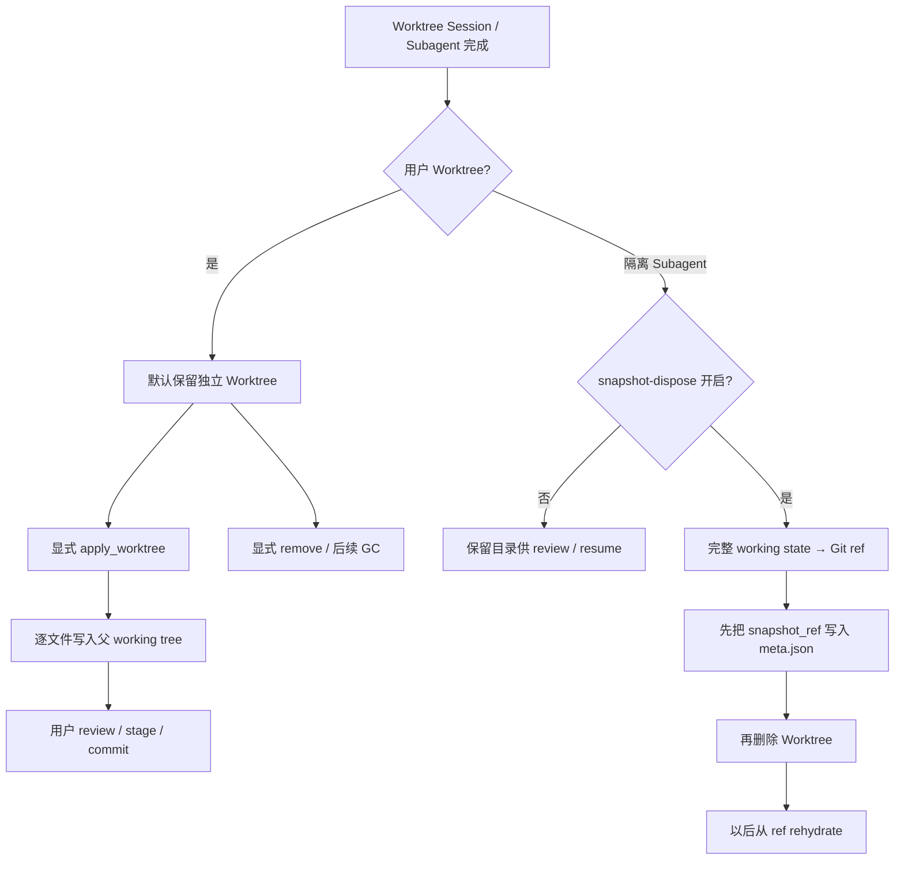

# Walkthrough：Worktree 成果如何应用、保留、恢复与安全清理

本文承接上一篇 Session Fork，固定三个场景：

> 场景 A：一个用户可见的 Worktree Session 已完成修改。父工作区也可能继续发生变化。用户希望把子 Worktree 的代码成果带回主工作区，但不希望会话历史、Git 分支和目录被系统暗中合并或删除。

> 场景 B：应用代码时，一部分文件可以安全覆盖，另一部分文件在父子两边都发生了变化。系统需要返回可机器处理的冲突材料，而不是伪装成一次原子的 Git merge。

> 场景 C：一个隔离 Subagent 完成后，为节省磁盘可以删除它的 Worktree，但必须先把完整工作状态保存成 durable Git ref，并把恢复指针写入 metadata；以后 resume 时再从 ref 重建工作树。

本文首先澄清一个容易产生错误期待的事实：

```text
Worktree Session 完成 ≠ 自动把代码合回父工作区
Apply Worktree          ≠ Git merge
Apply 成功              ≠ 自动 commit、自动删除 Worktree、自动合并 Session 历史
```

当前源码把“应用代码”“保存成果”“移除目录”“恢复目录”“传播会话结果”设计成不同操作。理解这些边界，才能安全使用或修改这条链路。

本文核对基线为根目录 `SOURCE_REV` 记录的提交。行号只帮助首次定位，长期维护时以类型、函数和测试名为准。

---

## 1. 最终心智模型



两条主线解决的问题不同：

| 主线 | 目标 | 权威产物 |
| --- | --- | --- |
| Apply | 把部分或全部文件内容带回父 working tree | 父目录里的文件 |
| Snapshot-dispose | 删除临时目录后仍能恢复子工作状态 | source repo 中的 Git ref + `meta.json` 指针 |

---

## 2. 建议同时打开的源码

```text
crates/codegen/
├── xai-grok-workspace-types/src/rpc/
│   ├── git.rs
│   └── worktree.rs
├── xai-grok-workspace-client/src/lib.rs
├── xai-grok-workspace/src/
│   ├── workspace_ops.rs
│   ├── worktree/mod.rs
│   └── session/git.rs
├── xai-grok-shell/src/
│   ├── extensions/worktree.rs
│   ├── session/worktree.rs
│   └── agent/subagent/
│       ├── mod.rs
│       └── handle_request.rs
├── xai-grok-pager/src/worktree_cmd/
│   ├── mod.rs
│   └── display.rs
└── xai-fast-worktree/src/
    ├── api.rs
    ├── auto_gc.rs
    ├── db/mod.rs
    └── git/checkout.rs
```

快速定位：

```sh
rg -n "ApplyWorktreeRequest|ApplyWorktreeResponse|ApplyMode" crates/codegen
rg -n "get_apply_context|apply_worktree|apply_file_content" crates/codegen
rg -n "snapshot_subagent_worktree|snapshot_ref|rehydrate_worktree_from_ref" crates/codegen
rg -n "remove_worktree|gc_worktrees|WorktreeRecord" crates/codegen
```

---

## 3. 当前没有“子 Session 完成后自动 Apply”的调用

用户可见 Worktree Session 完成后，代码仍留在自己的工作树。当前代码中：

- `apply_worktree()` 是显式 Workspace operation；
- Shell 暴露 `x.ai/git/worktree/apply` extension；
- Workspace client 暴露 `apply_worktree()`；
- 没有在普通 Pager child completion 中自动调用它；
- `grok worktree` 命令当前提供 list/show/rm/gc/db，也没有暴露 apply 子命令。

所以不能从“API 已存在”推断“产品 UI 已自动使用”。

这是一项很重要的源码阅读习惯：定义、注册和真实调用是三个层次。

---

## 4. 为什么不应自动 Apply

父工作区和子 Worktree 在 Fork 后可以并行演化：

```text
T0: parent = A
T1: fork child from A
T2: parent edits foo.rs → P
T3: child edits foo.rs  → C
T4: child finishes
```

如果 T4 自动把 C 写回 parent，可能覆盖 P。更严重的是，child “完成”只表示 Agent turn 结束，不表示：

- 用户已 review diff；
- child tests 全部通过；
- parent 当前适合接收变化；
- 用户希望保留全部 child 修改；
- 子分支应该立即删除。

因此显式 Apply 是权限和时机边界，不只是 UI 多一个按钮。

---

## 5. Apply 请求与响应

`ApplyWorktreeRequest` 包含：

| 字段 | 作用 |
| --- | --- |
| `session_id` | 协议上的 Session 标识 |
| `worktree_path` | 子 Worktree 路径 |
| `mode` | `overwrite` 或 `merge`，默认 `overwrite` |

当前 `apply_worktree()` 实现实际使用 `worktree_path` 和 `mode`；`session_id` 没有参与路径解析、授权、冲突计算或写入。

Response 有两种：

```text
Success   { files, git_root }
Conflicts { files, conflicts }
```

这里的 `files` 是已经成功应用的文件，而不一定是“检测到的所有变化”。

---

## 6. Apply 的协议入口

Shell extension 接受：

```text
x.ai/git/worktree/apply
```

它反序列化 `ApplyWorktreeRequest`，再通过 `WorkspaceOps::dispatch()` 进入 `workspace.apply_worktree` 对应 operation。

Workspace Hub 也注册同一 typed RPC，Workspace client 提供方法封装。

这条链路的价值是统一 in-process 与 hub/client 两种调用方式；核心文件语义都落在：

```text
xai-grok-workspace/src/worktree/mod.rs::apply_worktree
```

---

## 7. Apply 先如何找到“父工作区”

`find_main_repo_root_from_path(worktree_path)`：

1. 从 Worktree 路径发现 Git repository；
2. 读取 repository `commondir()`；
3. 取 common dir 的 parent 作为 main repo root。

对 linked Git worktree，这通常指回主仓库。

因此 Apply 不是使用 Fork Summary 中的 `source_workspace_dir`，也不是使用 request 的 `session_id` 查 lineage；它从当前 Git metadata 推导目标主仓库。

---

## 8. Standalone Worktree 的适用边界

Standalone Worktree 有自己的 `.git`，其 `commondir()` 不会像 linked worktree 那样自然指向原始主仓库。

因此当前 `apply_worktree()` 的“从 commondir 找 parent”模型主要适合 linked/Git worktree。对 standalone 副本，代码没有使用持久化 source repo metadata 来指定另一个 apply destination。

这意味着：

```text
支持创建 Standalone
```

不自动等价于：

```text
当前 Apply API 能正确把 Standalone 成果送回最初仓库
```

在扩展 Apply 能力时，这是必须加集成测试的边界。

---

## 9. `get_apply_context()` 收集哪两类变化

第一类是 committed changes：

```text
diff(current main HEAD tree, worktree HEAD tree)
```

第二类是 Worktree 中未提交变化：

```text
diff(worktree HEAD tree, worktree index + working directory)
```

dirty diff 开启 `include_untracked(true)`。

实现用 `seen_paths` 去重：同一路径若已经出现在 committed diff，就不会在 dirty diff 中再新增一条记录。最终内容仍从 Worktree 当前文件读取，因此 committed 后又继续编辑的文件，会复制当前 working-tree 内容；但统计可能只反映 committed diff。

---

## 10. `changed_files` 不是完整 Patch

每个 `GitFileChange` 记录：

- path；
- change type；
- additions/deletions；
- staged 等可选字段。

Apply context 并没有为这些条目填充：

- patch text；
- old/new full text；
- binary patch；
- rename old path。

Committed diff 可以统计行数；dirty-only entry 的 additions/deletions 当前填 0。

因此 response 适合说明“哪些文件被处理”，不能替代一个精确的 review diff。

---

## 11. 当前所谓 `base_commit` 实际是什么

`ApplyContext::base_commit` 被赋值为 Apply 时的 `main_head`。

它不是显式保存的 Fork 起点，也没有从 Worktree metadata 读取 creation base。

这点非常重要。若主分支在 Fork 后已经产生新 commit，那么：

- committed diff 比较的是“当前 main HEAD”与“当前 child HEAD”；
- Merge mode 的 base file 也来自“当前 main HEAD”；
- 它不是传统三方合并所使用的 merge-base/fork-base。

因此本文把它称为“当前主 HEAD 基线”，避免把字段名误读成历史 Fork 基线。

---

## 12. 父分支已经前进时的风险

假设：

```text
Fork 起点: A
main HEAD: A → P
child HEAD: A → C
```

`diff(P, C)` 不只包含 child 引入的 C，也可能包含“child 缺少 P”的反向差异。

如果随后按完整 child 文件写回 parent，可能撤掉父分支在 P 中新增的内容。

因此当前 Apply 更像“把子 Worktree 当前文件投影到主 working tree”，不是基于共同祖先挑出 child-only commits。

在主分支已提交前进的场景，应先人工 review，或使用标准 Git merge/cherry-pick/rebase 工作流。

---

## 13. Overwrite Mode 的准确语义

`ApplyMode::Overwrite` 对每个 changed path：

1. 从 Worktree `read_to_string()` 得到 `theirs`；
2. `Some(text)`：创建父目录并整文件写入 main path；
3. `None`：尝试删除 main path；
4. 成功时把 file change 放入 response `files`。

它不比较 parent 当前内容，不做 diff3，也不保存 parent backup。

所以 Overwrite 是“以 child 当前文件为准的逐文件覆盖”，不是 `git checkout child -- paths` 的完全等价物，也不是 Git merge。

---

## 14. Merge Mode 其实是安全门，不是文本合并器

对每个路径，它计算：

```text
base   = 当前 main HEAD 中的文件内容
ours   = main working directory 当前内容
theirs = child working directory 当前内容
```

然后只处理三种分支：

```text
if base == ours:
    写入 theirs
else if base != theirs:
    返回 conflict(base, ours, theirs)
else:
    不做任何事
```

它不会尝试按行自动合并两个互不重叠的修改。

因此更准确的名字是“whole-file guarded apply”。

---

## 15. Merge 决策表

| 父 working tree | 子 working tree | 结果 |
| --- | --- | --- |
| 等于当前 main HEAD | 任意 child 变化 | 安全写入 child |
| 父已变化 | child 也不同于 base | Conflict |
| 父已变化 | child 等于 base | 保留父内容，不写入也不报 conflict |
| 父/子做了相同变化 | 两者都不同于 base | 当前实现仍报 Conflict |

最后一行很容易令人意外：实现没有 `ours == theirs` 的快捷成功分支。

这不是标准 diff3 的完整状态机。

---

## 16. Create、Edit、Delete 的内容表达

文件内容使用 `Option<String>`：

- `Some(text)` 表示可读文本文件存在；
- `None` 被 Apply 当成文件应删除。

这对纯文本 Create/Edit/Delete 足够：

| 场景 | base | ours | theirs |
| --- | --- | --- | --- |
| child 新建 | None | None | Some |
| child 修改 | Some old | Some old | Some new |
| child 删除 | Some old | Some old | None |
| parent 新建冲突 | None | Some parent | Some child |

但 `None` 还可能来自读取失败，而不只来自“文件不存在”。

---

## 17. Binary 与读取失败边界

源码使用：

```text
tokio::fs::read_to_string(path).await.ok()
```

因此以下情况都会折叠成 `None`：

- 文件不存在；
- 文件是非 UTF-8 binary；
- 权限错误；
- 其他读取失败。

随后 `None` 可能被解释为删除。

这是当前实现的重要限制：Apply 不是 binary-safe，也没有把 read error 与 deletion 区分成 typed state。处理图片、归档、生成物或任意 binary changes 时，不能仅凭此 API 假设安全。

---

## 18. Rename 与 Copy 的边界

Git delta 可被分类为 Rename/Copy，但 Apply 构造的 `GitFileChange` 将 `old_path` 设为 `None`。

实际写入只操作：

```text
main_root / file_change.path
```

因此它没有一段显式逻辑“先删除 old path，再写 new path”。Rename 的最终效果取决于 diff 中是否还单独产生旧路径 deletion；当前数据结构本身没有携带可靠的 old path。

需要完整 rename semantics 时，应增加针对 old/new path 的集成测试，而不是只相信 `change_type = Rename` 标签。

---

## 19. Apply 不会 Stage 或 Commit

文件被写入父 working tree 后，代码没有调用：

- `git add`；
- `git commit`；
- `git merge`；
- `git cherry-pick`；
- `git push`。

结果以未提交 working-tree 变化存在，用户仍需：

1. 查看 `git diff` / `git status`；
2. 运行测试；
3. 选择 stage 范围；
4. 自己 commit。

这给 review 留出空间，也避免 Apply 在父分支制造未经确认的历史。

---

## 20. Apply 不会删除 Child Worktree

`apply_worktree()` 返回后没有调用 `remove_worktree()`。

保留 child 的好处：

- 冲突时可以继续比较；
- 部分 Apply 后仍能读取原始成果；
- 测试失败时能回到 child 修复；
- 用户可以改用 cherry-pick 或手工 patch；
- Apply 写错时至少还有另一个工作副本可参考。

清理必须是显式、独立的生命周期决定。

---

## 21. Apply 也不会同步 Session History

Apply 只处理 repository 文件。

它不会把 child 的：

- Conversation；
- `updates.jsonl`；
- Summary；
- Plan；
- Token usage；
- Prompt index；
- Compaction history；

合回 parent Session。

父 Session 若要了解 child 的思路或结论，需要由 UI、Subagent result、用户消息或其他显式机制传递。代码同步和认知上下文同步是不同数据流。

---

## 22. Conflict Response 携带什么

每个 `FileConflict` 包含：

- path；
- change type；
- base；
- ours；
- theirs。

这为调用方提供了构造 conflict UI 或手工合并器所需的三份完整文本。

但 Conflict response 本身不写 conflict markers，也不创建 `.rej` 文件，不启动 merge tool。

它是结构化诊断材料，不是已经进入 Git conflicted index 的状态。

---

## 23. Conflicts Response 可能已经产生副作用

Apply 逐文件迭代。前面的安全文件会立即写入；后面的文件可能进入 conflicts。

最终返回：

```text
Conflicts { files: 已应用文件, conflicts: 未应用冲突 }
```

因此：

```text
status = conflicts
```

不表示父工作区完全没变化。

这是 partial apply，不是 all-or-nothing transaction。调用方必须同时展示 `files` 和 `conflicts`。

---

## 24. 文件写入失败的可观察性限制

`apply_file_content()` 返回 `bool`：

- 写入/删除成功返回 true；
- 失败返回 false；
- 上层只是不把该 file 加入 `files`；
- 没有把 I/O error 放入 `conflicts`；
- 若没有逻辑 conflict，最终仍可能返回 `Success`。

这意味着 `Success.files` 应被理解为“确认写成功的集合”，不能只看 status 就断言所有 detected changes 已应用。

改进方向是返回 typed per-file error，并让 response 区分 applied/conflicted/failed/skipped。

---

## 25. Apply 的事务边界

当前实现没有：

- 临时 staging directory；
- parent file backup；
- 全量 preflight 后统一 commit；
- 失败 rollback；
- 对 parent working tree 加锁；
- 校验扫描后文件是否又被其他进程修改。

它的 commit point 是每一次 `tokio::fs::write/remove_file`。

如果 IDE、另一个 Agent 或用户同时写父文件，存在典型 TOCTOU 窗口：比较时安全，不代表写入时仍安全。

---

## 26. 为什么 `session_id` 未使用值得关注

Request 携带 `session_id`，但 Apply 不用它校验：

- 该 path 是否真的属于此 Session；
- Worktree DB record 是否匹配；
- Session 是否 Fork 自目标 main repo；
- 当前调用者是否拥有该 child。

路径本身成为实际 authority。

如果未来把此接口暴露给更不可信的调用者，应在协议层补充 ownership/path validation，而不能把未使用字段当成已经完成授权。

---

## 27. 显式 Remove 的请求语义

`RemoveWorktreeRequest` 要求在两种定位方式中二选一：

- `worktree_path`：legacy 直接路径；
- `id_or_path`：先查 Worktree DB，找不到再把它当文件路径。

同时支持：

- `dry_run`：只解析并报告路径，不删除；
- `force`：fast remove 失败后允许 fallback 到 `git worktree remove --force`。

两种定位字段同时提供或都不提供都会报错。

---

## 28. Remove 会先取消后台 ignored-file copy

Worktree 创建可以在后台继续复制 ignored files。Remove 前调用 `BackgroundCopyContext::cancel(path)`。

这样避免目录删除与后台 writer 同时竞争。

取消只能停止受该 context 管理的 copy task；随后仍需实际删除 Worktree 和 Git registration。

这是“先停止生产者，再销毁资源”的典型生命周期顺序。

---

## 29. Remove 的 Fast Path 与 Force Fallback

普通路径在线程池调用：

```text
xai_fast_worktree::remove_worktree_with_delegate
```

它能针对 linked、overlay、btrfs 等布局选择更快的清理方式，并处理 metadata/registration。

如果 fast remove 返回错误：

- `force=false`：返回错误；
- `force=true`：找到 main repo，执行 `git worktree remove --force <path>`。

若 blocking task panic，则返回 task failure，不继续假装成功。

---

## 30. Jujutsu Workspace 有单独 Remove 路径

如果目标下存在 `.jj/repo`，Remove 不走 Git worktree fast path，而调用：

1. `jj workspace forget <name>`；
2. 删除 workspace directory。

`dry_run` 仍然提前返回，不产生变更。

这说明“Worktree”在产品层是隔离工作区的统称，底层可能是 Git worktree 或 jj workspace，清理策略不能硬编码成一个 Git 命令。

---

## 31. Apply 与 Remove 必须保持分离

安全的用户流程是：

```text
Inspect child
  → Apply or use Git-native integration
  → Verify parent diff/tests
  → Commit if desired
  → Remove child only when no longer needed
```

若 Apply 自动 Remove，以下失败会失去最方便的恢复源：

- partial conflict；
- silent per-file I/O failure；
- binary/rename 处理不完整；
- parent tests 失败；
- 用户只想接收部分文件。

---

## 32. Worktree DB 解决什么

`xai-fast-worktree::WorktreeDb` 记录 Worktree：

- ID/path；
- source repo；
- kind；
- status；
- 创建和活跃时间；
- Session 等 metadata。

Workspace 提供：

- `list_worktrees()`；
- `show_worktree()`；
- `resolve_worktree_by_id_or_path()`；
- DB stats/rebuild/path。

DB 用于发现和管理，不是 Apply 的内容事务日志。

---

## 33. 当前 `grok worktree` CLI 能做什么

Pager 的 headless worktree command 提供：

```text
grok worktree list / ls
grok worktree show <id-or-path>
grok worktree rm <ids...> [--force] [--dry-run]
grok worktree gc [--dry-run] [--max-age ...] [--force]
grok worktree db stats|path|rebuild
```

它通过 ACP extension 调用 Shell，而不是直接读写 DB。

当前命令 enum 没有 Apply variant。若未来加 CLI apply，应先设计 preview、mode 默认值、binary safety、partial result 展示与确认流程。

---

## 34. Manual Worktree 为什么默认不按年龄删除

Auto-GC 的产品默认为：

```text
WorktreeKind::Manual → never age-expires
```

这是对用户显式创建工作区的保护。其他 kind 可以按全局或 per-kind TTL 回收。

策略仍可被环境、本地 TOML、远端设置层覆盖；Workspace-only 进程当前没有 remote settings blob，因此它只解析 env + local TOML。

“默认不按年龄删除”不等于永不可以显式 `rm` 或 `gc --force`。

---

## 35. GC 为什么要保护活跃 CWD

Auto-GC 在支持的平台扫描进程 CWD，构建 protect paths。真实年龄回收需要能证明目标不是活跃工作目录；扫描不可用时应 fail closed，而不是冒险删除正在使用的 Worktree。

Dry run 可以在不删除的前提下计算年龄指标。

GC 还处理 dead records、orphan snapshots 等，但它的职责是资源回收，不判断代码成果是否已 Apply。

---

## 36. 普通 Worktree 与 Subagent 的收尾策略不同

用户 Worktree 默认保留，等待显式 review/apply/remove。

隔离 Subagent 数量可能很多，长期保留每个目录成本高，因此有可配置的 snapshot-dispose 策略：

```text
完成 → 保存完整状态 → 持久化恢复指针 → 删除目录
```

它不是把 Subagent 改动自动 Apply 给父 Session，而是压缩“可恢复代码状态”的存储形态。

---

## 37. Subagent 完成前还会收敛哪些状态

完成链路在处理 Worktree 前已经：

- 汇总并持久化 output；
- 更新 completion metadata；
- 统计 token usage；
- 将 usage fold 回 parent；
- 记录 telemetry；
- 可选把后台 terminal notifications reparent 给 parent；
- 向 child Session 发送 graceful shutdown；
- 调用 Workspace `end_local_session()`。

这些操作传播的是结果、计量和运行态，不等于把 child repository files 写入 parent。

---

## 38. Snapshot 使用临时 Index，不破坏真实 Index

`snapshot_worktree_to_ref()` 创建 scratch index，并设置临时 `GIT_INDEX_FILE`。

流程是：

1. `read-tree HEAD`：用 HEAD seed 临时 index；
2. `add -A`：叠加 working tree 的修改、删除和非 ignored untracked files；
3. `write-tree`：生成完整 tree；
4. `commit-tree -p HEAD`：创建 synthetic snapshot commit；
5. `update-ref`：把 ref 指向该 commit。

真实 Worktree index 不被修改，所以 snapshot 不会偷偷 stage 用户文件。

---

## 39. Snapshot 捕获的“完整状态”具体是什么

临时 index 从 HEAD 开始，再 `add -A`，所以 snapshot tree 包含：

- HEAD 中所有 tracked files；
- staged 修改的最终 working-tree版本；
- unstaged 修改；
- tracked deletions；
- 非 ignored untracked additions。

Ignored untracked files不会被普通 `git add -A` 捕获。

Snapshot 保存的是最终 tree state，不保留“这个变化原来 staged、那个变化 unstaged”的 index 分区语义。

---

## 40. 为什么 Synthetic Commit 使用固定身份

Snapshot 通过 `commit-tree` 创建 commit，需要 author/committer。实现只为本次命令注入：

```text
Grok Snapshot <grok-snapshot@example.com>
```

它不会修改用户 Git config，也不要求用户已设置 name/email。

Snapshot commit 是恢复载体，不应被误认为用户正式提交或产品自动发布的业务 commit。

---

## 41. Snapshot Ref 为什么必须转移到 Source Repo

Linked Worktree 与 main repo 共享 object store/common dir，ref 天然能在删除 Worktree 后存活。

Standalone Worktree 的 `.git` 位于自身目录。若只在其中创建 ref，删除目录会同时删除 commit、objects 和 ref。

因此 `snapshot_subagent_worktree()` 还调用：

```text
transfer_snapshot_to_repo(worktree, source_repo, ref_name)
```

它通过 fetch 把 ref 及可达 objects 带入 source repo，并用 `rev-parse --verify <ref>^{commit}` 确认可解析后才返回成功。

---

## 42. 为什么顺序必须是 Snapshot → Persist Pointer → Remove

生产完成链路严格分三段：

1. 创建并转移 durable snapshot ref；
2. 把 `snapshot_ref` 写入 Subagent `meta.json`；
3. 只有前两步都成功，才删除 Worktree。

错误顺序：

```text
Snapshot → Remove → Persist pointer
```

在 Remove 后、Persist 前崩溃，会留下一个存在但无人知道名字的 ref，resume 无法发现它。

所以 metadata pointer 是删除目录前的 crash-safety commit point。

---

## 43. Pointer Persistence 还会重申 Terminal Status

`update_subagent_meta_snapshot_ref()` 不只写 ref，还把 status 再设置为 final status。

原因是早先的 `persist_subagent_completion()` 可能失败。如果 worktree 已删除，但 metadata 仍显示 running，resume source resolution 可能拒绝这个记录。

在同一次关键写入中同时确保：

- `snapshot_ref` 可见；
- status 是 terminal；

可以让 durable resume 不依赖前一次 best-effort 写入成功。

---

## 44. 任一步失败时为什么保留 Worktree

完成链路的策略：

| 失败 | 行为 |
| --- | --- |
| Snapshot 创建失败 | 保留 Worktree 供 review/resume |
| Ref transfer/verify 失败 | Snapshot API 失败，保留 Worktree |
| `meta.json` 读取/解析/写入失败 | 不删除 Worktree |
| Remove 失败 | Durable ref 已存在且已持久化；目录也暂时保留 |

它宁可多占磁盘，也不删除唯一可恢复副本。

这正是 destructive cleanup 前“先证明有 durable replacement”的设计。

---

## 45. Snapshot Ref 的命名

Subagent completion 使用：

```text
refs/grok/subagents/<subagent-id>
```

Ref name 随 `snapshot_ref` 写入 metadata，也会随结果返回到上层。

Ref 是内部恢复地址，不等同于用户 branch name。它可以指向 detached synthetic commit，而不需要出现在普通 branch 列表中。

---

## 46. Resume 如何决定 Reuse、Rehydrate 或 Shared

纯函数 `resume_worktree_action()` 根据两项事实选择：

| 目录存在 | snapshot_ref 存在 | 动作 |
| --- | --- | --- |
| 是 | 否 | Reuse 原目录 |
| 任意 | 是 | Rehydrate from ref |
| 否 | 否 | Shared，回退到共享工作区 |

只要 ref 存在就优先 Rehydrate。这避免复用一个可能与 durable snapshot 不一致的残留目录。

---

## 47. Rehydrate 如何恢复

Snapshot commit 的 first parent 是捕获时 HEAD。Rehydrate：

1. 尝试解析 snapshot parent；
2. parent object 可达时，在该 base 上创建 detached Worktree；
3. parent 不可达时，在 snapshot commit 上创建 detached Worktree；
4. 用 `read-tree --reset -u snapshot_ref` 把 snapshot tree 填入 index/working tree；
5. 重新登记 Worktree DB record。

当 base 可达时，HEAD 仍位于真实 base，snapshot 内容表现为相对 base 的变化，便于继续工作。

---

## 48. Rehydrate 的部分失败清理

创建前会清理目标路径和 stale Git worktree registration。

`git worktree add` 成功后，如果 populate 失败：

- best-effort remove partial Worktree；
- 再清理 stale registration；
- 返回原始错误。

这样下次 resume 不会误用一个只创建了目录、却没有完整 snapshot tree 的半成品。

---

## 49. Base 不可达时保什么、失去什么

如果 parent commit 已被 reset/gc，Snapshot commit 的 tree 仍可能完整可达。

Rehydrate 退到：

```text
HEAD = snapshot commit
working tree = snapshot tree
```

因此文件内容仍能准确恢复，但“这些内容是相对原 base 的未提交变化”这一表现形式会丢失。恢复优先级是：

```text
先保内容，再保理想的历史位置
```

---

## 50. Snapshot-Dispose 不是 Apply

Snapshot ref 只保证 Subagent 自己的代码状态可恢复。

它没有：

- 修改父 working tree；
- cherry-pick snapshot commit；
- merge ref；
- 把 child Conversation 合入 parent；
- 删除 ref；
- 宣称代码已经被主线接受。

父 Agent 得到 Subagent output 后，可以根据任务协议决定如何读取或整合成果；snapshot 解决的是生命周期与磁盘占用。

---

## 51. 四种“成果回传”不要混淆

| 通道 | 传递内容 | 是否改父代码 |
| --- | --- | --- |
| Subagent textual output | 结论、说明、建议 | 否 |
| Notification reparent | 后台 task/terminal 可见性 | 否 |
| Apply Worktree | 文件最终内容 | 是 |
| Snapshot ref | 可恢复的 child tree | 否 |

Session fork/history copy 则发生在 child 创建阶段，也不是完成后的成果回传。

---

## 52. 推荐的安全集成流程

对于用户 Worktree：

```text
1. 在 child 中运行 tests/status/diff
2. 确认 parent HEAD 与 working tree 状态
3. 若 parent 已前进，优先 Git-native merge/cherry-pick/rebase
4. 若使用 Apply，先 Merge mode 或 dry-run-like preview（当前需外部实现）
5. 同时处理 applied files、conflicts 和缺失文件
6. 在 parent 再次运行 diff/tests
7. 用户自行 stage/commit
8. 确认不再需要 child 后显式 remove
```

对于自动化 Subagent：

```text
1. Persist completion/output
2. Snapshot full tree to durable ref
3. Persist ref + terminal status
4. Remove Worktree
5. Resume 时优先从 ref rehydrate
```

---

## 53. Apply 更适合什么场景

当前实现比较适合：

- linked Worktree；
- 文本文件；
- parent HEAD 没有在 Fork 后显著前进；
- parent working tree 大部分未修改；
- 用户接受 whole-file copy；
- Apply 后会人工 review；
- 变化量不依赖精确 rename/binary semantics。

不适合直接无检查使用的场景：

- binary assets；
- parent/child 长期分叉；
- 大量 rename/copy；
- 需要真正三方文本合并；
- 要求 all-or-nothing；
- Apply 失败必须自动 rollback；
- Standalone 到原 repo 的可靠回传。

---

## 54. 若要增强 Apply，优先改什么

建议的工程顺序：

1. 持久化真正 fork-base/source repo identity；
2. 增加 read state：Missing/Text/Binary/Error；
3. 先做完整 preflight，不立即写文件；
4. Response 区分 applied/conflicted/failed/skipped；
5. 增加 `ours == theirs` 快捷路径；
6. 保存 rename old/new path；
7. 对文本使用真正 diff3；
8. 对 binary 提供明确策略；
9. 使用 temp file + atomic rename 写单文件；
10. 可选建立 parent backup/checkpoint；
11. 加 parent concurrent modification recheck；
12. 给 CLI/UI 增加 preview 和显式确认；
13. 用 Session/Worktree DB metadata 校验 ownership；
14. 为 Standalone 定义明确 source destination；
15. Apply 与 Remove 仍保持两个确认动作。

---

## 55. 失败边界表

| 阶段 | 失败后状态 | 恢复依据 |
| --- | --- | --- |
| Apply context Git discovery | 父文件未改 | 原 Worktree |
| Apply 第 N 个文件 | 前 N-1 个可能已改 | `files` response、原 Worktree、Git diff |
| Merge conflict | 其他安全文件可能已应用 | base/ours/theirs + child Worktree |
| Read child binary/error | 可能被解释为 None | 原 Worktree；当前 response 表达有限 |
| Parent write failure | 文件不进入 applied list | 原 Worktree；需检查父磁盘 |
| Remove fast path | Worktree通常保留 | retry 或 force fallback |
| Snapshot 创建/转移失败 | Worktree保留 | 原目录 |
| Pointer persistence 失败 | Durable ref 可能已存在，目录保留 | retry metadata write |
| Snapshot 后 Remove 失败 | Ref 和目录都存在 | ref 已可 resume，稍后清理目录 |
| Rehydrate populate 失败 | 尝试清理 partial path/registration | durable ref 仍存在 |

---

## 56. 常见误解

### 误解 1：子 Session 完成就会自动合并代码

普通 Worktree Session 默认保留独立状态。

### 误解 2：Apply 等同于 `git merge`

它逐文件读取 child 最终文本并写入 parent working tree。

### 误解 3：Merge mode 会自动合并不重叠行

它只做 whole-file 安全判断，不运行 diff3。

### 误解 4：`base_commit` 是 Fork 起点

当前值是 Apply 时的 main HEAD。

### 误解 5：Conflict 表示没有任何文件被修改

Response 可能同时包含已应用 `files` 和 `conflicts`。

### 误解 6：Success 表示所有检测文件都成功写入

当前 per-file I/O failure 只会让文件不进入 `files`。

### 误解 7：Apply 支持任意 binary 文件

读取使用 UTF-8 `read_to_string()`。

### 误解 8：Apply 后 child 自动删除

Remove 是独立操作。

### 误解 9：Apply 会把 child 对话也带给 parent

它只处理代码文件。

### 误解 10：Snapshot ref 就是正式用户 branch

它是内部 durable recovery ref。

### 误解 11：有 Snapshot 就可以先删目录、以后再写 metadata

指针必须在 Remove 前持久化。

### 误解 12：Manual Worktree 会默认按 TTL 自动删除

产品默认 Manual 不按年龄过期。

---

## 57. 修改这条链路时必须守住的 Invariants

1. Worktree completion 不得隐式覆盖 parent files；
2. Apply 必须是显式动作；
3. Apply 与 Remove 必须保持独立；
4. Apply 不得暗中 stage、commit 或 push；
5. Parent repo resolution 必须可验证；
6. Standalone 的 source destination 不能靠错误 commondir 假设；
7. 真正 fork-base 与 current main HEAD 必须语义区分；
8. Committed 与 dirty child changes 都应被发现；
9. 同路径 committed+dirty 的最终内容不能丢失；
10. Binary、Missing 和 ReadError 不得长期共用模糊的 None；
11. Rename 必须保留 old/new path；
12. Overwrite 风险必须显式；
13. Merge mode 不能被描述成标准 Git merge；
14. `ours == theirs` 应避免伪冲突；
15. Conflict response 必须保留 base/ours/theirs；
16. Partial apply 必须可观察；
17. Per-file I/O failure 必须最终进入结构化结果；
18. Concurrent parent change 应在 commit 前重检；
19. Child Worktree 应在验证前保持可访问；
20. Apply 不得改写 parent Session history；
21. Remove dry-run 不得产生 mutation；
22. Remove 前必须停止相关 background writers；
23. Force 只能在用户明确请求时使用；
24. VCS-specific cleanup 必须正确路由；
25. Manual Worktree 默认不得仅按年龄回收；
26. GC 不得删除活跃进程 CWD；
27. Snapshot 必须使用 scratch index，不污染真实 index；
28. Snapshot 必须捕获 tracked changes、deletions 和非 ignored untracked files；
29. Standalone snapshot 必须先转移到 durable source repo；
30. Durable ref 必须在 source repo 验证可解析；
31. `snapshot_ref` 必须在 Remove 前持久化；
32. Pointer 写入失败必须保留 Worktree；
33. Snapshot 失败必须保留 Worktree；
34. Remove 失败不得破坏已持久化 ref；
35. Resume 有 ref 时应从 durable state rehydrate；
36. Rehydrate partial failure 必须清理目录和 stale registration；
37. Base 不可达时仍应尽量保住 exact content；
38. Snapshot-dispose 不得被描述为 Apply；
39. Text output、notification、code apply 和 snapshot 必须保持通道区分；
40. Destructive cleanup 前必须证明存在可恢复副本或取得明确授权。

---

## 58. 推荐的阅读与实验练习

1. 创建 linked Worktree，只修改一个文本文件，运行 Overwrite apply；
2. 确认 parent 文件改变但 index/HEAD 不变；
3. Apply 后确认 child 目录仍存在；
4. 在 parent 修改同一文件后运行 Merge mode，检查三份文本；
5. 让 parent 与 child 做相同修改，观察当前伪冲突；
6. 让 parent-only 修改、child 等于 base，确认 parent 被保留；
7. child 新建、修改、删除各一个文件，画出 Option 内容矩阵；
8. child committed 后继续 dirty 编辑同一路径，检查最终复制内容和统计差异；
9. parent HEAD 在 Fork 后前进，检查 `diff(main HEAD, child HEAD)` 包含什么；
10. 用 Git merge-base 对比当前 `base_commit`；
11. 修改 binary 文件，观察 `read_to_string().ok()` 边界；
12. 构造 rename，检查 `old_path` 是否缺失；
13. 注入父文件写权限错误，比较 status 与 `files`；
14. 多文件中间制造 conflict，确认前面文件已应用；
15. 运行 remove dry-run，确认目录和 registration 不变；
16. 启动 background ignored copy 后 remove，观察 cancellation；
17. Snapshot 前记录真实 Git index，完成后确认未变化；
18. Snapshot tracked、unstaged、deleted、untracked 文件并检查 tree；
19. 加 ignored untracked 文件，确认不进入 snapshot；
20. 对 Standalone snapshot 验证 ref 已转移到 source repo；
21. 在 pointer persistence 前模拟失败，确认 Worktree 保留；
22. Remove 失败后确认 ref 与 metadata 都存在；
23. 删除 Worktree 后从 ref rehydrate，比较所有文件字节；
24. 让 snapshot parent 不可达，验证 fallback 行为；
25. 检查 `grok worktree list/show/rm/gc` 的 extension envelope；
26. 对 Manual kind 运行默认 auto-GC，验证不按年龄过期。

---

## 59. 本文编写时的实际验证

下列命令结果以本文完成时的本地执行为准：

| 命令 | 结果 | 主要覆盖 |
| --- | --- | --- |
| `cargo test -p xai-grok-workspace-types --lib worktree` | 5 passed | Worktree typed RPC 方法名、response status tag、sync request wire wrapper 与 WorktreeType round-trip |
| `cargo test -p xai-grok-pager --lib worktree_cmd` | 26 passed | list/show/rm/gc/db request、ACP envelope、CLI flags/alias 与 table display |
| `cargo test -p xai-grok-workspace --lib snapshot_failure_preserves_worktree` | 1 passed | Snapshot 失败时不得删除唯一 Worktree |
| `cargo test -p xai-fast-worktree --lib snapshot_worktree` | 1 failed | 目标 snapshot 测试在 fixture 创建 linked Worktree 时失败：临时仓库 `git worktree add` 报 `fatal: invalid reference: HEAD`，未运行到 snapshot 内容断言 |

Fast-worktree 失败发生在测试 fixture 的首个 Worktree 创建阶段，不是 snapshot 内容断言失败，因而本文不把它记为 snapshot 行为回归，也不声称该测试通过。仓库当前没有直接命中 `apply_worktree()` 状态矩阵的单元测试定义。因此 Overwrite、whole-file Merge、partial apply、binary/read-error 和 current-main-HEAD 基线等结论来自实现本身；它们也正是最值得补充集成测试的区域。

---

## 60. 自测题

1. Worktree Session 完成后为什么不自动 Apply？
2. Apply、Remove、Snapshot 各自改变什么？
3. 当前 CLI 为什么不能证明 Apply 已成为用户命令？
4. Apply 如何找到 parent repo？
5. Standalone 为什么是特殊边界？
6. `changed_files` 包含哪两类 diff？
7. 同一路径 committed 后又 dirty 时如何处理？
8. 当前 `base_commit` 为什么不是真正 Fork base？
9. Parent HEAD 前进后可能出现什么反向差异？
10. Overwrite mode 做了哪些 whole-file 操作？
11. Merge mode 的三个内容版本分别是什么？
12. 为什么它不是 diff3？
13. 父子相同修改为什么仍可能冲突？
14. Binary 为什么可能被误解成删除？
15. Rename 为什么需要 `old_path`？
16. Conflicts response 为什么仍可能有副作用？
17. Success.files 不能证明什么？
18. Apply 后为什么仍要 review、test、stage、commit？
19. `session_id` 当前是否建立了 ownership 校验？
20. Remove 的 dry-run 与 force 分别控制什么？
21. 为什么 Remove 前要取消 background copy？
22. Manual Worktree 的默认 GC 策略是什么？
23. Subagent snapshot 为什么使用 scratch index？
24. Snapshot tree 会丢失哪种 staged/unstaged 区分？
25. Standalone ref 为什么必须 transfer？
26. 为什么必须先 persist pointer 再 Remove？
27. Pointer 写入失败时为什么保留目录？
28. Rehydrate 的 base 可达与不可达分别如何处理？
29. Snapshot-dispose 为什么不是成果 Apply？
30. 四种成果回传通道分别是什么？

---

## 61. 本篇术语表

| 名词 | 白话解释 | 在本文中的具体含义 |
| --- | --- | --- |
| Worktree | 与同一 Git 仓库关联的独立工作目录 | 隔离 child 的代码变化 |
| main repo | Worktree 所属的主仓库目录 | Apply 的目标 working tree |
| child Worktree | 子 Session/Subagent 使用的工作树 | Apply 的代码来源 |
| Apply | 把 child 当前文件内容写入 parent | 不合并 Session history |
| Overwrite | 不检查父修改，直接以 child 为准 | 默认 ApplyMode |
| Merge mode | 写入前做 whole-file 三值判断 | 不是标准 Git merge |
| whole-file apply | 整个文件替换/删除 | 不按 hunk 自动合并 |
| diff3 | 使用 base/ours/theirs 的三方文本合并 | 当前 Apply 没有执行 |
| base | 比较基线版本 | 当前取 Apply 时 main HEAD 内容 |
| ours | 父 working tree 当前内容 | 用户/父 Agent 的本地状态 |
| theirs | 子 Worktree 当前内容 | 要带回的成果 |
| fork-base | 父子真正分叉时的共同点 | 当前 Apply 没有显式使用 |
| current main HEAD | Apply 时主仓库最新提交 | 当前代码错误易读作 fork-base |
| committed diff | main HEAD tree 与 child HEAD tree 的差异 | 收集 child committed 变化，也可能含分叉反向差异 |
| dirty diff | child HEAD 与 child index/workdir 的差异 | 含 untracked，不含 ignored |
| `seen_paths` | 已记录路径集合 | 对 committed/dirty 两类变化去重 |
| GitFileChange | 文件变化的结构化摘要 | Apply response 的 files 条目 |
| ChangeType | Create/Edit/Delete/Rename 等标签 | 不保证对应操作语义已完整实现 |
| Conflict | 父与子相对 base 都发生变化 | 返回三份文本，不写 conflict markers |
| partial apply | 一部分文件已写入，另一些冲突/失败 | Conflicts response 的正常可能性 |
| commit point | 副作用真正生效的位置 | 每个父文件 write/remove |
| TOCTOU | 检查与使用之间状态发生变化 | parent 可在比较后、写入前被并发修改 |
| binary-safe | 能正确处理任意字节文件 | 当前 `read_to_string` 不满足 |
| missing | 文件不存在 | 当前与读取失败都折叠为 None |
| read error | 权限或 I/O 等读取失败 | 当前缺少独立 typed 表达 |
| rename semantics | 同时理解旧路径和新路径 | 当前 `old_path=None` 边界明显 |
| staging area/index | Git 准备提交的文件状态 | Apply 不 stage；Snapshot 用 scratch index |
| scratch index | 临时 Git index 文件 | Snapshot 避免污染真实 index |
| synthetic commit | 程序生成的恢复用 commit | 不代表用户正式 commit |
| durable ref | 删除 Worktree 后仍存在的 Git ref | 存在 source repo 中 |
| reachable objects | 从 ref 可访问的 commit/tree/blob | Transfer 必须一起带入 source repo |
| snapshot ref | 指向 Subagent 完整 tree 的内部 ref | 写入 `meta.json` 供 resume |
| pointer persistence | 把 ref 名写入 durable metadata | Remove 前的安全提交点 |
| terminal status | completed/failed/cancelled 等终态 | 与 snapshot ref 一起重申 |
| snapshot-dispose | 保存 ref 后删除临时 Worktree | 降低磁盘占用，不是 Apply |
| Reuse | 继续使用仍存在的 Worktree | 无 ref且目录存在时 |
| Rehydrate | 从 snapshot ref 重建 Worktree | 有 durable ref 时优先 |
| Shared fallback | 没有目录也没有 ref时使用共享工作区 | 隔离恢复能力降级 |
| detached HEAD | HEAD 不挂在普通 branch 上 | Snapshot rehydrate 的工作树状态 |
| source repo | 保存 durable snapshot objects/ref 的仓库 | Standalone transfer 的目的地 |
| linked worktree | 共享主仓库 object/common dir 的 Worktree | 当前 Apply 主要适用布局 |
| standalone worktree | 有独立 `.git` 的副本 | Ref 必须转移；Apply destination 边界特殊 |
| Worktree DB | 本地工作树管理数据库 | 支持 list/show/resolve/gc |
| Worktree kind | Manual/Subagent/Pool 等用途分类 | 决定 GC policy |
| Manual | 用户显式管理的 Worktree 类别 | 默认不按年龄过期 |
| GC | 回收 dead/stale Worktree | 不判断成果是否已 Apply |
| protect path | GC 不得删除的活跃路径 | 例如进程当前 CWD |
| dry run | 只报告、不执行删除 | Remove/GC 的安全预览 |
| force fallback | fast remove 失败后的强制 Git 删除 | 需显式请求 |
| notification reparent | 把 child 后台通知归到 parent 可见域 | 不改变代码文件 |
| result propagation | 把 Subagent 文本结果送回父任务 | 不等于 Apply |
| ownership validation | 校验 path 确属请求 Session | 当前 Apply 未使用 session_id 完成它 |
| invariant | 维护时不能破坏的性质 | 本文第 57 节约束 |

更多通用名词见 [全局术语表](../appendices/glossary.md)。

---

## 62. 源码证据索引

| 结论 | 主要源码入口 |
| --- | --- |
| Apply/Remove request、mode 与 response wire shape | `xai-grok-workspace-types/src/rpc/worktree.rs` |
| File change 与 ChangeType | `xai-grok-workspace-types/src/rpc/git.rs` |
| ACP Apply extension | `xai-grok-shell/src/extensions/worktree.rs` |
| Workspace client Apply method | `xai-grok-workspace-client/src/lib.rs` |
| Workspace operation dispatch | `xai-grok-workspace/src/workspace_ops.rs` |
| Apply context、Overwrite/Merge 与 partial response | `xai-grok-workspace/src/worktree/mod.rs` |
| Main repo resolution 与 delta type mapping | `xai-grok-workspace/src/session/git.rs` |
| Remove、DB、list/show/gc | `xai-grok-workspace/src/worktree/mod.rs` |
| Pager worktree CLI 当前命令面 | `xai-grok-pager/src/worktree_cmd/mod.rs` |
| Subagent completion、snapshot/persist/remove 顺序 | `xai-grok-shell/src/agent/subagent/handle_request.rs` |
| Resume 决策与 metadata pointer write | `xai-grok-shell/src/agent/subagent/mod.rs` |
| Shell snapshot/remove/rehydrate wrapper | `xai-grok-shell/src/session/worktree.rs` |
| Scratch index、synthetic commit、ref transfer 与 rehydrate | `xai-fast-worktree/src/git/checkout.rs` |
| 快速删除与 Worktree registration | `xai-fast-worktree/src/api.rs` |
| Worktree record/kind | `xai-fast-worktree/src/db/mod.rs` |
| Auto-GC policy 与 active CWD protection | `xai-fast-worktree/src/auto_gc.rs` |

建议交叉阅读：

- [Walkthrough：一次 Session Fork 如何复制历史并隔离 Worktree](08-session-fork-history-copy-path-rewrite-and-worktree-isolation.md)
- [Git、Checkpoint、Rewind 与 Worktree](../03-subsystems/24-git-checkpoints-rewind-worktrees-and-session-recovery.md)
- [Subagent 调度、父子状态继承与后台任务协调](../03-subsystems/08-subagent-coordinator-inheritance-and-background-tasks.md)
- [文件系统抽象、工作区路径与安全边界](../03-subsystems/19-filesystem-path-workspace-and-safety-boundaries.md)
- [错误分类、重试、降级与恢复状态机](../03-subsystems/16-error-taxonomy-retry-degradation-and-recovery-state-machines.md)
- [并发模型、Actor、Channel 与取消传播](../03-subsystems/15-concurrency-actors-channels-cancellation-and-shutdown.md)

---

## 63. 一句话复盘

Grok Build 不会在 Worktree Session 完成时自动合并代码：显式 Apply 只从 child 收集 committed/dirty path，以当前 main HEAD 和父子最终文本执行逐文件 Overwrite 或 whole-file guarded Merge，既不修改 Session history，也不 stage、commit 或删除 Worktree，并允许 partial success；用户 Worktree 因而默认保留供 review，而大量隔离 Subagent 可以走另一条 crash-safe 收尾链——用 scratch index 把完整工作状态捕获为 synthetic commit，转移并验证 durable ref，先持久化恢复指针和终态，再删除目录，以后从 ref rehydrate——Apply、结果回传、快照保存和资源清理各自拥有独立的提交点与失败边界。
