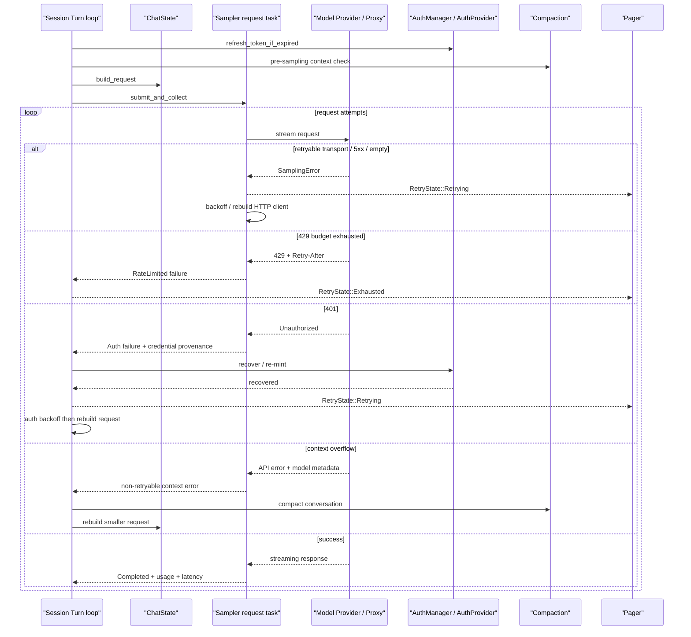

# Walkthrough：模型请求如何重试、刷新认证、压缩恢复并收敛失败

本文固定一条可能连续遇到多种故障的真实路径：

> 用户提交 Prompt。Session 在请求前刷新凭据并检查 Context Window，然后把请求交给 Sampler。第一次连接在流中断开；Sampler 等待并切换到新的 HTTP/1.1 client 重试。第二次收到 429，遵守 `Retry-After` 后再次尝试。若预算耗尽，错误回到 Session。另一次请求收到 401，Sampler 不自行刷新，而让 Session 根据实际发出的 credential、认证模式和 endpoint 决定是否 re-mint，并使用独立的 1s/2s/4s预算重新提交。若请求因 Context Window 超限失败，Session 先 Compaction、重建请求再提交。所有路径最终必须向 TUI 发出明确的 Retrying、Exhausted 或 Failed 状态，并结束 Turn。

这条链路至少包含四层策略：

1. 请求前的 auth/context preflight；
2. Sampler 内部的 request-attempt retry；
3. Session 拥有的 auth/compaction semantic recovery；
4. Pager 对 retry 和终态错误的用户呈现。

本文会反复强调：

```text
Retry 同一个请求 ≠ 重建语义不同的请求
恢复凭据后重提 Turn ≠ Sampler transport retry
切换 HTTP connection ≠ 切换 Provider 或模型
```

本文核对基线为根目录 `SOURCE_REV` 记录的提交。行号只帮助首次定位，长期维护时以类型、函数和测试名为准。

---

## 1. 最终调用链



---

## 2. 建议同时打开的源码

```text
crates/codegen/
├── xai-grok-sampling-types/src/error.rs
├── xai-grok-sampler/src/
│   ├── config.rs
│   ├── events.rs
│   ├── retry.rs
│   ├── client.rs
│   ├── actor/request_task.rs
│   └── stream/
├── xai-grok-auth/src/
│   ├── auth_provider.rs
│   └── retry_middleware.rs
├── xai-grok-http/src/lib.rs
├── xai-grok-shell/src/session/
│   ├── compaction.rs
│   └── acp_session_impl/
│       ├── auth_retry.rs
│       ├── sampler_turn.rs
│       ├── tool_calls.rs
│       ├── turn.rs
│       └── types.rs
├── xai-grok-shell/src/extensions/notification.rs
└── xai-grok-pager/src/app/
    ├── acp_handler/session_notification.rs
    └── dispatch/prompt.rs
```

快速定位：

```sh
rg -n "classify_error|RetryDecision|retry_backoff_with_jitter" crates/codegen
rg -n "run_request_task|apply_retry_decision|run_one_attempt" crates/codegen
rg -n "handle_sampling_failure|RefreshAuthAndResubmit" crates/codegen
rg -n "should_compact_on_error|RetryState" crates/codegen
```

---

## 3. 请求前先做什么

Turn loop 在构建模型请求前会：

1. 注入 pending reminders、memory 和 MCP 状态；
2. 对普通 Turn 调用 `refresh_token_if_expired()`；
3. 用估算 Token 检查是否达到自动压缩阈值；
4. 必要时先运行 Compaction；
5. 从 ChatState 构建 `ConversationRequest`；
6. 写入 Session/Turn/Agent telemetry IDs；
7. 限制 task output token grant；
8. 将 Phase 切到 Sampling；
9. 调用 `run_turn_via_sampler()`。

所以很多“恢复”发生在请求尚未出网之前。等待 400/401 后再补救只是 safety net。

---

## 4. 为什么请求前还会再次准备 Sampler

`run_turn_via_sampler()` 调用 `prepare_sampler_for_turn()`：

- 再次刷新凭据；
- 从当前 ChatState/模型状态重建完整 `SamplerConfig`；
- 写入 inference idle timeout；
- 在某些 workflow child 模式关闭 doom-loop recovery；
- 更新 Sampler Actor config。

Turn loop 与 Sampler Actor 生命周期不同。模型、凭据、endpoint 和 timeout 可能在 Session 存活期间变化，因此不能只在 Actor spawn 时配置一次。

---

## 5. Sampler 的一次 Request Task 拥有什么

每次 submit 会产生独立 request task，它拥有：

- `RequestId`；
- `ConversationRequest` 的可变副本；
- 当前 `SamplingClient`；
- transport retry counter；
- 独立 doom-loop retry counter；
- cancellation token；
- event sender；
- completion oneshot；
- 是否已经观察到输出的 flag。

Sampler Actor 管理并发 request；真正的循环在 `actor/request_task.rs::run_request_task()`。

---

## 6. 三种 Backend 共用同一恢复外壳

`run_one_attempt()` 根据 `ApiBackend` 选择：

| Backend | Raw request | L2 stream transform |
| --- | --- | --- |
| Chat Completions | `conversation_stream` | `stream_chat_completions` |
| Responses | `conversation_stream_responses` | `stream_responses_tracked` |
| Messages | `conversation_stream_messages` | `stream_messages` |

三种协议解析不同，但都归一为 `SamplingEvent` 和 `AttemptOutcome`，再进入同一个 retry classifier。

这让“HTTP 503”“stream dropped”“empty completion”等策略不必在每个 Provider adapter 里复制。

---

## 7. Raw Stream 与 L2 Stream 分别是什么

Raw stream 产生 Provider-specific chunk 或 `SamplingError`。

L2 transform 负责：

- 解析 token/channel/tool-call delta；
- 累积 `ConversationResponse`；
- 生成 usage/metadata；
- 识别 idle timeout、empty response 和 stop reason；
- 发出统一 `SamplingEvent`。

Request task 在两者中间放 `tee_errors()`：错误继续流向 L2，同时把第一份 rich `SamplingError` 保存下来。

---

## 8. 为什么要 Tee 第一份 Raw Error

`SamplingErrorInfo` 是可序列化 mirror，会丢掉 `reqwest::Error`、`serde_json::Error` 等不可 clone 内部值。

若只看 L2 `Failed` event，retry loop 可能失去：

- connect/timeout/body error 分类；
- HTTP status；
- 原始 retry metadata；
- error chain。

因此 tee 保存第一个 raw error。流断开后产生的后续错误通常只是同一故障的次生效应，不覆盖第一原因。

---

## 9. Attempt Outcome 的五种终点

| Outcome | 含义 |
| --- | --- |
| `Completed` | 得到非空、可接受 response |
| `Empty` | Completed 了，但无文本/Tool Call |
| `Failed` | 流产生明确错误 |
| `Cancelled` | cancellation token 在 attempt 中触发 |
| `InitFailed` | 尚未得到 raw stream 就连接/构造失败 |

Retry loop 不直接对每个 chunk 决策，而是在一次 attempt 收敛成这些 outcome 后分类。

---

## 10. `SamplingError` 的分类

主要 variant：

| Variant | 典型来源 |
| --- | --- |
| `Auth` | credential 被拒绝或认证层明确失败 |
| `InvalidConfiguration` | endpoint/model/client config 无效 |
| `Http` | reqwest connect/send/body failure |
| `Serialization` | Provider response 无法解析 |
| `Api` | 非 2xx HTTP response |
| `EventStreamError` | SSE/stream transport 断裂 |
| `StreamError` | SSE 中服务端显式 error payload |
| `IdleTimeout` | 指定时间没有新 chunk |
| `EmptyResponse` | 没有有效输出或 Tool Call |
| `MaxTokensTruncation` | stop reason = length |
| `DoomLoopDetected` | 高置信 reasoning loop signal |

可序列化 `SamplingErrorInfo` 再提取 kind、status、message、retryability、Retry-After、server hint、model metadata 和 credential provenance。

---

## 11. 默认 Retry Policy 并不只有一个默认值

Sampler crate 的 `RetryPolicy::default()`：

```text
max_retries = 15
rate_limit_retry_threshold = 2
retry_only_before_output = false
```

但 Shell 创建 Session Sampler 时构造：

```text
max_retries = configured max_retries.unwrap_or(5)
rate_limit_retry_threshold = 2
```

Request task 又允许 `GROK_MAX_RETRIES` 环境变量覆盖 model/session config。

因此不能看到 crate constant 15 就断言产品 Turn 一定重试 15 次。最终值取决于调用层配置。

---

## 12. `max_retries` 在循环里的计数边界

Classifier 使用：

```text
next_attempt = retry_count + 1
if next_attempt >= max_retries: Fatal
```

`retry_count` 初始为 0，只在决定再次请求时增加。

因此实现更接近把 `max_retries` 当作“总 attempt 上界”：例如 cap=5 时，初始 attempt 加最多 4 次 retry，共 5 次请求。

字段注释称“maximum number of retries”，阅读时要以实际比较式和测试为准。

---

## 13. Retry Backoff 如何计算

普通重试基础序列：

```text
2s, 4s, 8s, 16s, 30s, 30s, ...
```

每次增加 ±20% jitter，所以 30s bucket 的实际范围约 24–36s。

Jitter 避免大量客户端同时收到故障后，在相同时间点重新冲击服务，形成 thundering herd。

Backoff 是等待上界策略，不说明请求自身 timeout；二者共同决定用户实际等待时间。

---

## 14. 哪些错误默认可重试

`SamplingError::is_retryable()` 当前认可：

- reqwest timeout/connect/request/body error；
- HTTP 429；
- HTTP 500/502/503/504/520/529；
- `EventStreamError`；
- `StreamError`；
- `EmptyResponse`；
- `DoomLoopDetected`，但主循环另有专用预算。

不可重试：

- Auth/InvalidConfiguration；
- Serialization；
- 常规 4xx；
- IdleTimeout；
- MaxTokensTruncation。

“StreamError 一律 retryable”还会受到共同 retry veto 的二次约束。

---

## 15. Server 的 `x-should-retry` 如何影响客户端

Client 从 response header 解析：

```text
x-should-retry: false → Some(false)
x-should-retry: true  → Some(true)
其他/缺失             → None
```

策略是不对称的：

- `false` 是强制 veto；
- `true` 只回到客户端原有 status logic；
- 它不会强迫客户端重试本来确定不可重试的 400/401。

这避免服务端一个宽松 header 把内容错误放大成 retry storm。

---

## 16. Context Length 也是共同 Retry Veto

Backend 没有统一稳定 error code，因此 `is_context_length_error()` 匹配常见文本：

- prompt too long；
- maximum context length；
- `context_length_exceeded`；
- current message exceeds budget 等。

同一个 payload 重发只会再次失败，所以 Sampler 立即 Fatal，让 Session 有机会改变 Conversation。

这和 `x-should-retry:false` 一起组成 `is_retry_vetoed()`。

---

## 17. 为什么图片错误在 Retry Veto 前处理

413 或 “Could not process image” 可以通过修改 request 恢复：删除 inline images 后，下一次 payload 已经不同。

所以分类顺序是：

```text
Auth/encrypted → session
max_retries=0 → fatal
413/image error → strip images
server/context veto → fatal
其他 retry classification
```

即使原 response 带 `x-should-retry:false`，图片删除仍有意义，因为不是原样重发。

---

## 18. 图片剥离的实际循环

`RetryWithImageStrip`：

1. 调用 `request.strip_images()`；
2. 若删除数量为 0，升级为 Fatal；
3. 否则增加 retry counter；
4. 发 `Retrying`；
5. 不 sleep，立即下一 attempt。

若 request upload 出现 connection reset/broken pipe，代码也会先判断像不像 nginx 提前拒绝 oversized body，并主动剥离图片。

虽然模块注释说图片恢复“不计入 retry budget”，当前 side-effect 函数确实会增加 `retry_count`；学习和维护应以代码行为为准。

---

## 19. 第一次 Transport Retry 为什么重建 HTTP Client

Generic retryable error 的第一次 retry 返回：

```text
RetryWithClientRebuild { backoff }
```

等待后创建新的 `SamplingClient`，强制 `force_http1=true`，并替换当前 client。

目的不是认为 HTTP/1.1 永远优于 HTTP/2，而是逃离可能 poisoned/stale 的 HTTP/2 connection pool。后续 attempts 继续使用这个新 client。

重建失败时记录 warning，继续复用旧 client，不因恢复设施失败提前丢掉剩余 retry budget。

---

## 20. 429 为什么使用更小预算

Rate limit 等待可能由 `Retry-After` 指示很长时间。Classifier 使用：

```text
effective_cap = min(max_retries, rate_limit_retry_threshold)
```

默认 threshold=2 时：

- 初始 429 后允许一次 retry；
- 第二次 429 进入 Fatal；
- 总请求 attempts 为 2。

这避免用通用 5xx 的数分钟预算反复等待配额。

---

## 21. `Retry-After` 的优先级

若错误携带 `retry_after_secs`，Rate Limit 和普通 retryable API error 都优先使用它；否则使用带 jitter 的本地 backoff。

当前值按秒解析为 `Duration`，没有在 classifier 中额外 clamp。

服务端提示能表达其真实恢复窗口，但异常大的 header 也会带来很长等待。取消 token 必须能打断这段 sleep。

---

## 22. Backoff 为什么可取消

Sampler 的 `sleep_or_cancel()` 使用 biased `tokio::select!`：

```text
cancel_token.cancelled()
vs
tokio::time::sleep(backoff)
```

取消优先，用户不需要等 30 秒 backoff 结束才能停止 Turn。

取消时发出 `SamplingEvent::Failed`，message 明确为 `request cancelled`，并结束 completion oneshot，不再进入下一 attempt。

---

## 23. Idle Timeout 为什么不自动重试

默认每个 chunk 的 idle timeout 是 300 秒，Session 可覆盖。

超时表示模型或网络路径长时间完全没有 chunk。当前策略认为重发大概率再次卡住，因此 `IdleTimeout` 不 retry，并在 Session signals 中单独计数。

这与短暂 connection reset 不同：后者已明确断开，换连接可能恢复；idle 是资源长期悬挂信号。

---

## 24. Empty Response 为什么重试

Response `Completed` 但没有有效 text/tool call 时，L2 返回 `Empty`，并保留结构化 context：

- empty reason；
- 是否有 reasoning；
- content/tool-call 数；
- finish reason；
- token usage；
- model；
- 是否见过 choice。

Reasoning-only、上游截断或偶发空 completion 可能通过重新采样恢复，因此占用通用 retry budget。

Content filter 是例外：空内容可能是合法、确定性的拒绝，不应 retry storm。

---

## 25. Max Tokens Truncation 为什么终止

当 response stop reason 是 `Length`，Request task 构造 `MaxTokensTruncation`。

它不自动重试，因为同样的 `max_output_tokens` 和上下文很可能再次截断，且重复生成已经产生计费和输出。

恢复需要上层改变 output budget、Prompt 或任务拆分，而不是 transport retry。

---

## 26. Doom Loop 使用独立预算

Doom-loop detection 针对模型 reasoning 反复循环，不是网络错误。

它有自己的：

- `doom_retry_count`；
- `doom_max_retries`；
- 0–250ms 近即时 jitter；
- signal/trigger telemetry。

循环通常具有采样随机性，重新 sample 才是恢复；长时间等待没有价值。

预算耗尽后 detector 被 disarm，最后一次 response 可被接受，并标记 `accepted_after_budget`。

---

## 27. 为什么 Doom Budget 不消耗 Transport Budget

Request loop 在通用 classifier 之前拦截 `DoomLoopDetected`，只增加 `doom_retry_count`。

这样：

- 连接故障的预算不会被模型行为消耗；
- Doom policy 修改不会悄悄改变 5xx retry 数；
- metrics.attempts 最终仍汇总两类 attempts。

两个 counter 表达两个不同恢复域。

---

## 28. `retry_only_before_output` 保护什么

某些 budgeted workflow child 一旦已经看到任何 output，再重试会：

- 重复产生 tokens 和费用；
- 让使用量难以准确 fold；
- 重复 Tool Call/streaming side effect；
- 超过父任务授予的输出预算。

该 flag 开启后，只要观察到 FirstToken、ChannelToken、ToolCall delta、backend Tool Call 或 Completed，effective max retries 变为 0。

这类失败还会把 usage 标记为 incomplete，采取 fail-closed 计量。

---

## 29. 普通 Turn 的 Mid-stream Retry 边界

普通 Session 默认 `retry_only_before_output=false`，所以 stream 中断后仍可重新请求。

Conversation 的最终 Assistant item 只在完整 response 成功后写入 ChatState；但 UI 可能已经见过早期 streaming chunks，RetryState 会提示新的 attempt。

因此客户端必须把 Retrying 视为 attempt boundary，而不能假设前面所有可见 chunk 已成为最终 Conversation truth。

---

## 30. Retry Event 如何到达 Session

Sampler 每次 retry 发：

```text
SamplingEvent::Retrying {
    request_id,
    attempt,
    max_retries,
    kind,
    reason,
    ...
}
```

Session 的 sampling event handler：

- 记录 unified log；
- 更新 Doom tally；
- 转成 xAI `RetryState::Retrying` notification；
- 让 Pager 显示 Turn activity。

Sampler 的最终 `Failed` 先用于 signals/logging；真正用户终态由 `handle_sampling_failure()` 结合 Session 状态进一步分类。

---

## 31. 为什么 Auth 不在 Sampler 内部刷新

Sampler 能识别 401，但不知道：

- 当前是 OAuth Session token、API key、deployment key 还是 BYOK；
- endpoint 是否第一方；
- model 是否由 auth provider 动态 mint；
- 401 时实际是否发送了 credential；
- UI 应提示 login、provider config 还是权限问题。

因此 `classify_error()` 对 Auth 返回 `EmitToSession`，不消耗 transport budget。

Credential policy 属于 Session/Auth 层，而非协议转换层。

---

## 32. 403 为什么不是 Auth Refresh

`is_auth_error()` 只认：

- `SamplingError::Auth`；
- HTTP 401 Unauthorized。

403 表示请求通常已经认证，但 action 被 policy、content safety、ZDR 或权限规则拒绝。

若把 403 当作 token 过期：

- 会做无意义 OIDC refresh；
- 可能触发客户端 reauth teardown；
- 甚至与 invalid-grant 清理竞争。

所以 403 是终态 policy/credit 分类，不进入 401 recovery。

---

## 33. Pre-turn Auth Refresh 如何工作

Session token gate 只有在认证方法、模型 BYOK 状态和 endpoint 信任条件允许时才 active。

Active 时：

1. `AuthManager::get_valid_token()` 获取或刷新 token；
2. 新 key 与 ChatState 不同则更新 credentials；
3. 清除 auth-caused compaction suppression；
4. hard expired 且刷新失败时清除 ChatState 旧 key，避免必然发出无效 token；
5. soft failure 但仍有 usable token 时可以 optimistic send。

401 recovery 是 preflight 未能避免故障后的 safety net。

---

## 34. Provider-backed Model 的 Token Recovery

某些模型使用配置的 auth provider 命令动态 mint token。

Pre-turn：

- cold cache 时 mint；
- 临近过期时 re-mint；
- ChatState 落后时采用 provider rotation。

401 后：

- 有 rejected key：`recover_rejected_token(rejected_key)`；
- 没有 key：重新 cold mint；
- 成功则更新 ChatState credentials、重配 Sampler并 resubmit；
- helper 失败或 fresh-mint guard 阻止时，401 进入终态。

这仍是同一模型/provider 的 credential recovery，不是 Provider failover。

---

## 35. Session Token 与 Provider Token 互斥

代码用 debug assertion 保证：

```text
auth_recovery_eligible && auth_provider.is_some()
```

不能同时成立。

Session-token gate 需要 first-party/session-based 信任；provider-backed model 则走自己的 mint helper。把两者混用可能把 xAI Session credential 发给不可信 BYOK endpoint。

认证恢复同时也是 endpoint trust boundary。

---

## 36. Credential Provenance 为什么重要

`SentCredential` 说明被 401 拒绝的 attempt：

- `Sent`：确认发了 credential；
- `Missing`：确认没发；
- `Unknown`：旧 peer 或证据丢失。

Auth middleware/HTTP path 在真正 stamp header 时记录 bearer suffix，避免 401 后 refresh 已改变 token，再回头错误归因。

只记录尾部 fragment，用于识别而不泄露完整 credential。

---

## 37. Auth Retry 为什么有独立 Schedule

Auth recovery 可能每次都“成功 mint”，但新请求仍 401。如果无限 continue，Turn 会永不结束。

`AuthRetrySchedule` 对 post-recovery 401 提供：

- credentialed rejection 的 3-slot budget；
- 1s、2s、4s escalating delays；
- no-credential rejection 的 uncharged resubmit；
- uncharged runaway guard；
- suspend-aware incident reset；
- 成功 response 后完全 reset。

它不复用 Sampler transport counter，因为 recovery 已经改变 credential 和 request config。

---

## 38. 为什么只对 Credentialed 401 收费

如果请求根本没携带 credential，401 不能证明刚 mint 的 token 被服务端拒绝。

这可能是 token refresh 尚未落入 wire-visible store 的 race。Schedule：

- 不占 3 次 credentialed slot；
- 最多等 15 秒让 SessionToken refresh 落地；
- 其他 store 至少 sleep 1 秒，避免 burst；
- 然后 resubmit。

`Unknown` 则 fail closed，按有 credential 收费，避免旧协议无限循环。

---

## 39. Uncharged Runaway Guard

持续无 credential 的 401 不消耗正常 budget，如果完全不设上限仍会无限请求。

实现允许最多 50 次 uncharged resubmit。超过后返回 `RunawayGuard`，终止 Turn。

这个上限考虑 laptop suspend/wake 和每轮较长 token wait，但最终仍保证 failure convergence。

---

## 40. Suspend 为什么可能重置 Auth Incident

系统用 wall clock 与 monotonic clock 差值判断机器是否睡眠超过 30 秒。

跨 suspend 的下一次 401 可能是新的现实事件，而非紧邻的 retry，因此可以重置 escalating schedule。

但 success-free stretch 最多允许 8 次 suspend resets，防止一个持续故障每次唤醒都获得无限新预算。

Uncharged count 跨 suspend 保留。

---

## 41. Auth Budget 耗尽时如何收敛

Turn 构造区分性错误消息：

- 所有 rejection 都确认携带 credential；
- 只有部分能确认；
- 无 credential runaway；
- Turn wall/awake/suspended duration。

然后：

1. 查询 `AuthRemedy`；
2. 追加 login/config advice；
3. 记录 terminal telemetry；
4. 发 `RetryState::Failed`；
5. 返回带 status data 的 ACP error。

这里不能只 return error，否则 Pager 不会出现可操作的 reauth UI。

---

## 42. 通用 Auth HTTP Middleware 是另一层

`xai-grok-auth::AuthRetryMiddleware` 可包装普通 reqwest-middleware client：

1. 请求前从 credential provider snapshot stamp Bearer；
2. 收到 401；
3. 调用 `refresh_after_unauthorized()`；
4. clone 原 request；
5. stamp 新 token并重发；
6. 有界循环后返回最后 response。

它用于明确安装该 middleware 的 HTTP clients。不能因为仓库里存在它，就推断主模型 SamplingClient 的所有 401 已在 HTTP 层吞掉；主推理路径仍有上文 Session-owned recovery。

---

## 43. Context Overflow 有两次防线

第一道是 pre-sampling：

```text
estimated_total >= configured threshold
→ auto compact before request
```

工具结果又把历史推过窗口时，还有 `check_preflight_overflow()`：

```text
estimated_total > context_window
→ pre-emptive compact
```

第二道是 API error recovery：Provider 返回 model metadata 的真实 context window 后，Session 再判断 estimate 是否超过它。

---

## 44. Error-triggered Compaction 的严格条件

`should_compact_on_error()` 只看：

- auto-compaction 未被 suppression；
- error 有 model metadata；
- metadata 有非零 context window；
- Session estimated total > 该 window。

它不只靠 message text决定压缩。

原因是 400 message 可能模糊，Sampler也不拥有 Session tracked token count；Session 才能把 Provider metadata 和本地 estimate 结合起来。

---

## 45. Compaction 后为什么回到 Outer Turn Loop

成功压缩后返回：

```text
SamplerFailureRecovery::CompactAndResubmit
```

Outer Turn loop `continue`，重新：

- 注入动态上下文；
- 检查 auth；
- 从新的 Conversation构建 request；
- 计算工具和 output budget；
- 产生新的 Sampler request ID。

这不是用旧 request 在 Sampler 内 retry，因为 payload 已发生语义变化。

---

## 46. Metadata 不足时 Context Error 怎么办

若 error message 像 context overflow，但没有可信 context-window metadata，Session 不自动猜测压缩阈值。

终态分类仍把 error type 设为 `context_length`，发 `RetryState::Failed`。

Pager 显示 `ContextTooLarge` actionable block，而不是通用 TurnFailed。

这是“恢复条件严格、用户提示宽容”：没有证据时不自动 mutation，但仍给正确建议。

---

## 47. Encrypted Content Mismatch 为什么不重试

切换模型 family 后，历史中的 `encrypted_content` 可能无法由当前模型解密。

同样 payload 重发不会改变兼容性。Session：

- 记录 `encrypted_content_mismatch` signal；
- 发送友好 Failed state；
- Pager 设置 `model_incompatible=true`；
- 提示开始新 Session。

它不会尝试剥离 encrypted reasoning 后继续，因为那可能改变受保护的会话语义。

---

## 48. Rate Limit 耗尽如何跨层呈现

Sampler 达到 429 cap 后发最终 failure。Session 识别 `SamplingErrorKind::RateLimited`：

1. 发 `RetryState::Exhausted`；
2. `is_rate_limited=true`；
3. 返回专用 ACP rate-limit error code。

当前 Exhausted notification 中 `attempts` 填 0，而不是 Sampler 的真实 attempt 数；Pager telemetry 因而也可能看到 0。这是现有可观察性限制。

Pager 再区分普通 rate limit、free usage exhausted 和 credit limit，选择升级/等待/付费提示。

---

## 49. `RetryState` 三种状态

| 状态 | 含义 | Pager 行为 |
| --- | --- | --- |
| `Retrying` | 系统仍在自动恢复 | 显示 attempt/max/reason activity |
| `Exhausted` | 有界重试已用尽 | 清除 activity，显示 rate-limit 或 retry failure |
| `Failed` | 不可重试或 semantic recovery 失败 | auth/context/model/通用错误分流 |

终态 notification 必须清除 retry activity，否则 UI 会一直显示“Retrying”。

---

## 50. Pager 如何避免重复错误块

RetryState handler 可能先插入：

- `ReAuthRequired`；
- `ContextTooLarge`；
- Credit/Free usage state；
- RetryFailed。

稍后 PromptResponse 也会携带 error。Pager 检查近期 scrollback 和 Session flags，抑制重复的通用 TurnFailed/toast。

这是事件顺序上的去重，不是丢弃底层错误。

---

## 51. Stream Drain Barrier 解决什么

Sampler completion 与 streaming event consumer 通过不同异步路径推进。成功 response 后，Session 最多等待 5 秒，确认前面的 stream events 已 drain，再开始发 Tool Call 等后续事件。

超时会继续执行并告警：

```text
eventId ordering may be imperfect this turn
```

它保护 UI 时间线顺序，但不会把已成功模型 response 改成失败。

---

## 52. Usage 与失败如何关联

成功 response 有 usage 时，Session更新：

- task model output budget；
- total token count；
- last-turn usage；
- per-model usage/cost；
- signals inference metrics。

Budgeted child 已产生 output 后失败，真实 Provider 可能已经计费，但没有完整 usage。系统将 usage 标为 incomplete并 fail closed，避免错误声称预算仍充足。

普通 transport retry 的前序失败 attempt 是否产生 billable tokens，取决于 Provider 和断开时机；最终 metrics.attempts 只记录尝试数，不替代逐 attempt billing record。

---

## 53. Retry Telemetry 记录什么

Sampler/Session 记录：

- request ID、model、backend；
- attempt/max retries；
- error kind/status；
- retry reason；
- HTTP retry exhaustion span；
- TTFT、output/reasoning tokens；
- Doom triggers；
- Auth credential provenance与 incident counts；
- wall/awake/suspend time；
- Pager rate-limit/credit events。

Reason 会截断，credential 只使用 suffix，避免把完整 secret 送入日志。

---

## 54. 当前没有自动 Provider Failover

本调用链重试的是同一模型配置。即使第一 retry 重建 HTTP client，也仍使用相同：

- model ID；
- base URL；
- API backend；
- Provider selection。

源码中没有在通用 5xx/429/timeout 后自动选择另一个模型或 Provider 的主推理 failover。

用户可以显式 `/model` 或创建新 Session，但这不是 retry loop 的隐式动作。

---

## 55. 当前也没有主推理 Circuit Breaker

仓库其他子系统使用 circuit breaker，例如上传队列；但本文追踪的 Sampling request loop 是每请求有界 retry + backoff，没有跨请求维护“Provider 已熔断，暂时拒绝所有请求”的状态机。

因此：

- 每个新 Turn 可以重新尝试；
- 没有 half-open probe；
- 没有按 endpoint 聚合 failure threshold；
- 主要保护来自 retry cap、rate-limit cap、server veto 和 UI block flags。

术语表仍解释 circuit breaker，避免把它误认为已经存在于此路径。

---

## 56. HTTP Pool Escape Helper 与 Sampler Rebuild 的关系

`xai-grok-http::send_with_retry_escaping_pool()` 是共享 HTTP 基础设施：早期 attempts 使用 pooled client，最终 attempt 可换 fresh pool-less HTTP/1.1 client。

Sampler request task 自己也有“第一次 generic retry 重建 HTTP/1.1 SamplingClient”的策略。

它们解决相似的 poisoned-pool 问题，但属于不同调用路径。不要把两套 attempt counter 相加，也不要假设每个 Sampling request 同时套了两层 helper。

---

## 57. Error Clone 为什么也影响 Retry 语义

`SamplingError` 因 reqwest/serde 内部值不可 clone，没有直接实现 Clone。

`clone_error()` 必须保持分类：

- Http → 最接近的 retryable `EventStreamError`；
- Serialization → 重建为 Serialization；
- API/Auth/Stream 等复制结构字段。

若把 Serialization“洗成”EventStreamError，就会把确定性解析失败误变成可重试，烧完整预算。

错误转换不是纯显示细节，它能改变控制流。

---

## 58. 配置错误为什么立即失败

`SamplingClient::new(config)` 在循环前执行。失败时：

- 发送 `Failed`；
- completion 返回 error；
- 不进入 attempt loop。

相同错误配置下重建同一个 client 没有意义。

只有已有 client 发出 retryable transport failure 时，第一次 retry 才尝试用 `force_http1` 的不同配置重建。

---

## 59. 终态矩阵

| 故障 | Sampler 动作 | Session 动作 | 用户看到 |
| --- | --- | --- | --- |
| connect/reset/5xx | backoff + HTTP1 rebuild/重试 | 最终失败时透传 | Retrying → RetryFailed |
| 429 | 小预算 + Retry-After | 专用 exhausted | 限流/额度提示 |
| 401 Session token | 交给 Session | refresh + auth schedule | Retrying 或 ReAuthRequired |
| 401 Provider token | 交给 Session | provider re-mint | Retrying 或 provider/auth error |
| 403 | Fatal | policy/credit 分类 | Credit 或 RetryFailed |
| context overflow + metadata | Fatal | Compaction + rebuild request | AutoCompact → 继续 |
| context overflow 无 metadata | Fatal | 不猜测 mutation | ContextTooLarge |
| 413/image processing | strip image + retry | 最终失败透传 | ImageDropped/RetryFailed |
| empty response | 通用 retry | 耗尽后记录结构 context | Retrying → Failed |
| idle timeout | Fatal | signal + terminal | Model stopped responding |
| max token truncation | Fatal | terminal | Response truncated |
| doom loop | 独立 resample budget | telemetry/tally | Retrying，最终可接受 |
| encrypted mismatch | 交给 Session | fail with new-session advice | Model incompatible |
| cancellation | 立即结束 | Turn cancellation 收敛 | 已取消 |

---

## 60. 失败边界与副作用

| 时间点 | 已可能发生 | Retry 风险 |
| --- | --- | --- |
| HTTP 尚未连接 | 通常无 Provider 输出 | 安全重发概率最高 |
| request body 部分上传 | Provider 是否处理不确定 | 图片剥离/新连接 |
| Stream 已有 tokens | UI已见 partial，可能已计费 | 普通 Turn 可重试；budget child fail closed |
| Backend Tool Call started | 服务端可能已有 side effect | output_observed 保护受限模式 |
| 401 后 refresh | credential store 已变化 | 使用独立 Auth schedule |
| Compaction 成功 | Conversation 已被替换并落盘 | 必须重建 request，不可复用旧 payload |
| RetryState 已发 | UI已有活动/错误块 | 终态必须清除或去重 |

---

## 61. 常见误解

### 误解 1：所有错误都由 Sampler 重试

Auth 和 context semantic recovery 属于 Session。

### 误解 2：默认一定重试 15 次

Shell 默认 policy 常为 5，且环境/model config 可覆盖。

### 误解 3：`max_retries=5` 表示初次请求后再重试 5 次

当前比较式更接近总 attempt cap=5。

### 误解 4：`x-should-retry:true` 可以强迫重试 400

只有 false 是强 veto；true 不覆盖客户端 fatal logic。

### 误解 5：Context overflow 会在 Sampler 内重复发送

它是 veto，返回 Session 后通过 Compaction 改变 payload。

### 误解 6：第一次 retry 切换了 Provider

它只重建 HTTP/1.1 client。

### 误解 7：429 使用完整 5xx retry budget

它有更小 threshold。

### 误解 8：Idle timeout 和 connection reset相同

前者不 retry，后者通常 retry。

### 误解 9：401 和 403 都应该刷新 token

只对 401/明确 Auth recovery。

### 误解 10：Auth refresh 成功后可以无限重提

Credentialed budget、uncharged guard 和 suspend reset cap 都保证收敛。

### 误解 11：Retrying 后此前 partial tokens 已进入最终模型历史

最终 Assistant item 只在完整 response 成功后提交。

### 误解 12：代码里有 circuit breaker，所以 Provider 会暂时熔断

主 Sampling path 没有跨 Turn inference breaker。

---

## 62. 修改这条链路时必须守住的 Invariants

1. Backend-specific streams 必须归一到同一 AttemptOutcome；
2. 第一份 raw stream error 必须保留 rich classification；
3. Serialization 不得转换成 retryable transport error；
4. Config failure 不得烧 retry budget；
5. Retry cap 必须有明确 attempt 语义；
6. `GROK_MAX_RETRIES`、model config 与 policy precedence 必须可测试；
7. Backoff 必须有上限和 jitter；
8. Backoff 必须可被 cancellation 打断；
9. 第一次 transport retry 必须能逃离 poisoned pool；
10. Client rebuild 失败不得无故丢掉剩余预算；
11. 429 必须使用独立小预算；
12. `Retry-After` 必须保留并传播；
13. Server `should_retry=false` 必须强 veto；
14. `should_retry=true` 不得强迫重试确定性 client error；
15. Context overflow 不得原样重发；
16. 图片 payload recovery 必须在共同 veto 前判断；
17. 没有图片可 strip 时必须终止；
18. Idle timeout 不得静默无限重试；
19. Content filter empty 不得触发 empty retry storm；
20. MaxTokens truncation 不得当 transport failure；
21. Doom budget 必须独立于 transport budget；
22. Doom budget耗尽必须有明确 accept/fail policy；
23. Budgeted child 观察到输出后不得自动 retry；
24. Usage 不确定时必须标记 incomplete；
25. Retrying event 必须包含 typed kind和 attempt；
26. 终态必须发送 Failed/Exhausted notification；
27. Auth 必须由 Session/credential owner恢复；
28. 403 不得触发 401 refresh；
29. Session token 与 provider token recovery 必须互斥；
30. Endpoint trust gate 不得把 Session token 发给不可信 BYOK endpoint；
31. Credential provenance 必须来自实际 wire attempt；
32. 完整 secret 不得进入日志；
33. Missing credential 401 不得错误消耗 credentialed budget；
34. Unknown provenance 必须 fail closed；
35. Uncharged retry 必须有 pacing 和 runaway cap；
36. Suspend reset 必须有累计上限；
37. 成功 response 必须 reset Auth incident；
38. Compaction recovery 必须基于 metadata + tracked token estimate；
39. Compaction 后必须重建 request；
40. Metadata 不足时不得猜测性改变 Conversation；
41. Encrypted mismatch 不得原样 retry；
42. Pager 必须区分 auth/context/rate/credit终态；
43. PromptResponse 不得重复已经呈现的 actionable error；
44. Stream drain 超时必须可观察但不破坏成功 response；
45. Provider/model 不得在用户不知情时隐式切换；
46. 没有 inference circuit breaker 时文档不得声称存在；
47. Retry telemetry 必须区分 transport、doom、auth attempts；
48. 所有有界恢复路径最终必须收敛。

---

## 63. 推荐的阅读与实验练习

1. 将 max retries 设为 0，验证任何错误立即终止；
2. 分别设置环境和 model max retries，验证 precedence；
3. 模拟 500→200，检查 HTTP1 rebuild 和 attempts；
4. 连续 500 到 cap，检查 exhaustion span；
5. 模拟 `x-should-retry:false` 的 500，确认立即终止；
6. 模拟 `x-should-retry:true` 的 400，确认仍不 retry；
7. 模拟 429 + Retry-After，使用 paused Tokio time 检查等待；
8. 验证 threshold=2 的真实请求次数；
9. 在 backoff 中 cancel，确认不等待完整 delay；
10. 模拟 stream dropped without terminal event；
11. 在第一个 token 后断流，比较普通 Turn 与 retry-only-before-output；
12. 返回 reasoning-only empty response，检查结构化 context；
13. 返回 content-filtered empty，确认不 retry；
14. 返回 stop reason length，确认终止；
15. 构造 413 with images，确认 strip 后 payload 改变；
16. 构造 413 without images，确认 Fatal；
17. 模拟 upload broken pipe with images，检查主动 strip；
18. 触发 doom signal，验证独立 counter；
19. 耗尽 doom budget，检查 accepted-after-budget telemetry；
20. 401 with `Sent`，验证 1s/2s/4s Auth schedule；
21. 401 with `Missing`，验证 uncharged pacing；
22. 401 with `Unknown`，确认按 credentialed收费；
23. 连续 51 次 Missing，验证 runaway guard；
24. 注入 dual clock suspend，验证最多 8 次 reset；
25. 403 中包含 auth-like 文本，确认不刷新；
26. Provider token 401，验证 re-mint 而非 Session token refresh；
27. BYOK endpoint 验证 Session token gate关闭；
28. Context error带 metadata且 estimate 超限，验证 compact-and-resubmit；
29. Context error无 metadata，验证 ContextTooLarge UI；
30. Compaction 失败于 auth，验证 reauthable terminal state；
31. Encrypted mismatch，验证 model_incompatible flag；
32. RetryState 后 PromptResponse，确认不重复错误块；
33. 延迟 stream drain 超过 5 秒，检查 ordering warning；
34. 搜索主 Sampling path，证明没有自动 model/provider failover。

---

## 64. 本文编写时的实际验证

下列命令结果以本文完成时的本地执行为准：

| 命令 | 结果 | 主要覆盖 |
| --- | --- | --- |
| `cargo test -p xai-grok-sampler --lib retry::tests` | 通过：37 passed | 错误分类、retry veto、429 cap、Retry-After、jitter、HTTP1 rebuild decision |
| `cargo test -p xai-grok-sampling-types --lib context_length` | 通过：2 passed | Context error message识别与 false-positive 边界 |
| `cargo test -p xai-grok-auth --features middleware --lib retry_middleware` | 通过：6 passed | 401 refresh、request clone、credential stamp 与 bounded attempts；测试使用本机 loopback mock server |
| `cargo test -p xai-grok-pager --lib session_events` | 通过：36 passed | RetryState 的 rate/auth/context/credit UI 分流 |
| `cargo test -p xai-grok-shell --lib auth_retry_tests` | 未进入测试：编译阶段被无关的 `tool_layer_images_bridge_tests.rs:15` 阻塞 | 当前文件调用 `STANDARD.encode(...)` 时缺少 `use base64::Engine;`，报 `E0599` |

跨层 Context Compaction、Provider token re-mint 和完整 Turn 收敛还依赖 Shell 集成测试。本次 Shell test target 确实被上述无关编译错误阻塞，因此这里不以局部 pure tests 代替集成通过声明。

---

## 65. 自测题

1. 为什么这条链路有 Sampler 与 Session 两层 retry？
2. Raw stream 与 L2 stream 分别负责什么？
3. Tee 第一份错误解决什么信息丢失？
4. 五种 AttemptOutcome 是什么？
5. Shell 默认 max retries 与 Sampler crate 默认有何差异？
6. 当前 max_retries 更像 retry 数还是 attempt cap？
7. Backoff 的 base、cap、jitter 分别是什么？
8. 哪些 HTTP status 默认 retryable？
9. `x-should-retry` 的 true/false为何不对称？
10. Context length 为什么是共同 veto？
11. 图片错误为什么在 veto 前处理？
12. 第一次 transport retry 重建了什么，没有切换什么？
13. 默认 429 threshold=2 会发多少次请求？
14. Retry-After 和本地 backoff 谁优先？
15. Cancellation 如何中断 sleep？
16. Idle timeout 为什么不 retry？
17. Empty response 和 content-filter empty有何差异？
18. Doom loop 为什么使用独立预算？
19. retry-only-before-output 保护哪类任务？
20. Auth 为什么不属于 Sampler？
21. 403 为什么不能刷新 token？
22. Session token 和 provider token 如何选择恢复路径？
23. Credential provenance 为什么要在 stamp 时记录？
24. Missing、Sent、Unknown 如何影响 Auth budget？
25. Suspend 为什么允许有限 reset？
26. Context Compaction 为什么必须回到 outer loop？
27. Metadata 缺失时为什么只提示、不自动压缩？
28. RetryState 三种终态如何映射到 Pager？
29. 为什么 PromptResponse 还需要错误去重？
30. 当前是否有 model failover 或 inference circuit breaker？

---

## 66. 本篇术语表

| 名词 | 白话解释 | 在本文中的具体含义 |
| --- | --- | --- |
| Sampling | 向模型请求生成结果 | 一次请求可能包含多个 attempts |
| Sampler | 统一模型请求和流解析的组件 | 拥有 request-level retry loop |
| Provider | 提供模型 API 的服务 | xAI/OpenAI-compatible/Messages 等 endpoint |
| API backend | 请求和流的协议形状 | Chat Completions、Responses、Messages |
| attempt | 一次实际出网请求 | 初次请求和每次 retry 都算 |
| retry | 故障后再次 attempt | 可能使用修改后的 client/request |
| retry budget | 自动重试次数上限 | transport、rate、doom、auth各自独立 |
| backoff | 重试前等待 | 降低持续故障和服务压力 |
| exponential backoff | 等待时间指数增长 | 2s、4s、8s、16s，再封顶 |
| jitter | 在等待时间上加入随机偏移 | 当前 ±20% |
| thundering herd | 大量客户端同时重试造成冲击 | Jitter 要避免的现象 |
| Retry-After | 服务端建议等待秒数 | 优先于本地 backoff |
| retry veto | 明确禁止原样重试 | server false 或 context overflow |
| transport error | 网络连接/传输失败 | connect、timeout、reset、body error |
| poisoned pool | 连接池中持续复用的坏连接 | 第一次 retry 用 HTTP1 client逃离 |
| pool escape | 换一个新连接环境 | 不等于 Provider failover |
| HTTP/1.1 fallback | 强制新 client 使用 HTTP/1.1 | 避免某些 HTTP/2 pool 故障 |
| stream | 模型逐 chunk 返回数据 | 可能中途失败或无终态结束 |
| Raw stream | Provider-specific chunk流 | 保留 rich error |
| L2 transform | 将 raw chunks 转成统一事件 | 解析 token/tool/usage/terminal state |
| tee | 一份数据同时送两处 | 保存第一 raw error并继续给 L2 |
| RequestId | 一次 Sampler request身份 | Retry attempts 共用同一 request task ID |
| SamplingEvent | Sampler 向 Session 发的统一事件 | Retrying/Failed/Completed 等 |
| AttemptOutcome | 单次 attempt 的内部收敛结果 | Completed/Empty/Failed/Cancelled/InitFailed |
| EmptyResponse | 模型完成但没有有效内容/Tool Call | 可重试 transient class |
| idle timeout | 长时间没有新 chunk | 当前不自动 retry |
| max-token truncation | 输出因长度上限被截断 | 需要改变预算而非原样重试 |
| doom loop | reasoning 高置信重复循环 | 用独立近即时 resample budget |
| resample | 对相同上下文重新采样 | 依赖模型随机性得到不同结果 |
| output observed | 已看到 token或Tool Call | 受限 child 从此禁止 retry |
| fail closed | 不确定时选择更保守失败 | usage/provenance 等边界 |
| Rate Limit | 服务端限制请求频率/额度 | HTTP 429 |
| rate-limit threshold | 429 的小型 attempt cap | 默认 2 total-like attempts |
| Auth | 身份凭据错误 | 主要是 401，不包含403 |
| 401 Unauthorized | credential 缺失或被拒绝 | 可能刷新后恢复 |
| 403 Forbidden | 已认证但操作不允许 | 不做 token refresh |
| credential provenance | 证明请求是否真的携带凭据 | Sent/Missing/Unknown |
| bearer suffix | Token 尾部安全识别片段 | 用于401归因，不记录完整 secret |
| AuthManager | Session credential owner | 刷新 Session/OAuth token |
| Auth Provider | 为特定模型动态 mint token 的 helper | BYOK/provider-backed recovery |
| re-mint | 重新生成 Provider token | 不是切换 Provider |
| auth gate | 决定 Session token 是否可用于该 endpoint | 同时保护信任边界 |
| post-recovery 401 | refresh 成功后新请求仍被拒绝 | AuthRetrySchedule计数对象 |
| charged retry | 确认 credential 被拒绝，占用 slot | 最多 3 个 escalating slots |
| uncharged resubmit | 请求没带 credential，不占正常 slot | 仍有 pacing和 runaway guard |
| runaway guard | 防止恢复循环永不结束的硬上限 | 50 次 uncharged rejection |
| suspend | 机器睡眠导致 wall/monotonic 差异 | 可有限重置 auth incident |
| incident | 一段连续 auth failure叙事 | success 或有限 suspend 可重置 |
| Context Window | 模型最大输入上下文容量 | 由 model config/metadata提供 |
| token estimate | Session 对当前请求大小的估算 | 与 metadata window 决定是否压缩 |
| preflight | 请求发出前检查和恢复 | auth refresh、auto compact |
| Compaction | 摘要化历史缩小 payload | Context error 的 semantic recovery |
| semantic recovery | 修改请求含义/状态后再提交 | Auth refresh、Compaction、image strip |
| retry-only-before-output | 只允许在未见输出前重试 | 保护 budgeted workflow child |
| usage incomplete | 无法证明实际 token/费用完整 | 受限任务失败时标记 |
| RetryState | Shell 给客户端的 retry UI契约 | Retrying/Exhausted/Failed |
| Exhausted | 有界预算已用尽 | 通常用于 rate limit等 |
| terminal failure | 不再自动恢复的最终错误 | 必须结束 Turn并通知 UI |
| stream drain barrier | 等待早期流事件处理完 | 保持 Tool Call/event 顺序 |
| Provider failover | 自动切换另一 Provider | 当前主推理路径没有 |
| model failover | 自动换另一个模型 | 当前主推理路径没有 |
| circuit breaker | 多次失败后跨请求暂时拒绝调用 | 上传等路径有，主推理路径没有 |
| half-open probe | 熔断后试探服务是否恢复 | 本路径不存在 |
| invariant | 修改实现时不能破坏的性质 | 本文第 62 节约束 |

更多通用名词见 [全局术语表](../appendices/glossary.md)。

---

## 67. 源码证据索引

| 结论 | 主要源码入口 |
| --- | --- |
| SamplingError variants、retryability 与 context veto | `xai-grok-sampling-types/src/error.rs` |
| RetryPolicy | `xai-grok-sampler/src/config.rs` |
| SamplingEvent 与 serializable error info | `xai-grok-sampler/src/events.rs` |
| Retry classifier、backoff、rate cap 与 error formatting | `xai-grok-sampler/src/retry.rs` |
| Request attempt loop、tee、HTTP1 rebuild、取消与 Doom budget | `xai-grok-sampler/src/actor/request_task.rs` |
| Header retry hints 与 Provider response parsing | `xai-grok-sampler/src/client.rs` |
| Auth credential provider seam | `xai-grok-auth/src/auth_provider.rs` |
| 普通 HTTP 401 middleware 与 wire stamp | `xai-grok-auth/src/retry_middleware.rs` |
| Shared HTTP pool escape helper | `xai-grok-http/src/lib.rs` |
| Session failure分类、auth/provider恢复与 compact resubmit | `xai-grok-shell/src/session/acp_session_impl/sampler_turn.rs` |
| AuthRetrySchedule、credential budget 与 suspend reset | `xai-grok-shell/src/session/acp_session_impl/auth_retry.rs` |
| Outer Turn loop 的 continue/terminal收敛 | `xai-grok-shell/src/session/acp_session_impl/turn.rs` |
| Sampling event 到 RetryState notification | `xai-grok-shell/src/session/acp_session_impl/tool_calls.rs` |
| Context preflight与 error-triggered compaction | `xai-grok-shell/src/session/compaction.rs` |
| RetryState wire shape | `xai-grok-shell/src/extensions/notification.rs` |
| Pager retry/auth/context/rate UI 分流 | `xai-grok-pager/src/app/acp_handler/session_notification.rs` |
| PromptResponse 错误去重 | `xai-grok-pager/src/app/dispatch/prompt.rs` |

建议交叉阅读：

- [模型请求与 Provider 子系统](../03-subsystems/12-model-provider-request-streaming-retry-and-recovery.md)
- [错误分类、重试、降级与恢复状态机](../03-subsystems/16-error-taxonomy-retry-degradation-and-recovery-state-machines.md)
- [认证、凭据与 Endpoint 信任边界](../03-subsystems/17-authentication-credentials-endpoint-trust-and-refresh.md)
- [Token 计量、Context Window 与自动压缩决策](../03-subsystems/13-token-accounting-context-window-and-compaction-policy.md)
- [Walkthrough：自动压缩如何重建可继续的对话上下文](05-auto-compaction-token-budget-summary-and-recovery.md)
- [Walkthrough：一条 Prompt 如何从 ACP 请求变成可重放的流式回答](01-one-prompt-from-acp-to-persisted-answer.md)

---

## 68. 一句话复盘

Grok Build 将模型故障恢复拆成有界且可观察的多层状态机：Sampler 用统一 AttemptOutcome 分类三种 Provider stream，对连接中断、5xx 和空响应执行带 jitter 的 backoff，并在第一次 transport retry 重建 HTTP/1.1 client，对 429 使用更小预算、对图片改变 payload、对 Doom Loop使用独立 resample budget；401 和 Context overflow 则不在 Sampler 原样重发，而回到 Session，由 endpoint-aware credential owner re-mint并按实际 wire provenance执行独立 Auth schedule，或在可信 model metadata证明超窗后 Compaction并重建请求；所有路径通过 RetryState 映射到 Pager并最终成功、Exhausted 或 Failed，而不会暗中切换模型、Provider，也没有主推理 circuit breaker，因此明确的预算、取消、终态通知和“改变请求后再恢复”是这条链路可靠收敛的核心。
