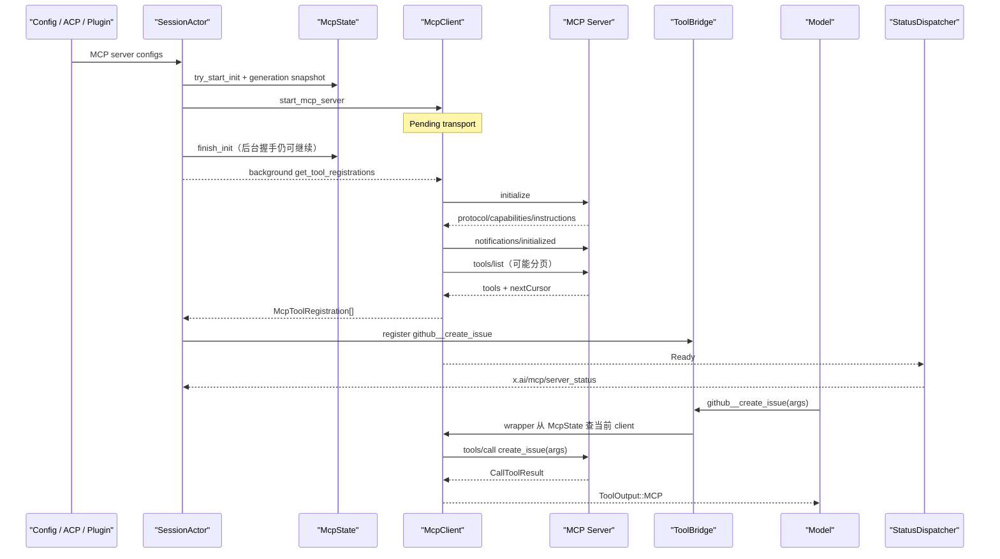
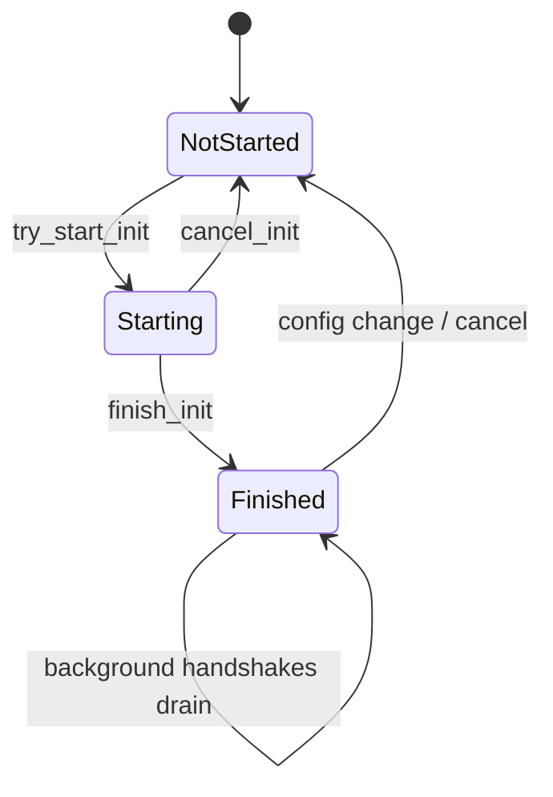
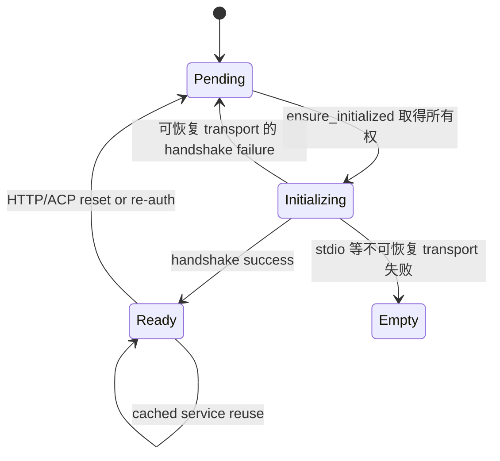

# Walkthrough：一个 MCP Server 如何连接、发现工具、接受调用、恢复并退出

本文固定一条具体路径：

> Session 配置了名为 `github` 的 MCP server。系统创建 transport，完成 MCP `initialize` 握手，分页执行 `tools/list`，把远端的 `create_issue` 转换成模型可见的 `github__create_issue`。模型调用该工具时，本地 wrapper 再解析为远端原名并执行 `tools/call`。运行中 server 可能发送工具变化通知、transport 可能断开、配置也可能被热重载；系统必须判断应该刷新状态、原地重连、重启子进程、替换 client、注销工具，还是保持失败。

这条链路横跨六个不同层次：

```text
配置来源
  → Session 的 McpState
  → McpClient / transport / rmcp service
  → tools/list 得到的远端 capability
  → ToolBridge 中的本地动态工具
  → 模型调用与 ToolOutput
```

它们不能混成一个“当前 MCP 状态”。尤其要记住：

```text
Server 已配置 ≠ Client 已创建
Client 已创建 ≠ initialize 已完成
finish_init 已执行 ≠ 所有后台 handshake 已完成
收到 tools/list_changed ≠ ToolBridge 已重新枚举
Transport 恢复 ≠ 工具调用一定可以安全重放
```

本文核对基线为仓库根目录 `SOURCE_REV` 记录的提交。源码行号会变化，因此正文优先使用类型、函数和测试名定位。

---

## 1. 先看完整时序



图中最关键的一处是：Session 在后台 handshake 前后维护的是两套状态机。

- `McpState::InitProgress` 描述整个 server pool 的初始化进度；
- `McpClient::ClientState` 描述单个 client 的 transport/handshake 状态。

只看其中一个，无法判断“整个 MCP 是否准备完成”。

---

## 2. 建议同时打开的源码

| 文件 | 主要对象 | 本篇关注点 |
| --- | --- | --- |
| `crates/codegen/xai-grok-config-types/src/mcp.rs` | `McpServerConfig`、transport config | 配置如何表达 stdio、HTTP/SSE、timeout 与 disabled tools |
| `crates/codegen/xai-grok-mcp/src/servers.rs` | `McpState`、`McpClient`、`McpTool` | 状态机、握手、工具枚举、调用和恢复 |
| `crates/codegen/xai-grok-mcp/src/liveness.rs` | transport liveness task | 如何发现已关闭连接 |
| `crates/codegen/xai-grok-mcp/src/acp_transport.rs` | ACP reverse transport | SDK 进程内 MCP 如何复用同一协议链路 |
| `crates/codegen/xai-grok-mcp/src/oauth.rs` | OAuth flow | HTTP MCP 的凭据发现、刷新与交互认证 |
| `crates/codegen/xai-grok-shell/src/session/mcp_servers.rs` | shell re-export / client builder | Shell 与 MCP crate 的边界 |
| `session/acp_session_impl/mcp.rs` | `ensure_mcp_tools_initialized` | Session 编排、动态注册、snapshot 与恢复 |
| `session/acp_session_impl/mcp_snapshot.rs` | metadata snapshot | 搜索、prompt reminder 和 descriptor 的派生视图 |
| `session/mcp_dispatcher.rs` | `StatusDispatcher` | 事件合并、状态推送、断线分流 |
| `session/mcp_restart.rs` | bounded restart/recovery | stdio respawn 与 HTTP in-place recovery |
| `session/acp_session_impl/run_loop.rs` | Session commands | 配置热重载、server/tool toggle |
| `xai-grok-tools/src/bridge.rs` | `ToolBridge` | finalize 后的 MCP 动态注册与注销 |

阅读顺序推荐：

1. `ensure_mcp_tools_initialized`；
2. `start_mcp_server`；
3. `McpClient::ensure_initialized`；
4. `get_tool_registrations`；
5. `register_mcp_tool`；
6. `McpErasedTool::run`；
7. dispatcher 与 restart。

---

## 3. MCP 在这里解决什么问题

MCP，即 Model Context Protocol，是 Agent 与外部能力提供者之间的协议边界。外部 server 可以提供：

- tools：可调用操作；
- resources：可读取资源；
- prompts：协议定义的 prompt 能力；
- instructions：握手时给 client 的 server 说明；
- capability change notifications：能力列表发生变化的提示。

Grok Build 当前这条主链路最深度接入的是 tools。MCP server 负责声明工具 schema 并执行调用；Grok Build 负责把远端工具适配到自己的 `ToolBridge`、权限、事件、模型上下文和 UI 中。

MCP 不是模型请求协议。模型不会自己向 MCP server 发 JSON-RPC；模型产生 tool call，由本地 runtime 找到 `McpErasedTool`，再由它调用 MCP service。

---

## 4. 配置来源并不只有一个文件

Session 最终看到的是一组 `acp::McpServer`，但它们可能来自：

- 用户或全局配置；
- workspace/project 配置；
- plugin 声明；
- managed MCP 配置；
- ACP client 在 `_meta["x.ai/mcp/servers"]` 中传入的 SDK MCP；
- session load/reconnect 时重新提供的 client-scoped 配置。

因此，“修改 `.mcp.json` 后为什么还有某个 server”不能只检查一个文件。配置加载层需要先做来源合并、folder trust、enabled/disabled 和兼容格式转换，之后才进入本文的 runtime 生命周期。

---

## 5. 三类配置 transport 与四类 PendingTransport

外部 ACP 配置主要表达：

- `Stdio`：启动本地子进程，通过 stdin/stdout 交换 JSON-RPC；
- `Http`：通过 streamable HTTP 访问远端 server；
- `Sse`：兼容的网络 transport 表达。

进入 `McpClient` 后，`PendingTransport` 还有第四类：

```text
Stdio
Http
HttpAuth
Acp
```

`HttpAuth` 表示 HTTP 配置旁边还带共享的 OAuth `AuthorizationManager`。`Acp` 表示 SDK MCP 不直接通过 socket 或子进程连接，而是经现有 ACP connection 反向调用 SDK host。

配置 enum 与运行时 transport enum 数量不同，是因为认证状态和进程内桥接属于运行时构造信息，不完全来自静态 MCP server 配置。

---

## 6. `start_mcp_server` 只创建 Client，不完成握手

名字容易误导：`start_mcp_server` 返回的是处于 `Pending` 的 `McpClient`，并不保证 MCP `initialize` 已完成。

它按 transport 做准备：

- stdio：解析 command，创建 child process，接管 stdin/stdout，并把 stderr 导入独立日志；
- HTTP/SSE：构造 URL、headers 和 session placeholder；
- OAuth HTTP：做 discovery，读取或准备 auth manager；
- 非交互环境需要 browser login 时：返回 `AuthRequired`，避免启动必然失败的匿名连接。

真正握手发生在随后调用 `ensure_initialized()` 时。

---

## 7. stdio 子进程的所有权

stdio transport 持有唯一的 child process。代码设置 `kill_on_drop(true)`，这意味着持有 client/transport 的对象被释放时，子进程会随之结束，而不是成为孤儿。

这也解释了两个恢复差异：

1. HTTP 配置可以 clone 后重新建立连接；
2. 已被握手消费的 stdio child 不能“clone 回去”，失败后必须重新 spawn。

所以 `restorable_transport` 对 HTTP、HttpAuth 和 ACP 可返回重建材料，对 stdio 返回 `None`。

---

## 8. stderr 为什么不能混进 stdout

stdio MCP 的 stdout 是 JSON-RPC wire。任何普通日志若写到 stdout，都可能破坏协议 framing。

Grok Build 将 server stderr 排入：

```text
~/.grok/logs/mcp/<sanitized-server>.stderr.log
```

文件名会被清洗，单次 spawn 时截断后重新记录。调试“server 启动了但握手失败”时，应同时查看：

- Grok Build event/trace；
- 对应 MCP stderr log；
- server 是否错误地把日志写到了 stdout。

---

## 9. HTTP Header 中的 Session Placeholder

HTTP header value 可以包含：

```text
{{session_id}}
${session_id}
```

有 session id 时会展开；没有 session id 而 header 又包含 placeholder 时，该 header 会被丢弃，避免把未展开模板原样发送。

这个行为属于 transport 构建，不是 MCP 协议能力。

---

## 10. OAuth Discovery 是连接前准备

HTTP 配置已显式带 `Authorization` header 时，代码跳过 OAuth discovery。否则它会在受限时间内探测 server 的 OAuth 支持并得到三类结果：

- `NoOauthSupport`：创建普通 HTTP client；
- `ManagerReady`：创建带 auth manager 的 HTTP client；
- `NeedsInteractiveLogin`：非交互 session 返回 `AuthRequired`。

所以“HTTP MCP 连接失败”需要先判断失败在 discovery、credential load、transport build，还是协议 handshake。

---

## 11. 多个 Server 最多八路并发创建

`start_mcp_servers` 使用 `buffer_unordered(8)`。这表示最多并发准备八个 server，结果顺序不保证与配置顺序一致。

它解决的是启动延迟：一个慢 server 不应串行阻塞后面所有 server。

它没有消除后续的并发问题。每个 client 内仍需 single-flight handshake，Session 仍需 generation 防止旧初始化结果覆盖新配置。

---

## 12. Pool 级状态机：`InitProgress`

`McpState` 用一个 enum 表示合法初始化状态：



两个带状态的 variant 都保存 `handshaking` server set：

- `Starting { handshaking }`：还没越过 `finish_init`；
- `Finished { handshaking }`：编排阶段结束，但后台 server 仍可能连接中。

只有 `Finished` 且集合为空，`is_initialized()` 才为真。

---

## 13. 为什么不使用三个 bool

旧式设计若分别维护：

```text
initialized: bool
initializing: bool
initializing_servers: Set
```

会产生大量无意义组合，例如：

- 同时 initialized 和 initializing；
- 初始化尚未开始却存在 handshaking server；
- finished 但不知道后台任务是否结束。

单一 enum 把合法组合编码进类型，调用点必须显式处理 `NotStarted`、`Starting`、`Finished`。

这是一种常见的“让非法状态不可表示”设计。

---

## 14. `finish_init()` 为什么故意提前

Session 创建好 pending clients 后，就调用 `finish_init()`，然后把握手和 `tools/list` 放进 `spawn_local` 后台任务。

这样做是为了让不依赖 MCP 的普通工作先继续。假设一个 npm MCP 首次启动需要下载包，另一个远端 server 响应很慢，Session 不应因此冻结所有模型请求。

但提前 finish 带来语义要求：

```text
has_finished_init() 只表示越过编排边界
is_initialized() 才表示所有 tracked handshake 已收敛
```

文档、日志或 UI 若把二者都叫“initialized”，会制造难以复现的竞态描述。

---

## 15. Progressive 与 Blocking

MCP 初始化策略决定调用方是否等待后台 server：

- Progressive：普通 turn 可以先运行，连接中的 server 通过 reminder 告知模型；
- Blocking：需要完整 MCP 能力时等待 handshake 完成或达到受限等待边界。

Progressive 不等于永不等待。构建工具 definition、需要 MCP metadata 的 prompt 和某些 dispatch 路径仍可能进行 bounded wait。

连接中的系统提醒明确告诉模型：工具稍后才会出现，不要立即尝试调用。

---

## 16. 初始化主流程

`ensure_mcp_tools_initialized()` 大致执行：

```text
锁 McpState
  → try_start_init，重复调用直接返回
  → 加载 disabled tools
  → snapshot configs + generation + existing clients
解锁
  → 过滤只需新启动的 configs
  → 把 server names 加入 handshaking set
  → 发送 init_progress(connected=0)
  → 并发 build pending clients
锁 McpState
  → 检查 generation
  → 记录 spawn failures
  → finish_init
解锁
  → 后台并发 handshake + tools/list
  → 注册工具、记录成功/失败
  → 安装 clients、启动 liveness watcher
  → 更新 snapshot/reminder/UI
  → 通知 handshakes_done 与 mcp_initialized
```

锁不会跨越 spawn、handshake 和远端 `tools/list` 长时间持有。

---

## 17. Generation 防止陈旧初始化提交

初始化开始时保存 `McpState::generation()`。配置变化会递增 generation 并把 pool init 重置为 `NotStarted`。

后台结果提交前再次比较：

```text
captured generation == current generation ?
```

不相等时丢弃整批旧结果并记录 `McpInitCancelled`。否则可能发生：

1. 旧配置开始连接 A；
2. 用户把 A 改成 B；
3. B 已进入新状态；
4. 慢到达的 A 结果把旧 client/tool 又注册回来。

Generation 是配置时代编号，不是 client 身份编号。

---

## 18. 单个 Client 的状态机

`McpClient` 维护：



`Empty` 不表示 server 返回了空工具列表。它表示 client 没有可用于再次握手的 transport。

远端 `tools/list` 返回零项时，client 仍可以是 `Ready`。

---

## 19. Handshake 为什么必须 Single-flight

初始化后台任务和模型第一次工具调用可能同时触发 `ensure_initialized()`。如果两者各自发一次 `initialize`：

- stdio transport 会被两个任务争用；
- HTTP 会建立重复 service；
- 状态和 notification 顺序不确定；
- 一个失败可能覆盖另一个成功。

当前实现让第一个从 `Pending` 取走 transport 的调用者成为 holder，并把状态设为 `Initializing`。其他调用者订阅 `Notify` 并等待，再重新检查状态。

等待上限约为：

```text
startup_timeout_sec + 1 秒
```

这样 holder 异常消失时，waiter 不会永久挂起。

---

## 20. 为什么先创建 `notified()` 再看状态

`Notify::notify_waiters()` 只会唤醒已经存在的 waiter future。若代码先看到 `Initializing`，再创建 `notified()`，holder 可能恰好在两步之间完成并发送通知，导致 wakeup 丢失。

当前顺序是：

```text
先创建 notified future
  → 再锁 state 并检查
  → 确认 Initializing 后释放锁并 await
```

这是异步条件变量式代码的经典 lost wakeup 防护。

---

## 21. `InitGuard` 解决取消安全

handshake holder 可能因 session cancel、task abort 或 panic 被 drop。若状态永远留在 `Initializing`，所有后续调用都会等待到 timeout。

`InitGuard` 是 RAII guard：

- HTTP/HttpAuth/ACP 保存可重建 transport；
- holder 正常发布结果前 `disarm()`；
- 异常 drop 时尽力把状态恢复为 `Pending`；
- 无论恢复是否抢到锁，都唤醒 waiter。

stdio transport 已被 consume，无法同样恢复，因此失败会进入 `Empty`，等待 session 级 respawn。

---

## 22. MCP `initialize` 实际交换什么

`try_handshake` 通过 rmcp 的 `handler.serve(transport)` 驱动协议握手。ClientInfo 包含：

- client implementation name；
- Grok Build version；
- client capabilities；
- MCP UI extension 支持；
- 显式固定的 protocol version `2025-06-18`。

显式固定版本很重要：升级 rmcp dependency 不应无意改变 wire protocol 声明。

server 响应可包含 capabilities、implementation info 和 instructions。握手成功后才得到可复用的 `RunningService`。

---

## 23. 四类 Transport 使用同一个握手外壳

`try_handshake` 根据 `PendingTransport` 构造不同 transport，但最终都调用 handler 的 `serve`：

| Transport | 重建材料 | 握手失败后本地状态 |
| --- | --- | --- |
| Stdio | 唯一 child process | `Empty`，需重新 spawn |
| Http | URL + headers | 可回到 `Pending` |
| HttpAuth | HTTP config + shared auth manager | 可 refresh/rebuild |
| ACP reverse | server id + invoker | 可重建桥接 transport |

共同的 startup timeout 包住整个 handshake。

---

## 24. OAuth Handshake 有一次内部刷新机会

带 auth manager 的 client 第一次 handshake 失败后，会尝试 `refresh_token()`，成功则重建 `HttpAuth` transport 再 handshake 一次。

这里不只针对特定 401 字符串，因为不同 server 与 transport 层的 auth 错误文本不稳定。

它仍是 bounded retry：首次 handshake 加最多一次 refresh 后重试，不会无限循环。

---

## 25. Handshake 成功与失败如何发布

完成后，holder 在 state lock 下发布：

- 成功：`Ready(Arc<RunningService>)`；
- 可恢复失败：`Pending(restored transport)`；
- 不可恢复失败：`Empty`。

释放锁后再：

1. `notify_waiters()`；
2. 向 dispatcher 发送 `Ready` 或 `HandshakeFailed`。

先释放锁再发事件，避免未来 consumer 回读 state 时形成锁环。

---

## 26. `tools/list` 为什么必须分页

握手成功不代表工具已经枚举。`get_tool_registrations()` 会循环调用：

```text
tools/list(cursor=None)
  → tools + nextCursor
tools/list(cursor=nextCursor)
  → ...
直到 nextCursor=None
```

若只请求第一页，大型 server 的后续工具会静默消失。分页合并完成后才统一转换成本地 registrations。

---

## 27. Schema 修补解决 Provider 兼容性

有些 MCP server 对无参数工具发送：

```json
{}
```

某些模型 API 要求 tool schema 明确是 object。代码会补足：

```json
{
  "type": "object",
  "properties": {}
}
```

这不是改变工具语义，而是把宽松 MCP producer 的 schema 规范化为模型 provider 可接受的形式。

---

## 28. 远端工具名如何变成本地身份

远端名：

```text
create_issue
```

server 名为 `github` 时，本地 qualified name 是：

```text
github__create_issue
```

`__` namespace 防止两个 server 都暴露 `search`、`create` 等常见名字时发生 registry 冲突。

模型与 `ToolBridge` 使用 qualified name；向远端发送 `tools/call` 时使用原始 tool name。

---

## 29. 工具名为什么要双重校验

`McpTool::into_registration()` 会检查：

1. qualified name 能否无歧义拆成 server/tool；
2. 完整名称是否满足模型 provider 对 tool name 的约束。

非法工具被记录并跳过，不会让一个坏工具污染整批注册或使之后的模型请求整体失败。

---

## 30. `_meta.ui.visibility` 决定两个 Audience

默认情况下 MCP tool 对模型可见。若 `_meta.ui.visibility` 只包含 `app`：

- 不注册到模型的 `ToolBridge`；
- 仍可进入 app/UI tool catalog；
- 可以经专门的 `x.ai/mcp/call` 路径触发。

因此“UI 能看到”与“模型能调用”是不同 capability audience。

---

## 31. Disabled Tool 为什么要 Stash Registration

用户禁用一个工具时，系统既要让模型立刻看不到它，又希望重新启用时无需重跑整个 `tools/list`。

`McpState::disabled_tool_registrations` 保存完整 registration：

- disable：从 ToolBridge 注销，放入 stash；
- enable：从 stash 取回并动态注册；
- config remove：按 server prefix 清理 stash。

只保存名字不够，因为重新注册还需要 schema、description、runtime wrapper 与 meta。

---

## 32. ToolBridge 已 Finalize 为什么还能注册 MCP

普通内置工具在 Agent build/finalize 阶段冻结。但 MCP 的远端能力可能几秒后才到，也可能运行中变化。

ToolBridge 为 MCP 保留专门的动态注册平面：

```text
register_mcp_tools(...)
unregister_tool_by_name(...)
unregister_tools_by_prefix(...)
```

这不是允许任意修改所有 finalized dependency，而是对动态 MCP tool map 的受控例外。

---

## 33. 注册不只写一个 Registry

一次成功发现还可能更新：

- ToolBridge 的可执行工具；
- `mcp_tool_meta`；
- app-visible UI tool list；
- disabled registration stash；
- `ToolMetadataSnapshot`；
- prompt reminder；
- descriptor mirror；
- telemetry/event log。

因此新增“刷新工具列表”功能不能只调用 `register_mcp_tools`。否则真实可执行表、搜索索引、提示词与 UI 会互相矛盾。

---

## 34. Background Handshake 如何提交结果

每个 client 的后台 future：

1. 先发送 `McpServerStarting`；
2. 把 event sender 安装到 client；
3. 在外层 init budget 内执行 `get_tool_registrations`；
4. 返回 registrations 或分类后的 error；
5. Session 汇总完成数量并发 `INIT_PROGRESS`。

外层 init budget 是：

```text
startup_timeout_sec × 2 + 5 秒
```

它覆盖内部 handshake 可能包含的一次 auth refresh retry，再留五秒边界。

---

## 35. 为什么 Client 要在工具注册后装入 McpState

后台任务批量处理成功/失败后，将 clients 包成 `Arc`，启动 liveness watcher，再插入 `owned_clients`。

工具 wrapper 自己保存的是 `Arc<Mutex<McpState>>` 和 server name，而不是永久保存最初 client 的 `Arc`。调用时才：

```text
state.get_client(server_name)
```

所以后续 managed token refresh、config reload 或 stdio respawn 替换 client 后，已有 wrapper 能自动命中新 client。

这是典型的“间接寻址支持热替换”。

---

## 36. Owned Client 与 Shared Client

`McpState` 分开保存：

- `owned_clients`：本 session 创建并负责生命周期；
- `shared_clients`：从 parent/subagent pool 继承的 `Arc<McpClient>`。

配置变化只清理 owned clients，不能把 parent 拥有的共享连接误杀。

shared client 的 transport/liveness event 仍由 parent 单点拥有；child 需要在自己的 ToolBridge 重新注册 wrapper，但不应再安装一套重复 watcher 和 status dispatcher。

---

## 37. 一次模型工具调用的入口

模型输出：

```text
name = github__create_issue
arguments = {...}
```

ToolBridge 找到 `McpErasedTool`。它实现通用 `Tool` trait：

- `Args = serde_json::Value`；
- `Output = ToolOutput`；
- namespace 是 `MCP`；
- kind 使用通用 `Other`；
- id 使用 qualified name。

MCP 工具天然是 JSON→JSON 风格，所以不经过每个内置工具各自的强类型 args wrapper。

---

## 38. Wrapper 为什么每次重新读取 Client

`McpErasedTool::run` 锁住 `McpState`，按 server name clone 当前 `Arc<McpClient>`，随后立刻释放 state lock。

这样同时满足：

- 调用期间 client 不会被 drop；
- 不持有全局 state lock 等待网络；
- 新调用可看到 replacement client；
- 已开始的旧调用可在自己的旧 Arc 上自然完成。

这是 copy-and-swap 热更新常见的 in-flight 语义。

---

## 39. `tools/call` 的参数转换

本地 raw args 必须是 JSON object 才会成为 MCP `arguments`：

```text
CallToolRequestParams::new(raw_tool_name)
params.arguments = raw.as_object().cloned()
```

注意远端收到的是 `create_issue`，不是 `github__create_issue`。server namespace 是 Grok Build 的本地 registry 身份。

---

## 40. Tool Timeout 的实际策略

timeout precedence 大致为：

1. `_meta` 中的 per-tool timeout；
2. config 中的 per-tool timeout；
3. `_meta` server default；
4. config server default；
5. crate default。

当前源码常量 `DEFAULT_TOOL_TIMEOUT_SECS` 的实际值是 `6000` 秒。附近函数文档仍写“Default (60s)”，两者不一致；阅读生产行为应以构造 client 时实际使用的常量和配置合并结果为准，并把这处视为需要后续澄清的代码/注释债务。

---

## 41. Timeout 后为什么不自动重放

一个慢工具可能已经在远端产生副作用，只是响应没及时回来。例如：

- issue 已创建；
- 消息已发送；
- 支付或部署已触发。

因此 timeout 路径：

- 标记 `is_timeout`；
- 对 HTTP client 可 reset transport，为下一次调用做准备；
- 当前工具调用返回 timeout；
- 不自动再次执行同一 `tools/call`。

这是 at-most-once 倾向的安全边界。

---

## 42. 哪些 ServiceError 允许 Recover-and-Retry

明确的 transport failure 可恢复：

- `TransportClosed`；
- `TransportSend`。

HTTP MCP error 还允许在一次 dispatch 内恢复非确定性错误，但排除：

```text
-32700 Parse error
-32600 Invalid request
-32601 Method not found
-32602 Invalid params
```

也排除 auth-like error，因为重建连接仍会复用旧 credential，认证问题应走 re-auth。

---

## 43. 为什么协议参数错误不能靠重连修复

同样的 method 和 args 经过新连接仍然错误。对 `InvalidParams`、`MethodNotFound` 重连只会：

- 增加延迟；
- 制造额外连接；
- 隐藏 schema/版本问题；
- 让日志看起来像网络不稳。

恢复只应该用于“连接状态改变后结果可能不同”的失败。

---

## 44. Recover-and-Retry 如何执行

符合条件时：

```text
记录 McpTransportError
  → client.recover()
      → reset transport
      → single-flight ensure_initialized
      → re-arm liveness watcher
  → 记录 reconnect result
  → 使用同一 params 再 call_tool 一次
```

如果 recover 本身失败，返回原始 service error，以保留最有价值的触发原因；recover 成功但第二次调用失败，则返回第二次错误。

---

## 45. Auth Retry 是调用层的另一条恢复线

若第一次 `try_call_tool` 失败且 client 有 auth manager，wrapper 会：

1. `force_reauth(false)`；
2. 记录 `McpAuthRetry`；
3. re-auth 成功后再次进入 `try_call_tool`；
4. 失败则保留错误并结束。

所以 transport reconnect 与 auth re-auth 是两个不同动作：

- reconnect 解决死连接；
- re-auth 解决 credential 失效；
- managed MCP 还可能需要从代理重新拉取 endpoint/header 并替换 client。

---

## 46. MCP Result 的“错误”有两层

调用可能以两种方式失败：

1. Rust/transport/service 层返回 `Err`；
2. MCP `CallToolResult` 成功返回，但 `is_error=true`。

第二类是应用级工具错误。代码会抽取其中 text blocks，构造成：

```text
ToolOutput::MCP(MCPOutput::errored(...))
```

它不等于 transport 断开，也不应自动 reconnect。

---

## 47. Text、Image 与 Resource 如何进入 ToolOutput

成功结果会遍历 content blocks：

- Text：直接拼接文本；
- Image：构造 `data:<mime>;base64,...`；
- image Blob Resource：同样转换成图片 data URI；
- 其他 Resource：尝试序列化为 JSON；
- 当前未处理的 block：忽略。

`expose_image_base64` 开启时还增加 `<mcp_image_base64>` wrapper，让后续层既能提取视觉输入，也能把原始 bytes 交给需要路径转发的 agent 流程。

---

## 48. 调用事件记录什么

一次调用至少有：

- `McpToolCallStarted`；
- `McpToolCallCompleted`；
- server name；
- raw tool name；
- qualified call id；
- duration；
- success；
- timeout flag；
- reconnect attempted；
- auth retry attempted。

transport recovery 另有 `McpTransportError` 与 `McpTransportReconnect`。这些字段能区分“工具业务失败”“超时”“断线恢复后失败”“认证刷新失败”。

---

## 49. Server Push Notification 如何进入系统

`GrokClientHandler` 实现 rmcp `ClientHandler`，处理：

```text
notifications/tools/list_changed
notifications/resources/list_changed
```

它把消息转换为 `McpClientEvent::ToolsChanged` 或 `ResourcesChanged`，发送到 Session 的 event channel。

handler 保存的是共享 sender slot，而不是握手时的一次性 sender snapshot。因此 restart 后即使在 handshake 完成后才安装 sender，后续通知仍能到达 dispatcher。

---

## 50. 一个重要现状：Changed Notification 不会自动 Re-list

当前 `StatusDispatcher` 收到 `ToolsChanged`/`ResourcesChanged` 后，会把它们映射成状态变化并推送 `x.ai/mcp/server_status`。

它没有仅凭这个事件自动执行：

```text
get_tool_registrations
  → diff old/new tools
  → unregister removed tools
  → register added/changed tools
  → refresh snapshot/reminder/descriptors
```

所以当前语义是：

```text
收到 capability changed 提示
≠
模型本地工具表已经同步
```

这是本文最值得记住的实现边界之一。

---

## 51. 为什么完整动态刷新不能只追加新工具

若 server 从列表中删除工具 A、增加工具 B，而 client 只注册 B：

- ToolBridge 仍保留 ghost tool A；
- 模型可能继续调用 A；
- snapshot 与 UI 可能显示不同集合；
- disabled stash 可能引用旧 schema。

完整刷新至少需要 server-scoped diff、原子或有序替换、generation/client identity 检查、disabled policy 重放和所有派生视图刷新。

---

## 52. StatusDispatcher 为什么做 50ms Coalescing

server 可能短时间 burst 多个 notification。dispatcher 使用 50ms tumbling window，key 是：

```text
(server_name, McpClientEventKind)
```

同 server、同 kind 在窗口内只保留最后一个；不同 kind 不互相覆盖。

例如 100 个 `ToolsChanged(github)` 可合并成一个，而 `Ready(github)` 和 `ToolsChanged(github)` 各保留一项。

这减少 UI/wire 风暴，又不把语义不同的事件错误合并。

---

## 53. `ConfigDiff` 为什么要先 Fan-out

一个 config diff 可同时包含多个 added/removed server。它本身没有单一 server name，因此进入窗口前拆为：

- `ConfigAdded { server }`；
- `ConfigRemoved { server }`。

这样每个 buffer entry 都满足 `(server, kind) ↔ event payload` 一致性，不会把整批 diff 假装成某个 server 的 Ready event。

---

## 54. Liveness Watcher 检查什么

每个受监控 client 的 poller周期检查一个原子分类：

| Client 状态 | Transport | 结果 |
| --- | --- | --- |
| Ready | open | `Healthy`，继续轮询 |
| Ready | closed | `TransportClosed`，发事件并退出 |
| Pending/Initializing/Empty | 任意 | `Transient`，静默退出 |

只有 Ready client 的 transport 真正关闭才发 disconnect。重新握手中的临时状态不能被误判为新一次断线。

ACP reverse client 不安装这类 liveness watcher，其恢复所有权不同。

---

## 55. Client ID 防什么竞态

server name 不是 client instance identity。配置 reload 后可能存在：

```text
旧 github client：id=41
新 github client：id=57
```

旧 watcher 的 `TransportClosed` 可能晚到。事件携带 `client_id`，dispatcher 只有在 id 与 `McpState` 当前 client 匹配时才移除。

Generation 防旧配置批次提交；client id 防旧 client 的异步事件伤害 replacement。二者不是重复机制。

---

## 56. stdio 与 HTTP 为什么不能共用恢复方式

stdio：

- child 已退出；
- 必须重新 spawn；
- 成功后安装新的 `Arc<McpClient>`。

HTTP：

- 地址和 headers 仍可用；
- 保留同一个 client Arc；
- reset transport、重新 handshake、重新安装 watcher。

对 HTTP 重新创建整个 server/client 会破坏已有 wrapper/in-flight 语义；对 stdio 只 reset connection 又没有可复用 child。

---

## 57. stdio 自动重启预算

`mcp_restart.rs` 为 stdio 设置三次 backoff：

```text
第 1 次：等待 1 秒
第 2 次：再等待 4 秒
第 3 次：再等待 16 秒
累计约 21 秒后耗尽
```

触发事件只包括：

- `TransportClosed`；
- `HandshakeFailed`。

ToolsChanged、Ready、ConfigAdded 等不会启动子进程重启。

---

## 58. stdio Restart 的 Guard Rails

安排或执行重启前必须确认：

- session 未 shutdown；
- server 仍配置且 enabled；
- transport 仍是 stdio；
- 不是 intentional config removal；
- 同 server 没有另一项 restart in flight；
- backoff 等待期间配置没有再次变化。

single-flight restart slot 用 RAII guard 释放，确保成功、失败、取消和 panic 都不会永久卡住 future restart。

---

## 59. stdio Respawn 的 TOCTOU Re-check

spawn 与 handshake 可能耗时数秒。期间用户可能禁用 server 或修改 command。

`respawn_stdio()` 在安装新 client 前重新检查：

- server 是否仍 configured/enabled；
- 当前 config JSON 是否仍与启动时 snapshot 一致。

若不一致，丢弃新 client；`kill_on_drop` 清理刚启动的 child。否则旧重启任务会把用户已禁用或已改配置的 server 重新复活。

---

## 60. Restart 成功为什么不重复发送 Ready

初次连接在 handshake 前安装 event sender，所以 `ensure_initialized` 会发 `Ready → reason=initialized`。

stdio restart 则先 handshake，后安装 sender。restart task 自己发送 `reason=restart_succeeded`。若提前安装 sender，会产生两次状态：

```text
initialized
restart_succeeded
```

共享 sender slot 保证 handshake 后再安装仍能接收未来 server notifications。

---

## 61. Restart 耗尽为什么注销工具

如果 stdio server 已彻底无法启动，而 ToolBridge 仍保留其 wrappers，模型会持续调用一个不存在的 server。

因此重启耗尽后按 `server__` prefix 注销工具，使可发现能力与实际连接状态重新一致。

这是一种失败收敛：宁可明确减少 capability，也不保留必然失败的 ghost tool。

---

## 62. HTTP Proactive Recovery

HTTP transport closed 时 dispatcher 不先删除 client，而是把它列入 in-place recovery：

```text
保留 Arc<McpClient>
  → reset_http_client
  → client.recover
  → reset transport
  → handshake
  → re-arm watcher
```

HTTP recovery 首次立即尝试，之后使用：

```text
1s, 4s, 16s, 30s, 30s, 30s, 30s
```

共八次尝试，覆盖约两分多钟的滚动部署窗口。

---

## 63. HTTP Recovery 中也要检查 Current Client

恢复完成时检查当前 `McpState` 中的 client 是否仍与开始恢复时的 Arc 相同，并确认 server 仍 enabled/configured。

如果配置 reload 已替换 client，旧 recovery 不能覆盖或误报新 client。失败路径会撤掉旧 liveness handle 并返回明确竞态错误。

---

## 64. Managed MCP Token 更新为什么替换 Client

managed MCP 的 endpoint/header/token 来自远端配置缓存。token 接近过期或收到 auth rejection 时，Session 可以：

1. 绕过旧 cache 重新拉 managed configs；
2. 用新 headers 刷新 owned clients；
3. 对目标 client 重新 handshake/list tools；
4. 注册工具并刷新 snapshot；
5. 发 `managed_token_refreshed` 或最终 `NeedsAuth`。

这不是普通 HTTP reconnect，因为连接材料本身已经变化。

---

## 65. Reactive Managed Re-auth 的 Cooldown

同一 revoked connector 可能让多个工具并发失败。共享 managed state 用 cooldown 合并恢复，避免所有失败都绕过 cache 请求代理。

恢复成功清除失败状态；达到 terminal 条件时：

- 标记 auth failure；
- 发 NeedsAuth；
- 注销该 server 工具；
- 刷新 snapshot/reminder。

这使认证失败最终收敛为用户可行动状态，而不是持续后台重试。

---

## 66. 配置热重载如何做 Diff

`McpState::update_configs_diff` 把旧、新配置按 server name 序列化比较，得到：

```text
added
removed
retained
```

同名但内容变化同时视为 removed + added。

只清理 removed/changed server 的：

- owned client；
- auth-required state；
- handshaking marker；
- tool meta；
- disabled registration stash。

retained client 保持连接，避免无关配置变化导致全部 MCP 重启。

---

## 67. Reload 时工具何时注销

Session command 收到 diff 后：

1. 先更新 `McpState`；
2. 向 dispatcher 发 `ConfigDiff`；
3. 对 removed server 按 prefix 注销 ToolBridge 工具；
4. 后台执行 `ensure_mcp_tools_initialized()` 连接 added server。

状态删除和模型 capability 删除都必须发生。只删 client 会留下 ghost tool；只删 tool 会留下无用进程和 watcher。

---

## 68. Intentional Teardown 为什么需要 `shutting_down`

配置删除会 drop stdio client，`kill_on_drop` 终止 child。liveness watcher 随后可能观察 transport closed。

如果只看 `TransportClosed`，自动重启会把刚被用户删除的 server 拉起来。

dispatcher 在看到 `ConfigRemoved` 时记录 `shutting_down` intent；restart scheduler 先检查它并跳过。这里的关键是把“连接死了”与“用户主动关闭”分开表示。

---

## 69. Toggle Tool 不需要重新 List

普通 MCP tool toggle 使用 stash：

- disable：重构并保存 registration，注销 qualified tool；
- enable：从 stash 恢复 registration；
- 更新 disabled set；
- 刷新 snapshot 与 goal harness；
- 后台持久化配置并通知 UI。

因为 schema 已在 registration 中，toggle 自身无需重新访问 server。

managed gateway tool/connector 的 disable mask 走单独配置视图，不能假设与普通 server tool 完全同构。

---

## 70. Snapshot、Reminder 与 Descriptor 是派生状态

MCP 工具注册后会派生出模型搜索和提示相关视图：

- ToolMetadataSnapshot：供 `search_tool` 等查询；
- MCP reminder：告诉模型有哪些连接或能力；
- descriptor files：把工具说明物化到可浏览目录；
- UI notification：通知前端重新拉 catalog。

它们不是执行权威源。执行最终仍经过 ToolBridge wrapper 和当前 McpState client。

但派生状态陈旧会导致模型“搜不到能调用的工具”或“搜到已不存在的工具”，因此更新链路仍必须保持一致。

---

## 71. Agent Rebuild 后为什么要重新注册

McpClient 可能仍在 `McpState` 中 Ready，但 Agent rebuild 会产生新的 ToolBridge。

旧 Bridge 上注册过不等于新 Bridge 已拥有工具。rebuild 流程必须从现有 clients 再取 registrations 或 snapshot，向新 Bridge 恢复动态 MCP tools。

这是 client state 与 registry state 分离的直接后果。

---

## 72. Shutdown 的资源清理

Session shutdown 时需要：

- 关闭 dispatcher receiver；
- cancel restart/recovery backoff token；
- drop liveness handles；
- drop owned clients；
- 通过 `kill_on_drop`/process scope 回收 stdio child；
- 防止后台 init/restart 在 teardown 后重新提交结果。

restart backoff 必须可取消。否则 session 已关闭，21 秒后旧任务仍可能 spawn 新进程。

---

## 73. 错误分类矩阵

| 失败 | 所在层 | 当前处理 |
| --- | --- | --- |
| command 不存在 | stdio spawn | `SpawnFailed`，不进入 handshake |
| OAuth 需要浏览器但 session 非交互 | pre-spawn auth | `AuthRequired` |
| initialize 超时 | handshake | `Timeout`，记录 init failure |
| initialize protocol error | handshake | `HandshakeFailed` |
| tools/list 失败 | discovery | server unavailable/failed，无注册 |
| 工具名非法 | registration | 跳过单个工具 |
| Invalid params | call protocol | terminal，不重连 |
| TransportClosed/Send | call transport | recover 后至多重试该调用路径 |
| tool timeout | call timeout | 当前调用不重放；HTTP 为下次 reset |
| CallToolResult `is_error=true` | tool application | 转为 MCP error output |
| server process 后续退出 | liveness | stdio bounded respawn |
| HTTP 后续断开 | liveness | in-place HTTP recovery |
| managed auth 失效 | credential/config | re-fetch config、替换 client，最终 NeedsAuth |
| config 删除 | lifecycle | 注销工具、drop client、抑制 restart |

---

## 74. 这条链路的并发不变量

1. 一个 `McpClient` 同时最多一个 handshake holder。
2. waiter 必须在检查状态前订阅 Notify，避免 lost wakeup。
3. 远端 await 期间不持有整个 `McpState` lock。
4. 后台 init 提交前必须检查 generation。
5. transport close 处理前必须检查 client id。
6. stdio 同 server 同时最多一个 restart task。
7. restart/recovery 提交前必须重新检查 config/enabled/current-client。
8. replacement 不取消已持有旧 Arc 的 in-flight call。
9. session shutdown 必须取消所有 backoff。
10. server removal 必须同时移除 client 和 ToolBridge capability。

---

## 75. 常见误解

### 误解 1：`start_mcp_server` 返回成功就能调用工具

不对。它通常只准备 `Pending` client；还要 `initialize` 和 `tools/list`。

### 误解 2：`finish_init()` 表示 MCP 全部 Ready

不对。后台 handshaking set 可能仍非空。

### 误解 3：server 返回零个工具，所以 ClientState 是 Empty

不对。`Empty` 表示无可用 transport；零工具 server 仍可 Ready。

### 误解 4：MCP 的 HTTP、SSE、stdio 都用同一种重启

不对。stdio respawn child，HTTP 原地 rebuild transport。

### 误解 5：工具 wrapper 永久绑定首次连接

不对。它按 server name 从 McpState 读取当前 client。

### 误解 6：ToolBridge finalize 后 MCP 不能再加入

不对。MCP 有受控动态 registry 通道。

### 误解 7：收到 `tools/list_changed` 后新工具已经能调用

当前不成立。dispatcher 会推状态，但不会自动重跑完整 re-list/register pipeline。

### 误解 8：timeout 后重连成功就应该自动重放

不对。工具可能已产生副作用，timeout 路径刻意不重试当前调用。

### 误解 9：所有 MCP error 都值得 reconnect

不对。InvalidParams、MethodNotFound 等确定性 client error 被排除。

### 误解 10：server name 足以判断断线事件是否陈旧

不对。同名 replacement client 需要 `client_id` 区分。

### 误解 11：配置删除产生的 TransportClosed 应自动 restart

不对。这是 intentional teardown，`shutting_down` gate 会抑制重启。

### 误解 12：UI tool list 就是模型 tool list

不对。app-only visibility、disabled tools 和 snapshot 延迟都会让两个 audience 不同。

---

## 76. 修改初始化代码时的检查清单

- `try_start_init` 是否保持幂等？
- 新 server 是否加入 handshaking set？
- spawn failure 是否从 set 移除？
- `finish_init` 与真正 complete 是否仍被区分？
- background result 是否检查 generation？
- event sender 是否在首次 handshake 前安装？
- shared clients 是否避免重复 watcher？
- lock 是否跨远端 await？
- cancellation 是否会遗留 `Initializing`？
- empty-config 分支是否仍通知 waiters/UI？

---

## 77. 修改动态工具代码时的检查清单

- 新旧 tool list 是否按 server 做 diff？
- removed tool 是否从 Bridge 注销？
- changed schema 是否替换旧 registration？
- invalid tool 是否只影响自己？
- model/app visibility 是否分别处理？
- disabled tools 是否继续 stash？
- ToolMetadataSnapshot 是否刷新？
- reminder 与 descriptor 是否刷新？
- UI notification 是否带正确 session id？
- refresh 是否验证 generation 和 current client？

---

## 78. 修改恢复代码时的检查清单

- 错误是否真的能被新连接修复？
- 工具是否可能有副作用？
- 是否误把 timeout 自动重放？
- stdio 与 HTTP 是否走各自恢复方式？
- auth error 是否误走普通 reconnect？
- 是否检查 disabled/removed/shutdown？
- 是否 single-flight？
- stale client event 是否可能删除 replacement？
- backoff 是否可取消？
- exhausted 后 ghost tools 是否清理？
- status reason 是否区分 initialized 与 restart_succeeded？

---

## 79. 推荐的调试顺序

### Server 完全没出现

1. 检查配置来源与 folder trust；
2. 检查是否 enabled；
3. 查看 `McpConfigResolved`；
4. 查看 spawn/auth discovery failure；
5. stdio 查看独立 stderr log。

### Server 显示连接中很久

1. 查看 handshaking set；
2. 区分 pool `Finished` 与 `is_initialized`；
3. 查看 client state 是否 `Initializing`；
4. 检查 startup timeout 与外层 `2×+5` budget；
5. 确认 holder 是否被取消。

### Server Ready 但模型搜不到工具

1. 确认 `tools/list` 是否返回工具；
2. 检查 tool name validation；
3. 检查 `_meta.ui.visibility`；
4. 检查 disabled set；
5. 检查 ToolBridge definition；
6. 检查 snapshot/reminder 是否刷新；
7. 若仅收到 `tools/list_changed`，注意当前不会自动 re-list。

### 工具存在但调用报 server not found

1. 检查 wrapper 的 server prefix；
2. 查看 McpState 当前 client；
3. 检查 config removal/reload；
4. 检查 restart exhaustion 是否遗漏 unregister；
5. 检查 Agent rebuild 后是否只恢复了一侧。

### Server 被禁用后又复活

1. 查看 ConfigRemoved 是否进入 dispatcher；
2. 查看 `shutting_down` 是否标记；
3. 查看 restart schedule gate；
4. 查看 respawn 的 post-handshake config re-check；
5. 查看旧 watcher 的 client id 是否被当成 current。

---

## 80. 推荐实验

1. 写一个最小 stdio MCP，记录 `initialize`、`tools/list`、`tools/call` 顺序。
2. 让 `tools/list` 返回两页，验证第二页工具被注册。
3. 返回 `inputSchema: {}`，观察本地补入 object/properties。
4. 两个 server 都暴露 `search`，验证 qualified names 不冲突。
5. 创建 app-only tool，比较 UI catalog 与模型 definitions。
6. disable/enable 工具，确认无需再次 `tools/list`。
7. 并发两次 `ensure_initialized`，验证只有一次 handshake。
8. 在 handshake 中取消 holder，验证 waiter 不永久挂起。
9. 初始化期间修改 config，验证旧 generation 结果被丢弃。
10. 让旧 client 的 close event 晚于 replacement，验证 client id gate。
11. burst 100 个 ToolsChanged，验证 dispatcher 只保留一个同 key event。
12. 发 `tools/list_changed` 后改变 server list，确认当前 Bridge 不会自动同步。
13. 让工具返回 `is_error=true`，区分 application error 与 service error。
14. 让 HTTP call 返回 InvalidParams，验证不 reconnect。
15. 让 transport 关闭，验证 recover 后只在允许边界重试。
16. 让有副作用工具超时，确认当前调用不会自动重放。
17. 终止 stdio child，观察 1/4/16 秒 respawn。
18. 在 backoff 中禁用 server，确认 task 退出且不复活。
19. 让 HTTP server滚动下线，观察 in-place recovery budget。
20. Session shutdown 时保留 restart sleep，验证 cancellation 立即终止。
21. Agent rebuild 后检查 Ready client 的工具是否进新 Bridge。
22. 比较 owned/shared client 在 child session 中的 watcher 数量。

---

## 81. 本文编写时的实际验证

下列命令结果以本文完成时的本地执行为准：

| 命令 | 结果 | 主要覆盖 |
| --- | --- | --- |
| `cargo test -p xai-grok-mcp --lib servers::tests` | 通过：136 passed | client state、配置 diff、工具名、恢复分类、notification routing；本地 HTTP/子进程用例需允许对应 sandbox 能力 |
| `cargo test -p xai-grok-mcp --lib liveness::tests` | 通过：3 passed | watcher 退出、slot 清理与取消 |
| `cargo test -p xai-grok-mcp --lib acp_transport::tests` | 通过：8 passed | ACP reverse initialize/list/call/cancel |
| `cargo test -p xai-grok-config-types --lib mcp` | 通过：8 passed | MCP config 解析、转换与 preference |
| `cargo test -p xai-grok-shell --lib mcp_dispatcher` | 未进入测试：编译阶段被无关的 `tool_layer_images_bridge_tests.rs:15` 阻塞 | 当前文件调用 `STANDARD.encode(...)` 时缺少 `use base64::Engine;`，报 `E0599` |
| `cargo test -p xai-grok-shell --lib mcp_restart` | 未进入测试：被同一 `E0599` 阻塞 | backoff、guard rails、single-flight 与 exhaustion 未在本次 Shell test target 中运行 |

测试过滤器通过不等于所有跨 crate 集成路径通过。尤其是 server-pushed changed notification 的当前行为，应以 dispatcher 是否真正调用 re-list/register pipeline 的源码检查为准。

---

## 82. 自测题

1. `McpState::InitProgress` 与 `McpClient::ClientState` 分别描述什么？
2. 为什么 `finish_init()` 后 handshaking set 仍可能非空？
3. `Empty` client 与 Ready-but-zero-tools server 有什么区别？
4. 为什么 `ensure_initialized` 必须 single-flight？
5. 为什么 waiter 要先创建 `notified()` 再读 state？
6. `InitGuard` 对 HTTP 与 stdio 的恢复能力为什么不同？
7. `tools/list` 为什么必须循环 cursor？
8. 为什么远端 `create_issue` 在本地变成 `github__create_issue`？
9. app-only tool 为什么不进入模型 ToolBridge？
10. disabled registration stash 保存了什么？
11. wrapper 为什么不永久保存首次 client Arc？
12. tool timeout 后为什么只 reset HTTP transport，不重放调用？
13. 哪四种 JSON-RPC client error 不走 reconnect？
14. `is_error=true` 与 Rust `Err` 有什么区别？
15. `tools/list_changed` 当前到底做了什么、没做什么？
16. 50ms coalescing 的 key 为什么包含 event kind？
17. generation 与 client id 分别防什么竞态？
18. stdio 与 HTTP 的恢复方式为什么不同？
19. intentional config removal 为什么可能产生 TransportClosed？
20. Agent rebuild 为什么需要重新注册 MCP tools？

---

## 83. 本篇术语表

| 名词 | 通俗解释 | 在本文中的具体含义 |
| --- | --- | --- |
| MCP | Agent 连接外部工具和资源的标准协议 | Grok Build 作为 client，外部程序/服务作为 server |
| MCP Server | 提供 MCP capabilities 的进程或网络服务 | 可通过 stdio、HTTP/SSE 或 ACP reverse 接入 |
| MCP Client | 发起握手、列工具和调用工具的一侧 | `McpClient` 包装 transport 与 rmcp service |
| rmcp | Rust 的 MCP 协议实现库 | 负责 `serve`、RunningService 和协议消息 |
| JSON-RPC | 用 JSON 表达 method、params、id、result/error 的 RPC 格式 | MCP wire 的请求/响应基础 |
| transport | 承载协议字节/消息的通信方式 | stdio、streamable HTTP、ACP reverse 等 |
| stdio | 通过子进程标准输入输出通信 | 本地 MCP server 最常见 transport |
| streamable HTTP | MCP 的 HTTP transport | 可长期交互、重新建立连接 |
| SSE | Server-Sent Events | 配置兼容的服务端事件流 transport 表达 |
| ACP reverse transport | 借已有 ACP 连接反向调用 SDK host | 进程内 SDK MCP 的桥接方式 |
| handshake | client/server 建立协议会话的初始化交换 | rmcp `serve` 驱动 `initialize` 与 initialized notification |
| initialize | MCP 初始 RPC | 协商版本、身份、capabilities、instructions |
| protocol version | 双方约定的 MCP wire 版本 | 当前 client 显式声明 `2025-06-18` |
| capability | server 声明支持的协议能力 | tools、resources、change notification 等 |
| `tools/list` | 枚举 server 工具的 MCP method | 支持 cursor pagination |
| `tools/call` | 执行某个 MCP 工具的方法 | 使用远端 raw tool name 与 JSON args |
| pagination | 把长列表分多页传输 | 通过 `nextCursor` 继续获取全部 tools |
| cursor | 指向下一页的不透明标记 | client 不解释，只原样带回 server |
| qualified name | 带 server namespace 的本地工具名 | `github__create_issue` |
| raw tool name | server 自己声明的原始名字 | `create_issue` |
| namespace | 防止不同来源同名冲突的名字空间 | MCP 用 server name 作为前缀 |
| schema | 描述工具参数结构的 JSON Schema | 注册给模型 API 约束 arguments |
| registration | 注册工具需要的一组完整材料 | name、description、schema、wrapper、meta、visibility |
| ToolBridge | Grok Build 的工具发现和执行桥 | MCP tools 动态注册进去 |
| dynamic registration | 运行时增删工具 | MCP 越过普通 finalize 的专用通道 |
| finalize | 构建阶段冻结常规工具集的边界 | 不关闭 MCP 专用动态 map |
| model-visible | 模型能在 definitions/search 中发现并调用 | 默认 MCP tool audience |
| app-visible | 前端应用能展示/调用 | `_meta.ui.visibility` 可只选 app |
| `_meta` | 协议对象上的扩展元数据 | visibility、UI resource、timeout config 等 |
| disabled tool | 用户明确关闭的工具 | 不进 Bridge，但 registration 可 stash |
| stash | 暂存以后恢复所需对象 | `disabled_tool_registrations` |
| `McpState` | Session 的 MCP 汇总状态 | configs、clients、init、auth、meta、disabled 等 |
| owned client | 当前 session 创建和管理的 client | config change 可清理 |
| shared client | 从 parent 继承的共享 client Arc | child 不拥有 transport lifecycle |
| `InitProgress` | 整个 MCP pool 的初始化状态机 | NotStarted/Starting/Finished + handshaking set |
| `ClientState` | 单个 MCP client 的状态机 | Empty/Pending/Initializing/Ready |
| Pending | 有 transport 配置，尚未完成 handshake | 下一位 holder 可取走 transport |
| Initializing | 某个 task 正在 handshake | 并发调用者需要等待 |
| Ready | 已持有 RunningService | 可 list/call tools |
| Empty | 没有可用 transport | 常见于 stdio handshake 消耗 child 后失败 |
| single-flight | 同一件昂贵工作同时只允许一个执行者 | 并发 ensure/restart 合并 |
| holder | single-flight 中实际执行工作的人 | 从 Pending 取走 transport 的 task |
| waiter | 等 holder 发布结果的并发调用者 | 监听 `Notify` 后重查 state |
| lost wakeup | 通知发生在 waiter 注册前而永久错过 | 通过先创建 notified future 防止 |
| RAII | 对象析构时自动执行清理 | InitGuard、restart slot guard、cancel drop guard |
| generation | 配置版本的单调编号 | 防旧初始化批次提交 |
| client id | client instance 的唯一编号 | 防旧 watcher 事件删除同名 replacement |
| background handshake | 不阻塞普通 session 工作的异步初始化 | finish_init 后仍可继续 |
| Progressive | MCP 未齐时允许其他工作先走 | 配合 connecting reminder |
| Blocking | 需要能力时等待 MCP 收敛 | 仍受 timeout/bounded wait 限制 |
| liveness watcher | 周期检查 transport 是否关闭的 task | Ready+closed 才发 TransportClosed |
| notification | server 单向通知 client 的协议消息 | tools/resources list_changed |
| dispatcher | 合并并路由 client events 的 Session task | `StatusDispatcher` |
| coalescing | 把短时间重复事件合成一个 | 50ms、按 server+kind |
| tumbling window | 固定长度、到点整体 flush 的窗口 | 与每次事件重新延时的 debounce 不同 |
| fan-out | 一条批量事件拆成多条 | ConfigDiff 拆为每 server added/removed |
| reconnect | 重新建立 transport/session | 适合连接层失败 |
| respawn | 重新启动子进程 | stdio server recovery |
| re-auth | 重新取得或刷新 credential | 与普通 reconnect 分开 |
| in-place recovery | 保留 client Arc、替换内部 transport | HTTP close 的恢复方式 |
| copy-and-swap | 先构造 replacement，再替换共享槽位 | config/managed token client update |
| backoff | 重试前逐步加长的等待 | stdio 1/4/16s，HTTP 有更长窗口 |
| guard rail | 阻止不安全恢复的条件 | shutdown、disabled、wrong transport 等 |
| TOCTOU | 检查与使用之间状态发生变化 | respawn 完成前需再查 config |
| ghost tool | registry 仍有但 server 已不存在的工具 | removal/restart exhaustion 必须清理 |
| derived view | 从权威运行态计算出的副本 | snapshot、reminder、descriptor、UI list |
| `CallToolResult.is_error` | MCP 工具正常返回的业务错误标记 | 与 transport/service `Err` 不同 |
| side effect | 调用对外界产生的不可自动撤销变化 | timeout 后不安全重放的原因 |
| at-most-once | 倾向不让副作用操作重复执行 | timeout 路径的安全取舍 |
| cancellation token | 可通知后台 task 提前结束的共享信号 | shutdown 取消 restart sleeps |
| LocalSet / `spawn_local` | 运行非 `Send` future 的 Tokio 环境 | SessionActor restart/dispatcher 所在执行模型 |

更多跨篇通用概念见 [全局术语表](../appendices/glossary.md)。

---

## 84. 源码证据索引

| 主题 | 定位 |
| --- | --- |
| 配置 schema 与 ACP 转换 | `xai-grok-config-types/src/mcp.rs` |
| Pool init 状态机 | `xai-grok-mcp/src/servers.rs::InitProgress` |
| Session MCP 权威状态 | `servers.rs::McpState` |
| Config diff 与 generation | `McpState::update_configs_diff` |
| 单 client 状态机 | `servers.rs::ClientState` |
| Single-flight handshake | `McpClient::ensure_initialized` |
| Cancellation restore | `servers.rs::InitGuard` |
| Protocol handshake | `McpClient::try_handshake` |
| ClientInfo/protocol version | `McpClient::make_client_info` |
| stdio/HTTP client 创建 | `start_mcp_server` |
| 并发 server 创建 | `start_mcp_servers` |
| 分页枚举工具 | `McpClient::get_tool_registrations` |
| Tool schema 修补 | `get_tool_registrations` 中 schema normalization |
| Qualified name/visibility | `McpTool::into_registration` |
| 动态 wrapper | `McpErasedTool` |
| 工具调用与输出转换 | `McpErasedTool::run` |
| 传输恢复分类 | `should_recover_service_error` |
| Recover-and-retry | `McpErasedTool::recover_and_retry` |
| HTTP/ACP 原地恢复 | `McpClient::recover` |
| Server push handler | `GrokClientHandler` |
| Liveness watcher | `xai-grok-mcp/src/liveness.rs` |
| Session 初始化编排 | `SessionActor::ensure_mcp_tools_initialized` |
| 动态注册与 disabled stash | `SessionActor::register_mcp_tool` |
| Snapshot/reminder | `acp_session_impl/mcp_snapshot.rs` 与 `refresh_mcp_snapshot...` |
| Event 合并与 stale close | `session/mcp_dispatcher.rs` |
| stdio restart/HTTP recovery | `session/mcp_restart.rs` |
| Config reload/server toggle | `acp_session_impl/run_loop.rs` |
| stdio respawn TOCTOU | `SessionActor::respawn_stdio` |
| managed reactive re-auth | `SessionActor::reactive_managed_reauth` |

延伸阅读：

- [ACP 与 MCP：Agent 控制面和外部工具面的边界](../02-runtime-flows/09-acp-and-mcp.md)
- [MCP Server 生命周期、能力刷新与动态工具](../03-subsystems/07-mcp-server-lifecycle-and-dynamic-tools.md)
- [ToolBridge、工具注册表与 Resources](../03-subsystems/04-tool-bridge-registry-and-resources.md)
- [错误分类、重试、降级与恢复状态机](../03-subsystems/16-error-taxonomy-retry-degradation-and-recovery-state-machines.md)
- [并发、Actor、Channel、取消与 Shutdown](../03-subsystems/15-concurrency-actors-channels-cancellation-and-shutdown.md)
- [Walkthrough：一条 Prompt 如何从 ACP 请求变成可重放的流式回答](01-one-prompt-from-acp-to-persisted-answer.md)

---

## 85. 一句话复盘

一个 MCP server 的真实生命周期不是“启动进程，然后出现工具”，而是配置合并与信任判断、pending transport 创建、pool 与 client 两层状态机、single-flight initialize、分页 `tools/list`、带 namespace/visibility/disabled policy 的动态注册、调用时按 server 间接寻找当前 client、谨慎区分 transport/auth/timeout/application error、以 generation 和 client id 抵御陈旧异步结果，再由 stdio respawn、HTTP 原地恢复、配置 diff 和可取消 shutdown 把能力最终收敛到与实际连接一致的状态。
