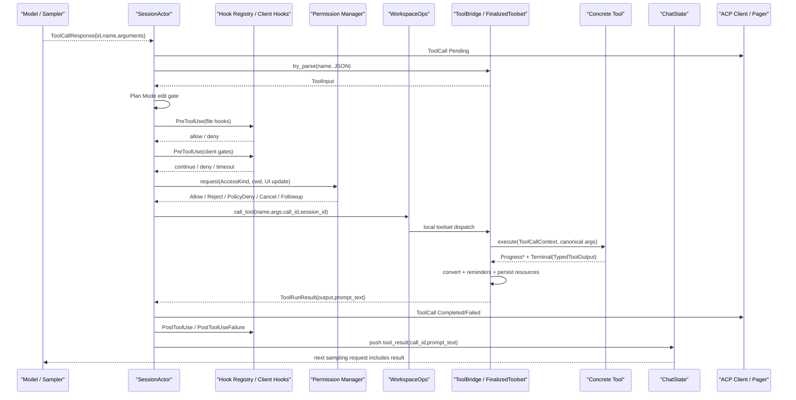

# Walkthrough：一条 Tool Call 如何经过解析、权限、Hooks、执行并返回模型

本文固定一条包含读写操作的真实路径：

> 模型一次返回两个 tool calls：先读取 `src/main.rs`，再修改同一个文件。Session 收到完整的 tool name、call id 和 JSON arguments 后，先建立 UI 中的 Pending tool block，解析参数并恢复内部 `ToolInput`，执行 Plan Mode gate、`PreToolUse` hooks 和 permission decision。获准的调用进入批量 dispatcher；同文件操作通过 per-file lock 保持顺序，其他工具可并发执行。工具 runtime 构造 `ToolCallContext`，调用具体实现，收集 progress、typed output、reminders 和资源状态。Session 再把结果分别转换成 ACP 展示和模型可读的 `ConversationItem::tool_result`，运行成功或失败 hooks，最后开始下一轮 sampling。

这条链路最容易混淆的是五种不同的“输入/输出”：

```text
模型输出的 arguments 字符串
  ≠ 解析后的 serde_json::Value
  ≠ 权限系统使用的 ToolInput / AccessKind
  ≠ 工具实现接收的 canonical Args

工具实现返回的 typed output
  ≠ ACP UI 展示
  ≠ 下一轮模型看到的 prompt_text
```

还要先记住三条安全边界：

```text
模型提出 tool call ≠ 系统已经批准执行
PreToolUse 允许 ≠ Permission 一定允许
Permission AlwaysApprove ≠ Plan Mode 可以任意写文件
```

本文核对基线为仓库根目录 `SOURCE_REV` 记录的提交。源码行号只用于首次定位，长期阅读应以函数、类型和测试名为准。

---

## 1. 完整时序



调用并不是一条同步函数链。模型流、ACP 通知、permission reverse request、多个工具 future、progress stream、hooks 和 chat history 各自有异步边界。

---

## 2. 建议同时打开的源码

| 文件 | 核心对象 | 本篇关注点 |
| --- | --- | --- |
| `xai-grok-shell/src/session/acp_session_impl/turn.rs` | agentic turn loop | 从 assistant tool calls 进入执行，再回到 sampling |
| `acp_session_impl/tool_calls.rs` | `execute_tool_calls`、`prepare_tool_call` | pre-flight、batch、post-flight 主编排 |
| `acp_session_impl/tool_dispatch.rs` | `dispatch_tool` | WorkspaceOps 调用边界和同文件 lock key |
| `acp_session_impl/tool_layer_images.rs` | `DrainedToolSuccess` | 图片在 hook serialization 前如何被安全摘出 |
| `session/acp_session/hooks.rs` | client hook gates | `x.ai/hooks/run`、timeout 与 fail-open |
| `xai-grok-hooks/src/dispatcher.rs` | file hook dispatcher | matcher、顺序、deny short-circuit |
| `xai-grok-hooks/src/event.rs` | hook payload | envelope 与 128 KiB payload cap |
| `xai-grok-workspace/src/permission/manager.rs` | permission actor | policy、ask、auto、allow-all 与持久授权 |
| `xai-grok-workspace/src/permission/types.rs` | `AccessKind`、`Decision` | 权限输入和决策类型 |
| `xai-grok-workspace/src/workspace_ops.rs` | `WorkspaceOps` | local/remote workspace tool facade |
| `xai-grok-tools/src/bridge.rs` | `ToolBridge` | Session 面向工具系统的门面 |
| `xai-grok-tools/src/registry/types.rs` | `FinalizedToolset` | parse、context、stream dispatch、finalize output |
| `xai-tool-runtime/src/tool.rs` | `Tool`、stream item | 统一执行协议 |
| `xai-grok-tools/src/types/output.rs` | `ToolOutput`、`ToolRunResult` | typed output 与 model prompt 双视图 |

推荐阅读顺序：

1. `execute_tool_calls`；
2. `prepare_tool_call`；
3. `dispatch_tool`；
4. `FinalizedToolset::prepare_dispatch`；
5. `call_streaming_with_cancellation`；
6. `finalize_output`；
7. `handle_bridge_tool_success` / `handle_tool_error`。

---

## 3. Tool Call 从哪里来

Sampler 将模型流里的 tool call delta 组装成完整响应。Session 真正执行的是完整：

```text
ToolCallResponse {
  id,
  function: {
    name,
    arguments: String
  }
}
```

`arguments` 仍是字符串，因为模型在 wire 上逐片生成 JSON。只有完整 response 收敛后，Session 才把它当候选调用。

流式 delta 适合 UI 实时显示，不是执行或恢复的 canonical 输入。

---

## 4. Call ID 是关联主键

同一 ID 贯穿：

- 模型产生的 tool call；
- ACP `ToolCall` / `ToolCallUpdate`；
- permission prompt；
- hooks 的 `tool_use_id`；
- runtime `ToolCallContext`；
- progress notification；
- terminal/tool background task；
- conversation 中的 tool result；
- telemetry span。

模型下一轮靠 call id 将 tool result 与先前 tool call 对应。丢失或改错 ID 会破坏 conversation 结构，而不仅是 UI 展示。

---

## 5. 为什么先等待采样 Stream Drain

一次模型 response 已组装完成时，独立采样事件 drainer 可能仍在处理最后几个 UI token/tool delta。

Turn loop 在进入 canonical tool call/result 通知前使用 stream barrier，避免客户端观察到：

```text
ToolCall Completed
  → 然后又收到属于之前模型输出的 ToolCallDelta
```

执行语义依赖完整 response；UI 顺序仍需要等事件管线追平。

---

## 6. `execute_tool_calls` 返回的不是简单成功布尔值

主函数返回 `ToolLoop`，它决定 agentic loop 下一步：

- `Continue`：把结果给模型，继续下一轮；
- `PermissionReject`：用户明确拒绝，结束或特殊收敛；
- `Cancelled`：本 turn 被取消；
- `FollowupMessage`：用户在权限交互中补充新指令；
- `HookDenied`：PreToolUse 阻止了调用；
- `NonExistingTool` / `ToolParsingError`：模型调用无效。

工具业务失败通常仍是 `Continue`：错误文本成为 tool result，让模型有机会修正。

---

## 7. Exit Plan Tool 为什么被放到 Batch Tail

若同一模型响应包含多个工具，`execute_tool_calls` 会按 `ToolKind` 把 ExitPlan 类调用拆到最后一批。

原因是退出 Plan Mode 可能改变后续执行规则。先执行退出再执行同一批其他调用，会使模型原本在 Plan Mode 下生成的 calls 突然跨越权限边界。

因此：

```text
普通 body batch
  → ExitPlan tail batch
```

tail 不是简单排序美观，而是 mode transition boundary。

---

## 8. Prepare 阶段是串行的

一个 batch 中每条 call 依次经过 `prepare_tool_call()`。这是刻意的：

- permission prompt 不能无序弹出；
- 一个拒绝可能取消后续 calls；
- Plan approval 是交互状态机；
- hooks 可能阻止调用；
- UI Pending/decision 的顺序应接近模型输出顺序。

只有 prepare 成功的 `PreparedToolCall` 才进入后续并发 dispatch。

---

## 9. 第一条终止性决定如何影响同 Batch 后续 Call

若较早调用得到：

- 用户 Reject；
- Cancelled；
- FollowupMessage；

`final_result` 会被设置。剩余未 prepare 的调用不再请求权限或执行，而是直接向 chat history 写入“因之前决定而取消”的 tool result。

这样每个模型产生的 call id 都有对应 result，conversation 不会留下悬空 tool call。

`PolicyDeny` 和 HookDenied 的语义不同，通常让模型看到失败后继续适配，而不是把整批视为用户中止。

---

## 10. 最早发送的是 Pending UI Block

`prepare_tool_call` 一开始就发送 ACP：

```text
ToolCall {
  id,
  title/name,
  kind = Other,
  status = Pending,
  raw_input = early JSON parse if available
}
```

此时参数尚未完成 typed parse、hooks 和 permission。UI 看到 Pending 表示“系统收到模型提案”，不是“已授权执行”。

后续 `send_tool_call_start` 会用解析后的 `ToolInput` 更新更准确的 title、kind 和 raw input。

---

## 11. Tool Meta 为什么在 Parse 前后都可能 Stamp

初始 Pending block 只能按 wire name 查 live toolset identity。解析后则可结合 `ToolInput` 推断更准确的信息，尤其是 meta-dispatch：

```text
use_tool
  → 实际目标 linear__save_issue
```

`stamp_tool_meta` 合并已有 `_meta`，不会要求 UI 靠字符串猜测 ToolKind/namespace/presentation。

---

## 12. MCP Tool 的初始化 Gate 在参数解析之前

若名称能解析为 MCP qualified tool，而 MCP pool 尚未完全初始化：

- Blocking strategy：等待 MCP init；
- Progressive strategy：返回“Tool not available，使用 search_tool”并形成 `NonExistingTool`。

managed MCP 在此之前还会检查 token 是否接近过期，必要时刷新 client。

这防止模型在动态工具只部分注册时，把“暂未可用”误报成永久参数错误。

---

## 13. 空 Arguments 如何归一化

模型或 provider 可能把无参数调用编码为空字符串。helper 会先把这类输入规范化为可解析 JSON，再调用 `serde_json::from_str`。

归一化让：

```text
""
```

和逻辑上的：

```json
{}
```

进入同一工具参数解析路径，而不必让每个工具自己兼容空 wire 字符串。

---

## 14. 非法 JSON 的第一层恢复

正常 parse 失败时，如果不能识别为多个拼接 JSON objects，系统不会立即丢弃原文，而是包装为：

```json
{
  "raw": "模型原始 arguments"
}
```

随后仍交给 ToolBridge typed parse。某些接受 raw string fallback 的工具可能继续工作；多数严格 schema 工具会产生明确 parse error。

恢复的目的不是绕过 schema，而是保留信息并让工具级 parser 给出更有上下文的错误。

---

## 15. 拼接 JSON Recovery 的设计意图

模型偶尔把多个操作写成：

```text
{"path":"a"}{"path":"b"}
```

helper 会提取独立 JSON objects，再逐个用目标工具的 parser 试验，希望选择第一个能匹配该工具 schema 的对象，并在结果后提醒模型：剩余对象未执行，必须拆成独立 tool calls。

这是一条兼容/恢复路径，不应成为正常调用格式。

---

## 16. 当前拼接 JSON 实现有一个值得注意的偏差

当前代码：

1. 把 `best_match` 初始化成 `objects[0]`；
2. 扫描 objects 并更新 `selected_index` / `matched_tool`；
3. 记录“匹配到哪个 index”的日志；
4. 最终仍返回未被重新赋值的 `best_match`。

因此当前真实执行对象始终是第一个，而不是日志中可能显示的后续匹配对象。

阅读与调试时必须区分：

```text
selected_index（诊断变量）
≠ 当前实际 raw_input（始终 objects[0]）
```

这是实现与显然意图不一致的边界，后续若修复应补一个“首对象不匹配、第二对象匹配”的回归测试。

---

## 17. `ToolBridge::try_parse` 做什么

ToolBridge 将 client-facing name 和 JSON 交给 `FinalizedToolset::try_parse`：

1. 在 dynamic/finished tool table 中按 `client_name` 查 entry；
2. 读取该工具的 reverse parameter mapping；
3. 把 client-facing key 映射回 canonical key；
4. 调用注册时保存的 `parse_input`；
5. 返回统一 `ToolInput` enum。

所以 unknown tool、错别名、错误参数类型和缺字段，都在本地执行前被拦住。

---

## 18. Client-facing 参数与 Canonical 参数

工具定义可对参数名做 override，以兼容不同 harness。例如模型看到的 key 可能与 Rust args struct 字段不同。

`reverse_params` 在 parse 和 dispatch 两处都应用：

- parse：产生正确 `ToolInput`，供 permission/hook/gate；
- dispatch：产生具体工具实现需要的 canonical args。

如果只在执行前 remap，permission 可能基于错误路径判断；如果只在 permission 前 remap，真正工具 parser 又会收到错误 key。

---

## 19. `ToolInput` 为什么是 Permission 的关键中间表示

模型 JSON 是不可信、无语义的 object。`ToolInput` 已由本地注册表确认是哪类操作，并能转换为：

```text
AccessKind::Read(path)
AccessKind::Edit(path)
AccessKind::Bash(command)
AccessKind::Grep{path,glob}
AccessKind::MCPTool{name,input}
AccessKind::WebFetch(url)
AccessKind::WebSearch(query)
```

Permission 不能仅按工具名字决定，因为同一工具不同参数可能访问不同文件、命令或 URL。

---

## 20. Meta-dispatch Tool 的真实目标

`use_tool`、兼容的 `CallMcpTool` 等工具本身是 dispatcher。`ToolInput::dispatch_target_name()` 可返回底层真实工具名。

代码同时保留：

- `tool_name`：模型请求的 wire name；
- `dispatch_target_name`：实际被分发的 target；
- `effective_tool_name`：工具执行结果确认的最终名字。

Hooks 应匹配真实 target，否则 deny `linear__delete_issue` 的规则会被外层 `use_tool` 绕过。

---

## 21. Plan Mode Gate 在 Permission 之前

Plan Mode 的只读约束不是 Permission Manager 的一个普通设置。即使 AlwaysApprove/YOLO 开启，Plan Mode 仍必须限制编辑。

因此 `plan_mode_edit_gate` 在 hooks 与 permission 前执行：

- plan mode 未启用：允许继续；
- 非 edit：进入正常 permission；
- edit 目标符合 plan file policy：允许继续；
- 其他 edit：生成未执行 tool result，不向 permission 询问。

安全 invariant 是：权限的宽松模式不能越过工作模式本身的约束。

---

## 22. 为什么 `apply_patch` 在 Plan Mode 更保守

`apply_patch` 在 AccessKind 映射阶段只有占位 edit target，实际多个文件要到 patch parse 后才能知道。

占位 path 不会匹配 plan file，因此 Plan Mode 中它被拒绝。否则一个“看起来是修改计划”的 patch 可以同时改任意源文件。

这是一种信息不足时 fail-closed 的选择。

---

## 23. PreToolUse 的 Payload

进入 hook 前构造统一 envelope，包含：

- canonical hook event name；
- session id；
- cwd/workspace root；
- timestamp；
- transcript path；
- permission mode；
- resolved tool name；
- tool call id；
- JSON input；
- subagent type；
- input 是否被截断。

同一 envelope 语义供 file hooks 和 client hooks 使用，避免两套 matcher 看见不同工具名。

---

## 24. Hook Payload 为什么要截断

`truncate_payload` 对序列化后的 JSON 使用 128 KiB 上限。大 payload 会变成受限字符串表示并设置 `tool_input_truncated` 或 `tool_result_truncated`。

原因包括：

- 防止把多 MB 文件/图片内容复制给每个 hook；
- 限制 reverse RPC 和 hook process 输入；
- 避免 observability 辅助逻辑主导 hot path 内存；
- 明确告诉 hook 它看到的不是完整数据。

截断 hook payload 不等于截断工具真正执行的 args。

---

## 25. File PreToolUse Hooks 的顺序

`dispatch_pre_tool_use`：

1. 按配置顺序遍历 hooks；
2. 跳过 disabled/trust-disabled 或 matcher 不匹配项；
3. 顺序执行匹配 hook；
4. 第一个明确 `Deny` 立即停止并阻止工具；
5. 全部 Allow 或没有匹配项则继续。

顺序是稳定语义：较前 hook deny 后，较后 hook 不执行。

---

## 26. File Hook Failure 为什么 Fail-open

timeout、command crash、command not found、HTTP failure 或 malformed output 会：

- 记录失败；
- 展示在 hook execution/telemetry；
- 不当成 Deny；
- 工具继续进入下一 gate。

这不是“hook 不重要”，而是当前 threat model 的明确取舍：只有 hook 主动表达 deny 才是 gate decision，基础设施故障不应随机封死正常工具。

---

## 27. Client PreToolUse Hooks 如何执行

Client hooks 通过 ACP reverse request：

```text
x.ai/hooks/run
```

匹配 callback 会并发等待，每个 callback 有独立 timeout。默认 PreToolUse deadline 是 30 秒。

第一个按完成顺序返回 Deny 的 callback 会阻止工具。callback id 被写进 `hook_name = client:<id>`，便于 UI 和 telemetry 定位。

同一 callback 若因多个 group 重复匹配，会先去重，只 dispatch 一次。

---

## 28. Client Hook 的异常也 Fail-open

以下结果都使用默认 Continue：

- reverse transport error；
- timeout；
- malformed response；
- unknown decision value。

unknown decision 会额外 warning，因为通常意味着版本偏差或拼写错误。

所以“client 没回应”与“client 明确 deny”必须分开观察。

---

## 29. Hook Deny 如何收敛

`deny_tool` 会：

- 记录 HookBlocked telemetry；
- 给 UI 发送未执行/失败状态；
- 向 chat history 写入对应 tool result；
- 发送 hook annotation；
- 返回 `ToolLoop::HookDenied`。

工具实现从未被调用，但 call id 仍得到结果，使模型能看到原因并调整策略。

---

## 30. Hook Gate 与 Permission Gate 的顺序

当前顺序：

```text
typed parse
  → Plan Mode gate
  → UI start/update
  → file PreToolUse
  → client PreToolUse
  → permission
```

这样被组织策略 hook 明确禁止的操作不会再打扰用户弹权限框。

反过来，hook Allow 不代表系统授权；permission 仍根据路径、命令、URL、模式和持久策略决定。

---

## 31. Permission 请求带什么上下文

Permission Manager 接收：

- typed `AccessKind`；
- ACP ToolCallUpdate，用于交互 UI；
- real cwd；
- display cwd；
- session id；
- 可选 subagent identity/description；
- 当前 policy/mode 与内部授权状态。

real/display cwd 同时存在，是因为规则判断必须基于真实执行路径，UI 又可能需要展示 worktree/fork 的稳定逻辑路径。

---

## 32. Permission Mode 与 Decision 不是同一个概念

Mode 是决策环境：

- Ask/默认；
- Auto；
- AlwaysApprove/YOLO。

Decision 是这次请求的结果：

```text
Allow
Ask
Reject(reason)
PolicyDeny(reason)
Cancelled
FollowupMessage(text)
```

即便在宽松 mode 下，硬 policy、Plan Mode gate 或安全分析仍可能阻止操作。

---

## 33. `Decision::Ask` 为什么在调用方被当作通过

Permission actor 内部会把 policy 的 Ask 转换成交互流程并最终返回结果；调用边界仍兼容 `Ask` variant，并与 Allow 一样允许继续。

因此不要仅从 tool_calls.rs 的 match 推断“Ask 没弹框”。是否交互取决于 Permission Manager 内部如何处理 rule、grant、mode 与 client response。

---

## 34. PolicyDeny 与 User Reject 的差异

两者都不执行工具，但对 agent loop 的影响不同：

- `PolicyDeny`：把拒绝作为工具结果给模型，通常 `Continue`，让模型选择安全替代方案；
- `Reject`：代表用户主动拒绝，返回 `PermissionReject`，并取消同 batch 后续尚未执行 calls。

Policy 是可适配约束；用户拒绝是 turn control signal。

---

## 35. Cancelled 与 FollowupMessage

Permission prompt 中：

- Cancelled：用户取消执行/turn，返回 `ToolLoop::Cancelled`；
- FollowupMessage：用户不执行该工具，并给出新要求；当前 call 写入未执行结果，新消息稍后进入 conversation。

Followup 不是 Reject reason 的别名。它会成为新的用户语义输入。

---

## 36. PendingInteractionGuard 解决什么

等待 permission reverse request 时，Session 注册 pending interaction。RAII guard 在 await 结束或 future 被 drop 时自动撤销。

它让：

- UI 知道 session 正等待什么；
- reconnect/resume 可识别未决交互；
- cancel 不会遗留永久 pending；
- 同一 call id 可关联请求与响应。

交互状态不能只存在于某个 future 的调用栈里。

---

## 37. PermissionDenied Hook 何时触发

`PolicyDeny` 或 `Reject` 后，Session 构造 `PermissionDenied` hook event，附带 resolved tool name、call id 和受限输入。

它是 observe-only 后置通知，不再改变已经做出的 permission decision。

Cancelled/Followup 分支不会伪装成 permission denied，因为它们代表不同用户意图。

---

## 38. Exit Plan Approval 是独立 Gate

文件型 `exit_plan_mode` 在普通 permission 之后还有客户端 plan approval reverse request。读取 plan file 后可出现：

- Approved：真正执行 exit tool；
- Cancelled/revise：保持 Plan Mode，把反馈写回模型；
- Abandoned：关闭 Plan Mode，但不执行原 exit tool；
- client disconnect：保持 awaiting state，resume 时重新展示；
- 没有 client wired：兼容路径继续执行。

Plan approval 不是通用 Permission Manager 的一个按钮，因为它还携带 plan 内容和模式状态。

---

## 39. `PreparedToolCall` 是什么

所有 pre-flight gate 通过后，构造：

```text
PreparedToolCall {
  call_id,
  acp tool_call_id,
  requested tool_name,
  raw_arguments,
  parsed_args,
  model_id,
  concatenated_json_count,
  dispatch_target_name,
  is_read_only
}
```

它是从不可信模型提案转为“已批准、可调度工作项”的边界对象。

---

## 40. `is_read_only` 是调度 Hint，不是安全证明

代码按 `ToolKind` 把 Read、Search、LSP、List、Memory、Web、Plan/AskUser 等归为 read-only。

该字段用于 batch file locking，不替代 permission。未知 kind 默认 false，偏保守地按可能写入处理。

一个工具的安全语义仍由 typed AccessKind、permission policy 和实现共同决定。

---

## 41. 为什么 Prepare 后才并发 Dispatch

approved calls 被转换成 futures，放入 `FuturesUnordered`。优势：

- 独立 read/search/tool 可并行；
- 慢工具不阻塞其他工具完成；
- permission UI 已在并发前收敛；
- 每个结果仍携带原 index，可回到对应 Prepared slot。

结果按完成顺序进入 post-flight，而不是强制按模型输出顺序等待。

---

## 42. 同文件 Lock 如何建立

`lock_path_for_args` 按优先级读取字符串字段：

```text
file_path
path
target_file
```

先收集本 batch 中所有非 read-only 调用的 write paths。之后，只要某个 prepared call 指向这些 path 之一，不论它自身读写，都共享同一个 Tokio Mutex。

结果是：

- 同文件 write/write 串行；
- 同文件 read/write 也串行；
- 不同文件可并行；
- 无 path 的工具可并行。

---

## 43. 为什么 Directory 不进入 File Lock Key

`target_directory` 被刻意忽略，因为目录 listing 通常是 read-only，若按父目录锁，会让大量无关文件操作错误串行化。

当前锁是 batch 内、精确字符串 path 的局部冲突规避，不是完整文件系统事务或规范化路径锁。

这意味着别名路径、symlink 或不同字符串指向同一 inode 的情况，不由此层完全解决。

---

## 44. `WorkspaceOps` 是哪一层边界

`dispatch_tool` 不直接调用 ToolBridge，而是：

```text
WorkspaceOps::call_tool(name,args,call_id,session_id)
```

Agent session 当前使用 local workspace ops，最终进入绑定的 in-process toolset。保留 WorkspaceOps facade，使工作区会话、协议化 tool server 或不同执行后端共享统一调用边界。

Session 负责 policy/编排，Workspace/ToolBridge 负责实际 dispatch。

---

## 45. Client Name、Registry ID 与 Concrete Tool

Finalized tool entry 至少区分：

- `client_name`：模型看到并调用的名字；
- `registry_id`：LocalRegistry 查找具体 handle 的内部 ID；
- reverse params：client keys 到 canonical keys 的映射；
- output converter：typed JSON 到统一 ToolOutput 的转换；
- metadata：kind、namespace、description 等。

不能用模型展示名直接假设 Rust 实现 ID。

---

## 46. `prepare_dispatch` 为什么先 Clone 再 Await

它在 `tools.read()` 下只 clone 必需 entry 数据，然后释放 RwLock，再构造 context 和查 LocalRegistry handle。

真正 `execute(...).await` 时不持有 tools registry read guard。否则动态 MCP register/unregister 可能被长时间工具调用阻塞。

锁的基本纪律是：只保护查表快照，不保护远端或子进程执行生命周期。

---

## 47. Runtime `ToolCallContext` 包含什么

每次调用新建 context，核心字段是 `ToolCallId`，extensions 可能加入：

- shared `Resources`；
- template renderer；
- invoking parameter names；
- per-call cwd override；
- cancellation token；
- behavior/contract version；
- `InnerDispatch`；
- workspace viewer context。

它是一次调用的临时 envelope，不是 SessionContext，也不是全局 Resources。

---

## 48. 无效 Call ID 如何处理

Runtime `ToolCallId::new(tool_call_id)` 失败时会生成新的 UUID v7，保证具体工具仍有合法 runtime ID。

但 Session/chat 仍保留模型原 call id 做 conversation matching。两者用途不同：

- model call id：协议关联；
- runtime call id：内部工具协议合法身份。

正常情况下它们应相同；fallback 只是防御式容错。

---

## 49. CWD Override 为什么放在 Extension

per-call cwd 是 stack-local context，而不是修改共享 Resources 中的 Session cwd。

这样同 batch 两个工具可以带不同 cwd，不会出现：

```text
Call A 临时修改全局 cwd
  → Call B 恰好读到 A 的 cwd
```

工具通过 context helper 优先读 override，再回退 session resource。

---

## 50. `InnerDispatch` 如何支持 `use_tool`

meta-tool 需要调用底层真实工具。`prepare_dispatch` 注入一个只暴露当前 toolset 的 `InnerDispatch` handle。

内层调用：

- 继承 call id、resources、renderer、cwd 和 cancellation；
- 去掉再次 InnerDispatch 的能力，防递归；
- 跳过第二轮 reminders/persistence；
- 最外层 call 统一做一次 finalize。

否则 `use_tool → target` 会双重追加 reminders、双重保存资源，甚至递归 dispatch 自己。

---

## 51. Tool Trait 的统一 Stream

具体工具实现返回 `ToolStreamItem`：

```text
Progress(...)
Terminal(Ok(TypedToolOutput))
Terminal(Err(ToolError))
```

非 streaming 工具也被适配成最终只有一个 Terminal 的 stream。统一协议让 Bridge 可以：

- 原样转发 progress；
- 只在 terminal success 时做 output conversion；
- 对 terminal error 立即结束；
- 检测“stream 结束却没有 terminal”的协议错误。

---

## 52. 当前 Session Dispatch 是否消费 Progress

`ToolBridge::call()` 内部使用 `call_with_cancellation`，遍历 stream时跳过 Progress，只返回 Terminal result。

工具的实时 UI progress通常还通过共享 notification resources/handles 发送，而不是由 `execute_tool_calls_batch` 直接消费 Bridge stream items。

`call_streaming` 仍为其他调用方保留完整 progress stream。

---

## 53. Cooperative Cancellation 与强制取消

FinalizedToolset 支持把 `CancellationToken` 注入 ToolCallContext，让工具主动检查并尽快退出。

但本条 Session 的 `WorkspaceOps::call_tool` 调用是否传入该 token，取决于 WorkspaceOps/binding 的具体接口路径；不能因为 runtime 支持 cancellation 就假设每个工具都合作响应。

Terminal cancellation 还有独立 backend handle，避免工具执行持有 registry/resource 路径时，cancel 无法获取 terminal 来 kill foreground command。

---

## 54. Interruptible Wait Tool 的特殊取消

等待后台 task/subagent output 的工具可能长期阻塞，但用户中途发来新消息时不应继续占住 turn。

对识别出的 wait tools，dispatch 使用 biased `tokio::select!`：

```text
工具完成
  vs
pending interjection 出现
```

interjection 优先时返回一个合成的 cancelled `TaskOutput`，告诉模型“用户发送了消息”。它不是 permission cancel，也不是底层 task 被杀死。

---

## 55. `BlockingWaitGuard` 做什么

执行 interruptible wait 时增加 blocking-wait depth，退出时自动恢复。其他 session 逻辑可用该深度区分：

- 当前正在等一个可打断的后台工作；
- 当前正在运行普通前台工具。

RAII 避免 early return/cancel 后计数泄漏。

---

## 56. Batch 中的 401 Recovery 为什么共享 OnceCell

每个 dispatch 包在 `call_with_auth_retry` 中。若工具错误明确是 auth-shaped 401：

1. 检查 AuthManager；
2. 同 batch 所有并发 401 共享一个 `OnceCell<bool>`；
3. 只有一个 recovery future 真正刷新；
4. recovery 成功的调用各自重试一次；
5. 失败则保留首次错误。

403 被明确排除，因为它表示已认证但无权，刷新 token 通常无效。

---

## 57. 为什么 Auth Retry 包在整个 Dispatch 外

某些工具如 image/media/provider-backed tool 自己不是模型 Sampler，却同样使用 session credential。把 recovery 放在 Session dispatch wrapper 可统一处理结构化 401。

MCP OAuth 工具内部还有自己的 re-auth；managed MCP 还有 proxy config re-fetch。三者所有权不同，不能认为一次通用 session token refresh 会修复所有外部工具。

---

## 58. Result 按完成顺序 Drain

每个 dispatch future 返回：

```text
(original_index, result, duration_ms)
```

`FuturesUnordered` 让先完成的结果先进入 Session post-flight。`approved_slots[index]` 确保每个结果只取出自己对应的 Prepared call。

因此：

- UI 完成顺序可能与模型 calls 顺序不同；
- chat tool results 也按完成顺序 push；
- call id 保证语义关联；
- 同文件锁提供需要的局部顺序。

---

## 59. 为什么需要独立 Drainer Task

dispatch stream 被一个 spawned drainer 消费，再通过 unbounded channel 送回 Session post-flight loop。`AbortOnDrop` 保证外层退出时 drainer 不成为孤儿。

这种结构让 Session 可逐项处理已完成结果，而不是一次 `join_all` 后才能看到所有工具。

---

## 60. Managed MCP 还有一次 Session 级 Reactive Retry

若 managed MCP result 显示 auth rejection，Session 会尝试重新获取 managed config、替换 client 并重新注册工具。成功后，对同一 Prepared call 再 `dispatch_tool` 一次，并把两段 duration 累加。

这发生在普通 batch dispatch完成后，因为需要检查 ToolOutput 中的应用级 auth error，而不仅是 Rust Error。

---

## 61. Typed Output 与 `ToolRunResult`

具体工具 terminal success 先得到 `TypedToolOutput`。FinalizedToolset 的 output converter 将 JSON value 恢复为统一 `ToolOutput` enum。

随后构造：

```text
ToolRunResult {
  output,
  prompt_text,
  effective_tool_name
}
```

- `output`：干净结构化结果，供 ACP、序列化、signals、hunk tracking；
- `prompt_text`：给下一轮模型的文字，可能带 reminders；
- `effective_tool_name`：meta-dispatch 的实际目标。

---

## 62. 为什么不能只保留一份字符串

如果所有结果立即 stringify：

- UI 无法按 Bash/Edit/Search 等类型渲染；
- 图片/文件路径信息难以保留；
- hunk 和 plan update 无法结构化处理；
- tool error status 容易丢失；
- reminders 会污染协议 raw output。

双视图让机器处理使用 typed output，模型上下文使用 prompt-formatted text。

---

## 63. `finalize_output` 的顺序

Terminal success 后：

```text
output_converter(value)
  → 根据 output 收集 system reminders
  → output.to_prompt_format()
  → reminders 包入 system-reminder tag
  → 保存 Resources 持久状态
  → ToolRunResult
```

Streaming 和 non-streaming call 共用此 tail，避免一种路径遗漏 reminder 或 persistence。

---

## 64. Output Truncation 在哪里发生

没有一个“所有 ToolOutput 最后统一截成 N 字节”的简单步骤。不同工具在自己的产出层执行不同策略：

- Bash 保存完整输出文件，prompt保留前后片段和 truncation hint；
- MCP 提取图片后按 MCP output cap 截断文本，并可 dump 完整 payload；
- Read/search/list 使用各自 limit/offset/line truncation；
- hook payload 另有独立 128 KiB cap；
- UI 还可能有纯展示宽度裁剪。

阅读“结果被截断”时必须先确认是哪一层、针对哪个 consumer。

---

## 65. 为什么图片要在 PostToolUse 序列化前 Drain

MCP 或 file output 可能携带多 MB base64。`DrainedToolSuccess::new` 先把 `extracted_images` 从 ToolOutput 中 `take` 出来，再把无大 payload 的结构化 output序列化给 PostToolUse hook。

随后 Session 单独处理图片：

- 转成模型 vision content；
- 做尺寸/格式 normalization；
- 对 dropped image 生成提醒；
- text-only harness 则不附加 vision。

这避免 hook payload cap 在 base64 中间截断，也避免重复附图。

---

## 66. `handle_bridge_tool_success` 做的不只是显示成功

它还会：

- 消费 background task completion reminders；
- 记录 task ids、git branch、bare echo、PR signals；
- 获取 MCP tool meta；
- 转换 ACP tool update；
- 更新 plan UI；
- 重写真实路径为 display path；
- 提取/规范化图片与 PDF pages；
- 写入 conversation tool result；
- 生成 deferred image/user followups。

因此“Bridge 成功”之后仍有大量 Session 语义收尾。

---

## 67. ACP Result 与 Model Result 如何分叉

同一个 `ToolRunResult`：

```text
output
  → acp_tool_update
  → UI 中的 Completed/Failed block、结构化字段

prompt_text
  → ConversationItem::tool_result(call_id,...)
  → 下一轮模型 request
```

UI 展示可更结构化、更短；模型 result 可包含提醒、路径说明和恢复指引。二者无需逐字相同。

---

## 68. ToolOutput 内部 Error 与 Dispatch Error

两条失败线：

1. `Err(ToolError)`：parse/lookup/runtime/transport/output decoding 等硬失败；
2. `Ok(ToolRunResult)`，但 `output.is_error()`：工具以结构化输出表达业务失败。

两者都在 telemetry 中算失败，但处理路径不同：

- 硬失败走 `handle_tool_error` 和 `PostToolUseFailure`；
- 结构化 error 仍经过 success result conversion，ACP status可为 Failed，PostToolUse 仍可收到 output。

---

## 69. Hard Tool Error 如何反馈模型

`handle_tool_error`：

- 记录 requested/effective tool name、model id 和 error；
- 记录 tool failure signal；
- 重写敏感/真实路径为 display path；
- 发 ACP Failed update；
- `raw_output` 标记 `tool_execution_failed`；
- 写入 `Tool '<name>' failed: ...` 的 conversation tool result。

失败不会自动终止 agentic loop，模型下一轮可修正参数或换工具。

---

## 70. PostToolUse 与 PostToolUseFailure

当前分流：

- Rust dispatch `Ok`：准备 `PostToolUse` payload；
- Rust dispatch `Err`：执行 `PostToolUseFailure`，带格式化 error；
- PreToolUse deny：不执行 post hooks，因为工具没有运行；
- Permission denied：执行专门 `PermissionDenied` event。

PostToolUse 是 observe-only；它发生在结果已经处理/写入之后，不会反转工具副作用或 terminal result。

---

## 71. Post Hook 为什么使用 Effective Name

`PreparedToolCall::hook_tool_name()` 优先返回 dispatch target。因此：

```text
requested = use_tool
effective = github__create_issue
```

Pre/Post/Failure matcher 能围绕真实工具保持一致，而不是 Pre 看 target、Post 又退回 wrapper name。

---

## 72. Skill Update 为什么在每个结果后应用

某些工具执行会改变可用 skills/commands。每个 post-flight 结果后，Bridge 检查 pending skill update：

- 更新 Resources 中 runtime skill projection；
- 必要时加入 system reminder；
- 刷新 available commands。

这保证同一 agentic turn 的下一轮 sampling 能看到刚发生的能力变化。

---

## 73. Deferred Followups 为什么最后 Flush

工具结果可能产生额外 conversation items，例如：

- 从 tool output 提取的图片；
- 图片丢弃说明；
- skill reminder；
- permission followup message；
- task completion相关提醒。

Batch 内先收集，外层统一 push，避免它们穿插进并发结果处理中破坏局部状态。

之后还会 drain pending interjections 和 flush pending skill reminders。

---

## 74. Tool Result 如何进入下一轮模型请求

每个成功、失败、拒绝或取消的模型 tool call 都应产生 `ConversationItem::tool_result(call_id, ...)`。

`execute_tool_calls` 返回 `Continue` 时，turn loop再次构建 sampling request。ChatState 中已经包含：

```text
Assistant tool calls
Tool result(call A)
Tool result(call B)
可能的 deferred user/reminder items
```

模型因此能基于真实执行结果继续回答或调用下一批工具。

---

## 75. 为什么未知工具也必须写 Tool Result

如果模型产生 tool call，但本地只显示错误、不加入 matching result，很多 provider 会认为对话结构非法：assistant 请求了工具，却没有对应 tool response。

因此 parse error、not found、permission deny、hook deny、cancel 都需要生成模型可见 result。

错误路径的结构完整性与成功路径同样重要。

---

## 76. 事件与 Telemetry 的多套视图

一次 tool call 可能同时产生：

- ACP ToolCall/ToolCallUpdate：前端实时状态；
- file-utils session event：本地事件记录；
- tool-protocol SessionEvent：统一 observability bridge；
- tracing span：prepare/decision/execution timing；
- product telemetry：outcome、access kind、permission source；
- hooks execution annotation；
- ChatState tool result：模型语义历史。

它们服务不同 consumer，不能选一套就删除其他语义。

---

## 77. Tool Outcome 的归类

Shell 最终将结果映射为：

- Success；
- Error；
- PermissionRejected；
- PermissionCancelled；
- Followup；
- HookDenied；
- InvalidTool。

若 `ToolOutput::is_error()` 为真，即使 outer `ToolLoop` 是 Continue，也优先记 Error。

这样 loop control 与执行 outcome 两个维度不会被混在一个 enum 中。

---

## 78. 这条链路的关键不变量

1. 只有完整 tool call 才能执行，delta 不能直接 dispatch。
2. 每个模型 call id 最终都要有对应 tool result。
3. typed parse 必须早于 permission。
4. Plan Mode gate 不能被 YOLO 绕过。
5. hooks 应匹配 meta-dispatch 的真实 target。
6. PreToolUse 只有明确 Deny 才阻止；基础设施失败当前 fail-open。
7. Permission Reject 与 PolicyDeny 必须保留不同 loop 语义。
8. approved calls 才能进入并发 dispatch。
9. 同 batch 同文件读写必须共享 lock。
10. registry lock 不能跨工具 `.await`。
11. 结构化 output 与 model prompt text 必须分开。
12. 图片必须在 hook serialization 前摘出大 base64。
13. PostToolUseFailure 只对应真正 dispatch error。
14. Session cancel/drop 必须回收 pending interaction 和 drainer。
15. 下一轮 sampling 前 deferred results/reminders 必须进入 ChatState。

---

## 79. 常见误解

### 误解 1：模型调用了工具，所以工具一定执行

不对。它还可能在 parse、Plan gate、hook、permission 或 plan approval 被阻止。

### 误解 2：Pending UI 表示用户已允许

不对。Pending 在 pre-flight 最早阶段创建。

### 误解 3：Permission Manager 负责 Plan Mode 只读

不对。Plan gate 独立且在 permission 前，AlwaysApprove 也不能绕过。

### 误解 4：PreToolUse hook failure 等于 deny

当前不对。只有显式 Deny 阻止；timeout/crash/malformed fail-open。

### 误解 5：Hook Allow 就不会弹权限框

不对。hook 与 permission 是连续的不同 gates。

### 误解 6：多个 tool calls 总是按顺序执行

不对。prepare 串行，approved dispatch并发；只有同文件冲突等局部约束串行。

### 误解 7：read-only 工具完全不参与 file lock

不对。如果同 batch 有同 path write，read 也进入相同 lock。

### 误解 8：ToolOutput 就是模型最终看到的文本

不对。模型看 prompt_text，UI/逻辑使用 typed output。

### 误解 9：Tool 返回 Ok 就一定是成功

不对。`ToolOutput::is_error()` 可表达结构化业务失败。

### 误解 10：PostToolUse 可以撤销工具

不对。当前是执行后的 observe hook，副作用已经发生。

### 误解 11：`use_tool` 的 hooks 只需要匹配 `use_tool`

不对。系统解析真实 target，并以 effective name 驱动 hook matcher。

### 误解 12：拼接 JSON 日志显示 index=1，就执行了第二个对象

当前不对。实现仍返回第一个 object，这是本文指出的源码偏差。

### 误解 13：所有结果截断使用同一个全局上限

不对。工具输出、MCP、Bash、hook payload 和 UI 各有不同策略。

### 误解 14：工具失败会立即结束整个 agent

通常不对。失败作为 tool result 回给模型，agent loop 可以继续修正。

---

## 80. 修改 Parse/Prepare 时的检查清单

- 空 arguments 是否仍可解析？
- invalid JSON 是否保留原文？
- concatenated JSON 是否真的执行日志声称的对象？
- reverse parameter mapping 是否 parse/dispatch 一致？
- unknown tool 是否写 matching tool result？
- MCP progressive/blocking 语义是否保持？
- Plan Mode gate 是否仍早于 permission？
- meta-dispatch target 是否在 hooks 中可见？
- Pending UI 与最终状态是否使用同一 call id？
- 拒绝后同 batch 剩余 calls 是否全部收敛？

---

## 81. 修改 Permission/Hooks 时的检查清单

- File hooks 与 client hooks 的顺序是否明确？
- matcher 使用 requested name 还是 effective name？
- explicit Deny 与 infrastructure failure 是否区分？
- timeout policy是 fail-open 还是 fail-closed？
- hook payload 是否标注 truncation？
- Permission AccessKind 是否来自 typed input？
- real cwd 是否用于路径规则？
- PolicyDeny 是否允许模型适配？
- User Reject 是否取消后续 batch calls？
- Cancel/Followup 是否各自保留语义？
- pending interaction 是否 cancellation-safe？
- permission denied hook 是否只在正确分支触发？

---

## 82. 修改并发 Dispatch 时的检查清单

- prepare 是否仍串行？
- independent tools 是否仍能并发？
- 同文件 write/write 与 read/write 是否串行？
- path key 是否覆盖所有 active toolsets？
- path alias/symlink 风险是否被理解？
- registry/resource lock 是否跨 await？
- result index 是否只消费一次？
- completion-order post-flight 是否安全？
- auth recovery 是否在 batch 内去重？
- interruptible wait 是否优先响应 interjection？
- drainer 是否随外层取消？

---

## 83. 修改 Result Handling 时的检查清单

- typed output 与 prompt_text 是否仍分开？
- streaming/non-streaming 是否共用 finalize tail？
- output converter error 是否走 hard failure？
- reminders 是否只追加到模型文本？
- resource state 是否持久化？
- structure error 与 `output.is_error` 是否区分？
- ACP update 是否能表达 Failed？
- display path rewrite 是否覆盖 error/success？
- 图片是否在 hook serialization 前 drain？
- base64 是否只附加一次？
- PostToolUse/Failure 分流是否正确？
- ChatState 是否总有 matching tool result？

---

## 84. 推荐调试顺序

### 模型显示调用，但工具没有运行

1. 查完整 ToolCallResponse 是否存在；
2. 查 Pending ACP block；
3. 查 `try_parse` error；
4. 查 Plan Mode gate；
5. 查 PreToolUse deny；
6. 查 Permission decision；
7. 查 Exit Plan approval；
8. 查 PreparedToolCall 是否进入 approved。

### Permission 似乎判断错路径

1. 比较原始 arguments；
2. 查看 reverse params 后的 ToolInput；
3. 查看 `AccessKind`；
4. 比较 real cwd 与 display cwd；
5. 检查 symlink/相对路径 normalization 所在层；
6. 检查 session grant/policy/mode。

### 两个文件操作结果相互覆盖

1. 查看 raw path key；
2. 查看 `is_read_only` kind；
3. 查看 `write_paths` 是否包含目标；
4. 检查两个字符串是否其实指向同一文件；
5. 检查工具是否通过未覆盖的参数名传 path；
6. 区分 batch 内并发与跨 batch/turn 并发。

### UI 成功但模型认为失败

1. 比较 typed `ToolOutput` 与 `prompt_text`；
2. 查看 `output.is_error()`；
3. 查看 ACP conversion status；
4. 查看 path rewrite；
5. 查看 reminders 与 truncation marker；
6. 查看 ConversationItem 是否使用正确 call id。

### PostToolUse Hook 没触发

1. 确认工具是否实际 dispatch；
2. 确认结果是 Rust Ok 还是 Err；
3. Ok 走 PostToolUse，Err 走 Failure；
4. 检查 hook matcher 使用 effective name；
5. 检查 hook registry/client registration；
6. Pre/permission deny 不会走普通 post hook。

---

## 85. 推荐实验

1. 发一个空 arguments 的无参工具，确认归一为 object。
2. 发 malformed JSON，观察 raw wrapper 与 typed parse error。
3. 发两个拼接 objects，首个不匹配、第二个匹配，验证当前仍执行首个的偏差。
4. 给工具配置 client-facing 参数别名，比较 permission 与 runtime args。
5. 调用不存在工具，确认 UI 和 ChatState 都收到失败。
6. 在 Plan Mode + AlwaysApprove 下写普通源文件，确认仍被 gate。
7. 写 plan file，验证专用 auto-approve。
8. 建一个明确 deny 的 file PreToolUse hook。
9. 建一个 crash 的 file hook，验证 fail-open且有失败记录。
10. 建两个 client hook，一个慢 allow、一个快 deny，观察 completion-order deny。
11. 让 client hook timeout，验证 30 秒后 fail-open。
12. 用 `use_tool` 调 MCP target，验证 hook matcher 看真实名字。
13. Permission PolicyDeny 后确认下一轮模型可继续。
14. 用户 Reject batch 第一项，确认后续 calls 不执行但都有 tool results。
15. Permission FollowupMessage，确认新用户消息延迟进入 conversation。
16. 同 batch 两次修改同一文件，确认按锁串行。
17. 同 batch 修改不同文件，确认可并发。
18. 同 batch 同文件 read + write，确认共享锁。
19. 两个 path 字符串经 symlink 指向同文件，观察当前字符串锁边界。
20. 自定义 streaming tool，比较 `call_streaming` 与 `call` terminal parity。
21. 构造 stream 无 Terminal，验证协议错误。
22. 两个 provider tool 并发返回 401，验证只做一次 shared recovery。
23. 403 工具错误，确认不刷新 token。
24. 等待后台任务时插入用户消息，确认返回 synthetic cancelled result。
25. `use_tool` 调底层工具，确认 reminders/persistence 只执行一次。
26. 返回结构化 `ToolOutput::is_error=true`，比较 outer Result 与 telemetry outcome。
27. 返回大 Bash output，检查 output file 和 head/tail truncation marker。
28. 返回大 MCP text + image，检查先提图再截断。
29. PostToolUse payload 带超大 JSON，检查 128 KiB cap 和 truncated flag。
30. 取消 Session while permission pending，检查 PendingInteractionGuard 清理。
31. 取消 Session while drainer active，检查 AbortOnDrop。
32. 检查下一轮模型 request 中每个 tool call 都有 matching result。

---

## 86. 本文编写时的实际验证

下列命令结果以本文完成时的本地执行为准：

| 命令 | 结果 | 主要覆盖 |
| --- | --- | --- |
| `cargo test -p xai-grok-tools --lib registry::types::tests` | 通过：58 passed | parse、dispatch context、stream terminal、reminders、output parity |
| `cargo test -p xai-grok-tools --lib bridge::tests` | 通过：3 passed | ToolKind 查找、Bridge resource 与 task scoping |
| `cargo test -p xai-grok-hooks --lib dispatcher::tests` | 通过：24 passed | PreToolUse matcher、顺序、deny 与 fail-open |
| `cargo test -p xai-grok-hooks --lib event::tests` | 通过：12 passed | hook envelope 与 128 KiB payload truncation |
| `cargo test -p xai-tool-runtime --lib streaming::tests` | 通过：15 passed | progress/terminal stream 和截断字段 |
| `cargo test -p xai-grok-shell --lib parallel_dispatch_tests` | 阻塞：Shell lib test 编译失败，E0599 | same-file lock key 与 batch dispatch |
| `cargo test -p xai-grok-shell --lib tool_layer_images` | 阻塞：同一 E0599 | 图片 drain、hook payload 与 harness 分流 |

前五组共 112 项测试通过。两个 Shell 目标都在收集目标测试前，被仓库现有的
`crates/codegen/xai-grok-shell/src/session/acp_session_tests/tool_layer_images_bridge_tests.rs:15`
阻塞：代码调用 `STANDARD.encode(buf)`，但该测试模块没有把提供 `encode` 方法的
`base64::Engine` trait 引入作用域。这个编译错误不由本文文档改动引起；本文没有顺手修改无关代码，
因此也不能把 Shell 层两组测试记为通过。

Permission Manager 的完整 suite 较大，并包含大量 command/policy 组合。本文对其主链路的断言来自 `Decision` 类型、`request_with_path_context` 调用边界和 tool_calls 分支；若修改具体规则，应另跑 `xai-grok-workspace` 对应 policy/shell-access 定向测试。

---

## 87. 自测题

1. 为什么模型 arguments 在 Session 中仍是字符串？
2. Pending ACP block 与执行批准有什么区别？
3. 为什么每个失败/拒绝 call 仍必须写 tool result？
4. ExitPlan 为什么被放到 batch tail？
5. Prepare 与 Dispatch 哪个串行、哪个并发？
6. 当前拼接 JSON recovery 的日志和真实选择有什么偏差？
7. reverse params 为什么要在 parse 和 dispatch 两处应用？
8. `ToolInput` 比原始 JSON 多了什么安全价值？
9. Plan Mode gate 为什么不能只靠 Permission Manager？
10. File hook failure 与显式 Deny 的区别是什么？
11. Client PreToolUse timeout 当前 fail-open 还是 fail-closed？
12. PolicyDeny 为什么通常让 agent loop Continue？
13. FollowupMessage 如何进入下一轮语义？
14. 同文件 read/write 为什么也共享 lock？
15. `ToolCallContext` 与 SessionContext/Resources 有什么区别？
16. `InnerDispatch` 为什么去掉递归能力？
17. `call()` 为什么跳过 Progress 仍可有实时工具通知？
18. 401 recovery 为什么在 batch 共享 OnceCell？
19. typed output 与 prompt_text 的 consumer 分别是谁？
20. 为什么图片必须先 drain 再序列化给 PostToolUse？
21. Rust Err 与 `output.is_error()` 分别走什么 hook？
22. completion-order 处理为什么仍不会混淆 call results？

---

## 88. 本篇术语表

| 名词 | 通俗解释 | 本篇中的具体含义 |
| --- | --- | --- |
| tool call | 模型提出的工具调用请求 | name、call id、JSON arguments |
| tool delta | 流式生成中的不完整工具片段 | 只用于实时展示，不能直接执行 |
| canonical response | 已组装完成、可作为语义事实的响应 | Turn loop 从中读取完整 tool calls |
| call id / tool use id | 关联请求、进度和结果的标识 | Chat tool result 必须引用它 |
| agentic loop | 模型思考、调用工具、读取结果、继续思考的循环 | ToolLoop::Continue 回到下一次 sampling |
| pre-flight | 真正执行前的一系列准备和 gate | parse、Plan、hooks、permission、approval |
| dispatch | 把批准工作交给具体工具实现 | WorkspaceOps → ToolBridge → LocalRegistry |
| post-flight | 工具 terminal 后的结果处理 | UI、hooks、signals、ChatState、telemetry |
| ToolBridge | Session 使用工具系统的稳定门面 | definitions、parse、call、resources、cancel helpers |
| FinalizedToolset | Agent build 后的工具目录与共享资源 | 支持普通冻结工具和 MCP 动态工具 |
| LocalRegistry | 由内部 ToolId 查可执行 handle 的目录 | 真正调用 `execute` 的位置 |
| client-facing name | 模型在 schema/tool call 中看到的名字 | 可能有 alias/override |
| registry ID | 工具在 LocalRegistry 的内部身份 | 不必等于 client-facing name |
| ToolInput | 已按本地 schema恢复的统一输入 enum | 可推导 AccessKind 和 dispatch target |
| raw input | 模型 JSON 初步解析后的值 | 尚未按具体工具 schema验证 |
| canonical args | reverse remap 后具体实现接收的参数 | 与 client-facing 参数名区分 |
| reverse params | client 参数名到 Rust canonical 字段的反向映射 | parse 和 dispatch 都应用 |
| meta-dispatch | 一个工具再选择并调用另一个工具 | `use_tool → MCP target` |
| requested name | 模型直接请求的 wrapper 名字 | 如 `use_tool` |
| effective name | 实际执行的底层工具名 | 如 `linear__save_issue` |
| AccessKind | Permission 理解的操作类别 | Read/Edit/Bash/MCP/Web 等 |
| gate | 可以阻止流程继续的决策点 | Plan、PreToolUse、permission、plan approval |
| Plan Mode | 主要用于分析和写计划的受限模式 | edit gate 独立于 permission mode |
| YOLO / AlwaysApprove | 尽量自动批准的 permission mode | 仍不能越过硬 policy/Plan gate |
| Auto mode | 结合规则/分类器自动判断的 permission mode | 可填充 classifier transcript |
| permission policy | 对某类访问预设的允许、询问或拒绝规则 | 产生 Allow/Ask/PolicyDeny 等 |
| Decision | 单次 permission 请求的结果 enum | Allow、Reject、Cancelled 等 |
| PolicyDeny | 配置/安全策略拒绝 | 返回模型适配，不等于用户中止 |
| Reject | 用户主动拒绝 permission | 可取消同 batch 后续调用 |
| FollowupMessage | 用户在交互中给出的替代指令 | 延迟作为 user message 注入 |
| reverse request | Agent 主动向 ACP client 发请求并等答复 | permission、client hook、plan approval |
| PendingInteractionGuard | 管理未决交互生命周期的 RAII guard | await 被取消也能清理 pending state |
| hook | 工具前后触发的外部规则/观察逻辑 | file hook 或 client callback |
| PreToolUse | 工具执行前的 gate hook | 明确 deny 可阻止调用 |
| PostToolUse | 成功 dispatch 后的观察 hook | 不可撤销已发生副作用 |
| PostToolUseFailure | Rust dispatch error 后的观察 hook | 携带格式化 error |
| PermissionDenied | permission 拒绝后的观察事件 | 与 tool runtime failure 分开 |
| matcher | 决定 hook 是否适用于当前工具的规则 | meta-dispatch 使用 resolved target |
| fail-open | 辅助系统失败时允许主操作继续 | 当前 PreToolUse timeout/crash policy |
| fail-closed | 信息不足或辅助系统失败时阻止操作 | Plan apply_patch gate 等局部策略 |
| hook envelope | hook 收到的统一上下文对象 | session、cwd、event、payload 等 |
| payload truncation | 限制 hook JSON 大小 | 当前上限 128 KiB并带 flag |
| PreparedToolCall | 已通过 pre-flight 的调度工作项 | 保存 requested/effective、args、kind hint 等 |
| ToolKind | 用于展示/调度的工具语义类别 | 本文用来判断 read-only 和 ExitPlan |
| read-only hint | 调度认为不会写文件的标记 | 不替代 permission 安全判断 |
| batch | 同一个模型 response 中的一组 tool calls | prepare 串行、approved dispatch并发 |
| FuturesUnordered | 按完成顺序产出并发 future 结果 | 快工具先进入 post-flight |
| per-file lock | batch 内按 path 共享的 Tokio Mutex | 防同文件并发读写冲突 |
| lock key | 决定 calls 是否共享 mutex 的字符串 | file_path/path/target_file |
| WorkspaceOps | 工作区工具调用门面 | 当前 Agent session 走 local toolset |
| Tool trait | 所有工具实现遵循的统一 runtime 接口 | Args、Output、id、description、run |
| ToolCallContext | 单次工具执行上下文 | call id + typed extensions |
| extension bag | 按 Rust 类型存取的上下文容器 | Resources、Cwd、Cancellation 等 |
| Resources | Session 级共享工具依赖和状态 | 被 Arc/lock 管理并注入 context |
| CWD override | 只影响本次调用的工作目录 | 不修改共享 session cwd |
| InnerDispatch | meta-tool 调底层工具的内部 handle | 内层不重复 reminders/persistence |
| ToolStreamItem | 工具流中的 progress 或 terminal item | Terminal 必须恰好收敛结果 |
| progress | 工具尚未结束时的增量状态 | `call()` 跳过，其他通知路径可展示 |
| terminal | 工具 stream 的最终成功或错误 | 无 terminal 是协议错误 |
| cooperative cancellation | 工具主动观察 token 后退出 | runtime 能力不代表所有工具都实现 |
| interjection | 工具等待期间到达的用户新消息 | 可打断 wait tool，不一定终止底层 task |
| OnceCell | 一次初始化并共享结果的并发容器 | batch 401 recovery 去重 |
| typed output | 可结构化序列化和匹配的工具结果 | `ToolOutput` enum |
| output converter | JSON terminal value到 ToolOutput 的转换函数 | 注册 entry 的一部分 |
| prompt text | 下一轮模型看到的工具文字结果 | `to_prompt_format + reminders` |
| system reminder | 插入模型上下文的系统提示片段 | 不应污染结构化 ToolOutput |
| `ToolOutput::is_error` | 结构化输出声明业务失败 | outer Rust Result 仍可能是 Ok |
| hard tool error | runtime 返回 `Err(ToolError)` | 走 handle_tool_error / failure hook |
| ACP update | 发给前端的 ToolCall 状态更新 | 与模型 prompt text 是不同投影 |
| ConversationItem::tool_result | 写进 ChatState 的模型工具结果 | 引用原 call id |
| deferred followup | batch 后统一写入的额外 conversation item | 图片、提醒、用户 followup 等 |
| output truncation | 控制结果体积的处理 | 不同工具/consumer 有不同 policy |
| extracted image | 从文本/base64 中提前摘出的图片 | 单独转 vision input，避免 hook 大 payload |
| RAII | 对象销毁时自动清理资源/状态 | pending、wait depth、drainer abort 等 |
| observability | 日志、事件、span、指标的总称 | 与 ChatState 语义历史分开 |

更多通用概念见 [全局术语表](../appendices/glossary.md)。

---

## 89. 源码证据索引

| 主题 | 定位 |
| --- | --- |
| Tool call 进入 agentic loop | `acp_session_impl/turn.rs::process_conversation_turn` |
| 批量总入口 | `tool_calls.rs::execute_tool_calls` |
| ExitPlan tail | `split_exit_plan_tail` |
| Prepare/dispatch/post-flight | `execute_tool_calls_batch` |
| 单 call pre-flight | `prepare_tool_call` |
| 空参数/拼接 JSON | `session/helpers/tool_input_parsing.rs` 与 `prepare_tool_call` |
| 当前 best_match 偏差 | `prepare_tool_call` 的 concatenated JSON branch |
| Typed parse | `ToolBridge::try_parse`、`FinalizedToolset::try_parse` |
| Plan edit gate | `plan_mode_edit_gate` |
| PreToolUse file hooks | `xai-grok-hooks/src/dispatcher.rs::dispatch_pre_tool_use` |
| Client hook gate | `session/acp_session/hooks.rs::run_pre_tool_use_client_hook` |
| Hook payload cap | `xai-grok-hooks/src/event.rs::truncate_payload` |
| Permission request | `PermissionHandle::request_with_path_context` |
| Permission outcomes | `xai-grok-workspace/src/permission/types.rs::Decision` |
| Plan approval | `request_plan_approval` |
| Prepared boundary | `acp_session.rs::PreparedToolCall` |
| 同文件锁 | `tool_dispatch.rs::lock_path_for_args` |
| Workspace dispatch | `tool_dispatch.rs::dispatch_tool` |
| Bridge facade | `xai-grok-tools/src/bridge.rs` |
| Context/handle 构造 | `FinalizedToolset::prepare_dispatch` |
| Inner dispatch | `FinalizedToolset::call_raw` |
| Stream 执行 | `call_streaming_with_cancellation` |
| Terminal finalize | `FinalizedToolset::finalize_output` |
| Batch auth retry | `sampler_turn.rs::call_with_auth_retry` |
| Interruptible wait | `is_interruptible_wait_tool` 与 batch `tokio::select!` |
| 图片先 drain | `tool_layer_images.rs::DrainedToolSuccess` |
| 成功结果处理 | `handle_bridge_tool_success` |
| Hard error处理 | `handle_tool_error` |
| Output/prompt 双视图 | `xai-grok-tools/src/types/output.rs::ToolRunResult` |

延伸阅读：

- [工具从注册到执行](../02-runtime-flows/04-tool-execution.md)
- [ToolBridge、工具注册表与 Resources](../03-subsystems/04-tool-bridge-registry-and-resources.md)
- [Hooks、事件分发、Gate 与 Trust](../03-subsystems/11-hooks-events-dispatch-gates-and-trust.md)
- [权限审批状态机](../03-subsystems/05-permission-approval-state-machine.md)
- [并发、Actor、Channel、取消与 Shutdown](../03-subsystems/15-concurrency-actors-channels-cancellation-and-shutdown.md)
- [Walkthrough：一条 Prompt 如何从 ACP 请求变成可重放的流式回答](01-one-prompt-from-acp-to-persisted-answer.md)
- [Walkthrough：一个 MCP Server 如何连接、发现工具、接受调用、恢复并退出](11-mcp-server-connect-discover-call-refresh-recover-and-shutdown.md)

---

## 90. 一句话复盘

一条 Tool Call 在 Grok Build 中不是“按名字调用函数”，而是从流式模型输出收敛出的不可信提案，经 call-id 关联、JSON 与 typed input 恢复、Plan Mode、file/client hooks、路径化 permission 和可恢复交互变成 `PreparedToolCall`，再在保持同文件顺序的并发 batch 中通过 WorkspaceOps、ToolBridge、LocalRegistry 和带 extensions 的 ToolCallContext 执行，最终把同一 terminal result 分叉成结构化 ACP 展示、hook 事件、持久资源状态与模型可读 tool result，确保成功、失败、拒绝和取消都能保持 conversation 结构完整并驱动下一轮推理。
