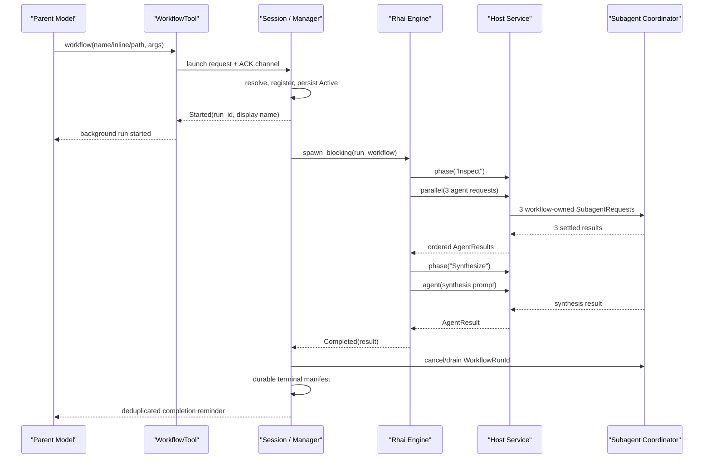

# Walkthrough：一次 Workflow 如何启动、编排并行 Agent、Journal 恢复并回传完成

> 场景：顶层模型调用 `workflow` 工具，选择一个已注册、内联或磁盘上的 Rhai 脚本。Session 立即返回一个后台 run，脚本在阻塞线程中执行，通过 Host Service 启动多个 Subagent；运行中可以进入阶段、并行等待、写 scratch artifact、暂停或耗尽 agent budget。结束前，系统必须收拢全部 child、持久化终态，再把完成提醒送回父模型。

本文基于 `SOURCE_REV` 记录的源码版本。它重点回答一个容易被术语掩盖的问题：Grok Build 的 Workflow 究竟是什么。

答案先说在前面：**当前实现不是声明式 DAG 调度器，而是一个受限、确定性的 Rhai 程序；顺序代码表达依赖，`parallel()` 表达一个并发屏障，Journal 通过重放相同程序恢复进度。**

---

## 1. 最终调用链

```text
Model emits workflow tool call
  -> WorkflowTool::run
     -> normalize + validate input
     -> require top-level session
     -> WorkflowLaunchHandle.send(request, ack)
        -> Session workflow launch receiver
           -> resolve name / inline / script_path / resume source
           -> optional validate_script_with_agent_budget
           -> WorkflowManager::launch
              -> register immutable script + args
              -> start WorkflowRunState and persist manifest
              -> spawn WorkflowHostService
              -> spawn_blocking(run_workflow)
                 -> compile restricted Rhai
                 -> execute script from the beginning
                 -> agent() / parallel() / scratch / phase / budget host calls
                 -> replay matching Journal entries or perform live calls
              -> watcher waits for engine outcome
              -> cancel and drain workflow-owned children
              -> persist terminal manifest with acknowledgement
              -> emit WorkflowUpdated
              -> enqueue WorkflowCompletionTurn
                 -> inject one deduplicated completion reminder
                 -> parent model continues with workflow result
```

这条链同时跨越三个 crate：

- `xai-grok-tools`：公开工具输入、输出和 launch channel；
- `xai-workflow`：Rhai engine、host protocol、Journal、metadata 和验证器；
- `xai-grok-shell`：registry、manager、host service、tracker、持久化、通知和 Session 回传。

## 2. 建议同时打开的源码

| 关注点 | 文件 | 关键符号 |
| --- | --- | --- |
| 工具协议 | `crates/codegen/xai-grok-tools/src/implementations/grok_build/workflow/mod.rs` | `WorkflowToolInput`、`WorkflowTool::run` |
| 脚本运行 | `crates/codegen/xai-workflow/src/engine.rs` | `run_workflow`、`register_host_fns` |
| Host 协议 | `crates/codegen/xai-workflow/src/host.rs` | `WorkflowHostRequest`、`AgentOpts` |
| 恢复日志 | `crates/codegen/xai-workflow/src/journal.rs` | `Journal::replay`、`Journal::record` |
| Metadata | `crates/codegen/xai-workflow/src/meta.rs` | `extract_meta` |
| Smoke check | `crates/codegen/xai-workflow/src/validate.rs` | `validate_script_with_agent_budget` |
| 生命周期 | `crates/codegen/xai-grok-shell/src/session/workflow/manager.rs` | `WorkflowManager::launch` |
| 子 Agent bridge | `crates/codegen/xai-grok-shell/src/session/workflow/host_service.rs` | `HostService::spawn_agent` |
| 可见状态 | `crates/codegen/xai-grok-shell/src/session/workflow/tracker.rs` | `WorkflowRunState` |
| 脚本发现 | `crates/codegen/xai-grok-shell/src/session/workflow/registry.rs` | `WorkflowRegistry` |
| 运行文件 | `crates/codegen/xai-grok-shell/src/session/workflow/store.rs` | `WorkflowRunStore` |
| UI 通知 | `crates/codegen/xai-grok-shell/src/session/workflow/notify.rs` | `WorkflowNotifySender` |

## 3. 先纠正：Workflow 不是一张声明式 DAG

源码没有 `Node`、`Edge`、topological sort 或 ready queue。脚本通过普通控制流决定顺序：

```rhai
let scan = agent("scan repository");
let reviews = parallel([
    #{ prompt: "review correctness" },
    #{ prompt: "review security" }
]);
complete(#{ scan: scan, reviews: reviews });
```

这里存在一个概念上的依赖图，但它由程序顺序隐式表达：

```text
scan -> parallel reviewer 1 --+
     -> parallel reviewer 2 --+-> complete
```

不要据此推断系统维护了一张可动态调度的 DAG。恢复时系统重新执行脚本，并用 Journal 跳过已完成 host call。

## 4. 为什么选择“确定性程序 + Journal”

这种模型允许脚本使用：

- `if`、循环、数组和 map；
- 根据前一个 Agent 的 JSON 结果决定下一阶段；
- 动态生成一个有界 `parallel()` panel；
- 在需要人工判断时 `await_user()`；
- 用普通变量聚合最终结果。

代价是恢复要求严格确定性：同样的 immutable script 和 args 必须再次产生相同的 host-call 序列和参数。

## 5. Tool Input 的三种新运行来源

`WorkflowToolInput` 允许三选一：

| 字段 | 含义 |
| --- | --- |
| `name` | 从 built-in、项目或用户 registry 按名称选择 |
| `script` | 直接传入内联 Rhai 源码 |
| `script_path` | 从受信任范围内读取 `.rhai` 文件 |

`normalize()` 先把纯空白字符串变成 `None`，随后 `validate()` 要求恰好一个来源。

## 6. Resume 是第四种互斥模式

`resume_from_run_id` 不是新的 script source。它表示继续原 run 的 immutable script 和 args，因此不能与 `name`、`script`、`script_path` 同时出现。

可以同时提供更高的 `agent_budget`，因为 budget-limited run 只有提高绝对上限后才能继续。

## 7. Agent budget 是调用次数，不是 Token budget

当前预算统计的是逻辑 child-agent call：

- 每次 `agent()` 消耗一个 slot；
- `parallel()` 的每个 item 消耗一个 slot；
- structured-output contract retry 不再额外消耗逻辑 slot；
- 默认值为 `128`；
- 可配置范围为 `1..=1024`。

`max_output_tokens` 仍在 `AgentOpts` 中，但 Host Service 明确记录它已 deprecated 且忽略。不要把 `agent_budget` 解释成 token 总额。

## 8. Workflow 只能由顶层 Session 发起

`WorkflowTool::run` 从 resources 读取 `SubagentDepthCounter`。只要 depth 大于零就返回 `workflow_depth_exceeded`。

这条规则不受普通 Subagent 最大深度配置影响。普通 child 和 workflow-spawned child 都不能再启动 Workflow，防止编排树递归扩张。

## 9. WorkflowTool 不直接拥有 Manager

工具只从 Session resources 获取 `WorkflowLaunchHandle`，发送：

```text
(WorkflowLaunchRequest, oneshot::Sender<WorkflowLaunchAck>)
```

因此工具层不直接依赖 Shell 的 registry、tracker 或 persistence。Session 才拥有真正生命周期。

## 10. Launch ACK 只确认“已启动”，不等待完成

`WorkflowLaunchAck` 有三类：

- `Started`：返回 run ID、display name 和 editable script path；
- `Validated`：smoke check 成功，但没有真正启动；
- `Rejected`：输入、解析、验证或 manager launch 失败。

工具返回 `Started` 后，Workflow 仍在后台运行。

## 11. task_id 是兼容别名，不是 Terminal Task

`WorkflowToolOutput.task_id` 当前等于 `run_id`，但 schema 明确说明 Workflow run 不是 `task_output` / `wait_tasks` 管理的 background task。

正确观察入口是 `/workflows` 和 Workflow 通知；完成会自动回传，不应拿 `task_id` 去轮询通用任务系统。

## 12. Display name 与 run_id 必须分开

run ID 使用类似 `wf_<uuidv7 simple>` 的稳定内部身份。用户侧名称来自 `meta.name`；同 Session 重复启动时，Tracker 依次生成：

```text
deep-research
deep-research-2
deep-research-3
```

管理命令应展示并接受 display name；持久化、Journal 和精确恢复使用 run ID。

## 13. Registry 的覆盖顺序

Registry 汇合 built-in、项目 `.grok/workflows/` 和用户 workflow 目录。合并时同名的高优先级 scope 会阻止后续 scope 加入。

同一个 scope 内出现重复 meta name 时不会随便选一个，而是标记重复并拒绝歧义解析。

## 14. 文件名也是定义契约的一部分

普通磁盘 Workflow 要求：

- 扩展名为 `.rhai`；
- stem 是合法 workflow name；
- stem 与 `meta.name` 一致。

例如 `review-code.rhai` 内必须声明 `name: "review-code"`。这让 registry 的名称、文件和 metadata 不会漂移。

## 15. script_path 受路径信任边界保护

`resolve_by_path()`：

- 拒绝 symlink 和非普通文件；
- canonicalize 后只允许项目、Grok 用户目录或当前 Session workflow runs；
- 项目路径还要求 folder trust；
- 源码大小上限为 1 MiB；
- Unix 打开时使用 `O_NOFOLLOW` 再次降低换链风险。

Workflow 脚本能启动有写权限的 Agent，因此它不是普通只读配置文件。

## 16. Metadata 必须是第一条语句

脚本开头必须是纯字面量形式：

```rhai
let meta = #{
    name: "review-code",
    description: "Review a change from several perspectives",
    phases: [
        #{ title: "Inspect" },
        #{ title: "Synthesize" }
    ]
};
```

前面可以有注释，但不能先执行别的语句。

## 17. 为什么 Metadata 不只靠正则读取

`extract_meta()` 先确认第一条 statement，再用受限 Rhai engine compile 整份脚本，并把 `meta` 转成 `WorkflowMeta`。

它同时限制 operations、表达式深度、module resolver，并禁用 `eval`。随后执行时 host functions 尚未注册，所以 metadata 必须能独立成为纯数据。

## 18. Metadata 的硬边界

当前公共常量包括：

| 项目 | 上限 |
| --- | ---: |
| workflow name | 64 bytes |
| description | 1,024 bytes |
| when_to_use | 2,048 bytes |
| phases | 64 |
| phase title | 128 bytes |
| phase detail | 1,024 bytes |

未知字段、空标题、重复 phase title 和非法 name 都会失败。

## 19. validate_only 是单路径 Smoke Check

`validate_only: true` 会：

1. 提取并验证 metadata；
2. compile 整份脚本；
3. 用传入 args 或 canned args 执行一次；
4. 用固定 stub 回答 Agent、template、scratch 和 git diff host call；
5. 接受 completed 或 paused outcome。

它不会启动真实 Agent，也不能证明未走到的 branch 正确。

## 20. Smoke Check 甚至可能错过哪类问题

如果脚本依据 `args.mode` 走不同路径，而 representative args 只选择 A，那么：

- A 路径的类型和 host 调用能被验证；
- B 路径虽然经过 compile，却未必经历运行时类型检查；
- 真实 Agent 输出形状、权限、模型可用性和文件环境都未验证。

因此 `Validated` 的消息刻意使用 “canned-host path”，不是“Workflow 已被完全证明”。

## 21. Manager 是运行生命周期所有者

`WorkflowManager` 持有：

- Session ID、cwd 和 Session directory；
- `WorkflowTracker` 与 `WorkflowRunStore`；
- ACP notification sender；
- Subagent event sender；
- Session command sender；
- template snapshot；
- active 和 retiring run map。

Engine 只执行脚本，不拥有 Session 生命周期。

## 22. 每个 Session 最多四个活跃或退场中的 run

`WORKFLOW_MAX_ACTIVE_RUNS_PER_SESSION = 4`。Manager 在 launch 前先 reap 已终止 run，然后同时计算：

```text
active.len + retiring.len
```

retiring 仍占 slot，因为它的 child drain 或 watcher 清理还未完成。

## 23. 新 run 先保存 immutable source

Manager 为新 run：

1. 生成 run ID；
2. `store.register()` 保存 script 与 args；
3. 创建 `journal.jsonl` 路径；
4. `tracker.start_run()` 创建 Active state；
5. 同步 `persist_now()` 保存初始 manifest；
6. 才启动 engine 和 host service。

这是 fail-before-spawn 边界：如果初始状态无法持久化，清理注册和 Tracker，不留下一个无法恢复的后台运行。

## 24. 一个 run 的磁盘布局

有持久化 Session 时，核心文件形如：

```text
<session>/workflows/<run_id>/
  args.json
  script.rhai
  scripts/0000.rhai
  state.json
  journal.jsonl
  scratch/
```

`script.rhai` 是可编辑 projection；恢复仍读取 Store 中原 run 的 immutable source，而不是悄悄执行用户后来编辑的内容。

## 25. 为什么同时保留 script.rhai 和版本副本

`scripts/0000.rhai` 是该 revision 的固定证据，`script.rhai` 方便用户查看和修改。若想采用修改，应把它作为 `script_path` 启动一个新 run。

同一 run 的 resume 不允许代码热替换，否则 Journal 的顺序和 request hash 失去含义。

## 26. Engine 为什么放进 spawn_blocking

Rhai 的 `eval_ast_with_scope` 是同步执行，host call 使用 `blocking_recv()` 等待异步 Host Service 回答。

如果直接在 Tokio worker 上执行，它会占住异步调度线程。Manager 用 `tokio::task::spawn_blocking` 把脚本解释和阻塞等待移到 blocking pool。

## 27. Engine 的受限运行环境

`run_workflow()` 设置：

- 默认最多 100,000,000 operations；
- call level 64；
-表达式深度 128/64；
- string 16 MiB；
- array 和 map 各 65,536 项；
- Dummy module resolver；
- 禁用 `eval`。

这些限制既控制资源，也缩小恢复时的不确定性。

## 28. timestamp、sleep 和 exit 为什么被禁用

- `timestamp()` 会让同样输入在 resume 时产生不同 host-call 参数；
- `sleep()` 会阻塞解释线程，且 host call 已经提供等待语义；
- `exit()` 无法表达明确终态，应使用 `complete()` 或 `pause()`。

Workflow 的脚本 API刻意偏向可重放的业务控制流。

## 29. args 是唯一显式脚本输入

Manager 把 JSON args 转成 Rhai Dynamic，作为全局 `args` 注入。恢复时要求传入值与原 `args.json` 完全相等。

需要时间戳、commit 或目标列表，应在首次 launch 时放进 args，而不是在脚本中读取不稳定的外部状态。

## 30. Host API 分成“有结果调用”和“只发事件”

有结果并进入 Journal 的调用包括：

- `agent()` / `parallel()` 中的 spawn；
- `await_user()` marker；
- `budget()`；
- `render_template()`；
- scratch read/write；
- `git_diff_since()`。

`phase()`、`log()` 和 `telemetry_event()` 走 `host_emit()`，不占 result-bearing sequence，但携带 `replayed` 标志。

## 31. Journal 的核心身份是 seq + kind + req_hash

每个有结果调用按脚本遇到的次序领取 `seq`。请求 hash 由：

```text
kind + NUL + canonical_json(payload)
```

经 SHA-256 计算并截取前 16 bytes 的 hex 表示。

JSON object key 会先排序，所以仅 key 顺序改变不会制造 divergence。

## 32. Resume 不是从某个程序计数器继续

恢复时 Rhai 程序仍从第一行执行。每次 host call：

1. 重新计算当前 seq、kind 和 request hash；
2. 若 Journal 已覆盖该 seq 且身份匹配，直接返回记录结果；
3. 若 Journal 尚未覆盖，才执行真实 host call；
4. 若覆盖但身份不同，立即报 replay divergence。

因此 Journal 相当于一条确定性外部效果历史，不是 VM snapshot。

## 33. Replay divergence 能发现什么

常见原因包括：

- resume 时脚本被修改；
- args 变化导致 branch 或 prompt 变化；
- 脚本调用 timestamp、随机数或不稳定迭代顺序；
- 相同 seq 从 `agent()` 变成 scratch read；
- prompt 拼接内容改变。

系统选择失败，而不是把旧结果错误套到新请求上。

## 34. Journal 是 dense append-only 序列

`Journal::record()` 要求新 entry 的 seq 等于当前 entries length。恢复读取也逐条检查 dense sequence。

这使任意缺口、乱序或重复记录都成为显式错误，而不会产生“部分重放、部分猜测”。

## 35. Torn tail 的恢复规则

读取 `journal.jsonl` 时：

- 尾部只有空白：截断；
- 最后一行是完整 JSON 但缺换行：补换行；
- 最后一行是破损 JSON：截断该 tail；
- 中间行 parse 失败：整体拒绝；
- sequence 不连续：拒绝。

只有可能由崩溃造成的最后一条不完整写入能被安全修复。

## 36. Journal 也有硬容量

当前上限：

- 64 MiB；
- 最多 `MAX_HOST_CALLS = 10,000` entries；
- 新 append 如果会超过 restore 上限，提前返回 `JournalError::Full`。

“写入时就拒绝”避免生成一个本次能跑完、下次却永远无法恢复的 run。

## 37. 单个 agent() 的同步语义

脚本调用 `agent()` 时：

1. 解析 prompt 和 option map；
2. 对 live call 预留一个 agent budget slot；
3. 发送 `SpawnAgent`；
4. blocking wait Host Service reply；
5. 把 `AgentResult` 写入 Journal；
6. 转回 Rhai Dynamic。

下一行脚本只有在这个 child 完成后才执行。

## 38. AgentOpts 能控制什么

包括：

- prompt、label、phase；
- model 与 agent type；
- capability mode；
- worktree isolation；
- fork context；
- resume child session；
- output schema。

Host Service 会再次验证长度、枚举值和受限能力，脚本传入 map 并不等于可以绕过 Session policy。

## 39. Workflow child 是特殊所有权的前台等待 Subagent

Host Service 构造的 `SubagentRequest` 关键字段是：

```text
run_in_background = false
surface_completion = false
await_to_completion = true
owner = SubagentOwner::workflow(run_id)
```

它对脚本是同步结果调用；对顶层用户却属于一个后台 Workflow。child 自己不单独向父模型发 completion，以免与 Workflow 聚合结果重复。

## 40. Workflow child 仍复用统一 Coordinator

Host Service 没有自行实现 Agent runtime，而是创建 `ChannelBackend`，把 `SubagentRequest` 送入共享 Subagent Coordinator。

因此模型解析、child Session、权限、usage、worktree 和取消仍复用上一篇 Walkthrough 的真实链路。

## 41. 并发上限与累计 budget 是两个维度

每个 run 的 Host Service 使用 `Semaphore`，默认最多同时运行 16 个 child。agent budget 则限制整个 run 累计逻辑调用数。

例如一个 40-item `parallel()`：

- 一次预留 40 个 budget slots；
- Host 收到 40 个 spawn 请求；
- 最多 16 个拿到 permit；
- 其余在 semaphore 排队；
- `parallel()` 等全部完成后才返回。

## 42. parallel() 是 barrier，不是 fire-and-forget

`parallel(items)` 先把每一项解析成 `AgentOpts`，再为每项分配连续 Journal seq，发送 live request，最后依输入次序收集全部 reply。

它返回数组之前，panel 中每一项都必须 settle。这就是并发屏障。

## 43. parallel() 的结果保持输入顺序

Child 实际完成顺序可能是 B、C、A，但 pending vector 按输入顺序构建，并按这个顺序 blocking receive、组装结果。

因此：

```text
results[i] 对应 items[i]
```

而不是“第 i 个完成的 child”。

## 44. 为什么 parallel() 要先整体预留 budget

系统在启动 panel 任何 live child 之前计算 `live_count`，一次性 reserve。

若剩余 budget 不够，整个 panel 在零启动状态下返回 `BudgetExceeded`。这避免只启动前半组 child 后才发现预算不足，破坏 barrier 的集合语义。

## 45. Replay 项不会重复计入 budget

`parallel()` 逐个查看对应 seq 是否已有 Journal entry，只计算未重放的 live items。

不过正常执行采用“整组 settle 后再顺序记录”的提交方式：若本次 panel 因 cancel 或 budget terminal 中断，本轮 live items 即使已有若干 child 完成，也不会作为部分成功 panel 提交。常规 resume 会重新执行这一组 live items；只有进入本次执行前就已经存在的匹配 entries 才直接 replay 且不重复收费。

## 46. parallel() 终态为什么要等所有 reply drain

即使某个 child 首先返回 cancellation 或 budget terminal，engine 仍收集 pending reply。否则函数提前 unwind 后，其他 child reply receiver 被 drop，Host/Coordinator 可能仍运行，run 生命周期却已进入下一状态。

“先 drain，再返回 terminal token”是保持 child ownership 收敛的关键。

## 47. Resumable terminal 不写成普通成功结果

budget 或 cancellation 发生在尚未稳定完成的 panel 时，engine 使用 terminal sentinel 协调本轮收集，但会释放预留，不把 panel 的部分结果提交成可误认的完整 Journal 成果。

恢复后同一逻辑 panel可以重新尝试缺少稳定记录的调用。

## 48. Host error sentinel 的作用

普通 `host_call()` 收到 `Unsupported` 或 `Failed` 时，会以 `__xai_workflow_host_error` sentinel 写入 Journal，然后在本轮抛 runtime error。

再次 resume 时相同 call 会重放相同错误，避免对一个非瞬时、已发生的 host failure无限重复副作用。

对于 manager 允许恢复的 `Failed` run，launch 会在错误详情匹配时裁掉最后一个 host-error entry，让该失败点获得一次真实重试机会。

`parallel()` 有自己的批量收敛规则：单项 `Unsupported`、`Failed` 或 agent-call quota error 会投影为 `null` soft failure，再与 panel 其他项一起记录；不要把单调用 sentinel 规则机械套到批量分支。

## 49. Structured output contract 的两层机制

若 `AgentOpts.output_schema` 存在，Host Service：

1. compile 本地 JSON Schema；
2. 在 prompt 中加入 output contract；
3. child 成功后提取并验证 JSON；
4. 不合格时 resume 刚完成的 child Session；
5. 要求只返回单个 JSON fenced block；
6. 当前额外 retry 次数为 1。

这不是 Provider 原生 schema guarantee，而是 prompt contract + 本地验证 + 一次修复。

## 50. Contract retry 不增加逻辑 agent budget

Engine 只为一次 `agent()` 或 panel item reserve 一个 slot；Host Service 内部 schema retry 使用新的 child request attempt，但属于同一个逻辑调用。

为防止 retry 滥用，Host 另有物理 `agent_runs` 上限：最大逻辑 budget乘以 `(retry + 1)`。

## 51. Retry 时 roster 会 rebind 到新 child

每个 contract retry 创建新 child ID，并让 `WorkflowAgentRow.agent_id` 指向新 ID。这样实时 transcript 或 UI 点击不会一直指向已经失败 schema 验证的旧 attempt。

tokens 和 duration 则在逻辑调用内累计，最终一次性写入 row。

## 52. fork_context 只允许 built-in Workflow

Manager 根据 `resolved.source == Builtin` 设置 `allow_fork_context`。项目、用户、内联和路径脚本即使写 `fork_context: true`，Host Service 也返回 Unsupported。

这是额外信任边界：继承父对话上下文不是普通自定义脚本默认拥有的能力。

## 53. resume_from 与 fork_context 互斥

如果 AgentOpts 指定 `resume_from`，Host 强制把 `fork_context` 设为 false。

前者继续一个已有 child Session，后者从父上下文构造新 child；同时要求两种来源会造成语义歧义。

## 54. phase() 改变展示状态，不建立调度依赖

`phase("Inspect")` 更新 `current_phase`、history 和 revision，并触发 WorkflowUpdated。

它不创建 barrier，也不检查下一 phase 是否满足依赖。真正的顺序仍由脚本执行位置决定。

## 55. Replay 时 phase 与 log 的行为不同

无结果事件收到 `replayed` 标记：

- replayed phase 可以发 ephemeral update，恢复 UI 当前阶段；
- replayed log 不再次写 history 或 info log；
- replayed telemetry 不再计入或上报脚本事件。

这避免恢复时把旧进度当成新活动重复广播。

## 56. budget() 返回的是当前调用额度状态

`BudgetState` 包含 total、spent、reserved、remaining。当前 Tracker 在 panel 启动前直接把预留计入 `agents_used`，公开状态中的 `reserved` 为零。

脚本可以根据 remaining 缩小后续 fan-out，但预算的最终强制仍在 Host reserve boundary。

## 57. await_user() 为什么既写 Journal 又暂停

首次遇到 `await_user(kind, message)`：

1. 为调用分配 seq；
2. 写入一个 null 结果 marker；
3. 返回对应 `Paused` outcome。

恢复后重新执行到同一 seq，看到 marker 就继续越过 await 点。若不先写 marker，每次 resume 都会在同一行再次暂停。

## 58. pause() 与 await_user() 的差异

`pause()` 直接终止本次执行，没有可越过的 Journal marker。若原样 resume，脚本重新执行到该位置仍可能再次 pause，除非 earlier replayed outputs 或 args-driven logic 改变控制流。

需要“一次暂停、恢复后继续下一行”的场景应使用 `await_user()`。

## 59. Scratch file 是 run-local artifact

脚本可写入和读取 `<run>/scratch/<name>`。Host 限制：

- 名称只能是一个相对 path component；
- 不允许 symlink；
- 最多 64 个文件；
- 单文件 10 MiB；
- 总量 64 MiB；
- 使用临时文件原子 persist。

返回给脚本的是 `scratch/<name>` artifact path，而不是任意宿主路径写能力。

## 60. Scratch I/O 为什么需要 Mutex

多个 Host request 可能并发处理 scratch read/write。`scratch_io` mutex 把配额扫描、symlink 检查和原子替换组织成同一串行边界，减少两个写入同时判断“配额还够”后共同超限的竞态。

## 61. git_diff_since() 的边界

它只接受纯 ASCII alphanumeric commit 字符串，执行：

```text
git diff <commit>
```

当前 timeout 为 20 秒，输出上限 256 KiB，并设置 pager 环境与 detached process 属性。它不是任意 shell escape。

## 62. Tracker 保存的是可展示、可恢复的投影

`WorkflowRunState` 记录：

- ID、display name、objective、revision；
- status、phases、current phase；
- agent budget 和 used；
- elapsed time；
- pause message、result summary；
- bounded history；
- bounded agent roster；
- Journal relative path。

它不是 Engine 的堆或 Rhai variable snapshot。

## 63. Revision 是通知去重的重要坐标

阶段、history、agent roster 和预算变化会推进 revision。Completion command 携带 `(run_id, revision)`，Session 在生成完成提醒前再次确认它仍是未报告的同一终态 revision。

旧 watcher 或重复 command 因此不能轻易覆盖 resume 后的新 execution epoch。

## 64. Workflow status 不是简单的 running/done

状态包括：

```text
Active
UserPaused / BackOffPaused / NoProgressPaused / InfraPaused / Blocked
BudgetLimited
Interrupted
Complete / Failed / Cancelled
```

其中 paused、budget-limited 和 failed 可在同进程中按规则恢复；Complete、Cancelled、Interrupted 不可恢复。

## 65. 为什么 Failed 可以恢复

Failed 可能来自一次 host failure。Manager 恢复前可根据 failure detail 裁掉匹配的 trailing host-error Journal entry，使脚本重放到该点后重新发真实请求。

这是一种严格受控的 retry，而不是忽略整个 Journal。

## 66. BudgetLimited 的恢复条件

若 run 已使用 `used` 个逻辑 slots，新 `agent_budget` 必须：

- 高于旧上限；
- 同时高于 `used`；
- 不超过全局最大 1,024。

提高的是 absolute cap，不是“再追加 N 个”。达到 1,024 后只能新建 run。

## 67. Same-process resume 的真实含义

工具说明明确限制同进程恢复。Session reload 时，`WorkflowTracker::from_snapshot()` 会把原来 Active 的 run改为 Interrupted，因为没有稳定 operation identity 可以证明旧 engine/child 是否仍存在。

因此磁盘 Journal 支持同一 Session 进程内 pause/resume 的 deterministic replay，也支持诊断；它不承诺进程崩溃后自动接着跑。

## 68. Restore 时 running agent row 会被修复

任何持久化为 `running` 的 roster row 在 restore 时都改为 `cancelled` 并推进 revision。

否则重启后的 UI 会永久显示一个已不存在的 live child。

## 69. User pause 是 cancel + drain + 可恢复状态

Manager pause：

1. 设置 `pause_intent`；
2. cancel engine token；
3. 按 WorkflowRunId 取消所有 owned children；
4. 把 run 从 active 移入 retiring；
5. Tracker 投影为 UserPaused；
6. watcher drain 完成后避免把 Cancelled outcome 覆盖成 Cancelled status。

pause 不是冻结线程栈，而是停止本次执行，稍后从头 replay。

## 70. Stop 与 Pause 的关键差异

Stop 同样需要 cancel engine 和 children，但目标终态是 Cancelled，不能 resume。Pause 则保留 immutable source、args、Journal 和已完成结果。

两者都必须等待 child ownership 收敛，区别不只是 UI 按钮文案。

## 71. Engine 退出后还不能立即发布终态

Watcher 先得到 `WorkflowOutcome`，随后：

1. 如果 Host Service 未结束，cancel run token；
2. 最多等待 25 秒接收 host drain acknowledgement；
3. Host Service 自身最多等待 20 秒让 Coordinator 取消并 drain children；
4. 必要时 abort Host task；
5. drain 失败则把 run 标成 Interrupted/Failed，不假装干净完成。

终态可见性晚于脚本函数返回。

## 72. 为什么按 WorkflowRunId 取消 child

Workflow child 以及由它产生的嵌套 child 会保留 workflow lineage。取消请求以 run ID 为 scope，可以一次命中整个 owned subtree，而不是只取消 Host 当前知道的直接 child IDs。

这也是 Workflow ownership 与普通 parent-session cancellation 分离的原因。

## 73. Terminal manifest 使用 acknowledged persistence

普通进度更新可以排队 best-effort；终态 watcher 调用 `persist_ack()`，等待 Persistence Actor 确认 `state.json` 已写。

若终态无法 durably persist：

- outcome 改成 Failed；
- Tracker 改为 Interrupted；
- 再尝试持久化 interruption marker；
- 两次都失败时，不发送可能误导模型的正常完成 turn。

## 74. Notification 的 durable 与 ephemeral 分层

`emit()`：保存 manifest，并把 WorkflowUpdated 加入可重放 Session updates。

`emit_ephemeral()`：仍保存最新 manifest，但 live 通知不写入 Session update history，适合高频 agent tick 和 replayed phase。

`broadcast(..., persist_update=true)` 用于最终状态，使重连客户端能看到终态事件。

## 75. UI phase 状态是推导值

通知层根据 `current_phase` 在 metadata phases 中的位置推导：

- 之前的 phase：done；
- 当前：active；
- 后续：pending；
- run complete 时当前也变 done。

如果脚本传入 metadata 未声明的 phase，Tracker 可以记录 current phase，但列表无法把它对应到声明顺序。

## 76. Active agent 数从 roster 重新计算

通知构建忽略传入的 `_active_agents` 参数，直接统计 roster 中 `state == "running"` 的 rows。

这让对外投影以 Tracker 持久状态为准，而不是依赖一个可能与 revision 不同步的瞬时原子计数。

## 77. 完成提醒不是 child completion 的简单转发

只有 terminal manifest durably 写入后，Manager 才发送：

```text
SessionCommand::WorkflowCompletionTurn { run_id, revision }
```

Session 侧再通过 Tracker 的 `is_unreported_completion` 和 reported set 去重，格式化聚合后的 result、失败或 resume 指引。

## 78. 为什么 BudgetLimited 也算 completion-reportable

它不是不可逆 terminal，但本次后台执行已经停止，父模型必须知道：

- 已完成工作仍保留；
- run ID 可用于 resume；
- 新 absolute budget 必须高于 used；
- 达到全局最大时只能开新 run。

因此它会触发一次完成 turn，同时保持 resumable status。

## 79. Restored completion 与 fresh completion 分组

Tracker 的 `take_unreported_terminal_runs()` 返回：

- restore 时已经终止、尚未报告的 runs；
- 当前进程中新终止的 runs。

两组都在取出时标记 reported，避免 Session idle、下一 turn 和显式 completion command 重复注入同一个提醒。

## 80. Result summary 为什么有 16 KiB cap

Completed JSON 会优先识别 `{ report, path }`，否则序列化为文本；最终 summary 截断到 16 KiB。

完整大报告应写到 scratch artifact 并在结果中返回 path，而不是把所有内容塞进 Session reminder。

## 81. 一条两阶段 Workflow 的时间线



## 82. 正常路径状态表

| 时刻 | Engine | Tracker | Journal | Parent Model |
| --- | --- | --- | --- | --- |
| launch ACK | scheduled | Active | empty | 得到 run handle |
| phase 1 | executing | current phase 更新 | host results append | 不被 child 单独唤醒 |
| parallel | blocking at barrier | 多个 roster running | 尚未完整提交 panel | 可从 `/workflows` 查看 |
| phase 2 | executing | phase/rows 更新 | 重放或继续 append | 原 turn 可做其他事 |
| script complete | returned outcome | 尚待 lifecycle settle | dense | 尚未宣布完成 |
| child drain + persist | stopped | Complete | stable | 收到一次 completion reminder |

## 83. Pause/Resume 状态表

| 动作 | Script stack | 已完成 Journal | 未完成 child | 下一次执行 |
| --- | --- | --- | --- | --- |
| pause | 丢弃 | 保留 | cancel + drain | 从第一行开始 |
| replay call | 重建 | 返回旧结果 | 不重启 | 继续下一行 |
| first live gap | 重建 | append 新结果 | 真实启动 | 继续推进 |
| divergence | 终止 | 不篡改 | 清理 | Failed |

## 84. 常见误解

### 误解 1：Workflow 是 DAG executor

不是。依赖由 Rhai 控制流表达，`parallel()` 是 barrier。

### 误解 2：Workflow task_id 可以交给 task_output

不可以。它只是 run ID 的兼容别名。

### 误解 3：pause 会冻结并恢复原线程栈

不会。恢复从第一行 replay。

### 误解 4：修改 script.rhai 后 resume 会采用新代码

不会。同 run 使用 immutable source；修改后应启动新 run。

### 误解 5：agent_budget 是 token 上限

不是。它是逻辑 agent calls 的累计上限。

### 误解 6：parallel(100) 会同时运行 100 个 child

不会。panel 最多 1,024 项，但默认 live concurrency 是 16。

### 误解 7：validate_only 证明所有 branch 都正确

不会。它只执行 representative args 选中的 canned-host path。

### 误解 8：phase() 建立阶段依赖

不会。它主要更新状态和 UI。

### 误解 9：脚本 complete 后可以立刻通知模型

不可以。必须先 drain children 并持久化终态。

### 误解 10：进程重启后 Active Workflow 会自动续跑

不会。当前恢复把它标为 Interrupted。

## 85. 调试：工具说 Started，但看不到运行

按顺序检查：

1. Tool output 中 run ID 和 display name 是否存在；
2. `/workflows` 是否使用 display name 展示；
3. `state.json` 是否已创建且为 Active；
4. launch ACK 后 engine task 是否 panic；
5. WorkflowUpdated 是否因 gateway 问题未显示；
6. 是否很快完成并已进入 terminal reminder。

## 86. 调试：parallel() 看起来没有并发

检查：

- 是否误用了多个顺序 `agent()`；
- panel 是否只有一项；
- per-run semaphore 是否被测试配置降为 1；
- Session 全局 Subagent capacity 是否更低；
- 前面的 workflow runs 是否共享其他全局资源；
- child 是否在 Coordinator Pending，而不是 Host 内排队。

## 87. 调试：Resume 报 divergence

比对 Journal 当前 seq 的：

- `kind`；
- `req_hash`；
- 原 immutable script revision；
- args.json；
- prompt/template 拼接；
- branch 条件和数组迭代顺序。

不要通过删除中间 Journal 行“修复”，dense sequence 和后续结果都会失去对应关系。

## 88. 调试：BudgetLimited 无法恢复

确认：

- `agents_used`；
- 原 `agent_budget`；
- 新 cap 是否真正更高；
- 新 cap 是否高于 used；
- 是否已经到 1,024；
- 是否把“追加 64”误传成绝对值 64。

## 89. 调试：Workflow 完成后父模型没收到消息

检查：

1. state 是否 completion-reportable；
2. terminal `persist_ack()` 是否成功；
3. host drain 是否超时并改为 Interrupted；
4. `WorkflowCompletionTurn` 是否带当前 revision；
5. reported set 是否已经消费；
6. Session 是否在 cancellation suppression 或 goal loop 的特殊边界；
7. completion reminder 是否会在下一安全 turn 注入。

## 90. 修改 Engine 时必须守住的不变量

1. 同一 immutable script + args 必须产生稳定 host-call 序列。
2. 每个 result-bearing call 必须有唯一连续 seq。
3. Replay 必须同时核对 kind 与 canonical request hash。
4. 未完整 settle 的 parallel panel 不能伪装成完整结果。
5. Cancel/budget 的 resumable gap 不能被错误 journal 成成功。
6. 外部副作用不能绕过 Host protocol 随意执行。
7. 所有资源上限都必须在执行或 append 前检查。

## 91. 修改 Manager 时必须守住的不变量

1. 初始 durable state 建立后才能启动后台执行。
2. 同一 run 的 script 和 args 在 resume 中不可变。
3. old execution epoch 不能覆盖 resumed run。
4. Engine outcome 不是可发布终态，child drain 才是生命周期屏障。
5. Terminal reminder 只能发生在 durable terminal manifest 之后。
6. Active、retiring 和 restored ghost 必须有明确状态。
7. Pause 与 cancel 不能被压成同一恢复语义。

## 92. 修改 Host Service 时必须守住的不变量

1. logical budget 与 physical attempt quota 分开。
2. panel reserve 必须先于任何 child spawn。
3. semaphore permit 覆盖 child 的真实活跃期。
4. child owner 必须携带 WorkflowRunId lineage。
5. structured retry 的 tokens/duration 要累计且 roster 要 rebind。
6. 所有取消路径必须 finish roster row。
7. scratch path、大小、数量和 symlink 防护不能只在 API 表层校验。

## 93. 推荐实验

### 实验一：顺序依赖

写两个 `agent()`，让第二个 prompt 引用第一个 output，观察 Journal 两条 seq 和严格顺序。

### 实验二：并发屏障

用 20-item panel，观察同时 running 最多 16，返回数组仍保持输入次序。

### 实验三：整体 budget 拒绝

剩余 2 个 slots 时调用 3-item panel，验证没有任何一个 child 启动。

### 实验四：await_user 恢复

在两个 agent calls 之间加入 `await_user`，验证 resume 后前一个结果 replay、await 点越过、后一个首次执行。

### 实验五：脚本漂移

暂停后修改 editable projection，再用原 run resume，确认仍使用 immutable source；把修改版作为新 script_path 则产生新 run。

### 实验六：request divergence

在测试中用同 Journal 重跑但改变 args，确认匹配位置报告 divergence。

### 实验七：contract retry

让第一次输出不符合 schema，第二次符合，确认只消耗一个 logical slot、row ID rebind、usage 累计。

### 实验八：完成去重

重复投递相同 `(run_id, revision)` completion command，确认只注入一次提醒。

## 94. 推荐定向测试

```sh
cargo test -p xai-workflow
cargo test -p xai-grok-tools --lib implementations::grok_build::workflow::tests
cargo test -p xai-grok-shell --lib session::workflow
cargo test -p xai-grok-shell --lib run_match_tests
```

第一组验证 Engine、Journal、metadata 和 smoke check；第二组验证公开工具输入；第三、四组验证 Shell 生命周期、Host、Tracker、Store、Registry 和管理选择器。

## 95. 本文编写时的实际验证

已执行：

```text
cargo test -p xai-workflow
  59 passed, 0 failed

cargo test -p xai-grok-tools --lib implementations::grok_build::workflow::tests
  1 passed, 0 failed
```

Shell 定向命令：

```text
cargo test -p xai-grok-shell --lib session::workflow
```

在测试收集前被仓库已有、与 Workflow 无关的 test-module 编译错误阻断：

```text
crates/codegen/xai-grok-shell/src/session/acp_session_tests/
  tool_layer_images_bridge_tests.rs:15

E0599: STANDARD.encode(buf)
help: import trait base64::Engine
```

因此本文可以声明 `xai-workflow` Engine/Journal/metadata/validator 和公开工具输入测试通过；不能把 Shell Workflow tests 描述为已运行通过。文档链接、98→99 节编号连续性、尾随空白与 `git diff --check` 另行通过静态检查。

## 96. 自测题

1. 为什么说当前 Workflow 不是声明式 DAG？
2. `parallel()` 的 barrier 体现在哪段数据流中？
3. 为什么 panel 要一次性 reserve live items？
4. concurrency 16 与 agent budget 128 分别限制什么？
5. Resume 为什么从第一行运行却不会重复启动已完成 Agent？
6. request hash 为什么先 canonicalize JSON？
7. 为什么 `timestamp()` 会破坏恢复？
8. `pause()` 与 `await_user()` 的恢复行为为何不同？
9. 为什么同 run 不能采用编辑后的 `script.rhai`？
10. Contract retry 为什么不多收一个 logical slot？
11. 为什么 Workflow child 不 surface 自己的 completion？
12. Engine 返回 Completed 后还需要哪两个关键屏障？
13. `BudgetLimited` 为什么既可恢复又会触发完成提醒？
14. 为什么 restore 后 Active 要变 Interrupted？
15. `revision` 与 `execution_epoch` 分别防哪类 stale update？

## 97. 本篇术语表

| 名词 | 白话解释 | 本篇中的精确含义 |
| --- | --- | --- |
| Workflow | 按程序组织多个工作步骤 | 一个受限 Rhai 脚本及其 Session-owned run |
| Rhai | 可嵌入 Rust 的脚本语言 | Workflow Engine 执行控制流的语言 |
| DAG | 有方向且无环的依赖图 | 当前实现没有显式 DAG 数据结构，只能用它画概念依赖 |
| declarative | 描述“要什么”，由系统决定如何调度 | 当前 Workflow 不是这种 node/edge 声明模型 |
| imperative | 用语句说明“按什么顺序做” | Rhai 的 if、loop、agent、parallel 控制流程 |
| host call | 脚本向宿主请求外部能力 | SpawnAgent、scratch、budget、git diff 等请求 |
| Host Service | 接收脚本请求并接入真实 Session 能力的服务 | Shell 中 `HostService` |
| Journal | 按序记录外部调用请求身份与结果的日志 | `journal.jsonl`，用于 deterministic replay |
| replay | 从头重跑程序但复用已记录结果 | 不重新执行匹配 Journal entry 的 host call |
| deterministic | 相同输入产生相同外部调用序列 | Resume 可安全匹配 seq/kind/hash 的前提 |
| divergence | 当前重放请求与旧记录不一致 | seq 覆盖但 kind 或 request hash 不匹配 |
| seq | 外部结果调用的顺序号 | 从 0 开始的 dense Journal index |
| request hash | 请求内容的稳定指纹 | kind 与 canonical JSON 经 SHA-256 截断所得 |
| canonical JSON | 对象 key 顺序标准化后的 JSON | 防止等价 map 因 key 顺序不同产生 hash 漂移 |
| barrier | 所有并行成员结束后才能越过的同步点 | `parallel()` 返回前等待整个 panel settle |
| panel | 一批同时提交的 Agent 工作项 | `parallel(items)` 的 items 集合 |
| logical call | 用户脚本层看到的一次 Agent 调用 | 一次 agent() 或一个 parallel item |
| physical attempt | 为完成逻辑调用而真实启动的一次 child | schema retry 会增加 attempt 但不增加 logical call |
| agent budget | 一个 run 累计可用的 logical calls 上限 | 默认 128，最大 1,024 |
| concurrency | 同一时刻可活跃的工作数量 | 每 run 默认最多 16 个 child |
| reserve | 在启动前一次性占用预算 | panel 先整体 reserve，失败则零 child 启动 |
| smoke check | 快速走通一条代表路径 | `validate_only` 的 canned-host execution |
| immutable source | run 创建后不再改变的脚本和 args | Resume 的权威输入 |
| projection | 为查看或编辑生成的外部副本 | `script.rhai`，修改不改变原 run |
| run ID | 一次运行的稳定内部身份 | `wf_<uuid>`，用于持久化和恢复 |
| display name | 给用户看的 Session 内唯一名称 | `review-code-2` 等 |
| Tracker | 管理用户可见 Workflow 状态的内存组件 | 保存 status、revision、phase、roster 等 |
| manifest | 一个 run 的持久化状态快照 | `state.json` 的 versioned `WorkflowRunManifest` |
| roster | Workflow child 的状态列表 | `WorkflowAgentRow` 集合 |
| revision | 状态投影每次变化后的版本 | 通知和完成命令的去重坐标 |
| execution epoch | 同 run 每次 resume 的执行世代 | 防止旧 watcher 覆盖新 execution |
| completion-reportable | 本轮停止且应告诉父模型 | terminal status 加 BudgetLimited |
| retiring | 已退出 active 但仍在清理的 run | child drain/watcher 完成前仍占并发 slot |
| drain | 等待 owned child 全部收敛 | 发布 Workflow 终态前的生命周期屏障 |
| durable | 写入已获得明确持久化确认 | terminal manifest 使用 acknowledged persistence |
| ephemeral update | 只发给当前客户端、不进入 replay timeline | 高频 agent tick 或 replayed phase 更新 |
| output contract | Child 最终输出必须满足的 JSON 结构 | prompt 约束加本地 JSON Schema 验证 |
| rebind | 把一个逻辑 roster row 指向新 child ID | structured retry 后保持 UI 指向当前 attempt |
| scratch artifact | run 私有的中间文件 | 受配额和路径限制的 `scratch/<name>` |
| tombstone | 标记对象已清除的小型持久记录 | 防止 restore 又加载已 clear 的 run |

## 98. 源码证据索引

- 工具输入、互斥来源、budget 和 top-level gate：`xai-grok-tools/.../workflow/mod.rs`
- Engine 限额、禁用 API、host functions 和 ControlToken：`xai-workflow/src/engine.rs`
- Agent option、result、budget 和 Host request enum：`xai-workflow/src/host.rs`
- Journal dense sequence、bounded restore、hash 和 divergence：`xai-workflow/src/journal.rs`
- Metadata 结构和第一语句规则：`xai-workflow/src/meta.rs`
- 单路径 canned-host smoke check：`xai-workflow/src/validate.rs`
- Registry scope、路径信任和文件名契约：`xai-grok-shell/.../workflow/registry.rs`
- run 创建、resume、watcher、drain 和 terminal ACK：`xai-grok-shell/.../workflow/manager.rs`
- Subagent bridge、semaphore、schema retry 和 scratch：`xai-grok-shell/.../workflow/host_service.rs`
- status、revision、roster、restore 修复和完成去重：`xai-grok-shell/.../workflow/tracker.rs`
- manifest、immutable source 和磁盘布局：`xai-grok-shell/.../workflow/store.rs`
- durable/ephemeral WorkflowUpdated：`xai-grok-shell/.../workflow/notify.rs`
- `/workflow pause|resume|stop|save`：`xai-grok-shell/src/session/acp_session_impl/workflow.rs`
- 完成提醒聚合：`xai-grok-shell/src/session/acp_session_impl/reminders.rs`

相关背景文章：

- [Subagent Task 如何验证、创建 Child Session、完成并回传](14-subagent-task-validate-coordinate-child-session-complete-cancel.md)
- [Subagent 调度、父子状态继承与后台任务协调](../03-subsystems/08-subagent-coordinator-inheritance-and-background-tasks.md)
- [并发模型、Actor、Channel 与取消传播](../03-subsystems/15-concurrency-actors-channels-cancellation-and-shutdown.md)
- [会话持久化：落盘、恢复、重放与故障边界](../02-runtime-flows/11-persistence.md)

## 99. 一句话复盘

Grok Build 的 Workflow 以顶层 Session 为生命周期所有者，把受信任来源解析出的 immutable Rhai script 与 args 注册成后台 run，在 blocking engine 中用顺序程序表达依赖、用 `parallel()` 建立有界并发 barrier，并把每个有结果 host call 记录为可校验的 dense Journal；恢复不是续接线程栈，而是从第一行 deterministic replay，已匹配结果直接复用、首个 live gap 才重新执行，预算在 panel 启动前整体预留，真实 child 通过统一 Subagent Coordinator 按 WorkflowRunId 归属，pause、cancel、schema retry、scratch 和错误各有独立边界，最终只有在所有 owned children drain 且 terminal manifest 获得持久化确认后，Session 才按 revision 去重并把聚合结果回传给父模型。
