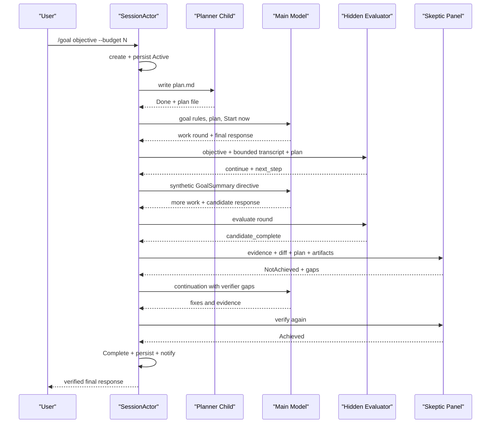

# Walkthrough：一次 Goal 如何创建、规划、跨 Turn 续跑并完成或阻塞

> 场景：用户输入 `/goal 修复并验证当前项目的登录竞态 --budget 120000`。Session 创建一个持久 Goal，捕获 token 与 Git 基线，可能先启动 Planner Subagent 写出计划，然后让主模型工作。每个模型 round 结束后，系统不是直接相信“完成了”，而是用隐藏 Evaluator 判断继续、候选完成或阻塞；候选完成还需经过 adversarial skeptic panel。只要 Goal 仍为 Active，系统就注入下一步 directive 继续采样，直到验证通过、预算耗尽、连续失败退避或确实需要用户介入。

本文基于 `SOURCE_REV` 记录的源码版本。Goal 子系统变化较快，阅读未来版本时应优先核对本文列出的类型和函数，而不是依赖行号。

---

## 1. 最终调用链

```text
User: /goal <objective> [--budget N]
  -> slash command parser
  -> SessionActor::setup_goal
     -> capture session token baseline
     -> capture Git HEAD baseline
     -> GoalTracker::create_goal
     -> persist + emit GoalUpdated
     -> maybe_run_goal_planner
        -> Planner Subagent writes goal/plan.md
        -> capture immutable plan.baseline.md
     -> inject goal rules + "Start now"
  -> normal agentic turn
     -> model reads/edits/runs tools/spawns tasks
     -> model produces a round-final response
     -> run_goal_round_end
        -> hidden GoalEvaluator
           -> Continue
           -> CandidateComplete -> skeptic verification panel
           -> Blocked -> require repeated stable blocker evidence
        -> if Goal remains Active
           -> build continuation directive
           -> inject synthetic GoalSummary user item
           -> run another model round in the same prompt task
        -> otherwise end turn
  -> outer completion handler
     -> persist/replay notifications
     -> optional between-turn continuation fallback
     -> pause, budget-limit or complete
```

旧兼容路径把 `update_goal(completed: true)` 在 turn-end drain 后交给 verifier；新版 round-end 路径由隐藏 Evaluator 主动触发验证。两者共享 Tracker、Verifier、预算、通知和大部分恢复语义。

## 2. 建议同时打开的源码

| 关注点 | 文件 | 关键符号 |
| --- | --- | --- |
| Goal 状态机 | `crates/codegen/xai-grok-shell/src/session/goal_tracker.rs` | `GoalTracker`、`GoalOrchestration` |
| Session 编排 | `crates/codegen/xai-grok-shell/src/session/acp_session_impl/goal.rs` | `setup_goal`、`run_goal_round_end` |
| 辅助逻辑 | `.../acp_session_impl/goal_support.rs` | planner、token、directive helpers |
| Turn 内循环 | `.../acp_session_impl/turn.rs` | `handle_prompt` 的 round loop |
| Turn 后处理 | `.../acp_session_impl/run_loop.rs` | completion arm |
| Goal 更新工具 | `xai-grok-tools/.../update_goal/mod.rs` | `UpdateGoalTool`、`UpdateGoalAck` |
| Planner | `xai-grok-shell/src/session/goal_planner.rs` | `run_goal_planner` |
| Evaluator | `xai-grok-shell/src/session/goal_evaluator.rs` | `GoalEvaluatorDecision` |
| Verifier | `xai-grok-shell/src/session/goal_classifier.rs` | `run_verification_stage` |
| Strategist | `xai-grok-shell/src/session/goal_strategist.rs` | `run_goal_strategist` |
| 下一步提取 | `xai-grok-shell/src/session/goal_next_step.rs` | `first_unchecked_plan_item` |
| 提前停止检测 | `xai-grok-shell/src/session/goal_stop_detector.rs` | `matched_stop_pattern` |
| 通知投影 | `xai-grok-shell/src/session/goal_orchestrator.rs` | `GoalNotifySender` |

## 3. 先区分五个经常混淆的概念

| 概念 | 谁拥有 | 是否跨 round | 核心用途 |
| --- | --- | --- | --- |
| Goal | Session + `GoalTracker` | 是 | 持续追求一个终态目标 |
| Plan/Todo | Chat/Plan 工具或 plan file | 是 | 记录工作拆分和下一步 |
| Prompt Queue | Session Actor | 是 | 排列真实或 synthetic prompt |
| Workflow | `WorkflowManager` + Rhai engine | 独立后台 run | 编排多个 child Agent |
| Background Task | Terminal/Subagent Coordinator | 独立任务 | 执行并稍后报告一个工作单元 |

Goal 是最外层的“继续工作约束”。它可以使用 Plan、Task 和 Workflow，但不等于其中任何一个。

## 4. Goal 的产品入口是 `/goal`

当前仓库中创建路径由 slash command 进入 `SessionActor::setup_goal()`，再调用纯状态机的 `GoalTracker::create_goal()`。

不要把状态机方法名误认为模型可直接调用的 `create_goal` 工具。模型侧公开的是 `update_goal`；创建、pause、resume、clear 主要由用户 slash command 驱动。

## 5. setup_goal 的六个初始化输入

创建时收集：

- UUID goal ID；
- objective 文本；
- optional token budget；
- 当前 Session token total 作为 baseline；
- RFC3339 created time；
- `git rev-parse HEAD` 的 best-effort baseline commit。

这些值分别支撑身份、继续指令、预算、计费、历史和变更验证。

## 6. Goal ID 与 Objective 的职责不同

Goal ID 是内部稳定身份，用于 token records、状态关联和 artifact ownership。Objective 是模型和 verifier 持续读取的语义约束。

重新创建 Goal 会生成新 ID；即使 objective 文本相同，也不能把旧 child token 或 skeptic 状态算进新 Goal。

## 7. GoalStatus 与 GoalPhase 是两条轴

`GoalStatus` 表示生命周期：

```text
Active
UserPaused
BackOffPaused
NoProgressPaused
InfraPaused
Blocked
BudgetLimited
Complete
```

`GoalPhase` 只表示当前工作展示阶段：`Idle / Planning / Executing`。

一个 paused Goal 的 phase 会收敛为 Idle；不要用 phase 代替 status 判断能否自动续跑。

## 8. 未知持久化 Status 为什么恢复为 UserPaused

自定义 Deserialize 遇到未知 wire value 时返回 `UserPaused`，而不是 Active。

这是 fail-safe 升级策略：旧程序不理解新状态时可以让用户检查和 resume，但绝不能自动复活一个语义未知的 autonomous loop。

## 9. create_goal 会替换旧 orchestration

新的 Goal 不是在旧状态上覆盖 objective 字段。Tracker 在替换前：

1. 抢救已经对用户公开的 verifier details；
2. 删除旧 Goal 私有 scratch root；
3. 创建新 verifier ID；
4. 初始化所有计数器、模型分配和临时字段；
5. 记录 `GoalCreated` history。

旧 Goal 的 classifier streak、plan baseline 和 resumed skeptic 不能泄漏到新 Goal。

## 10. Goal scratch 与 Session directory 分离

每个 Goal 使用 opaque `verifier_id` 建立私有 scratch root，并提前创建 implementer 目录；skeptic 目录按需创建。

`scratch_dir_ready` 是 transient truth：只有目录经过验证且真实创建成功，prompt 才能声称它存在。创建失败会降级，不阻止 Goal 建立。

## 11. Git baseline 是验证证据，不是回滚点

`capture_git_baseline()` 尝试记录 Goal 创建时的 HEAD。Verifier 后续基于它生成 changes diff。

它不会自动 checkpoint 或恢复文件；Goal 完成验证与 Rewind 的 Git 恢复是不同子系统。

## 12. Goal 创建后先发 GoalUpdated

Tracker 建立后，Session 立即计算 token 投影并调用 `GoalNotifySender::emit_goal_updated()`：

- account elapsed；
- 把完整 `GoalOrchestration` 发给 Persistence Actor；
- 构造 UI `GoalUpdated`；
- 写入可重放 Session update；
- fire-and-forget 发给当前客户端。

Planner 尚未完成时，用户也能看到 Goal 已建立。

## 13. Planner 是可选的内部 Subagent

`maybe_run_goal_planner()` 只在以下条件成立时运行：

- planner feature 开启；
- Session 有 Subagent Coordinator channel；
- 当前 Goal 尚无 `plan_file`。

已有 plan 时 resume 不重复规划。

## 14. Planner 为什么 fail closed

Planner 必须实际写出非空 `goal/plan.md`。以下情况都会返回 `FailClosed` 并在调用侧暂停 Goal：

- 无法创建 plan parent；
- transport failure；
- child runtime error 或取消；
- plan file 缺失或为空。

“规划失败仍让 autonomous agent 盲跑”会破坏后续 next-step 和 verifier 契约，所以这里宁可暂停。

## 15. Planner 的最终消息不是权威成果

Planner prompt 要求 child 写文件，terminal response 只接受精确 `Done`，但 runner 的最终 gate 是 plan file 是否存在且非空。

即使 child 文本说“完成”，没有文件仍失败；即使 terminal token格式异常，只要可信 plan file 已落盘，核心产物仍存在。

## 16. Planner 为什么 fork_context

Planner request：

```text
run_in_background = false
surface_completion = false
fork_context = true
```

它是 harness-internal mirror child，需要看到父上下文，又不能独立唤醒父模型。Session 等其结果，再继续 setup。

## 17. Planner 被强制使用父模型

当前 setup 路径为了 verbatim fork 与 prompt-cache prefix 复用，忽略显式 planner role model，使用 parent Session model。

配置中虽然存在 goal role model机制，但 Planner 这条特定镜像路径有意固定到父模型；Strategist 和 skeptics 仍可走 role resolution。

## 18. Planner 写出的原始计划会被冻结

成功后系统记录 `plan_file`，并复制一份 immutable `plan.baseline.md`。

主模型之后可以更新当前 plan；Verifier 比较 baseline 与 current plan，观察模型是否修改了范围、验收条件或任务清单。

## 19. 初始 Goal reminder 包含什么

`setup_goal()` 根据新旧运行模式渲染规则，至少包含：

- objective；
- Goal tool、Task tool、Todo tool 的真实注册名称；
- plan path；
- implementer scratch path 与可信存在标记；
- 完成、阻塞和验证纪律；
- `Start now.`。

它作为 `<system-reminder>` 前缀进入首次工作 round。

## 20. Tool 名称不能硬编码

Session 从 ToolBridge 按 `ToolKind` 解析：

- GoalUpdate；
- Task；
- Plan/Todo；
- Read/List/Search/Write/Edit/Execute 等角色工具。

因此 prompt 能适配工具重命名、不同 harness 或 capability subset。

## 21. Goal 的“跨 Turn”包含两种循环

源码同时存在：

1. **同一个 prompt task 内的 round loop**：round end 后注入 synthetic GoalSummary，立即再次 sampling；
2. **外层 Session turn 完成后的 queue fallback**：若 Goal 仍 Active，向 pending inputs 排入 GoalSummary。

第一种减少客户端往返；第二种覆盖 turn 已经从运行任务退出后的续跑边界。

## 22. 一个 Goal round 仍是普通 Agentic Turn

每一 round 都调用 `process_conversation_turn_with_recovery()`：

- 构建模型请求；
- 流式接收回答；
- 执行 Tool Calls；
- 把 Tool Results 放回 conversation；
- 直到模型不再发工具。

Goal 没有替换 sampling loop，而是在 round 终止边界加了一层继续与验证控制。

## 23. GoalLoopActive 是工具层提示

每轮开始前，Session 把 Goal 是否 Active 写入共享 resources 的 `GoalLoopActive`。

Background task 和 Subagent completion reminder 据此抑制自己的自动唤醒，因为 Goal harness 已负责继续模型。否则多个 child 完成可能与 GoalSummary 竞争，制造重复 round。

## 24. Goal turn 产生的 Task 会被标记来源

Session 记录本轮模型启动或从 child reparent 回来的 task IDs。通知 drain 对这些 goal-turn-origin completions 进行特殊去重和丢弃。

Goal 结束后也不能让迟到的内部 child completion 突然启动一个普通 post-goal turn。

## 25. 新版 round end 先运行隐藏 Evaluator

`run_goal_round_end()` 调用 `evaluate_goal_round()`。Evaluator 不使用主模型最后一句自报的布尔值，而是读取：

- objective；
- bounded recent transcript；
- optional plan 文本；
-严格 JSON schema。

它输出 `Continue / CandidateComplete / Blocked`。

## 26. Evaluator 与 Verifier 不是同一个角色

| 角色 | 成本与时机 | 任务 |
| --- | --- | --- |
| Evaluator | 每个 Goal round 结束 | 判断是否值得继续、送验或阻塞 |
| Verifier panel | CandidateComplete 时 | 对成果进行 adversarial evidence check |

Evaluator 是路由器；Verifier 才有完成裁决权。

## 27. Evaluator transcript 为什么有两级 cap

总 transcript 最大 32 KiB，每个 item 最大 4 KiB，并跳过 System、Reasoning 和 BackendToolCall。

它从末尾向前选取 User、Assistant 和 Tool Result，再恢复时间顺序。这样 evaluator 看到近期证据，但不会因整个长 Goal history 溢出。

## 28. Evaluator 的 JSON 契约

必须恰好包含：

```json
{
  "decision": "continue | candidate_complete | blocked",
  "evidence": "...",
  "next_step": "...",
  "blocker_key": "..."
}
```

Continue/CandidateComplete 的 blocker key 必须为空；Blocked 必须给 lowercase snake_case key。

## 29. Evaluator 失败为什么暂停而不是完成

Evaluator 有 30 秒 timeout 和 bounded retry。若最终仍 transport、parse 或 runtime失败：

- 记录 worker failure；
- Goal 转 `InfraPaused`；
- 保存明确 pause message；
- 要求用户 `/goal resume`。

判断系统失效不能被当成“默认完成”。

## 30. Continue 分支做什么

Continue 会：

1. 清理 evaluator blocker streak；
2. 持久化 Goal state；
3. 记录本 round 的 concrete evidence；
4. 若 Goal 仍 Active，构建下一条 continuation directive；
5. 把 evaluator 给出的 `next_step` 追加到 directive。

主模型下一 round 得到的不是空洞“继续”，而是明确行动提示。

## 31. CandidateComplete 不等于 Goal Complete

该分支只表示近期 transcript 看起来足以送验。系统随后调用 `verify_goal_candidate()`，启动 adversarial verification stage。

只有 panel 给出 Achieved，Tracker 才真正 `complete()`。

## 32. Blocked 也需要稳定证据

Evaluator 返回 Blocked 时，Tracker 以 `blocker_key` 记录连续 streak。只有同一 blocker 达到 3 次，Goal 才转为 `Blocked`。

key 改变会重置 streak。这防止一次误判或可重试错误立刻把 autonomous loop交还用户。

## 33. 模型主动 blocked_reason 也要求三次

旧/工具路径中的 `update_goal(blocked_reason=...)` 使用独立 `goal_blocked_streak`：

- 第 1、2 次只返回“继续尝试”；
- 第 3 次才 pause 为 Blocked；
- completion attempt 会重置该 streak。

产品规则“相同阻塞连续三次”既在隐藏 evaluator 路径，也在显式工具路径防止过早放弃。

## 34. Verification stage 的输入证据

Verifier 收集：

- objective；
- 当前 final response 与第一轮 breadth anchor；
- Goal 创建以来的 Git diff；
- changed file list；
- current plan 与 immutable plan baseline 的 diff；
- implementer scratch artifacts；
- prior gaps；
- Goal kind 对应的 review lens。

它验证实际成果，而不只审核主模型的叙述。

## 35. Verifier artifact 路径先做安全验证

details、changes 和每个 skeptic verdict 都位于 verifier-ID scoped scratch root。写入前会：

- 验证路径属于 root；
- 确认 root 不是被 symlink squat；
-重新建立可能缺失的安全目录；
- 使用原子写入。

若无法建立可信 artifact boundary，Verifier 走明确的 fail-open outcome，而不是写到任意位置。

## 36. 默认 skeptic panel 有三个成员

当前默认 `GOAL_VERIFIER_SKEPTIC_COUNT = 3`，配置范围 `1..=5`。

每个 skeptic 是内部 Subagent，获得 verifier prompt、证据文件路径和适合其 role 的工具集。

## 37. Skeptic 0 是持续 gatekeeper

当 panel 大于 1：

- skeptic 0 先单独运行；
-后续 verification attempt 可以 resume 它；
- high-confidence fixable refute 可直接短路剩余 panel；
- high-confidence blocking refute 会继续 fan-out，以区分真正 Blocked 与仍有可修 gap；
-最终 quorum 也不能覆盖 decisive skeptic-0 refute。

它提供跨 round 的稳定拒绝标准。

## 38. 其余 skeptics 为什么保持 cold

索引 1..N-1 的 reviewers 每次重新创建，提供独立视角，避免整个 panel 因共享历史逐渐形成同一偏见。

设计组合是“一名持续 gatekeeper + 多名冷启动同行”。

## 39. Panel 不是所有人都必须同意

`aggregate_skeptic_verdicts()` 计算 refuted count、total 和 quorum；同时 decisive skeptic 0 能覆盖普通 quorum。

最终 Achieved 是聚合规则的结果，不是拿第一个完成的 child，也不是简单 majority 的唯一条件。

## 40. NotAchieved 会生成可执行 gaps

Verifier 把 refuters 的发现整理成：

- bounded details file；
- concise `last_classifier_gaps`；
- normalized gap fingerprint；
- prior gaps input；
-下一轮 continuation directive 中的修复要求。

所以 rejection 的目的不是终止，而是把下一轮工作变得具体。

## 41. 同一 gap 连续出现会触发 stall pause

Tracker 比较 normalized fingerprint：

- 首次为 count 1；
-相同 fingerprint 再次出现递增；
-不同 fingerprint 重新从 1 开始。

默认连续两次相同 gap 即 `NoProgressPaused`。若 Strategist restructure 正在发挥作用，threshold 临时放宽。

## 42. 为什么还需要 Strategist

即使每轮 gap 都不同，也可能是 whack-a-mole：修一个、冒一个，整体策略不收敛。

Tracker 另记 `consecutive_not_achieved`。达到配置 cadence 后，Strategist Subagent读取 objective、plan、验证历史，写出重构建议，并把 recommendation 注入后续 directive。

## 43. Strategist trigger 为什么不是简单取模

判断使用：

```text
consecutive >= last_fired + every
```

而不是 `consecutive % every == 0`。并发或 synthetic NotAchieved 可能跳过精确倍数；大于等于窗口能避免永远错过 fire。

## 44. Strategist 会临时增加 verifier cap

成功 claim fire 时，Tracker 给 classifier cap 一次固定 bonus，并重置 gap stall window，让重构策略有若干轮证明效果。

bonus 不叠加；Strategist 没提供有效 restructure 时会撤销，避免无依据扩大成本。

## 45. Blocked 与 NotAchieved 的 Panel 判定

只有存在 refuter，且所有 refuting findings 都属于 non-model-fixable blocker，才路由为 Blocked。

只要有一个可由模型修复的 gap，仍是 NotAchieved。Blocked 是“需要用户或环境改变”，不是“当前实现还有 bug”。

## 46. Verification infrastructure failure 为什么可以 fail open

Classifier 某些基础设施故障会产生 `FailOpenAchieved`。这是显式、可观察的 outcome，Ack 会说明没有 classifier verdict。

它与 Evaluator 失败的 fail-closed pause 不同：Verifier fail-open 是既定策略分支，必须通过 telemetry 和输出保留原因，不能伪装成 panel 真正 Achieved。

## 47. Completion cap 防止无限送验

每个 Goal 记录：

- `classifier_runs_attempted`；
- resolved `classifier_max_runs`；
- strategist bonus；
- last verdict、details 和 timestamp。

达到 cap 后 Goal 进入 `BackOffPaused`，用户 resume 才重新武装 attempt counter。

## 48. update_goal 的三个输入维度

`UpdateGoalInput` 包含：

- `completed: Option<bool>`；
- `message: Option<String>`；
- `blocked_reason: Option<String>`。

message-only 是进度记录；completed 是完成候选；blocked_reason 是失败信号，不能拿来写成功总结。

## 49. update_goal 工具为什么等待 oneshot ACK

Tool 把 input 与 oneshot sender 放进 Goal update channel，然后等待 Session Actor 真正处理。

返回内容因此能表达：

- accepted；
- verifier achieved/not-achieved；
- cap/stall/blocked；
- deferred to turn end；
-具体 rejection。

Actor 掉 sender 时返回 `harness_no_ack`，不会假装 success。

## 50. update_goal 为什么声明 read-only capability

它不直接访问 workspace 或执行外部命令，只向 Session 状态机报告意图，因此 tool capability 标为 read。

这不代表调用没有控制面影响：它仍可能改变 Goal status、触发 verifier 或停止 autonomous loop。

## 51. Mid-turn completion 必须 defer

若模型在一批工具调用中执行 `update_goal(completed=true)`，此时 parent sampler/tool loop 仍活跃。立即运行 skeptic Subagents 会与父 turn 争用状态并可能 deadlock。

MidTurn drain 把 input 放入 bounded pending queue，立即返回 `DeferredToTurnEnd` Ack；真正 verification 在安全的 TurnEnd drain 发生。

## 52. Deferred ACK 为什么不能一直挂起

Session Actor 是串行控制面。若 Tool future 等 verifier，而 verifier 又等 turn 结束，turn 结束又等 Tool future完成，就形成环形等待。

因此 defer 时立即 Ack，模型被明确告知不要重复调用，verdict 以后以 reminder 进入对话。

## 53. Pending completion queue 是 FIFO 且有 cap

TurnEnd drain 先处理此前 pending，再处理额外输入和 channel 中新命令。队列满时淘汰最旧项并产生 fail-closed telemetry。

一旦某项使 Goal auto-pause，后续同 drain 的 completion 被拒绝，不再继续启动 verifier。

## 54. Concurrent verifier 不会被当成第二次真实验证

`goal_classifier_in_flight` 用 atomic compare-exchange 建立 single-flight。

重复 completion 会走 synthetic NotAchieved accounting，并得到 `ClassifierConcurrentInFlight` 或 cap-reached，而不是并发启动第二组 skeptics。

## 55. Classifier attempt reservation 有 Drop Guard

Session 先 reserve attempt slot，再启动异步 verification。若 future 被取消、panic 或提前返回，`TrackerDropGuard` 会回滚 slot；只有明确的 paused/terminal accounting 分支保留消费。

这防止一次未产生 verdict 的中断永久吃掉 retry cap。

## 56. User cancellation 如何收拢 verifier children

Verifier 在当前 `handle_prompt` 的 abortable task 内运行。取消 turn 会：

- drop verification future；
-按 parent prompt ID 取消所有 skeptic children；
-把 Goal pause 为 UserPaused；
-不提交 partial verdict；
-等待用户 `/goal resume`。

仅 drop result receiver 不足以取消 child，所以 parent-prompt scope 是必要兜底。

## 57. Continuation directive 的内容

`prepare_goal_continuation()` 汇集：

- objective；
- ratcheted tokens used；
- elapsed time；
- plan pointer；
-第一个未勾选计划项；
-最新 verifier gaps；
- Strategist recommendation；
- reverify escalation；
- scratch path；
-提前停止警告。

它是一份每轮重建的运行态 snapshot。

## 58. 下一步怎样从 plan.md 提取

`goal_next_step` 对文件读取设 8 KiB cap，优先寻找 task checklist 中第一个 unchecked checkbox，再兼容其他 bullet 形式。

没有可用 plan 时回退为“检查 Todo tool 列表”，不会把 entire plan 注入每轮 prompt。

## 59. 旧 continuation directive 会先被删除

注入新 synthetic GoalSummary 前，Session 从 conversation 移除含 sentinel 的旧 GoalSummary items。

否则每轮都会累积几乎相同的 system-style directive，浪费 context 并让模型同时看到过期 gaps 和新 gaps。

## 60. GoalSummary 为什么表现为 synthetic User

Conversation item 使用 `SyntheticReason::GoalSummary`。它从 sampling 角度推动下一轮，又能被：

- queue origin 识别；
-恢复和去重逻辑区分；
-压缩器识别为系统生成内容；
-历史 pruning 精确删除。

它不是用户真实的新请求。

## 61. 同一 Prompt task 内怎样继续

`handle_prompt()` 外层 loop 在普通 round Completed 后调用 round-end decision。

若返回 `GoalRoundDecision::Continue(directive)`：

1. push synthetic GoalSummary；
2. `continue` 外层 loop；
3.复用同一个 prompt ID 和 turn scope；
4.重新进入 sampling/tool loop。

所以一个客户端 prompt 可以包含多个 Goal rounds。

## 62. Outer queue fallback 如何避免重复

`maybe_queue_goal_continuation()` 在 pending inputs 中同时检查：

- `PromptOrigin::GoalSummary`；
- `PromptOrigin::GoalClassifierNudge`。

检查在锁前后做两次，降低并发窗口。已有 continuation 时跳过，不排入第二条相同 synthetic prompt。

## 63. 提前停止检测解决什么

模型可能在 Todo 未完成时输出：

- “unable to proceed”；
- “stopping here”；
- “check back later”；
- “ready for review”；
-把执行责任推给用户。

若 final paragraph 命中 stop pattern 且仍有 pending Todo，continuation 使用更强的 bail preface，并记录 `PrematureStopDetected`。

## 64. Stop detector 不是完成验证器

它只是文字级 safety net，帮助发现明显过早退出。真正完成仍由 Evaluator + Verifier evidence决定。

没有命中 pattern 不代表工作完成；命中也不一定立即 pause，而是强化下一轮指令。

## 65. Goal token budget 如何定义

总消耗由两部分组成：

```text
parent_tokens_spent + sum(goal-scoped subagent marginal)
```

随后通过 `tokens_used_high_water` 保证单调不下降。

## 66. Parent token 不能只用 current - baseline

Auto-compaction 会让当前 Session context token total下降。如果简单相减，已消耗预算会倒退。

源码只累计相邻观察之间的正 delta 到 `parent_tokens_spent`，负 delta 不扣回，再与 high-water mark 合并。

## 67. Parent token 计量仍是 best-effort

若一段增长在两次 `goal_tokens()` 观察之间被 compaction 完全吃掉，客户端无法看到这段正 delta；crash 也可能丢失上次 snapshot 后的少量累计。

因此它是单调、保守的运行预算计量，不是 Provider 账单级精确审计。

## 68. Subagent marginal 为什么需要 resume anchor

恢复一个 child Session 时，其累计 token 从旧历史总量开始。Goal 只应支付本 Goal 新增部分：

```text
marginal = last_cumulative_reported - resume_anchor_cumulative
```

使用 saturating subtraction，乱序或 compaction 后更小的报告不会 underflow。

## 69. Live 与 finished child tokens 要分开

总预算计算包含 in-flight 和 finished records；UI 的 `finished_subagent_tokens` 只包含 sealed records，因为 Pager 会另行展示并合并 live child token。

若把 live marginal 同时塞入 finished 字段，客户端会重复计算。

## 70. Model attribution 在 spawn 时冻结

每个 `SubagentTokenRecord` 保存 child 实际模型 ID。Goal 中途切换 parent model，不会把旧 child cost重新归到新模型。

缺失或空模型 ID 才 best-effort 归入当前模型 bucket。

## 71. Budget 在哪些边界强制

至少在：

-准备 continuation 前；
-隐藏 evaluator round end 后；
-非成功 turn 的 degradation handler；
-若干 Goal update/notification边界。

达到 `tokens_used >= budget` 时，Tracker 转 `BudgetLimited`，清 pending completion，发终态更新并停止续跑。

## 72. BudgetLimited 为什么不能直接 resume

Goal `/goal resume` 对 BudgetLimited 返回提示而不重新激活。当前设计要求 clear 后创建新 Goal，而不像 Workflow 可以提高 agent budget 后 resume。

这是 Goal token cap 的硬终止语义。

## 73. 非成功 turn 的 backoff

外层 completion handler把 cancelled、max-turns、refusal 和 error分类。Goal 仍 Active 时，连续 non-completing turns 增加 `goal_continuation_streak`。

达到 `GOAL_CONTINUATION_BACKOFF_THRESHOLD` 后转 `BackOffPaused`，防止基础设施或取消循环无限自动重启。

## 74. Infra error 有更具体的 pause

限流、内部错误等被 `is_infra_turn_error()` 识别后，completion handler先把 Goal 转 `InfraPaused` 并保存格式化原因。

随后 `handle_turn_end()` 看到 Goal 已非 Active，不会用通用 BackOff 覆盖更精确原因。

## 75. Provider refusal 也会暂停

若 round 得到 content-filter refusal，Goal 转 InfraPaused，并要求 `/goal resume`。

系统不会把 refusal 当正常 round success后继续注入同一目标，避免重复撞击 Provider policy。

## 76. Pause 会冻结什么

`GoalTracker::pause_inner()` 只从 Active 转换：

-把 `active_since` 折入 elapsed；
-设置对应 paused status；
-optional 保存 message；
-记录 `GoalPaused` history；
-停止自动 continuation。

Objective、plan、verifier gaps 和大多数 evidence仍保留，供 resume 使用。

## 77. Resume 会重置哪些 retry 状态

从任意 paused variant恢复时：

- status -> Active；
-清 pause message；
- classifier attempt count -> 0；
- rounds-since-verify -> 0；
-清 Strategist state；
-清 gap stall state；
-清 evaluator blocker streak；
-重新开始 elapsed timer。

它是用户明确重新武装，不是沿用已经耗尽的失败窗口。

## 78. Resume 又保留哪些成果

Goal objective、current plan、last verifier gaps、history 和某些跨轮证据仍可保留。Skeptic 0 session ID 在普通 user pause/resume 中也可存活，使 gatekeeper继续 delta check。

重启 Session 时则会清 skeptic resume ID，因为相应内存 token anchor 不再可靠。

## 79. Resume 缺少 plan 时会重跑 Planner

`resume_goal()` 对 paused Goal先转 Active、持久化，再在需要时调用 `maybe_run_goal_planner()`。

Planner retry 不受创建时 telemetry max-runs=1 的硬限制；用户每次 resume 都是新的显式尝试。

## 80. Complete 的清理边界

`GoalTracker::complete()`：

-接受 Active 或 paused；
-折入 elapsed；
- status -> Complete、phase -> Idle；
-清 current child；
-清 pause、skeptic resume、model assignments；
-清 plan baseline 与 Strategist/Evaluator transient；
-抢救公开 details；
-删除 private scratch；
-记录 GoalCompleted。

Goal snapshot仍保留，可供 UI 展示完成状态。

## 81. Clear 比 Complete 更彻底

`/goal clear` 先向 Persistence Actor发送 `DeleteGoalModeState` 并等待 ack。只有 durable delete成功后才清内存 Tracker。

随后重置 continuation/block streak、goal-origin task IDs、subagent token records、pending completions，并发送 GoalCleared。

## 82. 为什么 Clear 要先 durable delete

如果先清内存而删除文件失败，Session 重启会让旧 Goal复活。当前顺序失败时保留 loaded Goal 并要求用户重试，避免内存与磁盘产生危险分叉。

## 83. Goal persistence 保存什么

`PersistenceMsg::GoalModeState` 写入完整 `GoalOrchestration`，包括 objective、status、预算、elapsed、history、plan paths、verifier状态和 token accumulator。

live progress、planning/verifying latch 和 scratch-ready 等 transient 字段跳过或在 restore时重算。

## 84. Session restore 不会自动续跑 Active Goal

`GoalTracker::from_snapshot()`：

- Planning/Executing phase -> Idle；
- Active status -> UserPaused；
-清无法安全恢复的 live child状态；
-重新验证 scratch；
-保留可恢复的 paused/complete/budget状态。

进程重启后必须由用户 `/goal resume`，避免没有稳定 turn identity 时自动执行。

## 85. 旧 snapshot 如何兼容

serde aliases 接受早期 PascalCase status；缺失字段通过 defaults补齐；未知 history event进入 `Unknown`；未知 status fail-safe到 UserPaused。

兼容目标是“可加载、不会自行执行”，不是强行恢复所有旧 transient语义。

## 86. Goal history 为什么只保留 64 条

创建、规划、worker round、context rotation、pause/resume、complete、budget和 premature stop 都进入 history。

UI通常只展示最后事件，但整个列表持久化，因此 Tracker丢弃最旧项保持 snapshot有界。

## 87. GoalUpdated 的 durable 与 ephemeral 两条路

-状态转移、规划和终态：persist snapshot + append replayable update + live broadcast；
-高频 SubagentProgress：只 live broadcast，不追加 updates JSONL。

权威 token累计仍会在下一次 durable state transition保存，高频 tick不把事件日志无限撑大。

## 88. Goal 与 Todo/Plan 的关系

Goal rules要求模型维护任务清单，Planner还会写独立 `goal/plan.md`。两者服务不同：

- Todo tool：当前执行状态与逐项勾选；
- plan file：Planner产出的长期契约和 verifier baseline；
- Goal：决定是否必须继续。

Todo全部完成只是 completion evidence之一，不自动改变 GoalStatus。

## 89. Goal 与 Workflow 的关系

新版配置函数名可能出现 `goal_runs_on_workflow_engine`，但 Goal round loop并不是上一篇 Rhai Workflow run。

Goal由 Session prompt loop驱动主模型，并调用 Evaluator/Verifier角色；Rhai Workflow由 immutable script、Host Service和 Journal驱动 children。两者的 status、budget、resume和完成通知协议都不同。

## 90. Goal 与 Subagent 的关系

Planner、skeptics和Strategist都是 Harness-internal Subagents；主模型也可以自行调用 Task。

内部 children：

-不 surface独立 completion；
-通常前台等待；
-带 parent prompt关联；
-usage折入 Goal marginal；
-取消由 turn/goal scope收拢。

Goal不是一种特殊模型进程，而是多个普通 Agent角色之上的 orchestration。

## 91. Goal 与 Prompt Queue 的关系

真实用户输入、GoalSummary、GoalClassifierNudge和后台 completion可能同时到达。Session用 `PromptOrigin` 区分：

- synthetic goal prompts不应被 send-now误取消；
-重复 GoalSummary要去重；
-真实用户输入仍可中断或改变控制流；
-goal-origin child completion被抑制。

持续工作依赖队列规则，不只是一个 `while active`。

## 92. Goal 与 Compaction 的关系

长 Goal必然可能压缩 conversation。关键防护包括：

- Goal状态独立持久化，不只存在 prompt文本；
- parent token用正 delta/high-water，不因 compaction倒退；
-旧 GoalSummary在下一轮被替换；
- objective、plan path、gaps和strategy每轮重新注入；
- first final response提供 verifier breadth anchor。

因此压缩不会自动终止 Goal，也不应让预算重置。

## 93. 一条完整正常时间线



## 94. 状态转换表

| 当前状态 | 事件 | 下一状态 | 可 resume |
| --- | --- | --- | --- |
| none | `/goal objective` | Active | 不适用 |
| Active | user pause/cancel | UserPaused | 是 |
| Active | repeated non-completion/cap | BackOffPaused | 是 |
| Active | identical verifier gaps | NoProgressPaused | 是 |
| Active | evaluator/provider infra | InfraPaused | 是 |
| Active | stable external blocker | Blocked | 是 |
| Active/paused | token cap | BudgetLimited | 否，clear + new goal |
| Active/paused | verified achieved | Complete | 否，创建新 Goal |
| any loaded | clear ack成功 | none | 不适用 |

## 95. 一个 Round 的控制表

| Round 结果 | Evaluator/Verifier | 行为 |
| --- | --- | --- |
| 正常且仍有工作 | Continue | 注入 next-step directive |
| 看似完成 | CandidateComplete -> NotAchieved | 注入 gaps继续 |
| 已有充分证据 | CandidateComplete -> Achieved | Goal Complete |
| 普通可修错误 | Continue/NotAchieved | 继续，不 blocked |
| 同一外部 blocker 三次 | Blocked | pause等待用户 |
| evaluator失败 | 无可信 verdict | InfraPaused |
| token到 cap | 不再送验 | BudgetLimited |
| turn取消/失败反复 | 无完成结果 | BackOffPaused |

## 96. 常见误解

### 误解 1：Goal 就是自动重复发送“继续”

不是。每轮重建 objective、plan、gaps、tokens、next step，并通过 Evaluator/Verifier控制。

### 误解 2：模型说“完成”就会结束

不会。新版需要 hidden evaluator送验，再由 skeptic panel裁决。

### 误解 3：`update_goal(completed=true)` 总是立即完成

不会。可能 defer、被 verifier拒绝、触发 cap/stall，或仅在 classifier disabled时直接完成。

### 误解 4：blocked_reason 调一次就停

不会。需要三次连续 blocked attempt。

### 误解 5：Goal token budget只算父模型

不会。还折入 Goal-scoped children的 marginal usage。

### 误解 6：Compaction 会把预算用量减小

不会。正 delta累计和 high-water保证单调。

### 误解 7：Planner 的 final text就是计划

不是。`plan.md` 才是产物。

### 误解 8：Goal resume 从中断的 async future继续

不是。它恢复持久状态并开始新的 turn/role调用。

### 误解 9：BudgetLimited 可以提高预算再 resume

当前 Goal不可以；那是 Workflow agent-budget的语义。

### 误解 10：Goal 与 Rhai Workflow 是同一个引擎

不是。Goal由 Session prompt rounds驱动，Workflow由脚本和 Journal驱动。

## 97. 调试：Goal 创建后立即暂停

检查：

1. planner是否开启；
2. `goal/plan.md` parent是否可创建；
3. Planner child是否 transport/runtime失败；
4. plan file是否非空；
5. role tool names是否与真实 toolset一致；
6. pause message和 `PlanningFailed` event；
7. scratch/plan path是否遭 symlink或权限问题。

## 98. 调试：模型回答一次后不再继续

检查：

- GoalStatus是否仍 Active；
- Goal harness和 laziness injection gate是否开启；
- round是否 StationarityEnded而 suppress continuation；
- evaluator是否失败并 InfraPause；
- token budget是否已到；
-pending inputs是否已有 GoalSummary/Nudge导致去重；
-旧 directive是否被正确 prune；
-真实用户 prompt是否改变了 queue状态。

## 99. 调试：Verifier 一直拒绝

查看：

-最新 details path和 `last_classifier_gaps`；
-Git baseline与 changes diff是否覆盖真实修改；
-未追踪文件是否被证据采集；
-plan baseline/current diff；
-implementer scratch是否存放可读证据；
-skeptic 0是否 resume并保持模型；
-gap fingerprint是否相同；
-Strategist是否达到 cadence；
-classifier cap和bonus是否正确。

## 100. 调试：Goal 明明在工作却很快耗尽预算

检查：

-parent positive token deltas；
-是否重复计入 child live与finished；
-resume anchor是否来自正确 child累计；
-goal ID是否正确绑定 token record；
-model switch是否只改变 attribution而非重复记录；
-同一 Task是否被reparent后生成重复 token record；
-high-water是否只是保留旧峰值而不是每次再相加。

## 101. 调试：update_goal 卡住

检查：

1. GoalUpdateHandle是否注册；
2. actor是否仍消费 channel；
3. MidTurn completion是否立即得到 Deferred ACK；
4.是否错误地把 Ack挂到 turn-end verifier结束；
5. pending queue是否满；
6. classifier single-flight是否卡住；
7. Drop Guard是否释放 in-flight flag；
8. tool最终是否收到 `harness_no_ack`。

## 102. 修改 GoalTracker 时必须守住的不变量

1. 未知状态 restore永远不能变 Active。
2. elapsed只在 Active timer上累计，pause/terminal必须先fold。
3.状态转换统一写 history，history保持bounded。
4.新 Goal不能继承旧 skeptic、strategy、plan baseline或token records。
5. Complete/Budget/Clear必须先抢救已公开details，再删除private scratch。
6. Resume必须清失败窗口，但保留允许继续工作的长期证据。
7. transient live字段不能被当作durable权威。

## 103. 修改 Round Loop 时必须守住的不变量

1.只有正常 Completed round才进入 Goal round-end判断。
2. refusal、cancel、max-turns、stationarity必须保留不同语义。
3. GoalSummary是synthetic输入，不能冒充真实用户消息。
4.每次注入前移除旧directive。
5. Active gate必须在每个异步边界后重查。
6. continuation不能与task completion auto-wake重复启动。
7.同一 prompt scope下的verifier children必须能被turn cancellation收拢。

## 104. 修改 Verification 时必须守住的不变量

1. CandidateComplete不是完成终态。
2.证据路径必须root-scoped、no-follow并bounded。
3.所有 skeptics读取同一份changes snapshot。
4. skeptic 0 decisive refute不能被普通quorum覆盖。
5.至少一个fixable gap必须回到NotAchieved而非Blocked。
6.未产出verdict的cancel必须回滚attempt slot。
7.每个NotAchieved都应给下一轮可消费的gaps。
8. fail-open必须显式标注原因，不能伪装真实Achieved。

## 105. 修改 Token Accounting 时必须守住的不变量

1. Goal total不得因compaction下降。
2.只累计parent token的正delta。
3. child只计算resume anchor之后的marginal。
4. finished与live字段不能重复计入UI。
5. token record必须绑定goal ID。
6. model attribution在spawn时冻结。
7.所有加减使用saturating或checked边界。
8. Budget gate必须在产生下一轮成本前执行。

## 106. 推荐实验

### 实验一：无 Planner Goal

关闭 planner，确认setup仍建立Goal，next step回退到Todo列表。

### 实验二：Planner fail closed

让Planner不写plan file，确认Goal暂停且resume可重试规划。

### 实验三：Evaluator Continue

构造仍有unchecked任务的transcript，验证追加next step并在同一prompt task继续。

### 实验四：CandidateComplete被拒

让skeptic给出一个可修gap，确认Goal保持Active、gap进入下一directive。

### 实验五：稳定外部阻塞

连续三轮返回同一blocker key，确认第三次进入Blocked；改变key应重置streak。

### 实验六：Gap stall

连续生成相同fingerprint，观察NoProgressPaused；不同gap不应触发相同streak。

### 实验七：Compaction token ratchet

先增加parent tokens，再模拟总量下降，确认Goal usage不下降；之后重新增长只累计新的正delta。

### 实验八：Resume child marginal

anchor=10,000、child最终=12,500，确认Goal只计2,500。

### 实验九：Mid-turn completion

在tool batch中调用completed=true，确认立即返回Deferred，verification只在turn end启动。

### 实验十：Session restore

持久化Active snapshot再加载，确认恢复为UserPaused而非自动继续。

## 107. 推荐定向测试

```sh
cargo test -p xai-grok-shell --lib session::goal_tracker::tests
cargo test -p xai-grok-shell --lib session::goal_evaluator::tests
cargo test -p xai-grok-shell --lib session::goal_classifier::tests
cargo test -p xai-grok-shell --lib session::goal_planner::tests
cargo test -p xai-grok-shell --lib fold_tokens_by_model_tests
cargo test -p xai-grok-tools --lib implementations::grok_build::update_goal::tests
```

Shell lib测试可能被同 crate其他 test module的编译状态阻断。即便只给filter，Rust仍需先编译整个 lib test target。

## 108. 本文编写时的实际验证

工具层已执行：

```text
cargo test -p xai-grok-tools --lib implementations::grok_build::update_goal::tests
  7 passed, 0 failed
```

这组测试验证 `update_goal` 的空更新、message、completed、blocked reason及组合summary映射。

Shell状态机定向命令：

```text
cargo test -p xai-grok-shell --lib session::goal_tracker::tests
```

在测试收集前被仓库已有、与Goal无关的test module编译错误阻断：

```text
crates/codegen/xai-grok-shell/src/session/acp_session_tests/
  tool_layer_images_bridge_tests.rs:15

E0599: STANDARD.encode(buf)
help: import trait base64::Engine
```

因此本文只能声明`update_goal`工具层测试通过；不能声明GoalTracker、Evaluator、Planner或Verifier的Shell测试已经运行。文档章节、相对链接、尾随空白和`git diff --check`另行进行静态验证。

## 109. 自测题

1. GoalStatus与GoalPhase为什么不能合并？
2. 为什么创建入口是slash command而不是Tracker方法本身？
3. Planner为什么以plan file而非final text为权威？
4. Goal为何同时有in-turn与between-turn两种continuation？
5. Evaluator和Verifier分别解决什么问题？
6. Blocked为什么要求稳定key连续三次？
7. skeptic 0与其他skeptics为何采用不同resume策略？
8. MidTurn completed为什么必须立即Ack并defer？
9. classifier attempt Drop Guard防止什么？
10. continuation directive怎样避免在conversation中无限累积？
11. parent token为何使用正delta而非current-baseline？
12. child resume anchor怎样防止历史token重复收费？
13. BudgetLimited与BackOffPaused的resume规则有什么不同？
14. Active Goal为什么在Session restore后变UserPaused？
15.为什么Goal-origin task completion要被抑制？

## 110. 本篇术语表

| 名词 | 白话解释 | 本篇中的精确含义 |
| --- | --- | --- |
| Goal | 要持续追求直到明确终态的目标 | Session-owned `GoalOrchestration` |
| orchestration | 协调多个步骤和角色的控制层 | Goal状态、round、planner、verifier与queue的组合 |
| harness | 包在模型外面的运行约束和工具环境 | Goal rules、角色child、完成gate等 |
| GoalTracker | 不执行异步I/O的纯状态机 | 拥有status、phase、计数和持久snapshot |
| GoalStatus | Goal生命周期状态 | Active、各类Paused、BudgetLimited、Complete |
| GoalPhase | 当前展示阶段 | Idle、Planning、Executing |
| round | 主模型完成一次无更多tool call的响应周期 | Goal可以在同一prompt task内运行多个round |
| continuation | 让Active Goal进入下一round的机制 | 注入synthetic GoalSummary directive |
| directive | Harness给模型的运行态指令 | objective、plan、gaps、next step等组合文本 |
| synthetic user | 系统生成但以User item进入sampling的消息 | `ConversationItem::goal_summary` |
| PromptOrigin | 标记一条queued prompt从何而来 | 区分真实用户、GoalSummary、classifier nudge等 |
| Evaluator | 每轮决定继续、送验或阻塞的隐藏模型调用 | `GoalEvaluatorDecision`生产者 |
| CandidateComplete | 看起来值得进行正式验证 | 不是Goal terminal status |
| Verifier | 用证据挑战完成声明的阶段 | adversarial skeptic panel |
| skeptic | 专门寻找缺口的验证Subagent | 最多5个，默认3个 |
| gatekeeper | 能持续保持拒绝标准的成员 | panel中的skeptic 0 |
| cold reviewer | 每次重新创建、无旧对话偏见的验证者 | skeptic 1..N-1 |
| quorum | panel聚合通过条件 | 与decisive skeptic-0规则共同决定Achieved |
| refute | 找到足以否定完成的证据 |产生NotAchieved或Blocked |
| gap | 仍需模型修复的具体缺口 | 注入下一轮continuation |
| gap fingerprint | 对缺口集合标准化后的身份 | 检测连续相同问题无进展 |
| stall | 多轮没有改变相同缺口 | 触发NoProgressPaused |
| Strategist | 为反复失败重新设计方法的内部Subagent | 写strategy note并影响后续directive |
| whack-a-mole | 问题不断变化但整体不收敛 | 用consecutive_not_achieved检测 |
| fail closed | 判断失败时选择停止或拒绝完成 | Planner/Evaluator失败暂停Goal |
| fail open | 验证基础设施失败时按策略允许完成 | 明确标记`FailOpenAchieved` |
| single-flight | 同一时间只允许一个操作在执行 | classifier in-flight atomic gate |
| deferred completion | 先接收完成意图，稍后安全验证 | MidTurn completed排入TurnEnd queue |
| ACK | 对工具请求的明确处理结果 | `UpdateGoalAck` oneshot回复 |
| Drop Guard | future异常退出时自动执行清理的RAII对象 | 回滚attempt、清verifying latch等 |
| blocker key | 稳定标识同一外部阻塞的字符串 | lowercase snake_case，驱动三次streak |
| BackOff | 连续失败后暂停避免无限重试 | `BackOffPaused` |
| marginal token | 相对已有历史新增的token | child cumulative减resume anchor |
| high-water mark | 只升不降的历史峰值 | 防止compaction让Goal usage倒退 |
| token baseline | Goal创建时Session token总量 | 排除Goal之前的parent usage |
| sealed record | 已收到SubagentFinished的token记录 | 进入finished_subagent_tokens |
| live progress | 运行中child的瞬时显示数据 | gateway-only高频通知，不做长期事件日志 |
| plan baseline | Planner最初计划的immutable副本 | 用于验证current plan是否漂移 |
| Git baseline | Goal创建时的HEAD | 用于捕获Goal期间代码变更证据 |
| scratch | Goal私有临时artifact目录 | implementer与skeptics共享证据位置 |
| rescue | 删除private scratch前复制公开details | 保证用户收到的path仍可访问 |
| premature stop | 未完成任务时模型试图提前收尾 | stop detector命中后加强continuation |
| GoalLoopActive | 工具层可见的Goal运行标志 | 抑制task/subagent的重复completion wake |

## 111. 源码证据索引

- `/goal` setup、resume、continuation、round-end与update drain：`xai-grok-shell/src/session/acp_session_impl/goal.rs`
- Planner调用、token accounting、role tools与directive渲染：`.../goal_support.rs`
-纯Goal状态机、恢复规则和scratch ownership：`xai-grok-shell/src/session/goal_tracker.rs`
-同一prompt task内的multi-round loop：`.../acp_session_impl/turn.rs`
-外层completion与between-turn续跑：`.../acp_session_impl/run_loop.rs`
-turn错误分类与infra pause：`.../acp_session_impl/turn_end.rs`
-`update_goal` channel、Ack与错误码：`xai-grok-tools/.../update_goal/mod.rs`
-Planner child、plan file gate与fail-closed：`xai-grok-shell/src/session/goal_planner.rs`
-隐藏Evaluator schema与bounded transcript：`xai-grok-shell/src/session/goal_evaluator.rs`
-adversarial skeptic panel、证据与聚合：`xai-grok-shell/src/session/goal_classifier.rs`
-Strategist cadence与strategy artifact：`xai-grok-shell/src/session/goal_strategist.rs`
-plan中下一步提取：`xai-grok-shell/src/session/goal_next_step.rs`
-premature-stop文本检测：`xai-grok-shell/src/session/goal_stop_detector.rs`
-GoalUpdated持久/瞬时通知：`xai-grok-shell/src/session/goal_orchestrator.rs`

相关背景文章：

- [一次 Workflow 如何启动、编排并行 Agent、Journal 恢复并回传完成](15-workflow-launch-rhai-parallel-journal-resume-completion.md)
- [一次 Subagent Task 如何验证、创建 Child Session、完成并回传](14-subagent-task-validate-coordinate-child-session-complete-cancel.md)
- [Prompt 队列与 Turn 调度](../03-subsystems/03-prompt-queue-and-turn-scheduling.md)
- [Token 计量、Context Window 与自动压缩决策](../03-subsystems/13-token-accounting-context-window-and-compaction-policy.md)
- [会话持久化：落盘、恢复、重放与故障边界](../02-runtime-flows/11-persistence.md)

## 112. 一句话复盘

Grok Build 的 Goal 不是简单重复“继续”，而是由 Session 持久拥有的一套 autonomous prompt-round 状态机：`/goal` 创建时冻结 objective、token/Git基线和私有artifact身份，可选Planner先写出可验证的长期plan；主模型每个round仍走普通sampling/tool loop，但结束时隐藏Evaluator用bounded transcript和plan决定继续、候选完成或稳定阻塞，候选完成再交给带持续gatekeeper与cold peers的skeptic panel验证真实diff、plan变化和scratch证据，NotAchieved gaps和Strategist建议进入下一条synthetic GoalSummary，prompt loop随即再跑一轮；显式`update_goal`通过verdict-aware Ack和TurnEnd defer避免actor死锁，token预算用parent正delta、child resume marginal与high-water跨compaction单调累计，task completion在Goal loop内被抑制，pause/resume重置失败窗口但保留长期成果，restore把Active降为UserPaused，而Complete、BudgetLimited和durable Clear各自以不同清理边界结束这条自动工作链。
