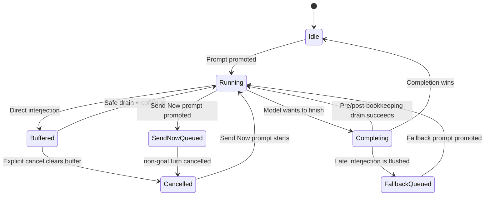

# Walkthrough：Mid-turn Interjection 如何在不中断 Turn 的情况下插入用户消息

> 场景：模型仍在思考、执行工具或等待后台任务时，用户发送一句“先把测试补上”，希望它立即影响当前工作，但又不想像取消那样结束整个 Turn。客户端先乐观显示消息，再通过 `x.ai/interject` 交给 Shell；Shell 将消息放进并发安全的缓冲区，在模型下一次可观察到它的安全点，把它作为独立的 synthetic user message 注入 Conversation。若消息来得太晚，系统会把它转换成优先执行的 fallback Prompt，避免静默丢失。

本文基于源码版本 `ed6d543643628663873c5de28298e022ed634238`。

---

## 1. 先给出结论

Interjection 不是“立即打断正在运行的任意代码”，而是“异步登记一条用户 steering message，并在当前 Agentic Loop 的安全边界注入”。

它通常不取消当前 Turn、不创建新的 prompt index，也不改写 Tool Result；它让下一次模型采样看到一条带 `SyntheticReason::Interjection` 的独立用户消息。

## 2. 最终调用链

```text
Pager Ctrl+Enter
  -> dispatch_interject
     -> 本地乐观绘制 interjection block
     -> 生成 interjectionId
     -> Effect::SendInterject
  -> x.ai/interject
  -> extensions::interject::handle
     -> content text 优先于 legacy text
     -> SessionCommand::Interject
  -> SessionActor 串行处理
     -> broadcast x.ai/session/interjection
     -> Event::Interjected telemetry
     -> 当前确有 running turn?
        yes -> pending_interjections.push
        no  -> queue_interjection_fallback_prompt

当前 Turn 的安全点
  -> pending_interjections.drain_all（FIFO）
  -> 清理图片占位符路径
  -> 展开 leading /skill
  -> format_interjection
  -> 规范化/转写图片
  -> ConversationItem::interjection
  -> persistence UserMessageChunk
  -> ChatState push_user_message
  -> 下一轮 sampling 看到新消息

若消息越过最后安全点
  -> completion actor arm
  -> flush_stranded_interjections
  -> interject-fallback-<uuid> Prompt
  -> 插到普通队列前方并启动新 Turn
```

## 3. 建议同时打开的源码

| 关注点 | 文件 | 关键符号 |
| --- | --- | --- |
| 共享缓冲 | `crates/common/xai-interjection-core/src/events.rs` | `EventQueue` |
| 条目与格式 | `xai-interjection-core/src/buffer.rs`、`format.rs` | `PendingInterjection`、`format_interjection` |
| Pager 发起 | `xai-grok-pager/src/app/dispatch/interject.rs` | `dispatch_interject` |
| Wire 入口 | `xai-grok-shell/src/extensions/interject.rs` | `handle`、`split_content` |
| Actor 接收 | `xai-grok-shell/src/session/acp_session_impl/run_loop.rs` | `SessionCommand::Interject` arm |
| 注入实现 | `.../interjection.rs` | `drain_pending_interjections` |
| Turn 安全点 | `.../turn.rs`、`tool_calls.rs` | drain 调用点 |
| 尾部补偿 | `.../run_loop.rs` | `flush_stranded_interjections` |
| Send Now | `.../prompt_queue.rs`、`tasks_cancel.rs` | `handle_interject_queued_prompt`、`cancel_turn_for_send_now` |
| Conversation 标签 | `xai-grok-sampling-types/src/conversation.rs` | `SyntheticReason::Interjection` |

## 4. 三种容易混淆的用户动作

| 动作 | 当前 Turn | 新 Turn | Conversation 形态 |
| --- | --- | --- | --- |
| Direct Interjection | 继续 | 通常不创建 | 当前 Turn 内追加 synthetic user item |
| Cancel | 结束 | 用户之后再发 | 下一真实 Prompt 带 interrupt 语义 |
| Send Now | 取消当前 Turn（Goal 例外） | 被提升 Prompt 接着运行 | 正常 Prompt，不是 interjection item |

先记住这张表，后面所有分支都只是它的实现细节。

## 5. 为什么不能把 Interjection 当普通 Prompt

普通 Prompt 要进入 `pending_inputs`、晋升为 running front，并消费一个 Prompt/Turn 边界。Interjection 的目的却是修改当前工作方向；若总排到下一 Turn，模型可能已经完成错误方向的大量工作。

## 6. 为什么也不能随时直接修改请求

已经发给 Provider 的 HTTP/streaming 请求无法在中途原地增加一条 message。系统只能等当前采样返回，或等一批 Tool Calls 收敛，再用更新后的 Conversation 发起下一次采样。

因此“立即”在这里是逻辑上的下一安全机会，不是抢占式修改网络请求。

## 7. 客户端入口是乐观 UI

`dispatch_interject` 先把 `RenderBlock::interjection_prompt` 放入本地 scrollback，然后再发 RPC。用户无需等待 Shell 往返便能看到自己的消息。

这是一种 optimistic echo：先假设发送会成功，再依靠服务端广播协调其他视图。

## 8. interjectionId 解决什么问题

客户端生成 UUID，保存到 `self_interjection_ids`，并随请求发送。Shell 向所有连接的 pane 广播同一 id；发起方发现 id 是自己生成的，就丢弃广播副本，其他 pane 则绘制它。

## 9. 为什么广播而不是只回复发起方

同一 Session 可能同时被多个窗口或 viewer 查看。如果只有发起方本地绘制，其他 pane 的时间线会缺一条真实影响模型的用户指令。

## 10. 老客户端如何兼容

`interjectionId` 是可选字段。没有 id 的广播会在所有 pane 绘制；代价可能是老发起方重复显示，但不会为了去重而丢掉消息。

兼容策略优先保证可见性。

## 11. Effect 层不直接访问 SessionActor

Pager 生成 `Effect::SendInterject`，effect executor 再序列化 `x.ai/interject` 参数。UI 状态变化与网络副作用因此分离，便于纯 dispatch 测试。

## 12. Legacy wire 与结构化 content

文本消息只发送传统字段：

```json
{
  "sessionId": "...",
  "text": "also add tests",
  "interjectionId": "..."
}
```

带图消息额外携带 `content`，其中包含 Text 与 Image blocks；没有图片时整个字段被省略，保持旧 wire shape。

## 13. 为什么同时保留 text 和 content

`text` 服务于旧客户端、显示与基础兼容；`content` 能表达结构化图片，并携带客户端已经清理过的模型安全文本。

这是一种渐进协议扩展，而不是一次破坏式替换。

## 14. content 中的 Text 为什么优先

`split_content` 会找到首个非空 Text block，把它作为 `text_override`。图片处理代码可能已经从这段文本中删除失败占位符或本地路径；继续使用 raw `text` 会重新暴露这些内容。

## 15. Session lookup 容忍 load race

扩展入口调用 `session_handle_waiting_for_load`，而不是只做一次即时 lookup。Interjection 与 reconnect 后重放的 `session/load` 竞争时，会等待加载完成，避免瞬时返回 session not found。

## 16. 找不到 Session 的错误

等待后仍无 Session，入口返回 ACP `invalid_params`，并附带 session id。它不会把消息投递到其他 Session，也不会创建隐式 Session。

## 17. 成功响应只表示 queued

扩展返回 `{"status":"queued"}`，表示命令已交给 Session mailbox；它不证明模型已经看到或执行了这条指令。

这是 fire-and-forget admission acknowledgement，不是 Turn completion。

## 18. SessionCommand 是 Actor 边界

`SessionCommand::Interject { text, id, images }` 把协议输入转换为内部命令。此后所有是否 running、如何 buffer、怎样 fallback 的判断都在 SessionActor 的串行事件循环完成。

## 19. 为什么先广播再判断 running

命令 arm 先调用 `broadcast_interjection`，再检测当前 Turn。无论最终进入当前 Turn 还是 fallback 新 Turn，各 pane 都立即看到同一用户动作。

## 20. Telemetry 在 enqueue 时记录

`Event::Interjected` 在命令接收时发出，包含 source、image count 与 redirect kind。若稍后用户 Cancel 导致 buffer 被清空，系统仍保留“用户曾发送 interjection”这一行为事实。

## 21. running 判定使用 current_prompt_id

命令 arm 读取 `current_prompt_id`：存在表示有真实运行中的 Turn，可以把消息交给其 drain 点；不存在则不能把内容留在只由 Turn 消费的 buffer 中。

## 22. running 时写入什么

写入的是：

```rust
PendingInterjection {
    text,
    attachments: images,
}
```

共享 core 不理解 ACP 图片，只把 attachment 类型参数化，由 Shell 在 drain 时处理。

## 23. InterjectionBuffer 的真实结构

它只是 `EventQueue<PendingInterjection<Attachment>>` 的类型别名。`EventQueue` 内部是 `Arc<Mutex<Vec<E>>>`；clone 共享同一队列，不是复制快照。

## 24. 为什么用同步 Mutex

push、is_empty、drain_all 都是极短的内存操作，没有 `.await`。同步 Mutex 让异步与同步调用点都能快速登记消息，同时避免为了一次 Vec 操作建立异步锁生命周期。

## 25. Poisoning 如何处理

`EventQueue::lock` 使用 `unwrap_or_else(|e| e.into_inner())`。若某持锁线程 panic，后续仍取得内部数据，而不是让所有 interjection 永久不可用。

这是一种可用性选择；它不自动证明被 panic 中断的数据更新完全正确。

## 26. drain_all 的原子语义

`std::mem::take` 在一次锁持有期中拿走整个 Vec，并留下空 Vec。drain 之后新到达的消息进入新 Vec，不会混入本批处理中。

## 27. FIFO 与一条一消息

`drain_all` 保持 Vec 顺序。Shell 对每个 entry 单独创建一个 `ConversationItem::interjection`，不会把连续三次 Ctrl+Enter 拼成一段文本。

这保留了到达顺序和用户意图边界。

## 28. 什么是安全排空点

安全排空点指 Conversation 处于一致状态、能够追加完整 user item，并且下一次 Provider 请求尚未固定输入的位置。

它不是一个 Rust 类型，而是本文用于理解多个 drain 调用点的阅读模型。

## 29. 安全点一：每次 sampling iteration 前

`turn.rs` 的主循环在构建下一轮上下文前调用 `drain_pending_interjections`。上一轮模型刚返回、下一轮尚未请求时，注入最自然。

## 30. 安全点二：工具批次执行后

`tool_calls.rs` 在 deferred followups 推入 ChatState 后 drain。这样用户消息排在已经完成的 Tool Results 后面，下一轮模型同时看到工具结果与新的 steering。

## 31. 为什么不附加到 Tool Result

工具输出是对特定 `tool_call_id` 的响应，协议和历史修复都依赖这种配对。把用户文本拼入 Tool Result 会混淆数据来源，也会污染后续压缩、重放与分析。

所以测试明确要求 Tool Result 原文不变。

## 32. 安全点三：模型准备结束 Turn 前

当本轮没有更多工具、模型似乎给出最终回答时，Turn 在 completion 之前再次 drain。若收到消息，则 `continue` Agentic Loop，让模型仍在同一 Turn 响应它。

## 33. 安全点四：bookkeeping 之后

`finalize_turn_bookkeeping` 本身也需要时间。完成 bookkeeping 后代码再 drain 一次；若此窗口收到 interjection，同样继续循环。

这是对 Turn 尾部 race window 的第二层收窄。

## 34. 为什么仍然存在尾部竞态

即使连续检查两次，最后一次检查与 completion 消息被 Actor 处理之间仍有不可消除的小窗口。异步系统不能靠“再检查一次”获得绝对原子性。

因此还需要 stranded fallback。

## 35. drain 的第一步是整批取走

`drain_pending_interjections` 先取得全部 entries；空时返回 false。调用方只有在 Turn completion gate 需要决定 `continue` 时，才依赖这个 bool。

## 36. 为什么 Shell 没直接使用 drain_formatted

共享 crate 提供 `drain_formatted`，但 Shell 要在包装前解析 leading Skill slash。若先加上 `</user_query>`，结尾标签可能被误当作最后一个 Skill 的参数。

所以 Shell 手工执行 drain、sanitize、skill parse、format 顺序。

## 37. 图片占位符路径先清理

文本中的 `[Image #N: /local/secret/path]` 被转换成 `[Image #N]`。本地路径既不是模型理解图片所必需，也可能泄露工作机目录结构。

## 38. canonical wrapper 长什么样

```text
The user sent a message while you were working:
<user_query>
please also add tests
</user_query>
```

这告诉模型消息是在工作期间到达，同时清晰标出真正的用户内容。

## 39. wrapper 没有“稍后再做”指令

`format_interjection` 故意不附加 “After completing your current task”。Interjection 是真实 steering，模型应自行判断是立刻改方向、合并要求，还是解释冲突。

## 40. 大文本如何截断

超过 `LARGE_PROMPT_THRESHOLD = 25_000` 字节时，文本在合法 UTF-8 字符边界截断，并附加 `... [truncated]`。

阈值按字节判断，但切片不会落在多字节字符中间。

## 41. 图片数据不会随文本截断

图片作为结构化 attachments 单独传递。即使文字达到数 MB 并被截断，图片 base64 payload 仍按图片管线处理，不会被文字切片逻辑截掉。

## 42. 图片先统一规范化

`prepare_interjection_images` 调用已有的 `normalize_images_with_notices`，复用 MIME、尺寸、格式与错误提示规则，避免 Prompt 与 Interjection 对相同图片给出不同安全行为。

## 43. Cursor harness 的特殊路径

若当前 template 不接受 inline image，Shell 尝试通过 `transcribe_user_images` 把图片描述写进文本，随后返回空图片列表。

这样 Provider 不接收不支持的结构化 image part。

## 44. 图片转写失败怎么办

转写失败时，图片被丢弃，并在文本追加明确 note。系统不会悄悄让模型假装看到了图片。

## 45. 普通 harness 的图片表示

规范化后的 ACP `ImageContent` 通过 `pick_user_image_url` 变成 Conversation 的 image part，通常是 `data:image/...;base64,...` URL，与文本一起进入 synthetic user item。

## 46. Interjection 也支持 Skill slash

若清理后的文本以 `/` 开头，Shell 使用 Session 当前发现的 skills 与 command availability 解析引用，并构造 `<skill_information>` envelope。

否则 `/commit` 之类的 Skill 名可能只以裸文本抵达模型。

## 47. 中间提到 slash 不算调用

`don't run /find-session yet` 不以 slash 开头，因此不会加载 SKILL.md。这个 gate 与 Turn-start slash parsing 保持一致，避免普通讨论意外触发 Skill。

## 48. Skill envelope 的顺序

模型文本顺序是 wrapped `<user_query>` 在前，`<skill_information>` 在后。图片处理先完成，避免 template-specific transcription 改写或破坏 Skill envelope。

## 49. Skill telemetry 为什么更轻

Interjection 不启动新 Turn，因此不记录把整轮归因给 Skill 的 active-skill stamp 或 turn-level span；但仍记录 slash command usage 与 Skill dispatch，保持调用计数完整。

## 50. 持久化文本与模型文本不同

模型可见 `model_text` 可能包含完整 Skill 内容；持久化的 UserMessageChunk 使用较短的 `wrapped`，不保存展开后的整份 SKILL.md。

这和普通 Prompt 的 display text / expanded context 分离思路一致。

## 51. inject_synthetic_user_message 的三件事

它负责：

1. 向 persistence channel 写 UserMessageChunk；
2. 根据参数决定是否通知 Pager；
3. 把 `ConversationItem` 推入 ChatState。

## 52. 为什么 Interjection 不再次 notify Pager

Pager 已经乐观绘制，Shell 也已经广播 `x.ai/session/interjection`。若 drain 再发标准 UserMessageChunk 给实时 UI，同一消息可能显示两次。

持久化仍需要 UserMessageChunk，实时 notify 则关闭。

## 53. 文本与图片如何持久化

持久化对每个 ContentBlock 发送一条 UserMessageChunk：文本在前，图片随后。每条携带当前 `modelId` meta，支持 Session replay 恢复显示。

## 54. Conversation 标签的意义

`ConversationItem::interjection` 创建 UserItem，并设置：

```text
synthetic_reason = Interjection
prior_turn_interrupt = None
prompt_index = None
```

它是真实用户意图，但不是启动 Turn 的普通 Prompt。

## 55. starts_prompt_turn 为什么返回 false

`SyntheticReason::starts_prompt_turn` 对 Interjection 返回 false。历史截断与 rewind 的 fallback 计数不能把它误认为新 Prompt，否则 prompt coordinate 会漂移。

## 56. 为什么没有 PriorTurnInterrupt

`PriorTurnInterrupt` 表达前一 Turn 被用户致命中断的原因，例如 Ctrl+C 或权限拒绝。Interjection 不结束 Turn，所以其意义完整记录在自身 synthetic reason 中。

## 57. 阻塞等待工具是特殊延迟点

模型可能调用 `wait_tasks`、`get_task_output(wait=true)`、`AwaitShell` 等工具，并长时间等待。如果只在工具返回后 drain，Interjection 看起来会“失效”很久。

## 58. 哪些 wait 可以被提前结束

`is_interruptible_wait_tool` 枚举等待类工具，并检查部分工具参数是否真的要求等待。普通 Bash、文件编辑等执行不会仅因 Interjection 自动取消。

## 59. wait_for_pending_interjection 如何工作

它每 50ms 检查 buffer 是否非空。工具 dispatch 使用 biased `tokio::select!`，在真实工具结果和 Interjection 到达之间竞争。

## 60. wait 被打断后返回什么

系统构造一个模型可见的 `ToolRunResult`，状态为 cancelled，输出是 `Wait interrupted: the user sent a message.`。随后正常的工具批次尾部 drain 注入用户文本。

模型因此同时得到“等待为何提前结束”和“用户究竟说了什么”。

## 61. 为什么只打断 wait，不取消后台任务

等待工具只是观察后台任务的阻塞前台；提前结束观察并不等于用户要求杀掉任务。后台命令或 Subagent 继续存在，模型可根据新消息决定下一步。

## 62. idle 到达时不能进 buffer

没有 running Turn 时，不再有任何主循环负责 drain。若仍 push，Pager 会显示 “Interjection sent”，但模型永远收不到——这就是 stranded message。

## 63. idle fallback 是正常 Prompt

`queue_interjection_fallback_prompt` 创建 `interject-fallback-<UUID>` InputItem，携带原文本和图片，放到队列前部，并调用 `maybe_start_running_task`。

此时它不再是 mid-turn synthetic item，而是一个真正运行的新 Prompt Turn。

## 64. fallback 前插也不能顶掉 running front

“是否 running”的检查与 state lock 不是同一个原子操作。若期间另一个流程晋升了 Prompt，fallback 会插在 pinned running front 后面，而不是把它挤走。

否则 completion 按 front pop 时会删除错误项目。

## 65. 多条 stranded 如何保持顺序

flush 先 FIFO drain，再逆序逐条 front insert。逆序 `push_front` 的最终排列仍是 first、second、原队列，而不是把用户消息倒置。

## 66. Turn completion 后的兜底

completion actor arm 在 `handle_completion` 和 goal turn-end 处理后调用 `flush_stranded_interjections`。这是处理“消息越过 Turn 最后 drain”的最终补偿层。

## 67. fallback 为什么使用特殊 Prompt id

所有 pane 已通过 interjection broadcast 绘制用户消息。`interject-fallback-` 前缀让 Turn-start echo 走 persist-only 行为，防止新 Turn 开始时再显示一份重复用户块。

## 68. fallback 继承 Plan Mode

若原 Turn 在 active Plan Mode 中，fallback InputItem 也使用 `PromptMode::Plan`，不能因为 race fallback 意外逃离只读/计划约束。

## 69. Cancel 如何处理已缓冲消息

普通 Cancel arm 会 `pending_interjections.clear()`。Turn 被终止后，这些专门面向该 Turn 的 steering 不会自动变成后续 Prompt。

Telemetry 已在 enqueue 时记录，但 Conversation 不注入被取消掉的内容。

## 70. Direct Interjection 与 Send Now 的决定性区别

Direct Interjection：

```text
buffer -> safe drain -> same Turn continues
```

Send Now：

```text
new/queued Prompt -> promote next -> cancel current -> new Turn
```

一个保持 Turn 身份，一个建立新的 Turn 身份。

## 71. queue/interject 这个名称为何危险

当前 `handle_interject_queued_prompt` 的实现并不把队列行放进 `pending_interjections`。它把该行标记 `send_now`、提升到 running front 后方，并在非 Goal Turn 中请求取消当前 Turn。

部分类型注释仍描述旧的“merge into in-flight turn”语义。阅读时应以函数体、run-loop 注释和现行测试为准；这是值得后续清理的命名/注释漂移。

## 72. Send Now 为什么要清空 Interjection buffer

`cancel_turn_for_send_now` 先 flush replay buffer，再清空 pending interjections，最后用 `CancelTrigger::SendNow` 结束当前 Turn。旧 Turn 的 steering 不能泄漏进由另一 Prompt 启动的新 Turn。

## 73. Goal Turn 为什么例外

队列 Send Now 在 goal active 时会提升行，但不取消当前 Goal Turn；多条 send-now 仍按 FIFO 排在 running front 后。Goal orchestrator 的生命周期约束优先于普通即时取消语义。

## 74. Send Now 的取消为什么不显示普通 Cancel 标记

`CancelTrigger::SendNow` 表示用户正在继续，而不是放弃会话。它不设置下一 Prompt 的 prior interrupt，也不注入 `[Request interrupted]` reminder；Pager 还会压制普通“Turn cancelled”视觉标记。

## 75. 当前实现的状态机



图中的 `Buffered`、`Completing` 是教学状态；源码实际由 `current_prompt_id`、buffer、running task 与 completion channel 共同表达。

## 76. 核心并发不变量

1. Interjection entry 只能被一次 `drain_all` 取得。
2. 每个 entry 独立、FIFO 地进入 Conversation。
3. 不得修改已有 Tool Result 来承载用户消息。
4. 没有 running Turn 时不得把消息永久留在仅 Turn 可消费的 buffer。
5. fallback 前插不得移动 pinned running front。
6. Cancel 后旧 Turn 的 buffer 不得泄漏到新 Turn。

## 77. 常见误解

| 误解 | 实际情况 |
| --- | --- |
| Ctrl+Enter 会中断当前网络请求 | 它在下一安全点注入，不能改写已发请求 |
| Interjection 等于 Cancel | Direct Interjection 不结束 Turn |
| Interjection 是 Tool Result 的附注 | 它是独立 synthetic user item |
| queued interject 与 direct interject 相同 | 当前 queued 路径实际是 Send Now |
| RPC 返回 queued 就表示模型看见了 | 只表示命令被接纳 |
| UI 显示两次说明模型收到两次 | 还要区分 optimistic echo 与广播去重 |
| idle 时 buffer 等下个 Turn 会读 | idle 路径必须转 fallback Prompt |

## 78. 调试路线

当 UI 显示消息但模型没响应时，按顺序检查：

1. `Effect::SendInterject` 是否生成；
2. `x.ai/interject` 是否带正确 sessionId；
3. `SessionCommand::Interject` 是否到达 Actor；
4. 当时 `current_prompt_id` 是否存在；
5. buffer 是否被 Cancel clear；
6. `drain_pending_interjections` 是否运行；
7. 是否被转成 `interject-fallback-` Prompt；
8. persistence 中是否有 UserMessageChunk；
9. ChatState 是否出现 `SyntheticReason::Interjection`。

## 79. 推荐测试矩阵

| 场景 | 应验证的结果 |
| --- | --- |
| 单条 direct interjection | 独立 synthetic user item |
| 连续三条 | 一条一 item、FIFO |
| Tool Result 在尾部 | Tool Result 不被改写 |
| 超长 UTF-8 文本 | 合法边界截断 |
| 文本加图片 | image part 保留 |
| 带本地路径占位符 | 路径被清理 |
| leading `/skill` | envelope 被展开 |
| 中间提到 `/skill` | 不触发 |
| 阻塞 wait | wait 提前返回，后台任务不杀 |
| idle race | 转 fallback Prompt |
| completion tail race | flush 后按原顺序优先运行 |
| Cancel | buffer 清空 |
| 多 pane | 发起方去重，viewer 显示 |
| queued Send Now | Prompt 提升且非 Goal Turn 取消 |

## 80. 如何验证

共享格式与队列可运行：

```sh
cargo test -p xai-interjection-core
```

Shell 生产路径可检查：

```sh
cargo check -p xai-grok-shell --lib
```

相关测试名可搜索：

```sh
rg "interjection|send_now" \
  crates/codegen/xai-grok-shell/src/session/acp_session_tests \
  crates/codegen/xai-grok-pager/tests/pty_e2e
```

## 81. 修改共享 core 时的影响面

改 `format_interjection` 会影响 wrapper、截断与所有 host；改 `EventQueue` 会影响 clone sharing、FIFO、poison recovery。先跑 core 全测，再检查 Shell drain 与 Pager E2E。

## 82. 修改 drain 顺序时的影响面

必须重新审计 sanitize、Skill parse、format、image transcription、persist、ChatState push 的相对顺序。尤其不要在 Skill parse 前包装，也不要把 expanded SKILL.md 当作显示文本持久化。

## 83. 修改 completion 时的影响面

移动最后 drain 或 Actor completion arm 时，要重新证明 late arrival 不会 stranded；同时检查 running front pin、fallback 队列顺序和 Cancel clear 的事件序列。

## 84. 修改 Send Now 时的影响面

要同时检查 Shell 队列、cancel trigger、Pager optimistic block、queue rebroadcast、Turn marker suppression、Goal active 例外和 stacked FIFO。函数名中的 interject 不能替代对当前函数体的核验。

## 85. Glossary：会话与控制流

### Session

一段可持续、持久化和恢复的对话运行环境；内部可包含许多 Prompt Turns。

### Turn

由一次 Prompt 启动、可包含多次 sampling 与 Tool Call 的完整处理周期。

### Sampling Iteration

Turn 内向模型发出一次请求并消费一次响应；执行工具后通常还会有下一次 iteration。

### Agentic Loop

模型回答、提出 Tool Call、Shell 执行、结果回到模型的循环；Interjection 在循环边界进入上下文。

### In-flight

已经开始但尚未完成；本文主要指正在运行的 Turn、Provider 请求或 Tool Call。

### Steering

用户在工作过程中补充或修正方向；它不必终止当前 Turn。

### Safe Point

可以在不破坏 Conversation/tool-call 配对的前提下插入完整消息的位置；这是阅读模型，不是源码类型。

## 86. Glossary：并发与可靠性

### Actor

通过串行 mailbox 拥有和修改状态的并发组件；SessionActor 决定 Interjection 是 buffer 还是 fallback。

### Mailbox

发送给 Actor 的命令队列；`SessionCommand::Interject` 经它与其他 Session 事件排序。

### Buffer

暂存尚未注入的消息集合；这里是共享的 `InterjectionBuffer`。

### Drain

原子取走缓冲区当前全部条目并留下空队列，而不只是复制读取。

### FIFO

First In, First Out，先到先处理；连续 Interjection 按发送顺序进入 Conversation。

### Race Window

两个异步事件先后不确定的时间窗口；本文关键 race 位于最后 drain 与 Turn completion 之间。

### Stranded Message

已经被接收和显示、却没有任何消费者再处理的消息；fallback 专门避免这种静默丢失。

### Pinned Front

队列最前面代表正在运行 Turn 的 InputItem，完成逻辑依赖它不被其他前插操作移动。

## 87. Glossary：协议与 UI

### ACP

Agent Client Protocol，Pager/宿主与 Grok Agent 之间的协议边界；`x.ai/interject` 是扩展方法。

### Wire Shape

在线上传输的 JSON 字段结构；legacy text-only 与结构化 content 是两种兼容形态。

### Optimistic Echo

网络确认前先在本地绘制用户动作，以降低感知延迟。

### Broadcast

Shell 将一条 Session 事件发给所有 attached clients，而不是只回复发起者。

### Deduplication

借助 `interjectionId` 识别发起方已经乐观绘制的同一消息，避免重复显示。

### Fire-and-forget

发送后不等待业务完成结果；`queued` 只确认接纳，最终效果从后续事件观察。

### Extension Method

ACP 标准之外以 `x.ai/...` 命名的产品扩展请求或通知。

## 88. Glossary：Conversation 与恢复

### Synthetic User Message

外形是 user message，但由运行时注入并带原因标签；Interjection 保留用户身份，却不启动新 Turn。

### SyntheticReason

区分 Interjection、AutoContinue、TaskCompleted 等运行时 user item 来源的枚举。

### Prompt Index

普通 Prompt 的逻辑坐标，用于截断、rewind 等；mid-turn Interjection 不消费该坐标。

### PriorTurnInterrupt

标记上一 Turn 被用户致命终止的原因；Interjection 不取消 Turn，所以不设置它。

### Persistence

把 Session updates 写入磁盘，使 reload/replay 能恢复消息；它与实时 UI notification 是两条不同路径。

### Replay

从持久化事件重建 UI 时间线或 Conversation；持久化文本刻意不包含展开后的整份 Skill 内容。

### Fallback Prompt

无法再注入原 Turn 时创建的真正 Prompt，用来保证消息最终被模型处理。

## 89. Glossary：Interjection、Cancel 与 Send Now

### Mid-turn Interjection

当前 Turn 运行时追加的用户消息；在安全点注入并继续同一 Turn。

### Cancel

终止当前 Turn；可能设置 interrupt marker，并清理面向该 Turn 的 pending interjections。

### Send Now

把一个 Prompt 提升为下一个运行项，通常静默取消当前非 Goal Turn；它创建新 Turn，不是 direct interjection。

### CancelTrigger

记录取消来源的枚举；`SendNow` 让下游压制普通取消提示与 prior interrupt。

### Interruptible Wait

可以因用户消息到达而提前返回的阻塞观察工具；提前返回不等于杀掉被观察的后台任务。

### Goal Active Gate

Goal orchestrator 活跃标志；活跃时 Send Now 提升但不立即取消 Goal Turn。

### Semantic Drift

名称或旧注释仍表达历史行为，而函数体已经变化；`queue/interject` 是本篇的具体例子。

## 90. 一页复习版

```text
Direct interjection:
  Pager optimistic echo
  -> x.ai/interject
  -> SessionCommand::Interject
  -> running? buffer : fallback prompt
  -> safe drain
  -> standalone SyntheticReason::Interjection user item
  -> same Turn next sampling iteration

安全点：
  iteration 前
  tool batch 后
  completion 前
  bookkeeping 后
  再漏过 -> completion arm 转 fallback

Direct Interjection != Cancel != Send Now

queue/interject（当前代码）:
  promote queued row -> mark send_now
  -> cancel non-goal running Turn
  -> start a new Prompt Turn
```

## 91. 源码证据索引

| 结论 | 直接证据 |
| --- | --- |
| clone 共享队列、FIFO drain | `xai-interjection-core::events::EventQueue` |
| wrapper 与 UTF-8 截断 | `xai-interjection-core::format::format_interjection` |
| optimistic echo/id | `pager::dispatch_interject` |
| 多 pane 去重 | `pager::acp_handler::handle_interjection` |
| legacy/structured wire | `extensions::interject::split_content` |
| running/idle 分流 | `run_loop.rs` 的 `SessionCommand::Interject` arm |
| sanitize/Skill/image/inject 顺序 | `SessionActor::drain_pending_interjections` |
| 独立 synthetic item | `ConversationItem::interjection` |
| iteration/tool/completion drains | `turn.rs`、`tool_calls.rs` |
| wait 提前返回 | `is_interruptible_wait_tool`、`wait_for_pending_interjection` |
| late race fallback | `flush_stranded_interjections` |
| fallback front pin | `queue_interjection_fallback_prompt` |
| Cancel 清 buffer | `run_loop.rs` Cancel arm |
| queued 路径实际 Send Now | `handle_interject_queued_prompt` |
| Send Now 静默取消 | `cancel_turn_for_send_now` |

## 92. 阅读完成后应该能回答的问题

1. 为什么 Interjection 不能修改已经发出的 Provider 请求？
2. Direct Interjection 与普通 Prompt 的 Turn 身份有何区别？
3. 为什么用户消息必须是独立 item，不能拼进 Tool Result？
4. 四个主要 drain 安全点分别在哪里？
5. 为什么两次 Turn-tail drain 之后仍需要 fallback？
6. `Arc<Mutex<Vec<_>>>` clone 后共享的是什么？
7. 为什么 Skill parse 必须发生在 wrapper 之前？
8. 模型文本与持久化显示文本为什么可以不同？
9. 阻塞 wait 被打断为何不等于后台任务被取消？
10. `interjectionId` 如何让发起方与 viewer 同时得到正确 UI？
11. Cancel 为什么清空 pending interjections？
12. 为什么当前 `x.ai/queue/interject` 不能按名称理解成 direct interjection？

能回答这些问题，就掌握了 Interjection 的核心：它是一条跨 UI、ACP、Actor mailbox、并发 buffer、Agentic Loop、Conversation 和持久化的“非致命用户重定向”链路，而 Send Now 是另一条以取消和新 Turn 为边界的控制流。
