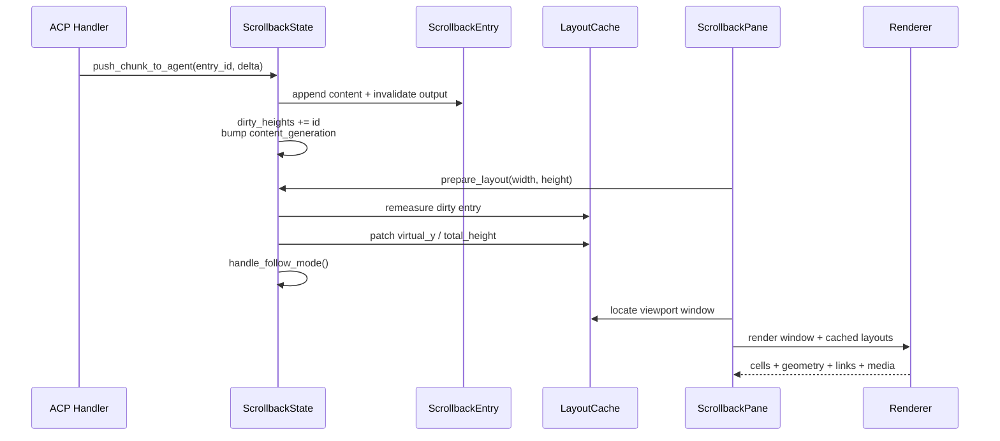

# Walkthrough：Scrollback 如何把流式事件变成稳定、可滚动的对话时间线

> 源码核对版本：`ed6d543643628663873c5de28298e022ed634238`
>
> 这一篇研究 Pager 中“已经产生的对话内容如何变成终端画面”。它不重复 Prompt 如何发送或 ACP 事件如何传输，而是从事件已经决定“新增/更新哪个 UI 内容块”之后开始，一直追到布局、裁剪和绘制。

## 1. 这篇解决什么问题

看到模型逐字输出时，很容易把 TUI 想成一个不断 `println!` 的程序。实际实现远比这复杂：同一条消息会增长，工具块会折叠，用户可能滚回历史，窗口宽度会改变换行，Prompt 还会吸附到顶部。

本篇回答：

- 为什么 Scrollback 不是 `Vec<String>`；
- `RenderBlock`、`ScrollbackEntry`、`ScrollbackState` 各自拥有哪层状态；
- 流式增量为何能够只更新尾部，而不每次重算整段历史；
- 长会话如何用估算高度、精确测量和窗口化绘制控制成本；
- 折叠组、Sticky Prompt、Follow Mode 如何共同改变可见画面；
- 为什么稳定 ID、内容版本和显示版本必须分开；
- 修改这条链路时，哪些不变量最容易被破坏。

## 2. 一句话心智模型

Scrollback 是一棵分层的“显示模型”：Block 描述内容语义，Entry 增加实例显示态，State 管理整条时间线和布局索引，Pane/Renderer 只绘制当前视口。

## 3. 它不是会话事实源

会话的可恢复事实仍来自 Shell 的持久化事件与 ACP 重放。Pager Scrollback 是客户端为了交互而建立的投影。

这意味着它可以包含纯显示块，也可以因为重连而重建；不能把“屏幕上存在一个块”误当成“服务端一定持久化了同名对象”。

## 4. 本篇范围

重点源码位于：

- `crates/codegen/xai-grok-pager/src/scrollback/mod.rs`
- `crates/codegen/xai-grok-pager/src/scrollback/block.rs`
- `crates/codegen/xai-grok-pager/src/scrollback/entry.rs`
- `crates/codegen/xai-grok-pager/src/scrollback/types.rs`
- `crates/codegen/xai-grok-pager/src/scrollback/state/`
- `crates/codegen/xai-grok-pager/src/scrollback/render.rs`
- `crates/codegen/xai-grok-pager/src/scrollback/scrollback_pane.rs`
- `crates/codegen/xai-grok-pager/src/scrollback/sticky.rs`

## 5. 非目标

鼠标逐字选择、表格复制、链接激活和全文搜索各自都有独立状态机。本篇只说明它们如何消费渲染结果，不穷举全部交互分支；后续可以分别写专篇。

## 6. 第一层：Block 是“内容语义”

`BlockContent` trait 回答的是“这个对象想显示什么”：输出行、强调色、背景、折叠能力、默认显示模式、是否可选、是否成组、是否携带媒体等。

它不拥有全局滚动位置，也不知道自己排在第几个 Turn。

## 7. `RenderBlock` 是闭合的 Block 联合

`RenderBlock` enum 包装当前 Pager 能显示的主要类别：

- `UserPrompt`
- `AgentMessage`
- `ToolCall`
- `Thinking`
- `System`
- `SessionEvent`
- `BgTask`
- `Subagent`
- `Workflow`
- `Btw`
- `ContextInfo`
- `CreditLimit`

测试还使用 `Stub`。

## 8. 为什么同时需要 trait 和 enum

trait 统一行为契约；enum 让拥有者能以一个具体、可枚举、可 `Clone` 的类型保存所有 Block，并在需要时按变体做专门处理。

例如普通输出统一走 `BlockContent::output`，Edit Tool 又可以在 `RenderBlock::rendered_output` 中保留额外的渲染元数据。

## 9. `output` 不是直接画屏幕

`BlockContent::output(&BlockContext) -> BlockOutput` 生成结构化的显示行。真正写入 Ratatui `Buffer` 的工作在后续 Renderer 完成。

这个分层使高度测量、复制文本、搜索文本和实际绘制可以共享内容语义，却不必共享屏幕坐标。

## 10. `BlockContext` 是一次渲染决策的输入

它携带：

- `DisplayMode`
- 是否仍在运行
- 可用宽度
- Raw Mode
- 最大行数预算
- Appearance 配置
- 是否选中
- Session/Worktree 的 cwd

同一个 Block 在不同 Context 下可以输出不同内容。

## 11. 三种 `DisplayMode`

`Collapsed` 只保留摘要，`Truncated` 显示受限预览，`Expanded` 展示完整内容。

它不是三个不同 Block，而是同一 Entry 当前采用的显示策略。

## 12. 运行中和完成后的折叠可以不同

`collapse_mode(is_running)` 允许运行中的 Execute 保留预览；`finished_display_mode()` 允许 Thinking 或 Execute 在完成时自动收拢。

因此“用户按左键折叠”和“任务结束自动折叠”不是同一个入口。

## 13. `BlockOutput` 仍保留语义

它不是纯字符串。每个 `BlockLine` 可以声明背景、换行方式、可选择区域、复制时使用的源文本、软换行连接符和语义链接目标。

这些信息若在 Block 阶段丢失，之后无法从终端字符可靠恢复。

## 14. `WrapMode`

行可以按单词换行、按字符换行或截断。中文、长路径、代码和普通 Markdown 对换行的期望不同，因此不能只靠一个全局 `wrap=true`。

## 15. `Selectable`

`Selectable::All` 表示整行可复制，`Spans(range)` 只允许部分 Span，`None` 表示装饰行。

装饰性边框、Bullet 或间隔不应混进用户剪贴板。

## 16. `selection_text`

屏幕字符不总等于用户希望复制的内容。渲染后的路径可能缩短，Markdown 可能带样式，表格可能有补齐空格。

`selection_text` 允许 Block 提供真正的复制源文本。

## 17. `joiner`

软换行重组时，上一行和下一行可能用换行、空格或空字符串连接。

这解决了视觉换行和原始文本换行不是一回事的问题。

## 18. Glossary checkpoint：内容层

| 名词 | 白话解释 | 在本篇中的具体含义 |
| --- | --- | --- |
| Block | 一块具有独立显示语义的内容 | 一条用户消息、模型回答、Thinking 或 Tool Call 等 |
| trait | 多种类型共同遵守的行为接口 | `BlockContent` 规定输出、折叠、背景、媒体等能力 |
| enum | 候选类型固定的联合类型 | `RenderBlock` 保存所有可渲染 Block 变体 |
| Span | 一行中共享样式的一小段文字 | Ratatui `Line` 中的带样式文本片段 |
| Raw Mode | 不做富文本解释的原始显示方式 | 支持的 Block 可在渲染后的 Markdown 与源文本间切换 |
| cwd | 当前工作目录 | 用来把工具路径显示成相对路径，并参与缓存失效 |

## 19. 第二层：Entry 是“Block 的一次出现”

`ScrollbackEntry` 包装一个 `RenderBlock`，再附加这个实例的显示状态。

同一种 Block 类型可以出现很多次，每次都需要独立的运行、折叠、选中和缓存状态。

## 20. `EntryId` 是稳定句柄

`EntryId(u64)` 在 `ScrollbackState::push` 时分配。前面删除 Entry 后，位置索引会改变，但已有 Entry 的 ID 不变。

流式任务持有的应是 ID，而不是数组下标。

## 21. 为什么索引仍然存在

屏幕布局、选择上下移动和 Turn Range 天然按顺序工作，所以 State 仍会计算位置索引。

正确理解是：ID 标识对象，索引描述对象此刻在时间线中的位置。

## 22. Entry 的运行状态

`is_running` 驱动动画与完成行为；`is_pending_user_input` 表示它正在等待权限或问题回答。

后者会把“正在工作”的波形改成更符合含义的提示 Bullet。

## 23. Entry 的显示状态

`display_mode` 保存当前折叠方式，`display_mode_pinned` 记录该方式是否由用户明确固定，`raw` 保存原始显示开关。

自动策略不能随意覆盖用户已经固定的选择。

## 24. 时间信息

`created_at` 是本地创建时间；`finished_at` 使用单调时钟 `Instant`，用于完成后的短暂强调闪烁。

动画计时使用单调时间，避免系统时钟调整造成倒退。

## 25. Entry 输出缓存

`cached_output` 的 Key 包括宽度、Raw、主题、必要时的选中状态以及 cwd。

任何会改变渲染结果的维度若漏进 Key，就会显示旧画面；无关维度若错误加入，则会造成无意义重算。

## 26. 为什么缓存使用 `RefCell`

Renderer 通常只持有 `&ScrollbackEntry`，但渲染时希望惰性填充缓存。`RefCell` 提供运行时可检查的内部可变性。

这不是跨线程锁；它解决的是单线程借用接口与缓存写入之间的矛盾。

## 27. 截断高度有独立缓存

Sticky Prompt 需要知道 Entry 在 `Truncated` 模式下的高度，即使它当前采用其他模式。

某些 Edit/Markdown 高度计算很贵，所以 `cached_truncated_height` 只缓存高度而不保留整份替代输出。

## 28. 宽度无关的行宽缓存

`cached_line_widths` 保存源逻辑行的显示宽度。终端 Resize 后，换行数会改变，但源行宽无需重新从整段文本推导。

这是长会话 Resize 避免 O(全部会话字节) 重扫的重要优化。

## 29. 高度估算缓存

`cached_estimate_lines` 允许相同内容宽度的布局重建复用便宜估算。

估算值用于远离视口的历史，真正进入视口附近后再精确测量。

## 30. 缓存失效必须跟随内容突变

`push_chunk_to_agent` 会追加文本、使 Entry 输出缓存失效、把 ID 加入 `dirty_heights`，并提升内容版本。

只改字符串而忘记后三步，会产生“内容已变但屏幕、高度或搜索仍旧”的分裂状态。

## 31. Glossary checkpoint：实例与缓存

| 名词 | 白话解释 | 在本篇中的具体含义 |
| --- | --- | --- |
| Entry | Block 在时间线中的一个具体实例 | `ScrollbackEntry` 保存 Block 和实例显示态 |
| stable handle | 对象移动后仍然有效的引用标识 | `EntryId`，不同于会随删除变化的索引 |
| cache key | 判断旧结果还能否复用的一组条件 | 宽度、主题、Raw、cwd 等 |
| interior mutability | 通过共享引用也能受控修改内部数据 | Entry 用 `RefCell` 惰性写渲染缓存 |
| monotonic clock | 只向前走、适合测时长的时钟 | `Instant` 用于完成闪烁，不代表墙上时间 |
| dirty | 已发生变化、等待重新计算 | `dirty_heights` 中的 Entry 高度需要更新 |

## 32. 第三层：State 拥有整条时间线

`ScrollbackState` 保存有序 Entry、运行集合、滚动位置、选择、Turn、布局缓存、分组展开状态和失效代数。

它是 Pager 内 Scrollback 显示状态的主要所有者。

## 33. 为什么使用 `IndexMap`

State 需要同时满足按稳定 ID 查找和按插入顺序遍历。`IndexMap<EntryId, ScrollbackEntry>` 同时提供二者。

删除中间项会移动后方索引，但不会改变 Key。

## 34. `push` 的完整责任

新增 Entry 不只是 `insert`：

1. 分配新 ID；
2. 应用某些 Block 的默认显示策略；
3. 登记 Running；
4. 插入有序集合；
5. 重建 Turn 或延迟到 Batch 结束；
6. 尝试增量扩展布局缓存；
7. 标记可能变化的分组；
8. 提升内容版本。

## 35. 批量插入

重放历史时逐条重建 Turn 和布局会退化。`begin_batch`/`end_batch` 让中间 `push` 延迟结构重算，最后统一收敛。

Batch Depth 支持嵌套；只有回到零时才执行最终重建。

## 36. 中间插入的额外风险

`insert_block_before` 要修正 Selection 和 Minimal Mode 的提交游标，并使布局失效。

它还要求 Anchor 尚未提交到原生终端 Scrollback，因为终端已打印历史不可在中间物理插入。

## 37. 删除的额外风险

`remove_entry` 除了移除 Map 项，还需清除 Running、Dirty、Committed、Expanded Group 等 ID 集合，并修正选择与提交游标。

状态旁表越多，删除路径越需要集中维护。

## 38. Turn 是派生结构

`Turn` 保存 `prompt_index..end_index` 和 `TurnStatus`。User Prompt 通常开始一个新 Turn，后续响应块归入其中，直到下一个 Prompt。

Turn 使用索引 Range，因为它描述的是当前有序视图中的连续区间。

## 39. 两种 View Mode

`AllTurns` 显示完整时间线；`SingleTurn` 只显示一个 Turn。

布局总高和可见 Entry Range 都必须以当前 View Mode 为边界，不能永远对全量 Entry 求和。

## 40. Running 集合

State 用 `HashSet<EntryId>` 快速判断哪些 Entry 仍需动画或更新。Entry 本身也保存 `is_running`。

这类冗余索引的价值是快速查询，代价是所有状态转换必须同步维护。

## 41. `finish_running`

完成时除了清理 Running，还可能记录完成时间、采用 Block 的完成显示模式并使高度变化。

因此“收到 Turn End”不能只把动画关掉。

## 42. 两种失效代数

`generation` 在任何会影响屏幕位置或链接策略的变化时提升；`content_generation` 只在 Entry 增删或内容变化时提升，并同时提升前者。

这是本系统非常重要的性能边界。

## 43. 为什么 Search 使用 `content_generation`

滚动、折叠、主题或视口变化不会改变可搜索语料，不应触发全文索引重建。

若 Search 依赖更宽泛的 `generation`，用户每滚一行都可能重建整个 Corpus。

## 44. 为什么 Link Map 使用 `generation`

链接命中区域是屏幕坐标。即使内容没变，只要折叠、宽度、滚动或 cwd 改变，旧坐标就可能失效。

因此它需要更敏感的版本。

## 45. Glossary checkpoint：状态所有权

| 名词 | 白话解释 | 在本篇中的具体含义 |
| --- | --- | --- |
| State | 控制整条时间线行为的数据拥有者 | `ScrollbackState` |
| derived state | 可从主要数据重新算出的辅助状态 | Turn、布局高度、虚拟坐标、分组 Span |
| side table | 与主体对象并行保存的索引集合 | Running、Dirty、Committed 等 ID Set |
| generation | 单调变化的缓存失效版本 | 判断链接坐标和显示派生结果是否过期 |
| corpus | 被全文扫描的一整份文本集合 | Search Index 从各 Block 提取的可搜索文本 |
| projection | 从真实或上游状态推导出的视图 | Pager Scrollback 是会话事件的 UI 投影 |

## 46. 第四层：Layout 把 Entry 映射到虚拟纵轴

终端屏幕很矮，但对话可能有数十万行。布局使用不受视口高度限制的 Virtual Y 描述每个 Entry 在完整内容空间中的位置。

屏幕 Y 只是 `virtual_y - scroll_offset` 的裁剪结果。

## 47. 为什么累计坐标使用 `usize`

单个终端高度可用 `u16`，长会话总高度却可能超过 65,535 行。

`scroll_offset`、`total_height` 和 `virtual_y` 使用 `usize`，最后落到屏幕坐标时才安全收窄为 `u16`。

## 48. `EntryLayoutInfo`

每个 Entry 的布局槽保存：

- `height`
- `gap_after`
- 是否是组 Header
- 组 Header 的计数
- Verb Group 标志

高度为零可以表示该 Entry 被折叠组隐藏。

## 49. `LayoutCache`

布局缓存并行保存：

- 每 Entry 布局信息；
- Truncated Height；
- 高度是否已经精确测量；
- Virtual Y；
- Sticky Prompt 描述；
- Group Span；
- 计算时宽度。

## 50. 为什么缓存是平行数组

渲染和导航常按同一 Index 访问高度、坐标和 Entry。平行数组让顺序扫描紧凑，也避免每帧组装大量临时对象。

代价是数组长度与索引必须严格同步。

## 51. `prepare_layout` 是绘制前的唯一收敛点

Host 在每帧绘制前调用 `prepare_layout(width, height)`。它更新视口尺寸、处理缓存、计算总高、执行 Follow，并精确测量可见区域。

Renderer 假设这一步已经完成。

## 52. Case 1：完整重建

没有缓存或宽度改变时，所有 Entry 先获得便宜高度估算，Virtual Y 和总高随之重建。

之后只把视口及附近 Entry 升级为精确高度。

## 53. 为什么 Resize 必须重算高度

宽度改变会改变 Markdown、路径、表格和代码的换行数。旧高度和后续所有 Virtual Y 都不再可靠。

但源逻辑行宽缓存仍可保留，减少重新扫描文本成本。

## 54. Resize Scroll Anchor

用户停在历史中间时，绝对行偏移在重新换行后不再代表同一内容。

State 在旧布局仍有效时捕获“Entry + 逻辑行 + 行内偏移”，重建后尽量把同一内容恢复到视口顶部。

## 55. 为什么 Follow Mode 不需要 Anchor

Follow Mode 的用户意图是跟随底部，而不是守住某个历史逻辑行。Resize 后重新钉到底部即可。

这两种行为若混合，会造成底部跟随和历史定位互相拉扯。

## 56. Case 2：Dirty Height 增量更新

流式 Chunk 通常只使最后一个 Entry 高度变化。State 精确重算 Dirty Entry，并从最早变化处修补后续 Virtual Y。

若 Dirty Entry 位于尾部，常见路径接近 O(1)。

## 57. 结构变化为何更贵

折叠、展开、插入和分组可能改变 Gap 或让多个 Entry 高度变成零，因此需要重新建立完整 Virtual Y。

`gaps_may_be_dirty` 把这种结构变化与普通流式高度变化区分开。

## 58. Case 3：无结构变化

即使没有 Dirty Entry，切换 Single Turn 或滚动也可能改变当前可见 Range 和总高解释。

State 仍会处理总高、Follow 和按需精确测量，但不做完整布局重建。

## 59. 估算高度不是最终真相

远处 Entry 的高度可以近似，进入视口与测量 Margin 后必须转成精确值。

`measured` 数组明确记录两者，避免把估算误当成永久缓存。

## 60. 测量 Margin

视口外额外测量少量 Entry，使用户下一次小幅滚动时不会刚看到内容就发生高度跳变。

这是空间与交互稳定性之间的折中。

## 61. Bottom Warm Pages

恢复长会话且位于底部时，系统会预热上方有限页数。用户第一次 Page Up 更可能落到精确布局。

预热是有界的，所以恢复仍近似 O(视口)，而不是 O(全部历史)。

## 62. Resize 时延迟预热

连续拖动窗口会产生很多 Width。每个中间 Width 都预热随后又丢弃，成本很高。

State 用 Frame 边界把 Resize 后的上方预热延迟到下一稳定帧。

## 63. Off-screen Cache Eviction

长会话不应永久保留每个 Entry 的完整 Rendered Output。系统可清理远离测量窗口的渲染缓存，同时留下若干屏幕的保留边界。

再次滚到冷区域时可以重建，换取有界内存。

## 64. Glossary checkpoint：布局

| 名词 | 白话解释 | 在本篇中的具体含义 |
| --- | --- | --- |
| viewport | 当前屏幕真正能看到的矩形 | Scrollback Pane 分到的终端区域 |
| Virtual Y | 内容在完整无限长时间线上的纵坐标 | `LayoutCache::virtual_y` 中的 `usize` 坐标 |
| layout cache | 预先算好的尺寸和位置索引 | 高度、Gap、Virtual Y、Prompt Descriptor 等 |
| exact measurement | 按真实渲染规则算出的高度 | 视口附近 Entry 使用的精确高度 |
| estimate | 比精确渲染便宜的高度近似 | 远处历史 Entry 初始采用 |
| anchor | Resize 前后用于守住同一内容的位置描述 | Entry、逻辑行与行内偏移组成的 Scroll Anchor |
| warm | 提前计算即将可见的内容 | Bottom 上方若干页的精确测量 |

## 65. 第五层：Grouping 是布局期的视图折叠

连续、已折叠且可成组的 Tool/Thinking 块可以密集显示。长 Run 还可以被合成一个 Header，以减少视觉噪声。

原始 Entry 仍存在，折叠主要通过布局高度和 Header 投影实现。

## 66. `GroupSpan` 是权威分组形状

Span 记录被一个折叠覆盖的 Entry Range、组类型和是否由用户展开。

Renderer 和导航不应各自重新猜分组边界。

## 67. 两类 Group

`VerbRun` 把同类操作聚合成类似“Read 2 files”的 Header；`Truncation` 对过长密集 Run 隐藏前段，显示“N more”。

两者有不同计数含义，不能只看一个数字字段猜是哪类 Header。

## 68. 分组优先级

扫描先让 Verb Run Claim Entry，再让 Truncation 扫描剩余部分。Span 排序且互不重叠。

这避免同一 Entry 同时被两个折叠 Header 所有。

## 69. 展开状态按首 Entry ID 保存

`expanded_groups` 保存组起点的 `EntryId`。位置索引变化后，用户展开意图仍可跟随同一内容组。

删除组起点时必须清理该集合。

## 70. 隐藏后的选择修复

如果当前 Selected Entry 因折叠变成 Height 0，`fixup_hidden_selection` 优先把选择移到前方可见 Header，否则向后寻找可见项。

键盘焦点不能停在用户看不到的对象上。

## 71. Header Label 在绘制时更新

运行中的组可能继续增长。Renderer 根据 Span 和当前 Entry 重建聚合 Label，使数量和动词时态跟随实时内容。

布局拥有组形状，Renderer 拥有最终可视 Label。

## 72. Glossary checkpoint：分组

| 名词 | 白话解释 | 在本篇中的具体含义 |
| --- | --- | --- |
| dense group | 相邻块之间不留普通空行的紧凑组 | 常见于 Tool、Thinking、System Block |
| run | 连续满足某类规则的一段 Entry | Verb Group 扫描的候选范围 |
| claim | 声明某 Entry 已归某组处理 | 防止后续 Truncation 再次折叠同一项 |
| GroupSpan | 一个折叠区域的权威范围记录 | Range、GroupKind、Expanded 三部分 |
| synthetic header | 不对应新增会话内容的显示行 | Renderer 为折叠组生成的汇总 Header |

## 73. 第六层：Sticky Prompt 是独立的一维布局

All Turns 中，已经滚过的 User Prompt 可以像章节标题一样停在顶部；下一个 Prompt 接近时把它推走。

`sticky.rs` 只计算高度和坐标，不理解 Block 内部文本。

## 74. `PromptDescriptor`

每个候选 Prompt 提供 Entry Index、Virtual Y、完整高度、最小高度和是否允许 Sticky。

布局算法据此决定当前 Pinned Prompt 和可能被推走的 Pushed Prompt。

## 75. 渐进收缩

Prompt 刚越过顶部时不必瞬间从完整高度跳成最小高度。Sticky 算法可随着滚动逐渐减少 Header Render Height。

这让顶部内容运动保持连续。

## 76. `clip_top`

下一个 Prompt 推来时，旧 Header 先完整渲染到 Scratch Buffer，再从顶部裁掉若干行复制到主 Buffer。

直接在缩小区域重排内容会产生和“推走”不同的视觉语义。

## 77. Bottom-line Continuity 不变量

Sticky Header 占据 H 行后，内容区域变矮 H 行；内容 Scroll Offset 相应加 H。

目标是用户每滚一行，视口底部也只前进一行，不因 Header 收缩突然跳过内容。

## 78. Header 也参加 Hit Test

屏幕顶部 Header 不在普通内容坐标位置。`entry_index_at_screen_row` 先询问 Sticky Layout，再查询滚动内容区域。

否则鼠标点顶部 Prompt 会命中它在时间线原位置附近的错误 Entry。

## 79. Scratch Buffer

Scratch Buffer 是可重复使用的离屏 Ratatui Buffer。它主要服务需要先完整渲染再裁剪的场景，避免每帧反复分配。

它不等于终端的 Alternate Screen。

## 80. Glossary checkpoint：Sticky

| 名词 | 白话解释 | 在本篇中的具体含义 |
| --- | --- | --- |
| sticky header | 滚过后仍吸附在视口顶部的标题 | 当前 Turn 的 User Prompt |
| pinned | 正固定显示在顶部 | `StickyHeaderLayout::pinned` |
| pushed | 被下一标题从顶部逐步推出 | `StickyHeaderLayout::pushed` |
| clipping | 只保留渲染结果的一部分 | `clip_top` 从 Header 顶部裁行 |
| scratch buffer | 用于中间绘制的可复用画布 | 裁剪 Header 后再拷贝到主 Buffer |
| hit test | 从鼠标屏幕坐标查找命中对象 | 同时处理 Header 区和内容区 |

## 81. 第七层：窗口化 Renderer 只画可能可见的 Entry

`ScrollbackPane` 根据 Layout Cache 找到视口附近窗口，再调用 `render_scrolled_entries_with_scratch`。

生产路径不会为了画十几行屏幕而遍历所有历史 Entry。

## 82. Renderer 的输入契约

传入的 Entry Slice 和 `EntryLayoutInfo` Slice 必须等长，并附带：

- Slice 起始的 Virtual Y；
- 全局 Entry Index Base；
- Scroll Offset；
- Selection；
- Theme/Appearance；
- Search Highlight；
- Group Span；
- cwd 与媒体路径。

## 83. 为什么需要 Index Base

Renderer 只拿到全量 Entry 的一个窗口，但 Selection、Group 和事件句柄使用全局索引。

`entry_index_base + local_i` 把窗口内部位置恢复成时间线位置。

## 84. 可见性计算

对每个窗口 Entry，Renderer 比较 `entry_start..entry_end` 与 `viewport_start..viewport_end`：

- 完全在上方则跳过；
- 完全在下方则停止；
- 相交则计算 `skip_rows` 与 `visible_height`。

有序 Virtual Y 使下方检测可以提前结束。

## 85. Top-clipped Entry

Entry 顶部在视口外时，画到屏幕第一行，但跳过其前 `skip_rows` 行。

这不同于重新让 Block 用更小 `max_lines` 渲染；前者保留原布局中的中段。

## 86. Horizontal Layout

`HorizontalLayout` 根据外部配置划分 Accent、Bullet、内容、时间戳等列。每行 Entry 再取得自己的内容区域。

Block 只知道被分配的内容宽度，不负责整个 Pane 的列布局。

## 87. 绘制结果不仅是字符

Renderer 同时产出 Selection Model、可见 Block 几何、链接 Overlay、媒体位置等派生数据。

下一阶段鼠标、复制和 Escape Sequence 绘制会消费这些结果。

## 88. Search Highlight 是后处理

搜索匹配在可见渲染行上反转对应列。Renderer 复用一个 String Buffer，避免每行重新分配。

搜索 Corpus 和屏幕 Highlight 是两个阶段：前者定位 Entry/源行，后者映射到换行后的可见列。

## 89. Inline Media 需要预留高度

终端图片通常不由 Ratatui Cell 本身承载。Block 提供媒体 Placement，布局先预留行，Draw Loop 再发终端图像 Escape Sequence。

若 FFmpeg 可用性中途变化，Poster 高度策略也可能变化，因此 State 会使布局失效。

## 90. Link Map 的重建

渲染时产生的 Link Overlay 带屏幕 Rect 和目标。`VisibleLinkMap` 按 Generation 重建，并过滤不应由应用激活的目标。

换行链接的多个屏幕片段可以合并为同一逻辑链接。

## 91. Follow Mode

Follow Mode 表示新内容增长时自动保持底部可见。用户主动向上滚动通常会离开 Follow；回到底部可重新启用。

这是用户意图状态，不是简单的 `scroll_offset = max` 常量。

## 92. `follow_preserve_scroll`

发送新 Prompt 时，界面可能希望先把 Prompt 放到视口顶部，同时继续跟随后续模型输出。

一次性 Preserve 标志让第一次 Follow 处理保留该定位，之后再恢复正常底部跟随。

## 93. Streaming 的完整小链路

以 Agent 文本增量为例：

1. ACP Handler 找到当前 Agent Message 的 `EntryId`；
2. `push_chunk_to_agent(id, chunk)` 修改 Block；
3. Entry Render Cache 失效；
4. ID 进入 `dirty_heights`；
5. `content_generation` 与 `generation` 提升；
6. 下一帧 `prepare_layout` 精确测量该 Entry；
7. 尾部 Virtual Y/Total Height 增量修补；
8. Follow Mode 调整 Scroll Offset；
9. Pane 选出窗口；
10. Renderer 只重画可见区域。

## 94. 时序图



图中的 ACP Handler 是上游调用者；Scrollback 内部真实 API 边界是 State 的 Mutation、Layout Preparation 和 Renderer 调用。

## 95. 为什么不能在事件回调里直接画

多个事件可能在同一帧到达，窗口尺寸和 Appearance 也可能变化。先修改显示模型，再在统一 Frame 中布局和绘制，才能得到一致快照。

直接从事件回调写终端会绕过折叠、裁剪、链接与选择模型。

## 96. Minimal Mode 是特殊边界

Alternate Screen 可以每帧重画历史；Minimal Mode 会把完成 Entry 提交到终端原生 Scrollback，而原生历史不可原位修改。

因此 State 额外保存 `committed`、`commit_scan_cursor` 和有限的 Expand Ring。

## 97. 为什么已提交折叠块的“展开”是重印

终端原生 Scrollback 不是应用拥有的 Canvas。过去打印的一行无法回到中间改写。

Minimal Mode 对已提交折叠块只能在下方重新打印完整内容，这与 Alternate Screen 原位展开语义不同。

## 98. 常见误解：Height 就是文本行数

错误。高度还包含 Wrap、Vertical Padding、Header、Group、Inline Media、时间戳与 Block 专有布局。

只用 `text.lines().count()` 会破坏后续所有 Virtual Y。

## 99. 常见误解：只要内容没变，链接就不变

错误。链接命中区域依赖宽度、滚动、折叠、Sticky 和 cwd 显示策略。

这也是 `generation` 比 `content_generation` 更敏感的原因。

## 100. 常见误解：折叠就是删除 Entry

错误。折叠是显示投影：Entry 仍保留，布局可以把成员高度置零并用 Synthetic Header 代替。

删除会改变会话投影和稳定句柄，语义完全不同。

## 101. 常见误解：每个 Chunk 都全量重排

普通尾部 Streaming 走 Dirty Height 增量路径；完整重建主要发生在首次布局、Width 改变或结构性折叠变化。

这正是 `dirty_heights` 与 `gaps_may_be_dirty` 分开的价值。

## 102. 常见误解：`EntryId` 可当排序号

ID 只保证实例标识稳定，不保证连续，也不应被用来推导当前位置。

中间插入后，新 ID 可以比后方 Entry 大，却位于它前面。

## 103. 常见误解：Search 搜索的是当前屏幕字符

Search Index 使用 Block 的 `searchable_text` 建 Corpus，并在后台线程扫描。折叠和滚动不应改变 Corpus。

当前屏幕只负责把已定位匹配映射成高亮。

## 104. 失败模式：忘记使 Entry Cache 失效

症状通常是模型内部文本已增长，但 UI 保持旧内容，或 Resize 后才突然出现。

检查 Mutation 是否同时更新 Block、Entry Cache、Dirty Height 和 Content Generation。

## 105. 失败模式：平行数组错位

症状可能是错误 Entry 被折叠、点击命中旁边一项，甚至 Debug Assert 失败。

插入、删除和窗口 Slice 必须让 Entry、Layout Info、Virtual Y 与 Index Base 一致。

## 106. 失败模式：隐藏 Entry 仍被选中

键盘看似失去焦点，Enter 却作用于不可见 Tool。

结构重建后必须执行 Hidden Selection Fixup。

## 107. 失败模式：Resize 跳到陌生内容

若直接保留绝对 `scroll_offset`，重新换行会让相同行号指向完全不同的逻辑内容。

历史浏览状态需要 Scroll Anchor；Follow 状态则应重新钉底。

## 108. 失败模式：Sticky Header 让内容跳行

若只减少 Header 高度而不同步调整 Content Scroll，底部会一次前进多行或停住。

应验证 `scroll_for_content` 的 Bottom-line Continuity。

## 109. 失败模式：搜索结果回退

后台扫描可能在用户已经输入新 Query 后返回旧结果。Search Snapshot 使用 Request Generation 和 Query 校验丢弃迟到结果。

这是异步 Search 的 ABA/Staleness 问题，不属于 Layout Cache 本身。

## 110. 修改一个新 Block 时要回答的问题

新增 Block 不能只加 enum variant。至少确定：

- 默认 Display Mode 是什么；
- Running/Finished 如何转换；
- 是否 Foldable/Groupable/Selectable；
- 输出如何 Wrap；
- 复制的源文本是什么；
- 是否影响搜索；
- 是否携带链接或媒体；
- 高度估算是否合理；
- Minimal Mode 是否能安全提交。

## 111. 修改布局时的测试矩阵

至少组合：

- 宽/窄终端；
- 顶部/中间/底部 Scroll；
- Follow 开/关；
- Running/Finished；
- Collapsed/Truncated/Expanded；
- All Turns/Single Turn；
- Sticky 无/渐缩/推走；
- Group 折叠/展开；
- 超过 65,535 行的累计高度。

## 112. 修改 Renderer 时的测试矩阵

检查 Top Clip、Bottom Clip、Window Slice Index Base、Search Highlight、Selection Geometry、Link Rect、Inline Media Reservation 和 Scratch Buffer 裁剪。

画面看起来正确不代表交互坐标正确。

## 113. 推荐验证命令

```sh
cargo test -p xai-grok-pager 'scrollback::entry::tests' --lib -- --test-threads=1
cargo test -p xai-grok-pager 'scrollback::sticky::tests' --lib -- --test-threads=1
cargo test -p xai-grok-pager 'scrollback::search::tests' --lib -- --test-threads=1
cargo test -p xai-grok-pager 'scrollback::render::tests' --lib -- --test-threads=1
```

Render Tests 数量较多；开发中可先按具体 Test Name 过滤，再运行模块级测试。

## 114. 建议源码阅读顺序

1. `scrollback/mod.rs`：先看模块地图；
2. `types.rs`：理解 Context、Output、Line；
3. `block.rs`：理解内容契约与 enum；
4. `entry.rs`：理解实例状态和缓存；
5. `state/mod.rs`：理解所有权与 Mutation；
6. `state/layout.rs`：理解高度和 Virtual Y；
7. `state/groups.rs`：理解折叠投影；
8. `sticky.rs`：独立理解一维 Header 数学；
9. `scrollback_pane.rs`：看整体编排；
10. `render.rs`：最后进入具体 Paint Loop。

## 115. 不建议一开始读 `render.rs`

它需要同时处理裁剪、分组、选择、媒体、链接和样式，参数很多。若不知道上游缓存契约，很容易只看到大量坐标计算。

先理解 State 和 Layout，再读 Renderer，会把它还原成“消费已准备好的窗口”。

## 116. 自测题

1. 为什么流式更新应持有 `EntryId` 而不是 Entry Index？
2. `generation` 与 `content_generation` 分别服务什么缓存？
3. 为什么 Width 改变需要 Scroll Anchor，而 Follow Mode 不需要？
4. `dirty_heights` 和 `gaps_may_be_dirty` 为什么不能合并成一个 Bool？
5. 为什么折叠组把成员高度设为零，却仍保留原 Entry？
6. Sticky Header 高度变化时，怎样保证视口底部连续？
7. Search Corpus 为什么不能在每一帧同步？
8. Minimal Mode 为什么不能原地展开已经提交的历史块？

## 117. 小练习一：追一个 Agent Chunk

从 ACP Handler 找到一次 `push_chunk_to_agent` 调用，记录 Entry ID 从哪里来；再追踪下一次 `prepare_layout` 如何消费 Dirty Height。

目标不是抄调用栈，而是标出每一步修改了哪个所有者的状态。

## 118. 小练习二：验证 Resize Anchor

构造一个含长段落的 Entry，在宽终端滚到段落中部，再缩窄 Width。比较只保留绝对 Offset 与使用 Scroll Anchor 的结果。

你会直观看到“屏幕行”不是稳定内容坐标。

## 119. 小练习三：设计新 Block

假设新增 `TestReportBlock`，写出它对 `BlockContent` 每个关键方法的选择，并说明搜索文本、复制文本和屏幕文本是否相同。

再说明它在运行中、成功和失败后分别采用什么 Display Mode。

## 120. 本篇术语表

| 名词 | 白话解释 | 在本篇中的具体含义 |
| --- | --- | --- |
| Scrollback | 可以向上回看的终端历史显示区 | Pager 持有的结构化对话时间线，不只是终端原生文本历史 |
| TUI | 在终端字符网格中运行的界面 | 使用 Ratatui Buffer 绘制的 Grok Pager 界面 |
| Ratatui Buffer | 一帧终端画面的 Cell 网格 | Renderer 最终写入字符和样式的目标 |
| Block | 一种内容语义 | Prompt、Answer、Tool、Thinking 等 |
| Entry | Block 的一次显示实例 | 带稳定 ID、运行态、折叠态和缓存 |
| EntryId | Entry 的稳定身份 | 删除或插入其他 Entry 后仍保持不变 |
| index | Entry 当前所在顺序位置 | 会随中间插入和删除改变 |
| DisplayMode | 内容展开程度 | `Collapsed`、`Truncated`、`Expanded` |
| BlockContext | Block 输出时采用的环境参数 | 宽度、模式、运行态、主题、cwd 等 |
| BlockOutput | 尚未绑定屏幕位置的结构化行 | 保存样式、Wrap、Selection 和链接语义 |
| Rendered Output | Block 经布局准备后的可绘制结果 | 可被 Entry Cache 复用 |
| Wrap | 内容超过宽度后的断行策略 | Word、Character 或 Truncate |
| Virtual Y | Entry 在完整长内容中的纵向坐标 | 不受屏幕 `u16` 高度限制的 `usize` 坐标 |
| LayoutCache | Entry 尺寸和位置的派生索引 | 高度、Virtual Y、测量状态、Group、Prompt Descriptor |
| dirty height | 内容变化后待重测的高度 | Streaming Chunk 把对应 ID 放入集合 |
| structural change | 会改变多个 Entry 关系的显示变化 | 插入、删除、折叠、展开、分组或 Gap 改变 |
| viewport | 当前可见屏幕区域 | Pane 的 Ratatui `Rect` |
| windowed rendering | 只绘制视口附近数据 | Renderer 接收全量历史的一个 Slice |
| clipping | 裁去视口外的渲染行 | Top/Bottom Clip 和 Sticky `clip_top` |
| Follow Mode | 新内容到达时保持跟随底部 | State 拥有的用户导航意图 |
| Sticky Header | 吸附在顶部的章节标题 | All Turns 中当前 User Prompt |
| GroupSpan | 折叠组的权威边界 | 表示 Verb Run 或 Truncation 的无重叠 Range |
| Hit Test | 从屏幕坐标定位对象 | 鼠标交互查 Entry、链接或选择范围 |
| Scratch Buffer | 可复用的离屏绘制区 | 用于完整绘制后裁剪 Sticky Header |
| Generation | 判断派生数据是否过期的计数 | Display/Position 变化提升 `generation` |
| Content Generation | 仅表示可搜索内容变化的计数 | Entry 内容或集合变化时提升 |
| Corpus | 全文搜索使用的文本集合 | 从 Block `searchable_text` 构造 |
| Minimal Mode | 尽量使用终端原生 Scrollback 的显示模式 | 已提交历史不可原地修改，需要额外 Commit 状态 |
| Alternate Screen | 应用独占并可整帧重绘的终端屏幕 | 与原生 Scrollback 的不可变历史边界不同 |

## 121. 核心不变量汇总

1. Stable ID 标识对象，Index 只表示当前位置。
2. 每次内容 Mutation 必须同步失效输出、高度和内容版本。
3. Entry 与所有平行布局数组必须按同一顺序、同一长度解释。
4. Virtual Y 与累计 Scroll 使用 `usize`，屏幕坐标才使用 `u16`。
5. Renderer 开始前必须完成 `prepare_layout`。
6. 估算高度只服务远处历史，可见区域必须逐步收敛到精确高度。
7. 结构变化与普通 Streaming Height 变化必须走不同成本路径。
8. Hidden Entry 不能继续拥有可操作 Selection。
9. Group Span 是折叠形状事实源，消费者不能各自猜边界。
10. Sticky Header 改变内容区高度时必须保持 Bottom-line Continuity。
11. Search 用 Content Generation，屏幕链接坐标用 Generation。
12. Minimal Mode 已提交历史遵守终端 Append-only 边界。

## 122. 源码依据

- `scrollback/mod.rs`：模块职责和公开 Re-export。
- `scrollback/block.rs`：`BlockContent`、`RenderBlock`、Block 能力代理。
- `scrollback/types.rs`：`DisplayMode`、`BlockContext`、`BlockLine`、`Selectable`、`WrapMode`。
- `scrollback/entry.rs`：`EntryId`、`ScrollbackEntry` 和多级缓存。
- `scrollback/state/mod.rs`：内容所有权、Mutation、Generation、Batch、Streaming、`prepare_layout`。
- `scrollback/state/layout.rs`：`LayoutCache`、Virtual Y、Lazy Measurement、Scroll Anchor。
- `scrollback/state/groups.rs`：`GroupSpan`、分组优先级和布局投影。
- `scrollback/state/nav.rs`：滚动、Follow、Turn 导航和 Reveal。
- `scrollback/state/selection.rs`：可见选择、折叠与 Group 展开。
- `scrollback/sticky.rs`：Pinned/Pushed Prompt 和 Bottom-line Continuity。
- `scrollback/scrollback_pane.rs`：准备窗口、Sticky 与实际 Renderer 的编排。
- `scrollback/render.rs`：窗口化裁剪、绘制和交互几何产出。
- `scrollback/search.rs`：Content Generation 索引与后台 Search Daemon。
- `scrollback/link_map.rs`：基于 Generation 的可见链接命中图。

## 123. 最终心智模型

当你看到模型输出一个新字符时，不要想象“终端多打印了一个字符”。应想象：某个稳定 Entry 的 Block 内容发生变化，Entry 缓存失效，State 标记高度脏，下一帧在统一布局快照里修补 Virtual Y，然后窗口化 Renderer 把与视口相交的部分映射成字符、选择几何、链接和媒体位置。

这套中间层看似比打印字符串复杂，但它换来了长会话性能、Resize 稳定性、结构化交互、折叠、搜索、Sticky Prompt，以及同一份会话在不同显示模式下的一致表达。
