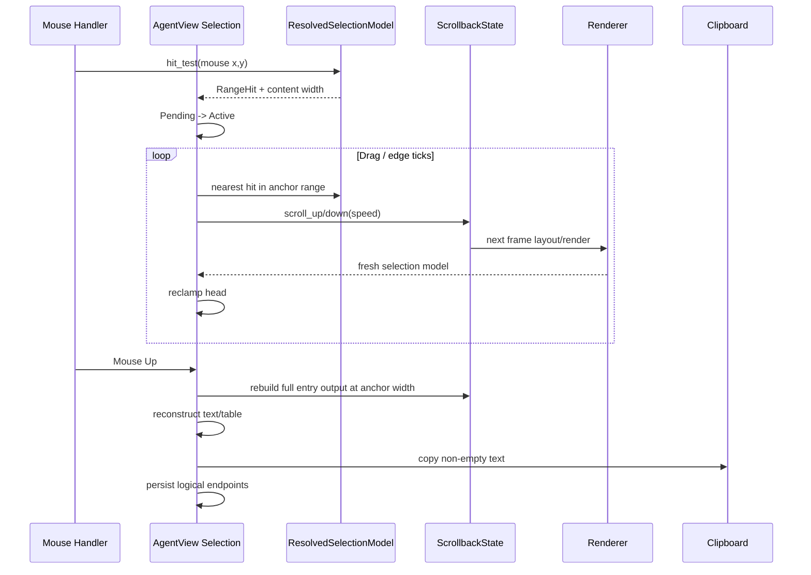

# Walkthrough：鼠标选择如何从屏幕坐标恢复成准确的文本与表格

> 源码核对版本：`ed6d543643628663873c5de28298e022ed634238`
>
> 本篇承接第 34 篇。上一篇解释 Scrollback Renderer 如何产出字符与交互几何；本篇从这些几何开始，追踪鼠标按下、拖动、滚动、释放和复制。

## 1. 这篇解决什么问题

终端中的“拖一下复制文字”看似简单，真正实现却必须同时处理：样式 Span、软换行、中文宽字符、滚出视口、Sticky Header、装饰字符、表格网格、异步重绘和系统剪贴板。

本篇回答：

- Renderer 如何为可选择文本建立命中模型；
- 屏幕坐标为何不能成为持久 Selection 坐标；
- Pending Drag、Active Drag、Persistent Selection 如何转换；
- Anchor 滚出屏幕后怎样复制完整内容；
- 双击词语、URL 与三击整行如何确定边界；
- Box-drawing Table 如何升级为 Cell/Grid 选择并输出 TSV；
- 选择高亮、搜索高亮和主题如何避免互相破坏；
- Text Drag 与 Block Drag、链接点击、折叠点击怎样消歧。

## 2. 一句话心智模型

Mouse Selection 是一次坐标翻译：屏幕 `(x,y)` 先命中稳定的 `(entry, range, block_line, display_col)`，之后显示与复制都从这组逻辑坐标重建。

## 3. 为什么不能复制屏幕 Buffer

屏幕只包含当前视口，且已经发生裁剪、换行、样式绘制和装饰添加。直接读 Buffer 会：

- 丢失视口外选择；
- 把边框、Bullet、Padding 一起复制；
- 无法恢复软换行；
- 把缩短路径当成真实路径；
- 把表格画线复制成数据。

## 4. 主要源码入口

- `scrollback/types.rs`：选择语义的源数据。
- `scrollback/render.rs`：把 Block Line 映射成屏幕几何。
- `scrollback/text_selection.rs`：命中、拖拽、重建和 Overlay。
- `scrollback/table_geometry.rs`：Box-drawing Table 检测与 Cell/Grid 提取。
- `app/agent_view/selection.rs`：选择状态机与复制收尾。
- `app/mouse.rs`：鼠标事件路由和点击优先级。
- `app/agent_view/notices.rs`：剪贴板调用与反馈。

## 5. 本篇非目标

本篇不展开鼠标滚轮的 Wheel/Trackpad 加速识别，也不完整分析剪贴板在 SSH、tmux、Wayland 和 OSC 52 间的路由；它们值得另写专题。

## 6. 第一层：Block 必须先声明什么可复制

`BlockLine` 的 `Selectable` 决定整行、部分 Span 或完全不可选择。Renderer 不能仅看屏幕上是否有字符。

这让 Header、Border、Accent 和内容具有不同复制语义。

## 7. `selection_range`

同一 Block Output 可以包含多个逻辑选择区域。每行用 `selection_range: Option<u16>` 声明所属 Range。

Text Drag 被限制在 Anchor 的同一 Range 内，不会穿过装饰分隔误选另一个语义区域。

## 8. 为什么 Range ID 不是 Entry ID

Entry ID 标识整个 Block 实例；Range ID 标识该 Block 内的一片连续、可复制语义。

两者共同定位，才不会把一个 Tool Header 的选择扩展到另一个结果区。

## 9. `selection_text`

可见文字和复制文字可以不同。比如短路径显示、带样式 Markdown、表格补齐空格，都可能需要专门的复制源。

`derive_selection_text` 优先采用显式 `selection_text`。

## 10. `joiner`

一个原始逻辑行换成多个视觉行时，复制时可能使用空字符串或空格连接；真正的硬换行则用 `\n`。

因此复制不能把每个渲染行机械地 `join("\n")`。

## 11. Selection Boundary

某些 Render Output 还携带边界 Sidecar。在选择覆盖完整行边缘时，它可以补回显示时省略的 Prefix/Suffix。

是否包含补充边界，取决于选择是否触及该行的真实左端或右端。

## 12. 显示列不是字节偏移

鼠标 Column 是终端 Cell 列。UTF-8 字符可能占多个 Byte；中日韩宽字符通常占两列；组合字符可能占零额外列。

选择算法使用 Grapheme 与 Unicode Display Width，而不是 String Byte Index。

## 13. `slice_display_cols`

该函数按 Grapheme 遍历并累计显示宽度，只在完整 Grapheme 落入目标列区间时复制。

它避免把一个宽字符从中间切断。

## 14. Glossary checkpoint：文本语义

| 名词 | 白话解释 | 在本篇中的具体含义 |
| --- | --- | --- |
| selectable | 用户允许复制的内容 | Block Line 的全部 Span、部分 Span 或 None |
| selection range | Block 内一次拖动不能跨出的逻辑区域 | `(entry_idx, range_id)` 共同标识 |
| sidecar | 与主体数据并行保存的附加信息 | Selection Boundary 保存省略前后缀 |
| grapheme | 用户眼中一个完整字符单元 | 字母与组合音标不会被拆开 |
| display column | 终端字符网格中的列数 | 与 UTF-8 Byte Offset 不相同 |
| soft wrap | 因宽度不足产生的视觉换行 | 复制时根据 `joiner` 恢复原连接 |

## 15. 第二层：Renderer 生成 `ResolvedSelectionModel`

Renderer 在每帧知道最终 Screen X/Y、裁剪和 Wrap，因此由它产生当前帧可用于 Hit Test 的选择模型。

输入层不应再次猜测 Markdown 如何换行。

## 16. `ResolvedSelectableLine`

每个当前可见选择行保存：

- Entry Index；
- Range ID；
- Block 内稳定行号；
- Screen X/Y；
- 可选择列区间；
- 复制源文本；
- 与前一行的 Joiner。

## 17. `block_line_idx` 是稳定核心

它是该行在完整 Block Output 中的索引，不是当前 `range.lines` 数组位置。

视口滚动后，可见数组会截短，但同一内容的 Block Line Index 不变。

## 18. Screen X/Y 是临时映射

Screen 坐标只对当前 Frame 有效。Resize、Scroll、Sticky Header 和 Fold 都会改变它。

所以 Persistent Selection 不保存 Screen 坐标。

## 19. `VisibleBlockGeometry`

除逐行文本外，模型还记录可见 Block 的 Area、Content Area、Selection Area、Content Width、上下裁剪与是否可发起 Block Drag。

Text Selection 和整块选择共享同一帧几何事实。

## 20. Content Width 快照

Block Line Index 取决于当时的 Wrap Width。拖拽开始时保存 Anchor Block 的 `content_width`。

Mouse Up 时 Anchor 即使滚出视口，也能用相同宽度重建同一套 Block Lines。

## 21. 为什么不能用 Pane Width 替代

时间戳、Accent、Bullet 和布局列会扣除不同宽度。Pane Width 重新渲染出的换行可能与命中时不同，使 Block Line Index 指向错误文本。

必须使用 `VisibleBlockGeometry` 记录的实际 Content Width。

## 22. `ResolvedSelectionBoundaries`

Renderer 把 Block 的边界信息解析到 `(entry, range, block_line)`，与当前 Selection Model 并行保存。

复制时只为真正对应的行应用 Boundary。

## 23. Synthetic Group Header

折叠组 Header 不是普通隐藏 Entry 内容。它可使用保留的特殊 Range ID，但纯计数 Header 也可以完全不可选择。

这样隐藏 Tool 的链接和文字不会从 Header 泄漏出来。

## 24. Glossary checkpoint：解析后几何

| 名词 | 白话解释 | 在本篇中的具体含义 |
| --- | --- | --- |
| resolved | 已经结合本帧布局得到具体坐标 | `ResolvedSelectionModel` |
| geometry | 对象在屏幕或 Block 坐标系中的形状 | Line、Block、Table 的位置和范围 |
| hit test | 从鼠标位置查找命中对象 | 将 `(column,row)` 转换成 `RangeHit` |
| block line index | 行在完整 Block Output 中的位置 | 滚动裁剪后仍稳定的行标识 |
| content width | Block 实际用于换行的宽度 | 拖拽开始时快照，复制时复用 |
| synthetic row | UI 为折叠等目的生成的行 | 不一定对应原始会话内容 |

## 25. 第三层：`RangeHit` 是鼠标到逻辑文本的桥

`RangeHit` 保存 Entry Index、Range ID、Block Line Index 和 Range 内 Display Column。

Anchor 与 Head 都使用它。

## 26. 按下时的 Hit Test

`begin_pending_text_drag` 调用 `hit_test_selectable_range`，在同一 Screen Row 上选择距离最近的可选择列。

若直接命中文字，距离为零并立即返回。

## 27. Exact Hit 与 Nearest Hit

`hit_test_text_exact` 只接受指针直接落在可选择列，用于点击消歧；`hit_test_selectable_range` 可吸附同一行最近文字，用于开始 Drag。

二者服务不同交互，不能混用。

## 28. 为什么点击边框要 Exact

用户点击 Accent、Border 或 Padding，通常是想选 Block 或切换 Fold，而非文字。

若所有点击都吸附最近文字，Block 级操作会被 Text Selection 吞掉。

## 29. Drag Head 的 `hit_test_nearest_in_range`

拖动后 Head 只在 Anchor 的 `(entry, range)` 中寻找最近行，不会跳到相邻 Range。

指针经过 Gap、Vertical Padding 或 Chrome Row 时仍保持自然延伸。

## 30. Tie Break

两行离指针距离相同时，算法倾向离 Anchor 更远的一行。

这样跨过死区时 Selection 继续扩展，而不是突然退回。

## 31. Anchor 完全滚出后的限制

当前帧模型可能已没有 Anchor Range 的任何行，此时 Nearest Hit 返回 `None`，状态机保留上一个 Head。

下一帧或自动滚动重新出现相关行后再校准。

## 32. Glossary checkpoint：命中

| 名词 | 白话解释 | 在本篇中的具体含义 |
| --- | --- | --- |
| RangeHit | 鼠标命中的稳定文本坐标 | Entry、Range、Block Line、Display Col |
| exact hit | 必须直接落在文字上 | 防止边框点击被文本操作吞掉 |
| nearest hit | 吸附到指定范围内最近文字 | Drag 穿越空行时保持连续 |
| anchor | 选择固定起点 | Mouse Down 命中的 `RangeHit` |
| head | 随鼠标移动的另一端 | 可在 Anchor 前面或后面 |
| chrome row | 纯 UI 外壳行 | Border、Header、间隔等非正文区域 |

## 33. 第四层：为什么先进入 Pending Drag

Mouse Down 只建立 `PendingTextDrag`，记录 Anchor、按下坐标和 Content Width，不立即算作一次拖动。

这给普通点击、双击和 Drag 留出消歧空间。

## 34. Drag Threshold

当前阈值是横向或纵向至少移动一列/一行。超过后 Pending 才提升为 Active。

阈值虽小，仍能区分没有移动的 Click Release。

## 35. `arm_text_drag`

统一的 Arming 尾部会：

1. 必要时检测 Table Geometry；
2. 解析初始 Selection Kind；
3. 建立 `ActiveTextDrag`；
4. 保存最近鼠标位置。

普通阈值提升和 Deferred Press 转换都走这里，避免状态分叉。

## 36. Active Drag

`ActiveTextDrag` 保存 Anchor、Head、Selection Kind 和 Anchor Content Width。

移动事件更新 Head，并根据表格 Geometry 重新解析 Kind。

## 37. Deferred Text Press

如果按下点没有文字，但随后拖入可选择文字，系统可把第一次进入文字的点变成 Anchor，并取消正在进行的 Block Drag。

转换是单向的：一旦成为 Text Drag，本次手势不再退回 Block Drag。

## 38. Text Drag 与 Block Drag

Text Drag 复制一个 Range 内的字符；Block Drag 选择多个完整 Entry，并按每个 Block 的 `copy_visible_text_in_state` 复制。

二者拥有独立 Pending/Active 状态。

## 39. Block Drag 跳过什么

整块复制会跳过不支持 Drag Copy 的 Block，以及被折叠 Group 隐藏的 Entry。

BgTask 在可能时从 Session State 读取完整 stdout，而不局限于可见摘要。

## 40. Release 收敛

`finish_text_drag` 先尝试重建文本，然后清空 Pending、Active、Autoscroll 和 Last Mouse。

只有重建得到非空文本时才复制并留下 Persistent Highlight。

## 41. 为什么失败时不保留 Highlight

高亮表示“这段内容已被选中并复制”。若重建失败仍显示高亮，用户会误以为剪贴板已有内容。

UI Feedback 必须跟随真正复制结果。

## 42. Persistent Selection

Mouse Up 后保存 Entry、Range、两个 `SelectionEndpoint`、Origin 和 Kind。

它不保存屏幕坐标，因此后续 Frame 可以重新映射到当前位置。

## 43. Highlight 生命周期

Persistent Highlight 可由下一次点击、Escape 或 Scrollback Navigation 清除；默认还会超时消失。

`keep_text_selection` 配置可禁止 Timer 自动清理，但不阻止显式清理。

## 44. Stuck Drag 恢复

终端有时会漏掉 Mouse Up。`clear_stuck_scrollback_drag` 一次性清除 Mouse Down、Scrollbar、Text/Block Pending/Active、Deferred Press、Autoscroll 和 Last Mouse。

恢复路径要清理所有关联 Latch，不能只清一个 Bool。

## 45. Glossary checkpoint：状态机

| 名词 | 白话解释 | 在本篇中的具体含义 |
| --- | --- | --- |
| pending | 已按下但尚未确认手势 | 等待移动阈值或 Click Release |
| active | 已确认正在拖动 | 持续更新 Head 和 Overlay |
| persistent | Mouse Up 后暂时保留 | 稳定逻辑坐标形式的选择高亮 |
| latch | 一旦进入便保持到明确结束的状态 | Mouse Down、Drag、Table Head 等 |
| deferred press | 起点无文字、等待拖入文字的按压 | 可从 Block 手势单向转换为 Text Drag |
| origin | 选择是怎样产生的 | Drag、Double Click 或 Triple Click |

## 46. 第五层：拖出视口后的自动滚动

拖动到 Scrollback 顶部/底部附近时，`compute_autoscroll` 返回方向与每 Tick 行数。

指针回到舒适内部区域或手势结束后，状态清除。

## 47. Edge Zone

距离 Content Area 上下边缘两行以内也会触发慢速滚动，不必把鼠标真正移出终端。

这符合常见文本编辑器的拖选体验。

## 48. 距离决定速度

越过边缘越远，速度从每 Tick 1 行提升到 2、3、最高 5 行。

它是分段速度，不是无限线性增长。

## 49. Tick 驱动而非 Mouse Move 驱动

用户把指针停在边缘时不会继续产生 Move Event。App Tick 主动调用 `tick_drag_autoscroll` 才能持续滚动。

这也是 App 判断“当前是否需要动画 Tick”的条件之一。

## 50. 旧模型与新模型之间

Tick 先滚动 State，此时缓存的 Selection Model 仍来自前一帧。代码用旧模型做即时近似，让 Overlay 不冻结。

下一次 Render 重建模型后，再执行 Post-render Reclamp 得到准确 Head。

## 51. 为什么需要 `last_drag_mouse`

Render 后校准需要知道指针仍停在哪里，即使自上次 Tick 后没有新的 Mouse Event。

因此 Active Drag 保存最后坐标作为临时输入，而非持久 Selection 坐标。

## 52. Btw Overlay 的边界

`/btw` 有独立 Selection Model，并用保留 Entry Index 标识。它的 Text Drag 不驱动主 Scrollback Autoscroll。

主时间线和 Overlay 的坐标模型不能混合。

## 53. Block Drag 的 Long-block Snap

整块拖选自动滚动时，当前 Head Block 可能完全离开可见集合。状态机会沿滚动方向选择下一可见 Block，避免 Head 卡死。

## 54. Glossary checkpoint：自动滚动

| 名词 | 白话解释 | 在本篇中的具体含义 |
| --- | --- | --- |
| autoscroll | 拖到边缘时自动滚动内容 | Tick 驱动 Scrollback 上下移动 |
| edge zone | 靠近视口边缘的触发带 | 当前为上下两行 |
| tick | App 定期执行的一次时间步 | 即使无 Mouse Move 也能继续滚动 |
| stale model | 仍描述上一帧屏幕的模型 | Scroll 后、Render 前暂时使用 |
| reclamp | 用新帧几何重新吸附 Head | 修正旧模型即时估算 |

## 55. 第六层：线性选择怎样确定每行列范围

同一行时选择 `min(anchor_col, head_col)..max+1`。

跨行时，第一行从端点到行尾，中间行全选，最后一行从行首到端点。

## 56. 反向拖拽

Anchor 可以位于 Head 之后。算法先按 Block Line Index 规范化首尾，再判断哪个端点属于开始行。

用户向左上拖和向右下拖应得到同样文本。

## 57. Display Width Clamp

所有端点都会钳制到该行可选择宽度。鼠标位于行外不会产生越界 Slice。

空宽度行自然得到空 Range。

## 58. 当前帧重建

`reconstruct_selection_text` 只能访问 Selection Model 中当前可见行，适合作为快速或降级路径。

若选择端点都滚出屏幕，它可能返回 `None`。

## 59. 完整 Block 重建

正常 Mouse Up 优先用 Anchor Width 重新取得 Entry 的完整 Effective Output，再调用 `reconstruct_full_selection_text_with_boundaries`。

这能包含已经滚出视口的中间行。

## 60. 为什么必须限定同一 Range

完整 Output 中可能夹有其他 Range 或不可选择行。重建只接收与 Anchor `range_id` 相同的 Block Line。

否则一次 Drag 会穿过 Block 内的语义边界。

## 61. Fallback

若 Entry、Width 或完整输出不可用，系统退回当前 Selection Model 的可见文本重建。

降级可能不完整，但比错误索引或 Panic 更安全。

## 62. Boundary 应用条件

只在选择从该行 Display Col 0 开始时加入 Prefix，只在选择到可见宽度末尾时加入 Suffix。

部分选择不能偷偷附加用户没选中的隐藏文字。

## 63. Overlay 与 Copy 共享列算法

Active/Persistent Overlay 和文本重建都依赖同样的 Endpoint 列规则。

视觉高亮若与复制采用两套范围计算，最容易出现“亮了 A，复制了 B”。

## 64. Selection Highlight 样式

彩色主题用统一背景/前景 Band 覆盖原 Span 样式；无色或原生主题退回 `REVERSED`。

这样 Inline Code、链接和语法高亮在被选中时形成连续色带。

## 65. 与 Search Highlight 的冲突

Search 可能早一步设置 `REVERSED`。Selection Paint 会先移除该 Modifier，再设置自己的 Band，避免二次反转把选择抵消。

后绘制的 Selection 是当前交互的更高优先级 Feedback。

## 66. Glossary checkpoint：重建与绘制

| 名词 | 白话解释 | 在本篇中的具体含义 |
| --- | --- | --- |
| endpoint | 一次选择的两个端点之一 | Block Line Index + Range 内 Display Col |
| reconstruction | 从逻辑端点重新生成字符串 | 不从屏幕 Buffer 抄字符 |
| effective output | 给定 Width/Mode 后 Block 的完整输出 | 用于视口外完整复制 |
| clamp | 把值限制在合法范围 | 防止列端点越过文本宽度 |
| overlay | 主内容画完后叠加的视觉层 | 选中区域的统一高亮 |
| reversed | 交换前景色与背景色 | 无色主题的选择退化样式 |

## 67. 第七层：双击优先选择完整 URL

`semantic_selection_at` 先调用 `url_range_at_col`；只有当前列不在 URL 内时才按 Word Boundary 选择。

这是因为 URL 中包含许多普通分隔符，按词规则会只选其中一段。

## 68. URL Scheme 范围

实现识别 `http`、`https`、`ftp` 与 `file` Scheme，并做大小写不敏感处理。

只有 Scheme 标记而没有有效主体的退化字符串不会被当作 URL。

## 69. 尾随标点

自然语言中的句号、逗号、感叹号、分号和冒号会从 URL 尾部剥离。

括号则需要判断是否平衡：URL 自身的成对括号保留，正文多出的右括号剥离。

## 70. Word Boundary

非 URL 时，`word_boundaries_at_col` 按 Grapheme 分类为 Word、Whitespace 或 Separator，并扩展同类连续区间。

点在空白或标点上时，也会选择该连续类别，而非总是跳到单词。

## 71. 可配置 Separators

分隔字符来自配置，默认行为兼容常见 tmux Word Separator 习惯。下划线不一定是分隔符。

这让路径、标识符和邮箱样式文本的双击体验可调。

## 72. 双击状态的身份

只有在超时时间内，并且新点击与上次位于同一 Entry、Range 和 Block Line，Click Count 才递增。

仅按时间计数会把相邻行的两个普通点击误判成双击。

## 73. 三击整行

Triple Click 建立覆盖当前可选择行完整宽度的 Persistent Selection，并立即复制应用 Boundary 后的整行文本。

宽度为零时不建立选择。

## 74. 三击表格内容

若命中可证明的 Table Cell，三击选择整个 Cell，包括它的多行 Wrapped Fragment。

若命中 Table Border/Divider，三击可以选择整个 Table 并输出 TSV。

## 75. Debounced Clipboard

双击和三击等多击手势会在很短时间产生多次候选复制，因此使用 Debounced Copy 降低重复剪贴板写入与提示噪声。

普通 Drag Release 使用直接 Copy。

## 76. Glossary checkpoint：多击选择

| 名词 | 白话解释 | 在本篇中的具体含义 |
| --- | --- | --- |
| semantic selection | 按内容含义选择而非逐字符拖 | 双击优先 URL，否则选 Word 类别 |
| word boundary | 一个连续词语/空白/标点区间 | 由 Grapheme 分类和可配置 Separator 决定 |
| scheme | URL 开头的协议类别 | `https://`、`file://` 等 |
| double click | 短时间内同一逻辑行连续两击 | 选择 URL 或 Word |
| triple click | 同一逻辑行连续三击 | 选择整行、Cell 或整表 |
| debounce | 合并短时间内重复动作 | 避免多击期间重复写剪贴板 |

## 77. 第八层：表格检测为什么保守

终端里出现 `│` 不代表一定是表格。错误识别会把普通文字选择强制变成矩形 Cell 选择。

`TableGeometry::detect` 只接受完整闭合、列 Junction 一致的 Box-drawing Grid。

## 78. 支持的 Border Family

检测识别：

- Top：`┌─┬─┐`
- Divider：`├─┼─┤`
- Bottom：`└─┴─┘`
- Content：在相同 Junction Column 上出现 `│`

列位置必须使用 Display Column 比较。

## 79. Prefix 容忍

表格前可以有缩进或 Blockquote Bar。检测允许空格和 `│ ` 风格 Quote Prefix，但其他前置字符会使检测失败。

这让引用中的 Markdown Table 仍可按 Cell 选择。

## 80. 完整包围验证

从 Anchor Line 向上寻找 Top Border，再向下验证每一行直到 Bottom Border。

未闭合、Junction 不一致、网格外文字或异常 Border 顺序都会返回 `None`。

## 81. 搜索上限

从内容行向上寻找 Junction 有有限上限，并有廉价 Prefix Plausibility Gate。

普通长段落不会触发无限向上扫描。

## 82. `CellRef`

Cell 用逻辑 Row/Column 标识。Header Row 也从零开始计入。

它与 Screen Row/Column 不同；一个 Cell 可以跨多个 Block Line。

## 83. Column Band

一个 Cell 的 Band 是相邻两条竖线之间的 Display Column Range，包含 Padding，不包含 Border Glyph。

复制时 Slice 后再 Trim。

## 84. `cell_at`

内容行与列位置解析为 Cell；Border Row 返回 `None`。点击竖线时按规则吸附相邻 Cell，Closing Border 吸附左侧 Cell。

这个规则服务 Click；Drag Hysteresis 还有更保守的规则。

## 85. Wrapped Cell

一个逻辑 Row 可以包含多条内容行，表示 Cell 内文字换行。`row_lines` 保存连续 Block Line Range。

`cell_text` 提取每个 Fragment、Trim，并用空格连接。

## 86. 为什么输出 TSV

Grid Selection 的 Cell 用 Tab 连接、Row 用 Newline 连接。粘贴到 Spreadsheet 时能恢复矩形结构。

Cell 内原有 Tab 被替换为空格，避免破坏 TSV 列数。

## 87. Glossary checkpoint：表格几何

| 名词 | 白话解释 | 在本篇中的具体含义 |
| --- | --- | --- |
| box-drawing | 终端画框使用的 Unicode 字符 | `┌ ┬ ┐ │ ├ ┼ ┤ └ ┴ ┘` |
| junction | 横竖线相交的列位置 | Table Geometry 的稳定 Column Boundary |
| CellRef | 表格中一个逻辑单元格坐标 | `(row, col)`，不是屏幕坐标 |
| band | 两条竖线之间的列区间 | Cell 可高亮/提取的范围 |
| wrapped fragment | 同一 Cell 因宽度分成的多行片段 | 复制时 Trim 后用空格重组 |
| TSV | Tab 分列、换行分行的文本表格 | Grid Selection 的剪贴板格式 |

## 88. 第九层：Table Selection Kind 的状态转换

`SelectionKind` 有 `Linear`、`TableCell`、`TableGrid { anchor, head }`。

Table Kind 必须配套与同一 Entry/Range 对应的 `TableSelectionGeometry` Sidecar。

## 89. Anchor 在 Grid Line 上

若 Anchor 不能解析到 Cell，Drag 保持 Linear。边框拖拽不会神秘变成矩形表格选择。

三击 Border 是明确的整表快捷操作，属于另一条路径。

## 90. 同一 Cell 内拖动

Anchor 与 Head 仍落在同一 Cell 时，Kind 为 `TableCell`。端点被钳制在该 Cell 的行范围和 Column Band 内。

高亮与复制只覆盖 Cell 中实际非空内容。

## 91. 跨 Cell 拖动

Head 明确进入另一个 Cell Content Interior 后，Kind 变为 `TableGrid`，保存 Anchor Cell 与 Head Cell。

最终选择两者张成的矩形 Cell Range。

## 92. Hysteresis

Head 经过 Border、Padding、Divider 或空 Cell 时保持先前 Held Cell；只有进入另一个 Cell 的内容内部才移动。

这防止鼠标在边界附近抖动导致 Cell/Grid 模式反复跳变。

## 93. 越过 Grid 外边缘

Head 明确越过左/右或上/下外边缘时会钳制到首尾 Cell，允许自然扩展到整表边界。

Grid 内的死区则保持 Held Cell。

## 94. Table Sidecar Staleness

Sidecar 带 Entry Index 与 Range ID。消费者必须核对 Key；不匹配时视为无 Geometry。

Table Kind 若缺 Geometry，Overlay 宁可不画，也不伪装成 Linear Highlight。

## 95. 表格复制降级

若 Table Reconstruction 失败，可退回 Linear Copy。此时持久 Selection Kind 也必须记录为 Linear，并丢弃孤立 Sidecar。

视觉形状要对应实际复制形状。

## 96. 表格 Overlay

Grid 模式逐 Cell Band 绘制，不覆盖 Border；Cell 模式只绘制单 Cell 内两个端点之间的 Fragment。

列 Range 还会裁到真实非空内容，使 Padding 不产生虚假高亮。

## 97. Glossary checkpoint：表格状态机

| 名词 | 白话解释 | 在本篇中的具体含义 |
| --- | --- | --- |
| SelectionKind | 本次选择采用的几何形状 | Linear、TableCell、TableGrid |
| hysteresis | 进入新状态比保持旧状态需要更明确证据 | 边框和 Padding 不改变 Held Cell |
| held cell | Head 暂时锁定的 Cell | 只有进入其他 Cell Interior 才更新 |
| sidecar geometry | 与选择并行保存的表格结构 | Key 必须匹配 Entry 与 Range |
| degrade | 特殊路径失败后退回通用行为 | Table Reconstruction 失败则 Linear Copy |

## 98. 第十层：鼠标事件路由顺序

`app/mouse.rs` 先处理 Overlay Close、Badge、按钮、CTA、Prompt 等更具体 Hit Rect，再进入 Scrollback Text/Block/Link 逻辑。

鼠标位置可能同时靠近多个视觉对象，路由优先级本身就是功能语义。

## 99. Link Click 与 Text Selection

链接激活通常要求合适 Modifier 或原生链接能力，并且不能在拖拽手势结束时误触发。

Pending/Active Drag 状态用于抑制 Hover 与 Click-through。

## 100. Click Release 不能只看落点

Mouse Down 在文字、Drag 离开后于链接上 Release，不应打开链接。手势需要结合起点 Latch 与是否已超过 Drag Threshold 判断。

否则“复制 URL”会变成“打开 URL”。

## 101. Selection 与 Fold Click

Exact Text Hit 进入文本点击计数；Border/Chrome Hit 可以落到 Block Selection 或 Fold Toggle。

Nearest Text Hit 只用于 Drag，不应改变普通点击优先级。

## 102. 多 Pane/子 Agent

选择可能作用于主 Scrollback、当前 Subagent Scrollback 或 Btw Overlay。取得完整 Entry Output 和执行 Autoscroll 时必须选择相同拥有者。

只看主 `self.scrollback` 会复制错误时间线。

## 103. Clipboard 不是 Selection State

Selection State 负责决定“复制什么”；Clipboard 模块负责“怎样交付给本地或终端环境”。

两者分层后，OSC 52、系统 Clipboard 或远端失败不会污染文本几何算法。

## 104. Copy Feedback

`copy_to_clipboard` 还负责相应用户反馈。选择状态机不应假定每次调用都得到同等级的已确认交付。

远端 Clipboard 可能是 Confirmed、Unverified 或 Failed。

## 105. Glossary checkpoint：路由与交付

| 名词 | 白话解释 | 在本篇中的具体含义 |
| --- | --- | --- |
| hit rect | 一个可点击控件的屏幕矩形 | Close、Button、Link 等缓存区域 |
| routing priority | 多个候选命中时先处理谁 | Mouse Handler 的分支顺序 |
| click-through | 拖动结束被误当成底层点击 | Selection 必须抑制 Link/Fold 激活 |
| clipboard delivery | 文本怎样到达用户剪贴板 | 系统 API、OSC 52 或远端桥接 |
| OSC 52 | 终端设置剪贴板的转义协议 | 远程场景可能使用的交付路线 |
| unverified | 已尝试发送但无法确认最终到达 | 不等于 Selection Reconstruction 失败 |

## 106. 完整 Drag Walkthrough

一次跨多行、拖出底部的选择经过：

1. Frame Render 生成 `ResolvedSelectionModel`；
2. Mouse Down 命中 `RangeHit`；
3. 保存 Pending 与 Content Width；
4. Mouse Drag 超过阈值；
5. `arm_text_drag` 建立 Active Selection；
6. 每次移动用 Nearest-in-range 更新 Head；
7. 接近底部时建立 Autoscroll；
8. App Tick 推进 Scroll Offset；
9. Render 新 Frame；
10. Post-render Reclamp 用新几何修正 Head；
11. Mouse Up 用原 Width 重建完整 Block Output；
12. 按 Anchor/Head、Joiner、Boundary 生成文本；
13. 非空结果写 Clipboard；
14. 保存 Persistent Logical Endpoints；
15. 后续 Frame 把 Endpoints 映射为 Highlight。

## 107. 时序图



## 108. 常见误解：Selection 保存屏幕矩形

错误。Active/Persistent Text Selection 保存 Block 内逻辑坐标。屏幕矩形只存在于当前 Frame 的 Resolved Model。

否则一滚动高亮就会粘在错误文字上。

## 109. 常见误解：每条可见 Line 都应复制换行

错误。视觉 Wrap 可能使用空 Joiner 或空格；只有硬换行才使用 `\n`。

复制必须重建源结构。

## 110. 常见误解：双击按 Byte 找词

错误。鼠标给的是 Display Column，算法按 Grapheme 与 Unicode Width 扩展 Boundary。

Byte Offset 只适合字符串内部索引，不适合终端坐标。

## 111. 常见误解：表格中出现 `│` 就进入 Cell 模式

错误。系统要求完整 Top/Divider/Bottom、相同 Junction 和合法 Content Row。

无法证明就保持 Linear。

## 112. 常见误解：高亮成功就代表复制成功

错误。代码只在 Reconstruction 得到非空结果后保存 Drag Persistent Highlight；Clipboard Delivery 还可能受外部环境影响。

高亮、文本生成和最终交付是三个阶段。

## 113. 常见误解：当前可见模型足够复制

错误。Anchor 或中间行可能已滚出视口。完整复制优先重新取得完整 Block Output。

Visible Model 只是降级路径。

## 114. 失败模式：Width 不一致

症状包括复制漏行、端点偏移、点击一行却复制相邻行。

检查 Drag Start 是否保存真实 Content Width，以及 Full Output 是否用同一 Width 重建。

## 115. 失败模式：Range 泄漏

症状是 Tool Header 与 Body 被一次拖选串在一起，或装饰文字混入 Clipboard。

检查 Full Reconstruction 是否过滤 `selection_range == anchor.range_id`。

## 116. 失败模式：Autoscroll Head 卡住

症状是屏幕在滚，但高亮端点停在旧行。

检查 Last Mouse、Tick 近似更新和 Post-render Reclamp 是否都在运行。

## 117. 失败模式：Table Mode 抖动

症状是指针经过 Padding/Border 时 Selection 在 Cell 与 Grid 间闪烁。

检查 `latched_cell_at` 是否只在新 Cell Content Interior 更新 Held Cell。

## 118. 失败模式：复制内容和高亮不一致

重点核对 Overlay 与 Reconstruction 是否共享 Endpoint Range、Display Width Slice、Boundary 与 Table Geometry。

Table 降级为 Linear 后还必须同步 Persistent Kind。

## 119. 失败模式：漏掉 Mouse Up

症状是之后 Hover 被永久抑制或 Scrollback 持续自动滚动。

恢复路径必须调用统一的 Stuck Drag Cleanup，清除全部 Latch。

## 120. 修改选择系统的检查清单

- 新 Block Line 是否正确声明 `Selectable`？
- `selection_text` 是否与显示文字不同？
- 软换行 `joiner` 是否正确？
- 新装饰行是否有独立 Range 或 None？
- Display Column 是否按 Grapheme 计算？
- Resize/Scroll 后 Block Line Index 是否稳定？
- Anchor 滚出视口能否完整复制？
- Text/Block/Link Click 是否消歧？
- Highlight 与 Clipboard 文本是否一致？
- Table 识别失败是否安全退回 Linear？

## 121. 推荐验证命令

```sh
cargo test -p xai-grok-pager 'scrollback::text_selection::tests' --lib -- --test-threads=1
cargo test -p xai-grok-pager 'scrollback::table_geometry::tests' --lib -- --test-threads=1
cargo test -p xai-grok-pager 'app::agent_view::selection::tests' --lib -- --test-threads=1
cargo test -p xai-grok-pager 'input::mouse::tests' --lib -- --test-threads=1
```

## 122. 推荐源码阅读顺序

1. `scrollback/types.rs` 的 `BlockLine`、`Selectable`、`slice_display_cols`；
2. `scrollback/text_selection.rs` 的数据结构和 Hit Test；
3. 同文件的 Linear Reconstruction 与 Overlay；
4. `app/agent_view/selection.rs` 的 Pending/Active/Persistent 转换；
5. `table_geometry.rs` 的保守检测；
6. 回到 `resolve_table_drag_kind` 与 Table Reconstruction；
7. 最后读 `app/mouse.rs` 的大路由顺序。

## 123. 自测题

1. 为什么 Persistent Selection 不保存 Screen X/Y？
2. `hit_test_text_exact` 与 `hit_test_nearest_in_range` 分别服务什么交互？
3. Anchor Content Width 为什么必须在 Mouse Down 时快照？
4. Joiner 如何区分硬换行、单词软换行与词中断行？
5. 为什么 Table Drag 需要 Hysteresis？
6. Anchor 在 Border 上时，为何 Drag 保持 Linear，而 Triple Click 可以选整表？
7. 为什么 Mouse Up 后优先从完整 Block Output 复制？
8. Selection Highlight 为什么要覆盖 Search 的 `REVERSED`？

## 124. 小练习一：中文宽字符

构造 `ab中文cd`，记录每个 Grapheme 的 Byte Offset 与 Display Column。模拟从“中”的第一列拖到“文”的第二列，确认 Slice 不会产生半个字符。

## 125. 小练习二：软换行重建

构造三个视觉行，Joiner 分别为 `None`、`Some(" ")`、`Some("")`，观察完整复制结果。

解释哪一行代表原始换行、单词边界换行和词中换行。

## 126. 小练习三：表格降级

从合法 Box Table 开始，依次删除 Bottom Border、移动一个 Junction、在 Closing Border 后增加文字。

确认 `TableGeometry::detect` 返回 `None`，并解释为什么宁愿 Linear 也不误判。

## 127. 本篇术语表

| 名词 | 白话解释 | 在本篇中的具体含义 |
| --- | --- | --- |
| Mouse Selection | 用鼠标选择并复制内容 | Text Drag、Block Drag、多击选择的总称 |
| Selection Model | 当前帧可命中的文字与 Block 几何 | Renderer 生成的 `ResolvedSelectionModel` |
| RangeHit | 屏幕命中后的逻辑坐标 | Entry、Range、Block Line、Display Column |
| Pending Drag | 已按下但尚未移动到阈值 | 保留普通点击与拖拽消歧 |
| Active Drag | 正在更新 Head 的拖拽 | 每帧可绘制 Overlay |
| Persistent Selection | Mouse Up 后保留的逻辑选择 | 可跨后续重绘重新映射高亮 |
| Anchor | 选择起点 | 在本次 Drag 中保持固定 |
| Head | 选择活动端点 | 跟随鼠标与 Autoscroll 更新 |
| Endpoint | 不含屏幕位置的端点 | Block Line Index + Display Column |
| Display Column | 终端 Cell 坐标 | 按 Unicode Width 计算 |
| Grapheme | 用户感知的完整字符 | 防止组合字符或宽字符被拆分 |
| Range ID | Block 内选择区域编号 | Drag 不跨越 Anchor Range |
| Joiner | 复制时连接相邻渲染行的字符串 | Newline、Space 或 Empty String |
| Selection Boundary | 完整选择行边缘时补回的信息 | Rendered Output 的 Sidecar |
| Hit Test | 屏幕坐标到逻辑对象的查询 | Exact、Nearest、Block 三类行为 |
| Autoscroll | 拖到边缘后的自动滚动 | Timer Tick 驱动而非仅靠 Mouse Move |
| Reclamp | 新帧后重新计算 Head | 消除使用旧 Selection Model 的误差 |
| Overlay | 内容上方的选择高亮层 | 不改变原 Block Content |
| Block Drag | 按完整 Entry 范围复制 | 不同于同一 Range 内的 Text Drag |
| Semantic Selection | 按 URL/Word/Line 含义选择 | Double/Triple Click 路径 |
| Separator | 双击划分 Word 的字符集合 | 可由配置调整 |
| Table Geometry | 被证明合法的表格结构 | Border、Junction、Row、Band、Cell |
| CellRef | 表格逻辑单元格坐标 | Row/Column，不依赖屏幕位置 |
| TableCell | 限制在一个 Cell 内的选择 | 可跨该 Cell 的 Wrapped Lines |
| TableGrid | 多个 Cell 的矩形选择 | Clipboard 输出 TSV |
| Hysteresis | 边界附近保持原状态的机制 | Padding/Border 不改变 Held Cell |
| TSV | Tab 分列、Newline 分行的文本 | 表格矩形复制格式 |
| Clipboard | 操作系统或终端提供的剪贴板 | 接收重建后的最终字符串 |
| OSC 52 | 终端剪贴板转义序列 | 远端交付的一种机制 |

## 128. 核心不变量汇总

1. Screen 坐标只用于当前帧 Hit Test，逻辑 Selection 不以它持久化。
2. Text Endpoint 使用稳定 Block Line Index 与 Display Column。
3. Drag 只能在 Anchor 的 Entry/Range 内扩展。
4. Full Copy 使用 Drag Start 的真实 Content Width 重建 Output。
5. Unicode Slice 不能拆分 Grapheme。
6. Overlay 与 Copy 必须共享相同 Endpoint 和范围算法。
7. Persistent Highlight 只在非空重建成功后建立。
8. Autoscroll 使用 Tick 推进，并在新 Frame 后 Reclamp。
9. Table Detection 失败必须退回 Linear，不猜测结构。
10. Table Kind 与 Geometry Sidecar 的 Entry/Range Key 必须匹配。
11. Grid Border 与 Padding 不得进入 TSV。
12. Drag 手势结束不能 Click-through 到 Link 或 Fold。

## 129. 源码依据

- `scrollback/types.rs`：`BlockLine`、`Selectable`、Display-column Slice 和 Boundary。
- `scrollback/render.rs`：构建选择 Line、Visible Block Geometry 与 Boundaries。
- `scrollback/text_selection.rs`：所有 Selection 数据结构、Hit Test、Overlay、Autoscroll、Word/URL 与 Reconstruction。
- `scrollback/table_geometry.rs`：Box Grid 检测、Cell Mapping、Hysteresis 和 TSV。
- `app/agent_view/selection.rs`：Selection 状态所有权、Drag 转换、完整复制、多击与 Sidecar。
- `app/mouse.rs`：Mouse Down/Drag/Up 路由、链接和 Block 操作消歧。
- `app/app_view.rs`：Tick 驱动 Selection Timer 与 Drag Autoscroll。
- `app/agent_view/notices.rs`：Clipboard 调用和用户反馈。

## 130. 最终心智模型

当用户从终端一行文字拖到另一行时，系统不是框选一块屏幕像素，也不是复制 Buffer 中的字符。它先利用本帧 Renderer 的几何把鼠标映射到稳定 Block 坐标；手势期间不断更新逻辑 Head；释放时按原始宽度重建完整 Block Output，再依据 Range、Joiner、Boundary、Unicode Width 和可选的 Table Geometry 生成真正文本。

正因为选择的“身份”与“显示位置”被分开，滚动、裁剪、重绘和样式变化才不会改变用户最终复制到的内容。
