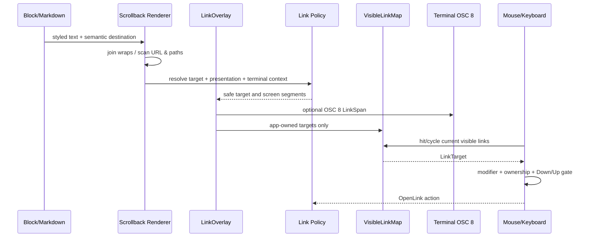

# Walkthrough：链接如何从文本语义变成安全、可点击的终端目标

> 源码核对版本：`ed6d543643628663873c5de28298e022ed634238`
>
> 本篇承接 Scrollback 渲染与鼠标选择。它研究 URL、Markdown Link 和文件路径如何获得屏幕区域，怎样在终端原生 OSC 8 与应用点击之间分工，以及为什么某些“看起来像链接”的文字会被有意过滤。

## 1. 这篇解决什么问题

终端中的蓝色下划线并不等于一个完整链接系统。Grok Pager 必须同时决定：目标是什么、屏幕哪几格属于它、终端能否原生处理、应用是否应该拦截、路径属于本地还是远端、Scheme 是否安全。

本篇回答：

- `LinkTarget` 为什么保留 URL/File 语义，而不立即转成字符串；
- Markdown Link、裸 URL、Tool Path 和 Citation 怎样汇入同一 Link Overlay；
- Wrap 后的同一链接为何拥有多个 Screen Rect；
- `VisibleLinkMap` 为什么按 Scrollback Generation 失效；
- OSC 8 和 App-owned Click 如何互补而非重复打开；
- VS Code Remote 为什么有特殊的 File Delegation；
- Modifier Hover、键盘 Link Navigation 和 Mouse Click 怎样工作；
- Text Drag、Overlay Occlusion 与 Link Click 如何避免冲突；
- URL Scheme、Relative Media Path 和 File URI 的安全边界在哪里。

## 2. 一句话心智模型

链接链路分三步：先保留语义目标，再由 Renderer 解析当前屏幕几何，最后按终端能力把激活权交给终端或 Pager。

## 3. 它不是正则匹配后直接 `open`

正则或 Link Finder 只负责发现候选。候选还要经过 Scheme Policy、路径解析、存在性/来源约束、终端环境策略和手势消歧。

发现、呈现与激活是三个不同阶段。

## 4. 主要源码入口

- `xai-grok-pager-render/src/render/osc8.rs`
- `xai-grok-pager/src/scrollback/render.rs`
- `xai-grok-pager/src/scrollback/link_map.rs`
- `xai-grok-pager/src/hyperlink_route.rs`
- `xai-grok-pager/src/app/agent_view/links.rs`
- `xai-grok-pager/src/app/mouse.rs`
- `xai-grok-pager/src/app/agent_view/mod.rs`
- `xai-grok-pager-render/src/terminal/hyperlinks.rs`

## 5. 非目标

本篇不完整展开系统浏览器/编辑器进程的启动实现，也不分析 Markdown Parser 的全部语法；重点是链接从渲染语义到激活策略的边界。

## 6. 第一层：`LinkTarget` 保存真实语义

`LinkTarget` 有两个变体：

- `Url(Arc<str>)`
- `File(Arc<Path>)`

File 不会过早伪装成 `file://` 字符串。

## 7. 为什么 URL 与 File 必须分开

URL 需要 Scheme Safety；File 需要 Path Normalization、URI Encoding、远端编辑器委托和可能不同的打开方式。

如果都保存成 String，后续只能重新猜类型。

## 8. 为什么使用 `Arc`

同一 Target 会出现在多个 Wrap Segment、Overlay、Visible Map 和事件状态中。`Arc` 让这些结构廉价共享不可变目标。

这里主要是共享所有权，不代表它一定跨线程。

## 9. `LinkPresentation`

Presentation 表示屏幕文字能否自行解析出真实 File Target：

- `Opaque`：可见文字不足以恢复真实目标；
- `SelfResolvingPath`：可见路径本身可在当前环境解析。

它描述显示文本与目标的关系，不是颜色样式。

## 10. Opaque 示例

短标签 `[source]` 指向 `/worktree/src/main.rs`，或 Tool Header 只显示 Basename。用户看到的字符不足以恢复完整路径。

应用/OSC 8 必须携带真实 Target。

## 11. Self-resolving 示例

屏幕完整显示 `/worktree/src/main.rs`，或在确定 cwd 下显示 `src/main.rs`，且解析结果正好等于 Target。

特定终端可以凭可见文字自行打开。

## 12. `ResolvedLinkTarget`

解析结果有两个独立字段：

- `osc8_url`：是否给终端原生超链接；
- `open_target`：是否由 Pager 点击动作打开。

两者可以同时有值、同时无值或只保留一种所有权。

## 13. 为什么不是一个 `enabled` Bool

终端可以负责 Hover/Open，但应用无需再拦截；反过来，终端不能可靠处理时，应用仍可用 Modifier Click 打开。

输出能力和激活所有权是两个轴。

## 14. Glossary checkpoint：目标语义

| 名词 | 白话解释 | 在本篇中的具体含义 |
| --- | --- | --- |
| semantic target | 链接真正指向的对象 | URL 或本地/工作区 File |
| presentation | 屏幕文字能否独立表达目标 | `Opaque` 或 `SelfResolvingPath` |
| resolution | 根据策略决定怎样呈现和打开 | 产出 OSC 8 URL 与 App Open Target |
| ownership | 最终由谁响应点击 | Terminal 或 Pager |
| Arc | 引用计数共享指针 | 多个 Screen Segment 共享 Target |
| provenance | 目标来自哪里、代表什么 | File Target 不丢失其路径身份 |

## 15. 第二层：链接来源不止 Markdown

Renderer 会汇集：

- Markdown 显式链接；
- 普通文本中的 URL；
- Read/Edit/Tool Header 的文件路径；
- 绝对路径和 `~/` 路径；
- 唯一匹配 Session Media 的相对路径；
- Web Search/Fetch Citation；
- `/btw` 等 Overlay 自己的链接；
- CTA 等非 Scrollback 控件链接。

## 16. 显式 Markdown Link

Markdown Renderer 已知 Label 与 Destination，可以直接产生 Overlay Region 和语义 Target。

后续纯文本扫描必须避免在同一列上再次建立第二条链接。

## 17. 裸 URL 扫描

`scan_lines_for_url_overlays` 使用 Link Finder 扫描所有 Block 的普通文本，而不仅限于 Markdown Message。

Execute Output 和 Tool Result 中的 URL 因此也可点击。

## 18. Styled Span 不截断链接

一个视觉行可能由多个 Style Span 组成。扫描前先拼接 Span Content，再匹配完整逻辑字符串。

Inline Style Boundary 不应成为 URL Boundary。

## 19. Soft Wrap 也不截断链接

Renderer 根据 `BlockLine::joiner` 把连续视觉行重组为逻辑行：Hard Break 开新组，Soft Wrap 用对应 Joiner 连接。

长 URL 或 Path 即使跨屏幕两行，也先整体识别。

## 20. 再映射成逐行 Segment

匹配结果是逻辑字符串中的 Byte Range。代码把它与每个 `RowSegment` 相交，再按 Unicode Display Width 计算各行 Screen Column。

一个逻辑链接因此可以产生多个 `OverlayLink`。

## 21. 为什么 Overlay 坐标使用 `u16`

终端 Screen Row/Column 是 Ratatui 坐标。但中间 Unicode Width 使用 `usize`，收窄时通过 Checked Conversion。

超出 `u16` 的候选被安全跳过，不发生溢出。

## 22. 重叠规则

若新扫描出的 Segment 与已有 Overlay Link 重叠，整个候选不追加。

显式 Markdown Link 优先于后来从可见 Label 中猜出的裸链接。

## 23. 为什么 Drop Whole Candidate

只保留一部分 Segment 会让一个 Wrapped Link 只有半截可点击。只要任一行冲突，整条推断链接都放弃。

确定性显式语义优先于启发式扫描。

## 24. Glossary checkpoint：发现与映射

| 名词 | 白话解释 | 在本篇中的具体含义 |
| --- | --- | --- |
| candidate | 尚未通过全部策略的链接候选 | URL/Path Scanner 的匹配结果 |
| overlay | 叠加在字符之上的链接区域集合 | `LinkOverlay` 保存每行坐标和 Target |
| logical line | 恢复 Soft Wrap 后的一行原始文字 | 在此整体扫描 URL/Path |
| row segment | 逻辑行在一个屏幕行上的片段 | 用于把匹配重新投影到 Screen Rect |
| overlap | 两个链接区域占用相同 Screen Columns | 显式链接阻止推断链接重复覆盖 |
| checked conversion | 转换失败而不是整数溢出 | `usize` Display Col 安全转 `u16` |

## 25. 第三层：文件路径比 URL 更难

URL 自带 Scheme 和通常完整的 Authority；文件路径可能是绝对、Home-relative、cwd-relative、仅 Basename，或只对远端 Worktree 有意义。

路径链接不能只靠“包含斜杠”。

## 26. Tool Path Resolution

Read/Edit Header 的 Path 通过 `resolve_tool_path_target` 结合 cwd 解析，再保存为 `LinkTarget::File`。

Target 使用规范化后的真实 Path，显示文字仍可保持简短。

## 27. `~` 展开

Home-relative Path 需要显式展开，再转换为 File Target/URI。URI 输出还必须 Percent Encode 空格等字符。

`file:///Demo%20App.app` 与原始显示 Path 不是同一个字符串表示。

## 28. 相对路径误判风险

`and/or`、`TCP/IP` 等普通文字含斜杠。相对文件 Regex 要求目录结构和扩展名，之后还必须与允许的真实文件匹配。

Regex 只是第一道过滤。

## 29. Session Media 白名单

模型输出 `images/1.jpg` 时，系统只在本 Transcript 的 `media_paths` 中按 Path Suffix 找唯一匹配。

不存在或出现多个同名候选时不建立 File Link。

## 30. 为什么必须唯一

Fork/Resume 后可能出现两个 `images/1.jpg`。随便选第一个会打开错误 Session 的文件。

Ambiguity 的安全结果是“不链接”。

## 31. Relative Markdown Destination

Markdown `[image](images/1.jpg)` 也走同样的 Media 来源约束。它不会任意打开 cwd 下碰巧同名的文件。

可点击性绑定到本会话实际生成的媒体。

## 32. Anchor、Mailto 与 Tel

本地文件解析会排除空 Destination、`#anchor`、带 `://` 的 Web URL、`mailto:` 与 `tel:`。

不同 Scheme 应由相应 Link Policy 处理，不能误作 Path。

## 33. File Presentation 判断

只有 Painted Path 在当前 cwd/Home 解析后精确等于 Target，才标记 `SelfResolvingPath`。

单独 Basename 且缺少足够 cwd 语义通常保持 `Opaque`。

## 34. Glossary checkpoint：路径

| 名词 | 白话解释 | 在本篇中的具体含义 |
| --- | --- | --- |
| absolute path | 从文件系统根开始的完整路径 | 可直接建立 File Target |
| home-relative | 从用户 Home 开始的缩写路径 | `~/...`，需展开 |
| cwd-relative | 相对当前工作目录的路径 | 解析时依赖 Session cwd |
| basename | 不含父目录的文件名 | 往往不足以 Self-resolve |
| suffix match | 比较路径末尾组件 | 相对 Media Link 匹配完整生成路径 |
| ambiguity | 多个候选都符合 | 为防误开而拒绝链接 |
| percent encoding | 把 URI 特殊字符编码 | 空格变为 `%20` 等 |

## 35. 第四层：URL Scheme Safety

URL Target 在进入 Resolved Target 前调用 `is_safe_to_open`，并使用 Standard Scheme Filter。

危险或不允许的 Scheme 不获得 OSC 8，也不获得 App Open Target。

## 36. 为什么 OSC 8 也必须过滤

把链接交给终端不等于没有安全责任。恶意 Scheme 若进入 Escape Sequence，用户仍可能通过终端点击激活。

输出前过滤与应用点击前过滤同样重要。

## 37. Link Finder 不等于 Policy

Finder 只说“这像 URL”；Scheme Filter 决定“这是否允许作为可打开目标”。

Parser Capability 不能替代 Security Decision。

## 38. File Target 的 URI 转换

File Path 可生成用于 OSC 8 的 `file://` URL，同时保留 App-owned `LinkTarget::File`。

终端与应用可以选择各自更合适的打开方式。

## 39. 无法解析不是 Panic

目标解析返回 `Option<ResolvedLinkTarget>`。失败候选被过滤，而不是让整个 Frame Render 失败。

链接是增强功能，不应破坏正文显示。

## 40. Glossary checkpoint：安全

| 名词 | 白话解释 | 在本篇中的具体含义 |
| --- | --- | --- |
| scheme | URL 冒号前的协议类型 | `https`、`file`、`mailto` 等 |
| scheme filter | 允许打开哪些 Scheme 的策略 | Standard Filter 拒绝危险目标 |
| activation | 真正响应用户操作打开目标 | 可能由 Terminal 或 Pager 执行 |
| fail closed | 无法证明安全时不启用 | 候选被过滤但正文仍显示 |
| file URI | 用 URL 形式表示本地文件 | OSC 8 使用的 `file://...` 目标 |

## 41. 第五层：`LinkOverlay` 是一帧坐标事实

每个 `OverlayLink` 保存 Screen Row、Column Start/End、Target、Presentation 与可选 ID。

它只对当前 Frame 有效。

## 42. Overlay Invariant

`col_start <= col_end`。Debug Build 会 Assert；Release Build 对倒置范围静默跳过。

零宽 Segment 后续也不会进入 Click Map。

## 43. ID 的用途

同一个 Markdown Link Wrap 到多行时，各 Segment 可共享 ID。终端 OSC 8 的 `id=` 能将其视作一个 Hover Group。

ID 不是 URL Hash，也不是全局持久身份。

## 44. ID 的作用域

Markdown Link ID 可能只在单个 Document 内唯一。Scrollback 与 `/btw` Overlay 追加时，不能跨来源合并相同 ID。

`append_from_overlay` 只在本次追加的后缀范围内合并。

## 45. CTA Link Span

非 Scrollback 控件也可直接产生终端 Link Span，例如 Promo CTA。它们使用已有 Hit Rect 和 URL。

但只有按钮实际 Armed 且未被 Overlay 遮挡时才输出。

## 46. Occlusion

Dropdown、Goal Detail 等覆盖 Scrollback 后，下面的 Link 不应继续 Hover、Click 或发出可激活 OSC 8 区域。

点属于最上层可见对象。

## 47. Conservative Drop-whole Occlusion

CTA Rect 与 Occluder 只要相交，整条 Span 就丢弃，而不是输出半个按钮链接。

可点击区域应与用户看到的完整控件一致。

## 48. Glossary checkpoint：帧级 Overlay

| 名词 | 白话解释 | 在本篇中的具体含义 |
| --- | --- | --- |
| frame | 一次完整终端画面 | Overlay 坐标只在这一帧有效 |
| OSC 8 ID | 终端链接分组标识 | 将同一 Wrapped Link 的多段关联 |
| scope | 一个标识保证唯一的范围 | Link ID 通常只在单个文档内 |
| occlusion | 上层 UI 遮住下层内容 | 下层 Link 不得接收交互 |
| armed | 控件当前确实可点击 | CTA 输出 Link Span 的前提 |

## 49. 第六层：`VisibleLinkMap` 服务应用 Hit Test

Overlay 面向渲染输出；`VisibleLinkMap` 把它转换成应用 Mouse Handler 可查询的 Link 集合。

每个 `VisibleLink` 保存一个 Target 和一个或多个 Rect。

## 50. Wrapped Link 的多 Rect

共享 ID 的连续 Segment 合并为一个 Visible Link，`contains` 检查任意 Rect。

键盘导航也把它视为一个逻辑目标，而不是每行一条链接。

## 51. `link_at`

Hit Test 按 Links 顺序寻找第一个包含 `(col,row)` 的目标。上游重叠规则应保证不会出现模糊的同层竞争。

零宽 Rect 从不加入 Map。

## 52. Citation Link

Web Tool Citation 可直接提供 Visible Link Region，并在 Rebuild 时经过同样的 Target Resolution。

Citation 不是绕过 Scheme Safety 的特殊通道。

## 53. Generation

Map 保存构建时的 Scrollback `generation`。Width、Scroll、Fold、cwd 或内容变化会让 Screen Rect 失效。

`is_stale` 用于决定是否需要 Rebuild。

## 54. 为什么不用 Content Generation

内容没变但用户滚了一行，Link Screen Row 已经改变。Link Map 需要比 Search Corpus 更敏感的 Display Generation。

这正是第 34 篇所讲的两类版本边界。

## 55. Overlay Append 的累积风险

`/btw` 等额外 Overlay 每帧追加前，要先 `truncate` 回稳定 Prefix 长度。否则相同 Link 会逐帧累积。

帧级派生数据必须明确替换边界。

## 56. Bare URL 判断

`looks_like_bare_url_text` 比较所有 Rect 的绘制宽度总和与 URL Display Width。

宽度相等说明屏幕大概率直接显示完整 URL，而不是短 Label 或宽 Citation Card。

## 57. 为什么 Bare URL 分类重要

某些终端原生支持直接点击裸 URL。Pager 再响应同一点击会造成重复打开。

短 Label、Citation 和 File 仍需 Pager 处理。

## 58. Glossary checkpoint：可见链接图

| 名词 | 白话解释 | 在本篇中的具体含义 |
| --- | --- | --- |
| VisibleLinkMap | 当前帧应用可点击区域索引 | Mouse Hit Test 与键盘导航共同使用 |
| rect | 一段链接占据的屏幕矩形 | Wrapped Link 可以有多个 |
| generation | 屏幕派生坐标的失效版本 | Scroll/Fold/Resize 后 Map 过期 |
| bare URL | 屏幕文字本身就是完整 URL | 可委托终端原生打开 |
| citation | Web 结果的来源链接区域 | 同样经过 Target Resolution |
| truncate/append | 保留前缀并替换 Overlay 后缀 | 防止 `/btw` 链接逐帧累积 |

## 59. 第七层：OSC 8 是终端原生超链接

OSC 8 Escape Sequence 把一段终端字符与 URL 关联。支持的终端可原生 Hover、显示目标和打开。

字符内容本身不需要改变。

## 60. `HyperlinkRoute`

Route 保存：

- `emit_osc8`
- `emit_id`
- `skip_reason`

它由 Terminal Context 和 Hyperlink Capability 一次解析并缓存。

## 61. 为什么 Route 按环境计算

终端品牌、VTE 版本、tmux/screen、Byobu、SSH 等会改变 Escape Sequence 是否能安全到达并正确解释。

“程序支持 OSC 8”不代表当前链路支持。

## 62. Native Requirement

只有 Capability 明确为 Native，且没有环境 Skip Reason 时才 Emit OSC 8。

Unknown Terminal 不做乐观输出。

## 63. ID Capability

`emit_id` 还要求终端支持 OSC 8 `id=` 参数。支持基础链接不等于支持跨行 Hover Grouping。

能力需按 Feature 粒度表达。

## 64. Skip Reason

Apple Terminal、Unsupported Terminal、GNU Screen、旧 tmux、旧 VTE、Unknown 等可产生具体原因。

原因便于 Diagnostics，而不仅是一个失败 Bool。

## 65. Deepest Cause

旧 VTE 位于旧 tmux 内时，诊断应优先指出更深层的 VTE 限制，因为只升级 tmux 仍无法解决。

环境链路诊断需要因果优先级。

## 66. Frame Flush

Renderer 收集 Link Span，最终由 Inline Terminal 的 `flush_with_links` 在 Frame Diff 输出时发出 OSC 8。

这避免在 Block Renderer 中直接写 Escape Sequence 破坏 Cell Buffer。

## 67. Glossary checkpoint：终端能力

| 名词 | 白话解释 | 在本篇中的具体含义 |
| --- | --- | --- |
| OSC | Operating System Command 终端控制序列 | OSC 8 用于超链接 |
| OSC 8 | 字符区域关联 URL 的协议 | 终端原生 Link 输出 |
| capability | 当前终端明确支持的功能 | Native Link、ID Param、Hover 等 |
| route | 当前环境采用的链接输出策略 | 是否 Emit、是否带 ID、为何跳过 |
| multiplexer | 夹在应用和终端之间的复用器 | tmux、screen 可能过滤或改变 Escape |
| frame diff | 只把画面变化写给终端 | Link Span 在最终 Flush 一起输出 |

## 68. 第八层：VS Code Remote 的特殊委托

官方 VS Code Remote 中，工作区 Path 对远端扩展主机有意义；Pager 所在一侧用普通 File Opener 可能打开错误机器或失败。

因此 Self-resolving File Path 可以完全委托 VS Code。

## 69. 委托结果

满足以下条件时：

- Terminal Brand 是 VS Code；
- 是官方 Remote；
- Target 是 File；
- Presentation 是 `SelfResolvingPath`；

Resolved Target 的 `osc8_url` 与 `open_target` 都为 `None`。

## 70. 两个 None 不等于禁用体验

它表示 Pager 不声明所有权，让 VS Code 根据可见路径和自己的集成处理，而不是向它发送本地 `file://`。

“不输出”在这里是正确委托。

## 71. Opaque Path 不能委托

若屏幕只显示 Basename 或 Label，VS Code 无法从字符恢复真实 Target。此时 Pager 必须保留 App-owned File Target。

Presentation 是委托安全性的证据。

## 72. 普通 VS Code 与 Remote 不同

只有官方 Remote 条件满足才走完全委托。Local VS Code 或其他嵌入终端仍按一般 File Resolution 处理。

不能只凭 Terminal Brand 决定。

## 73. 为什么 Map 过滤 Delegated Target

`VisibleLinkMap` 只收 `open_target` 存在的 Overlay。被委托的 Link 不进入 App Click Map，避免 Cmd/Ctrl Click 再由 Pager打开。

输出与输入所有权保持一致。

## 74. Glossary checkpoint：远端委托

| 名词 | 白话解释 | 在本篇中的具体含义 |
| --- | --- | --- |
| remote workspace | 文件实际位于另一运行环境 | VS Code Remote 的工作区 |
| delegation | 应用主动不接管，让宿主处理 | Self-resolving Path 交给 VS Code |
| official remote | 可确认具备特定宿主语义的 VS Code Remote | 特殊分支的必要条件 |
| opaque path | 可见文字不足以解析真实文件 | 不能安全委托 |
| self-resolving path | 可见文字可准确定位目标 | 允许宿主自行处理 |

## 75. 第九层：应用 Hover 只在必要时出现

支持 Native Link Hover 的终端会自己显示 Hover，不需要 Pager 重画下划线。

缺少 Native Hover 时，Pager 在 Modifier 按住且命中可打开 Link 时设置 `hovered_link_idx`。

## 76. Modifier

macOS 通常使用 Cmd，其他环境通常使用 Ctrl。判断逻辑还需避开 Modifier-only Event 差异。

用户必须明确表达“我要打开”，普通 Click 留给 Selection/Fold。

## 77. macOS Poll

某些输入协议不报告单独 Cmd Press/Release。Pager 可通过 CoreGraphics 在 Animation Tick 中轮询 Modifier。

这是平台适配，不是通用 Key Event 路径。

## 78. Poll Window

Mouse 最近移动后的有限时间内才保持轮询；已存在 Hover Highlight 时继续轮询直到释放。

否则鼠标长期停在窗口上会让约 30 FPS Tick 永不休眠。

## 79. Hover 还检查 Occlusion

即使坐标命中 Visible Map，只要上层 Overlay 遮挡该点，也不建立 Hover。

Cached Map 可以包含下层 Region，Z-order 由最后的 Occlusion Gate 修正。

## 80. Hover 与 Keyboard Highlight

`hovered_link_idx` 来自鼠标；`highlighted_link_idx` 来自键盘循环。Paint Pass 可同时处理，若两者相同只绘制一次。

两个输入通道共享 Visible Map。

## 81. Highlight Paint

一个 Link 的所有 Rect 都应用 Active Style，因此 Wrapped Link 跨行保持整体反馈。

Paint 还接受 Index Range，以分离 Scrollback 与 `/btw` 的 Z-order Pass。

## 82. Glossary checkpoint：Hover

| 名词 | 白话解释 | 在本篇中的具体含义 |
| --- | --- | --- |
| native hover | 终端自己显示链接悬停反馈 | Pager 不重复绘制 |
| modifier | 与点击组合的控制键 | Cmd/Ctrl 表达打开意图 |
| polling | 定期主动查询状态 | macOS 补足 Modifier-only Event 缺失 |
| animation tick | UI 定期更新时间步 | 有界执行 Modifier Poll |
| z-order | 屏幕元素前后覆盖关系 | `/btw`/Overlay 必须在 Scrollback 上层 |

## 83. 第十层：Mouse Click 采用 Down/Up 配对

Modifier + Mouse Down 命中 Link 时，保存 `(column,row,target)` 到 `pending_link_click`。

Mouse Up 只有仍在相同坐标才产生 `Action::OpenLink`。

## 84. 为什么不能 Down 时立即打开

用户可能从 Link 上开始 Drag 以选择文字。立即打开会让 Drag 无法取消。

Down 只是 Armed，Up 才 Commit。

## 85. 为什么要求相同位置

它是简单、明确的 Click-vs-Drag Gate。鼠标移动后 Release 不激活 Link。

这也避免选择 URL 时误开页面。

## 86. Terminal Bare URL 去重

若终端声明 `native_plain_url_open`，且 Visible Link 确实是标准、安全、完整裸 URL，`app_should_open_link_on_click` 返回 False。

让终端拥有这次点击，避免双开。

## 87. 哪些仍由 App 打开

即使终端能打开裸 URL，以下仍需要 Pager：

- 短 Markdown Label；
- Citation Card；
- File Target；
- Painted Width 不等于 URL Width 的 Region。

## 88. Pending Link 优先级

在 Scrollback/BTW Mouse Down 中，Modifier Link 分支先于 Text Drag。成功 Armed 后清除 Pending Scrollback Click 并返回。

明确的 Modifier 意图优先。

## 89. 无 Modifier 时

普通 Mouse Down 清空 `pending_link_click`，然后进入 Text Drag、Block Click、Fold 或 Media 等常规路由。

链接文字仍然是可选择文本。

## 90. Mouse Up 消费

Active Text/Block Drag 先完成；之后 Pending Link 才检查 Down/Up 坐标。状态 `take()` 保证一次性消费。

旧 Link Click 不会泄漏到下一手势。

## 91. Glossary checkpoint：点击提交

| 名词 | 白话解释 | 在本篇中的具体含义 |
| --- | --- | --- |
| armed click | Mouse Down 已命中、等待确认 | `pending_link_click` |
| commit | Mouse Up 确认真正执行 | 产生 `Action::OpenLink` |
| click-vs-drag | 区分点击和拖动手势 | Down/Up 同坐标要求 |
| double open | Terminal 与 Pager 同时打开 | Bare URL Ownership 规则避免 |
| take | 取出并清空 Option | Pending Click 一次性消费 |

## 92. 第十一层：键盘链接导航

`cycle_highlighted_link(forward)` 在 Visible Links 中前后循环，并支持 Wrap Around。

没有链接时清空 Highlight。

## 93. 初次循环

没有当前 Highlight 时，Forward 选择第一项，Backward 选择最后一项。

已有合法 Index 时按模运算循环。

## 94. Stale Index

Frame Rebuild 后链接数量可能减少。越界 Highlight 不能解引用，应清理或返回 None。

`highlighted_link_target/url` 都使用安全的 `get`。

## 95. Enter 激活

有 Highlight 时 Enter 读取语义 Target 并发出 Open Action，然后清理 Highlight。

没有 Highlight 时 Enter 保留其原本输入语义。

## 96. Navigation 清理

普通 Scrollback Navigation 会清除 Link Highlight，避免屏幕重排后焦点仍指向旧 Index。

Visible Map Generation 与 UI Focus State 都需收敛。

## 97. 为什么键盘不保存 Target 本身

Highlight Index 对应当前 Visible Map，可让 Paint 与激活使用同一排序。Map 更新后越界即可失效。

若长期保存 Target，屏幕可能已没有相应可见 Region。

## 98. Glossary checkpoint：键盘导航

| 名词 | 白话解释 | 在本篇中的具体含义 |
| --- | --- | --- |
| highlighted link | 键盘当前聚焦的链接 | `highlighted_link_idx` |
| wrap around | 到末尾后回到开头 | Forward/Backward 循环 |
| stale index | 已不对应当前 Map 的索引 | 安全清理或返回 None |
| focus state | 当前键盘操作对象 | 与 Mouse Hover 分开保存 |

## 99. 完整 URL Walkthrough

模型输出一条 Wrapped URL 后：

1. Agent Block 生成带 Joiner 的视觉行；
2. Renderer 拼回逻辑行；
3. Link Finder 找到 URL Byte Range；
4. Scheme Policy 验证候选；
5. 匹配 Range 投影成多个 Screen Segment；
6. Overlay 保存相同 Target；
7. Frame Route 决定是否输出 OSC 8；
8. Visible Map 合并 Wrapped Rect；
9. Mouse/Keyboard 从 Map 选中 Target；
10. Ownership Gate 避免与 Terminal 裸 URL Open 重复；
11. Down/Up 配对产生 Open Action。

## 100. 完整 File Path Walkthrough

Read Tool Header 显示路径时：

1. 结合 Session cwd 解析真实 Path；
2. 保存 `LinkTarget::File`；
3. 比较 Painted Path 能否独立解析真实 Target；
4. 决定 Opaque/SelfResolving Presentation；
5. 根据 Terminal Context 生成 File URI/App Target 或 Remote Delegation；
6. Renderer 产生当前可见 Rect；
7. Visible Map 只保留 App-owned Target；
8. 点击后由正确环境的 File Opener 处理。

## 101. 时序图



## 102. 常见误解：OSC 8 与 App Click 二选一

不准确。一个环境中两者可能同时存在，但针对同一 Bare URL 需要明确所有权，避免重复打开。

Resolved Target 分开表达输出和激活能力。

## 103. 常见误解：URL 字符串就是链接身份

错误。同一 URL 可以出现在多个位置；同一 Wrapped Link 有多个 Rect；相同 Label 也可以指向不同 Target。

身份至少还包含当前文档/Overlay 与 Screen Region。

## 104. 常见误解：文件链接都应输出 `file://`

错误。VS Code Remote Self-resolving Path 应委托；Ambiguous Relative Media 不应链接；Opaque Path 可能需要 App Target。

文件环境决定输出策略。

## 105. 常见误解：滚动不影响 Link Map

错误。Target 没变，但 Screen Row 已变。Map 必须按 Display Generation 失效。

Content Generation 不足以描述坐标变化。

## 106. 常见误解：有 Modifier 就一定打开

错误。还需未被 Overlay 遮挡、命中 App-owned Link、通过 Scheme Policy、通过 Bare URL Ownership Gate，并在同位置 Mouse Up。

Modifier 只是用户意图的一部分。

## 107. 失败模式：Wrapped Link 只有第一行可点

检查 Soft Wrap Joiner、Row Segment 映射、共享 ID 或 Visible Rect 合并是否完整。

不要只在每个视觉行独立做 URL Regex。

## 108. 失败模式：Markdown Label 被裸扫描覆盖

检查新 Candidate 是否在追加前调用 Overlay Overlap Gate，并对任一冲突 Drop Whole Link。

显式 Destination 必须优先。

## 109. 失败模式：Remote 文件在本机打开

检查 Terminal Context 是否正确识别 Official VS Code Remote，以及 Presentation 是否准确标为 Self-resolving。

不要把所有 File Target 一律交给系统默认 Opener。

## 110. 失败模式：点击一次打开两个窗口

检查 `native_plain_url_open`、Bare URL Width 判定和 `app_should_open_link_on_click`。

短 Label 与 Citation 不应被误判成 Bare URL。

## 111. 失败模式：Overlay 关闭后仍点到旧 Link

检查 Visible Map Generation、Overlay Prefix Truncate/Append 和 Occlusion Rect 是否按 Frame 更新。

帧级坐标不能跨布局变化盲目复用。

## 112. 失败模式：Cmd Hover 让 CPU 常驻

检查 Modifier Poll 是否受最近 Mouse Movement Window 限制；只有活动 Highlight 才应延长 Poll。

静止鼠标不应永久保持 Animation Tick。

## 113. 修改链接系统的检查清单

- Target 是否保留 URL/File 语义？
- Scheme 是否经过安全过滤？
- Path 是否绑定正确 cwd/Session/Media 来源？
- Painted Text 是否真的 Self-resolving？
- Soft Wrap 和 Styled Span 是否能完整扫描？
- 与显式 Link 重叠时谁优先？
- Screen Columns 是否 Checked Narrow？
- Map 是否绑定正确 Generation？
- Overlay/Occlusion 是否阻止下层点击？
- Terminal 与 App 是否会双重激活？
- Remote File 是否在正确环境打开？
- Mouse Drag 是否可能 Click-through？

## 114. 推荐验证命令

```sh
cargo test -p xai-grok-pager-render 'render::osc8::tests' --lib -- --test-threads=1
cargo test -p xai-grok-pager 'scrollback::link_map::tests' --lib -- --test-threads=1
cargo test -p xai-grok-pager 'hyperlink_route::tests' --lib -- --test-threads=1
cargo test -p xai-grok-pager 'app::agent_view::links::link_click_tests' --lib -- --test-threads=1
```

## 115. 推荐源码阅读顺序

1. `pager-render/render/osc8.rs` 的 Target、Presentation 与 Resolution；
2. 同文件的 Soft-wrap Scanner 和 Path Policy；
3. `scrollback/render.rs` 看 Overlay 如何随 Block 绘制产生；
4. `scrollback/link_map.rs` 看 Rect Merge 与 Generation；
5. `hyperlink_route.rs` 看 Terminal Capability；
6. `agent_view/mod.rs` 看 Bare URL Ownership；
7. `agent_view/links.rs` 看 Hover/Keyboard；
8. `app/mouse.rs` 看 Down/Up 与 Selection 消歧。

## 116. 自测题

1. 为什么 `LinkTarget::File` 不应过早变成 `file://` String？
2. `Opaque` 与 `SelfResolvingPath` 分别允许怎样的委托？
3. 为什么 `ResolvedLinkTarget` 同时有 `osc8_url` 和 `open_target`？
4. Wrapped URL 怎样从一个逻辑匹配变成多个 Screen Rect？
5. Relative Media Path 为什么要求唯一 Session Match？
6. Link Map 为什么依赖 `generation` 而非 `content_generation`？
7. Official VS Code Remote 为什么对 Self-resolving File 返回两个 None？
8. Down/Up 同坐标 Gate 如何防止 Text Drag Click-through？

## 117. 小练习一：Wrap 投影

构造一条跨三行的 URL，为三行分别给出 Joiner 和 Screen Row。手工计算逻辑 Byte Range 与每行 Display Column Range。

再解释为什么一个中文字符会让 Byte Offset 与 Column Offset不同。

## 118. 小练习二：Presentation 判断

对真实 Target `/repo/src/main.rs`，分别使用 Painted Text：完整绝对路径、`src/main.rs`、`main.rs`、`[source]`。

在 cwd 为 `/repo` 和 cwd 缺失两种情况下判断哪些能 Self-resolve。

## 119. 小练习三：所有权矩阵

画一个矩阵：Terminal 是否支持 Native Plain URL Open × Target 是否 Bare URL/Label/File。

为每格写出 Terminal/Pager 谁打开，并说明怎样避免重复。

## 120. 本篇术语表

| 名词 | 白话解释 | 在本篇中的具体含义 |
| --- | --- | --- |
| hyperlink | 可从一段文字跳到目标的关联 | URL 或 File Link |
| LinkTarget | 不丢失类型的真实目标 | `Url` 或 `File` |
| LinkPresentation | 可见文字能否自己解析目标 | Opaque/SelfResolvingPath |
| ResolvedLinkTarget | 环境策略后的输出和激活结果 | `osc8_url` + `open_target` |
| LinkOverlay | 当前帧链接 Screen Segment 集合 | Renderer 的派生输出 |
| OverlayLink | 单个屏幕行上的链接片段 | Row、Column Range、Target、ID |
| VisibleLinkMap | 应用当前可点击链接索引 | 一个目标可有多个 Rect |
| OSC 8 | 终端原生超链接协议 | Frame Flush 时输出的 Escape Sequence |
| LinkSpan | 最终交给 Terminal Flush 的链接区域 | URL、Row 与 Columns |
| wrapped link | 因终端宽度分成多行的链接 | 逻辑上仍是一条 Visible Link |
| bare URL | 可见文字完整等于目标 URL | 可委托支持它的终端原生打开 |
| label link | 可见 Label 与 Destination 不同 | 必须保留 Opaque Target |
| citation | Web 结果的来源区域 | 同样进入 Visible Link Policy |
| file URI | File Path 的 URL 表示 | OSC 8 目标可能使用 |
| cwd | Session 当前工作目录 | 解析 Relative Tool Path |
| media path | 本 Transcript 实际生成的媒体文件 | Relative Media Link 的白名单 |
| scheme filter | 允许激活的 URL 协议策略 | 阻止危险 Scheme |
| terminal context | 当前终端及中间环境事实 | Brand、Remote、tmux、VTE 等 |
| capability | 终端明确支持的链接功能 | OSC 8、ID、Native Hover/Open |
| route | 基于能力决定的输出方式 | Emit OSC 8、ID 与 Skip Reason |
| delegation | 将处理权交给宿主 | VS Code Remote Self-resolving Path |
| modifier click | Cmd/Ctrl 加鼠标点击 | Pager App-owned Link 的打开手势 |
| occlusion | 上层 UI 覆盖下层区域 | 被遮 Link 不得 Hover/Click |
| generation | 当前显示坐标版本 | Link Map 的失效依据 |
| click-through | 拖拽/Overlay 操作误触底层链接 | Pending Click 与 Occlusion 防止 |

## 121. 核心不变量汇总

1. Target 始终保留 URL/File 语义，Presentation 与 Target 分离。
2. Scheme Safety 同时约束 OSC 8 输出和 App 激活。
3. Soft-wrapped Link 先按逻辑行发现，再投影为逐行 Segment。
4. 显式 Link 优先于纯文本推断 Link。
5. Relative Media 只有唯一 Session 来源匹配才可链接。
6. Screen Column 收窄必须 Checked，倒置/零宽 Region 不进入 Map。
7. Link Overlay 属于 Frame；Visible Map 绑定 Display Generation。
8. 跨 Overlay 来源的相同 ID 不得错误合并。
9. Terminal 与 App 对同一 Click 只能有一个主要 Owner。
10. Remote Delegation 只在 Painted Path 真正 Self-resolving 时成立。
11. Occluded Link 不得 Hover、Click 或输出半个 CTA Span。
12. Mouse Down 只 Armed，Mouse Up 同位置才 Commit Open。

## 122. 源码依据

- `xai-grok-pager-render/src/render/osc8.rs`：Target、Presentation、Policy、Scanner 与 Overlay。
- `xai-grok-pager-render/src/render/tool_paths.rs`：Tool Path Resolution。
- `xai-grok-pager-render/src/terminal/hyperlinks.rs`：Scheme 与 Terminal Capability。
- `xai-grok-pager/src/scrollback/render.rs`：Block Output 到 Link Overlay。
- `xai-grok-pager/src/scrollback/link_map.rs`：Visible Rect、Merge、Generation 与 Target Filter。
- `xai-grok-pager/src/hyperlink_route.rs`：环境级 OSC 8 Route。
- `xai-grok-pager/src/app/agent_view/mod.rs`：Native Bare URL Ownership Gate。
- `xai-grok-pager/src/app/agent_view/links.rs`：Hover Poll、Keyboard Cycle 与 Highlight Paint。
- `xai-grok-pager/src/app/mouse.rs`：Modifier Down/Up、Selection 与 Link 手势消歧。

## 123. 最终心智模型

当屏幕上出现一段可点击文字时，不要把“有下划线”当成全部事实。真正链路是：Block 或 Scanner 提供语义 Target；Renderer 在当前 Width、Wrap 和 Z-order 下生成 Segment；Policy 检查 Scheme、Path Provenance 与 Terminal Context；Frame 选择是否发 OSC 8；Visible Map 只保留 Pager 自己拥有的激活目标；最终 Mouse/Keyboard 再通过 Modifier、Occlusion 和 Down/Up Gate 提交打开动作。

这种分层让同一段文字能在本地终端、tmux、VS Code Remote 和不支持 OSC 8 的环境中采用不同但安全的行为，同时避免路径开错机器、危险 Scheme、重复打开与拖选误触。
