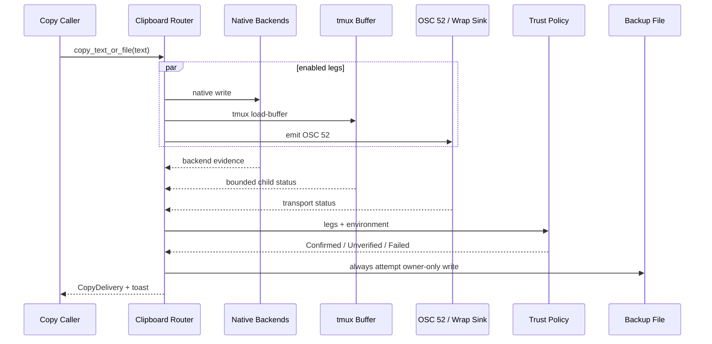

# Walkthrough：复制内容如何跨过本地、tmux、SSH、容器与 OSC 52 到达用户

> 源码核对版本：`ed6d543643628663873c5de28298e022ed634238`
>
> 前两篇已经解释“复制什么”和“链接怎样激活”。本篇只研究复制字符串形成之后，Grok 如何把它交付到用户真正能粘贴的位置。

## 1. 这篇解决什么问题

本地桌面程序调用系统剪贴板通常就结束了；终端 Agent 却可能运行在 SSH Server、无 Display 容器、tmux Pane、编辑器内嵌终端或多层 PTY 中。“某个 API 返回成功”不一定意味着用户笔记本的剪贴板真的收到内容。

本篇回答：

- 为什么 Clipboard Route 同时执行多个 Leg；
- Native、tmux Buffer、OSC 52 分别抵达哪里；
- `Confirmed`、`Unverified`、`Failed` 怎样基于环境证据分类；
- Wayland 为什么不能把任意 Native Success 当成可靠交付；
- `grok wrap` 如何把远端 OSC 52 桥回本地系统剪贴板；
- 为什么每次复制还要写 Owner-only Backup File；
- Toast、Telemetry 和 `/doctor` 怎样表达同一事实；
- Debounce 为什么只抑制 Toast，不抑制真正复制。

## 2. 一句话心智模型

Clipboard 是“多路发送 + 证据判定 + 文件兜底”：尽量同时投递，再判断用户是否真的可取回，而不是把第一个无错误返回当作成功。

## 3. 主要源码入口

- `xai-grok-pager-render/src/clipboard/mod.rs`
- `xai-grok-pager-render/src/clipboard/trust.rs`
- `xai-grok-shared/src/clipboard.rs`
- `xai-grok-pager/src/app/agent_view/notices.rs`
- `xai-grok-pager/src/pty_wrap.rs`
- `xai-grok-pager/src/wrap_filter.rs`
- `xai-grok-pager/src/diagnostics/`

## 4. 非目标

粘贴图片与 Attachment Probe 属于 Input/Paste 链路；本篇只简述 Text Read，不展开图片剪贴板状态机。

## 5. 第一层：上游只交付一个 String

Text Selection、Block Copy、Slash Copy 等调用 `AgentView::copy_to_clipboard(text)`。上游不决定使用 pbcopy、wl-copy、tmux 或 OSC 52。

交付拓扑由 Clipboard 子系统统一拥有。

## 6. 为什么统一入口重要

如果每个功能自己判断 SSH/tmux，不仅策略会漂移，Toast、Telemetry、Backup File 和安全权限也会不一致。

正确边界是：上游决定文本，Clipboard 决定路线。

## 7. `SystemClipboard`

它实现 TextArea 使用的 `ClipboardProvider`，读取委托给 Shared Clipboard，写入采用统一 Route。

`try_set` 还返回基于 Trust Policy 的 `ClipboardDelivery`。

## 8. Clipboard Provider 不等于交付保证

Provider 的 `set` 接口没有返回值，适合编辑器内部契约；用户操作路径使用更丰富的 `copy_text`/`copy_text_or_file`，才能给出可靠反馈。

不同 API 层提供不同证据粒度。

## 9. Glossary checkpoint：入口

| 名词 | 白话解释 | 在本篇中的具体含义 |
| --- | --- | --- |
| clipboard | 临时保存复制内容的系统服务 | 用户随后 Paste 的目标 |
| provider | 提供 Get/Set 的抽象接口 | TextArea 可替换的 Clipboard 实现 |
| route | 当前环境采用的交付组合 | Native、tmux、OSC 52 的开关 |
| topology | 程序与用户桌面之间的运行层次 | Local、SSH、Container、Multiplexer |
| delivery evidence | 内容抵达目标的可信证据 | 不等于一次函数无错误返回 |

## 10. 第二层：`ClipboardRoute` 有三个 Leg

Route 保存：

- `native`
- `tmux_buffer`
- `osc52`
- `osc52_tmux_passthrough`

最后一个是 OSC 52 封装方式，不是独立交付 Leg。

## 11. Native Leg

所有环境默认都尝试 Native Write。macOS 主要用 pbcopy/pbpaste，其他平台由 Shared Clipboard 组合 CLI Tool 与 arboard。

远端 Native Success 可能只写到 Server 的剪贴板，并不等于本地电脑收到。

## 12. tmux Buffer Leg

处于 tmux 时，同时执行 `tmux load-buffer -`。即使系统 Clipboard 不可达，用户仍可用 tmux Paste Buffer 取回内容。

它是可确认的 tmux 内恢复路径。

## 13. OSC 52 Leg

OSC 52 是终端 Escape Sequence，携带 Base64 Clipboard Payload。外层终端若支持，会把内容写入用户桌面 Clipboard。

它天然适合穿过 SSH 输出通道，但中间层可能过滤。

## 14. Multi-fire

启用的 Leg 都会执行，不会因为 Native Success 就跳过 tmux 或 OSC 52。

多个路线是冗余投递，不是优先级 Fallback Chain。

## 15. 为什么 Multi-fire 更适合终端

应用很难从远端可靠知道外层终端行为。多投递让 Native、tmux 和 Terminal Clipboard 都有机会成功，再用环境证据决定怎样描述结果。

停止在第一个“本机 API 成功”会误判 SSH 场景。

## 16. Route Label

Display 实现将启用 Leg 输出成 `native+tmux+osc52` 等标签，供 Telemetry 和 Diagnostics 使用。

Passthrough 不算额外交付目标，因此不出现在 Label 中。

## 17. Glossary checkpoint：多路投递

| 名词 | 白话解释 | 在本篇中的具体含义 |
| --- | --- | --- |
| leg | 一条独立投递路线 | Native、tmux Buffer 或 OSC 52 |
| multi-fire | 同时尝试所有启用路线 | 不在第一个 Success 后停止 |
| redundancy | 用多条路线提高可取回概率 | 同一文本可能落到多个目标 |
| tmux paste buffer | tmux 自己保存的粘贴内容 | 可用 Prefix + `]` 粘贴 |
| passthrough | 将 Escape 包进中间层可转发格式 | tmux DCS 包装 OSC 52 |

## 18. 第三层：Route 如何由环境决定

`resolve_clipboard_route` 读取 Terminal Context 及缓存的 Remote、Container、OSC52 Sink 与 Kill Switch 状态。

这些事实进程运行中通常不变化，因此用 `OnceLock` 缓存。

## 19. Native 总是启用

即使是 Remote，也可能存在有效 Native Clipboard，或者用户希望同时写 Server Clipboard。路线先尝试，Trust 层再判断它是否能证明本地交付。

执行策略与可信分类分开。

## 20. tmux Detection

Terminal Context 的 Multiplexer 为 tmux 时启用 Buffer Leg。

它不是仅检查 `$TMUX` 字符串，而是使用统一环境检测结果。

## 21. Linux OSC 52 Safety Net

Linux 构建默认启用 OSC 52，匹配其他 Terminal Agent CLI 的行为；macOS/Windows 则主要在 tmux、SSH、无 Display Container 或 Wrap Sink 场景启用。

平台默认与环境拓扑共同决定。

## 22. OSC 52 Kill Switch

设置 `GROK_CLIPBOARD_NO_OSC52` 会关闭所有自动 OSC 52 路径，包括 Linux、tmux、SSH、Container 和 Wrap Sink。

它用于外层终端把 Escape 当垃圾字符显示等不兼容场景。

## 23. 为什么 Kill Switch 优先级最高

这是用户对输出通道的明确禁止。自动探测和安全网都不能覆盖它。

Presence 即启用，值内容不重要。

## 24. tmux Passthrough

当 Immediate Terminal 确实是 tmux，OSC 52 使用 DCS Passthrough Envelope 穿越 tmux。

如果运行在 Editor `:terminal` 中，Immediate Emulator 是 libvterm 而非 tmux，不应额外包裹。

## 25. Immediate Terminal

环境可能显示 tmux-backed，但应用输出首先到达编辑器 Terminal。协议封装必须面向第一层接收者，而非只看更外层存在什么。

这是嵌套终端常见陷阱。

## 26. Glossary checkpoint：环境路由

| 名词 | 白话解释 | 在本篇中的具体含义 |
| --- | --- | --- |
| OnceLock | 第一次计算后固定结果的容器 | 缓存进程级环境事实与 Route |
| remote session | 程序通过 SSH 等运行在远端 | Native Clipboard 可能不属于用户桌面 |
| displayless container | 没有图形显示服务的容器 | Native Clipboard 通常不可用 |
| immediate terminal | 最先解释应用输出的终端层 | 决定是否需要 tmux DCS 包装 |
| kill switch | 用户显式关闭功能的开关 | `GROK_CLIPBOARD_NO_OSC52` |

## 27. 第四层：Native Write 本身也有多个 Backend

Shared Clipboard 会记录 CLI Tool Success、arboard Success、Wayland Data-control 与具体成功工具。

Native Leg 不是一个简单 Bool。

## 28. macOS 为什么优先 pbcopy

实现使用 pbcopy/pbpaste，避免 AppKit Clipboard 路径可能带来的 GPU/GUI 开销。

这仍属于 Native Leg。

## 29. Linux CLI Tools

环境可能使用 `wl-copy`、X11 Tool 或其他可用命令。Outcome 记录 Tried Tools 与 Successful Tools。

Telemetry 能区分“Native Route 开启但所有 Backend 失败”。

## 30. arboard

arboard 是跨平台 Clipboard Library。它返回成功并不在所有显示环境都等价于用户离开窗口后仍能 Paste。

Trust Policy 需要结合 Display Server。

## 31. Wayland 的特殊性

Wayland Clipboard 所有权可能依赖进程/窗口生命周期。`wl-copy` 或具备 Data-control 的 arboard 才被视为可信本地交付。

普通 arboard Success 而无 Data-control 不足以 Confirm。

## 32. X11、Quartz 与 Win32

本地 X11、macOS Quartz 和 Windows Win32 有各自可确认 Native Availability。Preflight 根据 Host OS 与 Display Server 分类。

Unknown Linux Display 不做乐观确认。

## 33. `NativeClipboardPreflight`

在真正 Copy 前可分类：

- `Disabled`
- `LocalAvailable`
- `RemoteOnly`
- `Unavailable`

它描述预计能力，不声称一次具体写入成功。

## 34. Preflight 与 Outcome

Preflight 用于 Doctor/预期；Write Legs 记录实际执行；Trust Decision 结合实际结果与环境。

不能拿 Preflight 代替 Runtime Result。

## 35. Glossary checkpoint：Native Clipboard

| 名词 | 白话解释 | 在本篇中的具体含义 |
| --- | --- | --- |
| backend | Native Leg 内部的具体实现 | pbcopy、wl-copy、arboard 等 |
| arboard | 跨平台系统剪贴板库 | Native Backend 之一 |
| display server | Linux 图形应用的显示/输入服务 | Wayland 或 X11 |
| data-control | Wayland 无焦点 Clipboard 控制协议 | arboard Success 的可信补充证据 |
| preflight | 操作前的能力判断 | 不代表本次写入已经成功 |
| runtime outcome | 实际执行后得到的逐 Leg 结果 | Trust Decision 的输入 |

## 36. 第五层：tmux Write 不能阻塞 UI

`write_tmux_buffer` 启动 `tmux load-buffer -`，并把文本作为 Stdin 提供。

实现特意避免无界 Pipe 阻塞。

## 37. 为什么使用 Spooled Stdin

若 tmux Server 卡住不读 Pipe，大 Payload 会填满 Pipe Buffer，让 UI Thread 卡在写入。

先把 Stdin Spool 完成并关闭生产端，才能安全做有界等待。

## 38. 两秒 Deadline

Child Process 采用 `wait_with_deadline`，最多等待两秒。Spawn、Wait 或非零 Exit 都记为 tmux Leg Failure。

Clipboard 增强功能不能无限冻结 TUI。

## 39. Detach

辅助命令从当前 TTY/Process Group 语义中适当脱离，Stdout/Stderr 丢弃，避免污染界面。

失败只写 Debug Log，其他 Leg 继续。

## 40. tmux Success 的含义

它证明文本进入当前 tmux Server 的 Paste Buffer，不一定证明系统桌面 Clipboard 更新。

UI 因此明确提示用 tmux Paste Key 取回。

## 41. Glossary checkpoint：有界子进程

| 名词 | 白话解释 | 在本篇中的具体含义 |
| --- | --- | --- |
| spooled stdin | 先准备完成、再交给 Child 的输入 | 避免 Pipe Backpressure 卡住 UI |
| deadline | 最晚等待到某个时间 | tmux Helper 两秒后停止等待 |
| backpressure | 消费者不读导致生产者阻塞 | 大 Clipboard Payload 的 Pipe 风险 |
| detach | 减少 Helper 对当前终端/进程组的耦合 | 防止污染或继承交互 TTY |
| best-effort | 失败不阻止其他路线 | tmux、OSC 52 都是独立 Leg |

## 42. 第六层：OSC 52 Success 也有两个层次

`set_text_osc52` 成功只表示 Escape Sequence 已写出；是否穿过 SSH/tmux 并被外层终端接受，需要环境能力证据。

Write Success 与 End-to-end Delivery 分离。

## 43. `Osc52Capability`

Trust 层将外层能力分为：

- `Supported`
- `Unsupported`
- `Unknown`

Wrap Sink 或明确支持的 Terminal Brand 可提供 Supported Evidence。

## 44. Unknown Remote

SSH 往往只传播通用 `$TERM`，远端无法知道用户本地 Terminal Brand。OSC 52 写出后应标记 `Unverified`，而不是直接 Failed。

缺少证据不等于已经证明失败。

## 45. Unknown Local

本地 Unknown Terminal 没有跨边界信息损失作为解释，能力 Unknown 不构成可信交付，通常分类为 Failed。

同一个 Unknown 在不同拓扑中含义不同。

## 46. Unsupported

若已知 Terminal 不支持 OSC 52，即使 Escape 写出成功，Delivery 仍是 Failed。

Transport Write Success 不能推翻 Capability Evidence。

## 47. `GROK_OSC52_SINK`

上游 Wrap Process 可设置该变量，声明“我会捕获你的 OSC 52，并写入真实本地 Clipboard”。

这把不可观测的外层 Terminal 变成可确认的 Sink。

## 48. `LC_GROK_OSC52_SINK`

Canonical 变量适合本地 Child 继承；`LC_` 前缀版本可借助常见 OpenSSH `SendEnv/AcceptEnv LC_*` 配置跨 SSH 传播。

两个变量任一存在都激活 Sink Evidence。

## 49. 为什么 Sink 使 Delivery Confirmed

它不是“终端可能支持”的猜测，而是一个明确的上游进程契约：输出中的 OSC 52 会被截获并落到本地系统 Clipboard。

因此 Trust Policy 可以升级证据。

## 50. Glossary checkpoint：OSC 52 信任

| 名词 | 白话解释 | 在本篇中的具体含义 |
| --- | --- | --- |
| OSC 52 | 终端设置剪贴板的 Escape 协议 | Payload 经输出链路抵达外层终端 |
| capability evidence | 外层是否支持的证据 | Brand、Wrap Sink 或 Unknown |
| transport success | Escape 已成功写入输出 | 不保证最终 Clipboard 更新 |
| end-to-end | 从 Grok 一直到用户桌面 | Delivery 分类真正关心的目标 |
| sink | 明确捕获并消费 OSC 52 的上游 | `grok wrap` 提供的本地桥 |
| env forwarding | 将环境变量带过 SSH | `LC_GROK_OSC52_SINK` 的传播方式 |

## 51. 第七层：`grok wrap` 是本地 Clipboard Bridge

`grok wrap <command>` 在本地 PTY 中启动目标命令，读取 Child Output，并用 `Osc52Filter` 拦截 Clipboard Escape。

其他终端输出照常转发。

## 52. 常见部署图

```text
Local grok wrap
  └─ PTY child: ssh server
       └─ remote grok emits OSC 52
            └─ bytes return through SSH
                 └─ local Osc52Filter decodes
                      └─ local system clipboard
```

## 53. 为什么用 PTY

SSH 与远端 TUI 需要真实终端语义、尺寸和 Raw Input。普通 Pipe 不足以完整模拟交互 Terminal。

Wrap 同时转发 Stdin、Output 和 Resize。

## 54. Sink Advertisement

Wrap 启动 Child 时设置两个 Sink Env Var。远端 Grok 即使误识别为 Unknown Terminal，也知道 OSC 52 有可靠接收者。

Data Path 和 Evidence Path 同时建立。

## 55. Output Filter

PTY Reader 的 Bytes 进入 `Osc52Filter`。Clipboard Sequence 被消费并转为本地写入，普通 Bytes 输出到用户终端。

Filter 必须支持 Escape 被多个 Read Chunk 切开的情况。

## 56. 为什么不能让 OSC 52 原样再到终端

Wrap 的目的就是在本地明确接管。截获后再原样输出可能导致双重 Clipboard 写或在不支持终端中显示垃圾。

被消费的控制序列不属于可见正文。

## 57. 单一 PTY Writer Thread

Keyboard Input 和 Host Clipboard Image Response 都通过 Channel 交给一个专用 Writer Thread。

这避免某些平台上跨线程同时写 Portable PTY 触发 EIO。

## 58. Resize 与恢复

Wrap 还转发 SIGWINCH，并追踪 Child 改变的 Terminal Mode。Child 断开或收到 Signal 时恢复外层终端。

Clipboard Bridge 不能以破坏 Raw Mode 为代价。

## 59. Glossary checkpoint：Wrap Bridge

| 名词 | 白话解释 | 在本篇中的具体含义 |
| --- | --- | --- |
| PTY | 为交互程序模拟终端的伪设备 | Wrap 中承载 SSH/远端 TUI |
| filter | 读取字节流并识别特定控制序列 | `Osc52Filter` 截获 Clipboard Payload |
| bridge | 连接两个原本隔离的环境 | Remote OSC 52 到 Local Clipboard |
| chunking | 一个 Escape 被拆到多次 Read | Filter 必须保持解析状态 |
| SIGWINCH | 终端尺寸变化信号 | Wrap 转发给 Child PTY |
| terminal restore | 退出时恢复 Raw/Private Mode | Bridge 生命周期的安全收尾 |

## 60. 第八层：逐 Leg Outcome 不直接等于用户反馈

`ClipboardWriteLegs` 记录 Route、CLI Tools、arboard、Data-control、tmux 和 OSC 52 的结果。

`trust::resolve_copy_decision` 再结合 Environment 生成 `ClipboardFeedback`。

## 61. `ClipboardEnvironment`

它包含：

- Terminal Brand；
- Host OS；
- Display Server；
- Remote/Container；
- OSC 52 Sink；
- Wayland Data-control；
- wl-copy Availability。

## 62. 为什么 Decision 必须是纯函数

环境与 Outcome 作为显式输入后，复杂矩阵可以做单元测试，而无需真的进入 SSH、Wayland 或 tmux。

I/O 与 Policy 分离提高可验证性。

## 63. `ClipboardDelivery`

三种结论：

- `Confirmed`
- `Unverified`
- `Failed`

这比 Success Bool 更诚实。

## 64. `reported_success`

Confirmed 与 Unverified 都表示已经有可报告的投递尝试；Failed 表示没有可用路线。

但 `is_confirmed` 只对 Confirmed 为 True。

## 65. Trusted Native

只有本地拓扑中的 Native Success 才可能证明用户桌面 Clipboard；Remote/Container Native Success 被排除。

Wayland 还要求 wl-copy 或 arboard + Data-control。

## 66. tmux Evidence

tmux Buffer Success 被视为 Confirmed 可取回，因为用户可明确通过 tmux Paste 获取。

它不声称桌面 Clipboard 一定更新，Toast 会说明目的地。

## 67. OSC 52 Evidence

OSC 52 Leg Success 再经过 Supported/Unknown/Unsupported 分类。Remote Unknown 得到 Unverified；明确 Sink/Terminal Support 得到 Confirmed。

## 68. VS Code SSH 非 ASCII

特定环境下非 ASCII 可能出现 Mojibake。Feedback 单独提示风险，即使总体归类为已复制。

交付成功与内容编码风险可以同时存在。

## 69. Glossary checkpoint：信任决策

| 名词 | 白话解释 | 在本篇中的具体含义 |
| --- | --- | --- |
| trust policy | 哪种成功证据值得相信 | 结合 Leg Outcome 与 Environment |
| Confirmed | 有可信路线抵达可取回目标 | Native Local、tmux 或可信 OSC 52 |
| Unverified | 已发送但无法观察最终结果 | 常见于 Unknown SSH Outer Terminal |
| Failed | 没有成功且可信/可能的路线 | 需要 File Fallback |
| pure function | 只依赖显式输入、不执行 I/O | Delivery Matrix 可全面测试 |
| mojibake | 编码错配导致乱码 | VS Code SSH 非 ASCII 特殊提示 |

## 70. 第九层：Feedback 不是直接打印 Backend 错误

`ClipboardFeedback` 把决策映射成人能行动的消息：Copied、Copied to tmux、Copied via OSC 52、Copy Sent/Unverified、Failed Remote 等。

用户关心怎样取回，而不是 arboard Error Type。

## 71. Toast Duration

普通本地 `Copied!` 显示较短；tmux、OSC 52、Unverified 和 Failure 显示更久，给用户时间阅读恢复建议。

时长以约 30 FPS Tick 计数。

## 72. Message Lead

每类 Feedback 还有紧凑 Lead。需要附加 Backup Path 时，用 Lead 拼接，避免长 Guidance 把路径挤出窄终端。

测试约束完整 Message 必须以前缀 Lead 开始。

## 73. Debounced Toast

双击词语、三击行等操作可能快速连续 Copy。`copy_to_clipboard_debounced` 在窗口内仍执行 Copy 与 File Backup，只跳过 Toast。

Debounce 不能丢用户最新文本。

## 74. 为什么 Copy 不能 Debounce

用户最后一次双击可能选择不同词。若连真实 Clipboard Write 一起合并，Clipboard 会留下旧内容。

需要消除的是视觉闪烁，而不是数据更新。

## 75. Telemetry

事件记录 Route、Tried/Successful Backend、逐 Leg Outcome、Delivery、Sink、Container、Text Length 和 Duration。

它不记录复制文本正文。

## 76. 隐私边界

Telemetry 只上传长度与环境标签；Backup File 则真的保存文本，因此文件权限必须严格。

两类数据不可混淆。

## 77. Glossary checkpoint：用户反馈

| 名词 | 白话解释 | 在本篇中的具体含义 |
| --- | --- | --- |
| feedback | 把技术结果翻译成用户行动 | Toast Message 与持续时间 |
| toast | 短暂显示在 TUI 的提示 | 告知 Copy 目的地或恢复方式 |
| message lead | Toast 的简短开头 | 附加 Backup Path 时使用 |
| debounce | 抑制短时间重复反馈 | 只跳过 Toast，不跳过 Copy |
| telemetry | 发送运行质量与环境指标 | 不包含 Clipboard 正文 |

## 78. 第十层：每次 Copy 都尝试写 Backup File

`copy_text_or_file` 同时运行正常 Clipboard Route 与 `write_copy_fallback`。

即使 Clipboard Confirmed，Backup 仍会写入。

## 79. 默认路径

默认是用户 Grok Home 下的 `last-copy.txt`，通常显示为 `~/.grok/last-copy.txt`。

它短、稳定、便于 Toast 告知。

## 80. 自定义路径

`GROK_COPY_FILE` 可覆盖路径并支持 `~` 展开。空值不会制造无意义路径。

自定义父目录可在需要时创建。

## 81. 为什么不用系统临时目录

固定的公共 Temp Path 可能被其他本地用户预测和读取。没有可解析 Home 且未设置 Env 时，宁可跳过 File Backup。

安全默认优于“总能写某个文件”。

## 82. Unix 文件权限

File 创建 Mode 为 `0600`；若旧版本已经留下 `0644` 文件，写入前后还会显式收紧 Permission。

Copied Text 可能包含 Token、源码或私人内容。

## 83. Parent Directory 权限

Unix 创建缺失 Parent 时使用 `0700`。Directory 本身也不能让其他用户遍历。

只保护 File 而开放 Parent 仍可能泄露 Metadata。

## 84. 原子性边界

当前逻辑打开、截断并写入固定 Backup File。它强调权限和可恢复性，并不宣称是 Crash-atomic Versioned Archive。

`last-copy` 本来就是覆盖式最新值。

## 85. `CopyDelivery`

最终结果有：

- `Clipboard { result, file }`
- `File { path }`
- `Failed { clipboard, file_error }`

它回答用户最终从哪里取回文本。

## 86. Clipboard Unverified + File Success

仍归入 Clipboard Variant，因为 OSC 52 已报告发送，但 Toast 会明确附加 `saved to <path>`。

用户获得一个确定的恢复位置。

## 87. Clipboard Failed + File Success

结果为 `File`，Toast 使用“Clipboard unreachable — wrote ...”。

整体 Copy 操作仍算成功，因为文本可取回。

## 88. Clipboard Success + File Failure

仍算 Clipboard Success。Backup Failure 只写 Debug Log，不推翻已确认交付。

冗余路线失败不应覆盖主成功。

## 89. 两者都失败

结果为 `Failed`，保存 Clipboard Feedback 与 File Error。Toast 给出 `/doctor` 或 `/minimal` 等恢复建议。

这是唯一真正无法取回的终态。

## 90. Glossary checkpoint：文件兜底

| 名词 | 白话解释 | 在本篇中的具体含义 |
| --- | --- | --- |
| fallback | 主路线不可靠时的替代取回方式 | `last-copy.txt` |
| owner-only | 只有当前 OS 用户可读写 | Unix Mode `0600` |
| predictable path | 名称和位置固定、容易猜到 | 必须用权限保护，不能放公共 Temp |
| recovery path | 用户还能找到内容的位置 | Toast 中显示的 Backup File |
| overwrite | 新复制替换旧备份 | `last-copy.txt` 只保存最近一次 |
| retrievable | 用户至少能从 Clipboard 或 File 取回 | `CopyDelivery::success` 的含义 |

## 91. 第十一层：预期交付与实际交付

`expected_delivery` 用 Preflight、Route 与 Environment 预测能力；实际 Copy 使用 `ClipboardWriteLegs` 判定 Outcome。

Doctor 主要展示前者，Copy Toast 展示后者。

## 92. 为什么 Doctor 不能保证下一次成功

外部命令可能随后消失、Display Ownership 可能变化、tmux Server 可能卡住。Preflight 只表达当前可见能力。

真实 Copy 仍需逐 Leg Outcome。

## 93. Diagnostics Facts

诊断汇总 Native Preflight、OSC 52 Capability、Route、Delivery Expectation、Terminal/Remote/Container 和 Wayland Facts。

它给出可解释的失败原因，而非只显示“Clipboard Broken”。

## 94. Recovery Advice

SSH/Container Unknown、Unsupported Local、Wayland Focus Risk 等拓扑会得到不同建议，例如使用 `grok wrap`、安装/启用 Backend 或切换 `/minimal`。

建议要针对断裂的那一层。

## 95. `/minimal` 为什么可能有帮助

Minimal Mode 更依赖终端原生选择/Scrollback，用户可绕过应用 Clipboard Route 使用终端自己的复制能力。

它是交互降级方案，不修复底层 API。

## 96. `grok wrap` 为什么更强

Wrap 明确建立本地 Sink，使远端 OSC 52 从 Unverified 变成可确认的 Bridge Contract。

它改变拓扑，而不只是改变 Toast。

## 97. Glossary checkpoint：诊断

| 名词 | 白话解释 | 在本篇中的具体含义 |
| --- | --- | --- |
| expected delivery | Copy 前根据能力预测的可信度 | Doctor 使用 |
| actual delivery | Copy 后根据逐 Leg Outcome 的结论 | Toast 使用 |
| diagnostic fact | 支持判断的环境证据 | Terminal、Display、Route、Capability |
| recovery advice | 用户可以执行的修复路径 | Wrap、Minimal、Backend 配置等 |
| degradation | 保留核心能力的简化模式 | Terminal-native Copy 取代 App Copy |

## 98. 第十二层：读取 Clipboard 与写入不同

`system_clipboard_read_text` 区分读取失败与成功但没有文本；简单调用者可用 `system_clipboard_get` 把两者都视为 None。

需要诊断的路径不应丢失 Error/Empty 区别。

## 99. X11 Primary Selection

Linux 中键选择可读取 PRIMARY，它与常规 CLIPBOARD 是不同 Selection。

代码会检查 X11 Display 环境并过滤空文本。

## 100. Pasteable Text

读取到 Text 后仍要判断是否为空、是否适合作为 Paste Payload。图片/Attachment Probe 有独立 Gate。

Read Success 不代表一定插入 Prompt。

## 101. Test Hook

Test-support 可替换 Clipboard Text、Primary 和 Attachment Probe 结果，避免单元测试修改真实系统 Clipboard。

外部状态必须可注入才能稳定验证。

## 102. Glossary checkpoint：读取

| 名词 | 白话解释 | 在本篇中的具体含义 |
| --- | --- | --- |
| CLIPBOARD | 常规复制/粘贴缓冲区 | Ctrl/Cmd+C/V 使用 |
| PRIMARY | X11 选中文字即拥有的缓冲区 | 中键粘贴使用 |
| empty | 成功读取但没有文本 | 与 Backend Error 不同 |
| test hook | 测试替换外部行为的注入点 | 不触碰真实 OS Clipboard |

## 103. 完整本地 Copy Walkthrough

在 macOS 本地 Terminal：

1. Selection 生成 String；
2. `copy_text_or_file` 调用 `copy_text`；
3. Route 启用 Native，通常不需 OSC 52；
4. pbcopy 成功；
5. Trust Policy 确认 Local Native；
6. 同时写 `last-copy.txt`；
7. 返回 `CopyDelivery::Clipboard`；
8. 显示短 `Copied!` Toast；
9. Telemetry 只记录长度、Route 和 Outcome。

## 104. 完整 tmux Copy Walkthrough

1. Route 为 Native + tmux + OSC 52；
2. 三个 Leg 都尝试；
3. tmux Child 有界等待；
4. OSC 52 使用 DCS Passthrough；
5. 任一可信路径可确认取回；
6. 若 tmux Buffer 是可靠成功，Toast 告知 Paste Key；
7. Backup File 仍写入。

## 105. 完整未知 SSH Copy Walkthrough

1. Remote Route 启用 Native + OSC 52；
2. Remote Native Success 不算本地桌面证据；
3. OSC 52 写出，但 Outer Brand Unknown；
4. Delivery 为 Unverified；
5. Backup File 在远端 Grok Home 写入；
6. Toast 显示“Copy sent”并附 File Path；
7. 用户可采用 `grok wrap` 建立确认桥。

## 106. 完整 Wrap Copy Walkthrough

1. Local Wrap 建 PTY 并设置 Sink Env；
2. SSH 将 `LC_GROK_OSC52_SINK` 传给 Remote；
3. Remote Route 启用 OSC 52；
4. Capability 因 Sink Contract 视为 Supported；
5. Escape Bytes 经 SSH 返回；
6. Local Filter 截获并解码；
7. Local System Clipboard 写入；
8. 普通 Output 继续显示；
9. Remote Delivery 可报告 Confirmed。

## 107. 时序图



## 108. 常见误解：Native API 成功就一定复制成功

错误。在 SSH/Container 中可能只写到远端 Host；Wayland 普通 Ownership 也可能不持久。

必须结合 Topology 与 Backend Evidence。

## 109. 常见误解：OSC 52 写出就等于 Confirmed

错误。Outer Terminal 可能 Unknown、Unsupported，或中间层过滤 Escape。

明确 Terminal Capability 或 Wrap Sink 才构成强证据。

## 110. 常见误解：三条 Leg 是 Fallback 顺序

错误。启用的 Leg 会 Multi-fire。一个 Leg 失败不会阻止另外两个执行。

最后统一分类交付结果。

## 111. 常见误解：Backup 只在 Clipboard 失败时写

错误。每次 `copy_text_or_file` 都尝试 Backup；只是 Clipboard Confirmed 时 Toast 不必展示路径。

它是持续冗余，不是事后补救。

## 112. 常见误解：Debounced Copy 会丢最后一次复制

错误。Debounce 只跳过 Toast，Clipboard 与 File Write 仍执行。

最新选择仍覆盖旧值。

## 113. 失败模式：SSH 中显示 Copied 但本地 Paste 为空

检查 Native Success 是否被错误当作 Local Trusted，OSC 52 Capability 是否被过度乐观分类，以及是否缺少 Wrap Sink。

远端 Native 不能证明本地桌面交付。

## 114. 失败模式：大 Copy 卡死 UI

检查 tmux Stdin 是否使用 Spool，Child Wait 是否有 Deadline，Native CLI Backend 是否也有有界处理。

任何辅助进程都不能无限阻塞 Input Thread。

## 115. 失败模式：OSC 52 显示成乱码字符

使用 Kill Switch 禁用该 Leg，并检查 Terminal Brand/Multiplexer Capability。不要仅隐藏 Toast，必须阻止 Escape 输出。

## 116. 失败模式：Backup File 可被其他用户读取

检查 File Mode 是否 `0600`、旧 File Permission 是否收紧、Parent Directory 是否 `0700`。

不要退回固定 World-readable Temp Path。

## 117. 失败模式：Toast 报失败但 tmux 可粘贴

检查 `tmux_ok` 是否进入 Trust Decision，以及 Child Exit Status 是否正确采集。

tmux Buffer 是独立可取回目标。

## 118. 修改 Clipboard 的检查清单

- 新 Leg 抵达哪个 Host/Clipboard？
- Success 如何证明 End-to-end Delivery？
- 是否会阻塞 UI？
- 是否与其他 Leg Multi-fire？
- Preflight 与 Runtime Outcome 是否分开？
- Remote Native 是否被错误信任？
- Unknown 与 Unsupported 是否区分？
- Toast 是否告诉用户可操作恢复路径？
- Backup 权限是否安全？
- Telemetry 是否避免正文内容？
- Kill Switch 是否覆盖自动启用？
- Wrap/嵌套 Terminal 是否需要特殊 Envelope？

## 119. 推荐验证命令

```sh
cargo test -p xai-grok-pager-render 'clipboard::tests' --lib -- --test-threads=1
cargo test -p xai-grok-pager-render 'clipboard::trust::tests' --lib -- --test-threads=1
cargo test -p xai-grok-pager 'wrap_filter::tests' --lib -- --test-threads=1
cargo test -p xai-grok-pager 'diagnostics::doctor_format_tests' --lib -- --test-threads=1
```

## 120. 推荐源码阅读顺序

1. `clipboard/mod.rs` 的 Route 与 Write Legs；
2. `clipboard/trust.rs` 的 Environment 和 Decision Matrix；
3. 回到 `copy_text`、Feedback 和 Telemetry；
4. 阅读 File Backup 与 `CopyDelivery`；
5. `notices.rs` 看 Toast/Debounce 接入；
6. `wrap_filter.rs` 看 OSC 52 Byte Parser；
7. `pty_wrap.rs` 看本地 Bridge 与 Terminal Restore；
8. 最后看 Diagnostics 如何复用 Preflight Facts。

## 121. 自测题

1. 为什么 Clipboard Route 要 Multi-fire，而不是第一个 Success 即停止？
2. Remote Native Success 为什么不能直接 Confirm？
3. Wayland arboard Success 还需要什么证据？
4. `osc52_ok` 与 `ClipboardDelivery::Confirmed` 有什么区别？
5. `GROK_OSC52_SINK` 怎样改变 Trust Decision？
6. tmux Buffer 为什么能 Confirm 可取回，却不声称桌面 Clipboard 更新？
7. Backup File 为什么每次都写，而且为什么不能放公共 Temp？
8. Debounce 为什么只能作用于 Toast？

## 122. 小练习一：画 Delivery Matrix

枚举 Local/Remote × Native OK/Fail × tmux OK/Fail × OSC 52 Supported/Unknown/Unsupported，手工判断 Confirmed、Unverified、Failed。

再与 `trust.rs` 测试核对。

## 123. 小练习二：追一个远端 Copy

从 `AgentView::copy_to_clipboard` 开始，记录 Route、Leg Outcome、Environment、Feedback、CopyDelivery 和 Toast 每一步的数据类型。

不要把“写出成功”和“用户收到”合并成一个节点。

## 124. 小练习三：验证 Backup Permission

在临时目录调用 `write_text_to_copy_file`，检查 File Mode；预先创建一个宽权限 File 后再次写入，确认权限被收紧。

不要在练习中写入真实 `~/.grok/last-copy.txt`。

## 125. 本篇术语表

| 名词 | 白话解释 | 在本篇中的具体含义 |
| --- | --- | --- |
| Clipboard Route | 当前环境启用的复制路线组合 | Native、tmux、OSC 52 |
| Leg | 一条独立路线 | 各自记录 Success Evidence |
| Multi-fire | 同时执行所有启用路线 | 不采用短路 Fallback |
| Native Clipboard | 当前 Host OS 的剪贴板 | 可能是远端 Host 而非用户桌面 |
| tmux Buffer | tmux 自己保存的 Paste 数据 | 可通过 tmux Key 取回 |
| OSC 52 | 终端设置 Clipboard 的 Escape Sequence | 可沿 SSH Output 返回外层终端 |
| DCS Passthrough | 让 tmux 转发控制序列的封装 | 仅 Immediate Terminal 为 tmux 时使用 |
| ClipboardEnvironment | Trust Decision 的环境事实 | OS、Display、Remote、Container、Sink 等 |
| ClipboardWriteLegs | 一次 Copy 的逐路线结果 | CLI、arboard、tmux、OSC52 Outcome |
| ClipboardDelivery | 对用户最终可取回性的结论 | Confirmed、Unverified、Failed |
| Confirmed | 有强证据能取回 | Local Native、tmux 或可信 OSC 52 |
| Unverified | 已发出但外层结果不可观察 | Unknown Remote/Container OSC 52 |
| Failed | 没有可用的 Clipboard 路线 | 依赖 File Backup |
| Preflight | Copy 前的能力推断 | Doctor 使用，不代替实际 Outcome |
| Trust Policy | 将 Outcome 与 Topology 组合的规则 | 决定 Delivery 与 Feedback |
| Wayland | Linux 显示协议 | Clipboard Trust 需要特殊证据 |
| Data-control | Wayland 无焦点 Clipboard 控制能力 | arboard 可确认的条件之一 |
| arboard | 跨平台 Clipboard Library | Native Backend |
| pbcopy | macOS Clipboard CLI | 首选 Native Backend |
| Backpressure | 消费慢导致写端阻塞 | tmux Helper 使用 Spool/Deadline 防护 |
| grok wrap | 本地 PTY 与 Clipboard Bridge | 截获远端 OSC 52 写入本地 Clipboard |
| Sink | 确认消费 OSC 52 的上游 | Env Contract 使 Delivery 可确认 |
| Backup File | 每次复制都尝试写的恢复文件 | 默认 `~/.grok/last-copy.txt` |
| Owner-only | 只有当前用户可访问 | File `0600`、Directory `0700` |
| CopyDelivery | Clipboard 与 File 组合后的最终结果 | Clipboard、File 或 Failed |
| Toast | TUI 用户反馈 | 显示目的地、风险或恢复路径 |
| Debounce | 抑制快速重复 Toast | 不抑制真实 Copy |
| Telemetry | 不含正文的运行指标 | Route、Length、Outcome、Duration |

## 126. 核心不变量汇总

1. 上游只决定文本，Clipboard 子系统统一决定交付拓扑。
2. 所有启用 Leg Multi-fire，互不短路。
3. Backend Success 与 End-to-end Delivery 必须分开。
4. Remote/Container Native Success 不证明用户本地 Clipboard 收到。
5. Wayland Native Confirmation 需要 wl-copy 或 Data-control Evidence。
6. OSC 52 Transport Success 还需 Outer Capability/Sink Evidence。
7. tmux Helper 必须使用有界等待，不能冻结 UI。
8. Kill Switch 必须覆盖所有 OSC 52 自动路径。
9. Wrap Sink Env 同时建立 Data Path 与 Trust Evidence。
10. 每次 Copy 都尝试 Owner-only Backup File。
11. Clipboard Success 不被 Backup Failure 推翻；Clipboard Failure 可被 File Success 挽救。
12. Toast Debounce 不得跳过 Clipboard/File 数据写入。
13. Telemetry 不记录 Clipboard 正文。
14. Preflight 只用于预期和诊断，实际反馈依据 Runtime Legs。

## 127. 源码依据

- `xai-grok-pager-render/src/clipboard/mod.rs`：Route、Multi-fire、Backend Outcome、Feedback、Backup 与 CopyDelivery。
- `xai-grok-pager-render/src/clipboard/trust.rs`：Environment、Preflight、Trusted Native、OSC 52 Evidence 与 Decision Matrix。
- `xai-grok-shared/src/clipboard.rs`：Native Backend、OSC 52、Remote/Container Probe 和有界 Helper。
- `xai-grok-pager/src/app/agent_view/notices.rs`：Copy 调用、Toast 与 Debounce。
- `xai-grok-pager/src/wrap_filter.rs`：OSC 52 Stream Filter。
- `xai-grok-pager/src/pty_wrap.rs`：PTY Bridge、Sink Env、I/O Threads、Resize 与 Restore。
- `xai-grok-pager/src/diagnostics/`：Preflight Facts、Delivery 展示与恢复建议。

## 128. 最终心智模型

当 Grok 显示“Copied”时，背后不是一次含糊的系统 API 调用。系统先根据 Topology 同时尝试 Native、tmux 与 OSC 52；记录每条路线真实结果；用 Host、Display Server、Remote Boundary 与 Sink Contract 判断证据强度；再把同一文本写入权限收紧的 Backup File。最后，Toast 告诉用户内容究竟已确认到达、只是发送但无法确认、还是只能从文件恢复。

这套设计的重点不是让所有环境都假装成功，而是让“复制成功”成为一个可以解释、验证和恢复的工程结论。
