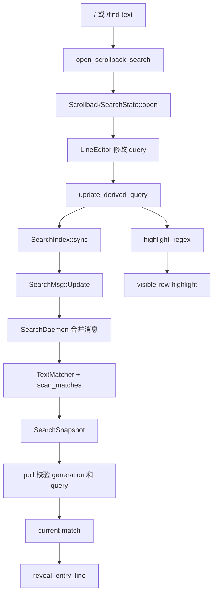
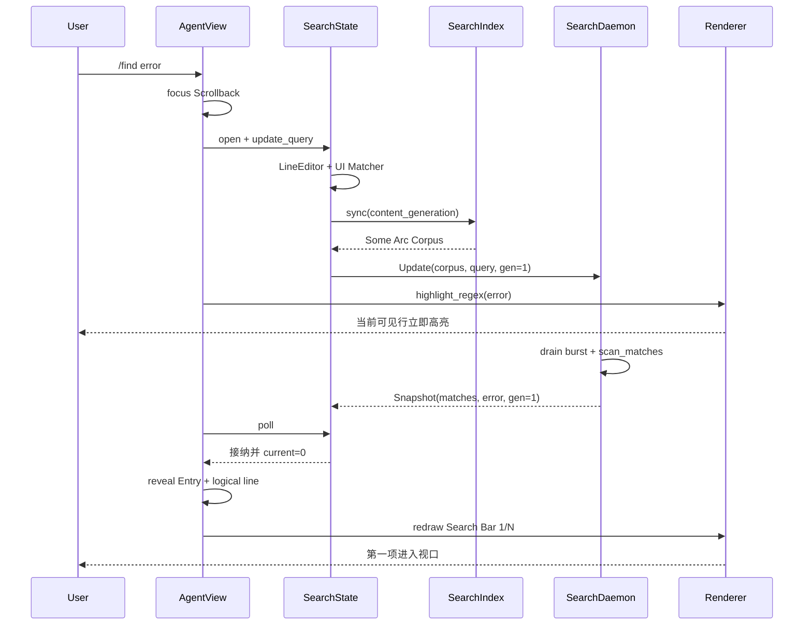

# Walkthrough：Scrollback 全文搜索如何异步索引、导航并映射回屏幕高亮

> 场景：一段很长的 Grok 会话已经包含 Prompt、回答、Thinking、工具调用和流式输出。用户按 `/` 或执行 `/find error`，希望一边输入正则表达式，一边看到匹配数量；按 Enter 后又能用 `n`、`N` 或方向键逐项跳转。搜索不能卡住输入线程，旧查询的迟到结果不能覆盖新查询，折叠或截断内容中的命中必须能被展开并滚到屏幕上，而 Unicode、Markdown 和软换行还会让“源码中的字节范围”与“屏幕上的列”不再一一对应。

---

## 1. 这篇解决什么问题

本篇追踪一次 Scrollback 搜索从入口到屏幕的完整路径：

1. `/` 或 `/find [text]` 打开搜索会话；
2. `LineEditor` 保存查询和 Unicode 安全光标；
3. `ScrollbackSearchIndex` 从 Entry 提取可搜索文本；
4. 查询和必要的 Corpus 快照发送给后台 `SearchDaemon`；
5. Daemon 合并输入突发、编译 Regex 并扫描；
6. UI `poll()` 只接纳仍属于当前请求的结果；
7. 当前命中映射为 Entry、逻辑行和滚动位置；
8. Renderer 在当前可见行上重新执行 Regex，绘制高亮；
9. Search Bar 展示查询、错误或 `m/n` 计数。

## 2. 先给出结论

这不是一个“在屏幕 Buffer 上 Ctrl-F”的实现。

它由三个彼此解耦的模型组成：

- **Search Corpus**：每个 Scrollback Entry 的可搜索文本；
- **Match Navigation**：按 EntryId、逻辑行和字节范围排序的结果；
- **Visible Highlight**：对当前屏幕上已经排版好的每一行重新匹配。

这种分层使后台扫描不依赖终端宽度，也使重绘只处理可见内容；代价是计数与高亮在少数边界上可以不同。

## 3. 主调用链



## 4. 关键源码地图

| 文件 | 职责 |
| --- | --- |
| `xai-grok-pager/src/scrollback/search.rs` | 索引、Daemon、查询状态、结果与导航 |
| `xai-grok-pager/src/search/matcher.rs` | Substring/Regex 编译与 Smart Case |
| `xai-grok-pager/src/scrollback/block.rs` | 各种 Block 如何产生 `searchable_text()` |
| `xai-grok-pager/src/scrollback/state/mod.rs` | `content_generation` 内容版本 |
| `xai-grok-pager/src/app/agent_view/panes.rs` | 打开、输入、粘贴、接受、导航与轮询 |
| `xai-grok-pager/src/scrollback/state/nav.rs` | 展开隐藏结果并定位逻辑行 |
| `xai-grok-pager/src/app/agent_view/render.rs` | 搜索栏布局与 Renderer 接线 |
| `xai-grok-pager/src/scrollback/render.rs` | 可见行匹配和反色高亮 |
| `xai-grok-pager/src/slash/commands/find.rs` | `/find [text]` 入口契约 |

## 5. 阅读时要区分的三种“行”

- Source Line：可搜索文本中由 `\n` 分隔的逻辑行；
- Block Line：Block 输出、样式化并换行后的行；
- Screen Row：考虑视口裁剪、Sticky Header 和坐标偏移后的终端行。

`ScrollbackMatch::line_in_entry` 保存第一种；`reveal_entry_line` 把它转换成第二种；Renderer 最终画在第三种。

## 6. Glossary checkpoint：基础对象

| 名词 | 白话解释 | 本篇中的准确含义 |
| --- | --- | --- |
| Scrollback | 会话中可回看的历史区域 | 由稳定 Entry 组成的虚拟时间线 |
| Entry | 时间线中的一个逻辑项目 | 有稳定 `EntryId`、Block 和显示状态 |
| Corpus | 被搜索的文本集合 | `Arc<[IndexedEntry]>` |
| Index | 为搜索准备的数据副本 | 每个 Entry 一份拥有所有权的 String |
| Match | 一次命中 | EntryId、逻辑行号和字节范围 |
| Reveal | 把目标显示出来 | 选择、展开、解除截断并滚动到目标行 |

## 7. 两个入口为什么最终必须合流

Vim 模式可以从 Scrollback 按 `/`；Simple 模式下裸 `/` 会转给 Prompt，因此提供 `/find`。

两条入口都调用 `AgentView::open_scrollback_search`，避免分别维护查询状态、键位语义和渲染行为。

## 8. `/find` 的参数契约

`FindCommand` 声明：

- 名称为 `find`；
- 用法为 `/find [text]`；
- 参数可选；
- Session-scoped；
- 只支持 Fullscreen，因为 Minimal 没有 Scrollback Pane。

`/find foo` 产生 `Action::OpenScrollbackSearch(Some("foo"))`。

## 9. 为什么空白参数被视作无参数

`run()` 对参数调用 `trim()`。空字符串和纯空格都产生 `None`，打开空白搜索栏；真正的非空参数才成为初始查询。

这防止 `/find   ` 意外成为一个只搜索空格的 Regex。

## 10. 打开前先切换 Pane

`open_scrollback_search` 先调用 `set_active_pane(Scrollback, false)`，只有切换成功才创建 Search State。

例如用户正在编辑一个尚未保存的 Queue Prompt，Pane 切换可能被确认流程拦住。若先创建 Search State，搜索栏会存在却不可见，键盘所有权也会错乱。

## 11. 初始查询不走特殊捷径

`/find foo` 创建空 State 后再调用 `set_scrollback_search_query("foo")`，进入与逐字输入相同的派生和后台扫描路径。

因此预填查询同样拥有 Regex、Smart Case、异步结果和即时高亮语义。

## 12. Search State 是临时 Overlay 状态

`AgentView` 以 `Option<ScrollbackSearchState>` 持有它：

- `Some`：搜索打开；
- `None`：搜索关闭。

取消不需要独立 `cancel()`；把 Option 设回 `None` 就会丢弃 State，并触发 Daemon 的停止逻辑。

## 13. 搜索打开后输入所有权改变

Composing 阶段，搜索栏是 Modal：普通字符、编辑键和粘贴都属于查询编辑器，不得进入 Prompt 或普通 Scrollback 快捷键。

Browsing 阶段只拦截导航键与 Esc，其余键可以继续走普通 Scrollback 处理。

## 14. Esc 的优先级

只要搜索打开，Esc 先关闭搜索，而不是取消正在运行的 Agent Turn。

相应地，快捷键提示也不能在此时声称 Esc 会 Cancel Turn；输入所有权与提示必须一致。

## 15. Glossary checkpoint：交互阶段

| 名词 | 白话解释 | 状态表现 |
| --- | --- | --- |
| Composing | 正在编辑搜索词 | 输入更新查询，Enter 接受 |
| Browsing | 查询已冻结，浏览结果 | `n/N` 或方向键导航 |
| Modal | 当前状态独占相关输入 | Composing 吞掉未处理普通键 |
| Fall-through | 本层不消费，交给后续处理 | Browsing 的非搜索键 |
| Input ownership | 某事件当前归谁处理 | 搜索打开时粘贴不进入 Prompt |

## 16. `ScrollbackSearchState` 保存什么

核心字段包括：

- `editor`：查询文本和光标；
- `index`：UI 线程上的 Corpus Cache；
- `matcher`：当前查询的已编译 Regex；
- `matches`：最近接纳的结果快照；
- `current`：结果游标；
- `composing`：交互阶段；
- `daemon`：后台扫描线程；
- 两个 Generation：已看见与已请求的版本。

## 17. Canonical State 与 Derived State

Canonical State 是 `LineEditor` 中的原始查询。`matcher`、匹配结果、计数和高亮都是由它派生。

这意味着代码不能让 Matcher 单独变化，也不能让后台结果在 Query 已变化后仍成为当前事实。

## 18. 为什么使用 `LineEditor`

搜索词不只是 ASCII String。用户可能输入中文、组合字符和 Emoji，还需要 Left/Right、Home/End、删除和粘贴。

`LineEditor` 统一处理字符边界、Grapheme 和可见窗口，防止光标落到 UTF-8 字节中间。

## 19. 光标移动不应重新搜索

`apply_query_key` 检查 `LineEditOutcome`。只有 `TextChanged` 才调用 `update_derived_query`。

`CursorChanged` 会要求重绘搜索栏，但不会产生 Daemon 消息，因为 Corpus 与 Query 都没有变。

## 20. 粘贴也走同一编辑器

`apply_query_paste` 调用 `LineEditor::insert_paste`，执行换行清理和光标处插入。只有实际文本变化才重新查询。

测试覆盖 `a中b` 这种在 ASCII 字符之间插入宽字符的场景，并确认 Prompt 内容保持不变。

## 21. Browsing 阶段粘贴为何无效

查询一旦 Accept，就被视为冻结。此时 Paste 返回 `Unchanged`，不会修改查询，也不会泄漏到 Prompt。

如果用户想编辑新查询，应重新打开搜索会话。

## 22. 查询栏的 Unicode Viewport

`query_viewport(width)` 委托给 `LineEditor::viewport`，返回：

- `visible_byte_range`；
- `cursor_display_column`。

前者仍是 UTF-8 字节范围，后者是终端显示列。二者不能互换。

## 23. 为什么搜索栏还要为计数器留空间

右侧可能显示 `12/34`、`no matches` 或 `bad pattern`。`search_bar_layout` 先计算尾部宽度，再给编辑器至少保留一个 Caret Cell。

终端太窄时宁可隐藏计数器，也不让计数器覆盖查询和光标。

## 24. Composing 与 Browsing 的栏位差异

Composing 使用完整 `LineEditor Viewport`，光标可见并随输入横向滚动。

Browsing 不再显示编辑光标，查询只按可用宽度截断；此时栏位主要表示当前搜索仍然有效。

## 25. Glossary checkpoint：Unicode 与终端宽度

| 名词 | 白话解释 | 容易混淆之处 |
| --- | --- | --- |
| UTF-8 byte offset | 字符串中的字节位置 | 不等于字符序号 |
| Character | Unicode Scalar Value | 可能不是用户眼中的完整符号 |
| Grapheme | 用户感知的一个字符簇 | 可由多个 Scalar 组成 |
| Display column | 终端占用的列数 | 中文常为 2，组合符可为 0 |
| Caret | 编辑光标 | 必须落在合法 Grapheme 边界 |
| Viewport | 长文本中当前可见的窗口 | 同时给出字节范围与显示列 |

## 26. `TextMatcher` 支持两种 QueryKind

- `Substring`：先用 `regex::escape` 转义，按字面匹配；
- `Regex`：把用户文本直接当正则表达式。

Scrollback 交互搜索使用 `Regex`；测试和其他列表能力也会复用 `Substring`。

## 27. 为什么 Substring 仍编译成 Regex

这样两种模式共享：

- Smart Case；
- `is_match`；
- `find_iter`；
- Highlight Regex。

区别只在输入是否先转义，而不是维护两套扫描引擎。

## 28. Smart Case 规则

查询中没有任何大写字符时，匹配不区分大小写；只要含大写字符，就区分大小写。

因此 `hello` 可以匹配 `Hello`，而 `Hello` 不匹配 `hello`。Regex 模式也遵循同一规则。

## 29. 非法 Regex 不让线程失败

若编译失败，`TextMatcher`：

- 设置 `is_error = true`；
- 使用永不匹配的 `\z.` 作为替代 Regex。

UI 因此可以显示 `bad pattern`，同时继续安全接收下一次编辑。

## 30. 为什么不能退化成“按字面搜索非法 Regex”

用户选择的是 Regex 语义。把 `[abc` 静默当作普通字符串会隐藏错误，并让同一个查询在修补右括号后突然改变含义。

显式错误状态更可预测。

## 31. 空查询的特殊处理

空 Regex 本可以在每个字节位置产生零宽命中。实现明确让空查询返回零结果，也不提供高亮 Regex。

否则计数、导航与高亮都会被大量没有可见长度的结果污染。

## 32. 零宽匹配也被丢弃

即使查询非空，`x*` 等 Regex 仍可产生 `start == end` 的命中。`scan_matches` 跳过这些结果。

搜索导航的对象必须对应至少一个实际字节区间。

## 33. Glossary checkpoint：匹配语义

| 名词 | 白话解释 | 示例 |
| --- | --- | --- |
| Literal/Substring | 把输入按普通文本理解 | `a.c` 只匹配字面点号 |
| Regex | 带模式语法的搜索 | `a.c` 可匹配 `abc` |
| Smart Case | 小写宽松、有大写严格 | `foo` 匹配 `FOO` |
| Compile error | Regex 语法非法 | 未闭合 `[` |
| Zero-width match | 命中位置但不消费字符 | `x*` 在 `abc` 中的空命中 |
| Haystack | 被查找的文本 | 某个 IndexedEntry 的 String |

## 34. Search Index 并不是倒排索引

`ScrollbackSearchIndex` 没有 Token -> Entry 的映射。它缓存的是每个 Entry 的完整可搜索文本，查询时顺序扫描。

这里的 “Index” 更接近 Search-ready Corpus Cache。

## 35. 为什么每个 Entry 只保存一个 String

如果按每个渲染行保存 Vec，内存和缓存重建都会依赖终端宽度与换行数量。

一个 Entry 一个 String 让内存规模近似等于总可搜索文本，并保持与布局无关。

## 36. `IndexedEntry` 的最小结构

它只保存：

```text
EntryId + String
```

没有样式、屏幕坐标、折叠状态、时间戳或 Renderer Cache。后台线程因此可以独立扫描，不需要访问 UI 对象。

## 37. 为什么结果保存稳定 EntryId

Entry 的数组索引会因插入、删除或重建改变。`EntryId` 是稳定身份；Reveal 时再用 `index_of_id` 查找当前索引。

这避免异步结果直接携带很快失效的 Vec 下标。

## 38. `searchable_text()` 是搜索边界

Index 不直接读取屏幕 Buffer，也不统一调用某个 `to_string()`。每种 `RenderBlock` 显式决定哪些字段可搜索。

例如 Execute 包含命令、描述、输出和错误；Read 包含路径、内容和错误；Web Search 包含查询与 Citation。

## 39. 多字段如何拼成一个 Entry 文本

Block 层通过 `join_searchable`：

- 丢弃空字段；
- 用换行连接多个字段；
- 全部为空时返回 `None`。

因此逻辑行号也包含这些字段之间的人造换行边界。

## 40. 空 Entry 为什么不进入 Corpus

`sync()` 对 `searchable_text()` 使用 `filter_map`。返回 `None` 的 Block 完全跳过。

这减少无意义记录，也避免空字符串产生特殊匹配行为。

## 41. Markdown 为什么索引渲染后的纯文本

Agent Message、Thinking 和 BTW 使用去掉 Markdown 标记的 Plain Text。例如：

```text
this is **really** important
```

Corpus 中可以成为 `this is really important`，从而让跨强调标记的短语可被找到。

## 42. Markdown 路径的代价

在 Pretty Mode 中，这通常更接近屏幕；但 Per-entry Raw Mode 可能显示原始 Markdown，而索引仍使用渲染 Plain Text。

因此 Raw Mode 是“计数与可见文字可能不同”的一个明确边界。

## 43. Tool Block 为什么偏向 Stored Source

工具结果可能有折叠、摘要、分页和语法高亮。搜索读取存储字段或 Copy Text，而不触发布局和语法高亮。

这样即使内容当前被折叠或截断，仍能命中完整来源数据。

## 44. 搜索隐藏内容是功能而非错误

用户搜索历史时通常希望找到被折叠的工具输出。结果命中后，Reveal 负责解除相应显示隐藏。

如果只搜索当前屏幕，折叠会悄悄改变语义并造成“明明存在却搜不到”。

## 45. Glossary checkpoint：搜索文本来源

| 名词 | 白话解释 | 当前选择 |
| --- | --- | --- |
| Stored Source | Block 保存的原始业务字段 | 工具命令、输出、路径、错误 |
| Rendered Plain Text | 去样式与标记后的显示文字 | Markdown Message/Thinking |
| Pretty Mode | 经过 Markdown 格式化的显示 | 更接近 Plain Text Index |
| Raw Mode | 显示原始标记文本 | 可能与 Index 有差异 |
| Hidden Content | 因折叠或组截断暂不可见 | 仍可进入 Corpus |
| `join_searchable` | 拼接多个可搜索字段 | 空字段过滤后用换行连接 |

## 46. Index 何时重建

`sync(state)` 比较 `built_generation` 与 `state.content_generation()`。相同就立即返回 `false`；不同则重新提取全部 Entry 文本。

当前实现是整表重建，不是 Per-entry 增量更新。

## 47. 为什么不用普通 `generation`

Scrollback 的普通 Generation 会因滚动、选择、布局或显示切换变化。这些变化不改变 Corpus。

若用它作为缓存键，每次 Scroll 都可能重新复制整段会话文本。

## 48. `content_generation` 表示什么

它只在内容语义变化时递增，例如：

- Push 新 Entry；
- 追加流式 Chunk；
- 删除 Entry；
- Clear；
- 更新 Block 内容。

Scroll、Resize 和 Display Toggle 不应改变它。

## 49. 为什么更新查询时才 Sync

流式输出可能频繁提升 `content_generation`。若每个 Frame 都 Sync，会不断重建整个 Corpus。

当前策略在打开搜索或查询变化时同步，保持输入驱动；这是有意的性能折中。

## 50. 打开搜索后新内容如何被纳入

当用户下一次修改查询，`sync()` 看见新的 `content_generation`，重建并随消息发送新 Corpus。

没有查询变化时，当前搜索结果不会因每个流式 Chunk 自动持续重扫。

## 51. 这不是实时尾随搜索

Search Session 可以跨内容增长存在，但刷新触发点是查询更新，而不是所有内容事件。

学习时不要把它理解成类似 `tail -f | grep` 的持续订阅器。

## 52. 整表重建为什么目前合理

它使一致性简单：一个 Generation 对应一套完整 Entry 文本，不需要维护增量删除、Entry 变更和顺序重排。

源码明确把 Per-entry 增量留给真实性能数据证明需要之后。

## 53. `Arc<[IndexedEntry]>` 的作用

UI Index 将 Corpus 保存成共享不可变切片。发送到 Daemon 时只 Clone Arc 指针，不重新 Clone 每个 String。

旧扫描可以安全持有旧 Arc，新查询又可同时发布新 Corpus。

## 54. Glossary checkpoint：缓存版本

| 名词 | 白话解释 | 本实现中的作用 |
| --- | --- | --- |
| Generation | 单调变化的版本标识 | 判断缓存或结果是否过期 |
| `content_generation` | 内容专用版本 | 决定 Corpus 是否重建 |
| Cache Key | 判断缓存仍有效的依据 | `built_generation` |
| Rebuild | 重新提取全部可搜索文本 | 当前为 Whole-corpus |
| Incremental update | 只修补变化项 | 当前未实现 |
| Arc | 原子引用计数共享所有权 | 跨线程共享不可变 Corpus/Matches |

## 55. 为什么扫描必须离开 UI 线程

长会话的 Regex 编译和全 Corpus 扫描可能超过一帧预算。如果每次击键同步执行，输入延迟会随会话长度增长。

`update_query` 只做轻量派生和发送，重活由 `SearchDaemon` 完成。

## 56. Daemon 的组成

`SearchDaemon` 保存：

- `Sender<SearchMsg>`；
- `Arc<Mutex<SearchSnapshot>>`；
- 后台 `JoinHandle`。

发送通道负责 UI -> Worker；共享 Snapshot 负责 Worker -> UI。

## 57. 为什么使用无界 Channel

目标是输入线程永不因队列已满而阻塞。若用容量 256 的有界队列，第 257 次快速输入可能卡住。

消息很小，Worker 每次唤醒还会排空当前积压，所以实践中队列应保持短小。

## 58. 为什么不能 `try_send` 丢消息

若队列满时简单丢弃，恰好最后一次查询可能消失，屏幕永远停在倒数第二个查询。

搜索可以跳过中间态，但不能丢掉最终态。

## 59. `SearchMsg::Update` 为什么是原子消息

一次 Update 同时携带：

- 可选的新 Corpus；
- 最新 Query；
- `request_generation`。

这避免 Worker 先看到新 Corpus、后看到新 Query，从而发布一次 Corpus/Query 错配的结果。

## 60. 为什么 Corpus 是 `Option`

多数击键只改变 Query，Corpus 没变。此时发送 `None`，Worker 继续使用它已持有的 Arc。

只有 `sync()` 真正重建时才发送 `Some(new_corpus)`。

## 61. Burst Coalescing

Worker 收到第一条消息后调用 `drain_to_latest`，用 `try_recv` 排空当前积压。

一串快速击键 `e -> er -> err -> erro -> error` 通常只需要扫描最终的 `error`。

## 62. 合并时为何要保留较早的 Some Corpus

Burst 中第一条可能携带新 Corpus，后续消息因内容未变只携带 `None`。

`None` 的含义是“沿用”，不是“清空”。因此较后的 None 不能覆盖较早的 Some。

## 63. `Stop` 为什么总是获胜

一旦合并期间看到 Stop，Worker 立即结束，不再扫描残余 Update。

搜索已经关闭，继续计算只会浪费 CPU；其结果也没有 Owner 会接收。

## 64. Glossary checkpoint：并发通信

| 名词 | 白话解释 | 这里怎样使用 |
| --- | --- | --- |
| Daemon/Worker | 后台常驻工作线程 | 编译并扫描查询 |
| Channel | 线程间消息队列 | UI 发送 Update/Stop |
| Unbounded | 无固定容量上限 | 避免输入线程阻塞 |
| Burst | 短时间大量消息 | 快速连续击键 |
| Coalescing | 合并中间状态 | 只扫描最新 Query |
| Atomic update | 关联字段一起传输 | Corpus、Query、Generation 不拆开 |

## 65. Worker 自己保存最新 Corpus 和 Query

后台循环中的 `corpus` 与 `query` 是 Worker 的当前工作状态。每个 Drained Update 只替换其中实际提供的新值。

这使绝大多数查询消息无需重复携带大对象。

## 66. 编译和扫描不持有 Mutex

Worker 在锁外构造 `TextMatcher` 并执行 `scan_matches`。只有最终替换共享 Snapshot 时才短暂获取 Mutex。

否则 UI 的 `poll()` 可能被整个长扫描阻塞，异步化就失去意义。

## 67. `SearchSnapshot` 是发布单元

一次完成结果包含：

- `Arc<[ScrollbackMatch]>`；
- `request_generation`；
- 原始 `query`。

三者一起替换，UI 不会看到“新版本号配旧结果”的中间状态。

## 68. Daemon 遇到空或非法查询

Worker 仍发布对应 Generation 的空 Match Arc，而不是完全不响应。

这样 UI 能知道该请求已经收敛；不过 State 也会在发送前同步清空明显无效的旧结果。

## 69. Daemon 退出的两条路径

- 收到 `SearchMsg::Stop`；
- 所有 Sender 被丢弃，`recv()` 返回错误。

`Drop` 中发送 Stop 是 Best-effort；通道已断开时无需进一步处理。

## 70. 为什么 JoinHandle 被故意 Detach

关闭搜索不能等待一个正在执行的大 Regex 扫描结束。State Drop 不 `join()` Worker；线程完成当前工作、看到 Stop 或断线后自行退出。

Worker 持有自己的 Arc，因此临时晚退出不会访问已释放内存。

## 71. Detached 不等于泄漏

线程有明确结束条件，拥有的数据也都有所有权。这里放弃的是“关闭 UI 时同步等待”，不是线程生命周期管理。

若 Regex 扫描本身永不返回，线程仍可能滞留；Rust Regex 的执行模型避免灾难性回溯是这套设计的重要前提。

## 72. Glossary checkpoint：发布模型

| 名词 | 白话解释 | 这里的含义 |
| --- | --- | --- |
| Snapshot | 某时刻完整且一致的结果 | Matches + Query + Generation |
| Mutex | 同一时间只允许一方访问 | 只保护快速 Snapshot Swap |
| Lock contention | 多线程争用锁 | 扫描放锁外以降低争用 |
| Join | 等待线程退出 | 关闭搜索时刻意不做 |
| Detached thread | Owner 不同步等待的线程 | 依靠 Stop/断线自行结束 |
| Best-effort | 尝试但不保证必须成功 | Drop 时发送 Stop |

## 73. `scan_matches` 的顺序保证

它按 Corpus 中 Entry 顺序遍历，再按 Regex `find_iter` 返回的字节顺序遍历每个 Entry。

因此 Matches 天然按 Scrollback 时间顺序排列，`next()` 不需要额外排序。

## 74. 每个 Match 保存三个坐标

`ScrollbackMatch` 包含：

- `entry_id`：属于哪个 Entry；
- `line_in_entry`：位于第几个逻辑行；
- `byte_range`：在完整 Entry 文本中的准确字节范围。

同一逻辑行有多个命中时，Byte Range 可区分它们。

## 75. 行号如何在线性时间内计算

对一个 Entry，扫描维护 `line` 与 `counted_to`。每次命中只统计上次位置到当前起点之间的 `\n`。

它不会为每个 Match 都从字符串开头重新数换行，避免多 Match 文本退化成重复前缀扫描。

## 76. 为什么 Match Range 是字节范围

Rust Regex 的 Range 基于 UTF-8 Byte Offset，切片和结果来源天然采用同一坐标。

它不能直接当屏幕列；中文和组合字符会让字节数、Grapheme 数与列宽不同。

## 77. Regex 能否跨逻辑换行匹配

取决于模式本身和 Regex 语义。Corpus 是完整 Entry String，不是逐行独立扫描，因此模式理论上可以覆盖换行。

但 `line_in_entry` 只记录 Match 起点所在逻辑行；Reveal 以该行作为定位锚点。

## 78. 为什么 Navigation 不直接使用 Byte Range

Reveal 的目标是把内容滚到屏幕，而布局系统更容易从逻辑行映射到换行后的 Rendered Row。

当前路径没有把 Match 在逻辑行内的横向字节位置用于水平定位；Scrollback 本身主要是纵向视口。

## 79. `find()` 为什么还保留同步版本

生产交互走 Daemon，但 `ScrollbackSearchIndex::find` 仍供 Unit Test 和 Benchmark 使用，并复用同一个 `scan_matches`。

这让扫描算法可以不启动线程就被精确验证和测量。

## 80. Glossary checkpoint：匹配坐标

| 名词 | 白话解释 | 是否稳定 |
| --- | --- | --- |
| Entry order | 时间线顺序 | Corpus Snapshot 内稳定 |
| EntryId | Entry 身份 | 跨数组重排稳定 |
| Logical line | 按换行划分的行 | 与终端宽度无关 |
| Byte range | UTF-8 起止字节 | 精确但不是屏幕列 |
| Rendered row | 经过软换行的行 | 随宽度变化 |
| Anchor | Reveal 使用的定位点 | 当前为 Match 起始逻辑行 |

## 81. UI 为什么也立即编译 Matcher

`update_derived_query` 在发送后台消息前就更新 `self.matcher`。这是因为：

- 错误状态要立即显示；
- 可见高亮不必等待全 Corpus 扫描；
- 当前 Query Getter 必须同步一致。

后台仍独立编译一次，避免跨线程共享可变 Matcher。

## 82. 新查询扫描期间保留什么

对于合法非空 Query，实现保留上一次 settled Matches，直到新 Snapshot 到达。

这样 Navigation 数据不会在每个击键间闪成空；但 Snapshot 接纳规则确保旧结果不会被当成新查询的最终结果。

## 83. 哪些查询会同步清空旧结果

- 空查询；
- 编译失败的 Regex。

这两类结果已可在 UI 线程确定为零，不需要等待 Worker 才清空计数与 Current。

## 84. `request_generation` 何时递增

只有真正 Enqueue 一次 Query/Corpus Work 时才 `checked_add(1)`。

光标移动或无文本变化的编辑结果不会消耗 Generation。

## 85. Generation 溢出如何处理

若 `checked_add` 失败，实现记录 Debug 并丢弃该 Update，而不是 Wrap 回零。

这防止极端情况下出现 ABA：一个古老版本号与新版本号相同。

## 86. 为什么 Snapshot 还要保存 Query 字符串

只比 Generation 已能拒绝大多数旧结果，但 Query 提供第二道一致性检查，也明确约束“这批 Matches 是由哪个可见查询生成的”。

`poll()` 同时比较 Request Generation 与当前 `self.query()`。

## 87. ABA 问题是什么

用户可能从查询 A 改成 B，又改回 A。只比较 Query 文本会误把第一次 A 的迟到结果当成第二次 A。

单调 Request Generation 能区分文本相同但请求身份不同的两次 A。

## 88. `last_seen_generation` 的作用

App Tick 可能约 30Hz 调用 `poll()`。若共享 Snapshot 版本没变，立即返回，不 Clone Match Arc，也不重复重置 Current。

它是消费端的“已经看过”标记。

## 89. 为什么先更新 Last Seen 再拒绝 Stale

即使 Snapshot 属于旧请求，它也已经被观察过。记录 Last Seen 后，下次 Tick 不会反复检查同一过期 Snapshot。

当前请求完成后会发布更高 Generation，再触发一次真正处理。

## 90. Poll 为什么不 Clone 整个 Snapshot

Snapshot 中 Query 是 String。每个无变化 Tick Clone 整体会持续分配。

实现锁内先做便宜比较，只有接纳新结果时 Clone `Arc<[Match]>`，然后尽快释放锁。

## 91. 接纳新结果后 Current 如何设置

- Matches 非空：`Some(0)`；
- Matches 为空：`None`。

也就是说每次新 Query 完成时自动定位第一项，而不是尝试保留旧索引。

## 92. Glossary checkpoint：异步陈旧性

| 名词 | 白话解释 | 防护方式 |
| --- | --- | --- |
| In-flight | 已发出但未完成 | Worker 正在扫描 |
| Stale result | 已不属于当前 Query 的结果 | Generation + Query 双检 |
| ABA | 状态 A→B→A，文本相同身份不同 | 单调 Request Generation |
| Settled result | 已被当前 State 接纳的结果 | `matches` Arc |
| Poll | 非阻塞查看后台新状态 | App Tick 调用 |
| Last seen | 消费端已处理的版本 | 避免重复接纳或比较 |

## 93. 为什么 App 必须持续 Tick

Daemon 完成不会直接修改 AgentView，也不会从 Worker 线程执行绘制。App 的 Animation/Update Loop 调用 `poll_scrollback_search()`。

接纳变化后返回 `true`，请求 Redraw 并 Reveal 第一项。

## 94. Search Active 参与 Animation Gate

只要主 Agent 或 Child View 有 Scrollback Search，App 需要继续 Tick，确保后台结果即使没有其他动画也能被取回。

否则静止界面可能永远不调用 Poll。

## 95. Poll 与 Reveal 为什么在 AgentView 层连接

Search State 只知道 Match，不拥有 Scrollback 的显示操作。`AgentView::poll_scrollback_search` 在结果变化后调用 `reveal_current_search_match`。

这保持 Search 核心不依赖完整 UI Controller。

## 96. Next/Prev 的环绕规则

`step(delta)` 使用 `rem_euclid(len)`：

- 最后一项 Next 回到第一项；
- 第一项 Prev 回到最后一项；
- 无 Match 时保持 `None`。

负数使用 Euclidean Remainder，避免 Rust 普通余数得到负下标。

## 97. Composing 阶段也能用方向键导航

无修饰的 Down/Up 在阶段判断之前处理，所以编辑查询时也可浏览当前 Settled Results。

其他光标移动仍交给 LineEditor，例如 Left/Right。

## 98. Enter 的两种行为

Composing 时：

- Query 为空：直接关闭 Search；
- Query 非空：`accept()` 转为 Browsing 并 Reveal 当前 Match。

Accept 不删除 Matcher 或 Matches。

## 99. Vim 与 Simple Mode 的导航差异

- Vim Browsing：`n` 下一项，`N` 上一项；
- 两种模式：Down/Up 都可导航；
- Simple Mode 的提示主要展示方向键；
- Vim Composing 提示 Enter `go`，Browsing 提示 `n/N`。

## 100. Glossary checkpoint：导航

| 名词 | 白话解释 | 当前规则 |
| --- | --- | --- |
| Cursor | 当前结果序号 | `Option<usize>` |
| Wrap-around | 越界回到另一端 | Next/Prev 都支持 |
| Euclidean remainder | 始终得到非负余数 | 支持 Prev 的负 Delta |
| Accept | 冻结查询进入浏览 | Matcher/Matches 保留 |
| Reveal current | 把当前命中显示出来 | EntryId → Index → Logical Line |
| Redraw | 请求下一帧重绘 | Poll 接纳结果后触发 |

## 101. Reveal 的第一步是重新解析 EntryId

`reveal_current_search_match` 从当前 Match 取 `(entry_id, line)`，再调用 `scrollback.index_of_id(id)`。

Entry 已被删除时查找失败，Reveal 安全无操作；不会使用过期索引访问错误 Entry。

## 102. `reveal_entry_line` 不只是 Scroll

它依次可能：

1. 选择目标 Entry；
2. 构建缺失 Layout Cache；
3. 解除所属 Group 的截断；
4. 展开折叠 Entry；
5. 必要时重建布局；
6. 将逻辑行映射成 Rendered Row；
7. 调整 Scroll Offset；
8. 退出 Follow Mode 并提升 Generation。

## 103. 为什么隐藏检查前可能先建 Layout

`is_entry_hidden` 在没有 Layout Cache 时保守地认为可见。如果直接检查，会漏掉实际上被 Group Truncation 隐藏的结果。

因此有宽度却无 Cache 时先 Rebuild，再判断和解除隐藏。

## 104. Group Truncation 如何解除

目标在折叠 Run 中被隐藏时，Reveal 找到所在 Group Range，并把 Group Start EntryId 加入 `expanded_groups`。

这样目标内容重新进入布局，而不是只把滚动位置移到一个摘要 Header。

## 105. Entry Fold 如何解除

若目标 Entry 可折叠且当前不是 Expanded，Reveal 设置为 Expanded。

启用 `respect_manual_folds` 时还会 Pin 该显示状态，避免自动折叠立即把搜索目标重新藏起来。

## 106. 为什么只在必要时重建布局

连续按 `n/N` 浏览已显示 Match 是常见路径。Selection 本身不改变 Entry Height，因此不应每次做 O(history) Rebuild。

只有展开、解除截断、Cache 缺失或高度 Dirty 才走重建。

## 107. 逻辑行如何映射到 Rendered Row

`rendered_row_offset_within_entry` 使用当前：

- Layout Width；
- Entry Area Width；
- Theme；
- Appearance；
- CWD；
- `EntryRenderer::rendered_row_of_logical_line`。

它重现真实换行规则，而不是简单假设一条逻辑行占一屏幕行。

## 108. Width 为零时的降级

尚未完成布局时，函数把 `line_in_entry` 尽量转换为 `u16` 作为近似；溢出则 Clamp 到 `u16::MAX`。

一旦真实宽度可用，正常路径会执行准确映射。

## 109. Scroll Offset 的两层 Clamp

Rendered Row Offset 不超过 Entry Cached Height 的最后一行；最终 Scroll Offset 又不超过 `total_height - viewport_height`。

这防止异常逻辑行号把视口滚到内容末尾之外。

## 110. Reveal 为什么关闭 Follow Mode

用户主动跳到历史命中后，如果 Follow Mode 仍开启，下一帧流式输出可能立即把视口拉回底部。

主动搜索导航意味着用户暂时接管了视口。

## 111. Glossary checkpoint：可见性恢复

| 名词 | 白话解释 | 搜索 Reveal 中的作用 |
| --- | --- | --- |
| Fold | 单个 Entry 的折叠状态 | 命中时展开 |
| Group truncation | 一组重复项目只显示摘要 | 命中时展开对应组 |
| Layout cache | Entry 的高度与虚拟位置缓存 | 判断隐藏并定位 |
| Dirty height | 内容变化后旧高度不可信 | 触发必要重建 |
| Soft wrap | 因终端宽度自动换行 | 逻辑行映射到多个 Rendered Rows |
| Follow Mode | 自动追随最新输出 | 搜索跳转时关闭 |

## 112. 为什么搜索要占用 Scrollback 底部两行

Search Active 时最多预留：

- 一行 Divider；
- 一行 Search Bar。

`min(2, scrollback_height)` 保证极矮终端不会把 Bar 算到区域之外。

## 113. 预留行必须影响布局高度

代码同时缩减 `layout.scrollback.height` 和 `scrollback_content.height`，然后以新高度调用 `prepare_layout`。

否则内容会画到搜索栏下面，Hit Test、Scroll Range 和实际屏幕区域也会不一致。

## 114. 高亮 Regex 何时存在

只有：

- Search Active；
- Query 非空；
- Matcher 编译成功；

才把 Clone 的 Regex 传给 `ScrollbackPane::with_search_highlight`。

## 115. 高亮为什么重新扫描可见行

Renderer 已经拥有最终 BlockLine、样式和屏幕坐标。它从每条可见行提取 Plain Text，再调用 `paint_match_highlights` 反色对应 Cell。

这避免把 Corpus Byte Range 穿过 Markdown、换行、Emoji Width 和样式 Span 复杂地映射到屏幕。

## 116. 计数/导航与高亮为何刻意解耦

计数需要搜索完整历史，包括隐藏和屏幕外内容；高亮只需要反映本帧真正画出的 Glyph。

因此：

- Index 扫完整 Entry String；
- Renderer 只扫可见且已换行的 Row。

## 117. 两者会在哪些场景不同

已知边界包括：

- Match 跨软换行边界：Index 计数，但两个单独 Screen Row 都不含完整模式；
- Raw Markdown Mode：Index 是 Rendered Plain Text，屏幕可能含标记；
- 隐藏内容：Index 有 Match，Header 不应被隐藏文本误高亮；
- Query 变化后的短暂 In-flight 窗口：高亮立即用新 Matcher，计数等待新 Snapshot。

这些是架构边界，不应被误判为同一个坐标系统中的简单 Off-by-one。

## 118. 当前命中是否有独立颜色

当前 Renderer 将所有可见 Regex Match 反色；`current` 主要用于计数和 Reveal，并没有把当前项画成另一种专属颜色。

因此 `3/12` 告诉用户导航位置，屏幕上的多个命中仍采用相同高亮方式。

## 119. Group Header 为什么不能继承隐藏文本高亮

Group Header 是对隐藏 Entry 的摘要，不是它们的正文。Renderer 只在真正映射出的 `mapped_lines` 上匹配，测试固定了“hidden-secret-command 不得让摘要 Header 反色”。

展开后实际内容重新成为可见行，才获得对应高亮。

## 120. Search Bar 的状态文案

右侧 Counter 规则：

- 有 Current：`current + 1 / total`；
- 无 Current 且 Regex 非法：`bad pattern`；
- 无 Current 且 Query 非空：`no matches`；
- Query 为空：不显示 Counter。

## 121. In-flight 时文案有什么细微语义

合法新 Query 刚发出时，旧 Settled Match 可能暂时仍在 State 中，因此 Counter 不一定立即变为 `no matches`。

高亮已切到新 Regex，而新计数在 Poll 后收敛。这是用短暂弱一致性换取输入响应性。

## 122. 错误 Query 为何没有这种窗口

非法 Regex 在 UI 线程立即识别并清空 Matches，所以 Counter 可马上显示 `bad pattern`，不会继续展示旧 `m/n`。

空 Query 同样同步清空。

## 123. Glossary checkpoint：绘制与一致性

| 名词 | 白话解释 | 本实现中的现象 |
| --- | --- | --- |
| Visible-row scan | 只匹配当前绘制行 | 用于高亮 |
| Full-corpus scan | 扫描所有 Entry 文本 | 用于计数与导航 |
| Highlight | 改变命中 Cell 样式 | 当前使用 Reverse |
| Weak consistency | 短暂允许派生数据显示不同版本 | 输入后高亮先于计数 |
| Convergence | 后台结果到达后重新一致 | Poll 接纳最新 Snapshot |
| Counter | 搜索栏右侧状态 | `m/n`、无结果或坏模式 |

## 124. 一次完整时序



## 125. 一次快速输入时序

用户快速输入 `e`、`er`、`err`：

1. UI Matcher 每次同步更新；
2. 三条 Update 进入 Channel；
3. Worker 可能合并成只扫描 `err`；
4. 若 `e` 已开始扫描，它仍可能先发布；
5. `poll()` 发现 Generation 不是当前请求而丢弃；
6. `err` Snapshot 到达后才成为 Settled Matches。

## 126. 失败与恢复矩阵

| 情况 | 用户看到什么 | 系统行为 |
| --- | --- | --- |
| 空 Query | 空搜索栏 | 立即清空结果 |
| 非法 Regex | `bad pattern` | 永不匹配，继续允许编辑 |
| 无结果 | `no matches` | Current 为 None |
| Worker 迟到 | 不应用旧计数 | Generation/Query 拒绝 |
| Worker Channel 断开 | 结果停止更新 | Debug Trace，不阻塞 UI |
| Entry 已删除 | 无法 Reveal | `index_of_id` 返回 None |
| Match 在 Fold 中 | 自动展开 | 必要时重建 Layout |
| 极窄终端 | Counter 可隐藏 | 至少保留一个输入 Cell |

## 127. 性能模型

设 Corpus 总字符规模为 `N`，可见 Screen Row 文本规模为 `V`：

- Content Generation 变化后的 Sync：O(N) 提取与复制；
- 每个实际后台 Scan：近似 O(N)；
- Burst 合并可减少扫描次数；
- 每帧可见高亮：近似 O(V)；
- 无新 Snapshot 的 Poll：O(1)；
- Next/Prev：O(1)，Reveal 视布局状态可能触发重建。

## 128. 内存模型

活跃 Search 通常至少持有：

- UI Index 的一份 Corpus Arc；
- Worker 可能持有同一或旧 Corpus Arc；
- 一份 Match Arc；
- Worker 与 UI 短暂并存的新旧 Match Arc；
- Block 自身原始内容。

Arc 避免线程传递时重复 Clone String，但 Search Corpus 本身仍是从 Block 提取的 Owned Text。

## 129. 为什么不直接搜索 Scrollback 原始事件

原始事件适合持久化与 Replay，却不一定等于用户看到的文本。工具结果可能结构化，Markdown 又有标记。

`RenderBlock::searchable_text` 把搜索语义放在展示领域边界，既能包含隐藏完整内容，又能对 Markdown 使用可读 Plain Text。

## 130. 为什么不直接搜索 Ratatui Buffer

Buffer 只包含当前视口，折叠、窗口化和滚动外历史都不存在；它还丢失 Entry 身份与逻辑行信息。

用 Buffer 只能做“本屏查找”，无法实现可靠的全会话导航。

## 131. 为什么不让后台直接操作 ScrollbackState

ScrollbackState 含大量 UI 状态、缓存与可变结构。跨线程共享会需要更大的锁，扫描期间也可能阻塞渲染和输入。

不可变的最小 Corpus Snapshot 提供更清晰的线程边界。

## 132. 为什么不让 Worker 主动回调 UI

终端 UI 通常要求状态变化和绘制留在主线程。Worker 只发布 Snapshot，App Tick 统一决定 Reveal 与 Redraw。

这避免后台线程重入 AgentView 或同时修改布局。

## 133. 可观察性边界

Daemon 发送失败会记录 Debug Trace，但搜索查询正文不应被当作 Telemetry Payload 广泛上报。

性能调查更适合记录 Corpus 大小、扫描耗时、结果数和 Coalescing 数，而非用户会话中的敏感文本。

## 134. 测试如何固定 Index 语义

`scrollback::search::tests` 覆盖：

- Scrollback 顺序；
- 多行 Entry 行号；
- Markdown 跨强调文本；
- 空/非法/零宽 Regex；
- Smart Case；
- 空文本跳过；
- Content Generation Rebuild 与 No-op。

## 135. 测试如何固定异步语义

同一模块还覆盖：

- 查询后首项停车；
- 内容增长后的重建；
- Navigation Wrap；
- Accept 保留结果；
- Cursor-only Edit 不 Enqueue；
- Burst Coalescing；
- Stop 优先；
- Same-query ABA Stale Snapshot 拒绝；
- Poll 无变化时保留导航 Cursor。

## 136. 测试如何固定渲染语义

`scrollback::render::tests` 验证：

- 只反色准确 Match Columns；
- Match 位于软换行 Continuation Row；
- 无 Match 或无 Regex 时不反色；
- Group Header 不因隐藏正文误高亮。

Picker Test 则验证 Counter 不覆盖 Unicode 查询或 Caret。

## 137. 测试如何固定 AgentView 接线

Pane/Input/Render 测试覆盖：

- Search Paste 不进入 Prompt；
- Browsing Paste 无效；
- Composing 与 Browsing 提示不同；
- Vim/Simple 导航键；
- Search 打开时 Esc Ownership；
- Search Active 保持 Tick；
- 矮区域 Reservation Clamp。

## 138. 可运行的验证命令

```bash
cargo test -p xai-grok-pager 'scrollback::search::tests' --lib -- --test-threads=1
cargo test -p xai-grok-pager 'scrollback::render::tests::search_' --lib -- --test-threads=1
cargo test -p xai-grok-pager 'group_header_entry_not_search_highlighted_from_hidden_text' --lib -- --test-threads=1
cargo test -p xai-grok-pager 'scrollback_search' --lib -- --test-threads=1
cargo test -p xai-grok-pager 'viewport_search_bar_reserves_counter_without_text_or_cursor_overlap' --lib -- --test-threads=1
cargo test -p xai-grok-pager 'narrow_search_bar_omits_real_counters_to_preserve_caret_cell' --lib -- --test-threads=1
```

按子模块过滤比直接运行整个 Pager Test Suite 更快，也更容易把失败关联到本篇链路。

## 139. 调试顺序：输入正确但无结果

1. 检查 Search State 的 Query；
2. 检查 `has_error()`；
3. 检查 Block 的 `searchable_text()` 是否包含目标；
4. 检查 `content_generation` 是否变化并触发 Sync；
5. 检查 Request Generation；
6. 检查 Daemon Snapshot 的 Query/Generation；
7. 检查 App 是否持续 Poll。

## 140. 调试顺序：有计数但屏幕无高亮

1. 目标是否在屏幕外；
2. Entry 是否仍被 Fold/Group Truncation 隐藏；
3. Reveal 是否通过 EntryId 找到当前 Entry；
4. 模式是否跨 Soft-wrap；
5. Raw/Pretty Markdown 是否造成文本差异；
6. `search_highlight` 是否传入 Pane；
7. Renderer 当前行 Plain Text 是否真的包含完整 Match。

## 141. 调试顺序：输入卡顿

1. 确认扫描没有回到 UI 线程；
2. 检查是否每帧调用 Index Sync；
3. 检查 Display Generation 是否误当 Content Generation；
4. 检查 Corpus 是否异常包含重复大文本；
5. 测量 Rebuild 与 Scan 分别耗时；
6. 检查 Worker 是否有效 Coalesce Burst；
7. 再决定是否需要 Per-entry 增量索引。

## 142. 常见误读：Index 已经保存屏幕行

错误。Index 保存完整 Entry String 和逻辑换行，不保存终端宽度相关的 Wrapped Row。

屏幕行只在 Renderer/Layout 层存在。

## 143. 常见误读：Match Byte Range 可以直接画高亮

错误。Markdown 去标记、Span 样式、Unicode Width 和 Soft Wrap 都会改变屏幕坐标。

当前实现因此选择对可见 Rendered Row 重新匹配。

## 144. 常见误读：每次流式 Chunk 都自动刷新结果

错误。Chunk 会提升 Content Generation，但 Index Sync 和后台更新发生在查询更新路径。

Search 不是持续跟随内容的实时订阅。

## 145. 常见误读：后台结果只比较 Query 就够了

错误。A→B→A 会让旧 A 与新 A 文本相同。必须再比较 Request Generation。

## 146. 常见误读：Esc 可以同时关闭搜索和取消 Turn

错误。输入必须有单一 Owner；Search 打开时 Esc 先关闭 Search。

下一次 Esc 才可能按当前剩余状态执行别的行为。

## 147. 常见误读：隐藏正文命中就该高亮 Header

错误。Header 不是正文的坐标替身。正确行为是导航时展开目标，再高亮真实行。

## 148. 设计练习一：实时内容刷新

如果要让流式输出自动更新当前 Query，需要回答：

1. 每个 Chunk 是否都全量重建；
2. 如何 Debounce；
3. 新 Match 插入当前 Cursor 前时如何保持用户位置；
4. Content Generation 与 Request Generation 如何组合；
5. Follow Mode 与 Search Reveal 谁拥有视口。

## 149. 设计练习二：突出当前 Match

若要给 Current Match 独立颜色，必须把当前 Match 的源坐标可靠映射到可见行与列。

仅重新匹配整行无法区分同一行的第 1、2、3 个相同命中；需要至少关联 EntryId、Match Ordinal 或源到屏幕的 Range Map。

## 150. 设计练习三：Per-entry 增量 Corpus

可考虑维护：

- EntryId -> Indexed Text；
- 有序 EntryId 列表；
- 每 Entry 内容版本。

但删除、重排、Group 合并不应污染时间顺序；新结构还要保留 Cheap Immutable Snapshot 给 Worker。

## 151. 设计练习四：搜索历史

若增加 Search Query History，需要区分：

- Prompt History；
- Scrollback Search History；
- Session Scope 与 Workspace Scope；
- Regex 原文；
- 敏感查询持久化风险。

不能直接复用 Prompt JSONL 而不重新评估隐私和键盘语义。

## 152. 设计练习五：Regex 超时

Rust `regex` 避免传统灾难性回溯，但大 Corpus 与复杂自动机仍可能昂贵。

若要支持取消正在执行的 Scan，需要 Chunked Scan 或显式 Cancellation Check；单纯发送 Stop 无法中断当前同步 `find_iter`。

## 153. 自测题

1. 为什么 Index 使用 `content_generation` 而不是普通 `generation`？
2. 为什么 Corpus Update 和 Query 放在同一消息？
3. Burst 中后续 `None corpus` 为什么不能覆盖较早的 `Some`？
4. 为什么 Query 字符串相同仍可能是 Stale Snapshot？
5. 为什么非法 Regex 能立即显示错误？
6. 为什么 Match 保存 EntryId 而不是 Entry Index？
7. 为什么逻辑行号不能直接当屏幕行？
8. 为什么 Count 与 Highlight 可以暂时不同？
9. 为什么 Reveal 可能需要展开 Fold 与 Group？
10. 为什么关闭 Search 不 Join Worker？

## 154. 自测答案摘要

1. 只有内容变化才应重建 Corpus；
2. 防止 Corpus/Query Split Snapshot；
3. None 表示沿用，不是清空；
4. A→B→A 需要 Generation 区分请求身份；
5. UI 线程同步编译 Matcher；
6. 异步期间数组位置可能变化；
7. Soft Wrap 与布局会改变行数；
8. 高亮立即扫描可见行，计数等待后台完整扫描；
9. Corpus 包含隐藏全文；
10. 关闭 UI 不能等待长扫描。

## 155. 最终术语表

| 名词 | 解释 |
| --- | --- |
| Scrollback Search State | 一次搜索会话的查询、索引、结果、游标与 Worker Owner |
| Search Corpus | 由各 Entry 可搜索文本组成的不可变快照 |
| IndexedEntry | `EntryId + String` 的最小后台扫描对象 |
| Searchable Text | Block 明确定义的搜索文本投影 |
| Search Daemon | 后台接收查询并扫描 Corpus 的线程 |
| Search Snapshot | Worker 原子发布的 Matches、Query 和 Generation |
| Request Generation | 一次已排队查询请求的单调身份 |
| Content Generation | Scrollback 内容变化版本 |
| Settled Matches | UI 已接纳、可导航的结果列表 |
| Smart Case | 无大写时忽略大小写、有大写时严格匹配 |
| Composing | 查询仍可编辑的阶段 |
| Browsing | Query 已接受、主要导航结果的阶段 |
| Logical Line | Corpus 中以换行划分的行 |
| Rendered Row | 经格式化和软换行后的显示行 |
| Soft Wrap | 由可用宽度引发的自动折行 |
| Reveal | 选择、展开并滚动到 Match 的过程 |
| Burst Coalescing | 合并快速连续查询，只扫描最新状态 |
| ABA | 查询文本回到旧值但请求身份已改变的陈旧性问题 |
| Zero-width Match | 不消费任何字节的 Regex 命中，导航中会被跳过 |
| Highlight Regex | UI 侧当前 Matcher 的 Regex Clone，用于可见行绘制 |

## 156. 核心不变量

1. Search Corpus 只由 Content Generation 失效。
2. 每个 Entry 至多贡献一个 Owned Search String。
3. Corpus、Query 与 Request Generation 作为一次原子 Update 发送。
4. UI 输入线程不执行全 Corpus Scan。
5. Worker 扫描期间不持有 Snapshot Mutex。
6. Burst 可以跳过中间 Query，但不能丢失最终 Query。
7. Poll 只接纳 Generation 与 Query 都属于当前请求的 Snapshot。
8. 相同 Query 文本不能绕过 ABA Generation 检查。
9. Empty、Invalid 和 Zero-width Match 不进入导航结果。
10. Match 顺序保持 Scrollback Entry 顺序与 Entry 内字节顺序。
11. 异步 Match 使用稳定 EntryId，不持有可变 Entry Index。
12. Reveal 必须恢复被 Fold 或 Group Truncation 隐藏的正文。
13. Logical Line 必须按当前布局宽度映射为 Rendered Row。
14. 用户主动 Reveal 后 Follow Mode 不得把视口立刻拉回底部。
15. Count/Navigation 与 Visible Highlight 是有意解耦的两条路径。
16. Search 打开时 Paste、Esc 和相关键由 Search State 优先拥有。
17. 极窄区域宁可省略 Counter，也必须保留合法 Caret Cell。
18. 关闭 Search 不得同步等待 In-flight Scan。

## 157. 源码依据

- `xai-grok-pager/src/scrollback/search.rs`：Index、Match、Daemon、Snapshot、Generation、Poll 与 Navigation。
- `xai-grok-pager/src/search/matcher.rs`：QueryKind、Regex 编译、Smart Case 与错误降级。
- `xai-grok-pager/src/scrollback/block.rs`：RenderBlock 的 Searchable Text 投影。
- `xai-grok-pager/src/scrollback/blocks/tool/mod.rs`：各 Tool Block 的 Stored Source 索引字段。
- `xai-grok-pager/src/scrollback/state/mod.rs`：Content Generation 的维护边界。
- `xai-grok-pager/src/app/agent_view/panes.rs`：入口、输入阶段、Paste、Poll 与 Reveal 接线。
- `xai-grok-pager/src/scrollback/state/nav.rs`：Fold/Group 恢复与 Logical-to-rendered Row 映射。
- `xai-grok-pager/src/app/agent_view/render.rs`：Reserved Rows、Search Bar、Counter 与 Highlight 注入。
- `xai-grok-pager/src/scrollback/render.rs`：Visible Row Plain Text 与 Cell Highlight。
- `xai-grok-pager/src/views/picker.rs`：Unicode-safe Search Bar Viewport 和窄屏布局。
- `xai-grok-pager/src/slash/commands/find.rs`：`/find [text]` 的模式与参数契约。

## 158. 最终心智模型

Scrollback 搜索可以理解成一条双轨流水线。第一条轨道把各 Entry 投影成与终端宽度无关的 Corpus Snapshot，在后台按最新 Query 扫描，用 Request Generation 防住迟到结果，再以稳定 EntryId 和逻辑行驱动导航。第二条轨道拿 UI 线程已经编译好的同一 Query，在每一帧对可见 Rendered Row 重新匹配，把真正画出的 Glyph 反色。

两条轨道通过 Query 语义保持关联，却不假装共享同一种坐标。Index 负责“历史中哪里存在”，Layout 负责“目标现在应滚到哪里”，Renderer 负责“这一帧哪些 Cell 应发亮”。理解这三个答案来自三套不同数据，正是读懂这套异步全文搜索架构的关键。
