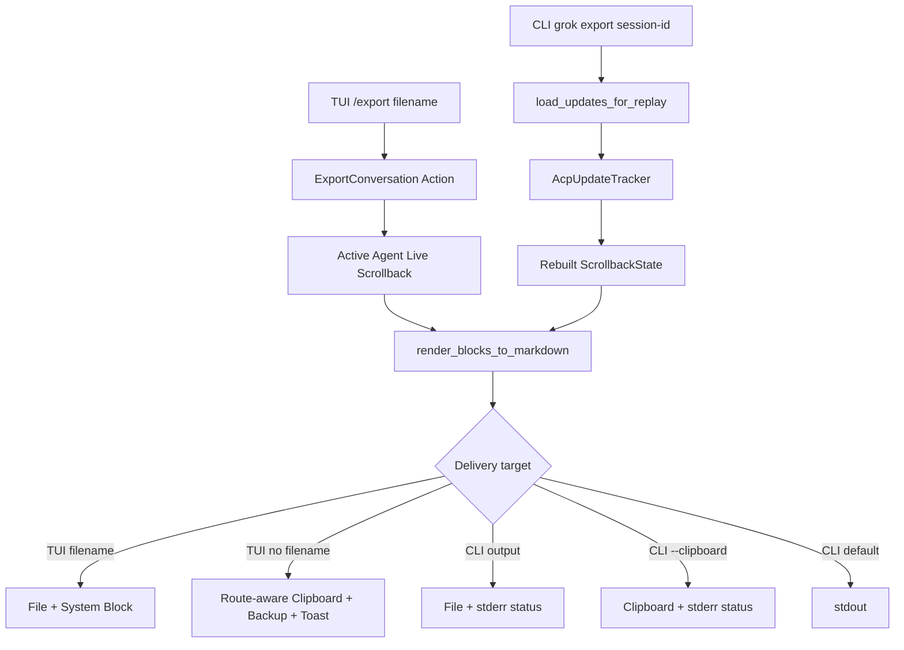
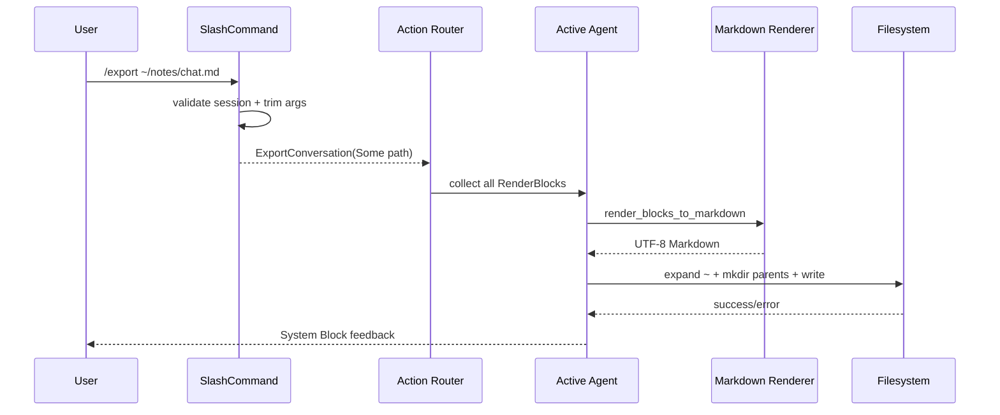
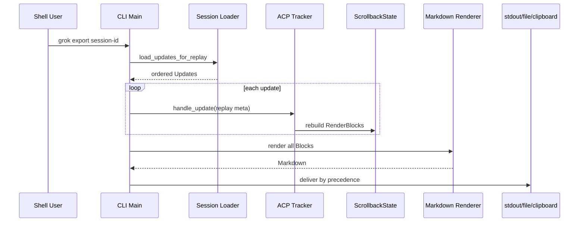

# Walkthrough：会话如何从 Live Scrollback 或 Session Replay 导出为 Markdown

> 场景：用户希望把当前 Grok 对话保存为 Markdown，可能在 TUI 中执行 `/export`，也可能离开交互界面后运行 `grok export <session-id>`。导出的内容不应该是终端截图，也不应该照搬所有 UI Chrome；它需要保留 User/Assistant 正文，压缩 Tool Call，跳过 Thinking、System 与生命周期噪声。文件目标还涉及路径补全、`~` 展开、目录创建和写入错误；无文件名时则要经过剪贴板的 Native、tmux、OSC 52 与 Backup File 交付链路。

---

## 1. 这篇解决什么问题

本篇追踪两条导出入口如何汇入同一个 Markdown Projection：

1. TUI `/export [filename]` 从当前 Active Agent 的 Live Scrollback 收集 Block；
2. CLI `grok export <session-id>` 从磁盘加载 Updates 并 Replay 出 Scrollback；
3. `render_blocks_to_markdown` 选择会话正文、组织角色标题并摘要工具；
4. 结果写入文件、复制到剪贴板或输出到 stdout；
5. 各入口以 System Block、Toast、stderr 或 `anyhow::Error` 反馈结果。

## 2. 先给结论

Export 不是 Scrollback Renderer 的另一种主题，而是一个有损的语义投影。

它刻意保留：

- User Prompt 原文；
- Assistant 的 Raw Markdown；
- 每个 Tool Call 的一行摘要。

它刻意丢弃：

- Thinking；
- System/Session Event；
- Subagent/BgTask 生命周期块；
- BTW、Credit Limit、Context Info 等 UI/运行态内容；
- 屏幕样式、折叠状态、时间戳与布局。

## 3. 两条入口的总图



## 4. 关键源码地图

| 文件 | 职责 |
| --- | --- |
| `xai-grok-pager/src/scrollback/export.rs` | 纯 Markdown 转换与 Tool Summary |
| `xai-grok-pager/src/slash/commands/export.rs` | `/export` 契约与路径候选 |
| `xai-grok-pager/src/app/actions.rs` | `ExportConversation` Action |
| `xai-grok-pager/src/app/dispatch/transcript.rs` | Live Scrollback 导出、文件/剪贴板与反馈 |
| `xai-grok-pager/src/export_cmd.rs` | Session Replay CLI 导出 |
| `xai-grok-pager-bin/src/main.rs` | 顶层 `Command::Export` 分发 |
| `xai-grok-pager/src/acp/tracker/` | Replay Update 到 Scrollback 的投影 |
| `xai-grok-pager-render/src/clipboard/mod.rs` | TUI 剪贴板交付与文件兜底 |

## 5. 三种不同的 Transcript

仓库里容易混淆三类“对话文本”：

- **Model Conversation**：发给模型的结构化历史；
- **Scrollback Timeline**：给人看的 Block 时间线；
- **Export Markdown**：从 Timeline 再筛选出来的可移植文档。

三者服务不同目标，不能假设一一等价。

## 6. 为什么不直接导出 Model Conversation

模型历史可能包含 Provider Item、Tool Protocol、Compaction Summary 和内部角色结构，不适合直接阅读。

Export 以 Scrollback Block 为输入，优先得到用户在 UI 语义上熟悉的内容。

## 7. 为什么不直接序列化 ScrollbackState

ScrollbackState 除正文外还包含选择、折叠、缓存、滚动和临时显示状态。序列化它会把 UI 实现细节变成文件格式。

纯 Markdown Projection 把输出契约限制在人类可读内容。

## 8. Glossary checkpoint：核心边界

| 名词 | 白话解释 | 本篇中的含义 |
| --- | --- | --- |
| Transcript | 一份对话记录 | 需看上下文判断是模型、UI 还是导出版本 |
| Projection | 从丰富对象选择部分字段形成新视图 | RenderBlock -> Markdown |
| Lossy | 转换后不能完整还原原对象 | Thinking、状态与工具正文被省略 |
| Live Scrollback | 当前内存里的时间线 | `/export` 的数据源 |
| Replay | 从持久化事件重建状态 | CLI Export 的数据源 |
| Delivery | 把生成文本送到目标 | 文件、剪贴板或 stdout |

## 9. `/export` 的命令契约

`ExportCommand` 声明：

- Name：`export`；
- Usage：`/export [filename]`；
- 参数可选；
- Session-scoped；
- 描述为导出当前 Conversation 到文件或剪贴板。

## 10. 有无参数决定目标

命令对 `args` 调用 `trim()`：

- 为空：`file_path = None`，走剪贴板；
- 非空：整个剩余字符串成为 `PathBuf`，走文件。

因此带空格的路径无需在 Slash Command 内再次拆词。

## 11. 为什么必须有 Active Session

若 `ctx.session_id` 为 None，命令立即返回 `CommandResult::Error("No active session to export")`。

它不会产生一个随后才失败的 Action，也不会导出无归属的 Dashboard 内容。

## 12. 命令层为什么不做 I/O

Slash Command 只解析意图并产生：

```text
Action::ExportConversation { file_path }
```

文件系统、Clipboard 和 Scrollback 访问都留给 App Dispatch。这保持命令 Catalog 可测试，也让副作用集中在 Controller 层。

## 13. Action 是什么角色

Action 是 UI 意图的领域消息。它携带可选 Path，但不携带已生成 Markdown。

真正执行时才读取 Active Agent，避免命令解析与状态变化之间提前复制一份可能过时的 Transcript。

## 14. Router 如何分发

`dispatch/router.rs` 匹配 `Action::ExportConversation`，调用 `dispatch_export_conversation(app, file_path)`，并返回空 Effect 列表。

当前导出是同步 App Mutation，不启动异步 Effect。

## 15. Glossary checkpoint：命令架构

| 名词 | 白话解释 | 这里的职责 |
| --- | --- | --- |
| Slash Command | TUI 中以 `/` 开头的命令 | 解析参数并返回 Action |
| CommandResult | Slash 执行的统一结果 | Action、Error 等 |
| Action | UI 层意图消息 | `ExportConversation` |
| Dispatch | 把 Action 映射为实际行为 | 收集 Block 并交付文本 |
| Effect | 需要外围异步执行的工作 | 当前 Export 不返回 Effect |
| Controller | 协调状态和副作用的层 | App Dispatch |

## 16. Path Completion 何时触发

`suggest_args` 调用 `list_path_completions(ctx.cwd, args_query)`。空白 Query 返回空列表，避免刚输入 `/export ` 就枚举整个工作目录。

只有用户开始输入路径后才读取目录。

## 17. `~` 如何参与补全

候选发现时先通过 `shellexpand::tilde(trimmed)` 解析实际读取路径，但 Insert Text 尽量保留用户原有的 `~` Prefix。

这样候选可以访问 Home，同时不强迫编辑器替换成绝对路径。

## 18. 尾部 `/` 的语义

如果输入以 `/` 结尾，输入本身就是要列举的目录；否则：

- Parent 是要读取的目录；
- 最后一段是交给 Nucleo 排名的部分文件名；
- `typed_prefix` 保留最后一个 `/` 之前的文本。

## 19. 相对路径如何解析

`dir_to_list` 是相对路径时，补全逻辑以 `ctx.cwd` Join；绝对路径则直接使用。

这只决定“到哪里列目录”。最终 Action 仍保留用户输入的 PathBuf。

## 20. 为什么目录候选带尾部 `/`

`insert_text` 给目录追加 `/`，让 Slash Args Dropdown 在接受候选后继续 Drill-down，而不是把目录当作最终输出文件。

显示文本和插入文本都明确区分目录与普通文件。

## 21. Symlink Directory 的行为

代码使用 `entry.path().is_dir()`，会跟随 Symlink 判断目标是否为目录。

因此指向目录的 Symlink 也获得 `/`，可继续向下补全。

## 22. 隐藏文件为何被过滤

名称以 `.` 开头的 Entry 不进入候选。这样普通补全更干净，但也意味着用户不能靠下拉发现 `.private/` 或 `.exports.md`。

手动输入仍可使用隐藏路径。

## 23. 两级数量上限

候选收集达到 1000 就停止，然后：

1. 目录优先；
2. 同类按 Display 字母排序；
3. 截断到 100。

前置 1000 Cap 防止病态大目录，但读取顺序来自 Filesystem，因此可能错过排序上本应靠前的第 1001 个 Entry。

## 24. 为什么补全失败静默为空

`read_dir` 失败直接返回空 Vec，单个 Entry 读取失败也用 `filter_map` 跳过。

补全是辅助能力，不应因权限不足或临时目录变化阻止用户手动提交路径。

## 25. 同步 `read_dir` 的性能边界

Slash Command 系统当前是事件驱动，没有类似 `@` File Search 的 Tick Polling Daemon。这里接受本地目录同步读取，并用 1000 Entry Cap 控制上界。

网络挂载、FUSE 或慢盘仍可能让这一步阻塞输入线程，这是当前明确的折中。

## 26. Glossary checkpoint：路径补全

| 名词 | 白话解释 | 当前行为 |
| --- | --- | --- |
| CWD | 当前工作目录 | 相对候选的解析基准 |
| Tilde expansion | 把 `~` 展开为 Home | 读取与最终写入都使用 |
| Prefix | 用户已输入的目录部分 | 插入候选时保留 |
| Drill-down | 接受目录后继续浏览子项 | 依赖尾部 `/` |
| Symlink | 指向其他路径的链接 | `is_dir()` 跟随目标 |
| Nucleo | 模糊匹配与排序组件 | 对提供的候选做 Query Ranking |

## 27. Live Export 如何选择 Agent

`dispatch_export_conversation` 通过 `with_active_agent` 访问 Agent。

如果用户当前正在查看 Subagent，Active Agent 可以是 Child，而不一定是 Root Session 的主 Scrollback。

## 28. 为什么这点很重要

命令文案说“current conversation”。Active Subagent View 中，用户通常期望导出眼前这段 Child Conversation。

实现没有强制回到 Root Agent，也不把 Root 与 Child 自动合并。

## 29. Block 收集顺序

Dispatcher 遍历 `0..scrollback.len()`，逐项通过 `entry(i)` 取得 `&entry.block`，保存到 Vec。

顺序就是当前 Scrollback 的逻辑时间顺序，不受当前滚动位置或 Selected Entry 影响。

## 30. Fold 不影响收集

收集读取 Block 本体，不读取当前屏幕行。Collapsed、Raw/Pretty Toggle、Group Truncation 和 Viewport Window 都不删除 Block。

因此导出不会只包含当前可见区域。

## 31. 当前选择不影响导出

`/export` 是整段 Conversation 操作，不是 Selected Block 操作。与 `CopyBlockContent` 的语义不同。

没有选择时照样可以导出。

## 32. Projection 函数为何是 Pure Function

`render_blocks_to_markdown` 只接收 `IntoIterator<Item=&RenderBlock>`，返回 String：

- 不读 App State；
- 不写文件；
- 不访问 Clipboard；
- 不改变 Block；
- 不依赖终端宽度。

这种边界让 Live 与 Replay 两条入口共享同一输出规则。

## 33. Pure 不等于无分配

函数会构建一个新的 `String`，并调用部分 Block 的 Copy Text 生成中间 String。

“Pure”描述可观察副作用，不描述零成本。

## 34. 输出状态机只有两个 Boolean

转换循环维护：

- `last_was_agent`：上一个导出片段是否为 Assistant；
- `in_tools_section`：当前是否已打开连续 Tool Section。

这两个状态决定是否追加新 Header 和额外分隔换行。

## 35. 为什么不用完整角色 Enum

输出规则很小：User 永远新开 Section，连续 Assistant 合并，连续 Tool 合并，其他类型跳过。

两个 Boolean 足以表达当前格式，但类型增加后可能更适合显式 `LastSection` Enum。

## 36. Glossary checkpoint：转换器

| 名词 | 白话解释 | 这里的体现 |
| --- | --- | --- |
| Pure Function | 输出只由输入决定，无外部副作用 | Blocks -> String |
| State Machine | 根据前一状态决定下一输出 | 两个 Boolean |
| Section | Markdown 二级标题下的一组内容 | User、Assistant、Tools |
| Coalescing | 连续同类内容合并到一个 Section | Assistant 与 Tool |
| Fidelity | 对原内容保真的程度 | Assistant 使用 Raw Markdown |
| Chrome | UI 装饰或运行状态信息 | 导出时跳过 |

## 37. User Prompt 的输出规则

每个 `RenderBlock::UserPrompt` 都产生：

```markdown
## User

<prompt text>
```

Prompt 使用 `u.copy_text()`，然后追加两个换行。

## 38. 为什么每个 User 都独立 Header

User Prompt 表示新的对话轮次边界。即使两个 User Block 连续出现，也不合并为一个角色段落。

这比只按角色相同合并更能保留 Turn 感。

## 39. User 出现时如何关闭 Tools

若当前在 Tools Section，先追加一个换行并设置 `in_tools_section = false`，再写 User Header。

同时 `last_was_agent = false`，保证后续 Assistant 能新开 Header。

## 40. Assistant 的输出规则

第一次 Assistant 或非连续 Assistant 产生：

```markdown
## Assistant

<raw markdown>
```

内容通过 `a.copy_text(true)` 获取。

## 41. `copy_text(true)` 中的 true 表示什么

它要求 Raw Source Markdown，而不是渲染后的 Plain Text。

因此标题、列表、代码围栏、链接和强调标记可以继续在导出的 `.md` 中工作。

## 42. 为什么 Search Index 与 Export 选择不同文本

第 38 篇介绍的 Search Index 对 Markdown 偏向 Rendered Plain Text，以匹配屏幕可见语义；Export 则偏向 Raw Markdown，以保留文档结构。

同一个 Block 可有多个合理文本投影，取决于 Consumer。

## 43. 连续 Assistant 如何合并

`last_was_agent == true` 时不重复写 `## Assistant`，只继续追加下一段正文和空行。

流式或内部拆分造成多个相邻 Assistant Block 时，导出仍读成一个回答区段。

## 44. Thinking 如何作为“胶水”

Thinking 本身被跳过，也不改变 `last_was_agent`。

因此两个 Assistant Block 中间夹着 Thinking 时，输出仍保持同一个 Assistant Section。

## 45. Tool Call 的输出规则

首次进入连续 Tool 序列时写：

```markdown
## Tools

- <summary>
```

后续 Tool 只追加新的 Bullet。

## 46. Tool 为什么只导出摘要

工具正文可能极长，包含完整文件、终端日志、Diff 或网页内容。Export 的目标是可继续阅读与归档，而非完整 Debug Trace。

摘要保留“做过什么”，不保留“工具返回的全部证据”。

## 47. Tool 会终止 Assistant 连续性

每个 Tool Call 都设置 `last_was_agent = false`。工具之后再出现 Assistant，会新开一个 `## Assistant`。

这自然形成 Assistant 请求工具、Tools 活动、Assistant 总结的段落结构。

## 48. 连续 Tools 如何关闭

User 或新的 Assistant Section 出现时，如果 `in_tools_section` 为 true，会追加额外换行并复位状态。

文件末尾的多余尾空白最终由 `trim_end` 清理。

## 49. Glossary checkpoint：角色投影

| 名词 | 白话解释 | 导出结果 |
| --- | --- | --- |
| User Prompt | 用户提交给 Agent 的文本 | 每条独立 `## User` |
| Assistant Message | Agent 面向用户的回答 | 连续消息合并 |
| Thinking | 内部推理展示块 | 跳过且不打断 Assistant |
| Tool Call | Agent 请求或执行的工具活动 | `## Tools` 下的一行 Bullet |
| Raw Markdown | 带原始 Markdown 语法的正文 | Assistant 导出的来源 |
| Tool Summary | 工具活动的压缩描述 | 不包含完整 Tool Output |

## 50. Read Tool Summary

格式为：

```text
Read: <path> (<line_range>)
```

只有 `line_range` 存在时才添加括号。

## 51. Edit Tool Summary

格式为：

```text
Edit: <path>
```

它不导出 Diff、Replacement、成功状态或 Error。

## 52. Execute Tool Summary

格式为：

```text
Execute: <command> (<description>)
```

Description 可选；stdout、stderr、exit code 和后台状态不进入摘要。

## 53. ListDir 与 Search Summary

- `ListDir: <path>`；
- `Search: <pattern>`。

搜索路径、Glob、Match Count 和结果行当前不包含在 Summary 中。

## 54. Web Tool Summary

- `WebFetch: <url>`；
- `WebSearch: <query>`。

抓取正文、搜索结果和 Citation 不导出。

## 55. UseTool 与扩展工具

- UseTool：`UseTool: <tool_name>`；
- Skill/Other：`Tool: <name>`。

Other Tool 的 Summary/Output/Error 不进入 Export Summary。

## 56. 固定文案的工具类型

- IntegrationSearch：`IntegrationSearch (MCP tool discovery)`；
- MemorySearch：`MemorySearch`；
- Lifecycle：`Lifecycle event`。

这些类型不暴露查询或结果细节。

## 57. Tool Summary 是否进行 Markdown Escape

没有。路径、命令、Pattern、URL 和名称被直接拼到 Bullet 后。

若字段含换行或 Markdown 控制字符，可能改变导出结构。这是当前格式化器的明确边界。

## 58. 为什么命令中的换行值得警惕

多行 Shell Command 直接进入 `- Execute: ...` 后，后续行不自动缩进为 Bullet Continuation。

结果仍是文本，但 Markdown 结构可能不再是“一工具一行”。

## 59. 完整工具证据去了哪里

它仍在原 Session Updates、Replay 后的 Scrollback Block 或 Tool-specific Copy/View 中。

Export Markdown 不是证据归档或 Trace Export 的替代品。

## 60. Glossary checkpoint：工具摘要

| 名词 | 白话解释 | 当前取舍 |
| --- | --- | --- |
| Summary | 对完整事件的短描述 | 通常只保留主要输入 |
| Tool Output | 工具返回的数据 | 导出时省略 |
| Trace | 更偏调试的完整运行记录 | 与 Conversation Export 不同 |
| Markdown escaping | 把控制字符变成普通文本 | Tool Summary 当前未做 |
| Citation | Web/Search 结果的来源链接 | Tool Summary 当前省略 |
| Evidence archive | 可审计的完整证据集合 | 当前 Export 不承诺 |

## 61. 哪些 Block 被统一跳过

Match 的默认分支跳过所有非 User、Assistant、ToolCall 类型，例如：

- Stub；
- Thinking；
- System；
- SessionEvent；
- BgTask；
- Workflow；
- Subagent；
- BTW；
- ContextInfo；
- CreditLimit。

## 62. System Block 为什么跳过

System Block 常包含 Toast-like 历史、恢复提示、导出成功消息和应用状态，并不都是用户与 Assistant 的语义对话。

跳过它也防止“Conversation exported to ...”在下一次 Export 中自我复制。

## 63. Session Event 为什么跳过

Turn Failed、Resume、模型切换等事件对调试有用，但会使便携对话文档充满运行时噪声。

当前 Export 选择可阅读性而非完整生命周期。

## 64. Subagent Block 为什么跳过

Root Scrollback 中的 Subagent Lifecycle/摘要块不会自动展开为 Child Conversation。

若用户进入 Active Subagent View 再执行 `/export`，则导出该 Child 自己的 Scrollback。

## 65. BTW 为什么跳过

BTW 是旁路显示态，不属于正式 Conversation。跳过它延续了“不污染主对话”的设计边界。

## 66. Thinking 是否永远不应导出

当前 Compact Markdown Export 明确跳过 Thinking。但 `/transcript` 在 Minimal Mode 有另一条 Full-fidelity ANSI 构建路径，会完整展开 Reasoning。

因此应说“这个 Export Projection 跳过”，而不是宣称仓库所有 Transcript 功能都跳过。

## 67. 输出为何没有顶级标题

转换器从 `## User`/`## Assistant` 开始，不添加 Session ID、仓库、日期、模型或 `# Conversation`。

输出便于粘贴到已有文档，但独立归档的上下文元数据较少。

## 68. 输出为何不含时间戳

Block Iterator 只传 RenderBlock 引用，没有 Entry 时间元数据。Projection Contract 也未声明时间线字段。

增加时间戳需要扩展输入边界，不是单纯改 Tool Summary。

## 69. 末尾如何清理

函数计算 `out.trim_end().len()`，然后 `truncate` 到该长度。

它删除最终所有 Unicode Whitespace，保证文件末尾没有多余空行；调用方按需要再补一个 stdout 换行。

## 70. `trim_end` 的细微边界

它只影响整个导出字符串的末尾，不会清理每个 Message 内部。

如果最后一条正文刻意依赖末尾两个空格形成 Markdown Hard Break，这些结尾空格可能被删除。

## 71. 空输出如何定义

若输入没有 User、Assistant 或 ToolCall，结果就是空 String。

只有 Thinking/System/Subagent 等 Block 的 Scrollback 在 Export 语义上被视为“没有 Conversation Content”。

## 72. Glossary checkpoint：有损边界

| 名词 | 白话解释 | 示例 |
| --- | --- | --- |
| Conversation content | Export 认可的正文 | User、Assistant、Tool Summary |
| Non-conversation chrome | 被排除的运行/UI 信息 | System、SessionEvent |
| Metadata | 描述会话的附加事实 | Session ID、模型、时间戳，当前未输出 |
| Full-fidelity | 尽量保留全部展示信息 | `/transcript` Minimal 路径 |
| Compact export | 偏阅读与分享的简化文本 | 本篇 Markdown Projection |
| Trailing whitespace | 文件末尾空格/换行 | 最终统一删除 |

## 73. Live 文件导出的第一步

若 Action 带 `file_path`，Dispatcher 使用：

```text
shellexpand::tilde(path.to_string_lossy())
```

再构造新的 PathBuf。

## 74. `to_string_lossy` 的含义

非 UTF-8 路径会以 Replacement Character 转成字符串再展开，因此可能无法保持原始 OsString 字节。

这个路径管线实际上偏向 UTF-8 用户输入。

## 75. Parent Directory 自动创建

若展开后的路径存在 Parent，调用 `create_dir_all(parent)`。

因此 `/export ~/notes/grok/session.md` 可以在 `notes/grok` 不存在时创建整个目录链。

## 76. 空 Parent 的情况

相对文件名如 `session.md` 的 Parent 通常是空 Path。代码仍可能对该 Parent 调用 `create_dir_all`，平台语义需要由标准库处理。

最终 `fs::write` 的相对基准是进程当前目录，通常与 Agent CWD 应保持一致，但 Dispatcher 没有显式 `agent.cwd.join(path)`。

## 77. 文件写入是否原子

不是。它直接调用 `std::fs::write`：创建或截断目标，再写全部字节。

进程中途失败时不能承诺旧文件完整保留，也没有 Temp + Rename 事务。

## 78. 是否会覆盖现有文件

会。没有 `create_new`、确认 Modal 或 Backup Existing File。

用户给出已有路径即授权覆盖，这是当前命令语义的重要风险边界。

## 79. 文件权限如何决定

普通 `fs::write` 遵循平台默认创建权限与 Umask，没有像 Clipboard Backup 那样显式设置 0600。

因此包含敏感对话的导出文件权限由目标目录、Umask 和已有文件 Mode 决定。

## 80. 文件名扩展名是否强制

不强制。命令说明写 UTF-8 Markdown，但用户可以传任意文件名；实现不会自动追加 `.md`。

## 81. 成功反馈如何进入 Scrollback

写入成功后 Push：

```text
Conversation exported to <expanded path>
```

这是 System Block，因此当前 Export 中不包含它，下一次 Export 也会因 System 过滤而跳过。

## 82. 创建目录失败如何反馈

Push `Failed to create directory: <error>` 并立即返回，不再尝试文件写入。

Error 文本可能由操作系统包含路径信息。

## 83. 写文件失败如何反馈

Push `Failed to write file: <io error>`。注释明确避免重新回显用户提供的完整路径，因为其中可能含 Secret 或 PII。

但 OS Error 自身是否包含路径取决于错误来源；这里的保护是“不主动格式化 Path”。

## 84. 为什么反馈写入同一个 Scrollback

它与命令结果处于用户当前上下文，无需单独 Modal。System Block 可持久留在 UI，又不会污染 Compact Export。

## 85. Glossary checkpoint：文件交付

| 名词 | 白话解释 | 当前行为 |
| --- | --- | --- |
| Path expansion | 把用户简写变成实际路径 | 支持 `~` |
| Parent creation | 自动创建上级目录 | `create_dir_all` |
| Truncate | 写前把旧文件长度清零 | `fs::write` 可覆盖 |
| Atomic write | 临时文件完整写完再替换 | 当前未实现 |
| Umask | 限制新文件默认权限的进程设置 | Export 文件依赖它 |
| Path redaction | 错误中少暴露用户路径 | Live 写失败不主动回显 Path |

## 86. Live 无文件名时走什么

`file_path = None` 时计算内容统计，并调用 `agent.copy_to_clipboard(&md)`。

这不是单一 Native Clipboard API，而是第 37 篇介绍的 Route-aware Multi-fire + Backup Delivery。

## 87. 为什么先计算 Stats

长 Transcript 复制可能不可见地花费时间或触发终端限制。`clipboard_stats_suffix` 为反馈添加字符/行等规模信息。

用户能判断是否复制了预期大小的内容。

## 88. Clipboard Success 的反馈

若 `CopyDelivery::Clipboard`：

- 有 Backup File：说明 Clipboard 成功且也保存到该路径；
- 无 Backup File：说明已复制到 Clipboard。

反馈依据真实 Delivery，而非仅依据调用已经发出。

## 89. Clipboard 不可达但文件成功

`CopyDelivery::File` 时 Push：

```text
Clipboard unreachable — conversation written to <path>
```

这避免谎称“copied to clipboard”。

## 90. Clipboard 与文件都失败

`CopyDelivery::Failed` 时 Push `Conversation copy failed`，仍附带 Stats。

具体多路 Backend 错误由 Clipboard 层负责诊断，不把 Transcript 正文写进错误。

## 91. Toast 在哪里产生

`agent.copy_to_clipboard` 自身执行 Route-aware Feedback/Toast 行为；Dispatcher 还写一条持久 System Block，说明实际落点。

短时 Toast 与 Scrollback 记录承担不同 UX 角色。

## 92. Backup File 的敏感性

Clipboard Delivery 会尝试 Owner-only Backup File。即使 Clipboard 成功，也可能返回 `file: Some(path)`。

因此 `/export` 到 Clipboard 实际可能产生本地磁盘副本，这是用户学习安全边界时必须知道的事实。

## 93. 为什么文件参数不走 Clipboard Backup Writer

显式 `/export filename` 的目标就是用户指定文件，使用普通写入和目录创建；Clipboard Backup 是另一套“复制可恢复性”策略。

两者权限与错误模型不同。

## 94. Glossary checkpoint：Clipboard 交付

| 名词 | 白话解释 | Export 中的意义 |
| --- | --- | --- |
| Route-aware | 根据环境尝试多条复制路径 | Native、tmux、OSC 52 |
| Multi-fire | 同一次复制可尝试多个 Backend | 提高复杂环境成功率 |
| CopyDelivery | 对最终落点的结构化总结 | Clipboard、File、Failed |
| Backup File | Clipboard 之外的恢复副本 | Owner-only last-copy 文件 |
| Toast | 短暂屏幕提示 | 快速反馈 |
| System Block | 留在 Scrollback 的状态消息 | 记录实际交付结果 |

## 95. CLI Export 的参数结构

`ExportArgs` 包含：

- 必填 `session_id`；
- 可选 `output: PathBuf`；
- `--clipboard`/`-c` Boolean。

没有 Output 时默认 stdout，除非指定 Clipboard Flag。

## 96. 顶层二进制如何进入 CLI Export

`xai-grok-pager-bin/src/main.rs` 匹配 `Command::Export(export_args)`：

1. 初始化简化 Tracing；
2. 调用 `xai_grok_pager::export_cmd::run(export_args)`；
3. 直接返回结果，不启动交互式 TUI。

## 97. CLI 数据源不是当前内存

`run()` 调用 `load_updates_for_replay(session_id)` 从 Session Storage 读取更新序列。

因此它可以在原 TUI 已退出后工作，也不会依赖当前屏幕选择或折叠状态。

## 98. Session 不存在如何处理

Loader 返回 `None` 时，通过 `with_context` 形成：

```text
Session '<id>' not found.
```

这成为 CLI Error，而不是 Scrollback System Block。

## 99. Replay 如何重建 Scrollback

CLI 创建：

- `AcpUpdateTracker::new()`；
- `ScrollbackState::new()`；
- `NotificationMeta { is_replay: true, ... }`。

然后按顺序把每条 Update 交给 Tracker，复用正常 ACP Update -> RenderBlock 逻辑。

## 100. `is_replay` 为什么重要

Replay 应重建历史显示，而不把旧事件当成新实时通知触发所有副作用。

Meta 给 Handler 明确的来源语义；具体分支由各 Update Handler 决定。

## 101. Replay 后为何仍收集全部 Block

重建完成后与 Live 路径一样遍历 `0..scrollback.len()`，取出每个 RenderBlock，再调用同一纯 Renderer。

这就是两条入口格式一致的汇合点。

## 102. Replay 是否保证与 Live 完全相同

不应绝对承诺。只有被持久化并可由 Tracker 重建的状态才能出现；某些纯 UI 临时块、未落盘事件或运行时中央 Store 内容可能不同。

但 Compact Export 过滤大量临时类型，降低了差异面。

## 103. CLI 空 Conversation 如何处理

Renderer 返回空字符串时 `anyhow::bail!`：

```text
Session '<id>' has no conversation content to export
```

CLI 不生成空文件，也不向 stdout 输出空 Transcript。

## 104. Glossary checkpoint：Session Replay

| 名词 | 白话解释 | 这里的作用 |
| --- | --- | --- |
| Session Storage | 持久化会话更新的磁盘数据 | CLI Export 来源 |
| Update | 会话演进的一条事件 | 按顺序重放 |
| ACP Tracker | 把协议更新投影到 UI 状态 | 重建 RenderBlock |
| Replay Meta | 标记事件来自历史重放 | 避免当作全新实时事件 |
| Reconstruction | 从事件恢复派生状态 | Updates -> Scrollback |
| Ephemeral state | 没有持久保存的临时状态 | Replay 不一定拥有 |

## 105. CLI 输出目标优先级

代码顺序是：

1. 若 `output` 为 Some，写文件；
2. 否则若 `clipboard` 为 true，复制；
3. 否则写 stdout。

因此同时给 Output 和 `--clipboard` 时，Output 获胜，Clipboard Flag 被忽略。

## 106. CLI 文件路径如何处理

与 Live 路径类似：

- `to_string_lossy`；
- `shellexpand::tilde`；
- `create_dir_all(parent)`；
- `std::fs::write`。

同样非原子、可覆盖、权限依赖 Umask。

## 107. CLI 文件错误上下文

CLI 使用 `anyhow::Context`，错误信息主动包含 Parent 或 Expanded Path：

- `Failed to create <parent>`；
- `Failed to write <path>`。

这与 TUI 写文件失败时避免主动回显用户 Path 的策略不同。

## 108. CLI 文件成功输出到哪里

Transcript 写到目标文件；状态消息通过 `eprintln!` 写 stderr：

```text
Conversation exported to <path>
```

因此 stdout 可以保留给数据管道语义。

## 109. CLI 默认 stdout 行为

先 `write_all(md.as_bytes())`，再写一个 `\n`。

Renderer 自身删除尾空白，CLI 明确补一个标准文本文件结尾换行。

## 110. 为什么不用 `println!`

`Write::write_all` 避免 Format Machinery 对内容做额外解释，并把 stdout 写错误作为 `Result` 传播。

它适合把大 String 原样送进 Pipe。

## 111. CLI Clipboard 路径的关键差异

它调用 `crate::clipboard::copy_text(&md)`，但把返回结果赋给 `_` 并忽略。

随后无条件打印 `Conversation copied to clipboard (...)`。

## 112. 这意味着什么

CLI Clipboard 的状态文案当前表示“已尝试复制”，不保证像 TUI `CopyDelivery` 那样根据真实落点分类。

若 Backend 失败，命令仍可能报告 copied。这是当前实现差异，不能在文档中统一描述成可信交付。

## 113. CLI Clipboard 是否有 Backup File

它调用的是 `copy_text`，不是 `copy_text_or_file`。因此不使用 TUI Export 的结构化 Backup Delivery 路径。

具体 Backend Multi-fire 仍由 `copy_text` 实现，但没有 Export 层文件兜底总结。

## 114. CLI Stats 的“chars”准确吗

输出使用 `md.len()`，Rust String 的 `len()` 是 UTF-8 字节数，不是 Unicode Character 数。

文案写 `chars`，对中文或 Emoji 会高估字符数。这是命名与测量单位的当前错位。

## 115. CLI Lines 如何计算

`md.lines().count()` 按 Rust Lines Iterator 计算逻辑行。Renderer 已移除末尾换行，CLI 随后打印的 stdout 换行不计入该数字。

## 116. CLI Tracing 记录什么

开始记录 Session ID；文件成功记录 Session ID、Path、Bytes；Clipboard 成功文案路径记录 Session ID、Bytes、Lines。

Transcript 正文不写入这些 Info Event。

## 117. Glossary checkpoint：CLI 流

| 名词 | 白话解释 | 当前实现 |
| --- | --- | --- |
| stdout | 命令的主要数据输出 | 默认 Markdown |
| stderr | 状态和错误提示通道 | 文件/Clipboard 成功文案 |
| Pipe | 把 stdout 交给下一命令 | 可直接处理 Markdown |
| Flag precedence | 多目标参数同时存在时谁优先 | Output > Clipboard > stdout |
| Byte length | UTF-8 占用字节数 | `String::len()` |
| Character count | 用户感知字符数量 | CLI `chars` 文案实际未测量 |

## 118. Live 与 CLI 的对照表

| 维度 | TUI `/export` | CLI `grok export` |
| --- | --- | --- |
| 数据源 | Active Agent Live Scrollback | Session Updates Replay |
| 默认目标 | Clipboard | stdout |
| 文件参数 | Slash 剩余文本 | CLI `output` 参数 |
| Clipboard API | Route-aware `CopyDelivery` 路径 | `copy_text`，结果被忽略 |
| Clipboard Backup | 会尝试并反馈 | Export 层不提供 |
| 成功反馈 | System Block + Toast | stderr |
| 错误反馈 | System Block | `anyhow::Error` |
| 文件 Path 隐私 | 写失败不主动重印用户 Path | Context 包含 Expanded Path |
| Markdown Renderer | 相同 | 相同 |

## 119. 为什么两个入口应共享 Renderer

否则同一 Session 在 TUI 和 CLI 中可能产生不同角色标题、Tool Summary 和过滤规则。

把格式规则放在纯函数中，使差异集中于数据源与交付层。

## 120. 为什么两个入口仍有行为漂移

共享 Renderer 不会自动统一：

- Clipboard API；
- Error Policy；
- Default Target；
- Path Feedback；
- Replay/Live 数据来源；
- Stats 文案。

阅读架构时必须分别审查 Projection 与 Delivery。

## 121. 与 `/copy N` 的区别

`/copy N` 选择第 N 个最近 Assistant Message，可写文件或复制；`/export` 收集完整 User/Assistant/Tool 时间序列。

前者适合取得单个回答，后者适合形成对话文档。

## 122. 与 Copy Selected Block 的区别

Block Copy 尊重该 Entry 的 Raw/Pretty 状态，并可复制完整 Tool Output；Export 使用固定跨 Block Policy。

屏幕选择、当前 Fold 和 Selected Entry 不影响 Export。

## 123. 与 `/transcript` 的区别

非 Minimal Mode 的 `/transcript` 也复用 Compact Markdown Renderer，但把结果写入随机 Temp `.md`，再交给 `$PAGER`。

Minimal Mode 则走增量 Full-fidelity ANSI 路径，避免长会话同步渲染冻结 Event Loop。

## 124. 为什么 `/transcript` 值得另写专篇

它涉及：

- Incremental Time Budget；
- Full Layout 与 Syntax Highlight；
- 临时文件；
- TTY Suspend/Restore；
- `$PAGER` 子进程；
- ANSI 与 Markdown 两种内容。

本篇只把它作为 Export Boundary 的对照，不展开其事件循环。

## 125. 与 Trace Export 的区别

Trace 面向诊断、运行记录或上传，Conversation Export 面向人类阅读与继续对话。

Tool Output、Timing、内部 Event 等被 Compact Export 省略，不代表 Trace 也应省略。

## 126. Glossary checkpoint：相邻能力

| 能力 | 目标 | 输出范围 |
| --- | --- | --- |
| Copy Block | 取得当前一个 Block | 可较完整 |
| Copy N | 取得最近第 N 条 Assistant | 单消息 |
| Export Conversation | 保存可读对话 | User/Assistant + Tool Summary |
| Open Transcript Pager | 在外部 Pager 阅读 | Compact MD 或 Full ANSI |
| Trace Export | 诊断与运行证据 | 与对话文档不同 |
| Share | 上传或生成分享链接 | 另有服务端/隐私边界 |

## 127. 一次 Live 文件导出时序



## 128. 一次 CLI 导出时序



## 129. 内容示例

输入 Block 顺序：

```text
UserPrompt("检查构建")
AgentMessage("我先运行测试。")
Execute("cargo test")
Thinking("分析失败")
AgentMessage("有两个失败。")
System("Copied")
```

输出近似为：

```markdown
## User

检查构建

## Assistant

我先运行测试。

## Tools

- Execute: cargo test

## Assistant

有两个失败。
```

## 130. 为什么 Thinking 没有产生新 Header

它落在 Tool 与 Assistant 之间且被跳过。Tool 已经把 `last_was_agent` 设为 false，所以后面的 Assistant 新开 Section。

若 Thinking 位于两个相邻 Assistant Block 之间，则两者仍合并。

## 131. 失败矩阵

| 失败点 | Live TUI | CLI |
| --- | --- | --- |
| 无 Session | Slash Error | Session ID 是必填参数 |
| Session 不存在 | 不适用当前 Live | `anyhow` Not Found |
| 无可导出内容 | System Block | `bail!` |
| Parent 创建失败 | System Block 并返回 | Context Error |
| 文件写失败 | 路径克制的 System Block | 含 Path Context Error |
| Clipboard Backend 失败 | File Fallback 或 Failed | 结果被忽略，仍打印 copied |
| stdout Broken Pipe | 不适用 | `write_all` Error |

## 132. 安全边界一：导出可能包含敏感内容

User、Assistant 和 Tool Inputs 可能包含路径、命令、URL、Prompt Secrets 或模型回答中的凭据。

导出前没有自动 Secret Redaction；用户选择文件、Clipboard 或 Pipe 就是在选择新的数据落点。

## 133. 安全边界二：工具输出被省略不等于安全

命令行、Pattern、URL、Path 本身也可能敏感。Tool Summary 仍会导出这些主要输入。

“Compact”不等于“Sanitized”。

## 134. 安全边界三：Symlink 与覆盖

路径补全和最终写入不拒绝 Symlink，`fs::write` 会跟随目标并覆盖可写文件。

当前没有 Workspace Sandbox、Allowed Root 或 Existing File Confirmation 逻辑。

## 135. 安全边界四：Clipboard 穿越终端

Remote/tmux/OSC 52 环境中，Markdown 可能经过终端控制序列到 Host Clipboard。信任与可确认程度由 Clipboard Layer 决定。

Live Export 会反馈该判定；CLI Export 当前不会。

## 136. 安全边界五：日志

CLI 文件成功 Trace 包含 Session ID 与 Path，但不包含 Transcript 正文。TUI Error 试图避免主动重印敏感 Path。

未来增加调试日志时不应记录完整 Markdown。

## 137. Glossary checkpoint：安全与隐私

| 名词 | 白话解释 | Export 风险 |
| --- | --- | --- |
| Redaction | 删除或遮盖敏感字段 | 当前不处理正文 |
| PII | 可识别个人的信息 | Path 或对话中可能出现 |
| Secret | Token、密码、密钥等 | Tool Input/回答可能携带 |
| Symlink traversal | 写入路径经链接指向别处 | 当前允许 |
| Overwrite | 替换已有文件内容 | 当前无确认 |
| Data egress | 数据离开原有边界 | Clipboard、文件、Pipe 都是 |

## 138. 性能模型

设 Scrollback 有 `B` 个 Block，总导出正文规模为 `N`：

- 收集 Block 引用：O(B)；
- Markdown Projection：约 O(N)；
- 输出 String 内存：O(N)；
- 文件或 stdout 写入：O(N)；
- CLI Replay：额外 O(U + R)，U 为 Update 数，R 为重建成本。

## 139. 为什么 Live Export 目前同步执行

Compact Renderer 主要做字符串拼接，不执行完整布局和语法高亮。源码将其视为足够便宜，可留在 App 线程。

Full-fidelity Minimal Transcript 曾因昂贵渲染冻结 Event Loop，因此另用分帧增量构建。

## 140. 大 Transcript 的内存峰值

同时可能存在：

- Block 内原始正文；
- `blocks: Vec<&RenderBlock>`；
- Export String；
- 各 `copy_text()` 的短暂中间 String；
- Clipboard Backend 编码或 Backup Buffer。

当前不是 Streaming Export。

## 141. 为什么不直接流式写文件

同一个 Renderer 还要服务 Clipboard、stdout 和 Temp Pager，需要完整 String；状态机实现也更简单。

若未来支持超大 Session，可能把 Projection 抽象为 `fmt::Write`/`io::Write` Sink，但 Clipboard 目标仍需完整或分块协议。

## 142. Path Completion 的复杂度

最多检查约 1000 个成功读取的 Entry，排序该子集，再输出 100 个候选。

复杂度受 Cap 约束，但慢 Filesystem 的单次 `read_dir`/Metadata 仍可能主导延迟。

## 143. 可观察性建议

适合记录：

- Block Count；
- 输出 Byte/Line Count；
- Projection Duration；
- Delivery Kind；
- Replay Update Count。

不适合记录完整正文、Prompt、Command 或文件内容。

## 144. 当前测试覆盖：纯 Renderer

`scrollback::export::tests` 当前只有空 Iterator -> 空 String 的测试。

核心角色编排、Assistant Coalescing、Thinking Skip 和 Tool Summary Matrix 在该模块中缺少直接 Unit Test。

## 145. 当前测试覆盖：Slash Command

`slash::commands::export::tests` 覆盖：

- 无 Active Session 返回 Error；
- 空白参数映射 Clipboard Action；
- 带空格和 `~` 的路径进入 File Action。

## 146. Path Completion 的测试空白

当前模块没有测试：

- 目录优先排序；
- 隐藏文件过滤；
- Symlink Directory；
- 1000/100 Cap；
- 相对路径与 `~` Prefix；
- 不可读目录的空候选。

## 147. Dispatch 的测试空白

没有紧邻实现的 Unit Test 固定：

- Live Active Subagent 选择；
- Tilde/Parent Directory；
- Overwrite 行为；
- 写入错误 Path Redaction；
- CopyDelivery 三分支反馈；
- Empty Conversation System Block。

## 148. CLI 的测试空白

`export_cmd.rs` 当前没有模块测试。尤其应固定：

- Replay 到 Markdown；
- Target Precedence；
- stdout 结尾换行；
- Clipboard Failure 不应谎报；
- Unicode Stats 单位；
- 文件错误 Context。

## 149. 为什么测试空白本身值得写进学习文档

学习源码不能把现有实现自动当成稳定契约。测试告诉我们哪些行为被项目主动 Pin，哪些只是当前代码形状。

Export 的核心纯函数很适合补充 Table-driven Test，但本篇只记录，不修改生产或测试代码。

## 150. 可运行的现有测试

```bash
cargo test -p xai-grok-pager 'scrollback::export::tests' --lib -- --test-threads=1
cargo test -p xai-grok-pager 'slash::commands::export::tests' --lib -- --test-threads=1
```

Broad `export` Filter 可能包含 Trace/Share 或其他相邻测试，学习时优先使用完整模块路径。

## 151. 建议补测：角色状态机

构造以下 Sequence 并断言完整 String：

1. User -> Assistant；
2. Assistant -> Assistant；
3. Assistant -> Thinking -> Assistant；
4. Assistant -> Tool -> Tool -> Assistant；
5. 只有 System/Thinking；
6. 多个 User 连续出现。

## 152. 建议补测：Tool Matrix

为每个 `ToolCallBlock` Variant 构造最小实例，验证 Summary，并额外测试：

- Optional Range/Description；
- Newline；
- Markdown Control Character；
- Empty Fields；
- 非 ASCII Path/Query。

## 153. 建议补测：Delivery Matrix

通过注入 File Writer 和 Clipboard Seam，而不是操作真实用户 Clipboard，验证：

- Clipboard + Backup；
- File-only Fallback；
- 全失败；
- Parent Create Failure；
- Write Failure；
- Existing File Policy。

## 154. 调试顺序：导出内容缺失

1. 确认 Block Variant 是否被 Projection 接纳；
2. 检查 Active Agent 是否是预期 Root/Child；
3. CLI 时检查 Update 是否持久化；
4. 检查 Replay 后 Scrollback 是否含该 Block；
5. 检查 `copy_text(true)` 或 Tool Summary；
6. 区分“Tool Output 被设计省略”和真正丢失。

## 155. 调试顺序：格式标题异常

1. 写下原始 Block Variant 顺序；
2. 逐项跟踪 `last_was_agent`；
3. 跟踪 `in_tools_section`；
4. 检查 Skipped Block 是否保持状态；
5. 检查 Tool 字段是否含换行；
6. 检查最后 `trim_end` 是否删除预期 Hard Break。

## 156. 调试顺序：文件未写到预期位置

1. 查看用户输入 PathBuf；
2. 检查 `~` 展开结果；
3. 区分补全的 `ctx.cwd` 与最终 `fs::write` 相对 CWD；
4. 检查 Parent 创建；
5. 检查 Symlink；
6. 检查权限、Umask 与已有目标；
7. 检查反馈来自 Live 还是 CLI。

## 157. 调试顺序：Clipboard 文案与实际不符

1. 确认入口是 TUI 还是 CLI；
2. TUI 检查 `CopyDelivery` Variant；
3. 检查 Backup File Path；
4. CLI 注意返回值当前被忽略；
5. 检查 Native/tmux/OSC 52 各 Leg；
6. 使用 Doctor/第 37 篇的 Trust Diagnostics。

## 158. Glossary checkpoint：调试方法

| 名词 | 白话解释 | Export 调试用途 |
| --- | --- | --- |
| Variant sequence | Block 类型按时间的序列 | 复现标题状态机 |
| Seam | 可替换的外部依赖边界 | 测 File/Clipboard 失败 |
| Table-driven test | 用输入/期望表批量验证 | Tool Summary Matrix |
| Root/Child context | 主 Agent 或 Subagent | 决定 Live 数据源 |
| Persisted update | 已写入 Session Storage 的事件 | 决定 CLI 可重放内容 |
| Delivery variant | 真实交付结果分类 | 判断反馈是否准确 |

## 159. 常见误读：Export 是当前屏幕截图

错误。它遍历所有 Scrollback Entry，并按 Block 语义输出；Viewport、折叠和终端宽度不决定内容范围。

## 160. 常见误读：Export 包含完整工具输出

错误。Tool Call 只生成一行 Summary。需要完整证据时应使用 Block Copy、Session 数据或 Trace 能力。

## 161. 常见误读：Thinking 会打断 Assistant Section

错误。Thinking 被跳过且不修改状态，两个 Assistant Block 可以跨 Thinking 合并。

## 162. 常见误读：Live 与 CLI Clipboard 完全相同

错误。Live 使用结构化 `CopyDelivery` 与 Backup Feedback；CLI 忽略 `copy_text` 返回值并无条件报告 copied。

## 163. 常见误读：显式导出文件也是 0600

错误。0600 是 Clipboard Backup 的收紧策略；显式 Export 使用普通 `fs::write`，权限取决于既有文件或 Umask。

## 164. 常见误读：补全候选限制了可写路径

错误。Completion 只是建议。隐藏路径、候选外路径和不可枚举但可写路径仍可手动输入。

## 165. 常见误读：文件名有空格会被拆成多个参数

错误。Slash Command 把 Trim 后的整段 Args 直接构造为一个 PathBuf。

CLI 参数是否需要 Shell Quote 则由外层 Shell Parsing 决定。

## 166. 常见误读：Export 成功消息会污染下一次导出

错误。成功消息是 System Block，而 Projection 跳过 System。

## 167. 设计练习一：统一 Clipboard 可信反馈

可让 CLI 也使用 `copy_text_or_file` 或返回结构化 Delivery，并根据 Variant 决定 stderr 与 Exit Code。

需要考虑脚本兼容性：过去即使复制失败也返回成功的行为是否已被依赖。

## 168. 设计练习二：原子文件写入

可在目标同目录创建权限受控 Temp File：

1. 完整写入；
2. `flush`/必要时 `sync_all`；
3. Preserve/决定权限；
4. Rename Replace；
5. 失败时清理 Temp。

还需处理 Windows Replace 语义和跨 Filesystem Rename。

## 169. 设计练习三：Export Policy

增加选项时可显式控制：

- Include Thinking；
- Include Tool Output；
- Include System Events；
- Include Metadata；
- Redact Secrets；
- Root/Active/Whole Tree。

关键是把 Policy 变成结构化参数，而不是在 Dispatcher 中堆 Boolean。

## 170. 设计练习四：Streaming Writer

将 Renderer 改成写入 `fmt::Write`，可降低文件/stdout 导出峰值内存；Clipboard 仍可使用 String Sink。

需要让 Header State Machine、错误传播和 `trim_end` 策略在 Streaming 下保持确定性。

## 171. 设计练习五：安全文件模式

可提供：

- `--no-clobber`；
- Owner-only Permission；
- Workspace-only Root；
- Symlink Refusal；
- Existing File Confirmation；
- Redacted Error Policy。

不同入口应共享同一 File Delivery Helper，减少策略漂移。

## 172. 设计练习六：更精确的统计

至少区分：

- Bytes：`md.len()`；
- Unicode Scalar Count：`md.chars().count()`；
- Grapheme Count；
- Display Columns；
- Logical Lines。

CLI 文案若写 `chars`，应选择并明确一个真正字符单位。

## 173. 自测题

1. 为什么 Export 从 RenderBlock 而不是 Ratatui Buffer 读取？
2. 为什么 Assistant 使用 `copy_text(true)`？
3. Thinking 为什么不打断连续 Assistant？
4. Tool Call 为什么会打断 Assistant？
5. `/export` 无文件名与 CLI Export 默认目标有何不同？
6. CLI 如何从 Session ID 得到 Scrollback？
7. 为什么 Fold 不影响 Export？
8. Live 与 CLI Clipboard 成功判定有何差异？
9. `md.len()` 为什么不是中文字符数？
10. 显式导出文件为什么不保证 0600？

## 174. 自测答案摘要

1. Buffer 只有当前屏幕且缺少 Block 语义；
2. 为了保留 Markdown 结构；
3. Skip 分支不修改 `last_was_agent`；
4. Tool 设置 `last_was_agent = false`；
5. TUI 默认 Clipboard，CLI 默认 stdout；
6. 加载 Updates 并用 ACP Tracker Replay；
7. 收集 Block 本体而非可见行；
8. Live 使用 CopyDelivery，CLI 忽略 Copy Result；
9. String Length 是 UTF-8 Bytes；
10. 普通 `fs::write` 依赖 Umask/Existing Mode。

## 175. 最终术语表

| 名词 | 解释 |
| --- | --- |
| Conversation Export | 把会话投影成便携 Markdown 的能力 |
| Compact Markdown | 只含 User/Assistant 和 Tool Summary 的输出 |
| Live Export | 从当前 Active Agent 内存 Scrollback 导出 |
| Replay Export | 从持久化 Updates 重建 Scrollback 后导出 |
| RenderBlock | Scrollback 中有语义的显示块 |
| Markdown Projection | RenderBlock 序列到 Markdown String 的有损转换 |
| Raw Markdown | 保留 Markdown 标记的 Assistant Source |
| Tool Summary | 对 Tool Call 主要输入的一行概括 |
| Chrome | 不进入导出的 UI/运行态显示块 |
| Active Agent | 当前 Root 或 Child View 所指向的 Agent |
| Path Completion | `/export` 参数的文件系统候选建议 |
| Tilde Expansion | 把 `~` 解析成用户 Home |
| Target Precedence | CLI 中 Output、Clipboard、stdout 的选择顺序 |
| CopyDelivery | Live Clipboard 的真实落点总结 |
| Replay Meta | 标记 ACP Update 来自历史重放的上下文 |
| Atomic Write | 完整准备后一次替换目标文件，当前未实现 |
| No-clobber | 不覆盖已有目标的写入策略，当前未实现 |
| Path Redaction | 错误反馈中减少敏感路径暴露 |
| Byte Count | UTF-8 数据长度，不等于字符数量 |
| Full-fidelity Transcript | 更完整的 ANSI/布局记录，与 Compact Export 不同 |

## 176. 核心不变量

1. Live 与 CLI Export 复用同一个 Markdown Projection。
2. Projection 只接纳 User、Assistant 与 ToolCall。
3. 每个 User Prompt 独立产生 `## User`。
4. 连续 Assistant 共用一个 `## Assistant`。
5. Thinking 被跳过且不打断 Assistant 连续性。
6. 连续 Tool Call 共用一个 `## Tools`。
7. Tool Call 只输出 Summary，不输出完整结果。
8. Tool Call 会终止 Assistant 连续性。
9. Fold、Selection、Viewport 与终端宽度不限制 Export 范围。
10. 空 Projection 不创建空交付物。
11. Live Export 读取当前 Active Agent，而非固定 Root。
12. CLI Export 通过 Replay 重建 Scrollback，而非读取屏幕缓存。
13. Explicit File Path 在 Clipboard Flag 之前获得 CLI 优先级。
14. 文件路径支持 `~` 与 Parent Directory 创建。
15. 当前显式文件写入非原子、可覆盖且无 Owner-only 保证。
16. Live Clipboard 反馈必须依据 CopyDelivery 实际落点。
17. 当前 CLI Clipboard 文案不能被解释为已确认交付。
18. Export 日志不得包含完整 Transcript 正文。

## 177. 源码依据

- `xai-grok-pager/src/scrollback/export.rs`：Markdown State Machine 与 Tool Summary。
- `xai-grok-pager/src/slash/commands/export.rs`：命令契约、Path Parsing 和 Completion。
- `xai-grok-pager/src/app/actions.rs`：ExportConversation Action Boundary。
- `xai-grok-pager/src/app/dispatch/router.rs`：Action 到 Dispatcher 的路由。
- `xai-grok-pager/src/app/dispatch/transcript.rs`：Live Block 收集、File/Clipboard Delivery 与反馈。
- `xai-grok-pager/src/export_cmd.rs`：Session Loader、Replay、Target Precedence 与 CLI I/O。
- `xai-grok-pager-bin/src/main.rs`：Top-level Export Command Dispatch。
- `xai-grok-pager-render/src/clipboard/mod.rs`：Copy Result、CopyDelivery 与 Backup File。
- `xai-grok-pager/src/scrollback/block.rs`：User/Assistant Copy Text 与 RenderBlock Variant。
- `xai-grok-pager/src/scrollback/blocks/tool/`：各 Tool Summary 所读取的字段。

## 178. 最终心智模型

Conversation Export 可以理解成“重建或取得一条 Scrollback 时间线，再对它做固定的、有损的文档投影”。TUI 入口读取眼前 Active Agent 的 Live Blocks；CLI 入口读取 Session Updates，经 ACP Tracker Replay 得到 Blocks。二者从此汇合：User 成为独立章节，连续 Assistant 合并，Tool Call 压成一组清单，Thinking 与运行态 Chrome 消失。

Markdown 生成以后，架构再次分叉。Live TUI 把用户指定文件或 Route-aware Clipboard 作为目标，并将真实结果写回 Scrollback；CLI 按 File、Clipboard、stdout 优先级交付，并通过 stderr 或 Error 面向脚本。共享转换器保证“写什么”大体一致，却不保证“从哪里读、送到哪里、如何确认成功”一致。读懂 Export 的关键，就是把 Data Source、Projection Policy 与 Delivery Policy 三层分开验证。
