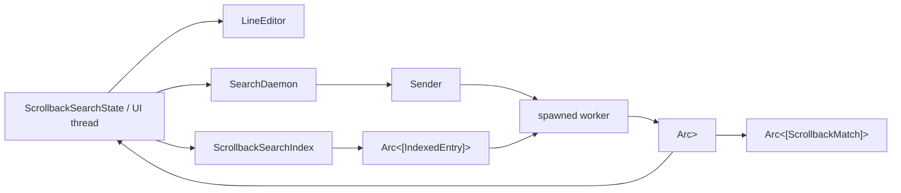

# 源码精读 01：`scrollback/search.rs` 的索引、后台线程、状态机与测试

> 源码基线：Git `ed6d543`。目标文件：`crates/codegen/xai-grok-pager/src/scrollback/search.rs`，基线共 1185 行。
>
> 本篇不是再次介绍“全文搜索功能是什么”，而是练习如何逐段阅读一个真实 Rust 模块：先找不变量，再读数据所有权，然后读并发消息，最后用测试反证自己的理解。行号用于固定本次阅读位置；源码变化后应优先按符号名重新定位。

---

## 1. 为什么选这个文件做第一篇源码精读

它规模适中，却同时包含：

- Public Domain Type；
- Cache 与 Generation；
- UTF-8 Byte Range；
- `Arc`、`Mutex` 与 `mpsc`；
- Background Thread；
- Burst Coalescing；
- UI State Machine；
- Stale Result/ABA 防护；
- 30 个针对性 Unit Test。

读懂它，相当于完成一次小型 Rust 并发组件的完整 Code Review。

## 2. 先看文件骨架

| 行段 | 内容 |
| --- | --- |
| 1–17 | 模块级设计说明 |
| 19–31 | Imports 与依赖边界 |
| 33–43 | Public Match Type |
| 45–112 | Search Index |
| 114–145 | Synchronous Scan Algorithm |
| 151–225 | Snapshot、Message 与 Burst Drain |
| 227–297 | Search Daemon 生命周期 |
| 299–528 | Interactive Search State |
| 530–1185 | Unit Tests |

## 3. 阅读顺序为什么不是从第一行一路往下

推荐四遍：

1. 只读类型和字段，画所有权图；
2. 只读生产函数，画状态转换；
3. 只读测试名，列出被固定的不变量；
4. 回到关键分支，验证每个不变量由哪几行实现。

逐字从头读到尾容易陷入局部语法，却没建立整体问题模型。

## 4. 一张所有权图



## 5. 先写下五个核心不变量

读代码前先建立假设：

1. UI Thread 不扫描完整 Corpus；
2. Content 不变时不重新 Clone Corpus；
3. Worker 可跳过中间 Query，但最终 Query 不能丢；
4. UI 不接纳旧 Request 的 Match；
5. 无新 Snapshot 时 Poll 不重置 Navigation Cursor。

后面的源码和测试都围绕这五条展开。

## 6. Glossary checkpoint：源码阅读词汇

| 名词 | 白话解释 | 本文件中的实例 |
| --- | --- | --- |
| Public API | 其他模块可以依赖的类型/函数 | `ScrollbackSearchState`、`ScrollbackMatch` |
| Private type | 只在当前模块可见 | `IndexedEntry`、`SearchMsg` |
| Invariant | 所有合法状态都必须满足的约束 | Current 不能越过 Matches |
| Ownership | 谁负责释放一份数据 | State、Worker 与 Arc 各自拥有引用 |
| Derived state | 从权威状态计算出的副本 | Matcher、Matches、Current |
| Critical section | 持锁访问共享数据的短区间 | Snapshot Compare/Swap |

## 7. 模块文档先告诉了我们什么（1–17）

文件开头没有泛泛描述“搜索”，而是直接声明性能设计：

- 每个 Entry 一份 String；
- Cache Key 是 `content_generation`；
- Corpus 使用 `Arc<[IndexedEntry]>`；
- Regex Scan 离开 Input Thread；
- Query Mutation 在 UI 侧应接近 O(1)；
- `poll` 负责取回结果。

这是作者希望 Reviewer 优先守住的设计合同。

## 8. 文档注释与普通注释的区别

`//!` 是 Module-level Rustdoc，会进入文档；`///` 描述紧随其后的 Item；`//` 只服务源码阅读。

精读时应把 Rustdoc 看作公开或半公开契约，把普通注释与实现一起验证，不能仅因写在注释里就认为永远正确。

## 9. Imports 暴露了并发模型（19–31）

只看 Imports 就能预判结构：

- `Range`：Match 保存区间；
- `Arc`：跨线程共享不可变大数据；
- `Mutex`：共享可变 Snapshot；
- `mpsc`：单向消息；
- `JoinHandle`：显式线程生命周期；
- `KeyEvent`/`LineEditor`：这个模块还拥有查询编辑状态。

## 10. 为什么没有 Tokio

这里使用 `std::thread` 与 `std::sync::mpsc`，不是 Async Task。

Regex Scan 是同步 CPU 工作；独立 OS Thread 可以直接隔离 UI Input Thread，无需把同步扫描塞进 Async Runtime。

## 11. `Range<usize>` 表示什么（35–42）

`byte_range` 是半开区间 `[start, end)`：包含 Start，不包含 End。

这是 Rust Slice 与 Regex Match 的标准形式。例如 `0..3` 可安全切出三个 ASCII Byte，但对 Unicode 必须保证端点来自 Regex 的合法 UTF-8 Boundary。

## 12. `ScrollbackMatch` 为什么 Derive 四个 Trait（34）

- `Debug`：日志和断言失败可打印；
- `Clone`：Snapshot/Test 可复制 Match；
- `PartialEq`/`Eq`：测试和集合语义可直接比较。

没有 `Copy`，因为 `Range<usize>` 虽可 Clone，但作者没有把整个业务对象声明为隐式位复制值。

## 13. 三个字段分别解决什么

- `entry_id`：纵向身份；
- `line_in_entry`：纵向粗定位；
- `byte_range`：同一行内多个 Match 的精确身份。

当前 Reveal 主要消费前两个；第三个仍为未来突出 Current Match 或精确定位保留能力。

## 14. 为什么使用 `EntryId` 而不是 `usize`

`usize` Entry Index 属于某个瞬时 Vec 排列；异步扫描完成时 Scrollback 可能已变化。

稳定 ID 允许调用者在 Reveal 时重新解析当前 Index，找不到则安全放弃。

## 15. Glossary checkpoint：Rust 类型

| 名词 | 解释 | 例子 |
| --- | --- | --- |
| Half-open range | 包含起点、不包含终点 | `0..3` |
| `usize` | 与平台指针宽度一致的无符号整数 | String Byte Offset |
| `derive` | 编译器生成 Trait 实现 | Debug/Clone/Eq |
| Stable identity | 不依赖当前容器位置的身份 | EntryId |
| Byte boundary | UTF-8 可安全切片的位置 | Regex Range 端点 |
| Plain-old index | 容器中的临时位置 | Entry Vec 下标 |

## 16. `ScrollbackSearchIndex` 的两个字段（51–56）

```text
entries: Arc<[IndexedEntry]>
built_generation: Option<u64>
```

一个保存 Cache Data，一个保存 Cache Validity。没有第三个 Dirty Boolean，因为 `Option<Generation>` 已能表达“从未构建”和“构建于某版本”。

## 17. 为什么 `built_generation` 是 Option

Generation 0 可能是合法 Scrollback 初始版本。如果用 `0` 代表“未构建”，第一次 Sync 可能误判有效。

`None` 明确表示尚无 Cache，`Some(0)` 明确表示基于版本 0 构建。

## 18. `Arc<[IndexedEntry]>` 是什么形状

它不是 `Arc<Vec<IndexedEntry>>`，而是指向固定长度 Slice 的 Arc。

建好后 Corpus 不需要 Push/Remove；Slice 形式表达不可变、定长语义，也少暴露 Vec Capacity。

## 19. `IndexedEntry` 为什么 Private（58–62）

外部调用者不需要知道 Search Cache 的内部存储，只消费 `ScrollbackMatch` 或 `ScrollbackSearchState`。

保持 Private 允许未来改为 Rope、Compact String 或增量 Map，而不扩大 API 兼容负担。

## 20. 每个 IndexedEntry 为什么拥有 String

`searchable_text()` 返回新 String。Worker 必须在 Scrollback 继续变化时仍安全读取旧 Corpus，因此不能借用 Block 内部短生命周期的 `&str`。

Owned String 把线程安全快照与可变 UI State 分离。

## 21. `Default` 自动产生什么（51）

对字段：

- 空 Slice Arc；
- `None` Generation。

`new()` 只是 `Self::default()`，为调用者提供语义清晰的构造名，而不复制初始化细节。

## 22. `sync()` 的 Fast Path（78–81）

```rust
if self.built_generation == Some(state.content_generation()) {
    return false;
}
```

这三行是性能关键路径。Scroll、Resize 等只改 Display Generation 时，Index 不重新提取文本。

## 23. 为什么比较写成 `Option == Some(value)`

它同时处理：

- `None`：一定不相等，必须首建；
- `Some(old)`：版本不同重建；
- `Some(current)`：直接返回。

没有 `unwrap`，也不需要额外 Match。

## 24. Rebuild Pipeline（82–91）

链式 Iterator 的语义：

1. `iter_entries()` 按 Scrollback 顺序产出 `(id, entry)`；
2. `searchable_text()` 产生 `Option<String>`；
3. `filter_map` 同时过滤 None 并转换为 IndexedEntry；
4. Collect 到 Vec；
5. `.into()` 转为 Arc Slice。

## 25. 为什么先 Collect Vec 再 Into Arc

Iterator 不知道最终存储布局；Vec 负责增长和收集。完成后把 Owned Vec 转成 `Arc<[T]>`，得到定长共享 Slice。

这是构建阶段可变、发布阶段不可变的常见 Rust 模式。

## 26. `filter_map` 比 `filter + map` 好在哪里

它直接表达“有文本才生成 Entry”，避免先保留 Option 再二次 Unwrap，也只调用一次 `searchable_text()`。

这里的 None 是业务状态，不是错误。

## 27. 为什么最后才更新 Generation（92）

只有 Corpus 构建并赋值完成后，才声明 Cache 对应当前版本。

虽然当前构建过程不会返回 Result，但这个顺序仍符合“先写 Data，再发布 Validity”的正确习惯。

## 28. `sync()` 返回 Boolean 的用途

`true` 不只是告诉调用者“发生工作”，还决定是否把新 Corpus Arc 放进 `SearchMsg::Update`。

因此 Return Value 同时是 Cache Mutation Signal 和 Message Payload Gate。

## 29. `entries_arc()` 为什么只是 Clone（97–99）

Clone Arc 增加引用计数，不复制 Slice 或其中的 String。

函数保持 Private，避免外部长期持有 Internal Corpus。

## 30. Glossary checkpoint：缓存代码

| 名词 | 白话解释 | 源码位置 |
| --- | --- | --- |
| Fast path | 常见情况的短路径 | Generation 相同直接返回 |
| Cache validity | 缓存对应哪个事实版本 | `built_generation` |
| Owned snapshot | 与源对象生命周期脱钩的副本 | Indexed String |
| Publish | 把完整新状态暴露给消费者 | Corpus 赋值后更新 Generation |
| Fixed slice | 长度不再变化的序列 | `Arc<[T]>` |
| Reference count | 有多少 Owner 共享对象 | Arc Clone 增加计数 |

## 31. `find()` 为什么仍存在（101–111）

Production 走 Worker，但同步 `find` 让：

- Unit Test 精确验证算法；
- Benchmark 不必包含 Thread/Channel；
- Scan Logic 只有一份。

它直接调用 Private `scan_matches`。

## 32. 为什么注释要求先 `sync()`

Index 不主动持有 Scrollback 引用，`find` 只看到自己的 Cache。

调用者忘记 Sync 时仍能得到类型正确但内容陈旧的结果；这是 API 的使用前置条件，而非编译器可证明条件。

## 33. `scan_matches` 的空查询 Guard（120–123）

空 Regex 会在大量位置产生 Match。函数在拿 Regex 前检查原 Query，直接返回空 Vec。

这既是产品语义，也是防止结果爆炸的资源保护。

## 34. Regex 引用为何不 Clone（124）

`matcher.compiled_regex()` 返回共享借用 `&Regex`。Scan 生命周期不超过 Matcher，直接借用即可。

只有跨出 State 临时借用边界给 Renderer 时，`highlight_regex()` 才选择 Clone Regex。

## 35. 两层 For Loop 的排序性质（126–143）

外层按 Entry 顺序，内层 `find_iter` 按 Byte Offset 升序。

所以输出天然全局有序，无需额外 `sort_by`；Navigation 的 Next/Prev 直接使用 Vec 顺序。

## 36. 为什么跳过 `m.start() == m.end()`（132–134）

Zero-width Match 没有可见字符，无法稳定高亮，也会让 `x*` 等模式产生大量位置。

注意 `continue` 发生在 Newline 计数之前；下一个非空 Match 会从旧 `counted_to` 一次统计全部间隔。

## 37. 增量数行算法（129–136）

每个 Entry 初始化：

```text
line = 0
counted_to = 0
```

每个非空 Match 只统计 `counted_to..m.start()` 中的换行，再把 `counted_to` 移到本次 Start。

## 38. 为什么 `counted_to = m.start()` 而不是 `m.end()`

下一次区间从当前 Match Start 开始，可能重新扫描当前 Match 内的换行。

如果 Regex 可跨换行，这会让下一 Match 的 Line 增量包含当前 Match 内换行；这正是下一 Match 起点行号所需要的。

若设成 End，也可通过另外逻辑累计 Match 内换行，但当前写法更直接。

## 39. 一次例子

文本：`a\nfoo\nb\nfoo`。

- 第一个 Match Start 前有 1 个 `\n`，Line=1；
- `counted_to` 移到第一个 foo Start；
- 第二个 Start 之间有 2 个 `\n`，Line=3。

对应测试期望行 1 和 3。

## 40. 这里的复杂度

Regex Scan 自身外，Newline 子串总覆盖范围近似单调向前。它避免每个 Match 都从 Entry 开头数行造成 O(M×N) 前缀重复。

极端重叠/零宽行为由 Regex Iterator 和 Skip 规则进一步约束。

## 41. Match Push 为什么复制 EntryId（137–141）

`EntryId` 是小型可复制身份值，Match 不借用 IndexedEntry。

返回 Vec 离开 Scan 后，不受循环变量生命周期限制。

## 42. Glossary checkpoint：扫描算法

| 名词 | 解释 | 本函数中的体现 |
| --- | --- | --- |
| Guard clause | 提前处理特殊输入并返回 | Empty Query |
| Nested iteration | 外层 Entry、内层 Match | 保持时间顺序 |
| Monotonic cursor | 只向前移动的位置 | `counted_to` |
| Zero-width | Start 等于 End | 直接跳过 |
| Borrow | 临时使用但不拥有对象 | `&Regex` |
| Algorithmic complexity | 输入增长时工作量如何增长 | 避免重复扫描前缀 |

## 43. `SearchSnapshot` 是什么（155–164）

Worker 对 UI 的完整发布对象：

- Match Arc；
- Request Generation；
- Query String。

字段一起在 Mutex 下替换，所以 UI 不会读到半新半旧组合。

## 44. 为什么 Snapshot Derive Clone

当前 `poll` 刻意不 Clone 整体，但 Test/Debug 或未来调用可使用 Clone。Arc Match Clone 便宜，Query String Clone 仍分配。

注释正是提醒不要在 30Hz Fast Path 滥用这个方便 Trait。

## 45. 为什么 Snapshot Default 的 Generation 为 0

Search State 的 `last_seen_generation` 和 `request_generation` 也从 0 开始。

因此首次未发布 Snapshot 会被视为“已经看过”，Poll 返回 false；第一次真实 Update 使用 Generation 1。

## 46. Query 为什么与 Generation 重复保存

Generation 验证 Request Identity；Query 验证可见编辑器语义。

双检查既便于诊断，也防止未来某处错误维护 Generation 时更容易暴露不一致。

## 47. `SearchMsg` 为什么是 Enum（172–183）

消息只有两类：携带字段的 Update，和无字段 Stop。

Enum 让 Match 强制穷举处理；不能出现 `stop=true` 同时又有 Query 的非法组合。

## 48. Update 的 Corpus 为什么是 Option

`Some` 表示替换 Worker Corpus；`None` 表示沿用。

这里 None 不是“空 Corpus”。真正空 Corpus 是 `Some(Arc::from([]))`。

## 49. 这个 Option 的语义为什么危险

若 Reviewer 把 None 理解成 Clear，Burst Merge 就会丢掉刚发送的新 Corpus。

源码在字段注释和 `drain_to_latest` 注释中重复说明，表明这是 Load-bearing Semantic。

## 50. `DrainedUpdate` 为什么字段也都是 Option（185–192）

它表示一批消息合并后的“哪些维度有新值”。Default 是完全空；处理 Update 后 Query/Generation 必有值，Corpus 则可能沿用。

`stop` 单独表示终止优先级。

## 51. `drain_to_latest` 的参数设计（199）

它接收已经由 Blocking `recv()` 得到的第一条消息，以及 Receiver Borrow。

函数内部只用 Non-blocking `try_recv()` 清空当前积压，因此不会为了等待下一次击键延迟当前扫描。

## 52. `let mut msg = first` 的循环技巧（200–224）

每轮先处理当前 Owned Message，再尝试取下一条并赋给 `msg`。

这种写法避免把 First Message 重新塞回 Channel，也避免写两份处理逻辑。

## 53. 为什么 Corpus 只在 Some 时覆盖（209–211）

这保证 Batch 内：

- 最新 Some Corpus 获胜；
- 后续 None 不抹掉它；
- 若整批都 None，则 Worker 沿用 Batch 前 Corpus。

## 54. Query 与 Generation 为什么每次覆盖（212–213）

每个 Update 都有 Query 和 Generation，所以最后一条就是最新请求。

这正是 Coalescing：中间 Query 被有意丢弃。

## 55. Stop 分支为何立即 Return（215–218）

即使 Queue 后面还有 Update，Owner 已请求关闭。继续合并或扫描没有业务价值。

Stop 的优先级高于所有已处理 Update。

## 56. `try_recv` 的两类错误为何统一返回

`Empty` 表示当前没有更多；`Disconnected` 表示也不会再有。对“把现有 Batch 交给 Worker”而言，两者都意味着 Drain 结束。

函数不需要区分它们。

## 57. Glossary checkpoint：消息合并

| 名词 | 解释 | 当前代码 |
| --- | --- | --- |
| Blocking receive | 等到至少一条消息 | Worker 外层 `recv()` |
| Non-blocking receive | 立即返回有/无消息 | `try_recv()` |
| Burst | Worker 一次醒来时积压的一批消息 | Drained Update |
| Coalescing | 只保留最新状态 | Query/Generation 覆盖 |
| Carry-forward | 没给新值就沿用旧值 | None Corpus |
| Sentinel message | 表示控制动作的消息 | Stop |

## 58. `SearchDaemon` 三个字段（229–235）

- `shared`：Worker 发布、UI 读取；
- `tx`：UI 发送 Update/Stop；
- `_handle`：证明 Thread 已创建并拥有 JoinHandle。

Handle 名以下划线开头，表示字段刻意不直接读取，避免 Dead Code Warning。

## 59. 为什么 Shared 是 `Arc<Mutex<SearchSnapshot>>`

Worker 和 UI 都要拥有容器，所以用 Arc；Worker 替换、UI 读取 Snapshot，所以需要 Interior Mutability 与互斥。

Snapshot 更新频率低、临界区短，普通 Mutex 足够。

## 60. 为什么不是 `RwLock`

只有一个 UI Reader 和一个 Worker Writer，读取还非常短。RwLock 的额外复杂度未必有收益。

性能重点是扫描不持锁，而不是让多个 Reader 并行。

## 61. `channel::<SearchMsg>()` 是哪种通道（246）

标准库 `mpsc::channel` 是异步、逻辑无界 Channel；`send` 不等待 Receiver 消费。

与 `sync_channel` 的固定容量不同。

## 62. 无界 Channel 的风险

若 Producer 永远快于 Consumer，Queue 可增长占用内存。作者依靠消息小、Worker 每次 Drain 全部积压和人类输入速率控制实践风险。

这是工程取舍，不是理论上的硬上限。

## 63. `let out = shared.clone()` 的含义（248）

Clone Arc 后 Move 进 Thread Closure。原 `shared` 留在 SearchDaemon 给 UI。

两边指向同一个 Mutex/Snapshot Allocation。

## 64. `thread::spawn(move || ...)` 中 Move 什么

Closure 捕获 `rx` 和 `out` 的所有权。Thread 即使比 `new()` 调用栈活得更久，也不借用栈变量。

Rust 编译器由此证明线程生命周期安全。

## 65. Worker 本地状态（250–251）

Worker 自己持有当前 Corpus Arc 和 Query String。Message 只传 Delta：可选 Corpus + 必有 Query。

初始值为空，第一次正常 `update_query` 会因 Index 首建携带 Corpus。

## 66. 外层 `while let Ok(msg) = rx.recv()`（252）

Channel 有消息就继续；所有 Sender Drop 后 `recv` 返回 Err，循环自然结束。

因此 Stop 不是唯一退出路径，Channel Disconnect 也是安全后备。

## 67. Batch 应用顺序（253–265）

1. Drain；
2. Stop 则 Break；
3. 替换 Corpus；
4. 替换 Query；
5. 取 Generation；
6. 没有 Generation 则 Continue。

最后一个分支是防御式代码；正常非 Stop Batch 都来自 Update，应有 Generation。

## 68. Worker 为什么重新编译 Matcher（270）

UI Matcher 留在 State 给同步错误和高亮；Worker 只收到 Query String。

重新编译避免共享 Regex/Matcher 的线程边界，也使 Message 更简单。

## 69. 空/错误 Query 的 Worker 分支（271–275）

它仍创建空 Match Arc 并发布 Snapshot，而不是跳过发布。

UI 因此最终能观察到对应 Generation 已处理。

## 70. `.into()` 如何把 Vec 变 Arc Slice（274）

`scan_matches` 返回 Vec，目标类型标注为 `Arc<[ScrollbackMatch]>`，From/Into 转换完成固定 Slice Allocation。

类型标注在这里帮助编译器选择正确 `Into` 实现。

## 71. Snapshot Swap 的临界区（276–280）

`out.lock().unwrap()` 得到 Guard，左侧 Deref 后整体赋值新 Snapshot。Statement 结束时 Guard Drop。

Regex Compile 与 Scan 全部已经完成，锁内只做对象替换。

## 72. `unwrap()` 的 Poison Policy

若持锁线程 Panic，Mutex 会 Poison；后续 `unwrap()` 也 Panic。

代码选择 Fail-fast，而不是从可能不可信的共享状态恢复。这里没有显式 Poison Recovery。

## 73. Constructor 返回前 Thread 已启动吗

`thread::spawn` 返回 JoinHandle，线程可能已运行，也可能尚未被 Scheduler 执行。

调用者不能依赖启动时序，只能依赖 Channel/Snapshot 同步协议。

## 74. Glossary checkpoint：线程所有权

| 名词 | 解释 | 这里的实例 |
| --- | --- | --- |
| Move closure | 捕获值所有权的闭包 | Worker Closure |
| Interior mutability | 通过同步容器修改共享对象 | Mutex Snapshot |
| Poison | 持锁线程 Panic 后的标记 | `lock().unwrap()` Fail-fast |
| Delta message | 只传变化部分 | Optional Corpus |
| Local worker state | 线程自己独占的当前值 | Corpus/Query |
| Scheduler | 决定线程何时运行的系统 | 不保证 Spawn 后立即执行 |

## 75. Drop 实现的语义（292–297）

SearchDaemon 被 Drop 时尝试 `tx.send(Stop)`，忽略结果。

发送失败说明 Receiver 已退出；没有额外错误需要展示。

## 76. 为什么不调用 `join()`

如果 Worker 正在扫描，大 Session 关闭 Search 会卡 UI。作者选择异步收尾：当前 Scan 完成后读到 Stop/Disconnect 再结束。

字段保存 JoinHandle，但 Drop 不 Join。

## 77. “Detached”在 Rust 中是什么意思

JoinHandle 被 Drop 后，底层线程继续运行；程序不再持有等待结果的 Handle。

它不是内存不安全，因为 Thread Closure 拥有全部捕获值。

## 78. Stop 不能中断当前 Scan

Channel Message 只有 Worker 回到 `recv` 后才能处理。如果 `scan_matches` 正在运行，Stop 只能排队。

真正的 Mid-scan Cancellation 需要把扫描切块并周期检查 Token。

## 79. State 级 Rustdoc（299–313）

这段文档明确把类描述成 Interactive Search Session，并给出两阶段生命周期：Composing 与 Browsing。

它还说明 Cancel 等于 Owner Drop Option，解释为何没有 `cancel()` 方法。

## 80. `ScrollbackSearchState` 字段分组（315–336）

可按职责分成：

- Canonical Input：Editor；
- UI Derived：Matcher；
- Corpus Cache：Index；
- Settled Result：Matches/Current；
- Lifecycle：Composing；
- Concurrency：Daemon；
- Staleness：Last Seen/Request Generation。

## 81. 为什么 Editor 是 Canonical Query

`query()` 委托 `editor.text()`；没有另一个独立 Query Field。

避免文本与 Cursor Editor 分离后互相漂移。

## 82. Matcher 为什么存字段而非每帧重编译

查询文本变化时编译一次，Render Frame 可 Clone 已编译 Regex；错误状态也可同步查询。

这用少量内存换取稳定 Frame Cost。

## 83. Matches 为什么也是 Arc Slice

Worker Snapshot 与 UI State 可在 Swap 前后短暂共享同一结果，不必 Clone 每个 Match。

结果发布后固定不变，Slice 语义合适。

## 84. Current 为什么是 Option

没有 Match 时没有合法下标。用 `0` 作哨兵会与第一项冲突。

Option 让无结果状态进入类型系统。

## 85. 两个 Generation 为什么都是 u64

`request_generation` 是 Producer 当前版本；`last_seen_generation` 是 Consumer 已观察版本。

两者比较构成一个简化的 Single-writer Snapshot Protocol。

## 86. Glossary checkpoint：状态字段

| 名词 | 解释 | 字段 |
| --- | --- | --- |
| Canonical | 唯一权威来源 | Editor Text |
| Settled | 后台已完成且被接纳 | Matches |
| Cursor | 当前 Match 下标 | Current |
| Lifecycle flag | 描述交互阶段 | Composing |
| Producer version | 最新请求编号 | Request Generation |
| Consumer watermark | 已看见的编号 | Last Seen Generation |

## 87. `open()` 如何建立空状态（342–354）

所有字段显式初始化。值得注意：

- Matcher 立即用空 Regex Query 构建；
- Daemon 立即 Spawn；
- 两个 Generation 都是 0；
- Composing 为 true。

打开空栏尚未发送扫描请求。

## 88. 为什么不 Lazy Spawn Daemon

当前选择让 State 一旦存在，Worker 就准备好接收第一条 Query，代码简单。

代价是用户打开后立即取消也会创建一次短命线程。

## 89. `update_query()` 为什么很薄（361–364）

它只把完整文本交给 Editor，再调用统一派生路径。

键盘和 Paste 修改则通过 Editor Outcome 决定是否进入同一路径。

## 90. `update_derived_query` 第一步为何 Clone String（367）

后面既要 Mutate `self.matcher/index/request_generation`，又要最终 Move Query 进 Message。若一直借用 `self.editor.text()`，会与 Mutable Borrow Self 冲突。

Owned String 同时解决 Borrow Checker 与 Message Ownership。

## 91. UI 侧同步编译的三重用途（368–370）

- `has_error()` 立即更新；
- `highlight_regex()` 立即更新；
- Worker 尚未完成时 UI 仍反映新 Query。

它不是重复浪费，而是两条时序路径各自需要 Matcher。

## 92. 为什么合法新 Query 保留旧 Matches（371–377）

代码只在 Empty 或 Error 时清空。合法 Query 的新 Scan In-flight 期间，旧 Settled Results 仍可导航。

这是显式 UX 选择，也造成 Counter 与 Highlight 的短暂弱一致。

## 93. `then(|| ...)` 的语法（383）

`bool::then`：条件为 true 时执行 Closure 并返回 Some，false 返回 None。

等价于：

```rust
let corpus = if self.index.sync(state) {
    Some(self.index.entries_arc())
} else {
    None
};
```

## 94. 为什么 Closure 不能提前执行

如果写成某些 Eager Option 构造，即使 Sync False 也可能 Clone Arc。`then` 的 Closure 是 Lazy，只在 Rebuild 时调用。

Arc Clone 虽便宜，但语义上仍只应发送新 Corpus。

## 95. `checked_add(1)` 的目的（384–387）

普通 Release Build 的整数溢出可能 Wrap。Generation Wrap 会破坏“版本单调且不重复”的 ABA 防护。

Checked Add 失败时记录 Debug 并丢弃 Update。

## 96. 溢出后 State 有何细节

Matcher 和可能的 Corpus Index 已经更新，但 Request 未发送、Generation 未变。

这是理论上需约 2^64 次文本更新才触发的退化路径；代码选择不制造重复身份。

## 97. 为什么先更新 `self.request_generation` 再 Send（388–393）

Request Identity 在 UI 侧先成为当前事实，再发送同一值给 Worker。

Send 失败时 State 会期待一个永不到达的 Generation，但 Trace 会记录 Daemon 不可用；不会误接纳旧结果。

## 98. Send Error 包含什么

标准库 SendError 通常持有未发送 Message。日志使用 `%err` Display，不把 Query 正文显式作为结构化字段输出。

代码只记录 Debug，不打扰终端用户。

## 99. Key 与 Paste 函数的共同模式（400–422）

1. 让 LineEditor 处理；
2. 检查 Outcome；
3. 只有 TextChanged 重建派生状态；
4. 原样返回 Outcome 给 Controller。

Cursor Move 和 Handled No-change 只需要 UI Redraw，不需要搜索。

## 100. `handle_query_key()` 为何压成 Boolean（425–427）

对简单调用者，只关心 Key 是否被 Search Editor 消费。更复杂的 AgentView 内部路径使用 `apply_query_key` 保留完整 Outcome。

这是同一能力的 Convenience API 与 Rich API。

## 101. Glossary checkpoint：派生更新

| 名词 | 解释 | 代码例子 |
| --- | --- | --- |
| Borrow conflict | 同时借用 Self 字段与修改 Self 的冲突 | 先 Clone Query |
| Lazy closure | 条件满足才执行 | `bool::then` |
| Checked arithmetic | 显式检测整数溢出 | `checked_add` |
| Rich outcome | 比 true/false 更多的结果分类 | LineEditOutcome |
| Convenience API | 为常见调用简化返回值 | `handle_query_key` |
| Weak consistency | 派生数据显示版本短暂不同 | 新 Highlight + 旧 Matches |

## 102. `poll()` 的第一条锁内检查（438–441）

若 Shared Snapshot Generation 等于 Last Seen，立即返回 false。

这不仅省工作，还保护 Navigation Cursor 不被重复设回 0。

## 103. 为什么 `last_seen_generation` 在 Stale Check 前更新（442）

即使 Snapshot 过期，它也已经被看过。若不更新，每个 App Tick 都会重复检查同一旧 Snapshot。

未来更高 Generation 发布后仍会再次进入。

## 104. 双重 Stale Guard（447–449）

拒绝条件：

```text
snapshot.generation != current request
OR snapshot.query != editor query
```

只要一个不一致就不能应用。

## 105. Generation Guard 防什么

- Worker 完成较旧 Query；
- 相同 Query 但旧 Corpus；
- A→B→A 中第一次 A 的结果；
- Coalescing/调度导致的乱序观察。

## 106. Query Guard 防什么

它是额外语义断言：Snapshot 文本必须与 Search Bar 完全一致。

如果未来 Generation 维护出现 Bug，这一层仍可能避免明显错配。

## 107. 为什么 Clone Matches 后主动 Drop Guard（450–451）

`Arc` Clone 完成后共享锁已无用途。显式 `drop(guard)` 缩短临界区，让后续 State Mutation 与 Current 计算不持锁。

虽然函数很短，这种写法把性能意图写进源码。

## 108. `then_some(0)` 的语法（453）

当 Matches 非空时返回 `Some(0)`，否则 `None`。

与 `bool::then` 不同，`then_some` 的参数 Eager 求值；这里常量 0 无成本差异。

## 109. 为什么每个新 Snapshot 都 Park First

新 Query 的结果集合可能完全变化，旧 Cursor Index 没有稳定语义。重置 0 提供确定行为。

无新 Snapshot 的 Poll 则必须保持用户已导航位置。

## 110. Poll 返回 Boolean 给谁用

调用者用 true 触发：

- Redraw；
- Reveal 新 Current Match。

False 表示没有可见状态更新，不应重复滚动。

## 111. `step()` 的空列表 Guard（469–474）

即使某个 Bug 留下旧 Current，空 Matches 时也强制 Current=None。

避免后面以 Len 0 做模运算。

## 112. `unwrap_or(0)` 的细节（475）

非空 Matches 但 Current=None 时，Next 从 0 加 1，结果会到 1；Prev 从 0 到最后。

正常接纳 Snapshot 后 Current 已是 Some(0)，这个 Default 主要是防御非法/手工构造状态。

## 113. `rem_euclid` 与 `%` 的区别（477）

Rust 中负数 `%` 可得到负余数。`(-1) % 3 == -1`，不能转成合法 Index。

`(-1).rem_euclid(3) == 2`，正好实现 Prev 从首项环绕到末项。

## 114. `accept()` 为什么只改一个 Boolean（482–484）

接受查询不代表清理 Search Data。Matcher、Matches、Current 和 Daemon 全部保留，供 Browsing Navigation。

阶段转换与资源销毁被分离。

## 115. Getter 设计（487–527）

Getter 分三类：

- Result：Current、Index、Count；
- Query UI：Text、Viewport、Highlight Regex、Error；
- Lifecycle：Composing。

外部无需访问 Private 字段。

## 116. `current()` 为什么再做一次 Bounds Check（487–489）

`self.matches.get(i)` 返回 Option，不直接 `self.matches[i]` Panic。

即使 Current 因异常状态越界，Public API 也安全返回 None。

## 117. `highlight_regex()` 为什么返回 Owned Regex（513–516）

Renderer 调用链可能需要在对 State 的 Borrow 结束后使用 Regex。Clone 提供独立 Owned Value，简化 Borrow 生命周期。

Regex Clone 的内部成本需以库实现为准，但此处显式选择 API 简洁性。

## 118. Error Query 为什么没有 Highlight Regex

条件同时要求 Query 非空且 Matcher 无错误。Invalid Matcher 内部虽有 Never-match Regex，Renderer 不必拿到它做无意义扫描。

## 119. Glossary checkpoint：Poll 与导航

| 名词 | 解释 | 代码位置 |
| --- | --- | --- |
| Watermark | 已消费到哪个版本 | Last Seen Generation |
| Stale guard | 拒绝旧结果的条件 | Generation + Query |
| Bounds check | 访问前检查下标合法 | Slice `get` |
| Wrap-around | 越界后从另一端继续 | `rem_euclid` |
| Park | 新结果时把 Cursor 放到首项 | `then_some(0)` |
| Explicit drop | 提前结束资源/锁生命周期 | `drop(guard)` |

## 120. 测试模块为什么能访问 Private 字段（530–535）

Rust Child Module 可以访问 Parent Module 的 Private Items；`use super::*` 把它们引入作用域。

因此测试能直接构造 `SearchSnapshot`、查看 `request_generation` 和 Shared Mutex，无需为测试扩大 Production API。

## 121. 为什么测试同时用 Substring 和 Regex

Index Algorithm Tests 多用 Escaped Substring，避免测试数据中的模式字符影响定位；Interactive State 使用真实 Regex 语义。

这样把“扫描坐标正确”与“Regex 编译规则”适度分开。

## 122. 第一组测试固定 Match 坐标（541–590）

它验证：

- Entry 顺序；
- Byte Range；
- 多逻辑行 Line Number；
- Markdown Emphasis 被去除后的短语仍命中。

这些不是只断言 Count，而是固定了结构化结果。

## 123. 空、零宽和非法测试（592–628）

三种“零结果”来源被分别测试：

- Empty Query 是产品 Guard；
- Zero-width 是合法 Regex 但导航无意义；
- Invalid Regex 是编译错误降级。

相同结果不代表相同原因。

## 124. Smart Case Test 的精度（630–642）

它验证小写 Query 可匹配 `Hello`，含大写的不同模式不能宽松匹配。

测试经 `TextMatcher` 进入 Index，证明 Search Algorithm 没绕过 Matcher 配置。

## 125. Cache Tests 如何区分内容与显示变化（657–703）

No-op Test 主动 Scroll 和 Prepare Layout，再断言 Built Generation 不变；Rebuild Test Push 新 Entry、Clear，再断言 Corpus 更新。

它不是只调用 Sync 两次，而是模拟最容易误触发 Cache 的真实 UI 操作。

## 126. `update_and_wait` Test Helper（713–728）

它最多轮询 1000 次，每次 Sleep 1ms，约 1 秒超时。

若 Worker Wedged，Helper 在接近原因处 Panic，而不是让后续 Count Assertion 给出误导失败。

## 127. 测试中的 Sleep Poll 有什么不足

它依赖 Scheduler，在极慢 CI 上理论上可 Flake；每个测试还真的 Spawn Thread。

更确定的设计可暴露 Test-only Notification/Timeout Channel，但当前 1 秒窗口和轻量 Corpus 足够实用。

## 128. Cursor-only Test 为什么重要（796–837）

它不仅验证 Generation 不变，还验证：

- Query 不变；
- Old Match 仍存在；
- Text Mutation 立刻提升 Generation；
- In-flight 时 Old Result 可导航；
- Settled 后清空无结果。

一个测试固定了 Rich Outcome 与弱一致策略。

## 129. Paste Test 固定哪些 Unicode 行为（839–856）

它在 `ab` 中间插入 `中\r\n`，期望 Query 为 `a中b`；纯换行 Paste 返回 HandledNoChange 且不提升 Generation。

说明 Sanitization 属于 LineEditor，Search 只根据 Outcome 决定是否 Enqueue。

## 130. Grapheme Viewport Test（858–872）

数据同时包含：

- 中文宽字符；
- `e + combining acute`；
- 带肤色和 ZWJ 的 Emoji；
- 尾部 ASCII。

它验证可见 Byte Range 不劈开 Grapheme，Cursor Column 小于宽度。

## 131. Mid-session Content Test（874–888）

它先 Settled 一个结果，再 Push 新 Entry，使用相同 Query 重发。

Request Generation 增加，Index 因 Content Generation 重建，最终 Match 从 1 变 2。

## 132. Navigation Tests（890–967）

分别固定：

- Async End-to-end；
- 三项 Next/Prev 环绕；
- 空结果 No-op；
- Accept 保留 Query、Matches 和当前 Cursor。

拆分测试让每个失败指向单一不变量。

## 133. Cached Corpus Test（969–983）

Content 不变，从 `alpha` 改为 `beta`，Worker 应复用已有 Corpus 并得到新结果。

它从外部行为验证 None Corpus 路径，但不直接检查 Arc Identity。

## 134. Drain Tests 为什么检查 `Arc::ptr_eq`（991–1053）

普通 Equality 只证明内容相同；`Arc::ptr_eq` 证明合并后保留的就是预期 Allocation。

这固定“没有 Clone/Rebuild 成另一份 Corpus”的所有权语义。

## 135. Stop Test 为什么很小（1055–1070）

发送 Update 后再 Stop，Drain 必须返回 `stop=true`。

它不关心此前收集的 Query，因为 Caller 看见 Stop 后直接 Break。

## 136. ABA Test 如何绕过真实 Worker（1072–1116）

Test 打开 State 但从不 Send Update，因此 Worker 阻塞在 `recv()`。测试线程可以确定性地直接替换 Shared Snapshot。

这是一种聪明的并发测试：保留真实结构，却冻结竞争方。

## 137. ABA Test 的三次发布

当前 UI 被手工设成 Query A、Generation 3：

1. 发布 Gen1/A：文本相同但旧 Corpus，拒绝；
2. 发布 Gen2/B：中间状态，拒绝；
3. 发布 Gen3/A：当前请求，接纳。

这证明只比较 Query 不够。

## 138. Poll Cursor Regression Test（1118–1146）

先取得 3 个 Match，Next 到 Index 1，然后连续 Poll 5 次。

每次必须返回 false 且 Cursor 保持 1。删除 First Generation Guard 会让这个测试直接失败。

## 139. End-to-end Burst Test（1148–1184）

先让 Worker 持有 Corpus，再连续发送 `beta -> alpha -> gamma`，三条都不带 Corpus。

最终第一次 True Poll 必须属于 Gamma，且能在沿用 Corpus 中找到一个 Match。

## 140. Glossary checkpoint：测试技巧

| 名词 | 解释 | 示例 |
| --- | --- | --- |
| Regression test | 防止已修 Bug 再出现 | Poll 不重置 Cursor |
| White-box test | 直接观察内部字段 | Request Generation |
| Black-box behavior | 只看公开输入输出 | Cached Corpus Query Change |
| Pointer identity | 是否同一 Allocation | `Arc::ptr_eq` |
| Deterministic concurrency | 控制竞争方不运行 | Worker 阻塞在 recv |
| Timeout polling | 有上限地等待异步完成 | 1000 × 1ms |

## 141. 从测试反推未覆盖边界

当前 30 项测试仍未直接覆盖：

- Mutex Poison；
- Send 失败日志；
- Generation 真正溢出；
- Drop 时 Worker 正在长扫描；
- 极大 Corpus 内存峰值；
- 多 Search State 同时存在；
- Regex 跨换行后的 Line Anchor 细节。

## 142. 哪些未覆盖不值得强行测试

2^64 Generation 溢出和标准库 Mutex Poison 可通过局部 Unit/Property Test 模拟，但未必值得把生产 API复杂化。

测试投资应优先覆盖真实回归概率和用户影响。

## 143. 一次 Code Review 应重点问什么

1. 新字段属于 UI、Worker 还是 Snapshot？
2. 它是否与 Query/Generation 原子更新？
3. 是否会在锁内做 O(N) 工作？
4. None Corpus 的沿用语义是否被破坏？
5. 新 Poll 分支会不会重置 Cursor？
6. Entry Index 是否误穿过异步边界？
7. Empty/Invalid/Zero-width 是否仍收敛？

## 144. 修改 `sync()` 时的影响面

直接影响：

- Corpus 内容；
- Rebuild 频率；
- Message 是否带 Some Corpus；
- Worker 持有的数据；
- Search Match 与 Reveal。

必须至少运行 Cache、Mid-session 和 Burst 测试。

## 145. 修改 `drain_to_latest()` 时的影响面

最危险的是把：

```text
if corpus.is_some() { out.corpus = corpus }
```

简化成无条件赋值。这样最新 Query 的 None 会抹掉 Batch 中较早的新 Corpus，Worker 在旧 Corpus 上扫描新 Query。

## 146. 修改 `poll()` 时的影响面

它同时承担：

- No-change Fast Path；
- Consumer Watermark；
- Stale Rejection；
- Arc Snapshot Adoption；
- Current Reset。

调整行序可能改变 ABA、防重复 Cursor Reset 或锁持有时间。

## 147. 修改 Drop 时的权衡

加入 Join 可减少短命 Worker 尾留，却会把关闭延迟暴露给 UI；不 Join 保持响应性，却不能立刻回收正在扫描的 Thread。

若需要两者兼得，应先设计可取消的 Chunked Scan，而不是简单 Join。

## 148. Rust 初学者常见误读：Arc 让对象可变

错误。Arc 只提供共享所有权。Corpus 能安全共享是因为内容不可变；Snapshot 需要变化，所以 Arc 内还套 Mutex。

## 149. 常见误读：Clone Arc 会复制全部 String

错误。Arc Clone 只增加引用计数。真正的 String Copy 发生在 `searchable_text()` 构建 Corpus 时。

## 150. 常见误读：Mutex 覆盖整个搜索

错误。Compile 与 Scan 都在锁外，Mutex 只保护 Snapshot Swap 和 Poll Compare/Arc Clone。

## 151. 常见误读：Channel 顺序足以杜绝 Stale

单一 Worker 确实顺序处理 Batch，但 UI Query 可在 Scan 期间继续变化。旧结果仍可能先发布，因此 Poll 仍需 Generation Guard。

## 152. 常见误读：同样的 Query 就是同一次请求

错误。A→B→A 中两个 A 可基于不同 Corpus 或时刻，必须用 Generation 区分。

## 153. 常见误读：`last_seen_generation` 只是性能优化

不完整。它还防止每次 Poll 都重新接纳同一 Snapshot 并把用户 Navigation Cursor重置为 0。

这是行为正确性字段。

## 154. 常见误读：`accept()` 会停止 Worker

错误。Accept 只结束 Query Editing，Worker 和结果保留。关闭整个 Search State 才触发 Daemon Drop。

## 155. 常见误读：测试 Sleep 越久越可靠

盲目增加 Sleep 会拖慢 Suite，仍不能证明线程一定完成。当前 Helper 使用短 Poll + 总 Deadline，让完成尽早返回、Wedged 有界失败。

## 156. Glossary checkpoint：Review 术语

| 名词 | 解释 | 本文件风险 |
| --- | --- | --- |
| Load-bearing line | 删除会破坏关键保证的代码 | Generation Fast Path |
| Lock scope | 持锁代码范围 | 必须保持短 |
| Behavioral field | 不只是优化、会改变用户行为 | Last Seen Generation |
| Race window | 状态可能并发变化的时间段 | Worker Scan In-flight |
| Cancellation latency | 请求停止到真正结束的时间 | 最长等于当前 Scan |
| Impact surface | 一处修改影响的模块/保证 | Sync/Drain/Poll 都很大 |

## 157. 如何用调试器走一次查询

建议断点顺序：

1. `ScrollbackSearchState::update_derived_query`；
2. `ScrollbackSearchIndex::sync`；
3. `SearchDaemon::new` Closure 内 `rx.recv` 后；
4. `drain_to_latest` Return；
5. `scan_matches` Match Push；
6. Snapshot Swap；
7. `ScrollbackSearchState::poll`；
8. Stale Guard；
9. Current Reset。

## 158. 调试时应观察哪些值

- UI Query；
- UI Request Generation；
- Built Content Generation；
- Update Corpus 是 Some/None；
- Worker Current Query；
- Snapshot Generation/Query；
- Last Seen Generation；
- Matches Len/Current。

同时观察这八项，比只盯 Match Count 更快定位错层。

## 159. 如何人为制造 Stale Result

在 Worker Scan 前加入 Test-only Barrier：

1. 发 Query A；
2. Worker 获取 A 后暂停；
3. UI 发 Query B；
4. 放行 A；
5. Poll 必须拒绝 A；
6. B 完成后才接纳。

生产代码不应加入 Sleep 来制造竞态。

## 160. 如何做性能剖析

将耗时拆开：

- `searchable_text()` 总耗时；
- Vec -> Arc Corpus 构建；
- Regex Compile；
- `scan_matches`；
- Match Allocation；
- Snapshot Lock Wait；
- UI Visible Highlight（在本文件外）。

不要只测从 Keypress 到 Redraw 的总时间。

## 161. 哪个优化最不应先做

不要在没有 Profile 时先引入复杂倒排索引或跨线程可变 Scrollback。

当前 Whole-corpus Scan 的优点是语义简单、Regex 通用、Snapshot 不可变。源码注释也明确把 Per-entry Incremental 留给真实数据驱动。

## 162. 一个可能的增量演进路线

1. 给 IndexedEntry 增加 Entry Content Version；
2. UI 维护 EntryId -> Arc<str> Cache；
3. Content Change 只重建 Dirty Entry；
4. 每次请求仍发布 Immutable Ordered Arc Slice；
5. 保持 Worker/Generation/Poll Protocol 不变。

先保持并发合同，再替换 Corpus 构建策略。

## 163. 一个可能的取消演进路线

1. 每个 Request 配 Cancellation Generation；
2. Scan 按 Entry 或文本 Chunk 检查最新 Generation；
3. 发现过期立即停止，不发布或发布可识别 Stale Snapshot；
4. Stop 同样更新 Cancellation Token；
5. Drop 仍不 Join UI Thread。

## 164. 为什么不能每个 Regex Match 都锁 Shared

那会：

- 放大 Lock Contention；
- 让 UI 看到 Partial Results；
- 需要复杂 Current 稳定规则；
- 让 Stale Query 在中途不断污染 Snapshot。

当前一次 Scan 一次 Atomic Publish 更容易推理。

## 165. 自测题

1. `Option<u64>` 为什么优于用 0 表示未构建？
2. `Arc<[T]>` 与 `Arc<Vec<T>>` 在 API 语义上有什么区别？
3. 为什么 `counted_to` 更新为 Match Start？
4. 后续 None Corpus 为什么不能覆盖较早 Some？
5. 为什么 Worker Scan 不持 Mutex？
6. Drop 为什么发送 Stop 却不 Join？
7. UI 为什么也编译 Matcher？
8. `last_seen_generation` 为什么影响正确性？
9. `rem_euclid` 为什么适合 Prev？
10. ABA Test 如何保证 Worker 不竞争 Shared Snapshot？

## 166. 自测答案摘要

1. Generation 0 可能合法；
2. Slice 暴露固定长度，Vec 还带容量/可变集合语义；
3. 下一间隔需要包含当前 Match 内可能出现的换行；
4. None 表示沿用，不是清空；
5. 避免长 Scan 阻塞 Poll；
6. UI 关闭不能等待 In-flight Scan；
7. 即时错误和高亮需要；
8. 防重复接纳把 Cursor 拉回首项；
9. 负 Delta 仍得到非负环绕下标；
10. 从不 Send，Worker 阻塞在 `recv()`。

## 167. 最终术语表

| 名词 | 解释 |
| --- | --- |
| Corpus | Worker 扫描的不可变 IndexedEntry 集合 |
| IndexedEntry | Stable EntryId 与 Owned Search String |
| SearchSnapshot | Worker 原子发布的 Query、Generation 与 Matches |
| SearchMsg | UI 发给 Worker 的 Update 或 Stop |
| DrainedUpdate | 一批消息合并后的最新状态 |
| Carry-forward | Update 未带 Corpus 时沿用 Worker 已有 Corpus |
| Request Generation | 区分每次 Query/Corpus 请求的单调身份 |
| Last Seen Generation | UI 已观察 Snapshot 的水位 |
| ABA | 值回到 A，但请求身份已经不同的问题 |
| Arc Slice | 引用计数共享的固定长度不可变序列 |
| Mutex Guard | 持锁期间提供共享 Snapshot 访问的 RAII 对象 |
| Critical Section | Snapshot 被锁保护的短代码区间 |
| Burst Coalescing | 快速输入只保留最新 Query |
| Zero-width Match | 不消费字符的 Regex Match |
| Settled Matches | 已由当前请求完成并被 UI 接纳的结果 |
| Composing | Query 仍在编辑的阶段 |
| Browsing | Query 已接受、结果仍可导航的阶段 |
| Watermark | 消费者已处理到的版本号 |
| Pointer Identity | 两个 Arc 是否指向同一 Allocation |
| White-box Test | 直接读取或修改 Private State 的测试 |

## 168. 本文件的核心不变量

1. Corpus Cache 只由 Content Generation 失效。
2. IndexedEntry 拥有文本，不借用可变 Scrollback。
3. Corpus 发布后是不可变 Arc Slice。
4. Scan 输出顺序等于 Entry 顺序加 Entry 内 Byte 顺序。
5. Empty 和 Zero-width Query 不产生 Navigation Match。
6. Update 原子携带 Query、Generation 与可选 Corpus。
7. None Corpus 永远表示沿用，不表示清空。
8. Burst 中最新 Query/Generation 和最新 Some Corpus 获胜。
9. Stop 的优先级高于 Batch 中所有 Update。
10. Regex Compile 与 Corpus Scan 不得持有 Snapshot Mutex。
11. Worker 一次完整 Scan 只发布一次完整 Snapshot。
12. UI 只接纳 Generation 与 Query 都属于当前 Request 的 Snapshot。
13. Last Seen Guard 必须防止重复 Cursor Reset。
14. New Settled Snapshot 将 Current Park 到 First Match。
15. Empty Matches 必须对应 Current=None。
16. Cursor-only Edit 不得 Enqueue 新 Request。
17. Accept 不销毁 Matcher、Matches、Current 或 Worker。
18. Drop 不同步等待 Worker 完成。

## 169. 建议的复习方式

第一次：遮住正文，只根据字段画所有权图。

第二次：手工模拟 A→AB→ABC Burst，写出每一步 UI、Channel、Worker、Snapshot 的值。

第三次：删除脑内的 `last_seen_generation`，预测哪个测试失败；再删除 Query Guard，预测 ABA Test 的哪一段仍被 Generation 拦住。

第四次：为“Mid-scan Cancellation”写一个不改 Public API 的设计草图。

## 170. 源码依据与重定位

基线文件：

- `xai-grok-pager/src/scrollback/search.rs`：本篇逐段精读主体；
- `xai-grok-pager/src/search/matcher.rs`：TextMatcher、Regex 和 Smart Case；
- `xai-grok-pager/src/scrollback/block.rs`：Searchable Text 来源；
- `xai-grok-pager/src/scrollback/state/mod.rs`：Content Generation；
- `xai-grok-pager/src/input/line_editor.rs`：查询编辑与 Outcome；
- `xai-grok-pager/src/app/agent_view/panes.rs`：State 的 UI Owner 与 Poll/Reveal 调用者。

源码更新后，用以下符号重定位，不要依赖旧行号：

```bash
rg -n 'ScrollbackMatch|ScrollbackSearchIndex|scan_matches|SearchSnapshot|SearchMsg|drain_to_latest|SearchDaemon|ScrollbackSearchState' \
  crates/codegen/xai-grok-pager/src/scrollback/search.rs
```

## 171. 最终心智模型

`scrollback/search.rs` 的本质不是“一个 Regex Loop”，而是一份经过精心缩小的跨线程协议。UI Thread 拥有可编辑 Query 和 Corpus Cache；Worker 只拥有不可变 Corpus Snapshot 与当前 Query；二者用 Update Message 传递请求，用 Mutex Snapshot 发布完整结果，用 Generation 把每次请求变成不可混淆的身份。

理解这个文件时，最重要的不是记住每个函数，而是能回答四个问题：谁拥有数据、什么时候复制、哪个状态可以陈旧、谁有权把结果变成当前事实。只要这四个答案清楚，`Arc`、Channel、Mutex、Poll 和 30 个测试就不再是零散技巧，而是一套可以被验证的并发状态机。
